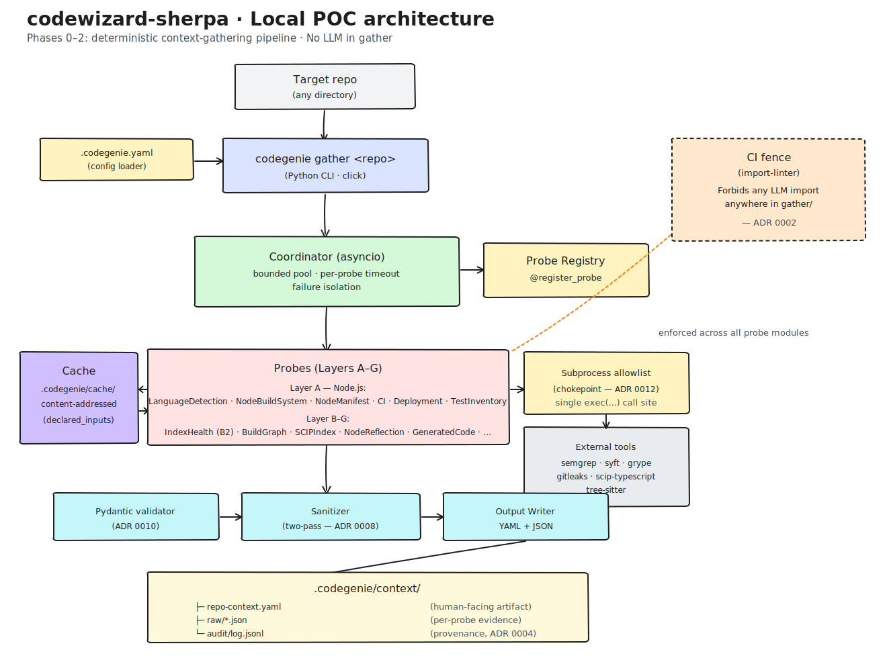
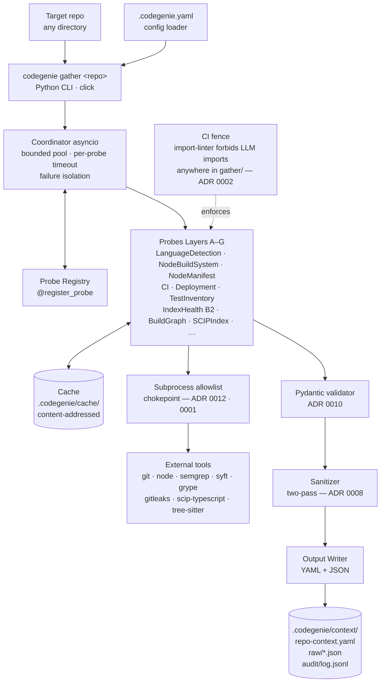

# codewizard-sherpa

> An autonomous agentic system that opens PRs to modify code across repos at portfolio scale — deterministic where it can be, probabilistic only where it must.

The work in flight is a local Python CLI (`codegenie gather`) that produces a deterministic, cacheable `RepoContext` artifact from any repo. From that bullet tracer, the system grows into a 7-stage Temporal-orchestrated service that drives vulnerability remediation, container migrations, and (eventually) agentic recipe authoring across a portfolio of repos.

**As of 2026-05:** Phase 0 (bullet-tracer foundations) is shipped. Phase 1 Step 1 (Layer A — Node primitives) is closed; Phase 1 Step 2 (`LanguageDetection` extension + `NodeBuildSystem` probe) lands the first new Phase 1 probe.

---

## Architecture (local POC)

The diagram below is the **current scope** — Phases 0–2 of the [roadmap](docs/roadmap.md): a deterministic context-gathering pipeline with no LLM anywhere in the gather path. The probe contract that ships here is the same one the production service will use, so bugs at this layer propagate.



> Source files: [`docs/architecture/local-poc.excalidraw`](docs/architecture/local-poc.excalidraw) (editable in [excalidraw.com](https://excalidraw.com)) · [`docs/architecture/local-poc.svg`](docs/architecture/local-poc.svg) (rendered above).

<details>
<summary>Mermaid version (renders inline on GitHub)</summary>



</details>

### Load-bearing commitments visible in the diagram

- **No LLM in the gather pipeline.** Enforced by `import-linter` in CI ([Phase 0 ADR 0002](docs/phases/00-bullet-tracer-foundations/ADRs/0002-fence-ci-job-no-llm-in-gather.md)), not by convention.
- **Single subprocess chokepoint.** All external tools go through one allowlisted `exec(...)` call site — no ad-hoc `subprocess.run` scattered through probes ([Phase 0 ADR 0012](docs/phases/00-bullet-tracer-foundations/ADRs/0012-subprocess-allowlist-chokepoint.md)). Phase 1 extends the allowlist to `{"git", "node"}` ([Phase 1 ADR 0001](docs/phases/01-context-gather-layer-a-node/ADRs/0001-add-node-to-allowed-binaries.md)).
- **Content-addressed cache keyed off `declared_inputs`.** Probes declare which files/resources they read; the cache key derives from that, so incremental gathers are correct by construction.
- **Two-pass sanitizer between validation and write.** Probe outputs pass Pydantic ([Phase 0 ADR 0010](docs/phases/00-bullet-tracer-foundations/ADRs/0010-pydantic-probe-output-validator.md)) then a separate sanitizer ([ADR 0008](docs/phases/00-bullet-tracer-foundations/ADRs/0008-output-sanitizer-two-pass-chokepoint.md)) before reaching disk.
- **Facts, not judgments.** Probes capture evidence (`"trace observed 0 shell invocations"`); they don't write conclusions (`"safe to migrate"`). Conclusions are the Planner's job in later phases.
- **Lifecycle events centralised.** Every `probe.*` event name lives as a `Final[str]` constant in [`src/codegenie/logging.py`](src/codegenie/logging.py); the literal-drift guard at [`tests/unit/test_no_event_literal_drift.py`](tests/unit/test_no_event_literal_drift.py) pins zero redeclarations outside that file ([Phase 1 S1-10](docs/phases/01-context-gather-layer-a-node/stories/S1-10-node-allowlist-subschema-convention.md)).

---

## Quickstart

```console
$ make bootstrap        # installs [dev] extras via uv (or pip fallback)
$ pre-commit install    # arms the local commit-time firewall (S1-04)
$ make check            # runs lint → typecheck → test → fence
$ make docs             # builds the curated mkdocs site (--strict)
```

`make bootstrap` works with or without `uv` on `$PATH`. The pre-commit hook
suite (ruff, ruff-format, mypy, gitleaks, `forbidden-patterns`, check-yaml,
check-toml, end-of-file-fixer, trailing-whitespace) is SHA-pinned and defined
in [`.pre-commit-config.yaml`](.pre-commit-config.yaml); the `forbidden-patterns`
local hook enforces ADR-0008 + ADR-0012 by regex.

### CLI surface (Phase 0 shipped)

```console
$ python -m codegenie --help
$ python -m codegenie gather ./path/to/repo
```

- `codegenie gather <path>` — vertical slice. Walks the repo, dispatches the
  registered probes (Phase 0 ships `LanguageDetectionProbe`; Phase 1 extends
  the surface), writes `.codegenie/context/repo-context.yaml` + a per-run
  audit record under `.codegenie/context/runs/`. Exit codes: `0` ok, `2` all
  probes failed, `3` schema validation failed (writes `.yaml.invalid`
  sibling), `5` symlink output refused, `6` secret-shaped field rejected.
- `codegenie audit verify --runs-dir <r> --cache-dir <c> --yaml-path <y>` —
  pure-read verifier. Recomputes per-probe blob anchors + the whole-YAML
  anchor; exit `0` clean, exit `4` mismatch.
- `codegenie cache gc` — Phase-1+ stub (logs `cache.gc.stub`, exits 0).

Global flags: `--verbose` (DEBUG events), `--version`, `--refresh-tools`
(re-detect external tools), `--no-gitignore` / `--auto-gitignore` (skip /
auto-append `.codegenie/` to `.gitignore`; mutually exclusive — combining
them exits 2 with a click usage error). On a TTY, `gather` prompts before
appending the canonical two-line block
(`# codewizard-sherpa generated artifacts; safe to delete\n.codegenie/\n`);
on non-TTY (CI) the append is skipped with a structured warning. A
`.gitignore` that already contains a line matching `^\.codegenie/?\s*$` is
detected as idempotent and never rewritten (mtime preserved).

---

## CI pipeline

Every PR runs through six SHA-pinned jobs across Python 3.11 / 3.12 ×
`ubuntu-24.04`:

| Job | What it runs | Why it's load-bearing |
|---|---|---|
| `lint` | `make lint` (ruff) + `make lint-imports` (import-linter) | Structural cold-start defense — blocks heavy modules from `codegenie.cli` and `codegenie/__init__.py` |
| `typecheck` | `make typecheck` (mypy `--strict`) | Catches narrowed-type drift early |
| `test` | `pytest -q` (default excludes `-m bench`) + `bench-collection-guard` (asserts exactly 3 bench tests) + advisory `bench` step (uploads `bench-results.json`) | Full suite + advisory perf canaries |
| `security` | `pip-audit` + `osv-scanner` against `uv.lock` | Supply-chain advisories; HIGH/CRITICAL fails the job |
| `docs` | `mkdocs build --strict` (path-filtered on `docs/**` + `mkdocs.yml`) | Docs gate |
| `fence` | `pytest -q tests/unit/test_pyproject_fence.py` after a two-step bare install | **Load-bearing ADR-0002 gate** — refuses any LLM SDK in the gather-pipeline runtime closure |

Workflow files: [`.github/workflows/ci.yml`](.github/workflows/ci.yml) (five
jobs), [`.github/workflows/docs.yml`](.github/workflows/docs.yml) (the
sixth, path-filtered to honor the ≤90s walltime advisory). All third-party
actions are pinned by 40-character SHA; concurrency is grouped by
`${{ github.ref }}` with `cancel-in-progress: true`.

---

## Project status

**Design pipeline (as of 2026-05):** phases 0–7 are fully designed end-to-end; phases 8–16 are roadmap stubs.
**Implementation:** Phase 0 shipped; Phase 1 Step 1 (Node primitives) closed; Step 2+ in progress.

| # | Phase | Design | Implementation | Stories |
|---|---|---|---|---|
| 0 | Bullet tracer + project foundations | ✅ | ✅ Done | [23 stories](docs/phases/00-bullet-tracer-foundations/stories/) |
| 1 | Context gathering — Layer A (Node.js) | ✅ | 🚧 Step 1 closed (S1-01 → S1-10 done) | [33 stories](docs/phases/01-context-gather-layer-a-node/stories/) |
| 2 | Context gathering — Layers B–G | ✅ | — | [51 stories](docs/phases/02-context-gather-layers-b-g/stories/) |
| 3 | Vuln remediation — deterministic recipe path | ✅ | — | [45 stories](docs/phases/03-vuln-deterministic-recipe/stories/) |
| 4 | Vuln remediation — LLM fallback + solved-example RAG | ✅ | — | [39 stories](docs/phases/04-vuln-llm-fallback-rag/stories/) |
| 5 | Sandbox + Trust-Aware gates | ✅ | — | [40 stories](docs/phases/05-sandbox-trust-gates/stories/) |
| 6 | SHERPA-style state machine for the vuln loop | ✅ | — | [42 stories](docs/phases/06-sherpa-state-machine/stories/) |
| 6.5 | Per-task-class eval harness + first benches | ✅ | — | [36 stories](docs/phases/06.5-per-task-class-eval-harness/stories/) |
| 7 | Add migration task class (Chainguard distroless) | ✅ | — | [54 stories](docs/phases/07-migration-task-class/stories/) |
| 8–16 | Planner, Temporal, Discovery/Assessment, Handoff/Learning, AgentOps, continuous gather, agentic recipe authoring, hardening | Roadmap only | — | — |

See [`docs/roadmap.md`](docs/roadmap.md) for phase scope and exit criteria.

---

## Reading order for the design docs

Not all docs are equal. Read in this order and skip the redundant ones:

1. **[`docs/production/`](docs/production/)** — canonical production-target reference. Start at [`README.md`](docs/production/README.md), then [`design.md`](docs/production/design.md) (Layered Hybrid Architecture: Temporal envelope → Hierarchical Planner → SHERPA state machine → Trust-Aware gates → leaf LLMs). The numbered [ADRs](docs/production/adrs/) carry the *why* behind every architectural commitment.
2. **[`docs/localv2.md`](docs/localv2.md)** — canonical local POC spec. Defines the CLI, probe contract, probe inventory (Layers A–G), `RepoContext` schema, caching, tool dependencies (§6), and config (§13).
3. **[`docs/context.md`](docs/context.md)** — service-shaped design for the gather layer (MCP query interface, cross-repo SCIP detail).
4. **[`docs/auto-agent-design.md`](docs/auto-agent-design.md)** — original 7-stage service writeup (Konveyor Kai prior art, recipe-first/LLM-fallback planning, Temporal rationale).
5. **[`docs/gemini-auto-agent-design.md`](docs/gemini-auto-agent-design.md)** — alternate take with AgentOps depth, deterministic policy engines, LST/AST manipulation, "Safer Builders, Risky Maintainers" empirical findings. Background, not source of truth.
6. **[`docs/local.md`](docs/local.md)** — superseded by `localv2.md`. Skip unless diffing v1 vs v2.

### Phase design artifacts

Each numbered phase under [`docs/phases/NN-<slug>/`](docs/phases/) contains, in reading order:

| File | What it is |
|---|---|
| `README.md` | Phase index. Links artifacts and back to the roadmap. |
| `design-{performance,security,best-practices}.md` | Three competing single-lens drafts (audit, not execution). |
| `critique.md` | Devil's-advocate critique of the three drafts. |
| **`final-design.md`** | **Design of record.** Synthesis with provenance ledger. Link here when referencing the phase. |
| `phase-arch-design.md` | 4+1 architectural views (Mermaid), testing strategy, edge cases, gap analysis. |
| `ADRs/` | Nygard-style ADRs for decisions narrower than the phase. |
| `High-level-impl.md` | Ordered step-by-step implementation roadmap (4–6 sprints). |
| `stories/` | Autonomous-AI-agent-executable stories (`S<sprint>-<n>-<slug>.md`) with red-green-refactor TDD plans. |
| `stories/_attempts/` | Append-only per-story attempt logs + cross-story `_lessons.md`. |
| `stories/_validation/` | `phase-story-validator` reports for hardened stories. |

---

## Workflow skills

Five skills under [`.claude/skills/`](.claude/skills/) form the official pipeline for taking a roadmap phase from idea to implemented code. Each downstream skill consumes the upstream's outputs verbatim — don't skip stages or write the artifacts by hand.

| Skill | Input | Output | Invocation |
|---|---|---|---|
| `roadmap-phase-designer` | Phase number from roadmap | `design-{performance,security,best-practices}.md` + `critique.md` + `final-design.md` | "design phase N" |
| `phase-architect` | `final-design.md` | `phase-arch-design.md` + per-phase `ADRs/` + `High-level-impl.md` | "architect phase N" |
| `phase-story-writer` | `High-level-impl.md` + arch + ADRs | `stories/` backlog | "create stories for phase N" |
| `phase-story-validator` | One story file | Hardened story (edited in place) + `_validation/<story>.md` report | "validate / harden / audit story X" |
| `phase-story-executor` | One hardened story file | Code + tests on disk, attempt log under `_attempts/` | "implement S1-01" |

---

## Conventions to follow when writing the POC

- Single Python project, no services, no databases. Filesystem-backed everything.
- YAML for the human-facing artifact (`repo-context.yaml`), JSON for raw probe outputs under `.codegenie/context/raw/`.
- Probes register via `@register_probe` so adding one never edits a central list.
- Each probe declares `declared_inputs`, `applies_to_tasks`, and `applies_to_languages` (`["*"]` means "all").
- `.codegenie/` is the on-disk output namespace inside any analyzed repo. The tool offers to add it to that repo's `.gitignore` on first run.
- Subprocess calls go through one allowlist chokepoint ([Phase 0 ADR 0012](docs/phases/00-bullet-tracer-foundations/ADRs/0012-subprocess-allowlist-chokepoint.md)). No ad-hoc `subprocess.run`. The allowlist is closed against unreviewed additions; new entries land via a phase-level ADR (Phase 1 added `node` via [ADR 0001](docs/phases/01-context-gather-layer-a-node/ADRs/0001-add-node-to-allowed-binaries.md)).
- The "no LLM in gather" rule is enforced by `import-linter` in CI ([Phase 0 ADR 0002](docs/phases/00-bullet-tracer-foundations/ADRs/0002-fence-ci-job-no-llm-in-gather.md)), not just by convention.
- Probe outputs are validated by Pydantic before they reach the writer ([Phase 0 ADR 0010](docs/phases/00-bullet-tracer-foundations/ADRs/0010-pydantic-probe-output-validator.md)). The sanitizer is a separate two-pass chokepoint ([ADR 0008](docs/phases/00-bullet-tracer-foundations/ADRs/0008-output-sanitizer-two-pass-chokepoint.md)).
- Lifecycle event names are `Final[str]` constants in [`src/codegenie/logging.py`](src/codegenie/logging.py) — never inline literals. The literal-drift guard in [`tests/unit/test_no_event_literal_drift.py`](tests/unit/test_no_event_literal_drift.py) pins this.

## Working with the design docs

- **Linking convention:** when referencing a phase's design, link to `final-design.md`, never to the per-lens drafts or the critique. Those are audit artifacts.
- **ADR scope:** [`docs/production/adrs/`](docs/production/adrs/) is org-wide ("no LLM in gather", "Temporal as workflow substrate", "humans always merge"). Per-phase `ADRs/` are narrower (cache content-hash algorithm, `pyproject.toml` extras shape). When in doubt: would another phase need to override this? If yes, it's per-phase.
- **Don't write design docs by hand** when a skill exists. Invoke `roadmap-phase-designer`, `phase-architect`, `phase-story-writer`, `phase-story-validator`, or `phase-story-executor` — they produce the canonical artifact layout and run the multi-agent review.

---

## Contributing

See [`CONTRIBUTING.md`](CONTRIBUTING.md) for the story → RED → GREEN → sweep → attempt-log workflow, the pre-commit hook stack, and how to add a probe.

---

## Repository layout

```
codewizard-sherpa/
├── CLAUDE.md                          # AI-assistant guidance (read first if you're an LLM)
├── CONTRIBUTING.md                    # How to contribute (story workflow, pre-commit, probes)
├── README.md                          # ← you are here
├── Makefile                           # bootstrap / lint / typecheck / test / fence / docs
├── pyproject.toml                     # uv-managed deps + tool config
├── mkdocs.yml                         # curated docs site
├── .pre-commit-config.yaml            # SHA-pinned hooks (ruff/mypy/gitleaks/forbidden-patterns/…)
├── .github/workflows/                 # ci.yml (5 jobs) + docs.yml (path-filtered)
├── .claude/skills/                    # Workflow skills (5)
│   ├── roadmap-phase-designer/
│   ├── phase-architect/
│   ├── phase-story-writer/
│   ├── phase-story-validator/
│   └── phase-story-executor/
├── src/codegenie/                     # CLI + probe contract + coordinator + cache + sanitizer
│   ├── cli.py · exec.py · logging.py · errors.py
│   ├── parsers/ (safe_json · safe_yaml · jsonc · _io · _depth)
│   ├── coordinator/ (parsed_manifest_memo · input_snapshot · raw_artifact_budget)
│   ├── catalogs/ (native_modules · ci_providers)
│   ├── schema/probes/ (per-probe JSON Schema + _subschema_convention.md)
│   └── probes/, cache/, config/, output/
├── tests/                             # unit · adv · bench · integration
└── docs/
    ├── architecture/                  # Diagrams (Excalidraw + SVG)
    │   ├── local-poc.excalidraw
    │   └── local-poc.svg
    ├── roadmap.md                     # 17-phase plan (0–16)
    ├── localv2.md                     # Canonical local POC spec
    ├── context.md · auto-agent-design.md · gemini-auto-agent-design.md
    ├── local.md                       # Superseded by localv2.md
    ├── production/                    # Canonical production-target reference
    │   ├── README.md · design.md
    │   └── adrs/                      # Org-wide ADRs
    └── phases/                        # Per-phase design pipeline output
        ├── 00-bullet-tracer-foundations/
        ├── 01-context-gather-layer-a-node/
        ├── 02-context-gather-layers-b-g/
        ├── 03-vuln-deterministic-recipe/
        ├── 04-vuln-llm-fallback-rag/
        ├── 05-sandbox-trust-gates/
        ├── 06-sherpa-state-machine/
        ├── 06.5-per-task-class-eval-harness/
        └── 07-migration-task-class/
```

---

## License

Not yet licensed. Adding a license is a Phase 0 / Phase 16 housekeeping item; until then the work is unlicensed source-available within this repository.
