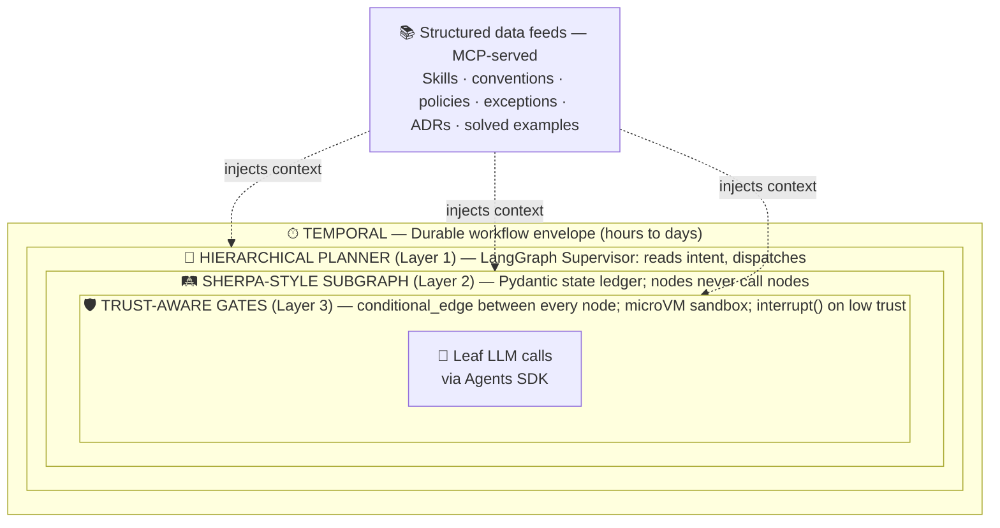
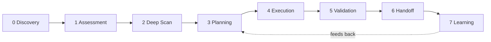

# Architecture

A layered tour of how codewizard-sherpa is built. Start with the one-paragraph framing below. Each layer links deeper — read as much or as little as you need.

!!! tip "Three depths of reading"
    - **5 minutes** — read this page only.
    - **30 minutes** — read this page + the [Production design](production/design.md) §1–§3.
    - **A few hours** — add the [ADR index](production/adrs/README.md) and one or two phase [final-designs](roadmap.md).

## In one paragraph

codewizard-sherpa is a **Temporal-durable workflow envelope** wrapping a **Layered Hybrid Orchestrator** with **structured-data-driven domain knowledge** feeding it. A Temporal workflow owns end-to-end durability. Inside, a LangGraph Supervisor (Layer 1 — *Hierarchical Planner*) dispatches into one of several SHERPA-disciplined subgraphs (Layer 2 — *State Machine*). Every transition between nodes in a subgraph passes through a Trust-Aware guard (Layer 3 — *Microvm sandbox + objective signals*) that decides advance / retry / interrupt-for-human. The LLM appears only at the leaves, called via the Agents SDK for judgment calls. The orchestration, gating, and control flow are deterministic at every level.

## The hero diagram

**LangGraph is the runtime engine. SHERPA is the architectural discipline. Trust-Aware is the safety layer. Temporal wraps everything** with the durable-execution properties needed for workflows that span hours of LLM work and days of human review.

## The 7-stage pipeline

Every per-repo migration workflow flows through seven stages. Each stage is a Temporal Activity or child workflow:

| Stage | What happens | LLM involved? |
|---|---|---|
| **0 Discovery** | Scheduled scan of the org's repos; lists candidates | No |
| **1 Assessment** | Classify the repo as Cat 1 / 2 / 3 with cited evidence | Sometimes |
| **2 Deep Scan** | Probe Coordinator dispatches Layers A–G; emits `RepoContext` | **No** ([ADR-0005](production/adrs/0005-no-llm-in-gather-pipeline.md)) |
| **3 Planning** | Recipe-first → RAG → LLM-fallback ([ADR-0011](production/adrs/0011-recipe-first-rag-llm-fallback-planning.md)) | Sometimes |
| **4 Execution** | Apply steps inside a microVM; commit atomically per step | Sometimes |
| **5 Validation** | Build, test, SAST, CVE delta, Prove-It assertions | LLM judge only on disagreement |
| **6 Handoff** | Open the PR with full evidence; wait for human review | No |
| **7 Learning** | Record solved examples into the Knowledge Graph | No |

The shape itself is load-bearing — see [ADR-0010](production/adrs/0010-seven-stage-pipeline-shape.md).

## What's running locally today (the POC)

The repository currently implements only the **gather layer** — Stage 2 in the diagram above. It's a Python CLI (`codegenie gather`) that probes any directory and writes a structured `RepoContext`. No Temporal, no Planner, no LangGraph yet.

The probe contract that ships in the POC is **identical** to the one the production service will use ([ADR-0007](production/adrs/0007-probe-contract-preserved-poc-to-service.md)) — drift here would propagate everywhere. Bugs at this layer are foundational.

## Load-bearing architectural commitments

Nine constraints that every subsystem must honor. Proposed changes that violate one require explicit justification and an update to [`docs/production/design.md` §2](production/design.md).

1. **No LLM in the gather pipeline.** Anywhere. Probes are deterministic; same inputs always produce same outputs.
2. **Facts, not judgments.** Gatherer captures evidence ("trace observed 0 shell invocations"); never writes conclusions ("safe to migrate"). Conclusions are the Planner's job.
3. **Honest confidence.** Every probe and every state node reports confidence + provenance. Silent staleness is the worst failure mode.
4. **Determinism over probabilism for structural changes.** AI agents are "safer builders, risky maintainers" — use recipes for refactors; reserve LLMs for judgment calls.
5. **Extension by addition.** New language / task / tool = new probes + new Skills + new subgraphs, never edits to existing ones.
6. **Organizational uniqueness as data, not prompts.** Skills, conventions, policies, exceptions all live as structured data the agent queries.
7. **Progressive disclosure.** `RepoContext` indexes evidence; doesn't inline it. Agents read originals at decision time via MCP.
8. **Humans always merge.** Autonomy ends at PR creation.
9. **Cost is observable end-to-end and bounded per workflow.** Every LLM call, sandbox run, probe execution, reviewer-hour is measured and attributed.

These are summaries; the full text with rationale and per-commitment ADRs lives in [`docs/production/design.md` §2](production/design.md).

## Drill down

| If you want to understand… | Read this |
|---|---|
| The full production architecture, every layer, every persona | [Production design](production/design.md) (long; the canonical reference) |
| The **why** behind every architectural decision | [ADR index](production/adrs/README.md) (36 numbered records) |
| How the design will land, phase by phase | [Roadmap](roadmap.md) (17 phases) |
| The deep design of a specific phase | The phase's `final-design.md` (linked from the [Roadmap](roadmap.md)) |
| The 4+1 architectural views of a phase | The phase's `phase-arch-design.md` |
| The CLI surface and how to run it today | [Get started](get-started.md) |

## Architectural views (4+1)

The production design carries the full Kruchten 4+1 set: Logical, Process, Development, Physical, Scenarios (+1) views. Each is a Mermaid diagram with prose around it. See [Production design §8](production/design.md) for:

- **§8.1 Logical view** — components and their relationships
- **§8.2 Process view** — runtime behavior and concurrency
- **§8.3 Development view** — code organization
- **§8.4 Physical view** — deployment topology
- **§8.5 Scenarios** — vulnerability and migration walkthroughs
- **§8.6 Persona view** — who fires when (swimlane)
- **§8.7 Component view** — boundaries and what's swappable
- **§8.8 Worker subgraph state machine** — Migration Subgraph example
- **§8.9 Trust-Aware gate decision flow** — how every transition resolves
- **§8.10 Cost view** — where money is spent and where ROI is measured

## Plugins: granular units of work

A plugin is a unit of `(task × language × build-tool)` work — e.g. `vulnerability-remediation--node--npm`. Each plugin bundles its own subgraph, TCCM, probes, Skills, recipes, and language search adapters. Adding a new language or task class is **one new plugin directory**, never an edit to existing code. The extension-by-addition test for the whole architecture lives in plugins.

See [ADR-0031](production/adrs/0031-plugin-architecture.md) for the full plugin model and [Production design §4.8](production/design.md) for the wiring.

## What's next on the architecture roadmap

The most recent architectural additions (May 2026):

- **Phase 13.5 — Operator portal** (read-only views + plugin/task kill-switches). See [ADR-0035](production/adrs/0035-operator-portal-architecture.md) and [ADR-0036](production/adrs/0036-plugin-task-enablement-dual-source-policy.md).
- **Phase 02 IndexHealthProbe** (B2) — the single most important probe in the gather layer; catches silent index staleness ([Phase 02 ADR-0006](phases/02-context-gather-layers-b-g/ADRs/0006-index-freshness-sum-type-location.md)).
- **ADR-0033 Domain modeling discipline** — newtype + smart constructor + sum type + illegal-states-unrepresentable applied across new code from May 2026 forward.
- **ADR-0034 Event sourcing as canonical primitive** — one typed event log, every concern is a projection.
