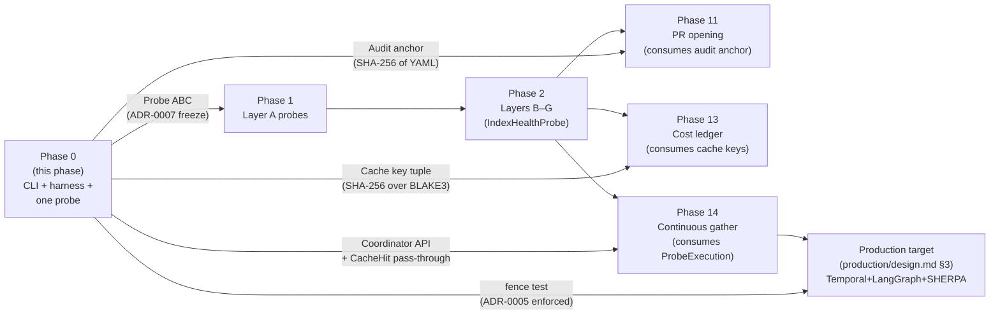
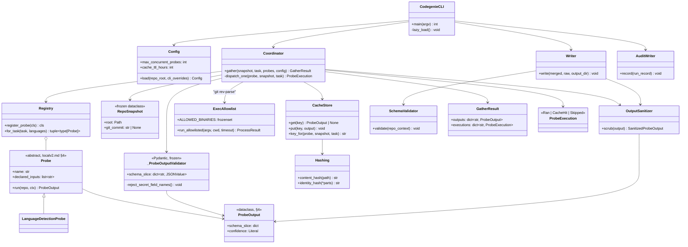
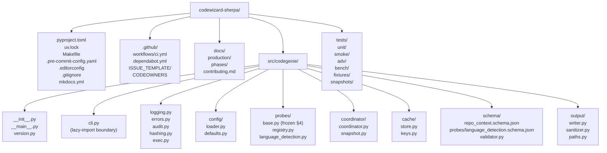
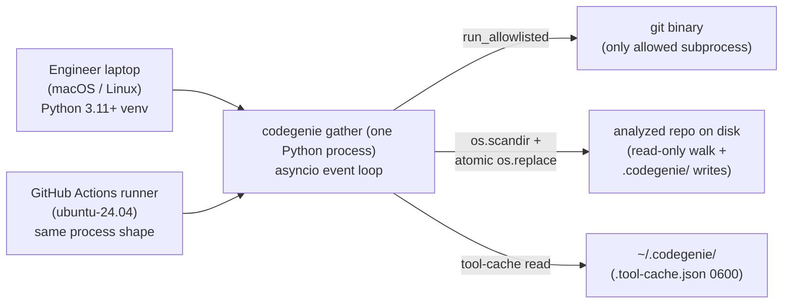
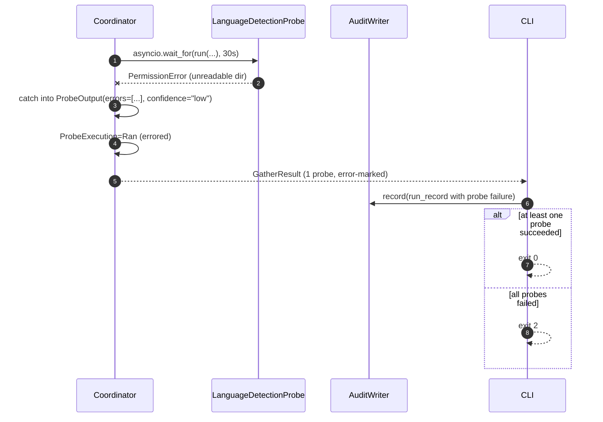

# Phase 00 — Bullet tracer + project foundations: Architecture

**Status:** Architecture spec
**Date:** 2026-05-11
**Inputs:** [`final-design.md`](final-design.md) (synthesized design of record) · [`critique.md`](critique.md) · [`design-performance.md`](design-performance.md) · [`design-security.md`](design-security.md) · [`design-best-practices.md`](design-best-practices.md) · [`../../production/design.md`](../../production/design.md) · [`../../production/adrs/`](../../production/adrs/) · [`../../localv2.md`](../../localv2.md) · [`../../roadmap.md`](../../roadmap.md) · [`../../../CLAUDE.md`](../../../CLAUDE.md)
**Audience:** the engineer implementing this phase

---

## Executive summary

Phase 0 ships **four artifacts and the conventions every later phase will inherit**: a `codegenie gather <path>` CLI, a six-job CI pipeline, a curated `mkdocs build --strict` site, and one trivial probe (`LanguageDetectionProbe`) routed through the *real* coordinator, cache, schema validator, sanitizer, and audit writer that Phase 1–14 will load into without renaming a file. The two architectural moves that carry this phase are (1) **a single probe-output trust boundary** — Pydantic v2 `_ProbeOutputValidator` over the `localv2.md §4` dataclass `ProbeOutput`, with recursive `JSONValue` typing and a field-name regex — sitting between every probe and every persisted byte; and (2) **a `fence` CI job** that asserts the wheel's runtime dependency closure contains no LLM SDK, encoding `production/design.md §2.1` (No LLM in gather) as an executable test from day one. The hash story is the synthesizer's compromise on the most consequential cross-lens conflict (`critique.md §5`): **BLAKE3 for content addressing, SHA-256 for the identity tuple and the audit anchor**, both routed through `codegenie/hashing.py` as the single source of truth. This doc elaborates the synthesized design into concrete component interfaces, data contracts, edge-case behavior, a test pyramid, and a gap analysis of three under-specifications the synthesis carries into implementation.

## Goals

Each is verifiable. Pulled from `roadmap.md` Phase 0 exit criteria and `final-design.md §11`, refined for engineering precision.

1. **`codegenie gather <path>` runs end-to-end** on (a) an empty directory, (b) a JS-only fixture, (c) a polyglot fixture — exit 0 in all three cases; writes `.codegenie/context/repo-context.yaml`, `schema-version.txt`, `raw/`, and `runs/<utc-iso>-<short>.json`. Verified by `tests/smoke/test_cli_end_to_end.py`.
2. **The probe contract from `localv2.md §4` is byte-for-byte preserved** at `src/codegenie/probes/base.py` and pinned by a snapshot test (`tests/snapshots/probe_contract.v1.json`) whose fingerprint references the §4 body at Phase 0 close. Drift fails CI and is resolved only by ADR amendment (ADR-0007 enforcement loop).
3. **`LanguageDetectionProbe` executes through the real coordinator** (`asyncio.Semaphore`-bounded, `asyncio.wait_for` per-probe timeout, failure-isolated), real cache (BLAKE3 over declared inputs, SHA-256 over identity tuple), real schema validator (Draft 2020-12, layered `additionalProperties`), real `_ProbeOutputValidator`, real `OutputSanitizer`, real `AuditWriter`. The Phase 0 dispatch path is identical to the Phase 1 path; only the probe set differs.
4. **Cache hits on a non-empty fixture's second run.** `tests/smoke/test_cli_end_to_end.py::test_cache_hit_on_second_run` asserts the coordinator's `ProbeExecution` dict reports `CacheHit` for `language_detection` and the filesystem walker is never re-entered (verified by `monkeypatch` over `os.scandir`).
5. **Six CI jobs green on `main`** (`lint`, `typecheck`, `test`, `security`, `docs`, `fence`) on `python: ["3.11", "3.12"]` × `os: [ubuntu-24.04]`.
6. **`mkdocs build --strict` over a *curated* `nav`** is green; `docs/local.md`, `docs/auto-agent-design.md`, `docs/gemini-auto-agent-design.md`, `docs/context.md`, and `docs/localv2.md` are excluded from `nav` with comments referencing `final-design.md §2.2` and `§5`. Cleanup is filed as a Phase 1 issue.
7. **The `fence` job blocks LLM SDKs from `dependencies`.** `tests/unit/test_pyproject_fence.py` asserts `set(distribution("codewizard-sherpa").requires) ∩ {"anthropic", "langgraph", "openai", "langchain", "transformers"}` is empty *and* includes a deliberate-negative test that planting `anthropic` in a synthetic `pyproject.toml` makes the assertion fail.
8. **Coverage ≥ 85% line / ≥ 75% branch** on `src/codegenie/` excluding `cli.py`. Enforced via `--cov-fail-under=85`.
9. **`codegenie audit verify` over the smoke run-record reports zero mismatches.** The audit anchor (SHA-256 of the final YAML) re-computes deterministically.
10. **`.gitignore` mutation path is exercised** for both the TTY-accept and non-TTY-skip branches (`tests/unit/test_gitignore_mutation.py`).

## Non-goals

What this phase deliberately does **not** do. Each is annotated with why and where it lands.

1. **No real Layer A probes beyond `LanguageDetectionProbe`** — `NodeBuildSystem`, `NodeManifest`, `CI`, `Deployment`, `TestInventory` land in Phase 1 (`roadmap.md` §"Phase 1"). Adding them now violates `final-design.md §0` posture.
2. **No `tree-sitter` invocation in `LanguageDetectionProbe`** — extension-counting only in Phase 0; tree-sitter for ambiguous cases is `localv2.md §5.1 A1` and lifts in Phase 1's real A1 probe (`final-design.md §2.10`).
3. **No Dockerfile detection** — Phase 7's task class (`roadmap.md` §"Phase 7"). Recognizing it in Phase 0 violates the same scope rule the design enforces on Layers B–G (critique §3.1.3, addressed by `final-design.md §2.10`).
4. **No HMAC-signed cache index** — deferred to Phase 14 when continuous webhook-driven gather introduces the actual multi-actor threat model (`final-design.md §2.7`, critique §2.1.1). Phase 0 has no articulable threat that HMAC closes.
5. **No `gitleaks` in the synchronous write path** — pre-commit and CI only. Synchronous gitleaks breaks the continuous-gather cost model `production/design.md §3.2` depends on (`final-design.md §2.8`, critique §2.1.2).
6. **No `unshare -n` / netns-isolated CI job** — Linux-only; `localv2.md` supports macOS dev. The "zero outbound network" property is enforced *structurally* in Phase 0 (no `httpx`/`requests`/`socket`/`urllib3` imports in `src/codegenie/`, enforced by `import-linter` + an AST scan test). Network-isolation jobs land in Phase 14 with the webhook listener (`final-design.md §3.2`).
7. **No reproducibility CI check** — pure-Python `hatchling` wheel has no non-determinism in Phase 0. Phase 1 adds the check when probe outputs (SCIP, runtime traces) become reproducible-vs-not (`final-design.md §3.2`).
8. **No `pytest-xdist`** — premature parallelism with 5 tests is risk without value (critique §1.1.4, conflict-resolution row 3). Enable when there's actual concurrency value.
9. **No `mmap` of the cache index** — racy under concurrent CLI invocations (critique §1.2.1); index stays single-digit MB through Phase 13 (`final-design.md §2.7`).
10. **No `fastjsonschema`** — runtime `exec`'d Python on a persistence path is a supply-chain surface; perf delta invisible at Phase 0 scale (critique §1.1.3, `final-design.md §2.9`).
11. **No `aiofiles` dependency** — listed in `roadmap.md` §"Phase 0" but no code path uses it. Treated as a roadmap documentation bug; add when an async file-reading probe needs it (`final-design.md §2.2`, critique §7.4).
12. **No CLI cold-start canary as a hard gate** — structurally flaky on GHA shared runners (critique §1.1.2). Advisory PR comment; the *structural* defense is `import-linter` blocking heavy modules from `cli.py` and `__init__.py` (`final-design.md §2.11`).
13. **No external plugin discovery** — no `importlib.metadata` entry-point scan; probes register via explicit imports in `src/codegenie/probes/__init__.py` (perf + supply-chain, both lenses agree).
14. **No Windows, no macOS in the CI matrix** — `ubuntu-24.04` only. `localv2.md §1` plus contributor pool say macOS dev / Linux CI.
15. **No `CHANGELOG.md` / `CODE_OF_CONDUCT.md` / `ARCHITECTURE.md`** — no release surface; the production design docs *are* the architecture doc (`design-best-practices.md §7`, anti-additions).

## Architectural context

Phase 0 is the entry point of `localv2.md` and the deterministic floor of the production architecture in `production/design.md`. It instantiates the gather layer's coordinator and cache contracts that ADR-0007 commits to preserving from POC to service, with the structural guarantee from ADR-0005 (no LLM in gather) enforced as a CI test. Every other phase reads through the seams this phase plants.



The boxes marked from `P0` are concrete contracts; every dashed-arrow consumer in later phases relies on a seam this phase establishes. Failure to plant any one of them correctly is a propagating wound (`final-design.md §0`).

## 4+1 architectural views

Following `production/design.md §8` conventions. Each view is rendered in Mermaid; minimal views state explicitly why they are minimal.

### Logical view — what are the components and how are they related?



**Central abstractions:** `Probe` (the ABC from `localv2.md §4`), `Coordinator`, `CacheStore`, `OutputSanitizer`, `_ProbeOutputValidator`. These are the seams every later phase composes against. `Hashing`, `ExecAllowlist`, `AuditWriter`, `Writer`, `SchemaValidator`, `Registry`, `Config` are chokepoint singletons — one module, one public API, one test file each (`final-design.md §1`). `LanguageDetectionProbe` is scaffolding — Phase 1 replaces it with a richer A1.

### Process view — what happens at runtime?

```mermaid
sequenceDiagram
  autonumber
  actor User
  participant CLI as codegenie.cli
  participant Cfg as Config
  participant Snap as RepoSnapshot
  participant Reg as Registry
  participant Co as Coordinator
  participant Cache as CacheStore
  participant Probe as LanguageDetectionProbe
  participant Val as _ProbeOutputValidator
  participant San as OutputSanitizer
  participant Sch as SchemaValidator
  participant W as Writer
  participant Aud as AuditWriter

  User->>CLI: codegenie gather /repo
  CLI->>CLI: lazy-import heavy modules
  CLI->>CLI: Path.resolve(strict=True)
  CLI->>CLI: tool-readiness (git only)
  CLI->>CLI: maybe prompt .gitignore (TTY)
  CLI->>Cfg: load(repo_root, cli_overrides)
  Cfg-->>CLI: Config (frozen)
  CLI->>Snap: construct via exec.run_allowlisted("git","rev-parse","HEAD")
  Snap-->>CLI: RepoSnapshot (frozen)
  CLI->>Reg: for_task("__bullet_tracer__", {"unknown"})
  Reg-->>CLI: [LanguageDetectionProbe]
  CLI->>Co: gather(snapshot, task, [probe], config)

  Co->>Co: Semaphore(min(cpu_count, 8))
  par per-probe (1 in Phase 0)
    Co->>Cache: key_for(probe, snapshot, task)
    Cache->>Cache: identity_hash(name, ver, schema_ver, content_hash(inputs))
    Cache-->>Co: key
    Co->>Cache: get(key)
    alt cache hit
      Cache-->>Co: ProbeOutput (cached)
      Co->>Co: ProbeExecution=CacheHit
    else miss
      Cache-->>Co: None
      Co->>Probe: asyncio.wait_for(run(snapshot, ctx), timeout)
      Probe->>Probe: os.scandir walk
      Probe-->>Co: ProbeOutput
      Co->>Val: validate(output)
      Val-->>Co: ok (or SecretLikelyFieldNameError)
      Co->>San: scrub(output)
      San-->>Co: SanitizedProbeOutput
      Co->>Cache: put(key, sanitized)
      Co->>Co: ProbeExecution=Ran
    end
  end
  Co-->>CLI: GatherResult(outputs, executions)

  CLI->>CLI: merge schema_slices (shallow dict.update)
  CLI->>Sch: validate(envelope)
  Sch-->>CLI: ok (or exit 3 with .invalid suffix)
  CLI->>W: write(envelope, raw_artifacts, output_dir)
  W->>W: atomic os.replace; 0600
  CLI->>Aud: record(run_record with SHA-256 of YAML)
  Aud-->>CLI: ok
  CLI-->>User: exit 0
```

**Concurrency** is at step 8 (per-probe parallel `par`) — one `asyncio.Task` per probe, `Semaphore`-bounded, `asyncio.wait_for` per-probe timeout. **Blocking** is at the `os.scandir` walk inside the probe and the `git rev-parse` subprocess in step 4. **Durable checkpoints** are at the cache `put` (step 14), the atomic `os.replace` of `repo-context.yaml` (step 17), and the audit-record write (step 18). Phase 0 dispatches one probe through the path Phase 1 dispatches six through; the `par` block is the production interface.

### Development view — how is the source code organized?



**Stable contracts** (cannot change without ADR amendment): `probes/base.py` (ADR-0007 frozen), `schema/repo_context.schema.json` envelope + per-probe sub-schemas (ADR-0007), `exec.py:ALLOWED_BINARIES` and `run_allowlisted` signature, `output/sanitizer.py:scrub` two-pass contract, `hashing.py` exported function names, `cache/store.py` `get/put/key_for` triad, `coordinator/coordinator.py` `GatherResult` and `ProbeExecution` shape (`final-design.md §12`).

**Internal helpers** (free to change): `output/paths.py`, `config/defaults.py` (fields are additive, not contracted), `coordinator/snapshot.py` implementation, `logging.py` formatter details (event *names* are contract — `final-design.md §2.14`).

**Public interface** lives in `cli.py` (the entry point), `probes/base.py` (the ABC), and the JSON Schema at `schema/repo_context.schema.json`. Everything else is private to the package.

### Physical view — where does this code run?

**This view is minimal for Phase 0** because there is no deployment yet: one Python process on an engineer's laptop, reading and writing a single repo's filesystem. The full physical view (`production/design.md §8.4`) lands progressively: Phase 9 (Temporal) introduces a Postgres + worker-pool topology; Phase 14 (Continuous Gather) introduces webhook listeners and MCP servers; Phase 16 (production hardening) introduces multi-tenancy. Phase 0's physical surface is one box.



The only difference between the developer box and the CI runner is the `actions/cache` restore path, which re-applies `0755` on `.codegenie/`-equivalent caches; the Writer re-applies `0600`/`0700` post-restore (`final-design.md §2.8`, addresses critique §6.4).

### Scenarios — does it work for the cases that matter?

Four scenarios: two happy paths, one cache-hit path (the bullet tracer's load-bearing exit criterion), one failure path. The full data flow is in `final-design.md §6`; these scenarios elaborate the seams that matter.

#### Scenario 1: Cold gather over a JS fixture (happy path)

```mermaid
sequenceDiagram
  autonumber
  actor Dev
  participant CLI as codegenie gather
  participant Co as Coordinator
  participant Pr as LanguageDetectionProbe
  participant Cache
  participant W as Writer + Sanitizer
  participant Aud as AuditWriter

  Dev->>CLI: codegenie gather ./fixtures/js_only
  CLI->>CLI: resolve path; git rev-parse HEAD
  CLI->>Co: gather(snapshot, task, [probe])
  Co->>Cache: get(key)
  Cache-->>Co: None (cold)
  Co->>Pr: run(snapshot, ctx)
  Pr->>Pr: os.scandir walk; count .js,.mjs,.cjs
  Pr-->>Co: ProbeOutput(schema_slice={language_stack:{...}})
  Co->>Co: _ProbeOutputValidator(output)
  Co->>W: sanitize + cache.put
  Co-->>CLI: GatherResult
  CLI->>W: write repo-context.yaml.tmp + raw/
  W->>W: os.replace; chmod 0600
  CLI->>Aud: record(run with SHA-256 of YAML)
  CLI-->>Dev: exit 0; "language_stack.javascript: N"
```

#### Scenario 2: Warm gather (cache hit, the bullet tracer's load-bearing exit)

```mermaid
sequenceDiagram
  autonumber
  actor Dev
  participant CLI as codegenie gather
  participant Co as Coordinator
  participant Cache
  participant Pr as LanguageDetectionProbe

  Note over Dev: Second invocation;<br/>no file changed.
  Dev->>CLI: codegenie gather ./fixtures/js_only
  CLI->>Co: gather(...)
  Co->>Cache: key_for → identity_hash(...,<br/>content_hash(declared_inputs))
  Cache-->>Co: hit; ProbeOutput (loaded from blob)
  Co->>Co: ProbeExecution=CacheHit(key)
  Note over Pr: run() never invoked.<br/>os.scandir never invoked<br/>(asserted in test via monkeypatch).
  Co-->>CLI: GatherResult; structured event probe.cache_hit
  CLI-->>Dev: exit 0; gather time ~30–80ms
```

The structural property tested: `LanguageDetectionProbe.declared_inputs` is the language-extension glob list (`final-design.md §2.10`, not `["**/*"]`), so a `README.md` edit between the two runs does **not** invalidate this probe's cache entry. This is what makes "cache hits on second run" testable against a non-empty fixture (critique §3.1.4).

#### Scenario 3: Probe raises mid-run (failure path, "fail loud, gather continues")



The `errors=[...]` field is mandatory `localv2.md §4`. The CLI exit codes (0/2/3/4/5/6) are documented in `--help` and tested in `tests/unit/test_cli_exit_codes.py`. No silent skip; the failure surfaces in the YAML, in stdout, and in the run-record (`final-design.md §2.6`).

#### Scenario 4: Probe attempts to emit a secret-shaped field (defense in depth)

```mermaid
sequenceDiagram
  autonumber
  participant Pr as Probe (hypothetical buggy)
  participant Co as Coordinator
  participant Val as _ProbeOutputValidator
  participant San as OutputSanitizer
  participant CLI

  Pr-->>Co: ProbeOutput(schema_slice={"github_token":"ghp_..."})
  Co->>Val: validate(output)
  Val--xCo: SecretLikelyFieldNameError
  Co->>Co: ProbeOutput(errors=["secret-field"], confidence="low")
  Note over San: Even if a future bug routes a<br/>secret-named field around Val,<br/>San.scrub repeats the field-name pass<br/>(defense in depth — final-design.md §2.8).
  Co-->>CLI: GatherResult (probe failed; gather continues)
  CLI-->>CLI: exit 0 (other probes succeeded) or 2 (all failed)
```

`gitleaks` does **not** run synchronously here (`final-design.md §2.8`, addresses critique §2.1.2). The load-bearing defense is structural: the `JSONValue` recursive type + the field-name regex + the path scrubber. `gitleaks` lands at pre-commit and CI time over `codewizard-sherpa`'s own source (and at Phase 11 over the analyzed repo's PR).

## Component design

Eight major components, plus three chokepoint singletons. Source: `final-design.md §2.x`.

### CLI (`src/codegenie/cli.py`)

- **Purpose:** Entry point. Parse argv, dispatch, exit fast on `--help`/`--version`.
- **Public interface:**
  ```
  main(argv: list[str] | None = None) -> int
  ```
  Subcommands (Phase 0): `gather <path>`, `audit verify`, `cache gc` (stub). Global flags: `--verbose`, `--version`, `--refresh-tools`, `--no-gitignore`, `--auto-gitignore`.
- **Internal structure:** `click` group; all heavy imports (`pyyaml`, `jsonschema`, `pydantic`, `blake3`, `structlog`, `yaml.CSafeDumper`) deferred inside command function bodies. `--help` and `--version` import only `click` + stdlib. `Path.resolve(strict=True)` validates `<path>`; symlinks crossing outside the input are refused (`final-design.md §2.11`).
- **Dependencies:** `click` (CLI), `structlog` (lazy), the entire `codegenie.*` tree (lazy).
- **State:** None. Per-invocation `Config` instance is constructed locally and passed to `Coordinator`.
- **Performance envelope:** `codegenie --help` p95 ≤ 80ms macOS / ≤ 150ms Linux CI **advisory** (`final-design.md §9`). Hard structural defense: `import-linter` config blocks heavy-module imports from `cli.py` and `__init__.py` (`final-design.md §2.11`, replaces critique-flagged flaky canary §1.1.2).
- **Failure behavior:** Catches `CodegenieError` subclass instances; renders user-facing message; maps to exit codes (0/2/3/4/5/6 per `final-design.md §2.6`, §2.8). Any other exception propagates to a default click handler that emits a structlog `cli.unhandled` event and exits 1.

### Config (`src/codegenie/config/`)

- **Purpose:** Three-source merge with fail-loud-on-unknown-keys.
- **Public interface:**
  ```
  Config (frozen @dataclass; every field typed, every field defaulted in defaults.py)
  load_config(repo_root: Path, cli_overrides: dict) -> Config
  ```
- **Internal structure:** `defaults.py` holds the dataclass with sensible defaults. `loader.py` reads `~/.codegenie/config.yaml` then `<repo>/.codegenie/config.yaml` (both via `yaml.safe_load`), merges with CLI overrides. Unknown keys raise `ConfigError` with a Levenshtein "did you mean?" suggestion (`final-design.md §2.13`).
- **Dependencies:** `pyyaml`, `errors`, stdlib `difflib`.
- **State:** None at module scope; immutable `Config` instance per invocation.
- **Performance envelope:** ≤ 5 ms typical; YAML parse is ~ 1 ms on the per-user file.
- **Failure behavior:** `ConfigError` on unknown key, missing required field, or YAML parse error. CLI exit 1.

### Probe + Registry (`src/codegenie/probes/`)

- **Purpose:** The ABC and the explicit registration list.
- **Public interface:**
  ```
  # base.py — verbatim from localv2.md §4; do not edit
  class Probe(ABC): ...
  @dataclass class RepoSnapshot, Task, ProbeContext, ProbeOutput

  # registry.py
  @register_probe (decorator)
  class Registry:
    def all_probes(self) -> tuple[type[Probe], ...]
    def for_task(self, task: str, languages: frozenset[str]) -> tuple[type[Probe], ...]
  default_registry = Registry()
  ```
- **Internal structure:** `for_task` cached via `functools.lru_cache(maxsize=32)` (`final-design.md §2.4`). Duplicate registration by `name` raises at decoration time. `__init__.py` lists explicit imports; no `importlib.metadata` entry-point scan (perf + supply-chain).
- **Dependencies:** stdlib only.
- **State:** A module-level mutable list inside `Registry`; tests instantiate `Registry()` rather than mutating the default.
- **Performance envelope:** Decoration is O(probes). `for_task` cached. Phase 0 has 1 probe; the Phase 1 path with ~ 6 is well within budget.
- **Failure behavior:** `ProbeError("duplicate registration: <name>")` at import time. Surfaces as an `ImportError` chain to the CLI; exit 1.

### Coordinator (`src/codegenie/coordinator/`)

- **Purpose:** Async-bounded dispatch of probes; failure isolation; cache-hit pass-through.
- **Public interface:**
  ```
  async def gather(
    snapshot: RepoSnapshot,
    task: Task,
    probes: list[type[Probe]],
    config: Config,
    cache: CacheStore,
    sanitizer: OutputSanitizer,
  ) -> GatherResult

  @dataclass(frozen=True)
  class GatherResult:
    outputs: dict[str, ProbeOutput]
    executions: dict[str, ProbeExecution]

  ProbeExecution = Ran(output) | CacheHit(output, key) | Skipped(reason)
  ```
- **Internal structure:** `asyncio.Semaphore(min(os.cpu_count() or 1, config.max_concurrent_probes, 8))`. One `asyncio.Task` per probe via `asyncio.create_task` + `asyncio.wait_for(probe.timeout_seconds)`. Hard kill at `1.5 × timeout_seconds` via `cancel()` + 100ms grace. Probe exceptions caught into `ProbeOutput(errors=[...], confidence="low")`. Each output flows through `_ProbeOutputValidator` then `OutputSanitizer.scrub` *in the coordinator* before cache.put + merge (`final-design.md §2.6`).
- **Dependencies:** `asyncio` (stdlib), `cache.store`, `output.sanitizer`, `probes`, `pydantic` (for `_ProbeOutputValidator`).
- **State:** None across invocations; per-gather, an in-memory `dict[str, ProbeExecution]` accumulated.
- **Performance envelope:** Dispatch + merge + write ≤ 25 ms for 1 probe; scales to ≤ 60 ms for 30 probes (`final-design.md §9`).
- **Failure behavior:** Never re-raises probe exceptions. CLI exit policy lives in `cli.py` consuming `GatherResult`: 0 if ≥ 1 probe produced a valid output; 2 if all failed.

### CacheStore (`src/codegenie/cache/store.py`, `keys.py`)

- **Purpose:** Content-addressed durable cache with audit-trail-stable identity.
- **Public interface:**
  ```
  class CacheStore:
    def get(self, key: str) -> ProbeOutput | None
    def put(self, key: str, output: ProbeOutput) -> None
    def key_for(self, probe: type[Probe], snapshot: RepoSnapshot, task: Task) -> str
  ```
- **Internal structure:** Two-level keying.
  - **Identity tuple** (the `key`): `identity_hash(probe.name, probe.version, schema_version, content_hash_of_declared_inputs)` — `identity_hash` is SHA-256, prefixed `sha256:`. Audit-anchor-stable; ADR-0007 / `localv2.md §8` compatible.
  - **Content hash** (input fingerprint): `content_hash(sorted [(path, size) tuples])` — BLAKE3, prefixed `blake3:`. Fast (`~3 GB/s`) and cryptographic (`final-design.md §2.7`).
  Storage: `.codegenie/cache/index.jsonl` (append-only, `O_APPEND` for `≤ PIPE_BUF=4096`-byte records) + `.codegenie/cache/blobs/<2-char-shard>/<blake3-hex>.json`. Atomic writes via `<dest>.tmp → fsync → os.replace`. Permissions `0700` dir / `0600` files; re-applied via `os.chmod` after CI cache restore (`final-design.md §2.7`, §2.8).
- **Dependencies:** `hashing`, `errors`, stdlib `json`, `pathlib`, `os`.
- **State:** Persisted in-repo at `.codegenie/cache/`. Index is read linearly on startup (no mmap; critique §1.2.1, `final-design.md §2.7`). TTL lazy.
- **Performance envelope:** Cache-hit dispatch ≤ 2ms p95 per probe; index scan single-digit ms through Phase 13's expected scale.
- **Failure behavior:** Corrupt blob → `FileNotFoundError` or `json.JSONDecodeError` → log + treat as miss + re-run. Corrupt index line → discard partial line; valid prefix retained. Hash file changed underneath us between `key_for` and `get` → treat as miss + re-run. Never raises to the coordinator.

### Hashing (`src/codegenie/hashing.py`)

- **Purpose:** Single source of truth for hash algorithm choice. The *only* file where `blake3` and `hashlib.sha256` are imported.
- **Public interface:**
  ```
  def content_hash(path: Path) -> str          # "blake3:<64-hex>" — BLAKE3
  def identity_hash(*parts: str) -> str        # "sha256:<64-hex>" — SHA-256
  def content_hash_of_inputs(paths: Iterable[Path]) -> str  # convenience: sorted (path, size)
  ```
- **Internal structure:** Imports `blake3` lazily inside `content_hash` to keep `--help` cold-start clean. SHA-256 from stdlib `hashlib`. The prefix is part of the contract (helps future migrations stay readable in the on-disk artifact).
- **Dependencies:** `blake3`, stdlib `hashlib`.
- **State:** None.
- **Performance envelope:** BLAKE3 ~ 3 GB/s; SHA-256 ~ 400 MB/s. Phase 0's `declared_inputs` (extension-only files) sums to bytes, not MB; both are sub-millisecond.
- **Failure behavior:** `FileNotFoundError` propagates up; `CacheStore` catches and treats as miss.

### Subprocess allowlist (`src/codegenie/exec.py`)

- **Purpose:** The *only* path to an external binary. Hard wall (`final-design.md §2.5`).
- **Public interface:**
  ```
  ALLOWED_BINARIES: frozenset[str] = frozenset({"git"})

  @dataclass(frozen=True)
  class ProcessResult:
    returncode: int
    stdout: bytes
    stderr: bytes

  async def run_allowlisted(
    argv: list[str], *, cwd: Path, timeout_s: float,
    env_extra: dict[str, str] = {},
  ) -> ProcessResult
  ```
- **Internal structure:** `argv[0] not in ALLOWED_BINARIES` → `DisallowedSubprocessError`. `subprocess` is invoked via `asyncio.create_subprocess_exec` with `shell=False` (explicit, for code-review visibility), `stdin=DEVNULL`, env filtered to `{PATH, HOME, LANG, LC_ALL}` ∪ `env_extra`. Strips `SSH_AUTH_SOCK`, `AWS_*`, `GITHUB_TOKEN`, `OPENAI_API_KEY`, `ANTHROPIC_API_KEY`. `cwd` resolved + must be under the analyzed-repo root. SIGKILL at `1.5 × timeout_s`.
- **Dependencies:** stdlib only.
- **State:** A weakref process-tracking table for SIGKILL on coordinator cancel (`final-design.md §2.6`).
- **Performance envelope:** `git rev-parse HEAD`: 5–15 ms.
- **Failure behavior:** `DisallowedSubprocessError`, `subprocess.TimeoutExpired` (mapped to `ProbeTimeoutError`), `OSError` for the unusual cases (binary missing → mapped to `ToolMissingError` with install hint).

### Output writer + sanitizer (`src/codegenie/output/`)

- **Purpose:** The single path from `ProbeOutput` to persisted artifact.
- **Public interface:**
  ```
  # sanitizer.py
  class OutputSanitizer:
    def scrub(self, output: ProbeOutput, repo_root: Path) -> SanitizedProbeOutput

  # writer.py
  class Writer:
    def write(self, envelope: dict, raw_artifacts: list[tuple[str, bytes]], output_dir: Path) -> None
  ```
- **Internal structure:**
  - **Sanitizer passes** (fixed order, `final-design.md §2.8`):
    1. Field-name regex filter (defense in depth; `_ProbeOutputValidator` is the first line).
    2. Absolute → relative path scrubbing: any string matching `^(/Users/|/home/|/root/|<analyzed-repo-abs>/)` is rewritten relative to repo root. Load-bearing for Phase 11.
    3. **No `gitleaks` synchronously** — that defense lands at pre-commit and CI time.
  - **Writer:** `yaml.CSafeDumper` (C extension, safe-mode). Atomic publish via `repo-context.yaml.tmp → fsync → os.replace`. Files `0600`, dirs `0700`, re-applied via `os.chmod` post-cache-restore. Raw artifacts written first; YAML manifest last. Refuses to overwrite a symlink target (exit 5).
- **Dependencies:** `pyyaml` (C extension), `errors`, stdlib `os`/`pathlib`/`re`.
- **State:** None.
- **Performance envelope:** Sanitizer ≤ 1 ms typical; writer ≤ 10 ms for Phase 0's small YAML.
- **Failure behavior:** `SecretLikelyFieldNameError` → coordinator records probe as failed. `SymlinkRefusedError` → CLI exit 5. `LeakedSecretError` from a deferred-Phase-N synchronous gitleaks call — not raised in Phase 0.

### Schema validator (`src/codegenie/schema/`)

- **Purpose:** Validate the produced `repo-context.yaml` against the JSON Schema envelope + per-probe sub-schemas.
- **Public interface:**
  ```
  def validate(repo_context: dict) -> None  # raises SchemaValidationError
  ```
- **Internal structure:** `jsonschema.Draft202012Validator` compiled once at module scope behind `functools.lru_cache`. Schema at `src/codegenie/schema/repo_context.schema.json`; sub-schemas at `src/codegenie/schema/probes/<name>.schema.json` composed via `$ref` (`final-design.md §2.9`). **Layered `additionalProperties`** — `false` at top-level envelope, `true` under `probes.*`, per-probe sub-schemas constrain their own slice.
- **Dependencies:** `jsonschema` ≥ 4.21, stdlib `functools`.
- **State:** Compiled validator cached at module scope (idempotent).
- **Performance envelope:** Compile ~ 30 ms on first invocation; validate ~ 1–5 ms for Phase 0 envelope sizes.
- **Failure behavior:** `SchemaValidationError` with the failing JSON Pointer; CLI writes the YAML with `.invalid` suffix and exits 3.

### Audit writer (`src/codegenie/audit.py`)

- **Purpose:** Tamper-evident, append-only record per gather (no HMAC in Phase 0).
- **Public interface:**
  ```
  @dataclass(frozen=True)
  class RunRecord:
    cli_version: str
    sherpa_commit: str
    python_version: str
    os_kernel: str
    probes: list[ProbeExecutionRecord]
    tool_versions: dict[str, str]
    yaml_sha256: str

  class AuditWriter:
    def record(self, run_record: RunRecord, output_dir: Path) -> Path
  ```
  Plus a `codegenie audit verify` subcommand walking `.codegenie/runs/` and re-hashing claimed artifacts.
- **Internal structure:** Writes `<output_dir>/runs/<utc-iso>-<short-hash>.json` with mode `0600`. One file per run; never mutated. `os_kernel` redacts hostname to SHA-256 prefix.
- **Dependencies:** `hashing`, stdlib `json`/`datetime`/`platform`.
- **State:** Filesystem-only.
- **Performance envelope:** ≤ 2 ms.
- **Failure behavior:** `OSError` propagates; CLI logs `audit.write.failed` and exits 1 (audit is load-bearing — `final-design.md §2.12`).

## Data model

The shapes that flow between components. Contracts are persisted on disk and referenced by name in other docs / phases. Internals are free to evolve.

```python
# CONTRACT — frozen at Phase 0 close. Source: localv2.md §4 (byte-for-byte).
# File: src/codegenie/probes/base.py
@dataclass
class RepoSnapshot:
    root: Path
    git_commit: str | None
    detected_languages: dict[str, int]   # populated after LanguageDetectionProbe runs
    config: dict[str, Any]

@dataclass
class Task:
    type: str                             # Phase 0: "__bullet_tracer__"
    options: dict[str, Any]

@dataclass
class ProbeContext:
    cache_dir: Path
    output_dir: Path
    workspace: Path
    logger: Logger
    config: dict[str, Any]

@dataclass
class ProbeOutput:
    schema_slice: dict[str, Any]          # validated by _ProbeOutputValidator into dict[str, JSONValue]
    raw_artifacts: list[Path]
    confidence: Literal["high", "medium", "low"]
    duration_ms: int
    warnings: list[str]
    errors: list[str]

class Probe(ABC):
    # class attrs per §4; do not edit without ADR amendment
    ...
```

```python
# CONTRACT — Pydantic envelope at the trust boundary. Internal to coordinator.
# File: src/codegenie/coordinator/validator.py
JSONValue = Union[None, bool, int, float, str, list["JSONValue"], dict[str, "JSONValue"]]

class _ProbeOutputValidator(BaseModel):
    model_config = ConfigDict(frozen=True, extra="forbid")
    schema_slice: dict[str, JSONValue]
    confidence: Literal["high", "medium", "low"]
    # validator: rejects field names matching the secret regex; raises SecretLikelyFieldNameError
```

```python
# CONTRACT — coordinator output. Phase 14 consumes ProbeExecution.
# File: src/codegenie/coordinator/coordinator.py
@dataclass(frozen=True)
class Ran:
    output: ProbeOutput

@dataclass(frozen=True)
class CacheHit:
    output: ProbeOutput
    key: str

@dataclass(frozen=True)
class Skipped:
    reason: str

ProbeExecution = Ran | CacheHit | Skipped

@dataclass(frozen=True)
class GatherResult:
    outputs: dict[str, ProbeOutput]
    executions: dict[str, ProbeExecution]
```

```python
# CONTRACT — RepoContext envelope; JSON Schema. Persisted as repo-context.yaml.
# File: src/codegenie/schema/repo_context.schema.json
{
  "$schema": "https://json-schema.org/draft/2020-12/schema",
  "$id": ".../schemas/repo-context/v0.1.0.json",
  "type": "object",
  "required": ["schema_version", "generated_at", "repo", "probes"],
  "additionalProperties": false,            # strict at envelope
  "properties": {
    "schema_version": { "const": "0.1.0" },
    "generated_at":   { "type": "string", "format": "date-time" },
    "repo": {
      "type": "object",
      "additionalProperties": false,
      "required": ["root", "git_commit"],
      "properties": {
        "root":       { "type": "string" },
        "git_commit": { "type": ["string", "null"] }
      }
    },
    "probes": { "type": "object", "additionalProperties": true }  # loose under .*; per-probe sub-schemas via $ref
  }
}
```

```python
# CONTRACT — audit run-record schema. Persisted as .codegenie/runs/<utc-iso>-<short>.json.
# File: src/codegenie/audit.py
class ProbeExecutionRecord(BaseModel):
    name: str
    version: str
    cache_hit: bool
    wall_clock_ms: int
    exit_status: Literal["ok", "error", "timeout", "skipped"]

class RunRecord(BaseModel):
    cli_version: str
    sherpa_commit: str
    python_version: str
    os_kernel_sha: str
    probes: list[ProbeExecutionRecord]
    tool_versions: dict[str, str]
    yaml_sha256: str
```

```python
# INTERNAL — Config. Fields are additive across phases; not a frozen contract.
# File: src/codegenie/config/defaults.py
@dataclass(frozen=True)
class Config:
    max_concurrent_probes: int = 8
    cache_ttl_hours: int = 24
    enable_audit: bool = True
    # ... fields added in later phases
```

## Control flow

**Happy path (one paragraph).** `CodegenieCLI.main` parses argv via `click`. Heavy modules are lazy-imported inside the `gather` command body. `Path(arg).resolve(strict=True)` validates the input path; symlinks crossing outside the input are refused. `tool-readiness` cache (`~/.codegenie/.tool-cache.json`) is consulted; in Phase 0 only `git` is checked. If `<repo>/.gitignore` exists and lacks `.codegenie/` and stdin is a TTY, the CLI prompts to append; non-TTY logs a structured warning. `Config` is loaded with three-source precedence; unknown keys fail loud. `RepoSnapshot` is constructed using `exec.run_allowlisted("git", ["rev-parse", "HEAD"], cwd=path, timeout_s=10)`. `Registry.for_task("__bullet_tracer__", frozenset({"unknown"}))` returns `[LanguageDetectionProbe]`. The `Coordinator.gather(snapshot, task, [probe], config, cache, sanitizer)` is awaited. Inside, the Coordinator computes the cache key (`identity_hash(probe.name, probe.version, schema_version, content_hash_of_inputs)`), consults `CacheStore.get`, and on miss spawns `asyncio.create_task(asyncio.wait_for(probe.run(snapshot, ctx), timeout=probe.timeout_seconds))`. The probe's `ProbeOutput` is validated by `_ProbeOutputValidator`, scrubbed by `OutputSanitizer`, and stored by `CacheStore.put`. The Coordinator returns `GatherResult(outputs, executions)`. The CLI shallow-merges `schema_slice` entries into the envelope, validates against the JSON Schema, atomically writes `repo-context.yaml` (0600), writes `schema-version.txt`, persists raw artifacts under `raw/`, and writes the audit record to `runs/<utc-iso>-<short>.json` with the SHA-256 of the final YAML as the audit anchor. Exit 0.

**Decision points.**
- **Cache hit vs. miss** (Coordinator): `CacheStore.get(key)` is `None` → `Ran`. Non-`None` → `CacheHit`. The default is *miss-on-error* (corrupt blob, stale TTL, hash mismatch) — fail-safe re-run.
- **Probe failure vs. success** (Coordinator try/except): exception → `ProbeOutput(errors=[...], confidence="low")`, `ProbeExecution=Ran` (errored), gather continues. The default is "fail loud, gather continues" — `final-design.md §2.6`.
- **All probes failed vs. ≥ 1 succeeded** (CLI): determines exit code 2 vs. 0.
- **`additionalProperties` strict vs. loose** (SchemaValidator): strict at the envelope, loose under `probes.*`, per-probe sub-schemas constrain the slice. The default is "strict at the boundary, loose at the extension point" — `final-design.md §2.9`, addresses critique §3.2.3.
- **TTY vs. non-TTY** (`.gitignore` mutation): TTY → prompt; non-TTY → structured warning. `--auto-gitignore` and `--no-gitignore` override (`final-design.md §2.15`).
- **Schema validation passes vs. fails** (CLI): pass → write `.yaml`. Fail → write `.yaml.invalid` + exit 3. The validator never silently drops data.

## Harness engineering

Phase 0 has no agent, but the harness decisions made here propagate forward. Each item is addressed concretely.

- **Logging strategy.** `structlog` configured once in `logging.py` from `cli.py`. JSON on non-TTY (CI), pretty-printed on TTY. Default level `INFO`; `--verbose` → `DEBUG`. Lifecycle event names are contract: `probe.start`, `probe.cache_hit`, `probe.skip`, `probe.success`, `probe.failure`, `probe.timeout` (`final-design.md §2.14`). `print()` is banned in `src/` (ruff `T201`); enforced by lint. Phase 6 will subscribe these event names to the state ledger without renaming. Sensitive values (env vars, paths under `/Users/`) are never logged at INFO; only structlog `bind`'d under DEBUG with explicit opt-in.
- **Tracing strategy.** No OpenTelemetry in Phase 0; Phase 13 lands it (`roadmap.md` §"Phase 13"). The trace *boundary* anticipated now is the structlog event ID: every gather generates a `run_id = secrets.token_hex(8)` (per the `<short>` in the audit filename), and every structlog event includes `run_id=...`. Phase 13's OTel `trace_id` injects into the same key — same name, different value, zero rename. Probe lifecycle events become spans by adding `start_time`/`end_time` fields without changing the schema.
- **Idempotence.** Repeatedly safe operations: `codegenie gather` (atomic `os.replace` is idempotent on identical content); `CacheStore.put` (idempotent: same key + same output is a no-op write); the `.gitignore` append (idempotent: matches a `.codegenie/` line via the bytes-mode regex `^\.codegenie/?\s*$` under `re.MULTILINE` — line-anchored, NOT a file-level substring, so a comment like `# do not commit .codegenie/` does NOT falsely block the append; the trailing `\s*` also swallows CRLF — see S4-03 AC-8/AC-11/AC-13). `codegenie audit verify` is pure-read. Not idempotent (and not required to be): `cache gc`, the audit-record write itself (one file per run by design).
- **Determinism vs. probabilism.** Every Phase 0 component is **deterministic**. `LanguageDetectionProbe` is metadata-only walks; `CacheStore` is content-addressed; `Hashing` is BLAKE3/SHA-256; `SchemaValidator` is Draft 2020-12; `AuditWriter` is hash + struct. No `time.time()` enters a hashable surface (the `generated_at` field is metadata, not part of any cache key); no `os.urandom()` enters output. The `<short>` in the audit filename is `secrets.token_hex(4)` — random, but only the filename, never the artifact content. **No probabilistic components in Phase 0.** This is the load-bearing posture; the `fence` CI test enforces it.
- **Replay / debuggability.** A failed run leaves: (a) the partial `repo-context.yaml.invalid` (if validation failed) for inspection; (b) the full structlog JSON output on stderr (capturable via `2> run.log`); (c) the audit record with `yaml_sha256` for tamper-detection on retries; (d) the cache blobs of any probe that completed (rerunning gives a cache hit on the successful ones, isolating the failure). To reproduce a failure deterministically: `git checkout <sherpa_commit>` (from the run-record), set the same `python_version`, run `codegenie gather --no-cache <path>` to force re-execution. The deterministic-gather invariant means same inputs → same artifact bytes (modulo `generated_at`).
- **Configuration.** Precedence is `defaults < ~/.codegenie/config.yaml < <repo>/.codegenie/config.yaml < CLI flags` (`final-design.md §2.13`). `Config` is a frozen dataclass; unknown keys fail loud with Levenshtein "did you mean?" suggestions. Env vars are *off* in Phase 0 (`auto_envvar_prefix=None`) to close a path-traversal vector; re-enabled in Phase 9 with documented scope. Each field's `Provenance` is logged at startup at DEBUG.

## Agentic best practices

Phase 0 has no LLM, but the contracts and harness shapes are *the* shapes Phases 1–16 inherit.

- **Typed state contracts at boundaries.** `RepoSnapshot`, `Task`, `ProbeContext`, `ProbeOutput` are frozen dataclasses at the deterministic-deterministic boundary (Coordinator ↔ Probe). The `_ProbeOutputValidator` is the Pydantic-wrapped trust boundary at the probe-output ingress point — recursive `JSONValue` enforces "no `bytes`/`Callable`/`Any`" structurally. The `GatherResult` is a frozen dataclass at the Coordinator → CLI boundary. The audit `RunRecord` is the deterministic ↔ persistence boundary. Phase 4's deterministic ↔ probabilistic boundary (LLM-fallback) will use the same shape: a frozen-Pydantic model at the leaf-agent input.
- **Tool-use safety.** Subprocess allowlist is one `frozenset` in `exec.py`; Phase 0 ships `{"git"}`. Env stripping is enforced in the wrapper (no `OPENAI_API_KEY`, no `AWS_*` reaches a child). Filesystem scope: writes are confined to `<repo>/.codegenie/` plus the opt-in `.gitignore` append; reads stay under `<path>`. Symlink-out-of-repo refused. No network egress: structural (`import-linter` blocks `httpx`/`requests`/`urllib3`/`socket` in `src/codegenie/`; an AST scan test in `tests/adv/test_no_network_imports.py` is the belt to the suspenders).
- **Prompt template structure.** No prompts in Phase 0. When prompts arrive (Phase 4), they will be externalized as files under `src/codegenie/prompts/<persona>/<vN>.j2`, schema-validated at load (`jsonschema` on a `prompt.meta.yaml` sibling), versioned in the filename. The shape is established by analogy to `src/codegenie/schema/probes/<name>.schema.json`: one file per artifact, indexed by `$ref` / load-key. No prose embedded in Python source.
- **Confidence handling.** `ProbeOutput.confidence ∈ {"high", "medium", "low"}` is enforced by `_ProbeOutputValidator`. Phase 0 has no aggregation logic, but the lifecycle event `probe.success` carries `confidence=...` as a structlog kwarg, so Phase 8's Trust-Aware gates (ADR-0008) can subscribe to a single stream. The `IndexHealthProbe` in Phase 2 — the canonical confidence signal — uses the same field; no new contract.
- **Error escalation.** Deterministic-component failures `raise CodegenieError` subclass (`ConfigError`, `ToolMissingError`, `ProbeError`, `ProbeTimeoutError`, `CacheError`, `SchemaValidationError`, `SecretLikelyFieldNameError`, `DisallowedSubprocessError`, `SymlinkRefusedError`). The Coordinator catches `ProbeError` and downgrades it to `ProbeOutput(errors=...)`. The CLI catches `CodegenieError` at the top level for user-facing messages; everything else surfaces as a structlog `cli.unhandled` + exit 1. Phase 4's leaf-agent failures will compose into this same hierarchy via `ProbeError("llm.fallback.failed", ...)` — the escalation path doesn't need a new type.

## Edge cases

Pulled from `critique.md`, the three lens designs' "Failure modes" sections, and one I found that none of them named.

| # | Edge case | Manifests as | Detected by | System behavior |
|---|---|---|---|---|
| 1 | Probe `run()` raises a non-`CodegenieError` exception mid-walk (e.g., `PermissionError` on an unreadable dir) | `os.scandir` raises inside the probe | Coordinator `try/except` around `asyncio.wait_for` | `ProbeOutput(errors=["PermissionError: ..."], confidence="low")`; `ProbeExecution=Ran`; gather continues; run-record logs probe failure |
| 2 | Probe exceeds `1.5 × timeout_seconds` | `asyncio.CancelledError` after wait_for + grace | `asyncio.wait_for(probe.timeout_seconds)` + cancel + 100ms grace + SIGKILL via `exec.py` process table | Same as #1; subprocess child SIGKILL'd; warning logged with elapsed time |
| 3 | Cache blob present, hash on disk doesn't match the index entry (corruption or race) | `json.JSONDecodeError` or hash mismatch on `get` | `CacheStore.get` validates blob shape before return | Treat as miss; log `cache.blob.invalid`; re-run probe; orphan blob swept on next `cache gc` |
| 4 | Symlink inside the analyzed repo points outside (e.g., `link -> /etc`) | `os.scandir` returns a `DirEntry` whose `is_symlink()` resolves out-of-repo | `LanguageDetectionProbe`'s walker checks `Path.resolve()` against repo root | Entry skipped; structlog `probe.symlink.escaped`; gather succeeds |
| 5 | Probe emits `schema_slice = {"github_token": "ghp_..."}` (secret-shaped field name) | `_ProbeOutputValidator` field-name regex matches | The Pydantic validator runs *before* sanitization in the coordinator | `SecretLikelyFieldNameError`; probe marked failed; `OutputSanitizer.scrub` repeats the pass as defense in depth; gather continues |
| 6 | `actions/cache` restore on CI leaves `.codegenie/cache/` mode `0755` instead of `0700` | Mode-bit-check test would fail post-restore | Writer's `os.chmod` re-application after every write + a test asserting post-`gather` modes (not post-restore modes) | Modes corrected by the next write; mode-check test always operates on post-gather state (`final-design.md §2.8`, critique §6.4) |
| 7 | Output destination `repo-context.yaml` exists as a symlink (planted by a malicious commit) | `Path(output).is_symlink()` returns `True` | Writer's pre-write check | Refuse to write; raise `SymlinkRefusedError`; CLI exit 5 (`final-design.md §2.8`) |
| 8 | `.gitignore` append fails mid-write (disk full, perms) | `OSError` from atomic-append | Try/except in the `.gitignore` mutation routine | Log structured warning `gitignore.append.failed`; gather continues; user re-runs with `--no-gitignore` (`final-design.md §2.15`) |
| 9 | The wheel's `dependencies` closure includes an LLM SDK (regression) | `fence` CI job fails | `tests/unit/test_pyproject_fence.py` walks `importlib.metadata.distribution("codewizard-sherpa").requires` | PR blocked; this is a **load-bearing-commitment-violation alarm**, not a routine failure. A deliberate-negative test guards against the check itself silently breaking (`final-design.md §10`, risk #5) |
| 10 | `localv2.md §4` is edited; the implementation's `Probe` ABC drifts | Snapshot test `test_probe_contract.py` fingerprint mismatches | Fingerprint hash of §4's body at Phase 0 close vs. current `localv2.md §4` | CI fails; resolution is **always** "change code to match doc, never the inverse"; ADR amendment merges via the `adr-amendment.md` template (`final-design.md §2.3` policy) |
| 11 | The user's `~/.codegenie/.tool-cache.json` is corrupt (truncated, JSON-invalid) | `json.JSONDecodeError` on read | Try/except in `tool-readiness` check | Treat as cache miss; re-detect; re-write atomically; `tool_cache.invalid` warning logged |
| 12 | Two concurrent `codegenie gather` invocations write to the same `.codegenie/cache/index.jsonl` | `O_APPEND` is atomic for records ≤ `PIPE_BUF=4096`B; record format keeps it under that. Reader sees an interleaved-but-valid sequence | The append is by-line; `JSONL` parses line-by-line | Both gathers succeed; the index is consistent. The blob writes are atomic via `<dest>.tmp → os.replace`. Phase 14's webhook fan-out is what stress-tests this; Phase 0's two-process test is in `tests/unit/test_cache_concurrent.py` |
| 13 | `pyyaml` C extension is unavailable on a contributor's macOS (libyaml not installed) | `ImportError: cannot import yaml.CSafeDumper` | Lazy import inside writer | Fall back to pure-Python `yaml.SafeDumper`; log `writer.csafe.unavailable` once at startup. The `forbidden-patterns` hook still bans `yaml.Dumper` and `yaml.load(...)` without `Loader=` |
| 14 | Probe writes a file under `output_dir` larger than its declared inputs warrant (memory-exhaustion vector via crafted `declared_inputs` fixture in a malicious repo) — **not in any input design** | The probe is allowed to write any size to `raw/`. Phase 0 has no probe that does this | No detection in Phase 0 — `LanguageDetectionProbe` is metadata-only | Documented as a Phase 1 concern: when `TestInventoryProbe`/`NodeManifestProbe` actually read files, a per-probe `raw_artifact_size_budget` (e.g., 10 MB) is enforced by the Coordinator. Filed as a Phase 1 issue (see Gap analysis §3) |
| 15 | The fence test passes today but a transitive dep of an `extras=["dev"]` install pulls `openai` (e.g., `mkdocs-material` adds an LLM-flavored plugin transitively) | The `dev` extra closure could contaminate `dependencies` if misclassified | `fence` walks `dependencies` only (not `optional-dependencies`); the deliberate-negative test guards against accidentally widening the scope | Resolution: keep the `fence` test scoped to `dependencies`; never weaken it to include `optional-dependencies` unless the closure-shape stays clean |

## Testing strategy

The Phase 0 test surface is small, but the *shape* of testing is contract for every later phase. The full list lives in `final-design.md §7`; this section gives the pyramid + the architectural rationale.

### Test pyramid

- **Unit tests (`tests/unit/`)** cover the chokepoint singletons in isolation: probe ABC + snapshot (`test_probe_contract.py`), Pydantic validator (`test_probe_output_validator.py`), registry (`test_registry.py`), allowlist (`test_exec.py`), cache (`test_cache_store.py`), schema (`test_schema_validation.py`), writer (`test_output_writer.py`), sanitizer (`test_output_sanitizer.py`), hashing (`test_hashing.py`), config (`test_config_loader.py`), logging (`test_logging.py`), gitignore mutation (`test_gitignore_mutation.py`), fence (`test_pyproject_fence.py`). One test file per public-API surface; nothing is unit-tested via a sibling import.
- **Integration tests (`tests/smoke/`)** cover the full CLI path: `test_cli_end_to_end.py` — `--help`, empty dir, JS fixture, polyglot fixture, cache-hit-on-second-run. Fixtures live under `tests/fixtures/`. Runs locally and in CI.
- **End-to-end tests:** none beyond the smoke set in Phase 0. Phase 1 adds integration against a real Node.js repo (`roadmap.md` §"Phase 1").

What's **not** unit-tested in Phase 0: `cli.py`'s click parsing (smoke covers it; coverage exempts `cli.py`); the `mkdocs build` output (CI covers it).

### Property tests

None in Phase 0. Justification: the surface (one probe, one walker) has too small an input space; property tests pay back when there's combinatorial logic worth fuzzing (`design-best-practices.md §4.3`). Phase 5's trust gates (`roadmap.md` §"Phase 5") are the first phase where property tests earn their keep.

### Golden files

None in Phase 0. The snapshot test against `localv2.md §4` (`tests/snapshots/probe_contract.v1.json`) is the **only** snapshot artifact in this phase and it tests the ABC, not probe output. Golden-file probe-output tests land in Phase 2 with the `tests/golden/` directory (`roadmap.md` §"Phase 2").

### Fixture portfolio

Phase 0 ships **three** fixtures, all under `tests/fixtures/`:
- `empty_repo/` — single `.gitkeep` (smoke baseline).
- `js_only/` — 3 `.js` files, 1 `.mjs`, 1 `.cjs`; exercises the JS branch. Used for cache-hit-on-second-run.
- `polyglot/` — JS + TS + Py + Go + Rust files; exercises every language branch of `LanguageDetectionProbe`.

All fixtures are < 20 files. The `tests/adv/` adversarial tests use one-off fixtures inline (no shared adversarial fixtures yet).

### CI gates

Six jobs, parallel, gating merge:
1. **`lint`** — `ruff check . && ruff format --check .` (~ 5–10s).
2. **`typecheck`** — `mypy --strict src/` + `mypy --strict --disable-error-code=misc,no-untyped-def tests/` (~ 15–30s).
3. **`test`** — `pytest -q --cov=src/codegenie --cov-branch --cov-fail-under=85` (~ 20–40s, 5–10 tests in Phase 0).
4. **`security`** — `pip-audit` + `osv-scanner` against `uv.lock`. HIGH/CRITICAL block, MEDIUM advisory (~ 20–40s).
5. **`docs`** — `mkdocs build --strict` over the *curated* `nav` (path-filtered to `docs/**` or `mkdocs.yml` changes) (~ 15–25s).
6. **`fence`** — `tests/unit/test_pyproject_fence.py` asserts the wheel's runtime dependency closure excludes the LLM SDK set (~ 5–10s). **This is the load-bearing job.**

Workflow concurrency group on `${{ github.ref }}`. Actions pinned by SHA. `permissions: contents: read` at workflow level. The walltime target is **≤ 90s p95**, advisory; if exceeded for two consecutive weeks, an automatic issue opens (`final-design.md §3.2`).

### Performance regression tests

`tests/bench/` houses three canaries — **advisory only**:
- `test_cli_cold_start.py` — `codegenie --help` p50 of 5 runs.
- `test_coordinator_overhead.py` — dispatch + merge + write for 1 no-op probe.
- `test_cache_hit_dispatch.py` — second run vs. first run wall-clock ratio.

These post numbers as PR comments; they do not fail the build (`final-design.md §7.4`, addresses critique §1.1.2). The *structural* defense for cold-start is `import-linter` blocking heavy modules from `cli.py` and `__init__.py`; that's the test that actually blocks merges.

### Adversarial tests (`tests/adv/`)

Seven adversarial tests in Phase 0 (`final-design.md §7.3`):
- `test_path_traversal.py`
- `test_symlink_escape.py`
- `test_secret_leak.py` (structural defense only; `gitleaks` not in path)
- `test_env_var_strip.py`
- `test_yaml_unsafe_load.py`
- `test_no_shell_true.py`
- `test_no_network_imports.py`

Each pins one structural invariant. Adversarial tests against attacker-controllable inputs (CVE feeds, prompt inputs, repo content beyond JS-only fixtures) are deferred to the phase that introduces the attack surface — CVE feed adversarials → Phase 3; prompt injection → Phase 4; large-repo content → Phase 1.

## Integration with Phase 1 (next phase)

Phase 1 (`roadmap.md` §"Phase 1") implements `localv2.md §12 Week 1`'s remaining Layer A probes (NodeBuildSystem, NodeManifest, CI, Deployment, TestInventory) plus tree-sitter for `LanguageDetection` ambiguous cases.

- **New contracts introduced by Phase 0** that Phase 1 consumes:
  - `Probe` ABC at `src/codegenie/probes/base.py` — byte-for-byte `localv2.md §4`. Phase 1 adds new probe modules; never edits this file.
  - `@register_probe` decorator and `Registry` shape. New probes drop in by `from codegenie.probes.<new> import *` in `probes/__init__.py`.
  - `_ProbeOutputValidator` recursive `JSONValue` trust boundary. New probes inherit the guarantee for free; no per-probe boilerplate.
  - Coordinator's `GatherResult` + `ProbeExecution = Ran | CacheHit | Skipped`. Phase 1's six probes dispatch through the same `Semaphore`-bounded `gather`. Phase 14 reuses `ProbeExecution` for incremental gather without extending it.
  - `CacheStore` API (`get/put/key_for`) + the SHA-256-over-BLAKE3 key tuple. Phase 1 just calls `key_for`; the hash choices are inside `hashing.py` and nowhere else.
  - `OutputSanitizer.scrub` two-pass (field-name + path scrub). Adding probes inherits both defenses.
  - `exec.ALLOWED_BINARIES`. Phase 1 adds `tree-sitter`, `scip-typescript`, etc. — each addition is a one-line PR with reviewer attention forced by the diff being visible.
  - JSON Schema envelope at `src/codegenie/schema/repo_context.schema.json` with `additionalProperties: false` at root and `true` under `probes.*`; per-probe sub-schemas under `schema/probes/<name>.schema.json` composed by `$ref`.
  - Error hierarchy in `errors.py`; new errors subclass `CodegenieError`.
- **New artifacts produced by Phase 0** that Phase 1 reads:
  - `.codegenie/context/repo-context.yaml` (envelope shape).
  - `.codegenie/context/raw/<probe>.json` (per-probe slice — Phase 1 adds files; never restructures existing).
  - `.codegenie/context/runs/<utc-iso>-<short>.json` (audit format).
  - `.codegenie/cache/index.jsonl` + `blobs/<shard>/<blake3>.json` (cache layout).
  - `tests/snapshots/probe_contract.v1.json` (ABC fingerprint; Phase 1 may *not* regenerate without ADR amendment).
- **State that persists across runs:**
  - The cache (Phase 1's "cache hits on second run" exit criterion is a direct test of Phase 0's `CacheStore`).
  - The audit runs directory.
  - The tool-readiness cache at `~/.codegenie/.tool-cache.json` (Phase 1 lights up the rest of the tool list).
- **Implicit guarantees Phase 1 relies on:**
  - Deterministic gather (no LLM injected into a probe — fence enforces).
  - Bounded concurrency via `Semaphore`; not unbounded.
  - Failure isolation (Phase 1's six probes will not poison each other).
  - Atomic `os.replace` on the YAML write — Phase 1's integration test can read the YAML mid-gather (it'll see either the prior or the new state, never half).
  - The `LanguageDetectionProbe`'s `declared_inputs` are extension-scoped, not `["**/*"]` — Phase 1 narrows further without breaking the cache invariant.

Anything under-specified for Phase 1 surfaces in **Gap analysis** below.

## Path to production end state

Phase 0 advances the system toward the production-target architecture (`production/design.md`) in these load-bearing ways.

- **Capabilities now possible** (that were not before Phase 0):
  - A reviewer can clone the repo, run `make bootstrap && make check`, and have a green check + an artifact on disk + an audit record in under five minutes (the bullet tracer).
  - Every later phase has a contract-frozen probe ABC; ADR-0007 is no longer aspirational but *enforced* by snapshot + amendment template.
  - ADR-0005 (No LLM in gather) is no longer aspirational but enforced by the `fence` CI job; any future PR adding `anthropic` to `dependencies` is rejected automatically.
  - The cache + audit anchor are operationally stable: SHA-256 of the YAML is the artifact identity for Phase 11's PR-provenance and Phase 13's cost-ledger reconciliation.
  - The subprocess allowlist is a chokepoint with one entry; Phase 1's six entries land as visible-diff PRs.
- **What's still missing for production** (explicit, from `production/design.md §3`):
  - Layer A probes beyond `LanguageDetectionProbe` (Phase 1).
  - Layers B–G probes, including the critical `IndexHealthProbe` for honest confidence (Phase 2).
  - Recipe + LLM-fallback planning (Phases 3–4).
  - microVM sandbox + trust gates (Phase 5).
  - SHERPA state machine + LangGraph runtime (Phase 6).
  - Migration task class (Phase 7) — the *real* extension-by-addition test.
  - Hierarchical Planner, Redis hot views, MCP servers (Phase 8).
  - Temporal envelope + Postgres checkpointer (Phase 9).
  - PR opening at scale (Phase 11), cost ledger (Phase 13), continuous gather (Phase 14), agentic recipe authoring (Phase 15), prod hardening (Phase 16).
- **Deferred ADRs this phase makes resolvable or sharpens:**
  - **ADR-0007** (Probe contract preserved) — Phase 0 *enforces* it via snapshot fingerprint. Sharpens to a tested invariant.
  - **ADR-0005** (No LLM in gather) — Phase 0 *enforces* it via the `fence` job. Resolved at the executable-test level for the gather pipeline; the service-side enforcement still depends on Phase 9's package boundary.
  - **ADR-0006** (Continuous deterministic gather) — Phase 0's `ProbeExecution = Ran | CacheHit | Skipped` is the coordinator interface Phase 14 will consume without extension. The incremental-gather contract lands here.
  - **ADR-0010** (Seven-stage pipeline shape) — Phase 0 instantiates Stage 2 (Deep Scan) Coordinator-as-process. Stages 0–1 + 3–7 land in their respective later phases.
  - **ADR-0004** (Python as harness) — Phase 0 commits via `pyproject.toml`. Resolved.
  - **ADR-0024** (Cost observability) — sharpened by the audit anchor + structlog event names that Phase 13's cost-ledger taps into; no new contract needed in Phase 13 to attach cost data.

## Tradeoffs (consolidated)

Rolled up from `final-design.md §L3` plus the few introduced by this architecture spec.

| Decision | Gain | Cost | Source |
|---|---|---|---|
| BLAKE3 for content hash, SHA-256 for identity tuple | Cryptographic + fast (~3 GB/s); audit-anchor-stable; satisfies `production/design.md §2.3` (Honest confidence) at portfolio scale | Two hash algorithms in one codebase; one extra C-extension dep (`blake3`) | `final-design.md §L3 row 1` |
| `jsonschema` (not `fastjsonschema`) | Transparent code path; no runtime `exec`; audit-friendly | ~10× slower validation (invisible at Phase 0 scale) | `final-design.md §L3 row 2` |
| `pytest-xdist` off | No shared-fixture races; simpler test isolation | No parallelism speedup (zero loss with 5 tests) | `final-design.md §L3 row 3` |
| Layered `additionalProperties` (strict envelope, loose `probes.*`) | Honors both "validation strictness at boundaries" and "extension by addition"; new probes = new files, no schema edits | Per-probe sub-schemas to author; one extra file per probe | `final-design.md §L3 row 4` |
| Async coordinator from day one (Phase 0, 1 probe) | Same code path Phase 1 dispatches 6 probes through; no Phase-1 rewrite | More moving parts in Phase 0 than strictly required for 1 probe | `final-design.md §L3 row 5` |
| No HMAC on cache index in Phase 0 | No key-management story to wedge into ephemeral CI; simpler audit verification | No cache-tamper-detection until Phase 14 webhook gather lands | `final-design.md §L3 row 6` |
| `gitleaks` at pre-commit + CI, not in synchronous write path | Continuous-gather cost model holds; structural defenses (Pydantic + path scrub + regex) carry the load | Real secret leaks in probe outputs are caught at PR time, not at gather time (acceptable given the structural defenses) | `final-design.md §L3 row 7` |
| `pydantic` v2 in Phase 0 (lazy-imported) | Trust boundary today; Phase 4 forced it anyway | One more heavy dep; ~ 40 ms import cost behind a lazy boundary | `final-design.md §L3 row 8` |
| 85/75 coverage floor, ratcheting | Achievable with focused unit tests; no gameable integration-tests-to-hit-90 anti-pattern | Lower bar than `design-best-practices.md` proposed; ratchets to 90/80 in Phase 1 | `final-design.md §L3 row 9` |
| Structural network defense (no `unshare -n`) | Cross-platform; works on macOS dev | No CI-enforced runtime egress block in Phase 0 (lands Phase 14) | `final-design.md §L3 row 10` |
| No reproducibility CI in Phase 0 | No false positives on a pure-Python wheel | Reproducibility regressions only catch at Phase 1 | `final-design.md §L3 row 11` |
| CLI canary advisory, `import-linter` structural | No flaky-canary PR rejections; structural invariant is durable | Cold-start regressions surface as advisory PR comments only | `final-design.md §L3 row 12` |
| `click` env-var expansion off | Closes a path-traversal vector | CI orchestrators must use `--cache-dir` instead of `$CODEGENIE_CACHE_DIR` | `final-design.md §L3 row 13` |
| Plain buffered cache-index read (no `mmap`) | No concurrent-CLI-mmap races | None measurable through Phase 13 | `final-design.md §L3 row 14` |
| `aiofiles` removed from deps | Honors "ship only what you use" | Documentation bug in `roadmap.md` to be filed | `final-design.md §L3 row 15` |
| Curated `mkdocs` `nav` (excludes superseded docs) | Phase 0 exit criterion satisfiable | Defers a docs cleanup to Phase 1 | `final-design.md §L3 row 16` |
| `_ProbeOutputValidator` is a coordinator detail wrapping the §4 dataclass | Trust boundary today without changing the lift-to-service contract | Two representations of `ProbeOutput` (dataclass + Pydantic) — coherence-checked in `final-design.md §L5` | `[arch]` (elaboration of `final-design.md §2.3`) |
| Snapshot test fingerprints `localv2.md §4` content | Drift surfaces in CI; never silent | Editing `localv2.md` triggers a one-extra-PR ADR amendment | `[arch]` (elaboration of `final-design.md §2.3`) |
| Phase 0 ships three fixtures only (`empty_repo`, `js_only`, `polyglot`) | Bounded test surface; cache-hit-on-non-empty testable | The fixture portfolio is small; Phase 1's "real Node repo" is the first non-trivial test | `[arch]` |

## Gap analysis & improvements

The synthesis is the design of record, and it's solid. But the critic identified five shared blind spots, and elaborating the design into implementation surfaces more. I find **four** real gaps below.

### Gap 1: The schema-version-vs-probe-version axis is under-specified for cache invalidation

`final-design.md §2.7` says the cache key tuple is `SHA-256(probe_name | probe_version | schema_version | inputs_hash_hex)`. It does **not** define: (a) what `schema_version` means in this tuple — is it the envelope schema version (`"0.1.0"` in §2.9), the per-probe sub-schema's `$id` version, or both? (b) how a per-probe sub-schema bump invalidates *only that probe's* cache entries without invalidating every probe's entries. Phase 1 lands per-probe sub-schemas (`schema/probes/<name>.schema.json`); the moment one of them bumps from `v0.1.0` to `v0.2.0` (e.g., `NodeManifestProbe` gains a `peer_dependencies` field), every probe's cache *also* invalidates if `schema_version` in the cache key is the envelope version. Mass cache invalidation on a single probe's schema change defeats the incremental-gather story (`production/design.md §3.2`). The cost is real at Phase 14 portfolio scale.

**Improvement.** In `cache/keys.py`, define two terms explicitly: `envelope_schema_version` (a single string, the envelope's `$id` version) and `per_probe_schema_version` (the `$id` of the probe's own sub-schema, falling back to `envelope_schema_version` if the probe has no sub-schema). The cache key tuple becomes `SHA-256(probe.name | probe.version | per_probe_schema_version(probe) | content_hash(inputs))` — note `envelope_schema_version` is **not** in the key. A probe sub-schema bump invalidates only that probe's entries; an envelope-only change (e.g., adding a new top-level field) invalidates nothing in the cache (the envelope is metadata, not probe output). Add a unit test `test_cache_invalidation_scope.py` asserting that changing `NodeManifestProbe`'s sub-schema does not invalidate `LanguageDetectionProbe`'s cache entry. Land this in Phase 0 — the seam is set now or never.

### Gap 2: The audit-anchor → cache-key linkage isn't explicit for cross-phase consumers

`final-design.md §2.7` makes the cache key SHA-256-based for "the audit anchor for Phase 13's cost ledger and Phase 11's PR provenance." But `§2.12`'s audit record stores `yaml_sha256` (SHA-256 of the final repo-context.yaml) as the audit anchor, **not** the per-probe cache keys. Phase 13's cost-ledger attribution per ADR-0027 needs to attribute spend to a *probe execution*, not a whole-gather artifact. Phase 11's PR-provenance bundle references *evidence* — individual probe outputs. Neither phase is served by the YAML-level anchor alone. The synthesis names two consumers and provides a third party's anchor.

**Improvement.** In `audit.py`, extend `ProbeExecutionRecord` to include `cache_key: str` (the SHA-256 identity tuple) **and** `blob_sha256: str` (SHA-256 of the sanitized blob bytes — distinct from the BLAKE3 content hash, which is over inputs not outputs). Phase 13 attributes cost to `cache_key`; Phase 11 verifies evidence integrity via `blob_sha256`. Add a unit test `test_audit_anchors.py` asserting both fields are populated and that `blob_sha256` matches a recomputation. The `codegenie audit verify` subcommand walks every run-record, re-reads every claimed `cache_key`'s blob, recomputes `blob_sha256`, and reports mismatches. Land in Phase 0; Phase 11 / 13 inherit it for free.

### Gap 3: The Coordinator's failure-isolation contract doesn't specify resource budgets per probe

`final-design.md §2.6` says probe exceptions are caught into `ProbeOutput(errors=[...])` and "subprocess child force-killed." It does **not** specify: (a) a per-probe RSS budget (a probe that allocates 1 GB doesn't trigger any defense in Phase 0); (b) a per-probe raw-artifact size budget (a probe writes 100 MB of JSON to `raw/<name>.json` — no check); (c) cumulative-budget enforcement across probes. Phase 1's six probes are bounded by `LanguageDetectionProbe`-shaped resource use; Phase 2's runtime traces and SCIP indexes consume orders of magnitude more. Adding budget enforcement to the Coordinator after Phase 2 ships is "retrofitting an allowlist over a codebase that already shells out everywhere" (`critique.md §1.3`, the same shape).

**Improvement.** Add a `Probe.declared_resource_budget` class attribute (default `ResourceBudget(rss_mb=200, raw_artifact_mb=10, wall_clock_s=30)`); the Coordinator enforces `wall_clock_s` already via `asyncio.wait_for` and now also enforces `raw_artifact_mb` by tracking the cumulative byte count written to `output_dir` per probe (via a `BudgetingContext` injected as `ProbeContext.workspace`). RSS enforcement is harder portably (psutil dep; Linux cgroups not available in macOS dev); land RSS enforcement as a *soft warning* in Phase 0 (`probe.rss.warn` event over a high-water-mark check after each `await`) and a hard check in Phase 14 when the container topology lands. Adding this in Phase 0 is one new field on the contract (`Probe.declared_resource_budget`) — and Phase 1's six probes set it explicitly, raising the visibility from day one.

### Gap 4: There is no contract-test for the `LanguageDetectionProbe` → `RepoSnapshot.detected_languages` round-trip

`localv2.md §4`'s `RepoSnapshot.detected_languages: dict[str, int]` field has a comment "populated after LanguageDetectionProbe runs." But: (a) Phase 0's Coordinator constructs `RepoSnapshot` **before** dispatching probes; (b) `LanguageDetectionProbe.run` receives a `RepoSnapshot` with empty `detected_languages` and produces a `ProbeOutput.schema_slice = {"language_stack": {...}}`; (c) nothing in the design then *writes back* into the snapshot for the next probe to see. Phase 1's `NodeManifestProbe` has `applies_to_languages = ["javascript", "typescript"]` — it filters on `RepoSnapshot.detected_languages` to decide whether to apply. With no write-back path, `NodeManifestProbe` always sees `{}` and always skips (or always applies, depending on the `applies` default). The synthesis dispatches one probe so this gap doesn't manifest, but Phase 1 cannot ship without resolving it.

**Improvement.** Establish the contract explicitly in Phase 0: the Coordinator runs `LanguageDetectionProbe` (or any probe declared with `tier="base"` and `applies_to_languages=["*"]`) in a **prelude pass** ahead of the main dispatch. After the prelude, the Coordinator constructs a *second* `RepoSnapshot` from the prelude output's `language_stack` field — call it `enriched_snapshot` — and dispatches the remaining probes against it. The shape is one line in the Coordinator: `detected = prelude_output["language_stack"]["counts"]; enriched = replace(snapshot, detected_languages=detected)`. Document this seam at `src/codegenie/coordinator/coordinator.py` with a docstring and a test (`test_coordinator_prelude.py`) that asserts a downstream probe receives the enriched snapshot. Phase 1's `NodeManifestProbe` then filters on `enriched.detected_languages` correctly with no extra design work. This also encodes the `requires: ["language_detection"]` pattern from `localv2.md §4` as a real ordering constraint, not a documentation convention.

## Open questions deferred to implementation

Surfaced so they don't get decided by default in a PR. None blocks Phase 0 exit.

1. **`uv` as hard requirement or optional accelerator?** `final-design.md §2.2` keeps both paths working via the `Makefile` and the weekly drift job. Revisit in Phase 2 once we know how often contributors hit the slow path.
2. **Probe-version constants — where do they live and who bumps them?** `Probe.version: str` is a class attribute; the contract doesn't say how it composes with `pyproject.toml` version. Recommendation: each probe owns its own `version` constant; bumping is part of any probe-code-change PR. Land an explicit convention in Phase 1's "adding a probe" guide.
3. **The `tests/snapshots/probe_contract.v1.json` fingerprint — what exactly is hashed?** Recommendation: SHA-256 of a *normalized* representation of the §4 body (whitespace-collapsed, no trailing newlines), generated by a regen script in `scripts/regen_probe_contract_snapshot.py`. The script lives in-repo so the algorithm is auditable.
4. **Should the audit record include the contents of `~/.codegenie/.tool-cache.json` at gather time?** Trade: more auditability vs. tool-cache mtimes leak workstation info. Recommendation: include `tool_versions` (already in `final-design.md §2.12`) but not the cache contents itself.
5. **Coverage ratchet schedule — by how much per phase?** Recommendation: 85/75 → 87/77 in Phase 1 → 90/80 in Phase 2 → frozen until Phase 5 where sandbox surface might temporarily relax; revisit annually.
6. **The `forbidden-patterns` regex hook — what exactly does it block?** `final-design.md §2.5` lists `shell=True`, `os.system`, `os.popen`, `pickle.loads`, `yaml.load(` without `Loader=`, `eval(`, `exec(`, `__import__(`. Recommendation: add `subprocess.run(...shell=...)` (not just `shell=True`), `marshal.loads`, `dill.loads`, `__builtins__`, `getattr(... , "__"`. The list is additive; surface as Phase 1 hardening.
