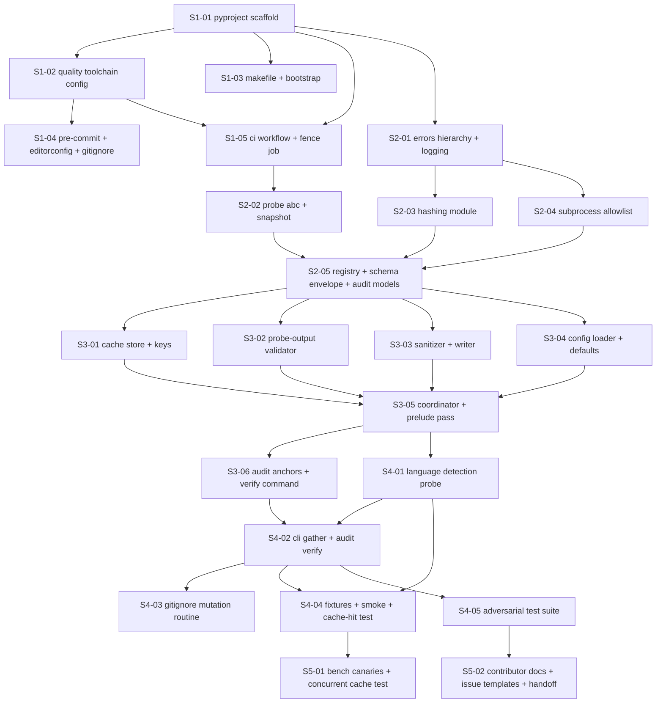

# Phase 00 — Bullet tracer + project foundations: Stories manifest

**Status:** Backlog generated; ready for autonomous implementation
**Date:** 2026-05-11
**Phase architecture:** [../phase-arch-design.md](../phase-arch-design.md)
**Phase ADRs:** [../ADRs/](../ADRs/)
**Implementation plan:** [../High-level-impl.md](../High-level-impl.md)
**Source design:** [../final-design.md](../final-design.md)

## Executive summary

Phase 0 decomposes into **23 stories** across the 5 steps from `High-level-impl.md`. The distribution is **5 / 5 / 6 / 5 / 2** (Step 3 is the densest, carrying all four gap-analysis items and the coordinator prelude pass). The dependency DAG is mostly linear by step — each step builds on the previous one's contracts — with **modest in-step parallelism**: Step 2's contract files (`base.py`, `hashing.py`, `exec.py`, `schema/`, `audit.py`) and Step 3's harness internals can each be built in any order once their step's foundation stories land. **Cross-cutting work** surfaced: strict mypy/ruff conformance per story (ADR-implied), structured logging via `structlog` lifecycle events, snapshot-test gating around `localv2.md §4` (ADR-0007), `0600`/`0700` permissions discipline (ADR-0011), and the `fence` CI job as a Day-1 gate (ADR-0002).

## How to use this backlog

1. Start at the story whose dependencies are all satisfied (initially, S1-01).
2. Open the story file. Read the **Context**, **References**, **Goal**, **Acceptance criteria** sections.
3. Begin with the **TDD plan — red / green / refactor** section. Write the failing test first.
4. Implement just enough to make the test pass.
5. Refactor.
6. Check every acceptance criterion. Update the story file's Status from `Ready` to `Done`.
7. Move to the next story whose dependencies are now satisfied.

The order *within* a step is mostly fixed (later S-numbers usually depend on earlier S-numbers); the order *across* steps follows `High-level-impl.md`'s step ordering, with cross-step parallelism wherever the dependency DAG allows.

## Definition of done (applies to every story)

A story is done when:

- [ ] All acceptance criteria are checked.
- [ ] The TDD plan's red test exists, is committed, and is green.
- [ ] Any additional tests required to honor the relevant ADRs are written and green.
- [ ] Code is formatted (`ruff format`), linted clean (`ruff check`), and passes the type check (`mypy --strict` on `src/`).
- [ ] No existing test was disabled or weakened without an explicit note in the story's "Notes for the implementer" section explaining why.
- [ ] The story file's Status is updated to `Done`.
- [ ] If the story modifies any contract documented in an ADR, the ADR's "Consequences" section is reviewed for new follow-ups.

## Dependency DAG (visual)

## Stories — by step

### Step 1: Establish project skeleton, tooling, and the `fence` CI job

**Step goal:** A reviewer can clone the repo, run `make bootstrap && make check`, get a green check, and any PR that adds an LLM SDK to runtime `dependencies` is automatically rejected.
**Step exit criteria mapping:** Closes roadmap exit criteria "CI is green on `main`" (wired), "Docs site builds locally without warnings" (curated `nav` lands here), "Pre-commit hooks installed by `make bootstrap`", `fence` job (ADR-0002 enforcement); partially closes "Coverage ≥ 85% / 75%" (gate wired; goes live in Step 4).

| ID | Title (slug → file) | Effort | Depends on | Summary (one sentence) |
|---|---|---|---|---|
| S1-01 | [Pyproject scaffold + extras shape (`S1-01-pyproject-scaffold`)](S1-01-pyproject-scaffold.md) | M | — | Land `pyproject.toml` (PEP 621, `hatchling`, Python 3.11+) with runtime deps and the four extras `gather`/`dev`/`service`/`agents` per ADR-0006, plus `src/codegenie/{__init__,__main__,version}.py`. |
| S1-02 | [Quality toolchain config — ruff + mypy + pytest + coverage (`S1-02-quality-toolchain-config`)](S1-02-quality-toolchain-config.md) | S | S1-01 | Wire ruff (lint+format), strict mypy on `src/` (relaxed on `tests/`), pytest with `--cov=src/codegenie --cov-branch --cov-fail-under=85`, and the `cli.py` coverage exclusion into `pyproject.toml`. |
| S1-03 | [Makefile + uv lock + bootstrap targets (`S1-03-makefile-bootstrap`)](S1-03-makefile-bootstrap.md) | S | S1-01 | Add a `Makefile` with `bootstrap`/`check`/`lint`/`typecheck`/`test`/`docs`/`fence`/`audit-verify` targets that work with and without `uv`, and commit `uv.lock`. |
| S1-04 | [Pre-commit hooks + editorconfig + gitignore + mkdocs curated nav (`S1-04-precommit-editorconfig-mkdocs`)](S1-04-precommit-editorconfig-mkdocs.md) | M | S1-02 | Add `.pre-commit-config.yaml` (ruff, ruff-format, mypy, gitleaks, `forbidden-patterns`, check-yaml/toml, end-of-file-fixer), `.editorconfig`, `.gitignore` (incl. `.codegenie/`), and `mkdocs.yml` with the curated `nav` that excludes the superseded design docs. |
| S1-05 | [CI workflow + fence job + import-linter (`S1-05-ci-fence-import-linter`)](S1-05-ci-fence-import-linter.md) | M | S1-01, S1-02 | Ship `.github/workflows/ci.yml` with all six jobs (`lint`, `typecheck`, `test`, `security`, `docs`, `fence`) matrixed on Python 3.11/3.12 × ubuntu-24.04, plus `tests/unit/test_pyproject_fence.py` (with its deliberate-negative scope test), `import-linter` config blocking heavy modules from `cli.py`/`__init__.py`, and concurrency + SHA-pinned actions per ADR-0002. |

### Step 2: Plant the frozen contracts

**Step goal:** Every contract every later phase consumes is on disk, snapshot-tested where applicable, and one PR away from "you can't change me without an ADR amendment."
**Step exit criteria mapping:** Closes "Probe ABC snapshot test passes" (ADR-0007); sets the foundation for "`LanguageDetectionProbe` executes through the real coordinator + cache + validator + sanitizer + audit writer".

| ID | Title (slug → file) | Effort | Depends on | Summary (one sentence) |
|---|---|---|---|---|
| S2-01 | [Error hierarchy + structlog config (`S2-01-errors-logging`)](S2-01-errors-logging.md) | S | S1-01 | Add `src/codegenie/errors.py` with the `CodegenieError` root + nine subclass stubs and `src/codegenie/logging.py` with the `configure_logging(verbose)` callable and the `probe.*` lifecycle event-name constants. |
| S2-02 | [Probe ABC + snapshot regen script (`S2-02-probe-abc-snapshot`)](S2-02-probe-abc-snapshot.md) | M | S1-05 | Transcribe `localv2.md §4`'s `Probe` ABC and dataclasses byte-for-byte into `src/codegenie/probes/base.py`, write `scripts/regen_probe_contract_snapshot.py` (programmatic extraction by section anchors), commit `tests/snapshots/probe_contract.v1.json`, and add `tests/unit/test_probe_contract.py` whose failure message points at `templates/adr-amendment.md` per ADR-0007. |
| S2-03 | [Hashing module — BLAKE3 + SHA-256 chokepoint (`S2-03-hashing`)](S2-03-hashing.md) | S | S2-01 | Add `src/codegenie/hashing.py` as the sole importer of `blake3` and `hashlib.sha256`, exposing `content_hash`, `identity_hash`, and sort-stable `content_hash_of_inputs` per ADR-0001. |
| S2-04 | [Subprocess allowlist chokepoint (`S2-04-exec-allowlist`)](S2-04-exec-allowlist.md) | M | S2-01 | Add `src/codegenie/exec.py` exposing `ALLOWED_BINARIES = frozenset({"git"})` and async `run_allowlisted` with filtered env, cwd-escape rejection, `shell=False`, and SIGKILL at `1.5 × timeout_s` per ADR-0012. |
| S2-05 | [Registry + JSON Schema envelope + audit models (`S2-05-registry-schema-audit-models`)](S2-05-registry-schema-audit-models.md) | M | S2-02, S2-03, S2-04 | Land `probes/registry.py` (`@register_probe` decorator, lru-cached `for_task`, default registry), the layered Draft 2020-12 envelope `schema/repo_context.schema.json` + per-probe sub-schema for language_detection + `schema/validator.py` per ADR-0013, plus `audit.py` with `RunRecord`/`ProbeExecutionRecord` Pydantic models including both `cache_key` and `blob_sha256` per ADR-0004, and the `templates/adr-amendment.md` PR template. |

### Step 3: Build the harness internals

**Step goal:** The runtime path from `ProbeOutput` through cache, validation, sanitization, schema check, and atomic write exists and is unit-tested in isolation, with every gap-analysis item from `phase-arch-design.md` folded in.
**Step exit criteria mapping:** Closes (with Step 4) "`LanguageDetectionProbe` executes through the real coordinator + cache + validator + sanitizer + audit writer" and "Cache hits on a non-empty fixture's second run"; closes ADR-0009 (`ProbeExecution = Ran | CacheHit | Skipped`), ADR-0010 (Pydantic validator trust boundary), ADR-0008 (two-pass sanitizer chokepoint), and the four gap-analysis items from `phase-arch-design.md §Gap analysis`.

| ID | Title (slug → file) | Effort | Depends on | Summary (one sentence) |
|---|---|---|---|---|
| S3-01 | [Cache store + two-level keys per ADR-0003 (`S3-01-cache-store-keys`)](S3-01-cache-store-keys.md) | M | S2-05 | Add `cache/keys.py` (with `per_probe_schema_version` scoping per Gap 1 — envelope version is **not** in the key) and `cache/store.py` (append-only JSONL index + sharded BLAKE3 blobs, atomic `<tmp>→fsync→os.replace`, `0700`/`0600` modes re-applied, corruption/hash-mismatch/TTL-stale all collapse to miss + log + re-run) per ADR-0001/0003/0011. |
| S3-02 | [Pydantic `_ProbeOutputValidator` trust boundary (`S3-02-probe-output-validator`)](S3-02-probe-output-validator.md) | S | S2-05 | Build the Pydantic v2 `_ProbeOutputValidator` (`frozen=True`, `extra="forbid"`, recursive `JSONValue`, `Literal["high","medium","low"]` confidence, secret-shaped-field-name rejection → `SecretLikelyFieldNameError`) per ADR-0010; lazy-imported by the coordinator. |
| S3-03 | [Output sanitizer + atomic writer (`S3-03-sanitizer-writer`)](S3-03-sanitizer-writer.md) | M | S2-05 | Add `output/sanitizer.py` (two-pass: field-name regex + absolute-path→relative-path scrubbing, idempotent) and `output/writer.py` (`yaml.CSafeDumper` with pure-Python fallback, atomic raw-then-yaml publish, symlink-refusal → `SymlinkRefusedError`, `0600`/`0700` re-applied) per ADR-0008/0011. |
| S3-04 | [Config loader + defaults (`S3-04-config-loader`)](S3-04-config-loader.md) | S | S2-05 | Add `config/defaults.py` (`Config` frozen dataclass) and `config/loader.py` (three-source merge defaults < `~/.codegenie/config.yaml` < `<repo>/.codegenie/config.yaml` < CLI overrides) with unknown-key rejection (`difflib.get_close_matches` suggestion) and env-var expansion off. |
| S3-05 | [Coordinator + prelude pass + resource budget (`S3-05-coordinator-prelude-budget`)](S3-05-coordinator-prelude-budget.md) | L | S3-01, S3-02, S3-03, S3-04 | Build `coordinator/snapshot.py` and `coordinator/coordinator.py` with `Semaphore(min(cpu, max_concurrent, 8))`, per-probe `wait_for` + cancel + SIGKILL at `1.5×`, failure-isolation into `ProbeOutput(errors=...)`, validator → sanitizer chain in the coordinator, `GatherResult` with `ProbeExecution = Ran | CacheHit | Skipped` per ADR-0009, the **prelude pass** for `tier="base"` probes that enriches the snapshot via `dataclasses.replace` (Gap 4), and `Probe.declared_resource_budget` enforcement for `wall_clock_s` and `raw_artifact_mb` with advisory RSS warn (Gap 3). |
| S3-06 | [Audit writer + `audit verify` re-verification (`S3-06-audit-writer-verify`)](S3-06-audit-writer-verify.md) | S | S3-05 | Implement `AuditWriter.record(...)` writing `runs/<utc-iso>-<short>.json` mode `0600` with `cache_key` + `blob_sha256` per probe execution (Gap 2), wire the coordinator to feed it, and implement the `codegenie audit verify` re-verification path that re-reads claimed blobs and recomputes both SHA-256 anchors per ADR-0004. |

### Step 4: Cut the vertical slice — CLI, `LanguageDetectionProbe`, fixtures, smoke

**Step goal:** `codegenie gather <path>` runs end-to-end on empty / JS-only / polyglot fixtures, writes `.codegenie/context/repo-context.yaml`, and the cache-hit-on-second-run assertion (the bullet tracer's load-bearing exit) is green in CI.
**Step exit criteria mapping:** Closes "`codegenie gather` runs on any directory", "Prints external-tool readiness", "Executes `LanguageDetection`", "Writes `.codegenie/context/repo-context.yaml`", "Cache hits on a non-empty fixture's second run", "`codegenie audit verify` over smoke run reports zero mismatches", "`.gitignore` mutation path exercised for TTY-accept and non-TTY-skip", "Coverage ≥ 85% line / ≥ 75% branch" (the gate goes live here), "External-tool readiness check caches at `~/.codegenie/.tool-cache.json`".

| ID | Title (slug → file) | Effort | Depends on | Summary (one sentence) |
|---|---|---|---|---|
| S4-01 | [`LanguageDetectionProbe` + registration (`S4-01-language-detection-probe`)](S4-01-language-detection-probe.md) | S | S3-05 | Implement `probes/language_detection.py` with extension-scoped `declared_inputs` (the language-extension globs, **not** `["**/*"]`), `tier="base"`, `applies_to_tasks=["*"]`/`applies_to_languages=["*"]`, `os.scandir` walk that skips symlinks resolving outside the repo root, emits `schema_slice = {"language_stack": {"counts": {...}, "primary": <max>}}`, and register it via `probes/__init__.py`. |
| S4-02 | [CLI `gather` + `audit verify` + tool-readiness check (`S4-02-cli-gather-audit-verify`)](S4-02-cli-gather-audit-verify.md) | M | S3-06, S4-01 | Build `src/codegenie/cli.py` as a `click` group with `gather <path>`, `audit verify`, and `cache gc` (stub); defer all heavy imports inside command bodies (`import-linter`-honoring); wire the startup path (configure logging → tool-readiness check writing `~/.codegenie/.tool-cache.json` mode `0600` → maybe-prompt gitignore → load config → snapshot → `coordinator.gather` → merge → schema-validate → `Writer.write` → `AuditWriter.record`) and the documented exit-code table (0/1/2/3/5/6). |
| S4-03 | [Gitignore mutation routine + flags (`S4-03-gitignore-mutation`)](S4-03-gitignore-mutation.md) | S | S4-02 | Implement the TTY-prompt/atomic-append `.gitignore` mutation routine with `--auto-gitignore` and `--no-gitignore` overrides; structured warning on non-TTY; gather continues on append failure (edge case #8); idempotent on already-present. |
| S4-04 | [Fixtures + end-to-end smoke + cache-hit-on-second-run (`S4-04-fixtures-smoke-cache-hit`)](S4-04-fixtures-smoke-cache-hit.md) | M | S4-01, S4-02 | Add `tests/fixtures/{empty_repo,js_only,polyglot}/`, write `tests/smoke/test_cli_end_to_end.py` (covers `--help`, all three fixtures, and the load-bearing cache-hit-on-second-run test that monkeypatches `os.scandir` at the `language_detection` module level, edits `README.md` between runs to prove `declared_inputs` scoping, and asserts the `probe.cache_hit` structlog event), and flip the `--cov-fail-under=85` gate live. |
| S4-05 | [Adversarial test suite (`S4-05-adversarial-suite`)](S4-05-adversarial-suite.md) | M | S4-02 | Add `tests/adv/` with `test_path_traversal.py`, `test_symlink_escape.py`, `test_secret_leak.py`, `test_env_var_strip.py`, `test_no_shell_true.py`, `test_no_network_imports.py`, and `test_yaml_unsafe_load.py` — each pins one structural invariant via AST scan or behavioral assertion. |

### Step 5: Close the remaining CI gates and project conventions

**Step goal:** All six CI jobs are green on `main`; the remaining adversarial tests, performance canaries, project-management artifacts, and contributor docs are in place; Phase 0's handoff to Phase 1 is shippable.
**Step exit criteria mapping:** Closes "CI is green on `main`" (final), "Issue templates render in GitHub UI", final coverage of "Docs site builds locally without warnings" (`docs/contributing.md` joins the curated `nav`), and the documented coverage ratchet schedule.

| ID | Title (slug → file) | Effort | Depends on | Summary (one sentence) |
|---|---|---|---|---|
| S5-01 | [Performance canaries + concurrent-cache test (`S5-01-bench-concurrent-cache`)](S5-01-bench-concurrent-cache.md) | S | S4-04 | Add `tests/bench/{test_cli_cold_start,test_coordinator_overhead,test_cache_hit_dispatch}.py` as advisory-only PR-comment canaries (never merge gates per L3 row 12) and `tests/unit/test_cache_concurrent.py` covering two concurrent gathers against the same `.codegenie/cache/index.jsonl` (edge case #12). |
| S5-02 | [Project artifacts + contributor docs + Phase 1 handoff (`S5-02-project-artifacts-handoff`)](S5-02-project-artifacts-handoff.md) | M | S4-05 | Add `.github/ISSUE_TEMPLATE/{new-probe,new-skill,adr-amendment}.md`, `.github/dependabot.yml`, `.github/CODEOWNERS` (gating `src/codegenie/probes/base.py`, `localv2.md`, `docs/production/adrs/`, `tests/snapshots/`), `.github/PULL_REQUEST_TEMPLATE.md`, `docs/contributing.md` (bootstrap, adding-a-probe cheat sheet, documented 85/75 → 87/77 → 90/80 ratchet), update the phase README's exit checklist, file the three Phase 1 follow-up issues (mkdocs nav cleanup, probe-version-bump conventions, `aiofiles` documentation bug), and close the Phase 0 milestone. |

## Cross-cutting concerns

Things that don't belong to any one step but apply across stories.

- **Strict type-checking + lint:** every story passes `ruff check`, `ruff format --check`, and `mypy --strict` on any `src/` code it touches. The Definition of Done enforces this; no per-story acceptance criterion repeats it.
- **Structured logging via `structlog`:** every story that introduces new logged behavior emits one of the declared `probe.*` lifecycle constants (or a similarly namespaced event) and includes a log-emission assertion in at least one test. JSON-on-non-TTY / pretty-on-TTY per `phase-arch-design.md §Harness engineering`.
- **Snapshot-frozen contracts (ADR-0007):** any story touching `src/codegenie/probes/base.py` or `tests/snapshots/probe_contract.v1.json` includes the snapshot test as a gate; failures route the implementer to `templates/adr-amendment.md`.
- **Permission discipline (ADR-0011):** every story writing under `.codegenie/` or `~/.codegenie/` re-applies `0700` (dirs) / `0600` (files) via `os.chmod` post-write and includes a mode-bit assertion.
- **Chokepoint honoring:** all subprocess invocation goes through `exec.run_allowlisted` (ADR-0012); all hashing goes through `hashing.py` (ADR-0001); all probe→disk paths go through `OutputSanitizer.scrub` (ADR-0008). Stories that bypass any of these must explicitly justify it in "Notes for the implementer."

## Exit-criteria coverage

Every Phase 0 exit criterion from `roadmap.md` §"Phase 0" and `final-design.md §11` is covered by at least one story.

| Exit criterion (verbatim or close) | Story / stories |
|---|---|
| `codegenie gather` runs on any directory | S4-02, S4-04 |
| Prints external-tool readiness | S4-02 |
| Executes `LanguageDetection` | S4-01, S4-02 |
| Writes `.codegenie/context/repo-context.yaml` | S3-03, S4-02 |
| CI is green on `main` | S1-05 (wired), S5-02 (final) |
| Docs site builds locally without warnings (curated `nav`) | S1-04 (curated nav), S5-02 (final green incl. `contributing.md`) |
| Probe contract from `localv2.md §4` preserved byte-for-byte (snapshot-pinned) | S2-02 |
| `LanguageDetectionProbe` executes through the real coordinator + cache + validator + sanitizer + audit writer | S3-01, S3-02, S3-03, S3-05, S3-06, S4-01, S4-02 |
| Cache hits on a non-empty fixture's second run | S3-01, S3-05, S4-04 |
| Six CI jobs green on `python: ["3.11","3.12"]` × `os: [ubuntu-24.04]` | S1-05 (wired), S5-02 (final green) |
| `mkdocs build --strict` over curated `nav` green | S1-04, S5-02 |
| `fence` job blocks LLM SDKs from `dependencies` (with deliberate-negative test) | S1-05 |
| Coverage ≥ 85% line / ≥ 75% branch on `src/codegenie/` excluding `cli.py` | S1-02 (gate wired), S4-04 (gate goes live) |
| `codegenie audit verify` over smoke run reports zero mismatches | S3-06, S4-02, S4-04 |
| `.gitignore` mutation path exercised (TTY-accept + non-TTY-skip) | S4-03 |
| Pre-commit hooks installed by `make bootstrap`; commit with lint violation / `shell=True` / unsafe `yaml.load` blocked | S1-03, S1-04 |
| Issue templates render (`new-probe`, `new-skill`, `adr-amendment`) | S5-02 |
| Probe ABC snapshot test passes; drift fails CI | S2-02 |
| External-tool readiness check caches at `~/.codegenie/.tool-cache.json` mode `0600` | S4-02 |
| Audit anchors (`cache_key` + `blob_sha256`) per probe execution (Gap 2) | S2-05, S3-06 |
| Cache-invalidation-scope test (per-probe-sub-schema scoping, Gap 1) | S3-01 |
| Coordinator prelude pass enriches snapshot (Gap 4) | S3-05 |
| Per-probe resource budget enforced (Gap 3 — `wall_clock_s` + `raw_artifact_mb` hard; RSS advisory) | S3-05 |

No exit criterion is unmapped.

## Open implementation questions

Surfaced from `phase-arch-design.md §"Open questions deferred to implementation"` and the gap analysis. Each is named with the story most likely to surface it.

1. **`uv` as hard requirement or optional accelerator?** Both paths must work in S1-03. Revisit Phase 2 once contributor pain is known. — first arises in **S1-03**.
2. **`Probe.version` bump convention — where lives, who bumps?** Phase 0 leaves it as a class attribute; convention documented in S5-02 (`docs/contributing.md`) and filed as a Phase 1 follow-up issue. — first arises in **S2-02**, formalized in **S5-02**.
3. **`tests/snapshots/probe_contract.v1.json` normalization algorithm.** SHA-256 of whitespace-collapsed, no-trailing-newline §4 body extracted by section anchors (per `regen_probe_contract_snapshot.py`). — resolved in **S2-02**.
4. **Tool-readiness cache contents in audit record?** Include `tool_versions` but not raw cache contents (workstation-info leak). — resolved in **S3-06**.
5. **Coverage ratchet schedule** — 85/75 → 87/77 (Phase 1) → 90/80 (Phase 2), documented in `docs/contributing.md`. — resolved in **S5-02**.
6. **`forbidden-patterns` regex set** — initial enumeration in S1-04; extensions (`subprocess.run(..., shell=...)`, `marshal.loads`, `dill.loads`, `__builtins__`, `getattr(..., "__"`) deferred as Phase 1 hardening. — first arises in **S1-04**.

## Backlog stats

- **Total stories:** 23
- **Stories per step:** Step 1: 5 · Step 2: 5 · Step 3: 6 · Step 4: 5 · Step 5: 2
- **Effort distribution:** S = 8 · M = 14 · L = 1 (S3-05 is the only L — the coordinator carries the prelude pass, the resource budget, the validator/sanitizer chain, and `ProbeExecution`).
- **Longest dependency chain:** **9 stories** — `S1-01 → S1-05 → S2-02 → S2-05 → S3-01 → S3-05 → S4-01 → S4-04 → S5-01`. (Several other 8-deep chains exist; this is the deepest.)
- **Cross-step parallelism windows:** within Step 2 after S2-01, the three contract files (S2-03 hashing, S2-04 exec, S2-02 probe ABC) can be built in parallel; within Step 3 after S2-05, the four leaf stories (S3-01, S3-02, S3-03, S3-04) can be built in parallel before S3-05 joins them.
- **Gap-analysis-driven stories (Architect's gap items, not literal impl-plan features):** S3-01 (Gap 1 — two-level cache key scoping + invalidation-scope test), S3-05 (Gap 3 — per-probe resource budget; Gap 4 — coordinator prelude pass), S3-06 (Gap 2 — dual audit anchors `cache_key` + `blob_sha256` and `audit verify` re-verification).
