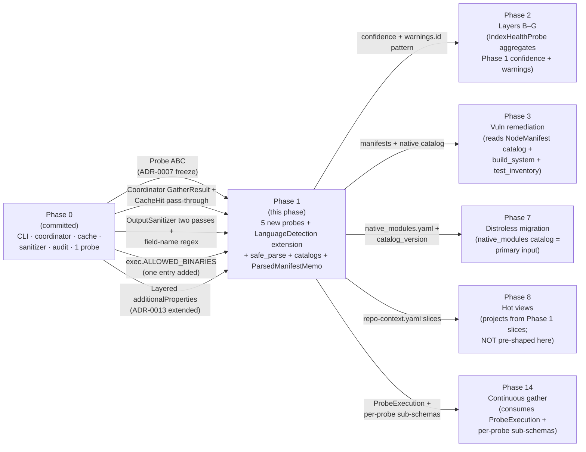
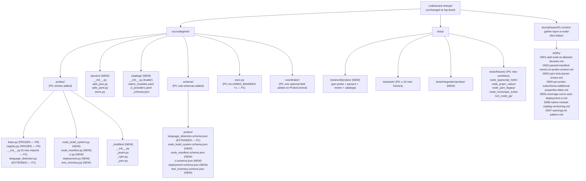
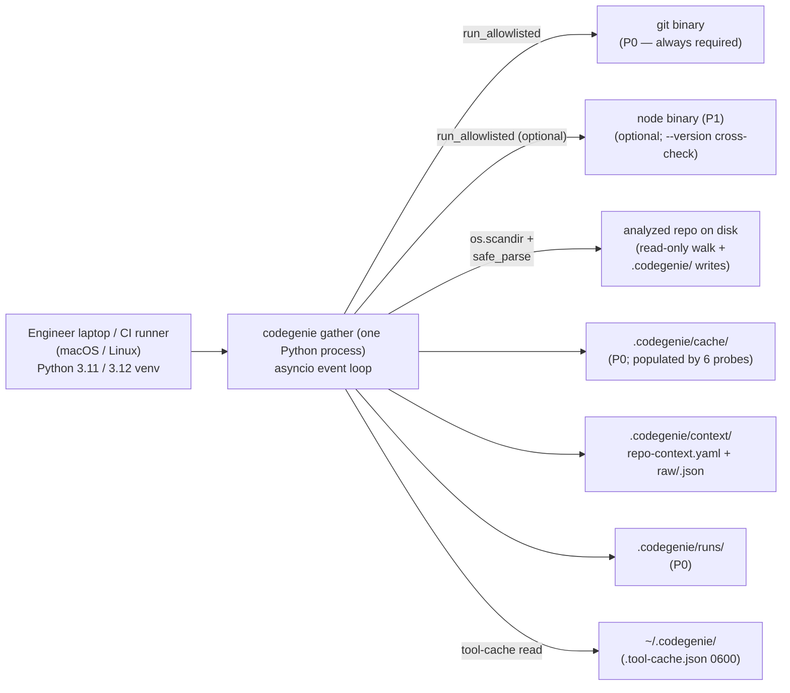

# Phase 01 — Context gathering: Layer A (Node.js): Architecture

**Status:** Architecture spec
**Date:** 2026-05-12
**Inputs:** [`final-design.md`](final-design.md) (synthesized design of record) · [`critique.md`](critique.md) · [`design-performance.md`](design-performance.md) · [`design-security.md`](design-security.md) · [`design-best-practices.md`](design-best-practices.md) · [`../../production/design.md`](../../production/design.md) · [`../../production/adrs/`](../../production/adrs/) · [`../../localv2.md`](../../localv2.md) · [`../../roadmap.md`](../../roadmap.md) · [`../00-bullet-tracer-foundations/final-design.md`](../00-bullet-tracer-foundations/final-design.md) · [`../00-bullet-tracer-foundations/phase-arch-design.md`](../00-bullet-tracer-foundations/phase-arch-design.md)
**Audience:** the engineer implementing this phase

---

## Executive summary

Phase 1 **populates the Phase 0 spine** — probe ABC, async coordinator, content-addressed cache, two-pass sanitizer, layered schema, subprocess allowlist, audit anchor — with five real Layer A probes (`NodeBuildSystem`, `NodeManifest`, `CI`, `Deployment`, `TestInventory`) and extends `LanguageDetectionProbe` with the framework + monorepo fields Phase 0 explicitly deferred (Phase 0 final-design §2.10). The two architectural moves that carry this phase are (1) **a shared `src/codegenie/parsers/` module** for size + depth-capped JSON/JSONC/YAML loading so every probe parses adversarial bytes with identical defenses, and (2) **`ParsedManifestMemo` on `ProbeContext`** — a per-gather, in-coordinator memo for `package.json` that closes the critic's cross-design observation #3 (three probes re-parsing the same file) without introducing the msgpack side-channel [P] proposed or the fork+exec sandbox [S] proposed. Per-probe sub-schemas at `src/codegenie/schema/probes/` carry `additionalProperties: false` at their own root; the Phase 0 envelope policy (`probes.*: additionalProperties: true`, ADR-0013) is preserved. The phase ships exactly **three Phase 0 in-place edits** (registry imports, the documented LanguageDetection extension, one `ALLOWED_BINARIES` entry for `node`) — each ADR-gated. Every other addition is a new file. The phase exits when `codegenie gather` produces a useful `repo-context.yaml` on a real Node.js repo, the second run cache-hits all six Layer A probes, and the adversarial corpus (≥ 20 hostile inputs covering YAML/JSON bombs, symlink escape, regex DoS, oversized lockfiles) produces zero parse-driven RCE or OOM.

## Goals

Verifiable. Pulled from `roadmap.md` Phase 1 exit criteria and `final-design.md §"Goals"`, refined for engineering precision.

1. **`codegenie gather` produces a useful `repo-context.yaml` on a real Node.js repo.** Verified by `tests/integration/probes/test_layer_a_end_to_end.py` against `tests/fixtures/node_typescript_helm/`: all six Layer A slices populated, envelope schema + per-probe sub-schemas pass, audit anchor re-computes.
2. **Cache hits on second run** — every Layer A probe reports `ProbeExecution.CacheHit` in the coordinator's `executions` dict; `os.scandir` is never re-entered (monkeypatched in `tests/integration/probes/test_cache_hit_on_real_repo.py`).
3. **Schema validation passes** at the envelope + per-probe sub-schema level. Each sub-schema declares `additionalProperties: false` at its own root; an unknown field on any Phase 1 probe slice fails CI (exit 3).
4. **Probe contract conformance** — `tests/unit/test_probe_contract.py` snapshot test continues to pass (Phase 0 ADR-0007); zero edits to `src/codegenie/probes/base.py`.
5. **Adversarial robustness** — zero successful parse-driven RCE or OOM against the adversarial fixture corpus (≥ 20 hostile inputs). Caps enforced **in-process** (no per-probe subprocess), implemented in `src/codegenie/parsers/`.
6. **Hard caps in every parser:** `package.json` ≤ 5 MB; lockfile ≤ 50 MB; YAML depth ≤ 64; JSON depth ≤ 64; per-probe wall-clock ≤ `timeout_seconds` (Phase 0 coordinator enforces). Exceeding any cap raises a typed exception → `ProbeOutput(confidence="low", errors=[...])`.
7. **Coverage ratchet** — 90% line / 80% branch on `src/codegenie/` excluding `cli.py`. Per-module floor 85% line / 75% branch for `probes/deployment.py` and `probes/ci.py` declared in `pyproject.toml` with the ADR-amendment trigger documented (ADR-0005, this phase).
8. **Tokens per run = 0** — Phase 0 `fence` CI job continues to assert; `pyarn` (the one new optional dep) is a YAML parser and is verified against the LLM-SDK exclusion set.
9. **Wall-clock targets (advisory, surfaced via Phase 0 bench infra, not PR-blocking):**
   - Cold (1k-file fixture, all probes miss cache): p50 ≤ 4 s, p95 ≤ 8 s.
   - Warm (cache full, all hits): p50 ≤ 0.4 s, p95 ≤ 1 s.
   - Incremental (`package.json` changed, four misses + two hits): p50 ≤ 1 s, p95 ≤ 2 s.
10. **Extension by addition holds** — exactly three Phase 0 in-place edits (registry imports, `LanguageDetectionProbe` Phase-0-deferred fields, one `ALLOWED_BINARIES` entry), each ADR-gated. Every other addition is a new file.

## Non-goals

Anti-scope. Each is annotated with why and where it lands.

1. **No `IndexHealthProbe` (B2)** — Phase 2 owns it (`roadmap.md` §"Phase 2"). Phase 1's silent-staleness vectors (catalog gap, multi-lockfile, declaration-vs-lockfile disagreement) are surfaced as `confidence: low` + structured warning IDs; Phase 2 builds the cross-cutting health surface that aggregates them.
2. **No per-probe fork+exec sandbox** — `final-design.md "Conflict-resolution table" row 1` rejects it. In-process caps in `safe_parse` cover ~95% of the threat surface; Phase 14's production worker adds OS-level rlimits + bwrap for the remaining parser-CVE class.
3. **No `views.json` artifact / streaming writer / Phase 8 hot-view pre-render** — Phase 8 ships its own hot views (ADR-0013). Pre-shaping in Phase 1 inverts extension-by-addition (Phase 8 → Phase 1 edit if hot-view list changes).
4. **No `node_modules/*/package.json` parsing** — adversarial-bytes-at-scale threat; no Phase-1 consumer requires it. Deferred to Phase 2 with an opt-in flag.
5. **No `npm ls` / `pnpm list` invocation** — lockfile is the deterministic source. Avoids non-determinism + network egress + tool-version drift.
6. **No Helm template rendering / Kustomize build / Terraform HCL parsing** — Helm + Kustomize render is a Planner-time decision (Phase 3+). `python-hcl2` has historic CVEs and Phase 1 has no consumer; Terraform records `*.tf` paths only.
7. **No `msgpack` inter-probe parsed-state side-channel** [P] — bypasses `_ProbeOutputValidator` and `OutputSanitizer` (critic §1.1.2). Replaced by `ParsedManifestMemo` on `ProbeContext` (Component 3 below), which never writes to disk.
8. **No `PathIndex` mixin** [P] — second class hierarchy alongside the frozen `Probe` ABC; would drift the Phase 0 §2.3 snapshot (critic §1.1.1).
9. **No `orjson`/`pyjson5`/`ruamel.yaml` C-extension drift** — Phase 0 ratified `pyyaml.CSafeLoader` + stdlib `json` + `blake3`. Phase 1 adds **only** `pyarn` (conditional, with hand-rolled fallback) and stays inside that closure (critic §1.1.6).
10. **No third sanitizer pass in `output/sanitizer.py`** [S] — edits a Phase-0 chokepoint (ADR-0008) without amendment. The strictness lives at the per-probe sub-schema root instead (ADR-0013, extended in this phase by ADR-0001).
11. **No byte-content cache key rewrite** [S] — reverses ADR-0001 (cache content hash algorithm) without amendment (critic §2.2.3). Multi-actor cache poisoning is a Phase 14 threat-model concern.
12. **No release-versioning policy for per-probe sub-schemas in Phase 1** — `localv2.md` doesn't have it; Phase 2 introduces it when the first cross-phase sub-schema change is anticipated.

## Architectural context

Phase 1 sits between Phase 0's harness skeleton and Phase 2's full probe inventory. It is the first phase that **parses adversarial bytes from untrusted repos at scale** through the chokepoints Phase 0 planted. Every probe's slice flows through Phase 0's `_ProbeOutputValidator → OutputSanitizer.scrub → SchemaValidator` path unchanged; the Phase 1 additions live at and below the probe boundary.



Every Phase 0 box is `unchanged` — that's the test of extension by addition (final-design §"Architecture"). Phase 1's three in-place edits each carry a Phase-1 ADR.

## 4+1 architectural views

Following `production/design.md §8` conventions and Phase 0's `phase-arch-design.md` precedent. Each view is rendered in Mermaid.

### Logical view — components and relationships

```mermaid
classDiagram
  class Probe {
    <<abstract; Phase 0 frozen §4>>
    +name: str
    +declared_inputs: list~str~
    +run(repo, ctx) ProbeOutput
  }
  class LanguageDetectionProbe {
    <<Phase 0; extended Phase 1>>
    +framework_hints()
    +monorepo_markers()
  }
  class NodeBuildSystemProbe
  class NodeManifestProbe
  class CIProbe
  class DeploymentProbe
  class TestInventoryProbe

  class Coordinator {
    <<Phase 0; one field added>>
    +gather(snapshot, task, probes, config, cache, sanitizer, parsed_manifest_memo) GatherResult
  }
  class ParsedManifestMemo {
    <<Phase 1 NEW>>
    +get(path) Mapping~str, JSONValue~ | None
    -keyed_by: (abspath, mtime_ns, size)
  }
  class ProbeContext {
    <<Phase 0 dataclass; one optional field added>>
    +parsed_manifest: Callable~Path, dict | None~ | None
  }

  class safe_json {
    <<Phase 1 NEW>>
    +load(path, max_bytes, max_depth) dict
  }
  class safe_yaml {
    <<Phase 1 NEW>>
    +load(path, max_bytes, max_depth) dict
  }
  class jsonc {
    <<Phase 1 NEW>>
    +load(path, max_bytes, max_depth) dict
  }

  class LockfileParsers {
    <<Phase 1 NEW under probes/_lockfiles/>>
    +_pnpm.parse(path) PnpmLock
    +_npm.parse(path) NpmLock
    +_yarn.parse(path) YarnLock
  }

  class Catalogs {
    <<Phase 1 NEW>>
    +NATIVE_MODULES: Mapping
    +CI_PROVIDERS: Mapping
    +catalog_version: int
  }

  class PerProbeSubSchemas {
    <<Phase 1 NEW src/codegenie/schema/probes/>>
    +node_build_system.schema.json
    +node_manifest.schema.json
    +ci.schema.json
    +deployment.schema.json
    +test_inventory.schema.json
    +language_detection.schema.json (extended)
  }

  Probe <|-- LanguageDetectionProbe
  Probe <|-- NodeBuildSystemProbe
  Probe <|-- NodeManifestProbe
  Probe <|-- CIProbe
  Probe <|-- DeploymentProbe
  Probe <|-- TestInventoryProbe

  Coordinator --> ParsedManifestMemo : provides on ProbeContext
  ProbeContext --> ParsedManifestMemo : optional callable
  NodeBuildSystemProbe --> safe_json
  NodeBuildSystemProbe --> jsonc
  NodeManifestProbe --> safe_json
  NodeManifestProbe --> safe_yaml
  NodeManifestProbe --> LockfileParsers
  NodeManifestProbe --> Catalogs
  CIProbe --> safe_yaml
  CIProbe --> Catalogs
  DeploymentProbe --> safe_yaml
  TestInventoryProbe --> safe_json
  NodeBuildSystemProbe ..> ParsedManifestMemo : reads package.json via ctx
  NodeManifestProbe ..> ParsedManifestMemo : reads package.json via ctx
  TestInventoryProbe ..> ParsedManifestMemo : reads package.json via ctx

  PerProbeSubSchemas --> NodeBuildSystemProbe : validates slice
  PerProbeSubSchemas --> NodeManifestProbe : validates slice
  PerProbeSubSchemas --> CIProbe : validates slice
  PerProbeSubSchemas --> DeploymentProbe : validates slice
  PerProbeSubSchemas --> TestInventoryProbe : validates slice
```



**Central abstractions:** the Phase 0 `Probe` ABC (unchanged), the Phase 0 `Coordinator` (one optional field added on `ProbeContext`), and three new shared modules — `parsers/`, `probes/_lockfiles/`, `catalogs/`. The five new probes are siblings, each owning one disjoint slice. `ParsedManifestMemo` is the seam that resolves critic cross-design observation #3 — it lives inside the coordinator's per-gather state and is exposed to probes as a callable on `ProbeContext` (final-design §"Components" #2).

### Process view — runtime

```mermaid
sequenceDiagram
  autonumber
  actor User
  participant CLI as codegenie.cli (P0)
  participant Co as Coordinator (P0; memo-aware)
  participant Memo as ParsedManifestMemo
  participant LD as LanguageDetection (P0 ext.)
  participant NBS as NodeBuildSystem
  participant NM as NodeManifest
  participant CI as CIProbe
  participant DP as DeploymentProbe
  participant TI as TestInventory
  participant Cache as CacheStore (P0)
  participant Val as _ProbeOutputValidator (P0)
  participant San as OutputSanitizer (P0)
  participant Sch as SchemaValidator (P0 + sub-schemas)
  participant W as Writer (P0)

  User->>CLI: codegenie gather /repo
  CLI->>CLI: tool-readiness (git + optional node)
  CLI->>Co: gather(snapshot, task, probes=6, …)
  Co->>Memo: construct (per-gather; empty)
  Co->>Co: Semaphore(min(cpu_count(), 8))

  Note over Co: Wave 1 — LanguageDetection only<br/>(prelude per Phase 0 gap #4 resolution)
  Co->>Cache: get(key) for LD
  alt miss
    Cache-->>Co: None
    Co->>LD: run(snapshot, ctx with memo)
    LD->>Memo: parsed_manifest(package.json)
    Memo->>Memo: safe_json.load (cap 5MB, depth 64)
    Memo-->>LD: parsed dict
    LD-->>Co: ProbeOutput(language_stack, framework_hints, monorepo)
    Co->>Val: validate
    Co->>San: scrub
    Co->>Cache: put
  else hit
    Cache-->>Co: ProbeOutput; execution=CacheHit
  end

  Note over Co: Coordinator enriches snapshot with<br/>detected_languages (P0 gap #4 resolution)
  Co->>Co: enriched_snapshot = replace(snapshot, detected_languages=...)

  Note over Co: Wave 2 — five remaining probes in parallel
  par parallel dispatch
    Co->>Cache: get(NBS)
    Cache-->>Co: miss
    Co->>NBS: run(enriched_snapshot, ctx)
    NBS->>Memo: parsed_manifest(package.json)
    Memo-->>NBS: SAME parsed dict (cached)
  and
    Co->>Cache: get(NM)
    Cache-->>Co: miss
    Co->>NM: run(enriched_snapshot, ctx)
    NM->>Memo: parsed_manifest(package.json)
    NM->>NM: lockfile parse (pnpm/npm/yarn)
  and
    Co->>Cache: get(CI)
    Cache-->>Co: hit
    Co-->>Co: execution=CacheHit
  and
    Co->>Cache: get(DP)
    Cache-->>Co: miss
    Co->>DP: run(enriched_snapshot, ctx)
  and
    Co->>Cache: get(TI)
    Cache-->>Co: miss
    Co->>TI: run(enriched_snapshot, ctx)
    TI->>Memo: parsed_manifest(package.json)
  end

  Note over Co: Each probe output flows through<br/>Val → San → Cache (P0 unchanged)
  Co-->>CLI: GatherResult(outputs, executions)

  CLI->>CLI: shallow merge slices into envelope
  CLI->>Sch: validate (envelope + per-probe sub-schemas)
  Sch-->>CLI: ok
  CLI->>W: write repo-context.yaml + raw/
  CLI-->>User: exit 0
```

**Concurrency** is at the Wave 2 `par` block: five probes dispatched concurrently under `Semaphore(min(cpu_count(), 8))`. **Blocking** is inside each probe's parse work (lockfile parse for `NodeManifest` dominates at ~250 ms p50). **The memo is per-gather**, never persisted; Phase 14's Activities will re-parse per Activity (correct behavior — Activities are independent units of work).

The **prelude pass** is the Phase-0 architectural-gap-#4 resolution arriving here: `LanguageDetectionProbe` runs alone in Wave 1; the coordinator constructs an `enriched_snapshot` with the detected language counts before dispatching Wave 2. Phase 1's other five probes filter on `enriched.detected_languages` correctly. This is an additive coordinator behavior, encoded in the existing `requires: ["language_detection"]` topological-ordering machinery — no new contract.

### Development view — source organization



**Stable contracts** (cannot change without ADR amendment): everything Phase 0 froze (`probes/base.py`, `registry.py`, the `Coordinator` `GatherResult`/`ProbeExecution` shape, `OutputSanitizer.scrub` two-pass, `exec.run_allowlisted` signature, `hashing.py` function names, the JSON Schema envelope). Phase 1 adds **per-probe sub-schemas with `additionalProperties: false` at their own root** to that contract surface (ADR-0004, this phase).

**Internal helpers** (free to change): the `_lockfiles/` parsers, the catalogs' internal loader implementation, `jsonc.py`'s comment-stripper algorithm.

**Public interface** at end of Phase 1 lives in: `cli.py` (unchanged), `probes/base.py` (unchanged), `schema/repo_context.schema.json` (envelope unchanged) + `schema/probes/*.schema.json` (six files, each strict at root). Every consumer reads through these.

### Physical view — where this runs

Phase 1 does not change the physical surface. One Python process on an engineer's laptop or a CI runner reads and writes a single repo's filesystem. The only difference from Phase 0 is **one optional external binary** (`node`) that the tool-readiness check probes for and gracefully degrades on absent.



**Filesystem scope unchanged:** reads stay under `<repo>/`; writes confined to `<repo>/.codegenie/` (plus the opt-in `.gitignore` append). `O_NOFOLLOW` opens (in `safe_json.load` / `safe_yaml.load`) refuse symlinks-out-of-repo at file open time, not after read.

**No new network egress.** The Phase 0 `import-linter` rule blocking `httpx`/`requests`/`urllib3`/`socket` continues to bind — `pyarn` (the one optional dep) parses local files; no remote fetch.

### Scenarios — does it work for cases that matter?

Four scenarios cover the load-bearing paths.

#### Scenario 1: Cold gather on a real TypeScript + pnpm + Helm repo (happy path)

```mermaid
sequenceDiagram
  autonumber
  actor Dev
  participant CLI
  participant Co as Coordinator
  participant Memo as ParsedManifestMemo
  participant LD as LanguageDetection
  participant Wave2 as 5 parallel probes
  participant Cache
  participant Sch as SchemaValidator
  participant W as Writer

  Dev->>CLI: codegenie gather ./fixtures/node_typescript_helm
  CLI->>Co: gather(...)
  Co->>Memo: empty memo
  Co->>Cache: get(LD); miss
  Co->>LD: run; reads package.json via memo (5ms parse, capped)
  LD-->>Co: language_stack {primary: typescript, framework_hints: [express]}
  Co->>Co: enriched_snapshot with detected_languages
  par Wave 2
    Co->>Wave2: NBS (250ms total — tsconfig + version reads)
    Co->>Wave2: NM (350ms — pnpm-lock parse dominates)
    Co->>Wave2: CI (80ms — one workflow YAML parse)
    Co->>Wave2: DP (180ms — Chart.yaml + values.yaml + values-prod.yaml)
    Co->>Wave2: TI (120ms — package.json via memo + test file walk)
  end
  Wave2-->>Co: 5 ProbeOutputs; all confidence high
  Co-->>CLI: GatherResult
  CLI->>Sch: validate envelope + 6 sub-schemas
  Sch-->>CLI: ok
  CLI->>W: write repo-context.yaml + raw/<6 files>
  CLI-->>Dev: exit 0; ~1.6s wall-clock on M-series Mac
```

#### Scenario 2: Warm gather (cache hit, the roadmap exit criterion)

```mermaid
sequenceDiagram
  autonumber
  actor Dev
  participant CLI
  participant Co as Coordinator
  participant Cache
  participant Probes as 6 Layer A probes

  Note over Dev: Second invocation;<br/>no source file changed.
  Dev->>CLI: codegenie gather ./fixtures/node_typescript_helm
  CLI->>Co: gather(...)
  loop per Layer A probe
    Co->>Cache: key_for; get → hit
    Cache-->>Co: ProbeOutput (cached)
    Co-->>Co: ProbeExecution=CacheHit(key)
  end
  Note over Probes: No probe.run() invocation.<br/>os.scandir never invoked<br/>(monkeypatched in CI test).
  Co-->>CLI: GatherResult; 6× CacheHit
  CLI->>CLI: schema validate (cached slices, deterministic)
  CLI-->>Dev: exit 0; ~0.3s wall-clock
```

The **load-bearing exit-criterion test** (`tests/integration/probes/test_cache_hit_on_real_repo.py`) monkeypatches `os.scandir` to raise after the first gather completes; the second gather must complete without the patch firing.

#### Scenario 3: Adversarial YAML billion-laughs in a pnpm-lock fixture (failure path)

```mermaid
sequenceDiagram
  autonumber
  participant Co as Coordinator
  participant NM as NodeManifestProbe
  participant SY as parsers.safe_yaml
  participant Aud as AuditWriter

  Co->>NM: run on adv fixture
  NM->>SY: load(pnpm-lock.yaml, max_bytes=50MB, max_depth=64)
  SY->>SY: read bytes (under cap)
  SY->>SY: yaml.CSafeLoader (parse completes — anchors expand internally)
  SY->>SY: post-parse depth-walker
  SY--xNM: DepthCapExceeded("pnpm-lock.yaml depth > 64")
  NM-->>NM: catch into ProbeOutput(<br/>errors=["pnpm-lock.depth_cap_exceeded"],<br/>warnings=[],<br/>confidence="low")
  NM-->>Co: ProbeOutput (errored, gather continues)
  Co->>Co: ProbeExecution=Ran (errored)
  Co->>Aud: per-probe failure recorded
  Note over Co: Coordinator never OOMs;<br/>other 5 probes succeed;<br/>gather exits 0.
```

The structural property: **billion-laughs expansion happens during `yaml.CSafeLoader.load`**, but `CSafeLoader` itself has internal limits and the post-parse depth-walker catches what `CSafeLoader` lets through. Phase 1's adv suite includes a fixture sized to test the integration. The fact that `CSafeLoader` is the only loader allowed (Phase 0 `forbidden-patterns` bans `yaml.load(...)` without `Loader=`) carries the load-bearing weight.

#### Scenario 4: Probe runs on a non-Node repo (Go-only fixture)

```mermaid
sequenceDiagram
  autonumber
  actor Dev
  participant CLI
  participant Co as Coordinator
  participant LD as LanguageDetection
  participant Reg as Registry

  Dev->>CLI: codegenie gather ./fixtures/non_node_go
  CLI->>Co: gather(...)
  Co->>Reg: for_task(task, languages={"unknown"})
  Reg-->>Co: [LanguageDetection] (others filtered<br/>by applies_to_languages)
  Co->>LD: run
  LD-->>Co: language_stack {primary: go}
  Note over Co: enriched_snapshot.detected_languages = {"go": N}
  Co->>Reg: for_task(task, {"go"})
  Reg-->>Co: still [LanguageDetection]<br/>(5 Phase-1 probes require javascript|typescript)
  Co-->>CLI: GatherResult with 1 slice
  CLI->>CLI: envelope validates;<br/>Layer A slices declared OPTIONAL<br/>at sub-schema level (final-design §"Failure modes")
  CLI-->>Dev: exit 0; YAML envelope has language_stack only
```

The structural property: **Phase 1 sub-schemas declare the Layer A slices as optional at the envelope's `probes.*` level.** Phase 1 final-design §"Failure modes" row 14 commits to this: `optional` per-probe sub-schemas + the existing `for_task` filter prevents non-Node repos from producing schema-invalid envelopes. Tested by `tests/integration/probes/test_non_node_repo.py`.

## Component design

Eleven components. Source: `final-design.md §"Components"` 1–11. Each is presented with the same shape as Phase 0's component design for consistency across phases.

### 1. LanguageDetectionProbe — extended in place

- **Purpose:** Extend Phase 0's `LanguageDetectionProbe` with framework hints + monorepo markers (`localv2.md §5.1 A1`). Phase 0 final-design §2.10 explicitly deferred these.
- **Public interface:** `Probe` ABC unchanged. `name = "language_detection"`, `layer = "A"`, `tier = "base"`, `applies_to_languages = ["*"]`, `requires = []`, `timeout_seconds = 30`. `declared_inputs` extended from `["**/*.{js,mjs,cjs,ts,tsx,py,go,rs}"]` (Phase 0) to add `"package.json"`, `"pnpm-workspace.yaml"`, `"lerna.json"`, `"nx.json"`, `"turbo.json"`.
- **Internal structure:** Phase 0's `os.scandir` walk + extension counts unchanged. New post-walk pass: read `package.json` via `ctx.parsed_manifest(...)` (Component 3), look up `dependencies + devDependencies` against a small constant dict `{"@nestjs/core": "nestjs", "express": "express", "fastify": "fastify", "next": "next", "koa": "koa", "@hapi/hapi": "hapi"}`. Monorepo detection by `Path.exists()` for marker files + `package.json#workspaces` presence.
- **Dependencies:** `parsers.safe_json` (fallback when memo absent), `probes.base`. Stdlib only otherwise.
- **State:** None across invocations.
- **Performance envelope:** ~80 ms p50 on a 1k-file fixture (scandir 50 ms + safe_json 5 ms + classify 5 ms + framework lookup 1 ms).
- **Failure behavior:** Malformed `package.json` (cap exceeded or invalid JSON) → `ProbeOutput(confidence="medium", errors=["package_json.malformed"])`; the walk still produces `detected_files` counts. `package.json` symlink-out-of-repo (`O_NOFOLLOW` refused) → `confidence: low`, warning emitted.

### 2. NodeBuildSystemProbe

- **Purpose:** Populate `build_system` (`localv2.md §5.1 A2`).
- **Public interface:** `name = "node_build_system"`, `layer = "A"`, `tier = "base"`, `applies_to_languages = ["javascript", "typescript"]`, `applies_to_tasks = ["*"]`, `requires = ["language_detection"]`, `timeout_seconds = 30`, `declared_inputs = ["package.json", "pnpm-workspace.yaml", "lerna.json", "nx.json", "turbo.json", ".nvmrc", ".node-version", ".tool-versions", "tsconfig.json", "tsconfig.*.json", "package-lock.json", "pnpm-lock.yaml", "yarn.lock", "bun.lockb"]`.
- **Internal structure:**
  - Package-manager selection by lockfile precedence (existence check only, no parse): `bun.lockb` > `pnpm-lock.yaml` > `yarn.lock` > `package-lock.json`. Multiple lockfiles → `confidence: low` + `warnings: ["package_manager.multi_lockfile"]`.
  - **Yarn variant detection (post-precedence) — per [ADR-0013](ADRs/0013-yarn-variants-as-distinct-package-managers.md):** when the resolved lockfile is `yarn.lock`, the probe runs a priority-ordered detection (`package.json#packageManager` field → `.yarnrc.yml` → `.yarn/` dir → `.pnp.cjs`/`.pnp.loader.mjs` → default-classic-with-warning) to emit `yarn-classic` or `yarn-berry`. The collapsed `"yarn"` value is removed from the schema enum (`$id` bump `v0.1.0 → v0.2.0`). This is the consumer-side prerequisite for the plugin scope tuple in production [ADR-0031](../../production/adrs/0031-plugin-architecture.md), which treats Classic and Berry as distinct plugins because their dependency-resolution architectures (`node_modules` vs. PnP) diverge. The shipped S2-02 base probe gains the variant-detection function via story `S2-02a-yarn-variant-detection`; the `_LOCKFILE_PRECEDENCE` Open/Closed seam stays unchanged — variant detection is an additive function called only when yarn is the resolved manager.
  - `package.json` via `ctx.parsed_manifest(...)` (memo).
  - `tsconfig.json` via `parsers.jsonc.load(...)` (stdlib comment-strip + safe_json). `extends` chain followed at most 4 levels, paths must resolve under `repo_root`; cycles → `confidence: medium`, `warnings: ["tsconfig.extends_depth_exceeded"]` or `warnings: ["tsconfig.extends_cycle"]`.
  - Node version: declared precedence `engines.node` → `.nvmrc` → `.node-version` → `.tool-versions`.
  - `node --version` cross-check (optional, on by default, ADR-0001): if `node` is in `ALLOWED_BINARIES` and on `$PATH`, call `exec.run_allowlisted(["node", "--version"], cwd=repo_root, timeout_s=5)`. Disagreement is a `warnings: ["node.version_declared_resolved_disagree"]`, not an error; `confidence` stays `high`.
  - Bundler detection by dict-lookup on deps + config file presence.
  - `package.json#scripts` recorded verbatim, never evaluated.
- **Dependencies:** `parsers.safe_json`, `parsers.jsonc`, `exec.run_allowlisted` (optional), `probes.base`.
- **State:** None.
- **Performance envelope:** ~250 ms p50 cold (mostly `node --version` round-trip + tsconfig parse); ~5 ms warm-via-memo.
- **Failure behavior:** Missing `package.json` → `confidence: low`, `errors: ["package_json.missing"]`. `node --version` failure (binary absent, exec error, timeout) → `node_version_resolved_locally: null`, `confidence` unaffected.

### 3. ParsedManifestMemo — in-coordinator per-gather parse memo (NEW seam)

- **Purpose:** Avoid re-parsing `package.json` across the three probes that consume it (`LanguageDetection`, `NodeBuildSystem`, `NodeManifest`, `TestInventory`). Closes critic cross-design observation #3 (final-design §"Components" #2).
- **Public interface:**
  ```python
  # codegenie/coordinator/parsed_manifest_memo.py
  class ParsedManifestMemo:
      def get(self, path: Path) -> Mapping[str, JSONValue] | None: ...
  ```
  Exposed to probes as `ctx.parsed_manifest: Callable[[Path], Mapping[str, JSONValue] | None] | None`. Probes call `ctx.parsed_manifest(path)`; first call parses (via `safe_json.load`), subsequent calls return the same `MappingProxyType`-wrapped dict.
- **Internal structure:** Keyed by `(absolute_path, mtime_ns, size)` for TOCTOU safety. Allowlist of files that can be memoized: Phase 1 = `{"package.json"}`. Per-gather lifetime; discarded at gather end. Probes that don't use the memo are unaffected (the field defaults to `None`); each probe defensive-checks and falls back to direct `safe_json.load`.
- **Dependencies:** `parsers.safe_json`, `types.MappingProxyType` (stdlib).
- **State:** Per-gather instance lives on the coordinator's `gather()` local scope; never persisted.
- **Performance envelope:** First call ~5 ms (capped JSON parse on a typical 50 KB `package.json`); subsequent calls ~10 µs (dict lookup + MappingProxyType wrap).
- **Failure behavior:** If the underlying `safe_json.load` raises (cap exceeded, malformed), the memo *does not* cache the result; the next probe calling `ctx.parsed_manifest(path)` will retry the load and see the same error. Each probe catches its own typed exception and degrades to `confidence: low`.
- **Why the seam is in the coordinator and not the cache layer:** the memo is in-memory-only and per-gather; it never participates in cache keys, never crosses the sanitizer, never persists. The coordinator owns gather-scoped state; the cache owns cross-gather state. ADR-0002 (this phase) records the `ProbeContext` extension.

### 4. NodeManifestProbe — the load-bearing probe for Phase 7

- **Purpose:** Populate `manifests` (`localv2.md §5.1 A3`). Single most distroless-relevant Layer A probe.
- **Public interface:** `name = "node_manifest"`, `layer = "A"`, `tier = "base"`, `applies_to_languages = ["javascript", "typescript"]`, `requires = ["language_detection"]`, `timeout_seconds = 30`, `declared_inputs = ["package.json", "pnpm-lock.yaml", "package-lock.json", "yarn.lock", "src/codegenie/catalogs/native_modules.yaml"]`. **`node_modules/*/package.json` is NOT declared** (final-design §"Components" #4; non-goal #4 this doc).
- **Internal structure:**
  - `package.json` via `ctx.parsed_manifest(...)`.
  - Lockfile parsers — three sibling modules under `probes/_lockfiles/`:
    - `_pnpm.py`: `parsers.safe_yaml.load` (CSafeLoader, 50 MB cap, depth 64).
    - `_npm.py`: `parsers.safe_json.load` (50 MB cap, depth 64).
    - `_yarn.py`: `pyarn` import if available at runtime; otherwise the ~100-line hand-rolled line-scanner (no regex backtracking; fuzzed in `tests/adv/test_regex_dos_yarn_lock.py`). The decision rule is recorded in ADR-0003 at land-time.
  - Native module catalog: `src/codegenie/catalogs/native_modules.yaml`. Seed entries: `bcrypt`, `sharp`, `better-sqlite3`, `node-canvas`, `node-rdkafka`, `node-pty`, `bufferutil`, `utf-8-validate`, `argon2`, `keytar`. Each entry: `{name, requires_node_gyp: bool, system_deps_required: list[str], binary_artifacts_glob: list[str], notes: str, catalog_entry_version: int}`. Catalog ships with a `catalog_version: int` field at file top; the catalog YAML is in `NodeManifestProbe.declared_inputs`, so any catalog edit invalidates `node_manifest` cache entries (ADR-0006, this phase).
  - `engines`, `optionalDependencies`, `bundledDependencies` read from parsed `package.json`.
- **Dependencies:** `parsers.safe_json`, `parsers.safe_yaml`, `probes._lockfiles.*`, `catalogs.NATIVE_MODULES`, `pyarn` (optional, runtime import).
- **State:** None.
- **Performance envelope:** ~350 ms p50 cold (pnpm lockfile parse dominates; ~250 ms for a typical 5 MB `pnpm-lock.yaml`). ~5 ms warm-via-memo for `package.json`; lockfile still parses on cache miss.
- **Failure behavior:** Any lockfile parser raises `SizeCapExceeded` / `DepthCapExceeded` / `MalformedLockfileError` → `ProbeOutput(confidence="low", errors=[<typed id>])`. Multi-lockfile (e.g., both `pnpm-lock.yaml` and `yarn.lock`) → `confidence: low`, `warnings: ["lockfile.multi_present"]`.

### 5. CIProbe

- **Purpose:** Populate `ci` (`localv2.md §5.1 A4`).
- **Public interface:** `name = "ci"`, `layer = "A"`, `tier = "base"`, `applies_to_languages = ["*"]`, `applies_to_tasks = ["*"]`, `requires = []`, `timeout_seconds = 10`, `declared_inputs = [".github/workflows/*.yml", ".github/workflows/*.yaml", ".gitlab-ci.yml", ".circleci/config.yml", "Jenkinsfile", "azure-pipelines.yml", "src/codegenie/catalogs/ci_providers.yaml"]`.
- **Internal structure:**
  - Provider catalog (`ci_providers.yaml`): entries `{name, marker_paths, parser}`. First matching entry → `provider: str` (singleton, matches `localv2.md §5.1 A4`); other matches → `additional_providers: list[str]` (Phase 1 additive field).
  - GitHub Actions parser: `parsers.safe_yaml.load` per workflow file (all workflows). 10 MB cap each; depth 64. Extract jobs, `run:` commands, image-build detection (`docker build`, `docker buildx`, `docker/build-push-action`). Substring match for test/lint commands. `${{ secrets.* }}` references recorded as literal strings in `references_secrets: list[str]`; values are never resolved.
  - GitLab CI parser: `safe_yaml.load`.
  - Jenkinsfile: presence + size + bounded regex extraction for `sh '...'` and `sh "..."` (single capture group, line-bounded). `confidence: low`, warning emitted.
  - CircleCI / Azure Pipelines: presence-only stub.
- **Dependencies:** `parsers.safe_yaml`, `catalogs.CI_PROVIDERS`.
- **State:** None.
- **Performance envelope:** ~80 ms p50 for a typical 1-2 workflow repo.
- **Failure behavior:** Workflow YAML parse error → that workflow skipped, `warnings: ["ci.workflow_parse_error:<path>"]`. Multi-provider repo → `provider` = primary, `additional_providers` = rest, `confidence: low`.

### 6. DeploymentProbe

- **Purpose:** Populate `deployment` (`localv2.md §5.1 A5`).
- **Public interface:** `name = "deployment"`, `layer = "A"`, `tier = "base"`, `applies_to_languages = ["*"]`, `requires = []`, `timeout_seconds = 15`, `declared_inputs = ["deploy/**/*.yaml", "deploy/**/*.yml", "k8s/**/*.yaml", "k8s/**/*.yml", "kubernetes/**/*.yaml", "Chart.yaml", "values.yaml", "values-*.yaml", "kustomization.yaml", "kustomization.yml", "helm/**/*", "charts/**/*", "*.tf"]`.
- **Internal structure:**
  - Type detection by file marker: `Chart.yaml` → Helm; `kustomization.yaml` → Kustomize; raw `kind: Deployment` → raw; `*.tf` → Terraform.
  - **Helm:** parse `Chart.yaml` + `values*.yaml` via `safe_yaml.load` (10 MB cap each). Record `image_reference` (path + value). Multi-env (`values-prod.yaml`, `values-staging.yaml`) recorded as `environments: list[{name, image_reference, ...}]`; primary `image_reference` is nullable for single-env case (final-design §"Components" #6).
  - **Kustomize:** parse `kustomization.yaml`. Resources followed one level deep; paths resolving outside `repo_root` rejected with `kustomization_resource_path_outside_repo: true` warning (zip-slip mitigation). Overlay traversal capped at depth 5 + 50 total files.
  - **Raw manifests:** `safe_yaml.load_all` (multi-document). Filter to `kind ∈ {Deployment, StatefulSet, DaemonSet, Pod}`. Extract `image`, `securityContext`, `ports`, `env`, `envFrom`.
  - **Terraform:** `*.tf` enumerated by path only; `terraform_present: true, terraform_files: list[relative_path]`. `confidence: low` if Terraform alone is detected (no other deployment type). No `python-hcl2`.
- **Dependencies:** `parsers.safe_yaml`.
- **State:** None.
- **Performance envelope:** ~180 ms p50 for a typical multi-env Helm repo.
- **Failure behavior:** Any deployment-file parse error → that file skipped, structured warning; gather continues. Zip-slip in kustomize → `kustomization_resource_path_outside_repo: true`, warning emitted, slice still populated for safe paths.

### 7. TestInventoryProbe

- **Purpose:** Populate `test_inventory` (`localv2.md §5.1 A6`).
- **Public interface:** `name = "test_inventory"`, `layer = "A"`, `tier = "base"`, `applies_to_languages = ["javascript", "typescript"]`, `requires = ["language_detection", "node_build_system"]`, `timeout_seconds = 10`, `declared_inputs = ["package.json", "vitest.config.*", "jest.config.*", "playwright.config.*", ".mocharc.*", "test/**/*.test.*", "tests/**/*.test.*", "src/**/*.test.*", "**/*.spec.*", "coverage/lcov.info", "scripts/smoke.*", "tests/smoke/**/*"]`.
- **Internal structure:**
  - Framework detection: dict-lookup against `dependencies + devDependencies` for `vitest`, `jest`, `mocha`, `tap`, `@playwright/test`, `cypress`. `node:test` reported if `engines.node >= 18` AND no other framework declared.
  - Test-file count: single `os.walk` with Phase 0 noise-dir exclusions. Match `*.test.{js,ts,jsx,tsx,mjs,cjs}` and `*.spec.{js,ts,jsx,tsx,mjs,cjs}`. Field: `unit_test_file_count: int`; companion boolean `unit_test_count_is_file_count: true` (final-design §"Components" #7).
  - `package.json#scripts` extraction (`test`, `test:unit`, `test:integration`, `test:smoke`, `test:e2e`, `test:coverage`).
  - Smoke script presence: `Path.exists()` for `scripts/smoke.{sh,js,ts}` and `tests/smoke/`.
  - Coverage: `coverage/lcov.info` parsed by a 40-LOC stdlib line-scanner (50 MB cap, no regex backtracking). Totals: lines, functions, branches hit/found.
- **Dependencies:** `parsers.safe_json` (fallback), uses memo via `ctx.parsed_manifest`.
- **State:** None.
- **Performance envelope:** ~120 ms p50 on a 1k-file fixture (dominated by the test-file walk).
- **Failure behavior:** Missing `coverage/lcov.info` → `coverage_data.present: false`. Malformed lcov → `coverage_data.present: true, parse_error: true`, warning emitted.

### 8. Safe-parse helpers (`src/codegenie/parsers/`)

- **Purpose:** Centralize the in-process parse-with-caps idiom. Without this, each probe re-implements size + depth checks inconsistently and "security goal degrades to mostly enforced" (final-design §"Components" #8).
- **Public interface:**
  ```python
  # parsers/safe_json.py
  def load(path: Path, *, max_bytes: int, max_depth: int = 64) -> dict[str, JSONValue]: ...
      # raises SizeCapExceeded | DepthCapExceeded | MalformedJSONError | SymlinkRefusedError

  # parsers/safe_yaml.py
  def load(path: Path, *, max_bytes: int, max_depth: int = 64) -> dict[str, JSONValue]: ...
      # uses yaml.CSafeLoader; same exception set

  def load_all(path: Path, *, max_bytes: int, max_depth: int = 64) -> Iterator[dict[str, JSONValue]]: ...
      # multi-document YAML

  # parsers/jsonc.py
  def load(path: Path, *, max_bytes: int, max_depth: int = 64) -> dict[str, JSONValue]: ...
      # stdlib line + block comment stripper, then safe_json
  ```
- **Internal structure:** Read once with `O_NOFOLLOW` (`os.open(path, os.O_RDONLY | os.O_NOFOLLOW)`); size-checked before parse. Post-parse depth-walker (stdlib-only second pass, since `_json.c` and `CSafeLoader` lack native depth limits). `jsonc.py`'s comment stripper is ~30 lines of state-machine code; fuzzed against pathological inputs (unterminated strings, nested block comments).
- **Dependencies:** stdlib `json`, `os`, `pathlib`; `pyyaml.CSafeLoader` (Phase 0 ratified).
- **State:** None.
- **Performance envelope:** ~2× slower than naive `json.loads(path.read_text())` due to size+depth checks; immaterial at Phase 1's per-file budgets.
- **Failure behavior:** Each typed exception carries the file path and the violated cap; probes catch into `ProbeOutput.errors` with a structured warning id (ADR-0007).

### 9. Lockfile parsers (`src/codegenie/probes/_lockfiles/`)

- **Purpose:** Three small helpers, one per lockfile format. Underscore prefix signals private-to-probes; not a stable public API.
- **Public interface:**
  ```python
  # _lockfiles/_pnpm.py
  def parse(path: Path) -> PnpmLock: ...  # TypedDict; safe_yaml.load wrapper

  # _lockfiles/_npm.py
  def parse(path: Path) -> NpmLock: ...   # safe_json.load wrapper

  # _lockfiles/_yarn.py
  def parse(path: Path) -> YarnLock: ...  # pyarn if available, else hand-rolled scanner
  ```
- **Internal structure:** Each wraps a `safe_parse` call and shapes the dict into a typed result. `_yarn.py` includes a `_HAS_PYARN: bool` module-level guard. Hand-rolled `yarn.lock` scanner is a line-by-line state machine: section header → entries; no regex over the full file.
- **Dependencies:** `parsers.safe_json`, `parsers.safe_yaml`, optional `pyarn`.
- **State:** None.
- **Performance envelope:** pnpm parse ~250 ms p50 for a 5 MB file (CSafeLoader dominates); npm parse ~100 ms; yarn (pyarn) ~80 ms; yarn (hand-rolled) ~200 ms.
- **Failure behavior:** All raise typed exceptions; the calling probe catches into `ProbeOutput.errors`.

### 10. Catalog loader (`src/codegenie/catalogs/`)

- **Purpose:** Load `native_modules.yaml` and `ci_providers.yaml` once at module import; expose as immutable mappings; self-validate.
- **Public interface:**
  ```python
  # catalogs/__init__.py
  NATIVE_MODULES: Mapping[str, NativeModuleEntry]  # MappingProxyType
  CI_PROVIDERS:   Mapping[str, CIProviderEntry]
  NATIVE_MODULES_CATALOG_VERSION: int
  CI_PROVIDERS_CATALOG_VERSION: int
  ```
  `NativeModuleEntry` and `CIProviderEntry` are `NamedTuple`s.
- **Internal structure:** Loaded via `parsers.safe_yaml.load` against `catalogs/_schema.json` (Draft 2020-12). Duplicate names → `CatalogLoadError` at CLI startup. `MappingProxyType` wraps the top-level dict for immutability. Catalog `_version` field is exported as a module-level constant and included implicitly in cache-key derivation via being in `NodeManifestProbe.declared_inputs` (ADR-0006 this phase).
- **Dependencies:** `parsers.safe_yaml`, `jsonschema`.
- **State:** Module-level. Loaded once at first import; the loader itself fails loud if YAML is malformed or fails self-schema.
- **Performance envelope:** ~5 ms import-time cost (one-shot; amortized across the gather).
- **Failure behavior:** **Hard fail at CLI startup** if catalog YAML is malformed or fails self-schema. This is a load-bearing-invariant violation; the operator must fix the catalog.

### 11. Per-probe sub-schemas (`src/codegenie/schema/probes/`)

- **Purpose:** Schema chokepoint where a typo in a Phase-1 probe's output is rejected at land-time, not at downstream-consumer time.
- **Public interface:** Six JSON Schema Draft 2020-12 files, each `$ref`-composed into `repo_context.schema.json` envelope under `properties.probes.properties.<probe_name>`.
- **Internal structure:** Each sub-schema has `additionalProperties: false` at **its own root** (ADR-0004, this phase). The Phase 0 envelope's `probes.*: additionalProperties: true` (ADR-0013) is preserved — the strictness lives per-probe, not globally. Optional fields use `null` for not-present rather than field-absence (this lets `additionalProperties: false` mean what it says). Each sub-schema declares the slice as **optional** at the `probes.*` level so non-Node repos produce a valid envelope with missing Layer A slices.
- **Dependencies:** None at runtime (loaded by `jsonschema.Draft202012Validator` once at module scope, Phase 0's pattern).
- **State:** None.
- **Performance envelope:** Validator compile bumps from ~30 ms to ~50 ms (6 sub-schemas); validate per envelope ~2–8 ms.
- **Failure behavior:** Sub-schema violation → `SchemaValidationError` with the failing JSON Pointer; CLI writes YAML with `.invalid` suffix and exits 3 (Phase 0 unchanged).

## Data model

The shapes that flow between components. Contracts are persisted on disk and named in other docs / phases. Internals are free to evolve.

```python
# CONTRACT — Phase 0 §4; UNCHANGED.
# File: src/codegenie/probes/base.py
@dataclass
class RepoSnapshot:
    root: Path
    git_commit: str | None
    detected_languages: dict[str, int]   # populated after LanguageDetectionProbe
    config: dict[str, Any]

@dataclass
class ProbeContext:
    cache_dir: Path
    output_dir: Path
    workspace: Path
    logger: Logger
    config: dict[str, Any]
    # Phase 1 ADDS one optional field (ADR-0002):
    parsed_manifest: Callable[[Path], Mapping[str, JSONValue] | None] | None = None
```

```python
# CONTRACT — per-probe slice shapes; each lives in src/codegenie/schema/probes/<name>.schema.json
# Pydantic-style pseudo-code; the schema is the source of truth.

# build_system slice — localv2.md §5.1 A2
class BuildSystemSlice(BaseModel):
    model_config = ConfigDict(extra="forbid")  # additionalProperties: false at root
    package_manager: Literal["pnpm", "yarn", "npm", "bun"] | None
    package_manager_version: str | None
    node_version_constraint: str | None        # from package.json#engines.node
    node_version_pinned: str | None            # from .nvmrc / .node-version / .tool-versions
    node_version_resolved_locally: str | None  # from `node --version` (optional)
    commands: dict[str, str]                   # scripts verbatim
    bundler: Literal["webpack","rollup","esbuild","vite","parcel","turbopack"] | None
    output_artifacts: list[str]
    typescript: TypeScriptInfo | None
    warnings: list[WarningId]                  # pattern: ^[a-z][a-z0-9_]*\.[a-z][a-z0-9_]*$

# manifests slice — localv2.md §5.1 A3
class ManifestsSlice(BaseModel):
    model_config = ConfigDict(extra="forbid")
    primary: ManifestEntry            # the root package.json
    catalog_version: int              # from native_modules.yaml top
    warnings: list[WarningId]

class ManifestEntry(BaseModel):
    model_config = ConfigDict(extra="forbid")
    path: str                          # relative to repo_root
    direct_dependencies: DepCount
    declared_engines: dict[str, str]
    lockfile: LockfileInfo | None
    native_modules: NativeModulesBlock
    optional_dependencies: int
    bundled_dependencies: list[str]

class NativeModulesBlock(BaseModel):
    model_config = ConfigDict(extra="forbid")
    detected: bool
    packages: list[NativeModuleHit]

class NativeModuleHit(BaseModel):
    model_config = ConfigDict(extra="forbid")
    name: str
    version: str
    requires_node_gyp: bool
    system_deps_required: list[str]
    binary_artifacts_glob: list[str]    # patterns from catalog; NOT resolved file paths
    catalog_entry_version: int

# ci slice — localv2.md §5.1 A4
class CISlice(BaseModel):
    model_config = ConfigDict(extra="forbid")
    provider: Literal["github_actions","gitlab_ci","circleci","jenkins","azure_pipelines"] | None
    additional_providers: list[str]      # Phase 1 ADDITIVE — resolves singleton-vs-list
    workflow_files: list[str]
    builds_image: bool
    image_build_command: str | None
    unit_test_command: str | None
    smoke_test_command: str | None
    references_secrets: list[str]        # literal secret names; values never resolved
    confidence: Literal["high","medium","low"]
    warnings: list[WarningId]

# deployment slice — localv2.md §5.1 A5
class DeploymentSlice(BaseModel):
    model_config = ConfigDict(extra="forbid")
    type: Literal["helm","kustomize","raw","terraform","none"]
    chart_path: str | None
    image_reference: ImageRefBlock | None        # primary / single-env
    environments: list[EnvironmentEntry]          # Phase 1 ADDITIVE — multi-env Helm
    security_context: dict[str, Any] | None
    exposed_ports: list[int]
    required_env_vars: list[str]
    terraform_files: list[str]                     # paths-only; no parse
    kustomization_resource_path_outside_repo: bool # zip-slip mitigation signal
    warnings: list[WarningId]

# test_inventory slice — localv2.md §5.1 A6
class TestInventorySlice(BaseModel):
    model_config = ConfigDict(extra="forbid")
    framework: Literal["vitest","jest","mocha","tap","node_test","playwright","cypress"] | None
    unit_test_file_count: int
    unit_test_count_is_file_count: bool            # always True in Phase 1 — signals limitation
    commands: dict[str, str]
    smoke_test_path: str | None
    e2e_framework: Literal["playwright","cypress"] | None
    coverage_data: CoverageBlock | None
    warnings: list[WarningId]

# WarningId — pattern constraint at sub-schema level (ADR-0007)
WarningId = Annotated[str, Pattern(r"^[a-z][a-z0-9_]*\.[a-z][a-z0-9_]*$")]
# e.g., "tsconfig.extends_depth_exceeded", "package_manager.multi_lockfile"
```

```python
# INTERNAL — ParsedManifestMemo (per-gather; lives on coordinator)
# File: src/codegenie/coordinator/parsed_manifest_memo.py
class ParsedManifestMemo:
    def __init__(self, repo_root: Path) -> None:
        self._repo_root = repo_root
        self._cache: dict[tuple[str, int, int], MappingProxyType[str, JSONValue]] = {}

    def get(self, path: Path) -> Mapping[str, JSONValue] | None: ...
```

```python
# INTERNAL — catalog entry shapes
# File: src/codegenie/catalogs/__init__.py
class NativeModuleEntry(NamedTuple):
    name: str
    requires_node_gyp: bool
    system_deps_required: tuple[str, ...]
    binary_artifacts_glob: tuple[str, ...]
    notes: str
    catalog_entry_version: int

class CIProviderEntry(NamedTuple):
    name: str
    marker_paths: tuple[str, ...]
    parser: Literal["github_actions","gitlab_ci","jenkins","circleci","azure_pipelines"]
```

## Control flow

**Happy path (one paragraph).** `CodegenieCLI.main` (Phase 0) parses argv via `click`. The tool-readiness check now probes for both `git` (required) and `node` (optional, ADR-0001); a missing `node` is logged at WARN but does not block the gather. `Coordinator.gather()` constructs an empty `ParsedManifestMemo` and exposes it on every `ProbeContext` via the optional `parsed_manifest` field. The coordinator runs `LanguageDetectionProbe` as a Wave-1 prelude (Phase 0 gap #4 resolution preserved + extended) so downstream probes see `enriched_snapshot.detected_languages`. Wave 2 dispatches the remaining five Layer A probes concurrently under `Semaphore(min(cpu_count(), 8))`. Each probe consults `CacheStore.get(key)`; on miss, calls `probe.run(enriched_snapshot, ctx)`. Probes that need `package.json` call `ctx.parsed_manifest(repo_root / "package.json")` — first call parses (via `safe_json.load` with 5 MB + depth 64 caps), subsequent calls return the memoized `MappingProxyType`-wrapped dict. Lockfile-heavy probes (`NodeManifest`) parse via `probes._lockfiles._pnpm|_npm|_yarn.parse(...)`. Every `ProbeOutput` flows through Phase 0's `_ProbeOutputValidator → OutputSanitizer.scrub → CacheStore.put` chain unchanged. The CLI shallow-merges slices, validates the envelope + the six per-probe sub-schemas, atomically writes `repo-context.yaml` and `raw/<probe>.json` files, and records the audit run-record. Exit 0.

**Decision points.**

- **Wave 1 vs. Wave 2 dispatch** (Coordinator): probes with `requires=["language_detection"]` cannot dispatch until LD completes; the existing topological-ordering machinery (Phase 0) is the seam. Phase 1 leverages it; no new contract.
- **Memo hit vs. memo miss** (probe): first probe to call `ctx.parsed_manifest(path)` parses; subsequent calls return the same dict. On parse failure, the memo does *not* cache; the next probe retries the parse and sees the same error.
- **Lockfile precedence** (`NodeBuildSystem`): `bun.lockb > pnpm-lock.yaml > yarn.lock > package-lock.json`. Multiple → `confidence: low`, warning emitted.
- **`node --version` invocation** (`NodeBuildSystem`): only if `node ∈ ALLOWED_BINARIES` (ADR-0001 makes it so) and on `$PATH`. Failure paths (binary absent, exec error, timeout) record `node_version_resolved_locally: null`; `confidence` unaffected.
- **`pyarn` available vs. hand-rolled fallback** (`_lockfiles/_yarn`): module-level `_HAS_PYARN` boolean computed at import; selects parser at runtime. Decision recorded in ADR-0003 at land-time.
- **Per-probe sub-schema strict vs. envelope-loose** (SchemaValidator): per-probe sub-schemas declare `additionalProperties: false` at their own root; the Phase 0 envelope's `probes.*: additionalProperties: true` is unchanged. The strictness layer is added without editing the existing chokepoint (ADR-0008's two-pass sanitizer is preserved).
- **Non-Node repo path** (Coordinator): `for_task` filter on `applies_to_languages` skips the five Phase 1 Node probes. Sub-schemas declare slices as optional → envelope still validates with just `language_stack`.

## Harness engineering

The Phase 0 harness shapes are unchanged. Phase 1 inherits them and adds three new structlog event names, one new error type per parser cap, and one new tracing field. Each is concretely tied to a Phase 0 seam.

- **Logging strategy.** Inherits Phase 0's `structlog` config. New lifecycle event names introduced in Phase 1: `probe.parser.cap_exceeded` (with `cap_kind ∈ {"size", "depth"}`, `path`, `parser`), `probe.memo.hit` / `probe.memo.miss` (instrumenting `ParsedManifestMemo`), `probe.catalog.load` (one-shot at startup; emits `catalog_name`, `entries`, `catalog_version`). The Phase 0 contract names (`probe.start`, `probe.cache_hit`, …) remain the spine; these are siblings.
- **Tracing strategy.** Still pre-OpenTelemetry. The Phase 0 `run_id = secrets.token_hex(8)` continues to thread every event. Phase 1 adds one structured field: `parser_kind` (one of `safe_json | safe_yaml | jsonc | _pnpm | _npm | _yarn`), present on every parse-related event. When Phase 13's OTel lands, `parser_kind` becomes a span attribute without rename.
- **Idempotence.** `codegenie gather` remains idempotent on identical content (Phase 0). The `ParsedManifestMemo` is *per-gather* and discarded at gather end — it does not affect cross-gather idempotence. The catalog loader is import-time idempotent: same YAML → same `MappingProxyType` instance. `_lockfiles/_yarn.parse` is idempotent given the same input bytes regardless of `pyarn`-vs-hand-rolled fallback (ADR-0003 includes a parity test).
- **Determinism vs. probabilism.** Every Phase 1 component is **deterministic**. Parsers are stdlib `json` / `yaml.CSafeLoader` / hand-rolled deterministic line-scanners. No probabilistic classifier; no LLM; no heuristic ranking. `node --version` is the one external-process call, and its output is parsed only as a version string for display, never as control flow (ADR-0001). The `fence` CI job continues to assert.
- **Replay / debuggability.** A failed Phase 1 gather leaves: (a) the partial `repo-context.yaml.invalid` (if sub-schema validation failed) for inspection; (b) per-probe `raw/<probe>.json` for the probes that succeeded — including the dump of any successfully-parsed lockfile; (c) the audit record with per-probe `cache_key` and `wall_clock_ms`; (d) the full structlog JSON stream on stderr. To reproduce: `git checkout <sherpa_commit>` (from audit), set the same Python version, run `codegenie gather --no-cache <path>`.
- **Configuration.** Phase 0's three-source merge is unchanged. Phase 1 adds **no** new config fields. The pyarn-vs-hand-rolled selection happens at runtime via `importlib` (not via config), so it's reproducible from environment state, not from `Config`.

## Agentic best practices

Phase 1 has no LLM, no agent. But the contracts and harness shapes are *the* shapes Phases 4–16 inherit. Phase 0 set the foundations; Phase 1 reinforces them with structural defenses at the probe boundary.

- **Typed state contracts at boundaries.** `RepoSnapshot` and `ProbeContext` remain frozen dataclasses (Phase 0 §4). The one Phase 1 extension is `ProbeContext.parsed_manifest: Callable | None` — additive, optional, mypy-typed. The five new probe slice shapes are JSON Schemas with `additionalProperties: false` at their own root; Pydantic models in production code (when a probe needs in-Python validation of a sub-block; not Phase 1's path) would mirror them. **Warnings are typed via pattern**, not enum (ADR-0007 this phase): `WarningId ::= ^[a-z][a-z0-9_]*\.[a-z][a-z0-9_]*$`. This is the minimum structural defense against prose-judgment smuggling (commitment §2.2: facts, not judgments); a typed enum lands in Phase 2.
- **Tool-use safety.** `exec.ALLOWED_BINARIES` grows from `{"git"}` to `{"git", "node"}` (ADR-0001 this phase). The env-strip remains: `node` is invoked with `SSH_AUTH_SOCK`, `AWS_*`, `GITHUB_TOKEN`, `OPENAI_API_KEY`, `ANTHROPIC_API_KEY` removed. Output is parsed as a version string only (regex `^v\d+\.\d+\.\d+`); never as code. `shell=False` always (Phase 0 forbidden-patterns hook continues to bind). No new network egress — `pyarn` is a parser, `import-linter` continues to block `httpx`/`requests`/`socket`/`urllib3` from `src/codegenie/`.
- **Prompt template structure.** N/A in Phase 1 (no prompts). The seam Phase 0 sketched (`src/codegenie/prompts/<persona>/<vN>.j2`) is unbuilt; Phase 4 builds it.
- **Confidence handling.** `ProbeOutput.confidence ∈ {"high", "medium", "low"}` is enforced by Phase 0's `_ProbeOutputValidator` and Phase 1's per-probe sub-schemas. Phase 1's six probes set it explicitly per the rules in their respective component sections. The five concrete confidence-downgrade triggers Phase 1 introduces: multi-lockfile, `tsconfig` cycle/depth, Jenkinsfile-regex-only parse, multi-CI-provider, Terraform-paths-only.
- **Error escalation.** Phase 0's `CodegenieError` hierarchy is unchanged. Phase 1 adds new subclasses under `errors.py`: `SizeCapExceeded`, `DepthCapExceeded`, `MalformedJSONError`, `MalformedLockfileError`, `MalformedYAMLError`, `CatalogLoadError`, `SymlinkRefusedError` (the last is a Phase-0 type extended by `O_NOFOLLOW`-driven raises in `safe_json.load` / `safe_yaml.load`). Each is caught by the calling probe into `ProbeOutput.errors` with a structured `WarningId`. Coordinator-level escalation behavior unchanged from Phase 0.

## Edge cases

Twelve edge cases. Pulled from `final-design.md §"Failure modes & recovery"`, `critique.md`, the three lens designs, and four found while elaborating the design.

| # | Edge case | Manifests as | Detected by | System behavior |
|---|---|---|---|---|
| 1 | `pnpm-lock.yaml` with billion-laughs anchor expansion | `safe_yaml.load` depth-walker raises `DepthCapExceeded` | Post-parse depth check (CSafeLoader doesn't natively cap) | `NodeManifest` records `confidence: low`, `errors: ["pnpm_lock.depth_cap_exceeded"]`; gather continues; coordinator never OOMs. CI fixture exists. |
| 2 | `package.json` is a single 600 MB string | `safe_json.load` size cap raises `SizeCapExceeded` before `json.loads` is called | Pre-parse size check on the file descriptor | `LanguageDetection` and any other probe reading `package.json` records `confidence: low`, `errors: ["package_json.size_cap_exceeded"]`. Memo does not cache. |
| 3 | `package.json` is a symlink pointing outside repo | `safe_json.load` open with `O_NOFOLLOW` fails with `ELOOP` | `os.open(path, O_RDONLY | O_NOFOLLOW)` | Probes record `confidence: low`, `errors: ["package_json.symlink_refused"]`. Probe-specific. |
| 4 | `kustomization.yaml` lists `resources: ["../../etc/passwd"]` | Path resolves outside `repo_root` after `Path.resolve()` | `DeploymentProbe`'s resource-path check | Path skipped; `kustomization_resource_path_outside_repo: true`; warning `kustomization.resource_outside_repo` emitted; other valid resources still processed. |
| 5 | `tsconfig.json#extends` forms a cycle (A → B → A) | Depth counter in `NodeBuildSystem` exceeds 4 | Internal counter in the `extends` walker | `confidence: medium`, `warnings: ["tsconfig.extends_cycle"]`; the deepest-reached config is recorded. |
| 6 | `node --version` subprocess succeeds but returns garbage (hostile shim) | `run_allowlisted` returns `ProcessResult(stdout=b"x\x00")` | Output regex `^v\d+\.\d+\.\d+` fails to match | `node_version_resolved_locally: null`, `warnings: ["node.version_unparseable"]`; constraint is load-bearing, so `confidence` stays `high`. Env-strip (Phase 0) prevents secret leakage. |
| 7 | Repo has **both** `pnpm-lock.yaml` and `yarn.lock` | Multiple lockfile presence detected | `NodeBuildSystem` lockfile-precedence check | `confidence: low`; `warnings: ["package_manager.multi_lockfile"]`; `package_manager` set to highest-precedence (pnpm); `additional_lockfiles: ["yarn.lock"]` in slice. |
| 8 | Native module catalog lists a module the lockfile doesn't have | Catalog has `bcrypt` but lockfile resolves none | `NodeManifest` cross-references catalog against resolved deps | Not an error: `native_modules.detected: false`, `native_modules.packages: []`. Catalog gap surfaces only when a *missing* catalog entry hits Phase 7's distroless build. |
| 9 | Native module catalog YAML malformed at startup | `CatalogLoadError` at module import | Catalog self-schema validation | **Hard fail at CLI startup** (final-design §"Failure modes"); operator must fix the catalog before any gather runs. Load-bearing-invariant violation. |
| 10 | `pyarn` is installed at land-time but uninstalled on a contributor's machine | `ImportError` at `_lockfiles/_yarn.py` module load | `_HAS_PYARN = False` fallback path | `_yarn.parse` uses hand-rolled scanner. Same correctness; ~50 ms slower. Parity test in `tests/unit/probes/test_yarn_parser_parity.py` ensures identical output. |
| 11 | Non-Node repo (Go-only) flows through the gather | `LanguageDetection` reports `primary: go` | `for_task` registry filter on `applies_to_languages` | Five Phase 1 probes filtered out; sub-schemas declare slices as optional → envelope validates with `language_stack` only. Tested by `test_non_node_repo.py`. |
| 12 | `ParsedManifestMemo` is `None` on `ProbeContext` (e.g., test path that bypasses the coordinator) | `ctx.parsed_manifest is None` | Each probe's defensive check | Probe falls back to direct `safe_json.load(...)`. Same correctness; 3× parse cost on warm-path. Surfaced in CI as a `probe.memo.miss` event count anomaly. |
| 13 | GitHub Actions workflow uses `uses: ./.github/actions/local-action` | Local-action reference in `uses:` | `CIProbe` records the workflow but does not descend into the local action | `confidence: medium`, `warnings: ["ci.local_action_unparsed"]`. Deferred to Phase 2 (deep CI parsing). |
| 14 | Repo has 200 files under `.github/workflows/` (deliberate stress) | `CIProbe` parses all of them | Default behavior; no per-file cap in Phase 1 | All parse; if any individual workflow exceeds 10 MB / depth 64 caps, that one is skipped with a warning; gather continues. The 200-file count surfaces in `workflow_files: list[str]` length. |
| 15 | Multi-environment Helm chart has 12 `values-*.yaml` files | `DeploymentProbe` parses each | `safe_yaml.load` per file | `environments: list[EnvironmentEntry]` with 12 entries; `confidence: high`; sub-schema's `additionalProperties: false` continues to bind on each entry. |
| 16 | `package.json` mtime changes between two probes' calls (concurrent editor save) | Memo key `(abspath, mtime_ns, size)` mismatch | Memo internal check | Memo re-parses on the new key; both calls succeed with potentially different content. The audit record reflects the second parse's bytes; no consistency guarantee is claimed across mid-gather edits (Phase 0 commitment). |

## Testing strategy

The Phase 0 test pyramid shape continues. Phase 1 widens the unit base substantially (per-probe + parsers + memo + catalogs + lockfiles), adds ten adversarial fixtures, and introduces five integration tests.

### Test pyramid

- **Unit tests (`tests/unit/probes/`)** cover each probe + each shared module in isolation. ~15 unit-test files total (one per probe extension, one per parser, one per lockfile parser, plus memo + catalogs + sub-schema + cache-invalidation-scope).
- **Adversarial tests (`tests/adv/`)** — ≥ 10 new fixtures, each pinning one structural defense.
- **Integration tests (`tests/integration/probes/`)** — five tests, each end-to-end through the CLI against a fixture portfolio.
- **Golden files (`tests/golden/`)** — one golden seeded in Phase 1 (`node_typescript_helm` expected `repo-context.yaml`) to anchor the convention Phase 2 expands.
- **Benchmarks (`tests/bench/`)** — advisory only; warm-path latency ratio + per-probe RSS.

### Property tests

None in Phase 1. The lockfile parsers are small and well-understood; adversarial fixtures carry the load (final-design §"Tests explicitly not in Phase 1"). Property tests earn their keep at Phase 5's trust-gate combinatorics (Phase 0 `phase-arch-design.md` Testing).

### Golden files

`tests/golden/node_typescript_helm.repo-context.yaml` is the seed. Updating it is a deliberate PR step with a `regen` script under `scripts/regen_golden.py`. Phase 2's broader golden portfolio extends the convention.

### Fixture portfolio

Phase 1 ships **five** new fixture trees under `tests/fixtures/`, plus the inline adversarial fixtures under `tests/adv/`:

- `node_typescript_helm/` — TypeScript + pnpm + GitHub Actions + Helm with multi-env values. The integration end-to-end target.
- `node_pnpm_native/` — pnpm + `bcrypt` + `sharp` native modules. Exercises catalog hits.
- `node_yarn_legacy/` — yarn classic + `yarn.lock`. Exercises `_lockfiles/_yarn` (both pyarn and hand-rolled paths).
- `node_monorepo_turbo/` — `turbo.json` + `package.json#workspaces`. Exercises `LanguageDetection`'s monorepo extension.
- `non_node_go/` — Go-only repo. Asserts Phase 1 probes skip cleanly.

### CI gates

The Phase 0 six-job CI workflow is unchanged. The `test` job's invocation now runs the Phase 1 unit + adversarial + integration suites; `--cov-fail-under=90` (raised from 85 per ADR-0005 this phase). The `fence` job continues to assert; the `security` job's `pip-audit` and `osv-scanner` now include `pyarn` (optional) in the closure.

### Performance regression tests

Phase 0's three `tests/bench/` canaries (CLI cold start, coordinator overhead, cache-hit dispatch) continue. Phase 1 adds two:

- `test_warm_path_latency.py` — gather a fixture twice; assert second-run wall-clock ratio ≤ 0.25 of first-run (advisory).
- `test_per_probe_rss.py` — `tracemalloc` per probe; advisory tracking against component-section budgets.

All bench tests remain advisory (final-design §"Test plan"); regressions surface as PR comments, never blocking.

### Adversarial tests

Phase 1's adversarial-fixture corpus is the load-bearing security surface. Ten tests pinning structural invariants (final-design §"Adversarial tests"):

1. `test_yaml_billion_laughs.py` — adversarial `pnpm-lock.yaml`; `DepthCapExceeded` fires; probe fails; gather exits 0.
2. `test_json_bomb_deep_nesting.py` — `package.json` with 10,000 nested objects; depth cap fires.
3. `test_json_bomb_huge_string.py` — `package.json` with a single 600 MB string; size cap fires.
4. `test_yaml_unsafe_tag.py` — `pnpm-lock.yaml` with `!!python/object`; `CSafeLoader` refuses; sentinel side-effect never observed.
5. `test_symlink_escape_in_declared_inputs.py` — `package.json` symlink to `/etc/passwd`; `O_NOFOLLOW` open fails; sensitive contents never appear in YAML.
6. `test_zip_slip_kustomize.py` — `kustomization.yaml` with `resources: ["../../etc/passwd"]`; resolution refuses; warning emitted.
7. `test_planted_node_on_path_ignored.py` — hostile `node` shim on `$PATH`; env-strip verified; no secret env var leaks.
8. `test_tsconfig_pathological.py` — `tsconfig.json` with deeply nested block comments + unterminated string + circular `extends`; `jsonc.py` either parses or raises typed error in < 1 s.
9. `test_regex_dos_yarn_lock.py` — pathological `yarn.lock` (active when hand-rolled fallback is selected); parser completes in < 1 s.
10. `test_oversized_lockfile.py` — 60 MB `pnpm-lock.yaml`; size cap fires.

### Tests explicitly **not** in Phase 1

- No tests against live CI providers (`gh actions` API calls).
- No tests requiring Docker / `node_modules` installation.
- No tests of `IndexHealthProbe` (Phase 2).
- No fork+exec-sandbox tests (no per-probe sandbox exists by design).
- No `views.json` projection tests (no `views.json` artifact).
- No property tests on lockfile parsers — adversarial coverage carries the weight.

## Integration with Phase 2 (next phase)

Phase 2 (`roadmap.md` §"Phase 2") implements Layers B–G probes, with `IndexHealthProbe (B2)` as the load-bearing addition. Phase 1's seams feed directly into Phase 2's surface.

- **New contracts introduced by Phase 1** that Phase 2 consumes:
  - **`ParsedManifestMemo` on `ProbeContext`** (ADR-0002). Phase 2's `IndexHealthProbe` and any future probe reading `package.json` reuses the memo at zero implementation cost. The allowlist `{"package.json"}` extends additively in Phase 2 to include SCIP index manifests and lockfile re-reads where needed.
  - **`parsers/` module** (`safe_json`, `safe_yaml`, `jsonc`). Phase 2's `semgrep` JSON-output parsing and `scip-typescript` JSON-line parsing both route through `safe_json.load`. No per-probe duplication.
  - **Per-probe sub-schemas with `additionalProperties: false` at root** (ADR-0004). Phase 2 adds Layer B/C/D/G sub-schemas using the same pattern; the envelope `$ref` composition continues. The release-versioning policy (currently deferred — open question) is decided in Phase 2 when the first cross-phase schema change is anticipated.
  - **Warning ID pattern** (ADR-0007). `^[a-z][a-z0-9_]*\.[a-z][a-z0-9_]*$`. Phase 2's `IndexHealthProbe` consumes warnings from every Phase 1 probe's `warnings: list[str]` field and groups them by prefix. The pattern constraint is what makes the grouping deterministic.
  - **Per-probe coverage carve-outs** (ADR-0005). Phase 2 may declare additional carve-outs only with a Phase 2 ADR amendment; the convention is the contract.
- **New artifacts produced by Phase 1** that Phase 2 reads:
  - `.codegenie/context/repo-context.yaml` — now includes six Layer A slices (envelope shape unchanged from Phase 0).
  - `.codegenie/context/raw/{node_build_system,node_manifest,ci,deployment,test_inventory}.json` — Phase 2 probes are free to ingest these (e.g., `IndexHealthProbe` cross-references `manifests.native_modules` vs. SCIP'd `import` statements).
  - `src/codegenie/catalogs/native_modules.yaml` — Phase 2 does not edit it; Phase 7 does. The `catalog_version` field is the Phase 7 invalidation trigger.
- **State that persists across runs:** all Phase 0 state plus the six new probes' cache entries. The cache invalidation scope (each probe's sub-schema bump invalidates only that probe's entries — the gap-#1 resolution from Phase 0's `phase-arch-design.md` carried forward) continues to hold.
- **Implicit guarantees Phase 2 can rely on:**
  - **Deterministic Layer A** — same inputs always produce same Phase 1 slices (Phase 0 §2.4 + ADR-0005).
  - **In-process parse caps are universal** across Phase 1 probes; Phase 2 inherits the helpers and the threat closure.
  - **`enriched_snapshot.detected_languages`** is populated by the prelude pass before Wave 2 dispatches (Phase 0 gap-#4 resolution).
  - **`additional_providers` and `environments` fields are list-shaped** — Phase 2's consumers must handle the list shape from day one (final-design "Open questions" #6).

Anything under-specified for Phase 2 surfaces under **Gap analysis & improvements** below.

## Path to production end state

Phase 1 advances the system toward `production/design.md` in five concrete ways.

- **Capabilities now possible (that were not before Phase 1):**
  - A reviewer can run `codegenie gather <real-node-repo>` and get a useful `repo-context.yaml` with native-module enumeration, CI provider classification, Helm/Kustomize image-reference paths, test-framework detection, and version-constraint capture — all deterministic, all cacheable.
  - Phase 3's deterministic-recipe path can read `manifests.native_modules` + `build_system.commands.test` to decide vuln-bump applicability.
  - Phase 7's distroless migration has the load-bearing `native_modules.yaml` catalog seeded with 10 well-known entries; new entries land as YAML PRs.
- **What's still missing for production:**
  - **`IndexHealthProbe (B2)`** — the silent-staleness aggregator. Phase 2 ships it; Phase 1's `confidence` and `warnings` fields are the load-bearing inputs.
  - **Layers B–G full inventory** — runtime traces, depgraph, secrets, conventions, skills loader. Phase 2.
  - **Recipe + LLM-fallback planning** — Phases 3–4.
  - **`IndexHealthProbe`-driven typed warning enum** — Phase 1's pattern constraint is the minimum; Phase 2 promotes it to an enum (final-design "Open questions" #7).
  - **Continuous gather** — Phase 14. Phase 1's per-probe sub-schemas + `ProbeExecution` shape feed it.
- **Deferred ADRs this phase makes resolvable or sharpens:**
  - **ADR-0007** (Probe contract preserved) — the snapshot test continues to pass through five new probe additions; the contract has now survived its first real probe-class extension.
  - **ADR-0006** (Continuous deterministic gather) — Phase 1's cache-hit-on-second-run integration test is the first non-trivial demonstration; Phase 14 inherits the seam.
  - **ADR-0011** (Recipe-first → RAG → LLM-fallback planning) — sharpened by `manifests.native_modules` being the load-bearing recipe input.
  - **ADR-0006/0027** (catalog versioning vs. cost attribution) — the native-module catalog `catalog_version` is the first explicit cache-invalidation trigger across phases; ADR-0006 this phase records the pattern.

## Tradeoffs (consolidated)

Rolled up from `final-design.md "Synthesis ledger"` plus the few introduced by this elaboration.

| Decision | Gain | Cost | Source |
|---|---|---|---|
| Phase 0 Coordinator + cache + sanitizer unchanged; Phase 1 adds files only | "Extension by addition" preserved; ADR-0007 + Phase 0 §12 invariants intact | Three ADR-gated in-place edits (registry imports, LanguageDetection extension, `ALLOWED_BINARIES`) | `final-design.md "Architecture"` |
| `ParsedManifestMemo` on `ProbeContext` (one optional field) | Eliminates 3× `package.json` parse on warm-path; no msgpack side-channel; sanitizer + validator preserved | One Phase-0-contract addition (ADR-0002); probes must defensive-check the optional field | `final-design.md "Components" #2` |
| In-process size + depth caps in `parsers/`; no per-probe sandbox | ~95% threat closure at ~0 ms overhead; no ABC violation; no platform-conditional security claim | ~5% threat surface left (parser-CVE class); Phase 14's OS-level rlimits close it | `final-design.md "Components" #8` |
| Per-probe sub-schema `additionalProperties: false` at own root; envelope `probes.*: true` unchanged | Strictness at the per-probe boundary; no Phase 0 chokepoint edit (ADR-0008 preserved) | Each probe-output field requires editing two files (probe + sub-schema) in the same PR — by design | `final-design.md "Components" #9` + ADR-0004 |
| `pyarn` if maintained, else hand-rolled `yarn.lock` parser fallback | Avoids ~1k LOC maintenance liability if `pyarn` is alive; parity test ensures correctness either way | Decision deferred to land-time; implementer makes the call per ADR-0003 | `final-design.md "Components" #4` |
| `node --version` invocation on; `ALLOWED_BINARIES` += `node` | `localv2.md §5.1 A2` conformance; cross-check displayed in `build_system` slice | One new external-process surface; ADR-0001 documents the env-strip + display-only mitigations | `final-design.md "Conflict-resolution table" row 2` |
| Catalog versioning (`catalog_version` at file top in `declared_inputs`) | Phase 7 catalog update cleanly invalidates Phase 1 cached `node_manifest` outputs | Silent-staleness risk acknowledged for catalog *entries* (vs. catalog file); Phase 7 integration tests close | ADR-0006 this phase |
| Warning ID pattern (`^[a-z][a-z0-9_]*\.[a-z][a-z0-9_]*$`); no typed enum | Structural defense against prose-judgment smuggling at minimal cost; Phase 2 promotes to enum | New warnings require a new ID; namespace collision risk addressed by the prefix convention | ADR-0007 this phase |
| 90/80 coverage floor with 85/75 carve-out for `deployment.py` + `ci.py` | Real ratchet from Phase 0's 85/75; structurally-narrow branches not gameable | Two ADR-amended carve-outs; further carve-outs require their own ADRs | ADR-0005 this phase |
| Hard caps refuse parse via typed exceptions; coordinator catches | Probe failure is loud; gather continues; downstream sees `confidence: low` | More error-handling code in each probe (one if-statement per parser call) | `final-design.md "Failure modes"` |
| No Helm template rendering / Kustomize build / Terraform HCL parsing | Avoids non-determinism + CVE surface from `python-hcl2`; planner-time decision | Helm/Kustomize repos report `image_reference` paths only, not resolved values | `final-design.md "Components" #6` |
| Multi-env Helm as `environments: list[...]` + nullable `image_reference` | Reflects reality without violating `localv2.md §5.1 A5` singleton example | Downstream consumers must handle both shapes (open question #6) | `final-design.md "Components" #6` |
| Adversarial corpus ≥ 20 fixtures CI-gating | Load-bearing security surface; regression = P0 | CI walltime delta +25 s p50 / +45 s p95 (Phase 0 90 s p95 advisory slips to ~120 s) | `final-design.md "Resource & cost profile"` |
| **`[arch]`** Wave-1 prelude formalized in coordinator (the Phase 0 gap-#4 resolution) | LD's `detected_languages` is in `enriched_snapshot` before Wave 2; Phase 1's five Node probes filter correctly | The coordinator's prelude pass is documented behavior; one new test in Phase 1 (`test_coordinator_prelude.py` extension) | `[arch]` |
| **`[arch]`** Layer A sub-schemas declare slices as **optional** at envelope level | Non-Node repos produce a valid envelope with absent Layer A slices | Downstream consumers must treat the slices as `Optional[Slice]` everywhere | `[arch]` |

## Gap analysis & improvements

The synthesis is solid. Elaborating it into implementation surfaces three real gaps under-specified in `final-design.md`. Each is named, explained, and proposed.

### Gap 1: The `package.json` mtime-based memo key is TOCTOU-sensitive across the lockfile read

`final-design.md §"Components" #2` says the memo is keyed by `(absolute_path, mtime_ns, size)` and is "TOCTOU-safe" because mid-gather edits cause a re-parse. But Phase 1's `NodeManifestProbe` reads both `package.json` (via the memo) **and** the lockfile (`pnpm-lock.yaml`) — and the cache-key derivation for the probe is computed from `declared_inputs` (which includes both files). If `package.json` is edited mid-gather *after* `NodeManifest`'s `declared_inputs` content-hash is computed but *before* the memo is consulted, the cache key reflects the *old* `package.json` while the probe reads the *new* one. The probe's output then doesn't match its cache key — a stored cache entry under that key encodes data the inputs no longer justify. Phase 0's `CacheStore` treats this as a normal miss next gather, but the **current** gather's output is logically inconsistent. Phase 14's webhook-driven continuous gather makes mid-gather concurrent edits the norm, not the exception.

**Improvement.** Pin the per-probe input snapshot at coordinator dispatch time, not at parse time. Specifically: the coordinator computes `declared_inputs` content hashes **once** in a pre-dispatch pass, freezes the `(path, mtime_ns, size, content_hash)` tuple for each declared input, and exposes the tuple set to each probe via a new `ctx.input_snapshot: frozenset[InputFingerprint]` field. The memo's key changes from `(abspath, mtime_ns, size)` to `(input_fingerprint.content_hash,)` — sourced from the snapshot, not from a live `os.stat`. If the file changes mid-gather, the memo serves the parse of the pre-frozen bytes (loaded into the memo at first request) and the cache key remains coherent with the bytes that were parsed. This is one new `ProbeContext` field (additive, ADR-amendable). Cost: ~5 ms of pre-dispatch I/O for the 1k-file fixture; benefit: load-bearing for Phase 14. Land in Phase 1 — the seam is set now or never.

### Gap 2: Lockfile parsing produces large `raw_artifacts` blobs that have no size budget

`final-design.md §"Components" #4` says `NodeManifest` writes raw artifacts (lockfile dumps) to `.codegenie/context/raw/node_manifest.json`. A 50 MB lockfile that passes the parse cap (size ≤ 50 MB, depth ≤ 64) becomes a 50 MB raw-artifact write. Phase 0's `phase-arch-design.md` Gap #3 already flagged the absence of `Probe.declared_resource_budget`; Phase 0 deferred RSS enforcement but did not establish a **raw-artifact size budget**. Phase 1's `NodeManifestProbe` is the first probe that realistically hits this. The Coordinator emits no warning and no cap. Phase 14's continuous gather + 50 K-file portfolio multiplies the storage cost; the audit anchor (`yaml_sha256`) covers the YAML but not the per-probe raw artifacts.

**Improvement.** Add a `declared_raw_artifact_budget_mb: int = 5` class attribute on `Probe` (additive, default 5 MB so existing Phase 0 probes are unaffected — `LanguageDetection` writes zero bytes). The Coordinator tracks cumulative bytes written to `output_dir / "raw" / f"{probe.name}.json"` against the budget and **truncates with a marker** at the budget boundary, emitting `probe.raw_artifact.truncated` with the original byte count. `NodeManifestProbe` overrides the default to 25 MB to accommodate typical lockfile sizes; budgets larger than 50 MB require an ADR amendment. The `phase-arch-design.md` Gap #3 from Phase 0 is partially resolved here (raw-artifact dimension); RSS enforcement stays at Phase 14. Land in Phase 1; the lockfile probe forces the issue.

### Gap 3: The yarn-parser parity test is single-direction; it doesn't catch silent divergences in `pyarn`

`final-design.md §"Components" #4` and ADR-0003 establish "`pyarn` if maintained, else hand-rolled fallback." The fallback exists; ADR-0003 commits to a parity test. But the test direction is unspecified: testing that the hand-rolled parser produces the *same* dict as `pyarn` on a corpus of fixtures is necessary but not sufficient — if `pyarn` introduces a silent bug (e.g., misclassifying a workspace package) and the hand-rolled parser is *consistent with the bug* by accident, the test still passes. The catalog-gap risk surfaces five phases later; a yarn-parse divergence would surface at Phase 3 when the planner uses `manifests.dependencies` to pick a recipe. The gap is real because `_yarn.py` ships two implementations and we cannot validate both against ground truth without an independent oracle.

**Improvement.** Two-direction validation. The parity test runs in two modes: (1) **fixture-based** — known-good `yarn.lock` fixtures with hand-curated expected output; both parsers must produce the expected output. (2) **property-based oracle** — for any `yarn.lock` in the fixture portfolio, both parsers' outputs must satisfy invariants derived directly from the lockfile bytes: (a) every name in the output appears in the lockfile text; (b) every `version: "x.y.z"` in the lockfile appears against the corresponding name; (c) the count of `dependencies:` blocks in the output equals the count of top-level entries minus the workspaces. These invariants are independent of either parser's implementation — a divergence trips them both. Add `tests/unit/probes/test_yarn_parser_oracle.py`. Land in Phase 1; the catalog-staleness risk register documents the residual.

## Open questions deferred to implementation

Surfaced so they don't get decided by default in a PR. None blocks Phase 1 exit.

1. **`pyarn` adoption rule at land-time** (ADR-0003): implementer confirms `pyarn`'s maintenance status (< 18 months since last release) and test-fixture conformance. If unmaintained, ship the hand-rolled `yarn.lock` parser as default.
2. **Per-probe sub-schema versioning policy:** Phase 1 lands v1 sub-schemas. The release-versioning policy for sub-schemas (how a forward-compatible field lands without breaking cached output) is deferred to Phase 2 when the first cross-phase sub-schema change is anticipated.
3. **`packageManager` field handling:** `package.json#packageManager` (e.g., `"pnpm@8.15.0"`) sometimes disagrees with the lockfile. Recommendation: prefer the lockfile; emit `warnings: ["package_manager.declaration_lockfile_disagree"]` on mismatch.
4. **GitHub Actions parser depth — reusable workflows.** Phase 1 parses top-level workflows; `uses:` references to reusable workflows are recorded as paths only. Phase 2 may deepen if a consumer demands.
5. **Helm template rendering** stays a Planner-time decision in Phase 3+ (no rendering in Phase 1). Documented in `deployment` sub-schema.
6. **Multi-environment Helm `image_reference` consumer contract.** The sub-schema declares both `image_reference: nullable` and `environments: list`. Phase 3+ consumers must handle the list shape; documented as an open consumer-contract concern.
7. **Typed warning enum.** Deferred to Phase 2 (`IndexHealthProbe`-driven). Phase 1 ships the `warnings[]` pattern constraint as the minimum structural defense.
8. **Pre-dispatch input-snapshot pass** (this doc's Gap #1): implementer codifies the `ctx.input_snapshot` field via an ADR amendment to `ProbeContext`. If deferred to Phase 2, document the residual TOCTOU window explicitly.
9. **Probe-version constants** (carried forward from Phase 0 open question): each probe owns its `version: str` class attribute; bumping is part of any probe-code-change PR. Phase 1 establishes the convention by example.
