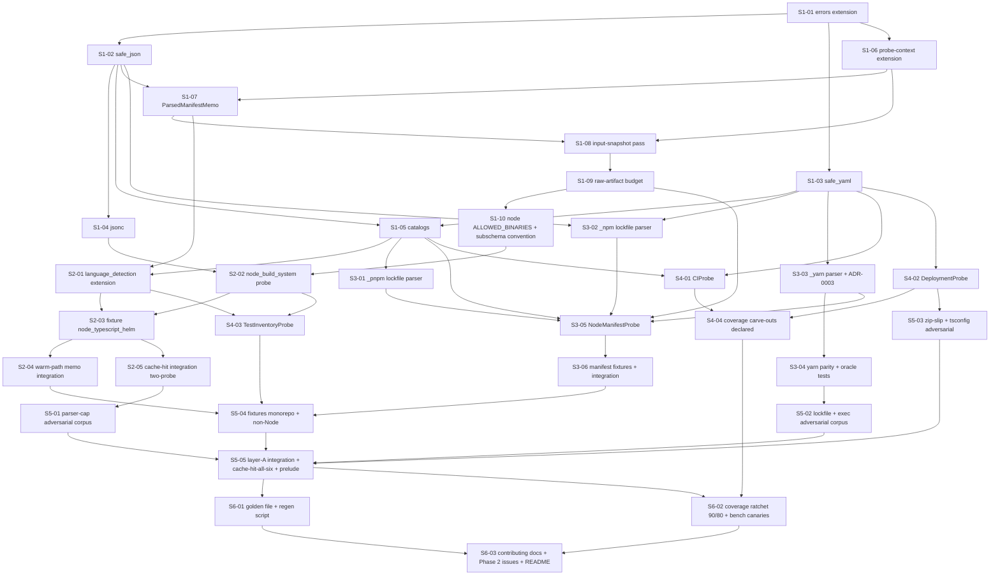

# Phase 1 — Context gathering: Layer A (Node.js): Stories manifest

**Status:** Backlog generated; ready for autonomous implementation
**Date:** 2026-05-12
**Phase architecture:** [../phase-arch-design.md](../phase-arch-design.md)
**Phase ADRs:** [../ADRs/](../ADRs/)
**Implementation plan:** [../High-level-impl.md](../High-level-impl.md)
**Source design:** [../final-design.md](../final-design.md)

## Executive summary

Phase 1 decomposes into **33 stories** across the 6 steps from [High-level-impl.md](../High-level-impl.md). The distribution is **10 / 5 / 6 / 4 / 5 / 3**. Step 1 is the densest because every probe in Phase 1 consumes the parsers, the `ParsedManifestMemo`, the pre-dispatch input-snapshot pass (Gap 1), the per-probe raw-artifact budget (Gap 2), the catalog loader, and the three Phase‑0 in-place edits — none of which compose without each other. The five probes (Steps 2–4) layer onto those primitives in dependency order: `LanguageDetectionProbe` extension + `NodeBuildSystemProbe` first (Step 2, smallest blast radius), `NodeManifestProbe` + the three lockfile sibling parsers next (Step 3, the densest probe step and the load-bearing seam for Phase 7), then the three structurally similar YAML-driven probes (Step 4). Step 5 lands the ten-fixture adversarial corpus + five integration tests pinning the roadmap exit criteria. Step 6 anchors the golden file, ratchets coverage to 90/80, and files Phase 2 follow-ups. Dependency DAG is mostly linear by step with **per-step parallelism** wherever two stories share only their step's foundation.

## How to use this backlog

1. Start at a story whose dependencies are satisfied (initially, S1-01).
2. Open story file. Read **Context**, **References**, **Goal**, **Acceptance criteria**.
3. Begin with the **TDD plan — red / green / refactor**. Write the failing test first.
4. Implement just enough to green.
5. Refactor.
6. Check every acceptance criterion. Update Status to `Done`.
7. Move to next satisfied story.

The order *within* a step is mostly fixed by S-numbering; cross-step parallelism is whatever the DAG allows.

## Definition of done (applies to every story)

- [ ] All acceptance criteria checked.
- [ ] TDD red test exists, committed, green.
- [ ] ADR-required tests written and green (e.g. ADR-0007 warning-ID pattern test; ADR-0004 `additionalProperties: false` rejection test).
- [ ] Code formatted (`ruff format`), lint clean (`ruff check`), `mypy --strict` on `src/` passes.
- [ ] No existing test disabled or weakened without explicit note in "Notes for the implementer".
- [ ] Story Status updated to `Done`.
- [ ] If story modifies an ADR-documented contract, that ADR's "Consequences" section reviewed for follow-ups.
- [ ] Coverage local check for any touched probe reported in the PR body (per "Implementation-level risks" #5 in `High-level-impl.md`).

## Dependency DAG (visual)

## Stories — by step

### Step 1: Plant shared primitives, sub-schema convention, and the three Phase-0 in-place edits

**Step goal:** Every primitive every Phase 1 probe consumes — parsers, memo, sub-schema chokepoint, catalogs, `node` allowlist entry — exists on disk and is unit-tested in isolation; the three ADR-gated in-place edits to Phase 0 code are landed.
**Step exit criteria mapping:** `ParsedManifestMemo` on `ProbeContext` (ADR-0002); `parsers/` module with `O_NOFOLLOW` + depth-walker; native-module catalog seeded (10 entries); `catalog_version` invalidation (ADR-0006); `node` in `ALLOWED_BINARIES` (ADR-0001); per-probe sub-schema `additionalProperties: false` convention (ADR-0004); warning-ID pattern (ADR-0007); input-snapshot pass (Gap 1); raw-artifact budget mechanism (Gap 2); Wave-1 prelude formalized; tokens-per-run = 0 (`fence` continues green); extension by addition (the three Phase-0 in-place edits land here and only here).

| ID | Title (slug → file) | Effort | Depends on | Summary (one sentence) |
|---|---|---|---|---|
| S1-01 | [Errors extension for parser + catalog typed exceptions (`S1-01-errors-extension`)](S1-01-errors-extension.md) | S | — | Extend `src/codegenie/errors.py` with `SizeCapExceeded`, `DepthCapExceeded`, `MalformedJSONError`, `MalformedYAMLError`, `MalformedLockfileError`, `CatalogLoadError`, each carrying file path + violated cap, and assert `SymlinkRefusedError` (Phase 0) is the typed exception `O_NOFOLLOW` raises. |
| S1-02 | [`safe_json` parser with `O_NOFOLLOW` + size + depth caps (`S1-02-safe-json-parser`)](S1-02-safe-json-parser.md) | M | S1-01 | Implement `src/codegenie/parsers/safe_json.py` — `os.open(..., O_RDONLY \| O_NOFOLLOW)`, pre-parse size check on the fd, stdlib `json.loads`, post-parse depth-walker (since `_json.c` lacks native depth limits), and the five-way exception map per [phase-arch-design.md §"Component design" #8](../phase-arch-design.md). |
| S1-03 | [`safe_yaml` parser with `CSafeLoader` + load_all (`S1-03-safe-yaml-parser`)](S1-03-safe-yaml-parser.md) | M | S1-01 | Implement `src/codegenie/parsers/safe_yaml.py` — `yaml.CSafeLoader` only (no `yaml.Loader`/`unsafe_load`), single-document `load` + multi-document `load_all`, same `O_NOFOLLOW` + size + post-parse depth walker pattern as `safe_json`; ADR-0009 (no new C-extension parser dependencies). |
| S1-04 | [`jsonc` comment-stripper feeding `safe_json` (`S1-04-jsonc-parser`)](S1-04-jsonc-parser.md) | S | S1-02 | Implement `src/codegenie/parsers/jsonc.py` — ~30-LOC state-machine comment stripper handling line + block + nested-block comments + strings containing `//`; chains into `safe_json.load`; pathological inputs (unterminated strings, deeply nested block comments) raise `MalformedJSONError` in < 1 s. |
| S1-05 | [Catalog loader with self-schema + `native_modules.yaml` + `ci_providers.yaml` seed (`S1-05-catalogs`)](S1-05-catalogs.md) | M | S1-02, S1-03 | Land `src/codegenie/catalogs/{__init__.py,native_modules.yaml,ci_providers.yaml,_schema.json}` per [phase-arch-design.md §"Component design" #10](../phase-arch-design.md); `MappingProxyType`-wrapped immutables, hard-fail at CLI startup on malformed YAML or schema mismatch (`CatalogLoadError`), `NATIVE_MODULES_CATALOG_VERSION` / `CI_PROVIDERS_CATALOG_VERSION` exported; seed `native_modules.yaml` with the 10 entries from [phase-arch-design.md §"Component design" #4](../phase-arch-design.md) (`bcrypt`, `sharp`, `better-sqlite3`, `node-canvas`, `node-rdkafka`, `node-pty`, `bufferutil`, `utf-8-validate`, `argon2`, `keytar`). |
| S1-06 | [`ProbeContext` extension — `parsed_manifest` + `input_snapshot` (`S1-06-probe-context-extension`)](S1-06-probe-context-extension.md) | M | S1-01 | The single Phase-0-contract amendment: extend `ProbeContext` in `src/codegenie/probes/base.py` with two additive fields (`parsed_manifest: Callable[...] \| None = None`, `input_snapshot: frozenset[InputFingerprint] \| None = None`) per ADR-0002; regenerate the contract snapshot script with the documented addition; encode the allowed field list **inside** the regen script so a third field fails CI; route `base.py` to `CODEOWNERS`. |
| S1-07 | [`ParsedManifestMemo` per-gather coordinator memo (`S1-07-parsed-manifest-memo`)](S1-07-parsed-manifest-memo.md) | M | S1-02, S1-06 | Implement `src/codegenie/coordinator/parsed_manifest_memo.py` per [phase-arch-design.md §"Component design" #3](../phase-arch-design.md) — keyed by `input_fingerprint.content_hash` (post-S1-08), `MappingProxyType` wrap, Phase-1 allowlist `{"package.json"}`, parse-failure no-cache (next call retries), per-gather lifetime; `probe.memo.hit` / `probe.memo.miss` events; coordinator injects `ctx.parsed_manifest=memo.get` on every `ProbeContext`. |
| S1-08 | [Pre-dispatch input-snapshot pass — Gap 1 (`S1-08-input-snapshot-pass`)](S1-08-input-snapshot-pass.md) | M | S1-06, S1-07 | Coordinator computes `(path, mtime_ns, size, content_hash)` for each probe's `declared_inputs` **once before dispatch**; freezes into `ctx.input_snapshot`; memo key derives from `content_hash` (not live `os.stat`); closes the TOCTOU-across-lockfile-read gap from [phase-arch-design.md §"Gap analysis" Gap 1](../phase-arch-design.md). |
| S1-09 | [Per-probe raw-artifact budget — Gap 2 (`S1-09-raw-artifact-budget`)](S1-09-raw-artifact-budget.md) | M | S1-08 | Add `Probe.declared_raw_artifact_budget_mb: int = 5` class attribute (additive, default unchanged for Phase 0 probes); coordinator tracks cumulative bytes written under `output_dir/raw/<probe>.json` and truncates with a marker at the budget boundary; emits `probe.raw_artifact.truncated` with original byte count per [phase-arch-design.md §"Gap analysis" Gap 2](../phase-arch-design.md). |
| S1-10 | [`node` in `ALLOWED_BINARIES` + per-probe sub-schema convention (`S1-10-node-allowlist-subschema-convention`)](S1-10-node-allowlist-subschema-convention.md) | S | S1-09 | Two ADR-gated edits: (a) extend `src/codegenie/exec.py` `ALLOWED_BINARIES` from `{"git"}` to `{"git", "node"}` (ADR-0001) — env-strip + `shell=False` unchanged; (b) land `src/codegenie/schema/probes/_subschema_convention.md` documenting ADR-0004 (every Phase 1 sub-schema sets `additionalProperties: false` at its own root; slices declared **optional** at the envelope `probes.*` level so non-Node repos validate); register `probe.parser.cap_exceeded`, `probe.memo.{hit,miss}`, `probe.catalog.load`, `probe.raw_artifact.truncated` event-name constants in `src/codegenie/logging.py`. |

### Step 2: Extend `LanguageDetectionProbe` and ship `NodeBuildSystemProbe`

**Step goal:** Two probes flow end-to-end through the existing coordinator + cache + validator + sanitizer + audit chain with the new memo + parsers + sub-schema convention all wired and exercising the warm-path memo + cache-hit logic.
**Step exit criteria mapping:** Useful `repo-context.yaml` on real Node repo (foundation); cache hits on second run (load-bearing test lands here for two probes; extended to all six in Step 5); per-probe sub-schemas with `additionalProperties: false` (`language_detection` extension + `node_build_system`); `node` allowlist consumed by `NodeBuildSystemProbe`.

| ID | Title (slug → file) | Effort | Depends on | Summary (one sentence) |
|---|---|---|---|---|
| S2-01 | [`LanguageDetectionProbe` extension — `framework_hints` + `monorepo` (`S2-01-language-detection-extension`)](S2-01-language-detection-extension.md) | S | S1-05, S1-07 | Extend `src/codegenie/probes/language_detection.py` in place per [phase-arch-design.md §"Component design" #1](../phase-arch-design.md): widen `declared_inputs` with monorepo markers, post-walk pass reading `package.json` via `ctx.parsed_manifest(...)`, framework dict-lookup against `dependencies + devDependencies` for `{nestjs, express, fastify, next, koa, hapi}`, monorepo marker detection (`pnpm-workspace.yaml`, `lerna.json`, `nx.json`, `turbo.json`, `package.json#workspaces`); extend `language_detection.schema.json` with `framework_hints: list[str]` + `monorepo: MonorepoBlock \| null` at sub-schema root with `additionalProperties: false`. |
| S2-02 | [`NodeBuildSystemProbe` (`S2-02-node-build-system-probe`)](S2-02-node-build-system-probe.md) | L | S1-04, S1-10 | Implement `src/codegenie/probes/node_build_system.py` per [phase-arch-design.md §"Component design" #2](../phase-arch-design.md): lockfile-precedence existence check (no parse), `package.json` via memo, `tsconfig.json` via `jsonc.load` with `extends` chain ≤ 4 levels + cycle detection, node-version precedence (`engines.node` → `.nvmrc` → `.node-version` → `.tool-versions`), optional `node --version` cross-check via `exec.run_allowlisted` with 5 s timeout + `^v\d+\.\d+\.\d+` regex parse, bundler dict-lookup, `package.json#scripts` recorded verbatim; ship `node_build_system.schema.json` with `BuildSystemSlice` shape per [phase-arch-design.md §"Data model"](../phase-arch-design.md); register the probe via explicit additive import in `probes/__init__.py`. |
| S2-03 | [Fixture `node_typescript_helm` (`S2-03-fixture-node-typescript-helm`)](S2-03-fixture-node-typescript-helm.md) | S | S2-01, S2-02 | Land `tests/fixtures/node_typescript_helm/` — TypeScript + pnpm + tsconfig + `.nvmrc` + an `express` dependency declared; this is the canonical fixture both Step 2 and Step 6's golden anchor reuse; minimal viable structure documented in the fixture's `README.md`. |
| S2-04 | [Warm-path memo integration test (`S2-04-warm-path-memo-integration`)](S2-04-warm-path-memo-integration.md) | S | S2-03 | `tests/integration/probes/test_language_detection_warm_path.py` — runs `codegenie gather` against `node_typescript_helm`; asserts `framework_hints == ["express"]`; asserts memo is hit on the second probe reading `package.json` (`probe.memo.hit` event count == 1, `probe.memo.miss` == 1); sub-schema rejection test (synthetic envelope with an extra field in `probes.node_build_system` → `SchemaValidationError`). |
| S2-05 | [Cache-hit-on-real-repo integration test (two probes) (`S2-05-cache-hit-integration-two-probe`)](S2-05-cache-hit-integration-two-probe.md) | M | S2-03 | Load-bearing Phase 1 exit criterion #2: `tests/integration/probes/test_cache_hit_on_real_repo.py` — gather `node_typescript_helm` twice; assert `os.scandir` invocation count is **zero** on second run (monkeypatched at `codegenie.probes.language_detection.os.scandir`); both `LanguageDetectionProbe` and `NodeBuildSystemProbe` report `ProbeExecution.CacheHit`; redundant `probe.cache_hit` structlog assertion; extends in Step 5 to all six probes. |

### Step 3: Ship `NodeManifestProbe` and the three lockfile parsers

**Step goal:** The load-bearing probe for Phase 7 is on disk; each of pnpm, npm, yarn lockfile formats parses end-to-end with size + depth caps; native-module catalog cross-reference produces hits on a fixture portfolio; ADR-0003 (`pyarn` vs hand-rolled) is decided at land-time.
**Step exit criteria mapping:** Useful `repo-context.yaml` (manifests slice); cache hits (extended to `node_manifest` in Step 5); per-probe sub-schema (`node_manifest.schema.json`); native-module catalog consumed; raw-artifact budget exercised at 25 MB override; yarn-parser two-direction parity (Gap 3); ADR-0006 catalog versioning consumed end-to-end.

| ID | Title (slug → file) | Effort | Depends on | Summary (one sentence) |
|---|---|---|---|---|
| S3-01 | [`_pnpm` lockfile parser (`S3-01-pnpm-lockfile-parser`)](S3-01-pnpm-lockfile-parser.md) | S | S1-05 | Implement `src/codegenie/probes/_lockfiles/_pnpm.py` per [phase-arch-design.md §"Component design" #9](../phase-arch-design.md) — thin `safe_yaml.load` wrapper returning a `PnpmLock` `TypedDict`; happy-path + `SizeCapExceeded` + `DepthCapExceeded` + `MalformedLockfileError` paths covered. |
| S3-02 | [`_npm` lockfile parser (`S3-02-npm-lockfile-parser`)](S3-02-npm-lockfile-parser.md) | S | S1-02, S1-03 | Implement `src/codegenie/probes/_lockfiles/_npm.py` — thin `safe_json.load` wrapper returning an `NpmLock` `TypedDict`; same failure path coverage as S3-01. |
| S3-03 | [`_yarn` lockfile parser + ADR-0003 finalization (`S3-03-yarn-lockfile-parser`)](S3-03-yarn-lockfile-parser.md) | L | S1-03 | Implement `src/codegenie/probes/_lockfiles/_yarn.py` with `_HAS_PYARN: bool` module-level guard selecting `pyarn` if available, else a hand-rolled line-by-line state-machine scanner (no regex over the full file); declare `pyarn` under `[project.optional-dependencies] gather` in `pyproject.toml`; ensure `fence` job continues to confirm `pyarn` is not an LLM SDK; finalize ADR-0003 in the PR (pin `pyarn` last-release date in the ADR body; if unmaintained, default flips to hand-rolled before merge); local fuzz the hand-rolled scanner against pathological `yarn.lock` mutations **before** opening the PR. |
| S3-04 | [Yarn parser parity + property-based oracle tests — Gap 3 (`S3-04-yarn-parser-parity-oracle`)](S3-04-yarn-parser-parity-oracle.md) | M | S3-03 | Two-direction validation per [phase-arch-design.md §"Gap analysis" Gap 3](../phase-arch-design.md): (a) `tests/unit/probes/_lockfiles/test_yarn_parser_parity.py` — fixture-based: both `pyarn` (skipped if unavailable) and hand-rolled produce the same `YarnLock` `TypedDict` on a curated corpus; (b) `tests/unit/probes/_lockfiles/test_yarn_parser_oracle.py` — property-style: every name in output appears in lockfile text; every version against the corresponding name; dependency-block count consistent — invariants derived from lockfile bytes themselves so a divergence trips both parsers. |
| S3-05 | [`NodeManifestProbe` + sub-schema + catalog cross-reference (`S3-05-node-manifest-probe`)](S3-05-node-manifest-probe.md) | L | S3-01, S3-02, S3-03, S1-05, S1-09 | Implement `src/codegenie/probes/node_manifest.py` per [phase-arch-design.md §"Component design" #4](../phase-arch-design.md): `declared_inputs` includes `src/codegenie/catalogs/native_modules.yaml` (so catalog edits invalidate `node_manifest` cache entries — ADR-0006); `declared_raw_artifact_budget_mb = 25` (override of the S1-09 default 5 MB); `package.json` via memo; lockfile parse via the chosen sibling; native-module catalog dict-lookup against resolved deps; multi-lockfile → `confidence: low`, `lockfile.multi_present`; ship `node_manifest.schema.json` with `ManifestsSlice` + `ManifestEntry` + `NativeModulesBlock` + `NativeModuleHit` per [phase-arch-design.md §"Data model"](../phase-arch-design.md), `additionalProperties: false` at root + every nested block; register the probe via explicit additive import. |
| S3-06 | [Manifest fixtures + integration tests + catalog-invalidation scope test (`S3-06-manifest-fixtures-integration`)](S3-06-manifest-fixtures-integration.md) | M | S3-05 | Land `tests/fixtures/node_pnpm_native/` (pnpm + `bcrypt` + `sharp`) and `tests/fixtures/node_yarn_legacy/` (yarn classic + `yarn.lock`); ship `tests/integration/probes/test_node_manifest_pnpm_native.py` asserting `manifests.native_modules.detected == True` with `bcrypt` + `sharp` entries having `requires_node_gyp: true`; `tests/integration/probes/test_node_manifest_yarn_legacy.py` asserting both `pyarn` and hand-rolled paths produce identical slices under `_HAS_PYARN` monkeypatch; `tests/unit/test_cache_invalidation_scope.py` extended to verify editing `native_modules.yaml` invalidates **only** `node_manifest` cache entries (ADR-0006); 30 MB synthetic lockfile truncates at 25 MB with `probe.raw_artifact.truncated` event. |

### Step 4: Ship `CIProbe`, `DeploymentProbe`, and `TestInventoryProbe`

**Step goal:** The three remaining YAML-driven Layer A probes exist on disk with sub-schemas and unit tests, completing the six-probe Layer A inventory.
**Step exit criteria mapping:** Useful `repo-context.yaml` (`ci`, `deployment`, `test_inventory` slices); per-probe sub-schemas with `additionalProperties: false`; coverage carve-outs declared (ADR-0005); zip-slip mitigation for kustomize.

| ID | Title (slug → file) | Effort | Depends on | Summary (one sentence) |
|---|---|---|---|---|
| S4-01 | [`CIProbe` + sub-schema (`S4-01-ci-probe`)](S4-01-ci-probe.md) | M | S1-03, S1-05 | Implement `src/codegenie/probes/ci.py` per [phase-arch-design.md §"Component design" #5](../phase-arch-design.md) — `ci_providers.yaml` lookup, GitHub Actions parser via `safe_yaml.load` per workflow file (10 MB cap each, depth 64), job + `run:` command extraction, image-build detection by substring match (`docker build`, `docker buildx`, `docker/build-push-action`), `${{ secrets.* }}` references recorded as literal strings in `references_secrets` (never resolved), GitLab CI via `safe_yaml.load`, Jenkinsfile via bounded regex `sh '...'` / `sh "..."` (single capture group, line-bounded) → `confidence: low`, CircleCI / Azure Pipelines presence-only stubs, multi-provider → `additional_providers` populated and `confidence: low`; ship `ci.schema.json` with `additionalProperties: false` at root + every nested block. |
| S4-02 | [`DeploymentProbe` + sub-schema with zip-slip mitigation (`S4-02-deployment-probe`)](S4-02-deployment-probe.md) | L | S1-03 | Implement `src/codegenie/probes/deployment.py` per [phase-arch-design.md §"Component design" #6](../phase-arch-design.md) — type detection by file marker (`Chart.yaml` / `kustomization.yaml` / raw `kind: Deployment` / `*.tf`); Helm parses `Chart.yaml` + `values*.yaml`; multi-env → `environments: list[EnvironmentEntry]` per ADR-0012 (nullable primary `image_reference`); Kustomize follows `resources:` one level deep with `repo_root` containment check using `Path.resolve()` then `is_relative_to` (3.12) / manual walk (3.11) — load-bearing zip-slip mitigation → `kustomization_resource_path_outside_repo: true` + warning; overlay traversal capped at depth 5 + 50 total files; raw manifests via `safe_yaml.load_all` filtered to `kind ∈ {Deployment, StatefulSet, DaemonSet, Pod}`; Terraform paths-only (no `python-hcl2` per ADR-0011); ship `deployment.schema.json` with `additionalProperties: false` and `environments: list` shape (ADR-0012). |
| S4-03 | [`TestInventoryProbe` + sub-schema + lcov scanner (`S4-03-test-inventory-probe`)](S4-03-test-inventory-probe.md) | M | S2-01, S2-02 | Implement `src/codegenie/probes/test_inventory.py` per [phase-arch-design.md §"Component design" #7](../phase-arch-design.md) — framework dict-lookup against deps for `{vitest, jest, mocha, tap, @playwright/test, cypress}`; `node:test` only if `engines.node >= 18` AND no other framework; single `os.walk` over `*.test.*` + `*.spec.*` with Phase 0 noise-dir exclusions; `unit_test_file_count: int` + companion `unit_test_count_is_file_count: true` boolean signaling the limitation; `package.json#scripts` extraction (`test`, `test:unit`, `test:integration`, `test:smoke`, `test:e2e`, `test:coverage`); smoke-script presence via `Path.exists()`; `coverage/lcov.info` parsed by a 40-LOC stdlib line-scanner (50 MB cap, **no regex backtracking** — adversarially tested in S5-03 but local fuzzed before merge); ship `test_inventory.schema.json` with `additionalProperties: false`. |
| S4-04 | [Coverage carve-outs declared in pyproject (`S4-04-coverage-carve-outs`)](S4-04-coverage-carve-outs.md) | S | S4-01, S4-02 | Declare per-module coverage carve-out (85% line / 75% branch) for `src/codegenie/probes/deployment.py` and `src/codegenie/probes/ci.py` in `pyproject.toml` per ADR-0005; the global gate stays at the Phase 0 floor in this step (the ratchet to 90/80 happens in S6-02); document carve-outs in `docs/contributing.md` (added in S6-03). |

### Step 5: Adversarial corpus + integration end-to-end + fixture portfolio

**Step goal:** Ten adversarial fixtures pin every structural defense; five integration tests run end-to-end through the CLI against the new fixture portfolio; roadmap exit criteria are demonstrably green in CI.
**Step exit criteria mapping:** Hard caps in every parser (size + depth + `O_NOFOLLOW`); adversarial corpus ≥ 20 hostile inputs (10 new + ≥ 10 inherited from Phase 0); cache hits on second run **all six Layer A probes**; non-Node-repo correctness (envelope validates with only `language_stack`); monorepo detection; coordinator Wave-1 prelude pass formalized; `LanguageDetectionProbe` snapshot fields propagated to Wave 2.

| ID | Title (slug → file) | Effort | Depends on | Summary (one sentence) |
|---|---|---|---|---|
| S5-01 | [Parser-cap adversarial corpus — billion-laughs, JSON bombs, oversized lockfile (`S5-01-adversarial-parser-caps`)](S5-01-adversarial-parser-caps.md) | M | S2-05 | Land four adversarial tests: `tests/adv/test_yaml_billion_laughs.py` (adversarial `pnpm-lock.yaml` triggers `DepthCapExceeded`, gather exits 0); `tests/adv/test_json_bomb_deep_nesting.py` (10,000-nested-object `package.json` triggers depth cap); `tests/adv/test_json_bomb_huge_string.py` (600 MB single-string `package.json` triggers size cap **pre-parse**; fixture generated at test setup, not checked in); `tests/adv/test_oversized_lockfile.py` (60 MB `pnpm-lock.yaml` triggers size cap); each test asserts the **specific** typed exception, not just exit code 0. |
| S5-02 | [Lockfile + exec adversarial corpus — yarn regex-DoS, planted `node` shim, unsafe YAML tag (`S5-02-adversarial-lockfile-exec`)](S5-02-adversarial-lockfile-exec.md) | M | S3-04 | Land three adversarial tests: `tests/adv/test_regex_dos_yarn_lock.py` — pathological `yarn.lock` (active when `_HAS_PYARN = False` is forced); parser completes in < 1 s; `tests/adv/test_planted_node_on_path_ignored.py` — hostile `node` shim on `$PATH` (writes to a sentinel file when invoked); env-strip verified — no `OPENAI_API_KEY` / `ANTHROPIC_API_KEY` / `GITHUB_TOKEN` / `AWS_*` / `SSH_AUTH_SOCK` reaches the child; sentinel-file mechanism asserts the strip; `tests/adv/test_yaml_unsafe_tag.py` — `pnpm-lock.yaml` with `!!python/object`; `CSafeLoader` refuses; sentinel side-effect never observed. |
| S5-03 | [Zip-slip + symlink escape + tsconfig pathological adversarial (`S5-03-adversarial-zip-slip-symlink-tsconfig`)](S5-03-adversarial-zip-slip-symlink-tsconfig.md) | M | S4-02 | Land three adversarial tests: `tests/adv/test_symlink_escape_in_declared_inputs.py` — `package.json` symlink to `/etc/passwd`; `O_NOFOLLOW` open fails; sensitive contents **never** in YAML output; `tests/adv/test_zip_slip_kustomize.py` — `kustomization.yaml` with `resources: ["../../etc/passwd"]` refused with `kustomization.resource_outside_repo` warning; valid resources still processed in the same gather; `tests/adv/test_tsconfig_pathological.py` — deeply nested block comments + unterminated string + circular `extends`; `jsonc.py` either parses or raises typed error in < 1 s. |
| S5-04 | [Fixtures `node_monorepo_turbo` + `non_node_go` (`S5-04-fixtures-monorepo-non-node`)](S5-04-fixtures-monorepo-non-node.md) | S | S2-04, S3-06, S4-03 | Land `tests/fixtures/node_monorepo_turbo/` (turbo + `package.json#workspaces`) and `tests/fixtures/non_node_go/` (Go-only); both fixtures documented in their `README.md`; the monorepo fixture exercises the `LanguageDetectionProbe` monorepo block; the Go-only fixture exercises the envelope-with-only-`language_stack` path required by ADR-0010 (Layer A slices optional at envelope). |
| S5-05 | [Layer A end-to-end integration + cache-hit-all-six + non-Node + prelude pass (`S5-05-integration-end-to-end`)](S5-05-integration-end-to-end.md) | M | S5-01, S5-02, S5-03, S5-04 | Five integration tests: `tests/integration/probes/test_layer_a_end_to_end.py` (gather `node_typescript_helm` cold; all six Layer A slices populated; envelope + six sub-schemas pass; audit anchor re-computes — **roadmap Phase 1 exit criterion #1**); extend S2-05's `test_cache_hit_on_real_repo.py` to assert **all six probes** report `CacheHit` on second run (**exit criterion #2**); `tests/integration/probes/test_non_node_repo.py` (gather `non_node_go`; envelope validates with only `language_stack`; the five Phase-1 Node probes filtered out by `for_task`); `tests/integration/probes/test_monorepo_turbo.py` (`language_detection.monorepo` populated; root-level `node_build_system` slice produced); `tests/integration/probes/test_coordinator_prelude.py` (Wave-1 LD completes before Wave-2 dispatch; `enriched_snapshot.detected_languages` populated when Wave 2 probes run). |

### Step 6: Golden file, coverage ratchet, bench additions, Phase 2 handoff

**Step goal:** The single golden file anchors Phase 2's expansion convention; coverage ratchet to 90/80 with documented carve-outs holds in CI; two new bench canaries run advisory; Phase 2 follow-up issues filed.
**Step exit criteria mapping:** Golden file seeded for `node_typescript_helm`; coverage ratchet 90/80 with 85/75 carve-outs; wall-clock targets (advisory) via bench canaries; Phase 2 follow-up issues filed; `docs/contributing.md` cheat sheet updated; Phase 1 README exit-criteria checklist marked complete.

| ID | Title (slug → file) | Effort | Depends on | Summary (one sentence) |
|---|---|---|---|---|
| S6-01 | [Golden file `node_typescript_helm` + `regen_golden.py` (`S6-01-golden-file-regen`)](S6-01-golden-file-regen.md) | M | S5-05 | Land `tests/golden/node_typescript_helm.repo-context.yaml` (canonical key-sorted YAML) and `scripts/regen_golden.py` (re-runs `codegenie gather` against `tests/fixtures/node_typescript_helm/`, writes the golden in canonical ordering; **excludes** wall-clock + audit-timestamp fields to keep the diff deterministic); the integration end-to-end test (S5-05) diffs live output against the golden as a hard CI gate; verify byte-identical output across two consecutive regen runs **locally** before merge per "Implementation-level risks" #6 in [High-level-impl.md](../High-level-impl.md). |
| S6-02 | [Coverage ratchet to 90/80 + warm-path + per-probe RSS bench canaries (`S6-02-coverage-ratchet-bench`)](S6-02-coverage-ratchet-bench.md) | M | S5-05, S4-04 | Update `pyproject.toml` `--cov-fail-under=90` (line) with branch floor 80%; per-module carve-outs at 85/75 for `probes/deployment.py` and `probes/ci.py` (ADR-0005); land `tests/bench/test_warm_path_latency.py` (second-run wall-clock ratio ≤ 0.25 of first-run, advisory PR comment) and `tests/bench/test_per_probe_rss.py` (`tracemalloc` per probe vs component-section RSS budgets, advisory); neither blocks merge; Step 6 PR cannot merge if any probe falls below its module floor — surface percentages in the PR body. |
| S6-03 | [Contributor docs + Phase 2 follow-up issues + Phase 1 README close (`S6-03-contributing-docs-phase2-handoff`)](S6-03-contributing-docs-phase2-handoff.md) | S | S6-01, S6-02 | Update `docs/contributing.md` with the "adding a probe" cheat sheet referencing Phase 1 probes as canonical examples (keep in `mkdocs build --strict` curated `nav`); file five Phase 2 follow-up issues on the GitHub Project board with milestones aligned to `roadmap.md` §"Phase 2": (1) implement `IndexHealthProbe (B2)` — the load-bearing Phase 2 probe; (2) promote `WarningId` to a typed enum ([phase-arch-design.md §"Open questions" #7](../phase-arch-design.md)); (3) decide per-probe sub-schema release-versioning policy (open question #2); (4) extend memo allowlist beyond `{"package.json"}` for Layer B/C/D index manifests; (5) coverage ratchet to 92/82 in Phase 2; update `docs/phases/01-context-gather-layer-a-node/README.md` exit-criteria checklist marked complete. |

## Cross-cutting concerns

Things that don't belong to any one step but apply across stories.

- **Strict type-checking + lint:** every story passes `ruff check`, `ruff format --check`, and `mypy --strict` on touched `src/` code. Enforced via Definition of Done; no per-story acceptance criterion repeats it.
- **Structured logging via `structlog`:** every story introducing new logged behavior emits one of the Phase-1 event constants (`probe.parser.cap_exceeded`, `probe.memo.{hit,miss}`, `probe.catalog.load`, `probe.raw_artifact.truncated`) and includes a log-emission assertion in at least one test.
- **Snapshot-frozen contracts (ADR-0002 + Phase-0 ADR-0007):** only S1-06 touches `ProbeContext`; the regen script encodes the allowed field list so a third field fails CI. `CODEOWNERS` gates `probes/base.py` reviews.
- **Chokepoint preservation:** every probe goes through the Phase-0 `_ProbeOutputValidator → OutputSanitizer.scrub → SchemaValidator → CacheStore.put` chain unchanged. Stories that touch Phase-0 code must explicitly justify the edit in "Notes for the implementer" and reference the gating ADR (only ADR-0001, ADR-0002, ADR-0004 license edits in Phase 1).
- **Warning-ID pattern (ADR-0007):** every typed warning emitted by a Phase-1 probe matches `^[a-z][a-z0-9_]*\.[a-z][a-z0-9_]*$`; sub-schema validates it via `pattern` constraint on each `warnings[]` array.
- **`additionalProperties: false` at sub-schema root (ADR-0004):** every Phase-1 sub-schema (S2-01 extension, S2-02, S3-05, S4-01, S4-02, S4-03) ships with an explicit "extra-field rejection" unit test asserting the failing JSON Pointer.
- **Per-probe local coverage report:** stories S2-01 / S2-02 / S3-05 / S4-01 / S4-02 / S4-03 each report local coverage for the new probe in their PR body — the S6-02 ratchet cannot recover if any of these came in under floor.

## Exit-criteria coverage

Every Phase 1 exit criterion from [roadmap.md §"Phase 1"](../../../roadmap.md) and every refined exit criterion from [phase-arch-design.md §"Goals"](../phase-arch-design.md) traces to a story.

| Exit criterion (verbatim or close) | Story / stories |
|---|---|
| Useful `repo-context.yaml` produced on a real Node.js repo | S5-05 (`test_layer_a_end_to_end.py`); S2-01, S2-02, S3-05, S4-01, S4-02, S4-03 (probes that fill it) |
| Cache hits on second run (all six Layer A probes) | S2-05 (two probes); S5-05 (extended to all six) |
| All probes pass schema validation | S2-01, S2-02, S3-05, S4-01, S4-02, S4-03 (per-probe sub-schemas); S5-05 (envelope validation in integration tests) |
| Per-probe unit tests against fixture repos | S2-01, S2-02, S3-05, S4-01, S4-02, S4-03 each ship probe unit tests with the probe |
| Integration test against a real small open-source Node.js repo | S5-05 (`node_typescript_helm` is the proxy; substitute real repo at land-time if available) |
| Schema validation enforced as a CI gate | S1-10 (per-probe sub-schema convention) + S5-05 (integration test) |
| Probe contract `localv2.md §4` preserved (snapshot test green) | S1-06 (ADR-0002 amendment regenerates snapshot) |
| Hard caps in every parser (5 MB / 50 MB / depth 64) | S1-02, S1-03, S1-04 (parsers) + S5-01 (adversarial corpus) |
| Adversarial corpus ≥ 20 hostile inputs producing zero RCE / OOM | S5-01 + S5-02 + S5-03 (10 dedicated + ≥ 10 inherited from Phase 0) |
| Coverage ratchet 90/80 with 85/75 carve-outs | S4-04 (carve-outs declared) + S6-02 (gate raised) |
| Wall-clock targets (advisory): cold 4 s / warm 0.4 s / incremental 1 s p50 | S6-02 (bench canaries) |
| Tokens per run = 0 (`fence` job continues to assert) | S3-03 (pyarn declared as optional, verified non-LLM by fence); S1-05 (catalog deps) |
| Extension by addition holds (exactly three Phase 0 edits) | S1-06 (`ProbeContext`) + S2-01 (LanguageDetection extension) + S1-10 (`ALLOWED_BINARIES`); all other Phase-1 code lands as new files |
| `ParsedManifestMemo` on `ProbeContext` (ADR-0002) | S1-06, S1-07 |
| `parsers/` module with `O_NOFOLLOW` opens and depth-walker | S1-02, S1-03, S1-04 |
| Native-module catalog seeded with 10 entries; `catalog_version` invalidation | S1-05 (catalog) + S3-05 (consumed by `NodeManifestProbe`) + S3-06 (invalidation-scope test) |
| Warning ID pattern (ADR-0007) | S1-10 (convention registered) + S2-01, S2-02, S3-05, S4-01, S4-02, S4-03 (used by each probe) |
| `node` in `ALLOWED_BINARIES` (ADR-0001) | S1-10 (allowlist) + S2-02 (consumed by `NodeBuildSystemProbe`) |
| Per-probe sub-schemas with `additionalProperties: false` at root (ADR-0004) | S1-10 (convention) + S2-01, S2-02, S3-05, S4-01, S4-02, S4-03 (each probe ships its sub-schema) |
| Input-snapshot pass closes Gap 1 (TOCTOU window) | S1-08 |
| Per-probe raw-artifact budget closes Gap 2 | S1-09 (mechanism) + S3-05 (exercised by `NodeManifestProbe` at 25 MB override) + S3-06 (truncation test) |
| Yarn-parser two-direction parity (Gap 3) | S3-04 (`test_yarn_parser_oracle.py`) |
| Wave-1 prelude formalized (Phase 0 gap #4 carried forward) | S1-07 (coordinator extension) + S5-05 (`test_coordinator_prelude.py`) |
| Layer A slices declared optional at envelope level (ADR-0010) | S1-10 (convention) + S5-05 (`test_non_node_repo.py`) |
| Golden file seeded for `node_typescript_helm` | S6-01 |
| Phase 2 follow-up issues filed | S6-03 |
| Coverage carve-outs for `deployment.py` + `ci.py` (ADR-0005) | S4-04 (declared) + S6-02 (enforced at ratchet) |
| No Helm render / no HCL / no `npm ls` (ADR-0011) | S4-02 (Helm paths-only; Terraform paths-only); S3-05 (no `npm ls`) |
| Multi-env Helm as `environments: list` (ADR-0012) | S4-02 |

No exit criterion is unmapped.

## Open implementation questions

Surfaced from [phase-arch-design.md §"Open questions deferred to implementation"](../phase-arch-design.md) and [ADRs/README.md "Decisions noted but not yet documented"](../ADRs/README.md). Each is named with the story most likely to surface it.

1. **`pyarn` adoption rule at land-time** (ADR-0003): implementer confirms `pyarn` maintenance status (< 18 months since last release) and fixture conformance. If unmaintained, hand-rolled becomes default. — resolved in **S3-03** (PR-review checklist explicitly requires "ADR-0003 status: accepted, `pyarn` last-release-date pinned").
2. **Per-probe sub-schema versioning policy** (open question #2): Phase 1 lands v1 sub-schemas; release-versioning deferred to Phase 2. — filed as a Phase 2 follow-up in **S6-03**.
3. **`packageManager` field handling** (open question #3): `package.json#packageManager` may disagree with the lockfile; recommendation: prefer lockfile, emit `package_manager.declaration_lockfile_disagree`. — first arises in **S2-02**; document outcome in the story's "Notes for the implementer".
4. **GitHub Actions parser depth — reusable workflows** (open question #4): Phase 1 records `uses:` references as paths only; deepening deferred. — first arises in **S4-01**.
5. **Helm template rendering** (open question #5): no rendering in Phase 1; documented in `deployment` sub-schema. — encoded in **S4-02**.
6. **Multi-environment Helm `image_reference` consumer contract** (open question #6 + ADR-0012): `environments: list` shape with nullable primary; Phase 3+ consumers must handle the list shape. — documented in **S4-02**.
7. **Typed warning enum** (open question #7): Phase 1 ships the pattern constraint as minimum defense; promotion to enum deferred to Phase 2. — filed as Phase 2 follow-up in **S6-03**.
8. **Pre-dispatch input-snapshot pass on `ProbeContext`** (open question #8 + ADR README "Decisions noted but not yet documented" #1): Phase 1 **does** land it (S1-08). The residual concern (do we ADR-amend ADR-0002 to cover both fields explicitly?) — resolved in **S1-06** (single ADR-0002 amendment covers both `parsed_manifest` and `input_snapshot`; allowed-field list encoded in regen script).
9. **Probe-version constants** (open question #9): Phase 1 establishes the convention by example — each new probe in S2-02 / S3-05 / S4-01 / S4-02 / S4-03 sets its `version: str` class attribute and bumps it as part of any code-change PR. — first arises in **S2-02**.
10. **Raw-artifact size budget ADR formalization** (ADR README "Decisions noted but not yet documented" #2): the mechanism lands in S1-09, but whether to ADR-amend or carry to Phase 14's resource-enforcement story is a judgment call. — resolved in **S1-09** (recommend amendment to ADR-0002 documenting `declared_raw_artifact_budget_mb` alongside the two `ProbeContext` fields).
11. **Wave-1 prelude formalization as its own ADR** (ADR README "Decisions noted but not yet documented" #3): the prelude lands as coordinator behavior in S1-07; ADR creation is optional. — implementer judgment in **S1-07**; if the prelude grows beyond `LanguageDetectionProbe` (e.g., Phase 2's `IndexHealthProbe`), file an ADR then.

## Backlog stats

- **Total stories:** 33
- **Stories per step:** Step 1: 10 · Step 2: 5 · Step 3: 6 · Step 4: 4 · Step 5: 5 · Step 6: 3
- **Effort distribution:** S = 10 · M = 17 · L = 6 (S2-02 `NodeBuildSystemProbe`; S3-03 `_yarn` + ADR-0003; S3-05 `NodeManifestProbe`; S4-02 `DeploymentProbe`; plus S1-* density — none individually L but Step 1 in aggregate is the heaviest)
- **Longest dependency chain:** **11 stories** — `S1-01 → S1-02 → S1-05 → S3-01 → S3-05 → S3-06 → S5-04 → S5-05 → S6-01 → S6-03` (10 edges; ties the golden-file-anchored end-to-end path).
- **Cross-step parallelism windows:** within Step 1 after S1-01, `safe_json` (S1-02) and `safe_yaml` (S1-03) parallel; after S1-06, the memo (S1-07) and contract-extension regen are sequenced but lockfile parsers (S3-01 / S3-02 / S3-03) parallelize once S1-05 + S1-02 + S1-03 land; within Step 4, the three probes (S4-01 / S4-02 / S4-03) parallel once Step 2 + S1-05 + S1-03 are merged.
- **Gap-analysis-driven stories** (`phase-arch-design.md §"Gap analysis"`): S1-08 (Gap 1 input-snapshot), S1-09 (Gap 2 raw-artifact budget), S3-04 (Gap 3 yarn-parser oracle), S3-05 (Gap 2 exercised at 25 MB override).
- **Phase-0 in-place edits** (exactly three, all ADR-gated): S1-10 (`ALLOWED_BINARIES += "node"`, ADR-0001); S1-06 (`ProbeContext` two-field extension, ADR-0002); S2-01 (`LanguageDetectionProbe` extension, Phase 0 §2.10 deferral). Every other Phase-1 file is new.
