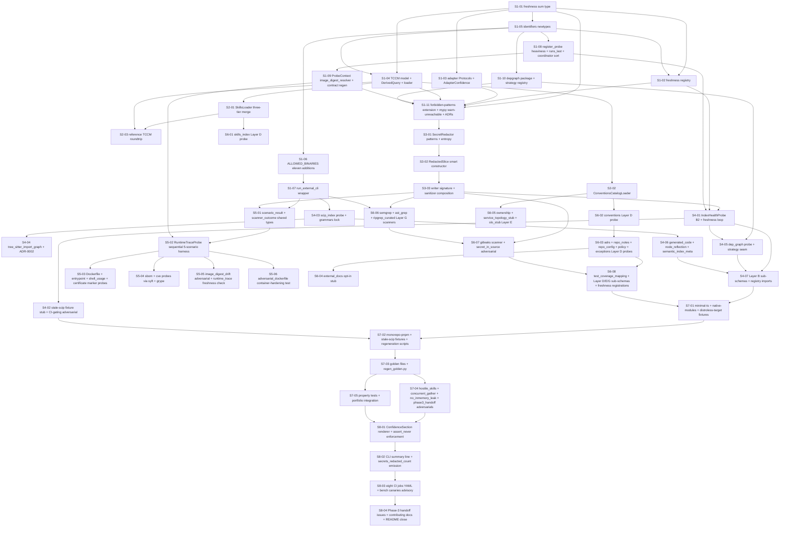

# Phase 02 — Context gathering — Layers B–G: Stories manifest

**Status:** Backlog generated; ready for autonomous implementation
**Date:** 2026-05-14
**Phase architecture:** [../phase-arch-design.md](../phase-arch-design.md)
**Phase ADRs:** [../ADRs/](../ADRs/)
**Implementation plan:** [../High-level-impl.md](../High-level-impl.md)
**Source design:** [../final-design.md](../final-design.md)

## Executive summary

Phase 2 decomposes into **47 stories** across the 8 steps from [High-level-impl.md](../High-level-impl.md). The distribution is **11 / 3 / 3 / 7 / 6 / 8 / 5 / 4**. Step 1 is the densest because every probe in Phase 2 consumes seven new packages, nine new ADRs, eleven `ALLOWED_BINARIES` additions, two decorator-registries, the coordinator sort-order edit, and one Phase-0-contract amendment (`ProbeContext.image_digest_resolver`) — and **none** of those compose without each other (Implementation risk #1). The probes ship in dependency order: **kernel-side loaders + reference TCCM (Step 2) → `SecretRedactor` chokepoint (Step 3, must precede any scanner) → load-bearing `IndexHealthProbe` + Layer B (Step 4) → Layer C runtime/container (Step 5) → Layer D/E/G evidence-from-docs + scanners (Step 6) → five-repo fixture portfolio + adversarial corpus (Step 7) → Confidence renderer + eight CI jobs + Phase-3 handoff (Step 8)**. The load-bearing CI gate is `tests/adv/phase02/test_stale_scip_fixture.py` — `IndexHealthProbe` (B2) must catch the deliberately-seeded staleness in `tests/fixtures/portfolio/stale-scip/`; this is the roadmap exit criterion. Within steps, parallelism follows the DAG; cross-step parallelism is bounded by the four shared chokepoints (newtypes, `run_external_cli`, `IndexFreshness` registry, `RedactedSlice`).

## How to use this backlog

1. Start at a story whose dependencies are satisfied (initially, S1-01).
2. Open the story file. Read **Context**, **References**, **Goal**, **Acceptance criteria**.
3. Begin with the **TDD plan — red / green / refactor**. Write the failing test first.
4. Implement just enough to green.
5. Refactor.
6. Check every acceptance criterion. Update Status to `Done`.
7. Move to the next satisfied story.

The order *within* a step is mostly fixed by S-numbering; cross-step parallelism is whatever the DAG allows.

## Definition of done (applies to every story)

- [ ] All acceptance criteria checked.
- [ ] TDD red test exists, committed, green.
- [ ] ADR-required tests written and green (e.g. ADR-0003 sort-order test; ADR-0010 single-public-constructor test; ADR-0005 zero-plaintext assertion).
- [ ] Code formatted (`ruff format`), lint clean (`ruff check`), `mypy --strict` on `src/` passes; `mypy --warn-unreachable` per-module overrides pass for `codegenie.{indices, probes.layer_b.index_health, report, adapters, tccm}/**` where touched.
- [ ] No existing test disabled or weakened without explicit note in "Notes for the implementer".
- [ ] Phase 0 `fence` (no `anthropic`/`openai`/`langgraph`/`httpx`/`requests`/`socket` import under `src/codegenie/`) stays green.
- [ ] Phase 0 `contract-freeze` snapshot stays green (only ADR-0004's `image_digest_resolver` field is permitted to widen `ProbeContext`; further drift fails).
- [ ] `forbidden-patterns` pre-commit holds — `model_construct` banned under `src/codegenie/{indices,tccm,skills,conventions,adapters,depgraph,output}/**`.
- [ ] Story Status updated to `Done`.
- [ ] If story modifies an ADR-documented contract, that ADR's "Consequences" section reviewed for follow-ups.

## Dependency DAG (visual)

## Stories — by step

### Step 1: Plant new domain primitives, kernel contracts, and the nine new ADRs

**Step goal:** Every typed surface every Phase 2 component will consume — `IndexFreshness`, adapter `Protocol`s, `AdapterConfidence`, `TCCM`/`DerivedQuery` models, ADR-0033 newtypes, `run_external_cli`, `@register_probe(heaviness=, runs_last=)` decorator kwargs, the `ProbeContext.image_digest_resolver` extension, the depgraph strategy registry, the `forbidden-patterns` + `mypy --warn-unreachable` rollouts, and the nine new ADRs — exists on disk, type-strict, and unit-tested in isolation before any probe ships.
**Step exit criteria mapping:** `IndexFreshness` sum type (G4); adapter Protocols + `AdapterConfidence` (G9 kernel scaffolding); `TCCM` + `DerivedQuery` (G9); ADR-0033 newtypes; `run_external_cli` (G6 subprocess port); eleven `ALLOWED_BINARIES` additions (ADR-0001); `@register_probe(heaviness=, runs_last=)` annotations (ADR-0003); coordinator sort-order edit; `ProbeContext.image_digest_resolver` (ADR-0004, the one Phase-0-contract amendment); depgraph strategy registry (Open/Closed seam for Phase 3); `@register_index_freshness_check` (Gap 3); `forbidden-patterns` extension; `mypy --warn-unreachable` per-module overrides; nine ADRs (G10); `pytest-xdist` veto preserved (ADR-0009).

| ID | Title (slug → file) | Effort | Depends on | Summary (one sentence) |
|---|---|---|---|---|
| S1-01 | [`IndexFreshness` sum type at `codegenie.indices.freshness` (`S1-01-index-freshness-sum-type`)](S1-01-index-freshness-sum-type.md) | M | — | Implement `src/codegenie/indices/{__init__.py,freshness.py}` per [phase-arch-design.md §"Component design" #2 and §"Data model"](../phase-arch-design.md) — `Fresh`, `Stale`, `CommitsBehind`, `DigestMismatch`, `CoverageGap`, `IndexerError`, `StaleReason`, `IndexFreshness` as Pydantic `frozen=True, extra="forbid"` discriminated unions on `Literal["..."]` `kind`; round-trip identity through `model_dump_json`/`model_validate_json`; exhaustive `match` test with `assert_never` on every `StaleReason`; `__all__` exports the full variant set (ADR-0006). |
| S1-02 | [`@register_index_freshness_check` decorator-registry (`S1-02-freshness-check-registry`)](S1-02-freshness-check-registry.md) | S | S1-01, S1-05 | Implement `src/codegenie/indices/registry.py` per [phase-arch-design.md §"Gap 3"](../phase-arch-design.md) — `@register_index_freshness_check(index_name: IndexName)` registers `(slice, head) -> IndexFreshness` functions; duplicate-name rejection; total dispatch over registered index names; Open/Closed seam B2 will loop in Step 4. |
| S1-03 | [Adapter `Protocol`s + `AdapterConfidence` discriminated union (`S1-03-adapter-protocols-confidence`)](S1-03-adapter-protocols-confidence.md) | S | S1-01 | Implement `src/codegenie/adapters/{__init__.py,protocols.py,confidence.py}` per [phase-arch-design.md §"Component design" #7](../phase-arch-design.md) — four `@runtime_checkable Protocol` classes (`DepGraphAdapter`, `ImportGraphAdapter`, `ScipAdapter`, `TestInventoryAdapter`); `AdapterConfidence = Trusted | Degraded | Unavailable` discriminated union; zero implementations; pure typing; `runtime_checkable` structural conformance covered for each Protocol via a minimal stub satisfying `isinstance` (closes Phase 3 contract trip-wire). |
| S1-04 | [`TCCM` Pydantic model + `DerivedQuery` five variants + `TCCMLoader` (`S1-04-tccm-model-loader`)](S1-04-tccm-model-loader.md) | M | S1-01, S1-05 | Implement `src/codegenie/tccm/{__init__.py,model.py,queries.py,loader.py}` per [phase-arch-design.md §"Component design" #8](../phase-arch-design.md) — `TCCM` Pydantic `frozen=True, extra="forbid"`; `DerivedQuery = ConsumersOf | ProducersOf | ReverseLookup | RefsTo | TestsExercising` (five variants, no `Unknown`); `TCCMLoader.load(path) -> Result[TCCM, TCCMLoadError]` routes through Phase 1's `codegenie.parsers.safe_yaml.load` chokepoint; unknown-`compute:` → `Result.Err(TCCMLoadError(reason="unknown_query_primitive"))`; schema violation → `Result.Err(reason="schema")`; round-trip for every variant. |
| S1-05 | [ADR-0033 identifier newtypes — `IndexId`, `SkillId`, `TaskClassId`, `IndexName` (`S1-05-identifiers-newtypes`)](S1-05-identifiers-newtypes.md) | S | — | Implement `src/codegenie/types/identifiers.py` — `IndexId = NewType("IndexId", str)`, `SkillId`, `TaskClassId`, `IndexName`; **do NOT redefine** `PackageManager` (imported from Phase 1 ADR-0013 `codegenie.probes.layer_a.node_build_system`); a unit test verifies the import location is unchanged. |
| S1-06 | [`ALLOWED_BINARIES` eleven additions (ADR-0001) (`S1-06-allowed-binaries-extension`)](S1-06-allowed-binaries-extension.md) | S | — | Extend `src/codegenie/exec.py` `ALLOWED_BINARIES` from Phase 0/1's `{"git", "node"}` to `{"git", "node", "semgrep", "syft", "grype", "gitleaks", "scip-typescript", "ast-grep", "ripgrep", "tree-sitter", "docker", "strace"}` (ADR-0001); env-strip + `shell=False` unchanged; unit test asserts all eleven new binaries present and that the existing sensitive-var strip (`OPENAI_API_KEY`/`ANTHROPIC_API_KEY`/`GITHUB_TOKEN`/`AWS_*`/`SSH_AUTH_SOCK`) continues to drop. |
| S1-07 | [`run_external_cli` wrapper with bubblewrap + 64 MB cap + env strip (`S1-07-run-external-cli`)](S1-07-run-external-cli.md) | M | S1-06 | Extend `src/codegenie/exec.py` with `run_external_cli` per [phase-arch-design.md §"Component design" #3](../phase-arch-design.md) — wraps `run_allowlisted`; env strip to Phase 0 allowlist; optional `bubblewrap --unshare-net --ro-bind <repo> /work --bind <tmpdir> /tmp/probe` wrap on Linux when `bwrap` is on `$PATH` (graceful no-op on macOS or when missing); stdout/stderr capped at 64 MB with tail-included; `asyncio.wait_for` timeout; non-zero exit → `ProcessResult(exit_code=N, stderr_tail=...)`; Layer C `docker`/`strace` callers use `run_allowlisted` **directly** with `--network=none --cap-drop=ALL --security-opt=no-new-privileges` (not this wrapper). |
| S1-08 | [`@register_probe(heaviness=, runs_last=)` + coordinator sort-order edit (`S1-08-registry-heaviness-runs-last`)](S1-08-registry-heaviness-runs-last.md) | M | S1-05 | Extend `src/codegenie/probes/registry.py` with `@register_probe(heaviness: Literal["light","medium","heavy"]="light", runs_last: bool=False)` kwargs per ADR-0003 — **`Probe` ABC is not edited**; `ProbeRegistry.sorted_for_dispatch()` returns heavy-first with `runs_last=True` reserved for the tail; extend `src/codegenie/coordinator/coordinator.py` to read the sort order under the preserved single `Semaphore(min(cpu_count(), 8))` (no per-tier semaphores, no `pytest-xdist`); synthetic registry of light + medium + heavy + `runs_last` probes dispatches in the asserted order. |
| S1-09 | [`ProbeContext.image_digest_resolver` extension + contract-freeze regen (`S1-09-image-digest-resolver-extension`)](S1-09-image-digest-resolver-extension.md) | M | S1-08 | Extend `src/codegenie/probes/base.py` `ProbeContext` with **one** additive field — `image_digest_resolver: Callable[[Path], str | None] | None = None` (ADR-0004, mirroring Phase 1 ADR-0002's `parsed_manifest` precedent); the `Probe` ABC is **not** edited; regenerate `tests/unit/test_probe_contract.py` snapshot with this single documented addition; encode the allowed field list inside the snapshot-regeneration script so a third field fails CI with the ADR-0004 pointer; route `probes/base.py` to `CODEOWNERS`. |
| S1-10 | [`codegenie.depgraph` package + `@register_dep_graph_strategy` registry (`S1-10-depgraph-strategy-registry`)](S1-10-depgraph-strategy-registry.md) | S | S1-05 | Implement `src/codegenie/depgraph/{__init__.py,model.py,registry.py}` per [phase-arch-design.md §"Component design" #11](../phase-arch-design.md) — `@register_dep_graph_strategy(ecosystem: PackageManager)` decorator-registry; zero strategies in Phase 2 (the registry is the Open/Closed seam Phase 3 fills); `PackageManager` enum is **imported** from Phase 1 ADR-0013, not redefined; unknown ecosystem → typed `DepGraphRegistryError`. |
| S1-11 | [`forbidden-patterns` extension + `mypy --warn-unreachable` rollout + nine ADRs (`S1-11-forbidden-patterns-mypy-adrs`)](S1-11-forbidden-patterns-mypy-adrs.md) | M | S1-01, S1-02, S1-03, S1-04, S1-09, S1-10 | Extend `src/codegenie/output/sanitizer.py` `forbidden-patterns` pre-commit (Phase 0) to ban `model_construct` under `src/codegenie/{indices,tccm,skills,conventions,adapters,depgraph,output}/**`; enable `mypy --warn-unreachable` per-module overrides in `pyproject.toml` for `codegenie.{indices, probes.layer_b.index_health, report, adapters, tccm}/**` (rollout is **per-module**, never repo-wide — final-design Open Q 5); land the nine Phase-2 ADRs (0001–0010 minus the renumbering — see [ADRs/README.md](../ADRs/README.md)) referenced from `docs/phases/02-context-gather-layers-b-g/README.md`. |

### Step 2: Plant kernel-side loaders (`SkillsLoader`, `ConventionsCatalogLoader`) and reference TCCM

**Step goal:** The two new loaders (plus the `TCCMLoader` from Step 1) all exist with `O_NOFOLLOW` opens, `safe_yaml`-chokepointed parsing, three-tier merge semantics, and typed `Result.Err` failure paths; a reference TCCM under `docs/_reference-tccm/tccm.yaml` round-trips through `TCCMLoader` and exercises every Protocol method via a mock dispatcher.
**Step exit criteria mapping:** Kernel scaffolding ships (G9); `SkillsLoader` three-tier merge with progressive-disclosure body byte-offset commitment; `ConventionsCatalogLoader` with `match`-on-pattern-type discipline; reference-TCCM roundtrip closes Gap 1 ("Protocols defined, never called in Phase 2").

| ID | Title (slug → file) | Effort | Depends on | Summary (one sentence) |
|---|---|---|---|---|
| S2-01 | [`SkillsLoader` three-tier merge with `O_NOFOLLOW` + body byte-offset (`S2-01-skills-loader`)](S2-01-skills-loader.md) | M | S1-04 | Implement `src/codegenie/skills/{__init__.py,model.py,loader.py}` per [phase-arch-design.md §"Component design" #9](../phase-arch-design.md) — `Skill` Pydantic `frozen=True, extra="forbid"` with `body_offset: int` + `body_size: int` + `body_blake3: str` (body **not** loaded into memory — progressive-disclosure commitment verified by `tracemalloc` peak < 20 KB on a 100 MB-body fixture); `SkillsLoader.load_all() -> Result[list[Skill], SkillsLoadError]`; per-file `os.open(path, O_NOFOLLOW | O_NOCTTY)` → `os.fdopen` → `codegenie.parsers.safe_yaml.load`; three-tier merge across `~/.codegenie/skills/`, `.codegenie/skills/`, optional `~/.codegenie/skills-org/` with first-tier-wins; collisions emit `skill_shadowed` warning; symlink → `Result.Err(SkillsLoadError(reason="symlink_refused", path))`; `!!python/object` → `unsafe_yaml`; Hypothesis property test asserts `find_applicable(evidence_keys)` is monotone. |
| S2-02 | [`ConventionsCatalogLoader` with discriminated-union pattern types (`S2-02-conventions-catalog-loader`)](S2-02-conventions-catalog-loader.md) | M | S1-04 | Implement `src/codegenie/conventions/{__init__.py,model.py,catalog.py}` per [phase-arch-design.md §"Component design" #10](../phase-arch-design.md) — `ConventionResult = Pass | Fail | NotApplicable` discriminated union; pattern types (`dockerfile_pattern`, `dockerfile_pattern_inverted`, `file_pattern`, `missing_file`) as a Pydantic discriminated union; one `match` per pattern type with `assert_never` on unreachable; `ConventionsCatalogLoader(search_paths).load_all() -> Result[Catalog, ConventionsError]`; `Catalog.apply(repo: RepoSnapshot) -> list[ConventionResult]`; unknown pattern type → `Result.Err(ConventionsError(reason="unknown_pattern_type"))`; routes through `safe_yaml.load`. |
| S2-03 | [Reference TCCM + roundtrip integration exercising every Protocol method (`S2-03-reference-tccm-roundtrip`)](S2-03-reference-tccm-roundtrip.md) | S | S1-04, S2-01 | Land `docs/phases/02-context-gather-layers-b-g/_reference-tccm/tccm.yaml` — illustrative manifest for an `index-health-self-check` task class (documentation, not a plugin, lives under `docs/`); exercises every field of `TCCM` + every `DerivedQuery` variant; `tests/integration/tccm/test_reference_tccm_roundtrips.py` loads it via `TCCMLoader`; asserts equality to an expected hand-constructed Pydantic instance; **every Protocol method is invoked at least once via a mock dispatcher** — closing Gap 1 ("Protocols defined, never called in Phase 2"). |

### Step 3: Plant `SecretRedactor` + `RedactedSlice` smart constructor at the writer chokepoint

**Step goal:** Every byte that flows from `ProbeOutput.schema_slice` to `repo-context.yaml`, `raw/*.json`, the cache blob, and the audit anchor passes through `redact_secrets`; plaintext is in **zero** persisted files; the `RedactedSlice` smart constructor makes "redactor was called" type-checkable.
**Step exit criteria mapping:** Secret findings redacted at the writer chokepoint, plaintext in zero persisted files (G5, ADR-0005); `RedactedSlice` smart constructor closes Gap 4 (ADR-0010); the secret chokepoint precedes the first scanner probe (security must precede its first user).

| ID | Title (slug → file) | Effort | Depends on | Summary (one sentence) |
|---|---|---|---|---|
| S3-01 | [`SecretRedactor` pattern classes + entropy threshold + BLAKE3 fingerprint (`S3-01-secret-redactor`)](S3-01-secret-redactor.md) | M | S1-11 | Extend `src/codegenie/output/sanitizer.py` with `SecretRedactor` per [phase-arch-design.md §"Component design" #4 and §"Gap 4"](../phase-arch-design.md) — `redact_secrets(slice_, probe_name) -> RedactedSlice` is the **only** function that can construct a `RedactedSlice`; patterns: AWS `AKIA[0-9A-Z]{16}`, GitHub `ghp_[A-Za-z0-9]{36}`, JWT, RSA private-key block, NPM `npm_…`, Anthropic `sk-ant-…`, plus Shannon-entropy ≥ 4.5 bits/char for `len ≥ 32` unknowns; fingerprint = first 8 hex of BLAKE3 of cleartext (`codegenie.hashing.content_hash` from Phase 0); **mutation test** — a deliberately weakened regex (`AKIA[0-9A-Z]{15}`) causes the pattern test to FAIL; the entropy threshold rationale documented in the module docstring. |
| S3-02 | [`RedactedSlice` smart constructor private to `redact_secrets` (`S3-02-redacted-slice-smart-constructor`)](S3-02-redacted-slice-smart-constructor.md) | S | S3-01 | Implement `src/codegenie/output/redacted_slice.py` per [phase-arch-design.md §"Gap 4"](../phase-arch-design.md) and ADR-0010 — `RedactedSlice` Pydantic `frozen=True, extra="forbid"` with `slice: dict[str, JSONValue]`, `findings_count: int`, `fingerprints: list[str]` (8-hex only, no plaintext); `model_construct` is banned by S1-11's `forbidden-patterns` extension (test asserts the ban fires); `redact_secrets` is the **only** public path; round-trip identity through `model_dump_json`/`model_validate_json`; structural test (`inspect`-based, deferred to S7-04) will assert `RedactedSlice.__init__` is the only public factory. |
| S3-03 | [Writer signature tightening + sanitizer composition + `secrets_redacted_count` log field (`S3-03-writer-signature-sanitizer-composition`)](S3-03-writer-signature-sanitizer-composition.md) | S | S3-02 | Tighten `src/codegenie/output/writer.py` signature from `dict[str, JSONValue]` to `RedactedSlice` (a caller that drops the findings list cannot fake a `RedactedSlice`); `OutputSanitizer.scrub` composition runs Phase 0's field-name regex + `JSONValue` tree walk **before** `redact_secrets` (ordering documented in module docstring, verified by mock-spy test); `mypy`-only `reveal_type` test verifies the writer refuses raw `dict` at type-check time; add `secrets_redacted_count: int` log field at the writer in `src/codegenie/logging.py` (a 0-count run remains grep-able). |

### Step 4: Ship `IndexHealthProbe` (B2) + Layer B structural probes

**Step goal:** The load-bearing roadmap exit probe (`IndexHealthProbe`) ships with the stale-scip adversarial test green-or-failing-build; the other Layer B probes — SCIP-index, tree-sitter import-graph, dep-graph, generated-code, node-reflection, semantic-index-metadata — round out the structural-layer evidence Phase 3 consumes.
**Step exit criteria mapping:** **`IndexHealthProbe` surfaces a real staleness case in CI against a deliberately-seeded fixture** (load-bearing roadmap exit); SCIP + tree-sitter + dep-graph + generated-code + node-reflection + semantic-index-metadata probes (Layer B per `localv2.md` §5.2); `py-tree-sitter` C-extension exception (ADR-0002 amendment to Phase 1 ADR-0009); `cache_strategy="none"` discipline on B2 (caching freshness = caching `Date.now()`); `tree_sitter_import_graph` no-internal-`ThreadPoolExecutor` (coordinator honesty).

| ID | Title (slug → file) | Effort | Depends on | Summary (one sentence) |
|---|---|---|---|---|
| S4-01 | [`IndexHealthProbe` (B2) — `runs_last=True`, `cache_strategy="none"`, registry-dispatched freshness checks (`S4-01-index-health-probe`)](S4-01-index-health-probe.md) | L | S1-02, S1-08, S3-03 | Implement `src/codegenie/probes/layer_b/index_health.py` per [phase-arch-design.md §"Component design" #1](../phase-arch-design.md) — `@register_probe(runs_last=True)`; `cache_strategy="none"` (per-module pre-commit hook bans `os.path.getmtime`/`Path.stat().st_mtime` as freshness signals); `timeout_seconds=10`; reads sibling slices (`last_indexed_commit`, `files_indexed`, `files_in_repo`, `indexer_errors`, `last_traced_image_digest`, `built_image_digest`, `rule_pack_version`) + `git rev-parse HEAD` via `run_allowlisted`; dispatches via Step 1's `@register_index_freshness_check` registry (Open/Closed seam); the probe's `run()` loops the registry — Phase-2 index sources register freshness functions in their own files, never editing `index_health.py`; construction failures emit `IndexFreshness.Stale(reason=IndexerError(...))` (never raises); sibling-missing → `Stale(IndexerError(message=f"upstream_{name}_unavailable"))`. |
| S4-02 | [`stale-scip` fixture **stub** + load-bearing adversarial test wired CI-gating (`S4-02-stale-scip-adversarial`)](S4-02-stale-scip-adversarial.md) | M | S4-01 | Land `tests/adv/phase02/test_stale_scip_fixture.py` per [phase-arch-design.md §"Testing strategy"](../phase-arch-design.md) — fixture `tests/fixtures/portfolio/stale-scip/` (full materialization lands in S7-02; stub directory + minimal SCIP blob + `README.md` policy here so the adversarial can run); pre-populated SCIP from a prior commit, HEAD moved; asserts `isinstance(slice.freshness, Stale)`, `isinstance(slice.freshness.reason, CommitsBehind)`, `slice.freshness.reason.n >= 1`, **and** `slice.freshness.reason.last_indexed != current_HEAD` (both inequalities, not just `n >= 1` — Implementation risk #3); `regenerate.sh` errors out if retargeted against current HEAD; this test is wired into the `adv-phase02` CI job in S8-03 and **CI-gating** — build FAILS if B2 does not catch the staleness. |
| S4-03 | [`ScipIndexProbe` via `scip-typescript` + grammars-lock infrastructure (`S4-03-scip-index-probe`)](S4-03-scip-index-probe.md) | M | S1-07 | Implement `src/codegenie/probes/layer_b/scip_index.py` per `localv2.md` §5.2 B1 — `@register_probe(heaviness="heavy")`; `run_external_cli("scip-typescript", ...)`; emits binary blob to `.codegenie/context/raw/scip-index.scip`; cache key sensitive to tool-version + Merkle of `.ts` files; timeout 300 s → `IndexerError(message="timeout")`. **Grammar-infra ACs (lock file + regen script) superseded 2026-05-17 by [02-ADR-0011](../ADRs/0011-tree-sitter-grammars-via-pypi-wheels.md)**: grammars now ship as PyPI wheels (`tree-sitter-typescript`, `tree-sitter-javascript`); the `codegenie.grammars.lock` kernel surface became `language_for(name) -> tree_sitter.Language`. |
| S4-04 | [`TreeSitterImportGraphProbe` — `py-tree-sitter` no-internal-threads + grammar pin (`S4-04-tree-sitter-import-graph`)](S4-04-tree-sitter-import-graph.md) | M | S4-03 | Implement `src/codegenie/probes/layer_b/tree_sitter_import_graph.py` per [phase-arch-design.md §"Component design" #12](../phase-arch-design.md) and [02-ADR-0011](../ADRs/0011-tree-sitter-grammars-via-pypi-wheels.md) (supersedes 02-ADR-0002) — `@register_probe(heaviness="medium")`; `py-tree-sitter` in-process (the **one** Phase-2 C-extension exception, named-trigger amendment to Phase 1 ADR-0009); **no internal `ThreadPoolExecutor`**; grammar loading via `codegenie.grammars.lock.language_for("typescript" \| "tsx" \| "javascript")` (PyPI wheels); any kernel failure → `GrammarLoadRefused` → probe slice `confidence="low"`; emits forward-only adjacency to `raw/import-graph.json`. See the story's "02-ADR-0011 translation table" for the legacy-surface mapping. |
| S4-05 | [`DepGraphProbe` consuming `@register_dep_graph_strategy` registry (`S4-05-dep-graph-probe`)](S4-05-dep-graph-probe.md) | M | S1-10, S4-01 | Implement `src/codegenie/probes/layer_b/dep_graph.py` per [phase-arch-design.md §"Component design" #11](../phase-arch-design.md) — `@register_probe`; reads Phase 1 `manifests` + `build_system` slices; dispatches via Step 1's `@register_dep_graph_strategy` registry (zero strategies in Phase 2 — the registry is the Open/Closed seam Phase 3 fills); unknown ecosystem → typed `DepGraphProbeOutput(confidence="low", reason="no_strategy_for_ecosystem")`; emits `raw/dep-graph.json`; registry exercised in test with a mock strategy. |
| S4-06 | [`GeneratedCode` + `NodeReflection` + `SemanticIndexMeta` marker probes (`S4-06-layer-b-marker-probes`)](S4-06-layer-b-marker-probes.md) | M | S4-03 | Implement `src/codegenie/probes/layer_b/{generated_code,node_reflection,semantic_index_meta}.py` per `localv2.md` §5.2 — each ≤ 100 LOC, marker-based detection, no parsing beyond what Phase 1 parsers already supply; each ships with happy-path + marker-absent unit tests. |
| S4-07 | [Layer B sub-schemas + explicit additive imports (`S4-07-layer-b-subschemas`)](S4-07-layer-b-subschemas.md) | S | S4-01, S4-05, S4-06 | Land `src/codegenie/schema/probes/{index_health,scip_index,tree_sitter_import_graph,dep_graph,generated_code,node_reflection,semantic_index_meta}.schema.json` — `additionalProperties: false` at each root (Phase 1 ADR-0004 convention); update `src/codegenie/probes/__init__.py` with explicit additive imports for each Layer B probe; sub-schema rejection test for an extra field per probe. |

### Step 5: Ship Layer C (runtime + container) probes

**Step goal:** The container/runtime evidence Phase 3's distroless and runtime-trace consumers (Phases 3 + 7) need is gathered; `RuntimeTraceProbe` is the densest piece; the remaining Layer C probes (Dockerfile, SBOM, CVE, certificate, entrypoint, shell-usage) are marker-driven and shallower.
**Step exit criteria mapping:** Layer C runtime + container evidence (`localv2.md` §5.3); image-digest declared-input token (ADR-0004 consumed); container hardening flags (`--network=none --cap-drop=ALL --security-opt=no-new-privileges`); per-scenario sequential execution (Implementation risk #7); macOS `StraceUnavailable` deterministic path (no sudo prompt); `runtime_trace` freshness check registered.

| ID | Title (slug → file) | Effort | Depends on | Summary (one sentence) |
|---|---|---|---|---|
| S5-01 | [`ScenarioResult` + `ScannerOutcome` shared discriminated unions (`S5-01-scenario-scanner-outcome-types`)](S5-01-scenario-scanner-outcome-types.md) | S | S1-07, S3-03 | Implement `src/codegenie/probes/layer_c/scenario_result.py` (`TraceScenarioCompleted | TraceScenarioFailed | TraceScenarioSkipped`) and `src/codegenie/probes/_shared/scanner_outcome.py` (`ScannerRan | ScannerSkipped | ScannerFailed`, shared with Layer G so both layers import the same type per [phase-arch-design.md §"Component design" #5](../phase-arch-design.md)) as Pydantic discriminated unions; round-trip identity via `model_dump_json`/`model_validate_json`; exhaustive `match` with `assert_never`. |
| S5-02 | [`RuntimeTraceProbe` — sequential 5-scenario harness + image-digest token (`S5-02-runtime-trace-probe`)](S5-02-runtime-trace-probe.md) | L | S5-01, S1-09 | Implement `src/codegenie/probes/layer_c/runtime_trace.py` per [phase-arch-design.md §"Component design" #6](../phase-arch-design.md) — `@register_probe(heaviness="heavy")`; reads `.codegenie/scenarios.yaml` (Pydantic-validated; falls back to 5 defaults: `startup`, `smoke_test`, `healthcheck`, `shutdown`, `error_path`); **sequential per-scenario execution** (concurrent `docker run` of the same image races resources — verified by `asyncio.current_task()` count ≤ 1); per scenario: `docker build` → `docker run --network=none --cap-drop=ALL --security-opt=no-new-privileges` + `strace -f` (Linux) / `TraceScenarioFailed(StraceUnavailable())` (macOS, **deterministic, no sudo prompt**); all `docker`/`strace` calls via `run_allowlisted` directly (not `run_external_cli`); per-scenario 120 s timeout; aggregate 600 s; `declared_inputs` includes the special token `image-digest:<resolved>` resolved via `ProbeContext.image_digest_resolver` (S1-09); cache HIT against image-digest token skips scenarios. |
| S5-03 | [`Dockerfile` + `Entrypoint` + `ShellUsage` + `Certificate` marker probes (`S5-03-layer-c-marker-probes`)](S5-03-layer-c-marker-probes.md) | M | S5-02 | Implement `src/codegenie/probes/layer_c/{dockerfile,entrypoint,shell_usage,certificate}.py` per `localv2.md` §5.3 — Dockerfile parser is marker + line-by-line (no shell evaluation); captures `FROM` chain, `USER`, `EXPOSE`, `HEALTHCHECK`, `CMD`/`ENTRYPOINT` literals; each remaining probe ≤ 80 LOC, marker-and-parse; sub-schemas under `src/codegenie/schema/probes/layer_c/` with `additionalProperties: false`. |
| S5-04 | [`SbomProbe` (`syft`) + `CveProbe` (`grype`) chained via `requires` (`S5-04-sbom-cve-probes`)](S5-04-sbom-cve-probes.md) | M | S5-02 | Implement `src/codegenie/probes/layer_c/{sbom,cve}.py` — `SbomProbe`: `@register_probe(heaviness="medium")`; `run_external_cli("syft", [<image>, "-o", "json"])` with `--metrics=off`-equivalent flag; 30 s timeout; `requires=["runtime_trace"]` enforces dispatch order so the image exists; `ScannerOutcome` discriminated union from S5-01; `CveProbe`: `@register_probe(heaviness="medium")`; `run_external_cli("grype", ["sbom:<syft-output>", "-o", "json"])`; 30 s timeout; reads `sbom` slice; emits `raw/grype-cves.json`; tool-missing → `ScannerSkipped(reason="tool_missing")`; bad-JSON → `ScannerFailed(reason="invalid_json", stderr_tail=…)`. |
| S5-05 | [`runtime_trace` freshness-check registration + `image_digest_drift` adversarial (`S5-05-runtime-trace-freshness-and-drift`)](S5-05-runtime-trace-freshness-and-drift.md) | S | S5-02 | Register `@register_index_freshness_check("runtime_trace")` in `runtime_trace.py` — checks `last_traced_image_digest == built_image_digest`; mismatch → `IndexFreshness.Stale(DigestMismatch(...))`; land `tests/adv/phase02/test_image_digest_drift.py` — mutating the built image between gathers invalidates tier-C caches via the image-digest declared-input token; `IndexHealthProbe` (from S4-01) constructs the `Stale(DigestMismatch(...))` against the fixture. |
| S5-06 | [`adversarial_dockerfile` container-hardening test (`S5-06-adversarial-dockerfile`)](S5-06-adversarial-dockerfile.md) | S | S5-02 | Land `tests/adv/phase02/test_adversarial_dockerfile.py` — forkbomb / infinite-loop Dockerfile times out at the per-scenario 120 s boundary; the container `--cap-drop=ALL --network=none --no-new-privileges` flags contain it; coordinator continues (other probes complete); the test asserts the timeout error code path and that no host process escapes the cap-drop. |

### Step 6: Ship Layer D + E + G probes (skills, conventions, ADRs, ownership, scanners)

**Step goal:** The remaining language-agnostic probes ship — Layer D evidence-from-docs (skills index, conventions, ADRs, policy, exceptions, repo notes, repo config, external docs), Layer E ownership and topology stubs, Layer G security/curated scanners (semgrep, ast-grep, ripgrep-curated, gitleaks, test-coverage-mapping); every Layer G scanner output flows through `SecretRedactor` at the writer chokepoint.
**Step exit criteria mapping:** Layer D + E + G probes (`localv2.md` §5.4–5.6); `SkillsLoader` + `ConventionsCatalogLoader` consumed by Layer D probes; **no shared `ScannerRunner` abstraction** (Rule of Three discipline — final-design Design-patterns row 7); `external_docs.py` ships opt-in skip-cleanly (final-design Open Q 4); `@register_index_freshness_check` registrations for `semgrep` (rule-pack version), `gitleaks` (rule-pack version), `conventions` (catalog version).

| ID | Title (slug → file) | Effort | Depends on | Summary (one sentence) |
|---|---|---|---|---|
| S6-01 | [`SkillsIndexProbe` Layer D (`S6-01-skills-index-probe`)](S6-01-skills-index-probe.md) | S | S2-01 | Implement `src/codegenie/probes/layer_d/skills_index.py` — `@register_probe` (light); calls `SkillsLoader` (S2-01); indexes `applies_to_tasks` and `applies_to_languages`; emits slice with skill IDs only (body byte-offsets recorded, bodies **not** loaded — `tracemalloc` peak < 20 KB verified). |
| S6-02 | [`ConventionsProbe` Layer D (`S6-02-conventions-probe`)](S6-02-conventions-probe.md) | S | S2-02 | Implement `src/codegenie/probes/layer_d/conventions.py` — `@register_probe` (light); calls `ConventionsCatalogLoader` (S2-02); applies the catalog to the repo snapshot; emits per-convention `Pass | Fail | NotApplicable` results; sub-schema with `additionalProperties: false`. |
| S6-03 | [`ADRs` + `RepoNotes` + `RepoConfig` + `Policy` + `Exceptions` Layer D marker probes (`S6-03-layer-d-marker-probes`)](S6-03-layer-d-marker-probes.md) | M | S6-02 | Implement `src/codegenie/probes/layer_d/{adrs,repo_notes,repo_config,policy,exceptions}.py` per `localv2.md` §5.4 — marker-driven (e.g., `docs/adr/`, `.codegenie/policy.yaml`); each ≤ 100 LOC; happy-path + marker-absent unit tests; sub-schemas with `additionalProperties: false`. |
| S6-04 | [`ExternalDocsProbe` opt-in skip-cleanly stub (`S6-04-external-docs-opt-in`)](S6-04-external-docs-opt-in.md) | S | S6-03 | Implement `src/codegenie/probes/layer_d/external_docs.py` — opt-in skip-cleanly per final-design Open Q 4; **do not invent an allowlist schema speculatively** (lands when the first real user opts in); default path emits `confidence="unavailable", reason="not_opted_in"`; documented in the probe's module docstring. |
| S6-05 | [`Ownership` + `ServiceTopologyStub` + `SloStub` Layer E (`S6-05-layer-e-probes`)](S6-05-layer-e-probes.md) | S | S2-02 | Implement `src/codegenie/probes/layer_e/{ownership,service_topology_stub,slo_stub}.py` per `localv2.md` §5.5 — marker-driven (`CODEOWNERS`, `service.yaml`); stubs for Phase 9+ topology + SLO; `CODEOWNERS` parsing with absent-file → `confidence="low"`; sub-schemas with `additionalProperties: false`. |
| S6-06 | [`Semgrep` + `AstGrep` + `RipgrepCurated` Layer G scanners (`S6-06-layer-g-curated-scanners`)](S6-06-layer-g-curated-scanners.md) | M | S1-07, S3-03 | Implement `src/codegenie/probes/layer_g/{semgrep,ast_grep,ripgrep_curated}.py` per [phase-arch-design.md §"Component design" #5](../phase-arch-design.md) and final-design Design-patterns row 7 — each ≤ 200 LOC, **no shared `ScannerRunner` abstraction** (SRP + Rule of Three; the four scanners have four genuinely different I/O shapes); pattern per scanner: (a) check tool via Phase 0 `tool_cache`; (b) invoke via `run_external_cli` with explicit argv (no shell; `--metrics=off` for `semgrep`); (c) parse stdout JSON via Pydantic smart constructor; (d) return `ProbeOutput` with `ScannerOutcome`; per-probe timeouts: semgrep 60 s, ast-grep 30 s, ripgrep-curated 30 s; `@register_probe(heaviness="medium")`. |
| S6-07 | [`Gitleaks` scanner + `secret_in_source` adversarial (`S6-07-gitleaks-and-secret-adversarial`)](S6-07-gitleaks-and-secret-adversarial.md) | M | S6-06, S3-03 | Implement `src/codegenie/probes/layer_g/gitleaks.py` — `@register_probe(heaviness="medium")`; `run_external_cli("gitleaks", [...])` with `--no-banner` and `--metrics=off`-equivalent; 30 s timeout; findings flow through `SecretRedactor` at the writer chokepoint; land `tests/adv/phase02/test_secret_in_source.py` (load-bearing adversarial) — gitleaks finds a seeded secret; `SecretRedactor` replaces it in `repo-context.yaml` + every raw artifact + cache blob + audit anchor; plaintext in **zero** persisted files (asserted by `grep`-walking every output file). |
| S6-08 | [`TestCoverageMapping` + Layer D/E/G sub-schemas + freshness registrations (`S6-08-coverage-mapping-and-freshness-registry`)](S6-08-coverage-mapping-and-freshness-registry.md) | M | S6-03, S6-07 | Implement `src/codegenie/probes/layer_g/test_coverage_mapping.py` — `@register_probe(heaviness="medium")`; pattern matches the other Layer G scanners (`run_external_cli`, Pydantic smart constructor, `ScannerOutcome`); 30 s timeout; ship sub-schemas under `src/codegenie/schema/probes/layer_{d,e,g}/` with `additionalProperties: false`; register `@register_index_freshness_check` for `semgrep` (rule-pack version), `gitleaks` (rule-pack version), `conventions` (catalog version) — verified by an integration test asserting `IndexHealthProbe` constructs `Stale(...)` on a rule-pack version drift fixture. |

### Step 7: Plant five-repo fixture portfolio + per-probe golden files + remaining adversarial corpus

**Step goal:** The five fixture repos exist on disk with regeneration scripts; one golden file per probe per fixture lives under `tests/golden/probes/<probe>/<fixture>.json` and CI diffs are gating; the remaining adversarial corpus (`hostile_skills_yaml`, `concurrent_gather_race`, `no_inmemory_secret_leak`, `phase3_handoff_smoke`) lands; property tests land under `tests/property/`.
**Step exit criteria mapping:** Five-fixture portfolio (`minimal-ts`, `native-modules`, `monorepo-pnpm`, `distroless-target`, `stale-scip`); ~70 golden files (~14 probes × 5 fixtures); adversarial corpus ≥ 6 cases under `tests/adv/phase02/`; `test_no_inmemory_secret_leak.py` closes Gap 5 (Phase 4 RAG contract); `test_phase3_handoff_smoke.py` closes Gap 1 (Adapter Protocol drift, skipped); property tests for `IndexFreshness`/`ScannerOutcome`/`DepGraph`/`TraceCoverage` round-trip.

| ID | Title (slug → file) | Effort | Depends on | Summary (one sentence) |
|---|---|---|---|---|
| S7-01 | [Fixtures `minimal-ts` + `native-modules` + `distroless-target` (`S7-01-fixtures-batch-one`)](S7-01-fixtures-batch-one.md) | M | S4-07, S6-08 | Land `tests/fixtures/portfolio/minimal-ts/` (smallest happy path; smoke for every probe; ≤ 200 files), `tests/fixtures/portfolio/native-modules/` (C-extension manifest edge cases — `node-gyp`), and `tests/fixtures/portfolio/distroless-target/` (Layer C runtime trace against an already-distroless base image — Phase 7 forward-looking); each ships a `regenerate.sh` (reviewed-as-code); `.codegenie/cache/` **not** committed to any fixture (verified by `.gitignore` + CI check); regeneration produces byte-identical output across two consecutive runs. |
| S7-02 | [Fixtures `monorepo-pnpm` + **load-bearing** `stale-scip` full materialization (`S7-02-fixtures-batch-two`)](S7-02-fixtures-batch-two.md) | M | S4-02, S7-01 | Land `tests/fixtures/portfolio/monorepo-pnpm/` (`DepGraphProbe` cross-package edges; pnpm workspace) and complete the `tests/fixtures/portfolio/stale-scip/` materialization (stub from S4-02 → full fixture); `stale-scip/README.md` explicitly forbids retargeting the SCIP against current HEAD (regen script errors out — Implementation risk #3); the structural assertion (`CommitsBehind.n >= 1` **and** `last_indexed != current_HEAD`) survives any tool-version regeneration. |
| S7-03 | [Golden files (~70) + `scripts/regen_golden.py` canonical-ordering (`S7-03-golden-files-regen-script`)](S7-03-golden-files-regen-script.md) | M | S7-02 | Land ~70 golden files at `tests/golden/probes/<probe>/<fixture>.json` (~14 probes × 5 fixtures); `scripts/regen_golden.py` re-runs `codegenie gather` against each fixture and writes canonical JSON (sorted keys at every level); **excludes** `wall_clock_ms`, `generated_at`, audit-timestamp fields, `tmp` paths, and any environment-derived value; verify byte-identical output across two consecutive regen runs **locally** before merge (Implementation risk #5); CI diffs live output vs. committed expected; `pytest --update-golden` regenerates; updating goldens is a deliberate PR step. |
| S7-04 | [Adversarial corpus: hostile skills + concurrent gather + no-inmemory-leak + phase3-handoff-skipped (`S7-04-adversarial-corpus-completion`)](S7-04-adversarial-corpus-completion.md) | M | S7-03 | Land four adversarial tests under `tests/adv/phase02/`: `test_hostile_skills_yaml.py` (≥ 8 cases — `!!python/object`, billion-laughs, deep nesting, symlink-escape filenames; none executes user code); `test_concurrent_gather_race.py` (two concurrent gathers don't corrupt cache; Phase 0 advisory lock at `.codegenie/cache/.lock` holds); `test_no_inmemory_secret_leak.py` (per [phase-arch-design.md §"Gap 5"](../phase-arch-design.md) — boundary test using `inspect` to verify every artifact reachable from `OutputSanitizer.scrub` passes through `redact_secrets`; the call is present and unbypassable; `redact_secrets` is the **only** call site that constructs `RedactedSlice` — Implementation risk #6); `test_phase3_handoff_smoke.py` (`@pytest.mark.skip(reason="enabled when Phase 3 plugin lands")` per Gap 1 — Phase 3's author finds it on first repo scan; skip-reason is grep-discoverable). |
| S7-05 | [Property tests + portfolio integration sweep (`S7-05-property-and-portfolio-integration`)](S7-05-property-and-portfolio-integration.md) | M | S7-03 | Land Hypothesis property tests under `tests/property/`: `test_index_freshness_roundtrip.py` (portfolio-wide round-trip extension of S1-01), `test_scanner_outcome_roundtrip.py` (`ScannerOutcome` ↔ JSON identity), `test_dep_graph_strategy_dispatch.py` (registry dispatch total over `PackageManager` enum members), `test_trace_coverage_well_formed.py` (`TraceCoverage` well-formed across any combination of `ScenarioResult` variants); each runs under `--max-examples=200`; plus a portfolio-sweep integration test that gathers every fixture serially and asserts envelope schema validation + golden-diff passing. |

### Step 8: Confidence section renderer + CI ratchet + advisory benches + Phase-3 handoff

**Step goal:** The `CONTEXT_REPORT.md` Confidence section renders every `IndexFreshness` with exhaustive `match` + `assert_never`; the eight CI jobs (`fence`, `contract-freeze`, `unit`, `integration`, `portfolio`, `adv-phase02`, `mypy`, `bench`) gate every PR; advisory bench canaries comment on PRs; the Phase-3 handoff issues are filed.
**Step exit criteria mapping:** `IndexFreshness` exhaustive `match` consumer (G4 closed); CLI summary line with `secrets_redacted_count` + `fingerprints` + `skill_shadowed` warnings; eight CI jobs (`adv-phase02` is the load-bearing gate); advisory benches (wall-clock targets G8 — cold p50 ≤ 90 s, warm p50 ≤ 1.5 s, incremental p50 ≤ 10 s); hosted-runner bench (Gap 2 closed); Phase-3 handoff issues filed; `docs/contributing.md` cheat sheet; Phase 2 README exit-criteria checklist marked complete.

| ID | Title (slug → file) | Effort | Depends on | Summary (one sentence) |
|---|---|---|---|---|
| S8-01 | [`ConfidenceSection` renderer with exhaustive `match` + `assert_never` (`S8-01-confidence-section-renderer`)](S8-01-confidence-section-renderer.md) | M | S7-04, S7-05 | Implement `src/codegenie/report/{__init__.py,confidence_section.py}` per [phase-arch-design.md §"Component design"](../phase-arch-design.md) — the **only** Phase-2 consumer of `IndexFreshness`; exhaustive `match` on every variant with `assert_never`; `mypy --warn-unreachable` per-module override (from S1-11) enforces exhaustiveness — a missing `case` is a CI build error (verified by deliberately removing a `case` and confirming CI fails — Implementation risk #4); renders into `CONTEXT_REPORT.md` alongside `repo-context.yaml`. |
| S8-02 | [CLI summary line + `secrets_redacted_count` + skill_shadowed warnings emission (`S8-02-cli-summary-line`)](S8-02-cli-summary-line.md) | S | S8-01 | Extend the CLI — after writer succeeds, render `CONTEXT_REPORT.md` and print summary line containing: `secrets_redacted_count`, `fingerprints` (8-hex list, never plaintext), `skill_shadowed` warnings, per-probe `Ran/CacheHit/Skipped` (Phase 0 audit anchor unchanged); structured-log assertions verify each field emits exactly once per gather. |
| S8-03 | [Eight CI jobs YAML + three bench canaries advisory (`S8-03-ci-jobs-and-benches`)](S8-03-ci-jobs-and-benches.md) | M | S8-02 | Land the eight CI jobs per [phase-arch-design.md §"CI gates"](../phase-arch-design.md): (1) `fence` (Phase 0, unchanged); (2) `contract-freeze` (Phase 0 + ADR-0004 amendment from S1-09); (3) `unit` (≤ 90 s pytest serial); (4) `integration` (real-tool invocations; CI-gated on tool presence; skip-with-loud-warning if missing); (5) `portfolio` (five-fixture sweep + golden diff; serial; ≤ 6 min; **no `pytest-xdist`**); (6) `adv-phase02` (**LOAD-BEARING** — every adversarial test from S4-02/S5-05/S5-06/S6-07/S7-04); (7) `mypy` (`mypy --strict` repo-wide + `--warn-unreachable` per-module overrides); (8) `bench` (advisory, not gating); land three advisory benches — `tests/bench/bench_portfolio_walltime.py` (cold + warm p50, ≥ 50 % delta → comment-on-PR), `tests/bench/bench_index_health_overhead.py` (B2 walltime < 5 % of total cold gather on `minimal-ts`; ≥ 10 % → comment), `tests/bench/bench_portfolio_walltime_hosted_runner.py` (nightly, not per-PR; emulates `cpu_count()=2` via `CODEGENIE_FORCE_CPU_COUNT=2`; ≥ 50 % comment; build-fail ≥ 100 % > 360 s p95 — closes Gap 2). |
| S8-04 | [Phase-3 handoff issues + `docs/contributing.md` + Phase 2 README close (`S8-04-phase3-handoff-and-docs`)](S8-04-phase3-handoff-and-docs.md) | S | S8-03 | File five Phase-3 handoff issues on the GitHub Project board with milestones aligned to `roadmap.md` §"Phase 3": (1) implement Plugin Loader + `plugin.yaml` parser; (2) implement first plugin `plugins/vulnerability-remediation--node--npm/` + four ADR-0032 adapter implementations; (3) implement universal `(*, *, *)` fallback plugin (HITL escalation); (4) unskip `tests/adv/phase02/test_phase3_handoff_smoke.py` and assert Phase 2 Protocols are imported **unchanged** at Phase 3 entry-gate review (any drift requires an explicit amendment to 02-ADR-0006/02-ADR-0007); (5) extend `ALLOWED_BINARIES` for `npm`, `jq`; update `docs/contributing.md` with the "adding a Layer B/C/D/E/G probe" cheat-sheet referencing Phase 2 probes as canonical examples (builds in `mkdocs build --strict`); update `docs/phases/02-context-gather-layers-b-g/README.md` exit-criteria checklist marked complete. |

## Cross-cutting concerns

- **Strict type-checking + lint:** every story passes `ruff check`, `ruff format --check`, `mypy --strict` on touched `src/` code; `mypy --warn-unreachable` per-module override applies where the touched module is named in S1-11's `pyproject.toml` overrides. Enforced via Definition of Done; no per-story acceptance criterion repeats it.
- **Structured logging via `structlog`:** every story introducing new logged behavior emits Phase-2 event constants (e.g., `probe.scanner.tool_missing`, `probe.runtime_trace.scenario_skipped`, `probe.secret.redacted`, `probe.index.stale`, `probe.skill.shadowed`) and includes a log-emission assertion in at least one test.
- **Snapshot-frozen contracts (ADR-0004):** only **S1-09** touches `ProbeContext`; the regen script encodes the allowed field list so a third field fails CI; `CODEOWNERS` gates `probes/base.py` reviews. The `Probe` ABC is **never** edited in Phase 2 (Implementation risk #2).
- **Chokepoint preservation:** every probe goes through the writer chokepoint with `RedactedSlice` (S3-02); `redact_secrets` is the only public constructor (S7-04 boundary test). Stories that touch Phase-0/1 code must explicitly justify the edit in "Notes for the implementer" and reference the gating ADR (only ADR-0001 from S1-06, ADR-0003 from S1-08, ADR-0004 from S1-09 license edits in Phase 2).
- **ADR-0033 newtypes (S1-05):** every story handling `IndexId`, `SkillId`, `TaskClassId`, `IndexName` uses the `NewType` aliases — string-primitive obsession at module boundaries is a review-blocker.
- **No-LLM-in-gather guard (ADR-0005 of production):** Phase 0 `fence` job continues to assert no `anthropic`/`openai`/`langgraph`/`httpx`/`requests`/`socket` import under `src/codegenie/`; any Phase-2 story adding a dep declares it under `[project.optional-dependencies]` and is verified by `fence` to be non-LLM.
- **`pytest-xdist` veto (ADR-0009):** no story introduces parallel test execution at the pytest layer; the coordinator's single semaphore is the only concurrency primitive. Anyone proposing `pytest-xdist` is redirected to ADR-0009.

## Exit-criteria coverage

| Exit criterion (verbatim or refined) | Story / stories |
|---|---|
| **`IndexHealthProbe` surfaces a real staleness case in CI against a deliberately-seeded fixture** (roadmap exit) | S4-01 (probe) + S4-02 (adversarial wired CI-gating) + S7-02 (fixture full materialization) + S8-03 (`adv-phase02` job) |
| Every Layer B–G language-agnostic probe runs against real repos | Step 4 (Layer B: S4-01/S4-03/S4-04/S4-05/S4-06) + Step 5 (Layer C: S5-02/S5-03/S5-04) + Step 6 (Layer D/E/G: S6-01..S6-08) + S7-05 (portfolio sweep) |
| Golden-file tests per probe; CI diffs against committed expected | S7-03 (~70 goldens + `regen_golden.py`) + S8-03 (`portfolio` CI job) |
| Integration tests against 3–5 small fixture repos | S7-01 + S7-02 (five fixtures) + S7-05 (portfolio integration) + S8-03 (`portfolio` job) |
| `Probe` ABC + Phase 0/1 frozen surfaces unchanged (G3) | S1-09 (one ADR-0004 amendment) + S8-03 (`contract-freeze` CI job) |
| `IndexFreshness` sum type with `match` + `assert_never` enforced (G4) | S1-01 (type) + S8-01 (consumer + `mypy --warn-unreachable` enforcement) |
| Secret findings redacted at writer chokepoint; plaintext in zero persisted files (G5) | S3-01 (redactor) + S3-02 (smart constructor) + S3-03 (writer signature) + S6-07 (`test_secret_in_source.py`) + S7-04 (`test_no_inmemory_secret_leak.py`) |
| One subprocess port for B/G external CLIs (`run_external_cli`); Layer C uses `run_allowlisted` directly (G6) | S1-07 (wrapper) + S5-02 (Layer C direct usage) + S6-06/S6-07/S6-08 (Layer G usage) |
| Cost target $0/run; tokens per gather = 0 (G7) | S1-11 (no LLM deps; `fence` continues green) + S8-03 (`fence` CI job) |
| Wall-clock targets (advisory) cold p50 ≤ 90 s / warm p50 ≤ 1.5 s / incremental p50 ≤ 10 s (G8) | S8-03 (three bench canaries including hosted-runner) |
| Kernel scaffolding ships — adapter Protocols + `TCCMLoader` + `SkillsLoader` + `IndexFreshness`; **no Plugin Loader, no `plugin.yaml`, no `plugins/`** (G9) | S1-01/03/04 (types + protocols) + S2-01/02/03 (loaders + reference TCCM) + ADR-0007 |
| Nine new ADRs land alongside the code (G10) | S1-11 (all nine ADRs land before any probe ships) |
| `@register_probe(heaviness=, runs_last=)` decorator kwargs; coordinator sort-order edit | S1-08 (decorator + sort edit, ADR-0003) |
| Image digest as declared-input token; `ProbeContext.image_digest_resolver` (the **one** Phase-0 amendment) | S1-09 (extension) + S5-02 (`RuntimeTraceProbe` consumes) |
| `@register_index_freshness_check` Open/Closed seam (Gap 3) | S1-02 (registry) + S4-01 (B2 loops it) + S5-05 (`runtime_trace` registers) + S6-08 (`semgrep`/`gitleaks`/`conventions` register) |
| `RedactedSlice` smart constructor closes Gap 4 (type-level "redactor was called") | S3-02 + S7-04 (`inspect`-based boundary test) |
| `test_no_inmemory_secret_leak.py` boundary test closes Gap 5 (Phase 4 RAG contract) | S7-04 |
| `test_phase3_handoff_smoke.py` (skipped) closes Gap 1 (Adapter Protocol drift) | S7-04 (lands skipped) + S8-04 (Phase 3 unskips at entry-gate review) |
| Five-fixture portfolio: `minimal-ts`, `native-modules`, `monorepo-pnpm`, `distroless-target`, `stale-scip` | S7-01 + S7-02 |
| Adversarial corpus ≥ 6 cases under `tests/adv/phase02/` | S4-02 (`stale_scip`) + S5-05 (`image_digest_drift`) + S5-06 (`adversarial_dockerfile`) + S6-07 (`secret_in_source`) + S7-04 (`hostile_skills_yaml`, `concurrent_gather_race`, `no_inmemory_secret_leak`, `phase3_handoff_smoke`) |
| `pytest-xdist` veto preserved (ADR-0009) | S1-11 (ADR) + S8-03 (CI is serial) |
| `mypy --warn-unreachable` per-module on five named modules | S1-11 (`pyproject.toml` override) + S8-01 (`confidence_section.py` enforcement) + S8-03 (`mypy` CI job) |
| `py-tree-sitter` C-extension dep (ADR-0002 amendment) | S1-11 (ADR) + S4-04 (`tree_sitter_import_graph.py`) |
| Hosted-runner bench (`cpu_count()=2`) closes Gap 2 | S8-03 (`bench_portfolio_walltime_hosted_runner.py`) |
| Phase-3 handoff issues filed; reference TCCM exercises every Protocol method via mock | S2-03 (reference TCCM roundtrip) + S8-04 (issues filed) |
| Eleven `ALLOWED_BINARIES` additions (ADR-0001) | S1-06 (allowlist) + consumers in S4-03/04/05, S5-02/03/04, S6-06/07/08 |
| Depgraph strategy registry as Phase 3 Open/Closed seam | S1-10 (registry) + S4-05 (`DepGraphProbe` consumes); zero strategies in Phase 2 |

No exit criterion is unmapped.

## Open implementation questions

Surfaced from [phase-arch-design.md §"Open questions deferred to implementation"](../phase-arch-design.md) and [ADRs/README.md "Decisions noted but not yet documented"](../ADRs/README.md). Each is named with the story most likely to surface it.

1. **`@register_index_freshness_check` decorator-registry location** (ADRs/README "Decisions noted" #1): Phase 2 lands it inside `codegenie.indices.freshness` (via `codegenie.indices.registry`); ADR-0006 amendment optional if friction arises. — first arises in **S1-02**; document outcome in the story's "Notes for the implementer".
2. **Per-module `mypy --warn-unreachable` rollout policy** (ADRs/README "Decisions noted" #2): Phase 2 enables on five named modules; full-repo rollout is a backlog item. — resolved in **S1-11**; backlog item filed in **S8-04**.
3. **`stale-scip` fixture regeneration ritual** (ADRs/README "Decisions noted" #3): structural assertion (`CommitsBehind.n >= 1` **and** `last_indexed != current_HEAD`) is tool-version-agnostic; regeneration ritual documented in fixture `README.md`. — encoded in **S4-02** (adversarial) and **S7-02** (fixture materialization + regenerate.sh guard against retargeting to current HEAD).
4. **`ExternalDocsProbe` enablement + host-allowlist config schema** (ADRs/README "Decisions noted" #4): Phase 2 ships opt-in skip-cleanly; allowlist schema lands when a real user opts in. — first arises in **S6-04**; filed as Phase-4-or-later follow-up in **S8-04**.
5. **`SkillsLoader` org-shared tier per-tier signing (Sigstore-style)** (ADRs/README "Decisions noted" #5): Phase 14 multi-tenant concern; Phase 2 commitment is three-tier merge with first-tier-wins + loud `skill_shadowed`. — encoded in **S2-01**; long-tail backlog item.
6. **Phase 5 microVM cleartext-access protocol** (ADRs/README "Decisions noted" #6): exact handoff (`(file:line, pattern_class, fingerprint)` re-scan vs one-time decryption) is Phase 5 design concern. — Phase 2 commitment in **S3-01** (no plaintext anywhere Phase 4 can reach); deferred to Phase 5.
7. **Adapter `Protocol` signature stability** (Implementation risk #8): four Protocols ship with zero Phase-2 implementations; Phase 3's first plugin may discover the shape is wrong (e.g., `consumers(self, pkg: PackageId, *, transitively: bool = False)`). — contract trip-wire is **S7-04** (`test_phase3_handoff_smoke.py`, landed skipped); Phase 3 unskips it in **S8-04**'s handoff issue; any drift requires ADR amendment to 02-ADR-0006/02-ADR-0007.
8. **Step 1 PR size** (Implementation risk #1): if Step 1 exceeds 1,800 LOC during implementation, split into Step 1a (types: S1-01..S1-05, S1-11's type-side ADRs) and Step 1b (kernel edits: S1-06..S1-10, S1-11's kernel-side ADRs). Steps 2–8 unchanged by the split; dependency edges stay the same. — judgment call during **S1-11**.

## Backlog stats

- **Total stories:** 47
- **Stories per step:** Step 1: 11 · Step 2: 3 · Step 3: 3 · Step 4: 7 · Step 5: 6 · Step 6: 8 · Step 7: 5 · Step 8: 4
- **Effort distribution:** S = 16 · M = 28 · L = 3 (S4-01 `IndexHealthProbe`, S5-02 `RuntimeTraceProbe`, and S1-11 implicitly density-heavy though scored M — see Implementation risk #1 for the Step 1a/1b split)
- **Longest dependency chain:** **12 stories** — `S1-05 → S1-08 → S1-09 → S1-11 → S3-01 → S3-02 → S3-03 → S4-01 → S4-02 → S7-02 → S7-03 → S7-04 → S8-01` (12 edges; ties the security-chokepoint → load-bearing-adversarial → goldens → renderer path).
- **Cross-step parallelism windows:** within Step 1, S1-01/S1-03/S1-05/S1-06/S1-10 parallel after no prerequisites; S1-02/S1-04 parallel after S1-01 + S1-05; within Step 2, S2-01 and S2-02 parallel after S1-04; within Step 4, S4-03/S4-05/S4-06 parallel after their prereqs; within Step 5, S5-03/S5-04/S5-05/S5-06 parallel after S5-02; within Step 6, S6-01/S6-02/S6-05 parallel after their loader prereqs.
- **Gap-analysis-driven stories** ([phase-arch-design.md §"Gap analysis"](../phase-arch-design.md)): S1-02 (Gap 3 freshness registry Open/Closed seam), S2-03 (Gap 1 Protocols-without-call closed via reference-TCCM mock), S3-02 (Gap 4 `RedactedSlice` type-level proof), S7-04 (Gap 5 in-memory secret-leak boundary test + Gap 1 Phase-3 handoff trip-wire), S8-03 (Gap 2 hosted-runner bench).
- **Phase-0-contract amendments** (exactly one, ADR-gated): **S1-09** (`ProbeContext.image_digest_resolver`, ADR-0004). Every other Phase-2 file is new or an additive extension of an existing module (allowlist additions in S1-06; registry kwargs in S1-08; coordinator sort-order in S1-08; writer signature tightening in S3-03 narrows the signature without removing existing call sites; `forbidden-patterns` extension in S1-11).
- **Load-bearing CI gates introduced:** `adv-phase02` (S8-03), gated by S4-02 (stale-scip), S5-05 (image-digest-drift), S5-06 (adversarial-dockerfile), S6-07 (secret-in-source), S7-04 (hostile-skills + concurrent-gather + no-inmemory-leak + phase3-handoff-skipped).
