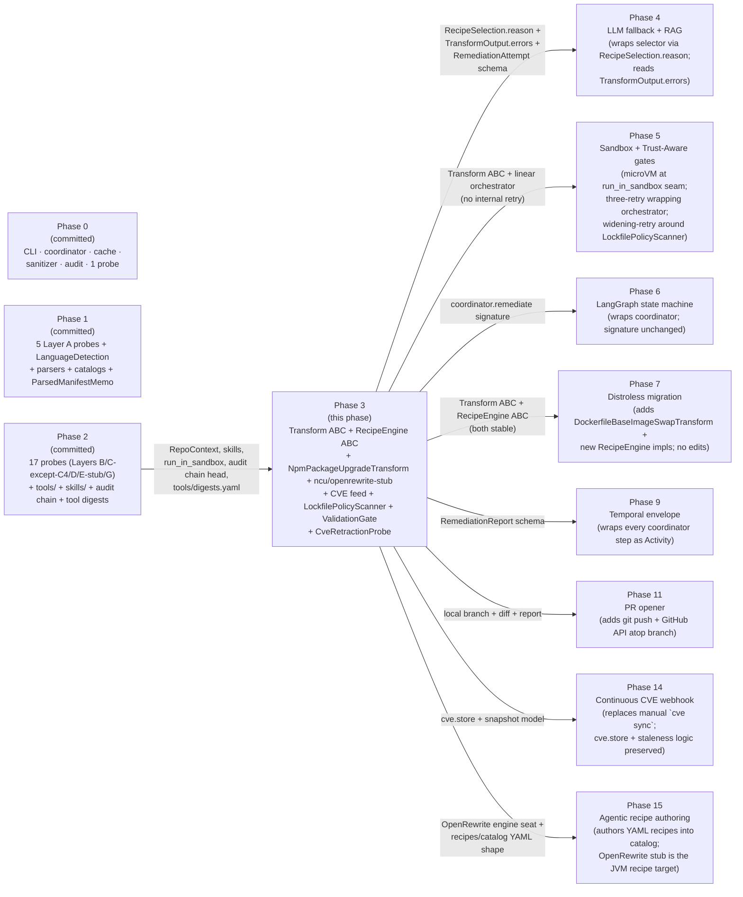
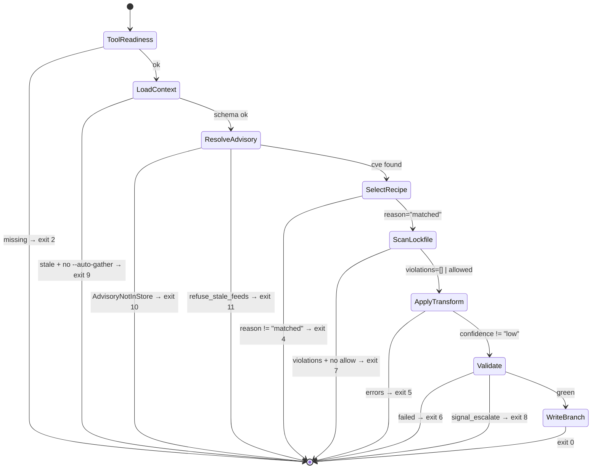

# Phase 03 — Vuln remediation: deterministic recipe path: Architecture

**Status:** Architecture spec
**Date:** 2026-05-12
**Inputs:** [`final-design.md`](final-design.md) · [`critique.md`](critique.md) · [`design-performance.md`](design-performance.md) · [`design-security.md`](design-security.md) · [`design-best-practices.md`](design-best-practices.md) · [`../../production/design.md`](../../production/design.md) · [`../../production/adrs/`](../../production/adrs/) · [`../../roadmap.md`](../../roadmap.md) · [`../00-bullet-tracer-foundations/`](../00-bullet-tracer-foundations/) · [`../01-context-gather-layer-a-node/`](../01-context-gather-layer-a-node/) · [`../02-context-gather-layers-b-g/`](../02-context-gather-layers-b-g/)
**Audience:** the engineer implementing this phase

---

## Executive summary

Phase 3 introduces the **second** load-bearing contract in the system after Phase 1's `Probe` — the **`Transform` ABC** — and its sibling **`RecipeEngine` ABC** for plugging recipe execution backends. It ships one transform (`NpmPackageUpgradeTransform`) wired through one default engine (`NcuRecipeEngine`) and one registered-but-narrow second engine (`OpenRewriteEngineStub`) so the engine seam is **proven** to extend (`final-design.md §"Components" #2`, ADR-P3-002). The flow is a six-call linear sync orchestrator: load `RepoContext` → resolve advisory → select recipe → policy-scan lockfile → apply transform on a worktree → validate (install/build/test) → write branch + audit. Every external subprocess routes through Phase 2's existing `run_in_sandbox` chokepoint; tests run inside the **same** profile with a `test_execution=True` overlay flag (single new flag, no second profile — ADR-P3-005). No LLM, no async, no LangGraph, no Temporal; tokens-per-run is 0 and the Phase-0 `fence` CI job extends to forbid LLM SDK imports under `src/codegenie/transforms/` and `src/codegenie/recipes/`.

Three architectural moves carry this phase: (1) **two ABCs only** (`Transform` + `RecipeEngine`) mounted under **two** new top-level packages (`transforms/`, `recipes/`); `cve/` and `validation/` fold under `transforms/` rather than becoming siblings — closes the critic's "best-practices proliferation" complaint while preserving Phase 4/5/7/15 extension seats (`critique.md §best-practices.3`, ADR-P3-008); (2) **the selector returns a structured `RecipeSelection(recipe, reason, diagnostics)` triple, not `Optional[Recipe]`**, so Phase 4's RAG/LLM fallback can read *why* the deterministic path missed without expanding the Phase-3 selector (`critique.md §best-practices "hidden assumption #1"`, ADR-P3-002); (3) **`--network=none` is the test-suite default with an explicit `gate.signal_escalate` audit event** — not a HARD wall, not silent allow — when tests fail with a recognizable network-required signature, with operator-side `--allow-test-network` as the override (ADR-P3-005). Retries are deferred entirely to Phase 5 except a single bounded transient-error retry inside `LockfileResolver` (ADR-P3-004; `final-design.md §Goals #17`).

The phase exits when `codegenie remediate <node-repo> --cve <id>` writes a working patch on a local branch `codegenie/vuln-fix/<cve-id>-<short-sha>` whose diff applies, installs cleanly via `npm ci --ignore-scripts`, and passes the repo's own `npm test` inside the sandboxed validation gate (`roadmap.md §"Phase 3"` exit criterion). A determinism canary runs the transform 5× and asserts byte-identical diffs and branch SHAs (ADR-P3-003; `final-design.md §Goals #19`). The CVE feed surface is a manual `codegenie cve sync` subcommand with content-hash gate + best-effort signature + graded staleness advisory (warn>7d / low conf>30d / refuse>90d, ADR-P3-007). Phase 14 automates the sync; Phase 5 wraps the orchestrator with the three-retry gate machinery without editing it; Phase 7 adds new transforms + new engines additively; Phase 15 authors new YAML recipes into the catalog the engine ABC anchors.

---

## Goals

Verifiable. Pulled from `roadmap.md §"Phase 3"` exit + `final-design.md §"Goals"`, refined for engineering precision. Provenance: `[P]` performance · `[S]` security · `[B]` best-practices · `[synth]` synthesizer.

### Contract goals

1. **`Transform` ABC frozen at v0.3.0.** Modeled byte-for-byte on `Probe` v0.1.0: `name`, `declared_inputs`, `applies_to_tasks`, `applies_to_languages`, `requires_recipe_engines`, `applies()`/`run()` split. Decorator registry `@register_transform` parallels `@register_probe`. Snapshot test `tests/unit/test_transform_contract.py` mirrors Phase 0's `test_probe_contract.py` — signature drift fails CI red (ADR-P3-001; `final-design.md §Goals #3`).
2. **`RecipeEngine` ABC frozen at v0.3.0 with two registered implementations.** `NcuRecipeEngine` is the default for `(ecosystem=npm, kind=version_bump)` recipes; `OpenRewriteEngineStub` is registered, ships one smoke-tested recipe, and is **opt-in via `--engine=openrewrite`**. If `java` or the pinned `tools/openrewrite/<digest>.jar` is missing, the engine is *registered-but-unavailable* and the selector emits `RecipeSelection(reason="no_engine")` cleanly (ADR-P3-002; `final-design.md §Goals #4`).
3. **`RecipeSelection` is a `(recipe, reason, diagnostics)` triple, not `Optional[Recipe]`.** The `reason` enum is the **public contract Phase 4 reads** when wrapping the selector with RAG/LLM. `Literal["matched","no_engine","range_break","peer_dep_conflict","unsupported_dialect","catalog_miss"]`. (ADR-P3-002; `final-design.md §Goals #5`.)
4. **Two new top-level packages only.** `src/codegenie/transforms/` (Transform ABC, registry, coordinator, npm transform, `cve/`, `validation/`) and `src/codegenie/recipes/` (RecipeEngine ABC, two engines, selector, catalog). **No `cve/` or `validation/` top-level packages.** (`final-design.md §Goals #2`; ADR-P3-008.)
5. **Zero edits to Phase 0/1/2 code** except four ADR-gated additive changes: `ALLOWED_BINARIES` extension (`npm`, `ncu`, `java`); Phase-2 Skills frontmatter gains optional `applies_to.cve_patterns` (default `["*"]`); `audit_writer` event-type enum extends with Phase-3 event types; CLI subcommand-group additions (`remediate`, `cve`, `recipes`).
6. **Tokens per run = 0.** Phase-0 `fence` CI job extended with `src/codegenie/transforms/` and `src/codegenie/recipes/` import-closure forbids `anthropic`, `langgraph`, `chromadb`, `qdrant`, `sentence-transformers`, `voyageai`. (ADR-0005; `final-design.md §Goals #6`.)

### Cost & latency goals

7. **Wall-clock targets** (Node fixture, M-series Mac / 4-vCPU Linux runner; advisory bench gate, fails PR only at >25% mean regression):
   - **Hot path** (RepoContext cached, lockfile resolve cached, small test suite green): **p50 ≤ 30 s, p95 ≤ 90 s** (`final-design.md §Goals #7`).
   - **Cold lockfile + full `npm test`**: **p50 ≤ 120 s, p95 ≤ 240 s**, dominated by `npm install` + suite.
   - **Selector + transform-apply alone**: **p50 ≤ 3 s**.
8. **Lockfile resolver cache hit rate ≥ 70%** across the fixture portfolio. Cache key uses npm **minor**-version digest, not patch, to avoid portfolio-wide stampedes on every npm patch release (`final-design.md §Goals #8`).
9. **One Phase-3 transform; one engine default; one engine stub.** Catalog ships ≥ 1 npm version-bump recipe + 1 OpenRewrite smoke recipe; expansion is Phase 4/7/15 territory.

### Trust & safety goals

10. **`--ignore-scripts` mandatory on every `npm install` / `npm ci` invocation in non-test mode.** Wrapper-level guard in `transforms/tools/npm.py` raises `NpmScriptsEnabled` if any caller omits it outside `test_execution=True`. CI fixture `tests/adv/test_npm_wrapper_rejects_scripts_enabled.py` asserts (`final-design.md §Goals #9`).
11. **`LockfilePolicyScanner` as a fact-emitting validator with graded escape valve.** Violations of `RegistryRedirect`, `MissingIntegrity`, `LifecycleScriptDeclared`, `PublishConfigOverride`, `ResolutionsRedirect` produce typed `Violation` records. Default behaviour: exit 7 with `escalation.policy_violation` audit event; `--allow-policy-violations=<types,...>` opt-in for specific known-legitimate cases (e.g., GitHub-tarball deps). **Phase 5 wraps with three-retry widening** (ADR-P3-004; `final-design.md §Goals #10`).
12. **Test execution sandbox = single profile + overlay flag.** Phase 2's `run_in_sandbox` chokepoint parameterized with `test_execution: bool`. Overlay adds writable upper for test runner tmp output, larger PID/wall budgets, `--ignore-scripts` off (because the test command is allowed to run scripts by definition), `--network=none` as the default. On test failure matching a network-required stderr signature (`ENOTFOUND`, `ECONNREFUSED`, `getaddrinfo`, DNS lookup, common ORM connect errors), validator emits `confidence: medium`, `requires_network: true`, audit event `gate.signal_escalate`. Operator re-runs with `--allow-test-network` after review (ADR-P3-005; `final-design.md §Goals #11`).
13. **Branch hygiene.** Branch name = `codegenie/vuln-fix/<cve-id>-<short-sha>` where `<short-sha>` is HEAD at remediate time. Refuse dirty working tree (`WorkingTreeNotClean`). Refuse existing branch (`BranchExists`). No `git push`. Every git invocation uses `-c core.hooksPath=/dev/null -c commit.gpgsign=false -c user.email=<bot>@codegenie.invalid -c user.name=codegenie-bot`. (`final-design.md §Goals #12`.)
14. **CVE feed integrity.** Snapshots stored content-addressed at `.codegenie/cve/snapshots/<source>/<sha256>.json.gz`. Hash-mismatch on read = hard fail. Signature verification (NVD `.meta` GPG; GHSA `web-flow` commit signatures) is **best-effort and recorded as a confidence input**, not a gate. `codegenie cve sync` is the only network-touching CLI surface; cron is deferred to Phase 14. Snapshot staleness emitted as a graded advisory: warn>7d / low conf>30d / refuse>90d unless `--allow-stale-feeds` (ADR-P3-007; `final-design.md §Goals #13`).
15. **`CveRetractionProbe` ships in Phase 3.** Runs at the end of every `cve sync`. Diffs new snapshot against the prior; for any record whose `withdrawn` flipped from false to true, finds prior remediation runs referencing it under `.codegenie/remediation/*/audit/*.jsonl` and appends `evidence_stale: true` to their audit chain (ADR-P3-006; `final-design.md §Goals #14`).
16. **Audit chain extension.** Phase-2's BLAKE3-chained JSONL audit log gains the Phase-3 event set: `cve.feed.synced`, `cve.feed.signature_check`, `cve.retraction.detected`, `recipe.selected`, `recipe.engine.invoked`, `transform.applied`, `lockfile.scanned`, `lockfile.policy_violation`, `npm.install.run`, `tests.executed`, `gate.failed`, `gate.signal_escalate`, `evidence_stale.marked`, `branch.created`, `cache.replay`. Cache hits re-emit a `cache.replay` event referencing the original chain head (`final-design.md §Goals #15`).
17. **Confidence is strict-AND of objective signals (ADR-0008).** Signal set: `lockfile.parse_ok`, `lockfile.policy_violation_count == 0`, `recipe.engine.exit_status == 0`, `npm.install.exit_status == 0`, `npm.install.disallowed_egress_bytes == 0`, `tests.exit_status == 0`, `tests.duration_vs_baseline_pct ≤ 200`, `cve.delta.direction ≤ 0`, `patch.git_apply_dryrun_ok`. Any false → `confidence: low`. No LLM self-reported confidence; not even an optional input (`final-design.md §Goals #16`; ADR-0008).

### Retry & escalation

18. **No retry in the Phase 3 orchestrator.** ADR-0014's three-retry default is **Phase 5's gate machinery** wrapped around this orchestrator. The single exception: `LockfileResolver` retries `npm install --package-lock-only` up to **3 times on `transient_npm_codes`** (network, ETIMEDOUT, EAI_AGAIN) — transient I/O retry inside one subprocess wrapper, not policy retry. The docstring on `transforms/coordinator.remediate` explicitly states this property so Phase 5 can extend without contradicting (`final-design.md §Goals #17`; ADR-P3-004).
19. **Linear sync orchestrator.** `transforms/coordinator.remediate(repo_root, cve_id, *, run_id, config) -> RemediationReport`. Six function calls. No async, no LangGraph, no Temporal. Phase 6 wraps with a LangGraph state machine *that does not change this signature*; Phase 9 wraps with Temporal Activities; Phase 11 adds a `git push` step + GitHub API atop — all additive.

### Determinism

20. **Byte-deterministic diff.** Lockfile written through a pinned `npm` digest (in `tools/digests.yaml`); `npm install --package-lock-only --ignore-scripts --no-audit --no-fund` invoked with `LC_ALL=C`. Resulting lockfile passes through `npm-lockfile-canonicalize` (sort top-level keys, normalize line endings to LF). `git format-patch -1 --stdout` captures the patch. **Canary test runs the transform 5× and asserts byte-identical diffs and branch tree SHAs** (`tests/integration/test_byte_identical_diff_5x.py`; ADR-P3-003; `final-design.md §Goals #19`).
21. **Test fixtures = `.bundle` + recorded `npm-resolution.json` + pinned local registry mirror.** Each fixture is a git bundle, with the lockfile-resolution result captured the day the bundle was made. Tests run `ncu` + `npm install --package-lock-only` against a **pinned local registry mirror** under `tests/fixtures/npm-mirror/` (~5 MB total, lazy-loaded). Goldens assert the diff against the recorded resolution, decoupling tests from npm-registry drift (`final-design.md §Goals #20`).

---

## Non-goals

Anti-scope. Each item is annotated with why it's out of scope and where it lands.

1. **No LLM, no RAG, no embeddings, no vector store.** Phase 4 adds those under `src/codegenie/planning/` without editing Phase 3 (`roadmap.md §"Phase 4"`; ADR-0005, ADR-0011).
2. **No microVM.** Phase 5 lands microVM at the same `run_in_sandbox` chokepoint Phase 2 established; no Phase-3 transform or engine code changes. (ADR-0012; `critique.md §"shared blind spots #1"`.)
3. **No second sandbox profile (`TestSandboxProfile`).** A second, divergent profile expands the "did we leak credentials / egress" combinatorial test space without buying more than a single profile with `test_execution=True` overlay can buy (`critique.md §security.1`; ADR-P3-005).
4. **No HARD `--network=none` for `npm test`.** A HARD wall fails a meaningful fraction of real Node test suites and routes to nonexistent humans in Phase 3 (`critique.md §security.4`). `gate.signal_escalate` is the honest escape (ADR-P3-005).
5. **No three-retry policy in the Phase 3 orchestrator.** ADR-0014's three-retry default is Phase 5's gate-machinery responsibility. Performance-first's recipe-retry and security-first's parameter-sweep both already implement Phase-4/5 work inside Phase 3 (`critique.md §performance.3`, `critique.md §security.5`).
6. **No cron CVE-feed sync.** Manual `codegenie cve sync` only; Phase 14 introduces the webhook + scheduler. (`critique.md §performance.3`; ADR-P3-007.)
7. **No Maven Central reach-through for OpenRewrite.** The stub uses a pinned single-jar smoke recipe; no Maven mirror, no install ceremony. Phase 7 or a later phase decides the Maven-mirror question when the recipe catalog actually needs Maven resolution (`critique.md §security.3`; ADR-P3-002).
8. **No depgraph-reverse-reachability fast-path test selection.** Performance-first's optimization is unsafe at the exit criterion: dynamic loads, plugin systems, and test-runner lifecycles defeat static reachability (`critique.md §performance.4`). Full `npm test` is the gate.
9. **No `git push`, no GitHub API, no PR opener.** Phase 11 is the first time a real PR opens. Phase 3 stops at a local branch + audit + report.
10. **No multi-repo / portfolio parallelism.** One repo, one process. Phase 10 introduces Discovery + parallelism; Phase 12 adds cross-repo dep analysis.
11. **No agent-authored recipes.** Phase 15 introduces the authoring loop. The engine ABC ships in Phase 3 specifically to anchor what Phase 15 authors into (`final-design.md §"Departures from all three inputs" #1`).
12. **No DSL for the selector decision table.** `selector.yaml` is a flat YAML decision table consumed by Python `match/case` dispatch. Closed enum on the `reason` field; new reasons require code + schema bump in the same PR.
13. **No release-versioning policy for sub-schemas.** Inherited deferral from Phase 2; Phase 3 sub-schemas are v1.
14. **No automatic re-gather invocation outside `--auto-gather`.** Default Phase-3 behaviour with stale `repo-context.yaml` is fail-loud; `--auto-gather` (default true in the dev shell, false in CI) re-runs Phase 0/1/2 gather in-process.
15. **No reading `~/.npmrc`, no private-scope auth.** All sandboxed `npm` invocations run with `$HOME = empty tmpfs`. Private-registry support is a Phase 12+ concern with an out-of-band token broker.

---

## Architectural context

Phase 3 sits between Phase 2's gather inventory and Phase 4's LLM-fallback planner. It is the **first phase that writes code** — and the first to compose three intrinsically hostile primitives: adversarial CVE-feed bytes (`design-security.md §Threat model #1`), `npm` invoked on a hostile lockfile (`design-security.md §Threat model #2`), and the repo's own tests (`design-security.md §Threat model #3`). The architectural response is to (a) keep the writer deterministic end-to-end (no LLM anywhere in the transform pipeline; `final-design.md §"Load-bearing commitments check" §2.1`), (b) route every subprocess through Phase 2's `run_in_sandbox`, and (c) emit *signals*, not judgments — confidence is computed by `TrustScorer` from objective signals only, per ADR-0008.



Every Phase 0/1/2 box is `unchanged` except for the four additive Phase-3 ADR-gated edits documented under Goals #5. The Phase 5/14 promotions land at the **same** `run_in_sandbox` chokepoint with no transform or engine code changes — that's the architectural promise this phase preserves (`final-design.md §"Roadmap coherence check"`).

---

## 4+1 architectural views

Following `production/design.md §8` conventions and the Phase 0/1/2 `phase-arch-design.md` precedent.

### Logical view — components and relationships

```mermaid
classDiagram
  class Transform {
    <<abstract; Phase 3 NEW>>
    +name: str
    +declared_inputs: Sequence~str~
    +applies_to_tasks: Sequence~str~
    +applies_to_languages: Sequence~str~
    +requires_recipe_engines: Sequence~str~
    +applies(view, advisory, recipe) bool
    +run(input) TransformOutput
  }
  class TransformInput {
    <<Pydantic; frozen>>
    repo_root: Path
    worktree_root: Path
    branch_name: str
    advisory: CveEntry
    recipe: Recipe
    repo_context_path: Path
    run_id: str
  }
  class TransformOutput {
    <<Pydantic; frozen>>
    name: str
    diff_path: Path | None
    branch_name: str | None
    files_changed: list[Path]
    confidence: Literal["high","medium","low"]
    warnings: list[str]
    errors: list[str]
    skipped: bool
  }
  class NpmPackageUpgradeTransform {
    <<concrete; Phase 3>>
    applies_to_tasks = ["vuln_remediation"]
    applies_to_languages = ["javascript","typescript"]
    +run(input) TransformOutput
  }
  class TransformRegistry {
    <<module>>
    +@register_transform
    +all_transforms() Sequence~Transform~
  }
  class RecipeEngine {
    <<abstract; Phase 3 NEW>>
    +name: str
    +applies_to_engines: Sequence~str~
    +available() bool
    +apply(recipe, repo, ctx) RecipeApplication
  }
  class NcuRecipeEngine {
    <<concrete; Phase 3 default>>
    +available() bool
    +apply(...) RecipeApplication
  }
  class OpenRewriteEngineStub {
    <<concrete; Phase 3 stub>>
    +available() bool
    +apply(...) RecipeApplication
  }
  class RecipeApplication {
    <<Pydantic>>
    diff: bytes
    files_changed: list[Path]
    engine_stdout: bytes
    engine_stderr: bytes
    exit_code: int
  }
  class Recipe {
    <<Pydantic; loaded from YAML>>
    id: str
    engine: Literal["ncu","openrewrite"]
    ecosystem: Literal["npm"]
    kind: Literal["version_bump"]
    applies_to: ApplyConstraints
    params: dict
    declared_inputs: list[str]
    digest: str
  }
  class RecipeSelection {
    <<Pydantic>>
    recipe: Recipe | None
    reason: Literal["matched","no_engine","range_break","peer_dep_conflict","unsupported_dialect","catalog_miss"]
    diagnostics: dict
  }
  class RecipeSelector {
    <<service>>
    +select(view, advisory, skills) RecipeSelection
  }
  class CveEntry {
    <<Pydantic; canonical advisory model>>
    cve_id: str
    aliases: list[str]
    affected_versions: list[AffectedRange]
    patched_versions: list[str]
    severity: Severity
    references: list[Reference]
    provenance: list[Provenance]
    withdrawn: bool
  }
  class CveFeedSyncer {
    <<service; subcommand entry>>
    +sync(source) SyncReport
  }
  class CveFeedReader {
    <<service; in-process>>
    +get(cve_id) CveEntry
    +staleness(source) Staleness
  }
  class CveRetractionProbe {
    <<probe; Phase 3 NEW>>
    +run(prior_audit_dir, prior_snapshot, new_snapshot) RetractionReport
  }
  class LockfilePolicyScanner {
    <<validator>>
    +scan(lockfile, *, allowed_registries, allowed_violations) LockfileScanResult
  }
  class LockfileCanonicalizer {
    <<helper>>
    +canonicalize(bytes) bytes
  }
  class ValidationGate {
    <<service>>
    +validate(worktree, ctx) GateOutcome
  }
  class InstallValidator {
    <<validator>>
    +run(worktree) ValidatorOutput
  }
  class TestValidator {
    <<validator>>
    +run(worktree, *, allow_network) ValidatorOutput
  }
  class BuildValidator {
    <<validator; opt-in>>
    +run(worktree) ValidatorOutput
  }
  class TrustScorer {
    <<service; strict-AND>>
    +score(signals) TrustScore
  }
  class RemediationOrchestrator {
    <<linear sync; six calls>>
    +remediate(repo_root, cve_id, *, run_id, config) RemediationReport
  }
  class PatchBranchWriter {
    <<service>>
    +write(outcome) BranchHandoff
  }
  class AuditWriter {
    <<Phase-2 extended>>
    +append(event) ChainHead
    +verify_previous_chain_head() bool
  }
  class RepoContextView {
    <<read-only Pydantic projection>>
    +cve_scan: GrypeSlice
    +node_manifest: NodeManifestSlice
    +depgraph: DepgraphSlice
    +index_health: IndexHealthSlice
    +skills: SkillSlice
  }

  Transform <|-- NpmPackageUpgradeTransform
  RecipeEngine <|-- NcuRecipeEngine
  RecipeEngine <|-- OpenRewriteEngineStub
  TransformRegistry o-- Transform
  NpmPackageUpgradeTransform --> Recipe : applies
  NpmPackageUpgradeTransform --> RecipeEngine : delegates apply
  RecipeSelector --> Recipe : loads catalog
  RecipeSelector --> RepoContextView : reads
  RecipeSelector --> CveEntry : matches
  RecipeSelector --> RecipeSelection : returns
  CveFeedSyncer --> CveEntry : produces
  CveFeedReader --> CveEntry : serves
  CveRetractionProbe --> AuditWriter : appends evidence_stale
  ValidationGate --> InstallValidator
  ValidationGate --> TestValidator
  ValidationGate --> BuildValidator
  ValidationGate --> TrustScorer
  RemediationOrchestrator --> RepoContextView : reads
  RemediationOrchestrator --> CveFeedReader
  RemediationOrchestrator --> RecipeSelector
  RemediationOrchestrator --> LockfilePolicyScanner
  RemediationOrchestrator --> NpmPackageUpgradeTransform
  RemediationOrchestrator --> ValidationGate
  RemediationOrchestrator --> PatchBranchWriter
  RemediationOrchestrator --> AuditWriter
  PatchBranchWriter --> AuditWriter
  NpmPackageUpgradeTransform --> LockfileCanonicalizer
```



**Reading guide.** Two new ABCs: `Transform` (mirrors Probe) and `RecipeEngine`. One concrete transform (`NpmPackageUpgradeTransform`), two concrete engines (`NcuRecipeEngine` default, `OpenRewriteEngineStub` opt-in). The `RecipeSelector` returns a structured `RecipeSelection` rather than `Optional[Recipe]` — closes `critique.md §best-practices "hidden assumption #1"`. Validators are **functions returning `ValidatorOutput`**, not a third ABC (`final-design.md §"Synthesis ledger" "Top-level Transform ABC"`). `CveRetractionProbe` is the only Phase-3 *probe* — but it does not register through the Phase-1 probe registry; it is a standalone batch task triggered from `codegenie cve sync`, mirroring Probe shape so Phase 14 can promote it to a continuous-gather probe without redesign (see §Gap analysis #4).

### Process view — happy-path remediate run

```mermaid
sequenceDiagram
  autonumber
  participant CLI as click CLI (codegenie remediate)
  participant Ready as Tool-readiness
  participant Ctx as RepoContextView
  participant Cve as CveFeedReader
  participant Sel as RecipeSelector
  participant Pol as LockfilePolicyScanner
  participant Wt as GitWorktree (run_in_sandbox)
  participant Eng as RecipeEngine (ncu)
  participant Lkr as LockfileResolver
  participant Can as LockfileCanonicalizer
  participant Inst as InstallValidator
  participant Test as TestValidator (test_execution=True)
  participant Bld as BuildValidator (opt-in)
  participant Ts as TrustScorer
  participant Wr as PatchBranchWriter
  participant Aud as AuditWriter (BLAKE3 chain)

  CLI->>Ready: check $PATH (git, npm, ncu; java if --engine=openrewrite)
  Ready-->>CLI: ok | ToolMissing
  CLI->>Aud: verify_previous_chain_head()
  Aud-->>CLI: ok | meta.chain_break (observability)
  CLI->>Ctx: load .codegenie/context/repo-context.yaml
  Ctx-->>CLI: RepoContextView (validated schema; index_health ≥ medium)
  CLI->>Cve: get(cve_id) + staleness check
  Cve-->>CLI: CveEntry, staleness (warn>7d / low>30d / refuse>90d)
  CLI->>Sel: select(view, advisory, skills)
  Sel-->>CLI: RecipeSelection(recipe, reason="matched", diagnostics={})
  Note over Sel: reason != "matched" → exit 4 cleanly
  CLI->>Pol: scan(lockfile, allowed_registries, allowed_violations)
  Pol-->>CLI: LockfileScanResult(violations=[])
  Note over Pol: violations + no --allow-policy-violations → exit 7
  CLI->>Wt: git worktree add .codegenie/remediation/<run-id>/worktree
  Wt-->>CLI: worktree path
  CLI->>Eng: apply(recipe, worktree, ctx)
  Eng->>Eng: ncu --packageFile package.json --upgrade --target patch --filter <pkg>
  Eng-->>CLI: RecipeApplication(diff, files_changed, exit=0)
  CLI->>Lkr: run(worktree)
  Note over Lkr: npm install --package-lock-only --ignore-scripts --no-audit --no-fund<br/>cache key: (blake3(package.json), blake3(package-lock.json),<br/>npm_minor_digest, registry_mirror_digest)
  Lkr-->>CLI: new_lockfile_bytes, cache_hit | cold (≤3 retries on transient codes)
  CLI->>Aud: append npm.install.run | cache.replay
  CLI->>Can: canonicalize(lockfile_bytes)
  Can-->>CLI: canonical_bytes (LC_ALL=C, key-sorted, LF)
  CLI->>Wt: git commit (hooks=/dev/null, no signing, bot identity) + format-patch
  Wt-->>CLI: diff/<recipe-id>.patch
  CLI->>Inst: run(worktree)
  Inst->>Inst: npm ci --ignore-scripts (network=scoped: registry.npmjs.org)
  Inst-->>CLI: ValidatorOutput(passed=True, signals)
  CLI->>Test: run(worktree, allow_network=False)
  Test->>Test: npm test (test_execution=True, network=none)
  Test-->>CLI: ValidatorOutput(passed=True | requires_network=true on signature)
  alt build script present
    CLI->>Bld: run(worktree)
    Bld-->>CLI: ValidatorOutput(passed=True)
  end
  CLI->>Ts: score(signals)
  Ts-->>CLI: TrustScore(strict-AND; confidence=high|medium|low)
  alt gate green
    CLI->>Wr: write(outcome)
    Wr-->>CLI: branch=codegenie/vuln-fix/<cve>-<short-sha>
    CLI->>Aud: append branch.created (+ all per-stage events)
    CLI-->>CLI: exit 0
  else gate failed (signals)
    CLI->>Aud: append gate.failed | gate.signal_escalate
    CLI-->>CLI: exit 6 | 8
  end
```

**Reading guide.** Six function-call backbone (`load_context → resolve_advisory → select_recipe → scan_lockfile → apply_transform → validate → write_branch`). Audit emissions interleave; cache replays re-emit `cache.replay` events referencing the original chain head (`final-design.md §Goals #15`). Failure routes deliberately preserve the worktree + the partial branch + the audit slice on disk for operator forensics.

### Development view — module tree

```mermaid
graph TD
  Src["src/codegenie/"]
  Src --> Transforms["transforms/<br/>(NEW)"]
  Src --> Recipes["recipes/<br/>(NEW)"]
  Src --> Tools["tools/<br/>(Phase 2 — extends w/ npm.py, ncu.py, openrewrite.py)"]
  Src --> CLI["cli/<br/>(Phase 0 — adds remediate.py, cve.py, recipes.py)"]
  Src --> Audit["audit_writer.py<br/>(Phase 2 — event enum extends)"]
  Src --> Exec["exec.py<br/>(Phase 1 — ALLOWED_BINARIES extends;<br/>run_in_sandbox adds test_execution=True overlay)"]
  Src --> Probes["probes/<br/>(Phase 1/2 — unchanged)"]
  Src --> Skills["skills/<br/>(Phase 2 — frontmatter adds applies_to.cve_patterns)"]

  Transforms --> TContract["contract.py<br/>(Transform ABC, TransformInput,<br/>TransformOutput)"]
  Transforms --> TReg["registry.py<br/>(@register_transform, all_transforms)"]
  Transforms --> TCoord["coordinator.py<br/>(linear sync orchestrator — six calls)"]
  Transforms --> TCtx["context.py<br/>(RepoContextView — read-only)"]
  Transforms --> TNpm["npm_package_upgrade.py<br/>(THE Phase 3 transform)"]
  Transforms --> TLkr["lockfile_resolver.py<br/>(npm install --package-lock-only +<br/>cache + bounded transient-retry)"]
  Transforms --> TCan["lockfile_canonicalizer.py<br/>(LC_ALL=C, sort keys, LF)"]
  Transforms --> TCve["cve/"]
  Transforms --> TVal["validation/"]
  Transforms --> THo["handoff.py<br/>(PatchBranchWriter)"]
  Transforms --> TRpt["report.py<br/>(RemediationReport YAML)"]

  TCve --> TCveModels["models.py<br/>(CveEntry, AffectedRange, Provenance,<br/>Severity, Reference)"]
  TCve --> TCveFeeds["feeds/"]
  TCveFeeds --> Nvd["nvd.py"]
  TCveFeeds --> Ghsa["ghsa.py"]
  TCveFeeds --> Osv["osv.py"]
  TCve --> TCveStore["store.py<br/>(content-addressed snapshot store)"]
  TCve --> TCveSync["syncer.py<br/>(codegenie cve sync — only network surface)"]
  TCve --> TCveStale["staleness.py<br/>(warn>7d / low>30d / refuse>90d)"]
  TCve --> TCveRetract["retraction_probe.py<br/>(CveRetractionProbe — Phase-3 addition)"]
  TCve --> TCveNorm["normalizer.py<br/>(aliases + merge across NVD/GHSA/OSV)"]

  TVal --> TVPol["lockfile_policy.py<br/>(LockfilePolicyScanner)"]
  TVal --> TVInst["install.py<br/>(InstallValidator)"]
  TVal --> TVTest["test.py<br/>(TestValidator + network-signature scan)"]
  TVal --> TVBld["build.py<br/>(BuildValidator — opt-in)"]
  TVal --> TVGate["gate.py<br/>(ValidationGate composition)"]
  TVal --> TVTs["trust_score.py<br/>(strict-AND TrustScorer)"]

  Recipes --> RContract["contract.py<br/>(RecipeEngine ABC, RecipeApplication,<br/>ApplyContext)"]
  Recipes --> RReg["registry.py<br/>(@register_engine, available_engines)"]
  Recipes --> REngines["engines/"]
  REngines --> RNcu["ncu.py<br/>(NcuRecipeEngine)"]
  REngines --> ROr["openrewrite_stub.py<br/>(OpenRewriteEngineStub — JVM, pinned jar)"]
  Recipes --> RSel["selector.py<br/>(RecipeSelector + match/case dispatch)"]
  Recipes --> RDecisionYaml["selector.yaml<br/>(data — decision table)"]
  Recipes --> RModels["models.py<br/>(Recipe, RecipeSelection, ApplyConstraints)"]
  Recipes --> RCat["catalog/"]
  RCat --> RCatNpm["npm/<br/>(*.yaml — Phase 3 ships ≥1)"]
  Recipes --> RCatDigests["digests.yaml<br/>(recipe content-pin manifest)"]
  Recipes --> ROrJar["openrewrite-stub/<br/>(config.yaml + smoke recipe YAML;<br/>pinned jar lives in tools/openrewrite/)"]

  CLI --> CliRem["remediate.py<br/>(codegenie remediate <repo> --cve …)"]
  CLI --> CliCve["cve.py<br/>(codegenie cve sync …)"]
  CLI --> CliRec["recipes.py<br/>(codegenie recipes list …)"]

  Tools --> ToolsNpm["npm.py<br/>(NpmRunner; wrapper guard for --ignore-scripts)"]
  Tools --> ToolsNcu["ncu.py<br/>(NcuRunner)"]
  Tools --> ToolsOr["openrewrite.py<br/>(OpenRewriteRunner — JVM launcher)"]
```



**Reading guide.** Two new top-level packages; `cve/` and `validation/` fold under `transforms/`. The OpenRewrite jar pin lives in `tools/openrewrite/<digest>.jar`, mirroring Phase 2's `tools/digests.yaml` pattern; the *recipe definition* (single smoke recipe) lives under `recipes/openrewrite-stub/`. CLI subcommand modules live under `cli/` (Phase 0 owns the dispatcher). The `recipes/digests.yaml` manifest is **new** in Phase 3 (Goal-#21 gap, see §Gap analysis #2). One in-place edit each to `audit_writer.py`, `exec.py`, `skills/` schema; everything else is additive.

### Physical view — local POC deployment

```mermaid
graph LR
  Dev["Developer laptop<br/>(M-series Mac or Linux)"]
  subgraph PyProc["codegenie process (Python 3.11+)"]
    direction TB
    Click["click CLI<br/>(remediate · cve · recipes)"]
    Coord["transforms/coordinator<br/>(linear sync)"]
    Engines["RecipeEngines<br/>(ncu in-proc reads;<br/>openrewrite via Java subprocess)"]
    Vals["Validators<br/>(install/test/build)"]
    Aud["AuditWriter<br/>(BLAKE3 chain;<br/>.codegenie/audit/runs/*.jsonl)"]
    Store["CveStore<br/>(.codegenie/cve/snapshots/<source>/<sha256>.json.gz)"]
  end
  subgraph Sand["run_in_sandbox chokepoint (Phase 2)"]
    direction TB
    Bwrap["Linux: bwrap<br/>--network=none default<br/>--ro-bind repo<br/>--die-with-parent"]
    SbxExec["macOS: sandbox-exec<br/>(deny network*) — best-effort"]
    Overlay["test_execution=True overlay<br/>(writable upper for /work;<br/>larger pid/wall budgets;<br/>--ignore-scripts off for npm test only)"]
  end
  subgraph Subs["Subprocesses (one-shot, per sandbox invocation)"]
    direction TB
    Git["git -c core.hooksPath=/dev/null<br/>-c commit.gpgsign=false<br/>(worktree add, format-patch, commit)"]
    Npm["npm (pinned digest)<br/>install --package-lock-only<br/>ci · test"]
    Ncu["ncu (npm-check-updates)"]
    Java["java -jar tools/openrewrite/<digest>.jar<br/>(only when --engine=openrewrite)"]
  end
  subgraph Disk["Local filesystem (under analyzed repo)"]
    direction TB
    Ctx["repo-context.yaml<br/>(Phase 2 output; read-only)"]
    CveDir["cve/snapshots/<source>/<sha256>.json.gz"]
    CacheDir["cache/lockfile/<blake3>.zst"]
    Rem["remediation/<run-id>/<br/>├ remediation-report.yaml<br/>├ diff/<recipe-id>.patch<br/>├ raw/ {ncu.json, install.log, test.xml}<br/>├ audit/<run-id>.jsonl<br/>└ worktree/ (transient)"]
  end
  subgraph Net["Network — only via subprocess inside sandbox"]
    direction TB
    Npmreg["registry.npmjs.org<br/>(scoped allowlist on npm install path)"]
    Nvd["nvd.nist.gov<br/>(only inside `cve sync`)"]
    Gh["github.com<br/>(only inside `cve sync` for GHSA/OSV)"]
  end

  Dev --> Click
  Click --> Coord
  Coord --> Engines
  Coord --> Vals
  Coord --> Aud
  Coord --> Store
  Engines --> Sand
  Vals --> Sand
  Sand --> Subs
  Subs -- "via scoped allowlist only" --> Net
  Coord -. reads .-> Ctx
  Coord -. reads .-> CveDir
  Coord -. r/w .-> CacheDir
  Coord -. writes .-> Rem
  Aud -. appends .-> Rem
```



**Reading guide.** No services, no daemons, no databases. One Python process per `remediate` invocation; subprocesses are one-shot inside the Phase-2 sandbox. The `test_execution=True` overlay is the only sandbox-profile change Phase 3 makes; it is a single flag on `run_in_sandbox`, not a new strategy or class (`final-design.md §"Components" #7`). Network egress is reachable only through `npm install` (scoped to `registry.npmjs.org`) and `cve sync` (scoped to NVD + GHSA + OSV hosts).

### Scenarios (+1) — four walkthroughs

#### Scenario A — happy path single-CVE patch

```mermaid
sequenceDiagram
  autonumber
  participant Op as Operator
  participant Coord
  participant Sel as Selector
  participant Eng as NcuRecipeEngine
  participant Gate as ValidationGate
  participant Wr as PatchBranchWriter
  participant Aud as AuditWriter

  Op->>Coord: codegenie remediate ./svc-auth --cve CVE-2024-XYZ
  Coord->>Coord: load RepoContextView (cache hit; IndexHealth high)
  Coord->>Aud: cve.feed.synced check (≤ 7d → ok)
  Coord->>Sel: select(view, advisory, skills)
  Sel-->>Coord: RecipeSelection(recipe=npm-upgrade-patched, reason="matched")
  Coord->>Eng: apply(recipe, worktree, ctx)
  Eng-->>Coord: RecipeApplication(diff, exit=0)
  Coord->>Coord: canonicalize lockfile
  Coord->>Coord: git commit + format-patch
  Coord->>Gate: install → test → build (opt-in)
  Gate-->>Coord: all green
  Coord->>Wr: write(outcome)
  Wr-->>Coord: branch=codegenie/vuln-fix/CVE-2024-XYZ-abc1234
  Coord-->>Op: exit 0
```

**Proves.** End-to-end exit-criterion compliance. One transform, one recipe, one engine; six function calls. No retry, no LLM. Audit chain advances by ~14 events.

#### Scenario B — recipe applied but validation gate fails

```mermaid
sequenceDiagram
  autonumber
  participant Op as Operator
  participant Coord
  participant Sel as Selector
  participant Eng as NcuRecipeEngine
  participant Gate as ValidationGate
  participant Aud as AuditWriter

  Op->>Coord: codegenie remediate ./svc-orders --cve CVE-2024-ABC
  Coord->>Sel: select(...)
  Sel-->>Coord: RecipeSelection(recipe, reason="matched")
  Coord->>Eng: apply(recipe, worktree, ctx)
  Eng-->>Coord: RecipeApplication(diff, exit=0)
  Coord->>Gate: install → test
  Gate->>Gate: npm ci ok (exit 0)
  Gate->>Gate: npm test fails — testFooBar throws ENONET
  Gate-->>Coord: ValidatorOutput(passed=False, signals={tests.exit_status: 1})
  Coord->>Aud: append gate.failed (signals, stderr first 1KB)
  Coord-->>Op: exit 6 (validation_fail); worktree + partial branch preserved
```

**Proves.** Linear orchestrator emits a deterministic failure signal Phase 4 can read. Worktree + partial-branch retained for diagnosis; no retry inside Phase 3.

#### Scenario C — lockfile policy violation with operator opt-in

```mermaid
sequenceDiagram
  autonumber
  participant Op as Operator
  participant Coord
  participant Pol as LockfilePolicyScanner
  participant Aud as AuditWriter

  Op->>Coord: codegenie remediate ./svc-acme --cve CVE-2024-X
  Coord->>Pol: scan(lockfile, allowed_registries=[registry.npmjs.org])
  Pol-->>Coord: violations=[RegistryRedirect(host=tarball.acme.io)]
  Coord->>Aud: append lockfile.policy_violation
  Coord-->>Op: exit 7 (policy_violation); escalation.policy_violation
  Note over Op: Operator reviews; corp-internal tarball host is intentional
  Op->>Coord: codegenie remediate … --allow-policy-violations RegistryRedirect
  Coord->>Pol: scan(... allowed_violations={RegistryRedirect})
  Pol-->>Coord: violations=[] (allowed)
  Coord->>Coord: apply transform → validate → write branch
  Coord-->>Op: exit 0
  Note over Coord: Phase 5 wraps this with widening-retry (ADR-P3-004)
```

**Proves.** Graded escape valve — the design refuses by default but allows operator-named exceptions. Phase 5 wraps with widening-retry; Phase-3's contract is unaffected.

#### Scenario D — test suite needs network: escalation signal

```mermaid
sequenceDiagram
  autonumber
  participant Op as Operator
  participant Coord
  participant Gate as ValidationGate
  participant Aud as AuditWriter

  Op->>Coord: codegenie remediate ./svc-api --cve CVE-2024-PG
  Coord->>Gate: install green; test (network=none)
  Gate->>Gate: pg client connect fails with ECONNREFUSED 127.0.0.1:5432
  Gate->>Gate: stderr signature match → requires_network=true
  Gate-->>Coord: ValidatorOutput(passed=False, requires_network=true, confidence=medium)
  Coord->>Aud: append gate.signal_escalate (signals, signature, suggested flag)
  Coord-->>Op: exit 8 (signal_escalate); branch preserved as draft
  Note over Op: Operator reviews; tests genuinely need a DB sidecar
  Op->>Coord: codegenie remediate … --allow-test-network
  Coord->>Gate: test (test_execution=True, network=scoped allowlist=[127.0.0.1])
  Gate-->>Coord: ValidatorOutput(passed=True)
  Coord-->>Op: exit 0
```

**Proves.** The synth choice on test-sandbox network: not HARD, not silent allow, but **explicit escalation**. `gate.signal_escalate` is the documented audit event a future human reviewer or Phase-4 planner reads to decide what to do next. (`final-design.md §"Departures from all three inputs" #3`.)

---

## Component design

One section per major component, mirroring the Phase 0/1/2 phase-arch precedent. Each section gives: provenance, purpose, interface, internal design, dependencies, state, performance envelope, failure behavior, why-this-choice-over-alternatives, tradeoffs.

### 1. `Transform` ABC + `TransformRegistry`

**Provenance:** `[B + synth-trimmed]`. `final-design.md §"Components" #1`. ADR-P3-001 this phase.

**Purpose.** Define the contract every transform satisfies. The second load-bearing contract in the system after Probe. Phase 4 wraps the selector that produces inputs to it; Phase 5 wraps the orchestrator that runs it; Phase 6 wraps the orchestrator with a state machine; Phase 7 ships a second transform; Phase 15 authors new recipes that drive it.

**Public interface.**

```python
# src/codegenie/transforms/contract.py
from abc import ABC, abstractmethod
from collections.abc import Sequence
from pathlib import Path
from typing import Literal

from pydantic import BaseModel, Field

from codegenie.transforms.cve.models import CveEntry
from codegenie.recipes.models import Recipe

Confidence = Literal["high", "medium", "low"]


class TransformInput(BaseModel):
    """Frozen, validated input to Transform.run()."""
    repo_root: Path
    worktree_root: Path           # .codegenie/remediation/<run-id>/worktree
    branch_name: str              # codegenie/vuln-fix/<cve-id>-<short-sha>
    advisory: CveEntry
    recipe: Recipe
    repo_context_path: Path       # validated repo-context.yaml
    run_id: str


class TransformOutput(BaseModel):
    """Facts not judgments — no `success` field; validators decide."""
    name: str
    diff_path: Path | None
    branch_name: str | None
    files_changed: list[Path] = Field(default_factory=list)
    confidence: Confidence
    warnings: list[str] = Field(default_factory=list)
    errors: list[str] = Field(default_factory=list)
    skipped: bool = False


class Transform(ABC):
    """A deterministic repo modification.

    Same contract shape as codegenie.probes.contract.Probe (ADR-0007):
      - declarative metadata (name, declared_inputs, applies_to_*)
      - applies(view, advisory, recipe) -> bool
      - run(input) -> TransformOutput
      - NO LLM SDK import is allowed under codegenie.transforms.*
        (Phase 0 fence asserts at CI time).
    """
    name: str
    declared_inputs: Sequence[str]
    applies_to_tasks: Sequence[str]
    applies_to_languages: Sequence[str]
    requires_recipe_engines: Sequence[str]

    @abstractmethod
    def applies(
        self, view: "RepoContextView", advisory: CveEntry, recipe: Recipe
    ) -> bool: ...

    @abstractmethod
    def run(self, input: TransformInput) -> TransformOutput: ...
```

**Internal design.**

- **Modeled byte-for-byte on `Probe`.** Conformance over taste (CLAUDE.md global Rule 11). A future engineer's first instinct will be to read Phase 1's `Probe` ABC; this is the same shape.
- **Pydantic at boundary.** `TransformInput` and `TransformOutput` are frozen models; `run()` is the only signature that crosses package boundaries.
- **Registry via decorator** (`@register_transform`) parallels `@register_probe`:

  ```python
  # src/codegenie/transforms/registry.py
  _TRANSFORMS: dict[str, type[Transform]] = {}

  def register_transform(cls: type[Transform]) -> type[Transform]:
      if cls.name in _TRANSFORMS:
          raise RuntimeError(f"duplicate transform name: {cls.name}")
      _TRANSFORMS[cls.name] = cls
      return cls

  def all_transforms() -> Sequence[type[Transform]]:
      return tuple(_TRANSFORMS.values())
  ```

- **No `success` field on output.** This is deliberate — *validators* report `passed`, transforms report `confidence`. A future engineer's instinct will be to add `success`; the ABC docstring forbids it and a snapshot test asserts the schema (`tests/unit/test_transform_contract.py`).
- **`requires_recipe_engines`** is the new declarative field over the Probe shape — names the engines a transform can drive (`["ncu", "openrewrite"]`). The selector reads this to filter unavailable engines.

**Dependencies.** `pydantic`, stdlib only.

**State.** None. Transforms are stateless given input.

**Performance envelope.** ABC overhead is negligible; the dispatch path is one dict lookup + one function call.

**Failure behavior.** Any exception inside `run()` is **not** caught by the ABC; the coordinator catches once, writes `TransformOutput(confidence="low", errors=["<exception-class>: <safe-str>"], skipped=False, diff_path=None)`, and proceeds to write the audit event. The worktree is preserved for forensics (`design-best-practices.md §"Failure modes"`).

**Why this choice over alternatives.**

- Performance-first proposed *no* top-level ABC — just a YAML recipe registry plus stdlib JSON mutation. Critic flagged that this defeats Phase 4's deterministic-failure signal and Phase 15's recipe ecosystem (`critique.md §performance.1`).
- Security-first introduced `RecipeRegistry` / `RecipeExecutor` *without* a Transform top-line. Critic flagged this as the most consequential omission for downstream phases (`critique.md §security "Things this design missed"`).
- Best-practices proposed three coordinate ABCs: `Transform`, `Validator`, `Recipe`. Critic flagged that `Recipe` is *data*, not an actor, and that `Validator` is better as **functions returning `ValidatorOutput`** than a third ABC (`critique.md §best-practices.2`). Synth trimmed to two ABCs total.

**Tradeoffs accepted.**

- Slightly heavier than performance-first's ad-hoc shape; the contract is what enables additivity for four downstream phases.
- The `requires_recipe_engines` field is a small departure from Probe shape — needed because engines are pluggable; Probes had no analogous pluggable backend.

### 2. `RecipeEngine` ABC + two implementations

**Provenance:** `[synth — direct response to critic's recipe-engine arbitration]`. `final-design.md §"Components" #2`. ADR-P3-002 this phase.

**Purpose.** Engines are *how* a recipe is applied. The contract makes Phase 7 (Dockerfile rewrites) and Phase 15 (agent-authored recipes) extensible by addition. Two engines ship in v0.3.0 to **prove the seam extends** without taking on full OpenRewrite operational ceremony (`critique.md "Which disagreement matters most"`).

**Public interface.**

```python
# src/codegenie/recipes/contract.py
class ApplyContext(BaseModel):
    npm_minor_digest: str
    registry_mirror_digest: str
    sandbox_runner: "RunInSandbox"   # Phase-2 chokepoint handle
    audit: "AuditWriter"             # for engine-internal audit emission
    run_id: str


class RecipeApplication(BaseModel):
    diff: bytes
    files_changed: list[Path]
    engine_stdout_path: Path
    engine_stderr_path: Path
    exit_code: int


class RecipeEngine(ABC):
    """A plug-in recipe execution backend."""
    name: str                                # "ncu" | "openrewrite"
    applies_to_engines: Sequence[str]        # subset of {"ncu","openrewrite"}

    @abstractmethod
    def available(self) -> bool: ...

    @abstractmethod
    def apply(
        self, recipe: Recipe, repo_overlay: Path, ctx: ApplyContext
    ) -> RecipeApplication: ...
```

**Implementations shipped.**

#### 2a. `NcuRecipeEngine` (default)

- Default for all `(ecosystem=npm, kind=version_bump)` recipes.
- `available()` does a `which ncu` + version-digest check against `tools/digests.yaml`. Engine is the **primary** path; absence of `ncu` is fatal (CLI tool readiness fails loud).
- `apply()` invokes `ncu --packageFile package.json --upgrade --target patch --filter <pkg>` inside `run_in_sandbox(network="scoped", allowlist=["registry.npmjs.org"])` and defers lockfile generation to `LockfileResolver`.
- **Cold-start cost:** ~150–250 ms (`design-performance.md §Components "Recipe Selector + Recipe Engine"`).

#### 2b. `OpenRewriteEngineStub` (opt-in, smoke-tested)

- Ships with **one** recipe (`org.openrewrite.npm.UpgradeDependencyVersion`-shaped or a minimal internal equivalent — exact choice deferred, `final-design.md §"Open questions" #1`).
- Requires `java` on `$PATH` + a pinned `tools/openrewrite/<digest>.jar` (digest pinned in `tools/digests.yaml`; ADR-P3-009).
- `available()` returns false if `java` is missing or jar digest mismatches.
- `apply()` invokes `java -Xmx2g -jar tools/openrewrite/<digest>.jar <recipe-id>` inside `run_in_sandbox(network="none")`. No Maven Central reach-through; the jar is self-contained (`final-design.md §"Components" #2`).
- **Opt-in via `--engine=openrewrite`.** The selector only emits a recipe whose `engine: openrewrite` if `OpenRewriteEngineStub.available()`; otherwise it emits `RecipeSelection(reason="no_engine", diagnostics={"engine": "openrewrite", "available": False})`.

**Internal design.** Engines are **stateless** given their `ApplyContext`. Subprocess invocation routes through the Phase-2 chokepoint — no engine code directly calls `subprocess.run`. The wrapper in `src/codegenie/tools/{ncu,openrewrite}.py` does subprocess I/O and returns a Pydantic model.

**Dependencies.** `ncu` (Node CLI, on `$PATH`), `java` 17+ (opt-in only), pinned OpenRewrite jar. Phase-2 `run_in_sandbox`.

**State.** None across invocations.

**Performance envelope.** `ncu` is ~150–250 ms cold; `java -jar` cold-start is 2–4 s (`design-performance.md §"Recipe Selector + Recipe Engine"`). The OpenRewrite stub is intentionally opt-in to avoid this overhead on the hot path.

**Failure behavior.**

- Engine missing → `RecipeSelection(reason="no_engine")` (does not throw).
- Engine non-zero exit during `apply()` → `RecipeApplication(exit_code=N)` returned; transform inspects and emits `confidence: low, errors=[engine.stderr first 1KB]`.
- Sandbox failure (rare) → `SandboxLaunchError` from Phase 2 propagates as-is; coordinator catches once.

**Why this choice over alternatives.**

- Performance-first dropped recipes entirely; critic flagged that this defeats Phase 15 (`critique.md §performance.1`).
- Best-practices shipped only `ncu`; critic flagged that the roadmap names OpenRewrite first (`critique.md §best-practices.1`).
- Security-first shipped OpenRewrite with an unspecified Maven-mirror ceremony; critic flagged custody and update-flow holes (`critique.md §security.3`).
- **Synth response:** ship both, default to `ncu` for throughput and developer ergonomics, keep OpenRewrite as a registered second seat with a **single-jar smoke test** so the contract is proven to extend. The Maven mirror is deferred — the stub uses a self-contained jar and a single internal recipe; no Maven resolution at runtime (`final-design.md §"Components" #2`).

**Tradeoffs accepted.**

- OpenRewrite coverage is intentionally narrow in v0.3.0 (one recipe). The point is the contract, not the catalog. Phase 4–7 expand.
- The OpenRewrite jar digest pin in `tools/digests.yaml` is an additional CI artifact to maintain. Same precedent as Phase 2's tool digests.

### 3. `Recipe`, `RecipeSelector`, catalog

**Provenance:** `[B + synth-richer-return-type]`. `final-design.md §"Components" #3`. ADR-P3-002.

**Purpose.** Map `(advisory, repo_context, skills)` to a `Recipe` or a structured no-match reason.

**Public interface.**

```python
# src/codegenie/recipes/models.py
class ApplyConstraints(BaseModel):
    ecosystem: Literal["npm"]
    languages: list[str]
    package_glob: str | None
    cve_patterns: list[str] = ["*"]
    semver_range_predicate: str | None    # eval'd against the existing range


class Recipe(BaseModel):
    id: str                                # e.g. "npm-upgrade-patched-v1"
    engine: Literal["ncu", "openrewrite"]
    ecosystem: Literal["npm"]
    kind: Literal["version_bump"]
    applies_to: ApplyConstraints
    params: dict                            # engine-specific
    declared_inputs: list[str]              # globs
    digest: str                             # SHA-256, verified at load
    priority: int = 100                     # ties → error


# src/codegenie/recipes/selector.py
class RecipeSelection(BaseModel):
    recipe: Recipe | None
    reason: Literal[
        "matched", "no_engine", "range_break",
        "peer_dep_conflict", "unsupported_dialect", "catalog_miss",
    ]
    diagnostics: dict


class RecipeSelector:
    def select(
        self,
        view: RepoContextView,
        advisory: CveEntry,
        skills: SkillSlice,
    ) -> RecipeSelection: ...
```

**Internal design.**

- Loads YAML recipes from `src/codegenie/recipes/catalog/npm/*.yaml`; verifies content hash against `recipes/digests.yaml`; refuses unpinned recipes (`RecipeNotInDigestManifest`).
- Loads `selector.yaml` decision table; resolves to a candidate set; filters by:
  1. `applies_to.ecosystem` matches advisory's ecosystem.
  2. `applies_to.cve_patterns` matches advisory's CVE ID (defaults `["*"]`).
  3. `applies_to.semver_range_predicate` evaluates true against the existing range — else `reason="range_break"`.
  4. Engine availability (`RecipeEngine.available()`) — else `reason="no_engine"`.
  5. Peer-dep conflict check via Phase-2 depgraph (NetworkX traversal) — else `reason="peer_dep_conflict"`.
- Among multiple matches, sort by `priority`; ties are an error (forces recipe authors to disambiguate).
- The `Skills` slice with the Phase-2 frontmatter extension (`applies_to.cve_patterns`) refines selection — same loader, additive schema.
- **Engine availability is part of the match.** A recipe whose `engine: openrewrite` is unselectable if `java` is missing — produces `reason="no_engine"`.

**Dependencies.** `pydantic`, stdlib YAML, Phase-2 Skills loader, Phase-2 `IndexHealthProbe` outputs (for depgraph confidence floor).

**State.** Per-process: in-memory loaded catalog; loaded once at startup. No across-process state.

**Performance envelope.** Catalog load (≤ 1 MB total YAML) ≤ 50 ms; per-select dispatch ≤ 5 ms.

**Failure behavior.** Selector **never raises** for routine no-match cases — always returns `RecipeSelection` (a Hypothesis property test asserts this: `test_selector_is_total.py`). Schema errors on YAML loading fail loud at startup.

**Why this choice over alternatives.** Performance-first had a binary "skipped: no_recipe"; best-practices had `Optional[Recipe]`. Critic noted Phase 4 needs *why* not just yes/no (`critique.md §best-practices "hidden assumption #1"`). Synth-richer return type closes the gap.

**Tradeoffs accepted.**

- Slightly more verbose than `Optional[Recipe]`. The diagnostics dict is open-shaped; Phase 4 conventions for its keys are deferred. Minimum keys defined: `{engine, available, why_excluded, candidate_count}` (`final-design.md §"Open questions" — implementation TBD`).
- `selector.yaml` is data, but the *enum* on `reason` is closed in code. New reasons require code + schema PR in the same change (analogous to Phase-2 `detect.type` discipline; ADR-0008 of Phase 2).

### 4. `NpmPackageUpgradeTransform`

**Provenance:** `[B + P-cost discipline + synth-canonicalization]`. `final-design.md §"Components" #4`. ADR-P3-001 / ADR-P3-003.

**Purpose.** The Phase 3 transform. Applies a recipe on a worktree, generates a deterministic diff.

**Interface.** Standard `Transform`. `name = "npm_package_upgrade"`, `applies_to_tasks = ["vuln_remediation"]`, `applies_to_languages = ["javascript","typescript"]`, `requires_recipe_engines = ["ncu", "openrewrite"]`.

**Internal design.**

1. **`git worktree add`** into `.codegenie/remediation/<run-id>/worktree` (refuses if dirty tree; refuses if `<run-id>` already has a worktree).
2. **`RecipeEngine.apply(recipe, worktree, ctx)`** — ncu by default; OpenRewrite-stub when recipe's `engine: openrewrite` is selected and available.
3. **`LockfileResolver.run(worktree)`** — invokes `npm install --package-lock-only --ignore-scripts --no-audit --no-fund` inside `run_in_sandbox(network="scoped", allowlist=["registry.npmjs.org"])` with **bounded transient-error retry** (≤ 3 on `network`/`ETIMEDOUT`/`EAI_AGAIN`). Cache key includes `(blake3(package.json), blake3(package-lock.json), npm_minor_digest, registry_mirror_digest)` — performance-first's key, with patch-version dropped per the synth choice (`final-design.md §Goals #8`).
4. **Lockfile canonicalization** — `LockfileCanonicalizer.canonicalize(bytes)` runs `LC_ALL=C` + top-level key sort + LF normalization. Closes the "manifest write-back determinism" blind spot critic flagged (`critique.md "Shared blind spots #4"`; ADR-P3-003).
5. **`git -c core.hooksPath=/dev/null -c commit.gpgsign=false -c user.email=codegenie-bot@codegenie.invalid -c user.name=codegenie-bot commit -m '<auto-generated>'`** — `git format-patch -1 --stdout` captures the patch into `.codegenie/remediation/<run-id>/diff/<recipe-id>.patch`.

**Dependencies.** `git`, `npm`, recipe engine (`ncu` or `openrewrite`), Phase-2 `run_in_sandbox`, Phase-2 `audit_writer`.

**State.** None across invocations; each `run_id` is independent.

**Performance envelope.**

| Step | Hot-path latency | Cold-path latency |
|---|---|---|
| `git worktree add` | ~80 ms | ~80 ms |
| Engine.apply (ncu) | 200 ms | 250 ms |
| Engine.apply (openrewrite-stub) | n/a | 3–5 s |
| LockfileResolver (cache hit) | 5 ms | n/a |
| LockfileResolver (cold) | n/a | 1.5–10 s |
| Canonicalize | 5 ms | 5 ms |
| Commit + format-patch | 100 ms | 100 ms |

**Failure behavior.**

- Engine returns non-zero → `TransformOutput(confidence="low", errors=["recipe_failed: <engine_stderr_first_1KB>"], skipped=False, diff_path=None)`. Worktree preserved.
- LockfileResolver exhausts transient retries → same shape, `errors=["lockfile_resolve_failed: <last_exit>"]`.
- Canonicalizer fails (extremely unusual; bug indicator) → loud failure; canary CI test exists.

**Why this choice over alternatives.** Performance-first's `--package-lock-only` is the right diff-generation primitive (critic challenged but synth's response is correct: Stage 6's `npm ci` validator verifies the paper-lock survives a real install). Worktree usage (not the user's working tree) is converged best-practice across all three lenses. The canonicalization step closes the determinism gap none of the three lenses named (`critique.md "Shared blind spots #4"`).

**Tradeoffs accepted.**

- Some flake risk on npm minor-version output drift — mitigated by `npm` digest pin + per-bump canary test that asserts identical output across runs (Goal #20).
- `--package-lock-only` is a *paper* lockfile; the cache could in principle hold a lockfile that the next `npm ci` rejects. **Mitigation:** Stage 6 `install_validator` is the oracle that runs `npm ci` in the same run and writes the failed signal if the paper-lock doesn't install (`design-performance.md §Components "Lockfile Resolver"` tradeoff carry-forward).

### 5. `LockfileResolver`

**Provenance:** `[P-engine + S-sandbox + synth-cache-replay]`. `final-design.md §"Components" #5`. ADR-P3-004.

**Purpose.** Generate `package-lock.json` for the bumped `package.json` deterministically. Cache aggressively.

**Interface.** `run(worktree_path: Path) -> ResolverResult(lockfile_bytes, cache_hit: bool, npm_stdout_path: Path, npm_stderr_path: Path)`.

**Internal design.**

- Sandbox: `run_in_sandbox(network="scoped", allowlist=["registry.npmjs.org"], env_strip=ALL_CREDS, profile="default")`.
- Cache key: `blake3((blake3(package.json) || blake3(package-lock.json) || npm_minor_digest || registry_mirror_digest))`. Stored under `.codegenie/cache/lockfile/<key>.zst`.
- On cache hit: replay cached lockfile bytes (≈ 5 ms) **and** append `cache.replay` audit event referencing the original chain head (synth-added; `final-design.md §"Components" #5`).
- On cache miss: invoke `npm install --package-lock-only --ignore-scripts --no-audit --no-fund` with `LC_ALL=C`. Bounded transient-retry: ≤ 3 attempts on exit codes / stderr patterns matching `transient_npm_codes` (network, ETIMEDOUT, EAI_AGAIN, registry 5xx). Non-transient → fail fast with captured exit code.
- The wrapper in `src/codegenie/tools/npm.py` enforces `--ignore-scripts` at the Python level (raises `NpmScriptsEnabled` if absent).

**Dependencies.** Pinned `npm` (digest in `tools/digests.yaml`), Phase-2 `run_in_sandbox`, Phase-2 cache layer.

**State.** Per-process: none. Across-process: cache under `.codegenie/cache/lockfile/`.

**Performance envelope.** Hot: ~5 ms cache replay. Warm (npm caches packuments in `~/.npm` *inside the sandbox tmpfs*; this is intentionally cold per security posture — host `~/.npm` is **not** mounted): 5–10 s. Cold: 5–15 s.

**Failure behavior.** Three transient retries with exponential backoff (200 ms, 500 ms, 1.2 s). After exhaustion or on first non-transient: `ResolverResult` is not returned; `LockfileResolveFailed` is raised; transform catches once and emits `confidence: low`.

**Why this choice over alternatives.** Only design that addresses the cost target (`design-performance.md §Components "Lockfile Resolver"`); critic's "paper lockfile" critique is absorbed by Stage 6 `npm ci` validator — Phase 3 never ships a diff that hasn't survived a real `npm ci` in the same run (`critique.md §performance.2` carry-forward).

**Tradeoffs accepted.** Cache-key drift on npm minor-version bumps invalidates the portfolio-wide cache — documented; pre-warmed during the npm-version bump PR's CI run (`design-performance.md §Risks #1`).

### 6. `LockfileCanonicalizer`

**Provenance:** `[synth — closes critic-flagged blind spot]`. `final-design.md §"Components" #4` tail + `§"Shared blind spots #4"`. ADR-P3-003.

**Purpose.** Make `package-lock.json` byte-stable across systems and npm patch-version drift.

**Interface.** `canonicalize(bytes) -> bytes`.

**Internal design.**

- Parse via stdlib `json` with depth cap (Phase-2 hard caps inherited).
- Sort top-level keys lexically (`name`, `version`, `lockfileVersion`, `requires`, `packages`, `dependencies`, …).
- Sort `packages` and `dependencies` sub-objects deterministically (by key path).
- Re-emit with LF line endings and no trailing whitespace.
- Idempotency test: `canonicalize(canonicalize(x)) == canonicalize(x)` (Hypothesis property test).

**State.** Pure function. No I/O.

**Performance envelope.** ≤ 5 ms for typical lockfiles (≤ 5 MB).

**Why this choice over alternatives.** All three lenses implicitly assumed `npm` produces consistent output. Critic flagged that this is false across npm minor versions (`critique.md "Shared blind spots #4"`). The canonicalizer is the synth-added insurance.

**Tradeoffs accepted.** If npm changes its lockfile-version field semantics (npm 10 → 11), the canonicalizer needs to be updated; a canary test fails loudly when this happens.

### 7. `CveEntry`, `CveFeedSyncer`, `CveFeedReader`, `CveEntryNormalizer`

**Provenance:** `[B-shape + S-integrity + synth-soften]`. `final-design.md §"Components" #8`. ADR-P3-007.

**Purpose.** Read CVE feeds out-of-band; store content-addressed pinned snapshots; serve advisories to the orchestrator.

**Public model.**

```python
# src/codegenie/transforms/cve/models.py
class Severity(BaseModel):
    score: float            # CVSS v3.1
    vector: str
    rating: Literal["none","low","medium","high","critical"]


class AffectedRange(BaseModel):
    introduced: str
    fixed: str | None
    range_kind: Literal["semver","ecosystem-specific"]


class Provenance(BaseModel):
    source: Literal["nvd","ghsa","osv"]
    id: str
    fetched_at: datetime
    snapshot_sha256: str
    signature_verified: bool | None    # None = unsupported, not "unknown"
    raw_path: Path


class Reference(BaseModel):
    url: str
    tags: list[str]
    prompt_injection_marker_count: int = 0


class CveEntry(BaseModel):
    cve_id: str
    aliases: list[str]
    package: str
    ecosystem: Literal["npm"]
    affected: list[AffectedRange]
    patched_versions: list[str]
    severity: Severity
    references: list[Reference]
    provenance: list[Provenance]
    withdrawn: bool = False
```

**Interface.**

- `CveFeedSyncer.sync(source, *, since)` — sub-command entry point; the **only** network-touching codepath in Phase 3 (outside `npm install`'s scoped registry pulls).
- `CveFeedReader.get(cve_id) -> CveEntry` — in-process; reads from pinned snapshots only.
- `CveFeedReader.staleness(source) -> Staleness` — returns `{age_days, status: Literal["fresh","warn","low","refuse"]}`.
- `CveEntryNormalizer.merge(records: list[CveEntry]) -> CveEntry` — joins NVD/GHSA/OSV records on the same CVE ID and aliases; commutative + idempotent (Hypothesis tests).

**Internal design.**

- Snapshots stored content-addressed: `.codegenie/cve/snapshots/<source>/<sha256>.json.gz`. Hash-mismatch on read = hard fail (`final-design.md §Goals #13`).
- Signature verification: NVD `.meta` GPG against `tools/cve-feeds/nvd-public.asc`; GHSA/OSV `git verify-commit` against pinned GitHub `web-flow` key set. **Recorded as a confidence input on `Provenance.signature_verified`, not a gate** (synth softening of S; `critique.md §security "hidden assumption #1"`).
- Snapshot staleness check on every `remediate` invocation: emits an advisory degrading confidence at 30 days; refuses at 90 days unless `--allow-stale-feeds` (Goal #14).
- Sync is invoked manually; cron is Phase 14 (`final-design.md §"Components" #8`).
- All raw bytes pass through Phase-2 `OutputSanitizer` Pass 5 (prompt-injection marker tagger); `references[].prompt_injection_marker_count` is recorded so Phase 4's LLM consumer can refuse to inline tainted URLs.

**Dependencies.** `pydantic`, stdlib `json`/`gzip`/`hashlib`, Phase-2 `OutputSanitizer`, Phase-2 `audit_writer`, sandboxed `curl` + `git` for sync.

**State.** Filesystem-backed snapshot store. `cve.store.get` is read-only at remediate time.

**Performance envelope.** Sync run: 1–5 minutes once per source (NVD 2024 archive ~50 MB; GHSA repo ~200 MB clone; OSV ~1.5 GB shallow clone). Per-`get` lookup: < 1 ms in steady state (mmap'd index).

**Failure behavior.** Hash-mismatch on read = `CveSnapshotCorrupt` (hard fail; operator reruns sync). Sync network failure = sync exits non-zero; existing pinned snapshot remains in use. Signature-mismatch at sync = `CveSignatureMismatch` (sync fails; no snapshot written).

**Why this choice over alternatives.** B's manual `cve sync` is the right Phase 3 shape (Phase 14 automates). S's signed-snapshot HARD gate is brittle (NIST/GitHub key rotations break the system; `critique.md §security "hidden assumption #1"`). P's cron is out of scope per `critique.md §performance.3`. Synth: B-shape + content-hash gate + signature-best-effort + staleness advisory.

**Tradeoffs accepted.** A truly fresh CVE published 30 minutes ago won't be remediable until the operator runs sync (Phase 14 closes this). Documented loudly via staleness banners.

### 8. `CveRetractionProbe`

**Provenance:** `[synth — addresses critic "shared blind spots #3"]`. `final-design.md §"Components" #9`. ADR-P3-006.

**Purpose.** Detect CVEs that have been withdrawn since a prior remediation referenced them.

**Interface.** `run(prior_audit_dir: Path, prior_snapshot: Snapshot, new_snapshot: Snapshot) -> RetractionReport`. Invoked as the last step of `codegenie cve sync`.

**Internal design.** Pure-Python diff: for each record in `new_snapshot` where `withdrawn` flipped from false → true, scan `prior_audit_dir/**/audit/*.jsonl` for any event referencing the CVE ID. For each match, append `evidence_stale.marked` to that audit chain (no rewrite of prior events; append-only). The BLAKE3 chain head advances for the prior remediation's run.

**Dependencies.** Phase-2 `audit_writer` (append-only API), `CveFeedReader`.

**State.** None across invocations.

**Performance envelope.** Diff: O(n) over CVE records (~250k entries today). ~3–10 s on full snapshot pair. Scan: O(m) over prior runs (typically dozens, not thousands).

**Failure behavior.** Audit append errors are loud; the probe fails fast if it cannot extend a prior chain.

**Why this choice over alternatives.** All three lenses missed retraction. Including the probe in v0.3.0 prevents silent reliance on retracted CVE data (`final-design.md §"Synthesis ledger" "Departures from all three inputs" #6`).

**Tradeoffs accepted.** *Partial* retractions (NVD retracts but GHSA still lists) — conservative default: mark stale; record the disagreement in the audit event. Deferred semantic refinement to Phase 4+ when the planner can decide. (`final-design.md §"Open questions" #7`.)

### 9. `RemediationOrchestrator` (`transforms/coordinator.py`)

**Provenance:** `[B]`. `final-design.md §"Components" #10`. ADR-P3-001 / -P3-005.

**Purpose.** Run the seven stages in order. Linear sync.

**Interface.** `remediate(repo_root: Path, cve_id: str, *, run_id: str, config: Config) -> RemediationReport`.

**Internal design.** Six explicit function calls, in this order:

```python
def remediate(repo_root, cve_id, *, run_id, config) -> RemediationReport:
    ctx = load_context(repo_root, auto_gather=config.auto_gather)
    advisory = resolve_advisory(cve_id, ctx, allow_stale=config.allow_stale_feeds)
    selection = select_recipe(ctx, advisory, skills=ctx.skills)
    if selection.reason != "matched":
        return _no_recipe_report(selection, run_id)
    policy = scan_lockfile(ctx, allow_violations=config.allow_policy_violations)
    if policy.violations:
        return _policy_violation_report(policy, run_id)
    transform_output = apply_transform(ctx, advisory, selection.recipe, run_id)
    if transform_output.errors:
        return _transform_fail_report(transform_output, run_id)
    gate_outcome = validate(transform_output, allow_test_network=config.allow_test_network)
    if not gate_outcome.green:
        return _gate_fail_report(gate_outcome, transform_output, run_id)
    return write_branch(transform_output, gate_outcome, run_id)
```

- **No async.** Single-repo, single-process.
- **No retry inside the orchestrator.** Phase 5 wraps this with three-retry gate machinery without changing the signature.
- **Audit emissions** are interleaved through the helpers; each helper appends typed events. Cache replay events fire from inside `LockfileResolver`.
- **Failure preservation:** worktree + partial branch + audit slice remain on disk under `.codegenie/remediation/<run-id>/` on any non-green exit code.

**Exit-code mapping** (CLI layer reads `RemediationReport.exit_code`):

| Code | Meaning |
|---|---|
| 0 | success |
| 4 | no_recipe (selection.reason != "matched") |
| 5 | transform_fail (engine or resolver) |
| 6 | validation_fail (install/build/test failed without network signal) |
| 7 | policy_violation (LockfilePolicyScanner refused) |
| 8 | signal_escalate (test failed with network-required signature) |

**Dependencies.** Every Phase-3 component above; Phase-2 `audit_writer`, `run_in_sandbox`, `skills` loader.

**Failure behavior.** Each helper returns a `RemediationReport` shape on its own failure path; the orchestrator does not catch unbounded exceptions — they propagate and the CLI emits a stack trace + audit event `meta.unexpected_exception`. A boundary safety net in the CLI ensures partial state is preserved.

**Why this choice over alternatives.** Best-practices' shape (`critique.md §"Cross-design observations"` — most aligned with `roadmap.md §"Phase 3"` "Single-repo, local, deterministic"). Performance-first attempted multi-attempt parallelism that violates roadmap scope (`critique.md §performance.5`).

**Tradeoffs accepted.** Single-threaded; cold full-suite test runs dominate latency. Phase 5's three-retry wrap and Phase 9's Temporal envelope add parallelism without editing this orchestrator (`final-design.md §"Roadmap coherence check"`).

### 10. `LockfilePolicyScanner`

**Provenance:** `[S-shape + synth-softened]`. `final-design.md §"Components" #6`. ADR-P3-004.

**Purpose.** Reject lockfiles with disallowed structural patterns before install.

**Interface.** `scan(lockfile_path, *, allowed_registries, allowed_violations) -> LockfileScanResult(violations)`.

**Violation types.** Typed Pydantic models:

| Type | Detection |
|---|---|
| `RegistryRedirect` | `resolved:` URL host ∉ `allowed_registries` (default `["registry.npmjs.org"]`) |
| `MissingIntegrity` | entry has no `integrity:` field |
| `LifecycleScriptDeclared` | any direct or transitive `package.json` declares `scripts.preinstall/install/postinstall` |
| `PublishConfigOverride` | top-level `package.json#publishConfig.registry` overrides the trust root |
| `ResolutionsRedirect` | `resolutions:` redirects a package on the CVE-list to a different version-spec |

**Internal design.**

- Pure Python. Reads lockfile JSON/YAML with hard size caps (≤ 50 MB; Phase 2 cap inherited).
- The `allowed_violations` argument is the operator's graded escape — for example, `{RegistryRedirect}` opt-ins corp-internal tarball hosts.
- On any violation outside the allowlist: the orchestrator emits `escalation.policy_violation` audit event and exits 7.

**Dependencies.** `pydantic`, stdlib.

**State.** None.

**Performance envelope.** ≤ 100 ms on typical lockfiles.

**Failure behavior.** Schema-malformed lockfile = `LockfileMalformed` (loud failure; not a violation). Adversarial size = hard cap fires; loud.

**Why this choice over alternatives.** Security-first's hard-non-retryable + no-escape-valve fails legitimate repos (`critique.md §security.2`). Synth: violations are still emitted, but the graded `--allow-policy-violations` flag is the operator's audit-able opt-in; Phase 5 wraps this with widening retry per critic recommendation (ADR-P3-004).

**Tradeoffs accepted.** Legitimate corporate registries that override `publishConfig.registry` will require operator opt-in for the first run. Documented loudly. The widening-retry layer in Phase 5 will explore narrowing the allowlist automatically.

### 11. `ValidationGate` — Install / Test / Build validators

**Provenance:** `[synth — departs from all three]`. `final-design.md §"Components" #7`. ADR-P3-005.

**Purpose.** Verify the diff installs cleanly, tests pass, and (opt-in) builds.

**Interface.**

```python
class ValidatorOutput(BaseModel):
    name: str
    passed: bool
    stdout_path: Path
    stderr_path: Path
    duration_ms: int
    confidence: Confidence
    warnings: list[str] = []
    errors: list[str] = []
    signals: dict   # tests.exit_status, install.disallowed_egress_bytes, ...
    requires_network: bool = False


class GateOutcome(BaseModel):
    green: bool
    confidence: Confidence
    validators: list[ValidatorOutput]
    signal_escalate: bool = False
    trust_score: TrustScore


def validate(transform_output: TransformOutput, *, allow_test_network: bool) -> GateOutcome: ...
```

**Internal design.**

- **One sandbox profile** (Phase 2's `run_in_sandbox`), parameterized with `test_execution: bool`.
- `install_validator`: `npm ci --ignore-scripts --no-audit --no-fund` with `run_in_sandbox(network="scoped", allowlist=["registry.npmjs.org"], test_execution=False)`. Wall budget: 180 s default.
- `test_validator`: `npm test` with `run_in_sandbox(test_execution=True, network="none" by default | "scoped allowlist" if `allow_test_network=True`)`. The `test_execution=True` overlay (a) keeps the chokepoint single, (b) gives the test runner a writable upper layer for tmp output, (c) loosens PID/wall budgets to 1024/600 s, (d) keeps `--ignore-scripts` *off* because the test command itself is allowed to run scripts. On non-zero exit, the validator inspects `stderr` for known **network-required signatures**: `ENOTFOUND`, `ECONNREFUSED`, `getaddrinfo`, `getaddrinfo ENOTFOUND`, `DNS lookup`, `getaddrinfo EAI_AGAIN`, common ORM connect-error strings (`Connection refused 127.0.0.1:5432`, `connect ECONNREFUSED ::1:6379`, `KafkaTimeout`). Match → `requires_network=true`, `confidence: medium`, audit event `gate.signal_escalate`. **Does not auto-allow egress.**
- `build_validator`: opt-in via `package.json#scripts.build`. Same sandbox profile, `test_execution=False`, `network="scoped"` (rare — most builds don't need network beyond what `npm ci` already did).
- All three validators emit `ValidatorOutput`. `TrustScorer.score(signals)` is the final strict-AND.

**Dependencies.** Phase-2 `run_in_sandbox`, Phase-2 `audit_writer`, pinned `npm`.

**State.** None across invocations.

**Performance envelope.** `npm ci`: 10–30 s warm, 30–60 s cold. `npm test`: repo-dominated. `npm run build` (when present): 5–60 s.

**Failure behavior.**

- Install fails: `GateOutcome(green=False, signal_escalate=False)` with the specific signal; exit 6.
- Test fails, no network signature: same; exit 6.
- Test fails with network signature: `GateOutcome(green=False, signal_escalate=True, validators=[..., requires_network=true])`; exit 8.
- Build fails: same as install; exit 6.

**Why this choice over alternatives.**

- Performance-first's depgraph-reverse-reachability fast-path is unsafe at the exit criterion (`critique.md §performance.4`).
- Security-first's two profiles + HARD `--network=none` breaks real Node test suites and routes to nonexistent humans (`critique.md §security.4`).
- **Synth response:** one profile, overlay flag, network-none default with explicit escalation signal, per critic recommendation verbatim.

**Tradeoffs accepted.** Slower than performance-first's fast-path (worth it for correctness). More permissive than security-first's HARD profile (worth it for usability; the escalation signal preserves operator control and audit trail).

### 12. `TrustScorer`

**Provenance:** `[S — strict-AND]`. `final-design.md §Goals #16`. ADR-0008.

**Purpose.** Compute objective-signal trust per ADR-0008.

**Interface.** `score(signals: dict) -> TrustScore(binary: bool, confidence: Confidence, detail: dict)`.

**Signal set** (all binary or thresholded; strict-AND):

- `lockfile.parse_ok`
- `lockfile.policy_violation_count == 0`
- `recipe.engine.exit_status == 0`
- `npm.install.exit_status == 0`
- `npm.install.disallowed_egress_bytes == 0`
- `tests.exit_status == 0`
- `tests.duration_vs_baseline_pct ≤ 200`
- `cve.delta.direction ≤ 0` (the bump did not introduce a *new* CVE)
- `patch.git_apply_dryrun_ok`

Any false → `confidence: low`; all true and `tests.duration_vs_baseline_pct ≤ 150` → `confidence: high`; otherwise `medium`.

**Why strict-AND.** ADR-0008 conservatism: until calibration data exists (ADR-0015 deferred), the scorer is conservative by construction. A flaky test fails closed; an actually-broken bump also fails closed. The audit log records *which* signal flipped, so Phase 4 and Phase 8 (`confidence_summary` hot view) can read the failure signal directly.

**Tradeoffs accepted.** Flaky tests fail the gate — repo authors must fix the flake or the bump cannot land. Phase 4 RAG and Phase 8 calibration will reduce false-negatives over time.

### 13. `PatchBranchWriter`

**Provenance:** `[S+B converge]`. `final-design.md §"Components" §7 stage 7`.

**Purpose.** Final-step writer for green outcomes.

**Interface.** `write(outcome) -> BranchHandoff`.

**Internal design.**

- Refuses dirty tree (`WorkingTreeNotClean`).
- Refuses existing branch (`BranchExists`); checks via `git rev-parse --verify codegenie/vuln-fix/<cve>-<sha>` returning 0.
- Branch name = `codegenie/vuln-fix/<cve-id>-<short-sha>` (short-sha = first 7 chars of HEAD at remediate time).
- Every git invocation: `-c core.hooksPath=/dev/null -c commit.gpgsign=false -c user.email=codegenie-bot@codegenie.invalid -c user.name=codegenie-bot`.
- Writes the artifact bundle:
  ```
  .codegenie/remediation/<run-id>/
    remediation-report.yaml            (index)
    diff/<recipe-id>.patch             (the patch)
    raw/                               (ncu.json, install.log, test.xml, ...)
    audit/<run-id>.jsonl               (BLAKE3-chained slice; extends Phase 2 chain)
  ```

**Dependencies.** `git`, Phase-2 `audit_writer`.

**Failure behavior.** Dirty tree or existing branch = hard fail; gate green is unaffected (the outcome remains valid; the operator is responsible for resolving). Audit event `branch.refused_dirty_tree` or `branch.refused_exists` is emitted regardless.

**Why this choice over alternatives.** B + S converge on every detail; no synth departure. (`final-design.md §"Conflict-resolution table"` row "Branch naming".)

### 14. Audit chain — Phase-3 event extensions

**Provenance:** `[S+synth]`. `final-design.md §Goals #15`.

**Purpose.** Extend Phase-2's BLAKE3-chained JSONL audit log with Phase-3 event types.

**New event types** (appended to Phase-2's enum):

| Event | Payload |
|---|---|
| `cve.feed.synced` | source, snapshot_sha256, record_count, fetched_at |
| `cve.feed.signature_check` | source, result ∈ {verified, unsupported, failed} |
| `cve.retraction.detected` | cve_id, prior_run_ids[] |
| `evidence_stale.marked` | run_id, cve_id |
| `recipe.selected` | recipe_id, reason, diagnostics |
| `recipe.engine.invoked` | engine_name, recipe_id, exit_code, wall_ms |
| `transform.applied` | transform_name, files_changed_count, diff_bytes, confidence |
| `lockfile.scanned` | violation_count, allowed_violations[] |
| `lockfile.policy_violation` | violation_type, package, range |
| `npm.install.run` | mode ∈ {package_lock_only, ci}, exit_code, wall_ms, egress_bytes |
| `tests.executed` | exit_code, wall_ms, duration_vs_baseline_pct, requires_network |
| `gate.failed` | failing_signal, validator_name |
| `gate.signal_escalate` | signature_matched, suggested_flag, validator_name |
| `branch.created` | branch_name, head_sha, files_changed |
| `branch.refused_dirty_tree` | branch_name |
| `branch.refused_exists` | branch_name |
| `cache.replay` | cache_key, original_chain_head_blake3 |

**Internal design.** Phase-2 stays; the registered event type set extends. Per-event payload schemas live in `src/codegenie/audit/events.py` (Pydantic models). Malformed event → dropped to stderr + `meta.event_validation_failure` appended in its place (audit-chain integrity preserved). **Cache hits emit `cache.replay` referencing the original chain head**, closing critic-flagged `§performance "audit chain extension"` gap.

**Dependencies.** Phase-2 `audit_writer` (one-line additive edit to the event-type enum — ADR-gated).

**Failure behavior.** Chain break = `meta.chain_break` observability event; loud but does not halt the run.

### 15. Fixture portfolio

**Provenance:** `[synth — departs from B's bundle-only approach]`. `final-design.md §Goals #20`.

**Purpose.** Make tests deterministic against npm-registry drift.

**Internal design.**

- Each fixture is a `.bundle` file under `tests/fixtures/repos_bundles/` (git bundle; unpacked into `tmp_path` per test).
- **Plus** a recorded `npm-resolution.json` capturing the exact lockfile-resolution result on bundle-creation day.
- Tests invoke `ncu` + `npm install --package-lock-only` against a **pinned local registry mirror** under `tests/fixtures/npm-mirror/` (~5 MB total, lazy-loaded; tarball-stub directory).
- Goldens assert the diff against the recorded resolution; CI diff fails on drift = real regression, not registry drift.

**Rotation policy (Gap analysis #5).** Bundles + resolutions refresh on a quarterly rotation, gated by an ADR amendment; npm-version bumps trigger an out-of-cycle rotation. The mirror size is monitored; > 10 MB switches to git-lfs or lazy-fetch (`final-design.md §"Open questions" #8`).

### 16. CLI subcommands

**Provenance:** `[B]`. `final-design.md §"Components" #11`.

**Subcommands.**

- `codegenie remediate <repo> --cve <id> [--engine {ncu,openrewrite}] [--allow-policy-violations <types>] [--allow-test-network] [--allow-stale-feeds] [--strict] [--auto-gather|--no-auto-gather] [--run-id <id>]`
- `codegenie cve sync --source {nvd,ghsa,osv,all} [--since DATE]`
- `codegenie recipes list [--engine X] [--task vuln_remediation]`

Each click subcommand validates inputs with regex (`--cve` against `CVE-\d{4}-\d{4,}`), checks tool readiness at startup (`git`, `npm`, `ncu`; `java` only when `--engine=openrewrite`), and exits with a documented exit code.

---

## Data model

Pydantic-style. All boundary models are frozen unless noted otherwise.

### Inputs

```python
class TransformInput(BaseModel):
    repo_root: Path
    worktree_root: Path
    branch_name: str
    advisory: CveEntry
    recipe: Recipe
    repo_context_path: Path
    run_id: str

class ApplyContext(BaseModel):
    npm_minor_digest: str
    registry_mirror_digest: str
    sandbox_runner: Callable
    audit: AuditWriter
    run_id: str
```

### Outputs

```python
class TransformOutput(BaseModel):
    name: str
    diff_path: Path | None
    branch_name: str | None
    files_changed: list[Path]
    confidence: Literal["high","medium","low"]
    warnings: list[str]
    errors: list[str]
    skipped: bool

class RecipeApplication(BaseModel):
    diff: bytes
    files_changed: list[Path]
    engine_stdout_path: Path
    engine_stderr_path: Path
    exit_code: int

class ValidatorOutput(BaseModel):
    name: str
    passed: bool
    stdout_path: Path
    stderr_path: Path
    duration_ms: int
    confidence: Literal["high","medium","low"]
    warnings: list[str]
    errors: list[str]
    signals: dict
    requires_network: bool

class GateOutcome(BaseModel):
    green: bool
    confidence: Literal["high","medium","low"]
    validators: list[ValidatorOutput]
    signal_escalate: bool
    trust_score: TrustScore

class TrustScore(BaseModel):
    binary: bool
    confidence: Literal["high","medium","low"]
    detail: dict     # signal name -> bool/numeric
```

### Domain models

```python
class Recipe(BaseModel):
    id: str
    engine: Literal["ncu","openrewrite"]
    ecosystem: Literal["npm"]
    kind: Literal["version_bump"]
    applies_to: ApplyConstraints
    params: dict
    declared_inputs: list[str]
    digest: str
    priority: int = 100

class ApplyConstraints(BaseModel):
    ecosystem: Literal["npm"]
    languages: list[str]
    package_glob: str | None
    cve_patterns: list[str] = ["*"]
    semver_range_predicate: str | None

class RecipeSelection(BaseModel):
    recipe: Recipe | None
    reason: Literal["matched","no_engine","range_break",
                    "peer_dep_conflict","unsupported_dialect","catalog_miss"]
    diagnostics: dict     # {engine, available, why_excluded, candidate_count, ...}

class CveEntry(BaseModel):
    cve_id: str
    aliases: list[str]
    package: str
    ecosystem: Literal["npm"]
    affected: list[AffectedRange]
    patched_versions: list[str]
    severity: Severity
    references: list[Reference]
    provenance: list[Provenance]
    withdrawn: bool = False

class AffectedRange(BaseModel):
    introduced: str
    fixed: str | None
    range_kind: Literal["semver","ecosystem-specific"]

class Provenance(BaseModel):
    source: Literal["nvd","ghsa","osv"]
    id: str
    fetched_at: datetime
    snapshot_sha256: str
    signature_verified: bool | None
    raw_path: Path

class RemediationAttempt(BaseModel):
    run_id: str
    repo_root: Path
    cve_id: str
    started_at: datetime
    ended_at: datetime | None
    transform_output: TransformOutput | None
    gate_outcome: GateOutcome | None
    branch_handoff: BranchHandoff | None
    exit_code: int

class RemediationReport(BaseModel):
    attempt: RemediationAttempt
    audit_path: Path
    diff_path: Path | None
    raw_dir: Path
    confidence_summary: dict
```

### Audit event payload extensions (Phase 3)

```python
class AuditEvent(BaseModel):
    """Phase-2 model; field set unchanged. Phase 3 only extends the Literal."""
    event_type: Literal[
        # Phase 0/1/2 inherited:
        "gather.started", "probe.run", "probe.cache_hit", "audit.chain_head_advanced",
        ...,
        # Phase 3 new:
        "cve.feed.synced", "cve.feed.signature_check", "cve.retraction.detected",
        "evidence_stale.marked", "recipe.selected", "recipe.engine.invoked",
        "transform.applied", "lockfile.scanned", "lockfile.policy_violation",
        "npm.install.run", "tests.executed", "gate.failed", "gate.signal_escalate",
        "branch.created", "branch.refused_dirty_tree", "branch.refused_exists",
        "cache.replay", "escalation.policy_violation",
        "meta.unexpected_exception",
    ]
    payload: dict
    chain_head_blake3: str
    prev_chain_head_blake3: str | None
    written_at: datetime
```

---

## Control flow

### Happy path



### Decision points

- **Stale `repo-context.yaml`** → `--auto-gather` runs Phase 0/1/2 gather in-process (default off in CI for determinism); else exit 9.
- **`AdvisoryNotInStore`** → exit 10 with hint to `codegenie cve sync`.
- **Snapshot > 90 days** → exit 11 unless `--allow-stale-feeds`.
- **Recipe-select reason != "matched"** → exit 4 with structured `TransformOutput(skipped=True, errors=[reason])`. Phase 4 reads `reason` and `diagnostics`.
- **Policy violation, no `--allow-policy-violations` covering type** → exit 7 with audit event `escalation.policy_violation`. Phase 5 wraps with widening retry.
- **Transform engine non-zero** → exit 5. Worktree + partial state preserved.
- **Gate failed without network signal** → exit 6.
- **Gate failed with network signature** → exit 8 (`signal_escalate`); operator may re-run with `--allow-test-network`.

---

## Harness engineering

### Logging

- Structured JSON to stderr at every stage transition (`stage`, `run_id`, `cve_id`, `repo_root`, `phase: "3"`).
- Phase-3 events also appended to the BLAKE3-chained audit JSONL.
- Stdout reserved for the final `RemediationReport` YAML location (machine-parseable line for CI consumption).

### Tracing

- Optional OpenTelemetry hook in `coordinator.py` for Phase 13 to consume. **Not** wired in Phase 3; the OTel SDK is *not* a Phase-3 dependency (fence asserts; Phase 13 lands it). The wall-clock per stage is recorded inline in the audit record so Phase 13's collector can read it without Phase-3 changes.

### Idempotence

- Re-running `codegenie remediate <repo> --cve <id> --run-id <same-id>` produces identical artifacts under `.codegenie/remediation/<run-id>/` (modulo `written_at` timestamps in audit events). The cache short-circuits the transform; the diff and lockfile are byte-identical (Goal #20).
- Re-running without `--run-id` allocates a fresh run-id; new artifacts under a new directory; same branch name only if HEAD short-sha is unchanged — else collision is detected by `PatchBranchWriter` and the operator rotates the `--run-id` or deletes the existing branch.

### Determinism

- `LC_ALL=C` set for every subprocess invocation.
- `npm install --package-lock-only` invoked with `--no-audit --no-fund` and the canonicalizer runs after.
- Pinned `npm` digest in `tools/digests.yaml` (ADR-P3-009).
- Pinned recipe digests in `recipes/digests.yaml` (ADR-P3-002).
- Pinned OpenRewrite jar digest in `tools/digests.yaml`.
- `git -c core.hooksPath=/dev/null -c commit.gpgsign=false`.
- Bot committer identity (no host `~/.gitconfig`).
- Determinism canary (`tests/integration/test_byte_identical_diff_5x.py`) runs 5×; failure is CI-red.

### Replay / debuggability

- All raw outputs (npm install log, ncu JSON, junit XML, engine stderr) live under `.codegenie/remediation/<run-id>/raw/`.
- Audit JSONL slice is per-run-id; verifies against the prior chain head via Phase-2 `AuditWriter.verify_previous_chain_head()`.
- `cache.replay` events reference the original chain head; `codegenie audit verify --run-id <id>` (Phase-0 utility, extended) reconstructs the chain.
- Worktrees + partial branches **survive failure** — operators inspect `<worktree_root>/.git/`, diff the index, and decide. No automatic cleanup; reaper is documented as a separate `codegenie remediation gc --older-than 14d` (Phase-3 utility; final-design `§Open questions` deferred to implementation).

### Configuration

- Phase-0 `.codegenie/config.yaml` extended with:
  ```yaml
  remediate:
    allow_policy_violations: []          # operator opt-in list
    allow_test_network: false
    allow_stale_feeds: false
    cve_feed_staleness_thresholds:
      warn_days: 7
      degrade_days: 30
      refuse_days: 90
    auto_gather: true                    # off in CI
    test_wall_clock_seconds: 600
    engine_default: ncu
  ```
- CLI flags override config; config overrides defaults.

---

## Agentic best practices

Phase 3 has no LLM. The agentic best-practices section is therefore mostly about **what Phase 3 *commits not to do*** so Phase 4 can land cleanly.

### Typed state

- `RemediationAttempt` and `RemediationReport` are Pydantic models — Phase 6's LangGraph state ledger wraps them without rewriting (`ADR-0002`; `final-design.md §"Roadmap coherence check" Phase 6`).
- All cross-component shapes are frozen Pydantic models. No bare dicts in the orchestrator.

### Tool-use safety

- All subprocess calls route through Phase-2's `run_in_sandbox` chokepoint. There is **no direct `subprocess.run` under `src/codegenie/transforms/` or `src/codegenie/recipes/`**; CI fixture `test_phase3_no_subprocess_direct.py` asserts this by importing the package tree and inspecting the AST for `subprocess.*` imports.
- The wrapper-per-tool pattern (Phase 2's `src/codegenie/tools/`) extends with `npm.py`, `ncu.py`, `openrewrite.py`. The wrappers know about exit codes, JSON shapes, and stderr quirks; transforms/engines never do.
- `--ignore-scripts` is enforced at the **wrapper level** in `tools/npm.py`. A future contributor cannot drop it accidentally — the wrapper guards.

### Prompt template structure

- **None in Phase 3** — there are no prompts. Phase 4 will add `src/codegenie/planning/prompts/` under its own package; Phase 3's import-closure fence forbids any prompt-shaped imports today.

### Confidence handling

- `TrustScorer` is strict-AND of objective signals (ADR-0008). No LLM self-confidence input. Phase 4's leaf LLM also will not contribute to the trust score (ADR-0008 is invariant across phases).
- `confidence ∈ {high, medium, low}` on every `TransformOutput`, `ValidatorOutput`, and `GateOutcome`. Staleness signals degrade confidence.

### Error escalation

- Three escalation surfaces emit explicit audit events:
  1. `escalation.policy_violation` (exit 7) — operator-reviewable; widening at Phase 5.
  2. `gate.signal_escalate` (exit 8) — operator-reviewable; `--allow-test-network` opt-in. **Note:** in the local POC there is no orchestrator-side human notification — the event is written to the audit chain and surfaced on stderr; that is the entire "human in the loop" interaction. See Gap analysis #3.
  3. `meta.unexpected_exception` — bug indicator; stack trace + audit; operator opens an issue.

---

## Edge cases

| # | Edge case | Detection | Containment | Recovery | Source |
|---|---|---|---|---|---|
| 1 | CVE retraction mid-run (snapshot rolled forward during a long remediate) | `CveFeedReader.get` rebound via in-process snapshot pin at coordinator entry | Snapshot is captured by sha256 at coordinator entry; `cve.feed.synced` events in the middle of a run are isolated | Re-run after sync | `final-design.md §"Components" #9` |
| 2 | Lockfile resolves to a non-allowlisted registry post-bump | `LockfilePolicyScanner` second pass after `LockfileResolver` | Halt; `escalation.policy_violation`; exit 7 | Operator reviews; `--allow-policy-violations RegistryRedirect`; Phase 5 widening retry | `critique.md §security.2` |
| 3 | Postinstall script attempt during `npm ci` install | `--ignore-scripts` wrapper guard; sandbox `--network=scoped` allowlist; egress monitor | Postinstall never executes (wrapper); if bypassed by future bug, scoped network blocks egress kernel-side | CI fixture `test_npm_install_postinstall_blocked.py` (`design-security.md §Test plan`) | `final-design.md §Goals #9` |
| 4 | Test needs network (DB sidecar, DNS, external API) | `TestValidator` stderr signature scan: `ENOTFOUND`, `ECONNREFUSED`, `getaddrinfo`, ORM connect errors | Emit `requires_network=true`, `gate.signal_escalate`; exit 8; worktree preserved | Operator reviews; re-runs `--allow-test-network` | `critique.md §security.4` |
| 5 | Test is a fork bomb or OOM-hostile | Sandbox `pids-limit=1024`, `RLIMIT_AS`, wall-clock cap 600 s | SIGKILL; `tests.executed` with `oom_killed: true` or `wall_clock_exceeded: true`; exit 6 | Operator reviews repo's tests; Phase 5 microVM tightens further | `design-security.md §"Failure modes & recovery"` |
| 6 | Recipe selection ambiguous (multiple match) | Selector ties by `priority`; ties = error | `RecipeSelectorAmbiguous`; loud fail | Recipe authors disambiguate `priority` in next PR | §Component 3 internal design |
| 7 | Recipe produces non-deterministic diff | Determinism canary `test_byte_identical_diff_5x.py` | CI red on first appearance | Recipe author traces source of non-determinism; likely npm-output drift; bump canonicalizer | ADR-P3-003 |
| 8 | OpenRewrite stub fails to start (java missing / jar digest mismatch) | `OpenRewriteEngineStub.available()` returns false | Selector emits `reason="no_engine"`; exit 4 cleanly | Operator installs `java` or selects another recipe / engine | §Component 2 |
| 9 | Semver-range too narrow to accept patched version | `RecipeSelector` `semver_range_predicate` fails | `reason="range_break"`; exit 4 | Phase 4 RAG/LLM (out of Phase 3 scope); operator may widen manually | `design-performance.md §Components "Fix-Plan Builder"` |
| 10 | Dirty working tree at branch-write time | `PatchBranchWriter` precondition | `WorkingTreeNotClean`; abort; audit `branch.refused_dirty_tree` | Operator stashes/commits; re-runs | `final-design.md §Goals #12` |
| 11 | Registry mirror (or `registry.npmjs.org`) returns 404 for pinned version | LockfileResolver exit code + stderr | Not a transient code (no retry); fail fast with captured exit | Operator checks CVE feed accuracy; Phase 4 fallback | `design-performance.md §"Failure modes"` |
| 12 | `package-lock.json` lockfile-version mismatch (npm 10 → 11 cross-version run) | LockfileResolver detects `lockfileVersion` change vs cache key | Cache invalidation; cold path runs | If still mismatching after cold run: canonicalizer emits warning; operator updates `tools/digests.yaml` for new npm version | ADR-P3-003 |
| 13 | CVE feed snapshot hash mismatch on read | `CveFeedReader.get` verifies sha256 | `CveSnapshotCorrupt`; loud fail | Operator re-runs `codegenie cve sync` | `final-design.md §Goals #13` |
| 14 | Concurrent `codegenie remediate` against the same repo | Per-repo flock on `.codegenie/.lock` | Second invocation fails fast with hint | Operator serializes; or rotates `--run-id` | `design-security.md §"Failure modes"` |
| 15 | Audit chain break detected at startup | `AuditWriter.verify_previous_chain_head()` | Loud observability event `meta.chain_break`; run still proceeds but report flags integrity loss | Forensic review; Phase 14 transparency-log promotion will harden | `design-security.md §Components AuditWriter` |
| 16 | Cache poisoning (lockfile cache returns wrong lockfile for inputs) | `npm ci` validator fails | Validator marks gate failed; cache entry refreshed on next miss | Re-run after operator investigates `LockfileResolver` logs | `design-performance.md §Risks #4` |
| 17 | Disk fills up under `.codegenie/cache/` or `.codegenie/cve/` | Per-tmpfs caps + free-space check at startup (Phase 2) | Cache writes skipped; loud warning; run continues if possible | Operator GC's via `codegenie remediation gc` or removes snapshots | `design-performance.md §"Failure modes"` |
| 18 | `npm` binary digest drift (operator upgraded `npm` outside ADR) | Phase-2 `tools/digests.yaml` verification at install | CI red; loud at startup | Operator commits a digest-update ADR (ADR-P3-009 pattern) | ADR-P3-009 |
| 19 | Recipe digest mismatch on load (catalog tampered) | `RecipeRegistry` content-hash check vs `recipes/digests.yaml` | `RecipeNotInDigestManifest`; refuses load; loud | Operator updates digest manifest in a reviewed PR | ADR-P3-002 |
| 20 | Test reporter JSON > 100 MB (DoS-by-output) | Size cap on validator stdout/stderr buffers (Phase-2 pattern) | Truncated; `tests.executed` records `truncated: true`; trust score flips low | Operator investigates test output | `design-security.md §"Failure modes"` |

---

## Testing strategy

Full pyramid; pulled from `final-design.md §"Test plan"` plus targeted gap-closure tests.

### Unit tests (`tests/unit/`)

| Subject | Count target | Notes |
|---|---|---|
| `transforms/contract.py` snapshot (`test_transform_contract.py`) | 1 | Pydantic schema dump; signature drift fails CI |
| CVE feed parsers (`nvd.py`, `ghsa.py`, `osv.py`) | ≥ 6 each × 3 = 18 | Parser-bomb fixtures, malformed JSON, missing fields, alias graphs |
| `CveEntryNormalizer.merge` | ≥ 8 | Commutative, idempotent, dedup, severity tie-break |
| `RecipeSelector.select` | ≥ 14 | One per `reason` enum value × matched/unmatched; engine-availability filter; ambiguity error |
| `RecipeEngine` registry | ≥ 4 | Engine registration; duplicate name rejection; availability gating |
| `NcuRecipeEngine.apply` | ≥ 4 | Happy path, non-zero exit, peer-dep refusal, sandbox error |
| `OpenRewriteEngineStub.apply` | ≥ 3 | Smoke recipe success; java-missing → `available() == False`; jar digest mismatch |
| `NpmPackageUpgradeTransform.run` | ≥ 10 | Includes lockfile-canonicalization golden; worktree dirty refusal; engine-error propagation |
| `LockfileResolver` | ≥ 6 | Cache key derivation; transient retry exhaustion; `cache.replay` event on hit |
| `LockfileCanonicalizer` | ≥ 4 | Idempotency property; LF normalization; key sort; oversize cap |
| `LockfilePolicyScanner` | 5 + flag | One per violation type + `--allow-policy-violations` flag path |
| Validators (install/test/build) | ≥ 4 each = 12 | Happy; non-zero; network signature scan; escalation event payload |
| `TrustScorer` | ≥ 1 + 1 Hypothesis | Strict-AND property |
| `coordinator.remediate` | ≥ 6 | Each exit-code path |

### Integration tests (`tests/integration/`)

- `test_remediate_express_e2e.py` — express fixture, ncu engine, full happy path.
- `test_remediate_openrewrite_stub_e2e.py` — single OpenRewrite recipe; CI matrix-skipped on runners without `java`.
- `test_remediate_pnpm_workspace.py` — pnpm workspace (out-of-scope for Phase 3 selector? Mark as `expected: reason="unsupported_dialect"` and assert).
- `test_remediate_yarn_classic.py` — same shape; `reason="unsupported_dialect"`.
- `test_remediate_no_recipe_clean_skip.py` — selector miss → exit 4 → `TransformOutput(skipped=True, errors=["catalog_miss"])`.
- `test_remediate_install_fails.py` — bumped version fails `npm ci`; exit 6.
- `test_remediate_test_needs_network_escalates.py` — fixture test imports `pg`; orchestrator emits `signal_escalate`; exit 8.
- `test_remediate_lockfile_policy_violation_blocked.py` — fixture lockfile redirects registry; exit 7.
- `test_remediate_lockfile_policy_violation_allowed.py` — same fixture + `--allow-policy-violations RegistryRedirect` → exit 0.
- `test_cve_retraction_marks_evidence_stale.py` — synthetic retraction; `evidence_stale.marked` appended.
- `test_phase2_unchanged.py` — re-runs every Phase-2 integration test verbatim against `nestjs/nest` pin (regression hard-gate per Phase-7 precedent).
- `test_byte_identical_diff_5x.py` — determinism canary, asserts byte-identical diff + branch SHA over 5 back-to-back runs.

### Adversarial tests (`tests/adv/`) — target ≥ 30 fixtures

(synth-relaxed from S's ≥ 40 because ten of S's fixtures targeted a second sandbox profile that does not exist in this design; `final-design.md §"Test plan" "Adversarial tests"`.)

- All of S's npm-install postinstall blocked, lockfile policy violations, test-execution isolation (filesystem, network, wall, pid, memory, fork-bomb), OpenRewrite-stub isolation, git-hooks-disabled, signing-key absent, branch refusals (dirty / existing), audit chain integrity, no-credentials-in-sandbox, fence-job tests.
- `test_npm_wrapper_rejects_scripts_enabled.py` — wrapper raises `NpmScriptsEnabled` when caller omits flag.
- `test_test_profile_refuses_scoped_network_without_flag.py` — wrapper raises if `network="scoped"` is requested by caller without `--allow-test-network` propagated through.
- `test_cve_snapshot_hash_mismatch_rejected.py` — corrupted snapshot on disk; loud read failure.
- `test_recipes_digests_yaml_drift_breaks_load.py` — recipe content edited without digest update; `RecipeRegistry` refuses load.
- `test_tools_digests_yaml_drift_breaks_install.py` — `npm` digest mismatch at install; CI red.
- `test_phase3_no_subprocess_direct.py` — AST scan of `transforms/` and `recipes/` packages; no `subprocess.run`/`Popen` outside `src/codegenie/exec.py` and `src/codegenie/tools/`.
- `test_phase3_fence_no_llm_imports.py` — fence CI gate ensures `anthropic`, `langgraph`, etc. not importable from Phase-3 packages.

### Determinism canary

- `test_byte_identical_diff_5x.py` — runs the full pipeline 5×; assert byte-identical diffs and branch SHAs (ADR-P3-003).

### Performance canary

- `test_hot_path_latency.py` — caches warm; assert p95 ≤ 30 s (excluding test suite execution); fixture has a one-test suite finishing < 1 s.
- `test_lockfile_cache_hit_rate.py` — across the fixture portfolio, assert ≥ 70% lockfile cache hits.
- Memory regression canary: `resource.getrusage(RUSAGE_CHILDREN)` peak RSS in same tests; fail if > 1.5 GB.

### Golden-file tests

- `tests/golden/transforms/<recipe-id>/<fixture>/expected.patch` — every recipe ships a golden diff.
- `tests/golden/cve/<source>/<cve-id>.json` — frozen feed-parser goldens.
- Fixtures use `.bundle` + recorded `npm-resolution.json` + pinned local registry mirror (closes `critique.md §best-practices.5`).

### Property tests

- `test_selector_is_total.py` — Hypothesis: any `(advisory, view, skills)` returns `RecipeSelection` without raising.
- `test_advisory_merge_commutative.py` / `_idempotent.py`.
- `test_trust_score_strict_and.py`.
- `test_audit_event_schema_validates_or_drops.py`.
- `test_canonicalizer_idempotent.py`.

### Contract snapshot

- `test_transform_contract.py` mirrors Phase-0's `test_probe_contract.py`. Signature drift → CI red.
- `test_recipe_engine_contract.py` — same shape for `RecipeEngine` ABC.

### CI gates

- Lint (`ruff`), type (`mypy --strict` on new packages), unit + integration + adv tests all pass.
- Coverage targets: 90% line / 80% branch on new packages; 95% line / 90% branch on `transforms/contract.py`, `recipes/contract.py`, `transforms/coordinator.py` (`design-best-practices.md §Goals` carry-forward).
- Fence CI extends to `transforms/` and `recipes/`.
- Determinism canary blocks the merge.
- Adversarial corpus blocks the merge.

---

## Integration with Phase 4 (next phase)

Phase 4 adds LLM fallback + solved-example RAG. The handoff contract:

**What Phase 4 consumes (from Phase 3):**

1. **`RecipeSelection`** — the *structured* triple `(recipe, reason, diagnostics)`. Phase 4 wraps the selector by reading `selection.reason`:
   - `"matched"` → no LLM; Phase 3 path proceeds.
   - `"catalog_miss"` → RAG retrieval over solved-example knowledge graph; if RAG hit, LLM uses it as few-shot; if RAG miss, LLM plans from scratch.
   - `"range_break"` / `"peer_dep_conflict"` / `"unsupported_dialect"` → RAG + LLM with diagnostics as context.
   - `"no_engine"` → exit cleanly (operator action); LLM cannot install Java.
2. **`TransformOutput.errors`** + **`ValidatorOutput.errors`** — Phase 4 reads these as diagnostic signals to feed the LLM at fallback time. Both are typed strings.
3. **Audit chain** — Phase 4 appends new events without re-defining the chain shape.
4. **Solved-example ingestion** — when Phase 3 produces a green outcome, Phase 4's Stage 7 (`roadmap.md §"Phase 11"` Learning) reads `RemediationReport` + `diff/*.patch` + `audit/<run-id>.jsonl` as the solved-example payload.
5. **Confidence floor below which RAG/LLM kicks in** — Phase 4 reads `TrustScore.binary == False` or `TrustScore.confidence == "low"` as the trigger. Phase 3 emits both signals.

**What Phase 4 must NOT do (extension by addition):**

- Edit `transforms/contract.py` or `recipes/contract.py`. Both ABCs are frozen at v0.3.0.
- Edit the `RecipeSelector` to add LLM-aware logic. Phase 4's `PlanningOrchestrator` wraps the selector at the orchestrator layer.
- Edit `coordinator.remediate`'s function signature. Phase 4 may add a *new* coordinator (`planning/coordinator.plan_and_remediate`) that *calls* Phase 3's coordinator on the deterministic-success path.

**Substrate provided by Phase 3:**

- `Transform` ABC (frozen).
- `RecipeEngine` ABC (frozen; OpenRewrite stub registered, ready for Phase 4 to author new OpenRewrite-shaped recipes into).
- `RecipeSelection` enum (closed; new reasons require an ADR + code + schema PR — same discipline as Phase-2 catalog DSL enums).
- `RemediationReport` shape (frozen schema).
- Audit chain (extensible by event-type enum only; payload shapes per-event are frozen).

---

## Path to production end state

### Capabilities now possible (after Phase 3 ships)

- First transform shipped: `NpmPackageUpgradeTransform`. The first piece of code the system writes that has real value (`roadmap.md §"Phase 3"`).
- Two engine implementations registered: `NcuRecipeEngine` (production-default) + `OpenRewriteEngineStub` (contract anchor for Phase 15).
- Phase-3 `Transform` ABC frozen; Phase 4 extends additively, Phase 5 wraps, Phase 7 adds a second transform, Phase 15 authors new recipes.
- CVE feed surface for the deterministic path; staleness + retraction handled honestly.
- Local-branch + diff + report + audit bundle that Phase 11 promotes to a real PR with one additive `git push` + GitHub API step.

### What's still missing (deliberately, per roadmap)

- **LLM fallback + RAG** (Phase 4). No solved-example store, no embeddings, no leaf LLM agent.
- **microVM sandbox** (Phase 5). Phase 3 ships kernel-shared sandboxes (`bwrap` Linux / `sandbox-exec` macOS) at the same chokepoint Phase 5 swaps to microVM RPC.
- **Trust-Aware gates with three-retry** (Phase 5). Phase 3's `TrustScorer` is the signal source; Phase 5 wraps the orchestrator with the retry policy.
- **LangGraph state machine** (Phase 6). Phase 3's `RemediationReport` is the typed state ledger seed; Phase 6 wraps with `interrupt()` + SQLite checkpointer.
- **Temporal envelope** (Phase 9). Phase 3 has no durability semantics beyond on-disk audit; Phase 9 wraps every coordinator step as an Activity.
- **Multi-repo discovery + portfolio** (Phase 10). Phase 3 is single-repo.
- **PR opening** (Phase 11). Phase 3 stops at local branch.
- **Continuous CVE webhook** (Phase 14). Phase 3 has manual `cve sync`.
- **Agentic recipe authoring** (Phase 15). Phase 3 has hand-authored YAML in `catalog/`.

### Cross-phase substrate map

| Substrate landed in Phase 3 | Consumed by |
|---|---|
| `Transform` ABC + `@register_transform` + `RecipeEngine` ABC | Phase 4 (planner wraps), Phase 5 (gate machinery wraps), Phase 7 (new transforms + engines added), Phase 15 (recipes authored) |
| `RecipeSelection(recipe, reason, diagnostics)` | Phase 4 (RAG/LLM fallback decision routing) |
| `RemediationReport` schema | Phase 6 (LangGraph state ledger), Phase 9 (Temporal Activity output), Phase 11 (PR body construction), Phase 13 (cost ledger reads wall-clock) |
| Audit chain Phase-3 events | Phase 8 (`confidence_summary` hot view), Phase 11 (PR evidence bundle), Phase 14 (transparency log promotion) |
| `cve.store` snapshot model | Phase 14 (webhook ingestion replaces manual `cve sync`) |
| `LockfilePolicyScanner` with graded escape valve | Phase 5 (widening retry around violations) |
| `ValidationGate` single-profile + `test_execution=True` overlay | Phase 5 (microVM swap at same chokepoint) |
| `recipes/catalog/npm/*.yaml` + `recipes/digests.yaml` | Phase 15 (authoring target) |
| OpenRewrite engine seat (one smoke recipe) | Phase 7 (Dockerfile base-image swap as OpenRewrite-shaped recipe), Phase 15 (JVM recipe authoring) |

---

## Tradeoffs (consolidated)

From `final-design.md §"Synthesis ledger"` conflict-resolution table, plus arch-introduced tradeoffs from this document.

| Dimension | Synth choice | Cost we accept |
|---|---|---|
| Recipe engine default | `ncu` default + `OpenRewriteStub` registered | OpenRewrite coverage is narrow in v0.3.0 (one recipe); Phase 4/7 expand |
| Top-level ABCs | `Transform` + `RecipeEngine` only | Slightly heavier than performance-first ad-hoc shape |
| New top-level packages | 2 (`transforms/`, `recipes/`); `cve/` + `validation/` fold under transforms | Slightly less obvious sub-package boundary; sub-package READMEs document |
| Diff-generation install | `--package-lock-only` for diff; `npm ci` re-validates in Stage 6 | Paper-lockfile cache could in principle store a lockfile that fails `npm ci` — Stage 6 catches it but pays the install cost |
| Validation test gate | Full `npm test` in single sandbox + `network=none` default + signal-escalate | Slower than performance-first's fast-path; more permissive than security-first's HARD |
| Sandbox boundary count | 1 profile + `test_execution=True` overlay | Single profile must satisfy both install and test budgets; budgets are larger for the overlay |
| CVE feed cadence | Manual `cve sync` + hash gate + best-effort sig + staleness advisory | Fresh CVE not remediable until operator syncs; Phase 14 closes |
| Lockfile policy | Retryable with widening (Phase 5); `--allow-policy-violations` escape in P3 | Legitimate corporate registries require opt-in on first run |
| Three-retry semantics | Defer to Phase 5; transient I/O retry only in lockfile resolver | Phase 3 fails fast on first non-transient gate failure |
| CVE retraction | `CveRetractionProbe` ships | Partial-retraction (NVD vs GHSA disagreement) marks stale conservatively |
| Fixture portfolio | `.bundle` + `npm-resolution.json` + pinned local mirror | Quarterly rotation cost; mirror size monitored |
| Branch naming | `codegenie/vuln-fix/<cve-id>-<short-sha>` | Short-sha collisions are vanishingly rare but documented |
| Manifest write-back determinism | Explicit canonicalization (LC_ALL=C, key sort, LF) + `npm` digest pin | Adds a small post-resolve helper; bumping `npm` invalidates the portfolio cache |
| Audit chain on cache hit | Extend Phase-2 BLAKE3 chain; cache hit emits `cache.replay` referencing original head | Slightly larger audit footprint per hit; chain-verification tool extended |
| Worktree pattern | One worktree, sequential, refuses dirty tree; worktree inside sandbox for `npm` | No per-attempt parallelism — Phase 10 reopens portfolio parallelism |
| Determinism canary | 5× byte-identical run | CI time cost; ~5× a full pipeline run on the canary fixture |
| Test sandbox network policy | `--network=none` default + `gate.signal_escalate` + `--allow-test-network` opt-in | Real test suites that need DB/DNS escalate on first run |
| Single concrete transform in v0.3.0 | `NpmPackageUpgradeTransform` only | All other vuln-fix shapes route to Phase 4 — narrow coverage by design |

---

## Gap analysis & improvements

Focus areas surfaced by the synthesis. Each gap has a concrete improvement proposal; some land in Phase 3 (Goal-numbered), others are deferred with the deferral target named.

### Gap 1 — Cross-phase contract evolution

**Gap.** How does `Transform` ABC evolve when Phase 4 adds LLM fallback, Phase 5 adds Trust-Aware retry, Phase 7 adds migration transforms, and Phase 15 emits agent-authored recipes? Today the ABC is frozen at v0.3.0; *every* downstream phase composes around it. A naive extension is to add fields; the system needs an explicit policy.

**Improvement.**

- **Policy:** the `Transform` ABC's public field set is **append-only**. Any new field must default to a value that preserves the v0.3.0 caller's behaviour. The `TransformOutput.skipped` field is the precedent — defaulting `False` keeps prior callers unchanged.
- **Versioning:** the snapshot test (`test_transform_contract.py`) captures the v0.3.0 schema. Any breaking change requires (a) an ADR amendment, (b) a version bump on the ABC (`Transform_v0_4_0` ABC under a sibling module while v0.3.0 stays), and (c) a deprecation window of two minor releases.
- **Extension seams already in place:**
  - `RecipeEngine` ABC absorbs new engines additively.
  - `RecipeSelection.reason` enum is closed *in code* but the closed set was chosen with Phase 4's needs in mind.
  - `TransformOutput.errors` is an open `list[str]`; structured-error refinement is deferred.

**Verification.** A new Phase-4 ADR documents the wrap pattern (a planning coordinator calls `transforms/coordinator.remediate` on the deterministic-success path; never edits Phase-3 code). A Phase-7 ADR adds a second concrete Transform and a third RecipeEngine without touching Phase-3 packages.

### Gap 2 — Recipe versioning + immutability

**Gap.** Recipes are code/data hybrid (YAML data, but the engine acts on them like code). How are they pinned for reproducibility?

**Improvement.** Phase 3 ships a **`recipes/digests.yaml`** manifest analogous to Phase 2's `tools/digests.yaml`. Each recipe's `digest` field in `Recipe.digest` is SHA-256 of the canonicalized YAML; `RecipeRegistry` refuses to load any recipe whose on-disk hash mismatches the manifest (`RecipeNotInDigestManifest`). The cache key for transform application includes the recipe digest, so a recipe edit invalidates prior cache entries.

- **Adding/updating a recipe** requires a reviewed PR that updates both the YAML and the digest manifest in the same commit. CI fixture `test_recipes_digests_yaml_drift_breaks_load.py` asserts.
- **Phase 15 authoring** must include a `recipes/digests.yaml` update; the agentic recipe-authoring loop is responsible for emitting it.
- **OpenRewrite stub recipe** is pinned the same way; the *jar* digest is in `tools/digests.yaml` (ADR-P3-009), the *recipe definition* is in `recipes/openrewrite-stub/`.

**Verification.** `tests/adv/test_recipes_digests_yaml_drift_breaks_load.py` and `tests/unit/test_recipe_digest_in_cache_key.py`.

### Gap 3 — `gate.signal_escalate` has no human in the local POC

**Gap.** When `npm test` fails with a network-required signature, the design emits `gate.signal_escalate`. In a service deployment Phase 11 routes this to a CODEOWNERS Slack message. In the **local POC**, there is no orchestrator and no human-routing layer — the audit event is just bytes on disk.

**Improvement (Phase 3 deliverable).**

- The CLI **surfaces escalation prominently**: a non-zero exit code (8), a stderr banner, and a JSON event written to `.codegenie/remediation/<run-id>/escalations/<utc>.json` containing the suggested operator flag and the signal pattern matched.
- The `remediation-report.yaml` includes a top-level `escalations: [{kind, suggested_flag, signal, timestamp}, ...]` section.
- Operator-facing docs (per `High-level-impl.md`) include a "What to do when you see `signal_escalate`" runbook section.

**Improvement (Phase 5/11 path).**

- Phase 5's gate machinery routes `signal_escalate` to LangGraph's `interrupt()` once that lands.
- Phase 11 emits a PR-comment / Slack message via CODEOWNERS notifier; the same audit event is the source-of-truth.

**Verification.** Integration test `test_remediate_test_needs_network_escalates.py` asserts the report contains the `escalations` section and the JSON event file is on disk.

### Gap 4 — `CveRetractionProbe` placement

**Gap.** Is `CveRetractionProbe` a Phase-2 gather probe or a Phase-3 concern? Final-design says "Phase 3 deliverable"; the name says "probe."

**Resolution (architect's call).**

- **It is a Phase-3 deliverable that ships in `src/codegenie/transforms/cve/retraction_probe.py`**, not under `src/codegenie/probes/`. It does **not** register through the Phase-1 `@register_probe` decorator. It does not run inside the gather coordinator.
- **It is shaped like a probe** (`run() -> RetractionReport`) so Phase 14's continuous-gather pipeline can promote it to a true probe under `src/codegenie/probes/cve/retraction.py` without redesign.
- **Invocation:** at the end of every `codegenie cve sync`. Reads the prior snapshot path (recorded in `cve.feed.synced` audit events) and the new snapshot path; diffs `withdrawn` field; appends `evidence_stale.marked` to prior runs' audit chains.

**Verification.** Integration test `test_cve_retraction_marks_evidence_stale.py` + an architecture review in the Phase-14 architecture doc confirming the promotion path.

### Gap 5 — Test fixture maintenance / rotation policy

**Gap.** `.bundle` files freeze a moment in time. Without a rotation policy, fixtures drift away from reality (registry state moves, npm versions move, CVE feeds move).

**Improvement.**

- **Quarterly rotation cycle.** Every quarter, regenerate the fixture portfolio with a fresh `.bundle` + `npm-resolution.json` + mirror tarball-stubs. Gated by an ADR amendment that documents what changed.
- **Out-of-cycle triggers:** npm major-version bumps trigger an unplanned rotation; CVE-feed schema changes trigger one for the relevant fixture.
- **Pinning what doesn't rotate:** the recorded `npm-resolution.json` is the authoritative "what npm would produce on this lockfile + registry-mirror combination today" — never re-derived from live `npm install` in CI.
- **Mirror size budget:** ≤ 5 MB target; ≥ 10 MB triggers a git-lfs or lazy-fetch migration (`final-design.md §"Open questions" #8`).
- **CI guards:** the determinism canary fails loudly if the registry mirror is missing or hash-mismatched; fixture regeneration is therefore an explicit gated event, not a silent drift.

**Verification.** `tests/integration/test_fixture_mirror_pin_integrity.py` asserts mirror tarball hashes against `tests/fixtures/npm-mirror/digests.yaml`.

### Gap 6 — Engine availability check happens twice

**Gap.** The selector calls `RecipeEngine.available()` to filter; the transform later calls the engine again. If the environment changes between these calls, the transform may invoke an unavailable engine. Unlikely on a single-process developer laptop; possible under Phase 9 Temporal Activity replay.

**Improvement.**

- The engine's `available()` result is captured **once** at orchestrator entry into a `RemediationAttempt.engine_availability` snapshot field.
- The transform reads from the snapshot, not by re-calling `available()`. Phase 9 inherits the snapshot through the Temporal Activity payload.

**Verification.** A property test asserts that selector + transform see the same `available()` result for any synthetic environmental flux during a single orchestrator run.

### Gap 7 — `auto_gather` recursion

**Gap.** When `--auto-gather` is on and `repo-context.yaml` is stale, the coordinator re-runs Phase 0/1/2 gather in-process. If the gather itself errors (Phase 2 fails because `docker` is missing on the developer's laptop), the remediate runs partial. Edge case.

**Improvement.**

- `auto_gather` exit is treated as a hard precondition failure for Phase 3; exit 9 propagates with the gather's own audit slice attached.
- The gather failure does not cause an audit-chain break; both layers append to the same chain.

**Verification.** Integration test `test_remediate_auto_gather_failure_exit_9.py`.

---

## Open questions deferred to implementation

1. **OpenRewrite stub recipe choice.** Which exact recipe ships as the smoke test? Candidate: `org.openrewrite.npm.UpgradeDependencyVersion`-shaped. May need to roll a minimal internal recipe under the same engine contract if the npm OpenRewrite ecosystem is too thin (`final-design.md §"Open questions" #1`).
2. **`npm-resolution.json` recording mechanism for fixtures.** Convention TBD: `npm install --json --package-lock-only` output, or a custom canonical extract. Affects test reproducibility (`final-design.md §"Open questions" #2`).
3. **Network-required test signature scan.** Initial set: `ENOTFOUND`, `ECONNREFUSED`, `getaddrinfo`, `getaddrinfo ENOTFOUND`, `getaddrinfo EAI_AGAIN`, `Connection refused 127.0.0.1`, `connect ECONNREFUSED`, common ORM connect error strings. Tunable (`final-design.md §"Open questions" #3`).
4. **Snapshot-staleness thresholds.** Defaults 7/30/90 days; calibrated against operator feedback in Phase 4+ (`final-design.md §"Open questions" #4`).
5. **`OpenRewriteEngineStub` JVM heap + wall-clock.** Initial: `-Xmx2g`, 300 s wall. Tunable in `recipes/openrewrite-stub/config.yaml` (`final-design.md §"Open questions" #5`).
6. **`tools/digests.yaml` extension format for `ncu` and OpenRewrite jar.** Follow Phase 2 precedent; emit one ADR per binary added (`final-design.md §"Open questions" #6`).
7. **`evidence_stale` semantics for partial retractions.** Conservative default: mark stale + record disagreement; Phase 4 reads (`final-design.md §"Open questions" #7`).
8. **Test fixture mirror size.** ≤ 5 MB target; switch to git-lfs at > 10 MB (`final-design.md §"Open questions" #8`).
9. **`RecipeSelection.diagnostics` open-shape conventions.** Phase 3 fixes the minimum keys (`engine`, `available`, `why_excluded`, `candidate_count`); Phase 4 will fix additional planner-readable keys before extending.
10. **`coordinator.remediate` short-circuit on `--strict`.** Whether `--strict` should escalate `medium` confidence to a non-zero exit. Default is no (a green `medium` gate writes the branch). Phase 4 owns the calibration.
11. **`codegenie remediation gc` policy.** GC cadence and retention of `.codegenie/remediation/<run-id>/` directories. Deferred to implementation; default: 14 days for successful runs, indefinite for failed runs.
12. **`auto_gather` policy across CI vs local.** Default config file ships with `auto_gather: false`; the developer shell convention sets `auto_gather: true` in the per-user override. Documented in `High-level-impl.md`.
13. **Skill frontmatter `applies_to.cve_patterns` glob grammar.** Does it accept regex or only glob? Default: glob; promoted to regex via ADR amendment if real recipes need it.

---

*End of phase-arch-design.md for Phase 3.*
