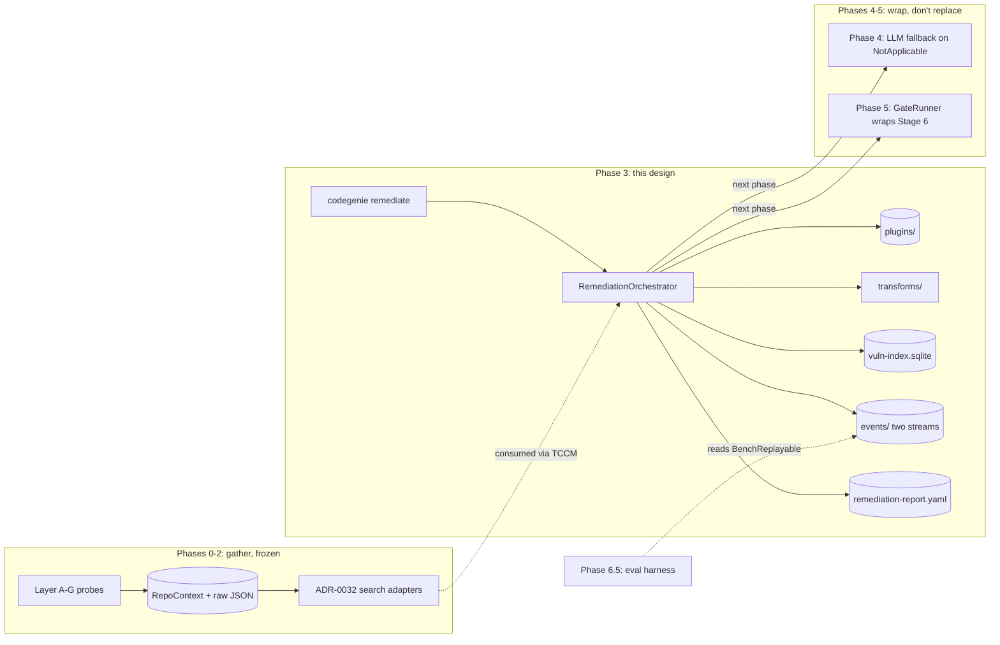
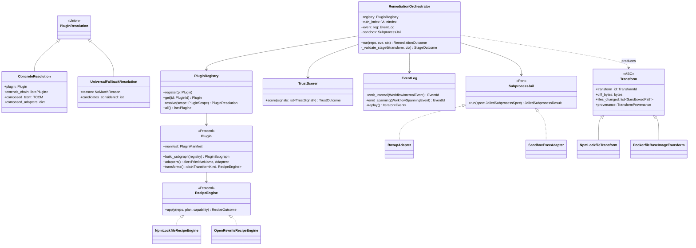
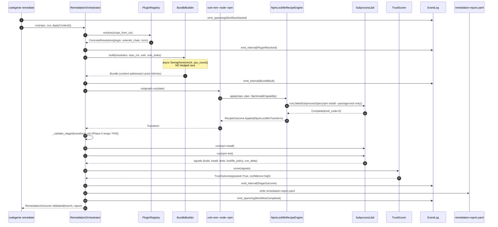
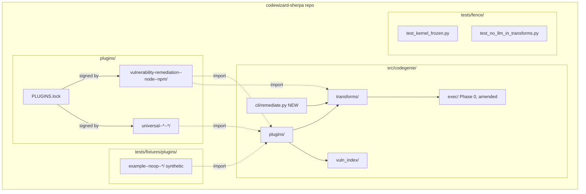
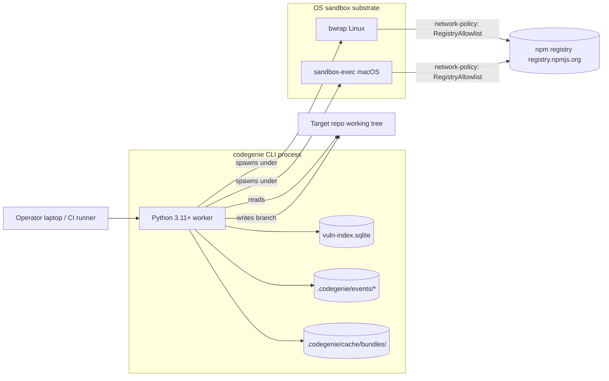
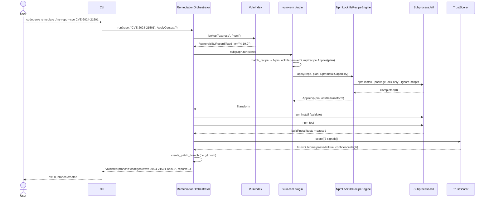
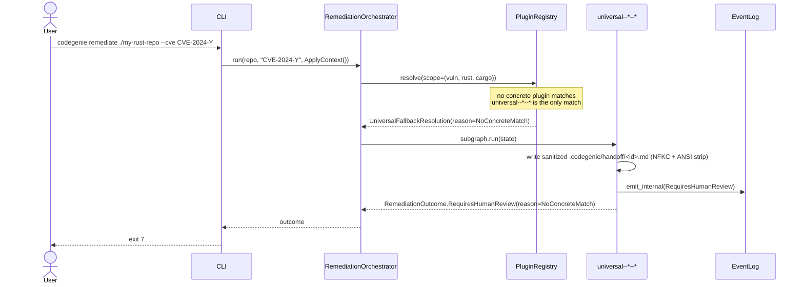

# Phase 03 — Vuln remediation: deterministic recipe path: Architecture

**Status:** Architecture spec
**Date:** 2026-05-17
**Inputs:** `final-design.md` (synthesized design) · `critique.md` · `design-{performance,security,best-practices}.md` · `docs/production/design.md` · `docs/production/adrs/{0007,0008,0009,0011,0012,0014,0029,0030,0031,0032,0033,0034}.md` · `docs/phases/05-sandbox-trust-gates/final-design.md` · `docs/phases/06.5-per-task-class-eval-harness/final-design.md` · `docs/roadmap.md` Phase 3
**Audience:** the engineer implementing this phase

---

## Executive summary

Phase 3 lands the first **plugin** (`vulnerability-remediation--node--npm`), the **universal HITL fallback** (`universal--*--*`), and — load-bearingly — the named seams Phase 5 has *already* committed to wrapping: `RemediationOrchestrator`, `TrustScorer`, `Transform` ABC, `ApplyContext`, `RecipeEngine`, `remediation-report.yaml`. The runtime substrate for npm install/test is a Phase-3-local `SubprocessJail` (bwrap on Linux, sandbox-exec on macOS) so the roadmap exit criterion — *passes the repo's own tests* — is meetable without waiting for Phase 5's Firecracker microVM. Determinism (commitment §2.4) is veto-strength: declarative TCCM fallback, content-addressed Bundle cache keyed on `vuln_index.digest`, byte-identical `Transform` outputs across 100 property runs. The phase ships an `OpenRewriteRecipeEngine` scaffold (Protocol-conformant, one Dockerfile fixture, never invoked by Phase 3 npm workflows) and a synthetic `example--noop--*` third plugin so the plugin contract has been bake-tested against three plugins before Phase 7 ships its first new task class under the "zero edits" exit criterion.

## Goals

Verifiable end-state conditions, pulled from `final-design.md §Goals` and roadmap Phase 3 exit criterion:

- **G1 — Roadmap exit criterion met end-to-end.** `codegenie remediate <node-repo> --cve <id>` writes a working patch on a local branch; the patched tree passes `npm install` and `npm test` inside `SubprocessJail`. End-to-end integration test: `tests/integration/test_end_to_end_express_cve.py`.
- **G2 — Phase 5 contract handshake.** `RemediationOrchestrator`, `TrustScorer`, `Transform` ABC, `ApplyContext`, `RecipeEngine`, `remediation-report.yaml` exist by name under `src/codegenie/transforms/`, exported from `__init__.py`, and survive `tests/integration/test_phase5_contract_snapshot.py`. (Final-design Goal 2, critic Issue 1.)
- **G3 — Plugin contract bake-tested against 3 plugins.** Two production (`vulnerability-remediation--node--npm`, `universal--*--*`) + one synthetic (`tests/fixtures/plugins/example--noop--*/`). `tests/integration/test_three_plugin_contract.py` resolves all three and exercises every contract surface. (Final-design Goal 3, critic Issue 8.)
- **G4 — Determinism property.** Same `(repo_snapshot_sha, cve_record_digest, plugin_version, recipe_version, vuln_index_digest)` → byte-identical `Transform.diff_bytes` over 100 Hypothesis runs. Modulo timestamps + `workflow_id`, event sequence is identical. (Commitment §2.4.)
- **G5 — No LLM in Phase 3.** `import-linter` contract extends `FORBIDDEN_LLM_SDKS` enforcement to `src/codegenie/{plugins,transforms}/` and `plugins/{vulnerability-remediation--node--npm,universal--*--*}/`. CI hard-block. Pyproject fence test asserts zero LLM SDK appears in the runtime closure of the Phase 3 surface.
- **G6 — Zero edits to Phase 0/1/2.** `tests/fence/test_kernel_frozen.py` git-diffs the Phase-0/1/2 file list against an ADR-anchored allowlist. The only permitted edits: extending `ALLOWED_BINARIES` (Phase 3 ADR amends 02-ADR-0001 with `npm`, `bwrap`, `sandbox-exec`, `jq`) and adding `import-linter` contracts.
- **G7 — Universal HITL fallback exits 7.** No-match resolutions fire `RequiresHumanReview`; sanitized markdown written to `.codegenie/handoff/<workflow_id>.md`. Never silently substituted by a concrete plugin.
- **G8 — Honest confidence propagates.** Stale `IndexHealthProbe` (Phase 2 B2) → `NodeScipAdapter.confidence() == Degraded(ScipIndexStale)` → declarative TCCM fallback fires (NOT raced) → `AdapterDegraded` event emitted → `TrustOutcome.confidence == "degraded"` in `remediation-report.yaml`. (Commitment §2.3.)
- **G9 — Phase 6.5 backfill readiness.** Every workflow emits `BenchReplayable` on the spanning event stream carrying input-snapshot fingerprint + `Transform.diff_bytes_sha256`. Phase 6.5's `codegenie eval backfill` lifts 10 cases mechanically.
- **G10 — Performance envelope.** Time-to-PR p50 ≤ 18 s (warm), p95 ≤ 35 s, including `npm install` + `npm test` inside the jail. Relative-budget assertion in CI: > 25% regression vs. 7-day rolling mean fails. `$0.00` LLM spend, CI-asserted.

## Non-goals

Anti-scope. Each non-goal names where the work actually goes:

- **No LLM fallback, no RAG.** Phase 4 owns recipe-miss → solved-example RAG → LLM-fallback (`docs/roadmap.md` Phase 4; ADR-0011). Phase 3's `RecipeOutcome.NotApplicable` is the *trigger* Phase 4 reads.
- **No three-retry envelope.** Phase 5's `GateRunner` wraps Phase 3's `_validate_stage6` seam (ADR-0014, 05-ADR-0002). Phase 3 alone: zero retries — on `passed=False`, return `Validated(passed=False, failing=...)` and let the caller decide.
- **No microVM / Firecracker.** Phase 5's `SandboxClient` substitutes via the same Port; Phase 3 ships only bwrap/sandbox-exec adapters (ADR-0012, 05-ADR-0004). The `SubprocessJail` Port is the seam, not the substrate.
- **No LangGraph runtime.** Phase 6 (`docs/roadmap.md` Phase 6, ADR-0002). The 5-node plugin subgraph in Phase 3 is typed step-functions that Phase 6 wraps 1-to-1.
- **No `git push`, no PR creation.** Phase 11 owns it (commitment §2.8, ADR-0009). `GitLocalOpsCapability` cannot mint push permission.
- **No verdict cache.** Phase 9's territory once Temporal idempotency lands (Phase 5's synthesis also rejected verdict cache).
- **No real plugin signature / Sigstore.** Phase 11. Phase 3 ships `PLUGINS.lock` as an *integrity check* (sha256 tree digest, CODEOWNERS gate), explicitly relabeled per critic Issue 7 from "signature" to "integrity check".
- **No hot-reload of plugins.** Phase 11 `--reload-plugins`. Plugin change requires worker restart.
- **No portfolio-scale CVE-index centralization.** Phase 10. Phase 3's `vuln-index.sqlite` is single-host.
- **No JVM SecurityManager.** Rejected — deprecated upstream. The `SubprocessJail` boundary is the real defense for the `OpenRewriteRecipeEngine` scaffold. (Critic Security Issue 4.)
- **No `npm-check-updates`.** Phase 3 already knows the target version from the CVE record (Critic Best-Practices Issue 1, final-design §Patterns rejected). NCU solves the wrong question.

## Architectural context

Phase 3 fits into the production target as the **first instantiation of Stages 3–6 of the seven-stage pipeline** (ADR-0010, production §3) for a single task class on a single repo. Stages 0 (Discovery), 1 (Assessment), 7 (Handoff/Learning) are portfolio/PR-creation territory (Phases 10+) and remain stubs in Phase 3. Stage 6 (Validate) is the seam Phase 5 wraps with its three-retry `GateRunner`.



Phase 3 introduces three persistent on-disk artifacts that all subsequent phases consume: the two-stream event log (Phase 9 projector reads both), `remediation-report.yaml` (Phase 5 reads it to decide retry), and the `vuln-index.sqlite` (Phase 10 portfolio scan will centralize).

---

## 4+1 architectural views

### Logical view



**Central abstractions:** `RemediationOrchestrator` is the named Phase-5 seam. `Plugin` Protocol + `PluginRegistry` are the closed-for-modification kernel (ADR-0031). `Transform` is the ABC Phase 5's `GateContext.transform_output: Transform` is typed against. `SubprocessJail` is the Port whose substrate Phase 5 swaps. `TrustScorer` is the additively-extended scorer (Phase 5's ADR-P5-003 widens its `SignalKind` registry). **Scaffolding** (helpers, parsers, write-back utilities) lives behind these but is never imported across plugin boundaries.

### Process view



**Concurrency / blocking / checkpoints.** The whole workflow is in-process Python with `asyncio`. The only parallelism is the `BundleBuilder`'s bounded `Semaphore(min(4, os.cpu_count()))` over TCCM `must_read` queries — **strictly serial fallback on `Degraded`** (no hedged race; commitment §2.4). `SubprocessJail.run` is blocking under `asyncio.to_thread` so the event loop stays responsive. Durable checkpoints in Phase 3 are file-system writes: per-emit append to the two `jsonl.zst` streams (fsync on workflow end, not per emit, for the internal stream; per-emit `flock`-protected for the spanning stream). The seam Phase 5 wraps is `RemediationOrchestrator._validate_stage6(...)`: Phase 5's `GateRunner.run(transition=stage6_validate, ctx=GateContext(...))` calls into the orchestrator's stage-6 method and re-enters it on retry with `prior_attempts` populated.

### Development view



**Stable contracts** (closed for modification after Phase 3 ships):
- `src/codegenie/plugins/protocols.py` — `Plugin`, `Adapter`, `RecipeEngine`, `RecipeProtocol` Protocols + `Transform` ABC re-export.
- `src/codegenie/plugins/registry.py` — `PluginRegistry` class + `@register_plugin` decorator.
- `src/codegenie/plugins/loader.py` — filesystem walk + `PLUGINS.lock` verification.
- `src/codegenie/plugins/resolver.py` — `(specificity desc, precedence desc, name asc)` resolution algorithm.
- `src/codegenie/transforms/orchestrator.py` — `RemediationOrchestrator.run` signature + `_validate_stage6` seam.
- `src/codegenie/transforms/trust_scorer.py` — `TrustScorer.score` signature + `SignalKind` open registry.
- `src/codegenie/transforms/apply_context.py` — `ApplyContext` Pydantic model (`prior_attempts` already on it for Phase 5).
- `src/codegenie/transforms/transform.py` — `Transform` ABC.
- `src/codegenie/transforms/report.py` — `remediation-report.yaml` schema (Pydantic).

**Internal helpers** (free to refactor): `bundle.py`, `capabilities.py`, `sandbox_path.py`, `events.py` payload definitions (event *taxonomy* is contract; payload fields can grow under `extra="forbid"` with additive Pydantic versions). Plugins themselves are internal to the plugin folder — `subgraph/`, `recipes/`, `adapters/` are not re-exported from `src/codegenie/`.

### Physical view

Phase 3 is **local POC, single-process, single-host** — there is no distributed substrate. The "physical" diagram is small.



Process boundary: one orchestrator Python process per `codegenie remediate` invocation. Inside it: a long-running asyncio event loop, the loaded `PluginRegistry`, and the mmap'd SCIP / dep-graph indices from Phase 2's `.codegenie/context/`. Child processes (one per `npm install` / `npm test` / `git`) are spawned via `SubprocessJail` under bwrap or sandbox-exec; each has its own network namespace and seccomp filter. Phase 5 swaps the substrate (Firecracker on Linux/CI, DinD on macOS dev) without changing this diagram's *Process* box — only the *Substrate* box.

### Scenarios

#### Scenario A — Happy path: npm CVE → recipe match → patch lands → tests pass



#### Scenario B — Recipe miss → universal HITL fallback



#### Scenario C — Recipe applies but tests fail (the seam Phase 5 wraps)

```mermaid
sequenceDiagram
    autonumber
    participant Orch as RemediationOrchestrator (Phase 3)
    participant Eng as NpmLockfileRecipeEngine
    participant Jail as SubprocessJail
    participant Score as TrustScorer
    participant P5 as GateRunner (Phase 5, NOT in Phase 3)
    Note over Orch: Phase 3 ALONE: no retry envelope
    Orch->>Eng: apply(...)
    Eng-->>Orch: Applied(NpmLockfileTransform)
    Orch->>Orch: _validate_stage6(transform, ctx)
    Orch->>Jail: npm install
    Jail-->>Orch: install passed
    Orch->>Jail: npm test
    Jail-->>Orch: TESTS FAILED (exit_code=1)
    Orch->>Score: score(signals)
    Score-->>Orch: TrustOutcome(passed=False, failing=["tests"])
    Orch-->>Orch: return Validated(passed=False, failing=["tests"])
    Note over Orch,P5: Phase 5 wraps this seam:
    P5->>Orch: _validate_stage6(transform, ctx.with_prior_attempt(...))
    Note over P5: 3-retry envelope (ADR-0014)
    P5->>P5: ctx.prior_attempts grows; Phase 4 may re-plan
```

#### Scenario D — Plugin resolution walks `extends` chain

```mermaid
sequenceDiagram
    participant Loader as PluginLoader
    participant Reg as PluginRegistry
    participant Res as Resolver
    Loader->>Loader: walk plugins/*/plugin.yaml
    Loader->>Loader: verify PLUGINS.lock sha256 per dir
    Loader->>Reg: register(vulnerability-remediation--node--npm)
    Loader->>Reg: register(universal--*--*)
    Loader->>Reg: register(example--noop--* via tests fixture)
    Note over Loader,Reg: imports adapter modules; minted CapabilityBundle
    Res->>Reg: resolve(PluginScope(vuln, node, npm))
    Reg->>Reg: filter by scope.matches(...)
    Reg->>Reg: sort by (specificity desc, precedence desc, name asc)
    Reg->>Reg: walk extends_chain (max depth 4; cycle-checked)
    Reg->>Reg: compose TCCM (provides/requires merged left-to-right)
    Reg-->>Res: ConcreteResolution(plugin, [], composed_tccm, composed_adapters)
```

---

## Component design

Ten components carry the architectural weight; the rest are helpers. Each is named, located, contracted, and sized.

### C1. `RemediationOrchestrator` (`src/codegenie/transforms/orchestrator.py`)

- **Purpose.** Stage-3-through-Stage-6 entry point. The named Phase-5 wrap-target. (`final-design.md §Components #1`.)
- **Public interface (concrete signatures):**
  ```python
  class RemediationOrchestrator:
      def __init__(
          self,
          registry: PluginRegistry,
          vuln_index: VulnIndex,
          event_log: EventLog,
          *,
          sandbox: SubprocessJail | None = None,
      ) -> None: ...

      async def run(
          self,
          repo: SandboxedPath,
          cve: CveId,
          context: ApplyContext = ApplyContext(),
      ) -> RemediationOutcome: ...

      # Phase 5 wraps THIS method via GateRunner.run(transition=stage6_validate, ctx=...)
      async def _validate_stage6(
          self,
          transform: Transform,
          ctx: ApplyContext,
      ) -> StageOutcome: ...
  ```
- **Internal structure.** Five sequential stages (resolve → bundle → match → apply → validate) followed by branch write + report write. No LangGraph; plain async `for` over typed step-functions. The `_validate_stage6` method is intentionally a single method (not a function) so Phase 5's wrap is a method-call decoration, not a dispatch.
- **Dependencies.** `PluginRegistry`, `VulnIndex`, `EventLog`, `SubprocessJail`, `TrustScorer` (constructed lazily from registered `SignalKind`s).
- **State.** Stateless across runs; per-run state is in `ApplyContext` + the event log. The orchestrator instance is reusable for multiple workflows in the same process.
- **Performance envelope.** p50 warm 14.8 s end-to-end (`npm install` + `npm test` dominate); p95 ≤ 35 s. Orchestrator overhead (resolution + bundle + scoring + report) < 500 ms.
- **Failure behavior.** Every stage emits a typed event before raising; `RemediationOutcome` is a tagged union (`Validated | RequiresHumanReview | NotApplicable | Failed`). On exception in any stage, the orchestrator writes a partial `remediation-report.yaml` with `outcome.kind = "failed"` and re-raises. **Never** silently catches.

### C2. `Plugin` Protocol + `PluginRegistry` + `@register_plugin` (`src/codegenie/plugins/{protocols,registry}.py`)

- **Purpose.** The closed-for-modification kernel (ADR-0031). Phase 7 distroless plugin adds a directory + a decorator call; zero edits here.
- **Public interface:**
  ```python
  class Plugin(Protocol):
      manifest: PluginManifest
      def build_subgraph(self, registry: PluginRegistry) -> PluginSubgraph: ...
      def adapters(self) -> dict[PrimitiveName, Adapter]: ...
      def transforms(self) -> dict[TransformKind, RecipeEngine]: ...

  class PluginRegistry:
      def register(self, plugin: Plugin) -> None: ...
      def get(self, name: PluginId) -> Plugin: ...
      def resolve(self, scope: PluginScope) -> PluginResolution: ...
      def all(self) -> list[Plugin]: ...

  default_registry: PluginRegistry  # production singleton instance

  def register_plugin(
      plugin: Plugin, *, registry: PluginRegistry | None = None
  ) -> Plugin:
      (registry or default_registry).register(plugin)
      return plugin
  ```
- **Internal structure.** Dict-of-`PluginId` → `Plugin`. `resolve()` filters by `scope.matches(...)`, sorts by `(specificity desc, precedence desc, name asc)`, returns the head as `ConcreteResolution` or — if the head is `universal--*--*` — as `UniversalFallbackResolution`. There is **no** "no plugin matched" branch; the universal fallback IS the no-match variant. Cycle check on `extends`; max depth 4.
- **Dependencies.** None within `codegenie.plugins`; depends only on `pydantic`, `pyyaml`, stdlib.
- **State.** `default_registry` is a module-level instance (NOT a module-level mutable dict). Test fixtures pass fresh `PluginRegistry()` instances to `@register_plugin(registry=...)` for isolation. Phase 6.5's `TaskClassRegistry` uses this exact shape.
- **Performance envelope.** Resolution: ~30 μs against 3 plugins. Loader cold start ≤ 400 ms (Pydantic-bound).
- **Failure behavior.** `PluginAlreadyRegistered` on collision. `PluginExtendsCycle(chain)` on cyclic `extends`. `PluginRejected(integrity_mismatch)` on `PLUGINS.lock` mismatch. All exit code 4.
- **What is NOT on `Plugin`.** No `cve_feed_parsers()`. Vuln-specific knowledge lives in the plugin's TCCM under `provides.vuln_index_capabilities`; Phase 7's distroless plugin will declare `provides.dockerfile_capabilities`. The kernel knows about neither. (Critic best-practices Issue 5.)

### C3. `PluginScope` + `Concrete | Wildcard` sum type (`src/codegenie/plugins/scope.py`)

- **Purpose.** Encode `(task_class × language × build_system)` as a type where wildcards are an explicit variant, not `Literal["*"]` collapsed to `str`. ADR-0033 §"make illegal states unrepresentable".
- **Public interface:**
  ```python
  @dataclass(frozen=True, slots=True)
  class Concrete:
      value: str  # newtype-wrapped at call sites

  @dataclass(frozen=True, slots=True)
  class Wildcard:
      pass

  ScopeDim: TypeAlias = Concrete | Wildcard

  @dataclass(frozen=True, slots=True)
  class PluginScope:
      task_class: ScopeDim
      language: ScopeDim
      build_system: ScopeDim

      def matches(self, *, task: TaskClass, language: Language, build: BuildSystem) -> bool: ...
      def specificity(self) -> int: ...  # count of Concrete dims

      @classmethod
      def parse(cls, s: str) -> Result["PluginScope", ParseError]: ...
  ```
- **Internal structure.** One-line `match` in `matches()`. `parse()` splits on `--` and constructs `Concrete`/`Wildcard` per dim. YAML still writes `*`; the smart constructor does the lift.
- **Why a sum type, not `Literal["*"]`.** Best-practices' design admitted (`§Open questions #1`) that `Concrete | Wildcard` is more illegal-state-unrepresentable but declined for YAML aesthetics. The critic correctly attacked: `NewType("Language", str) | Literal["*"]` collapses to `str` at runtime. ADR-0033 beats YAML aesthetics.

### C4. `Transform` ABC + `RecipeOutcome` discriminated union (`src/codegenie/transforms/transform.py`)

- **Purpose.** The typed product of a recipe application. The Phase-5-named ABC for `GateContext.transform_output: Transform`.
- **Public interface:**
  ```python
  class Transform(ABC):
      transform_id: TransformId          # blake3(diff_bytes)
      diff_bytes: bytes
      files_changed: list[SandboxedPath]
      provenance: TransformProvenance    # plugin_id, recipe_id, applied_at, …

  class NpmLockfileTransform(Transform): ...
  class DockerfileBaseImageTransform(Transform): ...   # Phase-7-preview

  class RecipeOutcome(BaseModel):
      model_config = ConfigDict(frozen=True, extra="forbid")
      kind: Literal["applied", "skipped", "not_applicable", "failed"]
      # Pydantic discriminated union; one variant per kind:
      #   Applied(transform: Transform, …)
      #   Skipped(reason: SkipReason)
      #   NotApplicable(reason: NotApplicableReason)   # Phase 4 trigger
      #   Failed(error: RecipeError)
  ```
- **Why ABC, not Protocol.** Phase 5's `isinstance(t, Transform)` checks require ABC; `runtime_checkable` Protocols carry overhead. `Transform` is a sealed hierarchy by convention (every concrete subclass under `src/codegenie/transforms/` or `plugins/*/recipes/`).

### C5. `ApplyContext` + `AttemptSummary` (`src/codegenie/transforms/apply_context.py`)

- **Purpose.** The per-attempt input bundle. Phase 5's ADR-P5-002 amends `prior_attempts` additively — **Phase 3 ships the field already** with `default_factory=list` so the amendment is a no-op when Phase 5 starts populating it.
- **Public interface:**
  ```python
  class AttemptSummary(BaseModel):
      model_config = ConfigDict(frozen=True, extra="forbid")
      attempt: AttemptNumber
      failing_signals: list[SignalKind]
      prior_failure_summary: str   # truncated to 8 KB; canary-checked downstream
      evidence_paths: list[SandboxedPath]
      transform_id: TransformId | None  # None if Failed before transform

  class ApplyContext(BaseModel):
      model_config = ConfigDict(frozen=True, extra="forbid")
      workflow_id: WorkflowId
      attempt: AttemptNumber = AttemptNumber(1)
      prior_attempts: list[AttemptSummary] = Field(default_factory=list)
      capabilities: CapabilityBundle
  ```
- **Tradeoff accepted.** `prior_attempts` is dead-weight in Phase 3 (always empty). The alternative (amend the Pydantic model at Phase 5 time and break the contract snapshot) is worse.

### C6. `TrustScorer` + `SignalKind` open registry (`src/codegenie/transforms/trust_scorer.py`)

- **Purpose.** Strict-AND scoring. Same scorer Phase 5 widens with `trace`, `policy` signal kinds; Phase 7 widens with `baseimage`, `shell_presence`.
- **Public interface:**
  ```python
  class TrustSignal(BaseModel):
      model_config = ConfigDict(frozen=True, extra="forbid")
      kind: SignalKind                 # registered via @register_signal_kind
      passed: bool
      details: dict[str, str | int | bool | float]   # primitives only

  class TrustOutcome(BaseModel):
      model_config = ConfigDict(frozen=True, extra="forbid")
      passed: bool
      failing: list[SignalKind]
      signals: list[TrustSignal]
      confidence: Literal["high", "degraded"]

  class TrustScorer:
      def __init__(self, event_log: EventLog) -> None: ...
      def score(self, signals: list[TrustSignal]) -> TrustOutcome: ...
  ```
- **`SignalKind` open registry.** A module-level dict populated via `@register_signal_kind("name")`. Phase 3 registers: `build`, `install`, `tests`, `lockfile_policy`, `cve_delta`. Phase 5 widens via 05-ADR-0003. The registry refuses duplicates with `SignalKindAlreadyRegistered`.
- **Confidence propagation.** The scorer reads its own workflow's `EventLog` for `AdapterDegraded` markers within `workflow_id`; if any present, `confidence = "degraded"`. This is mildly cyclical — replay-tested.

### C7. `BundleBuilder` (`src/codegenie/plugins/bundle.py`)

- **Purpose.** Execute TCCM `must_read`/`should_read`/`may_read` queries via language adapters; content-addressed cache.
- **Public interface:**
  ```python
  class BundleBuilder:
      def __init__(self, cache_dir: SandboxedPath) -> None: ...
      async def build(
          self,
          resolution: ConcreteResolution,
          repo_ctx: RepoContext,
          vuln: VulnerabilityRecord,
          vuln_index: VulnIndex,
      ) -> Bundle: ...
  ```
- **Cache key.** `blake3(plugin_id || plugin_version || primitive || canonicalize(args) || repo_ctx.digest || scip.digest || dep_graph.digest || vuln_index.digest)`. `vuln_index.digest` is the critic's Hidden Assumption #3 fix — a CVE-feed refresh that re-classifies a CVE must NOT return a stale cache hit.
- **Concurrency.** `asyncio.Semaphore(min(4, os.cpu_count()))`. Bound is **overridable via `CODEGENIE_BUNDLE_CONCURRENCY` env var** so CI-runner tuning is possible without code edits (critic Hidden Assumption #4).
- **Fallback semantics.** **Deterministic serial fallback**, NOT hedged race. The TCCM-declared `fallback` query runs *only* when the primary returns `AdapterConfidence ∈ {Degraded, Unavailable}`. Commitment §2.4 vetoes hedged-race; property-tested across 100 runs.
- **Performance envelope.** Warm: 3 ms (cache hit). Cold: 220 ms (4 queries in parallel). Degraded: ~180 ms (primary + serial fallback).

### C8. `SubprocessJail` Port + Bwrap/SandboxExec adapters (`src/codegenie/transforms/sandbox_jail.py`)

- **Purpose.** Wrap every Phase-3 subprocess (`npm install`, `npm test`, `git`) in a network-namespace + seccomp + tmpfs-rooted jail so child processes cannot reach `~`, exceed time/memory caps, or escape the registry allowlist. The Hexagonal Port Phase 5 substitutes with Firecracker / DinD.
- **Public interface:**
  ```python
  class SubprocessJail(Protocol):
      async def run(self, spec: JailedSubprocessSpec) -> JailedSubprocessResult: ...

  class JailedSubprocessSpec(BaseModel):
      model_config = ConfigDict(frozen=True, extra="forbid")
      cmd: tuple[str, ...]
      cwd: SandboxedPath
      env: NpmEnv | GitEnv   # typed; never raw dict
      network: NetworkPolicy   # DenyAll | RegistryAllowlist(hosts)
      time_budget_s: float
      memory_mib: int
      pids_max: int

  # Tagged union return:
  JailedSubprocessResult = (
      Completed | TimedOut | OomKilled | NetworkDenied | DiskQuotaExceeded
  )
  ```
- **BwrapAdapter (Linux).** `bwrap --unshare-all --new-session --die-with-parent --ro-bind / / --tmpfs /tmp --bind <jail> <jail>`; seccomp blocks `mount`, `pivot_root`, `ptrace`, `bpf`, `unshare`, `keyctl`. Network: parent owns netns; child sees `lo` + pf-routed allowlist.
- **SandboxExecAdapter (macOS).** `sandbox-exec -f <generated.sb>`: `deny default`, explicit allow-rules for the jail and `RegistryAllowlist` hosts. **Online-mode is default on both substrates.** The critic correctly attacked security's macOS-prefetch flow as creating a second, unjailed trust boundary — we reject it.
- **`--ignore-scripts` enforcement.** Both at CLI (`npm install --ignore-scripts`) AND env (`npm_config_ignore_scripts=true`). npm has had bugs where one or the other was honored; we set both.
- **Performance envelope.** ~80–200 ms setup per spawn on Linux; ~50–150 ms on macOS. Three spawns per workflow → ~600 ms substrate cost.
- **Failure behavior.** Every branch of `JailedSubprocessResult` is a typed Pydantic variant; no `dict[str, Any]`, no bare exceptions. `NetworkDenied(host)` is observable.

### C9. `EventLog` two-stream writer (`src/codegenie/plugins/events.py`)

- **Purpose.** Emit typed Pydantic events to two streams matching ADR-0034's hybrid model. **All three lens designs missed this** — Phase 9 ships Temporal for workflow-internal and Postgres for workflow-spanning.
- **Public interface:**
  ```python
  class EventLog:
      def __init__(self, root: Path, workflow_id: WorkflowId) -> None: ...
      def emit_internal(self, event: WorkflowInternalEvent) -> EventId: ...
      def emit_spanning(self, event: WorkflowSpanningEvent) -> EventId: ...
      def replay(self) -> Iterator[Event]: ...
      def flush(self) -> None: ...

  WorkflowInternalEvent = (
      PluginsLoaded | PluginResolved | BundleBuilt | BundleEntryPromoted
      | RecipeMatched | RecipeApplied | RecipeSkipped | RecipeFailed
      | InstallStageOutcome | TestStageOutcome | LocalBranchWritten
      | RequiresHumanReview | AdapterDegraded | StageOutcome
      | FilesystemRaceDetected | GitHooksDisabledForRun
  )
  WorkflowSpanningEvent = (
      WorkflowStarted | WorkflowCompleted | CostSandboxRun
      | CapabilityMinted | CapabilityUsed | PluginRegistryCorrupted
      | BenchReplayable | StaleVulnIndex
  )
  ```
- **Internal structure.**
  - `.codegenie/events/workflow-internal/<workflow_id>.jsonl.zst` — per-workflow file; fsync on workflow end. Phase 9 reads this once and ports to Temporal history.
  - `.codegenie/events/spanning/append.jsonl.zst` — single append-only file shared across workflows; BLAKE3-chained for tamper evidence; `fcntl.flock` for cross-process safety. Phase 9 reads to Postgres `events` table.
- **Why this matters.** "Phase 9 lifts unchanged" promised by all three lens designs is wrong against ADR-0034. Workflow-internal events belong in Temporal history; workflow-spanning belong in Postgres. Ship the split now or Phase 9 re-partitions the taxonomy.

### C10. `Capability` tokens + `SandboxedPath` (`src/codegenie/plugins/{capabilities,sandbox_path}.py`)

- **Purpose.** Type-discipline + audit trail for risky operations. **Honest framing per critic** — these are *audit + lint enforcement*, NOT unforgeable runtime isolation.
- **Capability interface:**
  ```python
  class NpmInstallCapability(BaseModel):
      model_config = ConfigDict(frozen=True, extra="forbid")
      registry: RegistryUrl
      _minted_by: PluginId

  class FsReadWriteCapability(BaseModel): ...
  class GitLocalOpsCapability(BaseModel): ...    # NO push field; minting one is type-impossible

  class CapabilityBundle(BaseModel):
      npm: NpmInstallCapability | None
      fs: FsReadWriteCapability | None
      git: GitLocalOpsCapability | None

  # The ONLY mint point:
  def mint(plugin: PluginId, scope: CapabilityScope) -> CapabilityBundle: ...
  ```
- **SandboxedPath:**
  ```python
  class SandboxedPath:
      @classmethod
      def create(cls, jail: Path, relative: str | Path) -> Result["SandboxedPath", PathEscape]: ...
      @property
      def absolute(self) -> Path: ...
      def open(self, mode: str) -> IO[Any]: ...    # always O_NOFOLLOW
  ```
- **Enforcement.** A `ruff` custom rule (`tooling/ruff_rules/no_capability_construction.py`) AST-walks `src/` + `plugins/` and fails on any `*Capability(...)` construction outside `capabilities.py` or `tests/`. Pydantic doesn't know its caller; the lint is the enforcement. Honest framing: *audit infrastructure* (every `CapabilityUsed` event logged) backed by *lint + PR review*, NOT runtime impossibility (critic correctly attacked the "unforgeable" overclaim).
- **`SandboxedPath` TOCTOU honesty.** Constructor resolves `strict=True`, checks `is_relative_to(jail)`. But `resolve(strict=True)` follows symlinks — a symlink swap between `create()` and `open()` is detected at `open()` time (`ELOOP`), not at construction. **Documented as "in-jail at construction" not "in-jail forever."** Consumers handle `OSError(errno=ELOOP)` and emit `FilesystemRaceDetected`.

### C11 (supporting). `VulnIndex` (`src/codegenie/vuln_index/`)

- **Purpose.** sqlite-indexed `(package, ecosystem)` → `list[VulnerabilityRecord]` lookup. 3 ms vs. 50–200 ms JSON-parse-per-call.
- **Interface:**
  ```python
  class VulnIndex:
      def lookup(self, package: PackageId, ecosystem: Ecosystem) -> list[VulnerabilityRecord]: ...
      def affecting_range(self, cve: CveId) -> AffectedRange: ...
      def digest(self) -> BlobDigest: ...
  ```
- **Schema.** `vulnerabilities` table keyed by `(ecosystem, package, affected_min_version, affected_max_version)`. ~50 MB steady. Alembic migrations.
- **CLI.** `codegenie vuln-index refresh` — pulls NVD JSON 2.0 delta, GHSA `since`-cursor, OSV via GCS zsync. Each feed projects into typed Pydantic records via smart constructors with size (1 MiB) + depth (16) caps.
- **Staleness signal.** `digest()` carries `mtime`; > 7 days → `StaleVulnIndex` event (warn, not block). Configurable per operator.

### C12 (supporting). `NpmLockfileRecipeEngine` + `OpenRewriteRecipeEngine` scaffold

- **`NpmLockfileRecipeEngine`** — production. Pure Python. (1) parse `package.json` via `orjson` (size cap 1 MiB); (2) edit affected dep version in-mem (preserve key order); (3) write back through `SandboxedPath` with `O_NOFOLLOW`; (4) `SubprocessJail.run(npm install --package-lock-only --ignore-scripts --no-audit --prefer-offline)`; (5) parse new lockfile (size cap 32 MiB, depth cap 24); (6) return `RecipeOutcome.Applied(NpmLockfileTransform(...))`.
- **`OpenRewriteRecipeEngine`** — scaffolded stub. Protocol-conformant. Ships a Phase-7-tagged Dockerfile-base-image-swap fixture (`tests/fixtures/openrewrite/dockerfile-base-image-swap/`) + a `@pytest.mark.phase_7_preview` test. The JVM subprocess runs OpenRewrite under `SubprocessJail`. **Not invoked by any Phase-3 npm workflow.** Pays the "2 implementations from day one" rent so Phase 7's distroless plugin doesn't invent JVM infrastructure under a "zero edits" exit criterion.

---

## Data model

Pydantic-style pseudo-code. Contract types (Phase 5 / Phase 7 consume) are marked **(contract)**; internal helpers are marked *(internal)*.

```python
# ----- Newtype identifiers (ADR-0033) -----
PluginId      = NewType("PluginId", str)
RecipeId      = NewType("RecipeId", str)
TransformId   = NewType("TransformId", str)     # blake3(diff_bytes)
WorkflowId    = NewType("WorkflowId", str)      # ULID
EventId       = NewType("EventId", str)         # ULID
CveId         = NewType("CveId", str)
PackageId     = NewType("PackageId", str)
BranchName    = NewType("BranchName", str)
BlobDigest    = NewType("BlobDigest", str)
RegistryUrl   = NewType("RegistryUrl", str)
SignalKind    = NewType("SignalKind", str)      # open registry
PrimitiveName = NewType("PrimitiveName", str)
TransformKind = NewType("TransformKind", str)
AttemptNumber = NewType("AttemptNumber", int)

# Newtype-validated wrappers (smart constructors)
class PackageId:
    @classmethod
    def parse(cls, s: str) -> Result["PackageId", ParseError]: ...
class BranchName:
    @classmethod
    def parse(cls, s: str) -> Result["BranchName", ParseError]: ...   # ^[a-z0-9/_.-]+$

# ----- Plugin contract (contract) -----
class PluginManifest(BaseModel):
    model_config = ConfigDict(frozen=True, extra="forbid")
    name: PluginId
    version: SemverVersion
    scope: PluginScope             # parsed from "task--language--build"
    precedence: int = 0            # higher wins on ties
    extends: list[PluginId] = []   # max depth 4; cycle-checked

class TCCM(BaseModel):             # (contract) ADR-0029
    model_config = ConfigDict(frozen=True, extra="forbid")
    must_read: list[ContextQuery]
    should_read: list[ContextQuery] = []
    may_read: list[ContextQuery] = []
    provides: dict[str, dict[str, str]] = {}    # capability namespace → name → entrypoint
    requires: dict[str, list[str]] = {}

class PluginScope(BaseModel):
    task_class: ScopeDim
    language: ScopeDim
    build_system: ScopeDim
    def matches(self, *, task: TaskClass, language: Language, build: BuildSystem) -> bool: ...
    def specificity(self) -> int: ...

# ----- Sum type: PluginResolution (contract) -----
class ConcreteResolution(BaseModel):
    kind: Literal["concrete"] = "concrete"
    plugin: Plugin
    extends_chain: list[Plugin]
    matched_scope: PluginScope
    composed_tccm: TCCM
    composed_adapters: dict[PrimitiveName, Adapter]

class UniversalFallbackResolution(BaseModel):
    kind: Literal["universal_fallback"] = "universal_fallback"
    reason: NoMatchReason
    candidates_considered: list[PluginId]

PluginResolution = Annotated[
    ConcreteResolution | UniversalFallbackResolution,
    Discriminator("kind"),
]

# ----- Transform (contract; Phase 5 consumes) -----
class Transform(ABC):
    transform_id: TransformId
    diff_bytes: bytes
    files_changed: list[SandboxedPath]
    provenance: TransformProvenance

class TransformProvenance(BaseModel):
    plugin_id: PluginId
    plugin_version: SemverVersion
    recipe_id: RecipeId
    recipe_version: SemverVersion
    applied_at: datetime
    capability_use_id: EventId

# ----- ApplyContext (contract; Phase 5's ADR-P5-002 amends additively) -----
class ApplyContext(BaseModel):
    model_config = ConfigDict(frozen=True, extra="forbid")
    workflow_id: WorkflowId
    attempt: AttemptNumber = AttemptNumber(1)
    prior_attempts: list[AttemptSummary] = Field(default_factory=list)
    capabilities: CapabilityBundle

# ----- ApplyResult sum type (internal -> contract via RemediationOutcome) -----
class RecipeOutcome(BaseModel):
    kind: Literal["applied", "skipped", "not_applicable", "failed"]
    # discriminated union variants:
    #   Applied(transform: Transform, ...)
    #   Skipped(reason: SkipReason)
    #   NotApplicable(reason: NotApplicableReason)   # PEER_DEP_CONFLICT, MAJOR_BUMP_REFUSE, ...
    #   Failed(error: RecipeError)

class RemediationOutcome(BaseModel):    # (contract)
    kind: Literal["validated", "requires_human_review", "not_applicable", "failed"]
    # Validated(branch: BranchName, report_path: SandboxedPath, trust_outcome: TrustOutcome)
    # RequiresHumanReview(reason: HumanReviewReason, handoff_path: SandboxedPath)
    # NotApplicable(reason: NotApplicableReason)
    # Failed(error: RemediationError, partial_report_path: SandboxedPath)

# ----- TrustSignals (contract; Phase 5/7 widen) -----
class TrustSignal(BaseModel):
    model_config = ConfigDict(frozen=True, extra="forbid")
    kind: SignalKind                # ADR-0033 NewType + open registry
    passed: bool
    details: dict[str, str | int | bool | float]    # primitives only

class TrustOutcome(BaseModel):
    model_config = ConfigDict(frozen=True, extra="forbid")
    passed: bool
    failing: list[SignalKind]
    signals: list[TrustSignal]
    confidence: Literal["high", "degraded"]

# ----- Event taxonomy (contract; Phase 9 reads both streams) -----
class WorkflowInternalEvent(BaseModel):
    model_config = ConfigDict(frozen=True, extra="forbid")
    event_id: EventId
    workflow_id: WorkflowId
    timestamp: datetime
    event_type: Literal[
        "plugin_resolved", "bundle_built", "recipe_matched", "recipe_applied",
        "recipe_skipped", "recipe_failed", "install_stage_outcome",
        "test_stage_outcome", "local_branch_written", "requires_human_review",
        "adapter_degraded", "stage_outcome", "filesystem_race_detected",
        "git_hooks_disabled_for_run",
    ]
    payload: dict[str, str | int | bool | float | list[str]]
    # discriminated by event_type; each type has a typed payload schema

class WorkflowSpanningEvent(BaseModel):
    model_config = ConfigDict(frozen=True, extra="forbid")
    event_id: EventId
    workflow_id: WorkflowId
    timestamp: datetime
    prev_hash: BlobDigest     # BLAKE3 chain
    event_type: Literal[
        "workflow_started", "workflow_completed", "cost_sandbox_run",
        "capability_minted", "capability_used", "plugin_registry_corrupted",
        "bench_replayable", "stale_vuln_index",
    ]
    payload: dict[str, str | int | bool | float | list[str]]
```

The **discriminator-on-`kind`** pattern is uniform across `RecipeOutcome`, `RemediationOutcome`, `PluginResolution`, `Applicability`, `JailedSubprocessResult`, `AdapterConfidence`. `match` + `assert_never` enforces exhaustiveness at every dispatch site.

---

## Control flow

**Happy path in component order:**

1. **CLI parse.** `codegenie remediate <repo> --cve <id>` (click). Mint `WorkflowId` (ULID), construct `SandboxedPath(jail=repo)`, load Phase 2's `.codegenie/context/repo-context.yaml`, warn on staleness.
2. **`RemediationOrchestrator.run(repo, cve, ApplyContext())`.** Construct `EventLog`, emit `WorkflowStarted` (spanning).
3. **`PluginRegistry.resolve(scope_from_repo_context)`** → `ConcreteResolution` or `UniversalFallbackResolution`. Emit `PluginResolved`.
4. **`capabilities.mint(plugin_id, scope)`** → `CapabilityBundle`. Emit 1–3 `CapabilityMinted` (spanning).
5. **`VulnIndex.lookup(package, ecosystem)`** → `VulnerabilityRecord`.
6. **`BundleBuilder.build(resolution, repo_ctx, vuln, vuln_index)`** → `Bundle`. Cache-keyed; emit `BundleBuilt`.
7. **Plugin subgraph (5 nodes, sequential):** `ingest_cve` → `match_recipe` → `apply_recipe` → *stage6_validate* → `write_branch`.
8. **Stage 6 validate** (this method is the Phase-5 wrap-target): apply transform to temp worktree; `SubprocessJail.run(npm install)`; `SubprocessJail.run(npm test)`; collect 5 `TrustSignal`s; `TrustScorer.score(...)` → `TrustOutcome`.
9. **`LocalGitOps.create_patch_branch(...)`** under `GitLocalOpsCapability`. `core.hooksPath=/dev/null`; `GIT_TERMINAL_PROMPT=0`; `GIT_ASKPASS=/bin/false`.
10. **`report.write(...)`** → `remediation-report.yaml` indexes both event streams + outcome. Audit-chain BLAKE3 head computed.
11. **`EventLog.flush()`; emit `WorkflowCompleted` (spanning); CLI exit.**

**Decision points:**

- *No plugin matches* → universal fallback fires → `RequiresHumanReview` → exit 7. Never "no match" exit.
- *Recipe returns `NotApplicable`* (e.g., `NpmPeerDepConflictRecipe`, `NpmMajorBumpRefuseRecipe`) → exit 3 with `RemediationOutcome.NotApplicable(reason)`. Phase 4 reads `reason` to decide LLM-fallback dispatch.
- *Recipe returns `Failed`* → `RemediationOutcome.Failed(error)` → exit 4. Partial report written.
- *Install or test fails (Stage 6)* → `TrustOutcome.passed=False` → `Validated(passed=False, failing=[...])`. **Phase 3 alone: no retry**, return the outcome. Phase 5's `GateRunner` is the retry envelope.
- *Adapter `Degraded`* → declarative TCCM fallback fires (NOT raced) → `AdapterDegraded` event → `TrustOutcome.confidence="degraded"` propagates.
- *`SubprocessJail` `NetworkDenied(host)`* → `RecipeOutcome.Failed(NetworkPolicyViolation(host))` → exit 4 with network policy info.
- *Symlink TOCTOU detected at `open()`* → `OSError(ELOOP)` caught → `FilesystemRaceDetected` event → `RemediationOutcome.Failed(filesystem_race)` → exit 4.

**Defaults.** Time budgets: `npm install --package-lock-only` 60 s; `npm install` (validate) 180 s; `npm test` 300 s. Memory budget: 1024 MiB per child. `pids_max`: 1024. Network policy default: `RegistryAllowlist(["registry.npmjs.org"])` for npm; `DenyAll` for git.

---

## Harness engineering

- **Logging.** Structured JSON via stdlib `logging` configured at CLI entry. One record per event emit (info), one per stage transition (info), one per `RecipeOutcome.Failed` / `JailedSubprocessResult` non-Completed (warn / error). Never log capability bundles, env values for sensitive keys (`GITHUB_TOKEN`, `OPENAI_API_KEY`, `AWS_*`, `SSH_AUTH_SOCK` — the Phase 0 `_SENSITIVE_*` lists), or absolute paths outside the jail.
- **Tracing.** OpenTelemetry hooks deferred to Phase 13. Phase 3 uses event-log replay as the trace primitive — `EventLog.replay()` yields the canonical chronological view.
- **Idempotence.** Repeating `codegenie remediate <same-repo> --cve <same-cve>` against an unchanged repo + unchanged `vuln-index.sqlite` → `Bundle` cache hit, recipe match cache hit, `Transform.transform_id` identical, branch name with `-<shortsha>` suffix collides → **second run aborts with `WorkflowConcurrent`** (the `.codegenie/.lock` `flock`). No silent re-apply. To re-run, the branch must be deleted explicitly.
- **Determinism vs. probabilism.** **Phase 3 has ZERO LLM** — enforced by:
  1. `import-linter` contract (new entries for `src/codegenie/{plugins,transforms}/`, `plugins/{vulnerability-remediation--node--npm,universal--*--*}/`) added in CI; pre-commit runs `make lint-imports`.
  2. `tests/fence/test_no_llm_in_transforms.py` extends Phase 0's pyproject-fence pattern: asserts the runtime closure under those packages contains no `anthropic | openai | langchain | langgraph | transformers`.
  3. `make fence` CI job is required.
- **Replay / debuggability.** Two-stream event log; per-workflow file is enough to reconstruct workflow-internal state. `codegenie audit verify` (extended from Phase 0) verifies BLAKE3 chain on the spanning stream and refuses startup on break. `tests/integration/test_event_replay.py` asserts replay produces byte-equal post-state (modulo timestamps + `workflow_id`).
- **Configuration precedence.** CLI flags > env (`CODEGENIE_*`) > `.codegenie/config.yaml` (Phase 13) > module defaults. Phase 3 has only two env-tunables: `CODEGENIE_BUNDLE_CONCURRENCY` (int) and `CODEGENIE_VULN_INDEX_PATH` (path).

---

## Agentic best practices

- **Typed state contracts.** Every dataflow is Pydantic-modeled (`extra="forbid"`, `frozen=True`) or a `@dataclass(frozen=True, slots=True)`. No `dict[str, Any]` crosses any module boundary in `src/codegenie/{plugins,transforms}/`. A fence test AST-walks for `Any` and `dict[str, Any]` annotations and fails CI on any new occurrence under those packages.
- **Tool-use safety.** Phase 3 amends `src/codegenie/exec/__init__.py::ALLOWED_BINARIES` via **Phase 3 ADR-P3-008** (amends 02-ADR-0001) with: `npm`, `bwrap`, `sandbox-exec`, `jq`. Each addition has a one-line justification + the smallest possible privilege envelope. The forbidden-patterns pre-commit hook continues to ban `subprocess.run(..., shell=True)`, `os.system`, `os.popen`, `eval(`, `exec(`, `__import__(`, `pickle.loads` repo-wide.
- **Prompt template structure.** N/A this phase — no LLM. But the *contract shape* the Phase 4 LLM consumes is fixed here: `RecipeOutcome.NotApplicable(reason)` carries the reason taxonomy Phase 4's prompt builder will template against. The `prior_failure_summary` field on `AttemptSummary` (8 KB cap, canary-checked downstream by Phase 4) is the structured retry-feedback channel Phase 5's ADR-P5-002 documents.
- **Confidence handling.** `TrustOutcome.confidence ∈ {high, degraded}` flows verbatim into `remediation-report.yaml`. Phase 5's gates read it; Phase 11's merge policy refuses to auto-promote `degraded` verdicts (humans always merge regardless per ADR-0009).
- **Error escalation.** Every deterministic failure → typed event → typed `RemediationOutcome` variant → exit code → operator-readable report. **No silent skips.** `RemediationOutcome.NotApplicable` is the explicit escalation channel to Phase 4; `RequiresHumanReview` is the explicit escalation channel to a human. Both write a sanitized markdown handoff (NFKC + ANSI/bidi/zero-width strip per security lens).

---

## Design patterns applied

Six explicit pattern commitments (calibrated range per design-patterns toolkit: 3–6 per phase).

| # | Pattern | Where it lands | Why this *here* |
|---|---|---|---|
| 1 | **Plugin / Registry (kernel pattern)** | `PluginRegistry` + `@register_plugin` instance-with-default-singleton-and-fixture-isolation | Phase 6.5's `TaskClassRegistry` already adopted this exact shape (open/closed: adding a third plugin = new directory + decorator call). Performance lens's module-level `_REGISTRY: dict = {}` is the toolkit's "side effects at module import time" anti-pattern. |
| 2 | **Strategy on `Transform` / `RecipeEngine` ABCs/Protocols** | `Transform` ABC (sealed); `RecipeEngine` Protocol with `NpmLockfileRecipeEngine` + `OpenRewriteRecipeEngine` scaffold | Two genuinely different implementations from day one — not "one + future." The Protocol pays rent from Phase 3. `Transform` is an ABC (not Protocol) because Phase 5's `isinstance(t, Transform)` needs a sealed hierarchy. |
| 3 | **Hexagonal Port on `SubprocessJail`** | `SubprocessJail` Protocol; `BwrapAdapter` (Linux) + `SandboxExecAdapter` (macOS); Phase 5 substitutes `FirecrackerAdapter` / `DinDAdapter` | Linux and macOS substrates have genuinely different APIs (two implementations now). Phase 5's microVM is a real third Adapter — the Port keeps `RemediationOrchestrator` substrate-agnostic. |
| 4 | **Smart constructor + Newtype on every domain primitive** | `PluginId`, `RecipeId`, `TransformId`, `WorkflowId`, `EventId`, `CveId`, `PackageId`, `BranchName`, `BlobDigest`, `RegistryUrl`, `SignalKind` — all `NewType` or `Pydantic`-validated wrapper. External-boundary parsers (`PluginManifest.from_yaml`, `PluginScope.parse`, `CveRecord.parse_{nvd,ghsa,osv}`, `BranchName.parse`) return `Result[T, ParseError]` | ADR-0033. The critic flagged "missed `Newtype` on `WorkflowId`" across all three designs. A `WorkflowId`/`BundleId` swap is a static error. |
| 5 | **Tagged union (sum type) on every state machine** | `PluginResolution`, `RecipeOutcome`, `RemediationOutcome`, `TrustOutcome`, `AdapterConfidence`, `JailedSubprocessResult`, `Applicability`, `ScopeDim` (`Concrete \| Wildcard`) | ADR-0033 §3-4. The critic correctly attacked best-practices' `applies(...) -> bool` and `PluginScope.task_class: Literal["*"]`. Booleans/literals for state allow illegal combinations and collapse to `str` at runtime. |
| 6 | **Event sourcing as canonical primitive (two-stream split)** | `EventLog.emit_internal` (per-workflow `jsonl.zst`; Phase 9 → Temporal history) + `EventLog.emit_spanning` (BLAKE3-chained `append.jsonl.zst`; Phase 9 → Postgres `events` table) | ADR-0034's hybrid model. All three lens designs missed the split. Ship the partition now so Phase 9 isn't a re-taxonomize-the-world migration. |

### Patterns considered and deliberately rejected

- **No Visitor on AST manipulation.** OpenRewrite's recipe DSL is already a visitor; wrapping it would double-up. Pattern matching on the discriminated unions handles dispatch.
- **No Factory for plugin construction.** `@register_plugin` decorates a fully-built instance; there's no construction graph to abstract.
- **No DI container (`punq`, `dependency-injector`).** Plugin loading is one filesystem walk + `importlib.import_module`. A DI container is a 5× increase in indirection for zero capability we need.
- **No `npm-check-updates`.** NCU's job is "what versions are available?"; Phase 3 already knows the target version from the CVE record. NCU adds registry I/O + node-startup for no value (critic best-practices Issue 1).
- **No JVM SecurityManager.** Deprecated upstream; defense-in-depth-of-deprecated-API has negative value. `SubprocessJail` is the real defense. (Critic security Issue 4.)
- **No LangGraph in Phase 3.** Phase 6 owns the runtime (ADR-0002). Phase 3's 5-node subgraph is typed step-functions Phase 6 wraps 1-to-1.
- **No hedged-race in `BundleBuilder`.** Commitment §2.4 vetoes. Deterministic declarative fallback on `Degraded`.
- **No hot-reload of plugins, no service-registry / pub-sub on the event log, no verdict cache.** Phase 9+ territory.

### Anti-patterns avoided

| Anti-pattern (toolkit) | How Phase 3 avoids it |
|---|---|
| **Pattern soup** | 12 named components total — each earns its name (Registry, Builder, Scorer, Jail, …) or is a domain object (Bundle, Transform). No `*Factory`/`*Builder` ceremony. |
| **Premature pluggability** | `RecipeEngine` has 2 implementations day-1 (`NpmLockfile` + `OpenRewrite` scaffold). `RecipeProtocol` has 4 (`SemverBump`, `PeerDepConflict`, `TransitiveOverrides`, `MajorBumpRefuse`). `SubprocessJail` has 2 (`Bwrap` + `SandboxExec`). |
| **Stringly-typed identifiers** | All domain primitives are `NewType`/Pydantic-wrapped. External-boundary parses go through smart constructors returning `Result`. |
| **Untyped `dict[str, Any]`** | Forbidden under `src/codegenie/{plugins,transforms}/` and `plugins/` by fence-CI AST-walk. Pydantic models or typed `dataclass` everywhere. `TrustSignal.details` is `dict[str, str \| int \| bool \| float]` — primitives only. |
| **Boolean flags on public methods** | Replaced by tagged unions (`Applicability`, `RecipeOutcome`, `TrustOutcome`). |
| **Tag-and-dispatch without sum type** | Every `kind: Literal[...]` field is a Pydantic discriminated union; `assert_never` in `match` blocks at every dispatch site. |
| **Capability passed through ten frames** | `CapabilityBundle` is one object carried on `ApplyContext`. Recipe engines unpack locally. (Critic on security's pure-per-frame design heeded.) |
| **Side effects in constructors / module import time** | `@register_plugin` mutates a *passed-in* registry (default in production, fresh in tests). No module-level mutable dict. |
| **String-typed enforcement of "no `git push`"** | `GitLocalOpsCapability` has no `push` field; minting one is type-impossible. (Critic best-practices missed-pattern callout heeded.) |

---

## Edge cases

| # | Edge case | Detection | Containment | Recovery / disposition |
|---|---|---|---|---|
| E1 | `package-lock.json` v1 vs v2 vs v3 schema variance | Lockfile parser version-dispatch (v3 only in npm v7+); fail-fast on v1 with `LockfileVersionUnsupported` | `RecipeOutcome.Failed(reason=lockfile_v1_unsupported)`; exit 3 | Operator upgrades npm; v1 fixture covered in unit tests |
| E2 | Yarn Berry (PnP) repo accidentally routed to npm plugin | `Resolver` `(vuln, node, yarn-berry)` doesn't match `(vuln, node, npm)`; falls through to universal fallback | `RequiresHumanReview(reason=NoConcreteMatch)`; exit 7 | Phase 7+ ships `vulnerability-remediation--node--yarn-berry` plugin |
| E3 | Multi-workspace monorepo (`workspaces: [...]` in root `package.json`) | TCCM `must_read` includes `workspaces` field; `BundleBuilder` resolves workspace package list | Engine edits only the workspace that owns the vulnerable dep; root lockfile re-resolves | Property-tested against `tests/fixtures/repos/monorepo-workspaces/` |
| E4 | Peer-dep conflict on bump | `NpmPeerDepConflictRecipe.applies(...)` returns `NotApplies(reason=PEER_DEP_CONFLICT)` | `RecipeOutcome.NotApplicable(reason=PEER_DEP_CONFLICT)`; exit 3 | Phase 4 LLM-fallback territory |
| E5 | Transitive-only vuln (no direct dep entry) | `NpmTransitiveOverridesRecipe` edits `overrides` block; lockfile re-resolves | `Applied(NpmLockfileTransform(...))` with `overrides` annotation in transform provenance | Standard happy path with `OverridesUsed` event |
| E6 | Major version bump required (semver-major) | `NpmMajorBumpRefuseRecipe.applies(...)` returns `Applies(plan=major_bump)` then engine refuses with `NotApplicable(MAJOR_BUMP_REFUSE)` | exit 3 | Phase 4 LLM-fallback (call-site rewrites) |
| E7 | Adversarial `.npmrc` redirecting registry to attacker host | `npm install` inside jail with `RegistryAllowlist(["registry.npmjs.org"])` — egress denied | `JailedSubprocessResult.NetworkDenied(host)`; `RecipeOutcome.Failed` | `NetworkPolicyViolation` event; exit 4 |
| E8 | Postinstall script attempts to run despite `--ignore-scripts` | bwrap/sandbox-exec containment kicks in (npm doesn't reach the script); canary fixture verifies | Canary file unwritten; `--ignore-scripts` at both CLI and env | Adversarial test `tests/adversarial/test_postinstall_canary.py` |
| E9 | Plugin `extends` cycle (`A extends B extends A`) | `Resolver` cycle check (visited set; max depth 4) | `PluginExtendsCycle(chain)` raised before any resolution; exit 4 | Loader refuses to start |
| E10 | Universal fallback invoked while a concrete plugin exists but fails to load | Loader phase: concrete plugin's `import_module` raises → `PluginRejected(import_error)`; exit 4 *before* resolution | Hard exit; no silent substitution by universal fallback | Operator reads stderr; fix import; re-run |
| E11 | Lockfile re-resolve introduces a NEW CVE | `cve_delta` signal compares pre/post lockfile against `VulnIndex` | `CveDeltaSignal(passed=False)`; `TrustOutcome.passed=False`; refuse to commit | Branch not created; exit 4 with `cve_delta_introduced` |
| E12 | Symlink TOCTOU between `SandboxedPath.create` and `open` | `O_NOFOLLOW` open raises `OSError(ELOOP)` | Caller catches; emits `FilesystemRaceDetected`; aborts workflow | exit 4 with `filesystem_race` |
| E13 | Concurrent `codegenie remediate` against the same repo | `.codegenie/.lock` `fcntl.flock` exclusive lock; second invocation can't acquire | Second exits immediately with `WorkflowConcurrent` | exit 8; operator waits or cancels first |
| E14 | Git hook in target repo runs on commit | `git -c core.hooksPath=/dev/null commit ...`; `GIT_TERMINAL_PROMPT=0`; `GIT_ASKPASS=/bin/false` | Hooks not executed; `GitHooksDisabledForRun` event observable in handoff | Documented in operator runbook |
| E15 | `vuln-index.sqlite` digest > 7 days stale | `VulnIndex.digest()` mtime check at orchestrator init | `StaleVulnIndex` (spanning) event; warn; workflow continues (not block) | Operator runs `codegenie vuln-index refresh` |
| E16 | CVE feed parser hits 1 MiB size cap on a record | Smart constructor caps + depth-16 cap reject the record at parse time | `CveRecord.parse_*` returns `Result.Err(SizeCapExceeded)`; feed-ingest skips the row with `IngestRejected` log | Operator inspects; raises cap via env var if legitimate |
| E17 | `PLUGINS.lock` SHA mismatch (manual edit or partial merge) | Loader recomputes per-plugin tree SHA-256 at startup | `PluginRejected(integrity_mismatch)`; exit 4 with the diff | Operator regenerates: `codegenie plugins lock-update` (CODEOWNERS-gated PR) |
| E18 | Adapter `Unavailable` AND no TCCM-declared fallback | `BundleBuilder` proceeds with `LowConfidenceAnswerUsed` event | `TrustOutcome.confidence="degraded"` propagates | Operator sees in report; humans always merge |
| E19 | Disk fills mid-write of `Transform.diff_bytes` | `os.statvfs` pre-write check + atomic-rename pattern (write to `.tmp`, fsync, rename) | Partial write never visible | `WorkflowFailed(disk_full)`; rollback branch |
| E20 | Adversarial repo content in `package.json` (zero-width chars, NUL bytes, bidi) | NFKC normalize + ASCII-only `name` regex on parse; depth/size caps | `RecipeFailed(invalid_repo_content)` at parse | Documented; operator-facing handoff sanitized identically |

---

## Testing strategy

**Pyramid.** Unit (~80%) → integration (~15%) → adversarial + property + e2e (~5%). Total Phase 3 test count target: ~400 new tests. CI matrix: Python 3.11 / 3.12 × `ubuntu-24.04` (Linux substrate = `bwrap`); macOS smoke job runs the `sandbox-exec` path nightly (not per-PR).

**Unit tests** (selection — full list in `final-design.md §Test plan`):
- `tests/unit/transforms/test_orchestrator.py` — `RemediationOrchestrator.run` with each stage mocked; `_validate_stage6` returns each `Validated(passed=True/False)` branch.
- `tests/unit/transforms/test_trust_scorer.py` — strict-AND across all 2^5 signal combinations; `confidence` propagation from `AdapterDegraded` events.
- `tests/unit/transforms/test_apply_context.py` — default `prior_attempts=[]`; explicit-pass round-trip; **contract-snapshot test** for Phase 5's ADR-P5-002 amendment.
- `tests/unit/plugins/test_scope.py` — `Concrete | Wildcard` matches algebra; property test on `specificity` partial order.
- `tests/unit/plugins/test_resolver.py` — exact match > wildcard; precedence ties; `extends` chain walk; no-match → `UniversalFallbackResolution`.
- `tests/unit/plugins/test_bundle.py` — degraded adapter triggers declared fallback **deterministically** (not raced); cache key includes `vuln_index.digest`.
- `tests/unit/plugins/test_sandbox_path.py` — TOCTOU symlink swap raises `ELOOP` at `open()`; `is_relative_to` jail enforcement.
- `tests/unit/plugins/test_events.py` — two-stream writer; BLAKE3 chain on spanning stream; replay round-trip.

**Property tests (Hypothesis):**
- `BundleCacheKey` round-trip: same inputs → same key (50 runs).
- `SemverRange.intersects` reflexive/symmetric/wildcard-no-op.
- `Resolver.resolve` invariant: returns `ConcreteResolution` whose `plugin.scope.matches(...)` is True, OR returns `UniversalFallbackResolution`.
- **Determinism property (the headline):** `for all (repo_snapshot, cve_record, plugin_version, recipe_version, vuln_index_digest), apply_transform(...)` produces byte-identical `transform.diff_bytes` across 100 runs. Hypothesis-strategy generators draw randomized inputs from a fixture grid.
- `EventLog.replay(write_all(stream)) == stream`.

**Golden files.**
- `tests/golden/lockfiles/express-cve-2024-21501.before.json` + `.after.json` — exact byte diff.
- `tests/golden/remediation-reports/express-cve-2024-21501.yaml` — modulo `workflow_id` + `timestamps`.
- `tests/golden/event-streams/express-cve-2024-21501.spanning.jsonl` and `.internal.jsonl` (zstd-decompressed).

**Fixture portfolio** (`tests/fixtures/repos/`):
- `express-cve-2024-21501/` — the headline happy path.
- `monorepo-workspaces/` — npm workspaces with vuln in one workspace.
- `transitive-only-cve/` — vuln only in transitive; `overrides` recipe.
- `peer-dep-conflict/` — `NotApplicable`-emitting fixture.
- `major-bump-required/` — `MAJOR_BUMP_REFUSE`-emitting fixture.
- `breaking-test-suite/` — install passes, tests fail → `Validated(passed=False)`.
- `stale-scip/` — Phase 2 stale-SCIP fixture; exercises freshness signal.
- `malformed-package-json/` — depth-22 nesting; expects parse-cap rejection.
- `malicious-npmrc/` — `.npmrc` redirects to attacker host; expects `NetworkDenied`.
- `postinstall-canary/` — `postinstall` writes canary file; assert canary unwritten.

**CI gates (required jobs):**
- `make check` (lint + typecheck + test + fence).
- `make lint-imports` (extended `import-linter` contracts — no LLM SDK under Phase 3 surface).
- `make fence` (`test_pyproject_fence.py` + `test_no_llm_in_transforms.py` + `test_kernel_frozen.py`).
- `tests/integration/test_phase5_contract_snapshot.py` — the Phase-5 contract handshake; failure means Phase 5 cannot ship.
- `tests/integration/test_three_plugin_contract.py` — bake-test against vuln + universal + `example--noop--*`.
- `tests/integration/test_end_to_end_express_cve.py` — exit criterion gate.

**Performance regression budgets** (relative-budget; > 25% regression vs. 7-day rolling mean fails):

| Bench | Budget |
|---|---|
| `bench_plugin_registry_build` | < 500 ms for 3 plugins |
| `bench_bundle_builder_warm` | < 5 ms |
| `bench_bundle_builder_cold` | < 300 ms |
| `bench_vuln_index_lookup` | < 10 ms p99 over 100 lookups |
| `bench_recipe_match` | < 60 ms p95 |
| `bench_event_appender_throughput` | > 30,000 events/sec |
| `bench_workflow_e2e_warm` | < 20 s p50, < 35 s p95 |

**Adversarial tests** (`tests/adversarial/`, marked `@pytest.mark.phase03_adv`):
- CVE-record size/depth-cap rejection (1 MiB / depth 16).
- `package.json` size/depth caps (1 MiB / 16); `package-lock.json` caps (32 MiB / 24).
- `--ignore-scripts` enforcement: postinstall canary fixture; assert canary file not written.
- Egress denial: malicious `.npmrc` redirecting registry; assert `NetworkDenied`.
- Symlink TOCTOU: deliberate swap fixture; assert `ELOOP`.
- Capability fence: `tests/static/test_capability_fence.py` runs the ruff custom rule across the repo.
- Recipe-authoring abuse precursor: malformed recipe YAML rejected at load (forward-compatibility for Phase 15).

---

## Integration with Phase 04 (next phase)

Phase 4 (LLM-fallback + solved-example RAG) consumes the following Phase-3-stable surfaces additively. **Phase 3 must not close the door on any of these.**

- **`ApplyContext.prior_attempts: list[AttemptSummary]`** — already on the model (`default_factory=list`). Phase 5's ADR-P5-002 amends behavior, not shape. Phase 4 reads it at LLM-prompt-build time.
- **`RecipeOutcome.NotApplicable(reason: NotApplicableReason)`** — Phase 4's fallback trigger. The `reason` taxonomy (`PEER_DEP_CONFLICT`, `MAJOR_BUMP_REFUSE`, `OVERRIDES_AMBIGUOUS`, `RECIPE_CATALOG_MISS`) is Phase 3's contract; Phase 4 adds more reasons additively.
- **`Transform` ABC** — Phase 4's LLM-produced patch is a new `LLMProducedTransform(Transform)` subclass; Phase 3's hierarchy is open for extension.
- **Event-stream contract** — Phase 4 emits new event types (`LlmInvocationStarted`, `LlmInvocationCompleted`, `RagLookupHit`, etc.) by extending the `WorkflowInternalEvent` and `WorkflowSpanningEvent` discriminated unions. Phase 3's events remain unchanged.
- **`TrustScorer`** — Phase 4 emits the same `TrustSignal` shape; no new `SignalKind`s required (Phase 5 adds those).
- **Solved-example store schema** — Phase 4 ships `.codegenie/solved/<task_class>/<example_id>.json`; Phase 3's `BenchReplayable` events on the spanning stream are the seed source. The append-only file schema can grow under `extra="forbid"` without changing the producer (additive Pydantic versions).
- **No edits to `src/codegenie/transforms/orchestrator.py`** from Phase 4. Phase 4 wraps `RemediationOrchestrator` via the same composition pattern Phase 5 uses, or registers a fallback chain at the `match_recipe` node level inside the plugin's subgraph.

---

## Path to production end state

**What this phase makes possible now:**
- First end-to-end deterministic transform (roadmap §Phase 3 headline value milestone).
- First real consumer of the ADR-0031 plugin contract.
- First real consumer of the ADR-0029 TCCM `provides`/`requires` machinery.
- First real consumer of the ADR-0032 language search adapters from a plugin.
- First instantiation of ADR-0034 event sourcing with the two-stream split.
- Phase 5 unblocked (the named seams exist; the contract snapshot test passes).
- Phase 6.5 unblocked (`BenchReplayable` events backfill bench cases mechanically).

**What's still missing toward production:**
- LLM fallback path (Phase 4).
- Three-retry envelope + microVM (Phase 5).
- LangGraph runtime + state machine (Phase 6).
- Per-task-class eval harness (Phase 6.5 — Done).
- Second task class (distroless migration, Phase 7) — first real test of "extension by addition."
- Hierarchical Planner + Redis hot views (Phase 8).
- Temporal + Postgres event log (Phase 9).
- Portfolio discovery + scheduled scan (Phase 10).
- Real PR creation + Sigstore plugin signing (Phase 11).
- Operator portal (Phase 13).

**Deferred ADRs this phase makes resolvable or sharpens:**
- **ADR-0019 (sandbox stack)** — Phase 3 ships bwrap + sandbox-exec; Phase 5 adds Firecracker / DinD; the `SubprocessJail` Port is the seam. Phase 13's bench data resolves ADR-0019 with real evidence.
- **ADR-0021 (policy engine build-vs-adopt)** — Phase 3's `LockfilePolicySignal` is a one-rule policy applied in-process; Phase 7's distroless adds `BaseImagePolicy`; the cumulative shape will inform ADR-0021's adopt-vs-build decision in Phase 13.
- **05-ADR-0003 (`SignalKind` open registry)** — Phase 3 ships the registry; Phase 5 widens; Phase 7 widens again. The pattern is proven.
- **Phase 3 ADRs** (new, drafted as part of this phase's story set):
  - **P3-001** — Ship Phase-5 contract surface (`RemediationOrchestrator`, `TrustScorer`, `Transform`, `ApplyContext`).
  - **P3-002** — Two-stream event log per ADR-0034.
  - **P3-003** — Plugin-private capabilities via TCCM `provides`/`requires`, NOT via task-class methods on `Plugin`.
  - **P3-004** — `OpenRewriteRecipeEngine` scaffolded with Phase-7 fixture.
  - **P3-005** — Synthetic `example--noop--*` plugin under `tests/fixtures/plugins/`.
  - **P3-006** — Phase 3 runs the repo's own tests inside `SubprocessJail`; Phase 5 wraps the retry envelope.
  - **P3-007** — Deterministic declarative fallback in `BundleBuilder` (NOT hedged-race).
  - **P3-008** — Amend 02-ADR-0001 `ALLOWED_BINARIES` with `npm`, `bwrap`, `sandbox-exec`, `jq`.

---

## Tradeoffs (consolidated)

Carrying forward from `final-design.md §Synthesis ledger` plus new tradeoffs this architecture sharpens:

| Tradeoff | Cost | Benefit | Disposition |
|---|---|---|---|
| Run `npm test` in Phase 3 inside `SubprocessJail` | +6–10 s wall-clock per workflow; bwrap/sandbox-exec attack surface accepted | Roadmap exit criterion meetable from Phase 3 alone; Phase 5's retry envelope has something to wrap | Accept |
| Ship Phase-5 contract surface (`RemediationOrchestrator`, `TrustScorer`, …) in Phase 3 | More code in Phase 3; `prior_attempts` is dead weight until Phase 5 | Phase 5 ships without re-amending Phase 3 contracts | Accept |
| `Transform` is an ABC, `Plugin` is a Protocol | Inconsistent (composition vs. inheritance); reviewer might miss the rationale | Phase 5's `isinstance` check works; ABC is the small documented exception | Accept; document at the symbol |
| Deterministic serial fallback in `BundleBuilder` | +100 ms on `Degraded` paths vs hedged-race max() | Commitment §2.4 honored; same inputs → same Bundle bytes; property-tested | Accept (veto-strength) |
| `Capability` enforcement is lint + audit, NOT runtime unforgeability | Determined plugin author can `# noqa` and bypass | Honest framing; audit infrastructure is still useful; threat model accepts first-party plugins | Accept (critic-correct downgrade) |
| `SandboxedPath` is "in-jail at construction," not "in-jail forever" | Every consumer must handle `ELOOP` from `open()` | Honest TOCTOU semantics; `O_NOFOLLOW` is real second-line defense | Accept; document at the symbol |
| macOS sandbox-exec is deprecation-flagged | Future replace cost | Online-mode default on both substrates avoids the unjailed-prefetch trust inversion the critic flagged | Accept; Phase 5 substitutes (Lima/DinD) |
| `OpenRewriteRecipeEngine` scaffolded (not used by Phase 3) | +250 LOC + 1 fixture; some JVM-shaped code lands early | Phase 7 distroless ships without inventing JVM infra under "zero edits" exit | Accept |
| Synthetic `example--noop--*` plugin in tests | ~400 LOC of fixture code | Plugin contract bake-tested against 3 plugins; Phase 7's first real consumer doesn't discover Protocol gaps | Accept |
| `PLUGINS.lock` is integrity check, NOT cryptographic signing | A compromised committer who updates both files passes the runtime check | Detects accidental corruption; CODEOWNERS + PR review is the real anchor; Phase 11 ships Sigstore | Accept (honest framing) |
| Two event streams instead of one | Two files per workflow; slightly more I/O | Phase 9 lift to Temporal + Postgres is mechanical, not re-taxonomize | Accept |
| `ApplyContext.prior_attempts` shipped empty in Phase 3 | Dead weight in Phase 3 | Phase 5 ADR-P5-002 amendment is no-op for the model; contract snapshot stable | Accept |
| `CODEGENIE_BUNDLE_CONCURRENCY` env-var escape hatch | Operator must know about it | CI-runner tuning without code edits (critic on unbenchmarked SSD-knee) | Accept |
| `Resolver` is `O(plugins)` per workflow, not `O(1)` | Microseconds at 3 plugins; will scale linearly | Honest framing (performance lens claimed `O(1)` self-contradictingly); irrelevant at Phase 3 scale | Accept |

---

## Gap analysis & improvements

Three substantive gaps the synthesis under-specifies. Each gap is one paragraph; each improvement is one paragraph with concrete signatures or file paths.

### Gap 1 — `PluginSubgraph` is described as "typed step functions Phase 6 wraps 1-to-1" but the **transition contract between nodes is left implicit**.

The synthesis says the 5-node subgraph is `ingest_cve → match_recipe → apply_recipe → stage6_validate → write_branch` and that each node "can short-circuit with `RecipeOutcome`." Concrete: what does "short-circuit" mean? If `match_recipe` returns `RecipeOutcome.NotApplicable`, does the orchestrator skip `apply_recipe` and `stage6_validate`, or does the subgraph emit the outcome and the orchestrator's outer loop checks? If `apply_recipe` returns `Failed`, does the workflow still run Stage 6 against an empty transform? The contract between subgraph nodes and the orchestrator's outer loop is the seam Phase 6 wraps in LangGraph, and an under-specified seam will leak shape into Phase 6.

**Improvement.** Specify a `SubgraphNode` Protocol with a typed return: `async def run(self, state: SubgraphState) -> NodeTransition` where `NodeTransition = Advance(state) | ShortCircuit(outcome: RecipeOutcome) | Escalate(reason)`. The orchestrator's outer loop is then: `for node in subgraph.nodes: match await node.run(state): case Advance(s): state = s; case ShortCircuit(o): return self._finalize(o); case Escalate(r): return self._escalate(r)`. Phase 6 wraps this exact loop by lifting the `match` arms into LangGraph edges. This makes the per-node contract explicit, eliminates implicit ordering knowledge, and gives Phase 6 a single pattern (not five ad-hoc translations).

### Gap 2 — `LockfilePolicySignal` is named in the data flow as one of the 5 `TrustSignal`s but the **policy itself has no defined source-of-truth or shape**.

`final-design.md` lists `lockfile_policy` as a signal kind Phase 3 registers, and the orchestrator collects it during Stage 6. But: where does the policy YAML live? Is it `tools/policy/lockfile-policy.yaml` (codegenie-owned, like Phase 5's `tools/policy/sandbox-policy.yaml`) or `.codegenie/policy/` in the analyzed repo (repo-owned)? What rules can the policy express in Phase 3 — "no deps from registries other than `registry.npmjs.org`"? "no `file:` deps"? "no `link:` deps"? The synthesis under-specifies the rule language. Worse, "policy fails → `TrustOutcome.passed=False`" without explicit retry semantics is the *exact* surface Phase 5's `policy.retry_allowed=true` gate-YAML field will key off. If Phase 3 ships `lockfile_policy` with no rule schema, Phase 5 wires `policy.retry_allowed=true` to a signal whose internal structure is unspecified.

**Improvement.** Ship `tools/policy/lockfile-policy.yaml` (codegenie-owned per critic security analogy to Phase 5's `tools/policy/sandbox-policy.yaml`) with a typed Pydantic loader `LockfilePolicy.from_yaml(path) -> Result[LockfilePolicy, ParseError]`. Phase 3's policy carries one rule: `allowed_registries: list[RegistryUrl]`. A `LockfilePolicy.evaluate(lockfile_doc) -> list[PolicyViolation]` returns typed violations; the empty-list case is `TrustSignal(kind="lockfile_policy", passed=True)`. Ship a `PolicyViolation` discriminated union with one variant in Phase 3 (`UnauthorizedRegistry(registry, package)`); Phase 7 adds `UnpinnedDigest`, etc., additively. ADR P3-009 anchors the codegenie-owned-not-repo-owned decision.

### Gap 3 — The `RecipeProtocol` is named but its **registration mechanism inside a plugin is not specified**.

Final-design §17 lists four recipes (`NpmLockfileSemverBumpRecipe`, `NpmPeerDepConflictRecipe`, `NpmTransitiveOverridesRecipe`, `NpmMajorBumpRefuseRecipe`) and says they're a Protocol, not an ABC, returning `Applicability` sum types. But: how does the `match_recipe` subgraph node *find* the four recipes? Module-import discovery (walk `recipes/*.py`)? A `recipes/manifest.yaml`? A per-plugin `@register_recipe(plugin_id)` decorator? The critic flagged the same gap on best-practices ("tag-and-dispatch without sum type ... `kind` enum is asserted, never specified"). If Phase 3 doesn't pin the recipe-registration mechanism, Phase 7's distroless recipes invent a parallel one and the plugin contract bifurcates.

**Improvement.** Ship a plugin-local `RecipeRegistry` mirroring the `PluginRegistry` shape — instance + `@register_recipe` decorator targeting a plugin-local default. Each plugin instantiates one in its `api.py`; `plugin.transforms() -> dict[TransformKind, RecipeEngine]` returns the engines, and `match_recipe` iterates the plugin's `RecipeRegistry.all()` in `precedence desc, name asc` order calling `recipe.applies(cve, bundle) -> Applicability`. First `Applies(plan)` wins; if all return `NotApplies(reason)`, the subgraph short-circuits with `RecipeOutcome.NotApplicable(reason=ALL_RECIPES_NOT_APPLICABLE)`. This makes the registration mechanism uniform with the plugin registry pattern (recognizable to anyone reading the codebase) and makes the dispatch order an explicit ordered walk (no race, no tag-and-dispatch ambiguity).

### Gap 4 — `BundleBuilder` cache eviction has **no specified GC policy**.

Final-design says "GC after 7 days mtime" for `.codegenie/cache/bundles/` but the GC mechanism itself isn't a component. Who runs it? When? Is it on every CLI invocation (latency cost), on `codegenie cache prune` (operator-invoked), or background? At portfolio scale (Phase 10) this becomes load-bearing; at Phase 3 it's a slow leak but a real one.

**Improvement.** Ship a `BundleCacheGc` helper invoked at orchestrator init iff `time.time() - last_gc > 86400` (once-a-day amortization recorded in `.codegenie/cache/.gc-stamp`). Operator-invoked alias `codegenie cache prune` calls the same helper unconditionally. GC walks `.codegenie/cache/bundles/`, deletes entries with `mtime > 7 days` (configurable via `CODEGENIE_BUNDLE_CACHE_TTL_DAYS`), emits one `CacheGcCompleted` spanning event with bytes-reclaimed counter. ~30 LOC; no new component.

### Gap 5 — The synthesis under-specifies **how the orchestrator obtains the `EventLog` instance the `TrustScorer` reads**.

The synthesis says `TrustScorer` reads "its own workflow's event log for `AdapterDegraded` markers within `workflow_id`" — but `TrustScorer.score()` is a pure-looking method. Either the scorer holds an `EventLog` reference (constructor injection) or it reaches a thread-local (global state through the back door) or the orchestrator passes the log to `score()` (signature change). The synthesis is silent. This is exactly the design-patterns-toolkit "Capability passed through ten frames as a parameter — context object trying to escape" smell from the *other* direction (constructor-injection vs ambient).

**Improvement.** Constructor-inject the `EventLog` into `TrustScorer`: `TrustScorer(event_log: EventLog)`. The orchestrator constructs one scorer per `run()` (or per workflow when reused). `score()` filters `event_log.replay()` for `event_type="adapter_degraded" AND workflow_id == self.event_log.workflow_id`. Pure-functional argument: `confidence` is a fold over events, not state. This eliminates the ambient-state smell and makes the dependency visible in the type signature, matching the rest of the codebase's constructor-injection discipline.

---

## Open questions deferred to implementation

- **CI runner concurrency tuning.** `CODEGENIE_BUNDLE_CONCURRENCY` defaults to `min(4, os.cpu_count())`. On `ubuntu-24.04` (`cpu_count()=2`) this is 2. Empirical tuning via `bench_bundle_builder_cold` on the actual runner records the knee; record the rolling-7-day baseline at first CI green.
- **`OpenRewriteRecipeEngine` Phase-7 fixture content.** The scaffold needs one working Dockerfile-base-image-swap fixture (alpine → cgr.dev/chainguard/node:latest is the natural shape). Implementation defines the fixture; the synthesis only commits to "one working fixture exists at Phase 3 time."
- **macOS `sandbox-exec` profile content.** Synthesis specifies the policy at a high level (deny default + allow jail + allow registry hosts). Implementation writes the actual `.sb` profile; capture in `tooling/sandbox/macos-npm.sb`.
- **Sanitization of HITL `.codegenie/handoff/*.md`.** Synthesis adopts security's NFKC + ANSI/bidi/zero-width strip; implementation may need to add more (e.g., markdown HTML-embed neutralization) once we see real HITL content.
- **CODEOWNERS for `plugins/PLUGINS.lock`.** Synthesis says CODEOWNERS-gated. Implementation defines the actual `CODEOWNERS` entry and the PR-template call-out.
- **`example--noop--*` synthetic plugin's exact contract-surface coverage.** Synthesis says "exercises every contract surface." Implementation may discover gaps (e.g., a `provides`/`requires` edge case not exercised) and extend.
- **Whether `RecipeOutcome.NotApplicable(reason=PeerDepConflict)` should emit a separate event variant.** Per-reason event variants would enable richer Phase-4 fallback dispatch; current shape uses one `RecipeFailed` variant with a `reason` field. Implementation may want per-reason variants.
- **`CostSandboxRun` event payload exact fields.** Synthesis lists "duration, exit, signal-collection breakdown." Implementation aligns with Phase 13's cost ledger schema as it firms up.
- **`SubprocessJail.run` async vs. sync.** Final-design's data flow shows `JailedSubprocessResult` synchronously; the orchestrator is async. Implementation wraps the sync call in `asyncio.to_thread` (event loop stays responsive) or — preferably — calls `asyncio.create_subprocess_exec` natively under the bwrap/sandbox-exec wrapper. Open question; pick at implementation.
- **`vuln-index.sqlite` staleness threshold.** 7 days mtime → warn (not block). Operator-configurable via `CODEGENIE_VULN_INDEX_MAX_AGE_DAYS`.

---

*End of phase-arch-design.md — engineer reads this before opening `src/codegenie/{plugins,transforms}/` for Phase 3 stories. The ADR-extractor and story-writer skills read this artifact next.*
