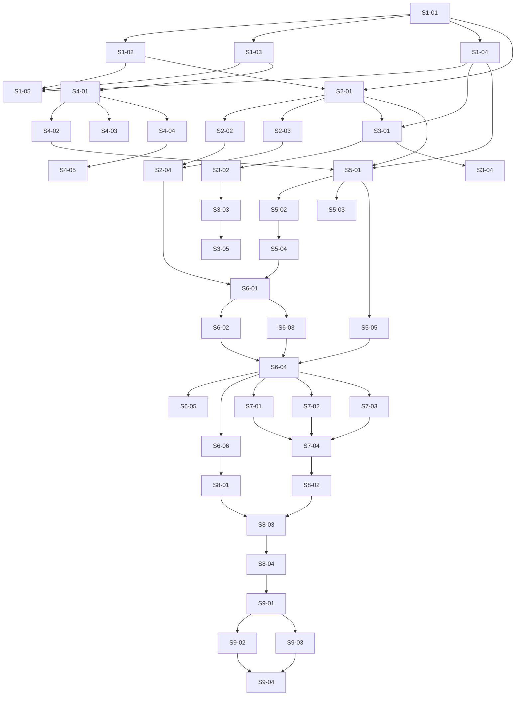

# Phase 03 — Vuln remediation: deterministic recipe path: Stories manifest

**Status:** Backlog generated; ready for autonomous implementation
**Date:** 2026-05-17
**Phase architecture:** [../phase-arch-design.md](../phase-arch-design.md)
**Phase ADRs:** [../ADRs/](../ADRs/)
**Implementation plan:** [../High-level-impl.md](../High-level-impl.md)
**Source design:** [../final-design.md](../final-design.md)

## Executive summary

40 stories across the 9 implementation steps of Phase 3. Per-step distribution: S1=5, S2=4, S3=5, S4=5, S5=5, S6=6, S7=4, S8=4, S9=4. The dependency DAG is roughly linear across steps (Step N+1 depends on Step N's contracts landing) with intra-step fan-out: Step 1 fans out into newtypes / sum-type / fence work that Step 2's `PluginRegistry` consumes; Steps 3–5 can begin sub-stories in parallel once Step 2's kernel is in; Step 6 is the integration choke point that gates Steps 7–9. The longest dependency chain is 9 stories (S1-01 → S2-01 → S3-01 → S4-01 → S5-01 → S6-01 → S6-04 → S7-01 → S8-03). Cross-cutting work — LLM-SDK fences, newtype discipline, tagged-union exhaustiveness, capability lint — is woven into Step 1 stories and reasserted in Step 9's CI-gate stories. Gap-1 (`SubgraphNode` Protocol), Gap-2 (`LockfilePolicy` YAML), Gap-3 (per-plugin `RecipeRegistry`), Gap-4 (`BundleCacheGc`), and Gap-5 (`TrustScorer` constructor injection) are first-class stories — see S6-03, S5-04, S5-02, S3-05, and S6-02 respectively.

## How to use this backlog
1. Start at a story whose dependencies are satisfied.
2. Open the story file. Read Context, References, Goal, Acceptance criteria.
3. Begin with TDD plan — write the failing test first.
4. Implement just enough to make it pass.
5. Refactor.
6. Check every acceptance criterion. Update story Status from `Ready` to `Done`.
7. Move to the next ready story.

Order within a step is mostly fixed (later S-numbers depend on earlier). Order across steps follows High-level-impl, with cross-step parallelism wherever the dependency DAG allows.

## Definition of done (applies to every story)
- [ ] All acceptance criteria checked.
- [ ] TDD plan's red test exists, committed, green.
- [ ] Additional ADR-honoring tests written and green.
- [ ] `ruff format`, `ruff check`, `mypy --strict` all clean.
- [ ] No existing test disabled or weakened without explicit note in story's Notes section.
- [ ] Story file Status updated to `Done`.
- [ ] If story modifies a contract documented in an ADR, ADR's Consequences section is reviewed.
- [ ] No LLM SDK imports leak into Phase 3 source (fence-CI enforced).
- [ ] If story touches `src/codegenie/probes/` or `src/codegenie/plugins/`, the relevant snapshot/contract test passes.

## Dependency DAG (visual)

Direct deps only; transitive omitted.

## Stories — by step

### Step 1: Scaffold packages, domain primitives, sum types, and structural CI fences
**Step goal:** Every typed primitive Phase 3 ever uses exists in code with `extra="forbid"` enforcement, `mypy --strict` clean, and CI fences that block regression — before any orchestrator or plugin logic lands.
**Step exit criteria mapping:** Underpins exit criterion "No LLM in this loop" (fence tests) and is the load-bearing type vocabulary for every later step.

| ID | Title (slug → file) | Effort | Depends on | Summary |
|---|---|---|---|---|
| S1-01 | [Phase 3 newtype identifiers + smart constructors (`S1-01-phase3-newtype-identifiers`)](S1-01-phase3-newtype-identifiers.md) | M | — | Extend `codegenie.types.identifiers` with `PluginId`, `RecipeId`, `TransformId`, `WorkflowId`, `EventId`, `CveId`, `PackageId`, `BranchName`, `BlobDigest`, `RegistryUrl`, `SignalKind`, `PrimitiveName`, `TransformKind`, `AttemptNumber` as `NewType` + smart-constructor `Result[T, ParseError]`. |
| S1-02 | [PluginScope sum type + parser (`S1-02-plugin-scope-sum-type`)](S1-02-plugin-scope-sum-type.md) | S | S1-01 | `ScopeDim = Concrete \| Wildcard`, `PluginScope` dataclass, `PluginScope.parse(s)` returning `Result`, Hypothesis-tested `matches`/`specificity` algebra (ADR-0010). |
| S1-03 | [Tagged-union outcome types (`S1-03-tagged-union-outcomes`)](S1-03-tagged-union-outcomes.md) | M | S1-01 | `RecipeOutcome`, `RemediationOutcome`, `NodeTransition`, `AdapterConfidence`, `Applicability` — Pydantic discriminated unions via `Discriminator("kind")`; one exhaustiveness `match` per type with `assert_never`. |
| S1-04 | [Transform ABC + ApplyContext + provenance (`S1-04-transform-abc-apply-context`)](S1-04-transform-abc-apply-context.md) | S | S1-01 | `Transform` ABC, `TransformProvenance`, `ApplyContext` + `AttemptSummary` Pydantic models with `prior_attempts: list = []` (Phase 5 reads it already; ADR-0001). |
| S1-05 | [Phase 3 import-linter contracts + AST fences (`S1-05-phase3-fence-tests`)](S1-05-phase3-fence-tests.md) | M | S1-02, S1-03, S1-04 | `tools/lint/importlinter.cfg` LLM-SDK fences for `plugins/`+`transforms/`; `test_no_llm_in_transforms.py`, `test_no_any_in_plugin_surface.py`, `test_kernel_frozen.py`. |

### Step 2: Plugin Registry kernel, manifest schema, loader, resolver
**Step goal:** The closed-for-modification ADR-0031 kernel exists and resolves a `PluginScope` against zero, one, or many plugins; `extends`-chain walking, cycle detection, integrity check, and `UniversalFallbackResolution` are all wired and tested.
**Step exit criteria mapping:** Satisfies "Plugin loader works (first plugin ships)" + "Plugin contract bake-tested against ≥3 plugins" once Step 7 lands.

| ID | Title (slug → file) | Effort | Depends on | Summary |
|---|---|---|---|---|
| S2-01 | [PluginRegistry kernel + protocols (`S2-01-plugin-registry-kernel`)](S2-01-plugin-registry-kernel.md) | M | S1-01, S1-02 | `Plugin`/`Adapter`/`RecipeEngine` Protocols; instance-based `PluginRegistry` with module-level `default_registry`; `@register_plugin` decorator; per-test fixture isolation (ADR-0002). |
| S2-02 | [Plugin manifest Pydantic + YAML loader (`S2-02-plugin-manifest-pydantic`)](S2-02-plugin-manifest-pydantic.md) | S | S2-01 | `PluginManifest` (`extra="forbid"`) + `from_yaml(path) -> Result[PluginManifest, ManifestError]`; covers scope, precedence, `extends`, TCCM ref, signature stub. |
| S2-03 | [Plugin loader + PLUGINS.lock integrity check (`S2-03-plugin-loader-integrity`)](S2-03-plugin-loader-integrity.md) | M | S2-01 | Filesystem walk over `plugins/*/plugin.yaml`, `importlib.import_module`, per-plugin tree sha256 vs `plugins/PLUGINS.lock`; `PluginRejected(integrity_mismatch)` exit-4 (ADR-0011); empty `PLUGINS.lock` lands; CODEOWNERS entry. |
| S2-04 | [Plugin resolver + extends walker + universal fallback (`S2-04-plugin-resolver-extends`)](S2-04-plugin-resolver-extends.md) | M | S2-02, S2-03 | `(specificity desc, precedence desc, name asc)` resolver; `extends` chain depth-4 walk + visited-set cycle check; no-match → `UniversalFallbackResolution` (NOT exception); Hypothesis property test (ADR-0003). |

### Step 3: TCCM, BundleBuilder, VulnIndex, content-addressed cache
**Step goal:** A plugin can declare TCCM `must_read`/`should_read`/`may_read` queries; the builder dispatches them through Phase 2 language search adapters, returns a typed `Bundle`, and content-address-caches by an input fingerprint that includes `vuln_index.digest`.
**Step exit criteria mapping:** Satisfies "CVE data ingestion (NVD JSON 2.0, GHSA, OSV)" and underpins the determinism property test.

| ID | Title (slug → file) | Effort | Depends on | Summary |
|---|---|---|---|---|
| S3-01 | [TCCM + ContextQuery Pydantic models (`S3-01-tccm-context-query-models`)](S3-01-tccm-context-query-models.md) | S | S1-04, S2-01 | `TCCM`, `ContextQuery` Pydantic models with `extra="forbid"`, `provides`/`requires` capability-name fields, primitive-name validation (ADR-0029, ADR-0004). |
| S3-02 | [VulnIndex sqlite schema + Alembic migrations (`S3-02-vuln-index-sqlite`)](S3-02-vuln-index-sqlite.md) | M | S3-01 | sqlite store with `lookup`, `affecting_range`, `digest`; migrations; `StaleVulnIndex` event when mtime > 7 days (`CODEGENIE_VULN_INDEX_MAX_AGE_DAYS`). |
| S3-03 | [NVD 2.0 / GHSA / OSV ingest + size caps + CLI (`S3-03-vuln-index-ingest-cli`)](S3-03-vuln-index-ingest-cli.md) | M | S3-02 | Smart-constructor parsers with 1 MiB / depth-16 caps; `codegenie vuln-index refresh` CLI subcommand. |
| S3-04 | [BundleBuilder with deterministic serial fallback (`S3-04-bundle-builder-serial-fallback`)](S3-04-bundle-builder-serial-fallback.md) | M | S3-01 | `BundleBuilder.build(...)` with `asyncio.Semaphore(min(4, os.cpu_count()))`, `CODEGENIE_BUNDLE_CONCURRENCY` env override; deterministic serial fallback on `AdapterConfidence.Degraded` (NOT hedged race; ADR-0008). |
| S3-05 | [Bundle cache key + BundleCacheGc (Gap 4) (`S3-05-bundle-cache-gc`)](S3-05-bundle-cache-gc.md) | S | S3-03 | BLAKE3 cache key including `vuln_index.digest`; `BundleCacheGc` invoked once-a-day at orchestrator init (`.codegenie/cache/.gc-stamp`); `codegenie cache prune` CLI; `CacheGcCompleted` spanning event (Gap 4 fix). |

### Step 4: SubprocessJail Port + Bwrap + sandbox-exec + ALLOWED_BINARIES amendment
**Step goal:** Every Phase 3 subprocess runs inside a network-namespaced, seccomp-filtered, tmpfs-rooted jail with typed env, typed network policy, and a typed tagged-union return.
**Step exit criteria mapping:** Underpins the headline exit criterion (npm install/test inside jail) and the "No LLM" hygiene (ALLOWED_BINARIES amendment is structural).

| ID | Title (slug → file) | Effort | Depends on | Summary |
|---|---|---|---|---|
| S4-01 | [SubprocessJail Port + JailedSubprocessResult union (`S4-01-subprocess-jail-port`)](S4-01-subprocess-jail-port.md) | M | S1-03 | `SubprocessJail` Protocol, `JailedSubprocessSpec` Pydantic, `JailedSubprocessResult = Completed \| TimedOut \| OomKilled \| NetworkDenied \| DiskQuotaExceeded` discriminated union; `NpmEnv`/`GitEnv` typed env wrappers; `NetworkPolicy = DenyAll \| RegistryAllowlist(hosts)` sum (ADR-0006). |
| S4-02 | [BwrapAdapter (Linux) with seccomp + netns (`S4-02-bwrap-adapter-linux`)](S4-02-bwrap-adapter-linux.md) | L | S4-01 | `BwrapAdapter` — `bwrap --unshare-all --new-session --die-with-parent --ro-bind / / --tmpfs /tmp --bind <jail> <jail>`; seccomp blocks `mount`/`pivot_root`/`ptrace`/`bpf`/`unshare`/`keyctl`; integration test fails (not skips) when `bwrap` missing on Linux. |
| S4-03 | [SandboxExecAdapter (macOS) + .sb profile (`S4-03-sandbox-exec-adapter-macos`)](S4-03-sandbox-exec-adapter-macos.md) | M | S4-01 | `SandboxExecAdapter` generating `tooling/sandbox/macos-npm.sb` per spec with `deny default` + explicit jail/registry allows; nightly-only integration test. |
| S4-04 | [SandboxedPath with O_NOFOLLOW + TOCTOU defense (`S4-04-sandboxed-path-onofollow`)](S4-04-sandboxed-path-onofollow.md) | S | S4-01 | `SandboxedPath.create(jail, relative) -> Result[SandboxedPath, PathEscape]`; `.open(mode)` always `O_NOFOLLOW`; symlink-swap raises `OSError(ELOOP)` (ADR-0011). |
| S4-05 | [ALLOWED_BINARIES amend + Capability tokens + lint fence (`S4-05-allowed-binaries-capabilities`)](S4-05-allowed-binaries-capabilities.md) | M | S4-04 | Amend `ALLOWED_BINARIES` with `npm`, `bwrap`, `sandbox-exec`, `jq` (ADR-0012); `NpmInstallCapability`/`FsReadWriteCapability`/`GitLocalOpsCapability` (no `push` field — type-impossible) + single `mint(...)` entry point; custom ruff rule `no_capability_construction.py` + `tests/static/test_capability_fence.py`; `--ignore-scripts` enforced at CLI + env. |

### Step 5: Transform ABC consumers, RecipeEngine Protocol, RecipeRegistry, lockfile policy
**Step goal:** A plugin can declare recipes via `@register_recipe`; the orchestrator can iterate them in `(precedence desc, name asc)` order; the day-1 `NpmLockfileRecipeEngine` (production) and `OpenRewriteRecipeEngine` (scaffold) both conform to `RecipeEngine`; `LockfilePolicy` evaluates lockfiles against `tools/policy/lockfile-policy.yaml`.
**Step exit criteria mapping:** Satisfies "OpenRewrite recipe scaffold" and "Before/after lockfile + package.json diff assertions."

| ID | Title (slug → file) | Effort | Depends on | Summary |
|---|---|---|---|---|
| S5-01 | [RecipeEngine Protocol + RecipeRegistry (Gap 3) (`S5-01-recipe-registry`)](S5-01-recipe-registry.md) | M | S1-04, S2-01, S4-02 | `RecipeEngine` Protocol; per-plugin `RecipeRegistry` + `@register_recipe(plugin_id)` decorator mirroring `PluginRegistry` shape; first-`Applies(plan)`-wins iteration; all-`NotApplies` short-circuits with `RecipeOutcome.NotApplicable(reason=ALL_RECIPES_NOT_APPLICABLE)` (Gap 3 fix). |
| S5-02 | [NpmLockfileRecipeEngine (production) (`S5-02-npm-lockfile-recipe-engine`)](S5-02-npm-lockfile-recipe-engine.md) | L | S5-01 | Pure-Python `package.json` parse (orjson, 1 MiB cap), in-mem edit (preserve key order), `O_NOFOLLOW` write-back, `SubprocessJail.run(npm install --package-lock-only --ignore-scripts --no-audit --prefer-offline)`, parse new lockfile (32 MiB / depth 24); returns `RecipeOutcome.Applied(NpmLockfileTransform(...))`. |
| S5-03 | [OpenRewriteRecipeEngine scaffold (`S5-03-openrewrite-engine-scaffold`)](S5-03-openrewrite-engine-scaffold.md) | M | S5-01 | Protocol-conformant JVM subprocess wrapped in `SubprocessJail`; one Phase-7-tagged Dockerfile-base-image-swap fixture; `@pytest.mark.phase_7_preview` test (ADR-0009). |
| S5-04 | [LockfilePolicy YAML + Pydantic loader (Gap 2) (`S5-04-lockfile-policy-yaml`)](S5-04-lockfile-policy-yaml.md) | M | S5-02 | `tools/policy/lockfile-policy.yaml` (codegenie-owned); `LockfilePolicy.from_yaml(path) -> Result`; `evaluate(lockfile_doc) -> list[PolicyViolation]`; `PolicyViolation = UnauthorizedRegistry(registry, package)` Phase-3 variant; `UnauthorizedRegistry` correctly detected on attacker-`.npmrc` fixture (Gap 2 fix). |
| S5-05 | [RemediationReport Pydantic + writer (`S5-05-remediation-report-writer`)](S5-05-remediation-report-writer.md) | S | S5-01 | `RemediationReport` Pydantic + writer for `remediation-report.yaml`; round-trip a hand-built instance. |

### Step 6: RemediationOrchestrator, TrustScorer, two-stream EventLog, SubgraphNode Protocol, end-to-end happy path
**Step goal:** `codegenie remediate <repo> --cve <id>` runs the full 11-step happy path end-to-end against `express-cve-2024-21501/`, writing a local branch and a `remediation-report.yaml`. The Phase-5-named seam `_validate_stage6` exists with its exact signature; the two-stream event log writes both files.
**Step exit criteria mapping:** Satisfies the headline exit criterion (Node repo + CVE → working patch diff that installs cleanly + tests pass).

| ID | Title (slug → file) | Effort | Depends on | Summary |
|---|---|---|---|---|
| S6-01 | [Two-stream EventLog + BLAKE3-chained spanning stream (`S6-01-two-stream-event-log`)](S6-01-two-stream-event-log.md) | L | S2-04, S5-04 | `EventLog` (`emit_internal`, `emit_spanning`, `replay`, `flush`); per-workflow `jsonl.zst` for internal; BLAKE3-chained shared `append.jsonl.zst` for spanning with `fcntl.flock` cross-process safety; `WorkflowInternalEvent`/`WorkflowSpanningEvent` discriminated unions populated with §C9 variants (ADR-0005). |
| S6-02 | [TrustScorer with constructor-injected EventLog (Gap 5) (`S6-02-trust-scorer-injected-log`)](S6-02-trust-scorer-injected-log.md) | M | S6-01 | `TrustScorer(event_log)` (constructor injection — Gap 5 fix); `score(signals) -> TrustOutcome` strict-AND; `confidence` folded from `AdapterDegraded` events in the same `workflow_id`; `@register_signal_kind` open registry with Phase 3 registering `build`/`install`/`tests`/`lockfile_policy`/`cve_delta`. |
| S6-03 | [SubgraphNode Protocol + NodeTransition (Gap 1) (`S6-03-subgraph-node-protocol`)](S6-03-subgraph-node-protocol.md) | S | S6-01 | `SubgraphNode` Protocol with `async def run(state) -> NodeTransition` returning `Advance(state) \| ShortCircuit(outcome) \| Escalate(reason)`; orchestrator outer loop is one `match` (Gap 1 fix). |
| S6-04 | [RemediationOrchestrator + 5-node subgraph + Stage-6 seam (`S6-04-remediation-orchestrator`)](S6-04-remediation-orchestrator.md) | L | S6-02, S6-03, S5-05 | `RemediationOrchestrator.__init__(registry, vuln_index, event_log, *, sandbox=None)`; `async def run(repo, cve, context=ApplyContext()) -> RemediationOutcome`; `async def _validate_stage6(transform, ctx) -> StageOutcome` (Phase 5 wrap-target); 5-node subgraph `ingest_cve → match_recipe → apply_recipe → stage6_validate → write_branch`; `LocalGitOps.create_patch_branch(...)` with `core.hooksPath=/dev/null`, `GIT_TERMINAL_PROMPT=0`, `GIT_ASKPASS=/bin/false`; emits `GitHooksDisabledForRun`. |
| S6-05 | [codegenie remediate CLI + concurrent-invocation lock (`S6-05-remediate-cli-flock`)](S6-05-remediate-cli-flock.md) | M | S6-04 | `codegenie remediate <repo> --cve <id>` click subcommand; `.codegenie/.lock` `fcntl.flock` exclusive lock; second invocation exits 8 with `WorkflowConcurrent`; `codegenie audit verify` extended to verify BLAKE3 chain on spanning stream and refuses on break. |
| S6-06 | [Phase 5 contract snapshot test (`S6-06-phase5-contract-snapshot`)](S6-06-phase5-contract-snapshot.md) | M | S6-04 | `tests/integration/test_phase5_contract_snapshot.py` — `RemediationOrchestrator`, `TrustScorer`, `Transform`, `ApplyContext`, `RecipeEngine`, `remediation-report.yaml` schemas snapshot match frozen golden file. Allows additive deltas; breaking deltas require ADR amendment + golden refresh. Failure means Phase 5 cannot ship (ADR-0001, ADR-0007). |

### Step 7: First production plugin, universal HITL fallback plugin, synthetic third plugin
**Step goal:** Three plugins are registered and resolvable by the kernel; the plugin contract is bake-tested against all three before Phase 7 ships its first new task class.
**Step exit criteria mapping:** Satisfies "Plugin contract bake-tested against ≥3 plugins" + "Universal HITL fallback plugin ships" + "Plugin bundles its own subgraph, TCCM, npm/Node-specific probes, Skills, OpenRewrite recipes" + "Four ADR-0032 language search adapters."

| ID | Title (slug → file) | Effort | Depends on | Summary |
|---|---|---|---|---|
| S7-01 | [plugins/vulnerability-remediation--node--npm/ scaffold + manifest + TCCM (`S7-01-vuln-node-npm-plugin-scaffold`)](S7-01-vuln-node-npm-plugin-scaffold.md) | M | S6-04 | `plugins/vulnerability-remediation--node--npm/{plugin.yaml,api.py,tccm.yaml}`; `@register_plugin(...)` call; TCCM `must_read`/`should_read`/`may_read` queries; `PLUGINS.lock` populated. |
| S7-02 | [Four npm recipes + four ADR-0032 npm adapters (`S7-02-npm-recipes-and-adapters`)](S7-02-npm-recipes-and-adapters.md) | L | S6-04 | `NpmLockfileSemverBumpRecipe`, `NpmPeerDepConflictRecipe`, `NpmTransitiveOverridesRecipe`, `NpmMajorBumpRefuseRecipe` registered via plugin-local `RecipeRegistry`; npm-specific implementations of `dep_graph.consumers`, `import_graph.reverse_lookup`, `scip.refs`, `test_inventory.tests_exercising`. |
| S7-03 | [plugins/universal--*--*/ HITL fallback plugin (`S7-03-universal-hitl-fallback-plugin`)](S7-03-universal-hitl-fallback-plugin.md) | M | S6-04 | `plugin.yaml` with scope `(*,*,*)` + lowest precedence; subgraph writes sanitized markdown to `.codegenie/handoff/<workflow_id>.md` (NFKC + ANSI/bidi/zero-width strip); emits `RequiresHumanReview`; returns `RemediationOutcome.RequiresHumanReview(reason=NoConcreteMatch)`; negative test confirms universal NOT silently substituted when concrete plugin import fails (loader exits 4 first; ADR-0003). |
| S7-04 | [Synthetic example--noop--* plugin + 3-plugin contract bake test (`S7-04-example-noop-plugin-bake-test`)](S7-04-example-noop-plugin-bake-test.md) | M | S7-01, S7-02, S7-03 | `tests/fixtures/plugins/example--noop--*/` exercising every Protocol surface (Plugin, Adapter, RecipeEngine, RecipeProtocol); `tests/integration/test_three_plugin_contract.py` loads all three; `PLUGINS.lock` mismatch test exits 4 with `PluginRejected(integrity_mismatch)`. |

### Step 8: Fixture portfolio, golden files, determinism property, adversarial tests
**Step goal:** The full Phase 3 fixture portfolio is on disk; the determinism property test passes over 100 Hypothesis runs; every adversarial case from §Edge cases E1–E20 has a regression test.
**Step exit criteria mapping:** Satisfies "Library of fixture repos with known vulnerable lockfiles" + the determinism cardinal goal G4.

| ID | Title (slug → file) | Effort | Depends on | Summary |
|---|---|---|---|---|
| S8-01 | [Fixture portfolio (≥10 repos incl. ≥5 CVE fixtures) (`S8-01-fixture-portfolio`)](S8-01-fixture-portfolio.md) | L | S6-06 | `tests/fixtures/repos/` — `express-cve-2024-21501/` (extend), `monorepo-workspaces/`, `transitive-only-cve/`, `peer-dep-conflict/`, `major-bump-required/`, `breaking-test-suite/`, `stale-scip/`, `malformed-package-json/`, `malicious-npmrc/`, `postinstall-canary/`; each fixture pins exact `package-lock.json`. |
| S8-02 | [End-to-end Express CVE test + golden files (`S8-02-end-to-end-express-cve-test`)](S8-02-end-to-end-express-cve-test.md) | M | S7-04 | `tests/integration/test_end_to_end_express_cve.py` — exits 0, writes branch `codegenie/cve-2024-21501-*`, writes `remediation-report.yaml` with `outcome.kind=="validated"` and `trust_outcome.passed==true`; golden `tests/golden/lockfiles/express-cve-2024-21501.{before,after}.json` byte-equal; golden `remediation-report.yaml` modulo `workflow_id`+timestamps; golden event streams. |
| S8-03 | [Determinism property test (Hypothesis, 100 runs) (`S8-03-determinism-property-test`)](S8-03-determinism-property-test.md) | M | S8-01, S8-02 | `tests/property/test_transform_determinism.py` — Hypothesis property over `(repo_snapshot_sha, cve_record_digest, plugin_version, recipe_version, vuln_index_digest)`; byte-identical `transform.diff_bytes` across 100 runs (cardinal Goal G4); offline-only via pre-warmed cache. |
| S8-04 | [Adversarial regression tests E1–E20 (`S8-04-adversarial-regressions`)](S8-04-adversarial-regressions.md) | L | S8-03 | `tests/adversarial/` (marked `@pytest.mark.phase03_adv`): size/depth caps; postinstall canary; egress denial; symlink TOCTOU; extends-chain composition; Yarn Berry routed to universal; breaking-test-suite returns `Validated(passed=False)` with no retry; `cve_delta` introduced fails `TrustOutcome` and refuses branch. |

### Step 9: CI gates, import-linter contracts, performance baselines, bench backfill hook
**Step goal:** CI hard-blocks every Phase 3 invariant; performance budgets have a 7-day rolling baseline; `BenchReplayable` events flow on the spanning stream so Phase 6.5 can lift cases mechanically.
**Step exit criteria mapping:** Reasserts "No LLM in this loop" (`$0.00` LLM-spend assertion) and operationalizes the determinism + Phase-5 contract gates.

| ID | Title (slug → file) | Effort | Depends on | Summary |
|---|---|---|---|---|
| S9-01 | [make check + import-linter Phase 3 contracts wired into CI (`S9-01-ci-gate-wiring`)](S9-01-ci-gate-wiring.md) | M | S8-04 | `make check` extended with Phase 3 fence tests; CI matrix Python 3.11/3.12 × `ubuntu-24.04`; `make lint-imports` Phase 3 contracts (no LLM SDK under `src/codegenie/{plugins,transforms}/`; no cross-plugin imports; no direct import of `codegenie.plugins.subgraph` from plugin folders); `bwrap` install step on Linux CI. |
| S9-02 | [Event-taxonomy completeness fence + `$0.00` LLM-spend assertion (`S9-02-event-taxonomy-llm-spend-fences`)](S9-02-event-taxonomy-llm-spend-fences.md) | S | S9-01 | `tests/fence/test_event_taxonomy_complete.py` — every `event_type` literal has both declared variant and emit site (no dead enum, no undeclared emit); `tests/fence/test_no_llm_spend.py` greps every `remediation-report.yaml` and fails on any nonzero `llm_cost_usd` (field must not exist in Phase 3). |
| S9-03 | [Bench harness + 7-day rolling baseline (`S9-03-bench-harness-baseline`)](S9-03-bench-harness-baseline.md) | M | S9-01 | `bench_plugin_registry_build` <500 ms; `bench_bundle_builder_warm` <5 ms; `bench_bundle_builder_cold` <300 ms; `bench_vuln_index_lookup` <10 ms p99; `bench_recipe_match` <60 ms p95; `bench_event_appender_throughput` >30k events/s; `bench_workflow_e2e_warm` <20 s p50 / <35 s p95; relative-budget assertion fails on >25% regression vs 7-day rolling mean. |
| S9-04 | [BenchReplayable events + Phase 6.5 backfill hook (`S9-04-bench-replayable-backfill-hook`)](S9-04-bench-replayable-backfill-hook.md) | S | S9-02, S9-03 | `BenchReplayable` spanning event emitted at end of every workflow with input-snapshot fingerprint + `Transform.diff_bytes_sha256`; `tests/integration/test_phase65_backfill_hook.py` consumes ≥10 events from the spanning stream and produces eval cases mechanically; 1-page `docs/operations/phase03-runbook.md`. |

## Cross-cutting concerns
- **Deterministic-only constraint:** every story honors the no-LLM-SDK-in-Phase-3 fence (ADR-0005 production + Phase 3 import-linter contracts). Stories introducing new modules under `src/codegenie/{plugins,transforms}/` rely on S1-05's fence to keep the closure clean; S9-01/S9-02 reassert it at CI.
- **Newtype identifiers:** never raw `str` for `PluginId`/`RecipeId`/`WorkflowId`/`CveId`/`RegistryUrl`/etc. (ADR-0010). S1-01 lands the catalog; every later story imports from `codegenie.types.identifiers`.
- **Tagged-union outcomes:** state machines return discriminated unions, not `(passed: bool, error: str | None)` (ADR-0010). Exhaustiveness enforced via `match` + `assert_never` (S1-03 + S1-05 AST fence).
- **Extension-by-addition:** new plugin source lives under `plugins/{task}--{language}--{build}/`; no edits to Phase 0–2 source. S1-05 `test_kernel_frozen.py` enforces; Phase 7 fires the diff-confinement test again.

## Exit-criteria coverage
| Exit criterion | Story / stories |
|---|---|
| Given a Node.js repo with a known npm CVE, the system writes a working patch diff on a local branch that — when applied — installs cleanly and passes the repo's own tests | S6-04, S6-05, S8-02 |
| Plugin loader works (first plugin ships) — `plugins/vulnerability-remediation--node--npm/` | S2-03, S7-01 |
| Universal HITL fallback plugin ships — `plugins/universal--*--*/` | S7-03, S8-04 (Yarn Berry routed-to-universal test) |
| Plugin contract bake-tested against ≥3 plugins (extension-by-addition test for Phase 7) | S7-04 |
| No LLM in this loop (deterministic recipe path) | S1-05, S9-01, S9-02 |
| OpenRewrite recipe scaffold (per roadmap "Tooling & setup: OpenRewrite recipes for npm dependency updates") | S5-03 |
| CVE data ingestion (NVD JSON 2.0, GHSA, OSV) | S3-02, S3-03 |
| Library of fixture repos with known vulnerable lockfiles; edge-case fixtures (peer-dep conflicts, transitive-only, semver corners) | S8-01 |
| Before/after lockfile + `package.json` diff assertions; test suite still passes; no semantic regression | S5-02, S8-02, S8-04 (breaking-test-suite) |
| Four ADR-0032 language search adapters wrapping Phase 2 structural probes | S7-02 |
| Plugin bundles its own subgraph, TCCM, npm/Node-specific probes, Skills, OpenRewrite recipes | S7-01, S7-02 |

Every Phase 3 exit criterion from `docs/roadmap.md` Phase 3 section maps to ≥1 story.

## Open implementation questions
From phase-arch-design.md §Open questions deferred to implementation:
- **CI runner concurrency tuning** (`CODEGENIE_BUNDLE_CONCURRENCY` default `min(4, os.cpu_count())`) — S9-03 records the rolling-7-day baseline at first CI green.
- **`OpenRewriteRecipeEngine` Phase-7 fixture content** (alpine → cgr.dev/chainguard/node:latest is the natural shape) — S5-03 picks and ships the one fixture.
- **macOS `sandbox-exec` profile content** (deny default + allow jail + allow registry hosts) — S4-03 writes `tooling/sandbox/macos-npm.sb`.
- **Sanitization of HITL `.codegenie/handoff/*.md`** (NFKC + ANSI/bidi/zero-width strip baseline; markdown HTML-embed neutralization TBD on real content) — S7-03 ships the baseline.
- **CODEOWNERS entry for `plugins/PLUGINS.lock`** (PR-template call-out) — S2-03 defines the actual entry.
- **`example--noop--*` exact contract-surface coverage** — S7-04 may discover gaps and extend.
- **Per-reason event variants for `NotApplicable`** (vs. single `RecipeFailed(reason=...)`) — S5-01 / S6-01 decide based on Phase 4 fallback needs.
- **`CostSandboxRun` event payload exact fields** (align with Phase 13 cost ledger schema) — S6-01 picks pragmatic shape; Phase 13 may extend.
- **`SubprocessJail.run` async vs. sync** (`asyncio.to_thread` vs. `asyncio.create_subprocess_exec` natively under bwrap/sandbox-exec) — S4-02/S4-03 pick at implementation.
- **`vuln-index.sqlite` staleness threshold** (7 days mtime → warn, not block; `CODEGENIE_VULN_INDEX_MAX_AGE_DAYS`) — S3-02 ships the default.

## Backlog stats
- Total stories: 40
- Per step: S1=5, S2=4, S3=5, S4=5, S5=5, S6=6, S7=4, S8=4, S9=4
- Effort: 12·S + 19·M + 9·L
- Longest dep chain: 9 stories (S1-01 → S2-01 → S3-01 → S4-01 → S5-01 → S6-01 → S6-04 → S7-01 → S8-03)
