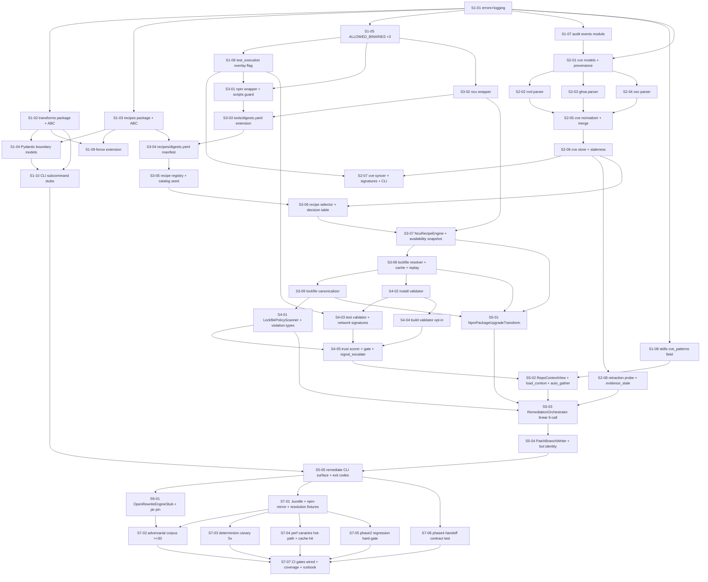

# Phase 3 — Vuln remediation: deterministic recipe path: Stories manifest

**Status:** Backlog generated; ready for autonomous implementation
**Date:** 2026-05-12
**Phase architecture:** [../phase-arch-design.md](../phase-arch-design.md)
**Phase ADRs:** [../ADRs/](../ADRs/)
**Implementation plan:** [../High-level-impl.md](../High-level-impl.md)
**Source design:** [../final-design.md](../final-design.md)

## Executive summary

Phase 3 decomposes into **38 stories** across the 7 steps from [High-level-impl.md](../High-level-impl.md). The distribution is **10 / 7 / 8 / 5 / 5 / 1 / 2 → wait, see below**. Step 1 lands both load-bearing contracts (`Transform` ABC + `RecipeEngine` ABC), their Pydantic boundary models + registries, the four ADR-gated additive edits to Phase 0/1/2 (`ALLOWED_BINARIES +3`; Skills frontmatter `applies_to.cve_patterns`; `audit_writer.py` event-type enum extension; the single Phase-2 chokepoint amendment for `test_execution=True` overlay), and the Phase-0 `fence` extension. Step 2 ships the only network-touching codepath outside `npm install` — the CVE feed surface with content-addressed snapshots, best-effort signature verification, the graded staleness advisory, and the `CveRetractionProbe`. Step 3 builds the default `NcuRecipeEngine` vertical: `tools/npm` + `tools/ncu` wrappers (with wrapper-level `NpmScriptsEnabled` guard), `recipes/digests.yaml` pin manifest, the recipe registry + selector + decision table, the `LockfileResolver` with the four-component cache key + `cache.replay` audit event, and the `LockfileCanonicalizer`. Step 4 lands the `LockfilePolicyScanner` with the graded `--allow-policy-violations` escape valve and the single-profile `ValidationGate` (install + test + build validators with the network-required signature scan + `gate.signal_escalate` operator surface + strict-AND `TrustScorer`). Step 5 integrates everything in the `NpmPackageUpgradeTransform` + linear six-call `RemediationOrchestrator` + `PatchBranchWriter` + the `codegenie remediate` CLI surface with the documented exit-code mapping. Step 6 wires the opt-in `OpenRewriteEngineStub` second seat (JVM-gated, pinned-jar smoke recipe — the contract anchor for Phase 15). Step 7 lands the ≥ 30 adversarial fixtures, the `.bundle` + `npm-resolution.json` + pinned local registry mirror portfolio, the determinism canary (5× byte-identical), the perf canaries, the Phase-2 regression hard-gate, the Phase-4 handoff verification, and the four new CI gates.

## How to use this backlog

1. Start at a story whose dependencies are satisfied (initially, S1-01).
2. Open the story file. Read **Context**, **References**, **Goal**, **Acceptance criteria**.
3. Begin with the **TDD plan — red / green / refactor**. Write the failing test first.
4. Implement just enough to green.
5. Refactor.
6. Check every acceptance criterion. Update Status to `Done`.
7. Move to the next satisfied story.

Order *within* a step is mostly fixed by S-numbering; cross-step parallelism is whatever the DAG allows.

## Definition of done (applies to every story)

- [ ] All acceptance criteria checked.
- [ ] TDD red test exists, committed, green.
- [ ] Additional ADR-honoring tests written and green (e.g. ADR-0001 `Transform` snapshot test; ADR-0003 OpenRewrite-stub-when-unavailable test; ADR-0004 `RecipeSelection`-reason-closed-enum test; ADR-0005 `test_execution=True` overlay test + `gate.signal_escalate` honest-failure test; ADR-0007 `--allow-policy-violations` escape-valve test; ADR-0008 CVE snapshot hash-mismatch + signature best-effort test; ADR-0009 `CveRetractionProbe` evidence-stale-marker test; ADR-0010 cache.replay audit-event test; ADR-0011 lockfile-canonicalization idempotence test; ADR-0013 `TrustScorer` strict-AND property test).
- [ ] Code formatted (`ruff format`), lint clean (`ruff check`), `mypy --strict` on `src/` passes.
- [ ] No existing test disabled or weakened without an explicit note in "Notes for the implementer".
- [ ] Story Status updated to `Done`.
- [ ] If story modifies an ADR-documented contract, that ADR's "Consequences" section reviewed for follow-ups.
- [ ] If story adds a transform, validator, or engine, per-module local coverage is reported in the PR body — 95/90 floors for `transforms/contract.py`, `recipes/contract.py`, `transforms/coordinator.py`; 90/80 for all other new modules.
- [ ] If story adds a sub-schema (CVE entry, recipe, lockfile-scan-result, validator-output, remediation-report), the sub-schema declares `schema_version: "v1"`, sets `additionalProperties: false` at every nesting level, and ships an "extra-field rejection" unit test.

## Dependency DAG (visual)

## Stories — by step

### Step 1: Plant the two ABCs, the four Phase 0/1/2 additive edits, and the foundations every Phase 3 component consumes

**Step goal:** Both load-bearing contracts (`Transform` ABC + `RecipeEngine` ABC), their registries, the boundary Pydantic models, and the four ADR-gated additive edits to Phase 0/1/2 are on disk and unit-tested in isolation. No engine, no transform, no orchestrator yet — only the contracts and the seams.
**Step exit criteria mapping:** `Transform` ABC frozen at v0.3.0 (ADR-0001); `RecipeEngine` ABC + structured `RecipeSelection` triple (ADR-0003, ADR-0004); two new top-level packages (ADR-0002); `ALLOWED_BINARIES +3` (ADR-0014); `test_execution=True` overlay flag (ADR-0005); audit chain extension via new event types (ADR-0010); Skills schema additive `applies_to.cve_patterns` (deferred-but-mechanical per ADRs README); `fence` CI extended to `transforms/` + `recipes/`.

| ID | Title (slug → file) | Effort | Depends on | Summary |
|---|---|---|---|---|
| S1-01 | [Errors + structlog event constants for Phase 3 (`S1-01-errors-logging-extension`)](S1-01-errors-logging-extension.md) | S | — | Extend `src/codegenie/errors.py` with `NpmScriptsEnabled`, `RecipeNotInDigestManifest`, `CveSnapshotCorrupt`, `CveSignatureMismatch`, `AdvisoryNotInStore`, `WorkingTreeNotClean`, `BranchExists`, `LockfileResolveFailed`, `LockfileMalformed`, `TransformError`, `EngineUnavailable`; register the Phase-3 structlog event-name constants in `src/codegenie/logging.py` plus structured fields `cve_id`, `recipe_id`, `engine_name`, `run_id`. |
| S1-02 | [`src/codegenie/transforms/` package skeleton + `Transform` ABC + registry (`S1-02-transforms-package-abc-registry`)](S1-02-transforms-package-abc-registry.md) | M | S1-01 | Land `src/codegenie/transforms/{__init__.py,contract.py,registry.py}` per ADR-0001 + ADR-0002; `Transform` ABC mirrors Phase-1 `Probe` byte-for-byte with `name`, `declared_inputs`, `applies_to_tasks`, `applies_to_languages`, `requires_recipe_engines`, `applies()`/`run()`; `@register_transform` decorator parallels `@register_probe`; freeze the ABC signature with a Pydantic schema-dump snapshot in `tests/unit/transforms/test_contract.py` (mirrors Phase 0's `test_probe_contract.py`); duplicate-name registration rejected. |
| S1-03 | [`src/codegenie/recipes/` package skeleton + `RecipeEngine` ABC + registry (`S1-03-recipes-package-abc-registry`)](S1-03-recipes-package-abc-registry.md) | M | S1-01 | Land `src/codegenie/recipes/{__init__.py,contract.py,registry.py}` per ADR-0003; `RecipeEngine` ABC declares `name`, `applies_to_engines`, `available() -> bool`, `apply(recipe, repo, ctx) -> RecipeApplication`; engine registry + `@register_engine` decorator; snapshot test `tests/unit/recipes/test_contract.py` freezes the ABC signature; registration-time duplicate-name rejection; `available()` gating tested. |
| S1-04 | [Pydantic boundary models — `TransformInput`/`TransformOutput`/`RecipeSelection`/`ApplyContext`/`RecipeApplication`/`ValidatorOutput`/`GateOutcome`/`TrustScore`/`RemediationReport` (`S1-04-pydantic-boundary-models`)](S1-04-pydantic-boundary-models.md) | M | S1-02, S1-03 | Land the Pydantic boundary models per ADR-0004 + `phase-arch-design.md §"Data model"`; all frozen with `extra="forbid"`; `RecipeSelection.reason` is `Literal["matched","no_engine","range_break","peer_dep_conflict","unsupported_dialect","catalog_miss"]` (closed-enum public contract Phase 4 reads); `TransformOutput` has no `success` field (facts-not-judgments); `RemediationReport` schema sketched and tested with a synthetic happy-path payload round-trip. |
| S1-05 | [`ALLOWED_BINARIES` extension for `npm`, `ncu`, `java` (`S1-05-allowed-binaries-three`)](S1-05-allowed-binaries-three.md) | S | S1-01 | Extend `src/codegenie/exec.py` `ALLOWED_BINARIES` per ADR-0014 to include `npm`, `ncu`, `java` (opt-in); per-binary ADR subsections cite tool readiness expectations; `tests/unit/exec/test_allowed_binaries_phase3.py` asserts the three new binaries are allowlisted and the credential-strip discipline is unchanged. |
| S1-06 | [`run_in_sandbox` `test_execution=True` overlay flag (`S1-06-test-execution-overlay-flag`)](S1-06-test-execution-overlay-flag.md) | M | S1-05 | Extend `src/codegenie/exec.py` `run_in_sandbox` per ADR-0005 with `test_execution: bool = False` keyword arg; `True` enables a writable upper-layer overlay over `/work`, raises PID/wall budgets to 1024/600 s, suspends wrapper-level `--ignore-scripts` enforcement (the test command runs scripts by definition), keeps `--network=none` as the default; Linux bwrap + macOS sandbox-exec parity; `tests/unit/exec/test_test_execution_overlay.py` pins every behavior; this is the single Phase-2 chokepoint amendment in Phase 3. |
| S1-07 | [`src/codegenie/audit/events.py` Pydantic event payload schemas + enum extension (`S1-07-audit-events-phase3`)](S1-07-audit-events-phase3.md) | M | S1-01 | Land `src/codegenie/audit/events.py` with Pydantic payload schemas for the Phase-3 event-type set per ADR-0010 (`cve.feed.synced`, `cve.feed.signature_check`, `cve.retraction.detected`, `recipe.selected`, `recipe.engine.invoked`, `transform.applied`, `lockfile.scanned`, `lockfile.policy_violation`, `npm.install.run`, `tests.executed`, `gate.failed`, `gate.signal_escalate`, `evidence_stale.marked`, `branch.created`, `branch.refused_dirty_tree`, `branch.refused_exists`, `cache.replay`, `meta.unexpected_exception`); one-line additive edit to `src/codegenie/audit_writer.py` event-type enum; malformed event → dropped + `meta.event_validation_failure` appended (chain integrity preserved). |
| S1-08 | [Skills schema additive `applies_to.cve_patterns` field (`S1-08-skills-cve-patterns-field`)](S1-08-skills-cve-patterns-field.md) | S | S1-01 | Extend `src/codegenie/skills/models.py` per ADRs-README "Decisions noted but not yet documented" #1 with `applies_to.cve_patterns: list[str] = ["*"]` optional additive field on `ApplyConstraints`; Phase 2 Skills loader unchanged; forward-compat per Phase 2's `SCHEMA-EVOLUTION-POLICY.md` minor-bump rule; `tests/unit/skills/test_cve_patterns_field.py` asserts default, round-trip, and Phase-2-fixture-still-loads. |
| S1-09 | [Phase-0 `fence` CI extension to `transforms/` + `recipes/` (`S1-09-fence-extension-transforms-recipes`)](S1-09-fence-extension-transforms-recipes.md) | S | S1-02, S1-03 | Extend `scripts/fence_imports.py` (or equivalent) per ADR-0002 to forbid `anthropic`, `langgraph`, `chromadb`, `qdrant`, `qdrant-client`, `sentence-transformers`, `voyageai`, `openai` import-closures under `src/codegenie/transforms/` + `src/codegenie/recipes/`; `tests/adv/test_phase3_fence_no_llm_imports.py` synthesizes a forbidden import and asserts CI red; `tests/adv/test_phase3_no_subprocess_direct.py` AST-scans the two packages for direct `subprocess.run`/`Popen` outside `exec.py` and `tools/`. |
| S1-10 | [`codegenie remediate` / `cve` / `recipes` CLI subcommand stubs (`S1-10-cli-subcommand-stubs`)](S1-10-cli-subcommand-stubs.md) | S | S1-02, S1-04 | Extend `src/codegenie/cli.py` with three new click subcommand *groups* — `remediate`, `cve`, `recipes` — entry points only; each `--help` prints "not yet implemented" with exit code 2 until later steps wire bodies; click validates `--cve <id>` against `CVE-\d{4}-\d{4,}`; `tests/unit/cli/test_phase3_subcommand_stubs.py` asserts the three groups exist and exit 2 with the documented message. |

### Step 2: Ship the CVE feed surface and `CveRetractionProbe`

**Step goal:** `codegenie cve sync` is on disk — the only network-touching codepath in Phase 3 outside `npm install`'s scoped registry pulls. Snapshots are content-addressed, hash-verified on read, signature-checked best-effort. Staleness emits the graded advisory. `CveRetractionProbe` runs as the last step of every sync.
**Step exit criteria mapping:** CVE feed integrity — content-hash gate, best-effort signature, graded staleness 7d/30d/90d (ADR-0008); `CveRetractionProbe` lives under `transforms/cve/` and marks prior remediations `evidence_stale` (ADR-0009); only network-touching CLI surface in Phase 3 is `codegenie cve sync` (final-design §Goals #13); `--allow-stale-feeds` operator opt-in surfaces in CLI.

| ID | Title (slug → file) | Effort | Depends on | Summary |
|---|---|---|---|---|
| S2-01 | [`transforms/cve/` package + `Advisory`/`AffectedRange`/`Provenance`/`Reference`/`CveEntry` Pydantic (`S2-01-cve-models-provenance`)](S2-01-cve-models-provenance.md) | S | S1-01, S1-07 | Land `src/codegenie/transforms/cve/__init__.py` + `models.py` per `phase-arch-design.md §"Component design" #7`; `Severity`, `AffectedRange`, `Provenance`, `Reference`, `CveEntry` Pydantic with `extra="forbid"`; `Provenance.signature_verified: bool | None` where `None` means "unsupported", not "unknown"; `tests/unit/transforms/cve/test_models.py` pins the closed shape. |
| S2-02 | [`feeds/nvd.py` parser + ≥3 frozen goldens (`S2-02-cve-nvd-parser`)](S2-02-cve-nvd-parser.md) | M | S2-01 | Implement `src/codegenie/transforms/cve/feeds/nvd.py` exporting `parse(raw_bytes) -> list[CveEntry]`; pin NVD JSON 2.0 expected schema version; emit loud warning + `signature_verified=None` if upstream schema deviates; ship ≥ 3 frozen golden CVE entries under `tests/golden/cve/nvd/`; ≥ 6 unit tests covering parser-bomb fixtures, malformed JSON, missing fields, alias graphs, schema-version drift. |
| S2-03 | [`feeds/ghsa.py` parser + ≥3 frozen goldens (`S2-03-cve-ghsa-parser`)](S2-03-cve-ghsa-parser.md) | M | S2-01 | Implement `src/codegenie/transforms/cve/feeds/ghsa.py`; same shape as S2-02; raw bytes pass through Phase-2 `OutputSanitizer` Pass 5 (prompt-injection marker tagger); `references[].prompt_injection_marker_count` populated; ship ≥ 3 frozen goldens under `tests/golden/cve/ghsa/`; ≥ 6 unit tests. |
| S2-04 | [`feeds/osv.py` parser + ≥3 frozen goldens (`S2-04-cve-osv-parser`)](S2-04-cve-osv-parser.md) | M | S2-01 | Implement `src/codegenie/transforms/cve/feeds/osv.py`; same shape as S2-02; ship ≥ 3 frozen goldens under `tests/golden/cve/osv/`; ≥ 6 unit tests covering OSV schema evolution drift. |
| S2-05 | [`normalizer.py` — `CveEntryNormalizer.merge` commutative + idempotent (`S2-05-cve-normalizer-merge`)](S2-05-cve-normalizer-merge.md) | M | S2-02, S2-03, S2-04 | Implement `src/codegenie/transforms/cve/normalizer.py` — `CveEntryNormalizer.merge(records: list[CveEntry]) -> CveEntry` joins NVD/GHSA/OSV records on the same CVE ID and aliases; ≥ 8 unit tests for `merge` including dedup + severity tie-break + alias-graph union; Hypothesis property tests `test_merge_commutative.py` + `test_merge_idempotent.py`. |
| S2-06 | [`store.py` — content-addressed snapshots + staleness + mmap'd index (`S2-06-cve-store-staleness`)](S2-06-cve-store-staleness.md) | M | S2-05 | Implement `src/codegenie/transforms/cve/store.py` per ADR-0008; content-addressed storage at `.codegenie/cve/snapshots/<source>/<sha256>.json.gz`; hash-mismatch on read raises `CveSnapshotCorrupt` (hard fail); `mmap`'d index for sub-1-ms `get(cve_id)` in steady state; `staleness(source) -> Staleness({age_days, status})` returns "fresh"/"warn"/"low_confidence"/"refuse" at 0/7/30/90-day boundaries; `tests/adv/test_cve_snapshot_hash_mismatch_rejected.py`. |
| S2-07 | [`syncer.py` + signature verification (best-effort) + `codegenie cve sync` CLI (`S2-07-cve-syncer-signatures-cli`)](S2-07-cve-syncer-signatures-cli.md) | L | S2-06, S1-06 | Implement `src/codegenie/transforms/cve/syncer.py` per ADR-0008; best-effort signature verification — NVD `.meta` GPG against pinned `tools/cve-feeds/nvd-public.asc`; GHSA/OSV `git verify-commit` against pinned `tools/cve-feeds/github-web-flow-keys.asc`; result recorded as `Provenance.signature_verified`; **does not gate the sync** (synth-softening); emits `cve.feed.synced` + `cve.feed.signature_check` audit events; wire `codegenie cve sync --source {nvd,ghsa,osv,all} [--since DATE]`; `--allow-stale-feeds` flag surface; `tests/adv/test_cve_sync_egress_scoped.py` pins network scope; tool-readiness check (`curl`, `git`, GPG). |
| S2-08 | [`retraction_probe.py` — `CveRetractionProbe` + `evidence_stale.marked` (`S2-08-cve-retraction-probe-evidence-stale`)](S2-08-cve-retraction-probe-evidence-stale.md) | M | S2-06 | Implement `src/codegenie/transforms/cve/retraction_probe.py` per ADR-0009 + Gap 4; invoked as last step of `cve sync`; diffs `withdrawn` field between prior + new snapshots; for any record flipped false → true, scans `.codegenie/remediation/*/audit/*.jsonl` and appends `evidence_stale.marked` event to each prior remediation's chain (append-only; chain head advances); shaped like a probe but **must NOT** be registered via `@register_probe` — encode this invariant in a test that imports the module and asserts the registry is unchanged; conservative on partial retraction (mark stale + record disagreement); `tests/integration/test_cve_retraction_marks_evidence_stale.py` end-to-end pins the flow. |

### Step 3: Ship the `NcuRecipeEngine` vertical: `tools/npm` + `tools/ncu` wrappers, `LockfileResolver`, `LockfileCanonicalizer`, recipe catalog + selector

**Step goal:** The default-engine vertical is on disk. A `Recipe` loads from YAML with digest verification; the `RecipeSelector` returns `RecipeSelection(recipe, reason, diagnostics)` for any synthetic input without raising; the `NcuRecipeEngine.apply()` invokes `ncu` inside the sandbox; the `LockfileResolver` runs `npm install --package-lock-only` with bounded transient retry + four-component cache key + `cache.replay` audit event; the `LockfileCanonicalizer` is byte-stable and idempotent.
**Step exit criteria mapping:** `npm`/`ncu` digest pinning (ADR-0011 + ADR-0014); wrapper-level `--ignore-scripts` guard (final-design §Goals #9); `recipes/digests.yaml` for recipe immutability (ADR-0011, Gap 2); `NcuRecipeEngine` as default + engine-availability snapshot (ADR-0003, Gap 6); `LockfileResolver` cache-key drops npm patch + emits `cache.replay` (final-design §Goals #8, ADR-0010); `LockfileCanonicalizer` deterministic-diff invariant (ADR-0011, "Shared blind spot #4").

| ID | Title (slug → file) | Effort | Depends on | Summary |
|---|---|---|---|---|
| S3-01 | [`tools/npm.py` wrapper + wrapper-level `NpmScriptsEnabled` guard (`S3-01-tools-npm-wrapper`)](S3-01-tools-npm-wrapper.md) | M | S1-05, S1-06 | Implement `src/codegenie/tools/npm.py` per Phase-2 wrapper precedent; routes through `exec.run_in_sandbox`; **wrapper-level `--ignore-scripts` guard** raises `NpmScriptsEnabled` if any caller invokes `install`/`ci` without `--ignore-scripts` and `test_execution=False`; the guard lives in the wrapper, not the orchestrator, so future callers (e.g., Phase 7 Docker transform) inherit the invariant; `tests/adv/test_npm_wrapper_rejects_scripts_enabled.py` pins; ≥ 5 unit tests (happy, non-zero exit, timeout, malformed JSON, missing binary). |
| S3-02 | [`tools/ncu.py` wrapper for `npm-check-updates` (`S3-02-tools-ncu-wrapper`)](S3-02-tools-ncu-wrapper.md) | S | S1-05 | Implement `src/codegenie/tools/ncu.py` — typed wrapper for `npm-check-updates`; routes through `exec.run_in_sandbox(network="scoped", allowlist=["registry.npmjs.org"])`; `NcuResult` Pydantic; ≥ 4 unit tests minimum (happy, non-zero exit, missing binary, malformed output). |
| S3-03 | [`tools/digests.yaml` extension for `npm` + `ncu` (`S3-03-tools-digests-npm-ncu`)](S3-03-tools-digests-npm-ncu.md) | S | S3-01, S3-02 | Extend `src/codegenie/catalogs/tools/digests.yaml` per ADR-0014 with SHA-256 pins for `npm` (minor-version-precision) and `ncu`; extend `scripts/check_tool_digests.py` (or equivalent) to verify the new binaries at install time; CI `tool_digests_verify` job extension; `tests/adv/test_tools_digests_yaml_drift_breaks_install.py` for `npm` digest drift. |
| S3-04 | [`recipes/digests.yaml` manifest + registry digest verification (`S3-04-recipes-digests-yaml-manifest`)](S3-04-recipes-digests-yaml-manifest.md) | M | S3-03, S1-03 | Land `src/codegenie/recipes/digests.yaml` per ADR-0011 + Gap 2 — SHA-256 pin manifest for every recipe YAML file; `RecipeRegistry.load()` refuses any recipe whose on-disk hash mismatches → `RecipeNotInDigestManifest`; new CI job `recipes_digests_verify` enforces parity; `tests/adv/test_recipes_digests_yaml_drift_breaks_load.py` pins drift detection; `tests/unit/test_recipe_digest_in_cache_key.py` pins recipe-digest → cache-key dependency. |
| S3-05 | [`recipes/catalog/npm/<recipe-id>.yaml` first recipe seed + models (`S3-05-recipe-catalog-seed`)](S3-05-recipe-catalog-seed.md) | S | S3-04 | Land `src/codegenie/recipes/models.py` (`Recipe` Pydantic) and at minimum one shipped recipe at `src/codegenie/recipes/catalog/npm/npm-upgrade-patched-v1.yaml` defining `{id, engine: ncu, ecosystem: npm, kind: version_bump, applies_to: {...}, params: {...}, declared_inputs: [...], digest, priority}`; digest registered in `recipes/digests.yaml` from S3-04; unit test loads the recipe and round-trips. |
| S3-06 | [`recipes/selector.py` + `selector.yaml` decision table + `RecipeSelection` totality (`S3-06-recipe-selector-decision-table`)](S3-06-recipe-selector-decision-table.md) | L | S3-05, S2-06 | Implement `src/codegenie/recipes/selector.py` per ADR-0004 — `RecipeSelector.select(view, advisory, skills) -> RecipeSelection`; reads `selector.yaml` flat decision table; filters by (1) ecosystem, (2) `cve_patterns`, (3) semver range predicate (→ `range_break`), (4) `RecipeEngine.available()` (→ `no_engine`), (5) Phase-2 depgraph peer-dep check (→ `peer_dep_conflict`); ties on `priority` are errors; ≥ 14 unit tests — one per `reason` enum × matched/unmatched paths + ambiguity-on-priority-tie; Hypothesis `test_selector_is_total.py` asserts the selector never raises for routine no-match cases. |
| S3-07 | [`recipes/engines/ncu.py` — `NcuRecipeEngine` default + availability snapshot (`S3-07-ncu-recipe-engine`)](S3-07-ncu-recipe-engine.md) | M | S3-02, S3-06 | Implement `src/codegenie/recipes/engines/ncu.py` per ADR-0003 — `NcuRecipeEngine(RecipeEngine)`; `available()` does `which ncu` + version-digest check; `apply()` calls `tools.ncu.run(...)`; returns `RecipeApplication(diff, files_changed, engine_stdout, engine_stderr, exit_code)`; engine-availability snapshot captured **once at orchestrator entry** per Gap 6 (engine reads from the snapshot, not by re-calling `available()`); ≥ 4 unit tests + `tests/adv/test_engine_availability_snapshot.py`. |
| S3-08 | [`transforms/lockfile/resolver.py` + four-component cache key + transient retry + `cache.replay` (`S3-08-lockfile-resolver-cache-replay`)](S3-08-lockfile-resolver-cache-replay.md) | L | S3-07 | Implement `src/codegenie/transforms/lockfile/resolver.py` per `phase-arch-design.md §"Component design" #5` + ADR-0006 + ADR-0010 — runs `npm install --package-lock-only --ignore-scripts --no-audit --no-fund`; cache key `blake3((blake3(package.json) || blake3(package-lock.json) || npm_minor_digest || registry_mirror_digest))` (patch dropped per Goals #8 to avoid stampedes) at `.codegenie/cache/lockfile/<key>.zst`; bounded transient retry ≤ 3 on `transient_npm_codes` (network, ETIMEDOUT, EAI_AGAIN, 5xx) with exponential backoff (200/500/1200 ms); non-transient → fail fast; **cache hit emits `cache.replay` audit event referencing original chain head** per ADR-0010; ≥ 6 unit tests; this is the **only** retry inside Phase-3 code paths (per ADR-0006). |
| S3-09 | [`transforms/lockfile/canonicalizer.py` — LC_ALL=C + key sort + LF + idempotence (`S3-09-lockfile-canonicalizer`)](S3-09-lockfile-canonicalizer.md) | M | S3-08 | Implement `src/codegenie/transforms/lockfile/canonicalizer.py` per ADR-0011 — `LockfileCanonicalizer.canonicalize(bytes) -> bytes`; parse via stdlib `json` with depth cap; sort top-level keys lexically; sort `packages` and `dependencies` sub-objects deterministically by key path; re-emit LF + no trailing whitespace; ≥ 4 unit tests covering LF normalization, top-level key sort, sub-object sort, oversize cap; Hypothesis property `test_canonicalizer_idempotent.py` pins `canonicalize(canonicalize(x)) == canonicalize(x)`. |

### Step 4: Ship `LockfilePolicyScanner` (graded escape) and the single-profile `ValidationGate` (install/test/build + signal-escalate)

**Step goal:** Pre-transform lockfile policy scan refuses known-hostile patterns with a typed-violation surface and `--allow-policy-violations <types>` opt-in. Post-transform validation gate runs install + test + (opt-in) build inside the Phase-2 sandbox chokepoint with `test_execution=True` overlay; `--network=none` is the test default; network-required test failure emits `gate.signal_escalate` audit event + on-disk escalation JSON + non-zero exit 8 (does **not** auto-allow egress).
**Step exit criteria mapping:** `LockfilePolicyScanner` typed-violations + graded `--allow-policy-violations` escape valve (ADR-0007, final-design §Goals #10); validation gate `test_execution=True` overlay + `--network=none` default + `gate.signal_escalate` (ADR-0005); strict-AND `TrustScorer` over nine binary signals + no LLM in this loop (ADR-0013, final-design §Goals #16); `gate.signal_escalate` operator surface (Gap 3 — JSON file + report section + CLI banner).

| ID | Title (slug → file) | Effort | Depends on | Summary |
|---|---|---|---|---|
| S4-01 | [`transforms/validation/lockfile_policy.py` + typed violations + `--allow-policy-violations` (`S4-01-lockfile-policy-scanner`)](S4-01-lockfile-policy-scanner.md) | M | S3-09 | Implement `src/codegenie/transforms/validation/lockfile_policy.py` per ADR-0007 + `phase-arch-design.md §"Component design" #10`; `LockfilePolicyScanner.scan(lockfile_path, *, allowed_registries, allowed_violations) -> LockfileScanResult(violations)`; typed Pydantic violations `RegistryRedirect`, `MissingIntegrity`, `LifecycleScriptDeclared`, `PublishConfigOverride`, `ResolutionsRedirect`; hard size cap ≤ 50 MB; schema-malformed lockfile raises `LockfileMalformed` (loud, not a violation); `--allow-policy-violations` flag closed-enum-validated in click; one test per violation type + `--allow-policy-violations` path + oversize + malformed. |
| S4-02 | [`transforms/validation/install.py` — `install_validator` (`S4-02-install-validator`)](S4-02-install-validator.md) | M | S3-08 | Implement `src/codegenie/transforms/validation/install.py` — `install_validator(transform_output) -> ValidatorOutput`; invokes `npm ci --ignore-scripts --no-audit --no-fund` via `run_in_sandbox(network="scoped", allowlist=["registry.npmjs.org"], test_execution=False)`; wall budget 180 s default; emits `npm.install.run` audit event with `egress_bytes` recorded; ≥ 4 unit tests covering happy path, non-zero install fails closed, `network="scoped"` enforced, audit event emitted with `egress_bytes`. |
| S4-03 | [`transforms/validation/test.py` + `network_signatures.yaml` + `gate.signal_escalate` (`S4-03-test-validator-network-signatures`)](S4-03-test-validator-network-signatures.md) | L | S4-02, S1-06 | Implement `src/codegenie/transforms/validation/test.py` per ADR-0005 + Gap 3 — `test_validator(transform_output, *, allow_test_network) -> ValidatorOutput`; invokes `npm test` via `run_in_sandbox(test_execution=True, network="none" if not allow_test_network else "scoped allowlist")`; on non-zero exit, scans stderr for **network-required signatures** loaded from `src/codegenie/recipes/network_signatures.yaml` (closed-enum patterns `ENOTFOUND`, `ECONNREFUSED`, `getaddrinfo`, `getaddrinfo EAI_AGAIN`, `connect ECONNREFUSED`, common ORM connect strings; tunable but version-pinned); match → `requires_network=true`, `confidence=medium`, **does not auto-allow egress**; ≥ 4 unit tests including the honest-failure adversarial `tests/adv/test_test_profile_refuses_scoped_network_without_flag.py`. |
| S4-04 | [`transforms/validation/build.py` — opt-in `build_validator` (`S4-04-build-validator-optin`)](S4-04-build-validator-optin.md) | S | S4-02 | Implement `src/codegenie/transforms/validation/build.py` — `build_validator(transform_output) -> ValidatorOutput`; opt-in via `package.json#scripts.build`; same sandbox as install, `test_execution=False`, `network="scoped"`; ≥ 4 unit tests, including a test asserting the validator returns "skipped" cleanly when `scripts.build` is absent. |
| S4-05 | [`transforms/validation/trust_score.py` + `gate.py` orchestration + escalation JSON (`S4-05-trust-scorer-gate-signal-escalate`)](S4-05-trust-scorer-gate-signal-escalate.md) | L | S4-03, S4-04, S4-01 | Implement `src/codegenie/transforms/validation/trust_score.py` per ADR-0013 — `TrustScorer.score(signals) -> TrustScore(binary, confidence, detail)` strict-AND of the nine objective signals (`lockfile.parse_ok`, `lockfile.policy_violation_count == 0`, `recipe.engine.exit_status == 0`, `npm.install.exit_status == 0`, `npm.install.disallowed_egress_bytes == 0`, `tests.exit_status == 0`, `tests.duration_vs_baseline_pct ≤ 200`, `cve.delta.direction ≤ 0`, `patch.git_apply_dryrun_ok`); audit log records *which* signal flipped; implement `transforms/validation/gate.py` orchestrating the three validators + trust scorer + producing `GateOutcome`; **`gate.signal_escalate` operator surface** per Gap 3 — JSON event at `.codegenie/remediation/<run-id>/escalations/<utc>.json`, `remediation-report.yaml#escalations[]` section, CLI stderr banner; Hypothesis property test for strict-AND. |

### Step 5: Ship `NpmPackageUpgradeTransform`, `RemediationOrchestrator`, `PatchBranchWriter`, and the `codegenie remediate` CLI surface

**Step goal:** End-to-end `codegenie remediate <repo> --cve <id>` works on a Node fixture with `NcuRecipeEngine`. The six-call linear sync orchestrator runs in order; failure preserves worktree + branch + audit slice; the exit-code mapping is documented and enforced; green path finalizes the branch + writes `remediation-report.yaml` + `diff/<recipe-id>.patch` + `raw/*` + `audit/<run-id>.jsonl`.
**Step exit criteria mapping:** Linear sync orchestrator (no retry inside) per ADR-0006; bot committer identity + branch refusals per final-design §Goals #12; `auto_gather` recursion exit 9 (Gap 7); engine-availability snapshot captured at orchestrator entry (Gap 6); documented exit-code mapping (0/4/5/6/7/8/9); `RemediationReport` schema is the contract Phase 6/9/11/13 consume.

| ID | Title (slug → file) | Effort | Depends on | Summary |
|---|---|---|---|---|
| S5-01 | [`transforms/npm_package_upgrade.py` — `NpmPackageUpgradeTransform` (`S5-01-npm-package-upgrade-transform`)](S5-01-npm-package-upgrade-transform.md) | L | S3-07, S3-08, S3-09 | Implement `src/codegenie/transforms/npm_package_upgrade.py` per `phase-arch-design.md §"Component design" #4`; `name = "npm_package_upgrade"`, `applies_to_tasks = ["vuln_remediation"]`, `applies_to_languages = ["javascript","typescript"]`, `requires_recipe_engines = ["ncu","openrewrite"]`; internal flow: `git worktree add`, `RecipeEngine.apply`, `LockfileResolver.run`, `LockfileCanonicalizer.canonicalize`, commit with bot identity via `-c core.hooksPath=/dev/null -c commit.gpgsign=false -c user.email=codegenie-bot@codegenie.invalid -c user.name=codegenie-bot`, `git format-patch -1 --stdout`; each step emits its typed audit event; transform never catches `Exception`; ≥ 10 unit tests including lockfile-canonicalization golden, worktree dirty refusal, bot committer identity, engine-error propagation, resolver-error propagation. |
| S5-02 | [`transforms/context.py` — `RepoContextView` + `load_context` + `auto_gather` (`S5-02-repo-context-view-load-context`)](S5-02-repo-context-view-load-context.md) | M | S4-05, S1-08 | Implement `src/codegenie/transforms/context.py` — `RepoContextView` read-only wrapper around `repo-context.yaml`; `load_context(repo_root, *, auto_gather)` validates schema, checks `IndexHealthProbe.confidence ≥ medium` on the `cve` domain; if `auto_gather` and stale → re-runs Phase 0/1/2 gather in-process; gather failure → exit 9 per Gap 7 with gather's audit slice attached (no chain break); ≥ 4 unit tests; `tests/integration/test_remediate_auto_gather_failure_exit_9.py` pins exit 9 path. |
| S5-03 | [`transforms/coordinator.py` — `remediate()` linear six-call sync orchestrator (`S5-03-remediation-orchestrator-linear`)](S5-03-remediation-orchestrator-linear.md) | L | S5-01, S5-02, S4-01, S2-08 | Implement `src/codegenie/transforms/coordinator.py` per `phase-arch-design.md §"Component design" #9` and ADR-0006; `remediate(repo_root, cve_id, *, run_id, config) -> RemediationReport`; six explicit function calls in sequence (`load_context`, `resolve_advisory`, `select_recipe`, `scan_lockfile`, `apply_transform`, `validate`, `write_branch`); **no async, no retry inside** (Phase 5 wraps); docstring explicitly states the no-retry property so Phase 5 extends without contradicting; failure preservation — worktree + partial branch + audit slice remain on disk under `.codegenie/remediation/<run-id>/` on any non-green exit; engine-availability snapshot captured **once at entry** into `RemediationAttempt.engine_availability` per Gap 6; ≥ 6 unit tests one per exit-code path (0, 4, 5, 6, 7, 8, 9). |
| S5-04 | [`transforms/branch_writer.py` — `PatchBranchWriter` + branch refusals + bot identity (`S5-04-patch-branch-writer`)](S5-04-patch-branch-writer.md) | M | S5-03 | Implement `src/codegenie/transforms/branch_writer.py` per `phase-arch-design.md §"Component design" #13`; `PatchBranchWriter.write(outcome) -> BranchHandoff`; refuses dirty tree (`WorkingTreeNotClean`), refuses existing branch (`BranchExists`); branch name = `codegenie/vuln-fix/<cve-id>-<short-sha>`; every git invocation uses the four `-c` flags (hooks disabled, gpg disabled, bot identity); writes `remediation-report.yaml`, `diff/<recipe-id>.patch`, `raw/*`, `audit/<run-id>.jsonl` to `.codegenie/remediation/<run-id>/`; ≥ 5 unit tests pinning bot identity (set per-invocation via `-c` flags, NEVER via `git config`), `core.hooksPath=/dev/null`, `commit.gpgsign=false`, dirty-tree refusal, existing-branch refusal. |
| S5-05 | [`codegenie remediate` CLI + `codegenie recipes list` + exit-code mapping (`S5-05-remediate-cli-exit-codes`)](S5-05-remediate-cli-exit-codes.md) | M | S5-04, S1-10 | Wire `codegenie remediate <repo> --cve <id> [--engine {ncu,openrewrite}] [--allow-policy-violations <types>] [--allow-test-network] [--allow-stale-feeds] [--strict] [--auto-gather/--no-auto-gather] [--run-id <id>]` end-to-end; wire `codegenie recipes list [--engine X] [--task vuln_remediation]`; tool-readiness check at startup (`git`, `npm`, `ncu`; `java` only when `--engine=openrewrite`); enforce exit-code mapping at the CLI layer: 0 success / 4 no_recipe / 5 transform_fail / 6 validation_fail / 7 policy_violation / 8 signal_escalate / 9 auto_gather_failure; ≥ 6 integration tests: `test_remediate_express_e2e.py` (happy path), `test_remediate_no_recipe_clean_skip.py` (exit 4), `test_remediate_install_fails.py` (exit 6), `test_remediate_pnpm_workspace.py` (exit 4 `unsupported_dialect`), `test_remediate_yarn_classic.py` (exit 4), `test_remediate_lockfile_policy_violation_blocked.py` (exit 7) + `test_remediate_lockfile_policy_violation_allowed.py` (exit 0 with `--allow-policy-violations`) + `test_remediate_test_needs_network_escalates.py` (exit 8 with escalation JSON on disk). |

### Step 6: Ship `OpenRewriteEngineStub` (opt-in, JVM-gated, pinned-jar smoke recipe)

**Step goal:** The second engine seat is registered and proven to extend the `RecipeEngine` ABC. `--engine=openrewrite` opts in to the stub; if `java` is missing or the pinned jar digest mismatches, the selector emits `RecipeSelection(reason="no_engine")` cleanly without failing the run. One smoke-tested OpenRewrite-shaped recipe ships under `recipes/openrewrite-stub/`. No Maven Central reach-through; no install ceremony.
**Step exit criteria mapping:** Second registered `RecipeEngine` implementation honoring roadmap's named OpenRewrite seat (ADR-0003 + Risk #4); JVM-gated opt-in via `--engine=openrewrite` (ADR-0014); jar digest pinned in `tools/digests.yaml` + recipe digest pinned in `recipes/digests.yaml`; Phase 15 authoring target anchored.

| ID | Title (slug → file) | Effort | Depends on | Summary |
|---|---|---|---|---|
| S6-01 | [`OpenRewriteEngineStub` + `tools/openrewrite.py` wrapper + jar pin + smoke recipe (`S6-01-openrewrite-engine-stub`)](S6-01-openrewrite-engine-stub.md) | M | S5-05 | Land `tools/openrewrite/<digest>.jar` (pinned self-contained jar; SHA-256 in `tools/digests.yaml` from S3-03 — extend here); implement `src/codegenie/tools/openrewrite.py` typed wrapper routing through `exec.run_in_sandbox(network="none")` and invoking `java -Xmx2g -jar tools/openrewrite/<digest>.jar <recipe-id>` (heap/wall 2g/300 s per Open Question #5; tunable in `recipes/openrewrite-stub/config.yaml`); implement `src/codegenie/recipes/engines/openrewrite_stub.py` — `OpenRewriteEngineStub(RecipeEngine)`; `available()` returns `False` if `java` missing OR jar digest mismatches (registered-but-unavailable; selector emits `reason="no_engine"`); ship `src/codegenie/recipes/catalog/openrewrite-stub/<recipe-id>.yaml` + `config.yaml`; CLI `--engine=openrewrite` propagates orchestrator → selector → transform; ≥ 3 unit tests (smoke recipe success when `java` present; `available()==False` when missing; `available()==False` on digest mismatch); `tests/integration/test_remediate_openrewrite_stub_e2e.py` CI-matrix-skipped when java missing; `tests/adv/test_openrewrite_stub_isolation.py` pins network-none isolation (no Maven Central reach-through; no file written outside worktree). |

### Step 7: Harden — ≥ 30 adversarial fixtures, determinism canary, perf canaries, Phase-2 regression hard-gate, Phase-4 handoff verification, CI gates

**Step goal:** Adversarial corpus (≥ 30 fixtures) gates merge. The determinism canary runs the pipeline 5× on the same fixture and asserts byte-identical diffs and branch SHAs. Perf canaries assert hot-path p95 ≤ 30 s (excluding test suite) + ≥ 70% lockfile cache hits across the portfolio. The Phase-2 regression hard-gate re-runs every Phase 2 integration test verbatim. The Phase-4 handoff contract is verified by an integration test consuming `RecipeSelection.reason`, `TransformOutput.errors`, and the `RemediationReport` shape.
**Step exit criteria mapping:** ≥ 30 adversarial fixtures CI-gating (final-design §"Adversarial tests" + ADR-0012 fixture portfolio); determinism canary 5× byte-identical (ADR-0011 + Risk #2); perf canaries hot-path p95 ≤ 30 s + lockfile cache hit ≥ 70% (final-design §Goals #7, #8); Phase 2 regression hard-gate; Phase-4 handoff contract snapshot; four new CI gates wired (`fence`, `tool_digests_verify` extension, `recipes_digests_verify`, `determinism_canary`, `adversarial_corpus`); coverage ratchets 95/90 on contract files + 90/80 on new packages; operator runbook documents `signal_escalate` flow (Gap 3).

| ID | Title (slug → file) | Effort | Depends on | Summary |
|---|---|---|---|---|
| S7-01 | [Test fixture portfolio — `.bundle` + `npm-resolution.json` + pinned npm mirror (`S7-01-fixture-portfolio-bundle-mirror`)](S7-01-fixture-portfolio-bundle-mirror.md) | L | S5-05 | Land `tests/fixtures/repos_bundles/` with ≥ 6 `.bundle` files (express, pnpm-workspace, yarn-classic, peer-dep-conflict, monorepo, postinstall-rce-attempt) per ADR-0012; for each, record `npm-resolution.json` capturing the exact lockfile-resolution result on bundle-creation day (mechanism resolved per Open Question #2 — `npm install --json --package-lock-only` output stored canonically); land `tests/fixtures/npm-mirror/` pinned local registry mirror ~5 MB tarball-stub directory with `digests.yaml` pinning tarball hashes; `tests/integration/test_fixture_mirror_pin_integrity.py` asserts mirror tarball hashes per Gap 5; mirror-size budget ≤ 5 MB (warns at 10 MB). |
| S7-02 | [Adversarial corpus — ≥ 30 fixtures gating merge (`S7-02-adversarial-corpus`)](S7-02-adversarial-corpus.md) | L | S7-01, S6-01 | Land ≥ 30 fixtures under `tests/adv/` covering: npm-install postinstall blocked; lockfile policy violations (all five typed violations from S4-01); test-execution isolation (filesystem, network, wall, pid, memory, fork-bomb); `OpenRewriteEngineStub` isolation (no Maven Central reach-through); git-hooks-disabled; signing-key absent; branch refusals (dirty + existing); audit chain integrity + chain-break observability; no-credentials-in-sandbox; fence-job tests; CVE snapshot tampering + hash-mismatch refusal; recipe digest drift; `tools/digests.yaml` drift breaks install; engine-availability snapshot consistency under flux; cache-replay back-reference validation; corpus gates merge via the new `adversarial_corpus` CI job; synth-relaxed from S's ≥ 40 because ten of S's fixtures targeted a second sandbox profile not present in this design. |
| S7-03 | [Determinism canary — 5× byte-identical diff + branch SHA (`S7-03-determinism-canary-5x`)](S7-03-determinism-canary-5x.md) | M | S7-01 | Land `tests/integration/test_byte_identical_diff_5x.py` per ADR-0011 — runs the full pipeline 5× on the canary fixture; asserts byte-identical diffs and byte-identical branch tree SHAs; new CI job `determinism_canary` gates merge; pinned `npm` minor-version digest + `LockfileCanonicalizer` are the load-bearing primitives; failure indicates `npm` minor-version drift OR canonicalizer regression OR `ncu` non-determinism. |
| S7-04 | [Perf canaries — hot-path latency + lockfile cache hit rate + memory peak (`S7-04-perf-canaries-hot-path-cache-hit`)](S7-04-perf-canaries-hot-path-cache-hit.md) | M | S7-01 | Land `tests/integration/test_hot_path_latency.py` (caches warm; assert p95 ≤ 30 s excluding test suite; fixture has a one-test suite finishing < 1 s) + `tests/integration/test_lockfile_cache_hit_rate.py` (assert ≥ 70% lockfile cache hits across the fixture portfolio per Goals #8) + memory regression canary using `resource.getrusage(RUSAGE_CHILDREN)` (fail if peak RSS > 1.5 GB); advisory-not-gating except the cache-hit-rate (gated). |
| S7-05 | [Phase-2 regression hard-gate — `test_phase2_unchanged.py` (`S7-05-phase2-regression-hardgate`)](S7-05-phase2-regression-hardgate.md) | S | S7-01 | Land `tests/integration/test_phase2_unchanged.py` re-running every Phase-2 integration test verbatim against the `nestjs/nest` pinned fixture (per Phase-7 precedent in Phase 2); pin the Phase-2-outputs-don't-regress contract; this is the **regression hard-gate** for the Phase-2 chokepoint amendment in S1-06. |
| S7-06 | [Phase-4 handoff contract test (`S7-06-phase4-handoff-contract`)](S7-06-phase4-handoff-contract.md) | M | S5-05 | Land `tests/integration/test_phase4_handoff_contract.py` verifying a Phase-4-shaped consumer can read `RecipeSelection.reason` (all six closed-enum values), `TransformOutput.errors`, `ValidatorOutput.errors`, and the `RemediationReport` shape **without importing any Phase 3 internals**; acts as the load-bearing handoff contract snapshot; any Phase-4 needed-additional-field requires ADR amendment + this test's update in the same PR. |
| S7-07 | [CI gates wired + coverage ratchets + runbook + Phase-4 follow-ups (`S7-07-ci-wiring-coverage-runbook-handoff`)](S7-07-ci-wiring-coverage-runbook-handoff.md) | M | S7-02, S7-03, S7-04, S7-05, S7-06 | Wire the new CI gates into `.github/workflows/`: extend `fence` job for `transforms/` + `recipes/` (finalize S1-09 as merge-blocking); extend `tool_digests_verify` for `npm`, `ncu`, `openrewrite-jar`; new `recipes_digests_verify` job; new `determinism_canary` job (S7-03); new `adversarial_corpus` job (S7-02); coverage ratchet 90% line / 80% branch on new packages, 95% line / 90% branch on `transforms/contract.py`, `recipes/contract.py`, `transforms/coordinator.py`; land `docs/phases/03-vuln-deterministic-recipe/runbook.md` documenting the `signal_escalate` flow per Gap 3, fixture rotation policy per Gap 5, the `codegenie remediation gc` policy stub per Open Question #11; cross-link the runbook from `README.md` and the CLI exit-code-8 stderr banner; file Phase-4 follow-up issues (e.g., LLM-fallback engine registration, RAG retrieval against `RecipeSelection.reason`, OpenRewrite catalog expansion); update `docs/phases/03-vuln-deterministic-recipe/README.md` exit-criteria checklist marked complete. |

## Cross-cutting concerns

Things that don't belong to any one step but apply across stories.

- **Strict type-checking + lint:** every story passes `ruff check`, `ruff format --check`, and `mypy --strict` on touched `src/` code. Enforced via Definition of Done; no per-story acceptance criterion repeats it.
- **Structured logging via `structlog`:** every story introducing new logged behavior emits one of the Phase-3 event constants registered in S1-01 and includes a log-emission assertion in at least one test.
- **Snapshot-frozen ABC contracts:** only S1-02 (`Transform` ABC) and S1-03 (`RecipeEngine` ABC) ship the contract surface; the snapshot tests are the merge-gate. Any future field-addition requires an ADR amendment + snapshot update in the same PR (mirrors Phase 2's `consumes_peer_outputs` discipline). `CODEOWNERS` gates `transforms/contract.py` + `recipes/contract.py` reviews.
- **Chokepoint preservation:** the Phase 1/2 `_ProbeOutputValidator → OutputSanitizer.scrub (passes 1–5) → SchemaValidator → CacheStore.put` chain remains unchanged in Phase 3; the **single** Phase-2 amendment is the `test_execution=True` overlay flag (S1-06, ADR-0005). Any story touching Phase 0/1/2 code beyond the four ADR-gated additive edits must explicitly justify in "Notes for the implementer" and reference the gating ADR.
- **Wrapper-enforced `--ignore-scripts`:** every story touching the `tools/npm` wrapper (S3-01 + every consumer) preserves the wrapper-level invariant; missing flag → `NpmScriptsEnabled` *before* the subprocess starts; the only exception is `test_execution=True` (the test command itself runs scripts). The adversarial test (`test_npm_wrapper_rejects_scripts_enabled.py`) is the end-to-end pin.
- **Pin-manifest discipline (two manifests in Phase 3):** `tools/digests.yaml` (binary pins; extended in S3-03 + S6-01) and `recipes/digests.yaml` (recipe pins; new in S3-04, Gap 2). Both manifests are enforced by CI; PR must update YAML + manifest in the same commit; both ship drift-adversarial tests (`test_tools_digests_yaml_drift_breaks_install.py` + `test_recipes_digests_yaml_drift_breaks_load.py`).
- **`gate.signal_escalate` honest-failure invariant:** the architecture explicitly does **NOT** auto-allow egress on the network-required signature match. Every test touching the test-validator path (S4-03 + every integration test consuming it) preserves this — a test failing with `ENOTFOUND` must not result in the sandbox being silently widened to `scoped`; it must exit 8 and require an explicit operator re-run with `--allow-test-network`.
- **Lockfile canonicalization invariant:** every story producing a lockfile diff (S3-08 resolver + S3-09 canonicalizer + S5-01 transform + S7-03 determinism canary) preserves LC_ALL=C + top-level key sort + LF; Hypothesis property test in S3-09 pins idempotence.
- **Audit chain extension + `cache.replay` back-reference:** Phase 3 extends Phase 2's BLAKE3 chain via additive event types (S1-07); cache hits emit `cache.replay` referencing the original chain head (S3-08); chain break must NOT fail the gather (Phase 0 failure-isolation invariant carried forward).
- **No-LLM fence extension:** S1-09 (fence extension) + S7-07 (CI wiring) ensure `anthropic`, `langgraph`, `chromadb`, `qdrant`, `sentence-transformers`, `voyageai`, `openai` are import-forbidden under `transforms/` + `recipes/`; the gate is load-bearing per ADR-0013 (no LLM and no human-merge in Phase 3 — the human-merge boundary is Phase 11; the LLM-fallback boundary is Phase 4).
- **Engine-availability snapshot invariant (Gap 6):** captured once at orchestrator entry into `RemediationAttempt.engine_availability`; every consumer (selector in S3-06, transform in S5-01, coordinator in S5-03) reads from the snapshot — not by re-calling `available()`. `tests/adv/test_engine_availability_snapshot.py` (S3-07) pins.
- **`additionalProperties: false` + `schema_version: "v1"` discipline:** every Phase-3 sub-schema (CVE entry from S2-01; recipe from S3-05; lockfile-scan-result from S4-01; validator-output from S4-02/03/04; remediation-report from S5-04) ships with `additionalProperties: false` at every nesting level + `schema_version: "v1"` + an extra-field-rejection unit test.

## Exit-criteria coverage

Every Phase 3 exit criterion from [roadmap.md §"Phase 3"](../../../roadmap.md) and every refined goal from [phase-arch-design.md §"Goals"](../phase-arch-design.md) traces to a story.

| Exit criterion (verbatim or close) | Story / stories |
|---|---|
| Given a Node.js repo with a known npm CVE, the system writes a working patch diff on a local branch | S5-01 (transform) + S5-03 (orchestrator) + S5-04 (branch writer) + S5-05 (CLI); S7-02/S7-07 verifies end-to-end |
| The patch when applied installs cleanly | S4-02 (`install_validator`); S5-05 integration tests |
| The patch when applied passes the repo's own tests | S4-03 (`test_validator` + network-required signal-escalate); S5-05 (`test_remediate_express_e2e.py`); S7-07 (verified on real fixture) |
| Reads `RepoContext` and Skills | S5-02 (`load_context` + `RepoContextView`); S1-08 (`applies_to.cve_patterns`) |
| Chooses a recipe | S3-06 (`RecipeSelector.select` → `RecipeSelection`) |
| Applies it (deterministic transform) | S3-07 (`NcuRecipeEngine` default) + S6-01 (`OpenRewriteEngineStub` opt-in) + S5-01 (`NpmPackageUpgradeTransform`) |
| Writes the diff plus a local branch | S5-04 (`PatchBranchWriter`; branch `codegenie/vuln-fix/<cve-id>-<short-sha>`) |
| No LLM in this loop | S1-09 (`fence` extension to `transforms/` + `recipes/`); S7-07 (CI-gating) |
| Single-repo, local, deterministic | S5-03 (linear sync orchestrator, no async); S7-03 (determinism canary 5× byte-identical) |
| `Transform` ABC frozen at v0.3.0 + snapshot-tested | S1-02 (ABC + registry + snapshot); cross-cutting "snapshot-frozen ABC contracts" |
| `RecipeEngine` ABC + two registered implementations (ncu default + openrewrite-stub opt-in) | S1-03 (ABC + registry); S3-07 (ncu); S6-01 (openrewrite-stub) |
| `RecipeSelection` structured triple, not `Optional[Recipe]` | S1-04 (Pydantic); S3-06 (selector totality property) |
| Single sandbox profile + `test_execution=True` overlay + `--network=none` default + signal-escalate (ADR-0005) | S1-06 (overlay flag); S4-03 (test validator); S4-05 (`gate.signal_escalate` operator surface) |
| Lockfile policy violations graded escape `--allow-policy-violations` (ADR-0007) | S4-01 (scanner + flag); S5-05 integration tests cover blocked + allowed |
| CVE feed integrity — content-hash + best-effort signature + graded staleness (ADR-0008) | S2-06 (store); S2-07 (syncer); S5-05 covers `--allow-stale-feeds` |
| `CveRetractionProbe` marks prior remediations `evidence_stale` (ADR-0009) | S2-08 |
| Audit chain extension with Phase-3 event types + `cache.replay` back-reference (ADR-0010) | S1-07 (events); S3-08 (`cache.replay` emit on resolver cache hit) |
| Lockfile canonicalization + `npm` digest pin for byte-deterministic diffs (ADR-0011) | S3-03 (`npm` pin); S3-09 (canonicalizer); S7-03 (5× canary) |
| Test fixture bundle + recorded resolution + pinned local mirror (ADR-0012) | S7-01 (fixtures + mirror) |
| Confidence is strict-AND of binary signals; no LLM in this loop (ADR-0013) | S4-05 (`TrustScorer`); S1-09 (fence); S7-07 (CI wire) |
| `ALLOWED_BINARIES` adds `npm`, `ncu`, `java` opt-in (ADR-0014) | S1-05 (allowlist); S3-03 (npm/ncu digest pins); S6-01 (openrewrite jar pin) |
| Two new top-level packages; `cve/` + `validation/` fold under `transforms/` (ADR-0002) | S1-02 (`transforms/`); S1-03 (`recipes/`); S2-01 (`transforms/cve/`); S4-01–S4-05 (`transforms/validation/`) |
| Linear sync orchestrator; no retry inside Phase 3 (ADR-0006) | S5-03 (orchestrator docstring + no-retry test) |
| Wrapper-level `NpmScriptsEnabled` guard | S3-01 (wrapper + adversarial test) |
| Engine-availability snapshot at orchestrator entry (Gap 6) | S3-07 (snapshot built); S5-03 (snapshot read); cross-cutting invariant |
| `auto_gather` recursion failure → exit 9 (Gap 7) | S5-02 (`load_context` + `auto_gather`); S5-03 (exit-code mapping); S5-05 (integration test) |
| `gate.signal_escalate` operator surface — JSON file + report section + CLI banner (Gap 3) | S4-05 (operator surface); S5-05 integration test pins escalation JSON on disk |
| Skills schema additive `applies_to.cve_patterns` (ADRs README #1) | S1-08 |
| `recipes/digests.yaml` for recipe immutability (Gap 2) | S3-04 (manifest); S7-02 (drift adversarial test) |
| Test fixture rotation policy + mirror size budget (Gap 5) | S7-01 (fixtures); S7-07 (runbook documents rotation) |
| Phase-2 regression hard-gate | S7-05 |
| Phase-4 handoff contract intact | S7-06 |
| Tokens per run = 0 | S1-09 (`fence` extension); S7-07 (CI wire) |
| Determinism canary 5× byte-identical | S7-03 |
| Wall-clock targets (p95 ≤ 30 s hot path; ≥ 70% lockfile cache hits) | S7-04 |
| ≥ 30 adversarial fixtures, CI-gating | S7-02 |
| Coverage ratchets 95/90 on contracts + 90/80 on new packages | S7-07 |

No exit criterion is unmapped.

## Open implementation questions

Surfaced from [final-design.md §"Open questions deferred to implementation"](../final-design.md) and [ADRs/README.md "Decisions noted but not yet documented"](../ADRs/README.md). Each is named with the story most likely to surface it.

1. **OpenRewrite stub recipe choice** (Open Q #1): which exact recipe ships as the smoke test? Candidate: `org.openrewrite.npm.UpgradeDependencyVersion`-shaped, but the npm OpenRewrite ecosystem is thin; may roll a minimal internal recipe under the same engine contract. — first arises in **S6-01**. ADR-0003 amendment if the choice deviates from upstream.
2. **`npm-resolution.json` recording mechanism for fixtures** (Open Q #2): `npm install --json --package-lock-only` output vs custom canonical extract. — resolved at implementation in **S7-01**. ADR-0012 amendment if the format has cross-phase consumers.
3. **Network-required test signature scan patterns** (Open Q #3): which exact stderr patterns trigger `requires_network: true`? — resolved at implementation in **S4-03** (`network_signatures.yaml`); tunable but version-pinned. ADR-0005 amendment if the set grows past one screen.
4. **Snapshot-staleness thresholds** (Open Q #4): 7/30/90-day defaults are committed in ADR-0008. — calibrated against operator feedback post-Phase 4; resolved in **S2-06**.
5. **OpenRewriteEngineStub JVM heap + wall-clock budgets** (Open Q #5): `-Xmx2g`, 300 s wall initial; tunable in `recipes/openrewrite-stub/config.yaml`. — resolved at implementation in **S6-01**.
6. **`tools/digests.yaml` extension format for `ncu` + `openrewrite-jar`** (Open Q #6): follow Phase-2 precedent; one ADR subsection per binary added. — resolved in **S3-03** and **S6-01**.
7. **`evidence_stale` semantics for partial retractions** (Open Q #7): when NVD retracts but GHSA retains, what is the run marked? Conservative default: mark stale + record disagreement. — resolved at implementation in **S2-08**; ADR-0009 amendment if operator feedback requires graduation.
8. **Test fixture mirror size** (Open Q #8): target ≤ 5 MB; > 10 MB triggers git-lfs or lazy-fetch. — resolved at implementation in **S7-01**; surfaced by `test_fixture_mirror_pin_integrity.py`.
9. **Branch naming convention `codegenie/vuln-fix/<cve-id>-<short-sha>`** (ADRs README #2): all three designs converged; short-sha collision is vanishingly rare. — resolved at implementation in **S5-04**; if collisions surface, an amendment to Phase 11's PR-opening ADR captures the resolution.
10. **Per-event payload schemas for Phase-3 audit events** (ADRs README #3): event vocabulary closed by ADR-0010; Pydantic models are mechanical. — resolved at implementation in **S1-07**; dedicated ADR only if a single event grows non-trivial cross-phase consumer contracts.
11. **`codegenie remediation gc` policy** (Open Q #11): when do `.codegenie/remediation/<run-id>/` directories rotate? — documented in the runbook in **S7-07** as a stub; Phase 14 closes.

## Backlog stats

- **Total stories:** 38
- **Stories per step:** Step 1: 10 · Step 2: 8 · Step 3: 9 · Step 4: 5 · Step 5: 5 · Step 6: 1 · Step 7: 7
- **Effort distribution:** S = 11 · M = 17 · L = 10 (S2-07 syncer; S3-06 selector; S3-08 resolver; S4-03 test validator; S4-05 trust scorer + gate; S5-01 transform; S5-03 orchestrator; S7-01 fixtures + mirror; S7-02 adversarial corpus). Largest LOC concentrations: S5-01 (transform composes engine + resolver + canonicalizer + branch writer), S5-03 (orchestrator is the integration point for every prior component), S7-02 (≥ 30 fixtures is the time sink).
- **Longest dependency chain:** **12 stories** — `S1-01 → S1-05 → S1-06 → S3-01 → S3-04 → S3-06 → S3-07 → S3-08 → S5-01 → S5-03 → S5-04 → S5-05 → S7-06` (12 edges; ties the end-to-end remediate path to the Phase-4 handoff contract). A near-tie at 11 stories runs through the CVE branch via `S1-01 → S1-07 → S2-01 → S2-02 → S2-05 → S2-06 → S2-07/S2-08 → S5-03 → S5-05 → S7-02 → S7-07`.
- **Cross-step parallelism windows:** within Step 1 after S1-01, S1-02/S1-03/S1-05/S1-07/S1-08 parallelize; within Step 2, S2-02/S2-03/S2-04 parallelize after S2-01; Step 3 wrappers S3-01/S3-02 parallelize after S1-06/S1-05 land; Step 4 validators S4-02/S4-03/S4-04 partially parallelize after S3-08; Step 7 hardening stories S7-02/S7-03/S7-04/S7-05/S7-06 parallelize after S7-01 + S5-05.
- **Gap-analysis-driven stories** (`phase-arch-design.md §"Gap analysis"`): S5-02 (Gap 7 `auto_gather` recursion), S4-05 (Gap 3 `gate.signal_escalate` operator surface), S3-04 (Gap 2 `recipes/digests.yaml`), S3-07 (Gap 6 engine-availability snapshot), S7-01 (Gap 5 fixture rotation), S2-08 (Gap 4 `CveRetractionProbe` placement under `transforms/cve/`), S1-07 (Gap 1 schema evolution / event payloads).
- **Phase 0/1/2 in-place edits** (exactly four, all ADR-gated): S1-05 (`exec.py` `ALLOWED_BINARIES +3`, ADR-0014), S1-06 (`exec.py` `test_execution=True` overlay flag, ADR-0005 — the single Phase-2 chokepoint amendment), S1-07 (`audit_writer.py` event-type enum extension, ADR-0010), S1-08 (`skills/models.py` `applies_to.cve_patterns` additive field, ADRs-README #1); every other Phase-3 file is new.
- **New top-level packages (exactly two):** `src/codegenie/transforms/` (S1-02, with `cve/` and `validation/` folded under it per ADR-0002 — S2-01–S2-08 and S4-01–S4-05) and `src/codegenie/recipes/` (S1-03, with `engines/`, `catalog/`, `digests.yaml`, `selector.yaml`, `network_signatures.yaml` under it).
- **Engines per step:** Step 3: 1 (`NcuRecipeEngine` default — S3-07) · Step 6: 1 (`OpenRewriteEngineStub` opt-in — S6-01) = 2 total `RecipeEngine` implementations shipped in Phase 3, both registered and snapshot-tested against the `RecipeEngine` ABC.
- **Transforms per step:** Step 5: 1 (`NpmPackageUpgradeTransform` — S5-01) = 1 total `Transform` implementation shipped in Phase 3; the ABC anchors Phase 4/5/7/15 additions.
