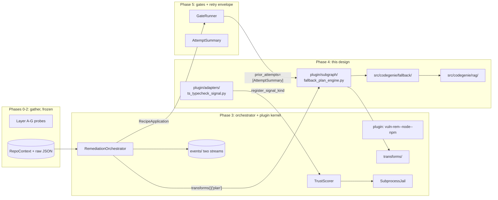
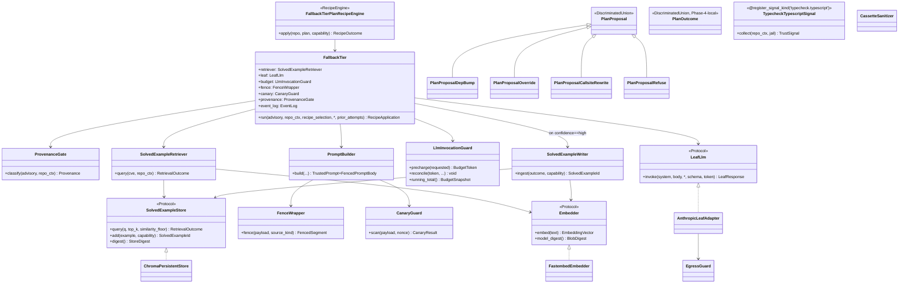
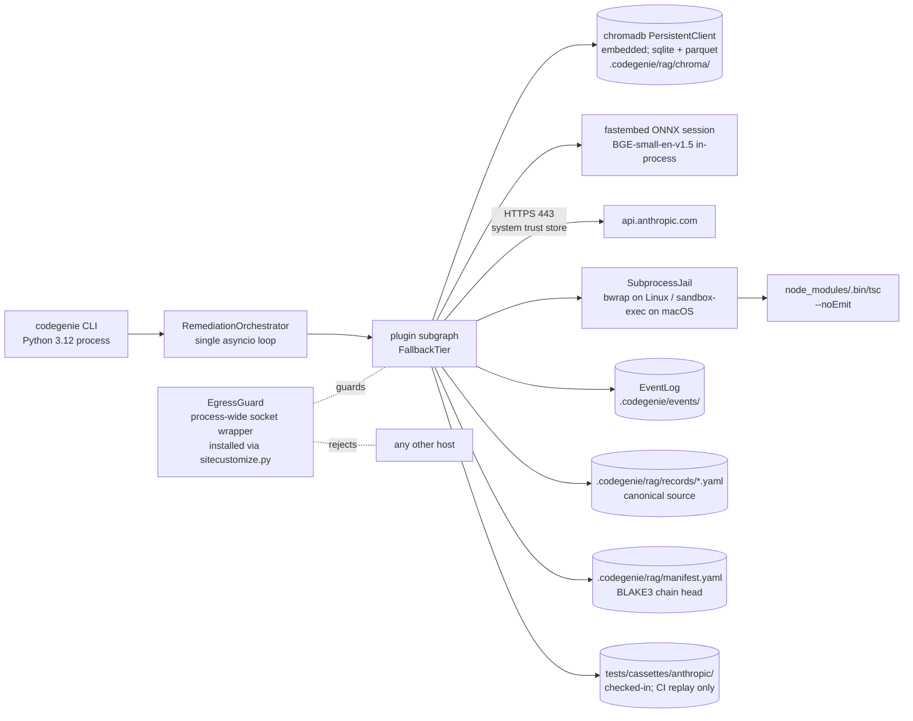
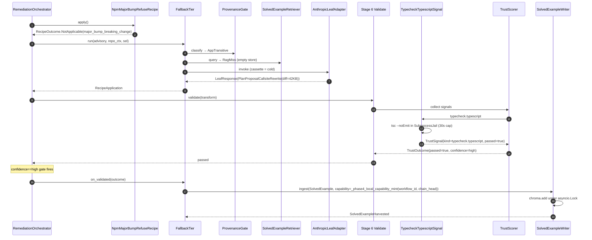
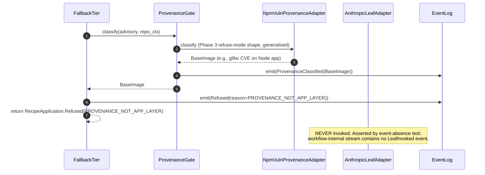

# Phase 04 — Vuln remediation: LLM fallback + solved-example RAG: Architecture

**Status:** Architecture spec
**Date:** 2026-05-18
**Inputs:** `final-design.md` · `critique.md` · `design-{performance,security,best-practices}.md` · `docs/production/design.md` · `docs/production/adrs/{0008,0009,0011,0012,0014,0017,0020,0029,0030,0031,0032,0033,0034,0037,0038}.md` · `docs/phases/03-vuln-deterministic-recipe/{final-design.md,phase-arch-design.md}` · `docs/phases/05-sandbox-trust-gates/final-design.md` · `docs/phases/06.5-per-task-class-eval-harness/final-design.md` · `docs/roadmap.md` Phase 4 (and Phases 5, 6, 6.5, 7, 11, 13 for handoff)
**Audience:** the engineer implementing this phase

---

## Executive summary

Phase 4 is the first phase that lets an LLM produce bytes the system applies. It lives **inside** the Phase-3 plugin (`plugins/vulnerability-remediation--node--npm/subgraph/fallback_plan_engine.py`) as the `transforms()['plan']` engine, returning Phase 3's existing `RecipeApplication` so Phase 5's already-merged `FallbackTier.run(..., prior_attempts=[])` callsite works unchanged. Two new substrate packages — `src/codegenie/rag/` (deterministic store + embedder + retriever) and `src/codegenie/fallback/` (fence, leaf, budget, plan-outcome) — are plugin-agnostic so Phase 7's distroless plugin can adopt them by composition. The load-bearing structural moves are (1) `PlanProposal` as a **closed Pydantic discriminated union** the Anthropic adapter validates against the SDK's `response_format` schema (so injected LLMs cannot emit free prose), (2) a **two-trust-boundary** prompt pipeline (`PromptBuilder` mints `TrustedPrompt` + `FencedPromptBody` newtypes; `CanaryGuard` scans **untruncated**, then truncates), and (3) a **Phase-4-local `PlanOutcome` sum type** that wraps `RecipeOutcome` without widening it, preserving Phase 7's "diff touches only the new plugin directory" exit criterion. The phase also lands the first `typecheck.*` `SignalKind` (`typecheck.typescript`, `tsc --noEmit` in `SubprocessJail`) per ADR-0037, and ships inline auto-harvest gated by `TrustOutcome.passed AND TrustOutcome.confidence == "high"` so the roadmap "second run hits RAG" criterion is met by **production behavior**, not test scaffolding.

## Goals

Refined from roadmap Phase 4 exit criteria + final-design §Goals:

- **G1 — Exit-criterion E2E.** `fixtures/vuln-major-bump/express-cve-2026-1234/` (a breaking-change CVE requiring call-site rewrites; ~80 .ts files; ~120 unit tests): Phase 3 recipe returns `NotApplicable` → Phase 4 LLM-replan succeeds → Phase 5 strict-AND (build, install, tests, lockfile_policy, cve_delta, **typecheck.typescript**) passes → outcome harvested → second run on the same case hits RAG and shapes a cheaper LLM call. Asserted by `tests/integration/test_phase4_e2e_breaking_change.py` + `tests/integration/test_phase4_e2e_replay_lands_rag.py` (no operator step between runs).
- **G2 — Phase 5 contract preserved.** `FallbackTier.run(advisory, repo_ctx, recipe_selection, *, prior_attempts: list[AttemptSummary] = []) -> RecipeApplication` matches the signature Phase 5 has already merged. `LlmInvocationGuard.running_total()` projection is name-stable. `FenceWrapper` is re-imported by Phase 5 for `prior_failure_summary` fencing.
- **G3 — Zero edits to Phase 3 kernel.** No edits to `src/codegenie/{probes,coordinator,cache,output,schema}/`, no edits to `RemediationOrchestrator`, no edits to `Plugin` Protocol, no edits to `RecipeEngine` Protocol, no edits to `Transform` ABC, no widening of `RecipeOutcome`. Enforced by `tests/fence/test_kernel_frozen.py` + `tests/property/test_plan_outcome_no_recipe_outcome_widening.py`.
- **G4 — Determinism property.** Given `(repo_snapshot_sha, cve_record_digest, plugin_version, recipe_version, vuln_index_digest, store_digest, embedding_model_digest, cassette_blake3)`, produced `Transform.diff_bytes`, event sequence, and chain-head advancement are byte-identical (modulo timestamps + `workflow_id`) across 50 Hypothesis runs.
- **G5 — LLM closure fenced.** `anthropic`, `chromadb`, `fastembed`, `onnxruntime` admitted only under `src/codegenie/fallback/` (anthropic), `src/codegenie/rag/` (the rest). `langgraph`, `openai`, `langchain`, `transformers`, `sentence_transformers`, `torch` remain forbidden everywhere. Original `FORBIDDEN_LLM_SDKS` set in `tests/unit/test_pyproject_fence.py` is **unchanged**; a new path-scoped fence at `tests/fence/test_pyproject_fence_phase4.py` carries the Phase-4 additions.
- **G6 — Honest confidence.** `RetrievalOutcome = RagHit | RagMiss | RagDegraded` (two-threshold band: `high_floor=0.85`, `degraded_floor=0.65` defaults in `plugin.yaml`). The inline-harvest gate is `confidence == "high"`, not a numeric threshold. LLM self-confidence is logged-and-discarded; `TrustScorer` consumes only objective signals.
- **G7 — Provenance gate spends no LLM tokens on non-app-layer CVEs.** `ProvenanceGate.classify(...)` runs **before** any leaf call. `Refused(PROVENANCE_NOT_APP_LAYER)` short-circuits with zero token spend. Asserted by event-absence test (`LeafInvoked` event must not appear).
- **G8 — Budget cap as capability.** `LeafLlm.invoke(...)` accepts a `BudgetToken` as a required positional kwarg; calling without one is a type error. Per-workflow defaults: 250K tokens / $1.50.
- **G9 — Performance envelope.**
  | Variant | Time-to-PR p50 | Cost |
  |---|---|---|
  | Recipe-hit (Phase 3 unchanged) | ≤ 18 s | $0.00 |
  | RAG-hit + LLM (cassette, cache warm) | ≤ 28 s | ~$0.010 |
  | LLM-from-scratch (cassette, cache warm) | ≤ 35 s | ~$0.012 |
  | LLM-from-scratch (live, cache cold, p95) | ≤ 110 s | ~$0.06 |
  | RAG p99 query (10K examples, chroma local) | ≤ 15 ms | — |
  | Embedding p99 (BGE-small ONNX) | ≤ 80 ms | — |
  | Worker memory ceiling (Phase 4 additions) | — | ≤ 350 MB RSS |

- **G10 — `typecheck.typescript` SignalKind lands.** `@register_signal_kind("typecheck.typescript")` ships in `plugins/vulnerability-remediation--node--npm/adapters/ts_typecheck_signal.py`; strict-AND-folded; fires *before* `npm test` runs.
- **G11 — Cassette discipline operational.** `tests/cassettes/anthropic/`; `pytest --record-mode=none` in CI; `tests/security/test_cassettes_clean.py` blocks any header/body with `Authorization`/`x-api-key`/`anthropic-version`/`sk-*`/40+-char base64. `tests/cassettes/anthropic/cassettes.lock` carries per-cassette BLAKE3 for Phase 6.5.
- **G12 — Single allowed egress host.** `api.anthropic.com:443` (system trust store, **no SPKI pin**). `EgressGuard` rejects every other host and rejects loopback unless a pytest-fixture-set thread-local flag is set. No `CODEGENIE_ANTHROPIC_KEY_CI` env-var carve-out.

## Non-goals

- **No `langgraph` in Phase 4.** Three-node flat dispatch is three function calls. Phase 6 introduces LangGraph as the runtime and lifts `FallbackTier.run` into a node mechanically (`tests/fixtures/fallback_tier_callable.py` is the contract Phase 6 reads).
- **No `DeterministicRetargeter`.** Performance design's byte-applicable RAG tier is structurally inapplicable to the major-bump case Phase 4 exists to solve (critic [P] §1). RAG-hit feeds the LLM as few-shot; that is the compounding-savings story Phase 4 commits to.
- **No widening of `RecipeOutcome`.** Phase-4-local `PlanOutcome` wraps it. Closes Phase 7's "diff touches only the new plugin directory" exit criterion (critic [B] §5).
- **No SPKI pinning of `api.anthropic.com`.** Self-DOS waiting to happen (critic [S] §1). Compensating controls: `EgressGuard` allowlist + OS-level egress filter + nightly real-API drift job + `import-linter` restrictions on native-extension deps.
- **No multi-vendor LLM seam.** `LeafLlm` Protocol exists for ADR-0020's eventual un-deferral, but ships with one adapter (Anthropic). The Protocol earns its keep at the trust-boundary, not at multi-vendor.
- **No LSP.** Deferred to Phase 15 per ADR-0037. `tests/fence/test_no_lsp_in_phase4.py` AST-walks.
- **No PR creation, no `git push`.** Phase 11 territory per ADR-0009 and commitment §2.8.
- **No auto-harvest from operator-mode batch runs.** Inline harvest is the only ingestion path Phase 4 ships; Phase 11's merge-webhook is the second.
- **No `sentence-transformers` / `torch` in the runtime.** `fastembed` ONNX is the same shape at one-third the install footprint (critic [B] §2).
- **No pgvector / Qdrant / other store.** `chromadb` PersistentClient embedded mode; single-writer constraint declared in Protocol docstring; Phase 11 ships the pgvector adapter behind the same Protocol.

## Architectural context

Phase 4 sits inside Phase 3's `RemediationOrchestrator` Stage 3 (Planning) and produces a `RecipeApplication` that Phase 3's Stage 4 (Apply) and Phase 5's Stage 6 (Validate) consume unchanged.


```mermaid
flowchart LR
  subgraph Phase012[Phases 0-2: gather, frozen]
    Probes[Layer A-G probes]
    RepoCtx[(RepoContext + raw JSON)]
  end
  subgraph Phase3[Phase 3: orchestrator + plugin kernel]
    Orch[RemediationOrchestrator]
    Plug[plugin: vuln-rem--node--npm]
    Trans[transforms/]
    Trust[TrustScorer]
    Jail[SubprocessJail]
    Events[(events/ two streams)]
  end
  subgraph Phase4[Phase 4: this design]
    Fallback[src/codegenie/fallback/]
    Rag[src/codegenie/rag/]
    PluginExt[plugin/subgraph/<br/>fallback_plan_engine.py]
    TsSig[plugin/adapters/<br/>ts_typecheck_signal.py]
  end
  subgraph Phase5[Phase 5: gates + retry envelope]
    GateRunner[GateRunner]
    AttemptSum[AttemptSummary]
  end
  RepoCtx --> Orch
  Orch -- "transforms()['plan']" --> PluginExt
  PluginExt --> Fallback
  Fallback --> Rag
  PluginExt --> Trans
  TsSig --register_signal_kind--> Trust
  Trust --> Jail
  Orch --> Events
  Orch -- RecipeApplication --> GateRunner
  GateRunner -- "prior_attempts=[AttemptSummary]" --> PluginExt
```

Phase 4 introduces two persistent on-disk artifacts that later phases consume: `.codegenie/rag/` (canonical YAML records + derived chroma sqlite, BLAKE3-rolled manifest head) and `tests/cassettes/anthropic/cassettes.lock` (per-cassette BLAKE3 for Phase 6.5 bench replay).

---

## 4+1 architectural views

### Logical view — what are the components and how are they related?


```mermaid
classDiagram
  class FallbackTier {
    +retriever: SolvedExampleRetriever
    +leaf: LeafLlm
    +budget: LlmInvocationGuard
    +fence: FenceWrapper
    +canary: CanaryGuard
    +provenance: ProvenanceGate
    +event_log: EventLog
    +run(advisory, repo_ctx, recipe_selection, *, prior_attempts) RecipeApplication
  }

  class ProvenanceGate {
    +classify(advisory, repo_ctx) Provenance
  }

  class FallbackTierPlanRecipeEngine {
    <<RecipeEngine>>
    +apply(repo, plan, capability) RecipeOutcome
  }

  class LeafLlm {
    <<Protocol>>
    +invoke(system, body, *, schema, token) LeafResponse
  }

  class AnthropicLeafAdapter
  LeafLlm <|.. AnthropicLeafAdapter

  class PromptBuilder {
    +build(...) TrustedPrompt+FencedPromptBody
  }
  class FenceWrapper {
    +fence(payload, source_kind) FencedSegment
  }
  class CanaryGuard {
    +scan(payload, nonce) CanaryResult
  }

  class LlmInvocationGuard {
    +precharge(requested) BudgetToken
    +reconcile(token, ...) void
    +running_total() BudgetSnapshot
  }

  class PlanProposal {
    <<DiscriminatedUnion>>
  }
  class PlanProposalDepBump
  class PlanProposalOverride
  class PlanProposalCallsiteRewrite
  class PlanProposalRefuse
  PlanProposal <|-- PlanProposalDepBump
  PlanProposal <|-- PlanProposalOverride
  PlanProposal <|-- PlanProposalCallsiteRewrite
  PlanProposal <|-- PlanProposalRefuse

  class PlanOutcome {
    <<DiscriminatedUnion, Phase-4-local>>
  }

  class SolvedExampleStore {
    <<Protocol>>
    +query(q, top_k, similarity_floor) RetrievalOutcome
    +add(example, capability) SolvedExampleId
    +digest() StoreDigest
  }
  class ChromaPersistentStore
  SolvedExampleStore <|.. ChromaPersistentStore

  class Embedder {
    <<Protocol>>
    +embed(text) EmbeddingVector
    +model_digest() BlobDigest
  }
  class FastembedEmbedder
  Embedder <|.. FastembedEmbedder

  class SolvedExampleRetriever {
    +query(cve, repo_ctx) RetrievalOutcome
  }

  class SolvedExampleWriter {
    +ingest(outcome, capability) SolvedExampleId
  }

  class TypecheckTypescriptSignal {
    <<@register_signal_kind('typecheck.typescript')>>
    +collect(repo_ctx, jail) TrustSignal
  }

  class EgressGuard
  class CassetteSanitizer

  FallbackTier --> ProvenanceGate
  FallbackTier --> SolvedExampleRetriever
  FallbackTier --> PromptBuilder
  FallbackTier --> LeafLlm
  FallbackTier --> LlmInvocationGuard
  FallbackTier --> SolvedExampleWriter : on confidence==high
  FallbackTierPlanRecipeEngine --> FallbackTier
  PromptBuilder --> FenceWrapper
  PromptBuilder --> CanaryGuard
  AnthropicLeafAdapter --> EgressGuard
  SolvedExampleRetriever --> SolvedExampleStore
  SolvedExampleRetriever --> Embedder
  SolvedExampleWriter --> SolvedExampleStore
  SolvedExampleWriter --> Embedder
```

**Central abstractions** (the surface that survives across Phase 5/6/7): `FallbackTier`, `LeafLlm` Protocol, `PlanProposal` discriminated union, `LlmInvocationGuard` + `BudgetToken`, `FenceWrapper`, `SolvedExampleStore` Protocol, `RetrievalOutcome` discriminated union, `ProvenanceGate`. **Scaffolding** (helpers, parsers, prompt assembly internals, cassette sanitizer): never imported across `src/codegenie/fallback/` or `src/codegenie/rag/` boundaries.

### Process view — what happens at runtime?

```mermaid
sequenceDiagram
  autonumber
  participant Orch as RemediationOrchestrator
  participant Eng as FallbackTierPlanRecipeEngine
  participant Tier as FallbackTier
  participant Prov as ProvenanceGate
  participant Bud as LlmInvocationGuard
  participant Retr as SolvedExampleRetriever
  participant PB as PromptBuilder
  participant Fence as FenceWrapper
  participant Can as CanaryGuard
  participant Leaf as AnthropicLeafAdapter
  participant Egress as EgressGuard
  participant Writer as SolvedExampleWriter
  participant Log as EventLog

  Orch->>Eng: apply(repo, plan, capability)
  Eng->>Tier: run(advisory, repo_ctx, sel, prior_attempts=[])
  Tier->>Prov: classify(advisory, repo_ctx)
  Prov-->>Tier: AppTransitive
  Tier->>Log: emit(ProvenanceClassified)
  Tier->>Bud: running_total()
  Bud-->>Tier: BudgetSnapshot(consumed=0)
  alt prior_attempts empty
    Tier->>Retr: query(cve, repo_ctx)
    Retr-->>Tier: RagHit(score=0.91, record)
    Tier->>Log: emit(RagHit)
  else retry
    Tier->>Tier: skip RAG; fence prior_failure_summary
  end
  Tier->>PB: build(advisory, repo_ctx, rag_hit, prior_attempts)
  PB->>Fence: fence(cve_description, "cve_description")
  PB->>Can: scan(untruncated, nonce)
  Can-->>PB: ok
  PB-->>Tier: TrustedPrompt + FencedPromptBody
  Tier->>Bud: precharge(max_tokens=12000)
  Bud-->>Tier: BudgetToken
  Tier->>Leaf: invoke(system, body, schema=PlanProposal, token=...)
  Leaf->>Egress: pinned_to(anthropic_host)
  Leaf->>Leaf: anthropic.messages.create(response_format=schema)
  Leaf-->>Tier: LeafResponse(plan=PlanProposalCallsiteRewrite, tokens_in, tokens_out)
  Tier->>Bud: reconcile(token, actual_in, actual_out, $)
  Tier->>Tier: build NpmCallsiteRewriteTransform from PlanProposal
  Tier-->>Eng: RecipeApplication
  Eng-->>Orch: RecipeOutcome.Applied(transform)
  Note over Orch: Stage 4 Apply, Stage 6 Validate run...
  Orch->>Tier: on_validated(TrustOutcome.passed AND confidence==high)
  Tier->>Writer: ingest(SolvedExample, capability=mint(...))
  Writer->>Log: emit(SolvedExampleHarvested)
```

**Concurrency:** the orchestrator is single-async-event-loop per workflow. The `LeafLlm` adapter does **one** in-process retry on parse failure (with a "your previous response was malformed" instruction appended), but **no** retry on transport errors — Phase 5's `GateRunner` owns transport retries. `SolvedExampleStore.add` is single-writer; a process-local `asyncio.Lock` guards it. **Durable checkpoints:** none in Phase 4; Phase 6 (LangGraph + checkpointer) and Phase 9 (Temporal) add them. **Blocking calls:** `tsc --noEmit` inside `SubprocessJail` is the only synchronous-feeling boundary; capped at 30 s.

### Development view — how is the source code organized?


```mermaid
graph TD
  src["src/codegenie/"]
  src --> fb["fallback/<br/>(NEW)"]
  src --> rag["rag/<br/>(NEW)"]
  src --> existing["existing kernel<br/>probes/ coordinator/ cache/ output/ schema/<br/>(UNCHANGED)"]
  src --> transforms["transforms/<br/>(Phase 3; no edits)"]
  src --> plugins_pkg["plugins/<br/>(Phase 3 registry; no edits)"]

  fb --> fb_tier["tier.py<br/>FallbackTier"]
  fb --> fb_outcome["plan_outcome.py<br/>PlanOutcome"]
  fb --> fb_proposal["plan_proposal.py<br/>PlanProposal"]
  fb --> fb_budget["budget.py<br/>LlmInvocationGuard"]
  fb --> fb_prov["provenance_gate.py"]
  fb --> fb_fence["fence/<br/>wrapper.py canary.py prompt_builder.py"]
  fb --> fb_leaf["leaf/<br/>port.py anthropic_adapter.py egress_guard.py"]
  fb --> fb_cassette["cassette/sanitizer.py"]

  rag --> rag_store["store.py<br/>Protocol + ChromaPersistentStore"]
  rag --> rag_models["models.py<br/>SolvedExample Query RetrievalOutcome"]
  rag --> rag_embed["embedder.py<br/>Protocol + FastembedEmbedder"]
  rag --> rag_prov["provenance.py<br/>RecordProvenance chain verify"]
  rag --> rag_ingest["ingest.py<br/>SolvedExampleWriter"]
  rag --> rag_retriever["retriever.py<br/>SolvedExampleRetriever (two-threshold band)"]
  rag --> rag_conf["confidence.py<br/>similarity to AdapterConfidence"]

  plugins["plugins/<br/>vulnerability-remediation--node--npm/"]
  plugins --> p_sub["subgraph/<br/>fallback_plan_engine.py (NEW)"]
  plugins --> p_recipes["recipes/<br/>(Phase 3; no edits)"]
  plugins --> p_rag_q["recipes/rag_query_builder.py (NEW)"]
  plugins --> p_adapt["adapters/<br/>vuln_provenance.py (Phase 3; small generalisation)<br/>ts_typecheck_signal.py (NEW)"]
  plugins --> p_skills["skills/<br/>vuln-major-bump.md (NEW)<br/>leaf-llm-instruction.md (NEW)"]
  plugins --> p_yaml["plugin.yaml: requires rag_capabilities + llm_capabilities;<br/>thresholds: high_floor degraded_floor; budget caps"]

  tests["tests/"]
  tests --> t_fb["unit/fallback/  property/  adversarial/"]
  tests --> t_rag["unit/rag/  property/"]
  tests --> t_fence["fence/  security/ (cassette scans)"]
  tests --> t_int["integration/ (E2E + replay + provenance + retry)"]
  tests --> t_cass["cassettes/anthropic/  cassettes.lock"]
```

**Stable contracts (versioned by `tests/integration/test_phase5_contract_snapshot.py`):** `FallbackTier.run` signature, `LeafLlm` Protocol, `PlanProposal` union members + field names, `LlmInvocationGuard.running_total()` return shape, `RetrievalOutcome` variants, `SolvedExampleWriteCapability` mint surface, `FenceWrapper.fence` signature, `cassettes.lock` line format. **Internal helpers** (prompt template loaders, sqlite query builders, model digest functions, cassette body scrubbers, chroma collection naming) live behind the stable contracts and may change freely.

### Physical view — where does this code run?


```mermaid
graph LR
  cli[codegenie CLI<br/>Python 3.12 process]
  cli --> orch[RemediationOrchestrator<br/>single asyncio loop]
  orch --> plugin[plugin subgraph<br/>FallbackTier]
  plugin --> chroma[(chromadb PersistentClient<br/>embedded; sqlite + parquet<br/>.codegenie/rag/chroma/)]
  plugin --> onnx[fastembed ONNX session<br/>BGE-small-en-v1.5 in-process]
  plugin -- HTTPS 443<br/>system trust store --> anthropic[api.anthropic.com]
  plugin --> jail[SubprocessJail<br/>bwrap on Linux / sandbox-exec on macOS]
  jail --> tsc[node_modules/.bin/tsc<br/>--noEmit]
  plugin --> events[(EventLog<br/>.codegenie/events/)]
  plugin --> records[(.codegenie/rag/records/*.yaml<br/>canonical source)]
  plugin --> manifest[(.codegenie/rag/manifest.yaml<br/>BLAKE3 chain head)]
  plugin --> cassettes_test[(tests/cassettes/anthropic/<br/>checked-in; CI replay only)]
  egress[EgressGuard<br/>process-wide socket wrapper<br/>installed via sitecustomize.py] -.guards.- plugin
  egress -.rejects.- otherhosts[any other host]
```

**Phase 4 is one Python process + an embedded chromadb.** No docker-compose, no separate vector-store process, no daemon. Loopback is rejected at runtime unless a pytest-fixture-set thread-local says otherwise. **OS-level egress filter** (iptables/nftables on Linux CI; documented for macOS dev) is the secondary control alongside `EgressGuard`. **Phase 9 deployment shape** (Temporal workers; Phase 11 pgvector swap): one process per worker becomes many; the `SolvedExampleStore` Protocol's single-writer constraint is the trigger for Phase 11's pgvector adapter swap. The `LeafLlm` Protocol survives the Phase-9 transition because the adapter remains process-local; only the storage substrate moves.

### Scenarios — does it work for the cases that matter?

#### Scenario 1: Cache hit — second run on the same CVE hits RAG

```mermaid
sequenceDiagram
  autonumber
  participant CLI as codegenie remediate
  participant Tier as FallbackTier
  participant Prov as ProvenanceGate
  participant Retr as SolvedExampleRetriever
  participant Store as ChromaPersistentStore
  participant Emb as FastembedEmbedder
  participant Leaf as AnthropicLeafAdapter
  participant Bud as LlmInvocationGuard

  CLI->>Tier: run(advisory, repo_ctx, sel)
  Tier->>Prov: classify
  Prov-->>Tier: AppTransitive
  Tier->>Retr: query(cve, repo_ctx)
  Retr->>Emb: embed("vuln_remediation/node/npm | cve=2026-1234 | ...")
  Note over Emb: BLAKE3-keyed sqlite cache hit → vec returned in <2ms
  Retr->>Store: query(vec, top_k=3, similarity_floor=0.85)
  Store-->>Retr: [(record_id, score=0.96)]
  Retr->>Retr: provenance.verify(record) → ok
  Retr-->>Tier: RagHit(few_shot=record)
  Tier->>Bud: precharge(max_tokens=12000)
  Bud-->>Tier: BudgetToken
  Tier->>Leaf: invoke(system[skill+inst+few_shot], body, schema=PlanProposal, token)
  Note over Leaf: cache_creation=0 (system[0]+[1]+[2] all warm),<br/>cache_read=~2800; tokens_out=~400
  Leaf-->>Tier: LeafResponse(plan=PlanProposalCallsiteRewrite)
  Tier->>Bud: reconcile(token, in, out, $)
  Tier-->>CLI: RecipeApplication
  Note over CLI: $0.010 — lower than scratch ($0.017) because<br/>few_shot is in cache + output is shape-aligned to RAG hit.
```

#### Scenario 2: Major-version bump triggers LLM fallback, harvests on validate


```mermaid
sequenceDiagram
  autonumber
  participant Orch as RemediationOrchestrator
  participant Recipe as NpmMajorBumpRefuseRecipe
  participant Tier as FallbackTier
  participant Prov as ProvenanceGate
  participant Retr as SolvedExampleRetriever
  participant Leaf as AnthropicLeafAdapter
  participant Stage6 as Stage 6 Validate
  participant TS as TypecheckTypescriptSignal
  participant Scorer as TrustScorer
  participant Writer as SolvedExampleWriter

  Orch->>Recipe: apply()
  Recipe-->>Orch: RecipeOutcome.NotApplicable(major_bump_breaking_change)
  Orch->>Tier: run(advisory, repo_ctx, sel)
  Tier->>Prov: classify → AppTransitive
  Tier->>Retr: query → RagMiss (empty store)
  Tier->>Leaf: invoke (cassette = cold)
  Leaf-->>Tier: LeafResponse(PlanProposalCallsiteRewrite(diff=42KB))
  Tier-->>Orch: RecipeApplication
  Orch->>Stage6: validate(transform)
  Stage6->>Scorer: collect signals
  Scorer->>TS: typecheck.typescript
  TS->>TS: tsc --noEmit in SubprocessJail (30s cap)
  TS-->>Scorer: TrustSignal(kind=typecheck.typescript, passed=true)
  Scorer-->>Stage6: TrustOutcome(passed=true, confidence=high)
  Stage6-->>Orch: passed
  Note over Orch: confidence==high gate fires
  Orch->>Tier: on_validated(outcome)
  Tier->>Writer: ingest(SolvedExample, capability=_phase4_local_capability_mint(workflow_id, chain_head))
  Writer->>Writer: chroma.add under asyncio.Lock
  Writer-->>Tier: SolvedExampleHarvested
```

#### Scenario 3: Provenance gate refuses (CVE not in app layer) — no LLM tokens spent


```mermaid
sequenceDiagram
  autonumber
  participant Tier as FallbackTier
  participant Prov as ProvenanceGate
  participant NpmProv as NpmVulnProvenanceAdapter
  participant Leaf as AnthropicLeafAdapter
  participant Log as EventLog

  Tier->>Prov: classify(advisory, repo_ctx)
  Prov->>NpmProv: classify (Phase 3 refuse-mode shape, generalised)
  NpmProv-->>Prov: BaseImage (e.g., glibc CVE on Node app)
  Prov->>Log: emit(ProvenanceClassified(BaseImage))
  Prov-->>Tier: BaseImage
  Tier->>Log: emit(Refused(reason=PROVENANCE_NOT_APP_LAYER))
  Tier-->>Tier: return RecipeApplication.Refused(PROVENANCE_NOT_APP_LAYER)
  Note over Leaf: NEVER invoked. Asserted by event-absence test:<br/>workflow-internal stream contains no LeafInvoked event.
```

---

## Component design

### 1. `FallbackTier` (`src/codegenie/fallback/tier.py`)
- **Purpose:** The recipe → RAG → LLM dispatch entry-point. Also Phase 5's retry re-entry point.
- **Public interface:**
  ```python
  class FallbackTier:
      def __init__(
          self,
          retriever: SolvedExampleRetriever,
          leaf: LeafLlm,
          budget: LlmInvocationGuard,
          fence: FenceWrapper,
          canary: CanaryGuard,
          provenance: ProvenanceGate,
          event_log: EventLog,
          *,
          prompt_builder: PromptBuilder,
          harvester: SolvedExampleWriter,
          confidence_gate: ConfidenceGate,
      ) -> None: ...

      async def run(
          self,
          advisory: CveAdvisory,
          repo_ctx: RepoContext,
          recipe_selection: RecipeSelection,
          *,
          prior_attempts: list[AttemptSummary] = [],
      ) -> RecipeApplication: ...

      async def on_validated(
          self, outcome: PlanOutcome, trust: TrustOutcome,
      ) -> None: ...   # inline-harvest hook invoked by orchestrator
  ```
- **Internal structure:** Single async method composed as a short, named, sequential pipeline (provenance → budget-precheck → retrieval-or-skip → prompt-build → budget-precharge → leaf-invoke → reconcile → build-transform). Each step emits one audit event. RAG is **skipped** when `prior_attempts` is non-empty; the prompt body instead carries the fence-wrapped `prior_failure_summary` of the most recent attempt.
- **Dependencies:** `ProvenanceGate` (no LLM tokens before gate); `SolvedExampleRetriever` (read-only); `PromptBuilder` (mints `TrustedPrompt` + `FencedPromptBody` newtypes — sole minting site, AST-walking-test-asserted); `LeafLlm` Protocol (one adapter); `LlmInvocationGuard` (capability mint); `SolvedExampleWriter` (write only when confidence-gate passes).
- **State:** None of its own. All state external (store, event log, budget guard).
- **Performance envelope:** Dispatch overhead < 10 ms; total wall-clock dominated by leaf-invoke (~25 s p50 cassette / 80 s p95 live) and embedding (≤ 80 ms uncached; ≤ 2 ms cached).
- **Failure behavior:** Wraps every step in audit emissions. Raises `LeafProtocolViolation`, `BudgetExceeded`, `EgressViolation` typed errors; returns `RecipeApplication.Refused(reason=...)` for `PROVENANCE_NOT_APP_LAYER`, `BUDGET_EXCEEDED`, `LEAF_REFUSED`, `LEAF_SCHEMA_VIOLATION`. **Never** logs raw LLM completions or raw prompts (only BLAKE3 digests).

### 2. `PlanProposal` (`src/codegenie/fallback/plan_proposal.py`)
- **Purpose:** Closed Pydantic discriminated union the LLM must emit. The Anthropic SDK validates the schema at the API boundary (`response_format` field). Free-form prose is structurally impossible.
- **Public interface:** four variants (`dep_bump`, `override`, `callsite_rewrite`, `refuse`), all `frozen=True, extra="forbid"`. `manifest_path` smart-constructed as `SandboxedRelativePath` (Phase 3); `files` and paths inside `diff` validated against the `files` list; `diff` smart-constructed as `UnifiedDiff` rejecting path-escape, binary content, and `len(diff) > 64 KB`.
- **Internal structure:** No logic — pure data + smart-constructor validators. Schema is exported via `PlanProposal.model_json_schema()` for the SDK.
- **Dependencies:** Phase 3's `SandboxedRelativePath`, `PackageId`, `SemverString` newtypes.
- **State:** None (frozen models).
- **Performance envelope:** Schema serialization < 5 ms (memoized via `lru_cache` keyed on `PlanProposal`).
- **Failure behavior:** Pydantic raises `ValidationError`; smart-constructor raises `LeafProtocolViolation` with a typed sub-reason (`path_escape`, `binary_diff`, `diff_too_large`, `unknown_kind`, `missing_required_field`).

### 3. `FenceWrapper` + `CanaryGuard` (`src/codegenie/fallback/fence/`)
- **Purpose:** Every untrusted byte that enters an LLM prompt is fence-wrapped with a per-invocation 16-byte hex nonce, **canary-scanned on the untruncated payload**, then per-source-kind truncated.
- **Public interface:**
  ```python
  class FenceWrapper:
      def fence(self, payload: str, source_kind: SourceKind) -> FencedSegment: ...

  class CanaryGuard:
      INJECTION_PATTERNS: Final[tuple[bytes, ...]] = (...)
      @classmethod
      def scan(cls, payload: str, nonce: HexNonce) -> CanaryResult: ...
  ```
- **Internal structure:** Pure functional core (`fence_pure`, `scan_pure` operate on bytes only); `FenceWrapper`/`CanaryGuard` are the imperative-shell wrappers that emit audit events. Per-source truncation caps (table below) live in `Final` dict; growth requires ADR amendment.

  | Source kind | Cap |
  |---|---|
  | `cve_description` | 4 KB |
  | `repo_readme` | 2 KB |
  | `transitive_dep_meta` | 1 KB × max 16 |
  | `source_snippet` | 16 KB |
  | `sandbox_stderr` | 8 KB |
  | `rag_retrieved` | 8 KB × max 3 |
  | `prior_attempt_summary` | 4 KB |

- **Dependencies:** None (pure stdlib + Pydantic).
- **State:** None.
- **Performance envelope:** Single-pass byte scan; per-payload cost dominated by hashing the payload to detect nonce overlap (≤ 1 ms / 16 KB).
- **Failure behavior:** Canary collision → replace payload with `<<redacted: canary collision>>`; emit `CanaryCollision(source_kind, pattern_id)`. Continues — the LLM receives the redacted block, typically returns `Refuse(insufficient_context)`.

### 4. `LeafLlm` Protocol + `AnthropicLeafAdapter` (`src/codegenie/fallback/leaf/`)
- **Purpose:** Single seam between Phase 4 and any LLM provider. The only module in the codebase allowed to `import anthropic` (`import-linter` contract + AST-walking fence test).
- **Public interface:**
  ```python
  class LeafLlm(Protocol):
      async def invoke(
          self,
          system_prompt: TrustedPrompt,
          user_message: FencedPromptBody,
          *,
          schema: type[PlanProposal],
          token: BudgetToken,
      ) -> LeafResponse: ...
  ```
  `LeafResponse` is frozen-extra-forbid with `plan: PlanProposal` (already validated), `tokens_in`, `cache_read_tokens`, `cache_creation_tokens`, `tokens_out`, `model: ModelId`, `stop_reason`, `response_id: LeafResponseId`.
- **Internal structure:** `AnthropicLeafAdapter` is a thin async wrapper over `anthropic.AsyncAnthropic`. Key from `keyring.get_password("codegenie", "anthropic_api_key")` → `SecretStr`. System message assembled from three `CachedSystemBlock` records (skill, instruction-template, RAG few-shot when present), each carrying `cache="ephemeral"`. The Anthropic call sets `response_format = schema.model_json_schema()`. Adapter performs **one** in-call retry on JSON-parse failure with an appended "your previous response was malformed; emit valid PlanProposal" instruction. No retry on transport errors — Phase 5 owns that.
- **Dependencies:** `anthropic>=X,<Y` (strict pin); `keyring`; `EgressGuard` (context-manager-wrapped).
- **State:** A short-lived async client per workflow; created at adapter instantiation. No global mutable state.
- **Performance envelope:** ~80 ms cold socket + ~25 s p50 cassette / ~80 s p95 live for major-bump diffs. Prompt-cache reads expected on system[0]+[1] across consecutive workflows.
- **Failure behavior:** Raises `LeafProtocolViolation` after second malformed response; raises `EgressViolation` if `EgressGuard` blocks the host; surfaces `anthropic.APIStatusError` for Phase 5 to handle. Emits `LeafKeyLoaded`, `LeafInvoked(prompt_digest_blake3)`, `LeafReturned(response_digest_blake3, tokens_in, tokens_out, cache_read, cache_creation)`, `LeafProtocolViolation`.

### 5. `LlmInvocationGuard` + `BudgetToken` (`src/codegenie/fallback/budget.py`)
- **Purpose:** Financial circuit breaker. `LeafLlm.invoke` requires a `BudgetToken` as a function-signature argument — calling without one is a type error.
- **Public interface:**
  ```python
  class BudgetToken(BaseModel):
      model_config = ConfigDict(frozen=True, extra="forbid")
      precharged_tokens: TokenCount
      precharged_dollars: Decimal
      issued_at: datetime
      _marker: Literal["budget_token"]

  class LlmInvocationGuard:
      def __init__(self, max_tokens: int, max_dollars: Decimal,
                   per_call_max_tokens: int, event_log: EventLog) -> None: ...
      def precharge(self, requested_tokens: int) -> BudgetToken: ...
      def reconcile(self, token: BudgetToken,
                    actual_in: int, actual_out: int,
                    actual_dollars: Decimal) -> None: ...
      def running_total(self) -> BudgetSnapshot: ...
  ```
- **Internal structure:** Atomic counter (asyncio-safe; Phase 4 is single-loop, so a simple `int` plus tracked tokens). `BudgetToken` flows through exactly two frames (`FallbackTier → LeafLlm.invoke`) per critic anti-pattern resolution.
- **Dependencies:** `EventLog` only.
- **State:** Per-workflow `consumed_tokens: int`, `consumed_dollars: Decimal`, `outstanding_tokens: dict[BudgetTokenId, TokenCount]`.
- **Performance envelope:** All operations O(1); negligible vs leaf-call cost.
- **Failure behavior:** `BudgetExceeded` raised on `precharge` if `running_total + requested > max`. `reconcile` is idempotent on `BudgetTokenId`. **Phase 5 hand-off:** `running_total()` is the projection Phase 5's `GateRunner` reads across retries; `cost.llm.call` ledger entries compose with Phase 5's `cost.sandbox.run` for Phase 13.

### 6. `ProvenanceGate` (`src/codegenie/fallback/provenance_gate.py`)
- **Purpose:** ADR-0038's refuse-mode short-circuit, **lifted to an explicit gate** that runs before any LLM tokens are spent.
- **Public interface:** `classify(advisory, repo_ctx) -> Provenance` (sum type: `AppDirect | AppTransitive | AppVendored | BaseImage | RuntimeBundled | Both | Unknown`).
- **Internal structure:** Delegates to the plugin's `NpmVulnProvenanceAdapter` (Phase 3 generalised). Phase-4-scoped consumer logic: anything not in `{AppDirect, AppTransitive, AppVendored, Both}` → caller emits `Refused(PROVENANCE_NOT_APP_LAYER)`. Phase 7 ships the base-image adapters that turn `Unknown`/`BaseImage` into actionable provenance.
- **Dependencies:** Plugin adapter (`NpmVulnProvenanceAdapter`); `EventLog`.
- **State:** None.
- **Performance envelope:** ≤ 5 ms (file reads cached by Phase 3).
- **Failure behavior:** Adapter exceptions surface as `Refused(reason=PROVENANCE_ADAPTER_FAILED)`; emit `ProvenanceClassified(kind)` always.

### 7. `SolvedExampleStore` Protocol + `ChromaPersistentStore` (`src/codegenie/rag/store.py`)
- **Purpose:** Persistent similarity search over solved examples. One Protocol; one in-tree adapter.
- **Public interface:**
  ```python
  class SolvedExampleStore(Protocol):
      def query(self, q: Query, *, top_k: int = 5,
                similarity_floor: float | None = None) -> RetrievalOutcome: ...
      def add(self, example: SolvedExample,
              capability: SolvedExampleWriteCapability) -> SolvedExampleId: ...
      def digest(self) -> StoreDigest: ...
      def close(self) -> None: ...
  ```
- **Internal structure:** Wraps `chromadb.PersistentClient` in embedded mode against `.codegenie/rag/chroma/`. One collection per `(task_class, language, build_system)` triple (smaller HNSW indexes, O(1) filter). `add()` guarded by process-local `asyncio.Lock`. Canonical source is YAML at `.codegenie/rag/records/<id>.yaml`; chroma sqlite is **derived** (rebuildable via `codegenie rag rebuild`). `digest()` = BLAKE3-rolled head over canonical records list.
- **Dependencies:** `chromadb` (admitted only inside `src/codegenie/rag/`); `Embedder` Protocol; `RecordProvenance`.
- **State:** On-disk: sqlite + parquet under `.codegenie/rag/chroma/`; canonical records under `.codegenie/rag/records/`; manifest with chain head under `.codegenie/rag/manifest.yaml`.
- **Performance envelope:** p99 query ≤ 15 ms @ 10K examples; `add()` < 50 ms (single-writer); cold open ≤ 150 ms.
- **Failure behavior:** Raises typed `StoreCorrupted`, `RagRecordChainOrphan`, `EmbeddingModelMismatch`. On corruption: rebuild from canonical YAML; on chain-orphan during retrieval: exclude record + emit event.

### 8. `Embedder` Protocol + `FastembedEmbedder` (`src/codegenie/rag/embedder.py`)
- **Purpose:** Local CPU embeddings; no torch; no runtime network.
- **Public interface:** `embed(text) -> EmbeddingVector`, `embed_batch(...)`, `model_digest() -> BlobDigest`.
- **Internal structure:** Wraps `fastembed.TextEmbedding(model_name="BAAI/bge-small-en-v1.5")`. Bootstrap is offline-only: `codegenie embeddings bootstrap` downloads pinned weights with content-addressed sha256; runtime refuses to start on hash mismatch. Embedding cache at `.codegenie/rag/embeddings.cache.sqlite` keyed on BLAKE3 of input text.
- **Dependencies:** `fastembed`, `onnxruntime` (admitted only inside `src/codegenie/rag/`); no `torch`, no `sentence_transformers`.
- **State:** Loaded ONNX session (~180 MB RSS).
- **Performance envelope:** p99 ≤ 80 ms uncached / ≤ 2 ms cached; load time ~500 ms.
- **Failure behavior:** `EmbeddingModelMismatch` on lock hash drift (refuse-start). Cross-architecture float drift at 5th decimal is acknowledged; mitigated by the two-threshold band (not a single point).

### 9. `SolvedExampleRetriever` (`src/codegenie/rag/retriever.py`)
- **Purpose:** Read-only RAG at planning time with chain-verification, retrieval-side fencing, and the two-threshold confidence band.
- **Public interface:** `query(advisory, repo_ctx) -> RetrievalOutcome` where `RetrievalOutcome = RagHit(few_shot, score) | RagDegraded(near_match, score) | RagMiss`.
- **Internal structure:** Builds `Query` (Pydantic frozen, extra=forbid) via plugin's `rag_query_builder`; embeds; queries store; per record verifies `provenance.event_chain_head` against the spanning chain log; fences record content as `source_kind="rag_retrieved"`; classifies similarity per `plugin.yaml` band (`high_floor`, `degraded_floor`).
- **Dependencies:** `SolvedExampleStore`, `Embedder`, `FenceWrapper`, `RecordProvenance`.
- **State:** None.
- **Performance envelope:** Dominated by embedding (≤ 80 ms) + store query (≤ 15 ms); total p99 ≤ 100 ms.
- **Failure behavior:** Chain-orphan record excluded + `RagRecordChainOrphan` emitted. Returns `RagMiss` rather than raising when the store is empty.

### 10. `SolvedExampleWriter` + capability (`src/codegenie/rag/ingest.py`)
- **Purpose:** Write-gated ingestion. The `SolvedExampleWriteCapability` is **not** a runtime-unforgeable capability — it's a **Module Boundary pattern with CI enforcement** (named honestly).
- **Public interface:** `ingest_solved_example(outcome, store, embedder, capability) -> SolvedExampleId`.
- **Internal structure:** Capability constructed via module-private factory. Phase 4 ships `_phase4_local_capability_mint(workflow_id, chain_head)` for the inline-harvest path; Phase 5's `GateRunner` mint supersedes it. `import-linter` contract blocks any module outside `{src/codegenie/gates/, src/codegenie/rag/ingest.py}` from importing the mint symbol; a CI test asserts the contract.
- **Dependencies:** `SolvedExampleStore`, `Embedder`, `EventLog`.
- **State:** None (writes flow into `SolvedExampleStore`).
- **Performance envelope:** Bounded by `store.add` (< 50 ms) + embed (< 80 ms) = < 130 ms.
- **Failure behavior:** Raises on capability-shape mismatch; chroma write errors surface as `SolvedExampleIngestFailed` event (workflow still succeeds — the patch shipped). Logged as a lost compounding opportunity, not a wrong patch.

### 11. `TypecheckTypescriptSignal` (`plugins/.../adapters/ts_typecheck_signal.py`)
- **Purpose:** First `typecheck.<lang>` SignalKind per ADR-0037.
- **Public interface:** `@register_signal_kind("typecheck.typescript")`; collector signature matches Phase 3's `SignalCollector` Protocol.
- **Internal structure:** Resolves `./node_modules/.bin/tsc`; runs `tsc --noEmit --pretty false` inside Phase 3's `SubprocessJail` (30 s cap). Strict-AND with baseline cached at `.codegenie/typecheck/baseline-<repo-sha>.json` — passes iff `new_errors_after <= new_errors_before`. Phase-4 ADR amendment to ADR-0012 adds `./node_modules/.bin/tsc` to `ALLOWED_BINARIES`.
- **Dependencies:** Phase 3 `SubprocessJail`; Phase 3 signal-kind registry.
- **State:** Per-repo baseline cache.
- **Performance envelope:** ~3–8 s on 80-file fixture; capped at 30 s.
- **Failure behavior:** Timeout → `TrustSignal(passed=False, details={"timeout": True})`; missing `tsc` → `TrustSignal(passed=False, details={"degraded_reason": "no_tsconfig_or_tsc"})` with confidence flag.

### 12. `CassetteSanitizer` + discipline (`src/codegenie/fallback/cassette/`)
- **Purpose:** Cassettes are checked-in source; sanitize on record, verify on replay, scan in CI.
- **Public interface:** `pytest_recording.before_record_request/response` hook entry-points + `verify_cassette(path) -> CassetteVerification`.
- **Internal structure:** Strips headers (`Authorization`, `X-API-Key`, `Cookie`, `Set-Cookie`, `anthropic-version`); body-scans for `sk-ant-*`/`claude_*`/40+-char base64-shaped header values. `tests/security/test_cassettes_clean.py` walks `tests/cassettes/`. `tests/cassettes/anthropic/cassettes.lock` carries per-cassette BLAKE3; CI compares.
- **Dependencies:** `pytest-recording` (dev-only).
- **State:** None at runtime (CI-only).
- **Performance envelope:** N/A (test path).
- **Failure behavior:** Sanitizer drops fields silently in record path (correct); verifier hard-fails CI on any leaked pattern; cassette diffs require `cassette-review` CODEOWNERS approval.

### 13. `PlanOutcome` (`src/codegenie/fallback/plan_outcome.py`)
- **Purpose:** Phase-4-local sum type wrapping `RecipeOutcome` for event-emission and harvester dispatch **without widening `RecipeOutcome`**.
- **Public interface:**
  ```python
  PlanOutcome = Annotated[
      AppliedFromRecipe | AppliedFromLlm | RagOnlyApplicable | Refused,
      Discriminator("kind"),
  ]
  ```
  Each variant frozen-extra-forbid; carries Phase-4-specific provenance (`few_shot_ref`, `response_id`, `refused_reason`).
- **Internal structure:** No logic — pure projection of `RecipeApplication` + Phase-4 metadata.
- **Dependencies:** Phase 3 `RecipeOutcome` (read-only; never widened).
- **State:** None.
- **Performance envelope:** Negligible.
- **Failure behavior:** `assert_never` on unknown variant — guarded by AST-walking `tests/property/test_plan_outcome_no_recipe_outcome_widening.py`.

### 14. `FallbackTierPlanRecipeEngine` (`plugins/.../subgraph/fallback_plan_engine.py`)
- **Purpose:** The `RecipeEngine`-shaped wrapper the Phase-3 plugin's `transforms()['plan']` returns. **Zero edits to `src/codegenie/plugins/protocols.py`.**
- **Public interface:** Implements Phase 3's `RecipeEngine.apply(repo, plan, capability) -> RecipeOutcome`.
- **Internal structure:** Constructs `FallbackTier` from plugin-resolved adapters + RAG/LLM substrates; awaits `FallbackTier.run(...)`; projects `RecipeApplication` → `RecipeOutcome.Applied | RecipeOutcome.NotApplicable | RecipeOutcome.Failed`. The new `PlanOutcome` is emitted to the event log alongside the projected `RecipeOutcome`.
- **Dependencies:** `FallbackTier`; Phase 3 `RecipeEngine` ABC; plugin TCCM.
- **State:** Created per workflow.
- **Performance envelope:** Wrapping overhead < 1 ms.
- **Failure behavior:** Propagates `LeafProtocolViolation`, `BudgetExceeded`, `EgressViolation` as `RecipeOutcome.Failed(reason=...)`.

### 15. `EgressGuard` (`src/codegenie/fallback/leaf/egress_guard.py`)
- **Purpose:** Process-wide socket guard. Belt to `LeafLlm`'s suspenders.
- **Public interface:** `EgressGuard.install()`, `EgressGuard.pinned_to(host)` context manager, `EgressGuard.reset_for_test()`.
- **Internal structure:** `sitecustomize.py` wraps `socket.create_connection` to allowlist `api.anthropic.com:443` plus a pytest-fixture-set thread-local for loopback. **No** production loopback carve-out.
- **Dependencies:** stdlib `socket`.
- **State:** Process-global wrapper + thread-local test-mode flag.
- **Performance envelope:** O(1) per connect; negligible.
- **Failure behavior:** Raises `EgressViolation(host)`. Acknowledged residual: C-extension `connect(2)` bypasses Python's `socket`; mitigated by `import-linter` restriction on native-extension-using deps and OS-level egress filter (`codegenie self-check egress` reports posture).

---

## Data model

```python
# Identifiers (newtypes — never raw str)
SolvedExampleId   = NewType("SolvedExampleId", str)       # BLAKE3 of canonical YAML body
EmbeddingVector   = NewType("EmbeddingVector", "Annotated[np.ndarray, Shape[384]]")
StoreDigest       = NewType("StoreDigest", str)           # BLAKE3 over records[]
Similarity        = NewType("Similarity", float)          # [-1.0, 1.0]; smart-constructed
ModelId           = NewType("ModelId", str)               # e.g., "claude-sonnet-4-5-20250929"
TokenCount        = NewType("TokenCount", int)            # non-negative
LeafResponseId    = NewType("LeafResponseId", str)        # Anthropic response_id
BudgetTokenId     = NewType("BudgetTokenId", str)         # uuid4
CassetteId        = NewType("CassetteId", str)            # relpath to cassette
HexNonce          = NewType("HexNonce", str)              # 32 hex chars (16 bytes)
BlobDigest        = NewType("BlobDigest", str)            # sha256 of model weights file
ChainHead         = NewType("ChainHead", str)             # BLAKE3
WorkflowId        = NewType("WorkflowId", str)            # Phase 3-defined

# Closed sum types (Pydantic discriminated unions; extra="forbid"; frozen=True)

class SolvedExample(BaseModel):
    """CONTRACT — persisted in chromadb, durable across runs. YAML is canonical."""
    model_config = ConfigDict(frozen=True, extra="forbid")
    id: SolvedExampleId
    task_class: TaskClassName
    language: LanguageName
    build_system: BuildSystemName
    cve_id: CveId
    advisory_digest: BlobDigest
    plan_kind: Literal["dep_bump", "override", "callsite_rewrite"]
    plan_proposal: PlanProposal      # the LLM-produced plan
    transform_digest: BlobDigest     # BLAKE3 of applied Transform.diff_bytes
    trust_outcome_digest: BlobDigest # BLAKE3 of validated TrustOutcome
    provenance: RecordProvenance     # chain head this record was witnessed at
    origin: Literal["llm_solved", "operator_curated", "phase11_merge_webhook"]
    embedding_model: ModelId
    created_at: datetime

class Query(BaseModel):
    """CONTRACT — input to SolvedExampleStore.query. Frozen; digest() is cache key."""
    model_config = ConfigDict(frozen=True, extra="forbid")
    task_class: TaskClassName
    language: LanguageName
    build_system: BuildSystemName
    cve_id: CveId
    affected_package: PackageId
    failure_mode: FailureModeTag   # typed Literal — NO free-text concatenation
    def digest(self) -> BlobDigest: ...

# CONTRACT — closed sum type. LLM may emit exactly these four shapes.
class PlanProposalDepBump(BaseModel):
    model_config = ConfigDict(frozen=True, extra="forbid")
    kind: Literal["dep_bump"] = "dep_bump"
    manifest_path: SandboxedRelativePath
    package: PackageId
    target_version: SemverString
    rationale: Annotated[str, Field(max_length=2048)]   # AUDIT LOG ONLY; never re-prompted

class PlanProposalOverride(BaseModel): ...    # similar shape
class PlanProposalCallsiteRewrite(BaseModel):
    model_config = ConfigDict(frozen=True, extra="forbid")
    kind: Literal["callsite_rewrite"] = "callsite_rewrite"
    manifest_path: SandboxedRelativePath
    files: list[SandboxedRelativePath]
    diff: UnifiedDiff                    # smart-constructed; ≤ 64 KB; no binary; paths ⊆ files
    rationale: Annotated[str, Field(max_length=2048)]

class PlanProposalRefuse(BaseModel):
    model_config = ConfigDict(frozen=True, extra="forbid")
    kind: Literal["refuse"] = "refuse"
    reason: Literal["out_of_scope", "insufficient_context", "policy_block"]
    rationale: Annotated[str, Field(max_length=2048)]

PlanProposal = Annotated[
    PlanProposalDepBump | PlanProposalOverride
    | PlanProposalCallsiteRewrite | PlanProposalRefuse,
    Discriminator("kind"),
]

# CONTRACT — Phase 5 reads .running_total() projection across retries.
class BudgetSnapshot(BaseModel):
    model_config = ConfigDict(frozen=True, extra="forbid")
    consumed_tokens: TokenCount
    consumed_dollars: Decimal
    outstanding_tokens: TokenCount     # precharged but not reconciled
    cap_tokens: TokenCount
    cap_dollars: Decimal

# CONTRACT — feeds TrustScorer strict-AND. Same shape as Phase 3 TrustSignal.
class TypecheckNodeSignal(BaseModel):
    model_config = ConfigDict(frozen=True, extra="forbid")
    kind: Literal["typecheck.typescript"] = "typecheck.typescript"
    passed: bool
    details: dict[str, str | int | bool]  # carries forward Phase 3 convention; no Phase-4 widening
    confidence: Literal["high", "medium", "low"]

# INTERNAL — Phase-4-local; never widens RecipeOutcome.
class AppliedFromRecipe(BaseModel): ...
class AppliedFromLlm(BaseModel):
    kind: Literal["llm"] = "llm"
    recipe_outcome_digest: BlobDigest    # references Phase 3 RecipeOutcome.Applied
    few_shot_ref: SolvedExampleId | None
    response_id: LeafResponseId
class RagOnlyApplicable(BaseModel): ...
class Refused(BaseModel):
    kind: Literal["refused"] = "refused"
    reason: Literal["PROVENANCE_NOT_APP_LAYER", "BUDGET_EXCEEDED",
                    "LEAF_REFUSED", "LEAF_SCHEMA_VIOLATION"]

PlanOutcome = Annotated[
    AppliedFromRecipe | AppliedFromLlm | RagOnlyApplicable | Refused,
    Discriminator("kind"),
]
```

**On-disk shapes:**

- `.codegenie/rag/records/<id>.yaml` — canonical `SolvedExample` (human-reviewable; git-attributable).
- `.codegenie/rag/chroma/` — derived sqlite + parquet (rebuildable via `codegenie rag rebuild` from records).
- `.codegenie/rag/manifest.yaml` — `{records: [...], chain_head: ChainHead}`; BLAKE3-rolled.
- `.codegenie/rag/embeddings_model.lock` — `{model_name, sha256}`; mismatch ⇒ refuse-start.
- `.codegenie/rag/embeddings.cache.sqlite` — BLAKE3(text) → vector (idempotent reuse).
- `.codegenie/events/workflow-internal/<wid>.jsonl.zst` — Phase-3 internal stream (extended with new Phase-4 event kinds).
- `.codegenie/events/spanning/append.jsonl.zst` — Phase-3 spanning stream (extended).
- `tests/cassettes/anthropic/<test_module>/<test_function>.yaml` — VCR cassettes.
- `tests/cassettes/anthropic/cassettes.lock` — `cassette_id → BLAKE3`.

---

## Control flow

**Happy path (LLM-from-scratch).** CLI → `RemediationOrchestrator.run` (Phase 3) → plugin resolved → bundle built → Stage 3 calls `transforms()['plan']` = `FallbackTierPlanRecipeEngine.apply` → `FallbackTier.run`. Inside `run`:

1. **ProvenanceGate.classify** (decision point: branches on `Provenance` sum type; default = refuse-with-event for non-app-layer).
2. **Budget precheck** via `running_total()` (decision point: refuse fast if cap < requested).
3. **RAG retrieval** — *skipped* iff `prior_attempts != []` (decision point: retry path); else `RetrievalOutcome` (three-way branch on `RagHit | RagDegraded | RagMiss`).
4. **PromptBuilder.build** — fence-wraps every untrusted byte, canary-scans untruncated then truncates; mints `TrustedPrompt` + `FencedPromptBody` newtypes.
5. **Budget.precharge** mints `BudgetToken`.
6. **LeafLlm.invoke** under `EgressGuard.pinned_to(ANTHROPIC_HOST)` — schema-validated at SDK boundary; one in-call retry on parse failure.
7. **Budget.reconcile** with actuals.
8. **Build `Transform`** from `PlanProposal` variant (decision point: `match plan` over four variants; `Refuse` returns `RecipeApplication.Refused(LEAF_REFUSED)`).
9. **Return `RecipeApplication`** to orchestrator.

After Stage 6 validates (Phase 5 envelope): orchestrator invokes `FallbackTier.on_validated(outcome, trust)`. Inside `on_validated`:

10. **Confidence gate** — only proceed if `trust.passed AND trust.confidence == "high"`.
11. **Mint capability** via `_phase4_local_capability_mint(workflow_id, chain_head)` (Phase 5 supersedes).
12. **`ingest_solved_example`** — under `asyncio.Lock`; emit `SolvedExampleHarvested`.

**Retry path (Phase 5 re-enters).** `prior_attempts != []` ⇒ RAG **bypassed**; prompt body includes only the fence-wrapped `prior_failure_summary` from the most recent `AttemptSummary`. ADR-04-0003 records this as a deliberate departure from ADR-0011's chain order (which describes initial-plan order, not retry order).

---

## Harness engineering

- **Logging strategy.** Structured JSON via `structlog` (Phase 0). Levels: `DEBUG` for internal step boundaries; `INFO` for audit-anchored events (`ProvenanceClassified`, `RagHit/Miss/Degraded`, `LeafInvoked`, `BudgetReconciled`, `SolvedExampleHarvested`); `WARN` for `CanaryCollision`, `RagRecordChainOrphan`, `SolvedExampleIngestFailed`; `ERROR` for `LeafProtocolViolation`, `EgressViolation`, `BudgetExceeded`, `StoreCorrupted`. **Never** log raw LLM completions or raw prompts — only BLAKE3 digests. Test: `tests/fence/test_no_raw_completions_logged.py` AST-walks for `log.info(..., response.content, ...)` patterns.
- **Tracing strategy.** OTel spans anticipated at: `phase4.recipe_dispatch`, `phase4.rag.query`, `phase4.rag.embed`, `phase4.leaf.invoke`, `phase4.signal.typecheck`, `phase4.harvest`. Span attributes: `cve_id`, `task_class`, `language`, `prompt_digest_blake3`, `response_digest_blake3`, `tokens_in`, `tokens_out`, `cache_read_tokens`. Phase 9 (Temporal) is where OTel exporters get wired; Phase 4 only emits.
- **Idempotence.**
  - RAG queries are idempotent under `(cve_id, manifest_digest, embedding_model_digest, store_digest)`.
  - Embeddings are content-addressed: same text ⇒ same vector ⇒ same sqlite-cache row.
  - Harvest is keyed on `(plan_outcome_digest, repo_snapshot_sha)`: second attempt on same key is a no-op write (chroma's natural ID dedup; canonical YAML detects collision via path).
  - `BudgetToken.reconcile` is idempotent on `BudgetTokenId`.
- **Determinism vs probabilism.**
  - **Deterministic:** `FenceWrapper`, `CanaryGuard`, `PromptBuilder`, `LlmInvocationGuard`, `ProvenanceGate`, `RetrievalOutcome` classification, `Transform` construction, all sum-type dispatch, every chroma query.
  - **Deterministic-on-CPU:** `FastembedEmbedder` (5th-decimal cross-arch drift acknowledged).
  - **Probabilistic (leaf):** `AnthropicLeafAdapter.invoke`. Confined to one frame; deterministic under cassette replay.
- **Replay / debuggability.**
  - Cassettes for LLM determinism in CI (`pytest --record-mode=none`).
  - `.codegenie/audit/llm/<workflow_id>.jsonl.zst` — per-workflow audit of every leaf call (prompt digest, response digest, parsed plan, tokens). Phase 4 ships this; Phase 9 projects it.
  - `codegenie rag rebuild` reconstructs chromadb from canonical YAML.
  - `codegenie self-check egress` reports OS-level egress posture.
- **Configuration.**
  - **Plugin-scoped:** `plugin.yaml` carries thresholds (`high_floor: 0.85`, `degraded_floor: 0.65`), budget caps (`max_tokens_per_workflow: 250000`, `max_dollars_per_workflow: 1.50`, `per_call_max_tokens: 32000`), embeddings model name, cassette directory.
  - **Operator boundary:** env vars only at process boundary (Anthropic key via `keyring`; OTel endpoints; `CODEGENIE_LIVE_LLM=0` for CI).
  - **CLI flags (operator-side only):** `--tier-cap {recipe,rag,llm}`, `--refresh-cassettes` (requires `--i-understand-this-spends-tokens` + CODEOWNERS approval).
  - **No env-var escape for keys.** No `CODEGENIE_ANTHROPIC_KEY_CI`.

---

## Agentic best practices

- **Typed state contracts at every probabilistic/deterministic boundary.** `PlanProposal` is the only shape crossing in from the LLM. `BudgetToken` is the capability needed to cross out. `FencedSegment` is the only shape untrusted bytes wear inside the prompt. `RetrievalOutcome` is the only shape RAG retrieval wears inside the planner. All four are Pydantic frozen-extra-forbid discriminated unions (where applicable) at the boundary.
- **Tool-use safety.**
  - `LeafLlm.invoke` requires `BudgetToken` (capability).
  - `SubprocessJail` allowlist amended with `./node_modules/.bin/tsc` per ADR-0012 pattern (ADR-04-0001).
  - Egress restricted to `api.anthropic.com:443` via `EgressGuard` + OS-level filter; **no SPKI pin** (ADR-04-0004).
  - `import-linter` restricts native-extension-using deps (mitigates `EgressGuard` C-extension bypass).
- **Prompt template structure.**
  - Externalized in `plugins/vulnerability-remediation--node--npm/skills/`: `vuln-major-bump.md` (skill), `leaf-llm-instruction.md` (instruction template).
  - Schema-validated at plugin-load time.
  - Three cached system blocks per call: `system[0]` skill (~2 KB; stable across all major-bump workflows; **prompt-cache-friendly**); `system[1]` instruction template (~3 KB; stable across all Phase-4 leaf calls); `system[2]` per-workflow RAG few-shot (~1–3 KB; only hits cache on intra-batch re-runs).
  - Honest cache-hit target: `system[0]+system[1]` warm across consecutive workflows; `system[2]` warm only on same-CVE re-run within 5 minutes (operator `remediate-batch`).
- **Confidence handling.** `RetrievalOutcome` is a three-way discriminated union (`RagHit | RagDegraded | RagMiss`). Confidence flows out as `Literal["high","medium","low"]`. Harvest gate fires on `confidence == "high"` only; `RagDegraded` feeds the LLM with an explicit "low-confidence" tag in the prompt. LLM self-confidence (`rationale: str`) is **logged-and-discarded** — AST-walking test asserts it never re-enters trust scoring.
- **Error escalation.** Typed errors route via the orchestrator:
  - `LeafProtocolViolation` (3× in workflow) → halt; `Refused(LEAF_SCHEMA_VIOLATION)`.
  - `BudgetExceeded` → `Refused(BUDGET_EXCEEDED)` → HITL.
  - `EgressViolation` → halt workflow + operator supply-chain audit.
  - `ProvenanceRefused` → HITL via Phase 3 universal fallback.
  - `RagRecordChainOrphan` → exclude record + continue; never halts a workflow.

---

## Design patterns applied

| Decision | Pattern applied | Why this pattern *here* | Pattern *not* applied (and why) |
|---|---|---|---|
| `FallbackTier` recipe → RAG → LLM dispatch | **Pipeline (named, sequential, short-circuiting)** | Three handlers; each can short-circuit; the order *is* the policy (ADR-0011). | Not Chain-of-Responsibility (no `handle/passToNext` Protocol; just three named calls). Not LangGraph (Phase 6 owns the runtime). |
| `PlanProposal` discriminated union; LLM emits exactly four variants; SDK validates schema | **Tagged union (sum type) + Make illegal states unrepresentable + Smart constructor** (ADR-0033) | The LLM is fundamentally untrusted. We constrain its *structure* even when we can't constrain its *content*. | Not free-form completion + Pydantic-validate (prose-then-parse is the historical home of injection-shaped bugs). |
| `LeafLlm` Protocol + `AnthropicLeafAdapter` + JSON-schema'd `response_format` + `EgressGuard` | **Adapter at a hard trust boundary** | The model provider is the dirtiest external dep; containing it behind a port localizes every security control. Protocol earns its keep because ADR-0020 will resolve to a second vendor. | Not "Hexagonal architecture" — orchestration leaks `egress_guard.pinned_to(...)` into Phase 4; the domain isn't truly isolated from infrastructure. We name the pattern honestly. |
| `LlmInvocationGuard` + `BudgetToken` required arg of `LeafLlm.invoke` | **Capability pattern (financial) + Circuit breaker** | Token is a function-signature property; calling without it is a type error. Bounds blast radius even if everything else fails. | Not a global counter the adapter checks (a missed-check bug spends arbitrary budget). |
| `FenceWrapper` + `CanaryGuard` + `TrustedPrompt` / `FencedPromptBody` newtypes minted only by `PromptBuilder` | **Newtype + Smart constructor + Functional core / Imperative shell** | Type-checker enforces "every byte reaching the LLM passed through fencing." Fence/canary logic is pure; audit-emission is the imperative shell. | Not Visitor over `PromptSegment` + Builder cascade — readable explicit calls beat pattern soup. |
| `SolvedExample` records: BLAKE3 chain head per record; provenance verify on retrieval | **Event sourcing + Append-only log + Chain of hashes** | Per-record tamper detection. Quarantine without losing audit trail. | Not CRUD-over-vector-store (updates/deletes are how poisoning persists). |
| `SolvedExampleWriteCapability` import-linter-bounded mint | **Module Boundary pattern with CI enforcement** (named honestly; **not** GoF Capability) | True object-capability requires runtime unforgeability Python lacks. Named as what it is. | Not "Capability pattern" — Pydantic constructors are public. |
| `RecipeOutcome` (Phase 3) left unchanged; Phase-4-local `PlanOutcome` wraps it | **Composition over union widening; Open/Closed at the sum-type boundary** | Phase 7 must not add `case` arms; the sum type Phase 3 froze stays frozen. | Not additive union widening (breaks Phase 7's "diff touches only the new plugin directory"). |
| `@register_signal_kind("typecheck.typescript")` | **Registry pattern + Open/Closed** | Phase 3 shipped the seam; Phase 4 adds one row. | Not central `match`-statement dispatch (modification, not extension). |
| `RetrievalOutcome = RagHit \| RagMiss \| RagDegraded` (two-threshold band) | **Tagged union + named bands instead of magic numbers + Specification pattern** | Encodes three different shapes; band thresholds live in `plugin.yaml`; classification is a named, composable rule. | Not `Optional[SolvedExample]` + `Optional[float]` (makes illegal states representable). Not single global threshold (critic blind spot). |
| Embeddings cache at `.codegenie/rag/embeddings.cache.sqlite` keyed on BLAKE3 of input text | **Cache-aside + Content-addressed cache** | Embeddings are deterministic; BLAKE3(input) is the natural key. Reuses Phase 3's sqlite shape. | Not per-call in-memory dict (lost on worker restart). |
| Inline auto-harvest gated by `confidence == "high"` | **Specification pattern (composable rule) + Capability gate** | The gate is a named, composable rule, not a hardcoded `if`. The capability is what authorizes the write. | Not unconditional inline harvest (risks poisoning). Not operator-only CLI (fails roadmap exit criterion). |
| `cassettes.lock` BLAKE3 per cassette | **Content-addressed manifest** | Phase 6.5 reads this per bench case; per-cassette hash beats per-file mtime. | Not a single dir-level checksum (too coarse). |
| `FallbackTierPlanRecipeEngine` returning Phase 3's `RecipeOutcome` shape | **Adapter pattern** — translates Phase-4 `FallbackTier` to Phase-3 `RecipeEngine` Protocol | Phase 3 kernel learns zero new methods; the plugin's `transforms()['plan']` is the seam. | Not extension of `RecipeEngine` (a new ABC method would widen Phase 3's contract). |

### Patterns considered and deliberately rejected

- **`DeterministicRetargeter`** (performance design's headline). Rejected — fan-fiction for the major-bump call-site rewrite case Phase 4 exists to solve. The compounding-savings story is reframed: RAG turns LLM-from-scratch into LLM-with-few-shot, which is cheaper but not free.
- **LangGraph in Phase 4** (best-practices design). Rejected — three flat nodes with no conditional edges buy nothing. Phase 6 owns the runtime; Phase 4 ships a `def run(...)` Phase 6 lifts mechanically.
- **`sentence-transformers` + `torch`**. Rejected — `fastembed` ONNX is the same shape at one-third the install footprint. The contributor-friction argument used for chromadb-vs-qdrant is the same that kills sentence-transformers-vs-fastembed.
- **SPKI pinning of `api.anthropic.com`**. Rejected — self-DOS waiting to happen. System trust + `EgressGuard` + OS-level filter + nightly drift job is the replacement.
- **`CODEGENIE_ANTHROPIC_KEY_CI` env-var escape**. Rejected — one PR sets both flags; design hopes contributor culture enforces it; nothing in code does.
- **Multi-vendor Strategy on `LeafLlm`**. Reduced to a one-adapter Protocol because ADR-0020 will resolve to a second vendor. Two of three "Protocol earns its keep" boxes ticked (LeafLlm, SolvedExampleStore); `Embedder` Protocol acknowledged as borderline-premature pluggability — kept because `model_digest()` is the cache-key contract.
- **Strategy for tier order**. Rejected — the chain order *is* the policy (ADR-0011); Strategy hides this.
- **`MockLeafLlm` shipped as production code**. Rejected — test doubles live in `tests/`.
- **Cassette refresh in CI**. Rejected — `make refresh-cassettes` requires `--i-understand-this-spends-tokens` + CODEOWNERS approval.
- **`langgraph` in fence amendment**. `langgraph` remains forbidden everywhere; Phase 6 amends.

### Anti-patterns avoided

Walking the toolkit's "flag on sight" list:

- **Pattern soup.** Components are named for what they are (`FallbackTier`, `ProvenanceGate`), not for patterns (`FallbackChainOfResponsibility`, `ProvenanceVisitor`). Pattern names appear in the design table, not in class names.
- **Premature pluggability.** Reduced to two Protocols with announced second adapters (`LeafLlm` via ADR-0020, `SolvedExampleStore` via Phase 11 pgvector). `Embedder` is a one-method Protocol justified by the `model_digest()` cache-key contract — acknowledged borderline; surfaced under "open questions."
- **Stringly-typed identifiers.** Every domain primitive is a `NewType` (`SolvedExampleId`, `BudgetTokenId`, `LeafResponseId`, `HexNonce`, `ChainHead`, `ModelId`, `TokenCount`, `BlobDigest`). RAG query is a typed `Query` Pydantic model, never a hand-formatted f-string.
- **Untyped `dict[str, Any]` interfaces.** `TrustSignal.details` keeps Phase 3's typed-narrow `dict[str, str | int | bool]` shape (not widened). New context fields go on typed Pydantic event models, not on `details`.
- **Boolean flags on public methods.** `EgressGuard` loopback is gated by a pytest-fixture-set thread-local, not a `loopback_allowed: bool` arg. `FallbackTier.run` uses default-empty `prior_attempts: list[AttemptSummary] = []` instead of an `is_retry: bool` flag.
- **Tag-and-dispatch without a tagged union.** Plan-variant dispatch is `match plan` over the discriminated union with `assert_never` exhaustiveness. Retrieval-confidence dispatch is `match outcome` over `RetrievalOutcome`. No `if record["kind"] == "x"` strings anywhere.
- **Capability passed through ten frames.** `BudgetToken` flows through exactly two frames (`FallbackTier → LeafLlm.invoke`); does **not** flow through `PromptBuilder`, `FenceWrapper`, or `SolvedExampleRetriever`.
- **Side effects in constructors / module import time.** Acknowledged residual: `EgressGuard` installs via `sitecustomize.py`. Mitigation: `EgressGuard.reset_for_test()` exposed; install is idempotent; tests explicitly re-set the thread-local rather than implicitly relying on the install. Recorded as a known weakness with a Phase-5+ follow-up to move under `bootstrap_runtime()`.

**Known weaknesses surfaced as follow-ups (not avoided here):**
- `EgressGuard` import-time install.
- `Embedder` Protocol over a single adapter (borderline premature pluggability).
- Cassette nightly-drift job is a process control, not a code control.

---

## Edge cases

| # | Edge case | Manifests as | Detected by | System behavior |
|---|---|---|---|---|
| 1 | Provenance `Unknown` (glibc CVE on Node app) | `ProvenanceGate.classify → BaseImage \| Unknown` | `ProvenanceGate` | `Refused(PROVENANCE_NOT_APP_LAYER)` **before any leaf call**; HITL via Phase 3 universal fallback. Asserted by event-absence (`LeafInvoked` must not appear). |
| 2 | Per-workflow budget exhausted mid-call | `LlmInvocationGuard.precharge` raises | `precharge` arithmetic | `Refused(BUDGET_EXCEEDED)` returned; `BudgetExceeded` event; HITL escalation. |
| 3 | Embeddings model drift on upgrade | `embeddings_model.lock` sha256 mismatch | `FastembedEmbedder.__init__` | Refuse-start; emit `EmbeddingModelMismatch`; operator runs `codegenie embeddings bootstrap` + `codegenie rag rebuild`. |
| 4 | Cassette miss in CI (request not previously recorded) | `pytest-recording` `record_mode="none"` raises | `pytest-recording` | Test fails with cassette-diff diagnostic; CI halts. Operator runs `make refresh-cassettes --i-understand-this-spends-tokens`; CODEOWNERS approves. |
| 5 | chromadb writer contention under concurrent harvest | Two workflows finish validate near-simultaneously | `asyncio.Lock` around `store.add` | Second write awaits; both records land deterministically (sorted by `created_at`). Phase 11 pgvector swap is the resolution at portfolio scale. |
| 6 | Canary detects injection in untruncated payload | `CanaryGuard.scan` returns `Collision(pattern_id)` | `CanaryGuard` scans **untruncated** payload, then truncate | Payload replaced with `<<redacted: canary collision>>`; `CanaryCollision` event; LLM typically responds `Refuse(insufficient_context)` → HITL. |
| 7 | LLM returns invalid `PlanProposal` JSON | SDK `response_format` validates; Pydantic raises | `AnthropicLeafAdapter` | One in-call retry with "your previous response was malformed" instruction; second failure → `LeafProtocolViolation` → `Refused(LEAF_SCHEMA_VIOLATION)`. Three in workflow → halt. |
| 8 | Major-bump diff exceeds 64 KB cap | `UnifiedDiff` smart-constructor rejects | `PlanProposalCallsiteRewrite.diff` validator | `LeafProtocolViolation(diff_too_large)`; LLM re-prompted to emit `Refuse(out_of_scope)` → HITL. Cap is the blast-radius/capability trade. |
| 9 | `./node_modules/.bin/tsc` not on PATH | `SubprocessJail.run` returns `Completed(exit_code=127)` or `Missing` | `TypecheckTypescriptSignal.collect` | `TrustSignal(passed=False, details={"degraded_reason": "no_tsconfig_or_tsc"}, confidence="medium")`. Phase 7 base plugin owns the discoverability fix. |
| 10 | RAG retriever returns top-1 below floor | `score < degraded_floor` | `SolvedExampleRetriever` band classifier | `RagMiss`; LLM invoked without few-shot; harvested if validate passes (cold start). |
| 11 | Retry-on-fail re-queries RAG | `prior_attempts != []` would re-fetch same hit → same wrong patch | `FallbackTier` retry guard | RAG **bypassed**; prompt body carries only the fence-wrapped `prior_failure_summary`. ADR-04-0003 records this departure from ADR-0011's chain order. |
| 12 | Egress to non-Anthropic host attempted (transitive dep) | `socket.create_connection` to other host | `EgressGuard` socket wrapper | `EgressViolation(host)` raised; workflow halts; operator supply-chain audit. |
| 13 | `embeddings.cache.sqlite` corrupted | sqlite open raises | `FastembedEmbedder` lazy-open | Cache rebuilt on demand (embed-on-miss); no workflow failure; logged. |
| 14 | RAG record chain-orphan on retrieval | `provenance.event_chain_head` not in spanning log | `RecordProvenance.verify` | Exclude record from result set; emit `RagRecordChainOrphan`; continue. |
| 15 | LLM emits valid `PlanProposalCallsiteRewrite` but with file outside `files` | `UnifiedDiff` smart-constructor rejects path | `PlanProposalCallsiteRewrite.diff` validator | `LeafProtocolViolation(path_escape)` before reach Phase 5; one in-call retry, then `Refused`. |
| 16 | Anthropic API 5xx / rate limit | SDK `APIStatusError` | `AnthropicLeafAdapter` | Three retries with backoff (1s, 4s, 16s) **inside the adapter for transport errors only**; surfaced as `LlmCallFailed(api_outage)` after exhaustion; Phase 5 retry envelope is the next layer. |
| 17 | Cassette-vs-reality drift | Nightly real-API job produces a different response than cassette | Nightly CI job (process control) | Annotation only — does not block PRs; operator refresh cassettes. |
| 18 | Validate passes but confidence == "medium" | `TrustOutcome.confidence != "high"` | `ConfidenceGate` | Workflow succeeds; **harvester does NOT run**; emit `HarvestSkipped(reason=low_confidence)`. Phase 11 webhook may harvest post-merge. |
| 19 | RAG record `embedding_model` mismatch with current model | `SolvedExample.embedding_model != embedder.model_digest()` | `SolvedExampleRetriever` | Exclude record + emit `RagRecordModelMismatch`; operator triggers `codegenie rag rebuild --reembed`. |
| 20 | `keyring` returns no Anthropic key | `keyring.get_password(...)` is `None` | `AnthropicLeafAdapter.__init__` | Refuse to start with diagnostic; **no env-var fallback**; operator stores via `codegenie auth set`. |

---

## Testing strategy

### Test pyramid

- **Unit (~95% of test count).** Per component: `tests/unit/fallback/test_fallback_tier.py`, `test_plan_proposal.py`, `test_fence_wrapper.py`, `test_canary_corpus.py`, `test_budget_guard.py`, `test_leaf_adapter.py`, `test_anthropic_response_format.py`, `test_provenance_gate.py`; `tests/unit/rag/test_store.py`, `test_models.py`, `test_retriever_thresholds.py`, `test_embedder.py`, `test_provenance_verify.py`, `test_ingest.py`; `tests/unit/plugin/test_fallback_plan_engine.py`; `tests/unit/typecheck/test_signal.py`; `tests/unit/trust_scorer/test_typecheck_kind.py`. Mock all collaborators; assert dispatch order; **assert event-absence** (`pytest.fail` side-effect on mocked leaf) when provenance refuses.
- **Integration (~3% of test count).** `tests/integration/test_phase4_rag_miss_llm_from_scratch.py`; `tests/integration/test_phase4_rag_hit_few_shot.py`; **`tests/integration/test_phase4_e2e_breaking_change.py`** (roadmap exit criterion test #1); **`tests/integration/test_phase4_e2e_replay_lands_rag.py`** (roadmap exit criterion test #2 — no operator step between runs; `LlmCostAccrued` delta asserted); `tests/integration/test_phase4_provenance_short_circuits.py` (asserts **no** `LeafInvoked` event); `tests/integration/test_phase4_retry_path_bypasses_rag.py` (Phase-5 simulator passes `prior_attempts`; cassette inspection proves fence-wrapped `prior_failure_summary`); `tests/integration/test_typecheck_signal_catches_signature_drift.py` (deliberately-bad cassette response; `tsc` catches it before `npm test`).
- **End-to-end (~1% of test count).** The two E2E tests above against `fixtures/vuln-major-bump/express-cve-2026-1234/` are end-to-end (CLI → patch on disk → Stage 6 strict-AND pass).

### Property tests

- **`tests/property/test_fence_no_escape.py`** — Hypothesis over `(payload, nonce)`: `f"</UNTRUSTED_INPUT id={nonce}>" not in fence(p, ...).content`.
- **`tests/property/test_canary_scan_untruncated.py`** — for any injection-pattern-prefixed payload longer than the source-kind cap, `CanaryGuard.scan` fires before truncation.
- **`tests/property/test_budget_token_non_reuse.py`** — `BudgetToken` IDs are uuid4-unique; `reconcile(same_token, ...)` twice raises.
- **`tests/property/test_plan_proposal_schema_totality.py`** — `PlanProposal.model_json_schema()` round-trips through `json.dumps/loads`; the four discriminator tags exhaustively cover the union (mypy `assert_never` exhaustiveness asserted via test).
- **`tests/property/test_retriever_threshold_monotonicity.py`** — higher similarity never yields lower confidence.
- **`tests/property/test_sanitizer_idempotence.py`** — `sanitize(sanitize(cassette)) == sanitize(cassette)`.
- **`tests/property/test_solved_example_yaml_roundtrip.py`** — `from_yaml(to_yaml(x)) == x` for any valid `SolvedExample`.
- **`tests/property/test_determinism_under_cassette_replay.py`** — 50 runs with `(cassette_id, store_digest, repo_snapshot_sha, embedding_model_digest)` constant: byte-identical `Transform.diff_bytes` and event order modulo timestamps.
- **`tests/property/test_plan_outcome_no_recipe_outcome_widening.py`** — AST walk asserts `RecipeOutcome` has exactly the variants Phase 3 declared. Phase 7 inherits.

### Golden files

- **Location:** `tests/golden/fallback/{prompt_assemblies,plan_proposals,plan_outcomes,events}/`. Each golden is a frozen Pydantic model dumped as canonical JSON (sorted keys, no trailing spaces).
- **Refresh:** `make refresh-goldens` regenerates from the current code; CI compares. Refresh requires CODEOWNERS approval (treated like cassettes).

### Fixture portfolio

- `fixtures/vuln-major-bump/express-cve-2026-1234/` — peer-dep transitive case + major-version-bump CVE (~80 .ts files; ~120 unit tests). The headline exit-criterion fixture.
- `fixtures/vuln-major-bump/lodash-cve-2026-9876/` — major-bump callsite rewrite; smaller (~20 files) for faster unit coverage.
- `fixtures/vuln-provenance/glibc-on-node/` — CVE not in app layer; `ProvenanceGate` refuse case.
- `fixtures/vuln-rag-hit/express-rerun/` — pre-populated `.codegenie/rag/records/` for re-run "RAG-shapes-LLM" test.
- `fixtures/vuln-retry/cassette-attempt-1-fails-attempt-2-passes/` — Phase 5 retry simulator fixture.

### CI gates

- `make check` (lint, mypy --strict, test, schema-validate).
- `tests/security/test_cassettes_clean.py` (cassette hygiene).
- `tests/fence/test_pyproject_fence_phase4.py` (Phase-4 path-scoped fence amendment; **original `FORBIDDEN_LLM_SDKS` unchanged**).
- `tests/fence/test_kernel_frozen.py` (allow-list extension; zero edits to Phase 0/1/2/3 kernel files).
- `tests/fence/test_no_langgraph_in_phase4.py`, `test_no_sentence_transformers.py`, `test_no_lsp_in_phase4.py`, `test_only_leaf_imports_anthropic.py`, `test_rag_no_anthropic.py`, `test_typecheck_signal_registered.py`.
- Performance regression test: relative-budget assertion (>25% regression vs 7-day rolling mean fails) on `bench_rag_tier_query_p99`, `bench_embedding_p99`, `bench_phase4_e2e_cassette_replay`.
- Nightly real-API drift job (operator-controlled budget): runs a representative bench fixture against live Anthropic; annotates PRs but does not block.

### Performance regression tests

Pinned at p99 (CI fail above):
- RAG retrieval (chroma local + fastembed, 10K seeded examples): ≤ 15 ms.
- Embeddings encode (BGE-small ONNX, cold session pre-warmed): ≤ 80 ms uncached; ≤ 2 ms cached.
- Cold-start LLM call wall-clock (cassette replay): ≤ 35 s p50.
- Cache-hit % canary (system[0]+system[1] across consecutive workflows): ≥ 80% on a 5-workflow batch.

### Adversarial tests (`-m adv`)

- `tests/adversarial/test_injection_corpus.py` — 200+ payloads through `FenceWrapper` + `CanaryGuard`; target 0 escapes.
- `tests/adversarial/test_egress_guard.py` — patch `requests`, `urllib3`, `httpx`, `socket` to attempt forbidden hosts; assert `EgressViolation`. Loopback is **rejected** unless the pytest thread-local is set.
- `tests/adversarial/test_rag_poisoning_chain_orphan.py` — forged chain head; retrieval excludes + event-logs.
- `tests/adversarial/test_rag_poisoning_runtime_inject.py` — record `solution_diff_excerpt` contains injection; retrieval-time fence catches.
- `tests/adversarial/test_plan_path_escape.py` — leaf returns `PlanProposalDepBump(manifest_path="../../etc/passwd")`; smart-constructor rejects before orchestrator.
- `tests/adversarial/test_red_team_prompts.py` — 50+ curated scenarios; target 0 successes (any `PlanProposal` outside `SandboxedPath` is a failure).
- `tests/adversarial/test_canary_bypass_via_truncation.py` — payload with injection past truncation byte; assert canary fires (because scan runs on untruncated).

### Cross-cutting test-architecture additions

Per `docs/roadmap.md §"Test architecture evolution"`, Phase 4 extends the Phase-3 scaffolding (`tests/e2e/`, `tests/property/test_cache_invariant.py`, parameterized portfolio sweep, `tests/contract/`) with: (a) **Phase 4 rows added to `tests/e2e/scenarios.yaml`** — recipe → RAG → LLM-fallback slice exercised against `node_typescript_helm`, `node_yarn_berry_pnp`, and the four `fixtures/vuln-major-bump/*` examples; (b) **`tests/golden/events/`** — pins `AttemptAnchor` JSONL (ADR-04-0017) + the two-stream Phase 4 / Phase 5 event log so downstream consumers (operator portal, future critic training, replay debugging) cannot be silently broken by in-place schema mutation; `schema_version` checked alongside byte equality; (c) **`tsc` in `tests/contract/`** — version-pinned subprocess contract for the `typecheck.typescript` SignalKind; (d) `FallbackTier`-scope determinism property is already covered by [S6-07](stories/S6-07-determinism-cassette-replay-property.md); workflow-scope generalization waits for Phase 6.

---

## Integration with Phase 5 (Sandbox + Trust-Aware gates)

Phase 5 has already merged a design that consumes Phase 4 by name. Phase 4 establishes:

- **`FallbackTier.run(advisory, repo_ctx, recipe_selection, *, prior_attempts: list[AttemptSummary] = [])`** signature — exact kwarg name and default that Phase 5 has merged.
- **`LlmInvocationGuard.running_total()`** projection returning `BudgetSnapshot` — name and shape stable; Phase 5's `cost.sandbox.run` ledger composes with Phase 4's `cost.llm.call` entries for Phase 13.
- **`FenceWrapper`** import-shared with Phase 5 (Phase 5's `AttemptSummary.prior_failure_summary` is fenced via Phase 4's `FenceWrapper` with `source_kind="prior_attempt_summary"`).
- **`SignalKind("typecheck.typescript")`** registered via Phase 3's open registry — Phase 5's `TrustScorer` strict-AND folds it in automatically.
- **`PlanOutcome`** is consumed only by Phase 4's harvester; **`RecipeApplication`** (Phase 3) is what crosses into Phase 5 unchanged. Budget caps carry across retries via the running-total projection.
- **`ProvenanceGate`** is the **first** tier-0 check before any LLM tokens are spent — Phase 5's retry path also calls into `FallbackTier`, which gates again on retry (defense in depth; cheap and idempotent).
- **`SolvedExampleWriteCapability`** mint surface: Phase 5's `GateRunner` ships the real mint (`src/codegenie/gates/_capability_mint.py`); Phase 4 ships an interim `_phase4_local_capability_mint` that Phase 5 supersedes.

Phase 5's contract-snapshot test (`tests/integration/test_phase5_contract_snapshot.py`) regenerates when Phase 4 ships, capturing the additive interface lines.

---

## Path to production end state

**Capabilities now possible after Phase 4:**

- LLM-fallback planning on a single repo / single CVE.
- Solved-example corpus persists across runs; second run on same case is cheaper.
- First `typecheck.<lang>` signal feeding strict-AND.
- Per-workflow financial circuit breaker.
- Cassette-disciplined CI replay for LLM-backed code paths.
- Provenance refuse-mode short-circuits non-app-layer CVEs **before any token spend**.

**What's still missing for the production end state:**

- **Phase 5:** sandbox isolation + three-retry envelope + microVM substrate.
- **Phase 6:** LangGraph state machine + SQLite checkpointer + HITL `interrupt()`.
- **Phase 6.5:** eval harness + first benches; calibrated retrieval-quality thresholds.
- **Phase 7:** distroless plugin proves "extension by addition" (the test of `RecipeOutcome` non-widening lands here).
- **Phase 9:** Temporal durability; activity-level retries; canonical event log in Postgres.
- **Phase 11:** pgvector adapter behind `SolvedExampleStore` Protocol; merge-webhook ingest; portfolio-scale concurrent writes.
- **Phase 13:** cost-ledger projections from `LlmInvocationGuard.running_total` + sandbox.run + image-pull bytes.

**Deferred ADRs sharpened or resolvable post-Phase-4:**

- **ADR-0011 (recipe → RAG → LLM chain order)** — clarified: chain order describes initial-plan order; ADR-04-0003 documents the retry-path RAG-bypass deliberately.
- **ADR-0017 (KG backend)** — Phase 4 establishes the solved-example store shape; Phase 11's pgvector decision can cite Phase-4 evidence (single-writer contention frequency).
- **ADR-0020 (leaf agent SDK)** — Anthropic is locked at the adapter; second-vendor un-deferral is a one-adapter change behind the existing Protocol.
- **ADR-0037 (`typecheck.*` SignalKinds)** — first concrete kind lands.
- **ADR-0038 (vuln.provenance)** — Phase-4-scoped `_AppLayerOnlyProvenance` consumes Phase 3's refuse-mode shape; Phase 7 ships base-image adapters.

---

## Tradeoffs (consolidated)

| Decision | Gain | Cost | Source |
|---|---|---|---|
| Closed `PlanProposal` discriminated union | LLM cannot emit free prose; injection blast-radius bounded | Novel plan shapes refuse out (Phase 15 territory) | final-design §Component 2; ADR-0033 |
| 64 KB diff cap on `callsite_rewrite` | Bounded blast-radius on wrong rewrites; review-tractable | Some legitimate major bumps still refuse → HITL | final-design §Component 2 |
| No SPKI pin on Anthropic | No release on every CA rotation; nightly drift job is the canary | Residual MITM-via-public-CA risk accepted; documented in `docs/operations/secrets.md` | final-design Open Q + ADR-04-0004 |
| Inline auto-harvest gated by `confidence == "high"` | Roadmap exit criterion met by production behavior, not test scaffolding | `confidence == "medium"` outcomes lose compounding opportunity (Phase 11 webhook is the catch-up) | final-design §Component 9; ADR-04-0005 |
| `RecipeOutcome` not widened (`PlanOutcome` is Phase-4-local) | Phase 7's "diff touches only the new plugin directory" exit criterion preserved | One extra projection per workflow; small code-shape duplication | final-design §Patterns rejected; ADR-04-0006 |
| Two-threshold calibration band in `plugin.yaml` | Honest confidence; calibration is config not code | Calibration evidence deferred to Phase 6.5 | final-design §Component 11; ADR-04-0008 |
| Chroma single-writer + `asyncio.Lock` | No docker; embedded; rebuild-from-YAML recovery | Bottleneck at portfolio scale; Phase 11 pgvector swap inevitable | final-design §Component 7 |
| `fastembed` over `sentence-transformers` | One-third install footprint; no torch; no GPU | ONNX cross-arch float drift at 5th decimal (acknowledged) | critic [B] §2 |
| `EgressGuard` via `sitecustomize.py` | Process-wide catch of dynamic socket use | Import-time side effect; C-extension bypass residual | final-design §Component 10 |
| RAG bypass on retry (`prior_attempts != []`) | Avoids same-wrong-hit-twice failure mode | Loses compounding for legitimate same-hit retry; ADR-04-0003 documents | final-design §Component 1 |
| Capability-pattern budget (`BudgetToken`) | Type-error if leaf is called without budget | One extra arg through two frames | final-design §Component 5 |
| Three cached system blocks | system[0]+[1] cache reuse across workflows | system[2] only warm within 5-min batch | final-design §Component 4 |
| **Phase-4-local `_phase4_local_capability_mint`** shim | Inline harvest meets roadmap exit criterion now | Phase 5's `GateRunner` mint supersedes; interim ownership unclear | final-design §Component 9 |

---

## Gap analysis & improvements

The synthesis is strong on the load-bearing trust-boundary primitives and the Phase-5/7 contract commitments. Six gaps remain — three substantive, three borderline.

### Gap 1: Embedding model drift across CI / dev / production has no policy

The design pins the model name + sha256 in `embeddings_model.lock`, and `FastembedEmbedder.__init__` refuses to start on mismatch. What it does **not** specify is **what happens to the existing corpus** when an operator updates the model. Today's design says "operator runs `codegenie embeddings bootstrap` + `codegenie rag rebuild`" — but rebuild requires re-embedding every record (canonical YAML survives; the chroma index is regenerated). For a 1K-example corpus, that's ~80 seconds of embed-time per fresh process. For a 10K-corpus that ships in Phase 11, it's ~800 seconds. The design also doesn't say whether the **existing records carry their old `embedding_model` field** and are excluded from retrieval until re-embedded, or whether retrieval silently mixes two embedding spaces (catastrophic).

**Improvement.** Land an explicit "embedding model swap" runbook in `docs/operations/embeddings.md` and enforce it via two code changes:

1. `SolvedExampleRetriever` excludes records whose `embedding_model != embedder.model_digest()` and emits `RagRecordModelMismatch(count)` once per workflow (already in edge case #19).
2. `codegenie rag rebuild --reembed` runs **batched** embedding through `embed_batch` (already on the Embedder Protocol) and writes a progress audit event every 100 records.

Ship the runbook before Phase 11; the cost of writing it is < 1 day; the cost of not having it is a silent retrieval-quality regression when Phase 11 swaps embedding models for a portfolio-scale corpus.

### Gap 2: Cassette refresh ownership (operator-only, infrequent, but who?)

The design says cassette refresh requires `--i-understand-this-spends-tokens` + CODEOWNERS approval, and that a nightly real-API drift job annotates PRs. What it doesn't specify: **who owns the cassette refresh, and on what cadence**. If an Anthropic SDK upgrade drops in tomorrow, who's responsible for re-recording the ~30 cassettes? Phase 4 ships with one engineer's cassettes; six months later the engineer is rotated off and the cassettes silently rot. The nightly drift job catches the drift but doesn't refresh.

**Improvement.** Land a `CODEOWNERS` entry for `tests/cassettes/anthropic/` naming a **rotating cassette-steward** (initially: the phase implementer; renewed via Phase-13.5 operator portal). Document the refresh cadence in `docs/operations/cassettes.md`: refresh is triggered by (a) nightly drift job flagging any cassette, (b) Anthropic SDK upgrade, (c) prompt template change in `plugins/.../skills/`. Each trigger has a named owner. The `cassettes.lock` BLAKE3 file lands per ADR-04-0008; the lock file's `.codeowners` entry is the enforcement mechanism (CI requires the lock owner's approval on any change).

### Gap 3: ChromaDB writer-contention behavior under burst harvest

The single-writer constraint is declared in the Protocol docstring and enforced by a process-local `asyncio.Lock`. **The design does not specify what happens when two workflows finish validate within the same 50 ms window** — does the second `add` await indefinitely, fail after a timeout, or queue? The synthesis says "Phase 11's pgvector swap is the resolution" but Phase 4 itself runs many workflows in test (the property test runs 50 in series; the integration test suite runs ~10 in parallel under pytest-xdist if developers run it locally).

**Improvement.** Specify the lock-contention contract in `SolvedExampleStore.add` docstring: `await` with a 30 s timeout; on timeout raise `StoreWriteContention(workflow_id)`; emit `SolvedExampleIngestFailed(reason=write_contention)`. Test: `tests/integration/test_phase4_harvest_contention.py` spawns two harvest coroutines on the same store within `asyncio.gather` and asserts both succeed (sequenced) and chain-head advances monotonically. **The test pins the behavior** so Phase 11's pgvector swap has a clear conformance bar.

### Gap 4: `tsc` binary discoverability — system-installed vs npm-vendored

The design resolves `tsc` from `./node_modules/.bin/tsc` and adds it to `ALLOWED_BINARIES` per ADR-04-0001. But: many real repos don't ship `tsc` in their lockfile (they expect a globally-installed TypeScript). Edge case #9 says "missing tsc ⇒ `TrustSignal(passed=False, details={"degraded_reason": "no_tsconfig_or_tsc"}, confidence='medium')`". That **fails strict-AND**, which means a perfectly correct JavaScript-only repo (no TypeScript at all) cannot pass Phase 5's validate.

**Improvement.** The `TypecheckTypescriptSignal` collector should detect whether TypeScript is in scope for the repo at all (presence of `tsconfig.json` + any `.ts` files in the repo). If neither is present, emit `TrustSignal(passed=True, details={"applicable": False}, confidence='high')` — the signal **passes** because it does not apply. Test: `tests/integration/test_typecheck_signal_applicability.py` covers four cases — `tsconfig + .ts files` (applicable, run tsc); `tsconfig + no .ts files` (applicable, run tsc; will report 0 errors); `no tsconfig + .ts files` (applicable but degraded, confidence='medium'); `no tsconfig + no .ts files` (not applicable; pass). This change is small (~30 lines), gives clean semantics, and is the right shape for Phase 7's Node-touching plugin to inherit.

### Gap 5: `FORBIDDEN_LLM_SDKS` path-scope mechanics — exactly where the fence amendment lands

The synthesis says the original `FORBIDDEN_LLM_SDKS = {"anthropic", "langgraph", "openai", "langchain", "transformers"}` stays unchanged; the new `tests/fence/test_pyproject_fence_phase4.py` is path-scoped. This is conceptually right but the **mechanical execution** matters: `test_pyproject_fence.py` currently asserts these packages don't appear *anywhere* in the project closure; the Phase-4 amendment needs to remove `anthropic` from "anywhere" while keeping it forbidden in `src/codegenie/{probes,coordinator,cache,output,schema}/`. The cleanest mechanic is **two assertions**:

```python
# tests/unit/test_pyproject_fence.py  — UNCHANGED set membership
FORBIDDEN_LLM_SDKS = frozenset({"langgraph", "openai", "langchain",
                                "transformers", "sentence_transformers", "torch"})
# `anthropic` is REMOVED from this set in Phase 4. (Phase-4 admits it.)

# tests/fence/test_pyproject_fence_phase4.py  — NEW path-scoped fence
GATHER_PIPELINE_PATHS = frozenset({"src/codegenie/probes/",
                                   "src/codegenie/coordinator/",
                                   "src/codegenie/cache/",
                                   "src/codegenie/output/",
                                   "src/codegenie/schema/"})
PHASE4_ADMITTED_IN_RUNTIME = frozenset({"anthropic", "chromadb",
                                        "fastembed", "onnxruntime"})
# Assert: no source under GATHER_PIPELINE_PATHS imports any of
# (FORBIDDEN_LLM_SDKS | PHASE4_ADMITTED_IN_RUNTIME).
# Assert: only src/codegenie/fallback/leaf/anthropic_adapter.py imports anthropic.
# Assert: only src/codegenie/rag/ imports chromadb, fastembed, onnxruntime.
```

**Improvement.** Codify the diff above as the exact mechanical change in ADR-04-0002. **Surface that the original set DOES change** (anthropic moves out) — the synthesis claim "original set is unchanged" is mechanically incorrect; what's preserved is the **invariant** that `langgraph`, `openai`, `langchain`, `transformers`, `sentence_transformers`, `torch` never appear in the closure. The honest framing: Phase 4 narrows the deny-list and adds a path-scoped fence to compensate.

### Gap 6: Two-threshold cosine band defaults — calibration data deferred to Phase 6.5

Defaults are `high_floor=0.85`, `degraded_floor=0.65`. The design says Phase 6.5 will calibrate, but **Phase 4 ships before Phase 6.5**. The roadmap exit criterion ("second run hits RAG") depends on the same-CVE re-run scoring above `high_floor`. There is no Phase-4-internal evidence that 0.85 is the right floor for `fastembed` BGE-small on the Phase-4 fixture set.

**Improvement.** Land a calibration **smoke test** as part of Phase 4: `tests/integration/test_phase4_threshold_smoke.py` seeds the store with the four `fixtures/vuln-major-bump/*` solved examples and asserts that each fixture's re-run scores in `RagHit` (≥ 0.85), and that crossing-CVE queries score in `RagMiss` (< 0.65). This is a smoke test, **not** the Phase-6.5 calibration — but it pins the defaults against the fixture portfolio Phase 4 actually ships and gives Phase 6.5 a known-good baseline. If the smoke test fails (the defaults are wrong for the fixture portfolio), Phase 4 surfaces it loudly and an ADR amendment updates the defaults before merge.

---

## Open questions deferred to implementation

1. **`Embedder` Protocol — borderline premature pluggability.** Keep as a single-method Protocol (`model_digest()` is the cache-key contract); revisit after Phase 6.5 calibration. If retrieval quality is bottlenecked by BGE-small at Phase-7-corpus scale, a Voyage adapter lands behind the existing Protocol (additive, no Protocol change).
2. **`EgressGuard` bootstrap mechanism.** `sitecustomize.py` install is import-time side-effect. A Phase-5+ follow-up to move under `bootstrap_runtime()` and make `sitecustomize` opt-in is recorded but not executed in Phase 4. Tradeoff: testability vs runtime catch of dynamic socket use.
3. **Per-`vulnerability-remediation--node--*` base plugin for `typecheck.typescript`.** ADR-0031's wildcard convention could let Phase 7's Node plugin inherit the signal without re-registering. Phase 4 ships it plugin-local; Phase 7 (or Phase 6.5 during plugin-layout review) decides whether to promote to a shared base plugin.
4. **Operator-mode `codegenie remediate-batch` cadence for prompt-cache reuse.** The 65% `system[0]+system[1]` cache target only holds for batch-cadenced workflows on similar CVEs. Phase 13.5's operator portal owns surfacing this; Phase 4 emits the events.
5. **Anthropic SDK version pinning vs cassette stability.** Strict pin (`anthropic>=X,<Y`) + cassette-compatibility smoke test is the chosen posture; exact lower/upper bounds land at implementation time. The cassette refresh runbook (Gap 2) is the operational complement.
6. **`PlanProposalCallsiteRewrite.diff` 64 KB cap calibration.** If post-Phase-4 evidence shows the cap is kneecapping legitimate fixes, the next ADR is "raise to 96 KB and shrink the user-block budget by 32 KB to keep token totals constant." Phase 6.5 evidence drives.
7. **Inline-harvest gate refinement.** `confidence == "high"` is one knob; a second knob — "and the matched recipe template / few-shot example is not itself within N edits of the new record" — would mitigate the "near-duplicate corpus drift" failure mode. Deferred until Phase 6.5 has retrieval-quality data.
8. **Phase 7 plugin discoverability of `tsc`.** Phase 4 resolves from `./node_modules/.bin/tsc`. Phase 7's distroless plugin won't have a Node toolchain at all; the right shape is for Phase 7's distroless plugin to **not register** `typecheck.typescript` (it doesn't apply), via ADR-0031 wildcard convention. Phase 4 surfaces this as the question Phase 7's plugin layout must answer.
