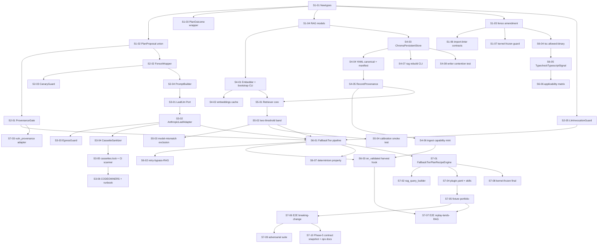

# Phase 04 — Vuln remediation: LLM fallback + solved-example RAG: Stories manifest

**Status:** Backlog generated; ready for autonomous implementation
**Date:** 2026-05-18
**Phase architecture:** [../phase-arch-design.md](../phase-arch-design.md)
**Phase ADRs:** [../ADRs/](../ADRs/)
**Implementation plan:** [../High-level-impl.md](../High-level-impl.md)
**Source design:** [../final-design.md](../final-design.md)

## Executive summary

Phase 4 introduces the first LLM-produced bytes the system applies, lifted into a closed `PlanProposal` discriminated union and gated behind a `ProvenanceGate` that spends zero tokens on non-app-layer CVEs. The work decomposes into 41 stories across the 7 implementation steps: type substrate + path-scoped fence (S1), trust-boundary primitives (S2), leaf LLM port + cassette discipline (S3), RAG kernel (S4), retriever + calibration (S5), `FallbackTier` composition + first `typecheck.typescript` SignalKind (S6), and plugin wiring + E2E exit criteria (S7). Every story is sized for one focused autonomous session and traces to specific arch §Components, ADRs, edge cases, or gap-analysis entries; every roadmap exit criterion has at least one named story that proves it.

## How to use this backlog

> 1. Start at the story whose dependencies are all satisfied.
> 2. Open the story file. Read the **Context**, **References**, **Goal**, **Acceptance criteria** sections.
> 3. Begin with the **TDD plan — red / green / refactor** section. Write the failing test first.
> 4. Implement just enough to make the test pass.
> 5. Refactor.
> 6. Check every acceptance criterion. Update the story file's Status from `Ready` to `Done`.
> 7. Move to the next story whose dependencies are now satisfied.
>
> The order *within* a step is mostly fixed (later S-numbers usually depend on earlier S-numbers); the order *across* steps follows `High-level-impl.md`'s step ordering, with cross-step parallelism wherever the dependency DAG allows.

## Definition of done (applies to every story)

> - [ ] All acceptance criteria are checked.
> - [ ] The TDD plan's red test exists, is committed, and is green.
> - [ ] Any additional tests required to honor the relevant ADRs are written and green.
> - [ ] Code is formatted (`ruff format`), linted clean (`ruff check`), and passes the type check (`mypy --strict`).
> - [ ] No existing test was disabled or weakened without an explicit note in the story's "Notes for the implementer" section explaining why.
> - [ ] The story file's Status is updated to `Done`.
> - [ ] If the story modifies any contract documented in an ADR, the ADR's "Consequences" section is reviewed for new follow-ups.

## Dependency DAG (visual)

```mermaid
graph TD
  S1_01[S1-01 Newtypes] --> S1_02[S1-02 PlanProposal union]
  S1_01 --> S1_03[S1-03 PlanOutcome wrapper]
  S1_01 --> S1_04[S1-04 RAG models]
  S1_01 --> S1_05[S1-05 fence amendment]
  S1_05 --> S1_06[S1-06 import-linter contracts]
  S1_05 --> S1_07[S1-07 kernel-frozen guard]

  S1_02 --> S2_01[S2-01 ProvenanceGate]
  S1_02 --> S2_02[S2-02 FenceWrapper]
  S2_02 --> S2_03[S2-03 CanaryGuard]
  S2_02 --> S2_04[S2-04 PromptBuilder]
  S1_01 --> S2_05[S2-05 LlmInvocationGuard]

  S2_04 --> S3_01[S3-01 LeafLlm Port]
  S3_01 --> S3_02[S3-02 AnthropicLeafAdapter]
  S3_02 --> S3_03[S3-03 EgressGuard]
  S3_02 --> S3_04[S3-04 CassetteSanitizer]
  S3_04 --> S3_05[S3-05 cassettes.lock + CI scanner]
  S3_05 --> S3_06[S3-06 CODEOWNERS + runbook]

  S1_04 --> S4_01[S4-01 Embedder + bootstrap CLI]
  S4_01 --> S4_02[S4-02 embeddings cache]
  S1_04 --> S4_03[S4-03 ChromaPersistentStore]
  S4_03 --> S4_04[S4-04 YAML canonical + manifest]
  S4_04 --> S4_05[S4-05 RecordProvenance]
  S4_05 --> S4_06[S4-06 ingest capability mint]
  S4_03 --> S4_07[S4-07 rag rebuild CLI]
  S4_03 --> S4_08[S4-08 writer contention test]

  S4_01 --> S5_01[S5-01 Retriever core]
  S4_05 --> S5_01
  S5_01 --> S5_02[S5-02 two-threshold band]
  S5_02 --> S5_03[S5-03 model-mismatch exclusion]
  S5_02 --> S5_04[S5-04 calibration smoke test]

  S2_01 --> S6_01[S6-01 FallbackTier pipeline]
  S2_05 --> S6_01
  S3_02 --> S6_01
  S5_02 --> S6_01
  S6_01 --> S6_02[S6-02 retry-bypass-RAG]
  S6_01 --> S6_03[S6-03 on_validated harvest hook]
  S4_06 --> S6_03
  S1_05 --> S6_04[S6-04 tsc allowed-binary]
  S6_04 --> S6_05[S6-05 TypecheckTypescriptSignal]
  S6_05 --> S6_06[S6-06 applicability matrix]
  S6_01 --> S6_07[S6-07 determinism property]

  S6_01 --> S7_01[S7-01 FallbackTierPlanRecipeEngine]
  S7_01 --> S7_02[S7-02 rag_query_builder]
  S2_01 --> S7_03[S7-03 vuln_provenance adapter]
  S7_01 --> S7_04[S7-04 plugin.yaml + skills]
  S7_04 --> S7_05[S7-05 fixture portfolio]
  S7_05 --> S7_06[S7-06 E2E breaking-change]
  S6_03 --> S7_07[S7-07 E2E replay-lands-RAG]
  S7_05 --> S7_07
  S7_01 --> S7_08[S7-08 kernel-frozen final]
  S7_06 --> S7_09[S7-09 adversarial suite]
  S7_06 --> S7_10[S7-10 Phase-5 contract snapshot + ops docs]
```

## Stories — by step

### Step 1: Establish Phase-4 type substrate + path-scoped fence amendment

**Step goal:** Land every Newtype, Pydantic frozen-extra-forbid model, discriminated union, and the fence-CI path-scoping change that the rest of the phase depends on — with nothing else.
**Step exit criteria mapping:** Roadmap implied "work scoped under `src/codegenie/{fallback,rag}/`" (ADR-0031); fence invariant preserved (Gap 5); Phase 5 contract pre-commitment §G2.

| ID | Title (slug → file) | Effort | Depends on | Summary (one sentence) |
|---|---|---|---|---|
| S1-01 | [Newtype + smart-constructor substrate](S1-01-newtype-smart-constructor-substrate.md) | S | — | Land every Phase-4 `NewType` (`SolvedExampleId`, `EmbeddingVector`, `Similarity`, `ModelId`, `TokenCount`, `LeafResponseId`, `BudgetTokenId`, `CassetteId`, `HexNonce`, `BlobDigest`, `ChainHead`, `StoreDigest`) with smart constructors and AST-walk discipline test. |
| S1-02 | [PlanProposal closed discriminated union](S1-02-plan-proposal-closed-union.md) | M | S1-01 | Ship the `PlanProposal` Pydantic v2 discriminated union (`dep_bump`, `override`, `callsite_rewrite`, `refuse`) with `UnifiedDiff` 64 KB cap + path-escape rejection per ADR-0001. |
| S1-03 | [PlanOutcome wraps RecipeOutcome](S1-03-plan-outcome-wraps-recipe-outcome.md) | S | S1-01 | Ship the `PlanOutcome` Phase-4-local sum type (`AppliedFromRecipe \| AppliedFromLlm \| RagOnlyApplicable \| Refused`) and the AST property test asserting Phase-3 `RecipeOutcome` variants are byte-identical (ADR-0004). |
| S1-04 | [RAG-side Pydantic models](S1-04-rag-pydantic-models.md) | S | S1-01 | Ship `SolvedExample`, `Query`, `RecordProvenance`, `RetrievalOutcome` (`RagHit \| RagMiss \| RagDegraded`), `BudgetSnapshot`, `BudgetToken`, `TypecheckNodeSignal` Pydantic frozen-extra-forbid models. |
| S1-05 | [Path-scoped pyproject fence amendment](S1-05-path-scoped-fence-amendment.md) | M | S1-04 | Narrow `FORBIDDEN_LLM_SDKS` (remove `anthropic`; add `sentence_transformers`, `torch`) and land `tests/fence/test_pyproject_fence_phase4.py` enforcing path-scoped admission of `anthropic`/`chromadb`/`fastembed`/`onnxruntime` per ADR-0003 (Gap 5). |
| S1-06 | [import-linter contracts mirroring the fence](S1-06-import-linter-contracts.md) | S | S1-05 | Add `import-linter` contracts so `make lint-imports` enforces the same path-scoped admissions as the fence test; deliberately-violating fixture fails with diagnostic. |
| S1-07 | [`test_kernel_frozen.py` guard](S1-07-test-kernel-frozen.md) | S | S1-05 | Land `tests/fence/test_kernel_frozen.py` asserting zero edits to `src/codegenie/{probes,coordinator,cache,output,schema,plugins/protocols.py}/` for the duration of Phase 4 — load-bearing for Step 7 verification. |

### Step 2: Ship trust-boundary primitives: ProvenanceGate, FenceWrapper/CanaryGuard/PromptBuilder, LlmInvocationGuard/BudgetToken

**Step goal:** Land the deterministic, side-effect-free primitives that every LLM-touching path composes against — gate, fence, canary, prompt builder, budget guard — with full unit + property coverage *before* any leaf adapter exists to consume them.
**Step exit criteria mapping:** Implied G7 (`ProvenanceGate` tier-0); Implied G8 (`BudgetToken` capability); ADR-0012, ADR-0013, ADR-0010.

| ID | Title (slug → file) | Effort | Depends on | Summary (one sentence) |
|---|---|---|---|---|
| S2-01 | [ProvenanceGate as explicit tier-0](S2-01-provenance-gate-tier-zero.md) | S | S1-02 | Ship `ProvenanceGate.classify(advisory, repo_ctx) -> Provenance` over all seven `Provenance` variants with refuse-set `{BaseImage, RuntimeBundled, Unknown}` per ADR-0012. |
| S2-02 | [FenceWrapper pure core + audit shell](S2-02-fence-wrapper.md) | M | S1-02 | Ship `fence_pure` (stdlib-only) + `FenceWrapper.fence` audit-emitting shell with module-level `Final` truncation caps; functional-core/imperative-shell AST guard (ADR-0013). |
| S2-03 | [CanaryGuard scan-before-truncate](S2-03-canary-guard-scan-untruncated.md) | M | S2-02 | Ship `CanaryGuard.scan` on **untruncated** bytes + `INJECTION_PATTERNS` corpus; Hypothesis property `canary-fires-past-truncation` and 50+ curated injection unit corpus pass (ADR-0013). |
| S2-04 | [PromptBuilder as sole TrustedPrompt mint site](S2-04-prompt-builder-sole-mint.md) | S | S2-02, S2-03 | Ship `PromptBuilder.build` returning `(TrustedPrompt, FencedPromptBody)`; AST-walk test asserts no other module mints these Newtypes. |
| S2-05 | [LlmInvocationGuard + BudgetToken issuer](S2-05-llm-invocation-guard-budget-token.md) | M | S1-01 | Ship `LlmInvocationGuard.precharge`/`reconcile`/`running_total` + `BudgetToken` issuer; Hypothesis property `non-reuse` and import-linter contract pinning `BudgetToken` import scope to `{tier.py, leaf/anthropic_adapter.py}` (ADR-0010). |

### Step 3: Ship LeafLlm Port + AnthropicLeafAdapter + EgressGuard + cassette discipline

**Step goal:** The single seam between Phase 4 and any LLM provider — Port → one Adapter — with the egress guard, cassette sanitizer, and cassette-cleanliness CI scanner all landing together so no cassette is ever checked in unscanned.
**Step exit criteria mapping:** Implied G11 (cassette discipline); Implied G12 (single allowed egress); ADR-0005, ADR-0006, ADR-0014.

| ID | Title (slug → file) | Effort | Depends on | Summary (one sentence) |
|---|---|---|---|---|
| S3-01 | [LeafLlm Protocol + LeafResponse model](S3-01-leaf-llm-port.md) | S | S2-04 | Ship `LeafLlm` Protocol with `async invoke(system_prompt, user_message, *, schema, token) -> LeafResponse` and `LeafResponse` frozen-extra-forbid Pydantic model. |
| S3-02 | [AnthropicLeafAdapter with keyring + retries](S3-02-anthropic-leaf-adapter.md) | L | S3-01, S2-05 | Ship `AnthropicLeafAdapter` over `anthropic.AsyncAnthropic` with three cached system blocks, `response_format=PlanProposal.model_json_schema()`, one in-call malformed-JSON retry, three transport retries (1s/4s/16s), `keyring`-only key load (no env fallback) per ADR-0005. |
| S3-03 | [EgressGuard via sitecustomize](S3-03-egress-guard.md) | M | S3-02 | Install `EgressGuard` socket wrapper with `api.anthropic.com:443` allowlist, no production loopback carveout (ADR-0006), `reset_for_test()` fixture, and `codegenie self-check egress` CLI; adversarial test patches requests/urllib3/httpx/socket. |
| S3-04 | [CassetteSanitizer pytest-recording hooks](S3-04-cassette-sanitizer.md) | M | S3-02 | Ship `before_record_request`/`before_record_response` hooks that strip `Authorization`/`X-API-Key`/`Cookie`/`anthropic-version` headers and body-scan for `sk-ant-*`/`claude_*`/40+-char base64 patterns; Hypothesis `sanitize ∘ sanitize == sanitize` idempotence. |
| S3-05 | [cassettes.lock + CI cleanliness scanner](S3-05-cassettes-lock-and-scanner.md) | M | S3-04 | Land BLAKE3 `tests/cassettes/anthropic/cassettes.lock` manifest + `tests/security/test_cassettes_clean.py` walker; deliberate `sk-ant-`-prefixed fixture cassette must fail CI loudly (ADR-0014). |
| S3-06 | [CODEOWNERS + cassette runbook + make refresh-cassettes](S3-06-cassette-ownership-runbook.md) | S | S3-05 | Land `CODEOWNERS` entry naming the rotating cassette-steward, `docs/operations/cassettes.md` runbook (refresh triggers + owners), and `make refresh-cassettes --i-understand-this-spends-tokens` target (Gap 2). |

### Step 4: Ship RAG substrate kernel: Embedder + SolvedExampleStore + record provenance

**Step goal:** Land the deterministic RAG substrate independently — pinned-model embedder, single-writer chroma store, canonical YAML records, BLAKE3-rolled manifest, chain-verify — so it is queryable in isolation before the retriever (Step 5) composes them.
**Step exit criteria mapping:** Implied — RAG substrate; Edge cases #3, #5, #13, #14; ADR-0007, ADR-0016; Gap 1, Gap 3.

| ID | Title (slug → file) | Effort | Depends on | Summary (one sentence) |
|---|---|---|---|---|
| S4-01 | [FastembedEmbedder + bootstrap CLI](S4-01-fastembed-embedder-bootstrap.md) | M | S1-04 | Ship `Embedder` Protocol + `FastembedEmbedder` wrapping `fastembed.TextEmbedding("BAAI/bge-small-en-v1.5")` with `embeddings_model.lock` sha256 refuse-start guard and `codegenie embeddings bootstrap` CLI (ADR-0007). |
| S4-02 | [Embeddings cache.sqlite](S4-02-embeddings-cache-sqlite.md) | S | S4-01 | Ship BLAKE3(text)-keyed `.codegenie/rag/embeddings.cache.sqlite` cache-aside with lazy-open and rebuild-on-corruption (edge case #13). |
| S4-03 | [ChromaPersistentStore + asyncio.Lock](S4-03-chroma-persistent-store.md) | L | S1-04 | Ship `SolvedExampleStore` Protocol + `ChromaPersistentStore` over `chromadb.PersistentClient`, one collection per `(task_class, language, build_system)`, process-local `asyncio.Lock` with 30s `StoreWriteContention` timeout (Gap 3). |
| S4-04 | [YAML canonical records + manifest chain-head](S4-04-yaml-canonical-and-manifest.md) | M | S4-03 | Land `.codegenie/rag/records/<id>.yaml` as canonical source + `.codegenie/rag/manifest.yaml` with BLAKE3-rolled `chain_head`; Hypothesis YAML roundtrip property (ADR-0016). |
| S4-05 | [RecordProvenance.verify against spanning log](S4-05-record-provenance-verify.md) | S | S4-04 | Ship `RecordProvenance.verify(record, spanning_log) -> bool` chain verification; chain-orphan record returns `False` and emits `RagRecordChainOrphan` from caller (edge case #14). |
| S4-06 | [Ingest capability mint + import-linter scope](S4-06-ingest-capability-mint.md) | M | S4-05 | Ship `SolvedExampleWriter` + `SolvedExampleWriteCapability` Module-Boundary pattern with `_phase4_local_capability_mint(workflow_id, chain_head)` private factory; import-linter contract restricts mint symbol to `{src/codegenie/gates/, src/codegenie/rag/ingest.py}`. |
| S4-07 | [`codegenie rag rebuild` reconstruction CLI](S4-07-rag-rebuild-cli.md) | M | S4-04 | Ship `codegenie rag rebuild [--reembed]` rebuilding chroma deterministically from canonical YAML; golden test asserts `digest()` byte-identical to pre-rebuild value (Gap 1). |
| S4-08 | [Burst-harvest contention test](S4-08-harvest-contention-integration-test.md) | M | S4-03 | Land `tests/integration/test_phase4_harvest_contention.py` spawning two harvest coroutines under `asyncio.gather`; both succeed sequenced, chain-head monotonic, deliberate-timeout fixture raises `StoreWriteContention` (Gap 3 pinned). |

### Step 5: Ship SolvedExampleRetriever + two-threshold band + calibration smoke test

**Step goal:** Compose the read-side RAG path — `Query` build → embed → store query → chain-verify → fence retrieved content → classify into `RagHit \| RagDegraded \| RagMiss` — with thresholds in `plugin.yaml` and a Phase-4 calibration smoke test that fails loud if the defaults are wrong for the fixture portfolio.
**Step exit criteria mapping:** Implied — RAG honesty; ADR-0008; Edge cases #10, #14, #19; Gap 6.

| ID | Title (slug → file) | Effort | Depends on | Summary (one sentence) |
|---|---|---|---|---|
| S5-01 | [SolvedExampleRetriever.query composition](S5-01-retriever-query-composition.md) | M | S4-01, S4-05 | Ship `SolvedExampleRetriever.query(advisory, repo_ctx) -> RetrievalOutcome` composing builder → embed → store → chain-verify → fence retrieved content as `source_kind="rag_retrieved"`. |
| S5-02 | [Two-threshold band classifier](S5-02-two-threshold-band-classifier.md) | S | S5-01 | Ship `rag/confidence.py` mapping similarity → `AdapterConfidence` via named bands (`high_floor=0.85`, `degraded_floor=0.65` defaults from `plugin.yaml`); table-driven tests + Hypothesis monotonicity property (ADR-0008). |
| S5-03 | [Model-mismatch + chain-orphan exclusion](S5-03-model-mismatch-and-orphan-exclusion.md) | S | S5-02 | Retriever excludes records whose `embedding_model != embedder.model_digest()` (edge case #19) and chain-orphans (edge case #14); emits `RagRecordModelMismatch(count)` / `RagRecordChainOrphan` once per query. |
| S5-04 | [Threshold-calibration smoke test](S5-04-threshold-calibration-smoke-test.md) | M | S5-02 | Land `tests/integration/test_phase4_threshold_smoke.py` seeding the four `fixtures/vuln-major-bump/*` examples; each fixture's re-run scores `RagHit` (≥ 0.85); crossing-CVE queries score `RagMiss` (< 0.65). Fails Phase-4 merge if defaults are wrong (Gap 6). |

### Step 6: Compose FallbackTier + register typecheck.typescript SignalKind + integration

**Step goal:** Wire the recipe → RAG → LLM dispatch pipeline end-to-end, register the first `typecheck.*` SignalKind into Phase 3's open registry, and prove integration with the Phase-3 orchestrator + Phase-5 retry contract.
**Step exit criteria mapping:** Roadmap exit #3 (`typecheck.*` SignalKind); Implied G2 (Phase 5 contract); ADR-0002, ADR-0011, ADR-0015; Edge cases #1, #7, #11; Gap 4.

| ID | Title (slug → file) | Effort | Depends on | Summary (one sentence) |
|---|---|---|---|---|
| S6-01 | [FallbackTier named-sequential pipeline](S6-01-fallback-tier-pipeline.md) | L | S2-01, S2-05, S3-02, S5-02 | Ship `FallbackTier.run(advisory, repo_ctx, recipe_selection, *, prior_attempts=[]) -> RecipeApplication` with the seven-named-step dispatch (provenance → budget-precheck → retrieval → prompt-build → precharge → leaf-invoke → reconcile → transform) and per-step audit events (ADR-0002). |
| S6-02 | [Retry path bypasses RAG](S6-02-retry-bypass-rag.md) | M | S6-01 | When `prior_attempts != []`, retriever is **not called**; prompt body carries fence-wrapped `prior_failure_summary` (`source_kind="prior_attempt_summary"`); ADR-04-0003 (departure from production ADR-0011) cross-linked from test (edge case #11). |
| S6-03 | [`on_validated` harvest hook with confidence gate](S6-03-on-validated-harvest-hook.md) | M | S6-01, S4-06 | Ship `FallbackTier.on_validated(outcome, trust)` gating ingest on `trust.passed AND trust.confidence == "high"`; mints capability via `_phase4_local_capability_mint`; emits `SolvedExampleHarvested` / `HarvestSkipped(reason)` (edge case #18; ADR-0009). |
| S6-04 | [`./node_modules/.bin/tsc` ALLOWED_BINARIES amendment](S6-04-tsc-allowed-binary.md) | S | S1-05 | Amend `ALLOWED_BINARIES` to admit `./node_modules/.bin/tsc` per ADR-04-0001/ADR-0015; deliberate-violation fixture (different path) is still rejected by `run_allowlisted`. |
| S6-05 | [TypecheckTypescriptSignal collector](S6-05-typecheck-typescript-signal.md) | M | S6-04 | Ship `TypecheckTypescriptSignal` decorated with `@register_signal_kind("typecheck.typescript")`; runs `tsc --noEmit --pretty false` in Phase 3 `SubprocessJail` (30s cap); strict-AND folds via Phase-3 `TrustScorer` with zero edits; registry contains exactly one `typecheck.*` entry post-import (ADR-0015). |
| S6-06 | [`tsc` applicability matrix](S6-06-typecheck-applicability-matrix.md) | S | S6-05 | Detect TypeScript-in-scope via `tsconfig.json` + any `.ts` files; four-case applicability matrix per Gap 4 — `{tsconfig + .ts, tsconfig + no .ts, no tsconfig + .ts, no tsconfig + no .ts}` mapped to `(passed, applicable, confidence)`. |
| S6-07 | [Determinism-under-cassette-replay property](S6-07-determinism-cassette-replay-property.md) | M | S6-01, S6-02 | Land `tests/property/test_determinism_under_cassette_replay.py` — 50 runs with `(cassette_id, store_digest, repo_snapshot_sha, embedding_model_digest)` constant: byte-identical `Transform.diff_bytes` and event order modulo timestamps. |

### Step 7: Ship plugin wiring: FallbackTierPlanRecipeEngine + harvest + E2E exit criteria

**Step goal:** Land the Adapter that wires `FallbackTier` into the existing Phase-3 plugin's `transforms()['plan']`, prove inline harvest meets the roadmap exit criterion under production behavior, and verify zero edits outside the plugin directory (the Phase-7 precondition).
**Step exit criteria mapping:** Roadmap exits #1, #2; Implied — plugin scoping (ADR-0031); Implied G2 — Phase 5 contract snapshot.

| ID | Title (slug → file) | Effort | Depends on | Summary (one sentence) |
|---|---|---|---|---|
| S7-01 | [FallbackTierPlanRecipeEngine plugin adapter](S7-01-fallback-tier-plan-recipe-engine.md) | M | S6-01 | Ship `plugins/.../subgraph/fallback_plan_engine.py` implementing Phase-3 `RecipeEngine.apply` over `FallbackTier.run`; projects `RecipeApplication → RecipeOutcome.{Applied,NotApplicable,Failed}`; emits `PlanOutcome` alongside; zero edits to `src/codegenie/plugins/protocols.py`. |
| S7-02 | [rag_query_builder plugin recipe](S7-02-rag-query-builder.md) | S | S7-01 | Ship `plugins/.../recipes/rag_query_builder.py` building typed `Query` (no f-strings) consumed by Step-5 retriever via injection. |
| S7-03 | [vuln_provenance Phase-3 generalisation](S7-03-vuln-provenance-adapter.md) | S | S2-01 | Lift `plugins/.../adapters/vuln_provenance.py` from Phase-3 refuse-mode to full seven-variant `Provenance` classification — surgical per Global Rule 3 (ADR-0038). |
| S7-04 | [plugin.yaml + skill templates](S7-04-plugin-yaml-and-skills.md) | S | S7-01 | Ship `plugin.yaml` (thresholds, budget caps, embeddings model, cassette dir) + schema-validated `skills/{vuln-major-bump,leaf-llm-instruction}.md`; plugin-load schema check fails on missing keys. |
| S7-05 | [Phase-4 fixture portfolio](S7-05-phase4-fixture-portfolio.md) | M | S7-04 | Land all five fixtures: `vuln-major-bump/{express-cve-2026-1234,lodash-cve-2026-9876}`, `vuln-provenance/glibc-on-node`, `vuln-rag-hit/express-rerun`, `vuln-retry/cassette-attempt-1-fails-attempt-2-passes`. |
| S7-06 | [E2E breaking-change exit criterion #1](S7-06-e2e-breaking-change.md) | L | S7-05, S6-05 | Land `tests/integration/test_phase4_e2e_breaking_change.py` — express major-bump CVE: Phase-3 recipe returns `NotApplicable` → Phase-4 LLM-replan → strict-AND incl. `typecheck.typescript` passes → outcome harvested. Green under cassette replay. |
| S7-07 | [E2E replay-lands-RAG exit criterion #2](S7-07-e2e-replay-lands-rag.md) | M | S7-05, S6-03 | Land `tests/integration/test_phase4_e2e_replay_lands_rag.py` — second run hits RAG (`RagHit` event present); leaf call shaped by few-shot; `LlmCostAccrued` second-run delta < first-run × 0.5; no operator step between runs. |
| S7-08 | [Final kernel-frozen verification](S7-08-final-kernel-frozen-verification.md) | S | S7-01 | Run `tests/fence/test_kernel_frozen.py` at Step-7 completion: zero edits to Phase 0/1/2/3 kernel files, `RemediationOrchestrator`, `Plugin` / `RecipeEngine` Protocol, `Transform` ABC — the Phase-7 precondition is verified by merging. |
| S7-09 | [Adversarial corpus + red-team suite](S7-09-adversarial-corpus.md) | M | S7-06 | Land `tests/adversarial/{test_injection_corpus,test_rag_poisoning_chain_orphan,test_rag_poisoning_runtime_inject,test_plan_path_escape,test_red_team_prompts,test_canary_bypass_via_truncation}.py` — 200+ injection payloads → 0 escapes; 50+ red-team scenarios → 0 successes. |
| S7-10 | [Phase-5 contract snapshot + ops runbooks](S7-10-phase5-contract-snapshot-and-ops-docs.md) | M | S7-06 | Refresh `tests/integration/test_phase5_contract_snapshot.py` capturing `FallbackTier.run`, `LlmInvocationGuard.running_total`, `FenceWrapper`, mint surface, `cassettes.lock` format; publish `tests/fixtures/fallback_tier_callable.py`; land `docs/operations/{secrets.md,cassettes.md,embeddings.md}` runbooks. |

## Cross-cutting concerns

- **Path-scoped fence-CI:** every story that introduces a new module under `src/codegenie/fallback/` or `src/codegenie/rag/` honors ADR-0003's path-scoped fence — only `src/codegenie/fallback/leaf/anthropic_adapter.py` may import `anthropic`; only `src/codegenie/rag/` may import `chromadb`/`fastembed`/`onnxruntime`. Re-run `tests/fence/test_pyproject_fence_phase4.py` after every story.
- **Newtypes throughout:** every story touching domain primitives uses the Step-1 Newtypes (`SolvedExampleId`, `BudgetTokenId`, `EmbeddingVector`, `HexNonce`, `ChainHead`, etc.) — never raw `str` / `bytes`. The AST-walk discipline test from S1-01 catches violations.
- **Cassette discipline:** any story that exercises LLM I/O in tests uses `pytest-recording` cassettes under `tests/cassettes/anthropic/`, sanitized by `CassetteSanitizer` (S3-04), entered into `cassettes.lock` (S3-05). `tests/security/test_cassettes_clean.py` must remain green.
- **Plugin extension-by-addition:** Phase-3 plugin's `RecipeOutcome` is NOT widened; `PlanOutcome` wraps it (ADR-0004 + S1-03). Any story tempted to edit `src/codegenie/plugins/protocols.py`, `RemediationOrchestrator`, `RecipeEngine` Protocol, or `Transform` ABC stops and re-reads ADR-0004 + S1-07 (`test_kernel_frozen.py`).
- **Capability-as-arg discipline:** `BudgetToken` flows only through `tier.py` and `leaf/anthropic_adapter.py` (S2-05 import-linter contract). `SolvedExampleWriteCapability` is minted only inside `src/codegenie/gates/` or `src/codegenie/rag/ingest.py` (S4-06 import-linter contract). If a story is tempted to thread a capability through a third frame, surface per Global Rule 7.

## Exit-criteria coverage

| Exit criterion (verbatim or close) | Story / stories |
|---|---|
| Breaking-change vuln solved end-to-end with LLM fallback + recorded into solved-example store (roadmap #1) | S7-06 (E2E test) composed of S1-01..S1-07, S2-01..S2-05, S3-01..S3-06, S4-01..S4-08, S5-01..S5-04, S6-01..S6-07 |
| Re-running same case hits RAG, not LLM, lower cost (roadmap #2) | S7-07 (E2E test); foundation in S4-03..S4-08 + S5-01..S5-04 + S6-03 (harvest hook) |
| `typecheck.*` first SignalKind lands (ADR-0037; roadmap #3) | S6-04 (allowed-binary), S6-05 (registration + strict-AND fold-in), S6-06 (applicability matrix), used by S7-06 |
| Work lands inside `plugins/vulnerability-remediation--node--npm/` + `src/codegenie/{rag,fallback}/` (ADR-0031) | All stories under S1-04/S1-05 (package skeletons) + S7-01..S7-05 (plugin wiring); S1-07 + S7-08 verify kernel frozen |
| `ProvenanceGate` as tier-0 gate (ADR-0038, ADR-0012) | S2-01 (gate primitive) + S6-01 (wired into `FallbackTier` first step) + S7-06's `test_phase4_provenance_short_circuits` |
| Path-scoped fence amendment (ADR-0003 / Gap 5) | S1-05 (fence amendment) + S1-06 (import-linter) + S1-07 (kernel frozen) |
| Cassette discipline operational (ADR-0014 / Gap 2) | S3-04 (sanitizer), S3-05 (lock + CI scanner), S3-06 (CODEOWNERS + runbook) |
| Single allowed egress host (ADR-0005 / ADR-0006) | S3-03 (`EgressGuard` + adversarial) |
| Budget cap as capability (ADR-0010) | S2-05 (issuer), S3-02 (leaf consumes), S6-01 (tier mints + reconciles) |
| Phase 5 contract preserved (Implied G2) | S6-01 (signature), S6-02 (retry-bypass semantics), S6-03 (harvest hook shape), S7-10 (contract snapshot refresh) |
| Threshold calibration honest (Gap 6) | S5-04 (calibration smoke test fails Phase-4 merge if defaults wrong) |
| Burst harvest contention contract pinned (Gap 3) | S4-03 (Lock + timeout), S4-08 (integration test pinning behavior for Phase 11 conformance) |

## Open implementation questions

1. **Pydantic v2 `Discriminator` idiom alignment with Phase 3** — S1-02 must verify whether Phase 3's `RecipeOutcome` uses `Field(discriminator=...)` v1-shape or v2 `Annotated[..., Discriminator]`; surface the conflict per Global Rule 7 if they disagree.
2. **chromadb embedded-mode lock semantics under `asyncio.gather`** — S4-03/S4-08 may discover chroma blocks the event loop; fall back to `loop.run_in_executor` wrapping `store.add` with the asyncio.Lock outside. Spike first.
3. **`sitecustomize.py` install ordering vs pytest** — S3-03 needs a `pytest` fixture that explicitly `reset_for_test()` on every test — verify no test relies on implicit install state.
4. **Cross-architecture ONNX float drift at 5th decimal** — S4-01/S5-02 should not hash embeddings as cache keys (hash input text BLAKE3 instead); confirm BGE-small drift bounds against the calibration smoke test (S5-04) on macOS + Linux.
5. **`assert_never` exhaustiveness only catches in mypy --strict** — S1-02 + S6-01 must verify CI runs `mypy --strict` as a hard gate; add a fixture-driven deliberate-failure test asserting the diagnostic appears.
6. **`_phase4_local_capability_mint` Phase-5 swap** — S4-06 docstring must cross-link the Phase-5 ADR + add a `# TODO(phase-5)` marker so the swap is mechanical when Phase 5's `gates._capability_mint` lands.
7. **Anthropic SDK version pinning vs cassette stability** — S3-02 + S3-06 must agree on the strict pin (`anthropic>=X,<Y`) and the cassette-compatibility smoke test posture; the lower/upper bounds land at implementation time.
8. **`typecheck.typescript` shared-base-plugin promotion** — S6-05/S6-06 ship plugin-local; whether to promote to a `vulnerability-remediation--node--*` base plugin is a Phase 7 / Phase 6.5 decision (open question §3 in arch).

## Backlog stats

- Total stories: 41
- Stories per step: S1: 7 / S2: 5 / S3: 6 / S4: 8 / S5: 4 / S6: 7 / S7: 10
- Effort distribution: S = 14, M = 22, L = 5
- Longest dependency chain: 10 stories — `S1-01 → S1-04 → S4-03 → S4-04 → S4-05 → S4-06 → S6-03 → S7-07` (replay-lands-RAG E2E) with `S1-01 → S1-04 → S4-01 → S5-01 → S5-02 → S6-01 → S7-01 → S7-06` (breaking-change E2E) parallel.
