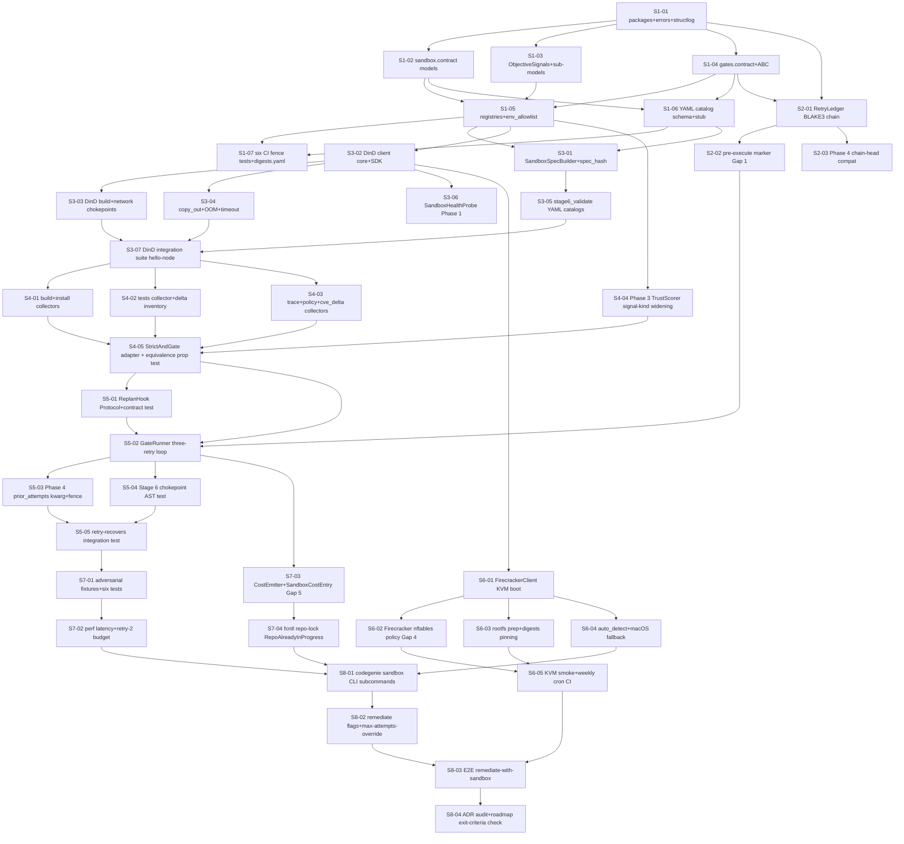

# Phase 05 — Sandbox + Trust-Aware gates: Stories manifest

**Status:** Backlog generated; ready for autonomous implementation
**Date:** 2026-05-12
**Phase architecture:** [../phase-arch-design.md](../phase-arch-design.md)
**Phase ADRs:** [../ADRs/](../ADRs/)
**Implementation plan:** [../High-level-impl.md](../High-level-impl.md)
**Source design:** [../final-design.md](../final-design.md)

## Executive summary

Phase 5 decomposes into **40 stories** across the 8 steps from [High-level-impl.md](../High-level-impl.md). Distribution: **7 / 3 / 7 / 5 / 5 / 5 / 4 / 4**. Step 1 plants every load-bearing contract first — the `SandboxClient` Protocol, `SandboxSpec/Run/Health`, `ObjectiveSignals` (`extra="forbid", frozen=True`) and its six sub-models, the `Gate` ABC family, the YAML catalog schema, decorator registries, the static env allowlist, and the six structural CI fence tests that protect every later step from violating [ADR-0014](../ADRs/0014-objectivesignals-extra-forbid-static-introspection.md), [ADR-0008](../ADRs/) discipline, and the Stage 6 chokepoint. Step 2 ships the BLAKE3-chained `RetryLedger` plus the pre-execute marker that closes Gap 1 and the Phase 4 chain-head compatibility check ([ADR-0005](../ADRs/0005-phase4-chain-head-compatibility.md)). Step 3 lands the macOS-default DinD backend, the byte-stable `SandboxSpecBuilder`, the digest-pinned `tools/policy/sandbox-policy.yaml`, the YAML catalogs, and the `SandboxHealthProbe` (Phase 1 probe). Step 4 builds six pure-function signal collectors against real `SandboxRun` artifacts, widens Phase 3's `TrustScorer` via the open signal-kind registry ([ADR-0003](../ADRs/0003-trustscorer-extension-via-signal-kind-registry.md)), and ships the `StrictAndGate` adapter with a hypothesis equivalence property test. Step 5 closes the loop: `GateRunner`'s three-retry control flow, the Phase 4 `prior_attempts` kwarg ([ADR-0002](../ADRs/0002-additive-prior-attempts-kwarg.md)), the typed `ReplanHook` contract (Gap 2), and the Stage 6 chokepoint AST test. Step 6 ships real Firecracker (not a stub) with host-side nftables network policy ([ADR-0009](../ADRs/0009-firecracker-network-policy-host-side-nftables.md)) plus auto-detect and the KVM-gated CI smoke + weekly cron. Step 7 hardens with adversarial fixtures (test removal, postinstall exfil, prompt injection, in-repo policy, chain tamper), perf regression gates (build/test/trace latency, retry-2 ≤ 1.6× ratio), the `CostEmitter` schema (Gap 5, [ADR-0010](../ADRs/0010-cost-sandbox-run-ledger-schema.md)), and the concurrent-remediate lock. Step 8 lands the operator CLI surface, the headline `tests/e2e/test_remediate_with_sandbox.py` exit-criterion test, and verifies all fifteen ADRs are present. DAG longest chain: 11 stories (S1-01 → contracts → ledger → DinD → spec builder → collectors → runner → replan-hook → adversarial → CLI → E2E).

Cross-cutting concerns: structured `structlog` event constants registered in Step 1 and consumed everywhere; `mypy --strict` on every new module under `src/codegenie/sandbox/**` and `src/codegenie/gates/**`; the fence-CI graph from `phase-arch-design.md §"Development view"`; the [ADR-0014](../ADRs/0014-objectivesignals-extra-forbid-static-introspection.md) static-introspection invariant inherited by every signal-kind story; the [ADR-0007](../ADRs/0007-pre-execute-marker-for-resume-safety.md) pre-execute marker invariant inherited by every story that calls `SandboxClient.execute`.

## How to use this backlog

1. Start at a story whose dependencies are all `Done` (initially, **S1-01**).
2. Open the story file. Read **Context**, **References**, **Goal**, **Acceptance criteria**.
3. Begin with the **TDD plan — red / green / refactor**. Write the failing test first.
4. Implement minimum code to green.
5. Refactor.
6. Check every acceptance criterion. Update Status `Ready` → `Done`.
7. Move to the next satisfied story.

Order within a step is mostly fixed by S-numbering; cross-step parallelism is whatever the DAG allows.

## Definition of done (applies to every story)

- [ ] All acceptance criteria checked.
- [ ] TDD plan's red test exists, is committed, and is green.
- [ ] Any additional tests required to honor relevant ADRs are written and green (notably: [ADR-0014](../ADRs/0014-objectivesignals-extra-forbid-static-introspection.md) static introspection on any change reachable from `ObjectiveSignals`; [ADR-0012](../ADRs/0012-static-env-allowlist-no-credentials-in-sandbox.md) env-allowlist check on any change touching `SandboxSpec.env`; [ADR-0007](../ADRs/0007-pre-execute-marker-for-resume-safety.md) pre-execute marker ordering on any change touching `GateRunner` or `RetryLedger`; [ADR-0013](../ADRs/0013-digest-pinned-policy-yaml-codegenie-owned.md) digest pinning on any change touching `collect_policy_signal`).
- [ ] Code is formatted (`ruff format`), linted clean (`ruff check`), passes type check (`mypy --strict`) on every new module.
- [ ] No existing test was disabled or weakened without explicit note in "Notes for the implementer".
- [ ] Story file's Status updated to `Done`.
- [ ] Every CI fence test (`tests/schema/test_no_llm_imports_in_sandbox.py`, `test_no_subprocess_outside_build_chokepoint.py`, `test_objective_signals_static.py`, `test_env_allowlist_no_credentials.py`, `test_stage6_chokepoint.py`, `test_digests_yaml.py`) remains green at the end of the story.
- [ ] If the story modifies a contract documented in an ADR, that ADR's "Consequences" section is reviewed.
- [ ] Per-module coverage reported in PR body — 95/90 floors for `sandbox/contract.py`, `sandbox/signals/models.py`, `gates/contract.py`, `gates/runner.py`, `gates/retry_ledger.py`; 90/80 for all other new modules under `sandbox/` and `gates/`.

## Dependency DAG (visual)

Direct dependencies only; transitive edges omitted.

## Stories — by step

### Step 1: Scaffold packages, contracts, and CI fences

**Step goal:** Both new packages exist with every data contract, registry, and structural CI gate in place — no backend logic yet, but every invariant that protects later steps is enforced at PR time.
**Step exit-criteria mapping:** roadmap-§"Public surface introduced" (Goals 3, 4, 7, 8, 13); seeds the chokepoint test fed in Step 5.

| ID | Title (slug → file) | Effort | Depends on | Summary (one sentence) |
|---|---|---|---|---|
| S1-01 | [Scaffold `sandbox/` + `gates/` packages with errors and structlog event constants (`S1-01-scaffold-packages-errors-structlog`)](S1-01-scaffold-packages-errors-structlog.md) | S | — | Create the two empty packages with `__init__.py`, `errors.py` hierarchies, and the structlog event-name constants every later module imports. |
| S1-02 | [`sandbox/contract.py` — `SandboxClient` Protocol + `SandboxSpec/Run/Health/CopyInEntry` models (`S1-02-sandbox-contract-protocol-models`)](S1-02-sandbox-contract-protocol-models.md) | M | S1-01 | Ship the `SandboxClient` Protocol and all four frozen `extra="forbid"` Pydantic models that every backend must accept and emit. |
| S1-03 | [`ObjectiveSignals` + six sub-models + `SignalProvenance` (`S1-03-objective-signals-models`)](S1-03-objective-signals-models.md) | M | S1-01 | Ship the `ObjectiveSignals` family with the `_SignalBase` shape, the six optional sub-models, and the static-introspection invariant that ADR-0014 demands. |
| S1-04 | [`gates/contract.py` — `Gate` ABC, `GateContext`, `GateOutcome`, `RetryPolicy`, `AttemptSummary`, `TransitionId` (`S1-04-gates-contract-abc-models`)](S1-04-gates-contract-abc-models.md) | M | S1-01 | Ship the `Gate` ABC, the four gate-side frozen models, the `TransitionId` enum, and the `Attempt` internal model used by the ledger. |
| S1-05 | [Decorator registries + `env_allowlist` static filter (`S1-05-registries-and-env-allowlist`)](S1-05-registries-and-env-allowlist.md) | S | S1-02, S1-03, S1-04 | Land `@register_sandbox_backend`, `@register_signal_kind` with collision policy, and the `env_allowlist.filter()` function with deny-substring constants. |
| S1-06 | [Gate YAML catalog schema + empty `stage6_validate.yaml` stub (`S1-06-gate-catalog-schema-stub`)](S1-06-gate-catalog-schema-stub.md) | S | S1-02, S1-04 | Ship `gates/catalog/_schema.json`, a `catalog_loader.py` that validates against it, and an empty-but-schema-valid `stage6_validate.yaml` stub. |
| S1-07 | [Six structural CI fence tests + `tools/digests.yaml` placeholders (`S1-07-ci-fence-tests-digests-yaml`)](S1-07-ci-fence-tests-digests-yaml.md) | M | S1-05, S1-06 | Land all six fence/introspection tests (no-LLM-imports, subprocess-chokepoint, ObjectiveSignals-static, env-allowlist-no-credentials, Stage6-chokepoint, digests.yaml-presence) plus the four digests placeholder entries. |

### Step 2: Implement `RetryLedger` and audit-chain extension

**Step goal:** A working append-only, BLAKE3-chained ledger that extends Phase 4's chain head, refuses to start on tamper, and ships the pre-execute marker Phase 6 depends on.
**Step exit-criteria mapping:** Goal 14 (audit chain extends Phase 4 head); Gap 1 (pre-execute marker for resume safety).

| ID | Title (slug → file) | Effort | Depends on | Summary (one sentence) |
|---|---|---|---|---|
| S2-01 | [`RetryLedger` BLAKE3-chained JSONL + `Attempt` model (`S2-01-retry-ledger-blake3-chain`)](S2-01-retry-ledger-blake3-chain.md) | M | S1-01, S1-04 | Implement `record`, `head`, `attempts` replay verification on the BLAKE3-chained `attempts.jsonl` with `manifest.yaml` siblings and fsynced writes. |
| S2-02 | [Pre-execute marker `record_pre_execute` + JSONL ordering (`S2-02-pre-execute-marker-gap-1`)](S2-02-pre-execute-marker-gap-1.md) | S | S2-01 | Add `record_pre_execute(attempt_id, spec_hash)` writing a `"pre_execute"` JSONL line before the matching `"attempt"` line, with golden-file ordering test (closes Gap 1, ADR-0007). |
| S2-03 | [Phase 4 chain-head compatibility check + `AuditChainCorrupted` (`S2-03-phase4-chain-head-compat`)](S2-03-phase4-chain-head-compat.md) | S | S2-01 | Wire `RetryLedger.__init__` to read `.codegenie/remediation/<run-id>/chain_head.bin` from Phase 4 and raise `AuditChainCorrupted` on mismatch (ADR-0005); ship the corrupted-chain-head adversarial test and a `tests/golden/phase4_chain_head.bin` produced by Phase 4's own producer. |

### Step 3: Implement `DockerInDockerClient` backend + `SandboxSpecBuilder` + `SandboxHealthProbe`

**Step goal:** A real Docker-in-Docker backend executes a `SandboxSpec` against `hello-node` and returns a `SandboxRun`; spec construction is YAML-driven and byte-stable; sandbox health is observable at startup.
**Step exit-criteria mapping:** Goals 5 (macOS DinD `shared_kernel`), 7 (no credentials), 10 (hello-node latency).

| ID | Title (slug → file) | Effort | Depends on | Summary (one sentence) |
|---|---|---|---|---|
| S3-01 | [`SandboxSpecBuilder.for_gate` + canonical `sandbox_spec_hash` (`S3-01-spec-builder-canonical-hash`)](S3-01-spec-builder-canonical-hash.md) | M | S1-05, S1-06 | Build the YAML → `SandboxSpec` translator with per-attempt overrides, env-allowlist filter, and a BLAKE3 hash over sorted-key JSON that is invariant across Python minor versions. |
| S3-02 | [`DockerInDockerClient` SDK create/start/exec/inspect/remove (`S3-02-did-client-sdk-core`)](S3-02-did-client-sdk-core.md) | M | S1-05 | Land the Docker-SDK-backed `execute()` path that creates an ephemeral container, runs `cmd`, captures stdout/stderr to `logs_dir`, and returns a `SandboxRun`. |
| S3-03 | [DinD `build.py` subprocess chokepoint + `network_policy.py` iptables chokepoint (`S3-03-did-build-and-network-chokepoints`)](S3-03-did-build-and-network-chokepoints.md) | M | S3-02 | Implement `docker buildx build --progress=plain` (the *only* permitted `subprocess` site outside Firecracker) and the iptables-based `network=scoped` allowlist application; keep `tests/schema/test_no_subprocess_outside_build_chokepoint.py` green. |
| S3-04 | [DinD `copy_out.py` + timeout + OOM detection (`S3-04-did-copy-out-oom-timeout`)](S3-04-did-copy-out-oom-timeout.md) | M | S3-02 | Wire `docker cp` copy-out with golden-file arg list, `inspect.State.OOMKilled` → `killed_by_oom`, and `time_budget_seconds` → SIGKILL → `timed_out`. |
| S3-05 | [`stage6_validate.yaml` + `stage6_validate_loose.yaml` populated catalogs + digest-pinned `sandbox-policy.yaml` (`S3-05-stage6-yaml-catalogs-and-policy`)](S3-05-stage6-yaml-catalogs-and-policy.md) | S | S3-01 | Populate both YAML catalogs against the schema and ship the codegenie-owned `tools/policy/sandbox-policy.yaml` (ADR-0013) with its `tools/digests.yaml#sandbox.policy_yaml` entry. |
| S3-06 | [`SandboxHealthProbe` as Phase 1 probe (`S3-06-sandbox-health-probe`)](S3-06-sandbox-health-probe.md) | S | S3-02 | Implement the B2-analog Phase 1 `Probe` that calls `client.health()`, materializes `SandboxHealth`, and emits to `RepoContext.health.sandbox` (covers `strace SYS_PTRACE missing` warning). |
| S3-07 | [DinD integration suite against `hello-node` (`S3-07-did-integration-hello-node`)](S3-07-did-integration-hello-node.md) | L | S3-03, S3-04, S3-05 | Land the four integration tests (`test_did_hello_node`, `test_did_oom`, `test_did_timeout`, `test_did_egress_blocked`) plus the spec-builder golden-file and the `sandbox_spec_hash` env-reorder property test. |

### Step 4: Implement six signal collectors + `StrictAndGate` adapter

**Step goal:** A `SandboxRun` is translated to a fully populated `ObjectiveSignals`, and `StrictAndGate.evaluate` is provably equivalent to Phase 3's `TrustScorer` on populated signals.
**Step exit-criteria mapping:** Goals 1, 9 (six signal collectors via open registry), 8 (no LLM signal in `ObjectiveSignals` reachable graph).

| ID | Title (slug → file) | Effort | Depends on | Summary (one sentence) |
|---|---|---|---|---|
| S4-01 | [`collect_build_signal` + `collect_install_signal` (`S4-01-build-install-collectors`)](S4-01-build-install-collectors.md) | S | S3-07 | Ship the two simplest pure-function collectors (each ≤ 60 LOC) reading exit codes and log dirs into typed sub-models. |
| S4-02 | [`collect_test_signal` with pre-patch test inventory delta (`S4-02-test-signal-with-inventory-delta`)](S4-02-test-signal-with-inventory-delta.md) | M | S3-07 | Implement test signal extraction including `delta_test_count` (asymmetric per ADR-0015: `delta < 0` fails, `delta > 0` informational) against `tests/fixtures/repos/test-removes-test/`. |
| S4-03 | [`collect_trace_signal` + `collect_policy_signal` + `collect_cve_delta_signal` (`S4-03-trace-policy-cve-collectors`)](S4-03-trace-policy-cve-collectors.md) | M | S3-07, S3-05 | Ship the three remaining collectors — trace (soft `coverage_evidence_strength`), policy (digest-pinned YAML only — `tests/adversarial/test_in_repo_policy_ignored.py`), and `cve_delta` (grype SBOM diff). |
| S4-04 | [Phase 3 `TrustScorer` open signal-kind registry widening (`S4-04-trustscorer-signal-kind-registry`)](S4-04-trustscorer-signal-kind-registry.md) | S | S1-05 | Add (or surface, if already present) Phase 3's `@register_trust_signal_kind` extension point and register `trace`, `policy`, `cve_delta` against it per ADR-0003. |
| S4-05 | [`StrictAndGate` adapter + Phase 3 equivalence property test (`S4-05-strict-and-gate-equivalence`)](S4-05-strict-and-gate-equivalence.md) | M | S4-01, S4-02, S4-03, S4-04 | Land the ~40-LOC adapter and a hypothesis property test asserting `StrictAndGate.evaluate(os, ctx).passed == Phase3TrustScorer.score(materialized).passed` for every populated combination; `GateMissingRequiredSignal` covered. |

### Step 5: Implement `GateRunner` three-retry loop + Phase 4 `replan_hook` integration

**Step goal:** The full retry-1-fail / retry-2-recover loop runs end-to-end against real Phase 4 `FallbackTier.run` with structured `AttemptSummary` fence-wrapped into the prompt; Stage 6 chokepoint enforced.
**Step exit-criteria mapping:** Goals 1 (Stage 6 chokepoint), 2 (3-retry loop, retry-1 fail → retry-2 recover, real Phase 4); Gap 2 (ReplanHook contract test).

| ID | Title (slug → file) | Effort | Depends on | Summary (one sentence) |
|---|---|---|---|---|
| S5-01 | [`ReplanHook` Protocol + integration contract test (`S5-01-replan-hook-protocol-contract-test`)](S5-01-replan-hook-protocol-contract-test.md) | S | S4-05 | Add the typed `ReplanHook` Protocol in `gates/contract.py` and the `tests/integration/contracts/test_replan_hook_contract.py` VCR-cassette assertion closing Gap 2. |
| S5-02 | [`GateRunner.run` three-retry loop + all four branches (`S5-02-gate-runner-retry-loop`)](S5-02-gate-runner-retry-loop.md) | L | S2-02, S4-05, S5-01 | Implement the loop with pre-execute marker call, replan-hook invocation on retryable failure, `failed_unrecoverable` detection (same `failing_signals` 3×), escalate on non-retryable; branch-coverage ≥ 90% on `runner.py`. |
| S5-03 | [Phase 4 `FallbackTier.run` `prior_attempts` kwarg + `FenceWrapper.compose_prior_attempts` (`S5-03-phase4-prior-attempts-kwarg-fence`)](S5-03-phase4-prior-attempts-kwarg-fence.md) | M | S5-02 | Add the additive `prior_attempts: list[AttemptSummary] = []` kwarg per ADR-0002 and a `FenceWrapper.compose_prior_attempts` helper that the prompt builder consumes with canary-pattern check. |
| S5-04 | [Stage 6 chokepoint AST test + orchestrator wiring (`S5-04-stage6-chokepoint-ast-test`)](S5-04-stage6-chokepoint-ast-test.md) | S | S5-02 | Promote `tests/schema/test_stage6_chokepoint.py` from a stub to a real AST walk asserting only `gates/runner.py` and `RemediationOrchestrator` reach `validation.*`; refactor any pre-existing caller surfaced. |
| S5-05 | [Retry-recovers integration against `breaking-change-cve` fixture (`S5-05-retry-recovers-integration`)](S5-05-retry-recovers-integration.md) | L | S5-03, S5-04 | Land `tests/integration/gates/test_stage6_retry_recovers.py` — attempt 1 fails (test failure), attempt 2 passes after real Phase 4 re-plan with VCR cassette; `attempts.jsonl` has two entries with distinct `sandbox_run_id` and `patch_blake3`. |

### Step 6: Implement `FirecrackerClient` backend + KVM-gated CI smoke test

**Step goal:** A real Firecracker-backed `SandboxClient` runs hello-node `npm ci && npm test` on a self-hosted KVM CI runner; macOS falls back to DinD automatically with no functional regression.
**Step exit-criteria mapping:** Goal 6 (real Firecracker `microvm` class, KVM smoke + weekly cron); Gap 4 (Firecracker host-side network policy).

| ID | Title (slug → file) | Effort | Depends on | Summary (one sentence) |
|---|---|---|---|---|
| S6-01 | [`FirecrackerClient` boot + exec + copy-out (`S6-01-firecracker-client-kvm-boot`)](S6-01-firecracker-client-kvm-boot.md) | L | S3-02 | Ship the API-socket-driven boot, mount copy-in tar, exec cmd, copy-out tar, and the `FirecrackerKvmMissing` / `FirecrackerBinaryMissing` / `FirecrackerRootfsMissing` structured failures. |
| S6-02 | [Firecracker host-side TAP + nftables network policy (`S6-02-firecracker-nftables-policy-gap-4`)](S6-02-firecracker-nftables-policy-gap-4.md) | M | S6-01 | Implement `sandbox/firecracker/network_policy.py` `apply_policy(spec)` using a host-side TAP + nftables ruleset per ADR-0009, closing Gap 4. |
| S6-03 | [Pinned rootfs + `vmlinux` digest enforcement + `sandbox prepare` (`S6-03-rootfs-digests-and-prepare`)](S6-03-rootfs-digests-and-prepare.md) | M | S6-01 | Bake the pinned `vmlinux` + `rootfs.ext4`, commit (or LFS-point) under `tools/firecracker/<rootfs_digest>/`, upgrade `tests/schema/test_digests_yaml.py` from presence-only to digest-validation, and ship `codegenie sandbox prepare --backend firecracker` (idempotent). |
| S6-04 | [`sandbox.registry.auto_detect` + macOS fallback INFO log (`S6-04-auto-detect-macos-fallback`)](S6-04-auto-detect-macos-fallback.md) | S | S6-01 | Implement KVM-present → Firecracker, else DinD, with INFO log on fallback; ship `tests/sandbox/test_auto_detect.py`. |
| S6-05 | [KVM-gated CI smoke test + weekly cron (`S6-05-kvm-smoke-and-weekly-cron`)](S6-05-kvm-smoke-and-weekly-cron.md) | M | S6-02, S6-03 | Land `tests/integration/sandbox/test_firecracker_smoke.py` and `test_firecracker_network_policy.py` (both `pytest.mark.skip_if_no_kvm`), wire the self-hosted KVM runner job and the weekly cron with on-call paging on failure. |

### Step 7: Adversarial test suite + performance regression gates

**Step goal:** All adversarial paths from arch §Edge cases are covered by explicit tests; latency budgets from §Goal 10 / 11 enforced as CI gates; cost ledger and repo-lock close Gap 5 and Edge case 18.
**Step exit-criteria mapping:** Adversarial cases (test removal, postinstall exfil, prompt injection, in-repo policy, chain tamper); Goals 10/11/12; Gap 5 (`cost.sandbox.run` schema).

| ID | Title (slug → file) | Effort | Depends on | Summary (one sentence) |
|---|---|---|---|---|
| S7-01 | [Adversarial fixtures + six adversarial tests (`S7-01-adversarial-fixtures-and-tests`)](S7-01-adversarial-fixtures-and-tests.md) | L | S5-05 | Land `always-fails`, `postinstall-exfil`, `test-removes-test` fixtures and the six adversarial tests (patch_disables_test, postinstall_exfil, prompt_injection_in_error_log, in_repo_policy_ignored, audit_chain_tamper, phase4_chain_head_mismatch verification, test_added_informational). |
| S7-02 | [Performance regression gates — latency + retry-2 budget (`S7-02-perf-regression-gates`)](S7-02-perf-regression-gates.md) | M | S7-01 | Ship `tests/perf/test_gate_latency.py` (p50/p95 budgets per gate) and `tests/perf/test_retry_2_budget.py` (retry-2 ≤ 1.6× retry-1) with `pytest-docker` warm-pull fixture; record to `.codegenie/perf/`. |
| S7-03 | [`CostEmitter` + `SandboxCostEntry` schema (Gap 5) (`S7-03-cost-emitter-sandbox-cost-entry`)](S7-03-cost-emitter-sandbox-cost-entry.md) | S | S5-02 | Add `sandbox/cost.py` with the `SandboxCostEntry` Pydantic model and `CostEmitter.emit()` wired into `GateRunner.run`; one row per attempt to `.codegenie/cost/sandbox.jsonl` (ADR-0010). |
| S7-04 | [Concurrent-remediate `fcntl.flock` + `RepoAlreadyInProgress` (`S7-04-concurrent-remediate-repo-lock`)](S7-04-concurrent-remediate-repo-lock.md) | S | S7-03 | Add `.codegenie/remediation/.lock` flock acquisition before any sandbox call and the `test_concurrent_remediate` integration test (Edge case 18). |

### Step 8: Operator CLI surface + end-to-end smoke

**Step goal:** Operators have the inspection and housekeeping commands they need; the full `codegenie remediate` invocation demonstrates the phase exit criteria; all fifteen ADRs are present and accepted.
**Step exit-criteria mapping:** Goal 15 (operator CLI `health`/`inspect`/`gc`/`prepare`); Goal 2 closure (E2E retry-recovers); ADR audit.

| ID | Title (slug → file) | Effort | Depends on | Summary (one sentence) |
|---|---|---|---|---|
| S8-01 | [`codegenie sandbox {health,inspect,gc,prepare}` Click subcommands (`S8-01-sandbox-cli-subcommands`)](S8-01-sandbox-cli-subcommands.md) | M | S6-04, S7-04 | Implement the four operator subcommands with chain verification on `inspect`, idempotent `gc --older-than`, and idempotent `prepare`; `tests/cli/test_sandbox_cli.py` ≥ 90% line. |
| S8-02 | [`codegenie remediate` flags `--sandbox-backend`, `--max-attempts-override`, `--allow-test-network` (`S8-02-remediate-flags-operator-ack`)](S8-02-remediate-flags-operator-ack.md) | S | S8-01 | Wire the three `remediate` flags, the `--operator-ack`-required `--max-attempts-override`, and the `gate.attempts_override` audit event; Click exit 2 on missing ack. |
| S8-03 | [E2E `test_remediate_with_sandbox` on macOS DinD + Linux KVM (`S8-03-e2e-remediate-with-sandbox`)](S8-03-e2e-remediate-with-sandbox.md) | L | S6-05, S8-02 | Ship `tests/e2e/test_remediate_with_sandbox.py` — runs `codegenie remediate --cve <fixture-cve>` against `breaking-change-cve` end-to-end, asserts gate passes on attempt 2, two chained `attempts.jsonl` entries, two `sandbox.jsonl` cost rows, exit code 0, evidence bundle paths exist. |
| S8-04 | [ADR audit + roadmap exit-criteria checklist closure (`S8-04-adr-audit-and-roadmap-exit-criteria`)](S8-04-adr-audit-and-roadmap-exit-criteria.md) | S | S8-03 | Verify all fifteen Phase 5 ADRs present and `Accepted`, mark the roadmap §"Phase 5" exit-criteria checklist in `README.md`, and add a final phase coverage report (≥ 90/80 across `sandbox/` + `gates/`; 95/90 on `runner.py` + `contract.py`). |

## Cross-cutting concerns

1. **[ADR-0014](../ADRs/0014-objectivesignals-extra-forbid-static-introspection.md) discipline — every story under Step 1, 3, 4, 7 that touches a field reachable from `ObjectiveSignals` re-runs `tests/schema/test_objective_signals_static.py` and explicitly proves no banned substring (`confidence`, `llm`, `self_reported`, `model_says`) was introduced.** Stories adding signal sub-models must declare the rename if any draft naming used a banned substring (e.g., `coverage_evidence_strength` not `coverage_confidence`).
2. **[ADR-0007](../ADRs/0007-pre-execute-marker-for-resume-safety.md) pre-execute marker — any story that calls or composes `SandboxClient.execute` must call `RetryLedger.record_pre_execute` first.** This is a `GateRunner` invariant after S5-02 lands; tests for any future story that touches the loop body must include a "marker before execute" assertion.
3. **Subprocess chokepoint discipline (ADR-arch §Tool-use safety).** `tests/schema/test_no_subprocess_outside_build_chokepoint.py` runs in every story. Only `sandbox/did/build.py`, `sandbox/did/network_policy.py`, `sandbox/firecracker/{client.py,network_policy.py}` may import `subprocess`. New subprocess sites require ADR amendment, not silent additions.
4. **Static env allowlist ([ADR-0012](../ADRs/0012-static-env-allowlist-no-credentials-in-sandbox.md)) — every story that constructs a `SandboxSpec` runs `tests/schema/test_env_allowlist_no_credentials.py`.** Tests must exercise the deny-substring filter end-to-end against a synthetic env containing `*KEY*`, `*TOKEN*`, `*SECRET*`, `*PASSWORD*` keys.

## Exit-criteria coverage

| Exit criterion (verbatim or close) | Story / stories |
|---|---|
| No transform leaves the sandbox unverified | S5-02, S5-04, S5-05, S8-03 |
| Three-retry loop demonstrated end-to-end with retry-1 fail → retry-2 recover | S5-02, S5-05, S8-03 |
| Public surface: one `SandboxClient` Protocol, one `Gate` ABC, one `RetryLedger` family | S1-02, S1-04, S2-01 |
| Two new top-level packages with fence-CI rules | S1-01, S1-07 |
| macOS sandbox isolation DinD via Docker Desktop; `gate_isolation_class: shared_kernel` | S3-02, S3-07 |
| Linux/CI Firecracker real (not stub); `microvm` class; KVM smoke + weekly cron | S6-01, S6-05 |
| No credentials in sandbox; env allowlist | S1-05, S1-07, S3-01 |
| `ObjectiveSignals` `extra="forbid", frozen=True` + introspection CI test | S1-03, S1-07 |
| Six signal collectors via decorator; open registry | S4-01, S4-02, S4-03 |
| Latency budgets on `hello-node` (build/test/trace p50/p95) | S7-02 |
| Retry-2 wall-clock ≤ 1.6× retry-1 | S7-02 |
| Coverage ≥ 90/80; 95/90 on runner + contract | S8-04 (final check; cumulative across all) |
| Zero tokens at package boundary | S1-07 (fence test); all stories under `sandbox/`, `gates/` |
| Audit chain extends Phase 4 head; refuses on mismatch | S2-03 |
| Operator CLI `health`/`inspect`/`gc`/`prepare` + `--operator-ack` flag | S8-01, S8-02 |
| Adversarial cases (test removal, postinstall exfil, prompt injection, in-repo policy, chain tamper) | S2-03 (chain tamper), S4-02 (test removal), S4-03 (in-repo policy), S7-01 (the six adversarial tests consolidated) |
| Cost ledger emission (Gap 5) | S7-03 |
| Pre-execute marker (Gap 1) | S2-02, S5-02 |
| Replan-hook contract test (Gap 2) | S5-01 |
| Firecracker network policy (Gap 4) | S6-02 |
| ADR-P5-001 through -015 written / verified | S8-04 |

Every Phase 5 exit criterion is covered by at least one story.

## Open implementation questions

Items the architect flagged as "Open questions deferred to implementation" or that ADRs surface. Bound to the story they will first arise in.

1. **Firecracker rootfs build cadence (Open Q1).** Daily / weekly / per-ADR-bump — first surfaces in **S6-03**.
2. **Trace baseline refresh path (Open Q2).** First surfaces in **S4-03** (collector reads baseline) and **S7-01** (adversarial trace).
3. **`--allow-test-network` interaction (Open Q3).** First surfaces in **S8-02** (flag wired) and integration assertion in **S8-03**.
4. **One YAML catalog or two (Open Q4).** First surfaces in **S3-05** (catalog implementation).
5. **Phase 13 cost-cap interaction with retries (Open Q5).** First surfaces in **S7-03** (CostEmitter contract) — flagged forward to Phase 13.
6. **Weekly Firecracker cron infrastructure ownership (Open Q6).** First surfaces in **S6-05** — declared a blocker if the KVM runner is not provisioned.
7. **`AttemptSummary.evidence_paths` retention (Open Q7).** First surfaces in **S8-01** (`gc --older-than`).
8. **`pre_execute_marker` resume policy (Open Q8 / Gap 1).** First surfaces in **S2-02** — re-execute default; `SandboxResumeBehavior` enum deferred to Phase 6.
9. **`coverage_evidence_strength` rename confirmation (Open Q9).** First surfaces in **S4-03** (trace collector field naming).
10. **`SignalKind` registry collision policy (Open Q10).** First surfaces in **S1-05** — raise `SignalKindAlreadyRegistered` at import (default).
11. **Phase 3 `TrustScorer` open registry pre-existence (architect Risk #6).** First surfaces in **S4-04** — if no `@register_trust_signal_kind` exists in Phase 3, that story expands to land it first (and surfaces an ADR-P5-003 amendment).

## Backlog stats

- Total stories: **40** (Step 1: 7, Step 2: 3, Step 3: 7, Step 4: 5, Step 5: 5, Step 6: 5, Step 7: 4, Step 8: 4).
- Stories per step: **7 / 3 / 7 / 5 / 5 / 5 / 4 / 4**.
- Effort distribution (S/M/L counts): **S: 16 · M: 18 · L: 6**.
- Longest dependency chain: **11 stories** — S1-01 → S1-04 → S2-01 → S2-02 → S5-02 → S5-03 → S5-05 → S7-01 → S7-02 → S8-01 → S8-03.
