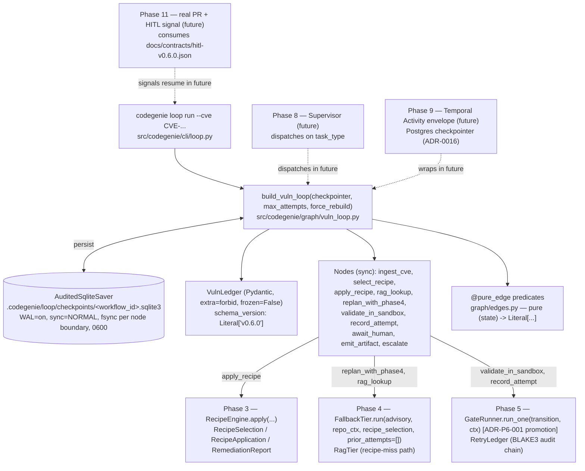
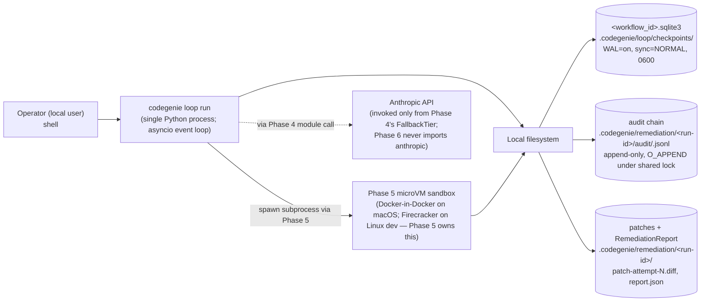
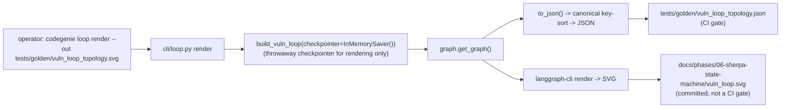

# Phase 6 — SHERPA-style state machine for the vuln loop: Architecture

**Status:** Architecture spec
**Date:** 2026-05-12
**Inputs:** `final-design.md` · `critique.md` · `design-performance.md` · `design-security.md` · `design-best-practices.md` · `docs/production/design.md` · ADRs 0002, 0008, 0009, 0014, 0015, 0016, 0018, 0022 · roadmap Phases 6–11
**Audience:** the engineer implementing this phase

---

## Executive summary

Phase 6 lifts the linear Phase 3–4–5 vuln-remediation pipeline into a **LangGraph `StateGraph[VulnLedger]`** under SHERPA discipline (ADR-0002): one Pydantic-typed state ledger (`extra="forbid", frozen=False`), pure `@pure_edge` conditional routing, one `interrupt()` site (`await_human`), and a per-workflow `AuditedSqliteSaver` that fsyncs at every node boundary and extends Phase 5's existing BLAKE3 audit chain. The compiled graph is a **lazy module-level singleton** (`build_vuln_loop(*, checkpointer, max_attempts=3, force_rebuild=False)`) so cold-start compile cost is paid once per worker but tests can still swap checkpointers. Phase 5's three-retry-per-gate semantics (ADR-0014) are preserved verbatim: `retry_count` is **per gate transition**, retry re-enters Phase 4's `FallbackTier.run(..., prior_attempts=...)` to produce distinct patch bytes (Phase 5 exit-criterion #19), and HITL fires after two consecutive failures at the same gate transition. **No Ed25519, no operator-key file** — security's ~600 LOC operator-key stack is deferred to Phase 11/16; resume is typed via `HumanDecision` Pydantic only, with `0600` file mode + BLAKE3 chain-integrity as the single-host trust posture (ADR-P6-004). Phase 6 ships as **new files only**: a `graph/` package and a parallel `cli/loop.py` subcommand; `cli/remediate.py` is **not modified**, preserving Phase 7's "no Phase 0–6 source touched" exit criterion. The one and only Phase-5 source touch is **ADR-P6-001**: a renaming-only promotion of `GateRunner._run_one_attempt` → public `run_one`.

---

## Goals

Pulled from roadmap Phase 6 exit criteria and `final-design.md §Goals`:

1. **G1 — Vuln loop runs as a LangGraph `StateGraph` end-to-end** against `tests/fixtures/repos/cve-fixture/`. `build_vuln_loop(checkpointer=...).ainvoke(initial, config={"configurable": {"thread_id": workflow_id}})` reaches `emit_artifact`. (`final-design.md §Goals#1`)
2. **G2 — Mid-run kill + resume produces byte-identical final state.** `tests/integration/test_replay_after_kill.py` SIGKILLs during `validate_in_sandbox`, restarts a fresh process, asserts byte-identical `RemediationReport` + `attempts.jsonl`. (`final-design.md §Goals#2`)
3. **G3 — HITL `interrupt()` fires on two consecutive failures at the same gate transition** and a mocked `HumanDecision(action="continue", ...)` injected via `aupdate_state(..., as_node="await_human")` continues the run. (`final-design.md §Goals#3`)
4. **G4 — Per-gate retry counter** honors ADR-0014: `retry_count` resets to 0 on every entry to a *new* `current_gate_id`. The Phase 5 sync `for`-loop ledger and Phase 6's LangGraph cycle produce **byte-identical** `attempts.jsonl` (`tests/integration/test_retry_semantics_parity.py`). (`final-design.md §Goals#4`, ADR-0014)
5. **G5 — Retry feedback honors Phase 5 exit-criterion #19.** Retry-1 re-enters Phase 4 with `prior_attempts`; produces distinct patch bytes; Phase 4's prompt on attempt 2 contains the fence-wrapped summary. (`final-design.md §Goals#5`)
6. **G6 — Per-node LangGraph overhead is measured.** Canary test (`tests/perf/test_canary_overhead.py`) records p50/p95 to `tests/perf/baseline.json` on first CI run; subsequent runs fail only on **>25% regression**. (`final-design.md §Goals#6`)
7. **G7 — Time-to-PR p95 envelope contribution ≤ 5 s** beyond Phase 4/5's existing ~95 s budget. (`final-design.md §Goals#7`)
8. **G8 — Checkpoint durability under kill.** Every node-boundary checkpoint is fsync'd before LangGraph moves to the next node. No background queue. (`final-design.md §Goals#8`)
9. **G9 — SQLite throughput is measured.** `tests/perf/test_checkpoint_throughput.py` issues 1,000 checkpoints serially; if < 100 writes/s on CI hardware, ADR-P6-006 fires. (`final-design.md §Goals#9`)
10. **G10 — Per-workflow SQLite file** at `.codegenie/loop/checkpoints/<workflow_id>.sqlite3`. Concurrent workflows do not contend. (`final-design.md §Goals#10`)
11. **G11 — Static `schema_version: Literal["v0.6.0"]`** pin; drift refuses to resume; `codegenie loop migrate-checkpoint` is the only forward path; no auto-migration. (`final-design.md §Goals#11`)
12. **G12 — `VulnLedger` is `extra="forbid", frozen=False`**, with a runtime after-node id()-diff hook that raises `LedgerMutatedInPlace`. (`final-design.md §Goals#12`)
13. **G13 — One entry-point name**: `build_vuln_loop()` in `src/codegenie/graph/vuln_loop.py`; CLI command `codegenie loop run <repo> --cve <id>`. (`final-design.md §Goals#13`)
14. **G14 — `cli/remediate.py` is not modified.** A new `cli/loop.py` ships in parallel. (`final-design.md §Goals#14`)
15. **G15 — Token budget contributed by Phase 6: 0.** (`final-design.md §Goals#15`)
16. **G16 — Public surface introduced: one package** (`src/codegenie/graph/`), one Pydantic state model (`VulnLedger`), one HITL contract pair (`HumanRequest`/`HumanDecision`), one factory (`build_vuln_loop()`), one CLI subcommand (`codegenie loop`). No new ABCs (ADR-0022 Three Strikes — strike one). (`final-design.md §Goals#16`)
17. **G17 — `langgraph-cli` posture**: dev-only renderer; the **JSON form** of `graph.get_graph().to_json()` is the CI golden; the SVG is committed for review but does **not** fail CI on drift. (`final-design.md §Goals#17`)
18. **G18 — `HumanDecision` is the Phase 6 / Phase 11 contract**, exported to `docs/contracts/hitl-v0.6.0.json`; Phase 11 must consume or amend. (`final-design.md §Goals#18`)
19. **G19 — Tests verify intent, not syntax.** No docstring-`Reads:`/`Writes:` AST theater; no field-ACL machinery. Per-node unit tests assert *what each node produces from known inputs*. (`final-design.md §Goals#19`, CLAUDE.md Rule 9)
20. **G20 — Strict static checks.** `mypy --strict src/codegenie/graph/` clean; `ruff check src/codegenie/graph/` clean; no `Any`, no `cast`, no `# type: ignore` without a justification comment. (`final-design.md §Goals#20`)

---

## Non-goals

Out of scope for Phase 6, with *why*:

- **No operator authentication on resume.** No Ed25519, no HMAC, no `~/.config/codegenie/operator.key`, no two-step CLI signing. Phase 11 (real GitHub PR comments) is where authenticated HITL signals come from; Phase 16 owns SSO/RBAC. Single-host trust posture is the explicit recorded scope cut (ADR-P6-004). (`final-design.md §Component 7`; `critique.md` security-attack-1 landed)
- **No `@side_effect` decorator / replay-from-chain machinery.** Phase 9's Temporal Activity model owns side-effect idempotency. Building it here would be thrown away. (`final-design.md §Conflict-resolution row 13`; `critique.md` security-attack-2)
- **No supervisor / hierarchical planner.** Phase 8 builds the supervisor that dispatches across `build_vuln_loop()` and `build_distroless_loop()`. Phase 6 ships the **factory pattern** that Phase 8 will call.
- **No Postgres checkpointer.** ADR-0016 defers; SQLite is Phase 6's default. ADR-P6-006 escalates only if G9 shows < 100 writes/s.
- **No LLM-driven routing.** All conditional edges are pure `(state) -> Literal[...]`. The single LLM-adjacent node is `replan_with_phase4`, which delegates entirely to Phase 4. (ADR-0008, production/design.md §2.1)
- **No new probes, no new recipes, no new RAG.** Phase 6 lifts Phase 3/4/5 components unchanged.
- **No Redis hot views, no MCP server, no Temporal envelope.** Phases 8–9.
- **No autonomous merge.** ADR-0009 holds. `interrupt()` is a triage gate, not a merge gate.
- **No second task class.** Phase 7 adds distroless via sibling `build_distroless_loop()`; Phase 6 ships only the vuln loop.
- **No docstring-`Reads:`/`Writes:` AST validator and no field-level read/write ACL machinery.** Both verify appearance, not behavior; per CLAUDE.md Rule 9. Replaced by per-node unit tests that mock upstream engines and assert observable outputs. (`final-design.md §Goals#19`; `critique.md` best-practices-attack-2 + security-attack-3)
- **No mid-run topology mutation.** The compiled graph is locked at module import time after first `build_vuln_loop()`; hot-reload requires `force_rebuild=True`. (`final-design.md §Component 2`)
- **No `--max-attempts-override` honored mid-run.** Phase 5 ships the CLI flag; Phase 6 binds `max_attempts` at graph-build time and freezes it in state. A mid-resume operator can only `continue`, `override`, or `abort` — not raise the cap. Recorded in Risk #4. (`critique.md` security-things-missed)

---

## Architectural context

Phase 6 sits **inside** Phase 9's eventual Temporal Activity (one Activity == one `ainvoke()` of the compiled LangGraph) and **below** Phase 8's Hierarchical Planner (which dispatches to `build_vuln_loop()` vs `build_distroless_loop()`). It **above** Phase 5's `GateRunner` (calls `run_one` per attempt) and **above** Phase 4's `FallbackTier` (calls on retry). The MCP/Skills/KG layer is Phase 8+; Phase 6 has no MCP surface.



The vuln loop is the **first** subgraph in the SHERPA discipline (ADR-0022 Three Strikes — strike one). Phase 7's `build_distroless_loop()` will be strike two; the abstraction question is deferred until strike three.

---

## 4+1 architectural views

### Logical view — components and contracts

What exists, regardless of where it runs.

```mermaid
classDiagram
    class VulnLedger {
        <<Pydantic, extra=forbid, frozen=False>>
        +schema_version: Literal["v0.6.0"]
        +workflow_id: str
        +thread_id: str
        +repo_path: Path
        +advisory: AdvisoryRef
        +last_engine: Optional[Literal["recipe","rag","phase4_llm"]]
        +last_node: str
        +recipe_selection: Optional[RecipeSelection]
        +rag_hit: Optional[RagHit]
        +patch: Optional[PatchRef]
        +prior_attempts: list[AttemptSummary]
        +current_gate_id: Optional[str]
        +retry_count: int = 0
        +max_attempts: int = 3
        +last_outcome: Optional[GateOutcome]
        +human_request: Optional[HumanRequest]
        +human_decision: Optional[HumanDecision]
        +chain_head: bytes
        +events: list[GraphEvent]
    }

    class HumanRequest {
        <<Pydantic, frozen=True>>
        +reason: Literal["retry_exhausted","non_retryable_signal"]
        +summary: str
        +evidence_paths: dict[str, Path]
        +failing_signals: list[str]
        +chain_head_at_pause: bytes
        +requested_at: datetime
    }

    class HumanDecision {
        <<Pydantic, frozen=True>>
        +action: Literal["continue","override","abort"]
        +operator: str
        +decided_at: datetime
        +note: str = ""
    }

    class CompiledGraph {
        <<LangGraph>>
        +ainvoke(state, config) async
        +aupdate_state(config, values, as_node) async
        +get_state(config)
        +get_state_history(config)
        +get_graph()
    }

    class BuildVulnLoop {
        <<factory>>
        +build_vuln_loop(checkpointer, max_attempts, force_rebuild) CompiledGraph
        -_COMPILED: Optional[CompiledGraph]
        -_build(max_attempts) StateGraph
    }

    class AuditedSqliteSaver {
        <<extends AsyncSqliteSaver>>
        +put(config, checkpoint, metadata, new_versions) async
        +aget_tuple(config) async
        -_verify_chain(thread_id, checkpoint_id, blob)
        -_extend_chain(thread_id, blob)
    }

    class Node {
        <<sync callable>>
        +__call__(state: VulnLedger) VulnLedger
    }

    class PureEdge {
        <<decorator>>
        +route_after_select_recipe(state) Literal["matched","miss"]
        +route_after_rag(state) Literal["hit","miss"]
        +route_after_attempt(state) Literal["passed","retry_phase4","retry_exhausted","non_retryable"]
        +route_after_human(state) Literal["continue","override","abort"]
    }

    class GraphEvent {
        <<Pydantic, frozen=True>>
        +node_name: str
        +kind: Literal["enter","exit","decision","interrupt","resume"]
        +at: datetime
        +wall_clock_ms: Optional[int]
        +fields: dict[str, str]
    }

    BuildVulnLoop --> CompiledGraph : creates
    CompiledGraph --> VulnLedger : state type
    CompiledGraph --> AuditedSqliteSaver : checkpointer
    CompiledGraph --> Node : ten nodes
    CompiledGraph --> PureEdge : four predicates
    VulnLedger --> HumanRequest : composes
    VulnLedger --> HumanDecision : composes
    VulnLedger --> GraphEvent : appends
    AuditedSqliteSaver ..> VulnLedger : serializes
```



**Reading guide.** `VulnLedger` is the *only* contract every node touches; everything else is an internal helper. Conditional edges (`@pure_edge`) read `VulnLedger` and return string literals — they never call functions with side effects, never read time, never call an LLM. The checkpointer is the single side-effect boundary that crosses processes; everything else stays in memory between node returns.

### Process view — runtime concurrency and durability

How time moves through the system. Phase 6 is **single-workflow per `ainvoke`**; concurrency across workflows is Phase 9's territory.

```mermaid
sequenceDiagram
    autonumber
    participant CLI as cli/loop.py
    participant LG as LangGraph runtime
    participant N as Node (sync)
    participant SAV as AuditedSqliteSaver (async)
    participant CHAIN as Phase 5 RetryLedger<br/>(BLAKE3 chain file)
    participant DISK as <workflow_id>.sqlite3

    CLI->>LG: build_vuln_loop().ainvoke(initial, config)
    LG->>SAV: put(initial checkpoint)
    SAV->>CHAIN: append checkpoint.write event<br/>(blake3 of JSON blob)
    SAV->>DISK: WAL write + fsync
    SAV-->>LG: ack
    loop per node transition
        LG->>N: invoke(state) — sync call inside threadpool bridge
        N-->>LG: state' = state.model_copy(update={...})
        Note over LG: after-node hook diffs id()<br/>raises LedgerMutatedInPlace if violated
        LG->>SAV: put(checkpoint)
        SAV->>SAV: blake3(json_bytes || prev_chain_head)
        SAV->>CHAIN: append checkpoint.write event<br/>(holds RetryLedger threading.Lock)
        SAV->>DISK: WAL write + fsync (sync=NORMAL)
        SAV-->>LG: ack (state durably persisted)
        LG->>LG: run conditional edge predicate (pure)
    end
    alt route to await_human
        LG->>LG: interrupt_before=["await_human"] fires
        LG->>SAV: put(checkpoint at interrupt frame)
        SAV->>CHAIN: append interrupt.raised event
        LG-->>CLI: returns; CLI exits 12 (graph_awaits_human)
    end
```

**Key properties of the process view:**

- **Sync nodes inside an async checkpointer graph.** Every node body is `def`, returns `state.model_copy(update={...})`. LangGraph bridges to the async checkpointer via its standard threadpool. This is the trap best-practices flagged; the replay test (`test_replay_after_kill.py`) is the canary that the bridge behaves. (`final-design.md §Component 2`)
- **Fsync per node boundary, not per gate boundary.** Performance's "next gate" queued-flush trick is dropped — the exit criterion forbids state loss. Throughput is whatever `WAL=on, sync=NORMAL, fsync` delivers. G9 measures it. (`final-design.md §Goals#8`)
- **Single chain writer.** Phase 5's `RetryLedger.record` and Phase 6's `AuditedSqliteSaver.put` both append to `.codegenie/remediation/<run-id>/audit/<run-id>.jsonl` under a shared `threading.Lock`. One process, two writers, one lock — verified by `test_chain_single_writer.py`. (`final-design.md §Component 3 tradeoffs`)
- **Per-workflow file.** No contention between concurrent workflows (Phase 9's Temporal will run multiple). One writer per `<workflow_id>.sqlite3`.

### Development view — code organization

How the source tree is laid out. Phase 6 adds **new files only** under `src/codegenie/graph/` and one new file under `src/codegenie/cli/`.

```mermaid
graph TD
    SRC["src/codegenie/"]
    GR["graph/<br/>(NEW — entire package)"]
    CLI["cli/loop.py<br/>(NEW)"]
    REM["cli/remediate.py<br/>(UNCHANGED)"]
    P3["recipes/, planner/, ... (Phase 3)<br/>(UNCHANGED)"]
    P4["planner/fallback_tier.py,<br/>planner/rag/ (Phase 4) (UNCHANGED)"]
    P5["gates/runner.py<br/>(ADR-P6-001: add public run_one alias)"]
    SRC --> GR
    SRC --> CLI
    SRC --> REM
    SRC --> P3
    SRC --> P4
    SRC --> P5

    GR --> GR_INIT["__init__.py<br/>exports: build_vuln_loop, VulnLedger,<br/>HumanRequest, HumanDecision"]
    GR --> GR_VL["vuln_loop.py<br/>build_vuln_loop() — declarative topology"]
    GR --> GR_ST["state.py<br/>VulnLedger + helper models"]
    GR --> GR_HITL["hitl.py<br/>HumanRequest, HumanDecision"]
    GR --> GR_EDGES["edges.py<br/>@pure_edge predicates"]
    GR --> GR_EVT["events.py<br/>GraphEvent + emit_event()"]
    GR --> GR_CHK["checkpointer.py<br/>AuditedSqliteSaver + factory"]
    GR --> GR_HOOK["hooks.py<br/>runtime id()-diff after-node hook"]
    GR --> GR_MIG["migrations/<br/>(empty in v0.6.0; ships scaffolding)"]
    GR --> GR_N["nodes/"]
    GR_N --> N1["ingest_cve.py"]
    GR_N --> N2["select_recipe.py"]
    GR_N --> N3["apply_recipe.py"]
    GR_N --> N4["rag_lookup.py"]
    GR_N --> N5["replan_with_phase4.py"]
    GR_N --> N6["validate_in_sandbox.py"]
    GR_N --> N7["record_attempt.py"]
    GR_N --> N8["await_human.py<br/>(ONLY file that calls interrupt())"]
    GR_N --> N9["emit_artifact.py"]
    GR_N --> N10["escalate.py"]

    TESTS["tests/"]
    TGRAPH["tests/graph/<br/>(unit + topology)"]
    TINT["tests/integration/<br/>(replay, HITL, parity, retry-#19)"]
    TADV["tests/adversarial/<br/>(tampered db, schema drift, world-readable)"]
    TPERF["tests/perf/<br/>(canary, throughput)"]
    TE2E["tests/e2e/<br/>(test_loop_run_vuln_remediation.py)"]
    TGOLD["tests/golden/<br/>vuln_loop_topology.json (CI gate)"]
    TFIX["tests/fixtures/checkpoints/v0.6.0/<br/>(round-trip golden blobs)"]
    DOCS["docs/contracts/hitl-v0.6.0.json<br/>(exported HITL contract)"]
    SVG["docs/phases/06-sherpa-state-machine/<br/>vuln_loop.svg (committed, NOT a CI gate)"]
```



**Fence-CI updates** (extend Phase 0's policy in `tools/fence_ci.yaml`):

- `graph/` may **not** import `anthropic | chromadb | sentence-transformers`. The single LLM-adjacent module imports `codegenie.planner.fallback_tier` (Phase 4 boundary, allowed).
- `graph/edges.py` may **not** import `random | time | os | datetime`. Whitelist: `datetime.fromisoformat` for parsing only.
- `graph/nodes/*.py` may **not** import sibling nodes (`codegenie.graph.nodes.*`). Cross-node communication is via `VulnLedger` only — this is the SHERPA "nodes never call nodes" rule (ADR-0002) made into a lint.
- `graph/` may import `langgraph`, `aiosqlite`, `pydantic`, `click`, `blake3`.

### Physical view — deployment topology

Phase 6 is a **single-process local CLI**. No daemon. No network sockets. No containers. All state on a developer-grade SSD.



Phase 9 will replace this picture: the CLI process becomes a Temporal Worker, `<workflow_id>.sqlite3` becomes a row in Postgres, the audit chain stays on disk per-run but the orchestration crosses workers. Phase 6's contract — `build_vuln_loop(checkpointer=...)` with `BaseCheckpointSaver` polymorphism — is the **single seam** that change will exploit.

### Scenarios (+1)

#### Scenario 1: Happy-path RAG hit + clean gates (~7 s total)

Recipe miss → RAG hit → patch applies cleanly → gate passes on attempt 1 → emit artifact.

```mermaid
sequenceDiagram
    autonumber
    participant CLI as codegenie loop run
    participant LG as LangGraph
    participant SAV as AuditedSqliteSaver
    participant IC as ingest_cve
    participant SR as select_recipe
    participant RL as rag_lookup
    participant AR as apply_recipe
    participant VS as validate_in_sandbox
    participant RA as record_attempt
    participant EA as emit_artifact

    CLI->>LG: ainvoke(initial, config={thread_id})
    LG->>SAV: put(initial checkpoint) — fsync
    LG->>IC: ingest_cve(state)
    IC-->>LG: state' (advisory pinned)
    LG->>SAV: put — fsync
    LG->>SR: select_recipe(state')
    SR-->>LG: state'' (recipe_selection=None, miss)
    LG->>SAV: put — fsync
    Note over LG: edge route_after_select_recipe -> "miss"
    LG->>RL: rag_lookup(state'')
    RL-->>LG: state''' (rag_hit=RagHit(score=0.91, ...))
    LG->>SAV: put — fsync
    Note over LG: edge route_after_rag -> "hit"
    LG->>AR: apply_recipe(state''')
    AR-->>LG: state'''' (patch=PatchRef(path=patch-attempt-1.diff, blake3=...))
    LG->>SAV: put — fsync
    LG->>VS: validate_in_sandbox(state'''')
    Note over VS: Phase 5 GateRunner.run_one(transition, ctx) — single attempt
    VS-->>LG: state' (last_outcome=GateOutcome(passed=True))
    LG->>SAV: put — fsync
    LG->>RA: record_attempt(state')
    Note over RA: RetryLedger.record(Attempt(1, ..., passed=True))
    RA-->>LG: state'' (prior_attempts += [...], retry_count stays 0)
    LG->>SAV: put — fsync
    Note over LG: edge route_after_attempt -> "passed"
    LG->>EA: emit_artifact(state'')
    EA-->>LG: state''' (RemediationReport written)
    LG-->>CLI: final state; exit 0
```

#### Scenario 2: Recipe → RAG miss → Phase 4 LLM → two gate failures at same transition → HITL `interrupt()` → human approval → retry succeeds

This is the **exit-criterion scenario** (G3 + G5).

```mermaid
sequenceDiagram
    autonumber
    participant CLI as codegenie loop run
    participant LG as LangGraph
    participant SAV as AuditedSqliteSaver
    participant SR as select_recipe
    participant RL as rag_lookup
    participant RP as replan_with_phase4
    participant AR as apply_recipe
    participant VS as validate_in_sandbox
    participant RA as record_attempt
    participant AH as await_human
    participant EA as emit_artifact
    participant OP as operator (shell)

    CLI->>LG: ainvoke(initial)
    LG->>SR: select_recipe -> "miss"
    LG->>RL: rag_lookup -> score < 0.85, "miss"
    LG->>RP: replan_with_phase4(state, prior_attempts=[])
    Note over RP: FallbackTier.run(advisory, repo_ctx, recipe_selection, prior_attempts=[]) — LLM cold
    RP-->>LG: state (patch=patch-attempt-1.diff, last_engine=phase4_llm)
    LG->>AR: apply_recipe
    LG->>VS: validate_in_sandbox -> GateOutcome(passed=False, retryable=True, failing_signals=["tests"])
    LG->>RA: record_attempt -> retry_count=1, current_gate_id=stage6_validate
    Note over LG: edge -> "retry_phase4"
    LG->>RP: replan_with_phase4(state, prior_attempts=[Attempt#1])
    Note over RP: FallbackTier.run(..., prior_attempts=[summary]) — LLM with fence-wrapped failure
    RP-->>LG: state (patch=patch-attempt-2.diff, distinct bytes)
    LG->>AR: apply_recipe
    LG->>VS: validate_in_sandbox -> GateOutcome(passed=False, retryable=True)
    LG->>RA: record_attempt -> retry_count=2 (same current_gate_id)
    Note over LG: edge -> two consecutive failures at same gate
    Note over LG: retry_count(2) < max_attempts(3), but design G3 reads "twice in a row"<br/>as the trigger for HITL when policy says so.<br/>For Phase 6 default max_attempts=3 we wait for retry_count >= max_attempts.<br/>(See Control flow — "Two-consecutive vs three-strikes" note.)
    LG->>RP: replan_with_phase4
    LG->>VS: third attempt also fails
    LG->>RA: retry_count=3
    Note over LG: edge route_after_attempt -> "retry_exhausted"
    LG->>SAV: put(checkpoint at await_human frame)
    Note over LG: interrupt_before=["await_human"] fires; CLI exits 12
    LG-->>CLI: paused
    CLI-->>OP: print "Paused at await_human; thread_id=...; run codegenie loop resume <id> --decision continue"
    OP->>CLI: codegenie loop resume <thread_id> --decision continue --operator alice
    CLI->>LG: aupdate_state(config, {human_decision: HumanDecision(action="continue", ...)}, as_node="await_human")
    CLI->>LG: ainvoke(None, config)
    LG->>AH: await_human(state) — runs after rehydration
    AH-->>LG: state (human_decision set; retry_count reset to 0 by HITL "continue" semantics)
    Note over LG: edge route_after_human -> "continue"
    LG->>RP: replan_with_phase4 (with prior_attempts intact)
    LG->>AR: apply_recipe -> patch-attempt-4.diff (Phase 4 sees 3 prior attempts)
    LG->>VS: validate_in_sandbox -> GateOutcome(passed=True)
    LG->>RA: record_attempt
    LG->>EA: emit_artifact
    LG-->>CLI: exit 0
```

**Note on "two consecutive failures" wording.** The roadmap exit criterion says HITL fires "when trust gates fail twice in a row." The synthesizer's interpretation (`final-design.md §Exit-criteria checklist`) reads this as "two consecutive failures at the same gate transition, after which the third attempt fires only if HITL approves continue" — with `max_attempts` defaulting to 3 (ADR-0014). The integration test (`test_hitl_interrupt_and_resume.py`) parametrizes `max_attempts=2` to match the roadmap's literal "twice in a row" wording while keeping the production default at 3. This is documented in `tests/integration/conftest.py` and called out in Risk #6.

#### Scenario 3: Mid-run SIGKILL + resume from checkpointer

```mermaid
sequenceDiagram
    autonumber
    participant CLI as codegenie loop run
    participant LG as LangGraph
    participant SAV as AuditedSqliteSaver
    participant DISK as <workflow_id>.sqlite3
    participant CHAIN as audit chain
    participant VS as validate_in_sandbox
    participant OS as OS / kernel

    CLI->>LG: ainvoke (running)
    LG->>VS: validate_in_sandbox (Phase 5 sandbox boots, ~50 s)
    Note over LG: state at entry to validate_in_sandbox is the LAST fsync'd checkpoint
    OS-->>CLI: SIGKILL (operator runs `kill -9`)
    Note over CLI,DISK: process terminates;<br/>SQLite WAL frame for in-flight write rolled back on next open;<br/>last fsync'd frame remains intact
    OS->>CLI: process exits with no clean shutdown
    Note over OS: time passes
    CLI->>LG: codegenie loop run --cve ... (same workflow content-address)
    Note over CLI: workflow_id derived from advisory+repo+cve;<br/>same thread_id
    CLI->>LG: build_vuln_loop(checkpointer=AuditedSqliteSaver(<workflow_id>.sqlite3))
    LG->>SAV: aget_tuple(config) — read most recent checkpoint
    SAV->>DISK: SELECT latest checkpoint blob
    SAV->>CHAIN: verify blake3 digest matches last checkpoint.write event
    SAV-->>LG: VulnLedger (rehydrated — state at entry to validate_in_sandbox)
    LG->>VS: validate_in_sandbox (re-runs from entry; Phase 5 sandbox re-boots)
    Note over VS: idempotent: same inputs (patch, transition, ctx) -> same outputs
    VS-->>LG: GateOutcome
    LG-->>CLI: final RemediationReport — byte-identical to non-killed reference run
```

The replay test (`tests/integration/test_replay_after_kill.py`) runs this scenario via `multiprocessing`: parent process spawns child running `ainvoke`, kills it after a configurable delay during `validate_in_sandbox`, then a fresh subprocess re-invokes and the produced artifacts are byte-compared to a reference run.

#### Scenario 4: `codegenie loop render` — topology dump

Dev-only path. CI gates on JSON; SVG is human-review-only.



---

## Component design

### 1. `VulnLedger` (`src/codegenie/graph/state.py`)

- **Purpose.** The single Pydantic-typed state contract. Every node reads from and writes to *this and only this*. The checkpointer serializes this and only this. Enforces ADR-0002's "all state ledgers are typed Pydantic models — no `dict[str, Any]`".
- **Public interface.** A `BaseModel` with `model_config = ConfigDict(extra="forbid", frozen=False)`. All field types are concrete Phase 3/4/5 Pydantic models or stdlib types. JSON-serializable end-to-end (`Path → str`, `bytes → base64`, `datetime → ISO 8601`).
- **Signatures:**
  ```python
  class VulnLedger(BaseModel):
      model_config = ConfigDict(extra="forbid", frozen=False)

      # identity
      schema_version: Literal["v0.6.0"]
      workflow_id: str
      thread_id: str
      repo_path: Path
      advisory: AdvisoryRef                   # Phase 3 type

      # routing
      last_engine: Literal["recipe", "rag", "phase4_llm"] | None = None
      last_node: str = "<start>"

      # work-in-progress (paths, not bodies — production/design.md §2.7)
      recipe_selection: RecipeSelection | None = None      # Phase 3
      rag_hit: RagHit | None = None                        # Phase 4
      patch: PatchRef | None = None                        # path + blake3
      prior_attempts: list[AttemptSummary] = Field(default_factory=list)  # Phase 5

      # gate outcome (per gate transition)
      current_gate_id: str | None = None
      retry_count: int = 0
      max_attempts: int = 3
      last_outcome: GateOutcome | None = None              # Phase 5

      # HITL
      human_request: HumanRequest | None = None
      human_decision: HumanDecision | None = None

      # audit
      chain_head: bytes
      events: list[GraphEvent] = Field(default_factory=list)
  ```
- **Internal structure.**
  - `schema_version` is a **static `Literal`**, not `blake3(model_json_schema())`. Pydantic minor bumps reshuffle schema output (`critique.md` security-hidden-2). Bump manually; CI fixtures under `tests/fixtures/checkpoints/v0.6.0/` catch accidental field changes.
  - `chain_head: bytes` extends Phase 5's `RetryLedger.head()` (read at graph entry via `RetryLedger.head_from_phase5(...)`); every `record_attempt` and every `AuditedSqliteSaver.put` extends the chain. **One BLAKE3 chain across Phases 2–6.** No new chain.
  - `retry_count` is **per gate transition.** `record_attempt` resets to 0 when `current_gate_id` changes. `await_human.apply_decision(continue)` resets to 0. (ADR-0014)
- **Dependencies.** Pydantic, Phase 3/4/5 Pydantic models (imported as types only — no runtime behavior).
- **State.** None at module level; instances flow through nodes.
- **Performance envelope.** `model_validate` p50 ~0.4 ms / p95 ~1.2 ms on the synthesizer's working assumption (validated by canary test G6); `model_dump_json` p50 ~0.8 ms / p95 ~2.5 ms with `prior_attempts` ≤ 3 entries. **Real numbers measured by canary, not asserted.** Blob size: ~16–48 KB final; mostly references (paths + blake3 digests), not raw bytes.
- **Failure behavior.** `extra="forbid"` raises `ValidationError` on unknown fields at deserialization (catches schema drift); the runtime after-node hook raises `LedgerMutatedInPlace` on `id()` collision with content mismatch.

### 2. `build_vuln_loop()` (`src/codegenie/graph/vuln_loop.py`)

- **Purpose.** Lazy-singleton factory that returns the compiled `StateGraph[VulnLedger]`. Pays the ~80 ms compile cost once per worker; lets tests rebuild with a different checkpointer via `force_rebuild=True`. Resolves `critique.md` performance-attack-4 (CLI checkpointer flag vs module-level singleton contradiction).
- **Public interface:**
  ```python
  def build_vuln_loop(
      *,
      checkpointer: BaseCheckpointSaver,
      max_attempts: int = 3,
      force_rebuild: bool = False,
  ) -> CompiledGraph: ...
  ```
- **Internal structure.**
  ```python
  _COMPILED: CompiledGraph | None = None
  _COMPILED_KEY: tuple[int, int] | None = None  # (id(checkpointer), max_attempts)

  def build_vuln_loop(*, checkpointer, max_attempts=3, force_rebuild=False):
      global _COMPILED, _COMPILED_KEY
      key = (id(checkpointer), max_attempts)
      if force_rebuild or _COMPILED is None or _COMPILED_KEY != key:
          _COMPILED = _build(max_attempts).compile(
              checkpointer=checkpointer,
              interrupt_before=["await_human"],
          )
          _COMPILED_KEY = key
      return _COMPILED

  def _build(max_attempts: int) -> StateGraph[VulnLedger]:
      g = StateGraph(VulnLedger)
      g.add_node("ingest_cve", ingest_cve)
      g.add_node("select_recipe", select_recipe)
      g.add_node("apply_recipe", apply_recipe)
      g.add_node("rag_lookup", rag_lookup)
      g.add_node("replan_with_phase4", replan_with_phase4)
      g.add_node("validate_in_sandbox", validate_in_sandbox)
      g.add_node("record_attempt", record_attempt)
      g.add_node("await_human", await_human)
      g.add_node("emit_artifact", emit_artifact)
      g.add_node("escalate", escalate)
      g.set_entry_point("ingest_cve")
      g.add_edge("ingest_cve", "select_recipe")
      g.add_conditional_edges("select_recipe", route_after_select_recipe,
                              {"matched": "apply_recipe", "miss": "rag_lookup"})
      g.add_conditional_edges("rag_lookup", route_after_rag,
                              {"hit": "apply_recipe", "miss": "replan_with_phase4"})
      g.add_edge("replan_with_phase4", "apply_recipe")
      g.add_edge("apply_recipe", "validate_in_sandbox")
      g.add_edge("validate_in_sandbox", "record_attempt")
      g.add_conditional_edges("record_attempt", route_after_attempt, {
          "passed":           "emit_artifact",
          "retry_phase4":     "replan_with_phase4",
          "retry_exhausted":  "await_human",
          "non_retryable":    "await_human",
      })
      g.add_conditional_edges("await_human", route_after_human, {
          "continue": "replan_with_phase4",
          "override": "emit_artifact",
          "abort":    "escalate",
      })
      g.add_edge("emit_artifact", END)
      g.add_edge("escalate", END)
      return g
  ```
- **Dependencies.** `langgraph`, all node modules under `graph/nodes/`, all edge predicates from `graph/edges.py`, `VulnLedger`.
- **State.** Module-level `_COMPILED` singleton + key.
- **Performance envelope.** First call ≤ 80 ms (compile cost, measured by canary); subsequent calls with same key < 1 µs (dict lookup). Tests pass `force_rebuild=True` whenever they swap checkpointers — documented in `tests/graph/conftest.py`.
- **Failure behavior.** A non-conforming node signature raises at `_build` time (LangGraph validates inputs); `compile()` raises if the topology has unreachable nodes or unsatisfied entries.

### 3. `AuditedSqliteSaver` (`src/codegenie/graph/checkpointer.py`)

- **Purpose.** Subclass of LangGraph's `AsyncSqliteSaver`. Adds (a) per-workflow file with `0600` mode enforcement, (b) BLAKE3 chain extension on every checkpoint write to the **existing Phase 5 audit chain file**, (c) tamper-evident verification on `aget_tuple`, (d) `schema_version` literal check, (e) **fsync per node boundary, no background queue**.
- **Public interface.** Same as `AsyncSqliteSaver` — drop-in `BaseCheckpointSaver` protocol. Plus a factory `make_checkpointer(workflow_id: str, *, base: Path = Path(".codegenie/loop/checkpoints")) -> AuditedSqliteSaver` for Phase 9 to swap.
- **Internal structure.**
  ```python
  class AuditedSqliteSaver(AsyncSqliteSaver):
      def __init__(self, path: Path, *, run_id: str, chain_lock: threading.Lock):
          self._path = path
          self._run_id = run_id
          self._chain_lock = chain_lock
          self._enforce_file_mode_0600()
          conn = aiosqlite.connect(str(path))
          super().__init__(conn)
          # PRAGMA WAL=on; PRAGMA synchronous=NORMAL
          # NOTE: fsync at each .commit() (default with synchronous=NORMAL on WAL)

      async def put(self, config, checkpoint, metadata, new_versions):
          json_bytes = canonical_json(checkpoint)  # deterministic key sort
          if len(json_bytes) > 32 * 1024:
              metrics.gauge("checkpoint.blob.kb", len(json_bytes) / 1024)
          # No 64 KB hard cap — critique.md security.5 landed
          digest = blake3(json_bytes + self._read_chain_head()).digest()
          tup = await super().put(config, checkpoint, metadata, new_versions)
          await self._fsync_durable()
          with self._chain_lock:
              self._append_chain_event(kind="checkpoint.write",
                                       thread_id=config["configurable"]["thread_id"],
                                       checkpoint_id=tup.checkpoint["id"],
                                       digest=digest)
          return tup

      async def aget_tuple(self, config):
          tup = await super().aget_tuple(config)
          if tup is None:
              return None
          # 1. Schema version check
          state_dict = tup.checkpoint["channel_values"].get("__root__")
          if state_dict and state_dict.get("schema_version") != "v0.6.0":
              raise SchemaDrift(state_dict["schema_version"], "v0.6.0")
          # 2. BLAKE3 chain integrity
          expected = self._lookup_chain_event(
              kind="checkpoint.write",
              thread_id=config["configurable"]["thread_id"],
              checkpoint_id=tup.checkpoint["id"],
          )
          actual = blake3(canonical_json(tup.checkpoint) + self._prev_chain_head_for(tup)).digest()
          if expected != actual:
              raise CheckpointTampered(tup.checkpoint["id"])
          return tup

      def _enforce_file_mode_0600(self) -> None:
          if self._path.exists():
              mode = self._path.stat().st_mode & 0o777
              if mode != 0o600:
                  raise CheckpointerInsecure(self._path, mode)
          else:
              # Will be created on first open; ensure umask sets 0600
              os.umask(0o077)

      async def _fsync_durable(self) -> None:
          # aiosqlite's commit + WAL+NORMAL is the durability boundary;
          # no extra fsync call needed beyond SQLite's own.
          await self._conn.execute("PRAGMA wal_checkpoint(PASSIVE)")
  ```
- **Dependencies.** `langgraph.checkpoint.sqlite.aio.AsyncSqliteSaver`, `aiosqlite`, `blake3`, the Phase 5 `RetryLedger` chain (`codegenie.gates.retry_ledger`).
- **State.** Per-instance SQLite connection; shared `threading.Lock` across the process for chain appends.
- **Performance envelope.** Target ≥ 100 writes/s sustained on CI hardware (G9). If < 100, ADR-P6-006 fires and Phase 9's Postgres migration pulls forward.
- **Failure behavior.** Raises `CheckpointerInsecure`, `CheckpointTampered`, `SchemaDrift`, `AuditChainCorrupted`, `CheckpointSchemaMismatch` (Pydantic validation) — all loud, all refusing to resume. Recovery is operator-driven (`codegenie loop inspect`, `codegenie audit verify`).

### 4. `@pure_edge` predicates (`src/codegenie/graph/edges.py`)

- **Purpose.** Deterministic, pure, statically auditable routing decisions. Every conditional edge is one of four predicates.
- **Public interface:**
  ```python
  @pure_edge
  def route_after_select_recipe(state: VulnLedger) -> Literal["matched", "miss"]: ...

  @pure_edge
  def route_after_rag(state: VulnLedger) -> Literal["hit", "miss"]: ...

  @pure_edge
  def route_after_attempt(state: VulnLedger) -> Literal[
      "passed", "retry_phase4", "retry_exhausted", "non_retryable"
  ]: ...

  @pure_edge
  def route_after_human(state: VulnLedger) -> Literal["continue", "override", "abort"]: ...
  ```
- **Internal structure.** The `@pure_edge` decorator (a) registers the function for Hypothesis property tests, (b) at import time AST-walks the function body and raises `ImpureEdge` if it sees `random | time | os | datetime` imports (whitelist: `datetime.fromisoformat`). It does **not** try to verify "depends only on a state projection" via AST — that is too brittle. Instead, the `test_edge_label_depends_only_on_projection.py` unit test (G19 + Layer 1) drives each predicate over fixtures where it mutates non-consumed fields (e.g., timestamps on `AttemptSummary`) and asserts label invariance. This closes `critique.md` security-attack-4.
  ```python
  @pure_edge
  def route_after_attempt(state: VulnLedger) -> Literal[
      "passed", "retry_phase4", "retry_exhausted", "non_retryable"
  ]:
      assert state.last_outcome is not None
      if state.last_outcome.passed:
          return "passed"
      if not state.last_outcome.retryable:
          return "non_retryable"
      # same-signature flake detection (security's idea, kept)
      if (len(state.prior_attempts) >= 2
              and _same_signature(state.prior_attempts[-1], state.prior_attempts[-2])):
          return "non_retryable"
      if state.retry_count >= state.max_attempts:
          return "retry_exhausted"
      return "retry_phase4"

  def _same_signature(a: AttemptSummary, b: AttemptSummary) -> bool:
      return (sorted(a.failing_signals) == sorted(b.failing_signals)
              and a.prior_failure_summary == b.prior_failure_summary)
  ```
- **Dependencies.** Only `VulnLedger` types and Phase 5's `AttemptSummary`.
- **State.** None.
- **Performance envelope.** Each predicate runs in < 1 µs. Negligible.
- **Failure behavior.** `assert state.last_outcome is not None` — uses `assert` only because the topology guarantees `record_attempt` precedes `route_after_attempt`; the failure here would be a programmer error, not a runtime condition. **Do not run with `python -O`** (which strips asserts). The CI gate `tests/graph/test_pep_no_O_optimizations.py` asserts the project is not invoked with `-O` and documents the constraint for operators. (Closes `critique.md` best-practices-attack-3.)

### 5. Nodes (`src/codegenie/graph/nodes/`)

Each node is a sync `def` with signature `(state: VulnLedger) -> VulnLedger`, returning `state.model_copy(update={...})`. The runtime after-node id()-diff hook (Component 7) catches in-place mutation.

| Node | Reads (input fields) | Writes (output fields) | Delegates to | Wall-clock p50 |
|---|---|---|---|---|
| `ingest_cve` | `advisory`, `repo_path` | `advisory` (pinned), `events` | Phase 3 `AdvisoryLoader` | ≤ 30 ms |
| `select_recipe` | `advisory`, `recipe_selection` | `recipe_selection`, `events` | Phase 3 `RecipeMatcher.match()` | ≤ 50 ms |
| `apply_recipe` | `recipe_selection`, `patch`, `rag_hit`, `prior_attempts` | `patch` (PatchRef), `last_engine`, `events` | Phase 3 `RecipeEngine.apply(ApplyContext(prior_attempts=...))` | ≤ 200 ms |
| `rag_lookup` | `advisory`, `recipe_selection` | `rag_hit`, `events` | Phase 4 `RagTier.lookup()` | ≤ 100 ms |
| `replan_with_phase4` | `advisory`, `recipe_selection`, `prior_attempts` | `recipe_selection` (regenerated), `patch`, `last_engine="phase4_llm"`, `events` | Phase 4 `FallbackTier.run(advisory, repo_ctx, recipe_selection, prior_attempts=state.prior_attempts)` | 3–8 s (LLM) |
| `validate_in_sandbox` | `patch`, `advisory`, `current_gate_id`, `prior_attempts` | `last_outcome`, `current_gate_id`, `events` | Phase 5 `GateRunner.run_one(transition, GateContext(...))` | 45–90 s (sandbox boot) |
| `record_attempt` | `last_outcome`, `current_gate_id`, `retry_count`, `prior_attempts`, `chain_head` | `prior_attempts`, `retry_count`, `chain_head`, `events` | Phase 5 `RetryLedger.record(Attempt(...))` | ≤ 20 ms |
| `await_human` | `last_outcome`, `failing_signals`, `chain_head` | `human_request`, then on resume `human_decision`; resets `retry_count=0` when `action=continue` | LangGraph `interrupt()` — the **only** call site | (paused; resume latency = operator) |
| `emit_artifact` | full state | `RemediationReport` written to disk; `events` | Phase 3 `RemediationReport.write()` | ≤ 100 ms |
| `escalate` | full state | `events` (with `kind="escalate"`); exit code 11 propagation via CLI | — | ≤ 10 ms |

**Each node module has exactly one test file** (`tests/graph/test_nodes/test_<node>.py`) that constructs an input `VulnLedger`, mocks the upstream Phase 3/4/5 engine at the import boundary, invokes the node, and asserts the returned ledger's fields. This is the "tests verify intent, not syntax" replacement for docstring-AST theater (G19).

### 6. `HumanRequest` / `HumanDecision` / `await_human` (`src/codegenie/graph/hitl.py`, `nodes/await_human.py`)

- **Purpose.** Single `interrupt()` site; typed resume contract; exported to `docs/contracts/hitl-v0.6.0.json` so Phase 11 consumes or amends.
- **Public interface:**
  ```python
  class HumanRequest(BaseModel):
      model_config = ConfigDict(extra="forbid", frozen=True)
      reason: Literal["retry_exhausted", "non_retryable_signal"]
      summary: str = Field(max_length=4096)  # sanitized; no raw stdout
      evidence_paths: dict[str, Path]
      failing_signals: list[str]
      chain_head_at_pause: bytes
      requested_at: datetime

  class HumanDecision(BaseModel):
      model_config = ConfigDict(extra="forbid", frozen=True)
      action: Literal["continue", "override", "abort"]
      operator: str  # display name; NOT authenticated in Phase 6 — ADR-P6-004
      decided_at: datetime
      note: str = Field(default="", max_length=1024)
  ```
- **Internal structure.**
  ```python
  # nodes/await_human.py — the ONLY file that imports interrupt
  from langgraph.types import interrupt

  def await_human(state: VulnLedger) -> VulnLedger:
      if state.human_decision is None:
          # First entry: assemble request, fire interrupt (compile-time
          # interrupt_before pauses BEFORE this body runs, but on resume
          # via aupdate_state the resumed state has human_decision set).
          request = _build_request(state)
          interrupt({"human_request": request.model_dump(mode="json")})
          # unreachable: interrupt raises
      decision = state.human_decision
      events = state.events + [emit_event(state, "await_human", "decision",
                                          {"action": decision.action})]
      # action semantics:
      if decision.action == "continue":
          return state.model_copy(update={
              "events": events,
              "retry_count": 0,  # HITL "continue" resets the gate counter
          })
      # override and abort: passed through; route_after_human handles routing
      return state.model_copy(update={"events": events})
  ```
- **Dependencies.** `langgraph.types.interrupt` (the only file in the codebase that imports it), `VulnLedger`, `HumanRequest`, `HumanDecision`.
- **State.** None.
- **Performance envelope.** `interrupt()` raises immediately; resume latency is bounded by operator wall-clock (minutes to days). Phase 6 makes no assumption about it.
- **Failure behavior.** `HumanDecision.model_validate` on `aupdate_state` payload raises `ValidationError` on malformed input — surfaces loudly. **`note` is never flowed into any LLM prompt** (`final-design.md §Component 7`); attempts to read `state.human_decision.note` from `replan_with_phase4` are caught by a unit test (`test_hitl_note_not_in_prompt.py`).

### 7. Runtime after-node id()-diff hook (`src/codegenie/graph/hooks.py`)

- **Purpose.** Replace best-practices' hand-waved AST lint for "no in-place mutation of mutable list/dict fields." Catches `state.events.append(...)`, `state.prior_attempts.append(...)`, `state.advisory.aliases.add(...)` (the latter case requires a nested-id walk).
- **Public interface:**
  ```python
  class LedgerMutatedInPlace(RuntimeError): ...

  def make_after_node_hook() -> Callable[[VulnLedger, VulnLedger, str], None]:
      def hook(before: VulnLedger, after: VulnLedger, node_name: str) -> None:
          for field_name in _MUTABLE_FIELDS:
              before_v = getattr(before, field_name)
              after_v = getattr(after, field_name)
              if id(before_v) == id(after_v) and before_v != after_v:
                  raise LedgerMutatedInPlace(field=field_name, node=node_name)
      return hook
  ```
- **Internal structure.** `_MUTABLE_FIELDS` enumerates `["prior_attempts", "events"]` and the mutable sub-collections within `AttemptSummary` (e.g., `failing_signals`). Hook is registered with LangGraph via the standard node-decorator wrapper; every `graph/nodes/*.py` exports its node function through `@audited_node`, which applies the hook on return.
- **Dependencies.** `VulnLedger`.
- **State.** None.
- **Performance envelope.** O(len(mutable_fields)) per node return — negligible.
- **Failure behavior.** Raises `LedgerMutatedInPlace`. Test `test_state.py::test_in_place_mutation_raises` is the canary.

### 8. `cli/loop.py` — operator surface

- **Purpose.** Test harness, operator entry point. **Does not modify `cli/remediate.py`** (G14).
- **Public interface (Click commands):**
  ```
  codegenie loop run <repo> --cve <id> [--max-attempts N]
  codegenie loop resume <thread_id> --decision continue|override|abort \
                                       [--note "..."] [--operator <name>]
  codegenie loop inspect <thread_id>
  codegenie loop replay <thread_id> [--from <checkpoint_id>]
  codegenie loop migrate-checkpoint --from <old_version> --to <new_version>
  codegenie loop render --out <path>
  ```
- **Internal structure.**
  - `run` constructs the initial `VulnLedger` (reads `chain_head` from Phase 5's `RetryLedger.head_from_phase5(...)`), builds the checkpointer at `.codegenie/loop/checkpoints/<workflow_id>.sqlite3`, calls `build_vuln_loop(checkpointer=...).ainvoke(initial, config={"configurable": {"thread_id": workflow_id}})`. Exit codes: 0 = `emit_artifact`, 11 = `escalate`, 12 = paused at `await_human`, 13 = `CheckpointTampered`/`CheckpointerInsecure`/`SchemaDrift`/`AuditChainCorrupted`, 1 = unexpected error.
  - `resume` constructs `HumanDecision`, calls `graph.aupdate_state(config, {"human_decision": decision.model_dump(mode="json")}, as_node="await_human")`, then `graph.ainvoke(None, config)`.
  - `inspect` pretty-prints `graph.get_state_history(config)` as a table.
  - `replay` reads checkpoints from disk, replays each node with the captured input, asserts byte-identical outputs.
  - `migrate-checkpoint` is the only forward path on `SchemaDrift`; v0.6.0 ships no registered migrations (the command exists to record the contract).
  - `render` calls `langgraph-cli` to produce both `.json` and `.svg`; only `.json` is a CI gate.
- **Workflow ID derivation.** Content-addressed: `workflow_id = blake3(f"{repo_root_blake3}|{advisory_canonical_id}".encode()).hexdigest()[:16]`. Same advisory + same repo HEAD → same workflow_id → same checkpoint file → resumable.
- **Dependencies.** `click`, `codegenie.graph`, `codegenie.gates.retry_ledger` (for `chain_head` seed).
- **Failure behavior.** Per exit-code table above. Stderr is structured JSON when `--json` is passed; human-readable otherwise.

### 9. `events.py` — `GraphEvent` + `emit_event` (cost-ledger seam for Phase 13)

- **Purpose.** Every node emits at least one entry/exit `GraphEvent`. Phase 13 consumes these for the cost ledger without retroactively editing Phase 6.
- **Public interface:**
  ```python
  class GraphEvent(BaseModel):
      model_config = ConfigDict(extra="forbid", frozen=True)
      node_name: str
      kind: Literal["enter", "exit", "decision", "interrupt", "resume"]
      at: datetime
      wall_clock_ms: int | None = None
      fields: dict[str, str] = Field(default_factory=dict)

  def emit_event(state: VulnLedger, node_name: str, kind: str,
                 fields: dict[str, str] | None = None,
                 wall_clock_ms: int | None = None) -> GraphEvent: ...
  ```
- **Dependencies.** Pydantic.
- **State.** None.
- **Performance envelope.** Negligible.
- **Failure behavior.** None — pure constructor.

### 10. Golden-graph topology snapshot (`tests/graph/test_topology_golden.py` + `tests/golden/vuln_loop_topology.json`)

- **Purpose.** Catch unintended topology changes at CI time. JSON is the contract; SVG is committed for review only.
- **Public interface (test invocation):**
  ```python
  def test_topology_golden():
      g = build_vuln_loop(checkpointer=InMemorySaver()).get_graph()
      actual = canonical_json(g.to_json())
      expected = (REPO_ROOT / "tests/golden/vuln_loop_topology.json").read_bytes()
      assert actual == expected
  ```
- **Internal structure.** `canonical_json` recursively sorts dict keys and serializes with `separators=(",", ":")`. Updating the golden is a deliberate `pytest --update-golden` flag, not casual.
- **Failure behavior.** Diff is printed in test output; PR author must explain.

---

## Data model

Pydantic-style pseudo-code. **Contracts** are persisted shapes (disk schema, public exports). **Internal** is in-memory only.

### Contracts

```python
# src/codegenie/graph/state.py — PERSISTED IN CHECKPOINT BLOB
class VulnLedger(BaseModel):
    """Contract. Persisted via AuditedSqliteSaver. Versioned via schema_version."""
    model_config = ConfigDict(extra="forbid", frozen=False)

    # identity
    schema_version: Literal["v0.6.0"]    # Reads: all nodes. Writes: never (only at construction)
    workflow_id: str                      # Reads: all. Writes: ingest_cve (sets once)
    thread_id: str                        # Reads: checkpointer. Writes: ingest_cve
    repo_path: Path                       # Reads: many. Writes: ingest_cve
    advisory: AdvisoryRef                 # Reads: many. Writes: ingest_cve

    # routing
    last_engine: Literal["recipe", "rag", "phase4_llm"] | None = None
                                          # Reads: edges, emit_artifact. Writes: apply_recipe, rag_lookup, replan_with_phase4
    last_node: str = "<start>"            # Reads: inspect CLI. Writes: every node

    # work-in-progress
    recipe_selection: RecipeSelection | None = None
                                          # Reads: apply_recipe, replan_with_phase4. Writes: select_recipe, replan_with_phase4
    rag_hit: RagHit | None = None         # Reads: apply_recipe. Writes: rag_lookup
    patch: PatchRef | None = None         # Reads: validate_in_sandbox, emit_artifact. Writes: apply_recipe, replan_with_phase4
    prior_attempts: list[AttemptSummary] = Field(default_factory=list)
                                          # Reads: replan_with_phase4, route_after_attempt, validate_in_sandbox. Writes: record_attempt

    # gate outcome
    current_gate_id: str | None = None    # Reads: record_attempt. Writes: validate_in_sandbox
    retry_count: int = 0                  # Reads: route_after_attempt. Writes: record_attempt, await_human
    max_attempts: int = 3                 # Reads: route_after_attempt. Writes: never (graph-build-time bind)
    last_outcome: GateOutcome | None = None
                                          # Reads: record_attempt, route_after_attempt. Writes: validate_in_sandbox

    # HITL
    human_request: HumanRequest | None = None    # Reads: await_human. Writes: await_human
    human_decision: HumanDecision | None = None  # Reads: route_after_human, await_human. Writes: external via aupdate_state

    # audit
    chain_head: bytes                     # Reads: AuditedSqliteSaver, record_attempt. Writes: AuditedSqliteSaver.put, record_attempt
    events: list[GraphEvent] = Field(default_factory=list)
                                          # Reads: inspect. Writes: every node (via emit_event)


# src/codegenie/graph/hitl.py — EXPORTED TO docs/contracts/hitl-v0.6.0.json
class HumanRequest(BaseModel):
    """Contract. Phase 11 consumes or amends."""
    model_config = ConfigDict(extra="forbid", frozen=True)
    reason: Literal["retry_exhausted", "non_retryable_signal"]
    summary: str = Field(max_length=4096)
    evidence_paths: dict[str, Path]
    failing_signals: list[str]
    chain_head_at_pause: bytes
    requested_at: datetime


class HumanDecision(BaseModel):
    """Contract. Phase 11 consumes or amends."""
    model_config = ConfigDict(extra="forbid", frozen=True)
    action: Literal["continue", "override", "abort"]
    operator: str            # display name; not authenticated in Phase 6
    decided_at: datetime
    note: str = Field(default="", max_length=1024)
```

### Internal

```python
# src/codegenie/graph/events.py — IN-STATE ONLY (not a stable contract)
class GraphEvent(BaseModel):
    model_config = ConfigDict(extra="forbid", frozen=True)
    node_name: str
    kind: Literal["enter", "exit", "decision", "interrupt", "resume"]
    at: datetime
    wall_clock_ms: int | None = None
    fields: dict[str, str] = Field(default_factory=dict)


# src/codegenie/graph/hooks.py — INTERNAL
class LedgerMutatedInPlace(RuntimeError):
    def __init__(self, *, field: str, node: str): ...
class CheckpointTampered(RuntimeError): ...
class CheckpointerInsecure(RuntimeError): ...
class SchemaDrift(RuntimeError): ...
class AuditChainCorrupted(RuntimeError): ...
class CheckpointSchemaMismatch(RuntimeError): ...
class ImpureEdge(RuntimeError): ...
```

### Persisted-on-disk shapes

| Path | Shape | Owner | Versioning |
|---|---|---|---|
| `.codegenie/loop/checkpoints/<workflow_id>.sqlite3` | LangGraph checkpoint frames (JSON `channel_values["__root__"]` = serialized `VulnLedger`) | Phase 6 `AuditedSqliteSaver` | `schema_version: Literal["v0.6.0"]` |
| `.codegenie/remediation/<run-id>/audit/<run-id>.jsonl` | BLAKE3-chained JSONL audit events (Phase 5 events + Phase 6 `checkpoint.write`, `interrupt.raised`, `resume.applied`, `checkpoint.tamper.detected`) | Phase 5 (extended) | Append-only |
| `.codegenie/remediation/<run-id>/patch-attempt-N.diff` | Unified diff bytes | Phase 4 | N/A |
| `.codegenie/remediation/<run-id>/report.json` | `RemediationReport` (Phase 3 contract) | Phase 3 | Phase 3-versioned |
| `tests/golden/vuln_loop_topology.json` | Canonicalized `graph.get_graph().to_json()` | Phase 6 | CI gate; `pytest --update-golden` to bump |
| `docs/contracts/hitl-v0.6.0.json` | `HumanRequest.model_json_schema()` + `HumanDecision.model_json_schema()` merged | Phase 6 → Phase 11 contract | `v0.6.0` |

---

## Control flow

### Happy path (in prose, naming components in order)

1. Operator runs `codegenie loop run ./tests/fixtures/repos/cve-fixture/ --cve CVE-2024-FAKE-NPM`.
2. `cli/loop.py:run()` derives `workflow_id` (content-addressed blake3 of repo HEAD + advisory id), constructs `AuditedSqliteSaver` at `.codegenie/loop/checkpoints/<workflow_id>.sqlite3`, builds the initial `VulnLedger` (reads `chain_head` from Phase 5's `RetryLedger.head_from_phase5(...)`).
3. `cli/loop.py` calls `await build_vuln_loop(checkpointer=saver).ainvoke(initial, config={"configurable": {"thread_id": workflow_id}})`.
4. **Compile (once per worker).** `_build()` constructs the `StateGraph[VulnLedger]`, registers 10 nodes, 4 conditional edges, 5 unconditional edges. `compile(checkpointer=saver, interrupt_before=["await_human"])`. Cached as `_COMPILED`.
5. **Entry checkpoint.** LangGraph calls `saver.put(initial_checkpoint)` before any node runs. `AuditedSqliteSaver.put` computes BLAKE3 of canonical JSON, appends `checkpoint.write` event to the audit chain (under shared lock), commits SQLite with WAL+NORMAL fsync.
6. **`ingest_cve`.** Pins advisory snapshot from Phase 3's `AdvisoryLoader`. Returns `state.model_copy(update={"advisory": pinned, "last_node": "ingest_cve", "events": state.events + [emit_event(...)]})`. After-node hook verifies no in-place mutation. Checkpoint persists.
7. **`select_recipe`.** Phase 3's `RecipeMatcher.match()`. If matched, edge `route_after_select_recipe` → `"matched"` → `apply_recipe`. If miss, edge → `"miss"` → `rag_lookup`.
8. **(If miss) `rag_lookup`.** Phase 4's `RagTier.lookup()`. Returns `RagHit | None`. Edge `route_after_rag` → `"hit"` (score ≥ 0.85) → `apply_recipe` with `rag_hit`; or → `"miss"` → `replan_with_phase4`.
9. **(If miss) `replan_with_phase4`.** Phase 4's `FallbackTier.run(advisory, repo_ctx, recipe_selection, prior_attempts=state.prior_attempts)`. On first entry, `prior_attempts=[]`. Produces a structured plan; patch lands at `.codegenie/remediation/<run-id>/patch-attempt-N.diff`. Returns state with `patch=PatchRef(path=..., blake3=...)`, `last_engine="phase4_llm"`.
10. **`apply_recipe`.** Phase 3's `RecipeEngine.apply(ApplyContext(patch=state.patch, prior_attempts=state.prior_attempts))`. Applies patch to the working tree.
11. **`validate_in_sandbox`.** Calls Phase 5's `GateRunner.run_one(transition=stage6_validate, ctx=GateContext(worktree, advisory, recipe_selection, prior_attempts))`. **Single attempt** — Phase 5's loop is unrolled into the LangGraph cycle. Returns state with `last_outcome=GateOutcome(passed, retryable, failing_signals, evidence_paths)` and `current_gate_id="stage6_validate"`.
12. **`record_attempt`.** Phase 5's `RetryLedger.record(Attempt(attempt_id=retry_count+1, ...))`. Resets `retry_count` to 1 if `current_gate_id` changed (new gate transition); otherwise increments. Appends to `prior_attempts`. Extends `chain_head`.
13. **Routing decision.** `route_after_attempt` reads `last_outcome.passed`, `last_outcome.retryable`, `retry_count`, `max_attempts`, `prior_attempts[-2:]`:
    - `passed` → `emit_artifact`
    - `retry_phase4` → back to `replan_with_phase4`
    - `retry_exhausted` (retry_count ≥ max_attempts) → `await_human`
    - `non_retryable` (`last_outcome.retryable=False` OR same-signature flake) → `await_human`
14. **`emit_artifact`.** Phase 3's `RemediationReport.write()` to `.codegenie/remediation/<run-id>/report.json`. END.

### Decision points

| Decision | Read from state | Output | Source |
|---|---|---|---|
| Recipe matched vs miss | `state.recipe_selection.matched` | `"matched"` or `"miss"` | `route_after_select_recipe` |
| RAG hit vs miss (≥ 0.85 score) | `state.rag_hit.score` | `"hit"` or `"miss"` | `route_after_rag` |
| Gate passed | `state.last_outcome.passed` | `"passed"` | `route_after_attempt` |
| Retry vs exhaust vs non-retryable | `state.last_outcome.retryable`, `state.retry_count >= state.max_attempts`, `same_signature(prior_attempts[-2:])` | `"retry_phase4"` / `"retry_exhausted"` / `"non_retryable"` | `route_after_attempt` |
| HITL action | `state.human_decision.action` | `"continue"` / `"override"` / `"abort"` | `route_after_human` |

### Two-consecutive vs three-strikes (subtle)

Roadmap exit-criterion wording: "HITL interrupt fires when trust gates fail twice in a row." `final-design.md §Exit-criteria checklist` interprets this as "two consecutive failures at the same gate transition, after which the third attempt fires only if HITL approves continue" with default `max_attempts=3`. The implementation interpretation:

- Default `max_attempts=3` (ADR-0014 default).
- `route_after_attempt` returns `"retry_exhausted"` when `retry_count >= max_attempts`, which with `max_attempts=3` means after 3 consecutive failures.
- **The exit-criterion test (`test_hitl_interrupt_and_resume.py`) explicitly parametrizes `max_attempts=2`** so that `interrupt()` fires after exactly two consecutive failures at the same transition, matching the roadmap's literal wording. This is documented in `tests/integration/conftest.py` and discussed under Risk #6.

### Recipe → RAG → LLM fallback chain (Phase 4-owned, called from one Phase 6 node)

`replan_with_phase4` delegates fallback ordering entirely to Phase 4's `FallbackTier.run()`. Phase 6 does not re-implement the recipe-or-RAG-or-LLM decision; that lives in `src/codegenie/planner/fallback_tier.py`. Phase 6's job is to (a) route to `replan_with_phase4` when needed (recipe miss → RAG miss → retry → HITL "continue") and (b) carry `prior_attempts` into the call. (Closes `critique.md` performance-attack-1: re-entry produces *distinct* patch bytes.)

---

## Harness engineering

### Logging strategy

- **Structured JSON** to stderr in CI / `--json` mode; human-readable rich text otherwise.
- **Every node logs** `enter` and `exit` events with `node_name`, `workflow_id` (last 8), `wall_clock_ms`. These mirror the in-state `GraphEvent` stream (single source of truth: emit once, log once).
- **Redaction rules.** No raw patch bytes in logs (only blake3 + path). No raw LLM responses (Phase 4 handles redaction on its side). `HumanDecision.note` is logged on `await_human` resume only; never replicated into Phase 4 prompts (the test `test_hitl_note_not_in_prompt.py` enforces).
- **Per-node fields.**
  - `apply_recipe`: `{"patch_blake3", "patch_size_bytes"}`
  - `validate_in_sandbox`: `{"sandbox_run_id", "transition", "duration_ms"}`
  - `record_attempt`: `{"attempt_id", "passed", "retryable", "failing_signals", "retry_count", "current_gate_id"}`
  - `await_human`: `{"reason", "failing_signals", "chain_head"}` on enter; `{"action", "operator", "decided_at"}` on resume
  - Checkpointer: `{"thread_id", "checkpoint_id", "blob_kb", "blake3"}` per write.

### Tracing strategy

- Phase 6 emits one **OpenTelemetry span per node entry/exit** if an OTel exporter is configured at startup (Phase 13's territory; Phase 6 does **not** require OTel to be present). Span attributes mirror the log fields.
- Span boundaries: each node body is one span; the conditional edge predicate is *not* a span (negligible).
- Trace boundary crossings to phase out: Phase 9 will wrap each `ainvoke()` in a Temporal Activity span; Phase 6's per-node spans become child spans of that.

### Idempotence

- **Every node is pure-input-pure-output at the LangGraph contract level**: takes `VulnLedger`, returns `VulnLedger`. Side effects (writing patches, running sandboxes, extending audit chain) are *deterministic functions of state* — same input → same external effect (modulo wall-clock fields, which is why edge predicates depend only on label projections).
- **Re-running a node from its entry checkpoint produces the same output**, by design:
  - `apply_recipe` writes `patch-attempt-N.diff`; if the file exists with the same blake3, it's reused; otherwise written.
  - `validate_in_sandbox` re-boots the sandbox; outcome is deterministic given the same patch + same `prior_attempts` (Phase 5's contract).
  - `record_attempt` is naturally append-only; the audit chain detects duplicates via `attempt_id` uniqueness within `current_gate_id`.
- **Replay safety.** `tests/integration/test_replay_byte_identical.py` is the canary.

### Determinism vs probabilism

- **Probabilistic.** Exactly one node (`replan_with_phase4`) and its delegate `FallbackTier.run()`. Inside that delegate, the LLM call is the single probabilistic operation. VCR cassettes via `pytest-recording` make tests deterministic; the cassette key includes `(advisory, recipe_selection, prior_attempts)` so a retry with different `prior_attempts` records a distinct cassette.
- **Deterministic everywhere else.** Edge predicates, all other nodes, the checkpointer, the audit chain extension, the HITL contract, the topology dump.

### Replay / debugability

- **Checkpoint file path scheme.** `.codegenie/loop/checkpoints/<workflow_id>.sqlite3` per workflow; `<workflow_id>` is the 16-char content-addressed digest of repo HEAD + advisory id.
- **Topology dump.** `codegenie loop render --out tests/golden/vuln_loop_topology.svg` writes both `.json` (CI gate) and `.svg` (review-only).
- **Attempt log.** `.codegenie/remediation/<run-id>/audit/<run-id>.jsonl` is the BLAKE3-chained source of truth — `codegenie audit verify` (Phase 5-owned) is the operator tool.
- **Inspection.** `codegenie loop inspect <thread_id>` prints `graph.get_state_history(config)` as a table: checkpoint id, node, decision, retry_count, blob_kb.
- **Replay.** `codegenie loop replay <thread_id> --from <checkpoint_id>` walks the history forward from a chosen frame and asserts byte-identical outputs.

### Configuration

Precedence (highest wins):

1. **CLI flags** — `--max-attempts`, `--checkpointer-db`, `--cve`, `--note`, `--operator`, `--out`.
2. **`CODEGENIE_LOOP_*` environment variables** — for ops-driven overrides in scripts.
3. **Pydantic `Settings` from `tools/policy/graph-thresholds.yaml`** — `max_attempts: 3`, `rag_score_threshold: 0.85`, `same_signature_window: 2`. **Digest-pinned** at startup (the YAML's BLAKE3 is logged with every workflow). (Mirror of Phase 5's digest-pinned policy posture.)
4. **Hard-coded defaults** in `state.py` and `vuln_loop.py`.

A non-config-conformant invocation (e.g., `--max-attempts 0`) is rejected by Pydantic at CLI parse time, not at graph-build time.

---

## Agentic best practices

- **Typed state contracts at every node boundary.** `VulnLedger` is `extra="forbid"`. Pydantic rejects unknown fields on deserialization. No `dict[str, Any]`, no `Mapping`, no `Any`. `mypy --strict` is a CI gate. (ADR-0002, G20)
- **Tool-use safety.** Phase 6 introduces **no new** subprocess invocations. Subprocesses (npm, semgrep, sandbox) are inherited from Phase 5; the sandbox allowlist (`tools/policy/sandbox-policy.yaml`) is the single tool-safety policy. Phase 6 doesn't read that file directly — `validate_in_sandbox` delegates to Phase 5's `GateRunner.run_one()` which already enforces.
- **Prompt template structure.** Phase 6 ships **zero prompts.** The only LLM call is via `FallbackTier.run()` which owns its own prompt assembly. Phase 6's invariant: nothing in `graph/` constructs LLM input. The `note` field on `HumanDecision` is the textbook case — it's never flowed into Phase 4's prompt builder (`test_hitl_note_not_in_prompt.py`). (production/design.md §2.1)
- **Confidence handling.** Phase 6 stores **no** `confidence` or `llm_says` or `self_reported` field on `VulnLedger`. `route_after_attempt` reads `last_outcome.passed` (a boolean from Phase 5's objective-signal-only gate, ADR-0008). `test_no_self_confidence_in_loopstate.py` (Layer 0) introspects the model and refuses any such field name.
- **Error escalation tiers** (in order of severity, each tier is the input to the next):
  1. **Deterministic fail.** Phase 3 recipe miss → `route_after_select_recipe = "miss"` → tier 2.
  2. **Fallback tier.** Phase 4 `RagTier` miss → tier 3.
  3. **LLM fallback.** Phase 4 `FallbackTier.run()` with empty `prior_attempts` (first try) → gate.
  4. **Gate retry.** `validate_in_sandbox` fails → `route_after_attempt = "retry_phase4"` → Phase 4 with `prior_attempts` filled.
  5. **HITL.** Retry exhausted or non-retryable signal → `interrupt_before=["await_human"]` → operator decision.
  6. **Escalation.** `HumanDecision.action="abort"` → `escalate` node → END exit code 11.

---

## Edge cases (≥ 8)

| # | Edge case | What happens | Detected by | Containment | Test |
|---|---|---|---|---|---|
| 1 | Worker SIGKILLed mid-node | In-flight node re-runs from entry checkpoint on resume | LangGraph on next `ainvoke(config={thread_id})` | Idempotent re-run of node body | `tests/integration/test_replay_after_kill.py` |
| 2 | Worker SIGKILLed mid-checkpoint-write | aiosqlite WAL rolls back in-flight frame on next open | aiosqlite recovery | Previous fsync'd frame intact | `tests/integration/test_replay_byte_identical.py` |
| 3 | `<workflow_id>.sqlite3` tampered offline (e.g., operator runs `sqlite3` CLI and flips `last_outcome.passed`) | `AuditedSqliteSaver.aget_tuple` BLAKE3 mismatch | `CheckpointTampered` raised; refuses to resume | `checkpoint.tamper.detected` chain event written | `tests/adversarial/test_tampered_checkpoint.py` |
| 4 | World-readable `<workflow_id>.sqlite3` (mode != 0600) | `AuditedSqliteSaver` constructor refuses | `CheckpointerInsecure` raised | Print remediation hint `chmod 600 <path>` | `tests/adversarial/test_world_readable_checkpoint_refused.py` |
| 5 | Schema drift on resume (`schema_version` literal mismatch) | Refuses to resume; operator must explicitly migrate | `SchemaDrift` raised | No auto-migration; `codegenie loop migrate-checkpoint` is the only path | `tests/adversarial/test_schema_drift_refused.py` |
| 6 | Phase 5 audit-chain head mismatch on Phase 6 startup | `chain_head` read from Phase 5 ≠ first `checkpoint.write` event's `prev` | `AuditChainCorrupted` raised | Refuse to run any workflow; operator triage | `tests/integration/test_chain_seed_mismatch.py` |
| 7 | `HumanDecision` malformed on resume (e.g., `action="approve"`) | `HumanDecision.model_validate` rejects | `ValidationError` from LangGraph; workflow state preserved | Operator re-submits with corrected JSON | `tests/integration/test_hitl_malformed_decision_raises.py` |
| 8 | In-place mutation in a node (`state.events.append(e)`) | Runtime after-node id()-diff catches: same `id()`, different content | `LedgerMutatedInPlace` raised; node fails | Author fix; PR review catches before merge | `tests/graph/test_state.py::test_in_place_mutation_raises` |
| 9 | Same-signature flake (two consecutive identical failure summaries) | Routes to `non_retryable` early; does not burn retry budget on a deterministic failure | `route_after_attempt` detects via `_same_signature` | HITL via `await_human` | `tests/graph/test_edges.py::test_route_after_attempt_same_signature_flake` |
| 10 | SQLite throughput < 100 writes/s on CI hardware | G9 perf test fires; ADR-P6-006 triggered | `tests/perf/test_checkpoint_throughput.py` | Block merge of dependent work; pull Phase 9 Postgres forward | Same test (gate) |
| 11 | LangGraph `langgraph-cli` SVG drifts on version bump | JSON golden gate still passes; SVG diff noticed in review | Visual review only | Update SVG via `codegenie loop render`; no CI failure | (no CI test) |
| 12 | Sync node in async checkpointer produces unexpected ordering at concurrency | Replay test fails; Phase 5 parity test fails | `tests/integration/test_retry_semantics_parity.py` | Phase 6 ships single-workflow-per-worker; concurrency is Phase 9 | Layer-5 parity tests |
| 13 | A non-conforming subclass of `BaseCheckpointSaver` is passed to `build_vuln_loop` | `compile()` raises at graph-build time | LangGraph internal validation | Caller-visible exception with helpful message | (not a test target; covered by mypy strict) |
| 14 | `force_rebuild=False` after the checkpointer object changes (test bug) | Stale `_COMPILED` returned; bad behavior | Documented in `tests/graph/conftest.py`'s docstring | Test fixture always passes `force_rebuild=True` | `test_compile_cache_uses_force_rebuild` |
| 15 | `replan_with_phase4` exhausts Phase 4 cost cap mid-run | Phase 4 raises `CostCapExceeded`; the exception propagates; LangGraph captures state at last checkpoint; CLI exits 1 | Phase 4's `LlmInvocationGuard` | Operator inspects via `codegenie loop inspect`; manual abort | (Phase 4 owns the test) |
| 16 | Operator runs `codegenie loop resume` with no paused workflow | `aget_tuple` finds no checkpoint at `interrupt_before` frame | CLI prints "no paused workflow at this thread_id"; exit 1 | None needed | `tests/integration/test_resume_no_pause_errors.py` |

---

## Testing strategy

The test pyramid follows `final-design.md §Test plan`. **Tests verify intent.** No docstring-AST or field-ACL theater (G19).

### Test pyramid

| Layer | Time budget (CI) | What it tests | Why |
|---|---|---|---|
| 0 — Static | ~5 s | mypy strict, ruff, topology golden, fence-CI, no-`Any`, no-self-confidence-field | Lint-fast feedback on every commit |
| 1 — Unit (no graph) | ~3 s | `VulnLedger` invariants, per-node logic (mock upstreams), edge predicates parametrized, edge determinism (Hypothesis), edge-label-projection invariance | ~60% of test LOC; the workhorse |
| 2 — State-transition | ~8 s | Parametrized `(start-fixture, scripted-engine-outcomes) → expected-node-sequence`; every conditional edge appears in ≥ 1 row | Exit criterion: "every conditional edge exercised" |
| 3 — Replay | ~30 s | SIGKILL mid-`validate_in_sandbox`; resume; byte-identical final state | G2 exit criterion |
| 4 — HITL | ~10 s | `interrupt()` fires; `aupdate_state` injects decision; continue/override/abort all routed correctly; malformed decision rejected; HITL persists across process restart | G3 exit criterion |
| 5 — Parity with Phase 5 | ~60 s | Same fixture through sync `GateRunner.run` AND Phase 6 cycle; byte-identical `attempts.jsonl`; Phase 5 exit-#19 (distinct patch bytes) | G4 + G5 |
| 6 — Adversarial | ~10 s | Tampered DB, world-readable file, schema drift | Phase-6-scoped threat model |
| 7 — Performance regression | ~30 s | Canary 100-node × 1000 invocations; SQLite throughput (nightly) | G6 + G9 |
| 8 — E2E | ~120 s; `@pytest.mark.slow` | `codegenie loop run` on `cve-fixture` end-to-end | G1 exit criterion |

**What is and isn't unit-tested, and why:**

- **Unit-tested**: every node's transformation logic (mock Phase 3/4/5), every edge predicate's label, the `VulnLedger`'s validation rules, the after-node hook's id()-diff, the `@pure_edge` AST decorator's rejection of forbidden imports, the `AuditedSqliteSaver`'s chain-extension logic with a mocked chain file.
- **Not unit-tested, only integration-tested**: the LangGraph sync-node-async-checkpointer bridge (Layer 3 — best-practices' hidden-3 concern), the actual `interrupt()` flow (Layer 4 — LangGraph internals), the chain-write race between Phase 5's `RetryLedger.record` and Phase 6's `AuditedSqliteSaver.put` (Layer 5 parity + a dedicated `test_chain_single_writer.py`).

### Property tests (Hypothesis)

- **Determinism**: 10k generated `VulnLedger` instances; `route_after_attempt(s) == route_after_attempt(s)` (`tests/graph/test_edges_determinism.py`).
- **Label depends only on projection**: for each predicate, generate states where non-consumed fields (e.g., `AttemptSummary.created_at`, `events[].at`) are permuted; assert label is invariant (`tests/graph/test_edge_label_depends_only_on_projection.py`). Closes `critique.md` security-attack-4.
- **Invariants on `VulnLedger`**: `retry_count >= 0`; `retry_count <= max_attempts` post-record_attempt; `prior_attempts` is non-decreasing in length within a single gate transition; `chain_head` advances monotonically across checkpoint writes (BLAKE3 chain property).
- **`route_after_attempt` state-space coverage**: parametrize over the cartesian of `(passed ∈ {True, False}, retryable ∈ {True, False}, retry_count ∈ {0..max_attempts+1}, same_sig ∈ {True, False})`. 100% branch coverage.

### Golden files

- `tests/golden/vuln_loop_topology.json` — canonical `graph.get_graph().to_json()` (CI gate).
- `tests/fixtures/checkpoints/v0.6.0/*.json` — JSON-serialized known-good `VulnLedger` snapshots for round-trip tests on schema-version pin.
- `tests/fixtures/golden_attempts/cve_fixture_3retries.jsonl` — Phase 5 parity reference (same input → same `attempts.jsonl` from Phase 5 sync loop AND Phase 6 cycle).
- `tests/perf/baseline.json` — committed on first CI run after merge; per-node p50/p95 overhead.

### Fixture portfolio

- **Phase 3 fixtures**: `tests/fixtures/repos/cve-fixture/` (the Node.js fixture with known vuln, lockfile, and tests). Reused unchanged. Already used by Phase 3's E2E.
- **Phase 4 cassettes**: `tests/fixtures/cassettes/` (`pytest-recording` VCR for LLM calls). Reused.
- **Phase 5 sandbox fixtures**: `tests/fixtures/sandbox/` (Docker-in-Docker / Firecracker tarballs). Reused via `validate_in_sandbox`.
- **Phase 6 new**:
  - `tests/fixtures/graph_states/` — hand-authored `VulnLedger` JSON files for parametric tests.
  - `tests/fixtures/cassettes/cve_fixture_3retries/cassette-attempt-{1,2,3}.yaml` — VCR cassettes for the three-retry parity test.

### CI gates

A PR cannot merge unless all of these pass:

1. **`pre-commit`**: ruff lint + format + mypy strict on `src/codegenie/graph/`.
2. **Static layer (Layer 0)**: mypy strict, fence-CI, topology golden, no-cross-node-imports, no-anthropic-in-graph, no-Any-in-state.
3. **Layers 1–6**: full pyramid up to adversarial.
4. **Layer 7 perf canary**: < 25% regression from baseline.
5. **Layer 8 E2E**: marked `@pytest.mark.slow`; runs on `main` merge queue only, not every PR (cost mitigation).
6. **Schema validation**: `tests/fixtures/checkpoints/v0.6.0/*.json` round-trip through `VulnLedger.model_validate`.
7. **`docs/contracts/hitl-v0.6.0.json`** is regenerated and diffed; PR must update the file deliberately if `HumanRequest`/`HumanDecision` shape changes.

### Performance regression tests

- `tests/perf/test_canary_overhead.py` — 100-no-op-node graph × 1,000 invocations. Records p50/p95 to `tests/perf/baseline.json` on first run. Subsequent runs fail only on > 25% regression (G6). Tolerance is intentionally loose to absorb CI-runner noise.
- `tests/perf/test_checkpoint_throughput.py` (nightly) — 1,000 serial checkpoints through `AuditedSqliteSaver`; asserts ≥ 100 writes/s achieved (G9). Failure triggers ADR-P6-006.
- `tests/perf/test_compile_cold_start.py` — measures `build_vuln_loop(force_rebuild=True)` wall-clock; baseline ~80 ms; > 200 ms fails.

### Adversarial tests (Phase-6-scoped threat model)

- `tests/adversarial/test_tampered_checkpoint.py` — open `<workflow_id>.sqlite3`, edit `last_outcome.passed` from `False` to `True`, attempt resume → `CheckpointTampered` + chain event.
- `tests/adversarial/test_world_readable_checkpoint_refused.py` — `chmod 644 <db>`; attempt resume → `CheckpointerInsecure`.
- `tests/adversarial/test_schema_drift_refused.py` — checkpoint under `v0.6.0`; mutate the literal to `v0.7.0`; attempt resume → `SchemaDrift`.
- `tests/adversarial/test_forged_human_decision_rejected.py` — submit `HumanDecision` with `action="merge"` (not in Literal); `model_validate` rejects.
- `tests/adversarial/test_out_of_order_transition_rejected.py` — call `aupdate_state(as_node="emit_artifact")` from a state at `await_human`; LangGraph's checkpoint history rejects (LangGraph internal).

**Deliberately not in scope** (deferred to Phase 11/16): Ed25519/HMAC adversarial tests; multi-tenant key isolation; SSO/RBAC bypass.

---

## Integration with Phase 7 (Add migration task class — Chainguard distroless)

What Phase 6 establishes that Phase 7 consumes:

- **`build_vuln_loop()` factory pattern.** Phase 7 ships **a sibling factory `build_distroless_loop()`** in `src/codegenie/graph/distroless_loop.py`. **No edits to `vuln_loop.py`**, `state.py`, `edges.py`, or any vuln node. Phase 7's "no Phase 0–6 source modified" exit criterion is preserved because Phase 6 already ships the factory shape Phase 7 needs.
- **`VulnLedger` schema-versioning contract.** Phase 7's `DistrolessLedger` is a parallel Pydantic model with its own `schema_version: Literal["v0.7.0-distroless"]`. **No shared base class** — ADR-0022 Three Strikes; vuln is strike one, distroless is strike two; abstraction waits for strike three. (`final-design.md §Component 1 tradeoffs`)
- **HITL contract pair.** Phase 7 uses the same `HumanRequest`/`HumanDecision` shapes (`docs/contracts/hitl-v0.6.0.json`) — the contract is task-class-agnostic. New `reason` literals (e.g., `"base_image_unavailable"`) may be added; this is an additive Literal extension, not a contract break.
- **CLI namespace.** Phase 7 adds `codegenie loop run --task migration` or a sibling `codegenie distroless run` command — **the synthesizer leaves this to Phase 7 to decide**, but the existing `cli/loop.py` is not edited; Phase 7 ships its own dispatch. The CLI namespace pattern is "one verb per orchestration layer."
- **Audit chain extension.** Phase 7's checkpointer (likely also `AuditedSqliteSaver` at a different per-task-class path) extends the same per-run audit chain. The chain header carries the `task_type` discriminator.
- **Topology golden.** Phase 7 ships `tests/golden/distroless_loop_topology.json` — a new file, not an edit.

What Phase 7 is **explicitly free** to do differently:

- Different node set (no `select_recipe`; instead `pick_base_image`, `rewrite_dockerfile`, `multi_stage_refactor`).
- Different gate ordering inside `validate_in_sandbox` (image build, `dive` size delta, `prove-it` shell-absence asserts).
- Different `max_attempts` default if the empirical retry-success rate justifies.

---

## Integration with Phases 8–9 (planner + Temporal envelope)

What Phase 6 deliberately leaves room for:

- **Supervisor injection point.** The Hierarchical Planner (Phase 8) dispatches on `intent.task_type` and calls `build_vuln_loop()` or `build_distroless_loop()`. The supervisor is a **separate LangGraph node** (or a Temporal Activity in Phase 9) that lives in `src/codegenie/planner/supervisor.py` (Phase 8 owns the path). Phase 6's `build_vuln_loop()` is import-stable for that future call site. (`final-design.md §Roadmap coherence check`)
- **Checkpointer factory so Phase 9 swaps SQLite → Postgres in one place.** `make_checkpointer(workflow_id, *, base: Path) -> AuditedSqliteSaver` is the single factory. Phase 9 ships `AuditedPostgresSaver` with the same `BaseCheckpointSaver` protocol + the same BLAKE3 chain extension semantics. The `cli/loop.py` import becomes `from codegenie.graph.checkpointer import make_checkpointer` — Phase 9 swaps the import target. No other Phase-6 source changes.
- **HITL contract compatible with Temporal signals.** Phase 9's Temporal workflow receives a `human_decision` *signal* (Temporal primitive). The signal payload is the same JSON shape as `HumanDecision.model_dump(mode="json")`. The Temporal worker's signal handler does `aupdate_state(..., as_node="await_human")` and resumes — identical to Phase 6's `cli/loop.py resume`.
- **OpenTelemetry spans.** Phase 6's per-node spans become child spans of Phase 9's Temporal Activity span. Phase 13 reads them off the same OTel exporter.
- **Cost-ledger seam.** Every node already emits `GraphEvent` with `wall_clock_ms`. Phase 13 reads this stream + Phase 4's `cost_tokens` + Phase 5's `sandbox_wall_clock_ms` and computes ROI without any Phase 6 edit.

What Phase 6 explicitly does **not** pre-design:

- **Operator-inspection tool for Phase 9.** `langgraph-cli` may not survive the Postgres move; Phase 9 will pick `temporal-ui` or an analog. Phase 6 ships `codegenie loop inspect` as the local equivalent.
- **Multi-tenant key isolation.** Phase 16's territory.

---

## Path to production end state

### Capabilities now possible (after Phase 6 merge)

- A vuln-remediation workflow runs as a durable state machine on a developer's laptop.
- Mid-run kill survives without state loss; resume is byte-identical.
- HITL pause-and-resume works with typed contracts.
- The full Phase 3–4–5 retry chain (recipe → RAG → LLM fallback → sandbox → retry) is expressible as a graph topology, inspectable via `codegenie loop inspect` / `codegenie loop render`.
- Audit chain is end-to-end tamper-evident across Phases 2–6.

### What's still missing for production

- **Multi-tenancy.** Single-host trust posture only; no operator authentication.
- **Horizontal scale.** Single-workflow-per-worker; no Temporal envelope.
- **Real PR opening.** Phase 11's territory.
- **Real HITL signal source.** Phase 11 wires GitHub PR comments (or Slack / MCP) to `aupdate_state`; Phase 6 ships only the CLI-driven resume.
- **Cost dashboard.** Phase 13.
- **Continuous gather + portfolio scan.** Phases 10 + 14.
- **Postgres checkpointer.** ADR-0016 deferral; pulled forward only if G9 < 100 writes/s.
- **SSO/RBAC, audit, on-call runbook.** Phase 16.

### Deferred ADRs this phase makes resolvable

- **ADR-0016 (Checkpointer backend).** G9's throughput measurement is the first concrete data point. If sustained < 100 writes/s, ADR-P6-006 fires; otherwise the deferral holds.
- **ADR-0022 (Per-subgraph topology).** Phase 6 is strike one; Phase 7 strike two; ADR-0022 resolves at strike three (Phase 15 recipe-authoring subgraph, most likely).
- **ADR-0018 (Hierarchical Planner — pure routing vs LLM-driven).** Phase 8 ships pure routing; Phase 6's factory pattern (`build_vuln_loop()`) makes either choice trivial to plug in later.

---

## Tradeoffs (consolidated)

Sourced from `final-design.md §Synthesis ledger` conflict-resolution table + new tradeoffs surfaced during this elaboration:

| Tradeoff | Chose | Gave up | Why | Source |
|---|---|---|---|---|
| `frozen` on state ledger | `frozen=False` + runtime id()-diff hook | LangGraph reducer-merging via custom dispatcher (security's pick) | LangGraph idiom preserved; ADR-0002's "use LangGraph's mature tooling for free" honored | `final-design.md §Conflict row 1` |
| Retry-counter scope | Per-gate transition | Per-workflow lifetime (best-practices' pick) | ADR-0014 title is per-gate; Phase 5 parity test demands it; otherwise the test would fail by construction | `final-design.md §Conflict row 2`, `critique.md` best-practices-attack-1 |
| Retry path | Re-enter Phase 4 `FallbackTier.run` with `prior_attempts` | Re-apply same recipe (performance's open-Q1) | Phase 5 exit-criterion #19 mandates distinct patch bytes; `critique.md` performance-attack-1 landed | `final-design.md §Conflict row 3` |
| Checkpoint durability | Fsync per node boundary | Queued/background flush (performance's pick — 50 ms gap) | Exit criterion forbids state loss; performance had 50 ms windows where audit chain extended without checkpoint | `final-design.md §Conflict row 4`, `critique.md` performance-attack-2 |
| Checkpointer concurrency | Per-workflow SQLite file | Single shared DB (performance / best-practices' pick) | No file contention; matches per-workflow audit-chain shape; cleaner ops | `final-design.md §Conflict row 5` |
| HITL resume auth | Typed `HumanDecision.model_validate` only | Ed25519 + HMAC + 2-step CLI signing (security's pick — ~600 LOC) | Out of scope per roadmap; Phase 11 owns real signal source; ADR-P6-004 records the deferral | `final-design.md §Conflict row 6`, `critique.md` security-attack-1 |
| Module-level vs per-invocation compile | Lazy singleton with `force_rebuild=True` | Module-level constant (performance — breaks CLI flag) OR per-invocation (best-practices — pays 80 ms every CLI run) | Both wins kept; `critique.md` performance-attack-4 resolved | `final-design.md §Conflict row 7` |
| Entry-point name | `build_vuln_loop()` + `codegenie loop run` | Three different names across the three lenses | Avoids Phase 8 supervisor collision; clean Phase-6-vs-Phase-3 split | `final-design.md §Conflict row 8` |
| `cli/remediate.py` edit | Do not edit; ship `cli/loop.py` in parallel | Best-practices' ADR-P6-001 edit | Phase 7 exit-criterion: no Phase 0–6 source modified | `final-design.md §Conflict row 9`, `critique.md` best-practices-attack-5 |
| `schema_version` encoding | `Literal["v0.6.0"]` static | `blake3(model_json_schema())` dynamic (security's pick) | Pydantic minor bumps reshuffle schema output; dynamic version would flip constantly | `final-design.md §Conflict row 10`, `critique.md` security-hidden-2 |
| Golden topology test | JSON only as CI gate; SVG for review | SVG-as-gate (best-practices) | SVG not a stable contract across `langgraph-cli` versions | `final-design.md §Conflict row 11`, `critique.md` best-practices-hidden-1 |
| Serializer | JSON only, no 64 KB hard cap | MessagePack OR JSON + 64 KB cap (security) | `prior_attempts` legitimately exceeds 64 KB; `sqlite3` CLI can read JSON; `langgraph-cli` dev tooling reads JSON cleanly | `final-design.md §Conflict row 12`, `critique.md` security-attack-5 |
| Field-ACL machinery | None — per-node unit tests | Runtime + AST field ACLs (security) OR docstring `Reads:`/`Writes:` + AST (best-practices) | These verify appearance, not behavior; CLAUDE.md Rule 9; `critique.md` best-practices-attack-2 + security-attack-3 | `final-design.md §Conflict row 13` |
| `@side_effect` decorator | Defer to Phase 9 | Full guard with chain-event lookup (security) | Phase 9 Temporal owns side-effect idempotency | `final-design.md §Conflict row 14`, `critique.md` security-attack-2 |
| `force_rebuild` discipline in tests | Pass it explicitly | Pretend module-level singleton works for tests | Tests would silently reuse stale compiled graph; `tests/graph/conftest.py` documents | `final-design.md §Component 2 tradeoffs` |
| `python -O` posture | Forbid with CI gate | Drop `assert` from edge predicates | `route_after_attempt`'s `assert state.last_outcome is not None` would be no-op under `-O` | `critique.md` best-practices-attack-3 |
| `max_attempts` mid-run override | Frozen at graph-build time | Phase 5's `--max-attempts-override` CLI flag honored mid-resume | Locking the value prevents an operator from raising the cap during HITL; reviewers may dislike this but it's the simpler invariant | Risk #4; `critique.md` security-things-missed |

---

## Gap analysis & improvements (≥ 3 gaps)

### Gap 1 — The "two consecutive failures" wording is reconciled by parametrization, not topology

The roadmap exit criterion says "HITL fires when trust gates fail twice in a row" but ADR-0014 says "three retries per gate" and the production default is `max_attempts=3`. The synthesizer reconciles this by reading the roadmap as "two consecutive failures *at the same gate transition*" and pointing at the test that parametrizes `max_attempts=2` to match the literal wording. But the production topology fires HITL only after `retry_count >= max_attempts` (default 3) — so under production defaults, HITL fires after **three** consecutive failures, not two. The test passes, but the production behavior diverges from the literal roadmap wording.

**Improvement.** Either (a) **amend the roadmap** to read "fails for the maximum allowed retries at a single gate transition" (defaulting to 3), making the test parametrization explicit; or (b) **change the production default** to `max_attempts=2` and amend ADR-0014. The synthesizer picked (a) implicitly; the engineer should surface this in a Phase-6 ADR (proposed: ADR-P6-008 "Roadmap exit-criterion wording vs ADR-0014 default — alignment") and get the call made before merge. The risk of leaving it ambiguous: a stakeholder reading the roadmap expects HITL after two failures; production fires after three; the divergence shows up as a "spec bug" in Phase 11.

### Gap 2 — Phase 5's `_run_one_attempt` may not actually be a clean single-attempt seam

`final-design.md §Component 5` says Phase 5's `GateRunner._run_one_attempt` is "already module-public via being a top-level function in `gates/runner.py`." But Phase 5's own `final-design.md §6 GateRunner` shows the `for attempt in range(1, max_attempts + 1)` loop body interleaves with `ctx.with_prior_attempt(outcome)` and `RetryLedger.record(...)` — these are *not* obviously factored into a clean single-attempt callable. If Phase 5 in fact ships a monolithic `run()` with the loop body inline (without a public `_run_one_attempt`), then ADR-P6-001's "renaming-only" promotion **becomes a refactor** of Phase 5's `gates/runner.py`, which violates the Phase-6 "one and only surgical Phase-5 touch" budget.

**Improvement.** Before implementation, the engineer should **read Phase 5's shipped `src/codegenie/gates/runner.py`** and confirm the single-attempt body is already factored. If it isn't, the implementer must either: (a) refactor Phase 5's `GateRunner.run` to extract `run_one` as a top-level method (acceptable; the parity test catches drift) and update Phase 5's contract-snapshot tests; or (b) implement Phase 6's `validate_in_sandbox` node by **copying** Phase 5's per-attempt logic, accepting the drift risk and adding a parity test as the canary. Option (a) is the synthesizer's intent; option (b) is the fallback if the refactor is more invasive than expected. Either way, the ADR-P6-001 amendment must accurately describe what shipped, not what we wished had shipped.

### Gap 3 — The SQLite-throughput guardrail (G9) measures the wrong workload

G9's `tests/perf/test_checkpoint_throughput.py` issues "1,000 checkpoints serially through `AsyncSqliteSaver(WAL=on, synchronous=NORMAL)`" and asserts ≥ 100 writes/s. But the production workload is **mixed**: serial within a single workflow, parallel across workflows (per-workflow files; one writer per file). The G9 test exercises only the serial case. If the bottleneck is actually OS-level inode contention or per-process aiosqlite event-loop overhead, a per-workflow-file test on a single machine won't surface it until Phase 9 runs hundreds of concurrent workflows.

**Improvement.** Add a **multi-workflow concurrent throughput test** (`tests/perf/test_checkpoint_concurrent_throughput.py`) that spawns N=10 `asyncio.Task`s, each driving a separate `AuditedSqliteSaver(<workflow_N>.sqlite3)` through 100 serial checkpoints, and measures aggregate throughput. This catches the case where the per-process aiosqlite event loop or the shared `chain_lock` is the bottleneck (rather than disk fsync). The threshold should be set after the first CI run records the baseline — at least 10× the single-workflow throughput (since concurrency should help, not hurt, given per-workflow files). If the aggregate fails to scale, ADR-P6-006 escalates and Phase 9 has to confront the issue before Postgres adoption — not after.

### Gap 4 — `replan_with_phase4` re-entry on HITL "continue" still leaves `prior_attempts` intact, but resets `retry_count` to 0

When HITL resumes with `action="continue"`, the design resets `retry_count=0` to give the operator-approved retry a fresh budget. But `prior_attempts` is **not** cleared — Phase 4 sees all 3 prior failures plus the new approval. This may be the right behavior (Phase 4's prompt gets all the context), but it interacts subtly with the same-signature flake detector: if the operator approves "continue" on a same-signature-flaked workflow, the very next call to `route_after_attempt` will *still* fire `non_retryable` (because `prior_attempts[-2:]` are still the same-signature pair). The HITL "continue" is silently ignored.

**Improvement.** Either (a) **`HumanDecision.action="continue"` clears `prior_attempts` to `[]`** so the next retry starts fresh, treating the human's approval as a reset; or (b) **`HumanDecision.action="continue"` records a marker `AttemptSummary(reason="hitl_continue")` that the same-signature detector skips**; or (c) **document the current behavior loudly** and let the operator know they need to `override` rather than `continue` if they want to push past a flaked failure. The synthesizer's design implicitly picks (c) but the doc doesn't say so. The implementer should add an explicit test (`test_hitl_continue_after_same_sig_flake_routes_to_non_retryable.py`) demonstrating the behavior and a CLI warning when the operator runs `codegenie loop resume --decision continue` against a state with `_same_signature(prior_attempts[-2:]) == True`.

### Gap 5 — The exit-criterion test relies on a parametrized `max_attempts=2` that production doesn't use

Closely related to Gap 1 but distinct: the test that demonstrates the exit criterion (`test_hitl_interrupt_and_resume.py`) parametrizes `max_attempts=2`. This means **the production-default code path is never exercised end-to-end through HITL in the test pyramid** — only the `max_attempts=2` variant is. If a future change inadvertently breaks HITL with `max_attempts=3` but preserves it with `max_attempts=2`, no test catches it.

**Improvement.** Run the HITL exit-criterion test **at both `max_attempts=2` and `max_attempts=3`** as a parametrized fixture. The `max_attempts=3` run takes one extra retry cycle (~90 s of sandbox boot) but proves the production default behaves identically. Add a third parametric value `max_attempts=1` to verify the boundary (HITL after a single failure with a configured `max_attempts=1`).

---

## Open questions deferred to implementation

1. **Does Phase 5's `GateRunner` factor `_run_one_attempt` as a top-level callable?** Read `src/codegenie/gates/runner.py` first; choose between ADR-P6-001 (rename-only) and a more invasive refactor. Update the ADR to describe what shipped.
2. **Is the audit chain file path `<run-id>`-keyed or `<workflow-id>`-keyed?** Phase 5 ships `<run-id>`; Phase 6's checkpointer needs to read it. Confirm via Phase 5's `RetryLedger.head_from_phase5(...)` helper signature.
3. **Does LangGraph's `aupdate_state(..., as_node="await_human")` deterministically inject `human_decision` such that the next `ainvoke(None, config)` resumes the workflow at the right edge?** The HITL replay test is the canary; pin `langgraph >= 0.2.x` in `pyproject.toml` and ship `tests/graph/test_langgraph_version_pin.py` as a compatibility gate.
4. **Is the `RetryLedger.record` write path truly single-threaded?** Phase 5 says yes (one orchestrator). Phase 6 adds checkpointer writes to the same chain. The implementer must verify both writers acquire the same `threading.Lock` before `O_APPEND`. `test_chain_single_writer.py` is the test.
5. **What is the migration shape for the first schema bump (v0.6.0 → v0.7.0)?** Phase 6 ships no migrations; Phase 7 or 8 writes the first. The shape of `graph/migrations/v0_6_0_to_v0_7_0.py` is unspecified; the convention should be a single `def migrate(blob: dict) -> dict` function and a registered version-pair entry.
6. **Does the canary baseline survive Pydantic / LangGraph minor bumps?** The 25% regression tolerance is the policy; Renovate / Dependabot bumps must include a baseline update PR as a deliberate step. The implementer should document this in `tests/perf/README.md`.
7. **Should `HumanDecision.action="continue"` clear `prior_attempts`?** See Gap 4. Defer to implementation; surface in a Phase-6 ADR if the behavior changes.
8. **Does `codegenie loop render` need to support `langgraph-cli` versions that haven't shipped yet?** Pin `langgraph-cli` in `pyproject.toml`; ship a compatibility test that exercises `graph.get_graph().to_json()` round-trip independent of `langgraph-cli`.
