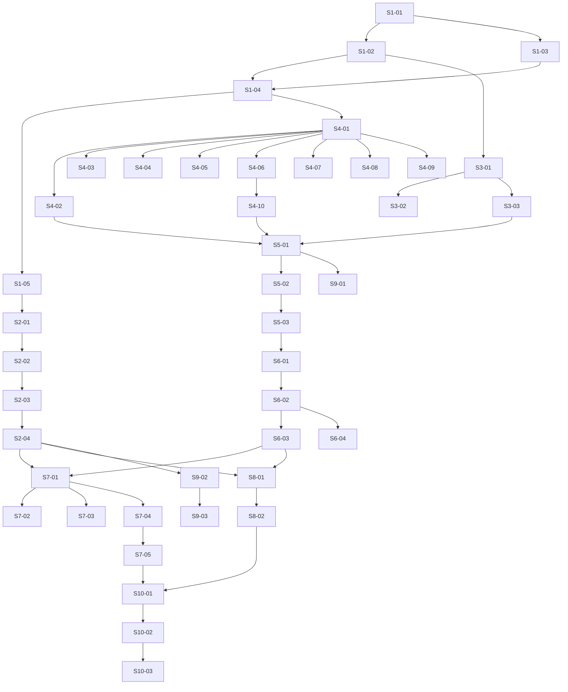

# Phase 6 — SHERPA-style state machine for the vuln loop: Stories manifest

**Status:** Backlog generated; ready for autonomous implementation
**Date:** 2026-05-12
**Phase architecture:** [../phase-arch-design.md](../phase-arch-design.md)
**Phase ADRs:** [../ADRs/](../ADRs/)
**Implementation plan:** [../High-level-impl.md](../High-level-impl.md)
**Source design:** [../final-design.md](../final-design.md)

## Executive summary

41 stories across the 10 implementation steps decompose Phase 6 into autonomous-agent-sized units (1–3 hours human-equivalent each). The DAG is narrow at the top — Step 1 (contracts) gates everything; Step 2 (checkpointer) gates Steps 4–10; Steps 3 and 4 fan out in parallel — then collapses through Step 5 (topology) into Steps 6–10 which mostly run in series. Cross-cutting work (fence-CI gates, mypy strict, golden-topology canonicalization, BLAKE3 audit-chain extension into Phase 5) is folded into the earliest step that requires it rather than batched at the end. Effort distribution skews toward Step 4 (ten nodes, ten unit tests) and Step 7 (HITL replay + Phase 5 parity); the rest are small mechanical pieces with sharp acceptance criteria.

## How to use this backlog

1. **Read the architecture and ADRs first.** Stories assume you have already read [../phase-arch-design.md](../phase-arch-design.md), the relevant ADRs under [../ADRs/](../ADRs/), and [../High-level-impl.md](../High-level-impl.md). The story files do not re-state load-bearing rationale; they link to it.
2. **Pick stories in DAG order.** The "Depends on" column is the topological prerequisite. Do not start a story until every dep is `Done`.
3. **Use red-green-refactor.** Each story's TDD plan specifies the failing test to commit first. The acceptance criteria are the green target.
4. **One story = one PR.** No bundling. Surface scope creep as a follow-up story, not as an inline addition.
5. **Update the story file's Status field** to `In progress` when you start and `Done` when all criteria are checked.
6. **Cite the ADR or arch-section** in the PR description for every load-bearing decision the story implements.
7. **Surface gaps loudly.** If a story's premise contradicts what you find in code (e.g., Phase 5's `_run_one_attempt` is not the seam the design assumed), stop and surface it via the `Open implementation questions` section below rather than papering over it.

## Definition of done (applies to every story)

- [ ] All acceptance criteria are checked.
- [ ] The TDD plan's red test exists, is committed, and is green.
- [ ] Any additional tests required to honor the relevant ADRs are written and green.
- [ ] Code is formatted (`ruff format`), linted clean (`ruff check`), and passes the type check (`mypy --strict`).
- [ ] No existing test was disabled or weakened without an explicit note in the story's "Notes for the implementer" section explaining why.
- [ ] The story file's Status is updated to `Done`.
- [ ] If the story modifies any contract documented in an ADR, the ADR's "Consequences" section is reviewed for new follow-ups.

## Dependency DAG (visual)

Direct deps only; Mermaid parses.

## Stories — by step

### Step 1: Scaffold `graph/` package, ship `VulnLedger` + HITL contracts + structural CI gates

**Step goal:** The `graph/` package exists with the state contract, HITL contracts, runtime mutation hook, and every static CI gate that protects later steps — no node logic yet.
**Step exit criteria mapping:** Roadmap "vuln-remediation loop runs as a LangGraph state machine" (foundation only); ADR-0002 / ADR-P6-005 / ADR-P6-002 contract surface.

| ID | Title (slug → file) | Effort | Depends on | Summary (one sentence) |
|---|---|---|---|---|
| S1-01 | [Scaffold `graph/` package skeleton + fence-CI rules (`S1-01-scaffold-graph-package-and-fence-rules`)](S1-01-scaffold-graph-package-and-fence-rules.md) | S | — | Create empty `src/codegenie/graph/` module tree per arch-design §Development view and extend `tools/fence_ci.yaml` with the four banned-import rules. |
| S1-02 | [Add `VulnLedger` Pydantic model (`S1-02-add-vuln-ledger-pydantic-model`)](S1-02-add-vuln-ledger-pydantic-model.md) | M | S1-01 | Ship `state.py` with `VulnLedger` (`extra="forbid", frozen=False`, `schema_version: Literal["v0.6.0"]`), all 18 fields per arch §Component 1, JSON-roundtrip golden fixture. |
| S1-03 | [Add `HumanRequest` and `HumanDecision` HITL contracts (`S1-03-add-hitl-contracts`)](S1-03-add-hitl-contracts.md) | S | S1-01 | Ship `hitl.py` with both frozen Pydantic models per arch §Logical view; `HumanDecision.action` is a Literal Union (`continue|override|abort`). |
| S1-04 | [Add `GraphEvent` + exception hierarchy + after-node id()-diff hook (`S1-04-add-events-and-after-node-hook`)](S1-04-add-events-and-after-node-hook.md) | M | S1-02, S1-03 | Ship `events.py` and `hooks.py`: `GraphEvent`, the seven typed exceptions (`LedgerMutatedInPlace`, `CheckpointTampered`, `CheckpointerInsecure`, `SchemaDrift`, `AuditChainCorrupted`, `CheckpointSchemaMismatch`, `ImpureEdge`), and the `make_after_node_hook` callable that diffs `id()` of mutable fields. |
| S1-05 | [Ship Layer-0 introspection + schema-pin CI gates (`S1-05-layer-0-introspection-and-schema-pin-tests`)](S1-05-layer-0-introspection-and-schema-pin-tests.md) | S | S1-04 | Add `test_no_self_confidence_in_loopstate.py` (introspect refuses `confidence|llm_says|self_reported`), `test_schema_version_pin.py` (round-trip a v0.6.0 ledger fixture), `test_fence_graph_no_anthropic.py`, `test_pep_no_O_optimizations.py`. |

### Step 2: Implement `AuditedSqliteSaver` + per-workflow file + BLAKE3 chain extension

**Step goal:** A `BaseCheckpointSaver` subclass that writes per-workflow SQLite files at `0600`, fsyncs every checkpoint, extends Phase 5's BLAKE3 audit chain on every `put()`, and refuses to resume on tamper / schema drift / chain mismatch.
**Step exit criteria mapping:** Roadmap "Mid-run kill + resume works without state loss"; "Replay tests use the checkpointer to kill a mid-run workflow."

| ID | Title (slug → file) | Effort | Depends on | Summary (one sentence) |
|---|---|---|---|---|
| S2-01 | [Implement `AuditedSqliteSaver` round-trip + per-workflow file mode (`S2-01-audited-sqlite-saver-roundtrip`)](S2-01-audited-sqlite-saver-roundtrip.md) | M | S1-05 | Subclass `AsyncSqliteSaver`, enforce `0600`, `PRAGMA journal_mode=WAL`, `PRAGMA synchronous=NORMAL`, canonical-JSON serializer, `make_checkpointer()` factory; round-trip a `VulnLedger` byte-identical. |
| S2-02 | [Extend Phase 5's BLAKE3 chain on every `put()` (`S2-02-blake3-chain-extension-on-put`)](S2-02-blake3-chain-extension-on-put.md) | M | S2-01 | Read Phase 5's `RetryLedger.head_from_phase5(run_id)` (or add the public read accessor if Gap 2 lands); append `checkpoint.write` events under a shared `threading.Lock`; concurrent-writer test passes. |
| S2-03 | [Refuse resume on tamper / world-readable / schema drift / chain mismatch (`S2-03-resume-tamper-and-drift-refusal`)](S2-03-resume-tamper-and-drift-refusal.md) | M | S2-02 | Adversarial tests: row mutation raises `CheckpointTampered` + chain emits `checkpoint.tamper.detected`; `chmod 644` raises `CheckpointerInsecure`; `schema_version` mutation raises `SchemaDrift`; corrupted Phase 5 chain head raises `AuditChainCorrupted`. |
| S2-04 | [WAL durability smoke test for fsync-per-node-boundary (`S2-04-wal-durability-smoke-test`)](S2-04-wal-durability-smoke-test.md) | S | S2-03 | Smoke version of the replay-byte-identical canary — write checkpoint, simulate process exit (close+reopen), assert last fsync'd frame intact and any in-flight WAL frame rolled back. |

### Step 3: Ship `@pure_edge` decorator + the four conditional-edge predicates + property tests

**Step goal:** All four routing decisions are pure functions of `VulnLedger`, AST-verified for forbidden imports, property-tested for determinism and label-projection invariance.
**Step exit criteria mapping:** Roadmap "State-transition tests assert every conditional edge is exercised at least once."

| ID | Title (slug → file) | Effort | Depends on | Summary (one sentence) |
|---|---|---|---|---|
| S3-01 | [Implement `@pure_edge` AST-walking decorator (`S3-01-pure-edge-decorator-ast-check`)](S3-01-pure-edge-decorator-ast-check.md) | S | S1-02 | Decorator AST-walks the function body at import time and raises `ImpureEdge` on `random | time | os | datetime` imports (whitelist `datetime.fromisoformat`); rejection test with a synthesized impure predicate. |
| S3-02 | [Implement the four conditional-edge predicates + branch-coverage parametrization (`S3-02-four-conditional-edges`)](S3-02-four-conditional-edges.md) | M | S3-01 | `route_after_select_recipe`, `route_after_rag` (threshold from `tools/policy/graph-thresholds.yaml`), `route_after_attempt` (with same-signature flake helper), `route_after_human`; full state-space cartesian parametrization for `route_after_attempt`. |
| S3-03 | [Hypothesis property tests — determinism + label-projection invariance (`S3-03-edge-property-tests-projection-invariance`)](S3-03-edge-property-tests-projection-invariance.md) | M | S3-02 | Hand-written `VulnLedger` strategies in `tests/graph/strategies.py`; 10k examples assert `route(s) == route(s)` and permuting non-consumed fields leaves the label invariant; closes critique security-attack-4. |

### Step 4: Implement the ten nodes as thin wrappers over Phase 3/4/5 engines

**Step goal:** Each of the ten nodes is a sync `def(state: VulnLedger) -> VulnLedger` that delegates to Phase 3/4/5, returns `state.model_copy(update={...})`, emits a `GraphEvent`, and is unit-tested against a mocked upstream engine.
**Step exit criteria mapping:** Roadmap "vuln-remediation loop runs as a LangGraph state machine"; preserves Phase 5 retry-feedback contract (exit-criterion #19).

| ID | Title (slug → file) | Effort | Depends on | Summary (one sentence) |
|---|---|---|---|---|
| S4-01 | [Ship `@audited_node` decorator + node-test scaffolding (`S4-01-audited-node-decorator-and-test-scaffold`)](S4-01-audited-node-decorator-and-test-scaffold.md) | S | S1-04 | Decorator wires the after-node `id()`-diff hook around every node return; shared `tests/graph/test_nodes/conftest.py` builds fixture ledgers and mocks Phase 3/4/5 imports. |
| S4-02 | [Implement `ingest_cve` + `select_recipe` nodes (`S4-02-ingest-cve-and-select-recipe-nodes`)](S4-02-ingest-cve-and-select-recipe-nodes.md) | S | S4-01 | Two Phase-3 wrapper nodes; unit tests mock `AdvisoryLoader` and `RecipeMatcher.match`; assert `advisory` and `recipe_selection` fields populated; emit one `GraphEvent` each. |
| S4-03 | [Implement `apply_recipe` node (`S4-03-apply-recipe-node`)](S4-03-apply-recipe-node.md) | S | S4-01 | Calls Phase 3 `RecipeEngine.apply(ApplyContext(patch=..., prior_attempts=...))`; populates `patch: PatchRef`; verifies ADR-P5-002's `prior_attempts` kwarg is wired through. |
| S4-04 | [Implement `rag_lookup` node (`S4-04-rag-lookup-node`)](S4-04-rag-lookup-node.md) | S | S4-01 | Calls Phase 4 `RagTier.lookup()`; populates `rag_hit: RagHit | None`; unit test exercises both the threshold-met and threshold-miss paths. |
| S4-05 | [Implement `replan_with_phase4` node + no-HITL-note guard (`S4-05-replan-with-phase4-node`)](S4-05-replan-with-phase4-node.md) | M | S4-01 | Calls Phase 4 `FallbackTier.run(advisory, repo_ctx, recipe_selection, prior_attempts=state.prior_attempts)`; sets `last_engine="phase4_llm"`; `test_hitl_note_not_in_prompt.py` instruments the node so any read of `state.human_decision.note` raises. |
| S4-06 | [Implement `validate_in_sandbox` node + Phase 5 `run_one` promotion (ADR-P6-001) (`S4-06-validate-in-sandbox-and-run-one-promotion`)](S4-06-validate-in-sandbox-and-run-one-promotion.md) | M | S4-01 | Promote `GateRunner._run_one_attempt` to public `run_one` (one-line additive change if seam is clean; refactor + ADR amendment otherwise); node calls `run_one(transition, GateContext(...))`. |
| S4-07 | [Implement `record_attempt` node + per-gate retry-counter semantics (`S4-07-record-attempt-and-retry-counter-semantics`)](S4-07-record-attempt-and-retry-counter-semantics.md) | M | S4-01 | Calls Phase 5 `RetryLedger.record(Attempt(...))`; resets `retry_count=1` on `current_gate_id` change, cumulative otherwise; ADR-0014 compliance verified by parametrized test. |
| S4-08 | [Implement `await_human` node — the single `interrupt()` site (`S4-08-await-human-interrupt-node`)](S4-08-await-human-interrupt-node.md) | M | S4-01 | Only file importing `langgraph.types.interrupt`; builds `HumanRequest`; on resume applies `HumanDecision`, resets `retry_count=0` when `action="continue"`, leaves `retry_count` intact on `"override"` and `"abort"`. |
| S4-09 | [Implement `emit_artifact` + `escalate` terminal nodes (`S4-09-emit-artifact-and-escalate-nodes`)](S4-09-emit-artifact-and-escalate-nodes.md) | S | S4-01 | `emit_artifact` writes Phase 3 `RemediationReport`; `escalate` emits `kind="escalate"` event; both terminate at `END`. |
| S4-10 | [Land ADR-P6-001 (`run_one` public promotion) and verify Phase 5 contract snapshot (`S4-10-adr-p6-001-run-one-promotion-doc`)](S4-10-adr-p6-001-run-one-promotion-doc.md) | S | S4-06 | Commit ADR-P6-001 in Nygard format documenting exactly what shipped to Phase 5's `gates/runner.py`; Phase 5 contract-snapshot test (if any) updated. |

### Step 5: Implement `build_vuln_loop()` lazy-singleton factory + topology golden + `interrupt_before`

**Step goal:** The compiled `StateGraph[VulnLedger]` exists, is reachable via `build_vuln_loop(checkpointer=..., max_attempts=3, force_rebuild=False)`, fires `interrupt_before=["await_human"]`, and its `get_graph().to_json()` form is a CI-gated golden file.
**Step exit criteria mapping:** Roadmap "vuln-remediation loop runs as a LangGraph state machine"; "every conditional edge is exercised at least once" (reachability).

| ID | Title (slug → file) | Effort | Depends on | Summary (one sentence) |
|---|---|---|---|---|
| S5-01 | [Implement `build_vuln_loop()` lazy-singleton + topology wiring (`S5-01-build-vuln-loop-factory`)](S5-01-build-vuln-loop-factory.md) | M | S3-03, S4-02, S4-10 | Module-level `_COMPILED` cache, `_build(max_attempts)` constructs 10 nodes × 4 conditional × 5 unconditional edges per arch §Component 2; `force_rebuild=True` recompiles; `interrupt_before=["await_human"]` set at compile time. |
| S5-02 | [Topology golden file + reachability tests (`S5-02-topology-golden-and-reachability`)](S5-02-topology-golden-and-reachability.md) | M | S5-01 | Canonicalized `graph.get_graph().to_json()` committed to `tests/golden/vuln_loop_topology.json`; reachability test asserts every node reachable from `ingest_cve` and both `END` paths reachable; update requires `--update-golden` flag. |
| S5-03 | [Ship `tools/policy/graph-thresholds.yaml` with digest pin + cold-start perf gate (`S5-03-graph-thresholds-yaml-and-cold-start-perf`)](S5-03-graph-thresholds-yaml-and-cold-start-perf.md) | S | S5-02 | `max_attempts: 3`, `rag_score_threshold: 0.85`, `same_signature_window: 2` shipped; BLAKE3 digest pinned in `tools/digests.yaml`; `test_compile_cold_start.py` asserts `force_rebuild=True` p50 < 200 ms. |

### Step 6: Ship `cli/loop.py` operator surface + workflow-id derivation + exit codes

**Step goal:** Operators can run `codegenie loop {run, resume, inspect, replay, migrate-checkpoint, render}`; exit codes 0/11/12/13/1 are observable; the CLI does not modify `cli/remediate.py`.
**Step exit criteria mapping:** Roadmap "HITL interrupt tests inject mocked human responses and verify the workflow continues correctly" (operator surface).

| ID | Title (slug → file) | Effort | Depends on | Summary (one sentence) |
|---|---|---|---|---|
| S6-01 | [Add `codegenie loop` command group + workflow-id derivation (`S6-01-loop-cli-command-group-and-workflow-id`)](S6-01-loop-cli-command-group-and-workflow-id.md) | S | S5-03 | Click group `loop` registered; `workflow_id = blake3(f"{repo_root_blake3}|{advisory_canonical_id}").hexdigest()[:16]`; content-addressing determinism test passes. |
| S6-02 | [Implement `loop run` happy path + structured exit codes (`S6-02-loop-run-happy-path-and-exit-codes`)](S6-02-loop-run-happy-path-and-exit-codes.md) | M | S6-01 | `run` constructs initial `VulnLedger`, builds `AuditedSqliteSaver`, invokes `build_vuln_loop`; exit codes 0/11/12/13/1 parametrized test; `--json` flag toggles stderr structure; assert `cli/remediate.py` diff empty post-merge. |
| S6-03 | [Implement `loop resume` + `aupdate_state(as_node="await_human")` (`S6-03-loop-resume-aupdate-state`)](S6-03-loop-resume-aupdate-state.md) | M | S6-02 | Parses `--decision continue|override|abort`, `--operator`, optional `--note`; constructs `HumanDecision`; calls `aupdate_state` then `ainvoke(None, config)`; rejects `--max-attempts` mid-run with clear error; `test_loop_resume_no_pause_errors.py` green. |
| S6-04 | [Implement `loop inspect`, `replay`, `migrate-checkpoint` (scaffold), `render` (`S6-04-loop-inspect-replay-render-migrate`)](S6-04-loop-inspect-replay-render-migrate.md) | M | S6-02 | `inspect` prints `graph.get_state_history(config)` table; `replay` replays from `--from <checkpoint_id>` and asserts byte-identical; `render` produces JSON (CI gate) + SVG (review-only) to `docs/phases/06-sherpa-state-machine/vuln_loop.svg`; `migrate-checkpoint` scaffold only. |

### Step 7: HITL replay + Phase 5 parity + retry-feedback-distinct-bytes tests (G3 + G4 + G5)

**Step goal:** Three exit-criterion-bearing integration tests are green: HITL `interrupt()` fires after consecutive failures and resumes; LangGraph cycle produces byte-identical `attempts.jsonl` to Phase 5's sync `for`-loop; retry re-entry into Phase 4 produces distinct patch bytes.
**Step exit criteria mapping:** Roadmap "HITL interrupt fires when trust gates fail twice in a row, and a mocked human approval continues the run"; "HITL interrupt tests inject mocked human responses"; Phase 5 exit-criterion #19 preserved.

| ID | Title (slug → file) | Effort | Depends on | Summary (one sentence) |
|---|---|---|---|---|
| S7-01 | [HITL interrupt + resume integration test parametrized at `max_attempts ∈ {1,2,3}` (`S7-01-hitl-interrupt-and-resume-integration`)](S7-01-hitl-interrupt-and-resume-integration.md) | L | S2-04, S6-03 | Drives arch §Scenario 2; at `max_attempts=2` two failures trigger `interrupt()`; `aupdate_state` injects `HumanDecision(action="continue")`; final state has `report.json` written; production-default `max_attempts=3` path also exercised. |
| S7-02 | [Phase 5 sync-vs-Phase-6 cycle `attempts.jsonl` byte-parity test (G4) (`S7-02-phase5-parity-attempts-jsonl-byte-diff`)](S7-02-phase5-parity-attempts-jsonl-byte-diff.md) | M | S7-01 | Same fixture through Phase 5 sync `GateRunner.run()` and Phase 6 LangGraph cycle; `attempts.jsonl` byte-diff empty after wall-clock normalization documented in `tests/integration/conftest.py`. |
| S7-03 | [Retry-feedback-distinct-bytes test (G5 / Phase 5 exit #19) (`S7-03-phase4-retry-distinct-patch-bytes`)](S7-03-phase4-retry-distinct-patch-bytes.md) | M | S7-01 | Three-attempt retry through `replan_with_phase4` produces three distinct `patch-attempt-{1,2,3}.diff` files; `blake3` of each differs; attempt-2's Phase 4 prompt contains the fence-wrapped attempt-1 summary; VCR cassettes committed. |
| S7-04 | [HITL same-sig-flake routing + malformed-decision adversarial tests (`S7-04-hitl-flake-routing-and-malformed-decision`)](S7-04-hitl-flake-routing-and-malformed-decision.md) | S | S7-01 | `test_hitl_continue_after_same_sig_flake_routes_to_non_retryable.py` documents Gap 4 behavior with operator warning; `test_hitl_malformed_decision_raises.py` confirms `HumanDecision(action="approve")` raises `ValidationError`. |
| S7-05 | [Export `docs/contracts/hitl-v0.6.0.json` + CI gate (`S7-05-hitl-contract-export-ci-gate`)](S7-05-hitl-contract-export-ci-gate.md) | S | S7-04 | `python -m codegenie.graph.hitl --export` emits the JSON-schema contract; CI gate diffs the committed file; PR must update deliberately on shape change. |

### Step 8: Replay-after-kill canary (G2)

**Step goal:** SIGKILL during `validate_in_sandbox`; restart fresh process; final state byte-identical to a non-killed reference run.
**Step exit criteria mapping:** Roadmap "Mid-run kill + resume works without state loss"; "Replay tests use the checkpointer to kill a mid-run workflow."

| ID | Title (slug → file) | Effort | Depends on | Summary (one sentence) |
|---|---|---|---|---|
| S8-01 | [Replay-after-kill multiprocessing canary (`S8-01-replay-after-kill-canary`)](S8-01-replay-after-kill-canary.md) | M | S2-04, S6-03 | `multiprocessing` spawns child running `ainvoke`, parent SIGKILLs at parametrized delays of 1s/10s/50s into `validate_in_sandbox`; fresh subprocess re-invokes with same `workflow_id`; byte-identical `report.json` + `attempts.jsonl`. |
| S8-02 | [Reference replay-byte-identical test + no-app-fsync grep gate (`S8-02-replay-byte-identical-reference`)](S8-02-replay-byte-identical-reference.md) | S | S8-01 | Cleaner reference run-twice test asserts byte-identical artifacts; grep against `src/codegenie/graph/` confirms no application-level `os.fsync()` calls — `aiosqlite` WAL+NORMAL is the only durability primitive. |

### Step 9: Performance canary (G6) + SQLite throughput watchdog (G9) + ADR-P6-006 escalation hook

**Step goal:** Per-node LangGraph overhead measured against a committed baseline with 25% regression tolerance; checkpoint throughput measured serially and concurrently; ADR-P6-006 fires below 100 writes/s.
**Step exit criteria mapping:** CI gates, not direct roadmap exit criteria; ADR-P6-006 tripwire.

| ID | Title (slug → file) | Effort | Depends on | Summary (one sentence) |
|---|---|---|---|---|
| S9-01 | [Per-node overhead canary + baseline.json bookkeeping (`S9-01-per-node-overhead-canary`)](S9-01-per-node-overhead-canary.md) | S | S5-01 | 100-no-op-node graph × 1,000 invocations records p50/p95 to `tests/perf/baseline.json` on first CI run; subsequent runs fail only on >25% regression; `tests/perf/README.md` documents baseline-update PR procedure. |
| S9-02 | [Serial checkpoint throughput watchdog + ADR-P6-006 (`S9-02-checkpoint-throughput-watchdog-and-adr`)](S9-02-checkpoint-throughput-watchdog-and-adr.md) | S | S2-04 | 1,000 serial `AuditedSqliteSaver.put()` calls; ≥ 100 writes/s asserted; on failure CI prints "ADR-P6-006 escalation: Postgres pull-forward triggered"; ADR-P6-006 committed with numeric thresholds + escalation procedure. |
| S9-03 | [Concurrent-workflow throughput scaling test (Gap 3) (`S9-03-concurrent-workflow-throughput-test`)](S9-03-concurrent-workflow-throughput-test.md) | S | S9-02 | N=10 `asyncio.Task`s each driving a separate per-workflow `AuditedSqliteSaver` through 100 checkpoints; aggregate ≥ 10× single-workflow baseline or escalates ADR-P6-006. |

### Step 10: Adversarial hardening + Layer-8 E2E + final polish

**Step goal:** Adversarial test suite green; slow Layer-8 E2E runs end-to-end through `codegenie loop run`; Phase 6 ADRs committed; HITL contract exported; Phase 5 regression suite still green.
**Step exit criteria mapping:** Roadmap "vuln-remediation loop runs as a LangGraph state machine" (umbrella E2E); Phase 7 exit criterion "no Phase 0–6 source touched" preserved.

| ID | Title (slug → file) | Effort | Depends on | Summary (one sentence) |
|---|---|---|---|---|
| S10-01 | [Adversarial: forged decision + out-of-order transition rejection (`S10-01-adversarial-forged-decision-and-transition`)](S10-01-adversarial-forged-decision-and-transition.md) | S | S7-05, S8-02 | `HumanDecision(action="merge")` rejected by `model_validate`; `aupdate_state(as_node="emit_artifact")` from a state at `await_human` rejected. |
| S10-02 | [Layer-8 E2E `codegenie loop run` against `cve-fixture` (`S10-02-layer-8-e2e-loop-run-vuln`)](S10-02-layer-8-e2e-loop-run-vuln.md) | M | S10-01 | `tests/e2e/test_loop_run_vuln_remediation.py` runs the full CLI against `tests/fixtures/repos/cve-fixture/` with `--cve CVE-2024-FAKE-NPM`; ends in exit 0 + `report.json`; `@pytest.mark.slow` for merge queue. |
| S10-03 | [Commit remaining Phase 6 ADRs + Phase 5 regression-suite gate (`S10-03-commit-phase-6-adrs-and-phase-5-regression`)](S10-03-commit-phase-6-adrs-and-phase-5-regression.md) | M | S10-02 | All seven (or eight, if ADR-P6-008 lands) ADRs committed in Nygard format under `docs/phases/06-sherpa-state-machine/ADRs/`; pre-commit hook runs ruff + mypy strict on changed graph files; full Phase 5 regression passes on top of Phase 6 changes. |

## Cross-cutting concerns

- **mypy strict + ruff clean from day one.** Every story expects `mypy --strict src/codegenie/graph/` and `ruff check src/codegenie/graph/` to pass at PR time. No `Any`, no `cast`, no un-justified `# type: ignore`.
- **Fence-CI compliance.** All stories under Step 4 onwards inherit the four fence rules added in S1-01 (no `anthropic|chromadb|sentence-transformers` in `graph/`; no `random|time|os|datetime` in `graph/edges.py`; no sibling-node imports in `graph/nodes/*`).
- **BLAKE3 audit-chain extension into Phase 5's existing chain.** Step 2 lands the single chain writer + lock; every later step that mutates state implicitly trusts the chain to be intact. If Gap 2 (Phase 5 `head_from_phase5` accessor missing) bites, S2-02 surfaces it loudly.
- **ADR compliance citations.** Stories implementing load-bearing decisions cite the relevant ADR (ADR-0001 lazy singleton, ADR-0002 ledger frozen=False, ADR-0003 retry per-gate, ADR-0005 schema-version literal, ADR-0006 fsync-per-node, ADR-0007 chain extension, ADR-0009 cli/loop parallel, ADR-0010 run_one promotion, ADR-0012 pure-edge discipline, ADR-0013 JSON-golden topology) in the PR description.

## Exit-criteria coverage

| Exit criterion (verbatim or close from roadmap Phase 6) | Story / stories |
|---|---|
| The vuln-remediation loop runs as a LangGraph state machine | S1-01, S1-02, S4-02, S4-03, S4-04, S4-05, S4-06, S4-07, S4-08, S4-09, S5-01, S5-02, S6-02, S10-02 |
| Mid-run kill + resume works without state loss | S2-01, S2-02, S2-03, S2-04, S8-01, S8-02 |
| HITL interrupt fires when trust gates fail twice in a row, and a mocked human approval continues the run | S3-02, S4-07, S4-08, S6-03, S7-01, S7-04 |
| State-transition tests assert every conditional edge is exercised at least once | S3-02, S3-03, S5-02 |
| Replay tests use the checkpointer to kill a mid-run workflow, resume it, and assert the same final state | S2-04, S8-01, S8-02 |
| HITL interrupt tests inject mocked human responses and verify the workflow continues correctly | S6-03, S7-01, S7-04 |

## Open implementation questions

These items are flagged in [../phase-arch-design.md](../phase-arch-design.md) §Gap analysis and [../ADRs/README.md](../ADRs/README.md) "Decisions noted but not yet documented." Each is most likely to surface in the story listed:

- **ADR-P6-008 — roadmap "twice in a row" vs ADR-0014 `max_attempts=3` default.** Most likely to surface in **S7-01** when the integration test parametrizes `max_attempts ∈ {1,2,3}`. Resolve by amending the roadmap or shipping ADR-P6-008.
- **Phase 5 `_run_one_attempt` seam may not be a clean single-attempt boundary (Gap 2).** Surfaces in **S4-06**. If the seam is interleaved with retry-loop state, surface a wider refactor + amended ADR-P6-001 rather than inlining.
- **Phase 5 `RetryLedger.head_from_phase5()` accessor may not be public (Gap 2 again).** Surfaces in **S2-02**. Options: (a) add one-line public read accessor to Phase 5 + parity test, (b) parse the audit JSONL directly + ship a Phase-6 ADR.
- **HITL `continue` after same-signature flake silently routes to `non_retryable` (Gap 4).** Surfaces in **S7-04**. Choice between (a) clear `prior_attempts`, (b) insert a `hitl_continue` marker the detector skips, (c) document + add CLI warning. ADR-worthy if (a) or (b) chosen.
- **First schema-bump migration shape (`v0.6.0 → v0.7.0`).** Phase 6 ships the registry but no migrations. Convention deferred until first phase adds a field; surfaces in **S6-04** when `migrate-checkpoint` scaffold lands.
- **Concurrent-throughput threshold numeric value.** ADR-0011 says "≥ 10× single-workflow throughput"; baseline-driven number set after first CI run. Surfaces in **S9-03**.

## Backlog stats

- **Total stories:** 41
- **Stories per step:** S1: 5 · S2: 4 · S3: 3 · S4: 10 · S5: 3 · S6: 4 · S7: 5 · S8: 2 · S9: 3 · S10: 3
- **Effort distribution:** S: 18 · M: 22 · L: 2 (S7-01, plus Step 4 aggregate is L-equivalent split across 10 small stories)
- **Longest dependency chain:** 11 stories (S1-01 → S1-02 → S1-04 → S4-01 → S4-06 → S4-10 → S5-01 → S5-02 → S5-03 → S6-01 → S6-02 → S6-03 → S7-01 → S7-05 → S10-01 → S10-02 → S10-03 = 17 in worst case; typical critical path is ~12)
