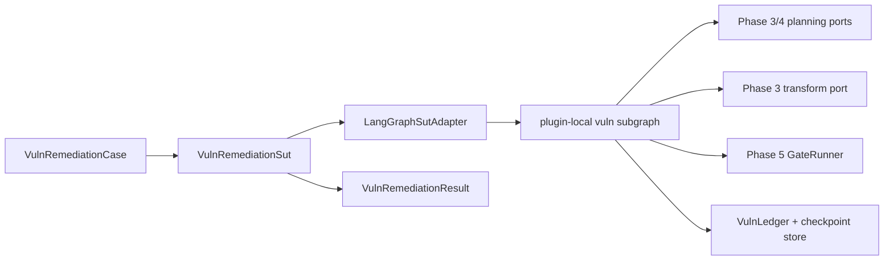
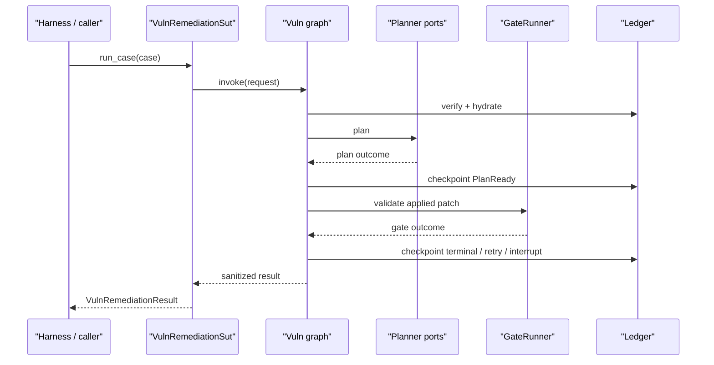

# Phase 6 — SHERPA-style state machine for the vuln loop: Architecture

**Status:** Architecture specification
**Date:** 2026-05-18
**Source design:** [final-design.md](final-design.md)

## Goals

1. Compose the Phase 3–5 capabilities into one restartable workflow.
2. Keep the vuln graph plugin-local while preserving shared ports.
3. Expose a stable `VulnRemediationSut` contract for Phase 6.5.
4. Prove kill/resume and HITL replay deterministically.

## Non-goals

- No Temporal workerization.
- No second plugin graph.
- No new planning, transformation, or sandbox engines.

## Logical view

## Process view

## Development view

- `src/codegenie/workflows/vuln_sut.py` — contract types and adapter protocol
- `src/codegenie/workflows/vuln_ledger.py` — typed ledger and replay verification
- `plugins/vulnerability-remediation--node--npm/subgraph/` — graph topology and node wiring
- `tests/unit/workflows/` — reducers, ledger, transition table
- `tests/integration/workflows/` — kill/resume, HITL, SUT adapter

## Deployment view

Phase 6 stays local: Python process + SQLite checkpoint file under `.codegenie/remediation/<run-id>/`. The architecture intentionally mirrors the later Temporal shape but does not pull Temporal into the local phase.

## Scenarios

### Scenario 1: clean completion

Recipe applies, gate passes, ledger records `Completed`, `VulnRemediationResult.terminal_state == "completed"`.

### Scenario 2: retry then recovery

Gate fails with retryable evidence, planner re-enters with prior-attempt context, second patch passes, chain shows two gate attempts.

### Scenario 3: HITL resume

Gate fails twice, graph emits `AwaitingHumanReview`, process exits cleanly, resume input is validated, approved transition continues from the latest verified checkpoint.

### Scenario 4: tampered checkpoint

Replay verification fails before hydration, graph returns `FailedUnrecoverable(reason="checkpoint_integrity")`, no patch work resumes.

## Contract boundary

`VulnRemediationSut` is the only public harness-facing surface. The contract is intentionally behavior-shaped:

- Input: one immutable `VulnRemediationCase`
- Output: one immutable `VulnRemediationResult`
- Digest: one stable `SutDigest` for cache keys and eval provenance

Any future refactor that preserves that contract is invisible to Phase 6.5.

## Testing strategy

- Reducer unit tests: exhaustive transition matrix.
- Ledger tests: golden replay, tamper detection, semantic checkpoint ordering.
- Contract tests: SUT adapter round-trips only sanitized result fields.
- Integration tests: kill/resume, retry recovery, HITL interrupt/resume.
- Static tests: graph nodes may import ports, not each other directly.

## Failure modes

| Failure | Detection | Required behavior |
|---|---|---|
| checkpoint chain mismatch | replay verification | fail closed before work resumes |
| node attempts direct peer call | AST test | CI failure |
| SUT result leaks prompt/raw path | contract serialization test | CI failure |
| stale human resume token | resume validator | reject and remain paused |
| planner/gate exception | node outcome wrapper | typed failed state, not traceback escape |

## Next-phase integration

Phase 6.5 consumes the `VulnRemediationSut` contract for nightly benches. It does not import the graph builder, checkpoint implementation, or node names. That makes the harness a consumer of Phase 6 behavior, not of Phase 6 internals.
