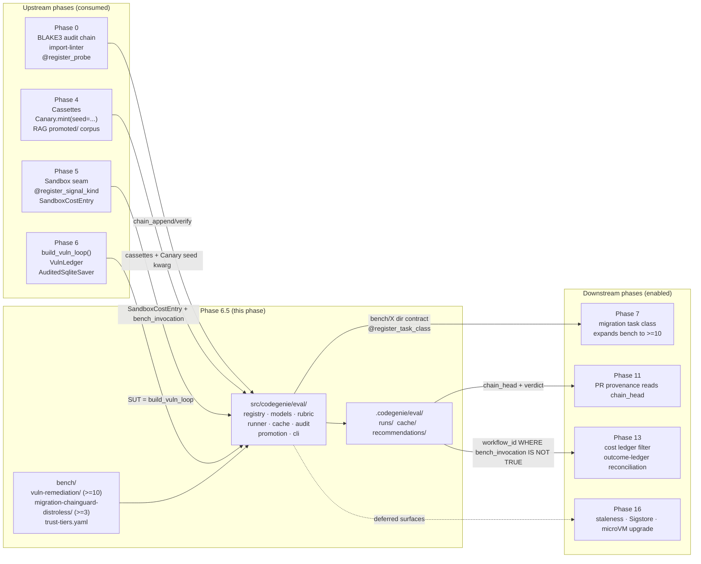
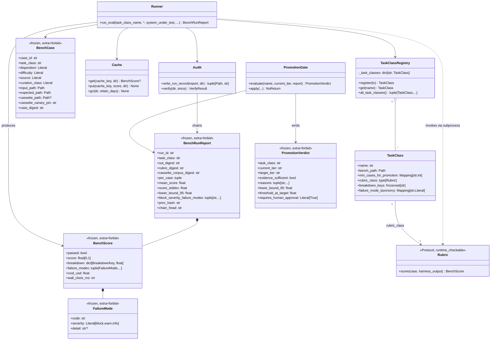
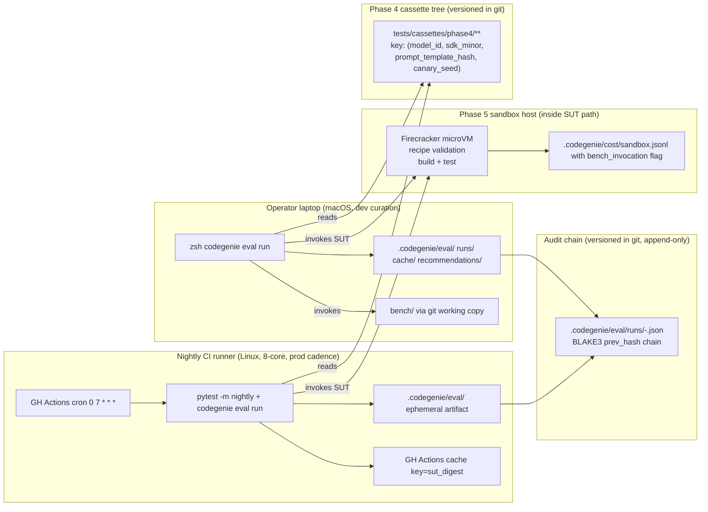
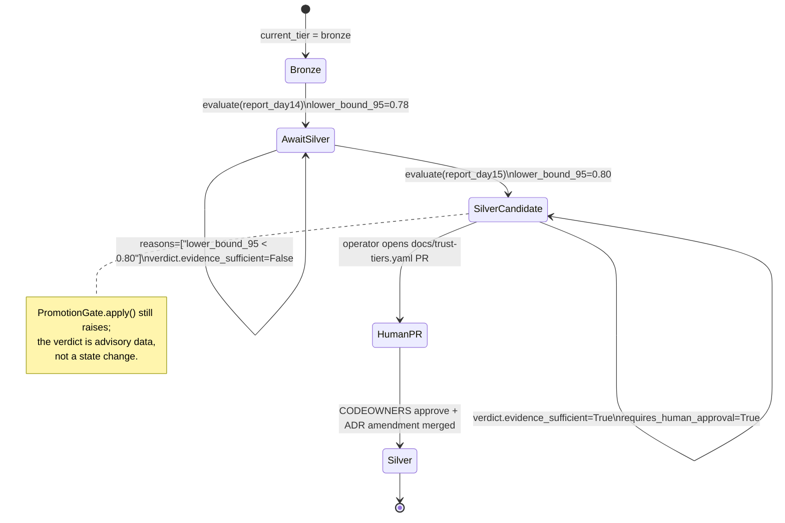

# Phase 6.5 — Per-task-class eval harness + first benches: Architecture

**Status:** Architecture spec
**Date:** 2026-05-12
**Inputs:** `final-design.md` · `critique.md` · `docs/production/design.md` · `docs/roadmap.md` §Phase 6.5 · Phase 5 [ADR-0016](../05-sandbox-trust-gates/ADRs/0016-per-task-class-eval-harness-as-trust-evidence.md) (anchor)
**Audience:** the engineer implementing this phase

---

## Executive summary

Phase 6.5 ships `src/codegenie/eval/` — a deterministic, offline harness that runs a per-task-class bench corpus against a system-under-test (SUT), scores each case via a subprocess-isolated `Rubric`, aggregates with `mean_score / score_stddev / lower_bound_95` (BCa bootstrap), and extends the Phase 0 BLAKE3-chained audit log with one `BenchRunReport` per run. Trust-tier promotion is **read-only**: `PromotionGate.evaluate(...)` emits a `PromotionVerdict` keyed on `lower_bound_95 ≥ tier_threshold[target_tier] AND zero block-severity failure modes AND chain.verify().ok`; `PromotionGate.apply()` raises unconditionally. Two benches land — `bench/vuln-remediation/` (≥10 cases, 5 RAG-corpus-derived + 5 held-out) and `bench/migration-chainguard-distroless/` (≥3 seed, held-out only). Fence-CI grows six assertions; two upstream phases (Phase 4, Phase 5) each receive one additive ADR amendment. The harness imports zero LLM SDKs; the SUT does.

---

## Goals

Refined from `roadmap.md` §Phase 6.5 exit criteria and `final-design.md` §Goals. Each numbered goal is measurable.

1. **Ship `src/codegenie/eval/` with ≤ 9 exported names** — `register_task_class`, `TaskClassRegistry`, `default_registry`, `TaskClass`, `BenchCase`, `BenchScore`, `BenchRunReport`, `PromotionVerdict`, `Rubric`. All wire types `frozen=True, extra="forbid"`. (`final-design.md §Goals` row 1; honors Phase 5 [ADR-0014](../05-sandbox-trust-gates/ADRs/0014-objectivesignals-extra-forbid-static-introspection.md).)
2. **Unit-test coverage ≥ 90% line / 80% branch on `src/codegenie/eval/`**, cyclomatic ceiling 8 per function (ruff `C901`). (`final-design.md §Goals` row 2.)
3. **Backfill `bench/vuln-remediation/` with ≥10 cases** under a `curation_class` split of `5 rag-corpus-derived + 5 held-out`. The aggregate ships `(mean_score, score_stddev, lower_bound_95)`; `lower_bound_95` is the recorded bronze→silver candidate per `final-design.md §Departures` row 2. (Exit criterion #2; addresses critic shared blind spot #2.)
4. **Seed `bench/migration-chainguard-distroless/` with ≥3 held-out cases** + `rubric.py` + `breakdown_keys.py` + `failure_modes.yaml`. Phase 7 expands to ≥10. (Exit criterion #3.)
5. **Fence-CI extension blocks the missing-bench-directory PR** in ≤ 2 s with a specific diagnostic naming the missing path. Six structural assertions total (see `final-design.md §Fence-CI test`). (Exit criterion #4.)
6. **`codegenie eval run --task-class=vuln-remediation` exits 0** on the backfilled bench, emits JSONL on stdout + a chained `BenchRunReport` to `.codegenie/eval/runs/<utc-iso>-<short>.json`. Exit codes 1–6 partition the failure space (cli.py contract). (Exit criterion #6.)
7. **Promotion gate is read-only.** `PromotionGate.apply()` raises `PromotionMustBeHumanAuthorized` unconditionally. Tier change is a hand-edited PR against `docs/trust-tiers.yaml` with CODEOWNERS approval + ADR amendment. (Exit criterion #5.)
8. **Phase 7's hard precondition is shiftable to `lower_bound_95 ≥ tier_threshold[bronze]`** (not `mean_score`) over ≥10 cases (≥5 held-out). The shift is more conservative; exit criterion #7 is met *more honestly*, not less. (`final-design.md §Departures` row 2; honors critic roadmap-level #1.)
9. **Performance envelope:** nightly wall-clock `vuln-remediation` (≥10 cases), 8-core CI host, cold cache ≤ 12 min; warm cache ≤ 8 s; cache hit rate ≥ 95% on unchanged-cassette + unchanged-rubric reruns; fence-CI overhead ≤ 2 s; $/eval-run in CI = $0.00. (`final-design.md §Goals` rows 3–7.)
10. **Audit chain extends Phase 0** via `audit.write_run_record(report)`. `codegenie eval verify --strict` returns zero gaps for 30 trailing days. Chain tamper aborts the next run before any new record lands. (Exit criterion #6; honors Phase 0's audit-anchor pattern.)
11. **No LLM SDK in `codegenie.eval`.** The harness imports no `anthropic | openai | langchain | langgraph | transformers`. The *SUT* may; the test scopes only the harness. (`final-design.md §Roadmap coherence check` "What prior phases established"; addresses critic roadmap-level #4.)

---

## Non-goals

Each non-goal is explicit so Phase 7's reviewer cannot interpret a deferral as a gap.

1. **No microVM rubric isolation.** Subprocess + scrubbed env is the chosen middle ground; full Firecracker/gVisor is deferred to Phase 16. Rationale: forking Phase 5's sandbox stack on macOS would break the dev/curator loop (admitted in `design-security.md §Risks #1`). (`final-design.md §Departures` row 1.)
2. **No Sigstore-signed daily audit anchor.** The local BLAKE3 chain meets exit criterion #6; Sigstore-anchor publication is Phase 16. Adopting it would either require auto-merge (violates [ADR-0009](../../production/adrs/0009-humans-always-merge.md) per critic-sec #3) or daily human merges. (`final-design.md §Provenance/signing scheme`.)
3. **No live-LLM calls in CI.** Cassette replay only (Phase 4 `--record-mode=none`). Operator-invoked live runs are capped via `--max-cost-usd` (default $5.00). (`roadmap.md §Phase 6.5 Tooling`.)
4. **No outcome-ledger reconciliation hook.** Phase 13 owns the `regression-converted` source class lifecycle; Phase 6.5 ships the `case.toml#source` enum but not the conversion tooling. ([ADR-0016 §Consequences](../05-sandbox-trust-gates/ADRs/0016-per-task-class-eval-harness-as-trust-evidence.md).)
5. **No staleness probe on `case.toml#last_validated_at`.** Phase 16 territory ([ADR-0016 §Consequences](../05-sandbox-trust-gates/ADRs/0016-per-task-class-eval-harness-as-trust-evidence.md)). A warning logs at load time when `now - last_validated_at > 90d`; that is the floor.
6. **No calibrated tier-threshold numbers.** [Production ADR-0015](../../production/adrs/0015-trust-score-threshold-calibration.md) stays deferred; Phase 6.5 ships the *evidence shape*. `docs/trust-tiers.yaml` carries candidate numbers as data, not as a calibration commitment.
7. **No LLM Judge persona.** [Phase 5 ADR-0008](../05-sandbox-trust-gates/ADRs/0008-llm-judge-persona-deferral.md) remains deferred. Phase 6.5 makes the un-deferral evidence-shaped (a future ADR cites `bench/judgment-arbitration/`), not un-deferred.
8. **No mutation testing of `rubric.py`.** [ADR-0016 §Open Questions §5](../05-sandbox-trust-gates/ADRs/0016-per-task-class-eval-harness-as-trust-evidence.md) — Phase 16.
9. **No shared/remote cache.** Per-host filesystem cache only. Phase 13 may revisit when ROI math forces cross-host sharing. (`final-design.md §Components → cache.py Tradeoffs`.)
10. **No parallel-eval write coordination across hosts.** `fcntl.flock` serializes writers within one host; concurrent eval runs across hosts are out of scope (Phase 6.5 cadence is nightly on one CI host). (`final-design.md §Failure modes` row "Two concurrent eval runs racing the cache".)
11. **No declarative-DSL rubrics.** Rubrics are Python scripts invoked over stdin/stdout JSON. A polyglot rubric story is deferred until a non-Python task class lands.
12. **No automatic promotion of any task class.** Tier promotion is a separate hand-edited PR. ([ADR-0016 §Decision §4](../05-sandbox-trust-gates/ADRs/0016-per-task-class-eval-harness-as-trust-evidence.md); see also `final-design.md §Promotion gate semantics`.)

---

## Architectural context

Phase 6.5 sits between Phase 6 (the LangGraph state machine that *is* the vuln-remediation SUT) and Phase 7 (the second task class introduction that consumes this phase's bench/rubric/registry contracts). The harness is **parallel infrastructure** to Phase 5's strict-AND `gates/` package, not an input to it — the per-PR verdict stays Phase 5's; `bench_score` is the **meta-verdict** on whether the task class itself is trusted at its current tier ([ADR-0016 §Decision §7](../05-sandbox-trust-gates/ADRs/0016-per-task-class-eval-harness-as-trust-evidence.md)).



---

## 4+1 architectural views

### Logical view

The eval domain decomposes into eight cooperating abstractions plus the bench directory contract. The Pydantic wire types are **structural trust boundaries**; the loader / runner / promotion / audit modules are **stateful coordinators** over them.



The **central abstractions** are `Rubric` (Protocol — per Phase 5 [ADR-0006](../05-sandbox-trust-gates/ADRs/0006-protocol-vs-abc-convention.md), structural-only contract), `BenchScore` (frozen wire boundary), and `BenchRunReport` (chained audit unit). Everything else — `Runner`, `Cache`, `PromotionGate`, the loader — is **stateful scaffolding** over those types. `TaskClass` and `TaskClassRegistry` are deliberately a plain `@dataclass(frozen=True, slots=True)` and `dict[str, TaskClass]`, mirroring Phase 0's probe registry pattern (`final-design.md §Components → registry.py`).

### Process view

One eval run is an asyncio fan-out over a bounded worker pool with a single rolling aggregator and a single audit appender. The SUT (Phase 6's `build_vuln_loop().ainvoke(...)`) and the rubric subprocess are the two heavy stages per case; everything else is plumbing.

```mermaid
sequenceDiagram
  autonumber
  actor Op as "CLI / nightly cron"
  participant Plan as "Runner.plan()"
  participant Cache as "cache.py"
  participant Sem as "asyncio.Semaphore(N=4)"
  participant W as "Worker (per case)"
  participant SUT as "SUT: build_vuln_loop().ainvoke"
  participant Rub as "subprocess: python rubric.py"
  participant Agg as "Aggregator (single asyncio.Task)"
  participant Aud as "audit.write_run_record"

  Op->>Plan: run_eval(task_class, ...)
  Plan->>Plan: load_task_class + load_cases
  Plan->>Plan: verify digests.yaml (BLAKE3)
  Plan->>Plan: chain integrity check (audit.verify)
  Plan->>Plan: compute sut_digest / rubric_digest / cassette_corpus_digest
  loop per case
    Plan->>Cache: get(cache_key)
    alt cache hit
      Cache-->>Agg: cached BenchScore
    else cache miss
      Plan->>Sem: enqueue task
    end
  end
  par worker concurrency<=4
    Sem->>W: acquire
    W->>SUT: await ainvoke(case, canary_seed=case.pin)
    Note over SUT: writes SandboxCostEntry with\nbench_invocation=True
    SUT-->>W: harness_output
    W->>Rub: subprocess.run(env=SCRUBBED, stdin=JSON, timeout)
    Rub-->>W: stdout JSON
    W->>W: BenchScore.model_validate_json + taxonomy resolve
    W->>Cache: put(cache_key, score)
    W->>Agg: enqueue BenchScore
    W->>Sem: release
  end
  Agg->>Agg: Welford mean/stddev; check cost cap
  alt cost_cap_exceeded
    Agg->>Sem: cancel outstanding tasks (run_id prefix "partial:")
  end
  Agg->>Agg: bootstrap lower_bound_95 (BCa, deterministic seed)
  Agg->>Aud: write_run_record(report) -> chain_head
  Aud-->>Op: BenchRunReport (chained)
```

**Concurrency.** Bounded by `asyncio.Semaphore(N=min(os.cpu_count(), 4))` — hardcoded default, overridable via `--concurrency`. Hard-coded (not from Phase 5 config) per critic-perf #4: Phase 5 does not own a `sandbox_max_concurrent` key. **Blocking points:** (a) digest verification at startup is synchronous (~200 ms total); (b) the audit append at run end serializes on the single chain head; (c) the cache write per case takes a `fcntl.flock` on a sentinel file. **Durable checkpoints:** the per-case cache entry (atomic rename), the chained `BenchRunReport` (atomic rename, mode `0600`). Mid-run crash leaves a consistent partial cache; the next run computes missing cases.

### Development view

The package tree mirrors Phase 0's gather-layer shape (single package, models in one file, decorator registry, CLI submodule). Stability is annotated.

```mermaid
graph TD
  subgraph "src/codegenie/eval/ (stable contracts)"
    INIT["__init__.py - 9 public names"]
    MOD["models.py - frozen Pydantic wire types"]
    REG["registry.py - @register_task_class"]
    RUB["rubric.py - Rubric Protocol"]
  end
  subgraph "src/codegenie/eval/ (internal helpers)"
    LDR["loader.py - bench walker + tomllib"]
    RUN["runner.py - asyncio runner"]
    CCH["cache.py - content-addressed cache"]
    AUD["audit.py - BLAKE3 chain extension"]
    PRM["promotion.py - read-only verdict"]
    CAN["canary.py - Phase 4 seed shim"]
    COST["cost_tag.py - bench-invocation tag"]
    ERR["errors.py - typed errors"]
    CLI["cli.py - codegenie eval run|verify|promote-verdict"]
  end
  subgraph "bench/{task-class}/ (contract territory)"
    REGPY["registration.py @register_task_class"]
    RUBPY["rubric.py subprocess entrypoint"]
    BK["breakdown_keys.py StrEnum"]
    FM["failure_modes.yaml taxonomy"]
    CASES["cases/{case-id}/case.toml input/ expected/"]
    DIG["cases/digests.yaml"]
    TST["tests/test_rubric_unit.py"]
  end
  subgraph "tests/"
    UT["unit/test_eval_*.py"]
    INT["integration/test_eval_*.py"]
    ADV["adv/test_rubric_*.py"]
    PROP["property/test_*.py"]
    E2E["e2e/test_eval_run_real_bench.py"]
    FENCE["unit/test_eval_fence.py"]
  end
  subgraph "docs/"
    TIERS["trust-tiers.yaml CODEOWNERS-gated"]
  end

  INIT --> MOD
  INIT --> REG
  INIT --> RUB
  REG --> MOD
  REG --> ERR
  RUB --> MOD
  LDR --> MOD
  LDR --> REG
  RUN --> LDR
  RUN --> CCH
  RUN --> AUD
  RUN --> CAN
  RUN --> COST
  PRM --> MOD
  PRM --> AUD
  CLI --> RUN
  CLI --> PRM
  FENCE --> REGPY
  REGPY --> REG
  RUBPY --> RUB
```



**Stable contracts** (consumers external to this phase will read these): the names re-exported from `__init__.py`, the `bench/{task-class}/` directory shape, the `BenchRunReport` JSON format, the audit chain extension contract, the `case.toml` schema. **Internal helpers** (callers may refactor freely): `loader.py`, `runner.py` internals, `cache.py`, `cli.py` flag handling. The split is enforced by the import-linter contract extending Phase 0's: `cli.py` defers heavy imports; the `__init__` surface omits `pydantic`, `click`, `pyyaml`.

### Physical view

Phase 6.5 runs on three substrates: the operator's machine (interactive dev curation), the nightly CI runner (the production cadence), and the Phase 5 sandbox host (where the SUT's microVM lives). The Phase 4 cassette tree is the shared frozen artifact.



**Reading guide.** The operator's laptop and the CI runner write to *different* `.codegenie/eval/cache/` trees — there is no cross-host cache (`final-design.md §Components → cache.py`). They write to the *same* audit chain only in the sense that both eventually push `BenchRunReport` JSON to git via a curated PR; the local files are not auto-synced. Phase 5's sandbox host is invoked transparently by the SUT — the harness does not address it directly. The cassette tree is the load-bearing shared artifact: both substrates resolve the same `(model_id, sdk_minor, prompt_template_hash, canary_seed)` to the same byte-identical cassette, which is what makes runs reproducible.

### Scenarios — does it work for the cases that matter?

#### Scenario 1: Nightly eval run on vuln-remediation (happy path)

The CI nightly job invokes `codegenie eval run --task-class=vuln-remediation`. All 10 cases miss the cache (CI is cold every night unless GH Actions cache is warm). Each case runs through the LangGraph SUT with Phase 4 cassette replay; the rubric subprocess scores; the aggregate emits; the audit chain extends by one record.

```mermaid
sequenceDiagram
  autonumber
  participant CI as "GH Actions cron"
  participant CLI as "codegenie eval run"
  participant Run as "Runner"
  participant SUT as "build_vuln_loop"
  participant Rub as "rubric.py subprocess"
  participant Aud as "audit.write_run_record"
  participant Git as "git push (operator review)"

  CI->>CLI: --task-class=vuln-remediation
  CLI->>Run: run_eval(...)
  Run->>Run: load_task_class + verify digests.yaml
  Run->>Run: audit.verify (chain OK)
  loop 10 cases concurrency=4
    Run->>SUT: ainvoke(case, canary_seed=pin)
    SUT-->>Run: harness_output (cassette replay)
    Run->>Rub: stdin=JSON, env=SCRUBBED
    Rub-->>Run: stdout BenchScore JSON
    Run->>Run: validate, cache.put
  end
  Run->>Run: aggregate; bootstrap lower_bound_95
  Run->>Aud: write_run_record -> chain_head
  Aud-->>CLI: report (exit 0)
  CLI-->>CI: stdout JSONL
  CI->>Git: open PR with .codegenie/eval/runs/*.json
```

**Expected outcome:** exit 0; 10 JSONL `BenchScore` lines + 1 aggregate line on stdout; one new `.codegenie/eval/runs/<utc-iso>-<short>.json`; `audit.verify().ok == True` after the append. Wall-clock ≤ 12 min on the 8-core runner.

#### Scenario 2: Bench-case poisoning detected at integrity check (adversarial failure)

A contributor merges a PR that edits `bench/vuln-remediation/cases/003-.../expected/diff.patch` (e.g., loosens the expected diff to make the case easier) without updating `cases/digests.yaml`. CODEOWNERS approves on autopilot (the YAML diff is small). The next nightly run loads cases.

```mermaid
sequenceDiagram
  autonumber
  participant CI as "Nightly job"
  participant Run as "Runner.plan()"
  participant Loader as "loader.load_cases"
  participant FS as "bench/ filesystem"

  CI->>Run: run_eval(vuln-remediation)
  Run->>Loader: load_cases(task_class)
  Loader->>FS: read cases/digests.yaml + each case dir
  loop per case
    Loader->>FS: tar-serialize (sans case.toml)
    Loader->>Loader: blake3(bytes)
    alt digest matches digests.yaml
      Loader-->>Run: BenchCase OK
    else mismatch on case 003
      Loader-->>Run: raise BenchCaseDigestMismatch(case_id, expected, computed)
    end
  end
  Run-->>CI: exit code 6; stderr names case_id + paths
```

**Expected outcome:** exit code 6 before any SUT invocation; no `BenchRunReport` written; the audit chain is unchanged (no half-state); the diagnostic names `case_id=003-...` and the diverging paths so the curator can re-curate and re-sign the digest in a follow-up PR. (`final-design.md §Failure modes` row "Poisoned case".)

#### Scenario 3: Fence-CI rejects new task class registered without bench/ (CI failure)

A contributor opens a PR adding `bench/agentic-recipe-authoring/registration.py` with `@register_task_class("agentic-recipe-authoring")` but forgets to commit `cases/` or `failure_modes.yaml`. The fence test runs in normal CI (per-PR, not nightly).

```mermaid
sequenceDiagram
  autonumber
  participant PR as "PR CI"
  participant FT as "tests/unit/test_eval_fence.py"
  participant AST as "ast.walk over bench/*/registration.py"
  participant FS as "Path.exists checks"

  PR->>FT: pytest tests/unit/test_eval_fence.py
  FT->>AST: parse bench/*/registration.py
  AST-->>FT: literal names = {"vuln-remediation",\n  "migration-chainguard-distroless",\n  "agentic-recipe-authoring"}
  loop each name (6 assertions)
    FT->>FS: bench/{name}/registration.py exists?
    FT->>FS: bench/{name}/rubric.py exists?
    FT->>FS: bench/{name}/breakdown_keys.py exists?
    FT->>FS: bench/{name}/failure_modes.yaml exists?
    FT->>FS: bench/{name}/cases/digests.yaml exists?
    FT->>FS: case count >= floor (10 or 3)?
    FT->>FS: held-out count >= 5 if tier>=silver?
  end
  FT-->>PR: AssertionError: bench/agentic-recipe-authoring/cases/digests.yaml missing
  PR->>PR: status check red; merge blocked
```

**Expected outcome:** the fence test fails with a path-specific diagnostic. The PR cannot merge. Total wall-clock ≤ 2 s. ADR-0016 §Consequences "fence CI rejects any three-of-four PR" is enforced structurally.

#### Scenario 4: Promotion-gate verdict flips on bootstrap CI shift (decision-point flip)

`bench/vuln-remediation/` has been running nightly for 14 days with `mean_score = 0.85, stddev = 0.12, lower_bound_95 = 0.78`. The silver threshold in `docs/trust-tiers.yaml` is `0.80`. The current verdict is `evidence_sufficient=False` (lower_bound_95 < threshold). On day 15, a new case is added that scores 0.95 across the corpus; the next run produces `mean = 0.86, stddev = 0.09, lower_bound_95 = 0.80`.



**Expected outcome:** the verdict flips on day 15. A `PromotionVerdict` lands at `.codegenie/eval/recommendations/<utc-iso>.json` with `evidence_sufficient=True, target_tier="silver", reasons=("all conditions met",)`. No code path mutates any tier. The actual promotion requires a human-authored PR against `docs/trust-tiers.yaml` with CODEOWNERS approval. Calling `PromotionGate.apply()` from any consumer still raises `PromotionMustBeHumanAuthorized`. (`final-design.md §Components → promotion.py`; ADR-0016 §Decision §4.)

---

## Component design

Each component below is one file under `src/codegenie/eval/` unless otherwise noted. The deeper detail amplifies `final-design.md §Components`.

### `src/codegenie/eval/registry.py`

- **Purpose:** Open registry for task classes; one `@register_task_class` decorator + a `TaskClassRegistry`.
- **Public interface:**
  ```python
  def register_task_class(
      name: str,
      *,
      bench_path: Path,
      min_cases_for_promotion: Mapping[str, int],
  ) -> Callable[[type[Rubric]], type[Rubric]]: ...

  class TaskClassRegistry:
      def register(self, tc: TaskClass) -> TaskClass: ...
      def get(self, name: str) -> TaskClass: ...   # raises TaskClassNotFound
      def all_task_classes(self) -> tuple[TaskClass, ...]: ...

  default_registry: TaskClassRegistry  # module-level singleton
  ```
- **Internal structure:** Module-level `dict[str, TaskClass]`. Decorator captures the rubric class, reads sibling `breakdown_keys.py` (`StrEnum`) and `failure_modes.yaml` via `loader.py` helpers, constructs `TaskClass`, registers. Collision raises `TaskClassAlreadyRegistered(name, existing_qualname, incoming_qualname)` — mirrors `SignalKindAlreadyRegistered` from Phase 5 [ADR-0003](../05-sandbox-trust-gates/ADRs/0003-trustscorer-extension-via-signal-kind-registry.md).
- **Dependencies:** `codegenie.eval.models`, `codegenie.eval.errors`, `codegenie.eval.loader` (for `_load_breakdown_keys`, `_load_failure_mode_taxonomy`). Stdlib `pathlib`, `typing`.
- **State:** Module-level mutable `dict`; tests use fresh `TaskClassRegistry()` instances (same discipline as Phase 0 `tests/unit/test_registry.py`).
- **Performance envelope:** decoration is O(1); registry lookups O(1). Heavy work (digest computation, case loading) does **not** happen at import.
- **Failure behavior:** `TaskClassAlreadyRegistered` at import time with both qualnames in the message. Unknown name in `get(...)` raises `TaskClassNotFound(name, available_names)`. No silent overrides (CLAUDE.md "Fail loud").

### `src/codegenie/eval/models.py`

- **Purpose:** All Pydantic wire types + the `TaskClass` registry record. One file; ~150 LOC.
- **Public interface:** `FailureMode`, `BenchScore`, `BenchCase`, `BenchRunReport`, `PromotionVerdict` (all `frozen=True, extra="forbid"`); `TaskClass` (`@dataclass(frozen=True, slots=True)`). Field shapes per `final-design.md §Components → models.py`.
- **Internal structure:** Pydantic v2 throughout for wire types; plain dataclass for `TaskClass` because it carries a `type[Rubric]` object that doesn't serialize cleanly and doesn't need validation (best-practices-lens choice, consistent with `final-design.md §Components → models.py`). `BenchScore.breakdown` is `dict[str, float]` *at the type level*; the runner validates keys against `task_class.breakdown_keys: frozenset[str]` at runtime (typed-enum-at-the-edge pattern).
- **Dependencies:** `pydantic>=2`, stdlib `datetime`, `pathlib`, `typing`, `dataclasses`.
- **State:** Stateless module.
- **Performance envelope:** model construction ~50 µs/case; validation ~50 µs/score. Negligible vs SUT.
- **Failure behavior:** Pydantic `ValidationError` for type/range/extra-field violations; the runner wraps these as `BenchScoreInvalid` (block-severity failure mode). `score ∈ [0, 1]` is enforced by `Field(ge=0.0, le=1.0)`; the runner re-validates as belt-and-suspenders.

### `src/codegenie/eval/rubric.py`

- **Purpose:** The `Rubric` Protocol — the per-task-class scoring contract. One method.
- **Public interface:**
  ```python
  @runtime_checkable
  class Rubric(Protocol):
      def score(self, case: BenchCase, harness_output: Mapping[str, Any]) -> BenchScore: ...
  ```
- **Internal structure:** Pure structural Protocol per Phase 5 [ADR-0006](../05-sandbox-trust-gates/ADRs/0006-protocol-vs-abc-convention.md) (no shared default behavior across rubrics). **Two call sites, two execution models:**
  - **Bench-author unit tests** (`bench/{tc}/tests/test_rubric_unit.py`): import the rubric class, call `score()` in-process. Same trust boundary as the rest of `tests/`.
  - **Eval runner** (`runner.py`): **never** in-process. The runner spawns `python bench/{tc}/rubric.py` as a subprocess with scrubbed env, JSON over stdin/stdout. The Protocol exists so the bench-author tests can type-check; the runner does not type-check the subprocess (the subprocess is across a process boundary, no static type relationship).
- **Dependencies:** stdlib `typing`.
- **State:** Stateless.
- **Performance envelope:** Protocol itself is zero-cost. Subprocess invocation costs ~50–200 ms/case (~150 ms median) — dominates the security premium budget (`final-design.md §Resource & cost profile`).
- **Failure behavior:** `isinstance(rubric, Rubric)` is the only runtime check on the Protocol surface; subprocess failures are handled in `runner.py` (timeout, malformed JSON, non-zero exit, unknown breakdown keys all map to typed `FailureMode` codes).

### `src/codegenie/eval/loader.py`

- **Purpose:** Walk `bench/{task-class}/`, parse `case.toml`, verify digests, side-effect-import `registration.py`.
- **Public interface:**
  ```python
  def load_task_class(name: str, bench_root: Path = Path("bench")) -> TaskClass: ...
  def load_cases(task_class: TaskClass) -> tuple[BenchCase, ...]: ...
  def _load_breakdown_keys(bench_path: Path) -> frozenset[str]: ...
  def _load_failure_mode_taxonomy(bench_path: Path) -> Mapping[str, Literal["block","warn","info"]]: ...
  ```
- **Internal structure:** `importlib.import_module(f"_codegenie_bench.{name}.registration")` after registering `bench/` on `sys.path` (or via a `MetaPathFinder` — see Gap #2 below; this is the Phase 0 precedent fix). `tomllib.loads(case.toml)` → `BenchCase(...)` Pydantic. BLAKE3 over each case directory's tar serialization (sans `case.toml`) compared to `cases/digests.yaml`. Sorted by `case_id` for determinism.
- **Dependencies:** stdlib `importlib`, `tomllib`, `pathlib`, `tarfile`; `blake3` (via `codegenie.hashing` from Phase 0); `pyyaml` (already pinned for `failure_modes.yaml`).
- **State:** Stateless apart from import-system side effects (the registration import is idempotent — re-import is a no-op because the registry rejects duplicates).
- **Performance envelope:** ~200 ms for 10 cases (digest computation dominates); ~500 ms for 50 cases.
- **Failure behavior:** Malformed `case.toml` → `BenchCaseLoadError(case_dir, field, reason)`. Digest mismatch → `BenchCaseDigestMismatch(case_id, expected, computed)`. Missing taxonomy file → `TaskClassRegistrationIncomplete(name, missing_file)` at import time. All abort the run before any SUT invocation.

### `src/codegenie/eval/runner.py`

- **Purpose:** Plan + execute + aggregate one eval run.
- **Public interface:**
  ```python
  async def run_eval(
      task_class_name: str,
      *,
      case_filter: Callable[[BenchCase], bool] | None = None,
      system_under_test: Callable[[BenchCase], Awaitable[Mapping[str, Any]]],
      concurrency: int | None = None,        # default: min(cpu_count(), 4)
      max_cost_usd: float = 5.0,
      timeout_per_case_seconds: float = 600.0,
      no_cache: bool = False,
      out_dir: Path = Path(".codegenie/eval/runs"),
      cache_dir: Path = Path(".codegenie/eval/cache"),
      bench_root: Path = Path("bench"),
  ) -> BenchRunReport: ...
  ```
- **Internal structure:** Six-phase pipeline (`final-design.md §Components → runner.py`):
  1. Plan — load + digest + cache-key compute.
  2. Cache probe — synchronous; misses enqueue.
  3. Execute — `asyncio.Semaphore(concurrency)`; per-case worker runs SUT → rubric subprocess → validate → cache write.
  4. Aggregate — single `asyncio.Task` consumes from a queue; rolling Welford stats.
  5. Cost cap — `total_cost_usd > max_cost_usd` triggers `asyncio.Task.cancel()` on outstanding tasks; report `run_id` gets `partial:` prefix.
  6. Audit append — `audit.write_run_record(report, out_dir)` extends the chain; report's `chain_head` filled via `model_copy(update={"chain_head": new_head})`.
- **Dependencies:** `codegenie.eval.{models, loader, cache, audit, canary, cost_tag, errors}`, stdlib `asyncio`, `subprocess`, `tempfile`, `os`.
- **State:** All state local to `run_eval` invocation. No module-level state.
- **Performance envelope:** ≤ 12 min cold cache, ≤ 8 s warm cache (10 cases, 8-core). Per-worker memory ≤ 800 MB (SUT-dominated). Subprocess spawn overhead ~150 ms/case.
- **Failure behavior:** Six typed exit paths via the CLI (codes 1–6 in `cli.py`). Per-case failures (SUT exception, SUT timeout, rubric malformed, rubric timeout, unknown breakdown key, unknown failure-mode code) are recorded as `FailureMode(severity="block", code=...)` and the case completes; the run does not abort.

### `src/codegenie/eval/cache.py`

- **Purpose:** Content-addressed `BenchScore` cache; skip SUT + rubric when nothing semantically changed.
- **Public interface:**
  ```python
  def get(cache_key: str, cache_dir: Path) -> BenchScore | None: ...
  def put(cache_key: str, score: BenchScore, cache_dir: Path) -> None: ...
  def gc(cache_dir: Path, retain_days: int = 90) -> None: ...
  ```
- **Internal structure:** Filesystem-backed at `.codegenie/eval/cache/<cache_key>.json`. `put` writes `<key>.tmp` then `os.rename` to `<key>.json`. `put` acquires `fcntl.flock` on `.codegenie/eval/cache/.lock`; `get` reads unlocked (worst race = transient `model_validate_json` failure = treated as miss). `gc` deletes entries by mtime older than `retain_days`. Cache key: `blake3(case_digest || sut_digest || rubric_digest || cassette_corpus_digest || harness_version || cassette_canary_pin)` — composition per `final-design.md §Components → cache.py`.
- **Dependencies:** stdlib `pathlib`, `fcntl`, `os`, `json`.
- **State:** Filesystem only. Per-host. No remote/shared cache.
- **Performance envelope:** Hit: ~1 ms. Miss: cost dominated by SUT. GC: O(entries) on filesystem walk; ~30 ms for 1800 entries.
- **Failure behavior:** Corrupt cache file → `Pydantic.ValidationError` → treated as miss; structlog `warn`. Disk full during `put` → `OSError` propagates; the case re-runs next time. No process-wide poisoning possible because each cache entry is independent.

### `src/codegenie/eval/audit.py`

- **Purpose:** Extend the Phase 0 BLAKE3-chained audit log with `BenchRunReport`s.
- **Public interface:**
  ```python
  def write_run_record(report: BenchRunReport, out_dir: Path) -> tuple[Path, str]: ...
  def verify(out_dir: Path, since: str | None = None) -> VerifyResult: ...
  ```
- **Internal structure:** Reuses `codegenie.audit.chain_append(...)` and `codegenie.audit.chain_verify(...)` from Phase 0 (`docs/phases/00-bullet-tracer-foundations/final-design.md §Audit`). Hash construction: `BLAKE3(report_canonical_json)` content; `SHA-256(prev_hash || blake3_content)` identity. One file per run at `.codegenie/eval/runs/<utc-iso>-<short>.json`, mode `0600`, atomic rename. `report.prev_hash` MUST equal the current chain head; mismatch raises `ChainTamperDetected`.
- **Dependencies:** `codegenie.audit` (Phase 0), stdlib `pathlib`, `os`, `json`.
- **State:** Filesystem-only chain head; the file with the highest lexicographic name *is* the head (timestamps are UTC ISO).
- **Performance envelope:** Append: ~5 ms (one BLAKE3 + one SHA-256 + atomic rename). Verify: O(N) over chain; ~50 ms for 365 entries.
- **Failure behavior:** Tamper detected → `ChainTamperDetected(file_path, expected_prev, computed_prev)` from `verify` at startup, before any new write. Disk full during write → `OSError`; partial chain is intact (atomic rename guarantees).

### `src/codegenie/eval/promotion.py`

- **Purpose:** Read verified history → emit a `PromotionVerdict`. **Never** mutate state.
- **Public interface:**
  ```python
  class PromotionGate:
      def __init__(self, tier_config: TierConfig) -> None: ...
      def evaluate(self, task_class_name: str, current_tier: str,
                   report: BenchRunReport) -> PromotionVerdict: ...
      def apply(self, *args, **kwargs) -> NoReturn: ...   # always raises

  @dataclass(frozen=True)
  class TierConfig:
      thresholds: Mapping[str, float]
      current_tiers: Mapping[str, str]
  ```
- **Internal structure:** `evaluate` is a pure function. `evidence_sufficient` is `True` iff ALL: `report.lower_bound_95 >= tier_config.thresholds[target_tier]` AND `report.passed_count >= min_cases_for_promotion[target_tier]` AND `report.block_severity_failure_modes == ()` AND `audit.verify(...).ok is True`. `reasons` enumerates every *failing* condition individually for auditability. `apply(...)` raises `PromotionMustBeHumanAuthorized` with the exact path operators must follow (a PR against `docs/trust-tiers.yaml` + ADR amendment).
- **Dependencies:** `codegenie.eval.{models, audit, errors}`. `pyyaml` for `trust-tiers.yaml`.
- **State:** `TierConfig` loaded once at CLI startup. No write-back.
- **Performance envelope:** ~1 ms per `evaluate` call.
- **Failure behavior:** Unknown tier name in `TierConfig.thresholds` → `TierConfigInvalid(unknown_tier)` at `__init__` (fail loud on startup, per `final-design.md §Components → models.py Tradeoffs`). `apply(...)` ALWAYS raises; the asymmetry is the structural marker of "humans always promote."

### `src/codegenie/eval/canary.py`

- **Purpose:** Phase 4 cassette canary integration. Pin per-case canary seed for byte-for-byte replay.
- **Public interface:**
  ```python
  def with_pinned_canary(case: BenchCase) -> ContextManager[bytes]:
      """Yields the 32-byte seed; sets up Phase 4's Canary.mint to use it."""
  ```
- **Internal structure:** Thin shim around Phase 4's `Canary.mint(seed: bytes | None = None)` (additive kwarg landing via Phase 4 ADR amendment, `final-design.md §Risks #4`). The context manager monkey-patches or thread-locals the seed for the duration of one `SUT.ainvoke` call. (Implementation detail: prefer a thread-local injection over monkey-patching to keep the integration narrow.)
- **Dependencies:** Phase 4's `codegenie.engines.canary` (extended).
- **State:** Thread-local seed (one per worker).
- **Performance envelope:** Negligible (sets/clears a thread-local).
- **Failure behavior:** Missing `cassette_canary_pin` in `case.toml` → Pydantic rejects at `BenchCase` construction (field is required). The runner does not need its own check.

### `src/codegenie/eval/cost_tag.py`

- **Purpose:** Tag bench-driven `SandboxRun`s so Phase 13's cost ledger can filter them out of ROI math.
- **Public interface:**
  ```python
  def tag_invocation(task_class: str, case_id: str, run_started_iso: str) -> ContextManager[None]: ...
  ```
- **Internal structure:** Sets `os.environ["CODEGENIE_BENCH_INVOCATION_TAG"] = f"bench:{run_started_iso}:{task_class}:{case_id}"` before each `system_under_test(case)` call and clears it after. Phase 5's `CostEmitter` reads this env var (additive, optional); when present, sets `SandboxCostEntry.workflow_id` to the tag value and adds `bench_invocation: True`. Phase 5 [ADR-0010](../05-sandbox-trust-gates/ADRs/0010-cost-sandbox-run-ledger-schema.md) amendment lands as part of this phase's work.
- **Dependencies:** None directly; coupled to Phase 5's `CostEmitter` via the env var contract.
- **State:** Environment variable for the duration of one case.
- **Performance envelope:** Negligible.
- **Failure behavior:** If Phase 5 hasn't landed the additive field yet, the env var is silently ignored — the system degrades gracefully. The cost-tag test (`tests/unit/test_cost_ledger_tagging.py`) is the structural check that the contract is honored once Phase 5 ships.

### `src/codegenie/eval/cli.py`

- **Purpose:** `codegenie eval run | verify | promote-verdict` subcommands.
- **Public interface:**
  ```
  codegenie eval run --task-class=<name> [--cases=<glob>] [--concurrency=N]
                     [--max-cost-usd=$] [--no-cache] [--out=<path>] [--with-verdict]
  codegenie eval verify [--since=<iso>] [--out=<path>]
  codegenie eval promote-verdict --task-class=<name> --target-tier=<tier>
  ```
- **Internal structure:** Click subcommand group registered with the existing `codegenie` group (Phase 0 entry-point). Heavy imports (`pydantic`, Pydantic models, `bench.*.rubric` chain) deferred inside command bodies (Phase 0 import-linter contract extends to `codegenie.eval.cli`). Stdout is JSONL by default; `--format=human` prints a small summary table.
- **Exit codes:** `0` success; `1` generic harness error; `2` cost-cap exceeded; `3` task-class not registered; `4` bench directory missing; `5` chain tamper detected; `6` case digest mismatch. (`final-design.md §Components → cli.py`.)
- **Dependencies:** `click`, `codegenie.eval.{runner, promotion, audit, errors}`.
- **State:** None (CLI process boundary).
- **Performance envelope:** Cold-start ≤ 600 ms (matches Phase 0 `codegenie gather`).
- **Failure behavior:** All typed errors map to the partitioned exit codes; uncaught errors map to `1` with a top-level handler that prints the type and short message.

### `bench/{task-class}/` directory contract

- **Provenance:** `final-design.md §`bench/{task-class}/` directory contract`.
- **Structure (enforced by fence-CI):**
  ```
  bench/{task-class-slug}/
  ├── registration.py            # exactly one @register_task_class("{slug}")
  ├── rubric.py                  # subprocess entrypoint (if __name__ == "__main__")
  ├── breakdown_keys.py          # StrEnum BreakdownKey
  ├── failure_modes.yaml         # {code: {severity: block|warn|info, description: ...}}
  ├── README.md
  ├── cases/
  │   ├── digests.yaml           # {case-id: blake3:<hex>}
  │   └── {case-id}/
  │       ├── case.toml          # validated into BenchCase
  │       ├── input/             # frozen fixture (or input-pointer.toml)
  │       └── expected/          # ground-truth artifacts
  └── tests/
      └── test_rubric_unit.py
  ```
- **case.toml schema:** see `final-design.md §`bench/{task-class}/` directory contract` for full TOML. Required keys: `case_id`, `task_class`, `disposition`, `difficulty`, `source`, `curation_class`, `added_at`, `last_validated_at`, `cassette_canary_pin` (32 hex), `case_digest` (`blake3:...`). Optional: `commit_sha` (required iff `source != "curated"`), `cassette_path`, `rubric_wall_clock_seconds`.

### Fence-CI test (`tests/unit/test_eval_fence.py`)

Six structural assertions, ≤ 2 s total budget. Each assertion in `final-design.md §Fence-CI test`:

1. **Directory contract.** AST-walk every `bench/*/registration.py`; for each `@register_task_class("name", ...)` literal, assert all required paths exist.
2. **Minimum case count.** Per task-class floor (10 for vuln-remediation; 3 for migration-chainguard-distroless seed).
3. **Curation-class split.** For task classes whose registration declares any tier ≥ silver in `min_cases_for_promotion`, count held-out cases ≥ 5.
4. **Literal name only.** First positional arg to `@register_task_class` is `ast.Constant` of type `str`. Closes critic best-practices #5's `import as` exposure: a `register_task_class(name)` with non-literal `name` fails assertion 4.
5. **Breakdown-key static ban.** Walk `bench/{name}/breakdown_keys.py` AST; collect `StrEnum` member values; assert no `confidence|llm|self_reported|model_says` substring. (Critic roadmap #5.)
6. **Failure-mode taxonomy validity.** Walk `bench/{name}/failure_modes.yaml`; assert every entry has `severity ∈ {block, warn, info}` and a non-empty `description`. (Critic shared blind spot #3.)

---

## Data model

The shapes that flow between components. Annotations: **(C) = contract** (stable, consumers external to Phase 6.5 read); **(I) = internal** (refactorable within Phase 6.5).

```python
# (C) Per-case wire score — the rubric subprocess emits this on stdout.
class BenchScore(BaseModel):
    """Frozen wire type. Producers: Rubric subprocess.
       Consumers: Runner (validation), Cache, BenchRunReport, PromotionGate."""
    model_config = ConfigDict(frozen=True, extra="forbid")
    passed: bool
    score: float = Field(ge=0.0, le=1.0)
    breakdown: dict[str, float]                # keys validated against task_class.breakdown_keys
    failure_modes: tuple[FailureMode, ...]
    cost_usd: float = Field(ge=0.0)
    wall_clock_ms: int = Field(ge=0)

# (C) Per-failure-mode evidence.
class FailureMode(BaseModel):
    model_config = ConfigDict(frozen=True, extra="forbid")
    code: str
    severity: Literal["block", "warn", "info"]
    detail: str | None = None

# (C) One bench case (loaded from case.toml).
class BenchCase(BaseModel):
    model_config = ConfigDict(frozen=True, extra="forbid")
    case_id: str
    task_class: str
    disposition: Literal["positive", "negative", "ambiguous"]
    difficulty: Literal["easy", "medium", "hard"]
    source: Literal["curated", "outcome-ledger-derived", "regression-converted"]
    curation_class: Literal["rag-corpus-derived", "held-out"]
    commit_sha: str | None
    added_at: datetime                                  # tz-aware UTC
    last_validated_at: datetime
    input_path: Path
    expected_path: Path
    cassette_path: Path | None
    cassette_canary_pin: str                            # 32 hex; pinned per case
    case_digest: str                                    # blake3:<hex>

# (C) Per-run aggregate — written to .codegenie/eval/runs/<utc-iso>-<short>.json
# and consumed by Phase 11 (PR provenance) and Phase 13 (cost ledger).
class BenchRunReport(BaseModel):
    model_config = ConfigDict(frozen=True, extra="forbid")
    run_id: str
    task_class: str
    harness_version: str
    sut_digest: str
    rubric_digest: str
    cassette_corpus_digest: str
    started_at: datetime
    ended_at: datetime
    per_case: tuple[tuple[str, BenchScore], ...]
    mean_score: float = Field(ge=0.0, le=1.0)
    score_stddev: float = Field(ge=0.0)
    lower_bound_95: float = Field(ge=0.0, le=1.0)        # BCa bootstrap; 1000 resamples
    passed_count: int = Field(ge=0)
    total_cost_usd: float = Field(ge=0.0)
    block_severity_failure_modes: tuple[str, ...]        # dedup'd codes
    prev_hash: str                                       # Phase 0 chain identity
    chain_head: str                                      # filled by audit.write_run_record

# (C) Advisory verdict for promotion. PromotionGate.apply() raises; this is data only.
class PromotionVerdict(BaseModel):
    model_config = ConfigDict(frozen=True, extra="forbid")
    task_class: str
    current_tier: str                                    # str (not Literal); validated at startup
    target_tier: str
    evidence_sufficient: bool
    reasons: tuple[str, ...]
    lower_bound_95: float
    threshold_at_target: float
    requires_human_approval: Literal[True]               # structural marker

# (I) Registry record — runtime only. Plain dataclass (carries type[Rubric]).
@dataclass(frozen=True, slots=True)
class TaskClass:
    name: str
    bench_path: Path
    min_cases_for_promotion: Mapping[str, int]
    rubric_class: type[Rubric]
    breakdown_keys: frozenset[str]
    failure_mode_taxonomy: Mapping[str, Literal["block", "warn", "info"]]
```

**Tier names are `str`, not `Literal[...]`.** Adding `"emerald"` is a `docs/trust-tiers.yaml` edit + an ADR amendment, not a Pydantic edit (`final-design.md §Departures` row 3, addresses critic roadmap #7).

---

## Control flow

**Happy path (cold cache, vuln-remediation, 10 cases).** `codegenie eval run --task-class=vuln-remediation` → `cli.py` resolves the subcommand (~50 ms) → `Runner.plan()` calls `loader.load_task_class("vuln-remediation")` which imports `_codegenie_bench.vuln_remediation.registration` (triggers `@register_task_class` side effect) → `loader.load_cases(task_class)` walks `bench/vuln-remediation/cases/*/case.toml`, BLAKE3-verifies each against `digests.yaml`, returns `tuple[BenchCase, ...]` sorted by `case_id` → `audit.verify(out_dir)` walks existing chain → digest computation (`sut_digest` over `graph/`+`engines/`+`gates/`+`sandbox/`+`recipes/`+lock-hash; `rubric_digest` over `rubric.py`+`breakdown_keys.py`+`failure_modes.yaml`; `cassette_corpus_digest` over `tests/cassettes/phase4/**`) → per-case `cache_key` composed → cache probe (all 10 miss on first run) → `asyncio.Semaphore(N=4)` spawn 10 tasks → per task: `tag_invocation(...)` env, `with_pinned_canary(case)` thread-local, `await SUT.ainvoke(case)`, `subprocess.run(rubric.py, env=SCRUBBED, stdin=JSON, timeout)`, Pydantic-validate `BenchScore`, resolve free-form `failure_mode_code` against task-class taxonomy, validate `breakdown` keys against `task_class.breakdown_keys`, cache write → aggregator consumes from `asyncio.Queue`, rolling Welford → on last task: BCa bootstrap `lower_bound_95` with deterministic seed (`int(run_id[:8], 16)`) → `audit.write_run_record(report)` extends chain, returns new head, fills `report.chain_head` via `model_copy(update=...)` → optional `PromotionGate.evaluate(...)` → cache `gc(retain_days=90)` → exit 0.

**Decision points.** Six branches in the system. Each names the signal and the default:

1. **Cache hit vs miss** (per case). Signal: `Path.exists(cache_dir / f"{cache_key}.json")`. Default on hit: emit cached `BenchScore` to JSONL, skip SUT + rubric. Default on miss: enqueue worker.
2. **Cost-cap breached** (after each score lands). Signal: `total_cost_usd > max_cost_usd`. Default: cancel outstanding tasks; `run_id` gets `partial:` prefix; exit code 2.
3. **SUT exception / timeout** (per case). Signal: `asyncio.wait_for(...)` raises. Default: record `FailureMode(code="sut.exception" | "sut.timeout", severity="block")`; case completes; run continues.
4. **Rubric subprocess failure** (per case). Signal: non-zero exit OR Pydantic validation failure OR `subprocess.TimeoutExpired`. Default: record `FailureMode(code="rubric.malformed_output" | "rubric.timeout" | "rubric.unknown_breakdown_key" | "rubric.unknown_failure_mode", severity="block")`; case completes; run continues.
5. **Audit chain tamper detected** (at startup). Signal: `audit.verify(...).ok is False`. Default: exit code 5 before any SUT invocation; no new record written.
6. **Bench-case digest mismatch** (at startup). Signal: `BenchCaseDigestMismatch` from loader. Default: exit code 6; no new record; the diagnostic names `case_id` and the diverging path.

The system **never** branches on "evidence sufficient" automatically. `PromotionVerdict.evidence_sufficient` is data emitted to a recommendation file; no code path consumes that field as a control signal.

---

## Harness engineering

### Logging strategy

- **Framework:** `structlog` (already pinned, Phase 0).
- **Format:** JSON in CI mode; human-readable on TTY (`--format=human`).
- **Level:** `INFO` per-case + `INFO` aggregate; `WARNING` on cache-corrupt-treated-as-miss, stale `last_validated_at` (> 90 d), cost-cap-approaching (> 80% of cap); `ERROR` on case completion with `block`-severity failure.
- **What gets logged:** per-case `BenchScore` (full), aggregate (full), cache hit/miss decision, digest computation breakdown (for debugging cache-key drift). Trust-boundary crossings: load complete, chain verified, audit appended. Bench-author rubric stderr is captured but logged only on rubric subprocess non-zero exit (avoid noise).
- **What does NOT get logged:** the SUT's internal trace (Phase 6 owns that), Phase 4 cassette internals, env vars (especially `ANTHROPIC_API_KEY` if present in `--unsafe-record` mode), Pydantic model internals.

### Tracing strategy

Trace boundaries anticipated for Phase 13's ROI dashboard:

- One **eval-run** span (root); `attributes: task_class, run_id, harness_version, sut_digest, rubric_digest`.
- One **case** span per case (child of eval-run); `attributes: case_id, cache_hit: bool, curation_class`.
- One **sut-invoke** span per case (child of case); `attributes: cassette_hits, duration_ms`.
- One **rubric-subprocess** span per case (child of case); `attributes: exit_code, stdout_bytes, duration_ms`.

Trace export is **deferred to Phase 13** (the harness emits structured logs that the dashboard backfills as spans). Phase 6.5 does not import any tracing SDK.

### Idempotence

- **`cache.get` / `cache.put`** — idempotent under content-addressing.
- **`audit.write_run_record`** — idempotent under content-addressing of `run_id`: a re-run with identical inputs produces the same `run_id` and the same content; the BLAKE3 chain rejects the second append (`prev_hash` mismatch — the chain head moved). The runner detects this case at startup via `audit.verify` and emits a warning instead of duplicating the record.
- **`loader.load_cases`** — idempotent; side-effect-import is no-op on second call (registry rejects duplicates).
- **`PromotionGate.evaluate`** — pure function; trivially idempotent.

### Determinism vs probabilism

| Component | Class | Notes |
|---|---|---|
| `registry`, `models`, `loader`, `cache`, `audit`, `promotion`, `cli`, `canary`, `cost_tag` | **Deterministic** | Inputs identical → outputs identical, byte-for-byte. |
| `runner` aggregator | Deterministic | Welford stats over a deterministic input set; bootstrap uses a deterministic seed (`int(run_id[:8], 16)`); 1000 resamples → stable `lower_bound_95`. |
| `runner` scheduling | Deterministic-in-outputs, non-deterministic-in-completion-order | Worker completion order varies; the aggregator consumes from a queue and orders by `case_id` at report time, restoring determinism. |
| Per-case SUT (`build_vuln_loop`) | Deterministic given cassettes + canary pin | Phase 6 + Phase 4 contract; this is what makes byte-identical reruns possible. |
| Per-case rubric | Deterministic (by convention) | Bench-authors must write deterministic rubrics; the unit test in `bench/{tc}/tests/test_rubric_unit.py` is the structural enforcement. |

**The probabilistic surface is exactly one place: the bootstrap.** It is leafed and seeded.

### Replay / debuggability

- **Re-running a single case:** `codegenie eval run --task-class=vuln-remediation --cases='001-cve-2024-21538-*'`. Identical inputs → identical `cache_key` → identical score on hit, identical re-execution on miss.
- **Reproducing a failed CI run:** the `BenchRunReport` JSON carries `sut_digest`, `rubric_digest`, `cassette_corpus_digest`, `harness_version`. Operator checks out the commit matching `sut_digest`, runs `codegenie eval run --no-cache --task-class=...` — byte-identical reproduction.
- **Inspecting per-case detail:** per-case full output (harness_output + rubric stdout/stderr) lives under `.codegenie/eval/runs/<run-id>/cases/<case-id>.json` — progressive disclosure, not inlined into the aggregate.
- **Chain integrity audit:** `codegenie eval verify --strict --since=<utc-iso>` re-walks from any point.

### Configuration

Precedence (highest → lowest):

1. CLI flags (`--concurrency`, `--max-cost-usd`, `--no-cache`, `--out`, `--bench-root`, `--cases`).
2. Environment variables (`CODEGENIE_EVAL_CONCURRENCY`, `CODEGENIE_EVAL_MAX_COST_USD`).
3. Pydantic-Settings-loaded `pyproject.toml [tool.codegenie.eval]` keys (only `default_concurrency`, `default_max_cost_usd`, `default_out_dir` honored; further keys are rejected to keep the surface small).
4. Hardcoded defaults (`concurrency = min(os.cpu_count(), 4)`, `max_cost_usd = 5.0`, `out_dir = ".codegenie/eval/runs"`).

`docs/trust-tiers.yaml` is **not** configuration — it is contract data, CODEOWNERS-gated.

---

## Agentic best practices

### Typed state contracts

Every component boundary carries a Pydantic frozen model or a `@dataclass(frozen=True, slots=True)`. `extra="forbid"` is mandatory at every wire type. The runner re-validates Pydantic models at every consumer (defense-in-depth — same discipline as Phase 5 [ADR-0014](../05-sandbox-trust-gates/ADRs/0014-objectivesignals-extra-forbid-static-introspection.md) and Phase 0). `BenchScore.breakdown` is `dict[str, float]` at type level but runtime-validated against `task_class.breakdown_keys: frozenset[str]` — the typed-enum-at-the-edge defends against rubric-emitted dict-key smuggling.

### Tool-use safety

The rubric subprocess is the load-bearing isolation surface. Specifications:

- **Subprocess invocation:** `asyncio.create_subprocess_exec("python", str(rubric_path), stdin=PIPE, stdout=PIPE, stderr=PIPE, env=SCRUBBED_ENV, cwd=tempdir)`.
- **`SCRUBBED_ENV`:** `{"PYTHONPATH": "...", "PYTHONHASHSEED": "0", "PATH": "<minimal>"}`. No `ANTHROPIC_API_KEY`, no `AWS_*`, no `HOME`, no `USER`. Mirrors Phase 5 [ADR-0012](../05-sandbox-trust-gates/ADRs/0012-static-env-allowlist-no-credentials-in-sandbox.md)'s `env_allowlist.filter({})` pattern.
- **FS scope:** `cwd = tempfile.TemporaryDirectory()`; wiped on exit. The rubric can read its own stdin and write to its own stdout/stderr; everything else (including the harness's working tree) is reachable only via absolute paths the rubric has no a-priori knowledge of.
- **Network egress:** Not blocked at OS level. **This is the explicit residual risk vs. full microVM** (`final-design.md §Failure modes` row "Rubric attempts network"). CODEOWNERS on `bench/**/rubric.py` is the compensating control; Phase 16 may upgrade.
- **Resource caps:** `subprocess.run(..., timeout=60)` (default; raise via `case.toml#rubric_wall_clock_seconds` up to 300 s). No RSS cap in Phase 6.5 (Phase 16 may add `setrlimit`).
- **The bench-author unit test path bypasses subprocess isolation** — that is intentional and documented: `tests/` is the trusted boundary; `runner.py` is not.

### Prompt template structure

N/A for Phase 6.5. The harness has no prompts. The SUT (Phase 6's `build_vuln_loop`) does; Phase 4 owns its template discipline.

### Confidence handling

`BenchScore.lower_bound_95` (BCa bootstrap, 1000 resamples, deterministic seed) is the **only** statistic the promotion gate consumes. `mean_score` and `score_stddev` are reported for human review but are not the gate signal. The shift from `mean` to `lower_bound_95` is `final-design.md §Departures` row 2; it is the operationalization of **honest confidence** ([CLAUDE.md "Honest confidence"](../../../CLAUDE.md)). When the Trust-Aware promotion ([production ADR-0008](../../production/adrs/0008-objective-signal-trust-score.md)) eventually un-defers, `bench_score` becomes one more signal-kind via Phase 5 [ADR-0003](../05-sandbox-trust-gates/ADRs/0003-trustscorer-extension-via-signal-kind-registry.md)'s registry — no edit to `src/codegenie/eval/`.

### Error escalation

Rubric subprocess errors are typed and bucketed:

- **`subprocess.CalledProcessError` (non-zero exit)** → `FailureMode(code="rubric.malformed_output", severity="block", detail=<stderr_first_200_bytes>)`.
- **`subprocess.TimeoutExpired`** → `FailureMode(code="rubric.timeout", severity="block")`.
- **`pydantic.ValidationError` on stdout** → `FailureMode(code="rubric.malformed_output", severity="block", detail=<validation_error_summary>)`.
- **Unknown `breakdown` key** → `FailureMode(code="rubric.unknown_breakdown_key", severity="block", detail=<key>)`.
- **Unknown `failure_mode_code`** → resolved to `FailureMode(code="rubric.unknown_failure_mode", severity="block", detail=<original_code>)`.

The run continues; the aggregate carries the failure. The promotion gate's "zero block-severity failure modes" condition surfaces these as actionable evidence-insufficient reasons.

---

## Edge cases

| # | Edge case | Manifests as | Detected by | System behavior |
|---|---|---|---|---|
| 1 | Bench case file missing / unreadable | `OSError` from `Path.read_bytes` during digest compute | `loader.load_cases` | `BenchCaseLoadError(case_dir, "input/ not found")`; exit code 6 before any SUT invocation. (`final-design.md §Components → loader.py`.) |
| 2 | `case.toml` schema-invalid (e.g., bad `disposition` literal) | `pydantic.ValidationError` on `BenchCase(...)` | `loader.load_cases` | `BenchCaseLoadError(case_dir, field, reason)`; exit code 6; diagnostic names the field. |
| 3 | Rubric subprocess crashes (non-zero exit, no stdout) | `subprocess.CalledProcessError`; stdout empty | `runner.py` worker | `FailureMode(code="rubric.malformed_output", severity="block", detail=stderr[:200])`; case completes; run continues. (`final-design.md §Failure modes`.) |
| 4 | Rubric subprocess times out | `subprocess.TimeoutExpired` | `runner.py` worker | `FailureMode(code="rubric.timeout", severity="block")`; case completes. |
| 5 | Rubric writes malformed JSON to stdout | `pydantic.ValidationError` on `BenchScore.model_validate_json` | `runner.py` worker | `FailureMode(code="rubric.malformed_output", severity="block")`; case completes. |
| 6 | Cassette canary mismatch (Phase 4 integration drift) | Phase 4's `Canary.verify` raises `CanaryMismatch` | SUT path (Phase 4 internals) | SUT raises; runner records `FailureMode(code="sut.exception", severity="block", detail="CanaryMismatch")`. Cache invalidation: bump `cassette_corpus_digest`. |
| 7 | Two bench-case curators commit `case.toml` with the same `case_id` (collision) | Both directories present in `bench/{tc}/cases/<dup>/` | Fence-CI assertion #1 (directory walk yields two `case.toml`s with same `case_id` field) + `loader.load_cases` second pass | Fence-CI fails at PR review; if it slips, `loader.load_cases` raises `BenchCaseIDCollision(case_id, paths)`. **Gap noted:** the synthesis didn't make collision explicit; this is a new fence assertion (see Gap analysis #3). |
| 8 | Task class registered via `@register_task_class("X")` but no `bench/X/` exists | AST-walk finds the literal; `Path.exists("bench/X")` returns False | Fence-CI assertion #1 | Fence test fails with diagnostic `task class 'X' registered ... but bench/X/{registration.py, rubric.py, breakdown_keys.py, failure_modes.yaml, cases/digests.yaml} missing`. (`final-design.md §Fence-CI test`.) |
| 9 | Held-out split < 5 at silver-tier eligibility | Fence-CI counts `case.curation_class == "held-out"` | Fence-CI assertion #3 | Fence test fails with `task class 'foo' declares silver in min_cases_for_promotion but has 3 held-out cases (need >=5)`. (`final-design.md §Synthesis ledger` row "Bench-case source".) |
| 10 | Promotion-gate score crosses threshold mid-run (race condition) | Impossible by design | N/A | `PromotionGate.evaluate` is called *after* `audit.write_run_record`. The report is content-addressed; "mid-run" cannot exist from the gate's perspective. Documented to dispel the concern. |
| 11 | Audit-chain tamper detected at startup | `audit.verify(out_dir).ok is False` | `Runner.plan()` first call before any SUT invocation | Exit code 5; no new record; the diagnostic names the diverging file. (`final-design.md §Failure modes` row "Audit chain tamper".) |
| 12 | `BenchScore.breakdown` contains a banned smuggling key (`llm_confidence`) | Rubric emits `{"breakdown": {"llm_confidence": 0.9}}` | Runner validates against `task_class.breakdown_keys` | `FailureMode(code="rubric.unknown_breakdown_key", severity="block", detail="llm_confidence")`; case completes. Fence-CI assertion #5 catches this *at PR time* (StrEnum AST walk) — the runtime check is defense-in-depth. (`final-design.md §`BenchScore.breakdown` key smuggling defense`.) |
| 13 | N=3 cases (`migration-chainguard-distroless` seed) — bootstrap CI is too wide | `lower_bound_95` is ~`mean - 2*stddev` and may be near 0 with N=3 | `runner.py` aggregator | The gate is **conservative**: `evidence_sufficient` will be False until N grows. Phase 7 expands to ≥10 + ≥5 held-out, where the bound tightens. (`final-design.md §Risks #3`.) |
| 14 | SUT (LangGraph workflow) raises an unexpected exception class | `asyncio.wait_for(...)` re-raises | `runner.py` worker | `FailureMode(code="sut.exception", severity="block", detail=f"{type(e).__name__}: {str(e)[:200]}")`; case completes. |
| 15 | Cost-ledger entry with `bench_invocation=True` aggregated incorrectly by Phase 13 | Phase 13 dashboard surfaces bench costs as production | N/A in Phase 6.5; tested via `tests/unit/test_cost_ledger_tagging.py` | Phase 6.5 emits the flag correctly; Phase 13 owns the consumer filter (`WHERE bench_invocation IS NOT TRUE`). The amendment to Phase 5 [ADR-0010](../05-sandbox-trust-gates/ADRs/0010-cost-sandbox-run-ledger-schema.md) ships in this phase. (`final-design.md §Bench-run cost-ledger tagging`.) |
| 16 | Cache file corrupted (truncated mid-write — should not happen with atomic rename, but disk-full could) | `pydantic.ValidationError` on `cache.get` | `cache.py` `get` | Treated as miss; structlog warn; case re-executes. No process-wide poisoning. |
| 17 | Two concurrent `codegenie eval run` invocations on the same host | Both try to extend the chain at the same head | `audit.write_run_record` second writer | Second writer's `prev_hash != current_head` → `ChainTamperDetected`-style raise. Operator sees the conflict; one run wins, the other re-runs. (`final-design.md §Failure modes` row "Two concurrent eval runs racing the cache".) |
| 18 | Disk full during audit append | `OSError` on `os.replace` | `audit.write_run_record` | Abort with exit code 1; partial chain is intact (atomic rename guarantees); free disk; rerun. |
| 19 | Forged `commit_sha` in `case.toml` | Not detected in Phase 6.5 | CODEOWNERS review only | Acknowledged residual (`final-design.md §Failure modes` row "Forged `commit_sha`"); Phase 16 may add signature verification. |
| 20 | Stale `last_validated_at` (> 90 d) on a case | Loader logs `structlog.warn` | `loader.load_cases` | Run continues; warning visible in CI logs; Phase 16 escalates to error. (`design-best-practices.md §Risks #5`.) |
| 21 | Rubric emits a `score=0.97` but `passed=False` (contradictory) | Pydantic accepts both fields; semantic mismatch | None — accepted as rubric-author choice | The rubric is allowed to express "high partial credit but the task did not pass." Documented; no enforcement. The aggregate carries both. |

---

## Testing strategy

### Test pyramid

- **Unit (≥ 90% line, ≥ 80% branch on `src/codegenie/eval/`):**
  - `test_eval_registry.py` — decorator registers; collision raises; fresh `TaskClassRegistry()` isolates tests.
  - `test_eval_models.py` — every wire model is `frozen=True, extra="forbid"`; Literal fields reject unknown; `score ∈ [0, 1]`; `commit_sha` required iff `source != "curated"`.
  - `test_bench_score_static.py` — **load-bearing.** Recursive field-graph walk; rejects `confidence|llm|self_reported|model_says` substrings (Phase 5 [ADR-0014](../05-sandbox-trust-gates/ADRs/0014-objectivesignals-extra-forbid-static-introspection.md) port).
  - `test_breakdown_keys_static.py` — **load-bearing.** Walks every registered `BreakdownKey` StrEnum; rejects same substrings as values.
  - `test_rubric_protocol.py` — every registered `rubric_class` satisfies the Protocol.
  - `test_loader.py` — sorted by `case_id`; malformed TOML → `BenchCaseLoadError`; digest mismatch → `BenchCaseDigestMismatch`.
  - `test_runner.py` — single-case run produces a report; six failure paths (SUT exception, SUT timeout, rubric malformed, rubric timeout, rubric unknown breakdown key, rubric unknown failure-mode code) each produce the right typed `FailureMode`.
  - `test_cache.py` — atomic rename; corrupt file treated as miss; `fcntl.flock` serializes writers; GC by mtime.
  - `test_audit_chain.py` — append extends head; tamper raises; `verify` returns ok over clean chain.
  - `test_promotion.py` — `evaluate` is `evidence_sufficient=True` iff ALL conditions; `reasons` enumerates every failed condition; `apply()` always raises.
  - `test_bootstrap.py` — deterministic `lower_bound_95` for fixed seed; `mean - 2*stddev ≤ lower_bound_95 ≤ mean`.
  - `test_canary_seed.py` — `Canary.mint(seed=bytes.fromhex(pin))` deterministic across calls.
  - `test_cost_ledger_tagging.py` — env var present → `SandboxCostEntry.bench_invocation == True` and `workflow_id == tag`.

- **Integration (the seams):**
  - `test_eval_end_to_end_vuln.py` — `bench/vuln-remediation/` against a stub deterministic SUT; exit 0; one audit JSON; aggregate matches snapshot.
  - `test_eval_promotion_verdict.py` — synthetic report + `docs/trust-tiers.yaml`; verdict matches expected; no state changes.
  - `test_phase4_cassette_replay_canary.py` — two runs of the same case produce byte-identical `run_id`.
  - `test_cache_hit_rate.py` — second run ≤ 8 s; all 10 `cost_usd == 0.0`.
  - `test_cache_invalidation.py` — rubric whitespace edit invalidates all 10 cases; `case.toml` whitespace edit invalidates only that case.
  - `test_audit_chain_extension.py` — three consecutive runs; chain length 3; `verify` ok.

- **End-to-end (minimal — what we're proving):**
  - `test_eval_run_real_bench.py` — `subprocess.run(["codegenie", "eval", "run", "--task-class=vuln-remediation"])` on the actual `bench/` directory; exit 0; one new audit file; stdout JSONL count == case count + 1.

### Property tests (Hypothesis)

The harness has invariant-rich surfaces — these are the natural property-test targets:

- **Cache-key determinism:** For any `(case_digest, sut_digest, rubric_digest, cassette_corpus_digest, harness_version, cassette_canary_pin)` tuple, `cache_key` is byte-stable.
- **Cache-key uniqueness:** Two distinct tuples produce distinct keys (BLAKE3 collision resistance — Hypothesis doesn't disprove, only fuzzes for accidents).
- **Aggregate correctness:** For any list of `BenchScore`s, `mean_score == statistics.fmean(s.score for _, s in per_case)`.
- **`BenchScore` invariants:** `0 ≤ score ≤ 1`; `failure_modes` is a tuple (immutability); `passed_count ≤ len(per_case)`.
- **Bootstrap bound:** `lower_bound_95 ≤ mean_score`; `mean_score - 2 * score_stddev ≤ lower_bound_95` for N ≥ 5.
- **Failure-mode taxonomy resolution:** For any rubric-emitted `code: str`, runner output is either `FailureMode(code=resolved_code, ...)` with `code ∈ taxonomy` or `FailureMode(code="rubric.unknown_failure_mode", severity="block", detail=original_code)`.

### Golden files

- `tests/snapshots/bench_run_report.v1.json` — frozen `BenchRunReport` shape against a deterministic stub SUT + stub rubric over a 3-case stub bench. Regenerated by `scripts/regen_eval_snapshot.py`. Drift fails `test_eval_end_to_end_vuln.py` with a pointer to `templates/adr-amendment.md` (same pattern as Phase 0 ADR-0007 snapshot territory).
- `tests/snapshots/eval_run_audit_record.v1.json` — golden audit record byte-shape (one record). Drift means the chain has changed shape; ADR amendment required.

### Fixture portfolio

- **`tests/fixtures/bench/stub-task-class/`** — 3-case bench used by integration tests. Cassette-free (the stub SUT returns hand-coded outputs). Establishes the directory contract end-to-end without depending on Phase 6 or Phase 4.
- **`tests/fixtures/bench/adversarial-task-class/`** — fixture for the adversarial test suite. Contains: a rubric that attempts env read, a rubric that times out, a rubric that emits a banned breakdown key, a case with a flipped expected-byte (poisoning), a `failure_modes.yaml` with an invalid severity.
- **`bench/vuln-remediation/`** is itself the production fixture: 5 RAG-corpus-derived cases mechanically constructed from `tests/cassettes/phase4/` + 5 held-out hand-curated cases.
- **`bench/migration-chainguard-distroless/`** — 3 seed cases (held-out class), Chainguard-publicly-documented examples.

### CI gates

What blocks a merge:

- `tests/unit/test_eval_fence.py` — all six structural assertions (≤ 2 s budget).
- `tests/unit/test_eval_package_imports_no_llm_sdk.py` — AST walk of `src/codegenie/eval/**/*.py`; no `import anthropic | openai | langchain | langgraph | transformers`. Extends Phase 0's import-linter contract.
- `tests/unit/test_bench_score_static.py` and `test_breakdown_keys_static.py` — the LLM-judgment-smuggling structural defenses.
- `tests/integration/test_eval_end_to_end_vuln.py` — at least one happy-path E2E run against the real bench.
- Coverage gate: `--cov-fail-under=90` line, `--cov-fail-under=80` branch on `src/codegenie/eval/`.
- mypy `--strict` on `src/codegenie/eval/` + `bench/**/rubric.py` + `bench/**/registration.py`.

### Performance regression tests

- **Nightly eval wall-clock canary:** `vuln-remediation` cold-cache ≤ 15 min (20% headroom over the 12-min target). Fail surfaces a flame-graph artifact.
- **Warm-cache wall-clock canary:** ≤ 12 s (50% headroom over the 8-s target).
- **Fence-CI overhead canary:** `time pytest tests/unit/test_eval_fence.py` ≤ 2 s. Fails CI on regression.

### Adversarial tests

The harness's `tests/adv/` mirror Phase 5's adversarial-test discipline:

- `test_rubric_subprocess_env_scrubbed.py` — rubric attempts `os.environ.get("ANTHROPIC_API_KEY")`; result is `None`.
- `test_rubric_cannot_smuggle_llm_field.py` — synthetic rubric returns `{"llm_confidence": 0.9, ...}`; Pydantic `extra="forbid"` rejects.
- `test_breakdown_key_smuggling.py` — synthetic `breakdown_keys.py` with `LLM_CONFIDENCE = "llm_confidence"`; fence-CI assertion #5 fails.
- `test_case_poisoning_detected.py` — flip byte in `cases/001-.../expected/diff.patch`; digest verification fails.
- `test_audit_chain_tamper.py` — rewrite a prior `<utc-iso>.json`; `audit.verify` returns mismatch.
- `test_promotion_apply_raises.py` — `PromotionGate(...).apply()` raises.
- `test_rubric_subprocess_cwd_isolated.py` — rubric writes to `cwd`; harness verifies tempdir wiped after exit.
- `test_cost_ledger_pollution.py` — bench-tagged `SandboxCostEntry` is filterable; production-tagged ones are not.

---

## Integration with Phase 7 (next phase)

Phase 7 introduces `migration-chainguard-distroless` as a second task class. Phase 6.5 establishes the contracts Phase 7 consumes; Phase 7 produces no edits to Phase 0–6 source (its exit invariant from `roadmap.md §Phase 7`).

**New contracts Phase 7 will consume:**

1. **`@register_task_class("migration-chainguard-distroless", ...)`** — one-line registration in `bench/migration-chainguard-distroless/registration.py`. Phase 6.5 ships the directory with 3 seed cases; Phase 7 expands to ≥ 10 with ≥ 5 held-out.
2. **`BenchScore` wire type** — frozen at Phase 6.5; Phase 7's migration rubric returns these.
3. **`Rubric` Protocol** — frozen; Phase 7's migration rubric implements `score(case, harness_output) -> BenchScore`.
4. **`bench/{task-class}/` directory shape** — fence-CI-enforced; Phase 7 adds cases under the shape Phase 6.5 ships.
5. **`PromotionVerdict.evidence_sufficient` semantics** — `lower_bound_95 ≥ tier_threshold[bronze]` over ≥ 10 cases (≥ 5 held-out) AND zero `block`-severity failure modes AND chain integrity.
6. **Subprocess-isolated rubric execution model** — Phase 7's rubric is invoked the same way (stdin/stdout JSON, scrubbed env).
7. **Cost-ledger filter contract** — Phase 7's bench-driven SUT invocations carry `bench_invocation=True` automatically (the env var tag is set by the runner, not by the SUT).

**New artifacts produced by Phase 6.5 that Phase 7 inherits:**

- `.codegenie/eval/runs/` — append-only chained `BenchRunReport`s.
- `.codegenie/bench/history/` *(equivalent path; the canonical name is `.codegenie/eval/runs/`)*.
- `bench/vuln-remediation/` populated (the worked example).
- `bench/migration-chainguard-distroless/{registration.py, rubric.py, breakdown_keys.py, failure_modes.yaml, cases/}` seeded — Phase 7 fills in the held-out 5+.
- `docs/trust-tiers.yaml` (initial; bronze candidates only).

**State that persists across runs:**

- The BLAKE3 audit chain head (latest `<utc-iso>-<short>.json`).
- The bench-cache contents (90-d retention, content-addressed).
- The bench corpus itself (versioned in git).

**Implicit guarantees Phase 7 can rely on:**

- The runner invokes the rubric across a process boundary — Phase 7's migration rubric cannot read harness state or credentials, even on a malicious-PR scenario.
- No auto-promotion: Phase 7 cannot accidentally ship a tier escalation because Phase 6.5 made `apply()` raise.
- Bootstrap CI gate semantics — Phase 7's first 10-case bench run will get a *conservative* verdict because `lower_bound_95` is one-sided; this is the safe direction.
- `bench_score.lower_bound_95 ≥ tier_threshold[bronze]` is the precondition; Phase 7's exit criteria can hard-key on this.

**Explicit Phase 7 commitment shift:** the roadmap §Phase 7 exit criteria reference `bench_score.mean ≥ tier_threshold[bronze]`. Phase 6.5 shifts this to `bench_score.lower_bound_95 ≥ tier_threshold[bronze]` (`final-design.md §Departures` row 2). Phase 7's exit criteria *amendment* should be a one-word substitution in the roadmap; it is more honest evidence, not weaker.

---

## Path to production end state

**Capabilities now possible that weren't:**

- **Phase 5 [ADR-0015 (sandbox-as-evidence?)]** — *correction:* the relevant downstream is [production ADR-0015 (trust-score threshold calibration)](../../production/adrs/0015-trust-score-threshold-calibration.md), whose "Evidence needed to resolve" clause is now structurally sourceable from `bench_score` distributions per task class.
- **Phase 5 [ADR-0008 (LLM Judge deferral)](../05-sandbox-trust-gates/ADRs/0008-llm-judge-persona-deferral.md)** — un-deferral criterion is now evidence-shaped: any future ADR introducing the Judge must reference `bench/judgment-arbitration/` and show `bench_score.lower_bound_95 ≥ judge_promotion_threshold` over ≥ `min_cases_for_promotion[silver]` held-out cases.
- **[Production ADR-0028 (task class introduction order)](../../production/adrs/0028-task-class-introduction-order.md)** — has a graduation gate: ≥10 curated cases + `lower_bound_95 ≥ tier_threshold[bronze]` before a task class introduction phase exits.
- **Phase 7** — has a hard precondition for shipping the first migration PR at scale.
- **Phase 11** — can cite `chain_head` in PR provenance.
- **Phase 13** — can filter bench costs out of ROI math via the additive `bench_invocation` flag.

**What is still missing for production:**

- **Outcome-ledger reconciliation hook** (Phase 13) — converts post-merge incidents into new `regression-converted` cases.
- **Staleness probe** (Phase 16) — alerts on `last_validated_at > 90 d`.
- **LLM Judge un-deferral itself** — a future phase ADR; Phase 6.5 makes it possible, doesn't trigger it.
- **Per-task-class threshold calibration** — needs N ≥ 50 production data ([ADR-0015](../../production/adrs/0015-trust-score-threshold-calibration.md)); Phase 6.5 doesn't accelerate that, but it does make the calibration *executable* once data accrues.
- **Sigstore-signed daily audit anchors** (Phase 16) — would defend against local-host audit tamper.
- **Microvm rubric isolation** (Phase 16) — would defend against host-level network egress from a malicious rubric.
- **Cross-host shared cache** (Phase 13 territory) — would amortize bench costs across CI farms.
- **Mutation testing of `rubric.py`** ([ADR-0016 §Open Questions §5](../05-sandbox-trust-gates/ADRs/0016-per-task-class-eval-harness-as-trust-evidence.md), Phase 16) — would catch silent rubric bugs.

**Deferred ADRs this phase makes resolvable:**

- **[Production ADR-0015](../../production/adrs/0015-trust-score-threshold-calibration.md)** — evidence shape now contractual.
- **[Production ADR-0028](../../production/adrs/0028-task-class-introduction-order.md)** — graduation gate now defined.
- **Phase 5 [ADR-0008](../05-sandbox-trust-gates/ADRs/0008-llm-judge-persona-deferral.md)** — un-deferral path now evidence-shaped.

---

## Tradeoffs (consolidated)

Rolled up from `final-design.md §Synthesis ledger` plus new tradeoffs surfaced by this elaboration.

| Decision | Gain | Cost | Source |
|---|---|---|---|
| Rubric runs as subprocess (scrubbed env), not microVM, not in-process | Defeats credential read + arbitrary FS write + arbitrary harness-internal import; uses stdlib only; macOS-friendly | Does not defeat host-level network egress; ~150 ms/case spawn overhead | `final-design.md §Synthesis ledger` row "Rubric execution model" |
| Promotion gate keys on `lower_bound_95`, not `mean` | Honest confidence; one-sided bound is the safe direction; Phase 7's hard precondition tightens | More conservative — first N=10 runs may produce `evidence_sufficient=False` even when mean exceeds threshold | `final-design.md §Departures` row 2; critic roadmap #1 |
| Tier identifiers are `str`, validated against `docs/trust-tiers.yaml` at startup | Extension by addition (adding `"emerald"` is a YAML + ADR edit, not a Pydantic edit) | Loses compile-time exhaustiveness on tier names; runtime validation is the compensating control | `final-design.md §Departures` row 3; critic roadmap #7 |
| Curation-class split (`rag-corpus-derived` vs `held-out`) enforced by fence-CI | Memorization-vs-judgment distinction is structural, not aspirational; `held-out ≥ 5` is the load-bearing floor | Slow path for held-out curation; Phase 6.5 ships a 5+5 minimum and Phase 7 expands | `final-design.md §Synthesis ledger` row "Bench-case source"; critic shared blind spot #2 |
| Per-task-class `failure_modes.yaml` taxonomy; `block`-severity is data | Closes the "what counts as block?" ambiguity; extension by addition (new codes are data) | One more file per task class; one more thing to keep in sync with the rubric | `final-design.md §Block-severity definition`; critic shared blind spot #3 |
| `BreakdownKey` StrEnum per task class with substring ban at value level | Closes dict-key smuggling | One more file per task class | `final-design.md §`BenchScore.breakdown` key smuggling defense`; critic roadmap #5 |
| `cassette_canary_pin` per case + additive `Canary.mint(seed=...)` kwarg | Byte-for-byte cassette replay survives canary defense | Phase 4 ADR amendment required | `final-design.md §Canary-token handling`; critic shared blind spot #1 |
| `CODEGENIE_BENCH_INVOCATION_TAG` env + additive `bench_invocation` on `SandboxCostEntry` | Phase 13 ROI math is filterable; no separate ledger stream | Phase 5 [ADR-0010](../05-sandbox-trust-gates/ADRs/0010-cost-sandbox-run-ledger-schema.md) amendment required | `final-design.md §Bench-run cost-ledger tagging`; critic roadmap #6 |
| Hardcoded `concurrency = min(cpu_count(), 4)` default | No dependence on un-owned Phase 5 config key | Under-utilization on > 4-core CI hosts; `--concurrency` overrides | `final-design.md §Synthesis ledger` row "Concurrency knob source"; critic-perf #4 |
| Same-repo `bench/` for Phase 6.5 | Atomic fence-CI with code changes | If migration cases include customer Dockerfiles, Phase 7+ may need a split repo | `final-design.md §Synthesis ledger` row "`bench/` location"; ADR-0016 §Open Q4 |
| `PromotionGate.apply()` raises unconditionally | "Humans always promote" is structurally enforced | The interface exists as a discoverability marker; calling it is itself a finding | `final-design.md §Components → promotion.py`; [ADR-0009](../../production/adrs/0009-humans-always-merge.md) |
| Subprocess rubric vs full microVM trade is **reversible**: Phase 16 may upgrade | Phase 6.5 ships now; the score format survives an isolation upgrade (digests change, history annotates) | Records produced under subprocess isolation are flagged `isolation_class="subprocess"`; Phase 16 records will be `isolation_class="microvm"`; promotion gate may refuse to mix | New tradeoff — see Gap analysis #1 |

---

## Gap analysis & improvements

The synthesis is dominantly best-practices-shaped and well-organized; the gaps below are surfaces where the engineer implementing this phase will hit friction the synthesis did not pre-fold-in.

### Gap 1: The rubric-isolation upgrade path is not annotated on the audit record

**Problem.** The synthesis acknowledges (`final-design.md §Departures` row 1, §Risks #2) that Phase 16 may upgrade rubric isolation from subprocess to microVM. The critic's load-bearing observation (critic §"Which disagreement matters most for *this* phase?") is that **scoring is not invariant under the isolation upgrade**: different process model, different timing, different env yield different `BenchScore`s. If Phase 16 lands microVM isolation and the audit chain mixes pre-upgrade and post-upgrade records without distinction, the promotion gate's lookback over "the last 30 days" silently mixes two scoring populations.

**Improvement.** Add an `isolation_class: Literal["subprocess", "microvm"]` field to `BenchRunReport`, defaulting to `"subprocess"` in Phase 6.5. The promotion gate's `evaluate(...)` adds a fourth condition: all reports in the evidence window must share the same `isolation_class`. When Phase 16 upgrades, the next `BenchRunReport` flips to `"microvm"`; the gate immediately refuses to mix until Phase 16 hand-curates a transition record (or operators opt into a `--allow-isolation-mix` override that ADR-0016 §Open Questions catalogs). The field costs one byte in the wire schema and pre-empts a silent-correctness failure that would otherwise be detected only by accident.

### Gap 2: The `_codegenie_bench` synthesized package name has no concrete import-path resolution story

**Problem.** Both `design-best-practices.md §Components → loader.py` and `final-design.md §Components → loader.py` say `importlib.import_module(f"_codegenie_bench.{name}.registration")`. The critic correctly notes (best-practices §Concrete problems #2) that `_codegenie_bench` doesn't exist on disk and the design hand-waves the resolution. Phase 0's `codegenie.probes.{name}` works because `probes/` is inside `src/codegenie/`; `bench/` is at repo root, not inside a Python package.

**Improvement.** Spell out the resolution explicitly:

- Option A (recommended): the loader prepends the *parent* of `bench/` to `sys.path` and imports `bench.{name}.registration` directly (no synthesized prefix). `bench/` becomes a `__init__.py`-bearing implicit namespace package. This is one-line change in `loader.py` and aligns with how `tests/` is treated (no synthesized prefix).
- Option B (explicit-finder): `sys.meta_path.append(_BenchMetaPathFinder())` that maps `_codegenie_bench.{name}.registration` → `bench/{name}/registration.py`. More complex; harder to debug; documented as the fallback if Option A conflicts with future packaging.

The architecture should pick Option A in the implementation roadmap and document Option B as the contingency. The Pydantic ban on `confidence|llm` field names is what makes Option A safe even though `bench/` is not under `src/codegenie/`: the bench code is untrusted-as-LLM-judgment-source but trusted-as-Python.

### Gap 3: Case-ID collision is not in the fence-CI assertion set

**Problem.** Two curators independently add a `case.toml` with the same `case_id` field across different directories (or in the same directory via a tooling mistake). The synthesis covers many edge cases but does not enumerate this one. The fence-CI test walks `bench/*/registration.py` ASTs but not `bench/*/cases/**/case.toml` payloads; the duplicate would land at PR review unnoticed and would surface at `loader.load_cases` as either a confusing diagnostic or a silent last-write-wins (the deduplication semantics in `sorted(...)` aren't defined for collisions on the sort key alone).

**Improvement.** Add a seventh fence-CI assertion: for each task class, parse every `case.toml` under `bench/{name}/cases/*/case.toml`, assert the `case_id` field set has no duplicates and that each `case_id` matches its containing directory name (so a `case.toml` saying `case_id="X"` inside `bench/.../cases/Y/` is also rejected). Loader-side: raise `BenchCaseIDCollision(case_id, [path_a, path_b])` if the fence somehow misses (defense in depth). The cost is ~50 ms of fence-CI wall-clock; the benefit is a structural prevention of a load-bearing curation mistake.

### Gap 4: `partial:` run records are not first-class in the verify / promotion paths

**Problem.** The runner's cost-cap path (`final-design.md §Components → runner.py` step 5) writes a `BenchRunReport` with `run_id = "partial:..."`. The audit chain extends with this partial record. `PromotionGate.evaluate` reads from the chain via the report passed in — but a partial report has `lower_bound_95` computed over a *truncated* case set. If a caller mistakenly passes a partial report to `evaluate`, the gate accepts it and returns a verdict over fewer cases than intended.

**Improvement.** Three small contractual additions:

- `BenchRunReport` gains a `complete: bool` field (default `True`); the runner sets `complete=False` on cost-cap abort.
- `PromotionGate.evaluate(...)` rejects reports with `complete=False` by raising `IncompleteReportForPromotion`. Reasoning: a partial report cannot be evidence for promotion; the gate must be loud about it.
- `audit.verify(...)` chains partial reports normally (they are real history) but the verify result distinguishes "verified-complete N records" from "verified-incomplete M records" so operators see the breakdown.

The field is one bool; the gate check is one early return; the verify breakdown is one tuple field on `VerifyResult`. This closes a subtle correctness hole the synthesis left implicit.

### Gap 5: No story for parallel-eval invocation across hosts (CI matrix)

**Problem.** The synthesis (`final-design.md §Failure modes` row "Two concurrent eval runs racing the cache" and §Open questions #6) treats concurrent invocation as a same-host concern handled by `fcntl.flock`. But `roadmap.md §Phase 6.5 Tooling` says "nightly cadence on a single CI host" without committing to it; a future Phase 7+ change to a GH Actions matrix (multiple OS, multiple Python versions) silently breaks the audit chain: two hosts append to *different* local audit chains; their `prev_hash` values cannot both be the global head.

**Improvement.** Two parts:

- Document explicitly that the audit chain is **per-host**, not global, in Phase 6.5. The chain head is `(host_id, latest_run_id)`, not a single string. `BenchRunReport` gains a `host_fingerprint: str` field (BLAKE3 of `hostname || mac_addr || harness_install_path`, or a UUID generated on first run and persisted to `.codegenie/eval/.host_id` per host — the operator can choose).
- The CI matrix story: only one matrix cell may be the "production" cell whose records feed the promotion gate. Other cells produce records flagged `host_fingerprint != production_host`; `PromotionGate.evaluate(...)` ignores them. The promotion-gate doc names which fingerprint is canonical.

Cost: one new string field; one config knob (`codegenie eval --promotion-source-host=<fingerprint>`). Benefit: the architecture no longer assumes a fact (single-host cadence) the roadmap does not commit to.

### Gap 6: Bootstrap method choice deferred without naming the precondition for revisiting

**Problem.** `final-design.md §Open questions #5` notes that BCa bootstrap "has known small-sample issues" at N=10 and proposes Wilson score interval for `passed` (pass/fail binomial) as a future alternative. The deferral is reasonable but unscoped: when do we revisit?

**Improvement.** Bind the revisit trigger to a measurable condition. Concretely: if after Phase 7 ships and the first 50 cases land for `migration-chainguard-distroless`, the per-case `score ∈ {0.0, 1.0}` rate exceeds 80% (i.e., the rubric is effectively binary), switch the gate to Wilson on `passed_count / total`. The condition is observable from `BenchRunReport`s; the switch is a one-function-call change in `runner.py`. Document this trigger in ADR-0003 (the new Phase 6.5 ADR on `lower_bound_95`) so the trigger is auditable.

---

## Open questions deferred to implementation

1. **Concurrency knob tuning under portfolio scale.** Hardcoded 4. If Phase 13 or Phase 16 grows the corpus past 50 cases per task class, the cold-cache wall-clock will pressure the cap. The intentional deferral: revisit when nightly wall-clock first exceeds 30 min, not before. (`final-design.md §Open Q #4`.)

2. **Per-host vs canonical-host fingerprinting for the audit chain.** Gap #5 above proposes per-host fingerprints with one canonical "promotion source" host. Implementation must pick the fingerprint construction (hostname-derived vs UUID-on-first-run) — both work; the former is observable, the latter is opaque. Implementation chooses; ADR-0016 amendment may codify.

3. **The `_codegenie_bench` vs `bench` import path.** Gap #2 above proposes Option A (direct `bench.{name}` import after `sys.path` prep). Implementation picks A or B; if A surfaces a packaging conflict in CI, B is the fallback.

4. **Tempdir cleanup contract for stranded subprocesses.** `final-design.md §Open Q #3` notes that the rubric subprocess may spawn its own children that survive tempdir teardown. Phase 6.5 accepts the risk; Phase 16 may add process-group-kill on teardown.

5. **`docs/trust-tiers.yaml` schema details.** `final-design.md §Open Q #2` lists three sub-questions (per-task-class threshold overrides; in-file versioning; downgrade-threshold equality). All defer to [ADR-0015](../../production/adrs/0015-trust-score-threshold-calibration.md) calibration. Implementation ships a minimal schema (`thresholds: Mapping[str, float]`, `current_tiers: Mapping[str, str]`) and documents the open-question file in `docs/trust-tiers.yaml#README.md`.

6. **`tests/cassettes/phase4/` vs `tests/cassettes/bench/` layout.** `final-design.md §Open Q #6` accepts a single shared tree; implementation may split if bench-only cassettes grow noisy. No harness change is needed for either layout — `cassette_corpus_digest` is computed over whatever directory the runner is configured to consult.

7. **`PromotionVerdict` consumer contract.** `final-design.md §Open Q #7` flags that Phase 6.5 writes recommendations but no Phase 6.5 component reads them. Phase 11 or Phase 12 will. The contract is documented in this phase's spec (`BenchRunReport.chain_head → PromotionVerdict.task_class + reasons`); consumers are deferred.

8. **Bench-author bootstrap experience.** The synthesis is silent on what a curator's first day adding a case looks like. Implementation should ship a `scripts/scaffold_bench_case.py` that takes `--task-class` and a `--cve` (or migration ref), walks the curator through producing `case.toml + input/ + expected/ + cassette pin + digest update + digests.yaml entry`. This is operator tooling, not architecture; flagged here so the implementation plan allocates it.
