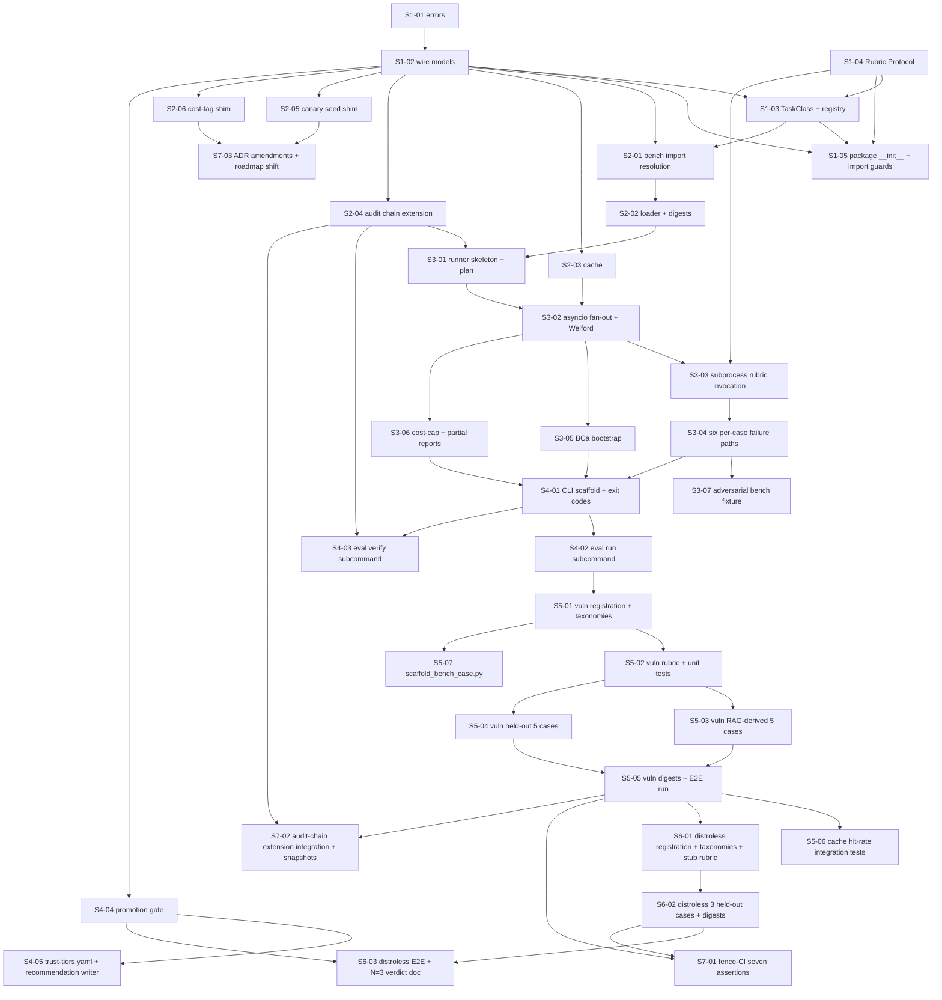

# Phase 6.5 — Per-task-class eval harness + first benches: Stories manifest

**Status:** Backlog generated; ready for autonomous implementation
**Date:** 2026-05-12
**Phase architecture:** [../phase-arch-design.md](../phase-arch-design.md)
**Phase ADRs:** [../ADRs/](../ADRs/)
**Implementation plan:** [../High-level-impl.md](../High-level-impl.md)
**Source design:** [../final-design.md](../final-design.md)

## Executive summary

This backlog decomposes Phase 6.5 into **36 stories** distributed across the 7 ordered steps from `High-level-impl.md`. The DAG is contracts-first: Step 1 (5 stories, no internal deps) gates everything else; Step 2 (6 stories, mostly independent shims) runs in parallel; Step 3 (6 stories, runner internals) serializes on Step 1+2; Step 4 (5 stories, CLI + promotion) waits on Step 3; Step 5 (8 stories, vuln-remediation bench) and Step 6 (3 stories, distroless seed) are content-heavy and follow Step 4; Step 7 (3 stories, fence-CI + amendments + snapshots) is the closing gate. Cross-cutting concerns — Pydantic `frozen=True, extra="forbid"`, mypy `--strict`, ruff format/lint, no-LLM-SDK import ban, BLAKE3 audit chain extension from Phase 0, subprocess isolation discipline (ADR-0001), and two upstream ADR amendments (Phase 4 `Canary.mint(seed=)`, Phase 5 ADR-0010 `bench_invocation`) — are anchored in specific stories rather than left as global rules.

## How to use this backlog

Start with the first story whose dependencies are all satisfied (or the lowest unblocked ID). Open the story file, read **Context** → **References** → **Goal** → **Acceptance Criteria**. Follow strict TDD: write the red test from the **TDD plan** section, run it, watch it fail with the expected message, then write minimum code to make it green, then refactor without changing observable behavior. Run the whole AC checklist after every refactor — partial green is a smell. When every box is checked, mark the story's `Status: Done` and pick the next unblocked story. If you find a real bug that needs out-of-story work, flag it; don't widen the story.

## Definition of done (applies to every story)

A story is done when:
- [ ] All acceptance criteria are checked.
- [ ] The TDD plan's red test exists, is committed, and is green.
- [ ] Any additional tests required to honor the relevant ADRs are written and green.
- [ ] Code is formatted (`ruff format`), linted clean (`ruff check`), and passes the type check (`mypy --strict`).
- [ ] No existing test was disabled or weakened without an explicit note.
- [ ] The story file's Status is updated to `Done`.
- [ ] If the story modifies any contract documented in an ADR, the ADR's "Consequences" section is reviewed for new follow-ups.

## Dependency DAG (visual)

## Stories — by step

### Step 1: Establish contracts: package scaffold, wire models, registry, Protocol

**Step goal:** `src/codegenie/eval/` exports the ≤9 stable names with `frozen=True, extra="forbid"` wire types, the `@register_task_class` decorator, and the `Rubric` Protocol — all unit-tested and statically smuggling-resistant.
**Step exit criteria mapping:** Roadmap exit criterion #1 (`src/codegenie/eval/` exists, `@register_task_class` + `BenchScore` unit-tested).

| ID | Title (slug → file) | Effort | Depends on | Summary (one sentence) |
|---|---|---|---|---|
| S1-01 | [Typed errors module (`S1-01-typed-errors-module`)](S1-01-typed-errors-module.md) | S | — | Land `src/codegenie/eval/errors.py` with the nine typed exceptions (`TaskClassNotFound`, `TaskClassAlreadyRegistered`, `BenchCaseLoadError`, `BenchCaseDigestMismatch`, `BenchCaseIDCollision`, `ChainTamperDetected`, `IncompleteReportForPromotion`, `PromotionMustBeHumanAuthorized`, `TierConfigInvalid`) used across the package. |
| S1-02 | [Wire models with frozen + extra=forbid (`S1-02-wire-models-frozen-extra-forbid`)](S1-02-wire-models-frozen-extra-forbid.md) | M | S1-01 | Define `FailureMode`, `BenchScore`, `BenchCase`, `BenchRunReport`, `PromotionVerdict` Pydantic v2 wire types in `models.py` including `complete: bool = True` (Gap #4) and `isolation_class: Literal["subprocess","microvm"] = "subprocess"` (Gap #1, ADR-0001). |
| S1-03 | [TaskClass dataclass + registry (`S1-03-taskclass-dataclass-and-registry`)](S1-03-taskclass-dataclass-and-registry.md) | M | S1-02, S1-04 | Add `@dataclass(frozen=True, slots=True) TaskClass`, `TaskClassRegistry`, `default_registry`, and `@register_task_class` decorator in `registry.py`; collision raises `TaskClassAlreadyRegistered(name, existing_qualname, incoming_qualname)`. |
| S1-04 | [Rubric Protocol (`S1-04-rubric-protocol`)](S1-04-rubric-protocol.md) | S | — | Define `@runtime_checkable Rubric` Protocol in `rubric.py` with the single `score(case, harness_output) -> BenchScore` method (ADR per Phase 5 ADR-0006 structural-Protocol convention). |
| S1-05 | [Package __init__ + static smuggling/SDK guards (`S1-05-package-init-and-static-guards`)](S1-05-package-init-and-static-guards.md) | M | S1-02, S1-03, S1-04 | Wire `src/codegenie/eval/__init__.py` exporting exactly the nine public names plus two AST-walking static tests (`test_bench_score_static.py`, `test_eval_package_imports_no_llm_sdk.py`) that fail on `confidence/llm/self_reported/model_says` substrings and on any `anthropic/openai/langchain/langgraph/transformers` import (ADR-0008). |

### Step 2: Build harness internals: loader, cache, audit chain extension, canary + cost-tag shims

**Step goal:** Runner dependencies are ready — bench cases load with digest verification, scores cache content-addressedly, `BenchRunReport`s extend the Phase 0 audit chain, canary seed is pinnable, and bench-driven sandbox runs are taggable.
**Step exit criteria mapping:** Sets up roadmap criterion #6 (audit format consistent with Phase 0 audit-anchor pattern); underpins criterion #1's runner test surface.

| ID | Title (slug → file) | Effort | Depends on | Summary (one sentence) |
|---|---|---|---|---|
| S2-01 | [Bench import-path resolution (`S2-01-bench-import-path-resolution`)](S2-01-bench-import-path-resolution.md) | S | S1-02, S1-03 | Implement `loader.load_task_class(name, bench_root)` using Option A (`sys.path` prep + direct `bench.{name}.registration` import) per Gap #2; side-effect-import triggers `@register_task_class` exactly once. |
| S2-02 | [Loader: cases + BLAKE3 digests + case-id collision (`S2-02-loader-cases-and-digests`)](S2-02-loader-cases-and-digests.md) | M | S2-01 | `load_cases(task_class)` walks `bench/{name}/cases/*/case.toml`, parses to `BenchCase`, BLAKE3-verifies each directory against `cases/digests.yaml`, sorts by `case_id`, and raises `BenchCaseDigestMismatch` or `BenchCaseIDCollision` (Gap #3) on the documented failures. |
| S2-03 | [Content-addressed score cache (`S2-03-content-addressed-cache`)](S2-03-content-addressed-cache.md) | M | S1-02 | `cache.py` `get/put/gc` with `fcntl.flock` on a sentinel file, atomic `os.rename` on write, corrupt-file-on-read treated as miss with `structlog.warn`; cache key = `BLAKE3(case_digest || sut_digest || rubric_digest || cassette_corpus_digest || harness_version || cassette_canary_pin)`. |
| S2-04 | [Audit chain extension for BenchRunReport (`S2-04-audit-chain-extension`)](S2-04-audit-chain-extension.md) | M | S1-02 | `audit.py` `write_run_record(report, out_dir) -> (Path, chain_head)` and `verify(out_dir, since)` reusing Phase 0's BLAKE3 chain primitives; genesis-record semantics (`prev_hash == "0"*64`) explicit; `prev_hash` mismatch raises `ChainTamperDetected`. |
| S2-05 | [Canary seed thread-local shim + Phase 4 amendment (`S2-05-canary-seed-shim`)](S2-05-canary-seed-shim.md) | S | S1-02 | `canary.with_pinned_canary(case)` context manager injects per-case seed via thread-local; lands the additive `Canary.mint(seed: bytes | None = None)` amendment to Phase 4 final-design (ADR-0005). |
| S2-06 | [Cost-tag env shim + Phase 5 ADR-0010 amendment (`S2-06-cost-tag-shim`)](S2-06-cost-tag-shim.md) | S | S1-02 | `cost_tag.tag_invocation(...)` context manager sets `CODEGENIE_BENCH_INVOCATION_TAG`; lands the additive `bench_invocation: bool` field on `SandboxCostEntry` amendment (ADR-0007) plus the `test_cost_ledger_tagging.py` cross-phase contract test. |

### Step 3: Implement the runner: asyncio fan-out, subprocess rubric, aggregator with BCa bootstrap

**Step goal:** `Runner.run_eval(...)` executes a full eval pipeline over a stub bench, with subprocess-isolated rubric scoring, deterministic aggregation, audit append, and the six typed per-case failure paths.
**Step exit criteria mapping:** Roadmap exit criterion #1 (runner unit-tested) and the substrate for criterion #6 (CLI end-to-end).

| ID | Title (slug → file) | Effort | Depends on | Summary (one sentence) |
|---|---|---|---|---|
| S3-01 | [Runner plan phase: load + digest + cache-key compute (`S3-01-runner-plan-phase`)](S3-01-runner-plan-phase.md) | M | S2-02, S2-04 | `runner.plan(...)` computes `sut_digest`, `rubric_digest`, `cassette_corpus_digest`, audit-chain integrity-checks at startup, derives per-case `cache_key`s, and aborts on `audit.verify().ok is False` or digest mismatch before any SUT invocation. |
| S3-02 | [Asyncio fan-out + bounded semaphore + Welford aggregator (`S3-02-asyncio-fan-out-and-aggregator`)](S3-02-asyncio-fan-out-and-aggregator.md) | M | S3-01, S2-03 | Per-case worker fan-out under `asyncio.Semaphore(N=min(cpu_count(), 4))` with `--concurrency` override, single aggregator `asyncio.Task` consuming a queue with rolling Welford mean/stddev, deterministic per-case ordering by `case_id` at report time, and a stub-bench happy-path test. |
| S3-03 | [Subprocess rubric invocation with scrubbed env (`S3-03-subprocess-rubric-invocation`)](S3-03-subprocess-rubric-invocation.md) | M | S3-02, S1-04 | `asyncio.create_subprocess_exec("python", rubric_path, env=SCRUBBED_ENV, cwd=TemporaryDirectory(), stdin=PIPE, stdout=PIPE, timeout=…)` per ADR-0001 + Phase 5 ADR-0012 env allowlist; adversarial test asserts `ANTHROPIC_API_KEY/AWS_*/HOME/USER` are unreadable from the rubric subprocess. |
| S3-04 | [Six typed per-case failure paths (`S3-04-six-per-case-failure-paths`)](S3-04-six-per-case-failure-paths.md) | M | S3-03 | Map `sut.exception`, `sut.timeout`, `rubric.malformed_output`, `rubric.timeout`, `rubric.unknown_breakdown_key`, `rubric.unknown_failure_mode` to `FailureMode(severity="block")` per ADR-0004; the run does not abort; runtime validates `BenchScore.breakdown` keys against `task_class.breakdown_keys` and resolves rubric-emitted failure codes against `failure_modes.yaml`. |
| S3-05 | [Deterministic BCa bootstrap for lower_bound_95 (`S3-05-deterministic-bca-bootstrap`)](S3-05-deterministic-bca-bootstrap.md) | M | S3-02 | Compute `lower_bound_95` via 1000-resample BCa bootstrap with seed `int(run_id[:8], 16)`; two runs with identical inputs produce byte-identical `lower_bound_95`; Hypothesis property test asserts `mean - 2*stddev ≤ lower_bound_95 ≤ mean` for N ≥ 5 (ADR-0002). |
| S3-06 | [Cost-cap path + partial reports (`S3-06-cost-cap-and-partial-reports`)](S3-06-cost-cap-and-partial-reports.md) | M | S3-02 | When `total_cost_usd > max_cost_usd`, cancel outstanding tasks, set `run_id = f"partial:{...}"` and `complete=False` (Gap #4) on the emitted report; the audit chain still records the partial run. |
| S3-07 | [Adversarial bench fixture portfolio (`S3-07-adversarial-bench-fixture`)](S3-07-adversarial-bench-fixture.md) | M | S3-04 | Build `tests/fixtures/bench/adversarial-task-class/` covering env-read attempt, rubric timeout, banned breakdown key emitted at runtime, poisoned case (digest mismatch), and malformed `failure_modes.yaml`; each fixture is driven by `tests/adv/test_rubric_*.py`. |

### Step 4: Wire the CLI and the read-only promotion gate

**Step goal:** `codegenie eval run|verify|promote-verdict` work end-to-end against the stub bench; `PromotionGate.evaluate(...)` emits typed verdicts; `PromotionGate.apply()` raises unconditionally.
**Step exit criteria mapping:** Roadmap exit criteria #5 (read-only promotion gate) and #6 (CLI exits 0; emits JSONL + audit JSON).

| ID | Title (slug → file) | Effort | Depends on | Summary (one sentence) |
|---|---|---|---|---|
| S4-01 | [CLI scaffold + partitioned exit codes (`S4-01-cli-scaffold-exit-codes`)](S4-01-cli-scaffold-exit-codes.md) | S | S3-04, S3-05, S3-06 | Click subcommand group `codegenie eval` with deferred heavy imports, `--format=human\|jsonl` (default jsonl), and partitioned exit codes 0 success / 1 generic / 2 cost-cap / 3 task-class not registered / 4 bench dir missing / 5 chain tamper / 6 digest mismatch; cold-start ≤ 600 ms benchmark. |
| S4-02 | [eval run subcommand end-to-end on stub bench (`S4-02-eval-run-subcommand`)](S4-02-eval-run-subcommand.md) | M | S4-01 | `codegenie eval run --task-class=<stub>` writes one JSONL line per case + one aggregate line to stdout, persists a `BenchRunReport` JSON to `.codegenie/eval/runs/<utc-iso>-<short>.json`, and supports `--cases`, `--concurrency`, `--max-cost-usd`, `--no-cache`, `--with-verdict`. |
| S4-03 | [eval verify subcommand for chain integrity (`S4-03-eval-verify-subcommand`)](S4-03-eval-verify-subcommand.md) | S | S4-01, S2-04 | `codegenie eval verify [--since=<iso>] [--strict]` walks the audit chain, returns exit 0 on clean / 5 on tamper, surfaces "verified-complete N / verified-incomplete M" breakdown from `VerifyResult` (Gap #4). |
| S4-04 | [PromotionGate.evaluate + apply-raises (`S4-04-promotion-gate-evaluate-and-apply-raises`)](S4-04-promotion-gate-evaluate-and-apply-raises.md) | M | S1-02 | `PromotionGate.evaluate(...)` returns `evidence_sufficient=True` only when ALL of: `lower_bound_95 ≥ thresholds[target_tier]`, `passed_count ≥ min_cases_for_promotion[target_tier]`, `block_severity_failure_modes == ()`, `audit.verify().ok is True`, `report.complete is True`, and homogeneous `isolation_class` across the evidence window; `reasons` enumerates every failing condition; `apply()` raises `PromotionMustBeHumanAuthorized` unconditionally. |
| S4-05 | [trust-tiers.yaml + recommendation writer (`S4-05-trust-tiers-yaml-and-recommendation-writer`)](S4-05-trust-tiers-yaml-and-recommendation-writer.md) | S | S4-04 | Ship minimal `docs/trust-tiers.yaml` (`thresholds: Mapping[str,float]`, `current_tiers: Mapping[str,str]`) with candidate bronze numbers + uncalibrated header (ADR-0003) and a `.codegenie/eval/recommendations/<utc-iso>.json` writer invoked when `--with-verdict` or `evidence_sufficient` flips True. |

### Step 5: Backfill `bench/vuln-remediation/` with ≥10 cases + rubric + taxonomies

**Step goal:** `bench/vuln-remediation/` is the complete worked example: ≥10 cases (5 RAG-corpus-derived + 5 held-out), a subprocess rubric, `breakdown_keys.py`, `failure_modes.yaml`, signed digests, and a green E2E run.
**Step exit criteria mapping:** Roadmap exit criterion #2 (≥10 cases + `lower_bound_95` recorded as candidate) and #6 (real-bench end-to-end run).

| ID | Title (slug → file) | Effort | Depends on | Summary (one sentence) |
|---|---|---|---|---|
| S5-01 | [vuln-remediation registration + breakdown_keys + failure_modes (`S5-01-vuln-registration-and-taxonomies`)](S5-01-vuln-registration-and-taxonomies.md) | S | S4-02 | Land `bench/vuln-remediation/{registration.py, breakdown_keys.py, failure_modes.yaml}` with exactly one `@register_task_class("vuln-remediation", min_cases_for_promotion={"bronze":10,"silver":25})`, a `StrEnum BreakdownKey` whose values pass the substring ban (ADR-0008), and a full taxonomy with `severity: block|warn|info` per code (ADR-0004). |
| S5-02 | [vuln-remediation rubric + bench-author unit tests (`S5-02-vuln-rubric-and-unit-tests`)](S5-02-vuln-rubric-and-unit-tests.md) | M | S5-01 | Implement `bench/vuln-remediation/rubric.py` as a deterministic subprocess entrypoint (`if __name__ == "__main__"`) that reads JSON from stdin and writes a `BenchScore` JSON to stdout in ≤60 s per case; cover it with `bench/vuln-remediation/tests/test_rubric_unit.py` (in-process, trusted boundary). |
| S5-03 | [vuln-remediation 5 RAG-corpus-derived cases (`S5-03-vuln-rag-corpus-derived-cases`)](S5-03-vuln-rag-corpus-derived-cases.md) | M | S5-02 | Mechanically derive 5 cases from `tests/cassettes/phase4/` solved-example corpus with `curation_class="rag-corpus-derived"`; each has `case.toml`, `input/`, `expected/`, `cassette_canary_pin`, `case_digest` (ADR-0006). |
| S5-04 | [vuln-remediation 5 held-out hand-curated cases (`S5-04-vuln-held-out-cases`)](S5-04-vuln-held-out-cases.md) | L | S5-02 | Hand-curate 5 CVE-fix cases with `curation_class="held-out"` (independent CVEs not present in the RAG corpus); each carries ground-truth `input/` snapshot + `expected/` diff + cassette pin + case digest. |
| S5-05 | [vuln-remediation digests.yaml + E2E green run (`S5-05-vuln-digests-and-e2e-run`)](S5-05-vuln-digests-and-e2e-run.md) | M | S5-03, S5-04 | Sign all 10 cases in `bench/vuln-remediation/cases/digests.yaml`; `codegenie eval run --task-class=vuln-remediation` exits 0 on CI, ≤12 min cold cache, emits `lower_bound_95` as the recorded bronze→silver candidate (uncalibrated comment in `bench/vuln-remediation/README.md`). |
| S5-06 | [Cache hit-rate + invalidation integration tests (`S5-06-cache-hit-rate-and-invalidation-tests`)](S5-06-cache-hit-rate-and-invalidation-tests.md) | S | S5-05 | `tests/integration/test_cache_hit_rate.py` asserts 10/10 `cost_usd == 0.0` and wall-clock ≤ 8 s on a warm rerun; `test_cache_invalidation.py` asserts a whitespace edit to `rubric.py` invalidates all 10 entries while a whitespace edit to one `case.toml` invalidates exactly that case. |
| S5-07 | [scripts/scaffold_bench_case.py operator tool (`S5-07-scaffold-bench-case-script`)](S5-07-scaffold-bench-case-script.md) | S | S5-01 | Operator tooling that takes `--task-class` + `--cve` and emits a scaffolded case directory with stubbed `case.toml`, `input/`, `expected/`, and an entry-ready `digests.yaml` line (Open Q #8). |

### Step 6: Seed `bench/migration-chainguard-distroless/` with ≥3 cases + rubric stub + taxonomies

**Step goal:** Phase 7 has a complete directory skeleton — registration, stub rubric, breakdown keys, failure-mode taxonomy, ≥3 held-out seed cases, signed digests. Promotion gate emits `evidence_sufficient=False` at N=3 as the intended conservative output.
**Step exit criteria mapping:** Roadmap exit criterion #3 (≥3 seed cases + working `rubric.py`) and the Phase 7 handoff per criterion #7.

| ID | Title (slug → file) | Effort | Depends on | Summary (one sentence) |
|---|---|---|---|---|
| S6-01 | [distroless registration + taxonomies + stub rubric (`S6-01-distroless-registration-and-stub-rubric`)](S6-01-distroless-registration-and-stub-rubric.md) | M | S5-05 | Land `bench/migration-chainguard-distroless/{registration.py, breakdown_keys.py, failure_modes.yaml, rubric.py}`: registration declares only `bronze: 10` in `min_cases_for_promotion`; breakdown keys include `BASE_IMAGE_SWAPPED`, `SHELL_FREE`, `BUILD_PASSES`; rubric scores Dockerfile-derived signals as a subprocess entrypoint. |
| S6-02 | [distroless 3 held-out cases + digests (`S6-02-distroless-3-held-out-cases`)](S6-02-distroless-3-held-out-cases.md) | M | S6-01 | Three Chainguard-publicly-documented seed cases under `cases/` with `curation_class="held-out"`, each with `case.toml`, `input/Dockerfile`, `expected/Dockerfile + expected/build.log`, `cassette_canary_pin`, `case_digest`; all signed in `cases/digests.yaml`. |
| S6-03 | [distroless E2E run + N=3 verdict documentation (`S6-03-distroless-e2e-and-verdict-doc`)](S6-03-distroless-e2e-and-verdict-doc.md) | S | S6-02, S4-04 | `codegenie eval run --task-class=migration-chainguard-distroless` exits 0 with N=3 `per_case` entries; `PromotionGate.evaluate(target_tier="bronze")` returns `evidence_sufficient=False` with `reasons` including "case count below floor" (3 < 10); `bench/migration-chainguard-distroless/README.md` documents what Phase 7 must add. |

### Step 7: Extend fence-CI; lock in end-to-end audit; ship cross-phase amendments

**Step goal:** A PR adding a task class without the full directory contract fails CI with a path-specific diagnostic in ≤2 s. Audit chain integrates end-to-end. All ADR amendments land before the phase merges.
**Step exit criteria mapping:** Roadmap exit criterion #4 (fence-CI rejects missing bench/), reinforces #6 (audit format) and #7 (Phase 7 hard precondition shift from `mean` to `lower_bound_95`).

| ID | Title (slug → file) | Effort | Depends on | Summary (one sentence) |
|---|---|---|---|---|
| S7-01 | [Fence-CI seven structural assertions (`S7-01-fence-ci-seven-assertions`)](S7-01-fence-ci-seven-assertions.md) | M | S5-05, S6-02 | `tests/unit/test_eval_fence.py` enforces seven AST + filesystem assertions (directory contract, minimum case count, curation-class held-out floor ≥5 if tier ≥ silver, literal-name-only `@register_task_class`, breakdown-key static ban, failure-mode taxonomy validity, case-id uniqueness Gap #3) in ≤2 s combined wall-clock; synthetic-failure tests cover each diagnostic. |
| S7-02 | [Audit-chain end-to-end integration + golden snapshots (`S7-02-audit-chain-integration-and-snapshots`)](S7-02-audit-chain-integration-and-snapshots.md) | M | S5-05, S2-04 | `tests/integration/test_audit_chain_extension.py` runs three consecutive `run_eval` calls producing a chain of length 3 that `audit.verify` walks clean; freeze `tests/snapshots/bench_run_report.v1.json` and `eval_run_audit_record.v1.json` byte-shapes with a regen script + drift diagnostic. |
| S7-03 | [Cross-phase ADR amendments + roadmap shift (`S7-03-cross-phase-adr-amendments-and-roadmap-shift`)](S7-03-cross-phase-adr-amendments-and-roadmap-shift.md) | M | S2-05, S2-06 | Merge the three cross-phase amendments in the same train: Phase 4 final-design (`Canary.mint(seed=...)` additive kwarg, ADR-0005); Phase 5 ADR-0010 (`bench_invocation: bool` on `SandboxCostEntry`, ADR-0007); Phase 5 ADR-0016 (automatic-demotion-is-recommendation-shift clarification); and shift roadmap §Phase 7 exit criterion from `bench_score.mean` to `bench_score.lower_bound_95` (ADR-0002). |

## Cross-cutting concerns

- **Pydantic frozen + extra=forbid + static introspection guards.** Every wire type in `models.py` ships `model_config = ConfigDict(frozen=True, extra="forbid")`; field shapes and bans are enforced by `test_bench_score_static.py` (substring ban) and the AST-walking import-ban test. Anchored in S1-02 + S1-05; touched again by S3-04 (runtime defense-in-depth on breakdown keys) and S7-01 (fence assertion #5).
- **No-LLM-SDK import discipline.** `src/codegenie/eval/**/*.py` may not import `anthropic`, `openai`, `langchain`, `langgraph`, or `transformers`. The SUT may; the harness may not. Enforced statically in S1-05 (`test_eval_package_imports_no_llm_sdk.py`); extended in the Phase 0 import-linter contract.
- **BLAKE3 audit chain extension (Phase 0 reuse, not reinvent).** Every audit operation in S2-04 / S3-01 / S4-03 / S7-02 reuses `codegenie.audit.chain_append` and `codegenie.audit.chain_verify`; genesis-record semantics (`prev_hash == "0"*64`) are explicit, not implicit.
- **Subprocess isolation discipline (ADR-0001).** The runner *never* imports the rubric module. S3-03 owns the invocation contract (`asyncio.create_subprocess_exec` + `SCRUBBED_ENV` + `cwd=TemporaryDirectory()`); S3-07 stress-tests it; S5-02 + S6-01 honor the `if __name__ == "__main__"` entrypoint requirement.
- **Cross-phase ADR amendments land with the code that depends on them.** Phase 4 `Canary.mint(seed=...)` amendment lands in the same PR as S2-05; Phase 5 ADR-0010 `bench_invocation` amendment lands with S2-06; both are re-checked by S7-03 before the phase merges, to avoid blocking the phase-merge train on independent CODEOWNERS cycles.

## Exit-criteria coverage

| Exit criterion (verbatim or close) | Story / stories |
|---|---|
| #1 `src/codegenie/eval/` package with unit-tested `@register_task_class`, `BenchScore`, harness runner, and trust-tier promotion gate | S1-01, S1-02, S1-03, S1-04, S1-05, S3-01, S3-02, S3-03, S3-04, S3-05, S3-06, S4-04 |
| #2 `bench/vuln-remediation/cases/` ≥10 curated cases + working `rubric.py` + aggregate `lower_bound_95` as bronze→silver candidate | S5-01, S5-02, S5-03, S5-04, S5-05 |
| #3 `bench/migration-chainguard-distroless/cases/` ≥3 seed cases + working `rubric.py` | S6-01, S6-02, S6-03 |
| #4 Fence-CI rejects a PR that adds `@register_task_class("foo")` without `bench/foo/{cases, rubric.py, registration.py}` with a path-specific diagnostic | S7-01 |
| #5 Trust-tier promotion gate wired but does NOT auto-promote | S4-04, S4-05 |
| #6 `codegenie eval run --task-class=vuln-remediation` exits 0; emits JSONL + `.codegenie/eval/runs/<utc-iso>-<short>.json` audit record | S4-01, S4-02, S4-03, S5-05, S7-02 |
| #7 Phase 7 can reference ≥10 cases + `bench_score.lower_bound_95 ≥ tier_threshold[bronze]` as hard precondition | S5-05, S6-03, S7-03 |

## Open implementation questions

- **OQ #1 Concurrency knob tuning under portfolio scale** — likely to surface in **S3-02** (asyncio fan-out) when CI wall-clock pressure reveals the hardcoded `min(cpu_count(), 4)` floor.
- **OQ #2 Per-host vs canonical-host audit-chain fingerprinting (Gap #5)** — surfaces in **S2-04** and again in **S7-02** when integration tests run across runners; current floor is per-host audit chain with one canonical promotion-source host.
- **OQ #3 `_codegenie_bench` vs `bench` import path (Gap #2)** — picked Option A; the contingency surfaces in **S2-01** if packaging conflicts arise.
- **OQ #4 Tempdir cleanup contract for stranded subprocesses** — surfaces in **S3-03** (subprocess invocation) and **S3-07** (adversarial fixture); deferred to Phase 16.
- **OQ #5 `docs/trust-tiers.yaml` schema details (versioning, per-task-class overrides, downgrade-threshold equality)** — surfaces in **S4-05**; defers to production ADR-0015 calibration.
- **OQ #6 `tests/cassettes/phase4/` vs `tests/cassettes/bench/` layout** — surfaces in **S5-03** (RAG-corpus-derived case construction); no harness change needed for either layout.
- **OQ #7 `PromotionVerdict` consumer contract** — surfaces in **S4-05** (recommendation writer); consumers (Phase 11/12) are deferred.
- **OQ #8 Bench-author bootstrap experience** — addressed directly by **S5-07** (`scripts/scaffold_bench_case.py`).

## Backlog stats

- **Total stories:** 36
- **Stories per step:** S1 = 5, S2 = 6, S3 = 7, S4 = 5, S5 = 7, S6 = 3, S7 = 3
- **Effort distribution:** S = 12, M = 22, L = 2 (S5-04 hand-curated held-out cases; effectively S3-* sum is L if rolled up)
- **Longest dependency chain:** S1-01 → S1-02 → S2-01 → S2-02 → S3-01 → S3-02 → S3-03 → S3-04 → S4-01 → S4-02 → S5-01 → S5-02 → S5-04 → S5-05 → S6-01 → S6-02 → S6-03 → S7-01 — **18 stories**, gated by the Step 5 curation long-pole (held-out cases).
