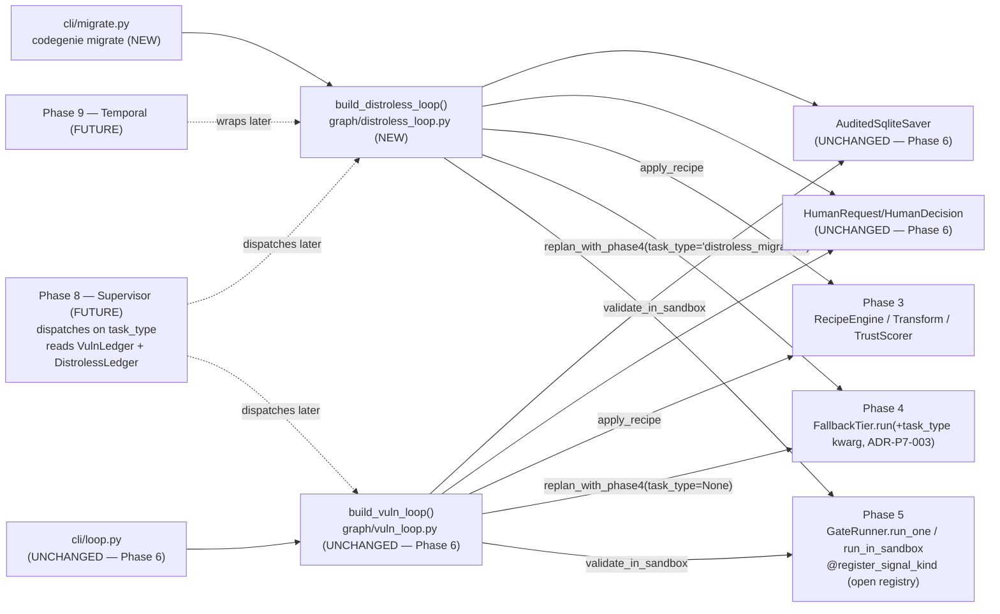
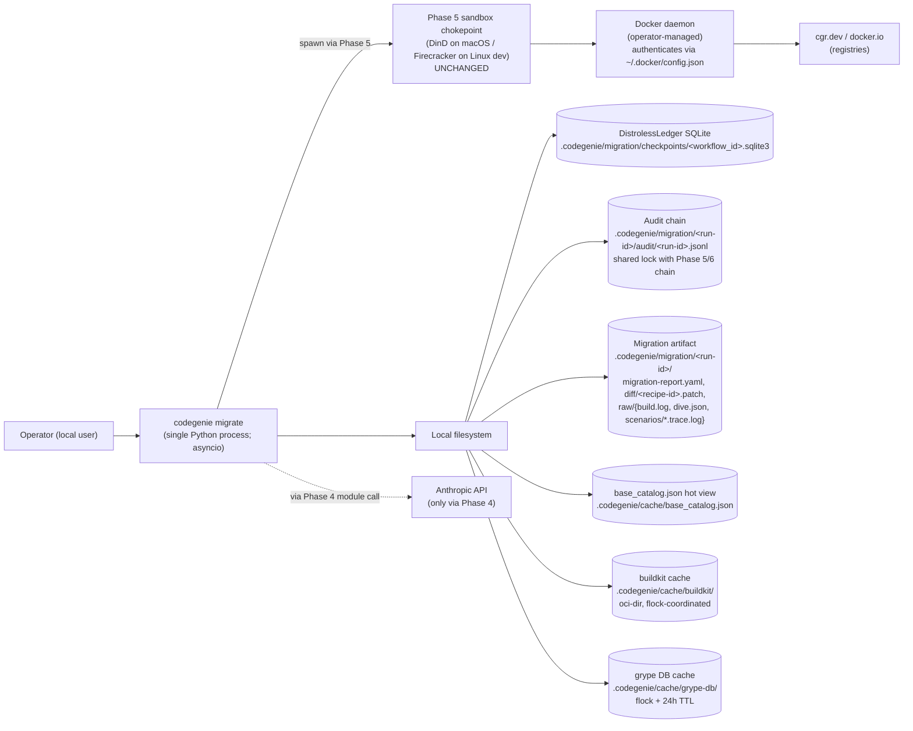
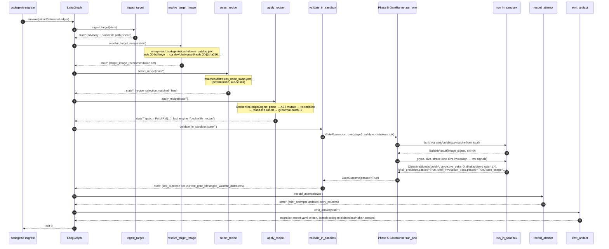

# Phase 07 — Add migration task class (Chainguard distroless): Architecture

**Status:** Architecture spec
**Date:** 2026-05-12
**Inputs:** `final-design.md` (synthesized design) · `critique.md` · `design-performance.md` · `design-security.md` · `design-best-practices.md` · `docs/production/design.md` · `docs/roadmap.md` (Phase 7 entry; Phase 8 handoff) · ADRs 0007, 0008, 0009, 0011, 0012, 0014, 0019, 0022, 0028 · prior-phase `phase-arch-design.md` for Phases 0–6
**Audience:** the engineer implementing this phase

---

## Executive summary

Phase 7 introduces **Chainguard distroless container migration** as the second task class, runs it through the *same* SHERPA-disciplined LangGraph state machine Phase 6 built for vuln remediation, and *tests* whether the Phase 0–6 contract surfaces extend by **addition** rather than edit. The synthesis (`final-design.md` Lens summary) chose a **hybrid (c)** position: ship as **new files only** *plus six named, ADR-gated additive seams* into Phase 0–6 surfaces (new optional Pydantic fields; one new default-`None` kwarg; one previously-closed `Literal` extended additively; one allowlist extension), each with a per-phase ADR and a regenerated **contract-surface snapshot** (`tests/integration/test_contract_surface_snapshot.py`) in the same PR. The amendment to ADR-0028 — *"extension by addition" means **behavior-preserving additive extension***, not "zero source-line diffs" — is the load-bearing decision this phase lands. The architecture below specifies (1) the six seams and what each guarantees, (2) the synth-original `@register_gate_probe` registry that keeps Phase 2's `Probe` ABC and coordinator byte-identical while still allowing `ShellInvocationTraceProbe` to run at gate time, (3) the `DistrolessLedger` sibling to `VulnLedger` (ADR-0022 strike two; Phase 8 inherits the merge), (4) `dive_efficiency` ships **advisory-only** (no strict-AND on size ratio — closes critic sec.3), (5) Dockerfile recipes are **handrolled only** (OpenRewrite `rewrite-docker` deferred to Phase 15 — closes critic best-practices.4), and (6) credentials live in the operator's `~/.docker/config.json` (`codegenie-secretd` daemon is vetoed by `CLAUDE.md` — closes critic sec.4). The new public surface is one CLI verb (`codegenie migrate`), one graph factory (`build_distroless_loop()`), one `RecipeEngine` impl (`DockerfileRecipeEngine`), one `Transform` impl (`DockerfileBaseImageSwapTransform`), two probes (`BaseImageProbe`, `ShellInvocationTraceProbe`), one Pydantic ledger (`DistrolessLedger`), four signal-kind registrations, three tool wrappers (`buildkit`, `dive`, `dockerfile_parse`), and a pre-rendered `base_catalog.json` hot view shape-compatible with Phase 8's Redis lift.

---

## Goals

Pulled from `roadmap.md` Phase 7 exit criteria and `final-design.md §Goals`, concretized:

1. **G1 — Both task classes run from the same orchestration substrate.** `codegenie loop run <repo> --cve <id>` (vuln; Phase 6) and `codegenie migrate <repo> --target distroless` (this phase) build LangGraph subgraphs from the same `graph/` package, share `AuditedSqliteSaver`, extend the same BLAKE3 audit chain, and reuse `HumanRequest`/`HumanDecision` verbatim. (roadmap exit #1; `final-design.md §Goals#15`)
2. **G2 — Contract-surface freeze for Phases 0–6 enforced permanently.** `tests/integration/test_contract_surface_snapshot.py` snapshots `model_json_schema()` for every Phase 0–6 Pydantic contract, every ABC signature, every closed `Literal`, and every registry decorator signature into `tools/contract-surface.snapshot.json`. Any drift fails CI; regeneration is a deliberate `pytest --update-contract-snapshot` invocation tied in a 1:1 PR to a per-phase ADR. (`final-design.md §Goals#18`; component 10; closes critic best-practices.5)
3. **G3 — Six (and only six) ADR-gated additive seams cross the Phase 0–6 surface.** Enumerated as ADR-P7-001..006 in §Component design and §Roadmap coherence check below. Every other Phase 0–6 source line change fails the snapshot canary.
4. **G4 — Full Phase 3/4/5/6 regression suite passes on every Phase 7 PR.** `tests/integration/test_phase3_4_5_6_unchanged.py` runs every prior-phase integration test verbatim. Failure blocks merge. (roadmap exit; `final-design.md §Goals#17`)
5. **G5 — E2E exit criterion: Node.js fixture migrates `node:20-bullseye-slim` → `cgr.dev/chainguard/node:20`** via the recipe path. `tests/integration/test_migrate_node_e2e.py` asserts: recipe match → buildkit build → grype non-positive CVE delta → `dive` reports no `/bin/sh` → `ShellInvocationTraceProbe` reports `runtime_shell_count == 0` → branch + patch produced. (roadmap exit; `final-design.md §Goals#19`)
6. **G6 — Workflows-per-hour, distroless-only, single worker.** ≥ 6/hr cold, ≥ 24/hr warm. (`final-design.md §Goals#1`; numbers honest under Linux DinD — critic perf.2 landed)
7. **G7 — Workflows-per-hour, mixed portfolio (vuln+distroless), warm.** ≥ 10/hr.
8. **G8 — Time-to-PR p95 envelope.** Recipe hot ≤ 240 s; RAG fallback ≤ 420 s; LLM fallback ≤ 600 s.
9. **G9 — $/PR.** Recipe = $0; LLM-fallback ≤ $0.12 (Sonnet 4.7; Phase 4 cap unchanged).
10. **G10 — Buildkit layer-cache hit rate.** ≥ 85% pulled-layer, ≥ 60% derived-layer after first 3-fixture warm-up run.
11. **G11 — Per-worker steady-state memory ≤ 2.4 GB.**
12. **G12 — Regression-suite wall-clock canary, never retired.** p50 ≤ 4 min, p95 ≤ 7 min; fires on >10% regression. (`tests/perf/test_regression_suite_wall_clock.py`; closes critic best-practices.5 the *other half* — extension-by-addition enforcement plus a time-budget enforcement)
13. **G13 — Adversarial-Dockerfile corpus.** ≥ 30 fixtures (BOM, UTF-16, CR line endings, `ONBUILD`, 2 MB file, parse-bomb, unicode normalization, hidden `\r`, Windows-1252). Each fixture either parses to a clean AST or is rejected with a documented `dockerfile.parse_rejected` reason code. (closes critic best-practices.things-missed)
14. **G14 — Dockerfile round-trip safety property.** `parse(serialize(parse(x))) == parse(x)` holds on the entire adversarial corpus (Hypothesis property test).
15. **G15 — `ShellInvocationTraceProbe` is gate-time only.** Registered via the **new** `@register_gate_probe` registry (`src/codegenie/probes/gate_registry.py`); the Phase 2 coordinator is byte-identical pre/post Phase 7 and never sees this probe. Closes critic sec.1, sec.2, perf.1.
16. **G16 — `dive_efficiency` ships advisory-only.** `passed=True` always; `details` carry size/efficiency/wasted bytes. Closes critic sec.3 (Alpine→glibc legitimate growth no longer auto-fails).
17. **G17 — Credential surface: operator-side `~/.docker/config.json` only.** Phase 7 does not read, store, mint, or daemonize credentials. `cgr.dev` and `docker.io` are added to Phase 5's existing egress allowlist via ADR-P7-002. Vetoes `codegenie-secretd` per `CLAUDE.md`.
18. **G18 — Token contributions inside Phase 7's package boundary: 0.** Fence-CI (Phase 0) extended to deny `anthropic`/`chromadb`/`sentence-transformers` imports under `probes/`, `transforms/`, `recipes/`, `catalogs/`. (`final-design.md §Goals#16`)
19. **G19 — No new ABCs, no new top-level packages, no Phase 2 coordinator edit, no Phase 6 `cli/loop.py` edit, no Phase 5 sandbox-profile bump, no rootfs digest bump.** Quantitative invariant verified by directory-structure tests and the snapshot canary.
20. **G20 — Handrolled Dockerfile recipes only.** OpenRewrite `rewrite-docker` deferred to Phase 15 (ADR-P7-004). Closes critic best-practices.4.

---

## Non-goals

Each with *why* it isn't in scope:

1. **No `codegenie-secretd` credential broker daemon.** `CLAUDE.md` veto ("Single Python project, no services, no databases"). Production credential handling is Phase 16's job. (`final-design.md §Conflict-resolution row 4a`; vetoed at commitments-fit=0.)
2. **No Phase 5 microVM rootfs bump.** Security design's +350–600 MB rootfs (buildx + dive + dockerfile-parse + cosign + image-runner) is rejected; Phase 5 sandbox boundary is reused as-is. (`final-design.md §Conflict-resolution row 6`; closes critic sec.4.)
3. **No cosign/Rekor signature verification.** Chainguard's published-signature contract is not documented as stable at Phase 7 time (critic sec.5). Deferred to Phase 16 hardening.
4. **No OpenRewrite `rewrite-docker` engine.** Critic best-practices.4 landed: covers base-image swaps adequately but multi-stage refactor poorly. Ship handrolled-only; Phase 15 re-evaluates. (ADR-P7-004.)
5. **No edit to Phase 6 `cli/loop.py`.** Phase 6 exit criterion #14 is preserved; new `cli/migrate.py` ships in parallel. Phase 8 unifies. (`final-design.md §Goals#15`.)
6. **No new Phase 2 coordinator branch for gate-lifecycle probes.** `@register_gate_probe` lives in a separate registry module; the coordinator never sees gate probes. (Closes critic sec.2.)
7. **No `applies_to_lifecycle` field on the `Probe` ABC.** The ABC is byte-stable. The lifecycle distinction is encoded by *which registry* the probe registers into. (Closes critic sec.1.)
8. **No new value in `RecipeSelection.reason`.** Phase 3's existing `"unsupported_dialect"` covers image dialect mismatch. (Closes critic best-practices.2; `final-design.md §Conflict-resolution row 9`.)
9. **No strict-AND signal on image-size ratio.** `dive_efficiency` is advisory; legitimate Alpine→glibc migrations don't auto-fail. (Closes critic sec.3; ADR-P7-007 (new).)
10. **No multi-arch image fixtures.** `linux/amd64` only; multi-arch is a Phase 7.1 follow-up. Cache key includes `--platform=linux/amd64` to prevent silent reuse across arches (closes critic perf.assumption.2).
11. **No real GitHub PR.** Phase 11 owns that. ADR-0009 ("humans always merge") unchanged.
12. **No autonomous catalog refresh.** `cve_image_recommendations.yaml` is hand-curated in Phase 7; Phase 14 will continuous-gather + webhook this.
13. **No unification of `VulnLedger` and `DistrolessLedger`.** ADR-0022 Three Strikes: strike two; Phase 8 (or Phase 15) does the merge.
14. **No ELF-symbol scanning** in `shell_presence` collector. Heuristic shell-binary names only. Chainguard distroless does not ship arbitrary binaries; deferred to Phase 12+.
15. **No `codegenie cache prewarm` operator command** for `cgr.dev`. First workflow on a fresh runner pays cold pull cost; trivial follow-up (~30 LOC) deferred.

---

## Architectural context

Phase 7 sits **beside** Phase 6's `build_vuln_loop()` and **below** the (future) Phase 8 supervisor. It reuses Phase 5's `GateRunner.run_one`, Phase 4's `FallbackTier.run` (with one default-`None` kwarg added), Phase 3's `RecipeEngine` / `Transform` ABCs verbatim, and Phase 2's `Probe` ABC verbatim. The CLI verb (`codegenie migrate`) is a sibling to `codegenie loop`; Phase 8 will subsume both behind a supervisor (`final-design.md §Roadmap coherence check`).



The shape is a *deliberate mirror* of Phase 6. Reading either subgraph teaches the other — this is the synthesizer's evidence that the contract surface extended cleanly (with the six named seams paying for the cleanliness).

---

## 4+1 architectural views

### Logical view — components and contracts

```mermaid
classDiagram
    class DistrolessLedger {
      <<Pydantic, extra=forbid, frozen=False>>
      +schema_version: Literal["v0.7.0"]
      +workflow_id: str
      +thread_id: str
      +repo_path: Path
      +target_image_recommendation: TargetImageRecommendation
      +dockerfile_path: Path
      +recipe_selection: Optional[RecipeSelection]
      +last_engine: Optional[Literal["dockerfile_recipe","rag","phase4_llm"]]
      +retry_count: int = 0
      +max_attempts: int = 3
      +current_gate_id: Optional[str]
      +last_outcome: Optional[GateOutcome]
      +patch: Optional[PatchRef]
      +prior_attempts: list[AttemptSummary]
      +human_request: Optional[HumanRequest]
      +human_decision: Optional[HumanDecision]
      +chain_head: bytes
      +events: list[GraphEvent]
    }

    class BaseImageProbe {
      <<Probe ABC — Phase 2 unchanged>>
      +name: "base_image"
      +layer: "C"
      +applies_to_tasks: ["distroless_migration","vuln_remediation"]
      +declared_inputs: ["**/Dockerfile",...]
      +run(view) DockerfileInventory
    }

    class ShellInvocationTraceProbe {
      <<Probe ABC — Phase 2 unchanged>>
      <<registered via @register_gate_probe>>
      +name: "shell_invocation_trace"
      +applies_to_tasks: ["distroless_migration"]
      +declared_inputs: ["__image_digest__:<candidate>",...]
      +run(view) ShellInvocationTrace
    }

    class DockerfileRecipeEngine {
      <<RecipeEngine ABC — Phase 3 unchanged>>
      +name: "dockerfile"
      +available() bool
      +apply(ApplyContext) RecipeApplication
    }

    class DockerfileBaseImageSwapTransform {
      <<Transform ABC — Phase 3 unchanged>>
      +name: "dockerfile_base_image_swap"
      +applies_to_tasks: ["distroless_migration"]
      +run(TransformInput) TransformOutput
    }

    class GateProbeRegistry {
      <<NEW module — ADR-P7-001>>
      +register_gate_probe(cls) cls
      +all_gate_probes() Sequence~Probe~
    }

    class BuildDistrolessLoop {
      <<factory>>
      +build_distroless_loop(checkpointer, max_attempts, force_rebuild) CompiledGraph
    }

    class BaseCatalogHotView {
      <<JSON file — .codegenie/cache/base_catalog.json>>
      +read() dict[CveId, TargetImageRecommendation]
      +render_base_catalog() None
    }

    class CliMigrate {
      <<click commands — NEW cli/migrate.py>>
      +run() int
      +resume() int
      +inspect() int
      +replay() int
      +render() int
    }

    class ContractSurfaceSnapshot {
      <<integration test — permanent canary>>
      +tools/contract-surface.snapshot.json
      +snapshot_phase0_through_6() bytes
    }

    BuildDistrolessLoop --> DistrolessLedger : state type
    BuildDistrolessLoop --> CliMigrate : entry
    DockerfileBaseImageSwapTransform --> DockerfileRecipeEngine : delegates apply
    ShellInvocationTraceProbe --> GateProbeRegistry : registers
    BuildDistrolessLoop --> BaseCatalogHotView : resolve_target_image reads
    ContractSurfaceSnapshot ..> BaseImageProbe : verifies ABC byte-stable
    ContractSurfaceSnapshot ..> DockerfileRecipeEngine : verifies ABC byte-stable
```



**Reading guide.** `DistrolessLedger` is the only contract every distroless-loop node touches — exact parallel to Phase 6's `VulnLedger`. `GateProbeRegistry` is the synth-original module that keeps the `Probe` ABC and Phase 2 coordinator byte-stable while still letting `ShellInvocationTraceProbe` run at gate time. `BaseCatalogHotView` is the on-disk JSON file that is shape-compatible with Phase 8's Redis lift (so Phase 8 lifts the file into Redis with no schema work). `ContractSurfaceSnapshot` is the permanent canary that proves G2/G3.

### Process view — runtime concurrency and durability

```mermaid
sequenceDiagram
    autonumber
    participant CLI as cli/migrate.py
    participant LG as LangGraph runtime
    participant N as Node (sync)
    participant P5 as Phase 5 GateRunner.run_one
    participant SB as run_in_sandbox (Phase 5 chokepoint)
    participant SAV as AuditedSqliteSaver
    participant CHAIN as audit chain (.jsonl)
    participant DISK as DistrolessLedger SQLite

    CLI->>LG: build_distroless_loop().ainvoke(initial, config)
    LG->>SAV: put(initial checkpoint) — fsync per node boundary
    SAV->>CHAIN: append checkpoint.write event (BLAKE3)
    SAV->>DISK: WAL write
    loop per node transition (ingest_target → resolve_target_image → select_recipe → ...)
        LG->>N: invoke(state)
        N-->>LG: state' = state.model_copy(update={...})
        Note over LG: after-node id()-diff hook (Phase 6 unchanged)
        LG->>SAV: put(checkpoint) — fsync
        SAV->>CHAIN: append
    end
    alt route to validate_in_sandbox
        LG->>P5: GateRunner.run_one(transition=stage6_validate_distroless, ctx)
        P5->>SB: run_in_sandbox (build / grype / dive / strace) — Phase 5 chokepoint
        SB-->>P5: ObjectiveSignals (build, grype, dive[advisory], shell_presence, shell_invocation_trace)
        P5-->>LG: GateOutcome
    end
    alt route to await_human
        LG->>SAV: checkpoint at interrupt frame
        LG-->>CLI: paused; exit 12 (paused_at_human)
    end
```

**Key properties.** (1) Every gate-time subprocess — `docker buildx build`, `dive`, `strace` — flows through Phase 5's `run_in_sandbox` chokepoint. **No new sandbox profile**; no rootfs bump. (2) The strace probe runs *against the candidate (post-recipe) image* inside the chokepoint, not against the target's entrypoint at gather time (closes critic perf.1). (3) Audit chain extension is single-writer (the Phase 6 `threading.Lock` is reused verbatim — no new chain). (4) Per-workflow SQLite at `.codegenie/migration/checkpoints/<workflow_id>.sqlite3`; different directory from vuln, same writer class. (5) Phase 5's three-retry semantics apply unchanged; on retry-1 the node re-enters `replan_with_phase4` with `prior_attempts` *and* `task_type="distroless_migration"`.

### Development view — code organization

Phase 7 adds *new files only* under `src/codegenie/` with the six named seams documented inline.

```mermaid
graph TD
    SRC["src/codegenie/"]

    SRC --> CLI["cli/migrate.py<br/>(NEW)"]
    SRC --> CLI_LOOP["cli/loop.py<br/>(UNCHANGED — Phase 6)"]
    SRC --> CLI_REM["cli/remediate.py<br/>(UNCHANGED — Phase 3)"]

    SRC --> GRAPH["graph/"]
    GRAPH --> GR_DL["distroless_loop.py<br/>(NEW — build_distroless_loop)"]
    GRAPH --> GR_STATE["state_distroless.py<br/>(NEW — DistrolessLedger)"]
    GRAPH --> GR_NODES["nodes/distroless/<br/>(NEW — 11 node files)"]
    GRAPH --> GR_VL["vuln_loop.py / state.py / hitl.py<br/>(UNCHANGED — Phase 6)"]

    SRC --> PROBES["probes/"]
    PROBES --> PB_BI["base_image.py<br/>(NEW — @register_probe; layer C)"]
    PROBES --> PB_SI["shell_invocation_trace.py<br/>(NEW — @register_gate_probe)"]
    PROBES --> PB_GR["gate_registry.py<br/>(NEW — ADR-P7-001; pure addition)"]
    PROBES --> PB_BASE["base.py<br/>(UNCHANGED — Phase 2 Probe ABC)"]
    PROBES --> PB_RUNTIME["runtime_trace.py<br/>(UNCHANGED — Phase 2 no-op stub; ADR-P7-005)"]

    SRC --> RECIPES["recipes/"]
    RECIPES --> RC_DE["engines/dockerfile_engine.py<br/>(NEW — RecipeEngine impl)"]
    RECIPES --> RC_CAT["catalog/docker/<br/>(NEW data — 3 YAML recipes)"]

    SRC --> XFORM["transforms/"]
    XFORM --> XF_DBS["dockerfile_base_image_swap.py<br/>(NEW — Transform impl)"]

    SRC --> CAT["catalogs/"]
    CAT --> CT_DL["distroless/<br/>(NEW data — cve_image_recommendations.yaml,<br/>image_dialect_rules.yaml, _schema.json)"]

    SRC --> SKILLS["skills/builtins/distroless/<br/>(NEW data — 3 .md files)"]

    SRC --> RAG["rag/seed_corpus/distroless/<br/>(NEW data — N solved-example .md files)"]

    SRC --> SBX["sandbox/signals/"]
    SBX --> SBX_DIVE["dive.py<br/>(NEW — @register_signal_kind)"]
    SBX --> SBX_SP["shell_presence.py<br/>(NEW — @register_signal_kind)"]
    SBX --> SBX_SIT["shell_invocation_trace.py<br/>(NEW — @register_signal_kind)"]
    SBX --> SBX_BI["base_image.py<br/>(NEW — @register_signal_kind)"]
    SBX --> SBX_MODELS["models.py<br/>(SEAM — ObjectiveSignals widened by 4<br/>optional fields; ADR-P7-002)"]

    SRC --> TOOLS["tools/"]
    TOOLS --> TL_BK["buildkit.py<br/>(NEW)"]
    TOOLS --> TL_DV["tools/dive.py<br/>(NEW)"]
    TOOLS --> TL_DF["dockerfile_parse.py<br/>(NEW)"]

    SRC --> SANDBOX_HOST["sandbox/host/"]
    SANDBOX_HOST --> SB_AB["allowed_binaries.py<br/>(SEAM — extended +docker,+dive; ADR-P7-002)"]
    SANDBOX_HOST --> SB_EG["egress_allowlist.py<br/>(SEAM — extended +cgr.dev,+docker.io; ADR-P7-002)"]

    SRC --> PLANNER["planner/"]
    PLANNER --> PL_FT["fallback_tier.py<br/>(SEAM — +task_type kwarg default-None;<br/>ADR-P7-003)"]
    PLANNER --> PL_PR["prompts/migration_distroless.v1.yaml<br/>(NEW data)"]

    SRC --> RECIPE_CONTRACT["recipes/contract.py<br/>(SEAM — Recipe.engine Literal extended<br/>with 'dockerfile'; ADR-P7-006)"]

    TESTS["tests/"]
    TESTS --> TINT["integration/<br/>test_migrate_node_e2e.py<br/>test_contract_surface_snapshot.py<br/>test_phase3_4_5_6_unchanged.py<br/>test_migrate_replay_after_kill.py<br/>test_migrate_shell_required_hitl.py<br/>test_migrate_recipe_miss_llm_fallback.py"]
    TESTS --> TUNIT["unit/probes/, recipes/, transforms/,<br/>sandbox/signals/, graph/, catalogs/"]
    TESTS --> TADV["adversarial/dockerfiles/ (≥30 fixtures)"]
    TESTS --> TPERF["perf/test_regression_suite_wall_clock.py<br/>(permanent canary)"]
    TESTS --> TGOLD["golden/distroless_loop_topology.json<br/>dockerfile_swap_node20.patch<br/>dockerfile_multistage_go.patch"]

    SNAP["tools/contract-surface.snapshot.json<br/>(NEW — permanent contract canary; PR-amended<br/>1:1 with each ADR-P7-00x)"]
    DIG["tools/digests.yaml<br/>(SEAM — adds sandbox.dive, gate.shell_trace.budget_s)"]
```



**Fence-CI updates** (extend Phase 0's `tools/fence_ci.yaml`):

- `src/codegenie/probes/base_image.py`, `src/codegenie/probes/shell_invocation_trace.py` may not import `anthropic | chromadb | sentence-transformers`.
- `src/codegenie/transforms/dockerfile_base_image_swap.py` may not import LLM SDKs.
- `src/codegenie/recipes/engines/dockerfile_engine.py` may not import LLM SDKs.
- `src/codegenie/catalogs/distroless/` is data only (no Python).
- `src/codegenie/sandbox/signals/{dive,shell_presence,shell_invocation_trace,base_image}.py` may only import `pydantic`, `codegenie.sandbox`, `codegenie.tools.*`.
- `src/codegenie/graph/nodes/distroless/*.py` may not import sibling distroless nodes (SHERPA "nodes never call nodes" — Phase 6's lint extended).

### Physical view — deployment topology

Phase 7 is still a **single-process local CLI** (`CLAUDE.md` "Single Python project, no services, no databases"). The Phase 5 sandbox boundary is *reused as-is*; no new daemon, no new socket, no new long-running process.



Phase 8 will replace the CLI with the supervisor (a Python process still); Phase 9 lifts persistence into Postgres + Temporal. Phase 7's contract — `build_distroless_loop(checkpointer=...)` accepting `BaseCheckpointSaver` polymorphism — is the seam those phases exploit.

### Scenarios — does it work for the cases that matter?

#### Scenario 1: Happy path — recipe match → build → all gates pass (≈ p50 90 s)



#### Scenario 2: Recipe miss → RAG miss → Phase 4 LLM fallback (task_type-routed)

```mermaid
sequenceDiagram
    autonumber
    participant LG as LangGraph
    participant SR as select_recipe
    participant RL as rag_lookup
    participant RP as replan_with_phase4
    participant P4 as FallbackTier.run(...,task_type="distroless_migration")
    participant AR as apply_recipe
    participant VS as validate_in_sandbox
    participant RA as record_attempt

    LG->>SR: select_recipe
    SR-->>LG: recipe_selection.matched=False<br/>reason="unsupported_dialect" (REUSED; no new Literal value)
    Note over LG: edge route_after_select_recipe → "miss"
    LG->>RL: rag_lookup
    RL-->>LG: rag_hit.score=0.62 (below 0.85 threshold) → miss
    Note over LG: edge route_after_rag → "miss"
    LG->>RP: replan_with_phase4(state, prior_attempts=[])
    RP->>P4: FallbackTier.run(advisory, repo_ctx, sel, prior_attempts=[],<br/>run_id=..., include_pending=False, auto_promote=False,<br/>task_type="distroless_migration") -- ADR-P7-003
    Note over P4: task_type selects prompts/migration_distroless.v1.yaml<br/>+ rag/seed_corpus/distroless/ collection
    P4-->>RP: FallbackTierResult(plan, source="llm_cold", cost_tokens≤40k)
    RP-->>LG: state (patch=patch-attempt-1.diff, last_engine="phase4_llm")
    LG->>AR: apply_recipe → reuses recipe engine for canonicalization
    LG->>VS: validate_in_sandbox
    VS-->>LG: GateOutcome (pass or retry path)
```

#### Scenario 3: Strace probe times out → `confidence=medium` → strict-AND fails → retry (failure path)

```mermaid
sequenceDiagram
    autonumber
    participant LG as LangGraph
    participant VS as validate_in_sandbox
    participant P5 as GateRunner.run_one
    participant SB as run_in_sandbox
    participant ST as ShellInvocationTraceProbe<br/>(via @register_gate_probe)
    participant RA as record_attempt
    participant RP as replan_with_phase4
    participant AH as await_human

    LG->>VS: validate_in_sandbox
    VS->>P5: run_one
    P5->>SB: build / grype / dive / strace candidate
    SB->>ST: strace -f -e trace=execve,connect,openat (30 s budget)
    Note over ST: budget exhausted; entrypoint did not steady-state
    ST-->>SB: ShellInvocationTrace(confidence="medium", entrypoint_steady=False)
    SB-->>P5: ObjectiveSignals(shell_invocation_trace.passed=False, retryable=True)
    P5-->>VS: GateOutcome(passed=False, retryable=True)
    VS-->>LG: state' (last_outcome.passed=False, failing_signals=["shell_invocation_trace"])
    LG->>RA: record_attempt → retry_count=1, current_gate_id=stage6_validate_distroless
    Note over LG: edge route_after_attempt → "retry_phase4"
    LG->>RP: replan_with_phase4(state, prior_attempts=[AttemptSummary#1],<br/>task_type="distroless_migration")
    RP-->>LG: distinct patch bytes (Phase 5 exit criterion #19 preserved)
    LG->>VS: validate_in_sandbox (2nd attempt)
    VS-->>LG: still failing
    LG->>RA: retry_count=2
    LG->>VS: validate_in_sandbox (3rd attempt)
    VS-->>LG: still failing
    LG->>RA: retry_count=3
    Note over LG: edge → "retry_exhausted"
    LG->>AH: await_human (Phase 6 interrupt_before)
    AH-->>LG: paused; CLI exits 12 (paused_at_human)
```

#### Scenario 4: Cross-task regression — the contract-surface snapshot fires on an inadvertent Phase 6 edit (test path)

```mermaid
sequenceDiagram
    autonumber
    actor Dev as Engineer (Phase 8 PR author)
    participant CI as CI runner
    participant SNAP as tests/integration/test_contract_surface_snapshot.py
    participant FILE as tools/contract-surface.snapshot.json

    Dev->>CI: opens PR — adds new field to VulnLedger inadvertently
    CI->>SNAP: pytest tests/integration/test_contract_surface_snapshot.py
    SNAP->>SNAP: compute current snapshot bytes<br/>(model_json_schema()+ABC+Literal+registries)
    SNAP->>FILE: diff vs checked-in snapshot
    SNAP-->>CI: FAIL — VulnLedger.model_json_schema() differs<br/>(field "extra_thing" added)
    CI-->>Dev: PR blocked; instructions:<br/>(1) add ADR-P8-00x; (2) pytest --update-contract-snapshot;<br/>(3) link the snapshot diff in PR description
    Dev->>Dev: writes ADR; regenerates; re-pushes
    CI->>SNAP: passes (snapshot regenerated, ADR linked)
```

This scenario proves the *permanent* canary works the same for Phase 8/9/.../15 as for Phase 7 — the discipline survives the phase that introduced it.

---

## Component design

### 1. `BaseImageProbe` (`src/codegenie/probes/base_image.py`) — NEW Layer-C gather-time probe

- **Purpose.** Capture base-image lineage as *evidence* (no judgments): `FROM` refs, multi-stage shape, parsed users/entrypoints, manifest digest of the *pre*-image. Output is reusable for both `distroless_migration` and `vuln_remediation` task classes (base-image CVEs are vulns; the slice is shared).
- **Public interface.** Standard `Probe` ABC verbatim from Phase 2 (`src/codegenie/probes/base.py`). Registered via `@register_probe` (Phase 2's existing decorator).
  ```python
  @register_probe
  class BaseImageProbe(Probe):
      name = "base_image"
      layer = "C"
      applies_to_tasks: ClassVar[list[str]] = ["distroless_migration", "vuln_remediation"]
      applies_to_languages: ClassVar[list[str]] = ["*"]
      declared_inputs: ClassVar[list[str]] = [
          "**/Dockerfile", "**/Dockerfile.*", "**/*.dockerfile",
          # fingerprint of registry-mirror config:
          "fingerprint:~/.docker/config.json#auths",
      ]
      timeout_seconds: ClassVar[int] = 30
      cache_strategy: ClassVar[str] = "content"

      def applies(self, view: RepoView) -> bool: ...
      def run(self, view: RepoView) -> DockerfileInventory: ...
  ```
- **Internal structure.** Pure Python over `dockerfile-parse` (via `tools/dockerfile_parse.py`). For multi-stage Dockerfiles: identify the final stage by `--from` ref (or textually-last `FROM`). Flag `ARG`-indirect FROMs with `confidence=medium`. Resolve **manifest digest** (not layer bytes) via `docker buildx imagetools inspect --raw --platform=linux/amd64` with a 24h cache. Cache key includes `--platform=linux/amd64` to prevent silent multi-arch reuse (closes critic perf.assumption.2). Surface `parser_skipped_lines: int` so silent under-coverage is visible. **No `docker pull`** in this probe.
- **Dependencies.** `tools/dockerfile_parse.py` (Pydantic-typed wrapper), `tools/buildkit.py` (for `imagetools inspect`). Imports the unchanged `Probe` ABC from Phase 2.
- **State.** None at module level. Cache reads/writes under `.codegenie/cache/dockerfile-parse/` (content-addressed) and `.codegenie/cache/imagetools/` (24h TTL).
- **Performance envelope.** ≤ 200 ms per Dockerfile (Pydantic parse); ≤ 800 ms cold for `imagetools inspect`; ≤ 2 ms warm.
- **Failure behavior.** Returns `DockerfileInventory(confidence="low", parser_skipped_lines=N, ...)` on partial parse; raises `DockerfileRejected` on BOM / `\r` / `ONBUILD` / size > 1 MB / parse subprocess timeout (10 s). `imagetools inspect` non-200 → `confidence=low, resolved_at=None`. Never raises silently; never emits judgments.

### 2. `ShellInvocationTraceProbe` (`src/codegenie/probes/shell_invocation_trace.py`) — NEW gate-time probe

- **Purpose.** Observe whether the **candidate (post-recipe) image's** entrypoint invokes a shell at runtime. Single signal that empirically validates the distroless target. Runs *only* at gate time, *only* inside Phase 5's sandbox chokepoint. The synth-original `@register_gate_probe` registry is the load-bearing decision that keeps Phase 2's `Probe` ABC and coordinator byte-identical.
- **Public interface.** Same `Probe` ABC as Phase 2. Registered via the **new** `@register_gate_probe` decorator from `src/codegenie/probes/gate_registry.py` (ADR-P7-001 — pure addition, new file).
  ```python
  @register_gate_probe
  class ShellInvocationTraceProbe(Probe):
      name = "shell_invocation_trace"
      applies_to_tasks: ClassVar[list[str]] = ["distroless_migration"]
      applies_to_languages: ClassVar[list[str]] = ["*"]
      declared_inputs: ClassVar[list[str]] = [
          "__image_digest__:<candidate>",
          "**/test/scenarios/*.yaml",
      ]
      timeout_seconds: ClassVar[int] = 30   # raised from [P]'s 10 s; closes critic perf.risk.1

      def applies(self, view: RepoView) -> bool: ...
      def run(self, view: RepoView) -> ShellInvocationTrace: ...
  ```
- **Internal structure.** Inside Phase 5's `run_in_sandbox` chokepoint:
  1. `docker buildx build --load --cache-from=type=local,src=.codegenie/cache/buildkit --cache-to=type=local,dest=.codegenie/cache/buildkit,mode=max .` against the post-recipe Dockerfile (via `tools/buildkit.py`).
  2. `docker run --rm --network=none --pids-limit=64 --memory=512m --read-only --tmpfs /tmp --user nobody:nobody --cap-drop=ALL <candidate_digest>` with `strace -f -e trace=execve,connect,openat` for ≤ 30 s. Workload runs `--network=none` — no `cgr.dev` credential in the workload env.
  3. Parse `execve` events into `runtime_shell_count`, `traced_binaries`, `network_endpoints_touched` (always empty given `--network=none`, kept for forward compatibility).
  4. Confidence: `high` if entrypoint reached steady-state under budget; `medium` if budget exhausted.
- **Dependencies.** `tools/buildkit.py`, `tools/strace.py` (subprocess wrapper, pinned in `tools/digests.yaml#sandbox.strace`), the Phase 5 chokepoint. Imports the unchanged `Probe` ABC from Phase 2.
- **State.** None. Cache under `.codegenie/cache/strace/<candidate_digest>/<scenario>.json`.
- **Performance envelope.** Cold build + run + trace: 25–60 s on Linux DinD; 10–25 s on macOS DinD. Goal #3 (recipe hot path ≤ 240 s) absorbs the 30 s budget. Warm rebuild: 3–8 s.
- **Failure behavior.** `subprocess.TimeoutExpired` on 30 s budget exhaust → returns `ShellInvocationTrace(confidence="medium", entrypoint_steady=False, runtime_shell_count=None)`. Strict-AND treats `confidence != "high" OR runtime_shell_count != 0` as `passed=False, retryable=True`. The Phase 2 stub `RuntimeTraceProbe` (`applies() = False`) stays in place forever as a no-op (ADR-P7-005).

### 3. `gate_registry.py` (`src/codegenie/probes/gate_registry.py`) — NEW; ADR-P7-001

- **Purpose.** Provide a *separate* registry for gate-time probes so the Phase 2 coordinator (which dispatches gather-time probes) never has to learn about lifecycle. This is the synthesizer's resolution of critic sec.1, sec.2, perf.1. The Phase 2 `Probe` ABC is byte-stable; the `consumes_peer_outputs` precedent is **not** replayed.
- **Public interface.**
  ```python
  # src/codegenie/probes/gate_registry.py
  from collections.abc import Sequence
  from .base import Probe

  _GATE_PROBES: list[type[Probe]] = []

  def register_gate_probe(cls: type[Probe]) -> type[Probe]:
      _GATE_PROBES.append(cls)
      return cls

  def all_gate_probes() -> Sequence[type[Probe]]:
      return tuple(_GATE_PROBES)
  ```
- **Internal structure.** ~30 LOC, pure addition. **No import from `codegenie.coordinator`**. The Phase 5 `GateRunner` (or its `signals/` collectors) is what reads `all_gate_probes()`; the Phase 2 coordinator does not.
- **Dependencies.** Phase 2's unchanged `Probe` ABC.
- **State.** Module-level list (registered at import time).
- **Performance envelope.** Negligible.
- **Failure behavior.** Decorator never raises; double-registration is allowed (last wins) and surfaced by a unit test that asserts uniqueness of `name`.
- **Guarantees preserved by this seam (ADR-P7-001 — *new file only*).** (a) Phase 2 `Probe` ABC is byte-identical. (b) Phase 2 coordinator code is byte-identical. (c) Phase 2's existing `RuntimeTraceProbe` stub remains a no-op. (d) The contract-surface snapshot for `Probe` ABC + Phase 2 registry is unchanged.

### 4. `DockerfileRecipeEngine` (`src/codegenie/recipes/engines/dockerfile_engine.py`) — NEW

- **Purpose.** Apply Dockerfile-shaped recipes (base-image swap, multi-stage refactor) via `dockerfile-parse` AST mutation with deterministic re-serialization.
- **Public interface.** Implements Phase 3's `RecipeEngine` ABC verbatim.
  ```python
  @register_recipe_engine
  class DockerfileRecipeEngine(RecipeEngine):
      name = "dockerfile"
      def available(self) -> bool: ...     # True iff dockerfile-parse importable and `docker buildx` on $PATH
      def apply(self, ctx: ApplyContext) -> RecipeApplication: ...
  ```
- **Internal structure.**
  - **Strict AST mutation only.** `dockerfile-parse` strict-mode; UTF-8 strict; BOM/CR/`ONBUILD` rejected; size cap 1 MB; subprocess wall-clock 10 s per parse.
  - **Round-trip safety property.** Before any patch is written: `parse(serialize(parse(input))) == parse(input)`. Failure raises `RoundTripFailure`; the recipe is treated as a miss and the loop routes to RAG/LLM fallback.
  - **Canonicalization is byte-only.** `dockerfile-canonicalize` strips trailing whitespace and normalizes line endings to LF. **No semantic rewrites, no token reordering, no whitespace-policy normalization** (closes critic best-practices.hidden-assumption.2).
  - **Deterministic patch shape.** `git format-patch -1 --stdout` with `core.hooksPath=/dev/null` and a fixed bot identity (`name="codegenie", email="codegenie@local"`). Same helper Phase 3 uses.
  - **No OpenRewrite path.** Deferred (ADR-P7-004).
- **Dependencies.** `tools/dockerfile_parse.py`, `tools/buildkit.py` (to verify `docker buildx` available), Phase 3's unchanged `RecipeEngine` ABC and `ApplyContext`.
- **State.** None.
- **Performance envelope.** Single-Dockerfile parse + mutate + re-serialize: < 100 ms. Round-trip check: same. Full recipe application incl. git format-patch: < 500 ms.
- **Failure behavior.** Returns `RecipeApplication(exit_code=2, errors=["roundtrip_failed:..."])` on `RoundTripFailure`; `exit_code=3, errors=["dockerfile_rejected:<reason>"]` on parse rejection. Phase 3's existing translation table (vs Phase 4's `FallbackTierResult.source`) accepts these codes without change.

### 5. `DockerfileBaseImageSwapTransform` (`src/codegenie/transforms/dockerfile_base_image_swap.py`) — NEW

- **Purpose.** The Phase 7 transform — select a Chainguard target via the catalog, apply the recipe via `DockerfileRecipeEngine`, produce a deterministic git-format-patch.
- **Public interface.** Implements Phase 3's `Transform` ABC verbatim.
  ```python
  @register_transform
  class DockerfileBaseImageSwapTransform(Transform):
      name = "dockerfile_base_image_swap"
      applies_to_tasks = ["distroless_migration"]
      applies_to_languages = ["*"]
      requires_recipe_engines = ["dockerfile"]
      def applies(self, input: TransformInput) -> bool: ...
      def run(self, input: TransformInput) -> TransformOutput: ...
  ```
- **Internal structure.** Mirrors Phase 3's `NpmPackageUpgradeTransform`. `git worktree add` to `.codegenie/migration/<run-id>/worktree`; `DockerfileRecipeEngine.apply`; `dockerfile-canonicalize`; `git format-patch -1 --stdout`. No lockfile equivalent; `validate_in_sandbox` (Phase 5) runs the `docker buildx build` validator.
- **Dependencies.** `DockerfileRecipeEngine`, Phase 3's unchanged `Transform` ABC.
- **State.** Per-run worktree at `.codegenie/migration/<run-id>/worktree/`; cleaned at run end.
- **Performance envelope.** Worktree + apply + patch: ~700 ms.
- **Failure behavior.** Returns `TransformOutput(exit_code=N, errors=[...], confidence="medium"|"low")` on engine failure or worktree contamination; raises `WorktreeContaminated` on dirty-tree start.

### 6. `DistrolessLedger` (`src/codegenie/graph/state_distroless.py`) — NEW

- **Purpose.** The single Pydantic-typed state contract for the distroless loop. Parallel to `VulnLedger`. ADR-0022 strike two; Phase 8 (or Phase 15) does the merge.
- **Public interface.** `BaseModel` with `model_config = ConfigDict(extra="forbid", frozen=False)`; `schema_version: Literal["v0.7.0"]` pin (no `blake3(model_json_schema())` — Phase 6's lesson, critic sec.hidden-2 carried forward).
  ```python
  class TargetImageRecommendation(BaseModel):
      model_config = ConfigDict(extra="forbid", frozen=True)
      from_image: str               # e.g., "node:20.10.0-bullseye"
      to_image: str                  # e.g., "cgr.dev/chainguard/node:20-distroless"
      pinned_digest: str             # "sha256:<64-hex>"
      cve_basis: list[str]           # optional CVE IDs that motivated the recommendation
      confidence_band: Literal["high", "medium", "low"]
      resolved_at: datetime          # of base_catalog lookup
      catalog_row_age_h: int

  class DistrolessLedger(BaseModel):
      model_config = ConfigDict(extra="forbid", frozen=False)

      # identity
      schema_version: Literal["v0.7.0"]
      workflow_id: str
      thread_id: str
      repo_path: Path

      # task input
      target_image_recommendation: TargetImageRecommendation
      dockerfile_path: Path

      # routing
      recipe_selection: RecipeSelection | None = None    # Phase 3 unchanged
      last_engine: Literal["dockerfile_recipe", "rag", "phase4_llm"] | None = None
      rag_hit: RagHit | None = None
      patch: PatchRef | None = None
      prior_attempts: list[AttemptSummary] = Field(default_factory=list)

      # gate outcome (per gate transition)
      current_gate_id: str | None = None
      retry_count: int = 0
      max_attempts: int = 3
      last_outcome: GateOutcome | None = None

      # HITL (verbatim reuse of Phase 6 contracts)
      human_request: HumanRequest | None = None
      human_decision: HumanDecision | None = None

      # audit
      chain_head: bytes
      events: list[GraphEvent] = Field(default_factory=list)
  ```
- **Internal structure.** Field-by-field a deliberate mirror of `VulnLedger`. The `last_engine` Literal is **distinct** from Phase 6's (`"dockerfile_recipe"` vs `"recipe"`) — this is the Phase 8 debt the synthesizer named explicitly (`final-design.md §Goals#15`; ADR-0022 strike two).
- **Dependencies.** Pydantic; Phase 3 `RecipeSelection`; Phase 4 `RagHit`; Phase 5 `AttemptSummary`, `GateOutcome`; Phase 6 `HumanRequest`/`HumanDecision`/`GraphEvent`/`PatchRef`. All imported as types only.
- **State.** None at module level; instances flow through nodes.
- **Performance envelope.** Mirrors `VulnLedger`: `model_validate` p50 ~0.5 ms; `model_dump_json` p50 ~1 ms with `prior_attempts ≤ 3`.
- **Failure behavior.** `extra="forbid"` rejects unknown fields at deserialization; the Phase 6 after-node `id()`-diff hook is reused verbatim and raises `LedgerMutatedInPlace` on in-place mutation.

### 7. `build_distroless_loop()` (`src/codegenie/graph/distroless_loop.py`) — NEW factory

- **Purpose.** SHERPA-disciplined state machine for the distroless migration loop. Same factory shape as `build_vuln_loop()`. Lazy module-level singleton.
- **Public interface.**
  ```python
  def build_distroless_loop(
      *,
      checkpointer: BaseCheckpointSaver,
      max_attempts: int = 3,
      force_rebuild: bool = False,
  ) -> CompiledGraph: ...
  ```
- **Internal structure.** **11 nodes** (one more than vuln loop — `resolve_target_image`):
  1. `ingest_target` — pins advisory (if `--cve` given) + dockerfile path.
  2. `resolve_target_image` — mmap-reads `.codegenie/cache/base_catalog.json`; produces `TargetImageRecommendation`. Image-name allowlist regex: `^cgr\.dev/chainguard/[a-z0-9-]+(@sha256:[a-f0-9]{64}|:[a-z0-9._-]+)$`.
  3. `select_recipe` — Phase 3 `RecipeMatcher` extended to match Dockerfile-shaped recipes via the new `Recipe.engine="dockerfile"` value.
  4. `rag_lookup` — Phase 4 `RagTier.lookup` (existing); collection routes via `task_type`.
  5. `replan_with_phase4` — Phase 4 `FallbackTier.run(..., task_type="distroless_migration", ...)`.
  6. `apply_recipe` — Phase 3 unchanged; uses `DockerfileRecipeEngine` when `recipe.engine == "dockerfile"`.
  7. `validate_in_sandbox` — Phase 5 `GateRunner.run_one(transition=stage6_validate_distroless, ctx)`.
  8. `record_attempt` — Phase 5 `RetryLedger.record`.
  9. `await_human` — Phase 6's `await_human` *imported verbatim* (`from codegenie.graph.nodes.await_human import await_human`).
  10. `emit_artifact` — writes `migration-report.yaml`.
  11. `escalate` — Phase 6 unchanged.
- **Edges.** Same shape as `build_vuln_loop()` with one extra unconditional edge (`ingest_target` → `resolve_target_image` → `select_recipe`). Same `@pure_edge` predicates from Phase 6 (`graph/edges.py`) — distroless adds `route_after_resolve_target` returning `Literal["ok","catalog_miss"]`. Same `interrupt_before=["await_human"]`.
- **Dependencies.** `langgraph`, `DistrolessLedger`, all distroless node modules, Phase 6's `AuditedSqliteSaver` + `await_human` + `escalate` + `@pure_edge` + edge predicates + `GraphEvent`.
- **State.** Module-level `_COMPILED` singleton + `(id(checkpointer), max_attempts)` key — same caching pattern as Phase 6.
- **Performance envelope.** First call ≤ 90 ms compile; subsequent < 1 µs. Wall-clock per workflow per §Resource & cost profile.
- **Failure behavior.** Topology validation at `_build` time (LangGraph raises on unreachable nodes). Per-node failures handled by `route_after_attempt` and Phase 5's three-retry semantics, unchanged.

### 8. Signal collectors (`src/codegenie/sandbox/signals/{dive,shell_presence,shell_invocation_trace,base_image}.py`) — NEW

- **Purpose.** Extend Phase 5's `ObjectiveSignals` with four new optional fields and four new `@register_signal_kind` registrations. The widening of `ObjectiveSignals` is one of the six seams (ADR-P7-002).
- **Public interface.** Each module exports a collector function registered via Phase 5's existing `@register_signal_kind` decorator.
  ```python
  # sandbox/signals/dive.py — ADVISORY only (passed=True always)
  @register_signal_kind("dive")
  def collect_dive(image_digest: str, ctx: GateContext) -> DiveSignal:
      result = tools.dive.run(image_digest, ctx)
      return DiveSignal(
          passed=True,   # always; closes critic sec.3
          details={
              "final_size_bytes": result.final_size_bytes,
              "efficiency_pct": result.efficiency_pct,
              "wasted_bytes": result.wasted_bytes,
              "size_ratio_post_pre": result.size_ratio_post_pre,
          },
      )

  # sandbox/signals/shell_presence.py — strict-AND
  @register_signal_kind("shell_presence")
  def collect_shell_presence(dive_result: DiveResult, ctx: GateContext) -> ShellPresenceSignal:
      shells = ["/bin/sh","/bin/bash","/bin/dash","/bin/busybox","/usr/bin/sh","/usr/bin/bash"]
      count = sum(1 for f in dive_result.final_layer_files if f.path in shells)
      return ShellPresenceSignal(
          passed=(count == 0),
          details={"static_shell_binary_count": count},
      )
  # ... and similarly for shell_invocation_trace, base_image
  ```
- **Internal structure.** `dive` collector parses `dive --json` output via a strict Pydantic model (`extra="forbid"`); `shell_presence` is a *projection* on the dive result — one dive invocation, two signals. `shell_invocation_trace` is the projection of `ShellInvocationTraceProbe`'s output. `base_image` carries the pre-image manifest digest as a gate signal so Phase 11 can read it from the gate audit chain later.
- **Dependencies.** `tools/dive.py`, `tools/strace.py`, `tools/buildkit.py`. Phase 5 `@register_signal_kind` and `ObjectiveSignals` (extended).
- **State.** None.
- **Performance envelope.** `dive` ~5–15 s on Mac DiD, ~10–25 s on Linux DinD; `shell_presence` < 50 ms (projection); `shell_invocation_trace` collector itself < 50 ms (the 30 s budget is inside the probe); `base_image` < 5 ms.
- **Failure behavior.** All raise `SignalCollectionFailed` on subprocess error; Phase 5's `StrictAndGate.evaluate` treats missing-required-signal as `GateMissingRequiredSignal` per existing contract.

### 9. Pre-rendered `base_catalog.json` hot view (`src/codegenie/catalogs/distroless/`, `.codegenie/cache/base_catalog.json`)

- **Purpose.** Make `resolve_target_image` sub-millisecond by caching CVE→image + Chainguard digest snapshots. **Shape-compatible with Phase 8's Redis hot view** (ADR-0013): same JSON shape, same staleness signal, so Phase 8 lifts the file into Redis without schema work.
- **Public interface.**
  ```python
  # catalogs/distroless/__init__.py
  def render_base_catalog(out: Path = Path(".codegenie/cache/base_catalog.json")) -> None: ...
  def read_base_catalog(path: Path = Path(".codegenie/cache/base_catalog.json")) -> dict[str, TargetImageRecommendation]: ...
  ```
  JSON shape (also documented at `tools/contract-surface.snapshot.json#base_catalog`):
  ```json
  {
    "schema_version": "v0.7.0",
    "snapshot_sha": "<sha of cve_image_recommendations.yaml>",
    "chainguard_index_snapshot": "<sha>",
    "rendered_at": "<ISO 8601>",
    "rows": {
      "node:20-bullseye-slim": {
        "to_image": "cgr.dev/chainguard/node:20-distroless",
        "pinned_digest": "sha256:...",
        "cve_basis": ["CVE-2025-XXXX"],
        "confidence_band": "high",
        "resolved_at": "<ISO 8601>",
        "catalog_row_age_h": 4
      }
    }
  }
  ```
- **Internal structure.** Rendered once at end-of-gather (or via `codegenie cache refresh base-catalog`); mmap-read on `resolve_target_image`. Per-row `resolved_at` + `catalog_row_age_h` → `BaseImageProbe` emits `confidence=medium` on rows > 12 h old.
- **Dependencies.** YAML loader (`PyYAML`), `tools/buildkit.py` (for `imagetools` digest resolution).
- **State.** Filesystem only; mmap'd at read time.
- **Performance envelope.** Render: ~50 ms once; read: sub-microsecond per lookup.
- **Failure behavior.** File missing → `BaseCatalogMissing` raised at `resolve_target_image`; `confidence=low` propagated; loop routes to `catalog_miss` (HITL).

### 10. Contract-surface snapshot canary (`tests/integration/test_contract_surface_snapshot.py`, `tools/contract-surface.snapshot.json`) — NEW; permanent

- **Purpose.** Permanent CI enforcement of behavior-preserving additive extension. Replaces both (a) `[B]`'s one-shot file-level additive-diff gate (critic best-practices.5) and (b) `[S]`'s BLAKE3-over-source freeze (which breaks on any whitespace edit — critic best-practices.5). The snapshot survives every future phase.
- **Public interface.**
  ```python
  # tests/integration/test_contract_surface_snapshot.py
  def test_contract_surface_snapshot_phase_0_through_6():
      snapshot = compute_snapshot()  # see structure below
      expected = (REPO_ROOT / "tools/contract-surface.snapshot.json").read_bytes()
      assert canonical_json(snapshot) == expected, (
          "Phase 0–6 contract surface drifted. Regenerate with:\n"
          "    pytest --update-contract-snapshot tests/integration/test_contract_surface_snapshot.py\n"
          "and link a per-phase ADR documenting the additive extension."
      )
  ```
- **Internal structure.** `compute_snapshot()` collects:
  - For every Pydantic model under `src/codegenie/{probes,recipes,transforms,planner,sandbox,gates,graph}/`: `model_json_schema()`.
  - For every ABC under those packages: the public method signatures (via `inspect.signature`).
  - For every closed `Literal` in those models: the value set.
  - For every registry decorator (`@register_probe`, `@register_recipe_engine`, `@register_transform`, `@register_signal_kind`, `@register_sandbox_backend`): the decorator's exported signature.
  - For Phase 0 `ALLOWED_BINARIES`: the sorted list.
  - For Phase 5 egress allowlist: the sorted list.
  - For Phase 4 `FallbackTier.run` signature: `inspect.signature`.
  - All serialized with `canonical_json` (recursive key sort, fixed separators).
- **Dependencies.** Pydantic, stdlib `inspect`, repo source tree.
- **State.** `tools/contract-surface.snapshot.json` checked into the repo. Updated via `pytest --update-contract-snapshot` flag (deliberate, not casual).
- **Performance envelope.** ~3 s to compute on CI.
- **Failure behavior.** Test fails with the snapshot diff printed; PR template requires the author to link the per-phase ADR justifying the change. **The Phase 7 PR is the first PR that intentionally regenerates the snapshot** — it ships the initial `tools/contract-surface.snapshot.json` *along with* ADR-P7-001..006.

### 11. Regression-suite wall-clock canary (`tests/perf/test_regression_suite_wall_clock.py`) — NEW; permanent

- **Purpose.** Time-budget enforcement that survives Phase 7. Closes the *other half* of critic best-practices.5: extension-by-addition is one invariant; not silently slowing the regression suite is another.
- **Public interface.**
  ```python
  def test_regression_suite_wall_clock():
      result = run_regression_suite_under_xdist()  # pytest -n auto, LFS-pack caches
      baseline = json.loads((REPO_ROOT / "tests/perf/baseline.json").read_text())
      assert result.p50_s <= baseline["p50_s"] * 1.10, f"p50 regressed by >10%: {result.p50_s} vs {baseline['p50_s']}"
      assert result.p95_s <= baseline["p95_s"] * 1.10, f"p95 regressed by >10%: {result.p95_s} vs {baseline['p95_s']}"
      assert result.p95_s <= 7 * 60
      assert result.p50_s <= 4 * 60
  ```
- **State.** `tests/perf/baseline.json` checked in; `pytest --update-perf-baseline` flag for deliberate bumps.
- **Failure behavior.** Test fails with the slowdown delta and the slowest 10 tests; PR author either reverts or rewrites.

### 12. `cli/migrate.py` (`src/codegenie/cli/migrate.py`) — NEW operator surface

- **Purpose.** Operator entry point for the distroless task class. **Does not modify `cli/loop.py`** (Phase 6 exit criterion #14).
- **Public interface (Click commands).**
  ```
  codegenie migrate <repo> --target distroless [--cve <id>] [--max-attempts N] [--dry-run]
  codegenie migrate resume <thread_id> --decision continue|override|abort [--note "..."] [--operator <name>]
  codegenie migrate inspect <thread_id>
  codegenie migrate replay <thread_id> [--from <checkpoint_id>]
  codegenie migrate render --out <path>
  ```
- **Internal structure.** Same pattern as `cli/loop.py`: derive `workflow_id = blake3(f"{repo_root_blake3}|distroless|{advisory_canonical_id or target_image}".encode())[:16]`; construct `AuditedSqliteSaver` at `.codegenie/migration/checkpoints/<workflow_id>.sqlite3`; build the initial `DistrolessLedger`; call `build_distroless_loop(checkpointer=...).ainvoke(...)`. Exit codes match Phase 6 (`0` ok / `11` escalate / `12` paused at human / `13` checkpoint integrity violation / `1` unexpected). **Inlines its own shared options** rather than extracting to a common module (per `final-design.md §Architecture B-shape Open Q #5`).
- **Dependencies.** `click`, `codegenie.graph.distroless_loop`, `codegenie.graph.checkpointer` (Phase 6 unchanged), `codegenie.gates.retry_ledger.head_from_phase5` (chain seed).
- **State.** None at module level.
- **Failure behavior.** Per exit-code table. Operator-facing stderr is human-readable; `--json` emits structured JSON.

### 13. Phase-side seams (ADR-P7-002, ADR-P7-003, ADR-P7-006) — the *additive edits* to Phase 0–6 files

These are the only Phase 0–6 source-file edits the Phase 7 PR makes. Each is captured as a per-phase ADR; each regenerates the contract-surface snapshot in the same PR.

- **ADR-P7-002 — `ObjectiveSignals` widened by 4 optional fields; `ALLOWED_BINARIES` extended; egress allowlist extended.**
  - File: `src/codegenie/sandbox/signals/models.py`. Add four optional fields, all defaulting to `None`:
    ```python
    class ObjectiveSignals(BaseModel):
        # ... existing fields unchanged ...
        dive: DiveSignal | None = None
        shell_presence: ShellPresenceSignal | None = None
        shell_invocation_trace: ShellInvocationTraceSignal | None = None
        base_image: BaseImageSignal | None = None
    ```
    **Behavior preserved:** Default-`None` keeps all existing serialized payloads, all existing `StrictAndGate.evaluate` invocations, and all Phase 3 `TrustScorer.score` callsites byte-identical when the new signals aren't populated.
  - File: `src/codegenie/sandbox/host/allowed_binaries.py`. Add `"docker"`, `"dive"`. **Behavior preserved:** existing allowlist members unchanged; additions never affect existing subprocess calls.
  - File: `src/codegenie/sandbox/host/egress_allowlist.py`. Add `"cgr.dev"`, `"docker.io"`. **Behavior preserved:** existing allowlist members unchanged; additions never affect existing egress decisions.
- **ADR-P7-003 — `FallbackTier.run` gains `task_type: str | None = None` kwarg.**
  - File: `src/codegenie/planner/fallback_tier.py`. Signature change:
    ```python
    def run(
        self,
        advisory: AdvisoryRef,
        repo_ctx: RepoContext,
        recipe_selection: RecipeSelection,
        *,
        run_id: str,
        include_pending: bool,
        auto_promote: bool,
        prior_attempts: list[AttemptSummary] = [],     # ADR-P5-002 (existing)
        task_type: str | None = None,                  # NEW — ADR-P7-003
    ) -> FallbackTierResult:
    ```
    When `task_type` is non-`None`, `FallbackTier`:
    - selects the prompt template `prompts/migration_distroless.v1.yaml` instead of the default vuln prompt;
    - searches the `distroless_solved_examples_promoted` collection instead of the default `vuln_solved_examples_promoted` collection.
    When `task_type` is `None` (default): zero behavior change — vuln callers see identical prompts, identical retrieval collection, identical results.
  - **Behavior preserved:** All Phase 4 existing tests, all Phase 6 `replan_with_phase4` callsites pass `task_type` implicitly as `None` and behavior is byte-identical (asserted by `tests/integration/test_phase4_default_task_type_behavior_unchanged.py`).
- **ADR-P7-006 — `Recipe.engine` Literal extended additively with `"dockerfile"`.**
  - File: `src/codegenie/recipes/contract.py`. Change:
    ```python
    class Recipe(BaseModel):
        # ... existing fields ...
        engine: Literal["ncu", "openrewrite", "dockerfile"]   # added "dockerfile"
        ecosystem: Literal["npm"]   # unchanged (Phase 3)
        kind: Literal["version_bump"]   # unchanged (Phase 3)
    ```
    **Behavior preserved:** Adding a value to a closed `Literal` is a Pydantic-additive change; existing recipes (`ncu`, `openrewrite`) deserialize identically. The contract-surface snapshot for `Recipe` will diff at this line — the Phase 7 PR amends the snapshot together with ADR-P7-006.
- **ADR-P7-001 — *no edit*; pure file addition.** `src/codegenie/probes/gate_registry.py` is a new module.
- **ADR-P7-004 — *no edit*; pure deferral.** OpenRewrite `rewrite-docker` is not introduced; Phase 15 owns the re-evaluation.
- **ADR-P7-005 — *no edit*; pure preservation.** Phase 2 `RuntimeTraceProbe` stub stays as a no-op; `ShellInvocationTraceProbe` is a sibling new file.
- **ADR-P7-007 (new vs final-design.md). `dive_efficiency` is advisory-only.** Not really a seam — a *design constraint* recorded as an ADR so Phase 13 (calibration) knows it can revisit. (`final-design.md §"Departures from all three inputs" #4`.)

The **dispatcher** that routes between vuln and distroless lives at the CLI seam — `cli/loop.py` for vuln, `cli/migrate.py` for distroless. There is no shared dispatcher in Phase 7; Phase 8's supervisor is the dispatcher (`final-design.md §Roadmap coherence check`). The synthesizer rejected `[P]`'s parallel `cli/sherpa.py` precisely because it forked the dispatch surface before Phase 8 arrived (critic perf.5).

---

## Data model

Pydantic-style pseudo-code. **Contract** = persisted on disk and/or consumed by another phase; **Internal** = in-memory or in-package only.

### Contracts

```python
# src/codegenie/graph/state_distroless.py — CONTRACT (persisted in checkpoint blob)
class TargetImageRecommendation(BaseModel):
    """Contract — read by resolve_target_image and emit_artifact.
    Schema persisted in DistrolessLedger; surfaces in migration-report.yaml."""
    model_config = ConfigDict(extra="forbid", frozen=True)
    from_image: str
    to_image: str
    pinned_digest: str  # sha256:...
    cve_basis: list[str]
    confidence_band: Literal["high", "medium", "low"]
    resolved_at: datetime
    catalog_row_age_h: int


class DistrolessLedger(BaseModel):
    """Contract — persisted via AuditedSqliteSaver. schema_version pinned at v0.7.0.
    Producers: every distroless-loop node. Consumers: nodes + Phase 8 supervisor (future)."""
    model_config = ConfigDict(extra="forbid", frozen=False)

    schema_version: Literal["v0.7.0"]
    workflow_id: str
    thread_id: str
    repo_path: Path

    target_image_recommendation: TargetImageRecommendation
    dockerfile_path: Path

    recipe_selection: RecipeSelection | None = None
    last_engine: Literal["dockerfile_recipe", "rag", "phase4_llm"] | None = None
    rag_hit: RagHit | None = None
    patch: PatchRef | None = None
    prior_attempts: list[AttemptSummary] = Field(default_factory=list)

    current_gate_id: str | None = None
    retry_count: int = 0
    max_attempts: int = 3
    last_outcome: GateOutcome | None = None

    human_request: HumanRequest | None = None         # Phase 6 contract
    human_decision: HumanDecision | None = None       # Phase 6 contract

    chain_head: bytes
    events: list[GraphEvent] = Field(default_factory=list)


# src/codegenie/probes/base_image.py — CONTRACT (serialized into repo-context.yaml)
class DockerfileInventory(BaseModel):
    """Contract — emitted by BaseImageProbe; consumed by select_recipe + RAG/LLM."""
    model_config = ConfigDict(extra="forbid", frozen=True)
    schema_version: Literal["v0.7.0"]
    dockerfile_paths: list[Path]
    stages: list[DockerfileStage]
    is_multistage: bool
    final_stage_index: int
    parser_skipped_lines: int            # honest-confidence surface
    resolved_pre_image_digest: str | None
    resolved_at: datetime | None
    confidence: Literal["high", "medium", "low"]
    confidence_reasons: list[str]


class DockerfileStage(BaseModel):
    model_config = ConfigDict(extra="forbid", frozen=True)
    stage_index: int
    name: str | None
    from_ref: str
    from_ref_is_arg_indirect: bool
    declared_user: str | None
    declared_entrypoint: list[str] | None
    declared_cmd: list[str] | None


# src/codegenie/probes/shell_invocation_trace.py — CONTRACT (gate-time slice)
class ShellInvocationTrace(BaseModel):
    """Contract — emitted by ShellInvocationTraceProbe; consumed by shell_invocation_trace signal collector."""
    model_config = ConfigDict(extra="forbid", frozen=True)
    schema_version: Literal["v0.7.0"]
    candidate_image_digest: str
    scenarios_run: list[str]
    runtime_shell_count: int | None     # None when confidence != "high"
    traced_binaries: list[str]
    network_endpoints_touched: list[str]
    wall_clock_ms: int
    budget_ms: int = 30000
    confidence: Literal["high", "medium", "low"]
    confidence_reasons: list[str]


# src/codegenie/sandbox/signals/*.py — CONTRACT (extends Phase 5 ObjectiveSignals)
class DiveSignal(BaseModel):
    """ADVISORY — passed=True always; closes critic sec.3."""
    model_config = ConfigDict(extra="forbid", frozen=True)
    passed: bool                          # always True
    details: dict[str, int | float | str]


class ShellPresenceSignal(BaseModel):
    model_config = ConfigDict(extra="forbid", frozen=True)
    passed: bool                          # static_shell_binary_count == 0
    details: dict[str, int | str]


class ShellInvocationTraceSignal(BaseModel):
    model_config = ConfigDict(extra="forbid", frozen=True)
    passed: bool                          # confidence=="high" AND runtime_shell_count==0
    retryable: bool                       # True on budget exhaust; False on observed shell
    details: dict[str, str | int]


class BaseImageSignal(BaseModel):
    model_config = ConfigDict(extra="forbid", frozen=True)
    passed: bool                          # always True (informational); details carries digests
    details: dict[str, str]


# .codegenie/cache/base_catalog.json — CONTRACT (shape-compatible with Phase 8 Redis hot view)
class BaseCatalogHotView(BaseModel):
    model_config = ConfigDict(extra="forbid", frozen=True)
    schema_version: Literal["v0.7.0"]
    snapshot_sha: str
    chainguard_index_snapshot: str
    rendered_at: datetime
    rows: dict[str, TargetImageRecommendation]


# .codegenie/migration/<run-id>/migration-report.yaml — CONTRACT
class MigrationReport(BaseModel):
    """Contract — read by Phase 11 (Handoff) + Phase 13 (cost ledger)."""
    model_config = ConfigDict(extra="forbid", frozen=True)
    schema_version: Literal["v0.7.0"]
    workflow_id: str
    repo_path: Path
    from_image: str
    to_image: str
    pinned_digest: str
    cve_delta: int
    dive_summary: dict[str, int | float]   # advisory; flagged for human review
    shell_presence_passed: bool
    shell_invocation_trace_passed: bool
    shell_invocation_trace_confidence: Literal["high", "medium", "low"]
    recipe_id: str | None
    last_engine: Literal["dockerfile_recipe", "rag", "phase4_llm"]
    attempts: int
    chain_head: str                        # hex
    branch: str
    patch_path: Path
```

### Internal

```python
# tools/buildkit.py — INTERNAL wrapper, returns typed Pydantic models
class BuildkitResult(BaseModel):
    model_config = ConfigDict(extra="forbid", frozen=True)
    exit_code: int
    image_digest: str
    manifest_path: Path
    layer_count: int
    wall_clock_ms: int


# tools/dive.py — INTERNAL
class DiveResult(BaseModel):
    model_config = ConfigDict(extra="forbid", frozen=True)
    image_digest: str
    final_size_bytes: int
    efficiency_pct: float
    wasted_bytes: int
    layer_count: int
    final_layer_files: list[DiveFileEntry]
    size_ratio_post_pre: float | None    # None if pre-image size unknown


class DiveFileEntry(BaseModel):
    model_config = ConfigDict(extra="forbid", frozen=True)
    path: str
    size_bytes: int


# tools/dockerfile_parse.py — INTERNAL
class DockerfileInventoryRaw(BaseModel):
    """In-memory parse result; persisted only via BaseImageProbe → DockerfileInventory."""
    ...
```

### Persisted-on-disk shapes

| Path | Shape | Owner | Versioning |
|---|---|---|---|
| `.codegenie/migration/checkpoints/<workflow_id>.sqlite3` | LangGraph checkpoint frames (`channel_values["__root__"]` = serialized `DistrolessLedger`) | Phase 6 `AuditedSqliteSaver` (unchanged) | `schema_version: Literal["v0.7.0"]` |
| `.codegenie/migration/<run-id>/audit/<run-id>.jsonl` | BLAKE3-chained JSONL audit events (extends Phase 5/6 chain — same writer, shared lock) | Phase 5 (extended), Phase 6 (extended), Phase 7 (extended) | Append-only |
| `.codegenie/migration/<run-id>/migration-report.yaml` | `MigrationReport` Pydantic | Phase 7 → Phase 11 | `v0.7.0` |
| `.codegenie/migration/<run-id>/diff/<recipe-id>.patch` | git format-patch unified diff | Phase 7 | N/A |
| `.codegenie/migration/<run-id>/raw/build.log` | buildkit stdout/stderr | Phase 7 | N/A |
| `.codegenie/migration/<run-id>/raw/dive.json` | `dive --json` output (raw) | Phase 7 | upstream-versioned |
| `.codegenie/migration/<run-id>/raw/scenarios/*.trace.log` | strace output | Phase 7 | N/A |
| `.codegenie/cache/base_catalog.json` | `BaseCatalogHotView` JSON | Phase 7 → Phase 8 (Redis lift) | `schema_version: v0.7.0` |
| `.codegenie/cache/buildkit/` | OCI-dir buildkit local cache | Phase 7 | content-addressed |
| `.codegenie/cache/grype-db/` | grype vulnerability DB | Phase 7 | 24h TTL + sentinel + flock |
| `.codegenie/cache/dockerfile-parse/<sha>.json` | content-addressed parse results | Phase 7 | content-keyed |
| `tools/contract-surface.snapshot.json` | snapshot of Phase 0–6 contract surface | Phase 7 (creator); every later phase (amender) | snapshot-style |
| `tests/perf/baseline.json` | regression-suite wall-clock baseline | Phase 7 (creator) | manually updated |
| `tools/digests.yaml` | upstream tool digests (additions: `sandbox.dive`, `gate.shell_trace.budget_s`) | Phase 7 (additions) | n/a |

---

## Control flow

### Happy path (in prose, naming components in order)

1. Operator runs `codegenie migrate ./services/auth --target distroless`. `cli/migrate.py` parses options; checks `git`, `docker`, `dive`, `dockerfile-parse` (Python) are on `$PATH`/importable; same readiness pattern as `cli/loop.py` (read; do not edit).
2. **Load repo context.** `cli/migrate.py` mmap-reads `.codegenie/context/repo-context.yaml` (Phase 2 artifact); schema-validates; checks `IndexHealthProbe.confidence >= medium`. The `BaseImageProbe` slice (`base_image`) is already present because Phase 2's coordinator registered it at discovery time — additive, no coordinator edit. The `ShellInvocationTraceProbe` slice is **not** present yet (it's a gate probe and runs in Stage 5).
3. **Resolve target image.** `resolve_target_image` node reads `.codegenie/cache/base_catalog.json`; maps `from_image` (e.g., `node:20.10.0-bullseye-slim`) → `to_image` (`cgr.dev/chainguard/node:20-distroless@sha256:<pinned>`). Image-name allowlist regex validated.
4. **Build initial `DistrolessLedger`.** `schema_version="v0.7.0"`, `workflow_id`, `thread_id=workflow_id`, `repo_path`, `target_image_recommendation`, `chain_head=RetryLedger.head_from_phase5(...)`, `prior_attempts=[]`.
5. **`ainvoke()` `build_distroless_loop()`.** LangGraph runtime takes over. Per-workflow `AuditedSqliteSaver` at `.codegenie/migration/checkpoints/<workflow_id>.sqlite3`. BLAKE3 chain extension semantics from Phase 6 unchanged.
6. **`select_recipe`.** Matches `distroless_node_swap.yaml` or `distroless_node_multistage.yaml` based on `DockerfileInventory.is_multistage`. **No LLM.** On miss → `rag_lookup`.
7. **`apply_recipe`.** Invokes `DockerfileBaseImageSwapTransform` → `DockerfileRecipeEngine`: `dockerfile-parse` strict-mode parse → AST mutation → re-serialize → round-trip assert → canonicalize → `git format-patch -1`. Byte-deterministic across runs.
8. **`validate_in_sandbox`.** Calls Phase 5's `GateRunner.run_one(stage6_validate_distroless, GateContext(worktree, advisory, recipe_selection, prior_attempts))`. **Single attempt** — Phase 5's loop is unrolled into the LangGraph cycle, per Phase 6's `validate_in_sandbox` node pattern (Phase 6 §Component-5).
9. Inside `run_in_sandbox` (Phase 5 chokepoint): `tools/buildkit.py` build (cache-from/cache-to local) → `tools/grype.py` (existing) → `tools/dive.py` once → `dive`/`shell_presence` signals projected → `ShellInvocationTraceProbe` invoked via `@register_gate_probe` → `shell_invocation_trace` signal emitted → `base_image` signal emitted.
10. Phase 5's `StrictAndGate.evaluate` collapses populated `ObjectiveSignals` (build, grype, shell_presence, shell_invocation_trace, base_image — `dive` is advisory, always `passed=True`) into a `GateOutcome` via Phase 3's existing `TrustScorer.score`.
11. **`record_attempt`.** Phase 5's `RetryLedger.record(Attempt(...))`. Resets `retry_count` if `current_gate_id` changed; otherwise increments. Extends `chain_head`.
12. **Routing.** `route_after_attempt` (Phase 6, unchanged): `passed → emit_artifact`, `retry_phase4 → replan_with_phase4`, `retry_exhausted → await_human`, `non_retryable → await_human`.
13. **`emit_artifact`.** Writes `migration-report.yaml` + `diff/<recipe-id>.patch` + `raw/{build.log, dive.json, scenarios/*.trace.log}`; creates branch `codegenie/distroless/<short-sha>`.
14. Exit 0.

### Decision points

| Decision | Read from state | Output | Source |
|---|---|---|---|
| Catalog hit vs miss | `target_image_recommendation.confidence_band` | `"ok"` or `"catalog_miss"` | `route_after_resolve_target` (new) |
| Recipe matched vs miss | `recipe_selection.matched` (Phase 3) | `"matched"` or `"miss"` (reason `unsupported_dialect` reused) | `route_after_select_recipe` (Phase 6, reused) |
| RAG hit vs miss (≥ 0.85) | `rag_hit.score` | `"hit"` or `"miss"` | `route_after_rag` (Phase 6, reused) |
| Gate passed | `last_outcome.passed` | `"passed"` | `route_after_attempt` (Phase 6, reused) |
| Retry vs exhaust vs non-retryable | `last_outcome.retryable`, `retry_count >= max_attempts` | `"retry_phase4"` / `"retry_exhausted"` / `"non_retryable"` | `route_after_attempt` (Phase 6, reused) |
| HITL action | `human_decision.action` | `"continue"` / `"override"` / `"abort"` | `route_after_human` (Phase 6, reused) |

### Dispatch (vuln vs distroless)

There is **no shared dispatcher in Phase 7**. Dispatch happens at the CLI seam:

- `codegenie loop run --cve <id>` → `build_vuln_loop(...)` → `VulnLedger`.
- `codegenie migrate --target distroless` → `build_distroless_loop(...)` → `DistrolessLedger`.

Phase 8's supervisor is the first place a single entry point routes between the two; it reads `last_engine` from each ledger, dispatches `task_type` to the right factory, and unifies the CLI surface. Phase 7 ships parallel verbs and lets Phase 8 do the unification (`final-design.md §Roadmap coherence check`; ADR-0022 strike two acknowledged).

---

## Harness engineering

- **Logging strategy.** Same posture as Phase 6: structured logs at `INFO`, structured JSON when `--json` is passed, plain text otherwise. Every node emits one `GraphEvent` on entry and one on exit (kind `"enter"`/`"exit"`); decisions emit `"decision"`; sandbox runs emit `"sandbox.spawn"`/`"sandbox.exit"`. No raw subprocess output goes to logger — those flow to `raw/` artifact files only (production/design.md §2.7 progressive disclosure).
- **Tracing strategy.** Phase 13 (cost observability) will hang OpenTelemetry spans off `GraphEvent.wall_clock_ms` + node-name boundaries. Phase 7 emits the same `GraphEvent` shape Phase 6 emits — no new event type. Trace boundaries anticipated: per-node, per-sandbox-run, per-LLM-call (Phase 4 owns that one).
- **Idempotence.** `workflow_id = blake3(repo_root + "distroless" + (cve_id|target_image))[:16]` is content-addressed; same inputs → same workflow_id → same checkpoint file → resumable. `DockerfileRecipeEngine.apply` is idempotent: applying the same recipe twice produces the same diff (G14 round-trip property). `tools/buildkit.py` cache is content-addressed (BuildKit native). `tools/dive.py` is read-only on the image — idempotent. `ShellInvocationTraceProbe` re-runs produce the same trace iff the candidate image digest is unchanged (asserted by `tests/integration/test_strace_idempotent.py`).
- **Determinism vs probabilism.** Every Phase 7 component except `replan_with_phase4` is deterministic. `replan_with_phase4` delegates to Phase 4's `FallbackTier` (probabilistic *leaf*; never a root). All sources of randomness are external (LLM sampling, OS scheduling under DinD); no `random` or `time` import in `graph/`, `probes/`, `recipes/`, `transforms/`, `catalogs/` (fence-CI enforced).
- **Replay / debugability.**
  - SIGKILL during `validate_in_sandbox` → restart `codegenie migrate <repo>` against same inputs → `AuditedSqliteSaver` rehydrates from the last fsync'd checkpoint → `validate_in_sandbox` re-runs (idempotent: same patch + same image → same outcome). Asserted by `tests/integration/test_migrate_replay_after_kill.py`.
  - Every checkpoint blob is persisted; `codegenie migrate inspect <thread_id>` pretty-prints `graph.get_state_history(config)`.
  - All sandbox outputs land under `.codegenie/migration/<run-id>/raw/` for postmortem; nothing is buffered in memory beyond the current node.
- **Configuration.** Pydantic settings in `tools/digests.yaml` extended (additively) with:
  - `sandbox.dive` — pinned digest of the `dive` binary.
  - `gate.shell_trace.budget_s` — strace budget (default 30).
  - Precedence: CLI flag > env var > `tools/digests.yaml` > hardcoded default. `~/.docker/config.json` is read by the operator's `docker` daemon, not by Phase 7 directly.

---

## Agentic best practices

- **Typed state contracts at every boundary.** `DistrolessLedger` is the *only* contract every node touches. Probe outputs (`DockerfileInventory`, `ShellInvocationTrace`) are Pydantic. Recipe / Transform inputs are Phase 3 Pydantic. Gate signal collectors return Pydantic `*Signal` types — Phase 5's `ObjectiveSignals` (extended additively) is the cross-phase contract.
- **Tool-use safety.**
  - Subprocess allowlist: extended by `docker`, `dive` (ADR-P7-002). `strace` is already allowlisted at the Phase 5 level inside the sandbox chokepoint.
  - File-system scope confinement: only `.codegenie/migration/<run-id>/`, `.codegenie/cache/{buildkit,dive,grype-db,dockerfile-parse,imagetools}/`, and the per-run worktree (`.codegenie/migration/<run-id>/worktree/`) are writable by Phase 7. The host's `~/.docker/config.json` is read by the Docker daemon, not by Phase 7 code.
  - Network egress: orchestrator hits `cgr.dev` and `docker.io` for base-image pulls (via the operator's `docker` daemon); workload inside `run_in_sandbox` for `ShellInvocationTraceProbe` runs `--network=none` and has no network at all.
- **Prompt template structure.** Phase 7 ships one new prompt template under `src/codegenie/planner/prompts/migration_distroless.v1.yaml` — schema-validated, version-pinned. Loaded by Phase 4's `PromptBuilder` when `task_type="distroless_migration"` (ADR-P7-003). Phase 7 itself does **not** import `anthropic`.
- **Confidence handling.** `BaseImageProbe` reports `confidence=high|medium|low` with `confidence_reasons`. `ShellInvocationTraceProbe` reports the same. The `shell_invocation_trace` strict-AND signal collapses `confidence != "high"` to `passed=False, retryable=True` — the gate is the single place that turns confidence into a verdict. `dive_efficiency` is *advisory*: `passed=True` always; details carry the size ratio for human review. ADR-0008's "objective signal trust score" is honored: no probe writes `is_safe_to_migrate`.
- **Error escalation.**
  - Recipe miss → RAG lookup → LLM fallback (Phase 4) → retry → HITL. Phase 5's three-retry semantics unchanged.
  - `RoundTripFailure`, `DockerfileRejected`, `BaseCatalogMissing`, `CheckpointTampered` — all raise loudly, never coerced to `False`.
  - `ShellInvocationTraceProbe` budget-exhaust → `confidence=medium` → `passed=False, retryable=True` → retry → HITL. Operator can raise `gate.shell_trace.budget_s` via `tools/digests.yaml` if Phase 13's calibration shows the default is too tight.

---

## Edge cases

≥ 8 enumerated. Pulled from `final-design.md §Failure modes`, `critique.md`, and the three lens designs.

| # | Edge case | Manifests as | Detected by | System behavior |
|---|---|---|---|---|
| 1 | Hostile Dockerfile (BOM / UTF-16 / CR / `ONBUILD` / 2 MB / parse-bomb) | `DockerfileRecipeEngine.apply` raises `DockerfileRejected` | strict-mode parser rejects; 10 s subprocess wall-clock; 1 MB size cap | No patch written; loop routes to `await_human` with `reason="dockerfile_rejected:<code>"`; audit event `dockerfile.parse_rejected` |
| 2 | Recipe AST round-trip fails | `parse(serialize(parse(input))) != parse(input)` | `DockerfileRecipeEngine.apply` asserts post-mutation | `RoundTripFailure`; recipe treated as miss; route to `rag_lookup` → `replan_with_phase4`; audit event `dockerfile.recipe_applied(ast_round_trip_ok=false)` |
| 3 | `base_catalog.json` returns typosquat candidate (poisoned YAML) | `to_image="cgr.dev/chamguard/..."` | Image-name allowlist regex `^cgr\.dev/chainguard/[a-z0-9-]+(@sha256:[a-f0-9]{64}\|:[a-z0-9._-]+)$` in `resolve_target_image` | Refuse; mark as `catalog_miss`; route to RAG/LLM fallback (same regex applies to anything LLM produces); HITL on persistent miss |
| 4 | `imagetools inspect` returns multi-arch manifest list silently | Cache key without `--platform` would reuse cross-arch | Cache key includes `--platform=linux/amd64` (closes critic perf.assumption.2) | Single-arch only; multi-arch deferred to Phase 7.1; `confidence=low` if manifest list detected with `--platform` mismatch |
| 5 | `ShellInvocationTraceProbe` budget exhaust (30 s) | `subprocess.TimeoutExpired` | strace subprocess; `confidence=medium`, `entrypoint_steady=False`, `runtime_shell_count=None` | `shell_invocation_trace.passed=False, retryable=True`; Phase 5 three-retry fires; HITL on exhaust |
| 6 | Legitimate Alpine→glibc Chainguard migration grows image | `size_ratio_post_pre > 1.0` | `dive` collector — **advisory only** | `dive.passed=True` (advisory); details flagged in `migration-report.yaml`; gate passes. (Closes critic sec.3 — no auto-fail on legitimate growth.) |
| 7 | `~/.docker/config.json` missing or unauthenticated for `cgr.dev` | `docker buildx build` exits non-zero with auth error | `tools/buildkit.py` parses stderr; raises `RegistryAuthFailed` | Loud failure at `validate_in_sandbox`; CLI exit 11 with operator-friendly message linking Chainguard registry auth docs |
| 8 | Buildkit cache corruption (concurrent cross-workflow writes) | Build exit ≠ 0 with cache-IO error | BuildKit native consistency check on cache-export | `flock(2)` on `.codegenie/cache/buildkit/` for `--cache-to` writes (synth, partial mitigation per critic perf.4); retry once with `--cache-from` only; if still fails, GC the corrupted entry; if still fails, `confidence=low`; Phase 9 Temporal idempotency closes the full case |
| 9 | Grype DB update race across workflows | Two workers race on `.last_update` sentinel | `flock(2)` on sentinel | First arriver wins; later arrivers see fresh sentinel; CI matrix includes macOS BSD flock + Linux fcntl flock (documented blind spot — critic perf.assumption.1) |
| 10 | Adversarial Dockerfile with BuildKit heredoc that `dockerfile-parse` partially parses | `parser_skipped_lines > 0` | `DockerfileInventory.parser_skipped_lines` | `BaseImageProbe.confidence=medium`; `RecipeSelector` treats `parser_skipped_lines > 0` as a recipe miss (forcing RAG/LLM path); closes critic best-practices.hidden-assumption.3 |
| 11 | Phase 0–6 source code edited (forbidden) outside the 6 named seams | `tests/integration/test_contract_surface_snapshot.py` fails | Snapshot diff against `tools/contract-surface.snapshot.json` | PR cannot merge; author either reverts or amends an ADR + regenerates the snapshot in same PR |
| 12 | `cve_image_recommendations.yaml` stale (row > 90 d) | `catalog_row_age_h > 2160` | per-row `last_verified` timestamp | `confidence=medium` at `resolve_target_image`; operator runs `codegenie cache refresh base-catalog`; Phase 14 will continuous-gather + webhook this |
| 13 | `dive --json` schema upstream breaks | Strict Pydantic parse raises `ValidationError` (`extra="forbid"`) | `tools/dive.py` Pydantic model | Loud failure at `validate_in_sandbox`; CLI exit 11 with instructions to bump `tools/digests.yaml#sandbox.dive` |
| 14 | RAG retrieves a vuln-shaped example for a distroless query | LLM produces a vuln-shaped patch that doesn't apply | Round-trip / build failure at sandbox; retry-1 with `prior_attempts` | `tests/integration/test_rag_distroless_top1.py` asserts top-1 is a distroless example for a distroless query (Risk #2 mitigation) |
| 15 | Operator runs `python -O` (asserts stripped) | `@pure_edge` assertions silently skipped | `tests/graph/test_pep_no_O_optimizations.py` (Phase 6 canary, extended to cover distroless edges) | Hard error at CLI startup; documented in operator docs |
| 16 | `cgr.dev` cold pull (~150–300 MB) on fresh CI runner | First workflow significantly slower than goal #6 (cold ≥ 6/hr) | `tests/perf/test_workflow_throughput.py` cold path | Documented blind spot; operator can run `codegenie cache prewarm` (deferred ~30 LOC) |

---

## Testing strategy

### Test pyramid

- **Unit tests.**
  - `tests/unit/probes/test_base_image.py` — ≥ 14 tests: single/multi-stage Dockerfile parsing; `ARG`-indirect FROMs → `confidence=medium`; `FROM scratch`; BuildKit heredoc → `parser_skipped_lines > 0`; malformed → typed `DockerfileRejected`; `applies_to_tasks` matrix; `declared_inputs` glob coverage; `cache_key()` invalidation including `--platform=linux/amd64`; intent test `test_base_image_emits_facts_not_judgments` asserting no field name in output contains `is_distroless_candidate|safe_to_migrate|recommended`.
  - `tests/unit/probes/test_shell_invocation_trace.py` — ≥ 10 tests: mocked strace output; `applies_to_tasks=["distroless_migration"]`; budget-exhaust → `confidence=medium`; intent test `test_shell_trace_emits_facts_not_judgments`; sanitizer Pass 5 strips prompt-injection markers from raw trace bytes.
  - `tests/unit/recipes/engines/test_dockerfile_engine.py` — ≥ 12 tests: round-trip property (Hypothesis); byte-determinism across 5 runs; `ONBUILD`/BOM/CR rejection; size cap; subprocess wall-clock.
  - `tests/unit/transforms/test_dockerfile_base_image_swap.py` — ≥ 8 tests: `Transform` ABC compliance; worktree creation/cleanup; dirty-tree refusal (`WorktreeContaminated`); branch naming `codegenie/distroless/<sha>`; `git format-patch` determinism.
  - `tests/unit/sandbox/signals/test_dive_signal.py` — fixture `dive --json`; assert advisory `passed=True` even when `size_ratio_post_pre > 1.0`.
  - `tests/unit/sandbox/signals/test_shell_presence_signal.py` — fixtures with/without `/bin/sh`; strict-AND assertion.
  - `tests/unit/sandbox/signals/test_shell_invocation_trace_signal.py` — `confidence=high+count=0 → passed=True`; `confidence=medium → passed=False, retryable=True`; observed shell → `passed=False, retryable=False`.
  - `tests/unit/graph/test_distroless_state.py` — `DistrolessLedger` `extra="forbid"` rejection; runtime `id()`-diff hook fires on in-place mutation; `schema_version: Literal["v0.7.0"]` pin.
  - `tests/unit/graph/test_distroless_edges.py` — every `@pure_edge` predicate × every branch including `route_after_resolve_target`.
  - `tests/unit/catalogs/test_distroless_catalogs.py` — schema validation; closed-enum CI gate on `confidence_band`.
  - `tests/unit/cli/test_migrate_cli.py` — Click invocation surface; exit codes; `--json` flag.
- **Integration tests.**
  - `tests/integration/test_migrate_node_e2e.py` — **Goal #5 / G5**. Express fixture; recipe path; golden patch; full strict-AND.
  - `tests/integration/test_migrate_static_go_e2e.py` — Go fixture; multi-stage refactor recipe; golden patch.
  - `tests/integration/test_migrate_handrolled_path.py` — only `DockerfileRecipeEngine` available; assert produces valid output.
  - `tests/integration/test_migrate_shell_required_hitl.py` — entrypoint shells out; `ShellInvocationTraceProbe` flags; gate fails; `await_human` interrupt; mocked `HumanDecision(action="abort")` aborts cleanly.
  - `tests/integration/test_migrate_recipe_miss_llm_fallback.py` — recipe miss → RAG miss → `replan_with_phase4(task_type="distroless_migration")` → cassette-driven LLM → distroless-shaped patch → asserts ≤ $0.12.
  - `tests/integration/test_migrate_replay_after_kill.py` — SIGKILL during `validate_in_sandbox`; resume produces byte-identical final state.
  - `tests/integration/test_phase3_4_5_6_unchanged.py` — re-runs every Phase 3/4/5/6 integration test verbatim. **Hard merge gate (G4).**
  - `tests/integration/test_contract_surface_snapshot.py` — **G2.** Permanent canary.
  - `tests/integration/test_phase4_default_task_type_behavior_unchanged.py` — asserts ADR-P7-003 is truly behavior-preserving when `task_type=None`.
  - `tests/integration/test_grype_db_concurrent_refresh.py` — macOS BSD flock + Linux fcntl matrix (documented blind spot; critic perf.assumption.1).
  - `tests/integration/test_rag_distroless_top1.py` — Risk #2 mitigation; assert distroless query returns distroless example as top-1.
- **End-to-end tests.**
  - The roadmap E2E is `tests/integration/test_migrate_node_e2e.py` (above).
  - `tests/e2e/test_mixed_portfolio_warm.py` — exercises G7 (≥ 10/hr mixed warm) on the 3-fixture portfolio.

### Property tests

Hypothesis. Where the input space is large.

- `tests/property/test_dockerfile_engine_roundtrip.py` — `parse(serialize(parse(x))) == parse(x)` over the adversarial corpus + Hypothesis-generated Dockerfile fragments. **G14.**
- `tests/property/test_dockerfile_engine_idempotent.py` — applying base-image-swap recipe twice produces the same diff bytes.
- `tests/property/test_distroless_ledger_serialization.py` — `DistrolessLedger.model_validate_json(ledger.model_dump_json()) == ledger` over Hypothesis-generated instances.
- `tests/property/test_image_name_allowlist.py` — Hypothesis-generated image names; assert regex either accepts canonical Chainguard form or rejects.
- `tests/property/test_gate_predicates.py` — for every distroless `@pure_edge` predicate, assert label invariance under mutation of non-consumed fields (closes critic security-style intent check on edges; replays Phase 6's pattern).

### Golden files

Update via `pytest --update-golden` only.

- `tests/golden/distroless_loop_topology.json` — `build_distroless_loop().get_graph().to_json()`, canonicalized.
- `tests/golden/dockerfile_swap_node20.patch` — Express fixture's expected patch.
- `tests/golden/dockerfile_multistage_go.patch` — Go fixture's expected patch.
- `tests/golden/migration_report_node_e2e.yaml` — expected report shape after happy path.
- `tools/contract-surface.snapshot.json` — snapshot canary (G2/G3); updated via `pytest --update-contract-snapshot`.

### Fixture portfolio

- `tests/fixtures/repos/express-distroless/` — Node.js Express service with `node:20-bullseye-slim` base; single-stage Dockerfile; happy path.
- `tests/fixtures/repos/static-go-distroless/` — Go service with multi-stage build; exit criterion path #2.
- `tests/fixtures/repos/shell-required-distroless/` — Node service whose entrypoint shells out (Risk #1 fixture). `/admin` route conditionally shells out — adversarial probe target.
- `tests/fixtures/repos/heredoc-buildkit-distroless/` — Dockerfile with BuildKit `--mount=type=...` heredoc; `parser_skipped_lines > 0`.
- `tests/fixtures/repos/alpine-to-glibc-distroless/` — legitimate Alpine→glibc migration where image grows (G16 / critic sec.3).
- `tests/adversarial/dockerfiles/` — **≥ 30 fixtures (G13):** BOM, UTF-16-LE, UTF-16-BE, CR-only line endings, mixed CRLF/LF, `ONBUILD`, 2 MB file, parse-bomb (recursive `FROM ... AS ...`), unicode NFC vs NFKC, hidden `\r` mid-token, Windows-1252, `ARG x=$(curl atk)`, deeply-nested heredocs, embedded null bytes, 100 MB file (rejected by size cap), 200-stage Dockerfile (rejected by stage count), Dockerfile starting with `#syntax=docker/dockerfile:experimental`, `FROM scratch`, `FROM localhost:5000/<long-redirect-chain>`, multi-platform `FROM --platform=$BUILDPLATFORM`, reflective YAML in `LABEL`, prompt-injection markers in `RUN` comment, JSON-array `CMD` with mixed quote styles, environment-var-expanded `FROM`, `# syntax=` directive at non-first line, Dockerfile with trailing null bytes, Dockerfile with mid-file UTF-16 BOM, Dockerfile with Windows path-separator FROM. Property test on round-trip equivalence runs over every one.
- `tests/adversarial/typosquat_lookup.py` — fixture `CVE-XXX → cgr.dev/chamguard/node:20` → allowlist regex rejects.
- `tests/adversarial/build_egress_blocked.py` — Dockerfile contains `RUN curl https://evil.test/`; in-VM egress proxy drops; audit `sandbox.egress.blocked` recorded.

### CI gates

What blocks a merge:

1. `pytest tests/unit/` — fast, < 60 s.
2. `pytest tests/property/` — Hypothesis budget bounded, < 120 s.
3. `pytest tests/integration/test_contract_surface_snapshot.py` — G2 permanent canary.
4. `pytest tests/integration/test_phase3_4_5_6_unchanged.py` — G4 hard regression gate.
5. `pytest tests/integration/test_migrate_node_e2e.py` — G5 roadmap exit.
6. `pytest tests/perf/test_regression_suite_wall_clock.py` — G12 permanent canary.
7. `mypy --strict src/codegenie/{probes,recipes,transforms,catalogs,graph/state_distroless.py,graph/distroless_loop.py,graph/nodes/distroless,sandbox/signals,cli/migrate.py,tools/buildkit.py,tools/dive.py,tools/dockerfile_parse.py}`.
8. `ruff check` — same scope.
9. `fence_ci.yaml` — Phase 0 fence extended (no `anthropic|chromadb|sentence-transformers` under Phase 7 modules).
10. Snapshot canary diff is human-readable and the PR template requires the author to link the per-phase ADR.

### Performance regression tests

- `tests/perf/test_regression_suite_wall_clock.py` — G12.
- `tests/perf/test_buildkit_cache_hit_rate.py` — assert ≥ 85% pulled-layer cache hits on 2nd-and-after fixture run (G10).
- `tests/perf/test_workflow_throughput.py` — 6 cold + 24 warm workflows; assert G6 / G7.
- `tests/perf/test_dockerfile_engine_p95.py` — round-trip ≤ 100 ms p95.
- `tests/perf/test_strace_budget_distribution.py` — record empirical strace wall-clock; if p95 > 24 s, fire warning (Risk #3).

### Adversarial tests

Phase 7 touches attacker-controllable inputs (Dockerfiles in the target repo; YAML in operator catalogs).

- Adversarial Dockerfile corpus (≥ 30 fixtures; G13).
- Typosquat catalog poisoning (allowlist regex defense).
- Egress block adversarial (DSL `RUN curl evil.test`).
- Prompt-injection markers in `LABEL`/`RUN` comments (sanitizer Pass 5 reused from Phase 4; asserted in `tests/unit/probes/test_shell_invocation_trace.py` sanitizer test).
- `dive --json` schema upstream-break adversarial (`extra="forbid"` defense).

Deferred to later phases:
- Cosign signature verification adversarial (Phase 16).
- Cross-host cache poisoning across distributed workers (Phase 9 Temporal idempotency).
- ELF-symbol scanning for non-heuristic shell-binary detection (Phase 12+).

---

## Integration with Phase 8 (next phase)

Phase 8 builds the Hierarchical Planner (supervisor) and pre-rendered Redis hot views. What this phase establishes that Phase 8 will consume:

- **New contracts introduced:**
  - `DistrolessLedger` (`schema_version: Literal["v0.7.0"]`, `extra="forbid"`) — Phase 8's supervisor must `model_validate_json` both `DistrolessLedger` and `VulnLedger` to determine `task_type` and dispatch.
  - `MigrationReport` Pydantic — Phase 11 (Handoff) and Phase 13 (cost ledger) consume it.
  - `BaseCatalogHotView` JSON shape — **shape-compatible with Phase 8's Redis hot view (ADR-0013).** Phase 8 lifts `.codegenie/cache/base_catalog.json` into Redis with no schema work. Same JSON shape, same keys, same staleness signal.
  - `BaseImageSignal`, `DiveSignal`, `ShellPresenceSignal`, `ShellInvocationTraceSignal` — Phase 8's supervisor reads them from the gate audit chain for ROI scoring.
  - `@register_gate_probe` registry — Phase 8 (or any later phase) registers additional gate-time probes via the same decorator.
  - `task_type: str | None` kwarg on `FallbackTier.run` (ADR-P7-003) — Phase 8's supervisor passes `task_type` per dispatched workflow.
- **New artifacts produced (on disk):**
  - `.codegenie/migration/checkpoints/<workflow_id>.sqlite3` — Phase 8 can `inspect` either vuln or distroless checkpoints uniformly via the existing `AuditedSqliteSaver` ABC.
  - `.codegenie/migration/<run-id>/migration-report.yaml` — Phase 11 will translate this to GitHub PR body.
  - `.codegenie/cache/base_catalog.json` — Phase 8 lifts into Redis.
  - `tools/contract-surface.snapshot.json` — Phase 8 is the **first phase that must amend this snapshot intentionally** (because Phase 8 adds the supervisor). Phase 8's first PR is the test of the discipline.
- **State that persists across runs:**
  - All caches under `.codegenie/cache/` are shared with Phase 8.
  - The BLAKE3 audit chain is single-writer per process; Phase 8's supervisor reads it for ROI computation.
- **Implicit guarantees Phase 8 can rely on:**
  - `build_vuln_loop` and `build_distroless_loop` have identical factory signatures: `(checkpointer, max_attempts, force_rebuild) -> CompiledGraph`. Phase 8's supervisor calls one or the other based on `task_type`.
  - `HumanRequest`/`HumanDecision` JSON contract (`docs/contracts/hitl-v0.6.0.json`) is unchanged; Phase 8 dispatches HITL signals uniformly.
  - Phase 5's open `@register_signal_kind` registry continues to be the extension point for any new gate signal. Phase 8 does not need a new mechanism.
  - The contract-surface snapshot is the *enforcement* of behavior-preserving additive extension. Phase 8 inherits the discipline.

**Acknowledged debt Phase 8 inherits:**

- Two ledgers (`VulnLedger`, `DistrolessLedger`) — Phase 8 either ships one supervisor that knows both schemas, or unifies them via a Phase 8 ADR. ADR-0022 Three Strikes: strike two; the merge is Phase 8's call.
- Two CLI verbs (`codegenie loop`, `codegenie migrate`) — Phase 8's supervisor unifies the operator surface.
- Two `last_engine` Literal value sets (`"recipe"|"rag"|"phase4_llm"` vs `"dockerfile_recipe"|"rag"|"phase4_llm"`) — unification needed for cross-task ROI.

---

## Path to production end state

How Phase 7 advances toward `docs/production/design.md`:

- **Capabilities now possible:**
  - The system supports **two task classes** (vuln, distroless) running on the same SHERPA discipline. The first-task / second-task contract surface is now exercised — proves §2.5 ("Extension by addition") with a *named amendment*: behavior-preserving additive extension is the operational definition.
  - End-to-end distroless migration with non-positive CVE delta + no `/bin/sh` + no runtime shell invocation is verifiable on a single fixture (G5).
  - Pre-rendered hot views land in the codebase (`base_catalog.json`) — shape-compatible with Phase 8's Redis lift. ADR-0013 is now testable.
  - Adversarial Dockerfile corpus + round-trip safety property — production-grade defense against malformed inputs (production/design.md §6 trust boundaries).
  - The contract-surface snapshot + regression-suite wall-clock canary — permanent enforcement mechanisms that propagate to every later phase.
- **What's still missing for production:**
  - Cosign/Rekor signature verification for Chainguard images (Phase 16 hardening).
  - Production-grade credential broker (`codegenie-secretd` *as a service*, not as a local-POC daemon). Phase 16.
  - Cross-host cache sharing + Temporal workflow idempotency (Phase 9).
  - Real GitHub PR opening + merge-event learning loop (Phase 11).
  - Cost dashboard + ROI calibration based on `MigrationReport` data (Phase 13).
  - Continuous gather + webhook refresh of `cve_image_recommendations.yaml` (Phase 14).
  - Agentic recipe authoring (Phase 15) — at which point OpenRewrite `rewrite-docker` (ADR-P7-004 deferral) is re-evaluated.
- **Deferred ADRs sharpened or made resolvable:**
  - ADR-0013 (pre-rendered Redis hot views) — Phase 7 lands the shape; Phase 8 lands the Redis layer.
  - ADR-0022 (Three Strikes And You Refactor) — Phase 7 is strike two for the ledger / loop / CLI pattern. Phase 8 or Phase 15 owns the abstraction question.
  - ADR-0028 (task class introduction order) — **amended in Phase 7**: "Extension by addition" formally means *behavior-preserving additive extension*. New text: "Extension by addition permits new files, new registry entries, new optional fields on existing Pydantic models, new default-None kwargs on existing functions, and additive values in previously-closed `Literal`s — each gated by a per-phase ADR that names the exact diff and amends the contract-surface snapshot in the same PR. Behavior-changing edits to existing logic remain forbidden."
  - ADR-0017 (knowledge graph backend) — distroless solved examples accumulate; pgvector backing decision sharpens.
  - ADR-0026 (ROI KPI model) — cost-per-distroless-image-migrated becomes measurable.

---

## Tradeoffs (consolidated)

| Decision | Gain | Cost | Source |
|---|---|---|---|
| Six named additive seams + ADR-0028 amendment | Honest extension-by-addition that doesn't force forks Phase 8 must merge | One-paragraph amendment to a production ADR; permanent contract-surface canary | `final-design.md §"Departures #3"`; `[arch]` |
| `@register_gate_probe` (new registry, not new ABC field) | Phase 2 `Probe` ABC + coordinator byte-stable; closes critic sec.1/sec.2/perf.1 | Phase 2 `RuntimeTraceProbe` stub stays as no-op forever (ADR-P7-005) | `final-design.md §Component-2`; critic sec.1, sec.2, perf.1 |
| Contract-surface snapshot (permanent, behavior-preserving) replacing one-shot diff gate and BLAKE3 source freeze | Catches contract drift on every future phase; allows in-file refactors | Authors of additive ADRs run `pytest --update-contract-snapshot`; PR template enforces ADR linkage | `final-design.md §Component-10`; critic best-practices.5 |
| Operator-side `~/.docker/config.json` credentials; no `codegenie-secretd` | Honors `CLAUDE.md` veto; zero new daemons / sockets / services | No secrets isolation beyond OS posix perms; Phase 16 will revisit *as a service* | `final-design.md §Conflict row 4`; `CLAUDE.md`; critic sec.4 |
| `dive_efficiency` advisory-only | Legitimate Alpine→glibc migrations don't auto-fail | Image-size regressions not gate-enforced; surfaced in `migration-report.yaml` for human review; Phase 13 calibration decides whether to harden | `final-design.md §Conflict row 13`; critic sec.3; ADR-P7-007 (new) |
| Handrolled-only Dockerfile recipes (no `rewrite-docker`) | Multi-stage refactor recipe ships on the engine that can actually do it | OpenRewrite seat returns in Phase 15; agentic recipe authoring inherits the re-evaluation | `final-design.md §Conflict row 18`; critic best-practices.4 |
| Parallel `DistrolessLedger` (not unified with `VulnLedger`) | Phase 7 ships in scope; ADR-0022 Three Strikes formally invoked | Phase 8 inherits the schema merge; two CLI verbs; two `last_engine` value sets | `final-design.md §Component-7`; critic perf.3 |
| Strace 30 s budget (raised from `[P]`'s 10 s) | Fewer false-positive `confidence=medium` cache entries; fewer cascaded HITL escalations | ~20 s extra worst-case wall-clock per workflow | `final-design.md §Conflict row 14`; critic perf.risk.1 |
| Gate-time strace inside Phase 5 chokepoint (not gather-time) | Closes Phase 2 threat-model violation; reuses existing sandbox boundary | Cache invalidates on every recipe re-apply; cold path includes a `buildx build` | `final-design.md §Component-2`; critic perf.1 |
| Pre-rendered `base_catalog.json` hot view | Sub-microsecond `resolve_target_image`; Phase 8 lifts with no schema work | Catalog is read-only during a workflow; Chainguard mid-run rotations use staler digest until next render | `final-design.md §Component-8`; perf design |
| `flock(2)` on buildkit cache + grype DB | Mitigates concurrent-write races on single host | Cross-host case unsolved; Phase 9 Temporal idempotency closes; cross-platform flock semantics matrix-tested | `final-design.md §Failure-mode row "Buildkit concurrent-write race"`; critic perf.4 + perf.assumption.1 |
| `--platform=linux/amd64` in cache key | Prevents silent multi-arch reuse | Multi-arch deferred to Phase 7.1 | `final-design.md §"Departures"`; critic perf.assumption.2 |
| Phase 2 `RuntimeTraceProbe` stub kept forever | Phase 0–6 untouched; no name collision with `ShellInvocationTraceProbe` | One forever-no-op probe in the registry | `final-design.md §Component-2`; ADR-P7-005 |
| `Recipe.engine` Literal extended additively (`+"dockerfile"`) | Phase 3 selector + RecipeEngine dispatcher recognize new engine | Contract-surface snapshot drift; Phase 7 PR amends with ADR-P7-006 | `final-design.md §Conflict row 8`; ADR-P7-006 |
| `RecipeSelection.reason` *not* extended | No closed-Literal edit on Phase 3; closes critic best-practices.2 | Phase 7 reuses `"unsupported_dialect"` for image dialect mismatch (semantic stretch acknowledged) | `final-design.md §Conflict row 9`; critic best-practices.2 |
| `task_type: str | None = None` kwarg on `FallbackTier.run` (ADR-P7-003) | Phase 4 routes distroless to its own prompt/corpus; vuln callsites byte-identical | One default-`None` kwarg added; contract-surface snapshot for Phase 4 amended | `final-design.md §Conflict row 10`; critic best-practices.1 |
| Two CLI verbs (`loop`, `migrate`) | Phase 6 exit criterion #14 preserved (no `cli/loop.py` edit); avoids `[P]`'s parallel `cli/sherpa.py` fork | Operators see two verbs; Phase 8 unifies | `final-design.md §Conflict row 16`; critic perf.5 |

---

## Gap analysis & improvements

The synthesis is strong on *what* but leaves several *how* questions thin. Re-reading `critique.md` plus the three lens designs flags these:

### Gap 1: Cross-task chain-head + audit-chain ownership across two ledgers is under-specified

The `DistrolessLedger.chain_head` field is described as "extends Phase 5's `RetryLedger.head()`" exactly the way `VulnLedger.chain_head` does, but the synthesis never says what happens when **the same workflow_id is targeted by both `codegenie loop run` and `codegenie migrate`** (operator error, or a Phase 8 supervisor bug). The Phase 6 audit chain is a single file under `.codegenie/remediation/<run-id>/audit/`; Phase 7 puts its chain under `.codegenie/migration/<run-id>/audit/`. If `<run-id>` happens to collide (it can; `<run-id>` is per-CLI-invocation, not content-addressed), two chain heads diverge for the same logical workflow. Phase 6's `AuditedSqliteSaver` shares a `threading.Lock` *within one process* — but cross-CLI-invocation cross-task isn't covered.

**Improvement:** Specify two pieces. (1) `workflow_id` for distroless is content-addressed differently from vuln (`blake3(repo + "distroless" + (cve|target))[:16]` vs Phase 6's `blake3(repo + advisory)[:16]`); add an explicit per-task-class prefix so collisions are impossible: `wf:distroless:<sha>` vs `wf:vuln:<sha>`. Document in component 12 (`cli/migrate.py`). (2) The audit-chain file is per-`<run-id>` already; Phase 7 inherits Phase 6's `threading.Lock`. Add a CI test `tests/integration/test_chain_no_collision_across_tasks.py` that launches one vuln and one distroless workflow with identical `<run-id>` (via parametrized test fixture) and asserts the chain files live in different directories (`.codegenie/remediation/<id>/` vs `.codegenie/migration/<id>/`) — making collision structurally impossible. **Bonus:** when Phase 8's supervisor unifies, it knows the `wf:<task>:` prefix is the dispatch key.

### Gap 2: `flock(2)` cross-process across CLI invocations is documented but not architected

The synth acknowledges (critic perf.4 partial mitigation; critic perf.assumption.1) that `flock(2)` semantics differ across macOS BSD and Linux fcntl, and that buildkit cache concurrent-write races on the same host aren't fully closed. But the architecture only names "`flock(2)` on cache root for `--cache-to` writes" without specifying *where* in the code the lock lives, *what* it locks (file path, advisory vs mandatory, blocking vs non-blocking), and *how* a stuck lock is detected.

**Improvement:** Add a Component 14 entry: `src/codegenie/sandbox/host/cache_lock.py` — a thin Pythonic wrapper around `fcntl.flock` (with `pyfilelock` as a cross-platform fallback ↦ test matrix asserts identical behavior). Public interface: `with cache_lock(path: Path, *, timeout_s: float = 30) -> ContextManager: ...` raising `CacheLockTimeout` on contention. Used at three sites: (a) `tools/buildkit.py` before `--cache-to=type=local`; (b) `tools/grype.py` before DB update; (c) `tools/dockerfile_parse.py` cache write. Stuck-lock detection: if `cache_lock` times out, emit `cache.lock.stuck` audit event with PID of holder (`lsof` on POSIX) and prompt operator. Cross-platform test `tests/integration/test_cache_lock_matrix.py` runs the same scenario under macOS BSD flock + Linux fcntl + the `pyfilelock` fallback.

### Gap 3: `ObjectiveSignals` widening is "additive" only if every existing consumer handles `None` for the new fields — never verified

ADR-P7-002 adds `dive | shell_presence | shell_invocation_trace | base_image: ... | None = None` to `ObjectiveSignals`. The architecture claims this is behavior-preserving because the defaults are `None`. But Phase 5's `StrictAndGate.evaluate` iterates *populated* optional fields and materializes `TrustSignal` for each. If any existing consumer of `ObjectiveSignals` (Phase 3's `TrustScorer`, Phase 6's `record_attempt` audit logger, future Phase 13 cost ledger) does an exhaustive `match/case` or `isinstance` walk over `ObjectiveSignals`'s fields and was not anticipating new optional fields, it silently drops the new signals. The synthesis claims the contract-surface snapshot catches this, but **the snapshot tracks the Pydantic schema, not consumer behavior**.

**Improvement:** Add `tests/integration/test_objective_signals_widening_compat.py` that, for every populated `ObjectiveSignals` shape under `tests/fixtures/objective_signals/`, runs both Phase 3's `TrustScorer.score(signals)` and Phase 5's `StrictAndGate.evaluate(signals, ctx)` and asserts (a) no exception, (b) `TrustSignal` list length matches the count of non-`None` `ObjectiveSignals` fields. Add a fixture that contains all four new optional fields populated; an existing v0.6-shape fixture exercises the `None`-default path. This is the test the synth's "additive widening" claim relies on; the architecture must own it.

### Gap 4: Strace probe under DinD on macOS — *strace doesn't exist on macOS*

The architecture and synthesis assume `strace -f -e trace=execve,connect,openat` runs inside the sandbox. On Linux Firecracker microVMs that's fine. On macOS DinD, the sandbox kernel is the Docker Desktop VM's Linux kernel — strace runs *inside the container*, not on the host — so this works in principle. But the *fixture-execution* path (`tests/integration/test_migrate_node_e2e.py` running on a developer's M-series Mac via DinD) needs `strace` available in the candidate image's tooling layer or in a sidecar. **Chainguard distroless images don't ship strace by construction.** The architecture mentions running strace "inside the sandbox" without specifying which container.

**Improvement:** Specify in Component 2 internal structure: strace runs in a **sibling sidecar container** that PID-namespace-shares with the candidate (Docker `--pid=container:<candidate>`). The sidecar is a minimal Alpine image with strace pinned in `tools/digests.yaml#sandbox.strace_sidecar`. Asserted in `tests/integration/test_strace_sidecar_pid_share.py`. This also closes a subtle critic perf concern that the synthesis didn't surface: running strace as ENTRYPOINT-wrapper would alter the candidate image's exec semantics (PID 1 becomes strace; signal handling changes). The sidecar pattern avoids this.

### Gap 5: The contract-surface snapshot's "regenerate + link ADR" discipline isn't enforced — it's a convention

G2 / Risk #4 acknowledge that "the contract-surface snapshot test fires on legitimate refactors and authors learn to regenerate it without thinking." The mitigation is "PR template requires the author to link a specific ADR ID." But a PR template is not enforced; it's a convention. The whole point of Phase 7 is to *prove* extension-by-addition mechanically — falling back to "the reviewer reads carefully" defeats the goal.

**Improvement:** Add a CI gate `tools/snapshot_regen_audit.py` that runs in GitHub Actions: on any PR that modifies `tools/contract-surface.snapshot.json`, scrape the PR body for the regex `ADR-(P\d+-\d+|0\d+)` and assert at least one match resolves to a file under `docs/phases/*/ADRs/` or `docs/production/adrs/` that was *also modified in the same PR*. PRs that change the snapshot without an ADR change in the same PR fail CI with a clear error. This is enforceable and the discipline holds.

### Gap 6: `replan_with_phase4(task_type="distroless_migration")` test coverage for prompt-bleed across task types is missing

ADR-P7-003 says the kwarg routes to the distroless prompt and corpus; the synthesis tests assert "distroless query returns distroless example top-1." But the *other* direction is the silent failure: a vuln query that accidentally has `task_type="distroless_migration"` set (Phase 8 supervisor bug, operator typo) would get the distroless prompt + corpus. The result is a distroless-shaped patch for a vuln input, which would build but produce wrong semantics. The test inventory doesn't cover the symmetric anti-case.

**Improvement:** Add `tests/integration/test_phase4_task_type_mismatch_safety.py`: for the vuln Express fixture, invoke `FallbackTier.run(advisory=vuln_advisory, ..., task_type="distroless_migration")` and assert one of (a) the LLM-generated patch fails the *vuln* validation gate (Phase 3 `TrustScorer.score` returns failed), or (b) the patch is structurally rejected by `OutputValidator` because the structural-plan-references-registered-engine check fires (distroless plan references `dockerfile` engine, vuln callsite is `ncu`-bound). Either resolution is fine; the test must establish that mismatch fails *loudly*, not silently. **Also:** Phase 8's supervisor should be required to log `task_type` at every dispatch; add the log assertion in `tests/integration/test_supervisor_logs_task_type.py` (this test will be `xfail` until Phase 8 ships, but defining it now means Phase 8 can't ship without it passing).

### Gap 7: `tools/buildkit.py` doesn't specify how it discovers / boots the buildx builder

The architecture mentions `docker buildx build --load --cache-from=type=local,...`, but `docker buildx` requires a builder instance (`docker buildx create --use ...`) and on fresh runners the default `docker buildx ls` builder may or may not support `--load`. Phase 5's sandbox chokepoint doesn't specify builder management. The first cold run on a CI runner will fail with `ERROR: failed to solve: ... buildx_builder: no such builder`.

**Improvement:** Add to Component 8 (`tools/buildkit.py`) internal-structure note: tool wrapper auto-creates a named buildx builder `codegenie-distroless` on first use with `docker buildx create --name codegenie-distroless --driver docker-container --use`. Idempotent: subsequent calls `docker buildx inspect codegenie-distroless` and reuse. Pinned to `moby/buildkit:<digest>` in `tools/digests.yaml#sandbox.buildkit_image`. Asserted in `tests/integration/test_buildkit_builder_bootstrap.py` (fresh runner fixture).

---

## Open questions deferred to implementation

1. **Strace 30 s budget calibration under real workloads.** `tools/digests.yaml#gate.shell_trace.budget_s` is the configurable; if `tests/perf/test_strace_budget_distribution.py` shows p95 entrypoint-steady-state > 24 s in practice, bump (with ADR amendment).
2. **`flock(2)` cross-platform behavior.** macOS BSD vs Linux fcntl semantics for shared-mode acquisition and fork-inheritance. CI matrix per Gap 2.
3. **Multi-arch image manifest handling.** Phase 7 ships `linux/amd64` only with `--platform` in cache key. Multi-arch is a Phase 7.1 follow-up.
4. **OpenRewrite `rewrite-docker` re-evaluation in Phase 15.** ADR-P7-004 names the deferral.
5. **`base_catalog.json` schema versioning for Phase 8's Redis lift.** Phase 7 pins `Literal["v0.7.0"]`; Phase 8 either reuses the literal or introduces a versioning policy across filesystem↔Redis boundary.
6. **Pre-warm strategy for `cgr.dev` base images.** ~30 LOC follow-up; operator can add `codegenie cache prewarm`.
7. **`cve_image_recommendations.yaml` automated ingest.** Phase 14+ continuous gather.
8. **`DistrolessLedger` ↔ `VulnLedger` unification.** ADR-0022 strike two; Phase 8 (or Phase 15) owns the merge.
9. **`ShellInvocationTraceProbe` sidecar image's vulnerability surface.** The strace sidecar (Gap 4) is a long-lived Alpine image; it's outside the candidate's trust boundary but inside Phase 5's host. Phase 16 hardening may want to migrate to a Chainguard-distributed strace image.
10. **The strict zero-edit alternative remains documented.** If after Phase 7's implementation the user prefers zero Phase 0–6 edits at the cost of doubled surface area in Phase 8, the alternative shape is fully specified in `final-design.md §"Departures #5"` — implementation may revisit if the ADR-0028 amendment proves controversial in review.
