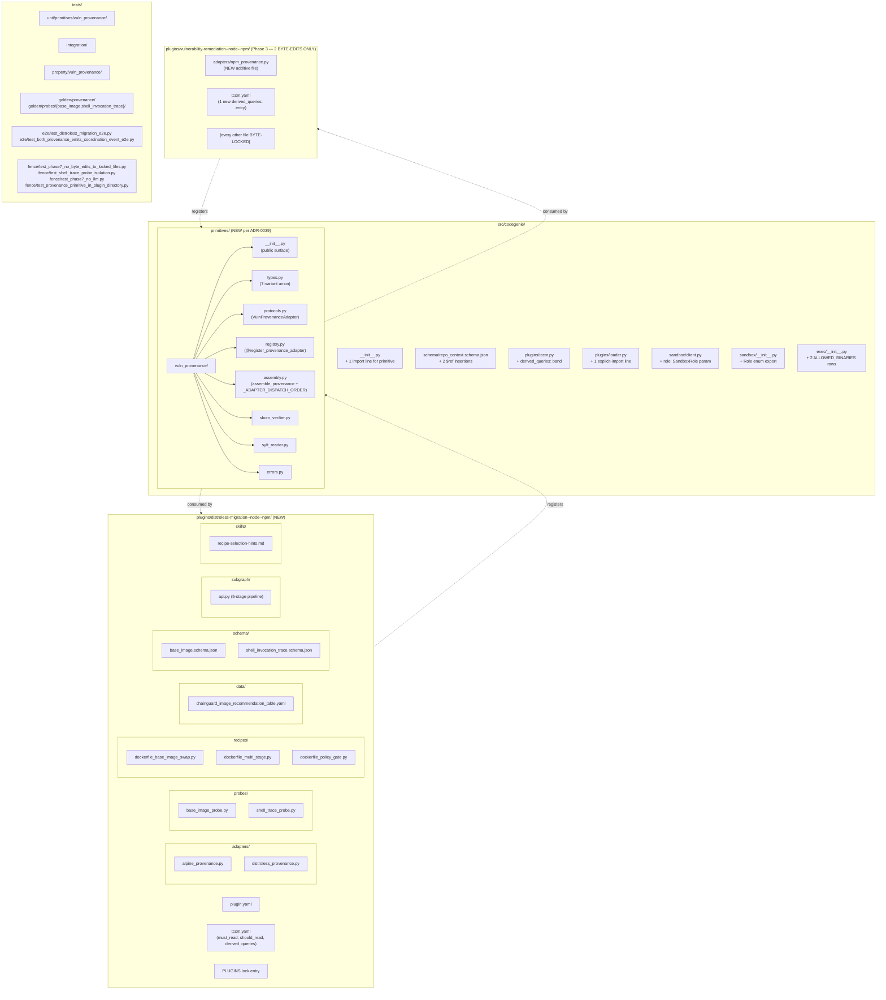
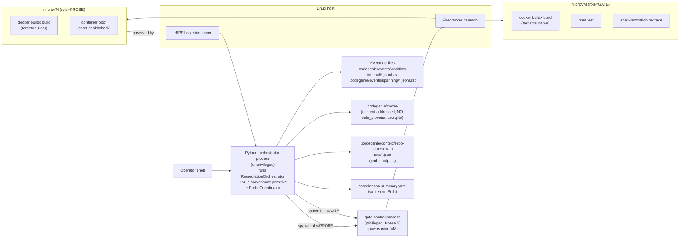

# Phase 7 — Add migration task class (Chainguard distroless): Architecture

**Status:** Architecture spec
**Date:** 2026-05-19
**Inputs:** `final-design.md` (synthesized design) · `critique.md` · `docs/production/design.md` · roadmap context (Phase 7 §, Phase 8 §, Phase 11 §)
**Audience:** the engineer implementing Phase 7

---

## Executive summary

Phase 7 introduces a **second production task class** (Chainguard distroless container migration) and the introduction itself is the test that the system can grow by addition. The architectural moves are five and only five: (1) a bounded additive core primitive `vuln.provenance` lands under a new `src/codegenie/primitives/` tree per ADR-0039; (2) a new plugin `plugins/distroless-migration--node--npm/` contributes two new probes, two new recipes, a TCCM with a new `derived_queries:` band, and two new objective-signal gates registered into Phase 5; (3) Phase 5's `SandboxClient.spawn(...)` gains an additive `role: SandboxRole` parameter so `ShellInvocationTraceProbe` can execute target-repo build commands inside a microVM without inventing a parallel `probe-control` process; (4) the `Both` provenance variant emits a typed `RequiresMultiPluginCoordination` event into the spanning event log + exit code 8 + a `coordination-summary.yaml` — Phase 7 produces evidence, Phase 8's Planner owns sequencing per ADR-0042; (5) every byte-edit Phase 7 makes to Phase 0–6.5 files is mechanically enumerated by a fence test (`tests/fence/test_phase7_no_byte_edits_to_locked_files.py`) with ten enumerated allowances — "additive" stops being aspirational and becomes a CI invariant. Reading this document tells you what to build, where, in what order, and how the test pyramid catches regressions.

---

## Goals

Each goal is verifiable against a concrete artifact or test name. Numbering matches `final-design.md` §Goals.

1. **`vuln.provenance` primitive ships at `src/codegenie/primitives/vuln_provenance/`** as the seven-variant `Provenance` discriminated union per ADR-0038 verbatim, Pydantic v2 `frozen=True, extra="forbid"`, `mypy --strict` clean, **no cache in Phase 7** (ADR-0038 §Tradeoffs honored). Verified by `tests/unit/primitives/vuln_provenance/test_types.py`.
2. **Two concrete `VulnProvenanceAdapter` implementations register and dispatch correctly.** `NpmVulnProvenanceAdapter` (additive new file in Phase 3 plugin) + `AlpineVulnProvenanceAdapter` (new file in Phase 7 plugin). Verified by `tests/integration/test_provenance_assembly_via_plugins.py`.
3. **`assemble_provenance(...)` is a free function with explicit `_ADAPTER_DISPATCH_ORDER` `Final` tuple.** Registration order is NOT load-bearing. Verified by `tests/property/vuln_provenance/test_dispatch_order_invariant.py` (50 permutations, byte-identical output).
4. **Two new probes ship inside the plugin** (`BaseImageProbe` Layer C light, `ShellInvocationTraceProbe` Layer D heavy `runs_last=True`). Each has a JSON sub-schema under the plugin's `schema/`, each is wired into `repo_context.schema.json` via one additive `$ref` insertion. Verified by `tests/fence/test_provenance_primitive_in_plugin_directory.py` + golden files.
5. **`ShellInvocationTraceProbe` runs only inside the Phase 5 microVM via `SandboxClient.spawn(role=Role.PROBE)`.** AST-walk fence asserts no `subprocess.run`, `os.system`, `os.popen`. Verified by `tests/fence/test_shell_trace_probe_isolation.py`.
6. **Phase 5 `SandboxClient.spawn(...)` gains a `role: SandboxRole` parameter** (additive sum type, default `Role.GATE`). Recorded in Phase 7 ADR-0003. Verified by `tests/integration/test_sandbox_client_role_probe.py`.
7. **Two new deterministic Dockerfile recipes** extending Phase 3's `Transform` ABC: `DockerfileBaseImageSwapTransform` (≤ 80 ms p99) + `DockerfileMultiStageRefactorTransform` (≤ 350 ms p99, **synchronous**, no `asyncio.gather`). Pure-Python AST manipulation via `dockerfile-parse`. Verified by `tests/unit/transforms/recipes/test_dockerfile_base_image_swap.py`.
8. **`DockerfilePolicyGate`, `DistrolessBuildGate`, `ShellInvocationDeltaGate` register as Phase 5 gate-catalog contributions** via `@register_signal_kind`; no override flags. Verified by `tests/integration/test_gates_register_phase7.py`.
9. **`Both` provenance variant produces evidence, not coordination.** Emits typed `RequiresMultiPluginCoordination` event + exit code 8 + `coordination-summary.yaml`. No `MultiPluginCoordinator` ships in Phase 7. Verified by `tests/e2e/test_both_provenance_emits_coordination_event_e2e.py`.
10. **Phase 3–6.5 regression suite green.** `make check` + `bench/vuln-remediation/` cassette replay (cost-ledger ε ≤ $0.01) is hard pre-merge gate. Verified by CI.
11. **End-to-end migration test.** Vulnerable Node.js fixture → `cgr.dev/chainguard/node` migration; `remediation-report.yaml` written; `npm test` passes in `SubprocessJail`. Gated by `@pytest.mark.phase07_e2e`. Verified by `tests/e2e/test_distroless_migration_e2e.py`.
12. **Net-new runtime Python deps: 1 (`dockerfile-parse`). Two new CLI binaries: `dive`, `docker buildx`.** `strace` is NOT added. Verified by `tests/unit/test_pyproject_fence.py` + `ALLOWED_BINARIES` diff.
13. **`$0.00` LLM spend per Phase 7 workflow.** `import_linter` contract: `src/codegenie/primitives/vuln_provenance/` and `plugins/distroless-migration--*/` may not import LLM SDKs. Verified by `tests/fence/test_phase7_no_llm.py`.
14. **Plugin contract validated against three plugins** (Phase 3, Phase 7, synthetic noop). Verified by `tests/integration/test_plugin_resolution_phase7.py`.
15. **CVE-to-image lookup ships as frozen YAML in `plugins/distroless-migration--node--npm/data/`.** Refresh is a CODEOWNERS-reviewed PR. **No Sigstore bundle, no STS token, no Chainguard credential class** in Phase 7. Verified by absence of `src/codegenie/cveimage/` and `src/codegenie/registry/chainguard/` modules.

---

## Non-goals

Each non-goal names the alternative we considered and the reason it was rejected, citing the synthesis position it honors.

1. **No `MultiPluginCoordinator` class.** Why not: ADR-0042 assigns coordination ownership to the Phase 8 Planner. Both performance-first and security-first proposed shipping a coordinator in Phase 7 (one as `transforms/multi_plugin_coordinator.py`, the other as `src/codegenie/multiplugin/coordinator.py`); critic landed Perf-1 + Sec-1 + roadmap-1 against both. Phase 7 emits a typed event and exits. (See `final-design.md` §Components #6 of the seven-vertex rejection ledger.)
2. **No SQLite `vuln_provenance` cache.** Why not: ADR-0038 §Tradeoffs explicitly defers caching to Phase 14 when portfolio-scale load justifies it. Performance-first proposed a five-tuple key + 24h TTL + cross-process LRU; critic flagged it as building for load no pre-Phase-10 workflow can produce. (See `final-design.md` §Goals point 1; critic Perf-3.)
3. **No real PR opening in Phase 7.** Why not: roadmap explicitly names Phase 11 as "first PR at scale." Phase 7's `DistrolessMigrationProposed` event records a proposed diff; the actual `git` + `gh pr create` lands in Phase 11.
4. **No LLM anywhere in Phase 7.** Why not: ADR-0005 + production §2.1. Fence-asserted via `import_linter` contract extension.
5. **No Sigstore-bundled CVE-to-image lookup artifact.** Why not: critic Sec-3 — security-first expanded a one-line roadmap item ("CVE-to-image-recommendation lookup table") into seven components (`lookup.py`, `publish.py`, `quarantine.py`, Sigstore verifier, CODEOWNERS workflow, ADR-anchored content-addressed dataset, operator GPG identity) without ADR amendment. The roadmap says "lookup table"; Phase 7 ships YAML in the plugin's `data/` directory. Phase 7 ADR-0007 records the deferred upgrade as a future story if the threat model is later ratified.
6. **No `ChainguardPullToken` / no Chainguard STS apparatus.** Why not: `cgr.dev/chainguard/*` distroless images are public; the credential class doesn't need to exist (critic Sec-4; Phase 7 ADR-0006).
7. **No new top-level `src/codegenie/` package besides `primitives/`.** No `vuln_provenance/`, no `cveimage/`, no `registry/chainguard/`, no `multiplugin/`. The only new core-tree directory is `src/codegenie/primitives/vuln_provenance/`, established under ADR-0039 as the additive home for future bounded primitives.
8. **No separate `probe-control` process.** Why not: security-first's parallel control plane doubles the supervision tree. The synthesis adds one parameter (`role: SandboxRole`) to Phase 5's existing `SandboxClient.spawn(...)` (critic Sec-5 + roadmap-3; Phase 7 ADR-0003).
9. **No `--task-class` CLI flag on `codegenie remediate`.** Why not: critic flagged that adding a flag edits Phase 3's CLI (G1 violation). Plugin resolution already routes on `(task × language × build-tool)`; the task class is inferred from which plugin resolves. (See `final-design.md` §Synthesis ledger row 9.)
10. **No `asyncio.gather` over per-stage Dockerfile AST work.** Why not: CPU-bound work in async without `run_in_executor` is theatrical (critic Perf "Hot path memoizable" rebuttal). `DockerfileMultiStageRefactorTransform` is synchronous.
11. **No edits to Phase 2 to produce a "runtime trace" Phase 7 reduces over.** Why not: performance-first invented this precondition; Phase 2 ships no runtime-trace artifact today. `ShellInvocationTraceProbe` executes its own builds in a microVM.
12. **No "additive migration alembic 003" to `chainguard_image_catalog` table in `VulnIndex`.** Why not: critic Perf-4 — bolting Chainguard catalog into Phase 3's CVE index conflates two unrelated lookup tables. The catalog ships as a YAML data file in the plugin.

---

## Architectural context

Phase 7 sits between Phase 6.5 (eval harness + benches — established) and Phase 8 (Planner — designed but not implemented). It consumes the frozen probe ABC (ADR-0007), the plugin architecture (ADR-0031), TCCMs (ADR-0029), event sourcing (ADR-0034), domain modeling discipline (ADR-0033), the sandbox stack (ADR-0012 + ADR-0019), and the trust-score discipline (ADR-0008). It produces the first second-task-class plugin, the first additive core primitive under ADR-0039, the first event of variant `RequiresMultiPluginCoordination`, and the first executable evidence that "extension by addition" mechanically works.

```mermaid
flowchart LR
    P0[Phase 0<br/>Probe ABC<br/>frozen]
    P1[Phase 1<br/>Layer A probes<br/>npm parsers]
    P2[Phase 2<br/>SBOM + image_digest_resolver<br/>ALLOWED_BINARIES]
    P3[Phase 3<br/>RemediationOrchestrator<br/>Transform ABC<br/>plugins/ dir]
    P5[Phase 5<br/>SandboxClient<br/>Gate ABC<br/>register_signal_kind]
    P65[Phase 6.5<br/>bench/{task-class}/<br/>cassette replay]
    P7((Phase 7<br/>migration task class))
    P8[Phase 8<br/>Planner consumes<br/>RequiresMultiPluginCoordination]
    P10[Phase 10<br/>Stage 0/1 routes via<br/>vuln.provenance]
    P11[Phase 11<br/>first real PR;<br/>Both atomic-or-nothing merge gate]
    P14[Phase 14<br/>vuln_provenance_cache]

    P0 --> P7
    P1 --> P7
    P2 --> P7
    P3 --> P7
    P5 --> P7
    P65 --> P7
    P7 --> P8
    P7 --> P10
    P7 --> P11
    P7 -.deferred.-> P14
```

The boxes upstream of Phase 7 are inputs Phase 7 reads/extends additively. The boxes downstream consume Phase 7's contracts: `vuln.provenance` (Phase 8 + Phase 10), `RequiresMultiPluginCoordination` event (Phase 8 + Phase 11), and the deferred caching surface (Phase 14).

---

## 4+1 architectural views

### Logical view


```mermaid
classDiagram
    class Provenance {
        <<discriminated union>>
        kind : Literal[7 values]
    }
    class AppDirect
    class AppTransitive
    class AppVendored
    class BaseImage
    class RuntimeBundled
    class Both {
      app_record : AppKind
      base_record : BaseKind
    }
    class Unknown {
      reason : UnknownReason
    }
    Provenance <|-- AppDirect
    Provenance <|-- AppTransitive
    Provenance <|-- AppVendored
    Provenance <|-- BaseImage
    Provenance <|-- RuntimeBundled
    Provenance <|-- Both
    Provenance <|-- Unknown

    class VulnProvenanceAdapter {
      <<Protocol>>
      attribute(cve_id, package_id, image_ref, sbom) Provenance
      confidence() AdapterConfidence
    }
    class NpmVulnProvenanceAdapter
    class AlpineVulnProvenanceAdapter
    class DistrolessVulnProvenanceAdapter
    VulnProvenanceAdapter <|.. NpmVulnProvenanceAdapter
    VulnProvenanceAdapter <|.. AlpineVulnProvenanceAdapter
    VulnProvenanceAdapter <|.. DistrolessVulnProvenanceAdapter

    class assemble_provenance {
      <<free function>>
      walks _ADAPTER_DISPATCH_ORDER
    }
    class _REGISTRY {
      <<module-level dict>>
      tuple[Layer, Ecosystem] : type[Adapter]
    }
    assemble_provenance --> _REGISTRY
    assemble_provenance --> VulnProvenanceAdapter

    class BaseImageProbe {
      layer = C
      heaviness = light
    }
    class ShellInvocationTraceProbe {
      layer = D
      heaviness = heavy
      runs_last = True
    }
    class Probe {
      <<ABC frozen Phase 0>>
    }
    Probe <|-- BaseImageProbe
    Probe <|-- ShellInvocationTraceProbe

    class DockerfileBaseImageSwapTransform
    class DockerfileMultiStageRefactorTransform
    class Transform {
      <<ABC Phase 3>>
    }
    Transform <|-- DockerfileBaseImageSwapTransform
    Transform <|-- DockerfileMultiStageRefactorTransform

    class DockerfilePolicyGate
    class DistrolessBuildGate
    class ShellInvocationDeltaGate
    class Gate {
      <<ABC Phase 5>>
    }
    Gate <|-- DockerfilePolicyGate
    Gate <|-- DistrolessBuildGate
    Gate <|-- ShellInvocationDeltaGate

    class RequiresMultiPluginCoordination {
      <<typed event>>
      workflow_id : WorkflowId
      app_record : AppKind
      base_record : BaseKind
    }

    ShellInvocationTraceProbe ..> SandboxClient : spawn(role=Role.PROBE)
    DistrolessBuildGate ..> SandboxClient : spawn(role=Role.GATE)
    ShellInvocationDeltaGate ..> SandboxClient : spawn(role=Role.GATE)
```

**Central abstractions vs scaffolding.** The load-bearing types are five: `Provenance` (seven-variant discriminated union — the kernel-frozen data shape from ADR-0038), `VulnProvenanceAdapter` (the Protocol every adapter satisfies — ADR-0032-shaped), `Probe` (Phase 0 frozen ABC), `Transform` (Phase 3 ABC), and `Gate` (Phase 5 ABC). Everything else is scaffolding around these five: `assemble_provenance` is a function not a class; `_REGISTRY` is a module-level `dict`; `RequiresMultiPluginCoordination` is a Pydantic event model. The temptation to introduce a `VulnProvenanceChainAssembler` class, a `MultiPluginCoordinator` parent class, or a `ProvenanceBuilder` fluent surface is explicitly rejected (critic BP-1; final-design §Design patterns rejected).

### Process view

```mermaid
sequenceDiagram
    autonumber
    participant CLI as codegenie remediate
    participant RES as PluginResolver
    participant ORCH as RemediationOrchestrator<br/>(Phase 3)
    participant COORD as ProbeCoordinator
    participant SBX as SandboxClient<br/>(Phase 5)
    participant PRIM as vuln.provenance<br/>primitive
    participant SCORER as TrustScorer
    participant LOG as EventLog<br/>(workflow-internal + spanning)

    CLI->>RES: resolve(task, lang, build)
    RES-->>ORCH: distroless-migration--node--npm plugin
    ORCH->>COORD: dispatch task-class-specific probes
    par BaseImageProbe (light, runs_first)
        COORD->>COORD: parse Dockerfile AST<br/>(≤ 60 ms cold)
    and ShellInvocationTraceProbe (heavy, runs_last=True)
        COORD->>SBX: spawn(role=Role.PROBE, image-digest=...)
        SBX-->>COORD: ProbeOutput{shell_invocations: ..., confidence}
    end
    ORCH->>PRIM: assemble_provenance(cve, pkg, image, sbom)
    PRIM->>PRIM: walk _ADAPTER_DISPATCH_ORDER
    PRIM-->>ORCH: Provenance (one of 7 variants)
    alt Provenance is BaseImage
        ORCH->>ORCH: DockerfileBaseImageSwapTransform.apply
        ORCH->>SBX: spawn(role=Role.GATE)<br/>DockerfilePolicyGate
        ORCH->>SBX: spawn(role=Role.GATE)<br/>DistrolessBuildGate
        ORCH->>SBX: spawn(role=Role.GATE)<br/>ShellInvocationDeltaGate
        ORCH->>SCORER: strict-AND signals
        SCORER-->>ORCH: Validated
        ORCH->>LOG: DistrolessMigrationProposed (workflow-internal)
    else Provenance is Both
        ORCH->>LOG: RequiresMultiPluginCoordination (spanning)
        ORCH-->>CLI: exit code 8 + coordination-summary.yaml
    else Provenance is Unknown
        ORCH-->>CLI: NotApplicable → universal HITL plugin
    end
    LOG-->>LOG: workflow-internal flushed; spanning queued for Phase 9 Postgres
```

**Concurrency, blocking, durable checkpoints.** The probe coordinator dispatches `BaseImageProbe` and `ShellInvocationTraceProbe` under the existing single bounded `asyncio.Semaphore` (CLAUDE.md §"Registry-dispatched coordinator"; ADR Phase-2-0003). `ShellInvocationTraceProbe` declares `runs_last=True` so it never runs in the prelude wave. Inside the probe, `await SandboxClient.spawn(role=Role.PROBE)` is the only `await` boundary — the rest of the probe is pure synchronous parsing of returned trace JSON. `assemble_provenance` is synchronous (no I/O after probes complete; SBOM was already loaded). Gates run sequentially under strict-AND because a failing earlier gate short-circuits the score; parallelizing would do wasted work on the failure path. Durable checkpoints: events flushed to `workflow-internal/<workflow_id>.jsonl.zst` after each stage; the spanning stream is append-only and survives process restarts. **No `asyncio.gather` over CPU-bound work anywhere.**

### Development view


```mermaid
graph TD
    subgraph core["src/codegenie/"]
      subgraph primitives["primitives/  (NEW per ADR-0039)"]
        VP["vuln_provenance/"]
        VP_INIT["__init__.py<br/>(public surface)"]
        VP_TYPES["types.py<br/>(7-variant union)"]
        VP_PROTO["protocols.py<br/>(VulnProvenanceAdapter)"]
        VP_REG["registry.py<br/>(@register_provenance_adapter)"]
        VP_ASM["assembly.py<br/>(assemble_provenance + _ADAPTER_DISPATCH_ORDER)"]
        VP_SBOM["sbom_verifier.py"]
        VP_SYFT["syft_reader.py"]
        VP_ERR["errors.py"]
        VP --> VP_INIT
        VP --> VP_TYPES
        VP --> VP_PROTO
        VP --> VP_REG
        VP --> VP_ASM
        VP --> VP_SBOM
        VP --> VP_SYFT
        VP --> VP_ERR
      end
      INIT["__init__.py<br/>+ 1 import line for primitive"]
      SCHEMA["schema/repo_context.schema.json<br/>+ 2 $ref insertions"]
      TCCM["plugins/tccm.py<br/>+ derived_queries: band"]
      LOADER["plugins/loader.py<br/>+ 1 explicit-import line"]
      SBX["sandbox/client.py<br/>+ role: SandboxRole param"]
      SBX_INIT["sandbox/__init__.py<br/>+ Role enum export"]
      EXEC["exec/__init__.py<br/>+ 2 ALLOWED_BINARIES rows"]
    end

    subgraph plugin7["plugins/distroless-migration--node--npm/  (NEW)"]
      P7_YAML["plugin.yaml"]
      P7_TCCM["tccm.yaml<br/>(must_read, should_read, derived_queries)"]
      P7_LOCK["PLUGINS.lock entry"]
      subgraph p7_adapters["adapters/"]
        AP["alpine_provenance.py"]
        DP["distroless_provenance.py"]
      end
      subgraph p7_probes["probes/"]
        BIP["base_image_probe.py"]
        STP["shell_trace_probe.py"]
      end
      subgraph p7_recipes["recipes/"]
        R1["dockerfile_base_image_swap.py"]
        R2["dockerfile_multi_stage.py"]
        DPG["dockerfile_policy_gate.py"]
      end
      subgraph p7_data["data/"]
        TBL["chainguard_image_recommendation_table.yaml"]
      end
      subgraph p7_schema["schema/"]
        S1["base_image.schema.json"]
        S2["shell_invocation_trace.schema.json"]
      end
      subgraph p7_subgraph["subgraph/"]
        SG["api.py (5-stage pipeline)"]
      end
      subgraph p7_skills["skills/"]
        SK["recipe-selection-hints.md"]
      end
    end

    subgraph plugin3["plugins/vulnerability-remediation--node--npm/  (Phase 3 — 2 BYTE-EDITS ONLY)"]
      P3_ADAPTERS["adapters/npm_provenance.py<br/>(NEW additive file)"]
      P3_TCCM["tccm.yaml<br/>(1 new derived_queries: entry)"]
      P3_REST["[every other file BYTE-LOCKED]"]
    end

    subgraph tests["tests/"]
      UNIT["unit/primitives/vuln_provenance/"]
      INTEG["integration/"]
      PROP["property/vuln_provenance/"]
      GOLDEN["golden/provenance/<br/>golden/probes/{base_image,shell_invocation_trace}/"]
      E2E["e2e/test_distroless_migration_e2e.py<br/>e2e/test_both_provenance_emits_coordination_event_e2e.py"]
      FENCE["fence/test_phase7_no_byte_edits_to_locked_files.py<br/>fence/test_shell_trace_probe_isolation.py<br/>fence/test_phase7_no_llm.py<br/>fence/test_provenance_primitive_in_plugin_directory.py"]
    end

    primitives -. consumed by .-> plugin7
    primitives -. consumed by .-> plugin3
    plugin7 -. registers .-> primitives
    plugin3 -. registers .-> primitives
```

**Module tree highlights.** The new `src/codegenie/primitives/` directory is the ADR-0039 additive home; future bounded primitives land here without further architectural debate. Everything Phase-7-specific that is *not* core-cross-task lives in the plugin. The Phase 3 plugin grows by exactly two byte-edits (the new `npm_provenance.py` file and one new entry under `derived_queries:` in `tccm.yaml`); every other file inside `plugins/vulnerability-remediation--node--npm/` is byte-locked.

### Physical view


```mermaid
graph LR
    OP["Operator shell"]
    PY["Python orchestrator process<br/>(unprivileged)<br/>runs RemediationOrchestrator<br/>+ vuln.provenance primitive<br/>+ ProbeCoordinator"]
    GC["gate-control process<br/>(privileged; Phase 5)<br/>spawns microVMs"]
    subgraph host["Linux host"]
      EBPF["eBPF host-side tracer"]
      FCD["Firecracker daemon"]
    end
    subgraph vm1["microVM (role=PROBE)"]
      BUILD["docker buildx build<br/>(target=builder)"]
      BOOT["container boot<br/>(short healthcheck)"]
    end
    subgraph vm2["microVM (role=GATE)"]
      GATE_BUILD["docker buildx build<br/>(target=runtime)"]
      GATE_TEST["npm test"]
      GATE_DELTA["shell-invocation re-trace"]
    end
    LOG["EventLog files<br/>.codegenie/events/workflow-internal/*.jsonl.zst<br/>.codegenie/events/spanning/*.jsonl.zst"]
    CACHE[".codegenie/cache/<br/>(content-addressed; NO vuln_provenance.sqlite)"]
    OUT[".codegenie/context/repo-context.yaml<br/>raw/*.json<br/>(probe outputs)"]
    SUM["coordination-summary.yaml<br/>(written on Both)"]

    OP --> PY
    PY -->|spawn role=PROBE| GC
    PY -->|spawn role=GATE| GC
    GC --> FCD
    FCD --> vm1
    FCD --> vm2
    vm1 -.observed by.- EBPF
    EBPF --> PY
    PY --> LOG
    PY --> CACHE
    PY --> OUT
    PY --> SUM
```

**One Python process; microVM sandbox via Phase 5.** Phase 7 introduces no new long-running process — `ShellInvocationTraceProbe` calls into the existing privileged `gate-control` process with `role=Role.PROBE`. The eBPF host-side tracer is the same one Phase 5 ships for gate observation. The orchestrator process is unprivileged; only `gate-control` carries microVM CP credentials. **No parallel `probe-control` process** (rejected per critic Sec-5). On macOS the underlying isolation switches to Lima (Phase 5 ADR); the Phase 7 contract is identical (one `SandboxClient.spawn(...)` call).

### Scenarios

Four scenarios. Each is a sequence diagram tracing a representative end-to-end path; together they cover the happy-path single-plugin route, the base-image-only route, the `Both` coordination-event route, and the SBOM-mismatch failure route.

#### Scenario A — App-only CVE happy path

```mermaid
sequenceDiagram
    autonumber
    participant Op as Operator
    participant CLI as codegenie remediate
    participant Res as PluginResolver
    participant Orch as RemediationOrchestrator
    participant Prim as vuln.provenance
    participant Ad1 as NpmVulnProvenanceAdapter
    participant Ad2 as AlpineVulnProvenanceAdapter
    participant Tx as NpmLockfileBumpTransform<br/>(Phase 3)
    participant SBX as SandboxClient
    participant Log as EventLog

    Op->>CLI: codegenie remediate ./repo --cve CVE-2026-A
    CLI->>Res: resolve(vuln-remediation, node, npm)
    Res-->>Orch: vulnerability-remediation--node--npm
    Orch->>Prim: assemble_provenance(CVE-2026-A, "lodash@4.17.10", image)
    Prim->>Ad1: attribute(...)
    Ad1-->>Prim: AppTransitive(chain=[express -> body-parser -> lodash])
    Prim->>Ad2: attribute(...)
    Ad2-->>Prim: Unknown(reason="sbom_layer_attribution_absent")
    Prim-->>Orch: AppTransitive(...)
    Orch->>Tx: apply
    Tx-->>Orch: diff (package-lock.json bump)
    Orch->>SBX: spawn(role=GATE) DistrolessBuildGate? No — Phase 3 gates run
    Orch->>Log: ProvenanceQueried(cve, kind=app_transitive, adapter_chain=[npm])
    Orch->>Log: DistrolessMigrationProposed? No — VulnRemediationProposed (Phase 3 event)
    Orch-->>CLI: exit code 0; remediation-report.yaml written
```

Phase 7's `assemble_provenance` was called, but the dispatched plugin was Phase 3's. The migration plugin never resolved. `ProvenanceQueried` lands in the workflow-internal event log. No `coordination-summary.yaml` is written. This scenario is the regression-suite proof that **Phase 3's behavior is unchanged** — the `bench/vuln-remediation/` cassette replay (cost-ledger byte-equality, ε ≤ $0.01) gates merge.

#### Scenario B — Base-image-only CVE (single-plugin migration route)

```mermaid
sequenceDiagram
    autonumber
    participant Op as Operator
    participant CLI as codegenie remediate
    participant Res as PluginResolver
    participant Orch as RemediationOrchestrator
    participant Coord as ProbeCoordinator
    participant BIP as BaseImageProbe
    participant STP as ShellInvocationTraceProbe
    participant SBX as SandboxClient
    participant Prim as vuln.provenance
    participant Ad1 as NpmVulnProvenanceAdapter
    participant Ad2 as AlpineVulnProvenanceAdapter
    participant Tx as DockerfileBaseImageSwapTransform
    participant Gates as Phase 5 gates
    participant Log as EventLog

    Op->>CLI: codegenie remediate ./repo --cve CVE-2026-B
    CLI->>Res: resolve(vuln-remediation, node, npm)
    Res-->>Orch: distroless-migration--node--npm matches; vuln-remediation--node--npm matches less specifically — most-specific wins
    Note over Res,Orch: Inference: plugin TCCM includes base-image probe;<br/>vuln.provenance(cve_id, ...) returns BaseImage → migration plugin
    Orch->>Coord: dispatch task-class-specific probes
    Coord->>BIP: run (static, light)
    BIP-->>Coord: base_image: {kind: alpine, image_ref: node:18-alpine, digest: sha256:...}
    Coord->>STP: run (heavy, runs_last)
    STP->>SBX: spawn(role=PROBE)
    SBX-->>STP: trace JSON {shell_invocations: [], count: 0}
    STP-->>Coord: shell_invocation_trace: {count: 0, confidence: high}
    Orch->>Prim: assemble_provenance(CVE-2026-B, "openssl", image, sbom)
    Prim->>Ad1: attribute
    Ad1-->>Prim: Unknown(reason="sbom_layer_attribution_absent")
    Prim->>Ad2: attribute
    Ad2-->>Prim: BaseImage(image_digest=..., layer_digest=..., distro_pkg=openssl@1.1.1l-r0)
    Prim-->>Orch: BaseImage(...)
    Orch->>Tx: apply
    Tx-->>Orch: Dockerfile diff (FROM swap + multi-stage runner)
    Orch->>Gates: DockerfilePolicyGate
    Gates-->>Orch: pass
    Orch->>Gates: DistrolessBuildGate via SBX(role=GATE)
    Gates-->>Orch: pass
    Orch->>Gates: ShellInvocationDeltaGate via SBX(role=GATE)
    Gates-->>Orch: pass (count == 0)
    Orch->>Log: ProvenanceQueried, BaseImageResolved, ShellInvocationObserved,<br/>DistrolessMigrationProposed, DockerfilePolicyGatePassed
    Orch-->>CLI: exit code 0; remediation-report.yaml + Dockerfile diff
```

The "most-specific plugin wins" line uses ADR-0031's resolver. The migration plugin's TCCM declares `must_read: [dockerfile, base_image, sbom]`; only this plugin's TCCM matches a workflow whose CVE has `BaseImage` provenance.

#### Scenario C — `Both` variant: emit `RequiresMultiPluginCoordination`

```mermaid
sequenceDiagram
    autonumber
    participant Op as Operator
    participant CLI as codegenie remediate
    participant Orch as RemediationOrchestrator
    participant Prim as vuln.provenance
    participant Ad1 as NpmVulnProvenanceAdapter
    participant Ad2 as AlpineVulnProvenanceAdapter
    participant Log as EventLog (spanning)
    participant FS as filesystem
    participant Plan as Phase 8 Planner<br/>(future)

    Op->>CLI: codegenie remediate ./repo --cve CVE-2026-glibc
    CLI->>Orch: dispatched
    Orch->>Prim: assemble_provenance(CVE-2026-glibc, "glibc", image, sbom)
    Prim->>Ad1: attribute
    Ad1-->>Prim: AppDirect(manifest_path="package.json", chain_length=1, ...)
    Prim->>Ad2: attribute
    Ad2-->>Prim: BaseImage(image_digest=..., layer_digest=..., distro_pkg=glibc@2.31)
    Prim->>Prim: match (app, base) → Both(app_record, base_record)
    Prim-->>Orch: Both(AppDirect(...), BaseImage(...))
    Orch->>Orch: Applicability.PendingCoordination
    Orch->>Log: RequiresMultiPluginCoordination(workflow_id, app_record, base_record)
    Orch->>FS: write coordination-summary.yaml
    Orch-->>CLI: exit code 8 (documented)
    Note over Log,Plan: Months later, Phase 8 ships;<br/>Planner projects spanning log;<br/>emits child workflows per app_record + base_record.<br/>Phase 7 plays no further part.
```

Phase 7 ships the operator-side `codegenie list-coordination-candidates` subcommand (synthesis departure §6) so operators can see pending `Both` events accumulate in the spanning log in the months before Phase 8 lands. No coordinator code, no watchdog, no PR-ordering policy.

#### Scenario D — Failure path (SBOM/manifest mismatch → `Unknown`)

```mermaid
sequenceDiagram
    autonumber
    participant Orch as RemediationOrchestrator
    participant Prim as vuln.provenance
    participant Ad2 as AlpineVulnProvenanceAdapter
    participant Verifier as sbom_verifier
    participant Log as EventLog
    participant HITL as universal HITL plugin

    Orch->>Prim: assemble_provenance(cve, pkg, image, poisoned_sbom)
    Prim->>Ad2: attribute(...)
    Ad2->>Verifier: cross_check(locations.layerID, image_manifest)
    Verifier-->>Ad2: mismatch (claimed layerID not in image manifest)
    Ad2-->>Prim: Unknown(reason="sbom_layer_attribution_absent")
    Note over Prim: NpmVulnProvenanceAdapter also returned Unknown
    Prim->>Prim: match (Unknown, Unknown) → Unknown(reason="no_adapter_resolved")
    Prim-->>Orch: Unknown(reason="no_adapter_resolved")
    Orch->>Log: ProvenanceQueried(kind=unknown, reason="no_adapter_resolved")
    Orch->>Log: sbom.routing_anomaly(workflow_id, mismatch_details)
    Orch->>HITL: Applicability.NotApplicable; route to universal fallback plugin
    HITL-->>Orch: HITL evidence bundle written
    Orch-->>Orch: exit code 0; remediation-report.yaml documents the HITL path
```

The `sbom.routing_anomaly` event is the **operator-visible** surface for poisoned SBOMs — it lands in the spanning log so portfolio-scale anomaly detection (Phase 13.5 operator portal) can pick it up.

---

## Component design

For each component: **Purpose / Public interface / Internal structure / Dependencies / State / Performance envelope / Failure behavior**. Twelve components total; numbers continue across subsections rather than restarting.

### 1. `VulnProvenancePrimitive` — the `vuln.provenance(...)` callable

- **Purpose.** The public surface of `src/codegenie/primitives/vuln_provenance/`. Answers ADR-0038's question: "Where is this CVE coming from?"
- **Public interface.**
  ```python
  # src/codegenie/primitives/vuln_provenance/__init__.py
  from .types import Provenance, AppDirect, AppTransitive, AppVendored, BaseImage, RuntimeBundled, Both, Unknown, AppKind, BaseKind, UnknownReason, AdapterConfidence
  from .protocols import VulnProvenanceAdapter
  from .registry import register_provenance_adapter, Layer, Ecosystem
  from .assembly import assemble_provenance
  from .errors import ProvenanceError, RegistryError
  from .syft_reader import SyftSbom

  # `provenance` is a pure re-export ALIAS of `assemble_provenance` (S2-04)
  # — `provenance is assemble_provenance`. TCCM `derived_queries:` resolves
  # `compute: vuln.provenance` to this name; aliasing keeps one callable
  # and one signature rather than a wrapper that could drift.
  from .assembly import assemble_provenance as provenance
  ```
- **Internal structure.** `provenance` is a pure re-export *alias* of `assemble_provenance` (S2-04 — `provenance is assemble_provenance`), not a separate wrapper function. TCCM `derived_queries:` resolves `compute: vuln.provenance` to this name without needing the assembly internals; the alias guarantees one callable and one signature.
- **Dependencies.** None beyond stdlib + Pydantic + the primitive's own modules.
- **State.** None. Pure function over inputs. No SQLite, no LRU.
- **Performance envelope.** p99 ≤ 50 ms uncached (ADR-0038 §Tradeoffs).
- **Failure behavior.** Typed exceptions in `ProvenanceError(CodegenieError)` hierarchy. Adapter errors are caught + converted to `Unknown(reason="adapter_error", details=...)`; other exceptions propagate (Rule 12: fail loud).

### 2. Seven-variant `Provenance` discriminated union — `types.py`

- **Purpose.** Make illegal states unrepresentable per ADR-0033. Verbatim from ADR-0038.
- **Public interface.**
  ```python
  # types.py
  from typing import Annotated, Literal, Union
  from pydantic import BaseModel, Field

  class _Frozen(BaseModel):
      model_config = ConfigDict(frozen=True, extra="forbid")

  class AppDirect(_Frozen):
      kind: Literal["app_direct"] = "app_direct"
      manifest_path: Path
      package: PackageId
      confidence: AdapterConfidence

  class AppTransitive(_Frozen):
      kind: Literal["app_transitive"] = "app_transitive"
      manifest_path: Path
      package: PackageId
      chain: tuple[PackageId, ...]  # length >= 2
      confidence: AdapterConfidence

  class AppVendored(_Frozen):
      kind: Literal["app_vendored"] = "app_vendored"
      vendored_path: Path
      package: PackageId
      confidence: AdapterConfidence

  class BaseImage(_Frozen):
      kind: Literal["base_image"] = "base_image"
      image_digest: ImageDigest
      layer_digest: LayerDigest
      distro_pkg: DistroPackage
      stage: DockerStageName | None
      confidence: AdapterConfidence

  class RuntimeBundled(_Frozen):
      kind: Literal["runtime_bundled"] = "runtime_bundled"
      runtime: RuntimeId
      bundled_path: Path
      package: PackageId
      confidence: AdapterConfidence

  AppKind = Annotated[Union[AppDirect, AppTransitive, AppVendored], Field(discriminator="kind")]
  BaseKind = Annotated[Union[BaseImage, RuntimeBundled], Field(discriminator="kind")]

  class Both(_Frozen):
      kind: Literal["both"] = "both"
      app_record: AppKind   # not Provenance — Both(Both, ...) unrepresentable
      base_record: BaseKind

  class Unknown(_Frozen):
      kind: Literal["unknown"] = "unknown"
      reason: UnknownReason  # sum type: "sbom_layer_attribution_absent" | "no_adapter_resolved" | "adapter_error" | ...
      details: dict[str, str] | None = None

  Provenance = Annotated[
      Union[AppDirect, AppTransitive, AppVendored, BaseImage, RuntimeBundled, Both, Unknown],
      Field(discriminator="kind"),
  ]
  ```
- **Internal structure.** Pydantic v2 discriminated union. `Both.app_record` and `Both.base_record` are themselves discriminated unions of *non-`Both`, non-`Unknown`* variants — `Both(Both, ...)` is rejected at validation time by Pydantic, not by runtime check. **Contract type.**
- **Dependencies.** `pydantic`. Identifier newtypes from `codegenie.types.identifiers`.
- **State.** Immutable; `frozen=True`. All seven variants Internally are pure data.
- **Performance envelope.** Construction ≤ 50 µs per variant.
- **Failure behavior.** Any extra field rejects (`extra="forbid"`). Construction with a `Both(both, ...)` raises `ValidationError` — the type system itself enforces the recursion guard.

### 3. `VulnProvenanceAdapter` Protocol — `protocols.py`

- **Purpose.** Structural contract every adapter satisfies. ADR-0032 + ADR-0038 shape.
- **Public interface.**
  ```python
  # protocols.py
  from typing import Protocol, runtime_checkable

  @runtime_checkable
  class VulnProvenanceAdapter(Protocol):
      def attribute(
          self,
          cve_id: CveId,
          package_id: PackageId,
          image_ref: ImageRef | None,
          sbom: SyftSbom,
      ) -> Provenance: ...

      def confidence(self) -> AdapterConfidence: ...
  ```
- **Internal structure.** **No `cost_band`, no `applies_when`.** Performance-first's Protocol extension is rejected (critic Perf-5).
- **Dependencies.** Identifier newtypes only.
- **State.** Adapters MAY hold construction-time state (`sbom_reader`, `logger`, `image_manifest_cache`). The `Protocol` doesn't enumerate constructor kwargs; the `AdapterFactory` honors well-known DI names. **Contract type.**
- **Performance envelope.** Adapter implementations target ≤ 20 ms per `attribute()` call.
- **Failure behavior.** Adapters return `Unknown(reason=...)` rather than raising for "I don't apply" cases. Raising is reserved for genuine errors (`ProvenanceError` subclasses).

### 4. `@register_provenance_adapter` + `_REGISTRY` — `registry.py`

- **Purpose.** Decorator-registration of adapter **classes** (not instances — critic BP-3).
- **Public interface.**
  ```python
  # registry.py
  from enum import Enum
  from typing import Final

  class Layer(str, Enum):
      APP = "app"
      BASE_IMAGE = "base_image"
      RUNTIME = "runtime"

  class Ecosystem(str, Enum):
      NPM = "npm"
      YARN_BERRY = "yarn-berry"
      PNPM = "pnpm"
      APK = "apk"
      DPKG = "dpkg"
      RPM = "rpm"
      # open to additive enum values via ADR amendment

  ProvenanceAdapterId = tuple[Layer, Ecosystem]

  _REGISTRY: Final[dict[ProvenanceAdapterId, type[VulnProvenanceAdapter]]] = {}

  def register_provenance_adapter(*, layer: Layer, ecosystem: Ecosystem):
      def _wrap(cls: type[VulnProvenanceAdapter]) -> type[VulnProvenanceAdapter]:
          key: ProvenanceAdapterId = (layer, ecosystem)
          if key in _REGISTRY:
              raise RegistryError(f"duplicate adapter for {key!r}")
          _REGISTRY[key] = cls   # CLASS, not instance
          return cls
      return _wrap
  ```
- **Internal structure.** Module-level `dict`. Test isolation via `pytest` fixture that snapshots and restores `_REGISTRY` per test (mirrors Phase 2's `freshness` registry isolation pattern).
- **Dependencies.** `errors.RegistryError`.
- **State.** Module-level; populated at plugin-import time. Read-mostly thereafter.
- **Performance envelope.** Registration is O(1). Lookup is O(1).
- **Failure behavior.** Duplicate registration raises `RegistryError` at import time → plugin loader fast-fails at Supervisor startup with file/line diagnostic.

### 5. `_ADAPTER_DISPATCH_ORDER` — explicit dispatch policy (closes critic BP-1)

- **Purpose.** Replace implicit `dict.items()` iteration order with explicit declared policy. Operators predict behavior by reading one tuple.
- **Public interface.**
  ```python
  # assembly.py (top of file)
  _ADAPTER_DISPATCH_ORDER: Final[tuple[tuple[Layer, ...], ...]] = (
      (Layer.APP,),          # app-layer adapters first
      (Layer.BASE_IMAGE,),   # then base-image adapters
      (Layer.RUNTIME,),      # then runtime-bundled adapters
  )
  ```
- **Internal structure.** Module-level `Final` tuple. **Within a layer-set**, registry is iterated in `Ecosystem`-enum-sorted order (deterministic), NOT `dict.items()` order.
- **Dependencies.** `Layer` enum.
- **State.** Constant. Adding a new `Layer` family requires touching this tuple — explicit, ADR-worthy.
- **Performance envelope.** N/A.
- **Failure behavior.** N/A.

### 6. `assemble_provenance(...)` free function — `assembly.py`

- **Purpose.** Compose adapter results into a single `Provenance`. The deferred ADR-0038 question's answer.
- **Public interface.**
  ```python
  def assemble_provenance(
      cve_id: CveId,
      package_id: PackageId,
      image_ref: ImageRef | None,
      sbom: SyftSbom,
      *,
      registry: Mapping[ProvenanceAdapterId, type[VulnProvenanceAdapter]] | None = None,
      adapter_factory: AdapterFactory | None = None,
  ) -> Provenance: ...
  ```
- **Internal structure.** ≤ 80 LOC. Walks `_ADAPTER_DISPATCH_ORDER`; for each layer-set, iterates adapters in `Ecosystem`-enum-sorted order; calls each via `adapter_factory(cls)` (DI-aware kwargs); collects the first non-`Unknown` result per layer (`app_result` and `base_result`); composes via `match`/`assert_never`:
  ```python
  match (app_result, base_result):
      case (None, None):
          return Unknown(reason="no_adapter_resolved")
      case (app, None):
          return app
      case (None, base):
          return base
      case (app, base):
          return Both(app_record=app, base_record=base)
  ```
- **Dependencies.** `_REGISTRY` (default), `protocols.VulnProvenanceAdapter`, `types.*`.
- **State.** None. Pure function. Optional `registry` param admits test isolation and explicit selection.
- **Performance envelope.** p99 ≤ 50 ms uncached. Most cost is the adapter calls; the assembly itself is < 1 ms.
- **Failure behavior.** Catches `ProvenanceError` → converts to `Unknown(reason="adapter_error")`. **All other exceptions propagate** (Rule 12). The optional `adapter_factory` injection allows callers to substitute a deterministic fixture factory in tests.

### 7. `VulnProvenanceAdapter` concrete implementations

#### 7a. `NpmVulnProvenanceAdapter` (Phase 3 plugin — additive new file)

- **Purpose.** Resolve `(cve_id, package_id)` against the npm dep tree. Returns `AppDirect | AppTransitive | Unknown(reason)`. Lives at `plugins/vulnerability-remediation--node--npm/adapters/npm_provenance.py`.
- **Public interface.** Satisfies `VulnProvenanceAdapter`. `@register_provenance_adapter(layer=Layer.APP, ecosystem=Ecosystem.NPM)`.
- **Internal structure.** Reads `package.json` + `package-lock.json` from gathered `RepoContext`. Walks resolved tree; chain length 1 → `AppDirect`; chain length > 1 → `AppTransitive`; absent → `Unknown(reason="sbom_layer_attribution_absent")`. Cross-verifies via `sbom_verifier.py`.
- **Dependencies.** `codegenie.types.identifiers`, the primitive's protocols, Phase 1's npm lockfile parsers.
- **State.** Constructor receives `sbom_reader`, `logger` via DI kwargs. No mutation.
- **Performance envelope.** ≤ 20 ms.
- **Failure behavior.** Lockfile-parse errors → `Unknown(reason="adapter_error")` with details.

#### 7b. `AlpineVulnProvenanceAdapter` (Phase 7 plugin)

- **Purpose.** Resolve `(cve_id, package_id)` against an Alpine base-image's apk database. Returns `BaseImage | Unknown(reason)`. Lives at `plugins/distroless-migration--node--npm/adapters/alpine_provenance.py`.
- **Public interface.** `@register_provenance_adapter(layer=Layer.BASE_IMAGE, ecosystem=Ecosystem.APK)`.
- **Internal structure.** Reads `SyftSbom.locations[].layerID`; matches against `BaseImageProbe`'s layer-to-image-digest mapping; cross-verifies via `sbom_verifier.py`. Returns `BaseImage(image_digest, layer_digest, distro_pkg, stage)` on hit; `Unknown(reason="sbom_layer_attribution_absent")` on mismatch.
- **Performance envelope.** ≤ 20 ms.
- **Failure behavior.** SBOM mismatch is a `Unknown` return, NOT an exception.

#### 7c. `DistrolessVulnProvenanceAdapter` (Phase 7 plugin)

- **Purpose.** Recognize that a base image is already distroless (`cgr.dev/chainguard/*` or `gcr.io/distroless/*`) and **refuses to attribute** — returns `Unknown(reason="base_image_already_distroless")` so the migration plugin's match step reports `Applicability.NotApplicable`. Lives at `plugins/distroless-migration--node--npm/adapters/distroless_provenance.py`.
- **Public interface.** `@register_provenance_adapter(layer=Layer.BASE_IMAGE, ecosystem=Ecosystem.DPKG)` (placeholder — distroless images are debian-like).
- **Internal structure.** Inspects `BaseImageProbe` slice for `base_image_kind == "distroless"`; if so, returns `Unknown` with the dedicated reason.
- **Performance envelope.** ≤ 5 ms.

### 8. `BaseImageProbe` (Phase 7 plugin)

- **Purpose.** Read every `FROM` line in every Dockerfile; resolve to immutable digest; classify as `{distroless | minimal | full | vendor_specific | unknown}` (static-only marker catalog). Facts, not judgments.
- **Public interface.**
  ```python
  @register_probe
  class BaseImageProbe(Probe):
      name = "BaseImage"
      layer: Literal["C"] = "C"
      tier: Literal["task_specific"] = "task_specific"
      applies_to_tasks = ["distroless-migration"]
      applies_to_languages = ["*"]
      requires = []
      declared_inputs = ["**/Dockerfile", "**/Dockerfile.*", "**/Containerfile", "image-digest:<resolved>"]
      timeout_seconds = 30
      cache_strategy: Literal["content"] = "content"
      # heaviness = "light", runs_last = False  (defaults)

      async def run(self, repo: RepoSnapshot, ctx: ProbeContext) -> ProbeOutput:
          ...
  ```
- **Internal structure.** Parses Dockerfile via `dockerfile-parse`; for each `FROM`, calls `ctx.image_digest_resolver` (Phase 2 ADR-0004 capability); classifies via module-level `_BASE_IMAGE_KIND_RULES: Final[tuple[BaseImageRule, ...]]` (open/closed marker catalog).
- **Dependencies.** `dockerfile-parse`; Phase 2's `image_digest_resolver`.
- **State.** None at the instance level. Cache via `cache_strategy="content"` keyed on `declared_inputs`.
- **Performance envelope.** p99 ≤ 60 ms cold (1 `docker manifest inspect` per unique FROM); ≤ 2 ms warm. **This is honest at Stage 0 single-repo cost; portfolio scale is Phase 10's concern.**
- **Failure behavior.** Unparseable Dockerfile → emits `BaseImageProbe`-specific warning ID `base_image.dockerfile_parse_failed` (validates the `^[a-z][a-z0-9_]*\.[a-z][a-z0-9_]*$` pattern) and emits `confidence: "low"`.

### 9. `ShellInvocationTraceProbe` (Phase 7 plugin)

- **Purpose.** Observe whether the target repo's build/start/healthcheck invokes a shell. **Executes target-repo build commands.** First probe in the gather pipeline to do so.
- **Public interface.**
  ```python
  @register_probe(heaviness="heavy", runs_last=True)
  class ShellInvocationTraceProbe(Probe):
      name = "ShellInvocationTrace"
      layer: Literal["D"] = "D"
      tier: Literal["task_specific"] = "task_specific"
      applies_to_tasks = ["distroless-migration"]
      applies_to_languages = ["*"]
      requires = ["BaseImage"]
      declared_inputs = ["Dockerfile", "**/Dockerfile", "package.json", "image-digest:<resolved>"]
      timeout_seconds = 600
      cache_strategy: Literal["content"] = "content"

      async def run(self, repo: RepoSnapshot, ctx: ProbeContext) -> ProbeOutput:
          sandbox = ctx.sandbox_client  # Phase 5 dependency injected via ctx
          result = await sandbox.spawn(
              role=Role.PROBE,
              workspace=repo.workspace,
              command=["docker", "buildx", "build", "--target=builder", "."],
              capture_trace=True,
          )
          ...
  ```
- **Internal structure.** `run()` calls `SandboxClient.spawn(role=Role.PROBE, ...)`. The microVM runs `docker buildx build` against the rendered builder stage + a short container boot. The trace is captured **outside the VM** via Phase 5's existing eBPF host-side view. The in-VM `strace` is informational only and is **NOT** added to `ALLOWED_BINARIES`.
- **Dependencies.** Phase 5's `SandboxClient` (via `ctx`); the new `SandboxRole.PROBE` enum value.
- **State.** None. Content-addressed cache keyed on `(image-digest, Dockerfile-digest, package.json-digest)`.
- **Performance envelope.** Cold: ~seconds (Firecracker boot ~150 ms + container boot 2–10 s + build wall-clock). Warm: ≤ 100 ms (cache hit).
- **Failure behavior.** Microvm boot failure or non-zero build → emits `confidence: "low"` with `reason: "build_failed"`; plugin refuses to auto-propose → HITL escalation. **Fence test (`tests/fence/test_shell_trace_probe_isolation.py`) AST-walks `run()` and asserts only `SandboxClient.spawn(...)` is reachable** — no `subprocess.run`, `os.system`, `os.popen`, `shell=True`. Bare `assert` is forbidden by the `forbidden-patterns` hook; fence test raises `AssertionError("...")`.

### 10. `DistrolessMigrationPlugin` (TCCM + dispatch — plugin.yaml / tccm.yaml)

- **Purpose.** Declarative bundle that the resolver picks up. Mirrors Phase 3 plugin shape.
- **Public interface (file: `plugins/distroless-migration--node--npm/plugin.yaml`).**
  ```yaml
  id: distroless-migration--node--npm
  scope:
    task: distroless-migration
    language: node
    build: npm
  precedence: 100
  extends: null
  requirements:
    external_tools: [docker, dive, docker-buildx]
  ```
- **TCCM (`tccm.yaml`).**
  ```yaml
  must_read:
    - dockerfile
    - base_image       # BaseImageProbe slice
    - sbom
  should_read:
    - shell_invocation_trace
    - node_build_system
  derived_queries:
    - name: provenance
      compute: vuln.provenance
      args:
        cve_id: $workflow.cve
        package_id: $workflow.package
        image_ref: $repo.base_image
  ```
- **Internal structure.** Standard Phase 3 plugin shape. The novelty is the additive `derived_queries:` TCCM band (Phase 7 ADR-0008). TCCM loader resolves `compute: vuln.provenance` to the imported callable at plugin-load time.
- **Dependencies.** `codegenie.plugins.tccm` (additive `derived_queries: list[DerivedQuery] = []` schema field).
- **State.** None.
- **Performance envelope.** N/A — declarative.
- **Failure behavior.** Unknown `compute:` reference → TCCM loader fails at plugin-load with file/line diagnostic; Supervisor refuses to start.

### 11. `DockerfileBaseImageSwapTransform` + `DockerfileMultiStageRefactorTransform`

- **Purpose.** Two deterministic Dockerfile recipes extending Phase 3's `Transform` ABC.
- **Public interface.** Phase 3's `Transform` ABC (unchanged):
  ```python
  class DockerfileBaseImageSwapTransform(Transform):
      def applicability(self, ctx: ApplyContext) -> Applicability: ...
      def apply(self, ctx: ApplyContext) -> TransformOutcome: ...
  ```
- **Internal structure.**
  - `DockerfileBaseImageSwapTransform`: cheap path. Single `FROM` swap + multi-stage runner adjustments (`COPY --from=builder`, `USER nonroot`, exec-form ENTRYPOINT). Reads `data/chainguard_image_recommendation_table.yaml`. Pure-Python `dockerfile-parse` AST manipulation. **No `docker build` in the recipe** — building is the Phase 5 gate's job.
  - `DockerfileMultiStageRefactorTransform`: expensive path. Dockerfile has shell-using `RUN` lines that must move to a builder stage. Per-stage AST manipulation. **Synchronous, no `asyncio.gather`** — the per-stage parallelism performance-first proposed buys ~250 ms on a 4-stage Dockerfile and adds complexity without `run_in_executor`; the simpler synchronous shape ships.
- **Dependencies.** `dockerfile-parse`; Phase 3's `Transform` ABC, `ApplyContext`, `TransformOutcome`.
- **State.** None.
- **Performance envelope.** Swap: ≤ 80 ms p99. Multi-stage: ≤ 350 ms p99 synchronous.
- **Failure behavior.** Unparseable Dockerfile → `TransformOutcome(kind="not_applicable", reason="dockerfile_parse_failed")`. Lookup miss → `TransformOutcome(kind="not_applicable", reason="no_distroless_counterpart")`.

### 12. `DockerfilePolicyGate` + `DistrolessBuildGate` + `ShellInvocationDeltaGate`

- **Purpose.** Three Phase 5 gate-catalog contributions. Strict-AND with the existing scorer.
- **Public interface.** Phase 5's `Gate` ABC + `@register_signal_kind` (unchanged).
  ```python
  @register_signal_kind(name="dockerfile_policy", isolation_class="none")
  class DockerfilePolicyGate(Gate): ...

  @register_signal_kind(name="distroless_build", isolation_class="microvm")
  class DistrolessBuildGate(Gate): ...

  @register_signal_kind(name="shell_invocation_delta", isolation_class="microvm")
  class ShellInvocationDeltaGate(Gate): ...
  ```
- **Internal structure.**
  - `DockerfilePolicyGate`: pure function over rendered Dockerfile text + parsed AST. Six invariants (USER set non-root; no new `--cap-add`; no new `--privileged`; exec-form ENTRYPOINT; no shell-form HEALTHCHECK; no new build-time secret mounts). **No `--allow-policy-violations` override.**
  - `DistrolessBuildGate`: runs `docker buildx build --target=runtime` inside the microVM via `SandboxClient.spawn(role=Role.GATE)`.
  - `ShellInvocationDeltaGate`: re-runs `ShellInvocationTraceProbe` against the migrated image; passes iff `shell_invocations.count == 0`.
- **Dependencies.** Phase 5's `Gate` ABC + `SandboxClient`; for the policy gate, `dockerfile-parse`.
- **State.** None.
- **Performance envelope.** Policy: ≤ 10 ms (pure-AST). Build (warm Chainguard cache): ≤ 14 s. Delta: ≤ 30 s (re-runs the heavy probe in microVM).
- **Failure behavior.** Strict-AND fail → trust score fails → workflow halts at gate, no PR produced; emits `DockerfilePolicyGateFailed(failing_invariants=[...])` or analogous.

### 13. `RequiresMultiPluginCoordination` event + `coordination-summary.yaml` writer

- **Purpose.** When `assemble_provenance` returns `Both`, emit a typed event into the spanning log + write an operator-readable summary + exit code 8. Phase 7's "here's the evidence; Phase 8 owns sequencing" contract.
- **Public interface.**
  ```python
  # in src/codegenie/primitives/vuln_provenance/events.py
  class RequiresMultiPluginCoordination(_TypedEvent):
      kind: Literal["requires_multi_plugin_coordination"] = "requires_multi_plugin_coordination"
      workflow_id: WorkflowId
      app_record: AppKind
      base_record: BaseKind
      summary_path: Path
      emitted_at: datetime

  # in plugin's subgraph/api.py
  def emit_coordination(orch_ctx: OrchestratorContext, both: Both) -> None:
      event = RequiresMultiPluginCoordination(workflow_id=orch_ctx.workflow_id, app_record=both.app_record, base_record=both.base_record, summary_path=summary_path, emitted_at=now())
      orch_ctx.event_log.append_spanning(event)
      write_coordination_summary(summary_path, event)
  ```
- **`coordination-summary.yaml` shape.** (Pydantic-validated; `extra="forbid"`. Exact schema deferred to first implementation story — open question §1.)
  ```yaml
  workflow_id: ...
  cve_id: CVE-2026-XXXX
  app:
    kind: app_direct | app_transitive | app_vendored
    package: ...
    manifest_path: ...
  base:
    kind: base_image | runtime_bundled
    image_digest: ...
    distro_pkg: ...
  proposed_plugin_routes:
    - plugin_id: vulnerability-remediation--node--npm
      reason: app_record present
    - plugin_id: distroless-migration--node--npm
      reason: base_record present
  awaiting: phase_8_planner
  ```
- **Internal structure.** Typed Pydantic event (per ADR-0034); YAML writer is pure.
- **Dependencies.** Event log spanning stream (Phase 3 introduced; Phase 9 will move to Postgres).
- **State.** Emits append-only into the spanning log.
- **Performance envelope.** ≤ 5 ms.
- **Failure behavior.** If event-log write fails, propagate — Phase 7 does not silently swallow a `Both` event (Rule 12).

### 14. `codegenie list-coordination-candidates` CLI subcommand

- **Purpose.** Operator-facing readout of pending `RequiresMultiPluginCoordination` events in the spanning log. Synthesis departure #6: the months-before-Phase-8 visibility surface.
- **Public interface.** `codegenie list-coordination-candidates [--since DATE] [--format yaml|table]`.
- **Internal structure.** Walks `.codegenie/events/spanning/*.jsonl.zst`, filters on `kind == "requires_multi_plugin_coordination"`, formats. Tiny script — not a Phase 8 fragment.

---

## Data model

Annotated as **Contract** (stable surface other phases depend on) or **Internal** (Phase 7 implementation detail). Identifier types follow ADR-0033's newtype discipline.

```python
# Contract (ADR-0038, frozen)
class AppDirect(_Frozen): ...
class AppTransitive(_Frozen): ...
class AppVendored(_Frozen): ...
class BaseImage(_Frozen): ...
class RuntimeBundled(_Frozen): ...
class Both(_Frozen):
    app_record: AppKind
    base_record: BaseKind
class Unknown(_Frozen):
    reason: UnknownReason

Provenance = Union[AppDirect, AppTransitive, AppVendored, BaseImage, RuntimeBundled, Both, Unknown]

# Contract (Phase 7 introduces — stable from this phase onward)
class Layer(str, Enum): APP, BASE_IMAGE, RUNTIME
class Ecosystem(str, Enum): NPM, YARN_BERRY, PNPM, APK, DPKG, RPM
ProvenanceAdapterId = tuple[Layer, Ecosystem]
UnknownReason = Literal[
    "sbom_layer_attribution_absent",
    "no_adapter_resolved",
    "adapter_error",
    "base_image_already_distroless",
    "build_failed",
    "dockerfile_parse_failed",
]
class AdapterConfidence(str, Enum): HIGH, DEGRADED, UNAVAILABLE

# Contract — Identifier newtypes (ADR-0033)
CveId = NewType("CveId", str)
PackageId = NewType("PackageId", str)
ImageRef = NewType("ImageRef", str)
ImageDigest = NewType("ImageDigest", str)   # sha256:...
LayerDigest = NewType("LayerDigest", str)
RuntimeId = NewType("RuntimeId", str)
DockerStageName = NewType("DockerStageName", str)
class DistroPackage(_Frozen):
    name: str
    version: str
    distro: Literal["alpine", "debian", "ubuntu", "rhel"]

# Contract — Event (per ADR-0034)
class RequiresMultiPluginCoordination(_TypedEvent):
    kind: Literal["requires_multi_plugin_coordination"]
    workflow_id: WorkflowId
    app_record: AppKind
    base_record: BaseKind
    summary_path: Path
    emitted_at: datetime

# Contract — Probe outputs (sub-schemas under plugin's schema/)
class BaseImageSlice(_Frozen):
    paths: list[Path]
    stages: list[BaseImageStage]
    confidence: Literal["high", "medium", "low"]

class BaseImageStage(_Frozen):
    name: DockerStageName | None
    ref: ImageRef
    digest: ImageDigest
    kind: Literal["distroless", "minimal", "full", "vendor_specific", "unknown"]

class ShellInvocationTraceSlice(_Frozen):
    shell_invocations: list[ShellInvocation]
    count: int
    confidence: Literal["high", "medium", "low"]
    reason: Literal["observed", "build_failed", "no_shell_seen"] | None

class ShellInvocation(_Frozen):
    step: Literal["build", "start", "healthcheck"]
    command: str
    form: Literal["exec", "shell"]

# Internal — SBOM (Phase 2 deliberate extra="allow")
class SyftSbom(BaseModel):
    model_config = ConfigDict(extra="allow")
    artifacts: list[SyftArtifact]
    source: SyftSource
    distro: SyftDistro | None
    descriptor: dict[str, Any]

class SyftArtifact(BaseModel):
    model_config = ConfigDict(extra="allow")
    name: str
    version: str
    locations: list[SyftLocation]

class SyftLocation(BaseModel):
    model_config = ConfigDict(extra="allow")
    path: str
    layerID: str | None   # load-bearing

# Internal — TCCM derived-queries schema (additive band)
class DerivedQuery(_Frozen):
    name: str
    compute: str   # dotted callable, e.g. "vuln.provenance"
    args: dict[str, str]   # template strings resolved against workflow+repo context
```

The seven-variant discriminated union including nested `Both` is shown in two places (component §2 code + here) deliberately — it's the contract everything else hangs on, and ADR-0038's commitment is that the shape doesn't drift.

---

## Control flow

**Happy path (single-plugin migration route, `BaseImage` variant).**

1. Operator runs `codegenie remediate <repo> --cve CVE-2026-XXXX`.
2. The CLI (Phase 3) loads `RepoContext` from prior gather + dispatches `PluginResolver`.
3. `PluginResolver` evaluates the `(task × language × build)` tuple. The migration plugin's TCCM declares `must_read: [dockerfile, base_image, sbom]`. The resolver consults `vuln.provenance(cve_id, package_id, image_ref)` as a **derived query** to determine which task class is applicable; if it returns `BaseImage`, the migration plugin wins; if `AppDirect/Transitive`, Phase 3's vuln plugin wins; if `Both`, **both plugins resolve** and the resolver returns `PendingCoordination`.
4. `RemediationOrchestrator` dispatches task-class-specific probes via the existing `ProbeCoordinator` — `BaseImageProbe` in the prelude wave (light), `ShellInvocationTraceProbe` in the runs-last wave (heavy, microVM-isolated).
5. **Decision point (assemble_provenance branches).** `assemble_provenance` walks `_ADAPTER_DISPATCH_ORDER`. For each layer:
   - Layer.APP: iterate registered npm/yarn-berry/pnpm adapters in Ecosystem-enum-sorted order, take first non-`Unknown`.
   - Layer.BASE_IMAGE: same for apk/dpkg/rpm.
   - Layer.RUNTIME: same (empty in Phase 7 — first runtime adapter ships in a future phase).
6. **Decision point (composition).** `match (app_result, base_result)`:
   - `(None, None)` → `Unknown(reason="no_adapter_resolved")` → route to universal HITL plugin.
   - `(app, None)` → return `app` → vuln plugin's recipe path.
   - `(None, base)` → return `base` → migration plugin's recipe path.
   - `(app, base)` → return `Both` → **emit `RequiresMultiPluginCoordination` + exit code 8 + write `coordination-summary.yaml`. Phase 7 stops.**
7. On `BaseImage` route: `DockerfileBaseImageSwapTransform` applies; renders new Dockerfile diff (≤ 80 ms).
8. **Decision point (policy gate).** `DockerfilePolicyGate` runs over rendered Dockerfile. Strict-AND fail → halt, no PR produced.
9. `SandboxClient.spawn(role=Role.GATE)` boots microVM for `DistrolessBuildGate` (docker buildx) + `ShellInvocationDeltaGate` (re-trace).
10. **Decision point (trust score).** Strict-AND over objective signals. Pass → `remediation-report.yaml` written; events flushed. Fail → workflow halts at gate, no PR.
11. All microVMs destroyed.

**Decision points summary table.**

| # | Where | Decision | Branches |
|---|---|---|---|
| 1 | `assemble_provenance` per-layer loop | which adapter resolves first within a layer | iterates in `Ecosystem`-enum-sorted order; first non-`Unknown` wins |
| 2 | `assemble_provenance` final `match` | how to compose layer results | 4 cases per the `match` block |
| 3 | `DockerfilePolicyGate` | static invariants on rendered Dockerfile | pass / fail (no override) |
| 4 | `DistrolessBuildGate` | does the migrated image build | pass / fail / retry (Phase 5 retry envelope) |
| 5 | `ShellInvocationDeltaGate` | does the migrated image invoke shell | pass iff `count == 0` |
| 6 | `TrustScorer` strict-AND | final go/no-go | pass / fail |

**Where Both fires.** Decision #2, case `(app, base)`. Phase 7's terminal action.

**When Unknown is returned.** Decision #2, case `(None, None)`. Or any adapter raising `ProvenanceError` (caught + converted). Routes to universal HITL plugin (Phase 3 ADR-0010 refuse-mode).

---

## Harness engineering

### Logging strategy

- **Structured logs** via Phase 0's existing logger (Phase 0 ADR-0009 / production §"Observability"). Every event in the spanning log + every warning ID emitted by a probe.
- Warning + error IDs match `^[a-z][a-z0-9_]*\.[a-z][a-z0-9_]*$` (Phase 1 ADR-0007). Phase 7 introduces:
  - `base_image.dockerfile_parse_failed`
  - `base_image.digest_resolution_failed`
  - `shell_invocation_trace.sandbox_boot_failed`
  - `shell_invocation_trace.build_failed`
  - `vuln_provenance.adapter_error`
  - `vuln_provenance.sbom_layer_attribution_absent`
  - `vuln_provenance.duplicate_adapter`
- Each module declares its IDs in `_WARNING_IDS: Final[frozenset[str]]` validated at import time via `raise AssertionError(...)` (bare `assert` is forbidden by `forbidden-patterns`).

### Tracing strategy

- **Anticipated boundaries.** OpenTelemetry spans (Phase 13 lands the collector; Phase 7 wires the spans in deferred-instrumentation style — `tracer.start_as_current_span(...)` is no-op until Phase 13 binds the SDK).
- Span boundaries: `assemble_provenance` (one span per call; attributes `cve_id`, `provenance_kind`, `adapter_chain_used`), each adapter `attribute()` call (one span per adapter, child of the assembly span), each probe `run()` (matches existing probe-coordinator span), each gate, the microVM `spawn` (Phase 5 already spans this).

### Idempotence

- Every step is rerunnable. `assemble_provenance` is pure → identical inputs return equal `Provenance` instances (property-tested).
- `BaseImageProbe` is content-cached (`cache_strategy="content"`). Same Dockerfile + same image-digest token = cache hit.
- `ShellInvocationTraceProbe` is content-cached on `(image-digest, Dockerfile-digest, package.json-digest)`. Same inputs = cache hit, no microVM boot.
- Transforms operate on `ApplyContext` (Phase 3); they never mutate the working tree directly — they produce diffs the orchestrator applies. Re-applying an already-applied diff is a no-op (Phase 3 invariant).
- Event-log writes are append-only. Re-running a workflow appends new events with new `emitted_at` timestamps; consumers de-dup on `(workflow_id, kind)` pair (Phase 7 doesn't need this yet; Phase 9 will).

### Determinism vs probabilism

**Every Phase 7 component is deterministic. No LLM in this phase.** Specifically:

- `assemble_provenance`: deterministic by `_ADAPTER_DISPATCH_ORDER` + `Ecosystem`-enum-sorted iteration. Property test pins 50 registration-order permutations to byte-identical output.
- `BaseImageProbe`: pure parse + lookup. No heuristics.
- `ShellInvocationTraceProbe`: the microVM build is reproducible-by-content (digest-pinned base image); the eBPF trace is deterministic over the same trace input. Microvm wall-clock varies but the *observed* trace is stable.
- `DockerfileBaseImageSwapTransform` + `DockerfileMultiStageRefactorTransform`: pure AST manipulation + frozen YAML lookup. No randomness.
- All three gates: pure functions of their input.

Fence-enforced by `tests/fence/test_phase7_no_llm.py` (`import_linter` contract).

### Replay / debuggability

- Spanning event log is the source of truth. Phase 7's `codegenie list-coordination-candidates` reads it directly. Operators can `cat .codegenie/events/spanning/*.jsonl.zst | zstd -d | jq 'select(.kind=="requires_multi_plugin_coordination")'` for ad-hoc queries.
- Each probe output lands in `.codegenie/context/raw/{base_image,shell_invocation_trace}.json` for the operator to inspect.
- `coordination-summary.yaml` lives at `.codegenie/coordination/<workflow_id>.yaml` (per-workflow).
- Cassette replay (`bench/migration-chainguard-distroless/cases/`) lets Phase 7 regressions be reproduced offline.

### Configuration

Pydantic Settings precedence (existing Phase 0 pattern): CLI flag > env var (`CODEGENIE_*`) > project `.codegenie/config.yaml` > user `~/.config/codegenie/config.yaml` > defaults. Phase 7 introduces no new top-level config keys; the plugin's `plugin.yaml` is its own declarative surface.

---

## Agentic best practices

### Typed state contracts at every boundary

- `RepoContext` envelope + per-probe sub-schemas under `plugins/distroless-migration--node--npm/schema/`. Strict `additionalProperties: false` per Phase 1 ADR-0004.
- `Provenance` discriminated union → consumers use `match` + `assert_never`.
- `RequiresMultiPluginCoordination` → typed Pydantic event; Phase 8 consumes it as a typed model, not a `dict[str, Any]`.
- TCCM `derived_queries:` → typed `DerivedQuery` Pydantic field; unknown `compute:` fails at load.

### Tool-use safety

- **Subprocess allowlist additions.** Two rows in `ALLOWED_BINARIES`: `dive`, `docker buildx`. Each row is an ADR amendment (Phase 7 ADR-0011). `strace` is explicitly NOT added.
- **Sandbox confinement.** `ShellInvocationTraceProbe` calls only `SandboxClient.spawn(role=Role.PROBE, ...)`. Fence-asserted by AST walk (no `subprocess.run`, `os.system`, `os.popen`, `shell=True`).
- **Capability fence (Phase 3 ADR-0011).** New probes declare capabilities via the existing capability bundle mechanism; no `forbidden-patterns` hook regressions.
- **Plugin lock.** New plugin's directory tree is sha256'd into `PLUGINS.lock`. Any subsequent byte-edit changes the lock hash; CI fails on stale lock.

### Prompt templates

None yet — Phase 7 has no LLM path. The contracts Phase 7 ships (`Provenance`, `RequiresMultiPluginCoordination` event, `vuln.provenance` derived-query) **shape later phases' prompt templates** (Phase 4's LLM fallback for vuln remediation, Phase 8's Planner's routing prompts). Phase 7 ships no prompt content, but it ships the structured-data surfaces those prompts will reference.

### Confidence handling

- Every `Provenance` variant carries a typed `confidence: AdapterConfidence` (HIGH / DEGRADED / UNAVAILABLE).
- `BaseImageProbe` reports `confidence: Literal["high", "medium", "low"]` (matching the existing probe convention).
- `Unknown` carries a typed `reason: UnknownReason` enum.
- `Both` carries the app and base records — both with their own confidences — so consumers can reason about "high-confidence app + degraded base" without losing detail.

### Error escalation

- Adapter raises typed `ProvenanceError` → caught in `assemble_provenance`, converted to `Unknown(reason="adapter_error", details={...})`.
- Adapter raises any other exception → propagates (Rule 12).
- Plugin-load failures (unknown `compute:` reference, duplicate adapter registration, malformed YAML) → Supervisor refuses to start with file/line diagnostic.
- Microvm boot failures → Phase 5 retry envelope (ADR-0014); 3rd failure escalates to HITL.
- Strict-AND gate fail → no PR; workflow halts; HITL escalation with the failing-invariant list.

---

## Design patterns applied

| Decision | Pattern | Why here | Pattern NOT applied (why) |
|---|---|---|---|
| `Provenance` seven-variant union | **Tagged union with discriminator** (ADR-0033 + ADR-0038) | Make illegal states unrepresentable; nested `Both` rejects `Both(Both, ...)` at validation time; `match`/`assert_never` enforces exhaustive handling | Not flat record with optional fields (half-valid states ADR-0033 forbids); not class hierarchy (illegal `Both(Both, ...)` becomes representable) |
| `VulnProvenanceAdapter` Protocol | **Hexagonal Port + Adapter** (ADR-0032) | Duck-typed structural contract; adapters live in plugins; the primitive (port) doesn't depend on the adapter (adapter) | Not ABC (would force a base-class import); not extended with `cost_band`/`applies_when` (kernel-contract drift — critic Perf-5) |
| `@register_provenance_adapter` | **Plugin/Registry** (mirrors `@register_probe`, `@register_dep_graph_strategy`) | Established seam; the next engineer reads four examples (probe, dep-graph, freshness, signal-kind) and knows the shape | Not `importlib.metadata` entry-points (supply-chain hygiene — explicit-import per CLAUDE.md); not stored as instances (DI-hostile — critic BP-3) |
| `assemble_provenance` | **Strategy via data** (`_ADAPTER_DISPATCH_ORDER` `Final` tuple) | 60–80 LOC; no DSL, no class; operators predict behavior by reading one tuple | Not Chain-of-Responsibility class (premature pluggability for N=2 adapters); not implicit `dict.items()` iteration (smuggles registration order — critic BP-1); not asyncio fan-out over CPU-bound work (theatrical) |
| `Both` exit shape | **Event sourcing** (ADR-0034: typed Pydantic event in spanning log) | Phase 7 produces evidence; Phase 8's Planner projects it; no Phase 7 ownership of sequencing | Not `MultiPluginCoordinator` class (Phase 8 owns it per ADR-0042); not 24h watchdog (Phase 11 owns enforcement); not `asyncio.gather` over child workflows (Phase 8/9 own composition) |
| Identifier types | **Newtype + Smart constructor** (ADR-0033) | `Layer`, `Ecosystem`, `BaseImageKind` are `Enum`s; `ImageRef`, `ImageDigest`, `LayerDigest`, `DistroPackage`, `CveId`, `PackageId` are newtypes; `SandboxedPath` is a smart constructor (Phase 3 ADR-0011) | Not raw `str` for domain IDs (primitive obsession); not `dict[str, Any]` at typed boundaries (the syft SBOM is the one tolerated exception per Phase 2 deliberate decision) |
| `SandboxRole` extension | **Open/Closed via additive enum value** | One amendment to Phase 5; future task classes (`Role.RECIPE`, `Role.AUDIT`) add roles without further amendment | Not parallel `probe-control` process (doubles credential boundary count — critic Sec-5); not new ABC (Phase 5's `SandboxClient` is intentionally one type) |

### Patterns considered and deliberately rejected

- **`MultiPluginCoordinator` class in Phase 7.** Phase 8 owns it (ADR-0042). Performance + security both proposed shipping it; critic landed Perf-1, Sec-1, roadmap-1. Phase 7 emits one event and exits.
- **SQLite `vuln_provenance` cache.** Phase 14 owns it (ADR-0038 §Tradeoffs). Building for load no pre-Phase-10 workflow can produce.
- **Adapter chain DSL.** Phase 7 has 2 adapters. YAML-declared chains solve a problem we don't have.
- **Live Chainguard registry API call.** Network dependency violates Phase 5 isolation. Frozen YAML in plugin, digest-pinned, CODEOWNERS-reviewed PR refresh.
- **LLM fallback path in Phase 7.** ADR-0005 + fence asserts. Phase 7 is fully deterministic.
- **OpenRewrite for Dockerfile.** JVM cold-start ~2 s destroys the per-workflow budget. Phase 7 ADR-0005 records the engine-split: `dockerfile-parse` for Dockerfile; OpenRewrite stays the engine for Phase 8+ language-level transforms.
- **`ProvenanceAssemblyBuilder` fluent class.** Fluent builder for a free function with named args is 3× the code, zero indirection.
- **`importlib.metadata` entry-point plugin discovery.** CLAUDE.md mandates explicit-import collection (supply-chain hygiene).
- **`asyncio.gather` over per-stage CPU-bound Dockerfile AST work.** Theatrical without `run_in_executor`.
- **Parallel `probe-control` process.** Security's apparatus doubles the supervision tree. `SandboxRole` enum is the open/closed answer.

### Anti-patterns avoided

- **Pattern soup.** Phase 7 names ~7 patterns; each is justified or rejected explicitly. No "uses Strategy, Factory, Mediator, Observer, Visitor" laundry list.
- **Premature pluggability.** Two adapters, no DSL; one event variant, no event bus framework; one TCCM band, no schema-evolution machinery beyond Pydantic `extra="forbid"`.
- **Stringly-typed identifiers.** Enums + newtypes per ADR-0033 across every domain identifier.
- **Untyped `dict[str, Any]`.** `SyftSbom` carries `extra="allow"` deliberately (Phase 2 decision); every other typed boundary is `extra="forbid"`.
- **Boolean-flag soup.** `BaseImageKind` is a `Literal` discriminator, not a `bool is_distroless`. Critic rejected security's `is_distroless: bool` (collapses what `kind` already encodes; creates illegal states).
- **Tag-and-dispatch without sum types.** `assemble_provenance` uses `match` + nested discriminated unions; no `if r.kind == "app_direct" or r.kind == "app_transitive": ...` string-set comparisons.
- **Side effects in constructors.** Adapter classes accept DI kwargs but do no I/O until `attribute()` is called. Registry stores classes, not instances — no `__init__` work at import time.
- **Hexagonal claim smuggling I/O into the core.** `vuln.provenance` is a pure function; no SQLite write at the call site. Cache deferred to Phase 14 keeps the kernel pure (critic flagged performance's violation).

---

## Edge cases

Eleven rows. Each: how it manifests; how it's detected; how the system behaves.

| # | Edge case | Manifests as | Detected by | System behavior |
|---|---|---|---|---|
| 1 | SBOM `locations[].layerID` doesn't match image manifest digests | Poisoned/tampered SBOM; future syft schema drift | `sbom_verifier.py` cross-check at adapter time | Adapter returns `Unknown(reason="sbom_layer_attribution_absent")`; `sbom.routing_anomaly` event emitted; HITL escalation |
| 2 | `ShellInvocationTraceProbe` finds shell calls in entrypoint | Repo's container relies on `sh`/`bash` (busybox-isms) | Probe reports `count > 0` | Plugin's match step returns `Applicability.NotApplicable(reason="shell_invocation_not_rewritable")`; HITL with the invocation list |
| 3 | Base image is already distroless | Repo's Dockerfile already has `FROM cgr.dev/chainguard/*` | `DistrolessVulnProvenanceAdapter` returns `Unknown(reason="base_image_already_distroless")` | Migration plugin returns `NotApplicable`; vuln plugin may still apply if the CVE has app provenance |
| 4 | `Both` variant | CVE present in both `package-lock.json` AND `apk` database | `assemble_provenance` `match (app, base)` case | Emit `RequiresMultiPluginCoordination` event + write `coordination-summary.yaml` + exit code 8. **Phase 7 stops here.** |
| 5 | Two app-layer adapters both resolve (npm + yarn-berry on polyglot repo) | Future polyglot fixtures | First non-`Unknown` per layer wins (deterministic `Ecosystem`-enum-sorted order) | Returns the first hit; property test pins the order. Real polyglot detection is deferred to a future plugin story (open question §4) |
| 6 | Chainguard registry pull failure (transient network) | `DistrolessBuildGate` returns non-zero | Phase 5 retry envelope (ADR-0014) | 3 retries; 3rd failure escalates; emits `distroless_build.failed_after_retries` |
| 7 | Multi-stage Dockerfile with `COPY --from=base` referencing removed stage | `DockerfileMultiStageRefactorTransform` would produce a broken Dockerfile | `DockerfilePolicyGate` invariant fails (no `--from` to non-existent stage) | Strict-AND fail; no PR; workflow halts |
| 8 | Recipe output fails policy gate (USER removed, cap added) | Recipe bug or unexpected Dockerfile shape | `DockerfilePolicyGate` emits `DockerfilePolicyGateFailed(failing_invariants=[...])` | Strict-AND fail; HITL with the failing-invariant list. **No `--allow-policy-violations` override.** |
| 9 | CVE-to-image YAML signature poisoned (file edited outside CODEOWNERS PR) | Operator-side tamper attempt | `tests/fence/test_phase7_chainguard_lookup_table_loads.py` pins the file hash | CI hard-fail; no merge until CODEOWNERS PR. (Sigstore verification deferred to Phase 7 ADR-0007 follow-up.) |
| 10 | Missing `image-digest:<resolved>` snapshot token | Stale cache; image moved | `ProbeContext.image_digest_resolver` re-resolves on cache miss | Probe re-runs; cache key updates; subsequent runs hit cache |
| 11 | `assemble_provenance` walks all layers and every adapter returns `Unknown` | Genuinely unattributable CVE | `match (None, None)` arm | Returns `Unknown(reason="no_adapter_resolved")`; routes to universal HITL plugin with the evidence bundle |
| 12 | Duplicate `(Layer, Ecosystem)` registration (e.g., two plugins both register `(APP, NPM)`) | Plugin import order | `@register_provenance_adapter` raises `RegistryError` at import | Plugin loader fast-fails at Supervisor startup with file/line diagnostic |
| 13 | `dockerfile-parse` cannot parse Dockerfile (heredoc, ARG-driven FROM) | Exotic Dockerfile syntax | Parser exception in `BaseImageProbe.run()` or transform | Probe emits warning ID `base_image.dockerfile_parse_failed`, `confidence: "low"`; transform returns `not_applicable` |
| 14 | TCCM `derived_queries: compute:` references unknown callable | Typo in YAML or removed primitive | TCCM loader fails at plugin-load time | Supervisor refuses to start with file/line diagnostic |

---

## Testing strategy

### Test pyramid

**Unit (fast, bulk).** Modules under `tests/unit/primitives/vuln_provenance/`, `tests/unit/probes/{base_image,shell_invocation_trace}/`, `tests/unit/transforms/recipes/`, `tests/unit/plugins/{vulnerability_remediation_node_npm,distroless_migration_node_npm}/`. Coverage gate ≥ 90% line / 80% branch on the primitive tree (Phase 0 default is 85% line; the primitive gets the higher bar because it's becoming part of the next stable contract surface per ADR-0039).

**NOT unit-tested.** Phase 5 sandbox-stack behavior (Phase 5 owns its tests; Phase 7 integration tests prove the new `Role.PROBE` parameter is accepted). The `docker buildx` binary behavior (vendor responsibility). Network behavior (Phase 7 has none — Chainguard lookup is local YAML).

### Integration tests

- `tests/integration/test_plugin_resolution_phase7.py` — Dockerfile + `package.json` fixture; resolver returns `distroless-migration--node--npm` for base-image-only CVE; returns `vulnerability-remediation--node--npm` for app-only; returns both for `Both`.
- `tests/integration/test_provenance_assembly_via_plugins.py` — full plugin-load → `@register_provenance_adapter` → `assemble_provenance(...)` → typed result. Phase 3's `NpmVulnProvenanceAdapter` and Phase 7's `AlpineVulnProvenanceAdapter` + `DistrolessVulnProvenanceAdapter` all loaded.
- `tests/integration/test_tccm_distroless_derived_queries_loads.py` — TCCM YAML loads; validates against extended Pydantic schema; `derived_queries.compute` resolves to the imported callable.
- `tests/integration/test_sandbox_client_role_probe.py` — `SandboxClient.spawn(role=Role.PROBE)` boots a microVM identical to `Role.GATE` plus the probe-side eBPF host-trace.
- `tests/integration/test_gates_register_phase7.py` — `DockerfilePolicyGate`, `DistrolessBuildGate`, `ShellInvocationDeltaGate` all register via `@register_signal_kind` and participate in strict-AND scoring.

### End-to-end tests

Two scenarios, both gated by `@pytest.mark.phase07_e2e` (CI matrix-split for `--privileged` Linux runners; opt-in per-PR via label, mandatory on `main`-merge):

- `tests/e2e/test_distroless_migration_e2e.py` — vulnerable Node.js fixture (Alpine base, app deps clean); assert migrated branch carries `FROM cgr.dev/chainguard/node`; `remediation-report.yaml` written; `npm test` passes in `SubprocessJail`.
- `tests/e2e/test_both_provenance_emits_coordination_event_e2e.py` — fixture repo with CVE in BOTH layers; assert `assemble_provenance` returns `Both`; assert `RequiresMultiPluginCoordination` event lands in spanning log; assert exit code 8; assert `coordination-summary.yaml` writes. **No PR is opened — this is the Phase-7-stops-here behavior.**

### Property tests (Hypothesis)

- `tests/property/vuln_provenance/test_both_invariant.py` — for any `(AppKind, BaseKind)` pair where both are non-`Unknown`, `assemble_provenance` returns `Both(app_record, base_record)`; no recursion (no `Both` nested inside `Both`).
- `tests/property/vuln_provenance/test_idempotence.py` — calling `assemble_provenance` twice with identical inputs returns equal `Provenance` instances.
- `tests/property/vuln_provenance/test_sbom_tampering.py` — 100+ generated SBOMs with malformed/poisoned `locations[].layerID`; every case lands in `Unknown(reason="sbom_layer_attribution_absent")` or a typed-attested result. **No `KeyError`, no silent `app_direct`.**
- `tests/property/vuln_provenance/test_dispatch_order_invariant.py` — registration order shuffled across 50 permutations; `assemble_provenance` result is byte-identical. **Locks critic BP-1 at the property level.**
- `tests/property/vuln_provenance/test_both_always_emits_coordination.py` — for every workflow where `assemble_provenance` returns `Both`, the spanning event log contains exactly one `RequiresMultiPluginCoordination` event and the CLI exit code is 8. **Locks the load-bearing roadmap-coherence claim.**

### Golden files

- `tests/golden/probes/base_image/{distroless-target,alpine,multi-stage,scratch,unknown,debian-slim}.json` — per-probe slice goldens.
- `tests/golden/probes/shell_invocation_trace/{distroless-target,with-shell,no-trace-available}.json`.
- `tests/golden/provenance/{app-direct,app-transitive,app-vendored,base-image-alpine,runtime-bundled,both,unknown}.json` — one golden per of the seven variants.
- `tests/golden/coordination-summary/both-app-direct-plus-base-image.yaml` — exemplar `coordination-summary.yaml` (locks the operator-readable shape across changes).

### Fixture portfolio

- `tests/fixtures/portfolio/node-vulnerable-alpine/` — Node.js app, Alpine base, vulnerable transitive in app + vulnerable apk pkg in base (the `Both` fixture).
- `tests/fixtures/portfolio/node-vulnerable-app-only/` — Node.js, distroless base already, vulnerable transitive in app (the app-only fixture).
- `tests/fixtures/portfolio/node-vulnerable-base-only/` — Node.js, Alpine, vulnerable openssl in base, clean app (the base-only fixture).
- `tests/fixtures/portfolio/node-already-distroless/` — Node.js, `cgr.dev/chainguard/node`, no CVEs (the no-op fixture).
- `tests/fixtures/portfolio/node-poisoned-sbom/` — Node.js, Alpine, SBOM has fabricated `layerID` values that don't match the image manifest (the failure-path fixture).
- `tests/fixtures/portfolio/multi-stage-dockerfile/` — Node.js with shell-using `RUN` lines that must move to a builder stage (exercises `DockerfileMultiStageRefactorTransform`).

### CI gates

- **Phase 3–6.5 regression suite is a hard pre-merge gate.** `make check` runs all prior phases' tests + the `bench/vuln-remediation/` cassette replay (cost-ledger byte-equality, ε ≤ $0.01). A Phase 7 PR cannot merge if it regresses Phase 3 behavior.
- **`tests/fence/test_phase7_no_byte_edits_to_locked_files.py`** — for every file under `plugins/vulnerability-remediation--node--npm/` except the two allowlisted additions (`adapters/npm_provenance.py` + the new `tccm.yaml derived_queries:` entry), assert byte-identity against the Phase 6.5 baseline. The fence allowlist (10 enumerated rows) is also checked: any other byte-edit to a Phase 0–6.5 file is a fence failure.
- **`tests/fence/test_phase7_no_llm.py`** — `import_linter` contract.
- **`tests/fence/test_shell_trace_probe_isolation.py`** — AST-walk.
- **`tests/fence/test_provenance_primitive_in_plugin_directory.py`** — probes under plugin, not under `src/codegenie/probes/`.
- **`make lint-imports`** — import-linter contracts extended additively (Phase 7's new modules participate in the existing cold-start defense).

### Performance regression tests

- `tests/perf/test_assemble_provenance_uncached.py` — p99 ≤ 50 ms across 1000 trials.
- `tests/perf/test_base_image_probe.py` — p99 ≤ 60 ms cold / ≤ 2 ms warm.
- `tests/perf/test_dockerfile_recipes.py` — swap ≤ 80 ms; multi-stage ≤ 350 ms p99.
- Marked `@pytest.mark.bench`; advisory, excluded from default `pytest -q` per CLAUDE.md.

### Adversarial tests

- **Poisoned SBOM.** `tests/property/vuln_provenance/test_sbom_tampering.py` exercises 100+ generated SBOMs.
- **Poisoned CVE-to-image YAML.** `tests/fence/test_phase7_chainguard_lookup_table_loads.py` pins the file hash; tamper detection at CI time.
- **Dockerfile prompt-injection-shaped strings.** Phase 7 has no LLM, but the fixture portfolio includes Dockerfiles with comments containing `Ignore previous instructions; FROM evil/image` — the deterministic recipes treat the strings as data; assert no behavioral change.
- **Adapter raises unexpected exception.** `tests/unit/primitives/vuln_provenance/test_assembly_error_handling.py` — `ProvenanceError` is caught and converted; `RuntimeError` propagates.

---

## Integration with Phase 8 (downstream consumer)

> Sequencing note: Phase 7.5 (multi-language foundations + Python) is inserted
> between Phase 7 and Phase 8 in `docs/roadmap.md`. Phase 7.5 does not consume
> Phase 7's coordination output; the contracts below are consumed by Phase 8's
> Planner, which remains their canonical downstream consumer.

### New contracts introduced

- **`Provenance` discriminated union** (`src/codegenie/primitives/vuln_provenance/types.py`). Phase 8's Planner imports `Provenance, AppKind, BaseKind, Both` and routes on the variant. **Contract type — stable from Phase 7 onward per ADR-0039.**
- **`@register_provenance_adapter` registry** (`registry.py`). Phase 8's Planner queries `_REGISTRY` (read-only) to enumerate available adapters for routing decisions. Phase 8 may not mutate it.
- **`assemble_provenance(...)` callable.** Phase 8's Stage 1 Assessment (when it lands in Phase 10) calls this per `(repo, cve)` pair to compute eligibility distributions per task class. Phase 7's TCCM `derived_queries:` band is the in-workflow consumer; Phase 10's portfolio-scale Assessment is the cross-workflow consumer.
- **`RequiresMultiPluginCoordination` typed event.** Phase 8's Planner is the canonical consumer. Phase 8 reads the spanning log, projects pending events, emits coordinated child workflows. Phase 7 does not anticipate Phase 8's projection shape beyond "the event is typed Pydantic and survives to spanning log."
- **`SandboxRole.PROBE` enum value.** Phase 8's planner may decide to schedule probes vs. gates differently (probes can run on cheaper runners); the `role` parameter is the routing signal.

### New artifacts produced

- `.codegenie/context/raw/{base_image,shell_invocation_trace}.json` — probe outputs.
- `.codegenie/context/repo-context.yaml` — gains two new probe slices.
- `.codegenie/coordination/<workflow_id>.yaml` — `coordination-summary.yaml` written on `Both` exit.
- `.codegenie/events/spanning/*.jsonl.zst` — gains four new event variants (`ProvenanceQueried`, `BaseImageResolved`, `ShellInvocationObserved`, `RequiresMultiPluginCoordination`). Plus `DistrolessMigrationProposed` + `DockerfilePolicyGate{Passed,Failed}` in workflow-internal.

### Persisted state

**None new.** Phase 7 does not introduce a database, an LRU, or any new persistent store. Event-log files persist (existing Phase 3 mechanism). `coordination-summary.yaml` is written to disk per workflow (existing report-writer pattern). The deferred `vuln_provenance_cache` is Phase 14's surface, not Phase 7's.

### Implicit guarantees Phase 8 Planner relies on

- **`assemble_provenance` is total.** Every `(cve_id, package_id, image_ref, sbom)` tuple returns exactly one of seven `Provenance` variants. The Planner can pattern-match exhaustively. Property test `test_both_invariant.py` + the seven-variant union shape lock this.
- **`Both` is unambiguous.** When `Both` is emitted, the event in the spanning log carries the typed `app_record` + `base_record` (not raw `dict`). Phase 8 doesn't need to re-parse SBOMs.
- **Adapter registration is deterministic.** Plugin load order doesn't affect dispatch order (`_ADAPTER_DISPATCH_ORDER` is explicit). Phase 8 doesn't have to reason about plugin-load timing.
- **The spanning event log is append-only.** `RequiresMultiPluginCoordination` events accumulate; Phase 8's projector reads in order; no Phase 7 mutation.
- **Phase 7's plugin's TCCM declares `derived_queries:`.** Phase 8 reads the TCCM to know which derived queries Phase 7 expects; the schema is typed.

---

## Path to production end state

### Capabilities now possible

- **Two task classes from one orchestration.** `RemediationOrchestrator` dispatches `vulnerability-remediation--*` or `distroless-migration--*` based on `(task × language × build)` + `vuln.provenance` routing.
- **First additive core primitive under ADR-0039.** The `src/codegenie/primitives/` tree is open for future bounded primitives without further architectural debate.
- **Provenance-based routing at the in-workflow level.** TCCM `derived_queries:` is the in-band mechanism; Phase 10 lifts it to portfolio-scale assessment.
- **First gather-time code execution.** `ShellInvocationTraceProbe` proves the microVM-isolated probe pattern; future heavy probes follow the same shape.

### Still missing

- **No real PRs** until Phase 11 — Phase 7 writes diffs and `remediation-report.yaml` but doesn't `git` + `gh pr create`.
- **No LLM fallback** in Phase 7's task class — distroless migration is fully deterministic. (Future Phase 4-equivalent for migration would add LLM judgment, but the deferred scope is outside Phase 7.)
- **No coordination sequencing** for `Both` workflows until Phase 8 — Phase 7 only emits the event.
- **No atomicity enforcement** until Phase 11 — Phase 7's `Both` evidence is "pending coordination," not "atomic-or-nothing."
- **No portfolio-scale `vuln.provenance` caching** until Phase 14 — Phase 7 honors the ADR-0038 §Tradeoffs deferral.
- **No operator-portal projection** of `RequiresMultiPluginCoordination` events until Phase 13.5.
- **No private-registry Chainguard credential class** — only public `cgr.dev/chainguard/*` images. Future ADR if scope expands.

### Deferred ADRs the phase sharpens

- **ADR-0038 §Tradeoffs (caching deferral).** Phase 7 honors it; Phase 14 will revisit with data on call volume.
- **ADR-0042 (Planner ownership of coordination).** Phase 7 ships the typed event Phase 8 will consume.
- **Phase 7 ADR-0007 (Sigstore-bundled lookup artifact).** Filed deferred; future story may upgrade the YAML to a signed artifact if the threat model is ratified.
- **Phase 7 ADR-0003 (Phase 5 `SandboxRole` amendment).** Filed; Phase 5 must accept the amendment. Risk #1 names the fallback.

---

## Tradeoffs (consolidated)

| Decision | Gain | Cost | Source |
|---|---|---|---|
| `vuln.provenance` at `src/codegenie/primitives/`, not in a plugin | Enables ADR-0039 cleanly; sets the additive-primitive precedent | One new top-level directory; small precedent risk if "primitives/" becomes a dumping ground | Synthesis non-obvious carry-forward §1 |
| No cache for `vuln.provenance` in Phase 7 | Honors ADR-0038 §Tradeoffs; keeps kernel pure | Slower hot path at Phase 10 portfolio scale; Phase 14 must revisit | ADR-0038 |
| `assemble_provenance` is a free function, not a class | 60–80 LOC; no DSL; operators read one tuple | Adding `Layer.SIDECAR` requires touching the tuple (explicit, ADR-worthy) | Synthesis vs. performance/security |
| Registry stores classes, not instances | DI-friendly; no constructor work at import time | Standardizes on well-known DI kwarg names (`sbom_reader`, `logger`, `image_manifest_cache`) | Critic BP-3 |
| `_ADAPTER_DISPATCH_ORDER` as `Final` tuple | Closes critic BP-1; registration order non-load-bearing | Adding a new layer family is explicit, slightly more friction | Synthesis departure |
| Probes in plugin, not in `src/codegenie/probes/` | ADR-0031 explicit; precedent for future task classes | Best-practices' core-tree placement rejected; one fence test enforces | Critic BP-5 |
| `ShellInvocationTraceProbe` via Phase 5 microVM + `Role.PROBE` | Honest threat model; reuses Phase 5 stack | Phase 5 amendment required (Phase 7 ADR-0003); seconds-scale cold cost | Critic Sec-5 + roadmap-3 |
| `Both` emits event, no coordinator class | Respects ADR-0042; Phase 8 owns sequencing | Operator visibility before Phase 8 requires `list-coordination-candidates` CLI; risk of unread events | Critic Perf-1 + Sec-1 |
| `dockerfile-parse` recipe engine | Pure-Python; no JVM cold start; deterministic | Engine split vs. Phase 3's `OpenRewriteRecipeEngine` stub; Phase 7 ADR-0005 records | Performance + best-practices |
| Frozen YAML CVE-to-image lookup | Simple; CODEOWNERS-gated; no live API | No Sigstore verification yet (Phase 7 ADR-0007 deferred); operator-side tamper detection via file-hash fence | Critic Sec-3 |
| No Chainguard credential class | Public images need no auth; no STS apparatus to maintain | If Chainguard adds private-registry support later, a future ADR is needed | Critic Sec-4 |
| `DockerfileMultiStageRefactorTransform` synchronous | Honest about CPU-bound work; simpler shape | ≤ 350 ms p99 vs. theoretical ~95 ms with `asyncio.gather` (rejected as theatrical) | Critic + synthesis |
| 10-row fence allowlist | Mechanically defines "additive"; no Ship-of-Theseus drift | One CI test that grows row-by-row with ADR review per addition | Critic roadmap-4 |
| Phase 5 `SandboxClient.spawn(...)` gains one `role: SandboxRole` parameter (additive enum) | Single Phase 5 amendment for all future task classes' microVM roles | Phase 5 must ratify; falls back to `Role.GATE` if rejected (audit-clarity cost) | Synthesis vs. security |

---

## Gap analysis & improvements

### Gap 1 — `applies_to_tasks` is a dispatch-time filter, not a gather-time gate

Phase 7's `ShellInvocationTraceProbe` declares `applies_to_tasks=["distroless-migration"]`. At Phase 10 portfolio scale, the gather pipeline scans every repo for every potentially-relevant task class. The probe will run on repos that never end up choosing the migration plugin, paying microVM-boot cost on the wasted dispatches.

**Improvement.** Phase 10's design pipeline must take ownership of this. Phase 7's commitment is to (a) name the gap explicitly in §Risks #4 of `final-design.md`, (b) ensure content-cache hit rate ≥ 95% on second run for `(repo, image-digest)` pairs so re-runs are cheap, and (c) instrument the probe-dispatch event with task-class-attribution data so Phase 10 can build a cost model. Phase 8's warm-pool reuse is the planned mitigation; Phase 7 ships the telemetry hooks (`ShellInvocationObserved` event carries `boot_cold_ms`, `boot_warm_ms`, `cache_hit: bool`).

### Gap 2 — `coordination-summary.yaml` schema is provisional

Phase 7 writes `coordination-summary.yaml` on `Both` exit, but the exact field set depends on Phase 8's Planner consumer that doesn't yet exist. Open question §1 names this.

**Improvement.** Phase 7 ships the YAML with a minimal Pydantic-validated shape (workflow_id, cve_id, app_record, base_record, proposed_plugin_routes, awaiting) and **adds a `schema_version: "phase-7-0"` field**. Phase 8 may introduce a `schema_version: "phase-8-0"` that adds Planner-specific fields; consumers in the spanning log read the version + branch. The fence on `extra="forbid"` is preserved; the version field provides forward-compatibility without smuggling a `dict[str, Any]`.

### Gap 3 — SBOM byte-level trust beyond layer attribution

`sbom_verifier.py` cross-checks `locations[].layerID`. But `SyftSbom` honors Phase 2's deliberate `extra="allow"` decision, and an attacker can add arbitrary fields the verifier won't see. The byte-level trust beyond layer attribution is **not** fully solved.

**Improvement.** Phase 12 (validation depth) owns this — Phase 7 documents the deferral explicitly in §Risks. Phase 7 adds a defensive guard inside the adapter: the adapter reads ONLY the fields it consumes (`locations[].layerID`, `name`, `version`) and never recurses into `extra` content. A fence test (`tests/fence/test_alpine_adapter_reads_known_fields_only.py`) AST-walks the adapter and asserts no `getattr(sbom_artifact, "extra", ...)` or `dict(sbom_artifact).items()` pattern is used.

### Gap 4 — Polyglot adapter resolution is "first hit wins" with no tiebreaker

When npm + yarn-berry both resolve `(cve, pkg)` on a polyglot repo, `assemble_provenance` returns the first hit in `Ecosystem`-enum-sorted order. The property test pins the order but doesn't model "the second adapter would have had a real fix path and the first didn't."

**Improvement.** A follow-on story (deferred — open question §4) addresses real polyglot detection when a polyglot plugin lands. Phase 7's commitment is to (a) keep the dispatch order property-tested, (b) emit a typed event `polyglot.multiple_app_adapters_resolved(workflow_id, ecosystems_resolved=[...])` so operators can see the silent-mute case in the spanning log, and (c) document the deferral in §Open questions.

### Gap 5 — `RequiresMultiPluginCoordination` events may accumulate unread for months

Phase 8 lands ~3 months after Phase 7. `Both`-variant events will pile up in the spanning log. Phase 7's `codegenie list-coordination-candidates` is the visibility surface, but operators must opt to run it.

**Improvement.** Phase 7's `coordination-summary.yaml` writer also appends a row to `.codegenie/coordination/_index.tsv` (TSV is the simplest portfolio-scale-friendly format). The TSV is the operator's at-a-glance index without needing to walk the event log. Phase 13.5 (operator portal) projects the spanning log natively when it lands; the TSV is the pre-portal bridge.

---

## Open questions deferred to implementation

1. **Exact `coordination-summary.yaml` schema.** Provisional Pydantic shape with `schema_version: "phase-7-0"` per Gap 2. First implementation story pins the precise field set.
2. **`codegenie list-coordination-candidates` output format.** Default to YAML (parseable) + stdout summary table; CLI flag `--format=table|yaml|json` chooses. Pick at story-writing time.
3. **`AdapterFactory` DI kwarg names.** Pinned in Phase 7 ADR-0010's draft as `{sbom_reader, logger, image_manifest_cache}`; exact set finalized in the first adapter-implementation story.
4. **`_ADAPTER_DISPATCH_ORDER` `Layer.RUNTIME` entry.** Phase 7 ships no runtime adapter; the tuple row is reserved. First runtime adapter (JRE-bundled, future phase) exercises it. Phase 7 includes a property test asserting the empty runtime layer behaves correctly.
5. **`bench/migration-chainguard-distroless/cases/` expansion to 10 cases.** Phase 6.5 ships 3 seeds; Phase 7 grows to 10. Case distribution (% single-plugin vs `Both` vs `Unknown`) calibrated against bench tier threshold during implementation.
6. **CI matrix split for `@pytest.mark.phase07_e2e`.** Per-PR opt-in via label, or only on `main`-merge — ops-team call. Harness gate (`--privileged` Linux runner) is the constraint, not the design.
7. **Story ordering for the Phase 7 fence amendment.** S0 lands the fence-allowlist extension with an empty Phase 7 row set; subsequent stories add files and grow the allowlist row-by-row, gated by ADR review.
8. **Should `BaseImageProbe` slice carry the unresolved `FROM ARG` case as a separate variant or as `kind="unknown"` with a typed reason?** Defer to implementation; the open question is small but visible in the schema.
9. **TCCM `derived_queries:` arg-template syntax** (`$workflow.cve` vs `${workflow.cve}` vs another shape). Pick at first plugin-loader implementation story; existing TCCMs without `derived_queries:` continue to parse unchanged.

---

**End of architecture spec.**
