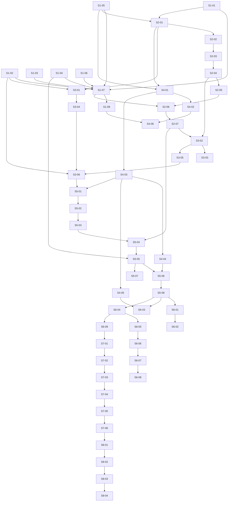

# Phase 7 — Add migration task class (Chainguard distroless): Stories manifest

**Status:** Backlog generated; ready for autonomous implementation
**Date:** 2026-05-12
**Phase architecture:** [../phase-arch-design.md](../phase-arch-design.md)
**Phase ADRs:** [../ADRs/](../ADRs/)
**Implementation plan:** [../High-level-impl.md](../High-level-impl.md)
**Source design:** [../final-design.md](../final-design.md)

## Executive summary

46 stories across the 8 implementation steps decompose Phase 7 into autonomous-agent-sized units (1–3 hours human-equivalent each). The DAG is contract-shaped: Step 1's eight stories (six ADR-gated additive seams + permanent contract-surface snapshot canary + snapshot-regen CI audit) gate every later step because they own the surfaces every later file compiles against. Step 2 (tool wrappers + pre-rendered base-catalog hot view) fans the dependency front out into the two probe groups (Step 3) and the recipe engine + transform (Step 4), which then converge in Step 5's vertical-slice ledger + graph + CLI + Node Express E2E. Steps 6–8 broaden coverage (≥30-fixture adversarial corpus, three more E2E flows, performance canaries, fence-CI extension) and execute the snapshot-discipline rehearsal that proves the merge gate works. Cross-cutting concerns — fence-CI deny-imports, mypy strict, golden-file canonicalization, every probe emitting facts not judgments — are folded into the earliest story that introduces the surface rather than batched.

## How to use this backlog

1. **Read the architecture and ADRs first.** Stories assume you have already read [../phase-arch-design.md](../phase-arch-design.md), the relevant ADRs under [../ADRs/](../ADRs/), and [../High-level-impl.md](../High-level-impl.md). The story files do not re-state load-bearing rationale; they link to it.
2. **Pick stories in DAG order.** The "Depends on" column is the topological prerequisite. Do not start a story until every dep is `Done`.
3. **Use red-green-refactor.** Each story's TDD plan specifies the failing test to commit first. The acceptance criteria are the green target.
4. **One story = one PR.** No bundling. Surface scope creep as a follow-up story, not as an inline addition.
5. **Update the story file's Status field** to `In progress` when you start and `Done` when all criteria are checked.
6. **Cite the ADR or arch-section** in the PR description for every load-bearing decision the story implements. Any PR that touches `tools/contract-surface.snapshot.json` MUST also touch a per-phase or production ADR file in the same PR — `tools/snapshot_regen_audit.py` enforces this (see S1-08).
7. **Surface gaps loudly.** If a story's premise contradicts what you find in code (e.g., the Phase 5 `ObjectiveSignals` shape doesn't match what S1-02 expected), stop and surface it via the `Open implementation questions` section below rather than papering over it.

## Definition of done (applies to every story)

- [ ] All acceptance criteria are checked.
- [ ] The TDD plan's red test exists, is committed, and is green.
- [ ] Any additional tests required to honor the relevant ADRs are written and green.
- [ ] Code is formatted (`ruff format`), linted clean (`ruff check`), and passes the type check (`mypy --strict`) on the scope listed in `phase-arch-design.md §Testing strategy ›CI gates #7`.
- [ ] No existing test was disabled or weakened without an explicit note in the story's "Notes for the implementer" section explaining why.
- [ ] The story file's Status is updated to `Done`.
- [ ] If the story modifies any contract documented in an ADR, the ADR's "Consequences" section is reviewed for new follow-ups.
- [ ] If the story changes `tools/contract-surface.snapshot.json`, the same PR modifies the per-phase ADR(s) under `docs/phases/07-migration-task-class/ADRs/` that justify the regen, and CI's `snapshot_regen_audit` job is green.

## Dependency DAG (visual)

## Stories — by step

### Step 1: Establish the six additive seams, ADRs, and the contract-surface snapshot canary

**Step goal:** Every Phase 0–6 surface that Phase 7 will compile against is widened, justified by an ADR, and frozen against further drift by a permanent CI canary — in one merged PR — before any new Phase 7 file is written.
**Step exit-criteria mapping:** G2, G3, G15, G18, G19; closes the per-phase definition of "extension by addition" via the ADR-0028 amendment.

| ID | Title (slug → file) | Effort | Depends on | Summary (one sentence) |
|---|---|---|---|---|
| S1-01 | [Add `gate_registry.py` module (`S1-01-add-gate-registry-module`)](S1-01-add-gate-registry-module.md) | S | — | New `src/codegenie/probes/gate_registry.py` exporting `@register_gate_probe` and `all_gate_probes()` plus isolation tests asserting Phase 2's `all_probes()` does not see gate probes (ADR-0002 / ADR-P7-001). |
| S1-02 | [Widen `ObjectiveSignals` with four optional `None` fields (`S1-02-widen-objective-signals`)](S1-02-widen-objective-signals.md) | S | — | Add `dive | shell_presence | shell_invocation_trace | base_image: ... | None = None` to `ObjectiveSignals` and the four Pydantic `*Signal` model stubs they reference (ADR-0003 / ADR-P7-002). |
| S1-03 | [Extend `ALLOWED_BINARIES` and egress allowlist (`S1-03-extend-allowlists`)](S1-03-extend-allowlists.md) | S | — | Add `docker`, `dive` to `ALLOWED_BINARIES` and `cgr.dev`, `docker.io` to the egress allowlist; assert Phase 5 sandbox chokepoint still rejects everything else (ADR-0003). |
| S1-04 | [Add `task_type` kwarg to `FallbackTier.run` (`S1-04-fallback-tier-task-type-kwarg`)](S1-04-fallback-tier-task-type-kwarg.md) | S | — | Additive default-`None` kwarg on `FallbackTier.run`; lands `tests/integration/test_phase4_default_task_type_behavior_unchanged.py` proving byte-identical results when `task_type=None` (ADR-0004 / ADR-P7-003). |
| S1-05 | [Extend `Recipe.engine` `Literal` with `"dockerfile"` (`S1-05-extend-recipe-engine-literal`)](S1-05-extend-recipe-engine-literal.md) | S | — | One-value additive extension to the closed `Literal` on `Recipe.engine`; round-trip a fixture recipe with `engine: "dockerfile"` through Pydantic (ADR-0007 / ADR-P7-006). |
| S1-06 | [Land per-phase ADRs and the ADR-0028 amendment (`S1-06-adrs-and-adr-0028-amendment`)](S1-06-adrs-and-adr-0028-amendment.md) | M | — | Confirm all 14 per-phase ADRs exist and link from the per-phase index; append the one-paragraph behavior-preserving-additive-extension amendment to production `ADR-0028`; cross-link back to the per-phase ADR-0001..0007. |
| S1-07 | [Generate initial contract-surface snapshot + permanent canary (`S1-07-contract-surface-snapshot-canary`)](S1-07-contract-surface-snapshot-canary.md) | M | S1-01, S1-02, S1-03, S1-04, S1-05, S1-06 | Write the snapshot generator covering Pydantic schemas, ABC signatures, closed `Literal`s, registry decorator signatures, `ALLOWED_BINARIES`, egress allowlist; commit `tools/contract-surface.snapshot.json`; land `tests/integration/test_contract_surface_snapshot.py` with `--update-contract-snapshot` flag (ADR-0009). |
| S1-08 | [Land `snapshot_regen_audit.py` CI gate + fence-CI extension (`S1-08-snapshot-regen-audit-and-fence-ci`)](S1-08-snapshot-regen-audit-and-fence-ci.md) | S | S1-07 | `tools/snapshot_regen_audit.py` scans PR body for `ADR-(P\d+-\d+|0\d+)` and requires the matching ADR file modified in the same PR; extend fence-CI to deny `anthropic|chromadb|sentence-transformers` imports under `probes/`, `transforms/`, `recipes/`, `catalogs/` (Gap 5, G18). |

### Step 2: Tool wrappers and the pre-rendered base catalog hot view

**Step goal:** Deterministic, Pydantic-typed wrappers around `dockerfile-parse`, `docker buildx`, `dive`, and `strace` exist; cross-platform `cache_lock` exists; `.codegenie/cache/base_catalog.json` is renderable from `cve_image_recommendations.yaml`.
**Step exit-criteria mapping:** Enables G5 (Express E2E); shape-compatible with Phase 8's Redis hot view (ADR-0013).

| ID | Title (slug → file) | Effort | Depends on | Summary (one sentence) |
|---|---|---|---|---|
| S2-01 | [`tools/dockerfile_parse.py` strict wrapper (`S2-01-dockerfile-parse-wrapper`)](S2-01-dockerfile-parse-wrapper.md) | M | S1-01, S1-05 | Strict-mode wrapper with UTF-8-only, BOM/CR/`ONBUILD`/`>1 MB` rejection, 10 s wall-clock, Pydantic `DockerfileInventory` with `parser_skipped_lines`. |
| S2-02 | [`tools/buildkit.py` wrapper + builder bootstrap (`S2-02-buildkit-wrapper-and-builder-bootstrap`)](S2-02-buildkit-wrapper-and-builder-bootstrap.md) | M | S2-01 | `docker buildx build`, `imagetools inspect --raw --platform=linux/amd64`, idempotent auto-create of `codegenie-distroless` builder, `RegistryAuthFailed` parsing from stderr (Gap 7). |
| S2-03 | [`tools/dive.py` Pydantic wrapper with `extra="forbid"` (`S2-03-dive-wrapper`)](S2-03-dive-wrapper.md) | S | S2-02 | `dive --json` Pydantic model that raises loudly on upstream schema drift. |
| S2-04 | [`tools/strace.py` subprocess wrapper (`S2-04-strace-wrapper`)](S2-04-strace-wrapper.md) | S | S2-03 | `strace -f -e trace=execve,connect,openat` wrapper with configurable budget; sanitizer Pass 5 hook for the raw trace bytes. |
| S2-05 | [`cache_lock` cross-platform `flock(2)` wrapper (`S2-05-cache-lock-cross-platform`)](S2-05-cache-lock-cross-platform.md) | M | S2-04 | `src/codegenie/sandbox/host/cache_lock.py` with `fcntl.flock` + `pyfilelock` fallback; `CacheLockTimeout`; cross-platform matrix test (Gap 2). |
| S2-06 | [Distroless catalog seed + `render_base_catalog()` (`S2-06-distroless-base-catalog`)](S2-06-distroless-base-catalog.md) | M | S1-07, S2-05 | `src/codegenie/catalogs/distroless/cve_image_recommendations.yaml` (≥3 rows for Node, Go, Python), `_schema.json`, `render_base_catalog()` / `read_base_catalog()`; round-trip through `tools/contract-surface.snapshot.json#base_catalog` shape. |
| S2-07 | [Extend `tools/digests.yaml` additively (`S2-07-extend-tools-digests`)](S2-07-extend-tools-digests.md) | S | S2-06 | Append `sandbox.dive`, `sandbox.strace`, `sandbox.strace_sidecar`, `sandbox.buildkit_image`, `gate.shell_trace.budget_s=30`; assert precedence CLI > env > digests.yaml > default. |

### Step 3: Land `BaseImageProbe`, `ShellInvocationTraceProbe`, and the four signal collectors

**Step goal:** The two new probes exist, register on correct registries, emit facts not judgments, and four `@register_signal_kind` collectors light up `ObjectiveSignals`'s new optional fields.
**Step exit-criteria mapping:** G15 (gate-time-only via `@register_gate_probe`); G16 (`dive_efficiency` advisory-only); closes the v0.6→v0.7 widening compat hole (Gap 3).

| ID | Title (slug → file) | Effort | Depends on | Summary (one sentence) |
|---|---|---|---|---|
| S3-01 | [`BaseImageProbe` Layer-C gather-time (`S3-01-base-image-probe`)](S3-01-base-image-probe.md) | M | S2-01, S1-02 | `src/codegenie/probes/base_image.py` registered via `@register_probe`, `applies_to_tasks=["distroless_migration","vuln_remediation"]`; ≥14 unit tests including the intent test that no output field name contains `is_*|safe_*|recommended_*`. |
| S3-02 | [`ShellInvocationTraceProbe` gate-time + strace sidecar (`S3-02-shell-invocation-trace-probe`)](S3-02-shell-invocation-trace-probe.md) | L | S2-04, S2-07 | `src/codegenie/probes/shell_invocation_trace.py` via `@register_gate_probe`; strace runs in a sibling sidecar `docker run --pid=container:<candidate>` (Gap 4); ≥10 unit tests including the intent test. |
| S3-03 | [Strace sidecar PID-share + idempotence integration tests (`S3-03-strace-sidecar-integration`)](S3-03-strace-sidecar-integration.md) | M | S3-02 | `tests/integration/test_strace_sidecar_pid_share.py` (candidate's PID 1 is candidate's own entrypoint, not strace) + `tests/integration/test_strace_idempotent.py` (re-tracing same digest → byte-identical `ShellInvocationTrace`). |
| S3-04 | [`DiveSignal` advisory-only collector (`S3-04-dive-signal-advisory`)](S3-04-dive-signal-advisory.md) | S | S3-01 | `src/codegenie/sandbox/signals/dive.py` via `@register_signal_kind`; `passed=True` always even when `size_ratio_post_pre > 1.0` (ADR-0008 / ADR-P7-007); closes critic sec.3. |
| S3-05 | [`ShellPresenceSignal` + `ShellInvocationTraceSignal` strict-AND collectors (`S3-05-shell-signal-collectors`)](S3-05-shell-signal-collectors.md) | M | S3-02 | Two collectors projecting on dive result + trace probe output; `confidence != high → passed=False, retryable=True`; observed shell → `passed=False, retryable=False`. |
| S3-06 | [`BaseImageSignal` collector + `ObjectiveSignals` widening-compat test (`S3-06-base-image-signal-and-widening-compat`)](S3-06-base-image-signal-and-widening-compat.md) | M | S1-02, S3-04, S3-05 | `src/codegenie/sandbox/signals/base_image.py` + `tests/integration/test_objective_signals_widening_compat.py` exercises `TrustScorer.score` and `StrictAndGate.evaluate` on every populated / non-populated permutation of the new four fields (Gap 3). |

### Step 4: `DockerfileRecipeEngine`, `DockerfileBaseImageSwapTransform`, and seed recipes

**Step goal:** Recipe path can match a distroless target, mutate the Dockerfile AST deterministically, round-trip safely, and produce a clean `git format-patch` — for both single-stage swap and multi-stage refactor — without OpenRewrite.
**Step exit-criteria mapping:** G14 (round-trip safety property), G20 (handrolled-only); enables G5 (Express E2E).

| ID | Title (slug → file) | Effort | Depends on | Summary (one sentence) |
|---|---|---|---|---|
| S4-01 | [`DockerfileRecipeEngine` ABC implementation + determinism (`S4-01-dockerfile-recipe-engine`)](S4-01-dockerfile-recipe-engine.md) | M | S2-01, S1-05 | `src/codegenie/recipes/engines/dockerfile_engine.py` with strict AST mutation; round-trip safety post-assertion; byte-only canonicalization (LF + trailing-WS strip); deterministic `git format-patch` with fixed bot identity. |
| S4-02 | [Round-trip + idempotence property tests (`S4-02-dockerfile-engine-property-tests`)](S4-02-dockerfile-engine-property-tests.md) | M | S4-01 | `tests/property/test_dockerfile_engine_roundtrip.py` (G14) + `tests/property/test_dockerfile_engine_idempotent.py`; passes on initial small fixture set; full corpus lights up in S6-02. |
| S4-03 | [`DockerfileBaseImageSwapTransform` (`S4-03-dockerfile-base-image-swap-transform`)](S4-03-dockerfile-base-image-swap-transform.md) | M | S4-01 | `src/codegenie/transforms/dockerfile_base_image_swap.py` implements `Transform` ABC; `git worktree add`; `WorktreeContaminated` dirty-tree refusal; branch naming `codegenie/distroless/<sha>`. |
| S4-04 | [`swap_base_image_single_stage` recipe + Node20 golden patch (`S4-04-single-stage-swap-recipe`)](S4-04-single-stage-swap-recipe.md) | S | S4-03 | `src/codegenie/recipes/catalog/docker/swap_base_image_single_stage.yaml` with `engine: "dockerfile"`; `tests/golden/dockerfile_swap_node20.patch` updatable via `pytest --update-golden`; five-run byte-determinism. |
| S4-05 | [`multi_stage_distroless_refactor` recipe + Go golden patch (`S4-05-multi-stage-refactor-recipe`)](S4-05-multi-stage-refactor-recipe.md) | M | S4-03 | `multi_stage_distroless_refactor.yaml` covering the Go static-binary path; `tests/golden/dockerfile_multistage_go.patch`; five-run byte-determinism. |
| S4-06 | [Fence-CI synthetic-PR + snapshot regen for `Recipe.engine` extension (`S4-06-fence-ci-and-snapshot-for-engine`)](S4-06-fence-ci-and-snapshot-for-engine.md) | S | S1-08, S4-02 | Synthetic PR that imports `anthropic` under `recipes/` is rejected; the `Recipe.engine` Literal extension flows through the snapshot canary with the ADR-0007 link required by `snapshot_regen_audit`. |

### Step 5: `DistrolessLedger`, `build_distroless_loop()`, `cli/migrate.py`, and Node.js Express E2E

**Step goal:** A new operator can run `codegenie migrate <repo> --target distroless --cve <id>` against the Express fixture and get a Chainguard distroless PR-ready patch through the recipe path — closes roadmap exit criterion G5.
**Step exit-criteria mapping:** G1 (both task classes on same substrate), G5 (Node E2E), G19 (no Phase 2 coordinator / Phase 6 `cli/loop.py` edits).

| ID | Title (slug → file) | Effort | Depends on | Summary (one sentence) |
|---|---|---|---|---|
| S5-01 | [`DistrolessLedger`, `TargetImageRecommendation`, `MigrationReport` Pydantic models (`S5-01-distroless-state-models`)](S5-01-distroless-state-models.md) | M | S3-06, S4-03 | `src/codegenie/graph/state_distroless.py` with `extra="forbid"`, `schema_version: Literal["v0.7.0"]`; runtime `id()`-diff hook fires on in-place mutation; ledger Hypothesis serialization property. |
| S5-02 | [Distroless graph nodes — gather half (`S5-02-distroless-nodes-gather`)](S5-02-distroless-nodes-gather.md) | M | S5-01 | `src/codegenie/graph/nodes/distroless/{ingest_target,resolve_target_image,select_recipe,rag_lookup,replan_with_phase4}.py`; `resolve_target_image` enforces the image-name allowlist regex; `replan_with_phase4` passes `task_type="distroless_migration"`. |
| S5-03 | [Distroless graph nodes — execute half (`S5-03-distroless-nodes-execute`)](S5-03-distroless-nodes-execute.md) | M | S5-02 | `apply_recipe`, `validate_in_sandbox`, `record_attempt`, `emit_artifact` nodes; `await_human` and `escalate` imported verbatim from Phase 6. |
| S5-04 | [`build_distroless_loop` factory + edges + topology golden (`S5-04-build-distroless-loop`)](S5-04-build-distroless-loop.md) | M | S5-03, S2-07 | `src/codegenie/graph/distroless_loop.py` factory with module-level singleton + `(id(checkpointer), max_attempts)` cache key; `interrupt_before=["await_human"]`; `route_after_resolve_target` `@pure_edge`; `tests/golden/distroless_loop_topology.json`. |
| S5-05 | [`cli/migrate.py` Click verbs + workflow_id scheme (`S5-05-cli-migrate-verbs`)](S5-05-cli-migrate-verbs.md) | M | S5-04, S1-04 | `run`/`resume`/`inspect`/`replay`/`render` verbs; `workflow_id = blake3(...|wf:distroless:...)[:16]` (Gap 1); CLI exit codes `0/11/12/13/1` mirror Phase 6. |
| S5-06 | [Node Express fixture + roadmap E2E test (`S5-06-node-express-e2e`)](S5-06-node-express-e2e.md) | L | S4-04, S5-05 | `tests/fixtures/repos/express-distroless/` + `tests/integration/test_migrate_node_e2e.py` — **G5 / roadmap exit-criterion test:** recipe match → buildx build → `grype` CVE delta ≤ 0 → `dive` no `/bin/sh` → `runtime_shell_count == 0` → golden patch match. |
| S5-07 | [Cross-task chain-no-collision integration test (`S5-07-chain-no-collision-across-tasks`)](S5-07-chain-no-collision-across-tasks.md) | S | S5-05 | `tests/integration/test_chain_no_collision_across_tasks.py`: identical `<run-id>` for one vuln + one distroless workflow → audit chains live in disjoint directories (Gap 1). |
| S5-08 | [Replay-after-SIGKILL integration test (`S5-08-migrate-replay-after-kill`)](S5-08-migrate-replay-after-kill.md) | M | S5-06 | `tests/integration/test_migrate_replay_after_kill.py`: SIGKILL during `validate_in_sandbox`; resume produces byte-identical final ledger. |

### Step 6: Adversarial Dockerfile corpus, property tests, and three more E2E flows

**Step goal:** Every edge case in `phase-arch-design.md §Edge cases` (≥16 entries), the ≥30-fixture adversarial corpus (G13), and the three non-happy-path E2E flows (multi-stage Go, shell-required HITL, recipe-miss LLM fallback) are exercised.
**Step exit-criteria mapping:** G13 (corpus ≥30), G14 (round-trip property), G9 ($/PR), Gap 6 (task-type-mismatch safety), Risk #2 (RAG correctness).

| ID | Title (slug → file) | Effort | Depends on | Summary (one sentence) |
|---|---|---|---|---|
| S6-01 | [≥30-fixture adversarial Dockerfile corpus (`S6-01-adversarial-dockerfile-corpus`)](S6-01-adversarial-dockerfile-corpus.md) | M | S5-08 | `tests/adversarial/dockerfiles/` with all G13 categories: BOM, UTF-16-LE/BE, CR-only, mixed CRLF, `ONBUILD`, 2 MB, parse-bomb, NFC/NFKC, hidden `\r`, Windows-1252, embedded null, 100 MB (rejected), 200-stage (rejected), `#syntax=` non-first, `FROM scratch`, multi-platform `FROM`, prompt-injection in `LABEL`/`RUN`, etc. |
| S6-02 | [Round-trip + image-allowlist + ledger + edge-predicate properties (`S6-02-property-tests-over-corpus`)](S6-02-property-tests-over-corpus.md) | M | S6-01 | Property tests over the full corpus: round-trip equivalence (G14); image-name allowlist Hypothesis test; `DistrolessLedger` serialization round-trip; gate-predicate label invariance under non-consumed-field mutation. |
| S6-03 | [Static-Go E2E + multi-stage recipe coverage (`S6-03-static-go-e2e`)](S6-03-static-go-e2e.md) | L | S4-05, S5-08 | `tests/fixtures/repos/static-go-distroless/` + `tests/integration/test_migrate_static_go_e2e.py`; `last_engine == "dockerfile_recipe"`; multi-stage refactor recipe matches; golden patch. |
| S6-04 | [Shell-required HITL E2E (`S6-04-shell-required-hitl-e2e`)](S6-04-shell-required-hitl-e2e.md) | M | S5-08 | `tests/fixtures/repos/shell-required-distroless/` + `tests/integration/test_migrate_shell_required_hitl.py`; `await_human` interrupt fires with correct `HumanRequest.reason`; mocked `HumanDecision(action="abort")` aborts cleanly. |
| S6-05 | [Heredoc + Alpine→glibc fixtures (`S6-05-heredoc-and-alpine-glibc-fixtures`)](S6-05-heredoc-and-alpine-glibc-fixtures.md) | M | S6-04 | `tests/fixtures/repos/heredoc-buildkit-distroless/` (`parser_skipped_lines > 0` → recipe miss) + `tests/fixtures/repos/alpine-to-glibc-distroless/` (legitimate size growth — closes critic sec.3). |
| S6-06 | [Recipe-miss LLM fallback E2E + distroless prompt template (`S6-06-llm-fallback-e2e-and-prompt`)](S6-06-llm-fallback-e2e-and-prompt.md) | L | S6-05 | `src/codegenie/planner/prompts/migration_distroless.v1.yaml` (schema-validated, version-pinned); cassette-driven `tests/integration/test_migrate_recipe_miss_llm_fallback.py` asserts ≤ $0.12 (G9) and produces a distroless-shaped patch. |
| S6-07 | [Distroless RAG corpus + top-1 retrieval test (`S6-07-distroless-rag-top1`)](S6-07-distroless-rag-top1.md) | M | S6-06 | Vector store collection `distroless_solved_examples_promoted` seeded with ≥3 hand-curated examples; `tests/integration/test_rag_distroless_top1.py` asserts distroless query returns distroless example as top-1 (Risk #2). |
| S6-08 | [Task-type-mismatch safety + supervisor `xfail` (`S6-08-task-type-mismatch-safety`)](S6-08-task-type-mismatch-safety.md) | M | S6-07 | `tests/integration/test_phase4_task_type_mismatch_safety.py` (vuln advisory + `task_type="distroless_migration"` → loud failure); `tests/integration/test_supervisor_logs_task_type.py` defined as `xfail` until Phase 8 (Gap 6). |
| S6-09 | [Adversarial typosquat + egress-block tests (`S6-09-typosquat-and-egress-adversarial`)](S6-09-typosquat-and-egress-adversarial.md) | S | S6-04 | `tests/adversarial/typosquat_lookup.py` (`cgr.dev/chamguard/...` rejected by allowlist regex) + `tests/adversarial/build_egress_blocked.py` (`RUN curl https://evil.test/` dropped; `sandbox.egress.blocked` audit event recorded). |

### Step 7: Performance canaries + fence-CI extension

**Step goal:** The regression-suite wall-clock canary, buildkit cache hit rate, workflow throughput, dockerfile-engine p95, and strace budget distribution tests are green at the pinned baselines.
**Step exit-criteria mapping:** G6/G7 (throughput), G8 (time-to-PR), G10 (cache hit rate), G11 (memory), G12 (wall-clock canary).

| ID | Title (slug → file) | Effort | Depends on | Summary (one sentence) |
|---|---|---|---|---|
| S7-01 | [Regression-suite wall-clock canary + baseline (`S7-01-regression-suite-wall-clock-canary`)](S7-01-regression-suite-wall-clock-canary.md) | M | S6-09 | `tests/perf/test_regression_suite_wall_clock.py` (G12) with `pytest -n auto`; baseline in `tests/perf/baseline.json` (runner-class metadata); `pytest --update-perf-baseline` for deliberate bumps. |
| S7-02 | [Buildkit cache hit rate canary (`S7-02-buildkit-cache-hit-rate-canary`)](S7-02-buildkit-cache-hit-rate-canary.md) | M | S7-01 | `tests/perf/test_buildkit_cache_hit_rate.py` (G10): ≥ 85% pulled-layer + ≥ 60% derived-layer after 3-fixture warm-up run. |
| S7-03 | [Workflow throughput canary cold + warm + mixed (`S7-03-workflow-throughput-canary`)](S7-03-workflow-throughput-canary.md) | M | S7-02 | `tests/perf/test_workflow_throughput.py` (G6/G7): 6 cold + 24 warm distroless + ≥ 10/hr mixed-portfolio warm on the Linux DinD reference runner. |
| S7-04 | [Dockerfile-engine p95 + strace budget distribution (`S7-04-dockerfile-p95-and-strace-budget`)](S7-04-dockerfile-p95-and-strace-budget.md) | S | S7-03 | `tests/perf/test_dockerfile_engine_p95.py` (round-trip p95 ≤ 100 ms) + `tests/perf/test_strace_budget_distribution.py` (warn if empirical p95 > 24 s — Risk #3). |
| S7-05 | [Mixed portfolio warm E2E (`S7-05-mixed-portfolio-warm-e2e`)](S7-05-mixed-portfolio-warm-e2e.md) | M | S7-04 | `tests/e2e/test_mixed_portfolio_warm.py` (G7) exercising vuln + distroless interleaved on the 3-fixture portfolio. |
| S7-06 | [Per-worker memory measurement + fence-CI synthetic PR (`S7-06-memory-measurement-and-fence-ci`)](S7-06-memory-measurement-and-fence-ci.md) | S | S7-05 | Per-worker steady-state ≤ 2.4 GB (G11) measured inside throughput test; fence-CI extension blocks a synthetic PR that imports `anthropic` under `recipes/` (G18). |

### Step 8: Pre-flight final regression and snapshot-discipline rehearsal

**Step goal:** Before merge, every gate the merge depends on is exercised end-to-end and verified to fail loudly when broken — including the snapshot-canary discipline itself.
**Step exit-criteria mapping:** G2/G3 enforcement rehearsal, G4 (hard regression gate), G19 (no forbidden edits).

| ID | Title (slug → file) | Effort | Depends on | Summary (one sentence) |
|---|---|---|---|---|
| S8-01 | [Full Phase 3/4/5/6 unchanged integration suite (`S8-01-phase-3-4-5-6-unchanged-suite`)](S8-01-phase-3-4-5-6-unchanged-suite.md) | M | S7-06 | `tests/integration/test_phase3_4_5_6_unchanged.py` — hard merge gate (G4); re-runs every Phase 3/4/5/6 integration test verbatim with no edits; all G4-gating tests wired into CI's `merge` lane. |
| S8-02 | [`@pure_edge` and `python -O` extension to distroless edges (`S8-02-pure-edge-and-python-O`)](S8-02-pure-edge-and-python-O.md) | S | S8-01 | Extend `tests/graph/test_pep_no_O_optimizations.py` to cover `route_after_resolve_target` and any other Phase 7 `@pure_edge`; `python -O` startup test fails loudly (assertions stripped). |
| S8-03 | [Grype-DB concurrent-refresh cross-OS matrix (`S8-03-grype-db-concurrent-refresh`)](S8-03-grype-db-concurrent-refresh.md) | S | S8-02 | `tests/integration/test_grype_db_concurrent_refresh.py` runs on macOS BSD flock + Linux fcntl matrix (closes documented blind spot critic perf.assumption.1). |
| S8-04 | [Snapshot-discipline rehearsals A + B + PR checklist (`S8-04-snapshot-discipline-rehearsal`)](S8-04-snapshot-discipline-rehearsal.md) | S | S8-03 | Two local rehearsal PRs: A (no-op edit to a non-seam Phase 0–6 file → canary + `snapshot_regen_audit` both fire) and B (legitimate additive regen with linked ADR → both accept); final PR description links every ADR-P7-001..007 and the ADR-0028 amendment. |

## Cross-cutting concerns

- **Facts, not judgments (Rule 9 / ADR-0008).** Every probe story (S3-01, S3-02) and every signal-collector story (S3-04, S3-05, S3-06) includes an *intent test* asserting no output field name contains `is_*|safe_*|recommended_*`. Conclusions are the Planner's job; evidence is reusable.
- **Fence-CI deny-imports under Phase 7 modules.** Every story that lands code under `src/codegenie/{probes,transforms,recipes,catalogs}/` includes the fence-CI acceptance criterion (no `anthropic|chromadb|sentence-transformers` imports). Synthetic-PR rejection is verified once in S4-06 and again in S7-06.
- **Contract-surface snapshot regen discipline.** Any story that touches the surfaces enumerated in `phase-arch-design.md §Component 10` (Pydantic schemas, ABC signatures, closed `Literal`s, registry decorator signatures, `ALLOWED_BINARIES`, egress allowlist, `FallbackTier.run` signature, `base_catalog.json` shape) regenerates the snapshot in the same PR and links the per-phase ADR — `tools/snapshot_regen_audit.py` (S1-08) blocks PRs that don't.
- **Determinism over probabilism.** No `random` / no `time` imports under `graph/`, `probes/`, `recipes/`, `transforms/`, `catalogs/` (fence-CI enforced). Five-run byte-determinism is an acceptance criterion in every recipe / patch-emitting story (S4-04, S4-05, S5-06, S6-03).
- **Mypy strict + ruff clean.** Every story landing new `.py` under the scopes named in `phase-arch-design.md §Testing strategy ›CI gates #7` includes a `mypy --strict` and `ruff check` acceptance criterion. Stories that only touch fixtures/golden files are exempt.

## Exit-criteria coverage

| Exit criterion | Story / stories |
|---|---|
| G1 — Both task classes run from the same orchestration substrate (`codegenie loop` vuln; `codegenie migrate` distroless; same `AuditedSqliteSaver`, BLAKE3 audit chain, `HumanRequest`/`HumanDecision`). | S1-01, S5-01, S5-04, S5-05, S5-06 |
| G2 / G3 — Diff touches only new files plus six ADR-gated additive seams; each regenerates the contract-surface snapshot in the same PR (amended ADR-0028). | S1-01, S1-02, S1-03, S1-04, S1-05, S1-06, S1-07, S1-08, S8-04 |
| G4 — Full vuln-remediation regression suite runs as a hard gate before merging. | S8-01 |
| G5 — End-to-end test migrates Node.js service to Chainguard distroless. | S5-06 |
| G6 / G7 — Throughput cold ≥ 6/hr, warm distroless ≥ 24/hr, mixed warm ≥ 10/hr. | S7-03, S7-05 |
| G8 — Time-to-PR. | S7-03 (measured), S5-06 (happy-path baseline) |
| G9 — $/PR ≤ $0.12 on LLM-fallback. | S6-06 |
| G10 — Buildkit cache hit rate ≥ 85% pulled / ≥ 60% derived. | S7-02 |
| G11 — Per-worker steady-state memory ≤ 2.4 GB. | S7-06 |
| G12 — Regression-suite wall-clock canary permanent. | S7-01 |
| G13 — Adversarial Dockerfile corpus ≥ 30. | S6-01 |
| G14 — Round-trip safety property. | S4-02 (initial fixtures), S6-02 (full corpus) |
| G15 — `ShellInvocationTraceProbe` gate-time-only via `@register_gate_probe`. | S1-01, S3-02 |
| G16 — `dive_efficiency` advisory. | S3-04 |
| G17 — Operator-side credentials only (no `codegenie-secretd`). | S1-03, S2-02 (auth-error parsing), S8-04 (operator-notes optional) |
| G18 — Zero LLM tokens inside Phase 7 boundary; fence-CI deny-imports. | S1-08, S4-06, S7-06 |
| G19 — No new ABCs, no new top-level packages, no Phase 2 coordinator / Phase 6 `cli/loop.py` edits, no rootfs bump (structurally enforced). | S1-07 (snapshot canary), S8-01 (regression), S8-04 (rehearsal A) |
| G20 — Handrolled-only recipes; OpenRewrite deferred. | S4-01, S4-04, S4-05 (ADR-P7-004 deferral) |

## Open implementation questions

Items the architecture flagged as deferred to implementation, mapped to the story they first surface in:

1. **Strace 30 s budget calibration under real workloads.** — first arises in S3-02, empirically measured in S7-04. `tools/digests.yaml#gate.shell_trace.budget_s` is the configurable; if S7-04 shows p95 > 24 s, bump with an ADR amendment.
2. **`flock(2)` cross-platform behavior (macOS BSD vs Linux fcntl).** — first arises in S2-05; cross-platform CI matrix asserted there and again in S8-03 for the grype DB case.
3. **Multi-arch image manifest handling.** — first surfaces in S2-02 (`imagetools inspect --raw --platform=linux/amd64`); deferred to Phase 7.1. `confidence=low` when manifest list detected with `--platform` mismatch (edge case #4).
4. **OpenRewrite `rewrite-docker` re-evaluation in Phase 15.** — anchored at S4-01 (ADR-P7-004 named deferral); no Phase 7 story re-opens.
5. **`base_catalog.json` schema versioning for Phase 8's Redis lift.** — first surfaces in S2-06 (pinned `Literal["v0.7.0"]`); Phase 8 either reuses or introduces a cross-boundary versioning policy.
6. **Pre-warm strategy for `cgr.dev` base images.** — first surfaces in S5-06 (cold-pull risk on CI runners); ~30 LOC operator follow-up; documented in S8-04 operator notes if shipped.
7. **`cve_image_recommendations.yaml` automated ingest.** — first surfaces in S2-06; deferred to Phase 14 continuous gather; staleness signaled via `catalog_row_age_h > 2160` → `confidence=medium` (edge case #12).
8. **`DistrolessLedger` ↔ `VulnLedger` unification (ADR-0022 strike two).** — anchored at S5-01 (explicit Phase 7 deferral via ADR-0011); Phase 8 or Phase 15 owns the merge.
9. **`ShellInvocationTraceProbe` sidecar image's vulnerability surface.** — first surfaces in S3-02 (Alpine sidecar pinned in `digests.yaml#sandbox.strace_sidecar`); Phase 16 may migrate to a Chainguard-distributed strace image.
10. **Strict zero-edit alternative remains documented.** — if the ADR-0028 amendment in S1-06 hits review pushback, fall back to `final-design.md §Departures #5` (parallel `MigrationFallbackTier`, parallel engine enum) and re-plan from Step 2.

## Backlog stats

- **Total stories:** 46
- **Stories per step:** Step 1 = 8, Step 2 = 7, Step 3 = 6, Step 4 = 6, Step 5 = 8, Step 6 = 9, Step 7 = 6, Step 8 = 4
- **Effort distribution:** S = 13, M = 27, L = 6
- **Longest dependency chain:** 19 stories — `S1-01 → S1-07 → S1-08 → S4-06 → (via S4-02) … → S5-01 → S5-02 → S5-03 → S5-04 → S5-05 → S5-06 → S5-08 → S6-01 → S6-02 …`; practical critical path through the vertical slice is `S1-01 → S1-07 → S2-01 → S2-02 → S2-03 → S2-04 → S2-05 → S2-06 → S2-07 → S5-04 → S5-05 → S5-06 → S5-08 → S6-01 → S6-04 → S6-05 → S6-06 → S6-07 → S6-08 → S6-09 → S7-01 → … → S8-04` (≈ 22 stories end-to-end).
