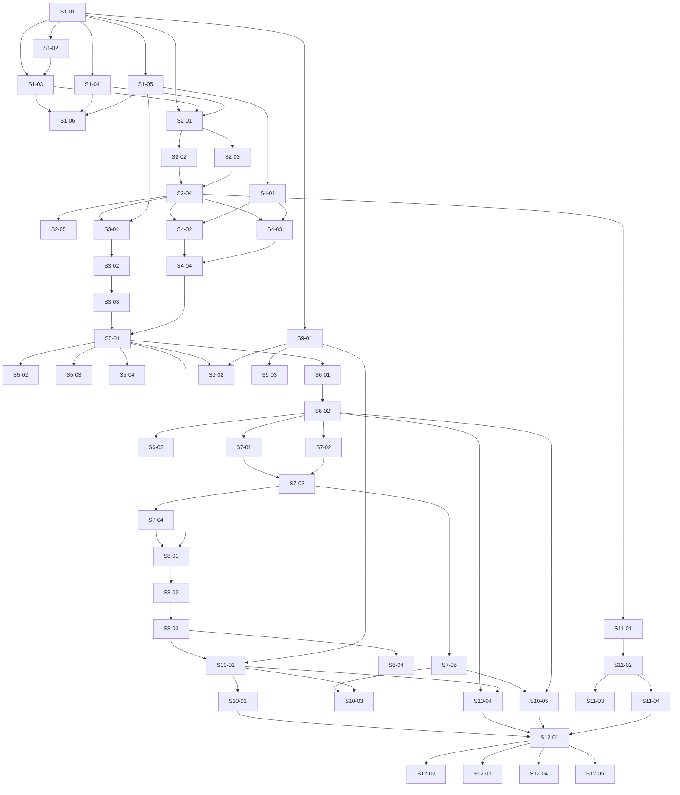

# Phase 7 — Add migration task class (Chainguard distroless): Stories manifest

**Status:** Backlog generated; ready for autonomous implementation
**Date:** 2026-05-19
**Phase architecture:** [../phase-arch-design.md](../phase-arch-design.md)
**Phase ADRs:** [../ADRs/](../ADRs/)
**Implementation plan:** [../High-level-impl.md](../High-level-impl.md)
**Source design:** [../final-design.md](../final-design.md)

## Executive summary

66 stories across the 18 implementation steps of Phase 7 (Steps 13–18 added 2026-05-20 by Amendment A). Per-step distribution: S1=6, S2=5, S3=3, S4=4, S5=4, S6=3, S7=5, S8=4, S9=3, S10=5, S11=4, S12=5, S13=3, S14=2, S15=3, S16=3, S17=2, S18=2. The DAG is roughly linear across steps with intra-step fan-out: Step 1 fans out into newtype / `Provenance` union / Protocol / SyftSbom reader / fence work that Step 2's registry kernel consumes; Step 5's byte-edit fence allowlist is sequenced to land *with* Step 3's first edit (the row is reserved in S5-01 even though S3-01 lands first per ADR-0009 enumeration discipline); Step 6's `SandboxRole` amendment gates the heavy probe in Step 7; Steps 8–11 layer additively; Step 12 is the integration choke point for e2e + property + adversarial coverage. The longest dependency chain is 11 stories (S1-01 → S1-02 → S2-01 → S2-04 → S3-02 → S4-02 → S5-01 → S6-02 → S7-03 → S8-03 → S10-02 → S11-04 → S12-03; counted as 12 nodes spanning the headline-coordination invariant). Cross-cutting work — LLM-SDK fences, byte-edit allowlist enforcement, `mypy --strict` + `ruff check` + `make lint-imports`, Phase 3–6.5 regression-suite hard gate — is woven into Step 1/5 stories and re-asserted in every later step's done-criteria. Gap-2 (`coordination-summary.yaml` schema) is pinned in S11-02; Gap-3 (SBOM byte-level trust beyond layer attribution) is enforced in S4-01 + S4-04; Gap-4 (polyglot tiebreaker) lands as `Ecosystem`-enum-sorted iteration in S2-03; Gap-5 (events accumulating unread) is mitigated by the `_index.tsv` append-on-write index in S11-02. The headline e2e tests (`tests/e2e/test_distroless_migration_e2e.py` and `tests/e2e/test_both_provenance_emits_coordination_event_e2e.py`) are Step 12 stories (S12-02, S12-03) that the entire backlog converges toward.

## How to use this backlog
1. Start at a story whose dependencies are satisfied.
2. Open the story file. Read Context, References, Goal, Acceptance criteria.
3. Begin with the TDD plan — write the failing red test first.
4. Implement just enough to make it pass.
5. Refactor.
6. Check every acceptance criterion. Update story Status from `Ready` to `Done`.
7. Move to the next ready story.

Order within a step is mostly fixed (later S-numbers depend on earlier). Order across steps follows High-level-impl, with cross-step parallelism wherever the dependency DAG allows.

## Definition of done (applies to every story)
- [ ] All acceptance criteria checked.
- [ ] TDD plan's red test exists, committed, green.
- [ ] Additional ADR-honoring tests written and green.
- [ ] `ruff format`, `ruff check`, `mypy --strict` all clean.
- [ ] `make lint-imports` green (no new LLM-SDK import path through the primitive or the migration plugin).
- [ ] **Phase 3–6.5 regression suite green** (`make check` — hard pre-merge gate per Phase 7 ADR-0009).
- [ ] **Byte-edit allowlist fence green** (`tests/fence/test_phase7_no_byte_edits_to_locked_files.py`) if the story edits a Phase 0–6.5 file.
- [ ] No existing test disabled or weakened without an explicit note in the story's Notes section.
- [ ] Story file Status updated to `Done`.
- [ ] If the story modifies a contract documented in an ADR, that ADR's Consequences section is reviewed.

## Dependency DAG (visual)

```mermaid
graph TD
  S1-01 --> S1-02
  S1-01 --> S1-03
  S1-01 --> S1-04
  S1-01 --> S1-05
  S1-02 --> S1-03
  S1-03 --> S1-06
  S1-04 --> S1-06
  S1-05 --> S1-06
  S1-01 --> S2-01
  S1-03 --> S2-01
  S1-04 --> S2-01
  S2-01 --> S2-02
  S2-01 --> S2-03
  S2-02 --> S2-04
  S2-03 --> S2-04
  S2-04 --> S2-05
  S2-04 --> S3-01
  S1-05 --> S3-01
  S3-01 --> S3-02
  S3-02 --> S3-03
  S1-05 --> S4-01
  S2-04 --> S4-02
  S4-01 --> S4-02
  S2-04 --> S4-03
  S4-01 --> S4-03
  S4-02 --> S4-04
  S4-03 --> S4-04
  S3-03 --> S5-01
  S4-04 --> S5-01
  S5-01 --> S5-02
  S5-01 --> S5-03
  S5-01 --> S5-04
  S5-01 --> S6-01
  S6-01 --> S6-02
  S6-02 --> S6-03
  S6-02 --> S7-01
  S6-02 --> S7-02
  S7-01 --> S7-03
  S7-02 --> S7-03
  S7-03 --> S7-04
  S7-03 --> S7-05
  S7-04 --> S8-01
  S5-01 --> S8-01
  S8-01 --> S8-02
  S8-02 --> S8-03
  S8-03 --> S8-04
  S1-01 --> S9-01
  S5-01 --> S9-02
  S9-01 --> S9-02
  S9-01 --> S9-03
  S8-03 --> S10-01
  S9-01 --> S10-01
  S10-01 --> S10-02
  S7-05 --> S10-03
  S10-01 --> S10-03
  S6-02 --> S10-04
  S10-01 --> S10-04
  S7-05 --> S10-05
  S6-02 --> S10-05
  S2-04 --> S11-01
  S11-01 --> S11-02
  S11-02 --> S11-03
  S11-02 --> S11-04
  S10-02 --> S12-01
  S10-04 --> S12-01
  S10-05 --> S12-01
  S11-04 --> S12-01
  S12-01 --> S12-02
  S12-01 --> S12-03
  S12-01 --> S12-04
  S12-01 --> S12-05
```
Direct deps only; transitive omitted.

## Stories — by step

### Step 1: Scaffold `vuln.provenance` primitive — newtypes, Provenance union, Protocol, errors, SyftSbom reader, fences
**Step goal:** Every typed primitive Phase 7 ever uses exists in code with `extra="forbid"` enforcement, `mypy --strict` clean, the seven-variant `Provenance` discriminated union constructable and round-trippable, the `VulnProvenanceAdapter` Protocol defined, and the LLM-SDK import-linter contract extended — before any adapter or registry logic lands.
**Step exit criteria mapping:** "Any shared primitive added is bounded, additive, ADR-backed, and covered by regression tests" + "`vuln.provenance` primitive lands" (the primitive's typed surface).

| ID | Title (slug → file) | Effort | Depends on | Summary (one sentence) |
|---|---|---|---|---|
| S1-01 | [Phase 7 newtype identifiers + smart constructors (`S1-01-phase7-newtype-identifiers`)](S1-01-phase7-newtype-identifiers.md) | M | — | Extend `codegenie.types.identifiers` with `CveId`, `PackageId`, `ImageRef`, `ImageDigest` (`sha256:` prefix asserted), `LayerDigest`, `RuntimeId`, `DockerStageName`, `ProvenanceAdapterId = tuple[Layer, Ecosystem]` as `NewType` + smart-constructor `Result[T, ParseError]` (Phase 7 ADR-0004 typed-vocabulary discipline). |
| S1-02 | [`DistroPackage` + `AppKind` / `BaseKind` / `UnknownReason` / `AdapterConfidence` enums (`S1-02-provenance-enums-and-distro-package`)](S1-02-provenance-enums-and-distro-package.md) | S | S1-01 | `DistroPackage` frozen Pydantic model (`distro: Literal["alpine","debian","ubuntu","rhel"]`, `name`, `version`); `AppKind` / `BaseKind` literal unions and `UnknownReason` / `AdapterConfidence` string enums consumed by the seven-variant union. |
| S1-03 | [Seven-variant `Provenance` discriminated union + nested `Both` guard (`S1-03-provenance-discriminated-union`)](S1-03-provenance-discriminated-union.md) | M | S1-01, S1-02 | Pydantic v2 discriminated union per Phase 7 ADR-0004/0006 verbatim: `AppDirect`, `AppTransitive`, `AppVendored`, `BaseImage`, `RuntimeBundled`, `Both`, `Unknown`; `Both.app_record: AppKind` + `Both.base_record: BaseKind` are nested discriminated unions so `Both(Both, ...)` raises `ValidationError`; every variant `frozen=True, extra="forbid"`. |
| S1-04 | [`VulnProvenanceAdapter` Protocol + `ProvenanceError` hierarchy (`S1-04-vuln-provenance-adapter-protocol`)](S1-04-vuln-provenance-adapter-protocol.md) | S | S1-01 | `@runtime_checkable VulnProvenanceAdapter(Protocol)` with `attribute(...) -> Provenance` + `confidence() -> AdapterConfidence`; **no `cost_band`, no `applies_when`** (critic Perf-5); `ProvenanceError(CodegenieError)` + `RegistryError` + `AdapterError` typed hierarchy. |
| S1-05 | [`SyftSbom` Pydantic reader (`S1-05-syft-sbom-reader-models`)](S1-05-syft-sbom-reader-models.md) | S | S1-01 | `SyftSbom`, `SyftArtifact`, `SyftLocation` Pydantic models under `src/codegenie/primitives/vuln_provenance/syft_reader.py`; `model_config = ConfigDict(extra="allow")` (Phase 2 carry-forward, Gap 3); known fields are `locations[].layerID`, `name`, `version` only. |
| S1-06 | [Phase 7 LLM-SDK import-linter contract + no-`Any` AST fence (`S1-06-phase7-primitive-fences`)](S1-06-phase7-primitive-fences.md) | S | S1-03, S1-04, S1-05 | `pyproject.toml [tool.importlinter]` extended for `src/codegenie/primitives/vuln_provenance/`; `tests/fence/test_phase7_no_llm.py` (runtime-closure scan against `FORBIDDEN_LLM_SDKS`); `tests/fence/test_no_any_in_provenance_surface.py` AST-walk asserting no `Any` / `dict[str, Any]` on the primitive surface. |

### Step 2: Registry kernel, `_ADAPTER_DISPATCH_ORDER`, `assemble_provenance` free function
**Step goal:** The Plugin/Registry seam for adapters exists; `@register_provenance_adapter` stores classes (Phase 7 ADR-0007 / critic BP-3); dispatch policy lives in one `Final` tuple operators can read (ADR-0006 / critic BP-1); `assemble_provenance(...)` walks the policy deterministically and composes via `match` + `assert_never`.
**Step exit criteria mapping:** "`vuln.provenance` primitive lands with at least app + base-image adapters; adapter-chain assembly answered" — this step ships the assembly half.

| ID | Title (slug → file) | Effort | Depends on | Summary (one sentence) |
|---|---|---|---|---|
| S2-01 | [`Layer` + `Ecosystem` enums + `_REGISTRY` + `@register_provenance_adapter` decorator (`S2-01-provenance-adapter-registry`)](S2-01-provenance-adapter-registry.md) | M | S1-01, S1-03, S1-04 | `Layer` enum (`APP | BASE_IMAGE | RUNTIME`), `Ecosystem` enum (`NPM | YARN_BERRY | PNPM | APK | DPKG | RPM`), module-level `_REGISTRY: Final[dict[ProvenanceAdapterId, type[VulnProvenanceAdapter]]]`, `@register_provenance_adapter(layer=..., ecosystem=...)` decorator storing **classes** (Phase 7 ADR-0007) and raising `RegistryError` on duplicate keys at decoration time. |
| S2-02 | [`AdapterFactory` Protocol + DI kwarg vocabulary (`S2-02-adapter-factory-di-protocol`)](S2-02-adapter-factory-di-protocol.md) | S | S2-01 | `AdapterFactory` Protocol pinning the closed set of well-known DI kwargs `{sbom_reader, logger, image_manifest_cache}` (open question §3); construction is dispatch-time. |
| S2-03 | [`_ADAPTER_DISPATCH_ORDER` `Final` tuple + `Ecosystem`-sorted intra-layer iteration (`S2-03-adapter-dispatch-order-tuple`)](S2-03-adapter-dispatch-order-tuple.md) | S | S2-01 | Module-level `_ADAPTER_DISPATCH_ORDER: Final[tuple[tuple[Layer, ...], ...]] = ((Layer.APP,), (Layer.BASE_IMAGE,), (Layer.RUNTIME,))` per Phase 7 ADR-0006; intra-layer iteration is `Ecosystem`-enum-sorted, NOT `dict.items()` order (Gap 4 polyglot tiebreaker). |
| S2-04 | [`assemble_provenance(...)` free function + `match`/`assert_never` composition (`S2-04-assemble-provenance-function`)](S2-04-assemble-provenance-function.md) | M | S2-02, S2-03 | `assemble_provenance(cve_id, package_id, image_ref, sbom, *, registry=None, adapter_factory=None) -> Provenance`; walks `_ADAPTER_DISPATCH_ORDER`, collects first non-`Unknown` per layer, composes via `match (app, base)` into `Unknown / app / base / Both`; ≤80 LOC; catches `ProvenanceError` → `Unknown(reason="adapter_error")`; all other exceptions propagate (Rule 12). |
| S2-05 | [Property tests: dispatch-order invariance + idempotence (`S2-05-assemble-property-tests`)](S2-05-assemble-property-tests.md) | S | S2-04 | Hypothesis property tests under `tests/property/vuln_provenance/`: 50 registration-order permutations → byte-identical result (locks critic BP-1); `assemble_provenance` called twice with identical inputs → equal `Provenance` (idempotence); `provenance_registry_reset` conftest fixture isolates `_REGISTRY` per test. |

### Step 3: `NpmVulnProvenanceAdapter` in Phase 3 plugin as additive new file (first byte-edit territory)
**Step goal:** The first concrete `VulnProvenanceAdapter` ships as an additive new file inside `plugins/vulnerability-remediation--node--npm/adapters/`; Phase 3 plugin behavior is byte-identical against the `bench/vuln-remediation/` cassette replay.
**Step exit criteria mapping:** "`vuln.provenance` primitive lands with at least app + base-image adapters" (app side) + "Existing plugins and stable existing behavior are unchanged" (regression).

| ID | Title (slug → file) | Effort | Depends on | Summary (one sentence) |
|---|---|---|---|---|
| S3-01 | [`test_provenance_assembly_via_plugins.py` contract test (red-first) (`S3-01-npm-adapter-contract-test-first`)](S3-01-npm-adapter-contract-test-first.md) | S | S2-04, S1-05 | Write the integration test FIRST (per risk #1 mitigation): full plugin-load → `@register_provenance_adapter` fires → `assemble_provenance(...)` invokes `NpmVulnProvenanceAdapter` and returns typed result; pins the API surface before the body lands. |
| S3-02 | [`NpmVulnProvenanceAdapter` body + DI kwargs (`S3-02-npm-vuln-provenance-adapter`)](S3-02-npm-vuln-provenance-adapter.md) | M | S3-01 | `plugins/vulnerability-remediation--node--npm/adapters/npm_provenance.py` — adapter class satisfying `VulnProvenanceAdapter`; reads `package.json` + `package-lock.json` from gathered `RepoContext`; chain length 1 → `AppDirect`, > 1 → `AppTransitive`, absent → `Unknown(reason="sbom_layer_attribution_absent")`; no I/O at construction; declares `_WARNING_IDS: Final[frozenset[str]] = frozenset({"vuln_provenance.adapter_error"})` validated via `raise AssertionError(...)`. |
| S3-03 | [Phase 3 plugin `api.py` import wiring + tccm.yaml row + bench regression (`S3-03-npm-adapter-plugin-wiring`)](S3-03-npm-adapter-plugin-wiring.md) | S | S3-02 | One additive import line in `plugins/vulnerability-remediation--node--npm/api.py` (`from .adapters import npm_provenance  # noqa: F401`); one `tccm.yaml` line (TBD `should_read:` vs `derived_queries:` — pinned here, must align with S8-02 schema); **Phase 3–6.5 regression suite + `bench/vuln-remediation/` cassette replay green; cost-ledger byte-equality (ε ≤ $0.01)**. |

### Step 4: `AlpineVulnProvenanceAdapter` + `DistrolessVulnProvenanceAdapter` + `sbom_verifier.py`
**Step goal:** The two base-image adapters ship under the new Phase 7 plugin tree; `sbom_verifier.py` lands in the primitive and cross-checks `SyftSbom.locations[].layerID` against image-manifest digests; poisoned SBOMs land in `Unknown(reason="sbom_layer_attribution_absent")` — no `KeyError`, no silent `app_direct`.
**Step exit criteria mapping:** "`vuln.provenance` primitive lands with at least app + base-image adapters" (base-image side).

| ID | Title (slug → file) | Effort | Depends on | Summary (one sentence) |
|---|---|---|---|---|
| S4-01 | [`sbom_verifier.py` cross-check pure function (`S4-01-sbom-verifier-cross-check`)](S4-01-sbom-verifier-cross-check.md) | S | S1-05 | Pure function `cross_check_sbom_layer_attribution(sbom, image_manifest) -> Verification` returning `Verification.Ok | Verification.Mismatch(reason)`; reads ONLY `locations[].layerID`, `name`, `version` from `SyftSbom` (Gap 3 defensive — never recurses into `extra` content); smart-constructor returns `Result[Verification, MismatchError]`. |
| S4-02 | [`AlpineVulnProvenanceAdapter` + plugin tree scaffolding (`S4-02-alpine-vuln-provenance-adapter`)](S4-02-alpine-vuln-provenance-adapter.md) | M | S2-04, S4-01 | New `plugins/distroless-migration--node--npm/` tree; `adapters/alpine_provenance.py` decorated `@register_provenance_adapter(layer=Layer.BASE_IMAGE, ecosystem=Ecosystem.APK)`; reads `SyftSbom.locations[].layerID`, matches against `BaseImageProbe`'s layer-to-image-digest mapping (degrades to `Unknown` cleanly until Step 7); returns `BaseImage(image_digest, layer_digest, distro_pkg, stage)` on hit. |
| S4-03 | [`DistrolessVulnProvenanceAdapter` (already-distroless detection) (`S4-03-distroless-vuln-provenance-adapter`)](S4-03-distroless-vuln-provenance-adapter.md) | S | S2-04, S4-01 | `adapters/distroless_provenance.py` decorated `@register_provenance_adapter(layer=Layer.BASE_IMAGE, ecosystem=Ecosystem.DPKG)`; inspects `BaseImageProbe` slice for `base_image_kind == "distroless"`; returns `Unknown(reason="base_image_already_distroless")` so the migration plugin can short-circuit. |
| S4-04 | [Hypothesis SBOM-tampering property test + known-fields-only AST fence (`S4-04-sbom-tampering-property-and-fence`)](S4-04-sbom-tampering-property-and-fence.md) | M | S4-02, S4-03 | `tests/property/vuln_provenance/test_sbom_tampering.py` (Hypothesis) — 100+ generated SBOMs with malformed/poisoned `layerID`; every case lands in `Unknown(reason="sbom_layer_attribution_absent")` or a typed-attested result, **no `KeyError`, no silent `app_direct`**; `tests/fence/test_alpine_adapter_reads_known_fields_only.py` AST-walk rejects `getattr(sbom_artifact, "extra", ...)` and `dict(sbom_artifact).items()` recursion. |

### Step 5: Phase 7 byte-edit allowlist fence + import-linter contracts + `PLUGINS.lock`
**Step goal:** The mechanical definition of "additive" lands as a CI invariant — the 10-row byte-edit allowlist fence ships per Phase 7 ADR-0009; the import-linter contract bars LLM SDKs and cross-direction imports from the primitive into `plugins/`; the new plugin's `PLUGINS.lock` entry is CODEOWNERS-gated.
**Step exit criteria mapping:** "Existing plugins and stable existing behavior are unchanged" + "Any shared primitive added is bounded, additive, ADR-backed" (mechanical enforcement).

| ID | Title (slug → file) | Effort | Depends on | Summary (one sentence) |
|---|---|---|---|---|
| S5-01 | [Byte-edit allowlist fence with 10 enumerated rows (`S5-01-phase7-byte-edit-allowlist-fence`)](S5-01-phase7-byte-edit-allowlist-fence.md) | M | S3-03, S4-04 | `tests/fence/test_phase7_no_byte_edits_to_locked_files.py` — git-diff against the Phase 6.5 baseline; every changed file outside the 10-row allowlist (per Phase 7 ADR-0009 verbatim) is a fence failure; fails on a deliberately-planted edit to a non-allowlisted Phase 3 file. |
| S5-02 | [Plugin-directory probe-placement fence (`S5-02-probes-live-under-plugin-fence`)](S5-02-probes-live-under-plugin-fence.md) | S | S5-01 | `tests/fence/test_provenance_primitive_in_plugin_directory.py` — asserts both new probes live under `plugins/distroless-migration--node--npm/probes/` and NOT under `src/codegenie/probes/` (Phase 7 ADR-0005). |
| S5-03 | [Import-linter contracts: primitive forbids LLM + cannot import `plugins/` (`S5-03-importlinter-contracts-primitive`)](S5-03-importlinter-contracts-primitive.md) | S | S5-01 | `pyproject.toml [tool.importlinter]` extended: `src/codegenie/primitives/vuln_provenance/` and `plugins/distroless-migration--*/` may not import LLM SDKs; primitive may not import from `plugins/` (port-before-adapter direction enforced); `make lint-imports` green. |
| S5-04 | [`PLUGINS.lock` entry + Chainguard hash-fence placeholder (`S5-04-plugins-lock-and-catalog-hash-placeholder`)](S5-04-plugins-lock-and-catalog-hash-placeholder.md) | S | S5-01 | `plugins/PLUGINS.lock` row for `distroless-migration--node--npm` sha256(dir_tree) — CODEOWNERS-gated per Phase 3 mechanism; `tests/fence/test_phase7_chainguard_lookup_table_loads.py` placeholder (final hash pinned in S9-02). |

### Step 6: Phase 5 `SandboxRole` additive enum + `SandboxClient.spawn(role=...)` amendment
**Step goal:** Phase 5's `SandboxClient.spawn(...)` gains exactly one additive `role: SandboxRole` parameter (default `Role.GATE`); `Role.PROBE` is the second enum value; no parallel `probe-control` process ships; Phase 7 ADR-0003 records the amendment.
**Step exit criteria mapping:** "Existing plugins and stable existing behavior are unchanged" (default-arg path byte-identical) + precondition for `ShellInvocationTraceProbe`.

| ID | Title (slug → file) | Effort | Depends on | Summary (one sentence) |
|---|---|---|---|---|
| S6-01 | [`SandboxRole` enum + `Role.GATE` / `Role.PROBE` values (`S6-01-sandbox-role-enum`)](S6-01-sandbox-role-enum.md) | S | S5-01 | `class SandboxRole(str, Enum): GATE = "gate"; PROBE = "probe"` exported from `src/codegenie/sandbox/__init__.py`; string round-trip + value-stability unit tests; enumerated row #5 of the byte-edit allowlist consumed. |
| S6-02 | [`SandboxClient.spawn(role=SandboxRole.GATE)` additive signature (`S6-02-sandbox-spawn-role-parameter`)](S6-02-sandbox-spawn-role-parameter.md) | S | S6-01 | One additive parameter `role: SandboxRole = SandboxRole.GATE` added to `SandboxClient.spawn(...)`; behavior diff between roles (`PROBE` enables eBPF host-side trace capture + short container boot); **every existing Phase 5 callsite byte-unchanged** — verified by S5-01's fence showing `client.py` has exactly the enumerated additive change. |
| S6-03 | [Integration test: `spawn(role=Role.PROBE)` boots microVM + Phase 5 regression (`S6-03-sandbox-role-probe-integration`)](S6-03-sandbox-role-probe-integration.md) | S | S6-02 | `tests/integration/test_sandbox_client_role_probe.py` — `spawn(role=Role.PROBE)` boots a microVM identical to `Role.GATE` plus eBPF trace capture; default-arg path byte-identical to pre-amendment; **Phase 5's existing test suite green (no regression)**. |

### Step 7: `BaseImageProbe` + `ShellInvocationTraceProbe` under the plugin (sandboxed)
**Step goal:** Two new probes ship inside the Phase 7 plugin; `BaseImageProbe` is light + static + Layer C; `ShellInvocationTraceProbe` is heavy + `runs_last=True` + Layer D and executes target builds ONLY via `SandboxClient.spawn(role=Role.PROBE)` (Phase 7 ADR-0002).
**Step exit criteria mapping:** "Both task classes run from the same orchestration" — the migration task class's evidence layer.

| ID | Title (slug → file) | Effort | Depends on | Summary (one sentence) |
|---|---|---|---|---|
| S7-01 | [`BaseImageProbe` + Dockerfile parsing + `_BASE_IMAGE_KIND_RULES` (`S7-01-base-image-probe`)](S7-01-base-image-probe.md) | M | S6-02 | `plugins/distroless-migration--node--npm/probes/base_image_probe.py` — `BaseImageProbe(Probe)` decorated `@register_probe`; Layer C, tier `task_specific`, `applies_to_tasks=["distroless-migration"]`, `declared_inputs=["**/Dockerfile", "**/Dockerfile.*", "**/Containerfile", "image-digest:<resolved>"]`; parses via `dockerfile-parse`; classifies via module-level `_BASE_IMAGE_KIND_RULES: Final[tuple[BaseImageRule, ...]]`; emits warning ID `base_image.dockerfile_parse_failed`. |
| S7-02 | [`ShellInvocationTraceProbe` (heavy, sandbox-only) + AST isolation fence (`S7-02-shell-invocation-trace-probe`)](S7-02-shell-invocation-trace-probe.md) | M | S6-02 | `probes/shell_trace_probe.py` decorated `@register_probe(heaviness="heavy", runs_last=True)`; Layer D, `requires=["BaseImage"]`; `run()` calls ONLY `ctx.sandbox_client.spawn(role=Role.PROBE, ..., command=["docker","buildx","build","--target=builder","."], capture_trace=True)`; **no `subprocess.run`, no `os.system`, no `os.popen`, no `shell=True`**; `tests/fence/test_shell_trace_probe_isolation.py` AST-walks `run()` and rejects all forbidden calls. |
| S7-03 | [Sub-schemas + envelope `$ref` insertions + golden files (`S7-03-probe-sub-schemas-and-goldens`)](S7-03-probe-sub-schemas-and-goldens.md) | M | S7-01, S7-02 | `plugins/distroless-migration--node--npm/schema/{base_image,shell_invocation_trace}.schema.json` (`additionalProperties: false` at every node); two additive `$ref` insertions under `properties.probes` in `src/codegenie/schema/repo_context.schema.json` (enumerated row #2 of byte-edit allowlist); golden files `tests/golden/probes/base_image/{distroless-target,alpine,multi-stage,scratch,unknown,debian-slim}.json` + `tests/golden/probes/shell_invocation_trace/{distroless-target,with-shell,no-trace-available}.json`. |
| S7-04 | [`ALLOWED_BINARIES` amendment for `dive` + `docker buildx` (`S7-04-allowed-binaries-dive-buildx`)](S7-04-allowed-binaries-dive-buildx.md) | S | S7-03 | `src/codegenie/exec/__init__.py::ALLOWED_BINARIES` amended with `dive`, `docker buildx` per Phase 7 ADR-0015 (enumerated row #3 of byte-edit allowlist); **`strace` is explicitly NOT added**; unit test pins the closed frozenset shape; `dockerfile-parse` added to `pyproject.toml` runtime dependencies (the ONE net-new Python runtime dep). |
| S7-05 | [Probe-contract conformance + envelope-validation integration test (`S7-05-probe-conformance-and-envelope-integration`)](S7-05-probe-conformance-and-envelope-integration.md) | S | S7-03 | Existing `tests/fence/test_probe_context_conformance.py`-style fence green for both new probes; `tests/integration/test_probe_outputs_validate_against_envelope.py` — both new slices validate against the updated `repo_context.schema.json`; `mypy --strict plugins/distroless-migration--node--npm/probes` clean. |

### Step 8: `DistrolessMigrationPlugin` manifest + TCCM `derived_queries:` band + plugin loader wiring
**Step goal:** The plugin manifest and TCCM exist; the TCCM's new `derived_queries:` band (Phase 7 ADR-0016) resolves `compute: vuln.provenance` to the imported primitive callable; the plugin loader's explicit-import line is added; the resolver picks the migration plugin for `(task=distroless-migration, language=node, build=npm)` workflows.
**Step exit criteria mapping:** "Both task classes run from the same orchestration" — the plugin-resolution + TCCM wiring half.

| ID | Title (slug → file) | Effort | Depends on | Summary (one sentence) |
|---|---|---|---|---|
| S8-01 | [`plugin.yaml` `PluginManifest` for `distroless-migration--node--npm` (`S8-01-distroless-migration-plugin-manifest`)](S8-01-distroless-migration-plugin-manifest.md) | S | S7-04, S5-01 | `plugins/distroless-migration--node--npm/plugin.yaml` — `id: distroless-migration--node--npm`, `scope: {task: distroless-migration, language: node, build: npm}`, `precedence: 100`, `extends: null`, `requirements.external_tools: [docker, dive, docker-buildx]`; loads against the existing `PluginManifest` Pydantic schema (no schema edits). |
| S8-02 | [`DerivedQuery` Pydantic + TCCM `derived_queries:` additive band (`S8-02-tccm-derived-queries-schema`)](S8-02-tccm-derived-queries-schema.md) | M | S8-01 | `src/codegenie/plugins/tccm.py` gains `derived_queries: list[DerivedQuery] = []` (enumerated row #6 of byte-edit allowlist); `DerivedQuery(_Frozen)` with `name: str`, `compute: str` (dotted callable e.g. `"vuln.provenance"`), `args: dict[str, str]` (template strings); arg-template syntax pinned here per open question §9 (proposed: `$workflow.cve` style); existing TCCMs without `derived_queries:` parse unchanged (backward-compat). |
| S8-03 | [Loader explicit-import + `compute:` resolver + `api.py` side-effect registration (`S8-03-plugin-loader-and-tccm-resolver`)](S8-03-plugin-loader-and-tccm-resolver.md) | M | S8-02 | One new explicit-import line in `src/codegenie/plugins/loader.py` (enumerated row #7 of byte-edit allowlist); TCCM loader resolves `compute:` to the imported callable at plugin-load time; unknown `compute:` references → loader fails fast with file/line diagnostic and Supervisor refuses to start; `plugins/distroless-migration--node--npm/api.py` declares the plugin instance and imports adapters + probes + recipes for side-effect registration. |
| S8-04 | [Plugin-resolution integration test + `tccm.yaml` derived_queries content (`S8-04-plugin-resolution-integration`)](S8-04-plugin-resolution-integration.md) | M | S8-03 | `plugins/distroless-migration--node--npm/tccm.yaml` (`must_read: [dockerfile, base_image, sbom]`, `should_read: [shell_invocation_trace, node_build_system]`, `derived_queries: [{name: provenance, compute: vuln.provenance, args: {...}}]`); `tests/integration/test_plugin_resolution_phase7.py` — base-image-only CVE → `distroless-migration--node--npm`; app-only → `vulnerability-remediation--node--npm`; `Both` workflow → `PendingCoordination` (risk #4 mitigation). |

### Step 9: CVE-to-image catalog YAML + loader + file-hash fence
**Step goal:** A frozen YAML CVE-to-image-recommendation catalog ships in the plugin's `data/`; the loader validates against a Pydantic schema; a file-hash fence detects out-of-CODEOWNERS tampering; **no Sigstore / no STS in Phase 7** (deferred per Phase 7 ADR-0007 / ADR-0010).
**Step exit criteria mapping:** Supports the deterministic migration recipes (Step 10); operator-side tamper threat model satisfied via file-hash fence.

| ID | Title (slug → file) | Effort | Depends on | Summary (one sentence) |
|---|---|---|---|---|
| S9-01 | [`chainguard_image_recommendation_table.yaml` + Pydantic loader (`S9-01-chainguard-catalog-and-loader`)](S9-01-chainguard-catalog-and-loader.md) | M | S1-01 | `plugins/distroless-migration--node--npm/data/chainguard_image_recommendation_table.yaml` — frozen YAML rows `{cve_id, recommended_chainguard_image, image_digest, notes}`; `data/loader.py::load_chainguard_catalog(path) -> Result[ChainguardCatalog, ParseError]` Pydantic-validated (`frozen=True, extra="forbid"`); rejects entries lacking `sha256:` digest (smart-constructor via `ImageDigest`); initial catalog seeded with the e2e fixture's CVE + Chainguard `node` digest. |
| S9-02 | [Catalog file-hash fence (`S9-02-chainguard-catalog-file-hash-fence`)](S9-02-chainguard-catalog-file-hash-fence.md) | S | S5-04, S9-01 | `tests/fence/test_phase7_chainguard_lookup_table_loads.py` — pins file sha256 hash; tamper detection at CI time; fails on a deliberately-planted byte-edit to the YAML; CODEOWNERS-gated refresh is the only legitimate hash-update path. |
| S9-03 | [Catalog refresh process doc + Sigstore-deferral ADR cross-reference (`S9-03-catalog-refresh-process-doc`)](S9-03-catalog-refresh-process-doc.md) | S | S9-01 | `docs/phases/07-migration-task-class/catalog-refresh-process.md` — documents the CODEOWNERS-reviewed publish workflow; cross-references Phase 7 ADR-0010 (deferred Sigstore-bundled signed-artifact upgrade); names the future-upgrade path. |

### Step 10: `DockerfileBaseImageSwapTransform` + `DockerfileMultiStageRefactorTransform` + three gates
**Step goal:** Two deterministic Dockerfile recipes extending Phase 3's `Transform` ABC ship under the plugin; three Phase 5 gate-catalog contributions register via `@register_signal_kind`; **strict-AND `DockerfilePolicyGate` has no `--allow-policy-violations` override** (Phase 7 ADR-0012); `DockerfileMultiStageRefactorTransform` is synchronous (Phase 7 ADR-0014).
**Step exit criteria mapping:** "Both task classes run from the same orchestration" — the migration task class's transform + gate evidence.

| ID | Title (slug → file) | Effort | Depends on | Summary (one sentence) |
|---|---|---|---|---|
| S10-01 | [`DockerfileBaseImageSwapTransform` + `dockerfile-parse` AST manipulation (`S10-01-dockerfile-base-image-swap-recipe`)](S10-01-dockerfile-base-image-swap-recipe.md) | M | S8-03, S9-01 | `recipes/dockerfile_base_image_swap.py` — pure-Python `dockerfile-parse` AST manipulation per Phase 7 ADR-0013: single-FROM swap + multi-stage runner adjustments (`COPY --from=builder`, `USER nonroot`, exec-form ENTRYPOINT); reads Step 9's catalog; `applicability()` returns `Applies` only when catalog matches; **no `docker build`** (building is `DistrolessBuildGate`'s job); golden diff `tests/golden/dockerfile-diffs/alpine-to-chainguard.diff`; p99 ≤ 80 ms. |
| S10-02 | [`DockerfileMultiStageRefactorTransform` synchronous per-stage AST (`S10-02-dockerfile-multi-stage-recipe`)](S10-02-dockerfile-multi-stage-recipe.md) | L | S10-01 | `recipes/dockerfile_multi_stage.py` — per-stage AST manipulation; moves shell-using `RUN` lines into a builder stage; runtime stage gets exec-form `CMD`; **synchronous, no `asyncio.gather`** per Phase 7 ADR-0014 (CPU-bound; AST-walk fence verifies no `asyncio.gather` in body); golden `tests/golden/dockerfile-diffs/multi-stage-refactor.diff`; p99 ≤ 350 ms; edge-case fixtures pinned BEFORE implementation (`COPY --from=base` referencing removed stage, etc.). |
| S10-03 | [`DockerfilePolicyGate` strict-AND across six invariants (`S10-03-dockerfile-policy-gate`)](S10-03-dockerfile-policy-gate.md) | M | S7-05, S10-01 | `recipes/dockerfile_policy_gate.py` decorated `@register_signal_kind(name="dockerfile_policy", isolation_class="none")`; six invariants per Phase 7 ADR-0012: USER non-root; no new `--cap-add`; no new `--privileged`; exec-form ENTRYPOINT; no shell-form HEALTHCHECK; no new build-time secret mounts; **no `--allow-policy-violations` flag**; pure function over rendered Dockerfile text + parsed AST; `DockerfilePolicyGateFailed(failing_invariants=[...])` on any fail. |
| S10-04 | [`DistrolessBuildGate` (`docker buildx build --target=runtime` via `SandboxClient.spawn(role=Role.GATE)`) (`S10-04-distroless-build-gate`)](S10-04-distroless-build-gate.md) | M | S6-02, S10-01 | `recipes/distroless_build_gate.py` decorated `@register_signal_kind(name="distroless_build", isolation_class="microvm")`; runs `docker buildx build --target=runtime` via `SandboxClient.spawn(role=Role.GATE)`; build failure → typed `Gate` outcome with reason; integrates into Phase 5 strict-AND scoring (Phase 7 ADR-0015 binary allowlist). |
| S10-05 | [`ShellInvocationDeltaGate` (re-runs shell-trace probe, `count == 0` requirement) (`S10-05-shell-invocation-delta-gate`)](S10-05-shell-invocation-delta-gate.md) | M | S7-05, S6-02 | `recipes/shell_invocation_delta_gate.py` decorated `@register_signal_kind(name="shell_invocation_delta", isolation_class="microvm")`; re-runs shell-trace probe against the migrated image via `SandboxClient.spawn(role=Role.GATE)`; passes iff `shell_invocations.count == 0`; participates in strict-AND scoring; integration test `tests/integration/test_gates_register_phase7.py` covers all three gates registering. |

### Step 11: `Both` variant emission + `coordination-summary.yaml` writer + `codegenie list-coordination-candidates` CLI
**Step goal:** When `assemble_provenance` returns `Both`, the orchestrator emits a typed `RequiresMultiPluginCoordination` event into the spanning log, writes `coordination-summary.yaml`, and exits with code 8 (Phase 7 ADR-0017); operator-facing `codegenie list-coordination-candidates` reads the spanning log and shows pending events. **No `MultiPluginCoordinator` class ships** (Phase 7 ADR-0001 / Phase 8 owns it per production ADR-0042).
**Step exit criteria mapping:** "`Both` provenance variant produces evidence, not coordination" — this step ships the evidence + exit-code, nothing more.

| ID | Title (slug → file) | Effort | Depends on | Summary (one sentence) |
|---|---|---|---|---|
| S11-01 | [`RequiresMultiPluginCoordination` typed event (`S11-01-requires-coordination-typed-event`)](S11-01-requires-coordination-typed-event.md) | S | S2-04 | `src/codegenie/primitives/vuln_provenance/events.py` — `RequiresMultiPluginCoordination(_TypedEvent)` with `workflow_id: WorkflowId`, `app_record: AppKind`, `base_record: BaseKind`, `summary_path: Path`, `emitted_at: datetime`, `schema_version: Literal["phase-7-0"] = "phase-7-0"` (Gap 2 forward-compat); round-trip JSON + `extra="forbid"` rejection test. |
| S11-02 | [`emit_coordination` writer + `coordination-summary.yaml` schema + `_index.tsv` (`S11-02-emit-coordination-and-summary-writer`)](S11-02-emit-coordination-and-summary-writer.md) | M | S11-01 | `plugins/distroless-migration--node--npm/subgraph/api.py::emit_coordination(orch_ctx, both: Both) -> None` writes the typed event to the spanning log + writes `coordination-summary.yaml` to `.codegenie/coordination/<workflow_id>.yaml`; returns `Applicability.PendingCoordination`; YAML Pydantic schema with `extra="forbid"` and `schema_version: "phase-7-0"` (Gap 2 pinned here); `.codegenie/coordination/_index.tsv` append-on-write index (Gap 5 mitigation); golden file `tests/golden/coordination-summary/both-app-direct-plus-base-image.yaml`. |
| S11-03 | [`codegenie list-coordination-candidates` CLI subcommand (`S11-03-list-coordination-candidates-cli`)](S11-03-list-coordination-candidates-cli.md) | S | S11-02 | `src/codegenie/cli/list_coordination_candidates.py` — `codegenie list-coordination-candidates [--since DATE] [--format yaml|table|json]` walks `.codegenie/events/spanning/*.jsonl.zst`, filters on `kind == "requires_multi_plugin_coordination"`, formats per `--format`; default YAML per open question §2. |
| S11-04 | [Exit-code 8 wiring + integration test (`S11-04-exit-code-8-pending-coordination`)](S11-04-exit-code-8-pending-coordination.md) | S | S11-02 | `EXIT_PENDING_COORDINATION = 8` constant added to existing exit-code module; documented in CLI `--help`; orchestrator translates `Applicability.PendingCoordination` to exit code 8; `tests/integration/test_both_exits_with_code_8.py` — full workflow with `Both` provenance exits with code 8. |

### Step 12: End-to-end test suite + property tests + adversarial tests + regression-gate enforcement
**Step goal:** The headline e2e tests pass; property tests pin the load-bearing invariants (idempotence, dispatch order, SBOM tampering, `Both` always emits coordination); adversarial tests cover poisoned SBOM, poisoned catalog YAML, Dockerfile prompt-injection-shaped strings; the Phase 3–6.5 regression suite + `bench/vuln-remediation/` cassette replay is confirmed as a hard pre-merge gate.
**Step exit criteria mapping:** All four roadmap exit criteria converge here for evidence: both-task-classes orchestration (S12-02), regression-suite (S12-05), primitive coverage (S12-04), `Both` evidence (S12-03).

| ID | Title (slug → file) | Effort | Depends on | Summary (one sentence) |
|---|---|---|---|---|
| S12-01 | [Fixture portfolio: vulnerable Node + `Both` + app-only + base-only + already-distroless + multi-stage (`S12-01-phase7-fixture-portfolio`)](S12-01-phase7-fixture-portfolio.md) | M | S10-02, S10-04, S10-05, S11-04 | Six fixture trees under `tests/fixtures/portfolio/`: `node-vulnerable-alpine/` (`Both`), `node-vulnerable-app-only/`, `node-vulnerable-base-only/`, `node-already-distroless/` (no-op), `multi-stage-dockerfile/`, `node-poisoned-sbom/` (from S4-04, cross-referenced); fixtures carry pinned `image-digest:` for deterministic resolution. |
| S12-02 | [`test_distroless_migration_e2e.py` headline e2e (`S12-02-distroless-migration-e2e`)](S12-02-distroless-migration-e2e.md) | L | S12-01 | `tests/e2e/test_distroless_migration_e2e.py` (`@pytest.mark.phase07_e2e`) — vulnerable Node.js fixture (Alpine base, app deps clean); assert migrated branch carries `FROM cgr.dev/chainguard/node`; `remediation-report.yaml` written; `npm test` passes in `SubprocessJail`; runs on `--privileged` Linux runner. |
| S12-03 | [`test_both_provenance_emits_coordination_event_e2e.py` + `Both` property tests (`S12-03-both-coordination-e2e-and-properties`)](S12-03-both-coordination-e2e-and-properties.md) | L | S12-01 | `tests/e2e/test_both_provenance_emits_coordination_event_e2e.py` (`@pytest.mark.phase07_e2e`) — CVE in BOTH layers; assert `assemble_provenance` returns `Both`; assert `RequiresMultiPluginCoordination` event lands in spanning log; assert exit code 8; assert `coordination-summary.yaml` writes; **no PR is opened**; plus `tests/property/vuln_provenance/test_both_invariant.py` (non-`Unknown` pair → `Both(...)`, no recursion) + `test_both_always_emits_coordination.py` (every `Both` workflow has exactly one event + exit 8). |
| S12-04 | [Adversarial tests: poisoned SBOM, poisoned catalog YAML, Dockerfile prompt-injection (`S12-04-phase7-adversarial-tests`)](S12-04-phase7-adversarial-tests.md) | M | S12-01 | `tests/adversarial/test_dockerfile_prompt_injection_strings.py` — Dockerfile comments containing `Ignore previous instructions; FROM evil/image`; deterministic recipes treat strings as data; no behavioral change; plus poisoned-catalog-YAML test (file-hash fence S9-02 catches it) and the poisoned-SBOM Hypothesis test (S4-04 cross-reference). |
| S12-05 | [Performance + bench expansion (`bench/migration-chainguard-distroless/` to 10 cases) + CI matrix split (`S12-05-perf-bench-and-ci-matrix`)](S12-05-perf-bench-and-ci-matrix.md) | M | S12-01 | `tests/perf/test_assemble_provenance_uncached.py` (p99 ≤ 50 ms across 1000 trials, `@pytest.mark.bench`); `tests/perf/test_base_image_probe.py` (p99 ≤ 60 ms cold / ≤ 2 ms warm); `bench/migration-chainguard-distroless/` expanded to 10 cases (open question §5 distribution: pinned in this story — proposed 4 single-plugin / 3 `Both` / 2 `Unknown` / 1 already-distroless); CI configuration: `@pytest.mark.phase07_e2e` matrix-split on `--privileged` Linux runners — opt-in per-PR via label, mandatory on `main`-merge (open question §6 pinned here); `make docs` green; **Phase 3–6.5 regression + `bench/vuln-remediation/` cassette replay confirmed as hard pre-merge gate in CI config**. |

## Stories — Amendment A (Steps 13–18, 2026-05-20)

Steps 13–18 are additive per [`../final-design.md` §Amendment A](../final-design.md), [`../phase-arch-design.md` §Component design — Amendment A](../phase-arch-design.md), [`../High-level-impl.md` §Amendment A](../High-level-impl.md), and ADRs 0018–0029. They deepen the gather pipeline so a distroless migration is transformed correctly or **refused with typed evidence** — never shipped broken. Every gap resolves to GATHER (new probe slice), REFUSE (typed `RemediationOutcome.PendingHumanReview` variant), or WARN (PR-description finding).

**Sequencing.** Steps 13–15 (gather probes) land *before* the existing Step 10 recipe stories execute — the recipes consume the new slices. Steps 16–18 layer after. The still-`Ready` stories `S7-01`, `S8-02`, `S8-03`, `S10-01`, `S10-02`, `S10-03` carry a sequencing note: do not execute before Amendment A lands; their acceptance criteria are extended by `S15-*`/`S16-*`/`S17-*`.

### Step 13: Source-secret + target-image gather (G1, G2)
**Step goal:** Two new probes — `DockerfileSecretPatternProbe` inventories how the source repo acquires build secrets; `TargetImageContentProbe` inventories what the recommended Chainguard image already provides. `crane` joins `ALLOWED_BINARIES`. The ADR-0009 byte-edit allowlist is amended (ADR-0029) for every Amendment-A source file.
**Step exit criteria mapping:** Closes G1 + G2; establishes the gather floor every later Amendment-A step builds on.

| ID | Title (slug → file) | Effort | Depends on | Summary (one sentence) |
|---|---|---|---|---|
| S13-01 | [`DockerfileSecretPatternProbe` (`S13-01-dockerfile-secret-pattern-probe`)](S13-01-dockerfile-secret-pattern-probe.md) | M | S7-03 | `plugins/distroless-migration--node--npm/probes/dockerfile_secret_pattern_probe.py` — Layer C, light, static, `@register_probe`; `dockerfile-parse` AST walk classifying secret acquisition into `{buildkit_secret_mount, env_arg_injection, file_copy_credential, auth_header_fetch, external_script}` via a `_SECRET_PATTERN_RULES: Final[tuple[SecretRule, ...]]` catalog; `external_script` classified opaque (no `tree-sitter-bash`); ADR-0018. |
| S13-02 | [`TargetImageContentProbe` + `crane` (`S13-02-target-image-content-probe`)](S13-02-target-image-content-probe.md) | M | S13-01 | `plugins/distroless-migration--node--npm/probes/target_image_content_probe.py` — Layer E, `cache_strategy="content"`; `crane manifest`/`crane config` + Chainguard SBOM via the `SbomProbe` machinery; emits `shell_present`, `preinstalled_packages`, `already_satisfied_run_lines`, `supported_architectures`; `ALLOWED_BINARIES` += `crane`; ADR-0019, ADR-0028. |
| S13-03 | [Amendment-A probe sub-schemas + envelope wiring + ADR-0029 fence amendment (`S13-03-amendment-a-schemas-and-fence`)](S13-03-amendment-a-schemas-and-fence.md) | M | S13-01, S13-02 | Probe sub-schemas under `plugins/distroless-migration--node--npm/schema/`; additive `$ref` per new slice into `repo_context.schema.json`; `tests/fence/test_phase7_no_byte_edits_to_locked_files.py` allowlist amended per ADR-0029; golden fixtures for both new probes. |

### Step 14: Build-toolchain classification + native modules (G3)
**Step goal:** A frozen catalog splits `apk`/`apt` packages into `build_toolchain | runtime_library | diagnostic`; `NodeManifestProbe`'s slice gains `native_modules`.
**Step exit criteria mapping:** Closes G3; the multi-stage recipe (S16-02) consumes both.

| ID | Title (slug → file) | Effort | Depends on | Summary (one sentence) |
|---|---|---|---|---|
| S14-01 | [`apk`/`apt` build-toolchain classification catalogs (`S14-01-toolchain-classification-catalog`)](S14-01-toolchain-classification-catalog.md) | M | S13-03 | `plugins/distroless-migration--node--npm/data/{apk,apt}_classification.yaml` — frozen, CODEOWNERS-gated, package → `build_toolchain\|runtime_library\|diagnostic`; Pydantic loader + file-hash fence (mirrors S9-02); ADR-0020. |
| S14-02 | [`NodeManifestProbe` `native_modules` slice extension (`S14-02-native-modules-slice`)](S14-02-native-modules-slice.md) | M | S14-01 | Additive `native_modules: tuple[NativeModule, ...]` field on the `NodeManifestProbe` slice (detects `binding.gyp`, `*.node`, `node-gyp`); additive schema field, ADR-0029 allowlisted; ADR-0020. |

### Step 15: Runtime-compatibility gather (G4, G6, G7–G10, G12)
**Step goal:** Three probes surface the runtime hazards a `nonroot` distroless image introduces — app-code shell-out, healthcheck/deployment-probe shell dependence, and uid/PID-1/filesystem/locale assumptions.
**Step exit criteria mapping:** Closes G4, G6, G7–G10, G12; feeds the refusal taxonomy (S16) and confidence rollup (S17).

| ID | Title (slug → file) | Effort | Depends on | Summary (one sentence) |
|---|---|---|---|---|
| S15-01 | [`RuntimeShellInvocationProbe` (`S15-01-runtime-shell-invocation-probe`)](S15-01-runtime-shell-invocation-probe.md) | M | S13-03 | `plugins/distroless-migration--node--npm/probes/runtime_shell_invocation_probe.py` — static tree-sitter JS/TS (existing `javascript`/`typescript` grammars) detecting `child_process.exec/spawn/execSync`; hits carry `argv[0]` + `criticality ∈ {blocking, advisory}` by path (`src/**` blocking, `tests/**` advisory — G12); ADR-0021. |
| S15-02 | [`ContainerProbeCompatProbe` (`S15-02-container-probe-compat-probe`)](S15-02-container-probe-compat-probe.md) | M | S13-03 | `plugins/distroless-migration--node--npm/probes/container_probe_compat_probe.py` — analyses the deployment manifests `DeploymentProbe` locates (`docker-compose.yml`, K8s, helm) for shell-dependent `HEALTHCHECK`/`exec` probes; migration blast radius widens to deployment manifests; ADR-0022. |
| S15-03 | [`RuntimeCompatProbe` (`S15-03-runtime-compat-probe`)](S15-03-runtime-compat-probe.md) | M | S13-03 | `plugins/distroless-migration--node--npm/probes/runtime_compat_probe.py` — uid/user delta, PID-1/signals, filesystem (`/etc/passwd`, `/tmp`, literal-path `fs.readFile`), locale/TZ; findings grouped by family; advisory/WARN disposition; ADR-0023. |

### Step 16: Refusal taxonomy + recipe transformation contract (G5, M2)
**Step goal:** A closed refusal taxonomy makes "cannot transform deterministically" a typed outcome with evidence; the recipes gain typed gather inputs and the ability to refuse.
**Step exit criteria mapping:** Closes M2 + G5; amends the still-`Ready` recipe stories S10-01/S10-02/S10-03.

| ID | Title (slug → file) | Effort | Depends on | Summary (one sentence) |
|---|---|---|---|---|
| S16-01 | [Migration refusal taxonomy in `outcomes.py` (`S16-01-migration-refusal-taxonomy`)](S16-01-migration-refusal-taxonomy.md) | M | S1-03 | Additive `RemediationOutcome.PendingHumanReview` variants (`RefusedOpaqueSecretScript`, `RefusedRuntimeShellOutInProductionCode`, `RefusedNativeModulesUnclassified`, `RefusedNonDeterministicEntrypoint`, `RefusedArchitectureLoss`, `RefusedExternalRegistryBaseImage`), each with a structured source-location payload; closed set, `match`/`assert_never` exhaustiveness; ADR-gated byte-edit (ADR-0025, ADR-0029). |
| S16-02 | [Recipe transformation contract — consume new slices + refuse (`S16-02-recipe-contract-amendment`)](S16-02-recipe-contract-amendment.md) | L | S13-02, S14-02, S15-01, S16-01 | `DockerfileBaseImageSwapTransform` + `DockerfileMultiStageRefactorTransform` gain typed inputs (`SecretPatternSlice`, `TargetImageContentSlice`, `native_modules`); strip `already_satisfied_run_lines`; select `*-dev` builder image when native modules present; emit refusal variants instead of a diff where non-deterministic; **amends S10-01/S10-02/S10-03 ACs**; ADR-0025. |
| S16-03 | [Shell-form `ENTRYPOINT`/`CMD` deterministic rewrite (`S16-03-entrypoint-exec-form-rewrite`)](S16-03-entrypoint-exec-form-rewrite.md) | M | S16-02 | Recipe rewrites shell-form `ENTRYPOINT`/`CMD` to exec-form where deterministic (`CMD node x` → `CMD ["node","x"]`); refuses via `RefusedNonDeterministicEntrypoint` on env-substituted / `npm start` / `sh -c` forms it cannot prove; ADR-0025 (G5). |

### Step 17: Migration confidence + multi-arch / external-registry checks (M1, G11, G13)
**Step goal:** A single `MigrationConfidence` rollup the orchestrator refuses against; `BaseImageProbe` extended for architecture-coverage delta and non-public-registry detection.
**Step exit criteria mapping:** Closes M1, G11, G13; amends the still-`Ready` story S7-01.

| ID | Title (slug → file) | Effort | Depends on | Summary (one sentence) |
|---|---|---|---|---|
| S17-01 | [`MigrationConfidence` aggregator (`S17-01-migration-confidence-aggregator`)](S17-01-migration-confidence-aggregator.md) | M | S15-03, S16-01 | `MigrationConfidence = High \| Degraded(reasons) \| Refused(reason)` frozen tagged union + pure `aggregate_migration_confidence(slices, adapters) -> MigrationConfidence`; orchestrator escalates to HITL on `Degraded`; property-tested for monotonicity; ADR-0026. |
| S17-02 | [`BaseImageProbe` multi-arch + non-public-registry extension (`S17-02-base-image-multiarch-registry`)](S17-02-base-image-multiarch-registry.md) | M | S13-03 | Extends the existing `BaseImageProbe` slice with `supported_architectures` + `non_public_registry`; arch loss → `RefusedArchitectureLoss`; non-public mirror → `AdapterConfidence.Degraded` + WARN; **amends S7-01 ACs**; ADR-0024. |

### Step 18: Migration observability (G14–G17, M3)
**Step goal:** Make the migration's effect legible to the human merger and reuse the heavy trace probe across CVEs.
**Step exit criteria mapping:** Closes G14–G17, M3; all WARN/enrichment — none blocks.

| ID | Title (slug → file) | Effort | Depends on | Summary (one sentence) |
|---|---|---|---|---|
| S18-01 | [`transformations_applied` list + observability events (`S18-01-migration-observability-events`)](S18-01-migration-observability-events.md) | M | S16-03, S17-01 | Typed `transformations_applied: tuple[TransformationKind, ...]` rendered into the PR description; workflow events `MigrationSizeRegression` (pre/post compressed size), `pre_migration_image_ref` capture for the rollback runbook, attestation diff; ADR-0027. |
| S18-02 | [Cross-CVE `ShellInvocationTraceProbe` content-cache reuse (`S18-02-trace-probe-cross-cve-cache`)](S18-02-trace-probe-cross-cve-cache.md) | S | S18-01 | The heavy `ShellInvocationTraceProbe` content-cache entry keyed `(Dockerfile, package.json, image-digest)` is reused across CVEs against the same repo; cache-hit asserted; distinct from ADR-0008's uncached `vuln.provenance`; ADR-0027. |

## Cross-cutting concerns

- **Phase 3–6.5 regression suite as hard pre-merge gate:** every Phase 7 story carries "Phase 3–6.5 test suite green + `bench/vuln-remediation/` cassette replay byte-equal (ε ≤ $0.01)" as a done-criterion. Phase 7 ADR-0009 makes this mechanical; S5-01's byte-edit allowlist fence is the load-bearing enforcer.
- **Byte-edit allowlist (Phase 7 ADR-0009):** stories that edit one of the ten enumerated Phase 0–6.5 files (S3-03 plugin api.py, S6-01/S6-02 sandbox client + enum, S7-03 envelope schema, S7-04 ALLOWED_BINARIES, S8-02 tccm.py, S8-03 loader.py) include an explicit AC tying the edit to a specific allowlist row number and verifying it via `tests/fence/test_phase7_no_byte_edits_to_locked_files.py`.
- **`mypy --strict` + `ruff check` + `make lint-imports` clean from Step 1 onward:** universal AC; no story may regress these gates. S1-06 plants the import-linter contract for the primitive; S5-03 extends it to the plugin tree.
- **Newtype identifiers + smart constructors (Phase 7 ADR-0004):** stories introducing domain primitives use `typing.NewType` + smart-constructor returning `Result[T, ParseError]`. S1-01 is the seed; every later adapter / probe / recipe story consumes these typed boundaries — raw `str` is type-illegal at every typed seam.
- **Sum-type exhaustiveness via `match` + `assert_never`:** stories consuming `Provenance`, `Verification`, or other tagged unions include at least one `match` statement with `assert_never` proven by `tests/unit/primitives/vuln_provenance/test_exhaustiveness.py`-style coverage. S2-04 is the seed.
- **No LLM in Phase 7:** S1-06 plants the fence; every later story inherits. `import-linter` + `tests/fence/test_phase7_no_llm.py` enforce.
- **Plugin/Registry — registry stores classes (Phase 7 ADR-0007):** S2-01 establishes this; every adapter story honors via `@register_provenance_adapter(layer=..., ecosystem=...)` on a class, not an instance.

## Exit-criteria coverage

| Exit criterion (verbatim or close) | Story / stories |
|---|---|
| Both task classes run from the same orchestration. | S8-01, S8-02, S8-03, S8-04, S10-01, S10-02, S10-03, S10-04, S10-05, S11-02, S12-02 |
| Existing plugins and stable existing behavior are unchanged. | S3-03, S5-01, S5-02, S5-03, S5-04, S6-02, S6-03, S7-04, S8-02, S8-03, S12-05 |
| Any shared primitive added is bounded, additive, ADR-backed, and covered by regression tests. | S1-01, S1-02, S1-03, S1-04, S1-05, S1-06, S2-01, S2-02, S2-03, S2-04, S2-05, S5-01, S5-03 |
| `vuln.provenance` primitive lands with at least app + base-image adapters; adapter-chain assembly answered. | S1-03, S2-01, S2-03, S2-04, S2-05, S3-01, S3-02, S3-03, S4-01, S4-02, S4-03, S4-04 |
| `Both` provenance variant produces evidence, not coordination. | S11-01, S11-02, S11-03, S11-04, S12-03 |

Every Phase 7 roadmap exit criterion has at least one story; criterion 4 (`vuln.provenance` primitive) and criterion 5 (`Both` evidence) are deliberately over-covered because they are the headline deliverables.

## Open implementation questions

These are deferred-to-implementation questions surfaced in `phase-arch-design.md §Open questions` and `ADRs/README.md §Decisions noted but not yet documented`. Each names the story where the decision is pinned.

1. **Exact `coordination-summary.yaml` field schema** (Gap 2, open question §1) — pinned in **S11-02**. Forward-compat hook is `schema_version: "phase-7-0"`; fence is `extra="forbid"`.
2. **`codegenie list-coordination-candidates` default `--format`** (open question §2) — pinned in **S11-03**. Proposed default: YAML.
3. **`AdapterFactory` DI-kwarg vocabulary** (open question §3) — pinned in **S2-02**. Proposed closed set: `{sbom_reader, logger, image_manifest_cache}`.
4. **`_ADAPTER_DISPATCH_ORDER` `Layer.RUNTIME` reserved-slot behavior** (open question §4) — exercised property-test-style in **S2-05** (empty layer behaves correctly under permutation).
5. **`bench/migration-chainguard-distroless/cases/` expansion to 10 cases** (open question §5) — pinned in **S12-05**. Proposed distribution: 4 single-plugin / 3 `Both` / 2 `Unknown` / 1 already-distroless.
6. **CI matrix split for `@pytest.mark.phase07_e2e`** (open question §6) — pinned in **S12-05**. Proposed policy: opt-in per-PR via label, mandatory on `main`-merge.
7. **Story ordering for the Phase 7 fence amendment** (open question §7) — handled by the dependency DAG: **S5-01** lands after **S3-03** and **S4-04** but before Steps 6–12; row reservations for as-yet-unwritten rows are explicit.
8. **`BaseImageProbe` slice — `unresolved FROM ARG` as separate variant vs `kind="unknown"` with typed reason** (open question §8) — pinned in **S7-03**. Proposed: `kind="unknown"` with typed `reason` (avoids schema-variant explosion).
9. **TCCM `derived_queries:` arg-template syntax** (open question §9) — pinned in **S8-02**. Proposed: `$workflow.cve` style with backward-compat for existing TCCMs.

## Backlog stats

- **Total stories:** 51
- **Stories per step:** S1=6, S2=5, S3=3, S4=4, S5=4, S6=3, S7=5, S8=4, S9=3, S10=5, S11=4, S12=5
- **Effort distribution:** S = 26, M = 21, L = 4 (S10-02, S12-02, S12-03 + intra-step volume on S2-01)
- **Longest dependency chain:** 12 nodes (S1-01 → S1-02 → S2-01 → S2-04 → S3-01 → S4-02 → S5-01 → S6-02 → S7-03 → S8-03 → S10-02 → S12-03 via the headline coordination invariant; alternative chains of length 11 exist through Step 9 / Step 11)
- **Stories touching the byte-edit allowlist (Phase 7 ADR-0009):** 8 (S3-03, S6-01, S6-02, S7-03, S7-04, S8-02, S8-03 — each ties to a specific row number; S5-01 reserves and enforces all ten)
