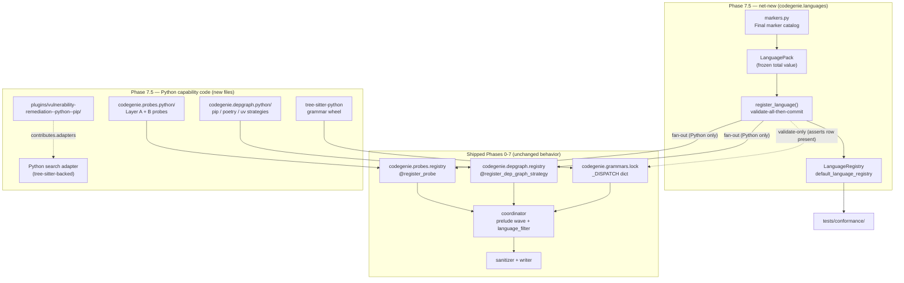
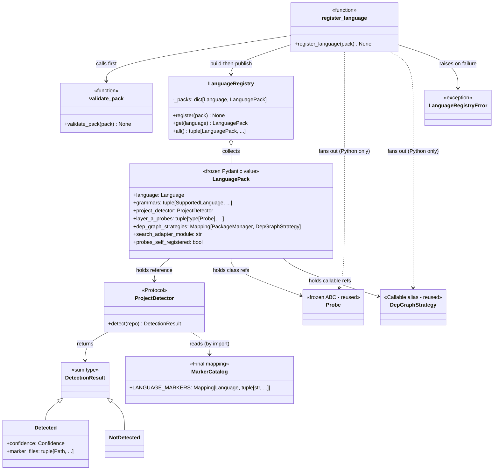
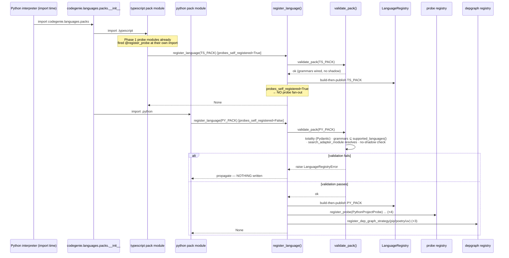
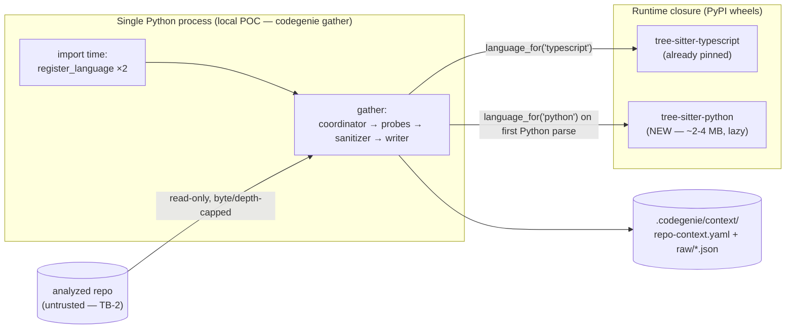
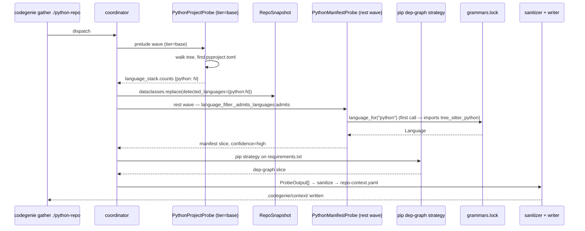
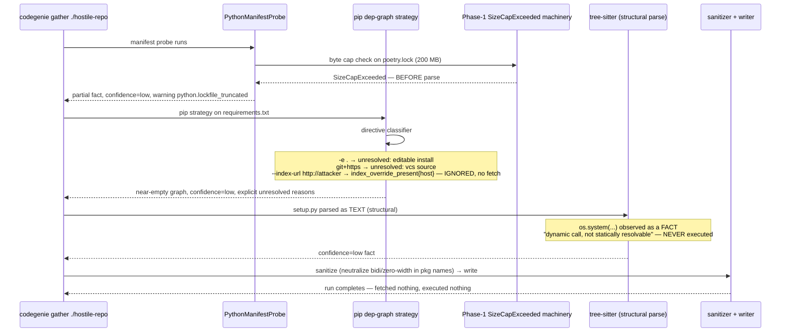

# Phase 7.5 — Multi-language foundations + Python: Architecture

**Status:** Architecture spec
**Date:** 2026-05-20
**Inputs:** `final-design.md` (synthesized design) · `critique.md` · `docs/production/design.md` · roadmap context (`docs/roadmap.md` §"Phase 7.5", §"Phase 8", §"Test architecture evolution" row 7.5)
**Audience:** the engineer implementing this phase

---

## Executive summary

Phase 7.5 introduces the **second target language — Python — by addition only**, the mirror of Phase 7's "second task class by addition." It lands one new package, `src/codegenie/languages/`, carrying the frozen total-value `LanguagePack` contract and a `register_language()` fan-out that wires a language's six capabilities (`language`, `grammars`, `project_detector`, `layer_a_probes`, `dep_graph_strategies`, `search_adapter_module`) into the *existing* decomposed registries (`@register_probe`, `@register_dep_graph_strategy`, the `grammars.lock` `_DISPATCH` dict). Python ships as new probe modules under `codegenie.probes.python/`, new dep-graph strategies under `codegenie.depgraph.python/`, a `tree-sitter-python` grammar row, a tree-sitter-backed search adapter, and the `vulnerability-remediation--python--pip` plugin — with **zero silent edits** to any shipped Phase 1–7 Node/TypeScript code (only compiler- and snapshot-policed loud edits: a `SupportedLanguage` Literal `+1`, a `_DISPATCH` `+1` row, a `PackageManager` Literal `+3`, additive schema `$ref`s, one collection-point import line). The phase also lands a new `tests/conformance/` tier that every registered language auto-enrolls in and that catches the failure `mypy` cannot — a capability slot *filled and type-checking but semantically broken*. The deliverable that matters is not "Python works"; it is *proof that the language axis extends by addition* — TypeScript retrofitted as `LanguagePack` #1 (by reference), Python as `LanguagePack` #2 validating the abstraction.

---

## Goals

Verifiable, pulled from `roadmap.md` §"Phase 7.5" exit criteria and `final-design.md §Goals`, refined to checkable claims.

- **G1 — One new top-level package.** `src/codegenie/languages/` is the *only* net-new package. Python probes go under existing `codegenie.probes`, dep-graph strategies under existing `codegenie.depgraph`, the grammar row into existing `codegenie.grammars.lock`. *Verified by:* `import-linter` contract listing the new sub-packages; a structural test asserting no other new top-level package landed.
- **G2 — Total `LanguagePack`.** An incomplete `LanguagePack(...)` is a `mypy --strict` error at the construction call site (every capability is a required field). A pack referencing an un-wired grammar key, a colliding probe name, or a colliding `PackageManager` key fails `register_language()` *loudly at import*, before any gather. *Verified by:* a `mypy`-must-fail snippet test + unit tests on `validate_pack`.
- **G3 — Node/TypeScript regression suite unchanged and green.** The full Phase 1–7 suite (~2,300 tests) runs as a hard CI gate. The only edits to shipped code are the loud, compiler/snapshot-policed ones enumerated in §"Control flow → loud edits." *Verified by:* CI; a planted-Node-probe-body-edit test that turns the suite red.
- **G4 — Every registered language passes `tests/conformance/`.** `test_language_conformance.py` is parameterized over `default_language_registry.all()`; a collection-completeness guard (`len(all()) == EXPECTED_LANGUAGE_COUNT`) ensures no language is silently un-enrolled by a failed pack import. *Verified by:* the conformance suite + a deliberate stub-adapter negative test that must fail conformance.
- **G5 — Python dep-graph parsing is pure.** Python dep-graph extraction performs zero network I/O and zero subprocess spawns. *Verified by:* the existing `fence` + `import-linter`, plus a new `tests/fence/test_depgraph_purity.py` AST fence over `src/codegenie/depgraph/python/`.
- **G6 — `setup.py` is never executed.** `setup.py`/`setup.cfg` are read as text and parsed structurally (tree-sitter / INI). A hostile-`setup.py`-only repo yields a `confidence="low"` "not statically analyzable" fact. *Verified by:* an adversarial conformance fixture + an AST test forbidding `exec`/`eval`/`importlib`-of-repo-file in the Python probe code.
- **G7 — Input hard caps.** Every Python manifest/lockfile parser enforces a byte cap, a parse-depth/entry cap, and a per-probe timeout *before* parsing — reusing the Phase 1 `SizeCapExceeded`/`DepthCapExceeded` machinery. An oversized or billion-laughs lockfile is rejected with a structured warning, not OOM/hang. *Verified by:* adversarial fixtures (200 MB + billion-laughs lockfiles) in `tests/conformance/`.
- **G8 — `ALLOWED_BINARIES` untouched.** `pip`, `poetry`, `uv`, `scip-python` are *not* added; the Python search adapter ships tree-sitter-first. *Verified by:* a closed-set regression test asserting `ALLOWED_BINARIES` membership is unchanged.
- **G9 — The category-based fence rejects a planted silent edit.** `tests/fence/test_language_pack_contract.py` — a contract+snapshot test, the form ADR-0043 commitment 3 and roadmap table 7.5(c) name as *the* category fence — goes red on a planted `LanguagePack` field-add; a planted Node-probe-body edit goes red against the G3 regression gate. *Verified by:* both planted-edit tests in the test plan.
- **G10 — `vulnerability-remediation--python--pip` produces a real diff on a vulnerable Python fixture.** The plugin lives at `plugins/vulnerability-remediation--python--pip/`, `extends` the universal base, wires the tree-sitter Python adapters, and resolves from the `(vuln, python, pip)` tuple. *Verified by:* an integration test exercising the plugin against a vulnerable fixture under `tests/golden/languages/python/`.
- **G11 — Negligible cost on language-#1 repos.** A Node-only gather never imports `tree_sitter_python`; the existing `tier="base"` prelude + `language_filter` predicate filters Python probes out at no new dispatch cost. *Verified by:* a `sys.modules` fence ("`tree_sitter_python` absent after a Node-only gather").
- **G12 — Tokens/run: 0.** Phase 7.5 introduces no LLM call and no new runtime service; the language axis is entirely on the deterministic side of production-ADR-0005. *Verified by:* the `fence` job (`FORBIDDEN_LLM_SDKS` unchanged).

---

## Non-goals

Anti-scope. Each names why it is excluded and where it lands.

- **Python feature-parity with Node's full Layer A–G.** Phase 7.5 ships Python Layer A (project / build-system / manifest) + a *single* Layer B import-graph probe. Python reflection / CI / deployment / SBOM probes are out of scope — the phase proves the *axis*, not parity. *Deferred:* later phases or fast-follow stories as Python task classes demand them.
- **`scip-python` symbol-precise indexing.** The Python search adapter ships tree-sitter-first; the `scip-python`-backed `ScipAdapter` is deferred. ADR-0032 explicitly makes `ScipAdapter` optional; the minimum adapter surface is `ImportGraphAdapter` + `TestInventoryAdapter`. *Deferred:* a fast-follow story (sequencing — Phase 7.5 closeout or Phase 8 preamble — left to the story-writer); the fast-follow needs its own `ALLOWED_BINARIES` amendment under the Phase 2 omnibus ADR-0001.
- **`distroless-migration--python--pip` plugin.** Phase 7.5 ships only the *vulnerability-remediation* Python plugin. The migration Python plugin is deliberately a fast-follow (`roadmap.md` §"Phase 7.5" — "deliberately deferred to a fast-follow"). *Deferred:* a Phase-7-style additive plugin story once Phase 7.5's language axis is proven.
- **A third `LanguagePack` / a non-isomorphic language.** TypeScript and Python are both gradually-typed, lockfile-based, single-file-module ecosystems. Java/Maven (classpath, compiled artifacts, POM inheritance) is *not* in scope — and is the named `Review trigger` for un-freezing `LanguagePack`. *Deferred:* Phase 8+.
- **A language DI container / capability-discovery mechanism.** The six capabilities are a closed, roadmap-named set; `register_language()` + explicit imports is the project's proven collection idiom. *Out by ADR-0043's Deferred section* ("A capability registry / DI refactor … Revisit then") and `final-design.md §Patterns considered and deliberately rejected`.
- **A generic "Python lockfile reader" abstraction.** Three concrete strategies for three formats (pip / poetry / uv) — abstracting before a fourth Python package manager is a rule-of-three violation. *Deferred:* revisit at a fourth Python package manager.
- **A codemod / migration harness.** Phase 7.5 *defines* the migration concept (it co-lands ADR-0043's discipline reframe) but ships no migration tooling. *Out by ADR-0043's Deferred section* ("A codemod harness for migrations. Build it when the first real migration appears").
- **`unregister` on the shipped append-only registries.** `register_language()` is validate-all-then-commit; it explicitly does *not* roll back. Adding `unregister` to `@register_probe` / `DepGraphRegistry` would be a silent behavior edit to Phase 1–3 kernel code (ADR-0043-forbidden). *Out by* phase-ADR-0002 (see §"Path to production").

---

## Architectural context

Phase 7.5 sits at the join between the *language axis* (Phases 1–7 are all Node/TypeScript) and the *task-class axis* (Phases 3 + 7). It does not touch the 7-stage production pipeline or the coordinator; it adds rows to registries the coordinator already iterates. The new `codegenie.languages` package is a thin *collection + fan-out* layer above three existing decomposed registries — it owns the `LanguagePack` value type and one privileged operation (`register_language`), nothing else. Everything downstream of registration — the coordinator's prelude/rest waves, the sanitizer, the writer — is reused verbatim and never learns the word "Python."



---

## 4+1 architectural views

### Logical view — components and relationships



`LanguagePack` is the load-bearing value: a frozen Pydantic model that *is* a language — six required capability fields and one typed retrofit discriminator. `register_language()` is the only privileged operation; it calls `validate_pack()` (all checks before any write), publishes the pack into `LanguageRegistry` via build-then-publish, then — for a *new* pack only — fans `layer_a_probes` and `dep_graph_strategies` into the two existing append-only registries. The grammar `_DISPATCH` dict is *never* written by `register_language` — it is a loud source edit; `validate_pack` only asserts the row is present. `ProjectDetector` is a `typing.Protocol` (ADR-0032's adapter idiom — structural, no inheritance) returning the `Detected | NotDetected` sum type; both the per-language detector and (read-only, by import) `LanguageDetectionProbe`-adjacent code consult the addition-only `markers.py` `Final` catalog, killing the marker-tuple duplication the critic flagged. `Probe` (the frozen ABC at `src/codegenie/probes/base.py`) and `DepGraphStrategy` (the `Callable` alias at `src/codegenie/depgraph/registry.py`) are *reused unchanged* — the diagram shows them as dependency targets, not new types.

### Process view — runtime behavior



Registration happens once per process at import time, driven by the explicit-import collection point `codegenie.languages.packs.__init__` — the identical lifecycle discipline `codegenie/probes/__init__.py` already uses. The TypeScript pack is `probes_self_registered=True`: its probes already fired `@register_probe` when their Phase 1 modules were imported, so `register_language` records the pack in `LanguageRegistry` and *skips the probe fan-out* — re-registering would raise `ProbeError`. The Python pack is `probes_self_registered=False`: `validate_pack` runs *every* check (totality, grammar-wired, adapter-import-resolves, no-shadow) *before any registry write*; only on full success does the fan-out run. A `validate_pack` failure on the Python pack raises `LanguageRegistryError` with *nothing written* — the validate-all-then-commit discipline. The one residual (a mid-fan-out crash on step 3, probe 3 of 5, of a *genuinely new* pack) is contained, not eliminated: it occurs at import, *before any gather*, fails the process loudly, and a unit test asserts the partial state is detectable.

### Development view — source code organization

```mermaid
graph TD
  ROOT["src/codegenie/"]
  ROOT --> LANG["languages/  &lt;-- NET-NEW PACKAGE"]
  LANG --> LANG_INIT["__init__.py  (__all__ ≤ 6 names)"]
  LANG --> PACK["pack.py  (LanguagePack, ProjectDetector, DetectionResult)"]
  LANG --> REG["registry.py  (LanguageRegistry, default_language_registry,<br/>register_language, validate_pack, LanguageRegistryError)"]
  LANG --> MARK["markers.py  (Final marker catalog)"]
  LANG --> PACKS["packs/  (explicit-import collection point)"]
  PACKS --> PACKS_INIT["__init__.py  (import .typescript; import .python)"]
  PACKS --> TSPACK["typescript.py  (TS_PACK + register_language call)"]
  PACKS --> PYPACK["python.py  (PYTHON_PACK + register_language call)"]

  ROOT --> PROBES["probes/  (EXISTING package — additive)"]
  PROBES --> PYPROBES["python/  &lt;-- new sub-package"]
  PYPROBES --> P1["project.py  (PythonProjectProbe, tier=base)"]
  PYPROBES --> P2["build_system.py  (PythonBuildSystemProbe)"]
  PYPROBES --> P3["manifest.py  (PythonManifestProbe)"]
  PYPROBES --> P4["import_graph.py  (PythonImportGraphProbe, Layer B)"]
  PROBES --> PINIT["__init__.py  (+1 import line — LOUD edit)"]

  ROOT --> DEPG["depgraph/  (EXISTING package — additive)"]
  DEPG --> PYDEP["python/  &lt;-- new sub-package"]
  PYDEP --> D1["pip.py  (requirements.txt directive parser)"]
  PYDEP --> D2["poetry.py  (poetry.lock TOML parser)"]
  PYDEP --> D3["uv.py  (uv.lock TOML parser)"]

  ROOT --> GRAM["grammars/lock.py  (EXISTING — +1 _DISPATCH row, LOUD edit)"]
  ROOT --> IDENT["types/identifiers.py  (EXISTING — PackageManager +3, LOUD edit)"]

  ROOT2["plugins/"]
  ROOT2 --> PYPLUG["vulnerability-remediation--python--pip/  &lt;-- new plugin"]
  PYPLUG --> PLUGYAML["plugin.yaml  (contributes.adapters)"]
  PYPLUG --> ADAPT["adapters/python_tree_sitter.py"]

  ROOT3["tests/"]
  ROOT3 --> CONF["conformance/  &lt;-- NET-NEW TIER"]
  CONF --> CONFT["test_language_conformance.py"]
  ROOT3 --> GOLD["golden/languages/{typescript,python}/  &lt;-- new"]
  ROOT3 --> FENCE["fence/test_language_pack_contract.py + test_depgraph_purity.py"]
```



`src/codegenie/languages/` is the *only* net-new top-level package — `__init__.py` exports ≤ 6 names (`LanguagePack`, `LanguageRegistry`, `register_language`, `default_language_registry`, `LanguageRegistryError`, `language_packs`), mirroring the 6-name `codegenie.depgraph` surface. Python *capability* code lands as new sub-packages inside *existing* packages: `codegenie/probes/python/` and `codegenie/depgraph/python/`. The only edits to shipped files are the loud ones: `+1` `_DISPATCH` row in `grammars/lock.py`, `+3` `PackageManager` Literal members in `types/identifiers.py`, `+1` `SupportedLanguage` Literal member, `+1` import line in `probes/__init__.py`, additive schema `$ref`s. The `packs/__init__.py` collection point is the language-axis analog of `probes/__init__.py` — explicit imports, no `importlib.metadata` scan.

### Physical view — where the code runs



Physically minimal — Phase 7.5 adds **no new process, no new service, no network egress**. Everything runs in the one `codegenie gather` Python process, exactly as Phases 0–7. The only new physical artifact in the runtime closure is the `tree-sitter-python` PyPI wheel (~2–4 MB), loaded *lazily* on the first `language_for("python")` call (~80 ms once per process, memoized by the kernel's `functools.lru_cache`) and contributing ~+15 MB RSS only to a worker that actually gathers a Python repo. A Node-only gather never imports it. No new binary enters `ALLOWED_BINARIES` (`scip-python` deferred).

### Scenarios — representative scenarios

**Scenario 1 — happy path: gather a clean Python repo.**



**Scenario 2 — failure path: gather a hostile Python repo** (`requirements.txt` with `-e .`, `git+https://attacker/...`, `--index-url http://attacker/`; a 200 MB `poetry.lock`; a `setup.py` calling `os.system(...)`).



**Scenario 3 — failure path: a `LanguagePack` registration collision.** A new pack's `layer_a_probes` includes a probe whose `name` is already claimed by a different pack. `validate_pack`'s no-shadow check raises `LanguageRegistryError` naming both call sites, *before any registry write* — the build fails loudly at import, no gather ever starts.

**Scenario 4 — failure path: planted silent edit.** Two levels. (a) A planted `LanguagePack` field-add → `tests/fence/test_language_pack_contract.py` snapshot goes red (the contract changed). (b) A planted Node-probe-body change → the full Phase 1–7 regression suite (G3 hard gate) goes red (behavior changed). The "added by addition" claim is falsified at whichever level the planted edit touches.

---

## Component design

### `LanguagePack`

- **Purpose:** The total, frozen value that *is* a language — one required field per capability. A partial language is unrepresentable; an incomplete `LanguagePack(...)` is a `mypy --strict` error at the construction site. The single sanctioned shared-file surface for the language axis.
- **Public interface:**
  ```python
  from pydantic import BaseModel, ConfigDict
  from collections.abc import Mapping
  from codegenie.types.identifiers import Language, PackageManager
  from codegenie.grammars.lock import SupportedLanguage
  from codegenie.probes.base import Probe
  from codegenie.depgraph.registry import DepGraphStrategy

  class LanguagePack(BaseModel):
      model_config = ConfigDict(frozen=True, extra="forbid", arbitrary_types_allowed=True)

      language: Language                                       # ecosystem axis: Language("typescript"), Language("python")
      grammars: tuple[SupportedLanguage, ...]                  # the one-to-many relation, modeled
      project_detector: ProjectDetector                        # Protocol — "is this a $LANG repo?"
      layer_a_probes: tuple[type[Probe], ...]                  # probe classes (tier=base + others)
      dep_graph_strategies: Mapping[PackageManager, DepGraphStrategy]
      search_adapter_module: str                              # "module:ClassName" import path (ADR-0032)
      probes_self_registered: bool = False                    # True for the TS retrofit

      @property
      def package_managers(self) -> tuple[PackageManager, ...]:
          """Derived — NOT a field. dep_graph_strategies.keys() IS the PM set."""
          return tuple(self.dep_graph_strategies.keys())
  ```
- **Internal structure:** Frozen Pydantic v2 model — the project's one sanctioned contract framework (production-ADR-0010). `tuple`/`Mapping` fields (not `list`/`dict`) so the frozen value is genuinely immutable. The pack holds *references only* — probe classes, strategy callables, a tuple of grammar Literal keys, an import-path string — no behavior, no I/O. `arbitrary_types_allowed=True` is required for the `type[Probe]` / callable fields (a documented Pydantic pattern). `package_managers` is a derived `@property`, not a seventh field — `dep_graph_strategies.keys()` *is* the package-manager set; a second field would be a drift-prone duplicate source of truth (`final-design.md §Departures` item 5).
- **Dependencies:** `pydantic`, `codegenie.types.identifiers` (`Language`, `PackageManager`), `codegenie.grammars.lock` (`SupportedLanguage`), `codegenie.probes.base` (`Probe`), `codegenie.depgraph.registry` (`DepGraphStrategy`). No I/O dependency.
- **State:** None — immutable value.
- **Performance envelope:** Construction is pure field assignment, microseconds. The grammar wheel is *not* imported at pack-definition time — it loads lazily on first `language_for`.
- **Failure behavior:** An incomplete construction is a `mypy --strict` error (compile-time, before any test). An extra field is a `pydantic.ValidationError` (`extra="forbid"`). No runtime failure path — incompleteness cannot reach runtime.

### `register_language()` + `validate_pack()`

- **Purpose:** Fan one validated `LanguagePack` into the existing decomposed registries — the one new privileged operation of the phase.
- **Public interface:**
  ```python
  def register_language(pack: LanguagePack) -> None:
      """Validate then commit a pack. Idempotent per Language. Raises LanguageRegistryError."""

  def validate_pack(pack: LanguagePack) -> None:
      """All checks, no writes. Raises LanguageRegistryError on the first failure."""
  ```
- **Internal structure:** **Validate-everything-first, then commit** — *not* two-phase commit (the substrate registries have no `unregister`). Sequence:
  1. `validate_pack(pack)` — *all* checks before *any* registry write:
     - **Totality:** Pydantic already guarantees it (a no-op assertion for symmetry).
     - **Grammar-wired:** every `grammars` member is in `grammars.lock.supported_languages()`.
     - **Adapter resolvable:** the `search_adapter_module` `"module:ClassName"` path imports and the class exists.
     - **No-shadow:** no probe `name` in `layer_a_probes` and no `PackageManager` key in `dep_graph_strategies` is already claimed by a *different* registered pack. The no-shadow check operates *per grammar key* and *per probe name* — and is deliberately written to *not* fire on a `probes_self_registered=True` pack's own already-registered probes (the retrofit is by reference; its probes were registered by Phase 1, not by a colliding pack).
  2. **Build-then-publish** for the language registry: the pack is added to a *fresh copy* of the registry dict, then the copy is swapped in (atomic at the Python-object level). This is the buildable substitute for "rollback" over an append-only substrate.
  3. **Python-only fan-out:** if `pack.probes_self_registered is False`, fan `layer_a_probes` into the probe registry via `register_probe` and `dep_graph_strategies` into `DepGraphRegistry`. If `True`, *skip the probe fan-out*. The grammar `_DISPATCH` rows are *never* written here.
- **Dependencies:** `LanguageRegistry`, `codegenie.probes.registry.register_probe`, `codegenie.depgraph.registry` (`register_dep_graph_strategy` / `DepGraphRegistry`), `codegenie.grammars.lock.supported_languages`, `importlib` (adapter-path resolution).
- **State:** Mutates two process-global registries (probe, depgraph) and the `default_language_registry` — exactly the lifecycle `@register_probe` already has. Idempotent within a process: re-registering the same `Language` is a no-op.
- **Performance envelope:** A handful of set-membership checks + ~4 probe registrations + ~3 strategy registrations + 2 dict inserts per pack. Microseconds. No `importlib.metadata` scan.
- **Failure behavior:** Any `validate_pack` failure raises `LanguageRegistryError` with *nothing written*. The residual — a mid-fan-out crash on a *new* pack (step 3) — leaves the probe registry partly written; this is contained by import-time fail-fast (before any gather) and surfaced by a unit test asserting the partial state is detectable. A full rollback is *deliberately not built* (it would require an ADR-0043-forbidden silent edit to the append-only registries — see phase-ADR-0002).

### `LanguageRegistry` + `default_language_registry`

- **Purpose:** Collect language packs; the registry-driven enrollment surface `tests/conformance/` parameterizes over.
- **Public interface:**
  ```python
  class LanguageRegistry:
      def register(self, pack: LanguagePack) -> None: ...    # build-then-publish; duplicate raises
      def get(self, language: Language) -> LanguagePack: ...  # LanguageRegistryError if absent
      def all(self) -> tuple[LanguagePack, ...]: ...          # sorted by Language, deterministic

  default_language_registry: LanguageRegistry
  ```
- **Internal structure:** A plain class wrapping `dict[Language, LanguagePack]` — the exact shape of `DepGraphRegistry` / `FreshnessRegistry`. `register` uses build-then-publish; a duplicate raises `LanguageRegistryError` naming *both* call sites. `all()` is sorted by `Language` for determinism (golden files depend on it). Tests construct independent instances; the module-level `default_language_registry` is the one the packs register into.
- **Dependencies:** `codegenie.errors` (`LanguageRegistryError`), `codegenie.types.identifiers.Language`.
- **State:** Process-global (the `default_language_registry` singleton).
- **Performance envelope:** O(1) `get`, O(n log n) `all()` over ≤ a handful of languages — negligible.
- **Failure behavior:** `get` on an absent language raises `LanguageRegistryError`; `register` on a duplicate raises `LanguageRegistryError`.

### `ProjectDetector` + `DetectionResult` + the `markers.py` catalog

- **Purpose:** Answer "is this repo a $LANGUAGE project?" — the roadmap-named "project detector" capability — without duplicating marker knowledge.
- **Public interface:**
  ```python
  from typing import Protocol

  class ProjectDetector(Protocol):
      def detect(self, repo: RepoSnapshot) -> DetectionResult: ...

  # DetectionResult is a sum type:
  @dataclass(frozen=True)
  class Detected:
      confidence: Confidence            # Literal["high", "medium", "low"]
      marker_files: tuple[Path, ...]
  class NotDetected: ...
  DetectionResult = Detected | NotDetected

  # markers.py — the addition-only Final catalog:
  LANGUAGE_MARKERS: Final[Mapping[Language, tuple[str, ...]]] = {
      Language("python"): ("pyproject.toml", "setup.py", "setup.cfg",
                           "requirements*.txt", "Pipfile", ...),
      Language("typescript"): ("package.json", "tsconfig.json", ...),
  }
  ```
- **Internal structure:** `ProjectDetector` is a `typing.Protocol` (structural, no inheritance — ADR-0032's adapter idiom). Detection is **additive / monotone**: a polyglot repo is detected as *both* languages; a detector never *demotes* another language's verdict. The marker knowledge lives in the new addition-only `src/codegenie/languages/markers.py` `Final` catalog — the `_MONOREPO_PRECEDENCE` / `_LOCKFILE_PRECEDENCE` data-driven idiom — that *both* the per-language `ProjectDetector` *and* (read-only, by import) `LanguageDetectionProbe`-adjacent code can consult. The Python detector returns `Detected(confidence="high")` only on a *real* manifest (`pyproject.toml`/`setup.py`/`setup.cfg`/`requirements*.txt`/`Pipfile`) and `Detected(confidence="low")` for a bare `*.py` tree with no manifest — narrowing the attacker's "force Python parsers to run on a Node repo" surface (critic CR-5) without under-detecting an unconventional real project.
- **Dependencies:** `codegenie.probes.base.RepoSnapshot`, `markers.py`.
- **State:** None — pure function over a `RepoSnapshot`.
- **Performance envelope:** One marker-glob scan over the snapshot's path index — bounded by file count, no parsing.
- **Failure behavior:** Returns `NotDetected` when no marker matches — never raises. Over-detection (a stray `.py` flags Python at `confidence="low"`) is accepted as the lesser evil vs. under-detection (silent skip).

### Python Layer A/B probes

- **Purpose:** Language-detection, build-system, manifest, and import-graph analogs for Python — facts, not judgments.
- **Public interface:** The frozen `Probe` ABC (`src/codegenie/probes/base.py`) — consumed *unchanged*, two-arg `run(self, repo, ctx)`. New sub-package `src/codegenie/probes/python/`:
  - `PythonProjectProbe` — `tier="base"`, runs in the prelude wave; enriches `detected_languages` for Python.
  - `PythonBuildSystemProbe`, `PythonManifestProbe` — `tier="task_specific"`, `applies_to_languages=["python"]`.
  - `PythonImportGraphProbe` — Layer B, `tier="task_specific"`.
- **Internal structure:** Functional core / imperative shell — pure parsing helpers; `run()` is the only impure surface and only *reads*. **Hard caps before parse** — byte cap, entry/depth cap, per-probe `timeout_seconds` — reusing the Phase 1 `SizeCapExceeded`/`DepthCapExceeded`/`SymlinkRefusedError` machinery; a probe at a cap returns a partial fact with `confidence="low"` and a `_WARNING_IDS` entry (`python.manifest_oversized`, `python.lockfile_truncated`, `python.setup_py_not_static`). `setup.py` is parsed *structurally* (tree-sitter), never executed. Tight `declared_inputs` globs (`pyproject.toml`, `requirements*.txt`, `Pipfile*`, `*.lock`, `**/*.py`) so the content-addressed cache invalidates surgically.
- **Dependencies:** `Probe` ABC, `grammars.lock.language_for`, the Phase 1 cap machinery, `tree-sitter-python` (lazy).
- **State:** None per probe — each `run()` is a pure read producing a `ProbeOutput`.
- **Performance envelope:** Python fixture gather completes within `make check`'s envelope; the only genuinely new cost is the one-time ~80 ms `tree_sitter_python` import. **No `1.15×`-parity numeric gate** — dropped as a guessed ceiling with no test that would catch a breach (critic CR-4).
- **Failure behavior:** A probe at a cap returns a partial fact with `confidence="low"` and a warning ID — honest-confidence over completeness. A malformed manifest yields a structured-error slice; the probe never crashes.

### Python dep-graph strategies (pip / poetry / uv)

- **Purpose:** `dep_graph.consumers`-class extraction for the three Python package managers.
- **Public interface:** Registered via `@register_dep_graph_strategy(PackageManager)` for keys `"pip"`, `"poetry"`, `"uv"` (a `PackageManager` Literal `+3`, a loud compiler-policed edit). Each strategy satisfies the `DepGraphStrategy` callable alias (`Callable[[ProbeContext, list[Mapping[str, Any]]], networkx.DiGraph]`). New sub-package `src/codegenie/depgraph/python/`.
- **Internal structure:** **`requirements.txt` is parsed as a directive language, not a manifest.** Every non-pinned-dependency directive is recorded as a *fact*, never acted on:
  - `-e .` / `-e <path>` → `unresolved: editable install`
  - `git+...` / VCS URLs → `unresolved: vcs source`
  - `--index-url` / `--extra-index-url` → `index_override_present{url_host}` (host only — the full URL is attacker-controlled) and **otherwise ignored — the parser never honors an index URL**
  - `-r <path>` is followed *only* if the path resolves inside the repo root, else `unresolved: out-of-tree include`
  - **Unknown directive → fail closed** (`unresolved: unknown directive` + warning) — never silently dropped.

  `poetry.lock` / `uv.lock` / `Pipfile.lock` are TOML/JSON parsed with byte+depth caps. **No package-manager binary is invoked; no network is touched.** Three concrete strategies, three concrete parsers — *no* premature "generic Python lockfile reader" abstraction (rule-of-three — revisit at a fourth Python package manager).
- **Dependencies:** `DepGraphRegistry`, `networkx`, `tomllib` (stdlib), the Phase 1 cap machinery. **No `urllib`/`requests`/`http`/`socket`/`subprocess`** — enforced by `tests/fence/test_depgraph_purity.py`.
- **State:** None — pure parse of already-resolved lockfiles.
- **Performance envelope:** Bounded by lockfile size (capped before parse). Microseconds-to-milliseconds.
- **Failure behavior:** A repo using only VCS deps yields a near-empty graph with `confidence="low"` and explicit unresolved-reasons — dep-graph *completeness* on adversarial inputs is explicitly sacrificed (chasing it would mean network resolution at gather time — a hard no).

### Python search adapter (tree-sitter-first; `scip-python` deferred)

- **Purpose:** Implement the ADR-0032 search-adapter Protocols for Python.
- **Public interface:** The ADR-0032 `Protocol`s — `ImportGraphAdapter` (mandatory), `DepGraphAdapter`, `TestInventoryAdapter`. `confidence()` is the ADR-0032-as-written `-> float`. Registered through the `vulnerability-remediation--python--pip` plugin manifest's `contributes.adapters` map (the existing mechanism, unchanged).
- **Internal structure:** A **tree-sitter-backed** `ImportGraphAdapter` (+ `DepGraphAdapter` / `TestInventoryAdapter`) — always-fresh, no external binary, no `ALLOWED_BINARIES` change. The `scip-python` `ScipAdapter` is deferred to a fast-follow. `confidence()` returns the ADR-0032 float; the synthesis does *not* invent the "ADR-0033 amendment to ADR-0032" the security design asserted (that amendment does not exist — changing the float-returning Protocol every shipped adapter implements would be a cross-cutting silent edit to pre-Phase-7 frozen surface).
- **Dependencies:** ADR-0032 Protocols, `grammars.lock.language_for("python")`, `tree-sitter-python`.
- **State:** None — each query is a pure walk over the gathered import graph.
- **Performance envelope:** Bounded by repo file count; tree-sitter parse is the cost, paid once per file per gather.
- **Failure behavior:** A low `confidence()` float drives the Bundle Builder's declared-fallback logic, exactly as ADR-0032 specifies. Python loses symbol-precise `scip.refs` until the fast-follow lands — acceptable, ADR-0032's minimum adapter surface does not include `ScipAdapter`.

### `tests/conformance/` tier

- **Purpose:** Catch the failure `mypy` cannot — a capability slot *filled and type-checking* but *semantically broken*.
- **Public interface:** One module, `tests/conformance/test_language_conformance.py`, parameterized over `default_language_registry.all()` with the `Language` as `pytest.param(..., id=lang)`.
- **Internal structure:** Per-language capability assertions: `test_grammar_loads`, `test_detector_detects_own_fixture` (`Detected`, `confidence="high"`), `test_layer_a_probes_produce_nonempty_slices`, `test_dep_graph_strategy_resolves`, `test_search_adapter_is_not_a_stub` (a known query returns a non-empty, non-degenerate result against the fixture — the "passes mypy but broken" catch), `test_golden_matches`. **Adversarial fixtures are first-class** — a hostile `requirements.txt`, an oversized `poetry.lock`, a hostile `setup.py` are conformance cases; "fails closed" is part of *passing*. **CI-budget discipline:** each language's fixture is gathered *once* per session (`@pytest.fixture(scope="session")`); every assertion reads the cached `RepoContext`; **no `asyncio.gather` of fixture builds, no `pytest-xdist`**. **A collection-completeness guard:** a top-of-module assertion `len(default_language_registry.all()) == EXPECTED_LANGUAGE_COUNT` — if a pack module fails to import, the suite fails *loudly* rather than silently collecting fewer parameters.
- **Dependencies:** `default_language_registry`, the gather pipeline, the per-language golden fixtures under `tests/golden/languages/{language}/`.
- **State:** Session-scoped cached `RepoContext` per language (an immutable Pydantic value — the coupling is contained).
- **Performance envelope:** ~6 capability checks × 2 languages ≈ 12 fast assertions over committed goldens + one `gather` per language fixture (session-scoped). Stays inside `make check`'s envelope.
- **Failure behavior:** A semantically broken capability turns the suite red; a failed pack import turns the completeness guard red. Both are CI-blocking.

### `LanguagePack` contract-snapshot fence

- **Purpose:** The roadmap's "category-based extension-by-addition fence" — realized as ADR-0043 commitment 3 prescribes (a contract + snapshot test, the probe-ABC pattern).
- **Public interface:** `tests/fence/test_language_pack_contract.py` + `tests/fence/snapshots/language_pack_contract.v1.json`.
- **Internal structure:** A snapshot test pinning the `LanguagePack` field set + types into `language_pack_contract.v1.json` — exactly as `tests/unit/test_probe_contract.py` pins the probe ABC against `probe_contract.v1.json`. The pack *file* stays freely editable; the snapshot test fails iff the *contract* (field names/types) changed. No allowlist rows (ADR-0043 commitment 2 — Phase 7's allowlist is the *last*).
- **Dependencies:** `LanguagePack`, the snapshot JSON.
- **State:** None — the snapshot JSON is the persisted contract.
- **Performance envelope:** One field-set comparison — microseconds.
- **Failure behavior:** A planted `LanguagePack` field-add turns it red (the desired loud signal when a genuinely new capability category is added). It catches a *`LanguagePack`-contract* change, not an arbitrary silent edit — a planted Node-probe-body change is caught by the G3 regression gate instead. Both planted-edit levels are in the test plan.

---

## Data model

### `LanguagePack` — contract (stable, in-memory; pinned by snapshot fence)

```python
class LanguagePack(BaseModel):
    """Contract — pinned by tests/fence/test_language_pack_contract.py.
    Frozen Provisional Accepted (phase-ADR-0001); Review trigger: third language pack."""
    model_config = ConfigDict(frozen=True, extra="forbid", arbitrary_types_allowed=True)
    language: Language                                       # ecosystem axis
    grammars: tuple[SupportedLanguage, ...]                  # one-to-many → grammar Literal
    project_detector: ProjectDetector
    layer_a_probes: tuple[type[Probe], ...]
    dep_graph_strategies: Mapping[PackageManager, DepGraphStrategy]
    search_adapter_module: str                              # "module:ClassName" (ADR-0032)
    probes_self_registered: bool = False
```

### `DetectionResult` — contract (in-memory sum type)

```python
@dataclass(frozen=True)
class Detected:                  # contract
    confidence: Confidence       # Literal["high", "medium", "low"]
    marker_files: tuple[Path, ...]

class NotDetected: ...           # contract — singleton-shaped, no fields

DetectionResult = Detected | NotDetected
```

### `LANGUAGE_MARKERS` — contract (addition-only `Final` catalog)

```python
LANGUAGE_MARKERS: Final[Mapping[Language, tuple[str, ...]]] = {
    Language("python"): ("pyproject.toml", "setup.py", "setup.cfg",
                         "requirements*.txt", "Pipfile", "Pipfile.lock"),
    Language("typescript"): ("package.json", "tsconfig.json"),
}
```

### Python dep-graph unresolved facts — contract (persisted into `RepoContext`)

```python
@dataclass(frozen=True)
class UnresolvedDependency:           # contract — pinned by the Python depgraph sub-schema
    reason: Literal["editable_install", "vcs_source", "out_of_tree_include",
                    "unknown_directive"]
    raw_directive: str                # sanitized — the offending text
    source_file: Path

@dataclass(frozen=True)
class IndexOverride:                  # contract
    url_host: str                     # HOST ONLY — full URL is attacker-controlled, never stored
    source_file: Path
```

### `EXPECTED_LANGUAGE_COUNT` — internal (test-only constant)

```python
EXPECTED_LANGUAGE_COUNT: Final[int] = 2   # internal — the conformance completeness guard
```

The `LanguagePack` value, `DetectionResult`, `LANGUAGE_MARKERS`, and the Python dep-graph fact types are **contract**. `LanguagePack` is additionally *persisted indirectly* — its `language` field tags every Python probe slice in `repo-context.yaml`. `EXPECTED_LANGUAGE_COUNT` is **internal** test machinery. The Python probe sub-schemas under `src/codegenie/schema/probes/python_*.schema.json` (each `additionalProperties: false`, with a `$ref` wired into the envelope's `properties.probes`) are **contract, persisted**.

---

## Control flow

**Happy path (import time → gather → write).** `codegenie.languages.packs.__init__` is imported (transitively, when `codegenie.languages` is first touched). It explicitly imports `typescript` then `python`. The **`typescript` pack module** constructs `TS_PACK` (`probes_self_registered=True`, `grammars=("typescript", "tsx", "javascript")`) and calls `register_language(TS_PACK)` → `validate_pack` passes (Phase 1 probes already self-registered; the no-shadow check does not fire on the retrofit's own probes) → `LanguageRegistry` records the pack via build-then-publish → **no probe fan-out**. The **`python` pack module** constructs `PYTHON_PACK` (`probes_self_registered=False`) and calls `register_language(PYTHON_PACK)` → `validate_pack` runs *all* checks → build-then-publish records the pack → the Python-only fan-out registers `PythonProjectProbe` / `PythonBuildSystemProbe` / `PythonManifestProbe` / `PythonImportGraphProbe` and the `pip` / `poetry` / `uv` strategies. Then, **per gather**, the *unchanged* coordinator runs its `tier="base"` prelude wave (`LanguageDetectionProbe` + `PythonProjectProbe`) enriching `RepoSnapshot.detected_languages`; the `tier="task_specific"` rest wave is filtered by the *existing* `language_filter._admits_languages` predicate; admitted Python probes parse (lazily importing `tree_sitter_python` on the first `language_for("python")`); `ProbeOutput`s flow through the two-pass sanitizer and the writer, each slice tagged with `language: python`.

**Decision points.**
1. **`probes_self_registered`?** — `True` → skip probe fan-out (the TypeScript retrofit, by reference); `False` → fan probes out (Python and every future new pack).
2. **`validate_pack` outcome?** — any failure → raise `LanguageRegistryError`, *nothing written*; success → proceed to build-then-publish + fan-out.
3. **`language_filter._admits_languages`** — for each `tier="task_specific"` probe, `"*"` in `applies_to_languages` always admits; else admission requires overlap with the enriched `detected_languages`. A Node-only repo: Python probes filtered out, `tree_sitter_python` never imported.
4. **`ProjectDetector` confidence** — a real Python manifest → `Detected(confidence="high")`; a bare `*.py` tree → `Detected(confidence="low")`; no marker → `NotDetected`.
5. **Cap check (Python probes)** — byte/depth cap exceeded *before* parse → partial fact, `confidence="low"`, `_WARNING_IDS` entry; within cap → full parse.
6. **`requirements.txt` directive classification** — pinned dependency → graph edge; `-e`/`git+`/`--index-url`/out-of-tree `-r`/unknown → an `UnresolvedDependency` or `IndexOverride` fact (never an action, never a fetch).

**The loud edits** (compiler/snapshot-policed — ADR-0043 commitment 1, *not* violations): `SupportedLanguage` Literal `+1` (`"python"`); `grammars.lock._DISPATCH` `+1` row; `PackageManager` Literal `+3` (`"pip"`/`"poetry"`/`"uv"`); additive schema `$ref`s into the envelope's `properties.probes`; one `+1` import line in `codegenie/probes/__init__.py`; one `+1` import line in `codegenie/languages/packs/__init__.py` (a new file — not an edit). Every one of these is forced on its consumers by `mypy --strict` or a snapshot test.

---

## Harness engineering

- **Logging.** `structlog` throughout (the project standard). `register_language` emits a structured event per pack — `language.registered{language, probes_fanned_out, strategies_fanned_out}` — so a startup log shows exactly what each pack contributed. The coordinator's existing `coordinator.dispatch.order` and `prelude.degraded` events are reused unchanged; Python probes appear in them as new rows. Python dep-graph `unresolved` / `index_override_present` facts are emitted as audit events into `.codegenie/context/runs/*.json`.
- **Tracing.** No new tracing surface. Every Python probe's `ProbeOutput` carries the standard `confidence` and `_WARNING_IDS` fields; the per-slice `language` tag is the new trace dimension — a reviewer can attribute every fact in `repo-context.yaml` to its producing language.
- **Idempotence.** `register_language` is idempotent per `Language` (re-registering the same pack is a no-op). `LanguageRegistry.all()` is sorted — deterministic across processes. The Python dep-graph strategies parse already-resolved lockfiles — same input bytes → same `DiGraph`. The golden-regen idempotence test (`tests/golden/`) asserts a re-gather of a fixture produces a byte-identical golden.
- **Determinism vs probabilism.** *Entirely deterministic.* No LLM, no probabilistic component, no resolver subprocess, no network. Same `repo_snapshot` + same registered packs → byte-identical `RepoContext`. This is the load-bearing property the `fence` job and `import-linter` protect — Phase 7.5 adds nothing to the probabilistic side of production-ADR-0005.
- **Replay / debugability.** A failed `validate_pack` names the offending field/key *and* both colliding call sites — a developer can locate the conflict without re-running. The `register_language` per-pack event lets a startup-log reader confirm a pack registered fully. A planted-silent-edit failure points at either the `language_pack_contract.v1.json` snapshot diff or a named Phase 1–7 regression test.
- **Configuration.** No new configuration. The set of registered languages is fixed by the `packs/__init__.py` collection point (explicit imports — no env var, no discovery scan, no `importlib.metadata`). The `tree-sitter-python` wheel pin lives in `pyproject.toml` + `uv.lock`; `make fence` asserts the pin is present and no `FORBIDDEN_LLM_SDK` rode in alongside it.

---

## Agentic best practices

- **Typed state contracts.** `LanguagePack` is a frozen Pydantic value — `extra="forbid"` makes a typo'd capability a `ValidationError`, a missing capability a `mypy` error. `DetectionResult` is a `Detected | NotDetected` sum type — a missing case is a `match`/`assert_never` compile error. No untyped `dict[str, Any]` crosses a Phase 7.5 boundary; the Python dep-graph facts are typed dataclasses, not loose dicts.
- **Tool-use safety.** *Subprocess:* Phase 7.5 invokes **no** external binary — `ALLOWED_BINARIES` is untouched (`pip`/`poetry`/`uv`/`scip-python` deliberately absent); the Python search adapter is tree-sitter-in-process. *Filesystem scope:* Python probes read only within the `RepoSnapshot` root (symlink containment is a Phase 0/1 `RepoSnapshot`-construction property, inherited — *not* re-implemented per the critic's observation); a `requirements.txt` `-r` include outside the repo root is recorded as `unresolved: out_of_tree_include`, never followed. *Egress:* zero — `tests/fence/test_depgraph_purity.py` is an AST proof that `src/codegenie/depgraph/python/` imports no `urllib`/`requests`/`http`/`socket`/`subprocess`; the `fence` job + `import-linter` enforce it structurally.
- **Prompt template structure.** N/A — Phase 7.5 has no LLM call. The shape worth noting: the *only* trusted-code surface introduced is the pack modules themselves (`typescript.py`, `python.py`); they are reviewed code, not data, and construct `LanguagePack` values from typed references — no parsing of external input, no template, no prompt.
- **Confidence handling.** Every Python probe reports `Literal["high", "medium", "low"]`. A probe at a byte/depth cap returns a *partial* fact with `confidence="low"` and a `_WARNING_IDS` entry — honest-confidence over completeness. The `ProjectDetector` returns `confidence="high"` only on a real manifest, `confidence="low"` for a bare `*.py` tree. The dep-graph directive classifier default-denies on unknown directives (`unresolved` + warning) — no silent drop. This directly serves commitment 3 ("silent staleness is the worst failure mode").
- **Error escalation.** A `validate_pack` failure is a *loud, import-time, build-breaking* `LanguageRegistryError` — it cannot be swallowed and reach a gather. A semantically broken capability is caught by `tests/conformance/` (CI-blocking). A silently un-enrolled language is caught by the conformance collection-completeness guard. A planted silent edit is caught by the contract-snapshot fence (contract-level) or the Phase 1–7 regression gate (behavior-level). There is no path by which a misconfigured language quietly under-analyzes a repo.

---

## Design patterns applied

| Decision | Pattern applied | Why this pattern here | Pattern not applied (and why) |
|---|---|---|---|
| `LanguagePack` as a frozen total Pydantic value, one required field per capability | Make illegal states unrepresentable + value object | A partial language is a real bug `mypy` forbids for free — an incomplete `LanguagePack(...)` is a construction-site error before any test runs | **Builder** — a `LanguagePackBuilder` reintroduces the partial-pack state the frozen total value exists to forbid |
| `LanguagePack.grammars: tuple[SupportedLanguage, ...]` — the one-language-to-many-grammars relation modeled | Modeled relation + closed sum type | "TypeScript" is three grammar keys (`typescript`/`tsx`/`javascript`); the relation must be a typed field, not a raw `str` | **`grammar_name: str`** — primitive obsession on a domain ID keying into a closed `Literal` (best-practices' rejected choice) |
| `register_language()` fans a pack into three existing decomposed registries | Registry + Open/Closed at the file boundary | One call, one mental model — the three registries keep their single responsibilities; a new language is new files + one import line | **Unified mega-registry** — would force editing Phase 1–7 registration sites (a silent-edit storm) and centralize three orthogonal concerns |
| `register_language()` validate-all-then-commit; language registry via build-then-publish | Build-then-publish (staging-then-swap) | The append-only registries have no `unregister` — atomicity is *built by constructing the new state complete then swapping*, the only buildable form over the substrate | **Two-phase commit** — names a prepare/abort protocol the append-only registries cannot deliver; pattern-as-decoration |
| `ProjectDetector` / search adapters as `typing.Protocol` | Structural typing / duck-typed contract | A new language implements a Protocol with no inheritance coupling; ADR-0032's settled idiom | **ABC inheritance** — couples every detector to a base class; Protocols give the same guarantee with looser coupling |
| `DetectionResult` as `Detected \| NotDetected` | Tagged union / sum type | "Detected vs not" is a state with per-variant fields; `match` + `assert_never` makes a missing case a compile error | **`detected: bool` + loose siblings** — tag-and-dispatch-without-a-tagged-union; `detected=False` with `markers=[...]` would slip through |
| Shared `markers.py` `Final` catalog read by every `ProjectDetector` | Registry / data-driven catalog (the `_MONOREPO_PRECEDENCE` idiom) | Marker knowledge is iterated data, not branched code; one addition-only source of truth kills the duplication ADR-0043 names | **Per-detector duplicated marker tuples** — the duplication-by-addition anti-pattern ADR-0043 singles out |
| `LanguagePack` contract pinned by a snapshot test, not a frozen file | Contract + snapshot test (the probe-ABC pattern) | ADR-0043 commitment 3 — the file stays editable; the *contract* is frozen; growing it is a loud, reviewable signal | **Per-phase byte-edit allowlist** — explicitly terminated by ADR-0043 commitment 2 |

### Patterns considered and deliberately rejected

- **A plugin / DI container for languages** — `register_language()` + explicit imports is the project's proven collection idiom; a container is machinery ahead of need (ADR-0043 defers it).
- **A capability registry / discovery mechanism** — the six capabilities are a closed, roadmap-named set; dynamic discovery solves a problem this phase does not have (ADR-0043 explicitly defers a capability registry).
- **A `LanguagePack` inheritance hierarchy** (`BaseLanguagePack → JvmLanguagePack`) — there is no shared *behavior* between languages, only a shared *shape*; a flat product type is correct, an inheritance tree is premature taxonomy.
- **A generic lockfile-reader abstraction** spanning pip/poetry/uv — three concrete strategies for three formats is honest; abstracting before a fourth Python package manager is a rule-of-three violation.
- **A codemod / migration harness** — ADR-0043 says build it when the first real migration appears; Phase 7.5 *defines* the migration concept (it co-lands ADR-0043's discipline) but does not need the tool.
- **A general semantic-diff "category fence"** — ADR-0043 rejects it as a research project; the buildable form is the per-contract snapshot test, which this design ships.

### Anti-patterns avoided

- **Primitive obsession** — `language: Language` (the existing newtype, *reused* — no duplicate `LanguageId`); `grammars: tuple[SupportedLanguage, ...]` (closed Literal, not raw `str`); dep-graph `UnresolvedDependency.reason` is a closed `Literal`, not a free string.
- **Boolean-flag soup** — `register_language(pack)` takes one typed argument; `probes_self_registered` is a *typed field on the pack value*, not a call-site flag.
- **Untyped `dict[str, Any]` interfaces** — `LanguagePack` is a typed Pydantic model; `DetectionResult` is a sum type; the Python dep-graph facts are typed dataclasses.
- **Tag-and-dispatch without a tagged union** — `DetectionResult` is a sum type, not `bool` + loose siblings.
- **Pattern soup / pattern-name inflation** — eight load-bearing pattern decisions, each tied to a real argument; performance's "Flyweight"/"Specification" and security's "Hexagonal"/"two-phase commit" are dropped (the critic flagged all four).
- **Stringly-typed dispatch / dual source of truth** — the `package_managers` set is a *derived* `@property` off `dep_graph_strategies.keys()`, not a second field that could drift.
- **Side effects in constructors / at import time** — `register_language` is an explicit named function called explicitly from a pack module (the identical lifecycle as `@register_probe`); `LanguagePack` construction is pure field assignment with no I/O; the grammar wheel loads lazily on first `language_for`, not at pack-definition time.
- **Premature pluggability** — no language DI container, no capability-discovery mechanism, no generic lockfile abstraction; `scip-python` deferred rather than built-then-jailed for a deferred component.
- **Capability passed through ten frames** — the language axis flows through registries, not parameter threading.

---

## Edge cases

| # | Edge case | Manifests as | Detected by | System behavior |
|---|---|---|---|---|
| 1 | Polyglot repo — Node *and* Python markers both present | Both packs' detectors return `Detected`; both languages' probes admitted | `language_filter._admits_languages` overlap on the enriched `detected_languages` | Both languages' probes run; per-probe sub-schema isolation prevents key collision; a polyglot-isolation conformance assertion verifies no cross-language slice clobbering |
| 2 | Bare `*.py` tree, no manifest | `ProjectDetector` returns `Detected(confidence="low")` | The Python `ProjectDetector` — manifest-presence check | Python probes run but every slice carries `confidence="low"`; honest under-confidence, not a skip |
| 3 | Planted `pyproject.toml` in a real Node repo | Python detector returns `Detected(confidence="high")` (a *real* manifest is present) | Monotone detection — never demotes the Node verdict | Python probes run *additively* over the planted file; the Node verdict is untouched; over-detection at `confidence="high"` is accepted (the manifest is genuinely there, even if attacker-planted) — the parsers it triggers are byte/depth/timeout-capped |
| 4 | 200 MB / billion-laughs `poetry.lock` | Byte/depth cap exceeded *before* parse | Phase 1 `SizeCapExceeded`/`DepthCapExceeded` machinery, checked pre-parse | Parser rejects; `python.lockfile_truncated`/`python.manifest_oversized` warning; partial fact `confidence="low"`; no OOM, no hang (timeout-bounded) |
| 5 | Hostile `setup.py` (`os.system`, `subprocess`, `__import__`) | `setup.py` read as text, parsed structurally | `forbidden-patterns` hook + a probe AST test forbidding `exec`/`eval`/`importlib`-of-repo-file | `setup.py` *never executed*; the dynamic call observed as a `confidence="low"` "not statically analyzable" fact |
| 6 | `requirements.txt` with `--index-url http://attacker/` | Directive classifier records `index_override_present{url_host}` | The pip dep-graph directive classifier | Host stored, full URL discarded (attacker-controlled); the index URL is **never honored** — no fetch |
| 7 | `requirements.txt` with `-r ../../../etc/passwd` | Out-of-tree include path | The pip strategy's repo-root containment check | Recorded as `unresolved: out_of_tree_include`; the include is *not* followed |
| 8 | Unknown `requirements.txt` directive (a future pip syntax) | An unrecognized line | The directive classifier's default-deny branch | Recorded as `unresolved: unknown_directive` + warning — never silently honored, never silently dropped (fail closed) |
| 9 | A `LanguagePack` references an un-wired grammar key | `validate_pack` finds `grammars` ⊄ `supported_languages()` | `validate_pack` grammar-wired check | Raises `LanguageRegistryError` at import, *before any gather*; nothing written |
| 10 | A new pack claims a probe name / `PackageManager` key already registered | `validate_pack` no-shadow check fires | `validate_pack` no-shadow check | Raises `LanguageRegistryError` naming *both* call sites, *before any write*; PR blocked |
| 11 | A pack module fails to import (broken `tree-sitter-python` wheel, import-order bug) | `default_language_registry.all()` returns fewer packs than expected | `tests/conformance/` collection-completeness guard (`len(all()) == EXPECTED`) | The conformance suite fails *loudly* — no silent auto-disenrollment |
| 12 | `register_language` mid-fan-out crash on a *new* pack (probe 3 of 5) | Probe registry partly written | Import fails loudly; a unit test asserts the partial state is detectable | Contained to process startup, *before any gather*; no rollback (the substrate has no `unregister`) — fix the pack, re-import |
| 13 | `tree_sitter_python` wheel missing from the runtime closure | `language_for("python")` raises `GrammarLoadRefused` | The grammar kernel; `make fence` asserts the `pyproject.toml` pin | A Node gather is *unaffected* (lazy load — never reached); a Python gather fails loudly with a typed error naming the missing wheel |
| 14 | Bidi / zero-width / ANSI-escape injection in a Python package name | Hostile unicode in a lockfile-derived name | The two-pass sanitizer (existing) | Neutralized before `repo-context.yaml` is written — the existing sanitizer needs no Python-specific change |
| 15 | A Python probe edited / a Python file changed mid-incremental-gather | Cache key shifts only for Python-touching probes | The content-addressed cache off `declared_inputs` | Tight Python `declared_inputs` globs invalidate Python probes surgically; every Node probe's cache stays valid |
| 16 | The TypeScript retrofit pack tries to fan its probes out | Would call `register_probe` on already-registered Phase 1 probes | `probes_self_registered=True` on `TS_PACK` | `register_language` *skips* the probe fan-out — no `ProbeError`, the retrofit is by reference |

---

## Testing strategy

### Test pyramid

- **Unit (`codegenie.languages`, ≥ 95 % coverage).** `LanguagePack` rejects extra fields (`extra="forbid"`), is genuinely frozen, requires all six capabilities (omission → `mypy` *and* runtime error). `LanguageRegistry` register/get/all round-trips; `all()` deterministically sorted; duplicate registration raises `LanguageRegistryError` naming both origins; independent instances do not pollute; build-then-publish never publishes a partial dict. `register_language` — `validate_pack` runs *all* checks before any write (inject a pack failing the no-shadow check → assert all three registries byte-identical to pre-call); idempotence; a `probes_self_registered=True` pack does *not* fan probes out; an un-wired grammar key raises. **Intent-over-behavior (Rule 9):** the fan-out test asserts probes are *callable and dispatchable*, not merely "a key exists." **Unit (Python probes & strategies):** each Layer A/B probe against in-memory fixtures (detected / not-detected, malformed `pyproject.toml`, missing lockfile); each dep-graph strategy against a minimal and a malformed lockfile; typed-error paths asserted (the probe records the error ID, never crashes).
- **Integration.** `codegenie gather` on `tests/golden/languages/python/` end to end — coordinator → Python probes → sanitizer → writer — `repo-context.yaml` produced and schema-valid. The `vulnerability-remediation--python--pip` plugin exercised against a vulnerable Python fixture (G10) — a real diff produced.
- **e2e.** A row added to the table-driven `tests/e2e/` slice harness exercising `gather → (vuln, python, pip) plugin resolution → diff` against the vulnerable Python fixture.

### Property tests

One property over `LanguageRegistry` (Hypothesis): for any sequence of distinct packs, `all()` returns them sorted *and* `get(p.language) == p` for every registered `p`. Modest and targeted — no over-investment where example tests are clearer.

### Golden files

Mandatory fixture repo + committed golden `RepoContext` per language under `tests/golden/languages/{typescript,python}/`. A golden-regen idempotence test (re-gather → byte-identical golden). A **fixture-shape meta-test**: each fixture has ≥ 1 cross-file reference + ≥ 1 dependency edge, so a stub search adapter *cannot* pass `test_search_adapter_is_not_a_stub`.

### Fixture portfolio

Per language: one clean fixture (happy path) + the adversarial set — a hostile `requirements.txt` (`-e .`, `git+https://...`, `--index-url http://attacker/`, `--extra-index-url`, `-r /etc/passwd`, `-r ../../../etc/passwd`, an *unknown* directive), an oversized (`> 5 MiB`) and a billion-laughs `poetry.lock`/`uv.lock`/`Pipfile.lock`, a hostile `setup.py`, and a bidi/zero-width-injected package name. Plus a polyglot fixture (Node + Python) for the isolation assertion.

### CI gates

- The full **Phase 1–7 Node/TypeScript regression suite (~2,300 tests) runs unchanged and green** as a hard gate (G3) — the load-bearing proof Python edited nothing.
- `tests/conformance/` — every registered language, every capability, against its golden fixture; the deliberate stub-adapter negative test; adversarial fixtures as part of *passing*; the collection-completeness guard (`len(all()) == EXPECTED`).
- `make fence` extended — `tree-sitter-python` wheel present *and* no new `FORBIDDEN_LLM_SDK` rode in; `import-linter` contracts updated for the new Python sub-packages.
- `ALLOWED_BINARIES` closed-set regression — `pip`/`poetry`/`uv`/`scip-python` *not* present.
- `tests/fence/test_language_pack_contract.py` — the `LanguagePack` contract snapshot.
- `tests/fence/test_depgraph_purity.py` — AST-walk over `src/codegenie/depgraph/python/` asserting no `urllib`/`requests`/`http`/`socket`/`subprocess` import and no network/exec call.

### Performance regression tests

**No `±3 %` cold-gather canary and no `1.15×` parity gate** — both were guessed numbers against baselines that do not exist; CI-runner variance exceeds them and the critic showed a hard gate would be chronically flaky (critic CR-4, attack 2). Replaced with two *checkable* claims: (1) a `sys.modules` fence — after a Node-only gather, `tree_sitter_python` is *absent* from `sys.modules` (G11); (2) the Python fixture gather completes within `make check`'s wall-clock envelope (the conformance session-fixture gather is the measurement).

### Adversarial tests

Load-bearing (security lens). The `requirements.txt` directive corpus → parser completes, **a network monitor asserts zero outbound connections**, a subprocess monitor asserts zero spawns, out-of-tree `-r` rejected, unknown directive → `unresolved`. Hostile `setup.py` → read as text, never executed; an AST test asserts no `exec`/`eval`/`importlib`-of-repo-file in the Python probe code. Oversized / billion-laughs lockfiles → rejected before parse, no OOM/hang. Bidi/zero-width/ANSI in package names → sanitizer neutralizes. **Two planted-silent-edit tests:** a planted `LanguagePack` field-add → `test_language_pack_contract.py` red; a planted Node-probe-body change → the Phase 1–7 regression gate red.

---

## Integration with Phase 8 (next phase)

Phase 8 is the **Hierarchical Planner + pre-rendered hot views**, and per ADR-0032's running example its likely next target language is Java/Maven.

- **New contracts introduced.** The `LanguagePack` contract (`Provisional Accepted`, `Review trigger: third language pack`) — the seam every Phase 8+ target language registers through. `register_language` — the one privileged registration operation. The `DetectionResult` sum type and the `LANGUAGE_MARKERS` catalog. The Python dep-graph fact types (`UnresolvedDependency`, `IndexOverride`).
- **New artifacts produced.** The `tests/conformance/` tier — every future language auto-enrolls in it with zero test-file edits (modulo bumping `EXPECTED_LANGUAGE_COUNT`, a loud one-line edit). The `tests/golden/languages/{language}/` golden discipline — a per-language fixture + golden is now a mandatory deliverable. The `markers.py` catalog — the addition-only home for a new language's detection markers. The `language_pack_contract.v1.json` snapshot — the model for every future frozen surface (ADR-0043 commitment 3).
- **State that persists.** `repo-context.yaml` slices now carry a per-slice `language` tag — Phase 8's Planner can route per-language without re-detecting. The Python probe sub-schemas are wired into the envelope; Phase 8 consumers read them through the existing `$ref` machinery.
- **Implicit guarantees Phase 8 can rely on.** A registered language *cannot* be partially registered (totality is a `mypy` error). A registered language *cannot* be semantically half-broken and still merge (`tests/conformance/` blocks it). A language pack *cannot* be silently un-enrolled (the collection-completeness guard). The coordinator, sanitizer, and writer are language-agnostic — Phase 8 adds languages without touching them. **The known caveat Phase 8 must plan for:** the `LanguagePack` six-field contract was frozen on two near-isomorphic ecosystems; Java/Maven (classpath, compiled artifacts, POM inheritance) will likely require a `LanguagePack` field-add — which is *expected and loud* (the contract-snapshot fence goes red, the `Review trigger` fires), not a surprise.

---

## Path to production end state

- **Capabilities now possible.** The system can gather *two* target languages from one unchanged `codegenie gather` invocation. The `vulnerability-remediation` task class now spans Node *and* Python — the first proof that the *language* axis extends by addition (the mirror of Phase 7's task-class proof). The `tests/conformance/` tier exists as the standing gate for "a capability slot filled but semantically broken." The contract+snapshot fence pattern is established as the replacement for per-phase byte-edit allowlists (ADR-0043 commitment 2/3 — Phase 7's allowlist is now the *last*).
- **What is still missing.** Symbol-precise Python search (`scip-python` `ScipAdapter`) — deferred to a fast-follow. The `distroless-migration--python--pip` plugin — deferred to a fast-follow. Python Layer C–G probes (reflection, CI, deployment, SBOM) — out of scope; the phase proves the axis, not parity. A third, *non-isomorphic* language (Java/Maven) to genuinely stress the `LanguagePack` abstraction — Phase 8+.
- **Deferred ADRs this phase makes resolvable.** Phase 7.5 should draft four phase-ADRs (see §"Gap analysis" and `final-design.md §Roadmap coherence check`): (1) `LanguagePack` contract + freeze (`Provisional Accepted`); (2) `register_language` registration semantics, including the *explicit decision not to add `unregister`* to the shipped registries; (3) Python search adapter tree-sitter-first / `scip-python` deferred, recording that the fast-follow needs an `ALLOWED_BINARIES` amendment under Phase 2's omnibus ADR-0001; (4) the `requirements.txt` directive-language parsing contract. The `scip-python` `ALLOWED_BINARIES` amendment itself becomes resolvable the moment the fast-follow is scheduled. ADR-0043 is already `Accepted` (committed `b4ab0ee`); Phase 7.5 ships its model case.

---

## Tradeoffs (consolidated)

| Decision | Gain | Cost | Source |
|---|---|---|---|
| `LanguagePack` is a *broad* six-field value (ADR-0043 prefers narrow contracts) | The six fields are the irreducible roadmap-named capability set; grouping them into one resolved-once value *is* the abstraction | A broad frozen contract on two near-isomorphic examples; Java/Maven will likely force a field-add | `final-design.md §LanguagePack`, Risk #1 |
| Freeze `LanguagePack` this phase, at "phase 0 of its life" | The roadmap *mandates* the contract land this phase; `Provisional Accepted` + `Review trigger` is ADR-0043 commitment 5's exact sanctioned mechanism for an early freeze | The contract will break on its first non-isomorphic use — though that breakage is *loud and expected* | ADR-0043 cmt 5; `final-design.md §Risks` #1 |
| `register_language` validate-all-then-commit, *no* rollback | Honest atomicity over an append-only substrate (build-then-publish for the language registry); no silent edit to shipped registries | A mid-fan-out crash on a *new* pack leaves the probe registry partly written — a residual contained, not eliminated | `final-design.md §register_language`, Risk #3 |
| TypeScript retrofitted *by reference* (`probes_self_registered=True`) | `register_language` is a pure addition — no double-registration, no edit to `probes/__init__.py` | The retrofit is asymmetric — TS probes self-register, Python's fan out; the proof's symmetry rests on conformance consuming both packs *identically as inputs* | `final-design.md §register_language`, Risk #2 |
| `scip-python` deferred; tree-sitter-first search adapter | `ALLOWED_BINARIES` untouched, no new jail surface, no subprocess; always-fresh | Python loses symbol-precise `scip.refs` until the fast-follow | `final-design.md §Python search adapter`; critic CR-6 |
| Adversarial conformance fixtures (~5 extra fixture repos + goldens) | "Fails closed on hostile input" is conformance-verified — part of *passing* | A few seconds of extra CI the performance lens would prefer to avoid | `final-design.md §Resource & cost profile`; critic |
| No `±3 %` / `1.15×` performance gate | No chronically-flaky gate against a non-existent baseline | No hard numeric ceiling on Python gather cost — replaced by the `sys.modules` fence + "within `make check`" | critic CR-4; `final-design.md §Departures` #6 |
| Three concrete dep-graph strategies, no generic abstraction | Honest — three formats, three parsers; no premature abstraction (rule-of-three) | A fourth Python package manager will need a fourth concrete strategy before the abstraction is earned | `final-design.md §Python dep-graph strategies` |
| `markers.py` shared catalog; `LanguageDetectionProbe` *not* edited to read it | Kills marker-tuple duplication (ADR-0043's named anti-pattern) addition-only; no silent edit to the shipped probe | The probe keeps its own Phase-0/1 marker logic; a conformance assertion (not a shared call) proves probe and detectors agree | `final-design.md §ProjectDetector`; critic CR-3 |

---

## Gap analysis & improvements

### Gap 1 — `validate_pack`'s "no-shadow" check is under-specified for the retrofit asymmetry

**Gap.** The final design states the no-shadow check rejects a probe name or `PackageManager` key "already claimed by a *different* pack," and separately states the check "is deliberately written to not fire on a `probes_self_registered=True` pack's own already-registered probes." But the *order of registration* makes this subtle: the TypeScript pack registers *first*, and its probes are *already in the probe registry* (self-registered by Phase 1). When the Python pack later registers, `validate_pack(PYTHON_PACK)`'s no-shadow check must compare Python's probe names against *both* the TypeScript pack's `layer_a_probes` tuple *and* the live probe registry. If the check only consults registered `LanguagePack`s, it would miss a Python probe colliding with a Phase 2–7 probe that belongs to *no* pack at all (e.g. a Layer-D probe). The design never says which set the no-shadow check reads, and the two candidate sets (registered packs vs. the live probe registry) give different answers.

**Improvement.** Specify the no-shadow check as: a Python (new-pack) probe `name` collides iff it is *already present in the live `default_probe_registry`* — full stop. This is the correct, complete set: it catches collisions with Phase 1–7 probes that belong to no pack, *and* with the TypeScript pack's probes, *and* with another new pack's already-fanned-out probes. The `probes_self_registered=True` exemption is then *not* a special case in the no-shadow check at all — it lives only in the *fan-out* step (skip `register_probe` calls). `validate_pack` for a `probes_self_registered=True` pack simply *does not run the probe-name no-shadow check* (its probes are, by definition, the registry's existing content — comparing them to themselves is meaningless). State this split explicitly in phase-ADR-0002: the no-shadow check reads the live registry and runs only for `probes_self_registered=False` packs; the `PackageManager`-key no-shadow check reads `DepGraphRegistry` and runs for *every* pack (a retrofit pack's strategies are *not* pre-registered — `@register_dep_graph_strategy` is not auto-fired the way `@register_probe` is for Phase 1 probes; verify this against `codegenie/depgraph/registry.py` at implementation time, and if the Node strategies *are* pre-registered via the plugin layer, mirror the probe split).

### Gap 2 — the "TypeScript pack #1" is asserted but its construction is never specified, and it touches a real open question

**Gap.** The final design says "TypeScript is `LanguagePack` #1, retrofitted by reference" and that `TS_PACK` carries `grammars=("typescript", "tsx", "javascript")` and `probes_self_registered=True` — but it never specifies `TS_PACK`'s *other four fields*. Which Phase 1 probe classes go in `layer_a_probes`? `LanguageDetectionProbe` is the obvious one, but is `NodeBuildSystemProbe` / `NodeManifestProbe` / `TestInventoryProbe` in the tuple too? Since `probes_self_registered=True` means the tuple is *never fanned out*, the tuple is consumed *only* by conformance (`test_layer_a_probes_produce_nonempty_slices`) and by the "probe registry set equals the union of all packs' `layer_a_probes`" drift test (Risk #2's mitigation). If `TS_PACK.layer_a_probes` is incomplete, that drift test *fails* — yet the design names that test as the *mitigation* for the retrofit-asymmetry risk. There is a circular under-specification: the test that proves the retrofit is honest depends on a tuple the design never enumerates. Open Question 2 (`tsx`/`javascript` conformance coverage) is the same gap from the grammar side.

**Improvement.** Phase 7.5's first story must *enumerate* `TS_PACK` completely as a concrete deliverable, not leave it to "retrofit by reference." Concretely: `TS_PACK.layer_a_probes` should be exactly the Phase 1 Layer-A probe classes (`LanguageDetectionProbe`, `NodeBuildSystemProbe`, `NodeManifestProbe`, `TestInventoryProbe` — verify the list against `codegenie/probes/__init__.py`'s Phase 1 imports). The Risk #2 drift test should then be scoped precisely: "the probe registry contains *at least* the union of all packs' `layer_a_probes`" (not equality — Phase 2–7 added Layer B–G probes that belong to *no* pack, so strict equality is wrong). And `project_detector` for `TS_PACK` must be a *real* `ProjectDetector` implementation reading `LANGUAGE_MARKERS[Language("typescript")]` — the retrofit is "by reference" for *probes*, but the *detector* is a genuine new object (Phase 1 has no `ProjectDetector` — detection was a probe). Resolve Open Question 2 here too: the conformance fixture spec should require the TypeScript fixture to exercise at least `typescript` and one of `tsx`/`javascript`, so the three-grammar `grammars` tuple is not a paper claim.

### Gap 3 — the conformance suite proves capabilities work but does not prove the *coordinator* dispatches the new probes

**Gap.** The conformance tier's per-language assertions (`test_grammar_loads`, `test_detector_detects_own_fixture`, `test_layer_a_probes_produce_nonempty_slices`, `test_dep_graph_strategy_resolves`, `test_search_adapter_is_not_a_stub`, `test_golden_matches`) verify each capability *in isolation* — they call the detector, run the probes, exercise the strategy. But the phase's *headline* exit criterion is "Python and TypeScript both run *from the same gather + plugin orchestration*." The critic's most dangerous finding against the performance design (hidden assumption 3) was a *registered-but-never-dispatched* probe — a probe in the registry that the coordinator's `language_filter` filters out of every wave, silently under-analyzing. `test_layer_a_probes_produce_nonempty_slices` calling a probe's `run()` directly does *not* catch this: it bypasses the coordinator's prelude/rest-wave partition and the `language_filter` predicate entirely. A Python `tier="task_specific"` probe with a wrong `applies_to_languages` (say `["py"]` instead of `["python"]`) would pass every isolated conformance assertion and still never run inside a real gather.

**Improvement.** Add a conformance assertion that asserts *dispatch*, not just capability: `test_language_probes_actually_dispatched` — run a full `codegenie gather` on the language's fixture (the session-scoped gather the suite already does) and assert that *every* probe in `pack.layer_a_probes` appears in the coordinator's emitted `coordinator.dispatch.order` audit event for that run. This closes the registered-but-never-dispatched hole at the *integration* level the isolated assertions miss, and it costs nothing extra — the session-scoped gather already runs; the assertion just reads its audit event. It also gives the phase a direct, runtime check of the headline exit criterion ("both run from the same gather"). Pair it with a negative unit test: a Python probe declared with a typo'd `applies_to_languages` is filtered out → the dispatch-order assertion fails — proving the test has teeth (Rule 9). State this as an explicit acceptance criterion in the conformance story so the story-writer does not collapse it into the weaker isolated assertions.

---

## Open questions deferred to implementation

1. **Fixture sizing.** The conformance/golden Python fixture must be rich enough to defeat a stub adapter (≥ 1 cross-file ref, ≥ 1 dep edge) yet small enough to keep the session gather inside `make check`. The exact fixture is an implementation-time choice constrained by the documented golden-fixture spec.
2. **`tsx`/`javascript` conformance coverage.** The TypeScript pack carries three grammar keys; the fixture-shape spec should state the minimum the TypeScript fixture must exercise (see Gap 2 — the recommendation is `typescript` + one of `tsx`/`javascript`).
3. **`PythonImportGraphProbe` Layer-B depth.** Phase 7.5 ships one import-graph probe; whether it also covers `sys.path` / namespace-package resolution to Node's Layer-B depth, or stays minimal, is an implementation-time scoping call — the phase proves the *axis*, not Python feature-parity.
4. **`scip-python` fast-follow timing.** Deferred to a fast-follow; whether that is a Phase 7.5 closeout story or a Phase 8 preamble is a sequencing decision for the story-writer.
5. **Polyglot-repo adapter dispatch.** A repo detected as *both* Node and Python registers both packs' probes; the multi-language *workflow* coordination story (which adapter answers which query) is ADR-0032 / Phase-8-Planner territory — Phase 7.5 ships a polyglot-isolation conformance assertion (edge case #1) but does not own the workflow story.
6. **`@register_dep_graph_strategy` pre-registration for Node strategies.** Gap 1 flags that the `PackageManager`-key no-shadow check's correct source set depends on whether Phase 1–7 Node dep-graph strategies are *already* in `DepGraphRegistry` at the time `register_language` runs (via the plugin layer) or only registered through their pack. Verify against `codegenie/depgraph/registry.py` + the Node plugin manifest at implementation time and mirror the probe-side split accordingly.
