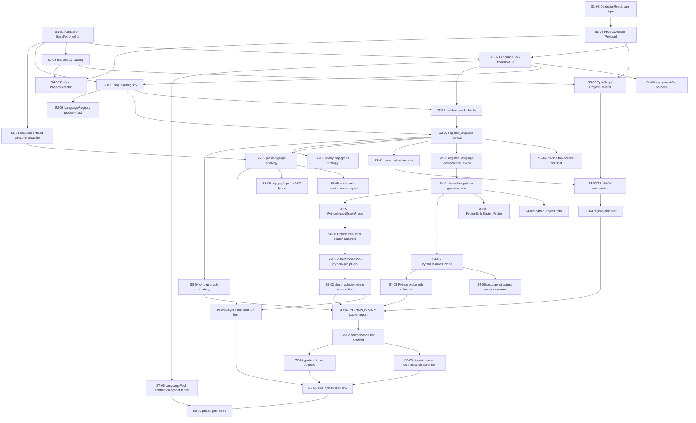

# Phase 7.5 — Multi-language foundations + Python: Stories manifest

**Status:** Backlog generated; ready for autonomous implementation
**Date:** 2026-05-20
**Phase architecture:** [../phase-arch-design.md](../phase-arch-design.md)
**Phase ADRs:** [../ADRs/](../ADRs/)
**Implementation plan:** [../High-level-impl.md](../High-level-impl.md)
**Source design:** [../final-design.md](../final-design.md)

## Executive summary

This backlog decomposes the 8 High-level-impl steps into **41 stories** across the contract-first build of the Python language axis. The distribution is contract-and-kernel-heavy at the front (Step 1: 6, Step 2: 6, Step 3: 4) because the `LanguagePack` value, the `register_language`/`validate_pack` kernel, and the TypeScript retrofit must all exist and type-check before any Python capability code is written; Python capability work is the broad middle (Step 4: 8, Step 5: 6, Step 6: 4); the proof tier closes it (Step 7: 5, Step 8: 2). The dependency DAG is a near-linear spine through the foundation steps (Step 1 → Step 2 → Step 3, with Steps 4–6 fanning off Steps 1–2 in parallel) that re-converges at Step 7's conformance tier, which consumes every prior deliverable. Cross-cutting work surfaced into first-class stories: the three architect-flagged gaps — the no-shadow source-set split (Gap 1, S2-04), the fully-enumerated `TS_PACK` + scoped drift test (Gap 2, S3-02/S3-04), and the registered-but-never-dispatched probe meta-test (Gap 3, S7-03) — plus the `mypy`-must-fail test harness (S1-06), the depgraph-purity AST fence (S5-06), and the `LanguagePack` contract-snapshot fence (S7-05).

## How to use this backlog

1. **Pick a story whose dependencies are all `Done`.** Start at the top of the DAG (`S1-01`) and walk forward; never start a story with an unsatisfied `Depends on`.
2. **Read the story file's Context, References, and Goal** before touching code — the References pin the exact ADR / arch-design / impl-plan sections that constrain the work.
3. **Write the TDD red test first.** The story's TDD plan names a test that must fail for the right reason before any implementation exists. Commit it red.
4. **Implement to green** with the minimum code that satisfies the acceptance criteria — no speculative surface.
5. **Refactor** under the green bar — extract pure helpers, honor functional-core/imperative-shell, match the existing convention.
6. **Check every acceptance criterion** and confirm the Definition of done below; then set the story file's `**Status:**` to `Done`.
7. **Move to the next story** whose dependencies are now satisfied.

## Definition of done (applies to every story)

A story is done when:
- [ ] All acceptance criteria are checked.
- [ ] The TDD plan's red test exists, is committed, and is green.
- [ ] Any additional tests required to honor the relevant ADRs are written and green.
- [ ] Code is formatted (`ruff format`), linted clean (`ruff check`), passes `mypy --strict`.
- [ ] No existing test was disabled or weakened without an explicit note explaining why.
- [ ] The story file's Status is updated to `Done`.
- [ ] If the story modifies a contract documented in an ADR, the ADR's "Consequences" section is reviewed for follow-ups.

## Dependency DAG (visual)

## Stories — by step

### Step 1: Establish the `LanguagePack` contract, the `DetectionResult` sum type, and the `markers.py` catalog

**Step goal:** Land every net-new *type* the language axis depends on — the frozen total `LanguagePack` value, the `Detected | NotDetected` sum type, the `ProjectDetector` Port, the addition-only marker catalog — plus the foundation `Literal`/error edits that unblock them.
**Step exit criteria mapping:** "An incomplete `LanguagePack` fails `mypy --strict`."

| ID | Title (slug → file) | Effort | Depends on | Summary (one sentence) |
|---|---|---|---|---|
| S1-01 | Foundation loud edits (`SupportedLanguage` +1, `PackageManager` +3, `LanguageRegistryError`) — `S1-01-foundation-literal-and-error-edits.md` | S | — | Add `"python"` to `SupportedLanguage`, `"pip"`/`"poetry"`/`"uv"` to `PackageManager`, and a `LanguageRegistryError` to `codegenie.errors` as compiler-policed loud edits. |
| S1-02 | Add the `LanguagePack` frozen total value — `S1-02-add-languagepack-frozen-value.md` | M | S1-01, S1-04 | Land the new `src/codegenie/languages/` package with `pack.py` carrying the frozen Pydantic `LanguagePack` (six required capability fields + `probes_self_registered`, derived `package_managers` property). |
| S1-03 | Add the `DetectionResult` sum type — `S1-03-add-detectionresult-sum-type.md` | S | — | Define the `Detected | NotDetected` frozen-dataclass tagged union so a missing `match` case is an `assert_never`/`mypy` error. |
| S1-04 | Define the `ProjectDetector` Protocol — `S1-04-define-projectdetector-protocol.md` | S | S1-03 | Add the `ProjectDetector` `typing.Protocol` (structural Port) returning a `DetectionResult`. |
| S1-05 | Add the `markers.py` addition-only catalog — `S1-05-add-markers-catalog.md` | S | S1-01 | Land `LANGUAGE_MARKERS: Final[Mapping[Language, tuple[str, ...]]]` as the single marker source of truth for Python and TypeScript. |
| S1-06 | Build the `mypy`-must-fail test harness — `S1-06-build-mypy-must-fail-harness.md` | M | S1-02 | Add the snippet-based test machinery that asserts an incomplete `LanguagePack(...)` is a `mypy --strict` construction-site error. |

### Step 2: Land the `register_language` / `validate_pack` kernel and `LanguageRegistry`

**Step goal:** Build the one privileged registration operation — validate-all-then-commit fan-out into the existing decomposed registries — and the registry every conformance test parameterizes over.
**Step exit criteria mapping:** "An incomplete `LanguagePack` fails `mypy --strict`" (registry-level totality); foundation for "Python and TypeScript both run from the same gather + plugin orchestration."

| ID | Title (slug → file) | Effort | Depends on | Summary (one sentence) |
|---|---|---|---|---|
| S2-01 | Add `LanguageRegistry` + `default_language_registry` — `S2-01-add-languageregistry.md` | S | S1-01, S1-02 | Land the `dict[Language, LanguagePack]` wrapper with build-then-publish `register`, `get`, sorted `all()`, and the module-level singleton. |
| S2-02 | Implement `validate_pack` checks (totality, grammar-wired, adapter-resolves) — `S2-02-implement-validate-pack-checks.md` | M | S2-01, S1-02 | Add the all-checks-no-writes `validate_pack` covering Pydantic totality, `grammars ⊆ supported_languages()`, and adapter-module import resolution. |
| S2-03 | Implement `register_language` validate-then-commit fan-out — `S2-03-implement-register-language-fan-out.md` | M | S2-02, S2-01 | Add `register_language` — call `validate_pack`, build-then-publish into `LanguageRegistry`, then fan probes/strategies into the existing registries for non-self-registered packs. |
| S2-04 | Specify the no-shadow source-set split (Gap 1) — `S2-04-no-shadow-source-set-split.md` | M | S2-03 | Implement the no-shadow check reading the live `default_probe_registry` (probe-name, gated on `probes_self_registered=False`) and `DepGraphRegistry` (PM-key, every pack), per phase-ADR-0002. |
| S2-05 | Make `register_language` idempotent and emit `language.registered` — `S2-05-register-language-idempotence-and-event.md` | S | S2-03 | Add per-`Language` idempotence (re-register is a no-op; conflicting re-register raises naming both sites) and the structured `language.registered` event. |
| S2-06 | `LanguageRegistry` Hypothesis property test — `S2-06-languageregistry-property-test.md` | S | S2-01 | Add the property test: for any sequence of distinct packs, `all()` is sorted and `get(p.language) == p` for every registered pack. |

### Step 3: Retrofit TypeScript as `LanguagePack` #1 (by reference)

**Step goal:** Construct the complete `TS_PACK` value and register it `probes_self_registered=True`, proving the contract fits the *existing* language before Python is built.
**Step exit criteria mapping:** "Python and TypeScript both run from the same gather + plugin orchestration"; "The Node/TypeScript regression suite is unchanged and green."

| ID | Title (slug → file) | Effort | Depends on | Summary (one sentence) |
|---|---|---|---|---|
| S3-01 | Add the `packs/` explicit-import collection point — `S3-01-add-packs-collection-point.md` | S | S2-03 | Land `src/codegenie/languages/packs/__init__.py` as the explicit-import collection point (the language-axis analog of `probes/__init__.py`). |
| S3-02 | Fully enumerate `TS_PACK` (Gap 2) — `S3-02-enumerate-ts-pack.md` | M | S3-01, S3-03 | Construct `TS_PACK` with all seven fields explicitly enumerated — `layer_a_probes` verified against `codegenie/probes/__init__.py`'s Phase 1 imports — and call `register_language(TS_PACK)`. |
| S3-03 | Build the TypeScript `ProjectDetector` — `S3-03-build-typescript-projectdetector.md` | S | S1-04, S1-05 | Add a genuine `ProjectDetector` implementation for TypeScript reading `LANGUAGE_MARKERS[Language("typescript")]`. |
| S3-04 | Add the registry-drift test (at-least-the-union) — `S3-04-add-registry-drift-test.md` | S | S3-02 | Add the test asserting `default_probe_registry` contains *at least* the union of all packs' `layer_a_probes`, scoped to inequality not equality. |

### Step 4: Build the Python Layer A/B probes and the `tree-sitter-python` grammar row

**Step goal:** Land the four Python probes (project / build-system / manifest / import-graph) and wire the `tree-sitter-python` grammar so a Python repo can be detected and parsed.
**Step exit criteria mapping:** "Python and TypeScript both run from the same gather + plugin orchestration."

| ID | Title (slug → file) | Effort | Depends on | Summary (one sentence) |
|---|---|---|---|---|
| S4-01 | Wire the `tree-sitter-python` grammar row — `S4-01-wire-tree-sitter-python-grammar.md` | S | S2-05 | Pin the `tree-sitter-python` wheel in `pyproject.toml`/`uv.lock` and add the `+1` `_DISPATCH` row so `language_for("python")` loads lazily. |
| S4-02 | Add `PythonProjectProbe` (`tier="base"` prelude) — `S4-02-add-python-project-probe.md` | M | S4-01 | Land the base-tier prelude probe that walks the tree and enriches `detected_languages` for Python. |
| S4-03 | Build the Python `ProjectDetector` — `S4-03-build-python-projectdetector.md` | S | S1-04, S1-05 | Add the Python `ProjectDetector` returning `Detected(high)` on a real manifest, `Detected(low)` on a bare `*.py` tree, `NotDetected` otherwise. |
| S4-04 | Add `PythonBuildSystemProbe` — `S4-04-add-python-build-system-probe.md` | M | S4-01 | Land the `task_specific` build-system probe (`applies_to_languages=["python"]`) detecting the active build backend. |
| S4-05 | Add `PythonManifestProbe` with hard caps — `S4-05-add-python-manifest-probe.md` | M | S4-01 | Land the manifest probe parsing `pyproject.toml` under byte/depth/timeout caps, reusing Phase 1 `SizeCapExceeded`/`DepthCapExceeded` machinery and `_WARNING_IDS`. |
| S4-06 | Structural `setup.py` parsing — never executed (G6) — `S4-06-structural-setup-py-no-exec.md` | M | S4-05 | Parse `setup.py`/`setup.cfg` structurally (tree-sitter / INI) and add the AST test forbidding `exec`/`eval`/`__import__`/`importlib`-of-repo-file in `probes/python/`. |
| S4-07 | Add `PythonImportGraphProbe` (Layer B) — `S4-07-add-python-import-graph-probe.md` | M | S4-01 | Land the single Layer-B import-graph probe walking `import` statements via tree-sitter. |
| S4-08 | Add Python probe sub-schemas + envelope `$ref`s — `S4-08-add-python-probe-sub-schemas.md` | S | S4-05 | Land `python_*.schema.json` sub-schemas (`additionalProperties: false`) and wire `$ref`s into the `RepoContext` envelope's `properties.probes`. |

### Step 5: Build the Python dep-graph strategies (pip / poetry / uv)

**Step goal:** Land three concrete pure-parse dep-graph strategies and the `tests/fence/test_depgraph_purity.py` AST fence that proves they perform zero I/O.
**Step exit criteria mapping:** "Python and TypeScript both run from the same gather + plugin orchestration"; underpins the `vulnerability-remediation--python--pip` diff.

| ID | Title (slug → file) | Effort | Depends on | Summary (one sentence) |
|---|---|---|---|---|
| S5-01 | `requirements.txt` directive classifier with fail-closed taxonomy — `S5-01-requirements-txt-directive-classifier.md` | M | S1-01 | Land the directive classifier mapping `-e .`/`git+...`/`--index-url`/`-r`/unknown directives to typed `UnresolvedDependency`/`IndexOverride` facts, fail-closed on unknowns. |
| S5-02 | Add the pip dep-graph strategy — `S5-02-add-pip-depgraph-strategy.md` | M | S5-01, S2-03 | Land `depgraph/python/pip.py` resolving `requirements.txt` to a `networkx.DiGraph`, registered via `@register_dep_graph_strategy("pip")`. |
| S5-03 | Add the poetry dep-graph strategy — `S5-03-add-poetry-depgraph-strategy.md` | M | S2-03 | Land `depgraph/python/poetry.py` parsing `poetry.lock` TOML under byte/depth caps, registered for `"poetry"`. |
| S5-04 | Add the uv dep-graph strategy — `S5-04-add-uv-depgraph-strategy.md` | M | S2-03 | Land `depgraph/python/uv.py` parsing `uv.lock` TOML under byte/depth caps, registered for `"uv"`. |
| S5-05 | Adversarial `requirements.txt` corpus + zero-egress assertion — `S5-05-adversarial-requirements-corpus.md` | M | S5-02 | Add the hostile-directive corpus and assert via network/subprocess monitors that the pip strategy makes zero outbound connections and zero spawns. |
| S5-06 | Add `tests/fence/test_depgraph_purity.py` AST fence (G5) — `S5-06-add-depgraph-purity-fence.md` | S | S5-02 | Add the AST-walk fence over `depgraph/python/` forbidding `urllib`/`requests`/`http`/`socket`/`subprocess` import or call. |

### Step 6: Build the Python search adapter and the `vulnerability-remediation--python--pip` plugin

**Step goal:** Land the tree-sitter-backed ADR-0032 search adapters and the Python vulnerability-remediation plugin so the `(vuln, python, pip)` tuple resolves to a real diff.
**Step exit criteria mapping:** "The `vulnerability-remediation--python--pip` plugin produces a real diff on a vulnerable Python fixture repo."

| ID | Title (slug → file) | Effort | Depends on | Summary (one sentence) |
|---|---|---|---|---|
| S6-01 | Build the tree-sitter Python search adapters — `S6-01-build-python-search-adapters.md` | M | S4-07 | Land the tree-sitter-backed `ImportGraphAdapter` (mandatory) + `DepGraphAdapter` + `TestInventoryAdapter` with `confidence() -> float` per ADR-0032 as-written. |
| S6-02 | Scaffold the `vulnerability-remediation--python--pip` plugin — `S6-02-scaffold-python-pip-plugin.md` | S | S6-01 | Land `plugins/vulnerability-remediation--python--pip/` with a `plugin.yaml` that `extends` the universal base and validates via Pydantic. |
| S6-03 | Wire `contributes.adapters` and tuple resolution — `S6-03-wire-plugin-adapter-resolution.md` | S | S6-02 | Wire the Python adapters into the plugin manifest's `contributes.adapters` and prove resolution from the `(vuln, python, pip)` tuple. |
| S6-04 | Plugin integration diff test on a vulnerable fixture (G10) — `S6-04-plugin-integration-diff-test.md` | M | S6-03, S5-02 | Add the integration test asserting the plugin produces a real diff on a vulnerable Python fixture under `tests/golden/languages/python/`. |

### Step 7: Land the `tests/conformance/` tier and the `LanguagePack` contract-snapshot fence

**Step goal:** Build the parameterized conformance suite that auto-enrolls every registered language and the contract+snapshot fence — the category-based extension-by-addition fence.
**Step exit criteria mapping:** "Every registered language passes `tests/conformance/`"; "the category-based fence rejects a planted silent edit"; "mandatory per-language golden fixtures."

| ID | Title (slug → file) | Effort | Depends on | Summary (one sentence) |
|---|---|---|---|---|
| S7-01 | Construct `PYTHON_PACK` and register it via `packs/__init__` — `S7-01-construct-and-register-python-pack.md` | M | S3-04, S4-08, S5-04, S6-03 | Construct the complete `PYTHON_PACK` value, call `register_language(PYTHON_PACK)`, and add `import .python` to `packs/__init__.py`. |
| S7-02 | Scaffold the `tests/conformance/` tier + completeness guard — `S7-02-scaffold-conformance-tier.md` | L | S7-01 | Land `test_language_conformance.py` parameterized over `default_language_registry.all()` with per-language capability assertions and the `EXPECTED_LANGUAGE_COUNT` completeness guard. |
| S7-03 | Add `test_language_probes_actually_dispatched` (Gap 3) — `S7-03-add-dispatch-order-conformance-assertion.md` | M | S7-02 | Add the conformance assertion that every `pack.layer_a_probes` probe appears in the run's `coordinator.dispatch.order` event, with a typo'd-`applies_to_languages` negative test proving teeth. |
| S7-04 | Build the golden fixture portfolio (clean + adversarial + polyglot) — `S7-04-build-golden-fixture-portfolio.md` | L | S7-02 | Land per-language fixtures + goldens under `tests/golden/languages/`, the adversarial set, a polyglot fixture, the regen-idempotence test, and the fixture-shape meta-test. |
| S7-05 | Add the `LanguagePack` contract-snapshot fence (G9) — `S7-05-add-languagepack-contract-snapshot-fence.md` | S | S1-02 | Land `tests/fence/test_language_pack_contract.py` + `language_pack_contract.v1.json` pinning the `LanguagePack` field set so a planted field-add turns it red. |

### Step 8: Wire the e2e proof and close the phase gate

**Step goal:** Add the e2e slice row exercising the full Python path and bring `make check` + CI fully green.
**Step exit criteria mapping:** "The `vulnerability-remediation--python--pip` plugin produces a real diff on a vulnerable Python fixture repo" (e2e proof); whole-phase gate.

| ID | Title (slug → file) | Effort | Depends on | Summary (one sentence) |
|---|---|---|---|---|
| S8-01 | Add the e2e Python slice row — `S8-01-add-e2e-python-slice-row.md` | S | S6-04, S7-03, S7-04 | Add a row to the table-driven `tests/e2e/` slice harness exercising `gather → (vuln, python, pip) resolution → diff` against the vulnerable Python fixture. |
| S8-02 | Close the phase gate (`import-linter`, `make fence`, ADR reconciliation) — `S8-02-close-phase-gate.md` | S | S7-05, S8-01 | Finalize `import-linter` contracts for the new Python sub-packages, extend `make fence` for the `tree-sitter-python` pin, and reconcile the ADR table — bringing `make check` + CI fully green. |

## Cross-cutting concerns

- **`mypy --strict` on all public surface.** Every story touching `src/codegenie/` must keep `mypy --strict src/` clean; the `LanguagePack` totality guarantee (G2) is itself a `mypy` property — never weaken it with `Any` or `# type: ignore`.
- **`import-linter` + `make fence` discipline.** Each new sub-package (`codegenie.languages`, `codegenie.probes.python`, `codegenie.depgraph.python`) needs an `import-linter` contract; no `FORBIDDEN_LLM_SDK` may ride in with the `tree-sitter-python` wheel (G12). Re-check `make fence` at every step, finalize in S8-02.
- **Probe-ABC snapshot is frozen.** Every story under `src/codegenie/probes/` (S4-02, S4-04, S4-05, S4-07) consumes the frozen two-arg `run(self, repo, ctx)` `Probe` ABC unchanged — `tests/unit/test_probe_contract.py` must stay green; a one-arg `run` is a dispatch `TypeError`.
- **The `LanguagePack` contract-snapshot fence.** Once S7-05 lands, any story that intentionally changes the `LanguagePack` field set must re-bump `language_pack_contract.v1.json` deliberately and review phase-ADR-0001's `Review trigger` — the fence going red is the desired loud signal, never a silent re-snapshot.
- **Structural-defense fences stay green.** A new ctx attribute, a new `src/codegenie/` submodule, or a new probe means the `tests/fence/` conformance/cold-start/no-probe-errors suite must stay green per `docs/contributing.md`.

## Exit-criteria coverage

| Exit criterion (verbatim or close) | Story / stories |
|---|---|
| Python and TypeScript both run from the same gather + plugin orchestration | S3-02, S4-02, S4-04, S4-05, S4-07, S6-03, S7-01, S7-03, S8-01 |
| The Node/TypeScript regression suite is unchanged and green | S1-01, S3-02, S3-04, S7-02, S7-04 (planted Node-edit gate), S8-02 |
| Every registered language passes `tests/conformance/` | S7-02, S7-03, S7-04 |
| An incomplete `LanguagePack` fails `mypy --strict` | S1-02, S1-06 |
| The category-based fence rejects a planted silent edit | S7-05, S7-04 (G3 regression gate) |
| The `vulnerability-remediation--python--pip` plugin produces a real diff on a vulnerable Python fixture repo | S6-04, S8-01 |
| ADR-0043 discipline reframe — contract+snapshot test replaces byte-edit allowlist | S7-05 (recorded in phase-ADR-0012) |
| Mandatory per-language golden fixtures under `tests/golden/languages/{language}/` | S7-04 |

## Open implementation questions

- **OQ1 — Conformance/golden fixture sizing.** The Python fixture must defeat a stub adapter (≥ 1 cross-file ref, ≥ 1 dep edge) yet stay inside `make check`'s wall-clock envelope. First arises in **S7-04**; the fixture-shape meta-test is the guard.
- **OQ2 — `tsx`/`javascript` conformance coverage minimum.** The TypeScript fixture should exercise at least `typescript` + one of `tsx`/`javascript` so the three-grammar `TS_PACK.grammars` tuple is not a paper claim. First arises in **S3-02**, enforced by the fixture-shape spec in **S7-04**.
- **OQ3 — `PythonImportGraphProbe` Layer-B depth.** Whether the import-graph probe covers `sys.path` / namespace-package resolution or stays minimal is an implementation-time scoping call — the phase proves the axis, not Python feature-parity. Decided in **S4-07**.
- **OQ4 — `scip-python` fast-follow timing.** The deferred `ScipAdapter` (needs an `ALLOWED_BINARIES` amendment under Phase 2 omnibus ADR-0001) is out of phase scope; sequencing as a 7.5 closeout vs. a Phase 8 preamble is noted, not scheduled. Surfaced by **S6-01** (tree-sitter-first decision, phase-ADR-0011).
- **OQ5 — Polyglot-repo adapter dispatch.** Which adapter answers which query for a repo detected as both Node and Python is ADR-0032 / Phase-8-Planner territory; Phase 7.5 ships only the polyglot-*isolation* conformance assertion. Surfaced by **S7-04** (polyglot fixture).
- **OQ6 — `@register_dep_graph_strategy` pre-registration for Node strategies.** Whether the `PackageManager`-key no-shadow check must account for Node strategies already in `DepGraphRegistry` is a verification step against `codegenie/depgraph/registry.py` + the Node plugin manifest. Resolved in **S2-04** (Gap 1), recorded in phase-ADR-0002.

## Backlog stats

- **Total stories:** 41
- **Stories per step:** Step 1: 6 · Step 2: 6 · Step 3: 4 · Step 4: 8 · Step 5: 6 · Step 6: 4 · Step 7: 5 · Step 8: 2
- **Effort distribution:** S: 17 · M: 21 · L: 3
- **Longest dependency chain:** 9 stories — `S1-01 → S1-02 → S2-01 → S2-02 → S2-03 → S3-01 → S3-02 → S3-04 → S7-01` (then `→ S7-02 → S7-03 → S8-01 → S8-02`, a 13-story spine to the phase gate).
