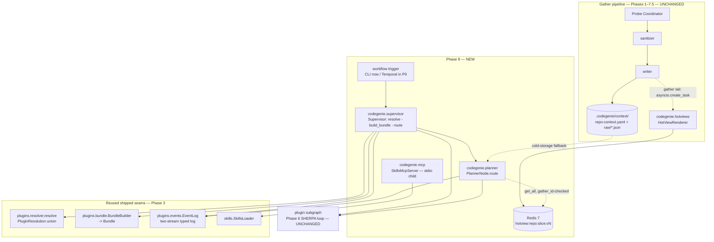
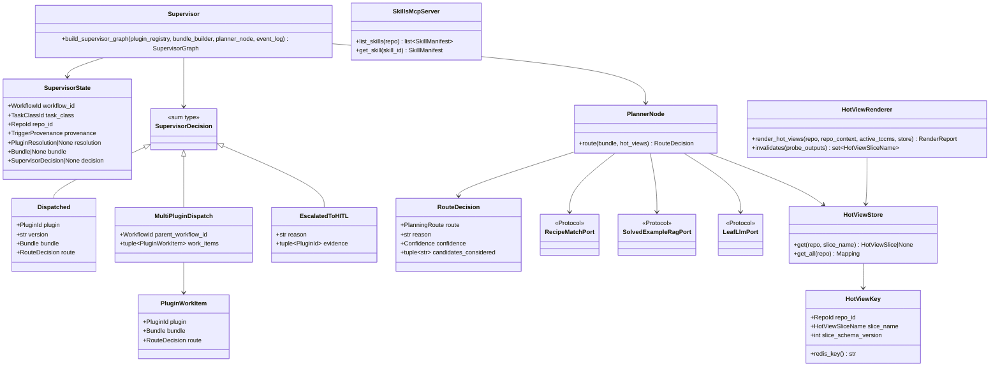
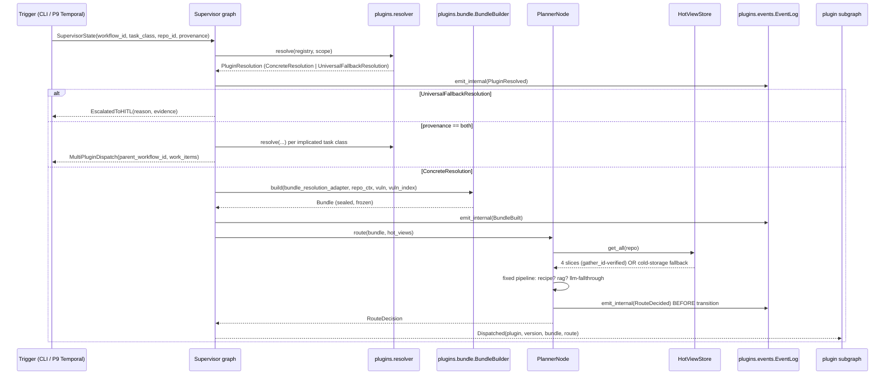
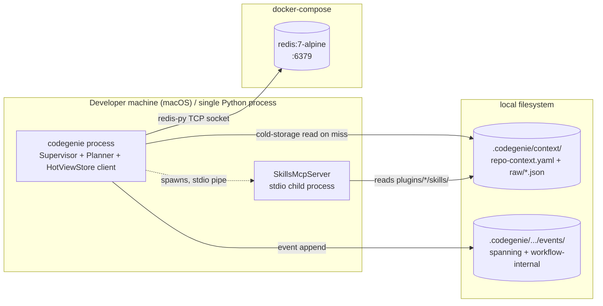
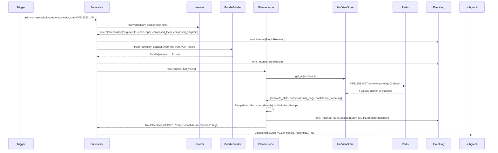
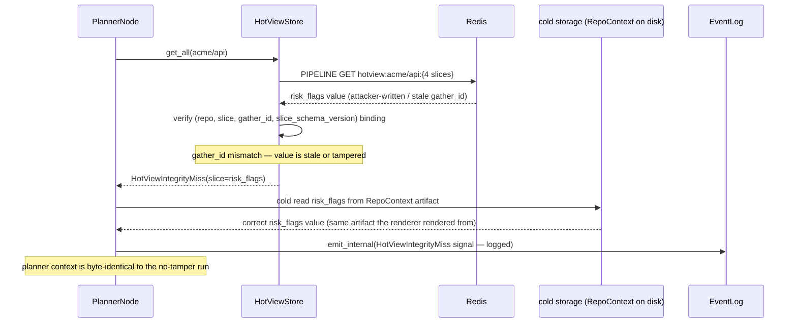
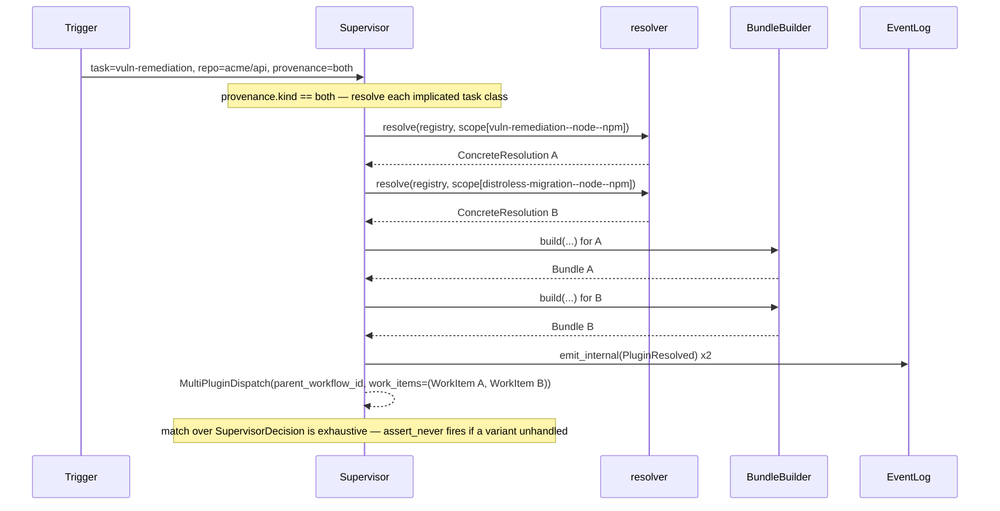

# Phase 08 — Hierarchical Planner + pre-rendered hot views: Architecture

**Status:** Architecture spec
**Date:** 2026-05-21
**Inputs:** `final-design.md` · `critique.md` · `design-performance.md` · `design-security.md` · `design-best-practices.md` · `docs/roadmap.md` §Phase 8/9/10 · `docs/production/design.md` §2/§4.1/§8 · production ADRs 0013, 0029, 0030, 0031, 0032, 0042, 0034, 0023 · sibling final-designs 06/07/07.5 · the shipped code under `src/codegenie/plugins/`, `src/codegenie/skills/`, `src/codegenie/transforms/`
**Audience:** the engineer implementing Phase 8

---

## Executive summary

Phase 8 adds the **Supervisor** — the planning layer above every worker subgraph — plus a **PlannerNode** that makes the recipe/RAG/LLM routing decision, four **Redis hot views**, and one **MCP Skills stdio server**. The work is deliberately thin: `codegenie.plugins.resolver.resolve` already returns a public `PluginResolution` discriminated union with `composed_tccm`/`composed_adapters` pre-merged, `codegenie.plugins.bundle.BundleBuilder` + `Bundle` already ship (Phase 3 S3-04), and `codegenie.plugins.events.EventLog` already provides a two-stream typed event log — so Phase 8 builds **four new packages** (`codegenie.supervisor`, `codegenie.planner`, `codegenie.hotviews`, `codegenie.mcp`) and wires the rest. The Supervisor's output is a closed three-variant sum type `Dispatched | MultiPluginDispatch | EscalatedToHITL` that models the ADR-0042 `Both` case as a first-class variant. Two facts the synthesis got wrong and this spec corrects: **`langgraph` is not yet a dependency and is not imported anywhere in `src/`** (the synthesis claimed it shipped in Phase 6 — see Gap 1); and the resolver's `ComposedResolution` does **not** structurally satisfy `BundleBuilder.build`'s `BundleResolution` Protocol (`ComposedTccm`≠`TCCM`, `composed_adapters`≠`composed_dispatch` — see Gap 2). Both are surfaced as prerequisites with concrete resolutions, not silently averaged.

---

## Goals

Verifiable, traced to `roadmap.md` §Phase 8 exit criteria and `final-design.md` §Goals.

- **G1 — Routing decision made and logged on every workflow.** `codegenie.planner.PlannerNode.route` makes a `RECIPE | RAG | LLM` decision; a `RouteDecided` event is appended to the existing `codegenie.plugins.events` log *before* the routing transition completes. A static AST test asserts no routing code path reaches a transition without the append. (Exit criterion 1.)
- **G2 — Hot-view serving `< 50 ms p95`.** `codegenie.hotviews.HotViewStore.get_all(repo)` serves the four ADR-0013 slices in one pipelined Redis round-trip + Pydantic deserialization. A `@pytest.mark.bench` canary and a `phase08_e2e` latency test both assert `p95 < 50 ms` against a real `redis:7-alpine`. Scope is pinned to the read + deserialization (08-ADR-0004). (Exit criterion 2.)
- **G3 — Phase 8 adds `$0.00` of LLM spend.** Supervisor, BundleBuilder reuse, hot views, routing decision, and MCP server are 100% deterministic. The only LLM seam is `PlannerNode`'s `LeafLlmPort`, reached only on a recipe-and-RAG miss. `import-linter` forbids LLM SDKs from all four new packages; a fence test confirms they are outside the gather-runtime closure `test_pyproject_fence.py` locks.
- **G4 — Multi-plugin `Both` is modeled, not deferred.** `SupervisorDecision` carries a `MultiPluginDispatch(parent_workflow_id, work_items)` variant satisfying ADR-0042 §Consequences ("Phase 8 must model parent workflow plus plugin work items").
- **G5 — Redis is untrusted on read.** Every hot-view value is `gather_id`-stamped and `slice_schema_version`-stamped; a mismatch on read discards the value and falls through to cold storage. A writable-Redis compromise is a latency cost, never a context-poisoning cost. No KMS, no HMAC, no secrets broker.
- **G6 — Bounded public surface + coverage.** ≤ 24 exported names across the four new packages; ≥ 90 % line coverage on the new packages; 100 % branch coverage on the two exit-criteria-bearing functions (`PlannerNode.route` selection and `invalidates`); cyclomatic complexity ≤ 8 per function (`ruff` `C901`).
- **G7 — One new runtime service, bounded new deps.** `redis:7-alpine` in `docker-compose.yml`; `redis` (client) and `mcp` (SDK) added to `pyproject.toml`. Whether `langgraph` is also added is resolved by 08-ADR-0001 (see Gap 1).

---

## Non-goals

Each explains why it is anti-scope.

- **Temporal / durable execution / worker pools.** Phase 9 owns Temporal (`roadmap.md` §Phase 9). Phase 8's Supervisor is a synchronous in-process graph; the three-node shape *is* the Phase-9 wrapping seam but Phase 8 does not wrap it.
- **A canonical event store / `PlannerDecisionLog`.** ADR-0034 lands event sourcing operationally in Phase 9; `roadmap.md` §Phase 9 names "plugin-resolution records" as structures that migrate to event-stream projections *from Phase 9*. Phase 8 emits into the **existing** `codegenie.plugins.events` log; building a standalone event-sourced store front-runs Phase 9 and gives Phase 11/13 two sources of truth.
- **KMS / secrets broker / mTLS / `LlmCapability`.** No identity infrastructure exists before Phase 9. A cryptographic tamper-evidence story for Redis and per-workflow credential minting are Phase 9+ work (08-ADR-0002 records the deferral).
- **OS-level confinement of the MCP process (seccomp / bind-mounts / `no_new_privileges`).** seccomp is Linux-only; the documented dev substrate is macOS. Process supervision and kernel-policy confinement are Phase 9 deployment-substrate work.
- **The Knowledge Graph / a real RAG backend.** The KG arrives in Phase 11; Phase 8 ships a `NullRagPort` so the three-step routing *shape* is correct from day one and Phase 11 swaps the adapter with zero routing-code change.
- **Resolution caching as a hot-view slice.** ADR-0013 §Consequences requires an ADR amendment to add a slice; `resolver.resolve` already returns `composed_tccm`/`composed_adapters` pre-merged in `< 5 ms`, so there is nothing slow to pre-render. The synthesis correctly rejects performance's two extra slices.
- **Deep cross-PR sequencing for `Both` workflows.** Phase 8 ships the typed parent/child *shape* and dispatch; the deep sequencing logic is exercised when Phase 10 first produces real `Both` candidates (ADR-0042 §Consequences).
- **A second in-process LRU in front of `HotViewStore`.** One Redis `GET` over a local socket clears the SLO ~25×; a process-local cache is a second invalidation surface for no measured win.

---

## Architectural context

Phase 8 sits between the **deterministic gather pipeline** (Phases 1–7.5, unchanged) and the **per-plugin worker subgraphs** (Phase 6 SHERPA loop, unchanged). The gather pipeline's tail fires a detached `HotViewRenderer` task that writes four agent-context slices into Redis. A workflow trigger enters the Supervisor, which resolves the plugin (reusing `codegenie.plugins.resolver`), builds the Context Bundle (reusing `codegenie.plugins.bundle.BundleBuilder`), routes via `PlannerNode` (which reads the hot views), emits typed events into the existing `codegenie.plugins.events` log, and dispatches into the plugin's subgraph. The MCP Skills server is a sibling local stdio process serving Skill manifests over the `mcp` SDK.



---

## 4+1 architectural views

### Logical view



The four new packages are mutually independent except `codegenie.supervisor` depends on `codegenie.planner` (it composes the `PlannerNode` into the route step) and both depend on `codegenie.hotviews` (the planner reads it). `codegenie.mcp` depends on nothing but `codegenie.skills`. Every domain outcome is a closed Pydantic discriminated union — `SupervisorDecision`, `PluginResolution` (reused), `PlanningRoute` (a `StrEnum`) — handled by `match` + `assert_never` so no dispatch site can silently drop a case.

### Process view



The Supervisor is a strictly sequential `resolve → build_bundle → route` flow with one branch point (the `PluginResolution` variant) and one trigger-driven branch (`provenance == both`). It never loops. The hot-view read is the only Redis I/O on the warm path; the `gather_id` check is a microsecond string compare; a failed check transparently substitutes a cold-storage read of the same `RepoContext` artifact the renderer rendered from. `route()` emits `RouteDecided` *before* returning — the append is a precondition of the transition, not a fire-and-forget side effect.

### Development view

```mermaid
graph TD
    SRC[src/codegenie/]
    SRC --> SUP[supervisor/]
    SRC --> PLN[planner/]
    SRC --> HV[hotviews/]
    SRC --> MCP[mcp/]
    SRC --> EXIST[plugins/ skills/ types/ ... — REUSED]

    SUP --> SUP_G[graph.py — build_supervisor_graph + 3 nodes]
    SUP --> SUP_S[state.py — SupervisorState, SupervisorDecision union, PluginWorkItem]
    SUP --> SUP_D[decide.py — pure decide function]
    SUP --> SUP_BR[bundle_resolution.py — ConcreteResolution -> BundleResolution adapter]

    PLN --> PLN_R[routing.py — PlannerNode, route, the fixed pipeline — LLM-SDK-fenced]
    PLN --> PLN_P[ports.py — RecipeMatchPort, SolvedExampleRagPort, LeafLlmPort Protocols]
    PLN --> PLN_M[model.py — PlanningRoute StrEnum, RouteDecision]
    PLN --> PLN_N[null_rag.py — NullRagPort]

    HV --> HV_R[renderer.py — render_hot_views, invalidates — pure]
    HV --> HV_S[store.py — HotViewStore, redis-py shell]
    HV --> HV_M[model.py — HotViewKey, HotViewSlice union, HotViewSliceName Literal]

    MCP --> MCP_S[server.py — SkillsMcpServer core, transport-agnostic]
    MCP --> MCP_T[stdio.py — serve_skills_stdio, mcp SDK shell]
    MCP --> MCP_C[contract.py — MCP_SKILLS_CONTRACT pinned shape]

    EVT2[plugins/events.py — +RouteDecided +RouteDescended variants — ADDITIVE]
    ID[types/identifiers.py — +RepoId newtype — ADDITIVE]
```



Four flat packages, no nested sub-packages — mirrors the codebase's flat-module convention (`codegenie.depgraph`, `codegenie.indices`). Each package separates the **pure functional core** (`decide.py`, `renderer.py`, `routing.py` selection logic, `server.py` core) from the **imperative shell** (`graph.py` nodes, `store.py` redis-py calls, `stdio.py` MCP transport). Two **additive, fence-enumerated edits** to shipped files: two `Literal`-tagged event variants in `plugins/events.py`, and the `RepoId` newtype in `types/identifiers.py` (it does not exist today — see Gap 3).

### Physical view



The Phase-8 POC runtime is exactly: **one Python process** (the `codegenie` CLI running the Supervisor, Planner, and `HotViewStore` redis-py client), **one Redis container** (`redis:7-alpine` from `docker-compose.yml`, `:6379`, no AOF, no replication — the cache is reconstructable from the next gather), and **one MCP stdio child process** (`SkillsMcpServer`, spawned by and piped to the parent over stdin/stdout). No Postgres, no Temporal, no worker pool — those are Phase 9. The event log is the existing on-disk zstd files. Phase 9 relocates Redis to its own host and moves the event log to Postgres; the `< 50 ms` SLO is re-verified under that topology then.

### Scenarios

#### Scenario 1 — happy path: warm vuln-remediation, recipe route



#### Scenario 2 — failure path: hot view stale / tampered, fail-closed to cold storage



#### Scenario 3 — ADR-0042 multi-plugin `Both` workflow



#### Scenario 4 — failure path: no concrete plugin matches

```mermaid
sequenceDiagram
    participant T as Trigger
    participant SUP as Supervisor
    participant RES as resolver
    participant EVT as EventLog
    participant HITL as universal HITL subgraph

    T->>SUP: task=library-upgrade, repo=acme/legacy-cobol
    SUP->>RES: resolve(registry, scope[cobol, ...])
    RES-->>SUP: UniversalFallbackResolution(reason=no_concrete_match, candidates_considered)
    SUP->>EVT: emit_internal(PluginResolved — universal fallback)
    SUP-->>SUP: EscalatedToHITL(reason="no concrete plugin", evidence=candidates)
    SUP-->>HITL: dispatch into universal HITL subgraph; interrupt() for human triage
    Note over SUP: never silent — EscalatedToHITL is a typed variant, not None
```

---

## Component design

### C1 — Supervisor (`codegenie.supervisor`)

- **Purpose.** The planning layer above the worker subgraphs: resolve the matching plugin, build the Context Bundle, make and log the routing decision, dispatch into the plugin subgraph. The per-workflow tollbooth — fast, small, audited.
- **Public interface.**
  ```python
  # codegenie/supervisor/graph.py
  def build_supervisor_graph(
      *,
      plugin_registry: PluginRegistry,
      bundle_builder: BundleBuilder,
      planner_node: PlannerNode,
      event_log: EventLog,
  ) -> SupervisorGraph: ...

  async def run_supervisor(graph: SupervisorGraph, state: SupervisorState) -> SupervisorDecision: ...

  # codegenie/supervisor/state.py  (frozen Pydantic)
  class SupervisorState(BaseModel):
      model_config = ConfigDict(frozen=True, extra="forbid")
      workflow_id: WorkflowId
      task_class: TaskClassId
      repo_id: RepoId
      provenance: TriggerProvenance              # sum type — see Data model
      resolution: PluginResolution | None = None
      bundle: Bundle | None = None
      decision: SupervisorDecision | None = None

  # codegenie/supervisor/decide.py  (pure)
  def decide(
      *,
      provenance: TriggerProvenance,
      resolutions: tuple[ConcreteResolution | UniversalFallbackResolution, ...],
      bundles: tuple[Bundle, ...],
      routes: tuple[RouteDecision, ...],
      parent_workflow_id: WorkflowId,
  ) -> SupervisorDecision: ...
  ```
- **Internal structure.** Three nodes (`resolve_node`, `build_bundle_node`, `route_node`) wired in a linear graph; `decide()` is the pure core that maps `(provenance, resolution(s), bundle(s), route(s))` to a `SupervisorDecision` with no I/O. The shell is the three nodes; the impure surface is the `resolver.resolve` call, the `BundleBuilder.build` call, and the subgraph handoff. **Graph engine is open** — see Gap 1 and 08-ADR-0001: `SupervisorGraph` is a thin type alias the implementer binds to either `langgraph.StateGraph` (if 08-ADR-0001 admits the dep) or a plain async pipeline of three functions that share `SupervisorState`. Either way, `decide()` stays pure and the node boundary stays the Phase-9 Temporal-Activity seam.
- **Dependencies.** `codegenie.planner` (the `PlannerNode`), `codegenie.plugins.resolver`, `codegenie.plugins.bundle`, `codegenie.plugins.events`, `codegenie.plugins.registry`, `codegenie.types.identifiers`. No LLM SDK (`import-linter`-fenced).
- **State.** Per-workflow `SupervisorState`, frozen, advanced by `model_copy(update=...)` — never mutated in place (mirrors `SubgraphState` discipline in `plugins/subgraph.py`).
- **Performance envelope.** Resolution `< 5 ms` (in-memory dict + cycle-bounded `extends` walk, already shipped); `route()` `< 1 ms`; graph framework overhead `~1–2 ms` (LangGraph) or `~0 ms` (plain pipeline). Total Supervisor overhead `< 5 ms p95` warm. Bundle building is dominated by ADR-0030 graph queries — upstream of the hot-view read, outside the 50 ms SLO.
- **Failure behavior.** A `UniversalFallbackResolution` becomes `EscalatedToHITL` (typed, logged, dispatched into the universal HITL subgraph). A malformed manifest fails at registry load (`build-then-publish` — a partial registry is never published). A bug in the resolve/build/route wiring affects every workflow — mitigated by the smallest-possible code surface, a contract-snapshot test on `SupervisorDecision`, the functional-core purity fence, and reuse of already-tested seams.

### C2 — `ConcreteResolution → BundleResolution` adapter (`codegenie.supervisor.bundle_resolution`)

- **Purpose.** Bridge the resolver's output type to the `BundleBuilder.build` input type. **This component exists because the synthesis's "thin call" claim is wrong** — see Gap 2. The shipped `BundleBuilder.build(resolution: BundleResolution, ...)` expects a `BundleResolution` Protocol with `composed_tccm: TCCM` (the rich `codegenie.plugins.tccm.TCCM`) and `composed_dispatch: Mapping[PrimitiveName, AdapterDispatch]` (callables). The shipped `resolver.resolve` returns `ConcreteResolution` with `composed_tccm: ComposedTccm` (a documented placeholder) and `composed_adapters: dict[PrimitiveName, Adapter]` (objects, not callables). The two do not structurally match.
- **Public interface.**
  ```python
  # codegenie/supervisor/bundle_resolution.py
  class ResolvedBundleInput(BaseModel):
      """Satisfies the codegenie.plugins.bundle.BundleResolution Protocol."""
      model_config = ConfigDict(frozen=True, arbitrary_types_allowed=True)
      composed_tccm: TCCM
      composed_dispatch: Mapping[PrimitiveName, AdapterDispatch]
      plugin_id: PluginId

  def to_bundle_resolution(resolution: ConcreteResolution) -> ResolvedBundleInput: ...
  ```
- **Internal structure.** Maps `ConcreteResolution.composed_adapters` (per-primitive `Adapter` objects) to `composed_dispatch` (per-primitive `AdapterDispatch` callables) by binding each adapter's primitive method. Consumes `ConcreteResolution.composed_tccm` as the rich `TCCM` **once the resolver hands the real `TCCM`** (see Open Question 1 — if the resolver still hands the `ComposedTccm` placeholder, the resolver-internal S3-01 substitution is a Phase-8 prerequisite and must be surfaced loudly, not worked around).
- **Dependencies.** `codegenie.plugins.resolver`, `codegenie.plugins.bundle`, `codegenie.plugins.tccm`, `codegenie.adapters`.
- **Performance envelope.** Pure transform, microseconds.
- **Failure behavior.** If the resolver still returns the `ComposedTccm` placeholder (empty `provides`/`requires`, no `must_read` band), `to_bundle_resolution` raises a typed `ResolverTccmPlaceholder` error naming S3-01 as the prerequisite — fail loud, never silently build an empty Bundle.

### C3 — PlannerNode (`codegenie.planner`)

- **Purpose.** Inside the dispatched plugin's subgraph, decide whether the workflow enters at the recipe tier, the RAG tier, or the LLM tier — and log the decision on every workflow.
- **Public interface.**
  ```python
  # codegenie/planner/model.py
  class PlanningRoute(StrEnum):
      RECIPE = "recipe"
      RAG = "rag"
      LLM = "llm"

  class RouteDecision(BaseModel):
      model_config = ConfigDict(frozen=True, extra="forbid")
      route: PlanningRoute
      reason: str
      confidence: Confidence                      # Literal["high","medium","low"]
      candidates_considered: tuple[str, ...]

  # codegenie/planner/ports.py  (Protocols)
  class RecipeMatchPort(Protocol):
      async def match(self, bundle: Bundle) -> RecipeMatch | None: ...
  class SolvedExampleRagPort(Protocol):
      async def query(self, bundle: Bundle) -> RagHit | None: ...
  class LeafLlmPort(Protocol):
      async def is_available(self) -> bool: ...

  # codegenie/planner/routing.py
  class PlannerNode:
      def __init__(self, *, recipe_port: RecipeMatchPort,
                   rag_port: SolvedExampleRagPort, llm_port: LeafLlmPort,
                   event_log: EventLog) -> None: ...
      async def route(self, bundle: Bundle, hot_views: HotViewStore,
                      *, workflow_id: WorkflowId, repo_id: RepoId) -> RouteDecision: ...
  ```
- **Internal structure.** A **fixed three-step pipeline**: an ordered `tuple[(PlanningRoute, port-callable), ...]` iterated in order; first hit wins; fallthrough is `LLM`. Not a class hierarchy, not a registry — exactly three steps fixed by ADR-0011; a registry here is premature pluggability (toolkit "flag on sight"). The selection logic is pure and 100 %-branch-covered; `route()` itself reads the hot views and appends `RouteDecided` *before* returning.
- **Dependencies.** `codegenie.hotviews`, `codegenie.plugins.bundle`, `codegenie.plugins.events`, `codegenie.types.identifiers`. `codegenie.planner.routing` is `import-linter`-fenced against every LLM SDK — the routing *logic* is LLM-free; the LLM is reached only through `LeafLlmPort`, whose concrete adapter (Agents SDK, ADR-0020) is injected.
- **State.** Stateless across calls — all inputs are arguments. The injected `EventLog` is the only mutable collaborator.
- **Performance envelope.** `route()` `< 1 ms` excluding the hot-view read; recipe-existence is a key-membership test against the plugin's `RecipeRegistry` (content-addressed); RAG non-emptiness is a cheap count query. Neither consults an LLM (Rule 5 — a recipe-existence check is plain code, not a judgment).
- **Failure behavior.** A `LeafLlmPort` failure raises `PlannerError`; the plugin subgraph's existing Phase-6 retry/HITL policy handles it — Phase 8 adds no retry logic. A `route()` misprediction (recipe in the index but stale) costs one wasted recipe-match attempt; Phase 4's `FallbackTier` descends and a `RouteDescended` event is appended, so the misprediction rate is a measured number. **The `SolvedExampleRagPort` is a `NullRagPort` in Phase 8** (the KG arrives Phase 11) — the RAG branch is structurally present and fake-port-unit-tested; Phase 11 swaps the adapter with zero routing-code change.

### C4 — HotViewStore (`codegenie.hotviews.store`)

- **Purpose.** Serve the four ADR-0013 agent-context slices from Redis in `< 50 ms p95`; fail closed to cold storage on integrity miss or Redis unavailability.
- **Public interface.**
  ```python
  # codegenie/hotviews/model.py
  HotViewSliceName = Literal["available_skills", "entrypoint", "risk_flags", "confidence_summary"]

  class HotViewKey(BaseModel):
      model_config = ConfigDict(frozen=True, extra="forbid")
      repo_id: RepoId
      slice_name: HotViewSliceName
      slice_schema_version: int
      def redis_key(self) -> str:  # "hotview:{repo}:{slice}:v{n}"
          ...

  class HotViewSlice(BaseModel):
      model_config = ConfigDict(frozen=True, extra="forbid")
      slice_name: HotViewSliceName
      gather_id: BlobDigest
      slice_schema_version: int
      payload: AvailableSkillsPayload | EntrypointPayload | RiskFlagsPayload | ConfidenceSummaryPayload

  # codegenie/hotviews/store.py
  class HotViewStore:
      def __init__(self, *, redis: Redis, cold_store: ColdStoreReader,
                   slice_schema_versions: Mapping[HotViewSliceName, int],
                   event_log: EventLog) -> None: ...
      async def get(self, repo: RepoId, slice_name: HotViewSliceName) -> HotViewSlice: ...
      async def get_all(self, repo: RepoId) -> Mapping[HotViewSliceName, HotViewSlice]: ...
  ```
- **Internal structure.** A thin `redis-py` (`redis>=5`) wrapper. `get_all` issues one Redis pipeline of four `GET`s. Each value is deserialized to a `HotViewSlice` Pydantic model; the `(repo, slice_name, gather_id, slice_schema_version)` binding is verified against the gather identity the planner knows; a mismatch (stale / tampered / version drift) is treated as a miss → `ColdStoreReader` fallback → re-render at the current version. `get` always returns a `HotViewSlice` (never `None`) — a miss resolves through cold storage, which is correct-but-slower, so the planner never branches on `None` (branchless warm path).
- **Dependencies.** `redis` (new), `codegenie.plugins.events`, `codegenie.types.identifiers`. The `ColdStoreReader` is a Protocol; the Phase-8 adapter reads the `RepoContext` artifact on disk (08-ADR-0004 / Open Question 5 — confirm it is the same artifact the renderer rendered from).
- **State.** No in-process cache (rejected — second invalidation surface for no win). The injected `Redis` client holds a connection pool.
- **Performance envelope.** A single `GET` over a local socket ≈ 0.3–1 ms; `get_all` (4 keys, one pipeline) ≈ 1–2 ms; `gather_id` verification ≈ microseconds; Pydantic deserialization of four slices ≈ 0.1–0.4 ms. `< 50 ms p95` met with ~25× headroom on the dev substrate. Cold-path fallback ≈ tens of ms (RepoContext disk read).
- **Failure behavior.** Redis unreachable (`ConnectionError`) → `HotViewError` caught → cold-storage read, logged. Integrity miss → cold-storage read, the mismatch logged as a security/ops signal. A torn slice is structurally impossible — one atomic Redis write per slice. After a Redis flush every repo takes the cold path once; the cold path self-heals (the next gather re-renders). The cold-path-storm risk is real and bounded — Phase 9's process supervision owns a warm-up-on-start story.

### C5 — HotViewRenderer (`codegenie.hotviews.renderer`)

- **Purpose.** Re-render the four hot-view slices as a detached background task fired by the gather pipeline's tail; compute exactly which slices a probe re-run invalidates.
- **Public interface.**
  ```python
  # codegenie/hotviews/renderer.py
  def render_hot_views(
      repo: RepoId,
      repo_context: RepoContext,
      active_tccms: Sequence[TCCM],
      gather_id: BlobDigest,
  ) -> tuple[HotViewSlice, ...]:                  # PURE — computes the four slices
      ...

  def invalidates(probe_outputs: Sequence[ProbeOutput]) -> set[HotViewSliceName]:
      ...                                          # PURE matcher — 100% branch coverage

  async def write_hot_views(
      slices: Sequence[HotViewSlice], store: HotViewStore
  ) -> RenderReport:                               # SHELL — one HSET per slice
      ...
  ```
- **Internal structure.** `render_hot_views` is a pure function: it derives the four slice values from `RepoContext` + the union of `must_read` queries across `active_tccms` (ADR-0029 — "which slices to render" is derived from TCCM aggregation, not a hand-curated list). `invalidates` is a pure matcher mapping each changed probe to the slices it feeds. The shell does one atomic Redis write per slice. The gather pipeline references the renderer **only through a thin detached-task callback** so the renderer's package stays *outside* the gather-runtime closure `test_pyproject_fence.py` locks (commitment §1).
- **Dependencies.** `codegenie.hotviews.store`, `codegenie.schema` (`RepoContext`), `codegenie.plugins.tccm`. No LLM SDK; not in the gather closure.
- **State.** Stateless — each render overwrites; no TTL (ADR-0013 — invalidation is gather-driven).
- **Performance envelope.** Render is a pure computation over an already-loaded `RepoContext` — single-digit ms; the `HSET` writes are background and never block a gather or an in-flight workflow.
- **Failure behavior.** A mid-render crash yields a `RenderReport` with `failed_slices`; the prior consistent slice or no slice stays in Redis; a no-slice read triggers the cold-storage fallback. Stale-but-consistent is acceptable; a torn slice is structurally impossible.

### C6 — SkillsMcpServer (`codegenie.mcp`)

- **Purpose.** Serve Skill manifests to the planner over MCP stdio — the first concrete piece of the eventual MCP topology (ADR-0023, `Deferred`).
- **Public interface.**
  ```python
  # codegenie/mcp/server.py  (transport-agnostic core)
  class SkillsMcpServer:
      def __init__(self, *, skills_loader: SkillsLoader) -> None: ...
      def start(self) -> None:                     # builds the in-memory index once
          ...
      def list_skills(self, repo: RepoId) -> list[SkillManifest]: ...
      def get_skill(self, skill_id: SkillId) -> SkillManifest: ...

  # codegenie/mcp/stdio.py  (mcp SDK shell)
  def serve_skills_stdio(*, skills_loader: SkillsLoader) -> None: ...

  # codegenie/mcp/contract.py
  MCP_SKILLS_CONTRACT: Final[McpServerContract]    # pinned tool surface, snapshot-tested
  ```
- **Internal structure.** Two read-only MCP tools (`list_skills`, `get_skill`) on an `mcp` SDK `Server` running stdio transport. **No write tool, no exec tool, no filesystem-path tool.** The in-memory index is built once at `start()` (not at import — no side effects in constructors): it calls `SkillsLoader.load_all()` (reusing the shipped three-tier loader) and indexes the resulting `Skill` list by `(task_class, language)` so `list_skills` is a dict lookup. `SkillId` is a newtype validated by a regex smart constructor — a traversal-shaped ID (`../../etc/passwd`) fails the newtype before any filesystem touch. Tools return *manifests* (id, frontmatter, `body_offset`/`body_size`), never inlined skill bodies (progressive disclosure, commitment §7).
- **Dependencies.** `mcp` (new SDK), `codegenie.skills`, `codegenie.types.identifiers`.
- **State.** A long-lived stdio process holding the in-memory index. A Skills change needs an MCP-server restart — plugins are in-tree and change at deploy time (ADR-0031), so this is fine.
- **Performance envelope.** `list_skills`/`get_skill` are dict lookups, microseconds. The process is ~30–80 MB RSS, near-zero idle CPU.
- **Failure behavior.** If the stdio process dies, leaf skill lookups fall through to a direct `SkillsLoader` read (the server wraps the same loader — same data). `serve_skills_stdio` logs the death; Phase 9's Temporal envelope owns process supervision. A contract-snapshot test asserts the live server's advertised tools byte-match `MCP_SKILLS_CONTRACT` — drift fails CI.

### C7 — Routing/resolution event emission (`codegenie.plugins.events`, extended)

- **Purpose.** Make "the chosen path is logged on every workflow" true by construction.
- **Public interface.** Two new `Literal`-tagged variants **added to the existing `WorkflowInternalEvent` discriminated union** (they are workflow-scoped — see Gap 4 for why internal, not spanning):
  ```python
  class RouteDecided(BaseModel):
      model_config = ConfigDict(frozen=True, extra="forbid")
      event_type: Literal["route_decided"] = "route_decided"
      event_id: EventId
      workflow_id: WorkflowId
      timestamp: datetime
      route: PlanningRoute
      reason: str
      bundle_hash: BlobDigest
      recipe_match: str | None = None
      rag_top_score: float | None = None

  class RouteDescended(BaseModel):
      model_config = ConfigDict(frozen=True, extra="forbid")
      event_type: Literal["route_descended"] = "route_descended"
      event_id: EventId
      workflow_id: WorkflowId
      timestamp: datetime
      from_route: PlanningRoute
      to_route: PlanningRoute
      reason: str
  ```
- **Internal structure.** The `RouteDecided` append is a **precondition of the routing transition** — `PlannerNode.route` appends the event, then returns the `RouteDecision`. Adding a `Literal`-tagged variant to an existing discriminated union is exactly the loud, compiler-policed additive edit commitment §5 sanctions (the variant must be added to `WorkflowInternalEvent`, `_INTERNAL_CLASSES`, and `__all__` — three reviewable wiring lines).
- **Dependencies.** None new — reuses the shipped `EventLog` / `emit_internal`.
- **Failure behavior.** Phase 8 does **not** build a new event store. `roadmap.md` §Phase 9 names "plugin-resolution records" as structures that migrate to event-stream projections from Phase 9; building a standalone `PlannerDecisionLog` now front-runs Phase 9/ADR-0034 and gives Phase 11/13 two sources of truth. A static test asserts no routing edge is reachable on a code path that skips the append.

---

## Data model

Pydantic-style pseudo-code; `[contract]` = a stable cross-component or cross-phase surface, `[internal]` = Phase-8-internal.

```python
# --- [contract] Supervisor output sum type ------------------------------
class PluginWorkItem(BaseModel):                  # [contract]
    model_config = ConfigDict(frozen=True, extra="forbid")
    plugin: PluginId
    bundle: Bundle                                # the shipped codegenie.plugins.bundle.Bundle
    route: RouteDecision

class Dispatched(BaseModel):                      # [contract]
    model_config = ConfigDict(frozen=True, extra="forbid")
    kind: Literal["dispatched"] = "dispatched"
    plugin: PluginId
    version: str
    bundle: Bundle
    route: RouteDecision

class MultiPluginDispatch(BaseModel):             # [contract] — ADR-0042
    model_config = ConfigDict(frozen=True, extra="forbid")
    kind: Literal["multi_plugin_dispatch"] = "multi_plugin_dispatch"
    parent_workflow_id: WorkflowId
    work_items: tuple[PluginWorkItem, ...]        # >= 2; one per resolved task class

class EscalatedToHITL(BaseModel):                 # [contract]
    model_config = ConfigDict(frozen=True, extra="forbid")
    kind: Literal["escalated_to_hitl"] = "escalated_to_hitl"
    reason: str
    evidence: tuple[PluginId, ...]                # candidates_considered, for triage

SupervisorDecision = Annotated[                   # [contract] discriminated union
    Dispatched | MultiPluginDispatch | EscalatedToHITL,
    Field(discriminator="kind"),
]

# --- [contract] trigger provenance — drives the Both branch -------------
class SingleTaskTrigger(BaseModel):               # [internal->contract in P10]
    model_config = ConfigDict(frozen=True, extra="forbid")
    kind: Literal["single"] = "single"

class BothProvenanceTrigger(BaseModel):           # [contract] — ADR-0038/0042
    model_config = ConfigDict(frozen=True, extra="forbid")
    kind: Literal["both"] = "both"
    implicated_task_classes: tuple[TaskClassId, ...]   # >= 2

TriggerProvenance = Annotated[
    SingleTaskTrigger | BothProvenanceTrigger,
    Field(discriminator="kind"),
]

# --- [contract] routing decision ---------------------------------------
class PlanningRoute(StrEnum):                     # [contract]
    RECIPE = "recipe"; RAG = "rag"; LLM = "llm"

class RouteDecision(BaseModel):                   # [contract] — also a subgraph input
    model_config = ConfigDict(frozen=True, extra="forbid")
    route: PlanningRoute
    reason: str
    confidence: Literal["high", "medium", "low"]
    candidates_considered: tuple[str, ...]

# --- [contract] hot-view slices ----------------------------------------
HotViewSliceName = Literal[                       # [contract] — ADR-0013, closed
    "available_skills", "entrypoint", "risk_flags", "confidence_summary",
]

class HotViewKey(BaseModel):                      # [internal]
    model_config = ConfigDict(frozen=True, extra="forbid")
    repo_id: RepoId
    slice_name: HotViewSliceName
    slice_schema_version: int

class HotViewSlice(BaseModel):                    # [contract] — what get_all returns
    model_config = ConfigDict(frozen=True, extra="forbid")
    slice_name: HotViewSliceName
    gather_id: BlobDigest                         # content hash of the source RepoContext
    slice_schema_version: int
    payload: (AvailableSkillsPayload | EntrypointPayload
              | RiskFlagsPayload | ConfidenceSummaryPayload)   # per-slice typed union

# --- [internal] render report ------------------------------------------
class RenderReport(BaseModel):                    # [internal]
    model_config = ConfigDict(frozen=True, extra="forbid")
    rendered_slices: tuple[HotViewSliceName, ...]
    failed_slices: tuple[HotViewSliceName, ...]
    gather_id: BlobDigest

# --- [contract] MCP -----------------------------------------------------
class SkillManifest(BaseModel):                   # [contract] — MCP tool response
    model_config = ConfigDict(frozen=True, extra="forbid")
    skill_id: SkillId
    applies_to_tasks: tuple[TaskClassId, ...]
    applies_to_languages: tuple[Language, ...]
    body_offset: int
    body_size: int
    body_blake3: BlobDigest                       # progressive disclosure — no body inlined

# --- [contract] new newtype — does NOT exist today (Gap 3) -------------
RepoId = NewType("RepoId", str)                   # add to codegenie/types/identifiers.py
```

**Reused, unchanged:** `PluginResolution = ConcreteResolution | UniversalFallbackResolution` (`codegenie.plugins.resolver`); `Bundle`, `BundleEntry`, `BundleResolution` (`codegenie.plugins.bundle`); `TCCM`, `ContextQuery` (`codegenie.plugins.tccm`); `WorkflowInternalEvent` / `WorkflowSpanningEvent` unions (`codegenie.plugins.events` — extended additively); `Skill` (`codegenie.skills.model`); `AdapterConfidence` (`codegenie.adapters.confidence`).

---

## Control flow

Happy path, components named in order:

1. **Trigger** constructs a `SupervisorState` (`workflow_id`, `task_class`, `repo_id`, `TriggerProvenance`). The CLI fires this in Phase 8; Temporal fires it in Phase 9.
2. **`resolve_node`** calls `codegenie.plugins.resolver.resolve(registry, scope)` and emits `PluginResolved` via `EventLog.emit_internal`.
3. **`build_bundle_node`** calls `codegenie.supervisor.bundle_resolution.to_bundle_resolution` (C2 — the adapter), then `codegenie.plugins.bundle.BundleBuilder.build`, and emits `BundleBuilt`. The result is sealed as a frozen `Bundle`.
4. **`route_node`** calls `codegenie.planner.PlannerNode.route(bundle, hot_views, ...)`. `route` reads `HotViewStore.get_all(repo)` (one pipelined Redis round-trip, `gather_id`-verified), runs the fixed recipe→RAG→LLM pipeline, and emits `RouteDecided` via `EventLog.emit_internal` *before* returning.
5. **`decide()`** (pure) maps `(provenance, resolution, bundle, route)` to a `SupervisorDecision`.
6. **Dispatch.** The Supervisor hands the `Dispatched` payload — the frozen `Bundle` and the `RouteDecision` — to the Phase 6 SHERPA subgraph's initial `SubgraphState` (`SubgraphState.bundle` and `SubgraphState.resolution` are the existing accumulator fields).

Decision points:

- **D1 — `PluginResolution` variant.** `ConcreteResolution` → proceed to bundle building. `UniversalFallbackResolution` → `EscalatedToHITL`, dispatch into the universal HITL subgraph.
- **D2 — `TriggerProvenance` variant.** `SingleTaskTrigger` → single resolve/build/route. `BothProvenanceTrigger` → resolve each `implicated_task_class`, build a `Bundle` and `RouteDecision` per resolution, emit `MultiPluginDispatch`.
- **D3 — hot-view integrity.** `(repo, slice, gather_id, slice_schema_version)` binding verified → use the Redis value. Mismatch → discard, cold-storage read.
- **D4 — routing tier.** Recipe match → `RECIPE`. No recipe, RAG hit → `RAG`. Neither → `LLM` (fallthrough).
- **D5 — resolver TCCM placeholder.** `composed_tccm` is the real `TCCM` → build the Bundle. Still the `ComposedTccm` placeholder → raise `ResolverTccmPlaceholder` (fail loud — S3-01 substitution is a prerequisite).

---

## Harness engineering

- **Logging.** Every component logs through `structlog` (the codebase convention — see `skills/loader.py`). Warning/error IDs match `^[a-z][a-z0-9_]*\.[a-z][a-z0-9_]*$` (Phase 1 ADR-0007); each package declares a module-level `_WARNING_IDS: Final[frozenset[str]]` validated at import via `raise AssertionError(...)` (bare `assert` is forbidden). Hot-view integrity misses, Redis-unreachable fallbacks, `RouteDescended` events, and MCP-process death all log explicitly — never silent (Rule 12 / commitment §3).
- **Tracing.** The audit trail is the existing `codegenie.plugins.events` log: `PluginResolved` → `BundleBuilt` → `RouteDecided` (→ `RouteDescended`) is the per-workflow trace. Phase 9 makes these events a projection of the canonical Postgres log; the events are already emitted in the shape Phase 9 adopts.
- **Idempotence.** `render_hot_views` is idempotent — re-rendering the same `RepoContext` produces byte-identical slices (golden-tested). `HotViewStore.get_all` is a pure read. The Supervisor graph is idempotent per `(workflow_id, repo_id, provenance)`: re-running produces the same `SupervisorDecision` given the same registry and the same gather.
- **Determinism vs probabilism.** Plugin resolution, TCCM composition, Bundle building, hot-view rendering, recipe matching, and the routing *selection* are all deterministic. The single probabilistic component is the LLM behind `LeafLlmPort` — and it is a **leaf** (the toolkit rule: probabilistic components must be leaves). `PlannerNode.route` never calls the LLM; it only *routes to* the LLM tier. The routing decision is a deterministic function of structural signals.
- **Replay / debugability.** A workflow's full routing history replays from the event log via the shipped `EventLog.replay`. The functional-core split means `decide()`, `route()` selection, `render_hot_views`, and `invalidates` replay with zero I/O — feed inputs, assert outputs. The `gather_id` on every hot-view slice ties a planner read back to the exact gather that produced it.
- **Configuration.** Redis connection (host/port) from an env var with a `localhost:6379` default; `slice_schema_versions` is a `Mapping[HotViewSliceName, int]` injected into `HotViewStore` (a module-level `Final` dict is the production default). The MCP server's `SkillsLoader` is injected. No configuration is read at import time — all DI through constructors (toolkit: no side effects in constructors).

---

## Agentic best practices

- **Typed state contracts.** `SupervisorState`, `RouteDecision`, `HotViewSlice`, `Bundle` (reused), and every event are frozen Pydantic models with `extra="forbid"`. The worker-subgraph entry signature accepts only a `Bundle` value — never a `dict`. "The LLM only ever sees typed, validated context" is a type-system fact at the subgraph boundary, not a code-review hope. State is advanced by `model_copy(update=...)`, never mutated.
- **Tool-use safety.** The MCP Skills server exposes exactly two **read-only** tools — no write, no exec, no filesystem-path tool. `SkillId`/`PluginId` are newtypes validated by a regex smart constructor before any filesystem touch (a traversal-shaped ID fails the constructor). The `MCP_SKILLS_CONTRACT` snapshot test makes any tool-surface drift a loud CI failure.
- **Prompt template structure.** Phase 8 ships **no prompts** — it adds routing, not LLM calls. The `LeafLlmPort` is the seam; its concrete adapter (Agents SDK, ADR-0020) carries the prompt template and lands when the LLM tier is actually exercised. The `Bundle` carries a `contains_repo_content` provenance flag so a downstream LLM-fallback node can fence repo text as untrusted data — Phase 8 models the flag; output-side injection defense is Phase 4/5's gates.
- **Confidence handling.** `RouteDecision.confidence` is the honest `Literal["high","medium","low"]` band the router routed on (a recipe-index hit is `high`; a RAG hit carries the retrieval score's band; an LLM fallthrough is `low`). The `confidence_summary` hot view carries `IndexHealthProbe` output verbatim. The shipped `BundleBuilder` already degrades SCIP→tree-sitter with a logged `AdapterDegraded` on low `AdapterConfidence` — Phase 8 inherits that, adds none of its own.
- **Error escalation.** `UniversalFallbackResolution` → `EscalatedToHITL` → the universal HITL subgraph's `interrupt()` for human triage (ADR-0031 — "no specific plugin matches" is never silent). `MultiPluginDispatch` keeps multi-PR remediation auditable. A `LeafLlmPort` failure escalates through the plugin subgraph's existing Phase-6 retry/HITL policy — Phase 8 adds no escalation logic, it routes.

---

## Design patterns applied

| Decision | Pattern | Why here | Source |
|---|---|---|---|
| `decide()`, `route()` selection, `render_hot_views`, `invalidates` are pure; nodes/store/MCP-shell do all I/O | Functional core, imperative shell | The `< 5 ms` / `< 50 ms` claims and the routing logic must be falsifiable unit tests with zero mocks | `final-design.md` §Design patterns; toolkit |
| `SupervisorDecision = Dispatched \| MultiPluginDispatch \| EscalatedToHITL`; `TriggerProvenance`; `PlanningRoute` `StrEnum`; `RouteDecided`/`RouteDescended` `Literal`-tagged | Tagged union / make illegal states unrepresentable | "No plugin", "this is `Both`", "route is LLM" must each be impossible to silently drop — `match` + `assert_never` forces exhaustive handling (ADR-0031, ADR-0042, commitment §8) | `final-design.md`; toolkit |
| `RecipeMatchPort`, `SolvedExampleRagPort`, `LeafLlmPort` are `Protocol`s; the LLM is a leaf behind a Port; concrete adapters injected | Hexagonal / ports & adapters + dependency inversion | The Planner crosses a technology boundary (LLM, KG); the routing *logic* stays LLM-free and `fence`-clean | `design.md §1`; toolkit |
| Supervisor delegates resolution to `resolver.resolve`, reuses `BundleBuilder`; the kernel never names a plugin | Plugin architecture / Open-Closed at the file boundary | ADR-0031 is this pattern; adding a plugin needs no Supervisor edit; reusing the shipped builder avoids forking tested code (commitment §5) | ADR-0031; toolkit |
| Routing/resolution decisions emit `Literal`-tagged events into the existing `codegenie.plugins.events` log; the append is a precondition of the transition | Event emission into an existing append-only log (NOT a new store) | "Logged on every workflow" must be true by construction; ADR-0034 lands event sourcing in Phase 9 | `roadmap.md` §Phase 9; ADR-0034 |
| Fixed three-step routing pipeline; four ADR-0013 slices; gather-tail render; gather-id-stamped, per-slice-versioned, no TTL | Pipeline (fixed steps) + content-addressed cache with gather-driven invalidation | Three fixed ordered steps with a fallthrough is a pipeline; the cache is invalidated by the gather and integrity-checked by content identity (`cache/keys.py` discipline) | ADR-0013; `final-design.md` |
| `MCP_SKILLS_CONTRACT` as a `Final` pinned shape, snapshot-tested against the live server | Smart constructor / contract snapshot (the ADR-0007 idiom) | The MCP tool surface is a contract; a snapshot test makes drift a loud reviewable diff (commitment §5) | `final-design.md` |
| Every domain ID a newtype (`RepoId` added, `PluginId`/`WorkflowId`/`SkillId`/`TaskClassId` exist); all payloads frozen Pydantic | Newtype + make-illegal-states-unrepresentable | Domain primitives in 50 call sites need newtypes to refactor or grep; a `Bundle` that type-checks is structurally valid | toolkit; ADR-0033 |

### Patterns considered and deliberately rejected

- **Event sourcing as a Phase-8 standalone store (`PlannerDecisionLog`).** Rejected — `roadmap.md` §Phase 9 lands event sourcing operationally in Phase 9 and names "plugin-resolution records" as structures that migrate *from there*. A Phase-8 store gives Phase 11/13 two sources of truth.
- **Command pattern for the routing decision.** Rejected — a `RouteDecision` is *data* (a logged record), not a deferred/undoable/queued invocation. A decision computed and immediately acted on is a function call; `Command` here is GoF ceremony for atomicity.
- **Strategy registry / `@register_planning_step` for the three routing tiers.** Rejected — exactly three steps fixed by ADR-0011; a registry for three known steps is premature pluggability (toolkit "flag on sight"). An ordered `tuple` iterated in order is the honest shape.
- **Chain of responsibility for recipe→RAG→LLM.** Rejected as a *label* — CoR is a runtime-variable decoupled handler set where the sender does not know which handler responds. Three hardcoded ordered steps the caller knows exactly is a pipeline.
- **A new `BundleBuilder` / a new `PluginResolution` type.** Rejected — both already ship; a new one is a silent fork of a public surface (commitment §5, Rule 11). The critic proved `design-best-practices.md`'s second `PluginResolution` is a name collision. Phase 8 *consumes* the shipped types; the only new type at that boundary is the `ResolvedBundleInput` *adapter* (C2), which has a distinct name and exists precisely because the two shipped types do not line up.
- **A second in-process LRU in front of `HotViewStore`.** Rejected — one Redis `GET` clears the SLO ~25×; a process-local cache is a second invalidation surface for no measured win.
- **Six hot-view slices (two derived).** Rejected — ADR-0013 §Consequences requires an ADR amendment to add a slice; the two extra slices re-derive `resolver.resolve`'s already-pre-merged output.

### Anti-patterns avoided

- **Pattern soup** — components named for what they do (`Supervisor`, `HotViewStore`, `SkillsMcpServer`), not for patterns.
- **Premature pluggability** — no registry for the three fixed routing tiers; no per-stage MCP topology (ADR-0023 `Deferred`); no resolution cache without benchmark evidence and an ADR.
- **Stringly-typed identifiers** — every domain ID is a newtype; `HotViewKey` is a typed key, never an f-string at a call site.
- **Untyped `dict[str, Any]` interfaces** — `Bundle`, `RouteDecision`, `HotViewSlice`, every event are Pydantic models with `extra="forbid"`.
- **Tag-and-dispatch without a tagged union** — `SupervisorDecision`, `TriggerProvenance`, `PluginResolution`, `PlanningRoute`, the event unions are discriminated unions handled by `match` + `assert_never`.
- **Boolean flags on public methods** — the Supervisor's three outcomes are a sum type, not `is_hitl` / `is_multi` flags.
- **Side effects in constructors / import time** — the MCP in-memory index is built in an explicit `start()` call; the Supervisor's resolver/builder/planner are injected; Redis config is read at construction, not import.
- **Speculative subsystem** — no KMS, no secrets broker, no mTLS PKI, no seccomp profile (none deployable on the Phase-8 substrate).

---

## Edge cases

| # | Edge case | Manifests as | Detected by | System behavior |
|---|---|---|---|---|
| 1 | No concrete plugin matches `(task × lang × build)` | `resolver.resolve` returns `UniversalFallbackResolution` | The `PluginResolution` discriminator | `EscalatedToHITL` — typed variant, logged, dispatched into the universal HITL subgraph; `interrupt()`. Never silent (ADR-0031). |
| 2 | Resolver still returns the `ComposedTccm` placeholder | `composed_tccm` has empty `provides`/`requires`, no `must_read` band | `to_bundle_resolution` (C2) | Raise `ResolverTccmPlaceholder` naming S3-01 as the prerequisite — fail loud, never build an empty Bundle. |
| 3 | `Both`/multi-plugin trigger | `TriggerProvenance` is `BothProvenanceTrigger` | The provenance discriminator | `MultiPluginDispatch(parent_workflow_id, work_items)` — one `PluginWorkItem` per resolved task class (ADR-0042). |
| 4 | Redis unreachable on a hot-view read | `redis-py` `ConnectionError` | `HotViewStore.get_all` | Fall through to a direct cold-storage read (slower, correct); logged so the outage is visible. |
| 5 | Redis returns a tampered or stale value | `(repo, slice, gather_id, slice_schema_version)` binding mismatch | `HotViewStore` integrity check | Discard the Redis value, cold-storage read — fail-closed; a writable-Redis compromise is a latency cost, not a context-poisoning cost. |
| 6 | One slice's schema shape changes | `slice_schema_version` mismatch for that slice only | Per-slice version compare | That slice is a miss → cold read → re-render at the current version; the other three slices are untouched (per-slice versioning, 08-ADR-0003). |
| 7 | Renderer crashes mid-run | `RenderReport.failed_slices` non-empty | `render_hot_views` return value | The prior consistent slice or no slice stays; a no-slice read triggers cold-storage fallback. A torn slice is structurally impossible (one atomic write per slice). |
| 8 | `route()` mispredicts (recipe stale) | Recipe-match fails at apply time inside Phase 4 `FallbackTier` | `FallbackTier` descent | `FallbackTier` descends recipe→RAG→LLM (Phase 4 unchanged); `RouteDescended` appended; the misprediction rate becomes a measured number. |
| 9 | SCIP index stale during Bundle building | `BundleBuilder` reads `AdapterConfidence` `Degraded`/`Unavailable` | Shipped `BundleBuilder` fallback logic | Declarative serial fallback to the TCCM-declared fallback query; `AdapterDegraded` recorded (ADR-0008/0030/0032). |
| 10 | Derived query exceeds budget | `BundleBuilder` truncates | Shipped `BundleBuilder` budget arithmetic | Truncate; a provenance record in the `Bundle` (`FallbackChainTooDeep` if the chain caps). Logged, not silent. |
| 11 | MCP Skills server subprocess dies | `mcp` SDK client transport error | The MCP client | Leaf skill lookups fall through to a direct `SkillsLoader` read (same data); logged. Phase 9's Temporal envelope owns process supervision. |
| 12 | Skills-ID path traversal (`get_skill("../../etc/passwd")`) | The `SkillId` newtype smart constructor rejects the regex | The newtype constructor | No filesystem touch occurs; request rejected with a typed error. |
| 13 | Portfolio-wide cold-path storm after a Redis flush | Spike in cold-storage reads, empty Redis | Redis `INFO` / ops signal | Every repo takes the cold path once; the cold path self-heals (backfills Redis). Bounded re-warm; Phase 9 adds warm-up-on-start. |
| 14 | A `Both` trigger names only one implicated task class | `BothProvenanceTrigger.implicated_task_classes` has length 1 | A `field_validator` (`>= 2`) on `BothProvenanceTrigger` | Pydantic `ValidationError` at trigger construction — a malformed `Both` trigger fails fast, never produces a degenerate `MultiPluginDispatch`. |
| 15 | LLM leaf call fails / times out | `LeafLlmPort` adapter raises `PlannerError` | The plugin subgraph | The subgraph's existing Phase-6 retry/HITL policy handles it; Phase 8 adds no retry logic. |
| 16 | A new package accidentally lands inside the gather-runtime closure | An import edge into a fenced module | `test_pyproject_fence.py` + a new Phase-8 fence test | CI fails — the renderer must be referenced via a thin detached-task callback, not imported into the gather closure (commitment §1). |

---

## Testing strategy

### Test pyramid

- **Unit** — the bulk. `decide()` exhaustively over the three `SupervisorDecision` variants and the two `TriggerProvenance` variants; `PlannerNode.route` selection over recipe-hit / RAG-hit (fake port) / fallthrough-LLM; `render_hot_views` and `invalidates` over fixture `RepoContext`s; `HotViewStore` integrity check over matching / stale / tampered / version-drift values; `SkillsMcpServer.list_skills`/`get_skill` over the transport-agnostic core; the `to_bundle_resolution` adapter over a `ConcreteResolution` fixture. All pure-core tests run with zero mocks.
- **Integration** — Supervisor graph end-to-end against an in-memory `EventLog` (`InMemorySink`) and a real local Redis; the real MCP stdio roundtrip (one test); `BundleBuilder` reuse against a fake `AdapterDispatch`.
- **e2e** (`@pytest.mark.phase08_e2e`, two tests) — a fixture vuln-remediation workflow through the full Supervisor → Planner path, asserting the `RouteDecided` event is in the log; a hot-view latency e2e running 200 sequential `get_all` calls after a real render, asserting `p95 < 50 ms` (measured, not asserted-by-faith).

### Property tests

- **Warm/cold equivalence** (Hypothesis) — for the same inputs, a hot-view-served read and a cold-storage read produce the *identical* planner context. The cache must never change the answer — only the latency.
- **Resolver totality is reused** — `resolver.resolve` already has a Hypothesis property test (`test_resolver_property.py`); Phase 8 adds a property test that `decide()` is total over all `(provenance, resolution-variant)` pairs.
- **`invalidates` is monotone** — adding a probe to `probe_outputs` never *removes* a slice from the returned set.

### Golden files

- `tests/golden/hotviews/{repo}/` — a gathered `RepoContext` + the expected four rendered slices. The renderer is deterministic, so a golden diff catches accidental shape change.
- `tests/golden/mcp/` — the `MCP_SKILLS_CONTRACT` snapshot.

### Fixture portfolio

- A Node/npm repo with a recipe-eligible CVE (recipe route); a Node/npm repo with no recipe (LLM fallthrough); a `cobol` repo (universal fallback → `EscalatedToHITL`); a `Both`-provenance trigger fixture (`MultiPluginDispatch`); a `RepoContext` with a stale SCIP `IndexHealthProbe` (Bundle degradation); an attacker-written `risk_flags` Redis value (fail-closed).

### CI gates

- `make check` (lint → typecheck → test → fence) reproduced across Python 3.11/3.12 × `ubuntu-24.04`.
- A new `import-linter` contract group: `codegenie.hotviews`, `codegenie.mcp`, `codegenie.supervisor`, `codegenie.planner.routing` may not import any LLM SDK.
- A new `tests/fence/` entry enumerating the Phase-8 wiring allowlist: the four new package imports, the `docker-compose.yml` redis service line, the `pyproject.toml` `redis`/`mcp` (and, if 08-ADR-0001 admits it, `langgraph`) rows.
- A fence test confirming the four new packages are **outside** the gather-runtime closure `test_pyproject_fence.py` locks.
- The MCP contract snapshot test — breaking the tool surface fails CI.
- The `RouteDecided`-append static test — no routing edge reachable on a code path that skips the append.

### Performance regression tests

- `@pytest.mark.bench` (advisory, CI-tracked) — `HotViewStore.get_all` against a real local Redis asserting `p95 < 50 ms`; **this is the canary** for exit criterion 2. A second bench asserts warm-path Supervisor overhead `p95 < 5 ms`. A > 20 % regression on either fails the advisory gate and surfaces a CI annotation.

### Adversarial tests

- **Redis-tamper / fail-closed** — write a value with a wrong `gather_id`; assert the planner discards it, falls through to cold storage, returns the correct value, emits the mismatch signal. A second test feeds attacker-controlled bytes for `risk_flags` and asserts the planner context is byte-identical to the no-tamper run.
- **Skills-ID traversal** — `get_skill("../../etc/passwd")` rejected by the `SkillId` smart constructor before any filesystem touch.
- **Decision-log completeness** — run N fixture workflows across recipe/LLM routes; assert exactly N `RouteDecided` events, the shipped chain verifies end-to-end, and a deliberately-introduced chain gap is caught by the shipped `ChainTamperDetected` path.
- **Functional-core purity fence** — AST source-scan asserting `decide()`, `route()` selection, `render_hot_views`, and `invalidates` import no I/O modules (mirrors `tests/unit/plugins/test_resolver_purity.py`).

---

## Integration with Phase 9 (next phase)

Phase 9 wraps the state machine in Temporal and lands ADR-0034's canonical event log.

- **New contracts Phase 9 consumes.** The three-node Supervisor graph **is** the Phase-9 Temporal-Activity seam — Phase 9 wraps each node (`resolve_node`, `build_bundle_node`, `route_node`) in a Temporal Activity. `decide()` stays pure and Activity-wrappable. `SupervisorDecision` is a stable discriminated union Phase 9 dispatches on unchanged.
- **New artifacts.** Phase 8 adds the `RouteDecided` and `RouteDescended` event variants. Phase 9 re-points the `codegenie.plugins.events` log as a **projection of the canonical Postgres event log** (ADR-0034). Because Phase 8 emits via the *existing* `EventLog` in the *existing* two-stream shape, Phase 9's "ADR-0034 lands operationally" is a re-pointing, not a re-build — exactly what `roadmap.md` §Phase 9 promises. **Note (Gap 4):** `RouteDecided`/`RouteDescended` are workflow-scoped, so they belong in the **workflow-internal** stream (Phase 9 → Temporal history), not the BLAKE3-chained spanning stream. The `PluginResolved` precedent is already a `WorkflowInternalEvent` — Phase 8 follows that placement.
- **Persisted state.** Phase 8 adds no durable storage — Redis is a reconstructable cache (no AOF); routing events ride the existing on-disk log. Phase 9 adds Postgres; the hot-view cache and the cold-storage path are unaffected (Phase 9 only moves Redis to its own host and re-runs the `< 50 ms` canary under that topology).
- **Implicit guarantees.** Phase 8 guarantees every workflow emits exactly one `RouteDecided` before its routing transition — Phase 9's canonical log inherits that completeness guarantee for free. Phase 8 guarantees `MultiPluginDispatch` carries a `parent_workflow_id` — Phase 9's Temporal parent/child workflow model maps onto it directly, and Phase 10 (the first `Both` producer) is an additive consumer.

---

## Path to production end state

- **Capabilities now possible.** A workflow is resolved to a plugin, given a typed Context Bundle, routed to the cheapest viable tier, and audited — the planning layer of the 7-stage pipeline (`design.md §4.1`) exists. Agent context is served in single-digit ms. Multi-PR `Both` remediation is modeled. Skills are served over the first real MCP server.
- **What is still missing.** Durable execution (Phase 9 — Temporal). A real RAG backend (Phase 11 — the KG; Phase 8 ships `NullRagPort`). A canonical event store (Phase 9). A cost ledger (Phase 13 — Phase 8 emits the events a later projection reads). Cryptographic Redis tamper-evidence and per-workflow LLM credentials (Phase 9+ — identity infrastructure). OS-level MCP confinement (Phase 9+ — deployment substrate).
- **Deferred ADRs this phase makes resolvable.** ADR-0018 (Supervisor pure-routing vs LLM) — Phase 8 ships pure routing and the structural-signal `PlannerNode`, giving ADR-0018 a worked example to resolve against. ADR-0023 (MCP server topology) — Phase 8 ships exactly one MCP server as the worked example; the topology decision is now informed by a real server. ADR-0020 (Agents SDK at the leaves) — Phase 8 ships the `LeafLlmPort` seam; ADR-0020's concrete-adapter decision plugs into it.

---

## Tradeoffs (consolidated)

| Decision | Gain | Cost | Source |
|---|---|---|---|
| Three-node Supervisor graph (vs a plain function) | The node boundary *is* the Phase-9 Temporal-Activity seam; `decide()` stays pure | ~30 lines of builder boilerplate; ~1–2 ms framework overhead *if* LangGraph is used | `design.md §4.1`; 08-ADR-0001 |
| Reuse the shipped `BundleBuilder` (vs build one) | No fork of a tested public component (commitment §5) | Phase 8 inherits the shipped `Bundle` shape; needs the C2 adapter to bridge the type mismatch | `final-design.md`; Gap 2 |
| Emit routing events into the existing log (vs a new store) | "Logged on every workflow" by construction; Phase 9 re-points, never re-builds | The log is workflow/plugin-scoped until Phase 9 projects it | `roadmap.md` §Phase 9; ADR-0034 |
| `gather_id` content-addressed integrity (vs HMAC/KMS) | Fail-closed property with zero new infrastructure on the actual substrate | No cryptographic tamper-evidence — a Redis *writer* is a latency attacker, defended; a Redis *reader* with the artifact could forge a value (deferred to Phase 9) | `final-design.md`; 08-ADR-0002 |
| Per-slice schema versioning (vs one global int) | One slice's shape change does not cold-evict the other three | A `Mapping[HotViewSliceName, int]` to maintain instead of a scalar | 08-ADR-0003; critic |
| `NullRagPort` (vs a two-step pipeline) | The three-step shape is correct from day one; Phase 11 swaps with zero routing-code change | The RAG branch is fake-port-tested until Phase 11 — real RAG data is a Phase-11 dependency | `final-design.md` §Risks |
| Four slices, no resolution caching (vs six) | No un-amended ADR-0013 extension; no second invalidation surface | If a future phase proves a resolution-cache need, that is a separate ADR + benchmark | ADR-0013; critic |
| No OS-level MCP confinement | Deployable on macOS dev; the process boundary itself is the Phase-8 security gain | A compromised MCP process is not kernel-confined — Phase 9 deployment substrate work | `final-design.md`; critic |

---

## Gap analysis & improvements

### Gap 1 — `langgraph` is not a dependency; the synthesis assumed it shipped in Phase 6

**Gap.** `final-design.md` §Supervisor states "LangGraph is already a runtime dep since Phase 6" and builds the entire three-node Supervisor on `build_supervisor_graph(): LangGraph resolve→bundle→route`. This is **false against the codebase**: `pyproject.toml` line 122 explicitly reserves the LLM-SDK slot ("Phase 4+ slot — LLM SDKs (anthropic, langgraph, ...) land here") and `langgraph` appears *only* in `forbidden_modules` lists; there is no `langgraph` in `uv.lock` and no `import langgraph` anywhere in `src/`. The Phase 6 "subgraph" is the Protocol-based `SubgraphNode` + `SubgraphState` in `plugins/subgraph.py` — a typed-contract design, not a LangGraph runtime. The synthesis's "the cost is ~30 lines of builder boilerplate" and "LangGraph is already a runtime dep" both rest on a dependency that does not exist, and adding `langgraph` would be a *third* new runtime dep beyond the stated `redis` + `mcp` (and `langgraph` is currently `import-linter`-forbidden — admitting it is a fence amendment).

**Improvement.** The phase-architect drafts **08-ADR-0001 — Supervisor graph engine** with two options and a decision: (A) add `langgraph` as a real dep now (amend `forbidden_modules` to remove it from the gather-closure-and-non-Supervisor fences, keep it forbidden in the four new packages *except* `codegenie.supervisor.graph`), accepting a third new runtime dep; or (B) ship the Supervisor as a plain `async` pipeline of three functions sharing `SupervisorState` — the Phase-9 Temporal-Activity seam is *each function*, which Temporal wraps just as readily as a LangGraph node. **Recommended: Option B for Phase 8.** It keeps the new-dep count at exactly two (the synthesis's own Goal G7), keeps the fence simple, and loses nothing — `decide()` is pure either way and Temporal wraps a plain async function as cleanly as a graph node. `SupervisorGraph` becomes a thin type alias the implementer can later rebind to a real `StateGraph` in Phase 9 if Temporal+LangGraph integration warrants it. This spec's C1 is written engine-agnostic for exactly this reason.

### Gap 2 — `ConcreteResolution` does not structurally satisfy `BundleBuilder.build`'s input Protocol

**Gap.** `final-design.md` §BundleBuilder says the Supervisor's `build_bundle` node is "a *thin call* into the shipped builder" and "the resolver already returns `composed_adapters` / `composed_dispatch` — pre-merged." This is **wrong on the codebase**. The shipped `BundleBuilder.build(resolution: BundleResolution, ...)` (`plugins/bundle.py:437`) requires a `BundleResolution` Protocol with `composed_tccm: TCCM` (the rich `codegenie.plugins.tccm.TCCM` with `must_read`/`should_read`/`may_read` bands) and `composed_dispatch: Mapping[PrimitiveName, AdapterDispatch]` (async **callables**). The shipped `resolver.resolve` returns `ConcreteResolution` (`plugins/resolver.py:137`) with `composed_tccm: ComposedTccm` (an explicitly-documented *placeholder* with only `provides`/`requires`) and `composed_adapters: dict[PrimitiveName, Adapter]` (**objects**, not callables). Three concrete mismatches: (1) `ComposedTccm` ≠ `TCCM`; (2) `composed_adapters` ≠ `composed_dispatch` — the field name and the value type both differ; (3) there is no `must_read` band on `ComposedTccm` at all, so a "thin call" would build an empty `Bundle`. The synthesis's Risk 3 *gestures* at the placeholder but still calls the path "not blocked."

**Improvement.** This spec adds **Component C2 — the `ConcreteResolution → BundleResolution` adapter** (`codegenie.supervisor.bundle_resolution`) as a first-class component, not a footnote. It (a) maps each `Adapter` object in `composed_adapters` to its primitive-method callable to satisfy `composed_dispatch`; (b) consumes `ConcreteResolution.composed_tccm` as the rich `TCCM` *only* once the resolver hands it; (c) raises a typed `ResolverTccmPlaceholder` if it still receives the `ComposedTccm` placeholder, naming S3-01 as the prerequisite (fail loud — Rule 12). **Open Question 1 is promoted to a Phase-8 gating prerequisite:** before the `build_bundle` node can do anything real, either the resolver's S3-01 substitution (real `TCCM` from `tccm.yaml`) must have shipped, or the Phase-8 story plan must include it explicitly. The architect must verify this against `resolver.py` at story-writing time and route it loudly if unmet.

### Gap 3 — `RepoId` does not exist; the synthesis uses it pervasively

**Gap.** `final-design.md` references `RepoId` throughout (`SupervisorState.repo_id: RepoId`, `HotViewKey.repo_id`, `get(repo: RepoId, ...)`, `list_skills(repo: RepoId)`) and the design-patterns table lists `RepoId` among "already in `codegenie.types.identifiers`." It is **not** there — `grep RepoId src/codegenie/types/identifiers.py` returns nothing; the file has `SkillId`, `TaskClassId`, `Language`, `PluginId`, `RecipeId`, `WorkflowId`, `EventId`, `CveId`, `BranchName`, `BlobDigest`, `PrimitiveName` — no `RepoId`. A Phase-8 implementer following the synthesis verbatim would either import a non-existent name (a hard failure) or, worse, fall back to `repo_id: str` (the stringly-typed-identifier anti-pattern the toolkit flags on sight).

**Improvement.** Phase 8 **adds `RepoId = NewType("RepoId", str)` to `codegenie/types/identifiers.py`** as a loud, compiler-policed additive edit (commitment §5 — a new newtype in the identifiers module is the same class of additive edit as a new `Literal` member). The story plan must include this as an explicit first step, with a smart-constructor lift if repo identifiers have a grammar (e.g., `owner/name`) — and the `__all__` of `identifiers.py` must gain the name. Every Phase-8 signature in this spec uses `RepoId`, never `str`. This also surfaces a forward question for Phase 10 (Discovery): `RepoId` will need to round-trip a GitHub repo identity — the newtype is the seam where that grammar lands additively.

### Gap 4 — the event log is two-stream; the synthesis treats it as one chained log

**Gap.** `final-design.md` §"Routing/resolution event emission" describes `codegenie.plugins.events` as a single "hash-chained append-only log" and says the new `RouteDecided`/`RouteDescended` events are "additive `Literal`-tagged variants of the existing chained log." The codebase is more nuanced: `events.py` ships **two non-fungible streams** (per Phase-3 ADR-0005) — `WorkflowInternalEvent` (per-workflow, **not** BLAKE3-chained, `emit_internal`) and `WorkflowSpanningEvent` (cross-workflow, BLAKE3-chained, `emit_spanning`). `PluginResolved` and `BundleBuilt` are **`WorkflowInternalEvent`s** — not chained. The synthesis's "the existing hash-chained log" and its decision-log test ("the existing hash chain verifies end-to-end") conflate the two streams. If a Phase-8 implementer adds `RouteDecided` to the *spanning* stream to get the chain, they would mis-place a workflow-scoped event and pay an `fcntl.flock` per routing decision for no benefit.

**Improvement.** This spec pins (C7, Integration §) that `RouteDecided`/`RouteDescended` are **workflow-scoped** and therefore belong in the **`WorkflowInternalEvent`** stream — added to the `WorkflowInternalEvent` union, `_INTERNAL_CLASSES`, and `__all__`, emitted via `emit_internal`. This matches the `PluginResolved` precedent exactly and is the stream Phase 9 ports to Temporal history. The decision-log completeness test is corrected: it asserts *N `RouteDecided` events in the internal stream* and uses the *spanning* stream's `ChainTamperDetected` only for events that actually ride the chain. The "logged on every workflow by construction" guarantee holds — `emit_internal` is the append-before-transition precondition; chaining is not required for completeness, and Phase 9's canonical log inherits the completeness guarantee regardless of stream.

---

## Open questions deferred to implementation

1. **Resolver → BundleBuilder TCCM handoff (gating prerequisite — see Gap 2).** The implementer must verify that `resolver.resolve` hands the *real* `codegenie.plugins.tccm.TCCM` (with `must_read`/`should_read`/`may_read` bands) and not the `ComposedTccm` placeholder. If the placeholder is still in place, the resolver-internal S3-01 substitution is a Phase-8 prerequisite and must be surfaced loudly in the story plan — not worked around with an empty Bundle.
2. **Supervisor graph engine — `langgraph` dep vs plain async pipeline (see Gap 1).** 08-ADR-0001 records the decision; this spec recommends the plain async pipeline for Phase 8 to keep the new-dep count at two. The implementer confirms the choice and binds `SupervisorGraph` accordingly.
3. **`MultiPluginDispatch` sequencing depth.** Phase 8 ships the typed parent/child *shape* and dispatch. How much cross-PR sequencing (ordering, shared evidence, status rollup) Phase 8 implements vs defers to Phase 10 is a scoping call — Phase 8 must at minimum make the shape non-additively-extensible by Phase 10 (the `work_items` tuple and `parent_workflow_id` are the extension points).
4. **`NullRagPort` vs a two-step chain.** The three-step pipeline with a null RAG adapter keeps the shape right from day one. If the executor finds the null branch creates dead-test maintenance burden, a two-step chain that grows the RAG step in Phase 11 is the fallback — but the three-step shape is preferred for ADR-0011 fidelity.
5. **Hot-view debounce under churn.** Whether `render_hot_views` needs a per-`RepoId` debounce (performance proposed 250 ms) to cap render amplification under a hot monorepo's push burst — a tuning parameter to validate against real push-frequency data, not a Phase-8 blocker.
6. **Cold-storage read path identity (see Open Question 5 in `final-design.md`).** The fail-closed fallback reads "cold storage" — in Phase 8 that is the `RepoContext` artifact on disk. The implementer must confirm the `ColdStoreReader` reads the *same artifact* the renderer rendered from, so warm/cold equivalence (a property test) holds byte-for-byte.
7. **`RepoId` grammar.** Whether `RepoId` carries a grammar (`owner/name`) and therefore a smart-constructor lift, or stays a free `NewType` until Phase 10 Discovery pins the GitHub repo-identity shape. The newtype is the additive seam either way (see Gap 3).
8. **`mcp` SDK version pin.** The `mcp` Python SDK is young; the implementer must pin a specific version in `pyproject.toml` and confirm the stdio transport and tool-advertisement API match `MCP_SKILLS_CONTRACT`'s assumptions. A snapshot test guards drift, but the initial pin is a deliberate choice.
