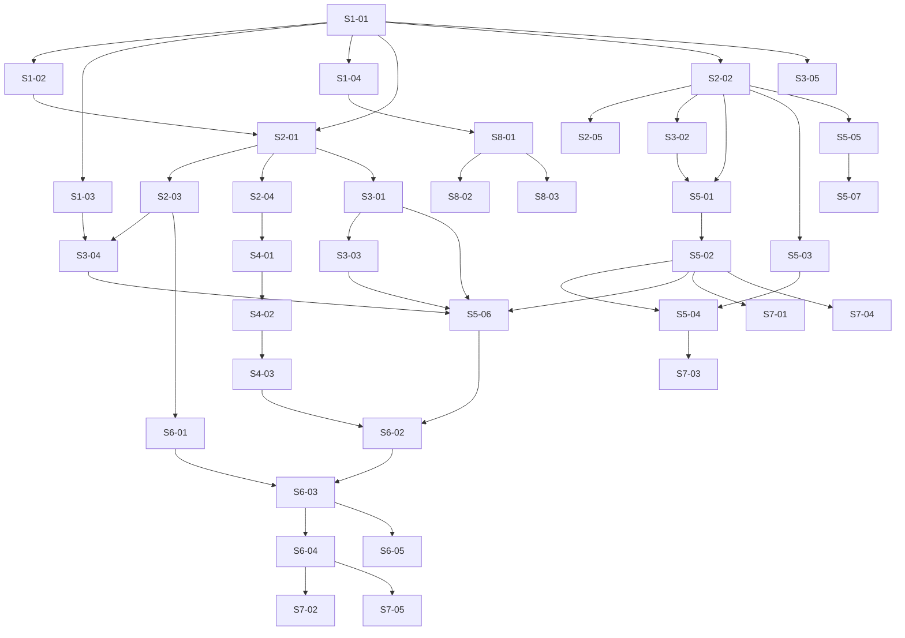

# Phase 08 — Hierarchical Planner + pre-rendered hot views: Stories manifest

**Status:** Backlog generated; ready for autonomous implementation
**Date:** 2026-05-21
**Phase architecture:** [../phase-arch-design.md](../phase-arch-design.md)
**Phase ADRs:** [../ADRs/](../ADRs/)
**Implementation plan:** [../High-level-impl.md](../High-level-impl.md)
**Source design:** [../final-design.md](../final-design.md)

## Executive summary

37 stories across the 8 implementation steps of [High-level-impl.md](../High-level-impl.md). Per-step distribution: S1=4, S2=5, S3=5, S4=3, S5=7, S6=5, S7=5, S8=3. The dependency DAG is contracts-first and largely linear across Steps 1→3 (every newtype, sum type, `Protocol`, and frozen Pydantic model lands before any consumer), then forks: Step 4 (the `ConcreteResolution → BundleResolution` adapter, [phase-arch-design §C2](../phase-arch-design.md#c2--concreteresolution--bundleresolution-adapter-codegeniesupervisorbundle_resolution)) and Step 5 (the two leaf packages `codegenie.hotviews` + `codegenie.planner`) are independent of each other; Step 6 (the Supervisor graph) is the integration choke point that joins them; Step 7 closes both exit criteria with measured tests; Step 8 (`codegenie.mcp`) is fully independent of Steps 4–7 and depends only on Step 1. The longest dependency chain is 8 stories (S1-01 → S2-03 → S3-03 → S5-03 → S5-04 → S6-01 → S6-03 → S7-02). The architect's four gaps are first-class stories: Gap 1 (langgraph-free plain-async Supervisor runtime) → S6-02; Gap 2 (`ConcreteResolution → BundleResolution` adapter + the gating S3-01 verification) → S4-01 and S4-02; Gap 3 (`RepoId` newtype) → S1-01; Gap 4 (routing events into the workflow-internal stream) → S3-04. Cross-cutting work — `structlog` logging, `mypy --strict`, the LLM-SDK `import-linter` fence, the bounded ≤24-name public surface — is woven into Step 1 and reasserted in Step 7's CI-gate stories.

## How to use this backlog
1. Start at a story whose dependencies are all satisfied.
2. Open the story file; read Context, References, Goal, Acceptance criteria.
3. Begin with the TDD plan — red/green/refactor. Write the failing test first.
4. Implement just enough to make the test pass.
5. Refactor.
6. Check every acceptance criterion. Update Status from Ready to Done.
7. Move to the next story whose dependencies are now satisfied.

The order within a step is mostly fixed; across steps follows High-level-impl.md's step ordering, with cross-step parallelism wherever the DAG allows.

## Definition of done (applies to every story)
A story is done when:
- [ ] All acceptance criteria are checked.
- [ ] The TDD plan's red test exists, is committed, and is green.
- [ ] Any additional tests required to honor the relevant ADRs are written and green.
- [ ] Code is formatted (`ruff format`), linted clean (`ruff check`), and passes the type check (`mypy --strict`).
- [ ] No existing test was disabled or weakened without an explicit note in the story's "Notes for the implementer" section.
- [ ] The story file's Status is updated to `Done`.
- [ ] If the story modifies any contract documented in an ADR, the ADR's "Consequences" section is reviewed for new follow-ups.

## Dependency DAG (visual)

Direct dependencies only; transitive edges omitted.

## Stories — by step

### Step 1: Land the contract primitives and the runtime substrate
**Step goal:** Add the `RepoId` newtype, stand up Redis + the two new dependencies, and wire the Phase-8 fence allowlist so every later step builds on a typed, fenced foundation.
**Step exit criteria mapping:** foundational — closes none directly; the Redis substrate underwrites exit criterion 2.

| ID | Title (slug → file) | Effort | Depends on | Summary (one sentence) |
|---|---|---|---|---|
| S1-01 | [Add the RepoId newtype to the identifiers module (`S1-01-repoid-newtype`)](S1-01-repoid-newtype.md) | S | — | Add `RepoId = NewType("RepoId", str)` to `types/identifiers.py` and `__all__`, resolving Gap 3 (free `NewType`; the `owner/name` grammar lift is deferred to Phase 10). |
| S1-02 | [Stand up the Redis 7 substrate and the redis client dependency (`S1-02-redis-substrate`)](S1-02-redis-substrate.md) | S | S1-01 | Add a `redis:7-alpine` service to `docker-compose.yml` (`:6379`, no AOF, no replication) and the `redis>=5` client to `pyproject.toml`, verified by a redis-py ping. |
| S1-03 | [Pin the mcp SDK and the LLM-SDK import-linter fence group (`S1-03-mcp-dep-and-import-fence`)](S1-03-mcp-dep-and-import-fence.md) | S | S1-01 | Pin a concrete `mcp` SDK version in `pyproject.toml` (Open Question 8) and add the `import-linter` contract group forbidding LLM SDKs from `codegenie.hotviews`/`.mcp`/`.supervisor`/`.planner.routing`. |
| S1-04 | [Enumerate the Phase-8 wiring allowlist and gather-closure fence (`S1-04-phase8-fence-allowlist`)](S1-04-phase8-fence-allowlist.md) | S | S1-01 | Add a `tests/fence/` entry enumerating the Phase-8 wiring (four package imports, the `docker-compose.yml` redis line, the `pyproject.toml` `redis`/`mcp` rows) and a fence test confirming the four new packages stay outside the `test_pyproject_fence.py` gather-runtime closure. |

### Step 2: Declare the hot-view data model and the Supervisor/routing sum types
**Step goal:** Land every frozen Pydantic contract — hot-view slices, `SupervisorDecision`, `TriggerProvenance`, `PlanningRoute`, `RouteDecision` — as pure declarations before any consumer.
**Step exit criteria mapping:** foundational — the slice models underwrite exit criterion 2; the routing models underwrite exit criterion 1.

| ID | Title (slug → file) | Effort | Depends on | Summary (one sentence) |
|---|---|---|---|---|
| S2-01 | [Declare the SupervisorDecision three-variant sum type (`S2-01-supervisor-decision-union`)](S2-01-supervisor-decision-union.md) | S | S1-01 | Declare the frozen `Dispatched \| MultiPluginDispatch \| EscalatedToHITL` discriminated `SupervisorDecision` union and `PluginWorkItem`, with the `>= 2` `field_validator` on `MultiPluginDispatch.work_items` (08-ADR-0002). |
| S2-02 | [Declare the hot-view slice model and HotViewKey (`S2-02-hot-view-slice-model`)](S2-02-hot-view-slice-model.md) | S | S1-01 | Declare `HotViewSliceName` `Literal`, `HotViewKey` with `redis_key()` returning `hotview:{repo}:{slice}:v{n}`, `HotViewSlice` (`gather_id`- and `slice_schema_version`-stamped), and the four per-slice payload models (08-ADR-0003/0004). |
| S2-03 | [Declare the TriggerProvenance sum type and SupervisorState (`S2-03-trigger-provenance-and-state`)](S2-03-trigger-provenance-and-state.md) | S | S2-01 | Declare the `SingleTaskTrigger \| BothProvenanceTrigger` `TriggerProvenance` union (with the `>= 2` validator on `implicated_task_classes`, edge case 14) and the frozen `SupervisorState` model. |
| S2-04 | [Declare the PlanningRoute enum and RouteDecision model (`S2-04-planning-route-and-route-decision`)](S2-04-planning-route-and-route-decision.md) | S | S2-01 | Declare the `PlanningRoute` `StrEnum` (`RECIPE`/`RAG`/`LLM`) and the frozen `RouteDecision` model with `confidence` and `candidates_considered`. |
| S2-05 | [Declare the RenderReport model (`S2-05-render-report-model`)](S2-05-render-report-model.md) | S | S2-02 | Declare the frozen `RenderReport` model (`rendered_slices`, `failed_slices`, `gather_id`) the renderer returns on partial-failure (edge case 7). |

### Step 3: Declare the planner ports and extend the event union
**Step goal:** Land the hexagonal `Protocol` boundary and the two additive routing-event variants so the planner and store have their seams fixed before any logic.
**Step exit criteria mapping:** the event variants are the load-bearing half of exit criterion 1.

| ID | Title (slug → file) | Effort | Depends on | Summary (one sentence) |
|---|---|---|---|---|
| S3-01 | [Declare the planner ports and result models (`S3-01-planner-ports`)](S3-01-planner-ports.md) | S | S2-01 | Declare the `RecipeMatchPort`, `SolvedExampleRagPort`, and `LeafLlmPort` `Protocol`s plus the `RecipeMatch` / `RagHit` result models (08-ADR-0011 hexagonal boundary). |
| S3-02 | [Declare the ColdStoreReader port (`S3-02-cold-store-reader-port`)](S3-02-cold-store-reader-port.md) | S | S2-02 | Declare the `ColdStoreReader` `Protocol` in `hotviews/store.py` — the fail-closed cold-storage seam that reads the same `RepoContext` artifact the renderer rendered from (08-ADR-0006). |
| S3-03 | [Ship the NullRagPort concrete adapter (`S3-03-null-rag-port`)](S3-03-null-rag-port.md) | S | S3-01 | Ship `NullRagPort` — the Phase-8 concrete `SolvedExampleRagPort` (KG arrives Phase 11) — with a `Protocol`-assignment test confirming it structurally satisfies the port. |
| S3-04 | [Add the RouteDecided/RouteDescended event variants (`S3-04-route-event-variants`)](S3-04-route-event-variants.md) | S | S1-03, S2-03 | Add the `RouteDecided` and `RouteDescended` `Literal`-tagged variants to the `WorkflowInternalEvent` union, `_INTERNAL_CLASSES`, and `__all__` — workflow-scoped, not the BLAKE3-chained spanning stream (Gap 4, 08-ADR-0007/0008). |
| S3-05 | [Declare per-package warning IDs validated at import (`S3-05-package-warning-ids`)](S3-05-package-warning-ids.md) | S | S1-01 | Declare each new package's module-level `_WARNING_IDS: Final[frozenset[str]]` validated at import via `raise AssertionError(...)`, conforming to the `^[a-z][a-z0-9_]*\.[a-z][a-z0-9_]*$` regex (Phase 1 ADR-0007). |

### Step 4: Build the ConcreteResolution → BundleResolution adapter (C2)
**Step goal:** Bridge the resolver's output type to `BundleBuilder.build`'s input Protocol, failing loud if the resolver still hands the `ComposedTccm` placeholder.
**Step exit criteria mapping:** foundational — unblocks the Bundle-building path Step 6 (and therefore exit criterion 1) depends on.

| ID | Title (slug → file) | Effort | Depends on | Summary (one sentence) |
|---|---|---|---|---|
| S4-01 | [Verify the resolver TCCM handoff and route S3-01 if unmet (`S4-01-resolver-tccm-handoff-verification`)](S4-01-resolver-tccm-handoff-verification.md) | S | S2-04 | Verify against `plugins/resolver.py` whether `resolve` hands the real `codegenie.plugins.tccm.TCCM` or the `ComposedTccm` placeholder, recording the result in the attempt log and routing the S3-01 substitution loudly as a Phase-8 prerequisite if unmet (Gap 2 / Open Question 1). |
| S4-02 | [Build the to_bundle_resolution adapter (`S4-02-to-bundle-resolution-adapter`)](S4-02-to-bundle-resolution-adapter.md) | M | S4-01 | Build `ResolvedBundleInput` and the pure `to_bundle_resolution(ConcreteResolution) -> ResolvedBundleInput`, mapping each `Adapter` object to its `AdapterDispatch` callable so the result structurally satisfies the shipped `BundleResolution` Protocol (08-ADR-0009). |
| S4-03 | [Fail loud on the resolver placeholder with ResolverTccmPlaceholder (`S4-03-resolver-tccm-placeholder-error`)](S4-03-resolver-tccm-placeholder-error.md) | S | S4-02 | Raise the typed `ResolverTccmPlaceholder` error when `composed_tccm` is still the placeholder (empty `provides`/`requires`, no `must_read` band) — never silently builds an empty Bundle (edge case 2). |

### Step 5: Implement the HotViewStore, renderer, and PlannerNode routing core
**Step goal:** Build the warm-path read path (store + renderer) and the fixed three-step routing pipeline — the two leaf packages the supervisor will compose.
**Step exit criteria mapping:** Step 5 closes the read-path half of exit criterion 2 (`HotViewStore.get_all`) and the routing half of exit criterion 1 (`PlannerNode.route` + append-before-transition).

| ID | Title (slug → file) | Effort | Depends on | Summary (one sentence) |
|---|---|---|---|---|
| S5-01 | [Implement the HotViewStore Redis read path (`S5-01-hot-view-store-read`)](S5-01-hot-view-store-read.md) | M | S2-02, S3-02 | Implement `HotViewStore.get` / `get_all` as one pipelined Redis round-trip of four `GET`s, where `get` always returns a `HotViewSlice` (never `None`) for a branchless warm path (08-ADR-0005). |
| S5-02 | [Add hot-view integrity verification and cold-storage fail-closed (`S5-02-hot-view-integrity-fallback`)](S5-02-hot-view-integrity-fallback.md) | M | S5-01 | Verify the `(repo, slice, gather_id, slice_schema_version)` binding on every read and fall closed to `ColdStoreReader` on stale / tampered / version-drift / `ConnectionError` (edge cases 4, 5, 6; 08-ADR-0003). |
| S5-03 | [Implement the pure render_hot_views function (`S5-03-render-hot-views`)](S5-03-render-hot-views.md) | M | S2-02 | Implement the pure `render_hot_views` deriving the four slices from `RepoContext` + the union of `must_read` queries across `active_tccms`, golden-tested for byte-identical re-render (ADR-0029). |
| S5-04 | [Implement the invalidates matcher and write_hot_views shell (`S5-04-invalidates-and-write`)](S5-04-invalidates-and-write.md) | M | S5-03, S5-02 | Implement the pure `invalidates` matcher (100% branch coverage, property-tested monotone) mapping changed probes to slices, and the shell `write_hot_views` doing one atomic `HSET` per slice → `RenderReport` (edge case 7). |
| S5-05 | [Implement the PlannerNode three-step routing pipeline (`S5-05-planner-node-routing`)](S5-05-planner-node-routing.md) | M | S2-02 | Implement `PlannerNode` with the fixed `tuple[(PlanningRoute, port-callable), ...]` recipe→RAG→LLM pipeline — first hit wins, fallthrough is `LLM`, 100% branch coverage over the selection (08-ADR-0011). |
| S5-06 | [Append RouteDecided before the routing transition (`S5-06-route-decided-append-before-transition`)](S5-06-route-decided-append-before-transition.md) | M | S3-01, S3-03, S3-04, S5-02 | Wire `PlannerNode.route` to read `HotViewStore.get_all` and append `RouteDecided` via `emit_internal` **before** returning the `RouteDecision` — the append is a precondition of the transition (exit criterion 1). |
| S5-07 | [Wire the gather-tail hot-view render callback (`S5-07-gather-tail-render-callback`)](S5-07-gather-tail-render-callback.md) | S | S5-05 | Wire a thin detached-task callback at the gather pipeline's tail that fires `render_hot_views` + `write_hot_views`, keeping the renderer package outside the gather-runtime closure (edge case 16). |

### Step 6: Assemble the Supervisor graph and the pure decide() core
**Step goal:** Wire the three-node `resolve → build_bundle → route` Supervisor and the pure `decide()` function that maps `(provenance, resolution, bundle, route)` to a `SupervisorDecision`.
**Step exit criteria mapping:** Step 6 closes exit criterion 1 by construction — the static AST test asserts no routing edge skips the `RouteDecided` append.

| ID | Title (slug → file) | Effort | Depends on | Summary (one sentence) |
|---|---|---|---|---|
| S6-01 | [Implement the pure decide() core (`S6-01-pure-decide-core`)](S6-01-pure-decide-core.md) | M | S2-03 | Implement the pure `decide()` mapping `(provenance, resolutions, bundles, routes)` to `Dispatched` / `MultiPluginDispatch` / `EscalatedToHITL` via `match` + `assert_never`, with a totality property test and a functional-core purity AST test. |
| S6-02 | [Build the plain-async Supervisor graph and three nodes (`S6-02-supervisor-graph-plain-async`)](S6-02-supervisor-graph-plain-async.md) | M | S4-03, S5-06 | Build `build_supervisor_graph` / `run_supervisor` as a plain async pipeline of `resolve_node` → `build_bundle_node` → `route_node` sharing a frozen `SupervisorState` advanced by `model_copy(update=...)` — no langgraph dep (Gap 1, 08-ADR-0001 Option B). |
| S6-03 | [Wire the BothProvenanceTrigger multi-plugin branch (`S6-03-both-provenance-branch`)](S6-03-both-provenance-branch.md) | M | S6-01, S6-02 | Wire the `BothProvenanceTrigger` branch to resolve each implicated task class, build a `Bundle` + `RouteDecision` per resolution, and emit a `MultiPluginDispatch` (edge case 3, ADR-0042). |
| S6-04 | [Dispatch the Dispatched payload into the SHERPA subgraph (`S6-04-subgraph-handoff`)](S6-04-subgraph-handoff.md) | S | S6-03 | Hand the `Dispatched` payload's frozen `Bundle` and `RouteDecision` into the Phase-6 SHERPA subgraph's initial `SubgraphState` (`bundle` / `resolution` accumulator fields). |
| S6-05 | [Add the static append-before-transition AST test (`S6-05-append-before-transition-ast-test`)](S6-05-append-before-transition-ast-test.md) | S | S6-03 | Add a static AST test asserting no routing edge in `route_node` is reachable on a code path that skips the `RouteDecided` append — exit criterion 1, proven by construction. |

### Step 7: Close the exit criteria — latency, decision-log completeness, and adversarial gates
**Step goal:** Prove both exit criteria with measured tests and lock the security/audit properties.
**Step exit criteria mapping:** closes exit criterion 1 (decision-log completeness e2e + adversarial) and exit criterion 2 (measured `p95 < 50 ms` bench + e2e).

| ID | Title (slug → file) | Effort | Depends on | Summary (one sentence) |
|---|---|---|---|---|
| S7-01 | [Add the hot-view latency bench canary (`S7-01-hot-view-latency-bench`)](S7-01-hot-view-latency-bench.md) | S | S5-02 | Add the `@pytest.mark.bench` canary asserting `HotViewStore.get_all` `p95 < 50 ms` against a real `redis:7-alpine`, plus a second bench asserting warm-path Supervisor overhead `p95 < 5 ms` (exit criterion 2 canary). |
| S7-02 | [Add the phase08_e2e latency and routing tests (`S7-02-phase08-e2e-tests`)](S7-02-phase08-e2e-tests.md) | M | S6-04 | Add the two `@pytest.mark.phase08_e2e` tests — a fixture vuln-remediation workflow asserting `RouteDecided` is in the internal stream (exit criterion 1), and a 200-call latency e2e asserting `p95 < 50 ms` (exit criterion 2). |
| S7-03 | [Add the warm/cold-equivalence property test (`S7-03-warm-cold-equivalence-property`)](S7-03-warm-cold-equivalence-property.md) | M | S5-04 | Add a Hypothesis property test proving a hot-view-served read and a cold-storage read produce byte-identical planner context — the cache changes only latency, never the answer (Open Question 6). |
| S7-04 | [Add the Redis-tamper fail-closed adversarial tests (`S7-04-redis-tamper-adversarial`)](S7-04-redis-tamper-adversarial.md) | M | S5-02 | Add adversarial tests writing a wrong-`gather_id` value and attacker-controlled `risk_flags` bytes, asserting cold-storage fallback, the mismatch signal, and byte-identical planner context to the no-tamper run (edge case 5). |
| S7-05 | [Add the decision-log completeness adversarial test and RouteDescended wiring (`S7-05-decision-log-completeness`)](S7-05-decision-log-completeness.md) | M | S6-04 | Add an adversarial test asserting exactly N `RouteDecided` events for N fixture workflows, and wire `RouteDescended` emission where Phase 4's `FallbackTier` descends so misprediction rate is a measured number (edge case 8). |

### Step 8: Ship the MCP Skills server
**Step goal:** Serve Skill manifests to the planner over an `mcp` SDK stdio process with a snapshot-pinned tool surface.
**Step exit criteria mapping:** foundational — required for phase completeness per `roadmap.md` §Phase 8 ("the Skills server runs as a local MCP stdio process"); closes neither exit-criteria sentence directly.

| ID | Title (slug → file) | Effort | Depends on | Summary (one sentence) |
|---|---|---|---|---|
| S8-01 | [Implement the transport-agnostic SkillsMcpServer core (`S8-01-skills-mcp-server-core`)](S8-01-skills-mcp-server-core.md) | M | S1-04 | Implement `SkillsMcpServer` whose `start()` builds the in-memory index once (calling the shipped `SkillsLoader.load_all()`, indexing by `(task_class, language)`) and whose `list_skills` / `get_skill` are dict lookups returning `SkillManifest`s — no body inlined, no side effects in the constructor. |
| S8-02 | [Serve the MCP stdio transport and pin the contract snapshot (`S8-02-mcp-stdio-and-contract`)](S8-02-mcp-stdio-and-contract.md) | M | S8-01 | Implement `serve_skills_stdio` on an `mcp` SDK `Server` with exactly two read-only tools (`list_skills`, `get_skill`), pin `MCP_SKILLS_CONTRACT`, and add the `tests/golden/mcp/` snapshot test + a real stdio roundtrip integration test (08-ADR-0012). |
| S8-03 | [Harden SkillId with a traversal-rejecting smart constructor (`S8-03-skill-id-smart-constructor`)](S8-03-skill-id-smart-constructor.md) | S | S8-01 | Harden `SkillId` with a regex smart constructor so a traversal-shaped ID (`../../etc/passwd`) is rejected with a typed error before any filesystem touch (edge case 12). |

## Cross-cutting concerns
- **`structlog` logging with regex-validated IDs.** Every component logs through `structlog` (the codebase convention). Each new package declares a module-level `_WARNING_IDS: Final[frozenset[str]]` validated at import via `raise AssertionError(...)` against `^[a-z][a-z0-9_]*\.[a-z][a-z0-9_]*$` (S3-05); hot-view integrity misses, Redis fallbacks, `RouteDescended` events, and MCP-process death all log explicitly — never silent (Rule 12).
- **`mypy --strict` and `ruff` from day one.** `mypy --strict src/` and `ruff` (`C901` ≤ 8) are in every story's done-criteria, not deferred — contracts land before consumers (Steps 1–3) precisely so the type check is a real gate from Step 2 onward.
- **The LLM-SDK fence and the gather-closure fence.** `import-linter` forbids LLM SDKs from `codegenie.hotviews`/`.mcp`/`.supervisor`/`.planner.routing` (S1-03); a `tests/fence/` entry confirms the four new packages stay outside the `test_pyproject_fence.py` gather-runtime closure (S1-04, re-checked after S5-07 wires the gather-tail callback).
- **The bounded public surface.** ≤ 24 exported names across the four new packages, tracked from S2-01 onward; package internals stay behind each package `__all__`. Exceeding 24 must be surfaced as a deliberate decision in the attempt log, never silently widened.

## Exit-criteria coverage
| Exit criterion (verbatim or close) | Story / stories |
|---|---|
| "The planner makes the recipe/RAG/LLM decision and the chosen path is logged on every workflow." | S2-04 (`PlanningRoute`/`RouteDecision`), S3-04 (event variants), S5-05 (`PlannerNode` pipeline), S5-06 (append-before-transition), S6-05 (static AST test — no routing edge skips the append), S7-02 (`phase08_e2e` routing test), S7-05 (decision-log completeness adversarial test) |
| "Hot views serve agent context in <50ms p95." | S1-02 (Redis substrate), S2-02 (slice models), S5-01 (`HotViewStore.get_all` one pipelined round-trip), S7-01 (`@pytest.mark.bench` canary), S7-02 (`phase08_e2e` latency test — measured `p95 < 50 ms`) |

## Open implementation questions
- **Resolver → BundleBuilder TCCM handoff (gating prerequisite).** Whether `resolver.resolve` hands the real `TCCM` or the `ComposedTccm` placeholder — first arises in **S4-01**, which records the verification and routes the S3-01 substitution loudly if unmet (Open Question 1 / Gap 2).
- **Supervisor graph engine.** Plain async pipeline vs `langgraph` — resolved by 08-ADR-0001 Option B (plain async); the implementer confirms and binds `SupervisorGraph` accordingly in **S6-02** (Open Question 2 / Gap 1).
- **`MultiPluginDispatch` sequencing depth.** How much cross-PR sequencing (ordering, shared evidence, status rollup) Phase 8 implements vs defers to Phase 10 — a scoping call first arising in **S6-03**; Phase 8 ships the typed shape, not the deep sequencing (Open Question 3).
- **`NullRagPort` vs a two-step chain.** Whether the null RAG branch creates dead-test maintenance burden — first arises in **S3-03**; the three-step shape is preferred for 08-ADR-0011 fidelity, a two-step chain is the named escape hatch (Open Question 4).
- **Hot-view debounce under churn.** Whether `render_hot_views` needs a per-`RepoId` debounce to cap render amplification — a tuning parameter first arising in **S5-07**, validated against real push-frequency data, not a Phase-8 blocker (Open Question 5).
- **Cold-storage read-path identity.** Whether the `ColdStoreReader` reads the exact `RepoContext` artifact the renderer rendered from — first arises in **S3-02**, must be confirmed before the **S7-03** warm/cold-equivalence property test (Open Question 6).
- **`RepoId` grammar.** Whether `RepoId` carries an `owner/name` grammar and a smart-constructor lift — first arises in **S1-01**; deferred to Phase 10 Discovery, shipped as a free `NewType` (Open Question 7).
- **`mcp` SDK version pin.** The specific `mcp` version pinned in `pyproject.toml` — first arises in **S1-03**; the `MCP_SKILLS_CONTRACT` snapshot (S8-02) guards drift, but the initial pin is a deliberate choice the implementer confirms installs cleanly under Python 3.11/3.12 (Open Question 8).

## Backlog stats
- Total stories: 37
- Stories per step: S1=4, S2=5, S3=5, S4=3, S5=7, S6=5, S7=5, S8=3
- Effort distribution: S = 21, M = 16, L = 0
- Longest dependency chain: 8 stories (S1-01 → S2-03 → S3-03 → S5-03 → S5-04 → S6-01 → S6-03 → S7-02)
