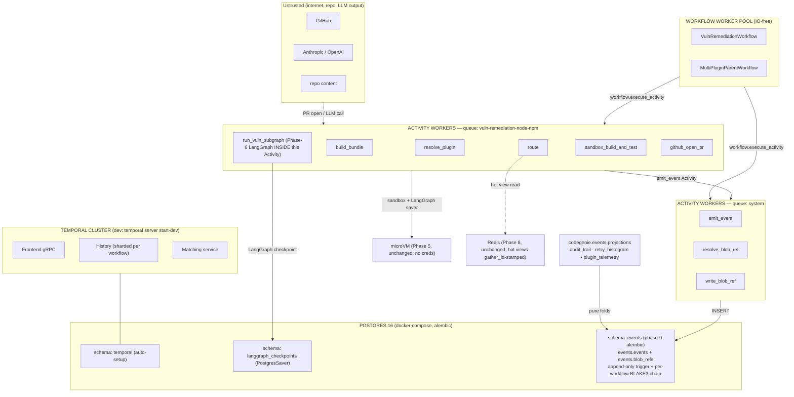
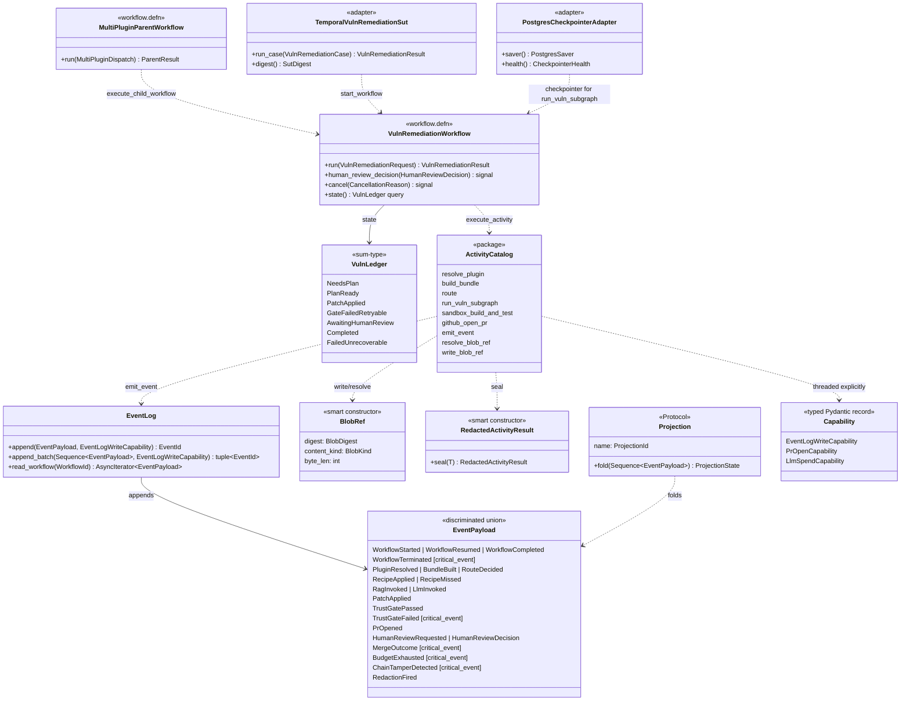
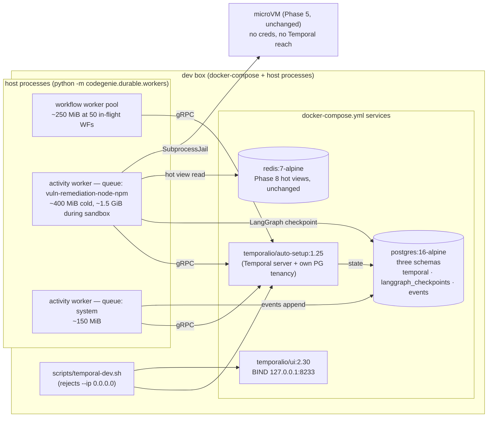
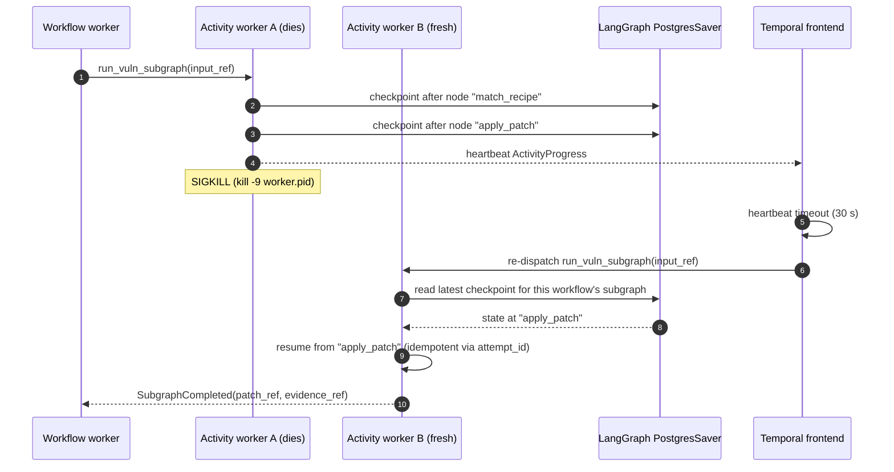
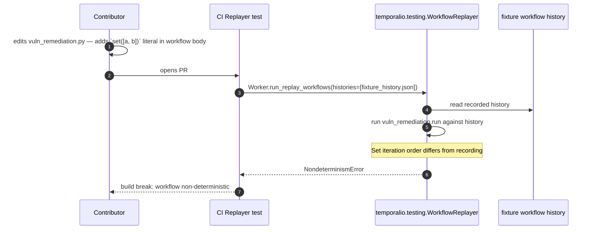

# Phase 09 — Durable workflow envelope: Temporal: Architecture

**Status:** Architecture spec
**Date:** 2026-05-23
**Inputs:** `final-design.md` (synthesized) · `critique.md` · `docs/production/design.md` · `docs/roadmap.md` · `docs/production/adrs/0003`, `0009`, `0012`, `0016`, `0033`, `0034`, `0042`, `0043`
**Audience:** the engineer implementing this phase

## Executive summary

Phase 9 wraps the existing Phase-6 SHERPA loop and Phase-8 Supervisor in a Temporal workflow envelope so workflows survive worker SIGKILL and dev-cluster restart byte-identically. The substrate is **one** Postgres 16 instance with three written-owner schemas (`temporal` owned by the `auto-setup` image; `langgraph_checkpoints` owned by upstream `langgraph-checkpoint-postgres`; `events` owned by phase-9 alembic), the Temporal dev server, `temporal-ui` bound to `127.0.0.1:8233`, and two worker pools (one workflow-only, two activity task queues — `vuln-remediation-node-npm` and `system`). The load-bearing shape choice is asymmetric: the **Phase-8 Supervisor**'s three nodes map 1:1 to Activities ([P]/[B] shape) because Phase 8 was designed to be the Temporal seam, while the **Phase-6 SHERPA subgraph** runs *inside one fat `run_vuln_subgraph` Activity* ([S] shape) because the Phase-6 `SutDigest` contract depends on the in-process LangGraph checkpoint structure (G5). The canonical event log ([ADR-0034](../../production/adrs/0034-event-sourcing-canonical-primitive.md)) lands operationally as 21 typed Pydantic event variants with a **per-workflow** BLAKE3 prev-hash chain (not global — the critic destroyed the global chain on its serial-bottleneck attack) and three real projections (no Phase-13 stubs — [ADR-0043](../../production/adrs/0043-extension-by-addition-means-no-silent-edits.md) cleanliness). Phase 9 also ships `MultiPluginParentWorkflow` for [ADR-0042](../../production/adrs/0042-multi-plugin-coordination-for-both-workflows.md)'s `Both`-case so Phase 10 lands additively.

## Goals

Verifiable; pulled from `final-design.md §Goals` (G1–G11) and roadmap §249 exit criteria:

1. **G1 — Durability.** `tests/durability/test_kill_worker_resume.py` + `test_temporal_cluster_restart.py` reach byte-identical terminal `VulnLedger` state across N kill offsets; runs in `make test`, *not* behind `@pytest.mark.e2e`.
2. **G2 — `temporal-ui` on `127.0.0.1:8233`.** `tests/fence/test_temporal_ui_loopback.py` greps every checked-in script for `0.0.0.0`; `scripts/temporal-dev.sh` rejects `--ip 0.0.0.0`.
3. **G3 — Zero application-level retry loops.** `import-linter` + `forbidden-patterns` regex over `src/codegenie/durable/workflows/*.py`; all retries flow through the module-level `Final` `RetryPolicy` table in `codegenie.durable.activities.retry_policies`.
4. **G4 — Workflow body deterministic at the import level.** `import-linter` contract `codegenie.durable.workflows-must-be-pure` + AST fence + `Replayer`-based CI test.
5. **G5 — `SutDigest` invariance across the Temporal wrap.** `tests/durability/test_sut_digest_invariance.py` runs every Phase-6 canonical case through both `LocalVulnRemediationSut` and `TemporalVulnRemediationSut` and asserts byte-equal digests under `freezegun`.
6. **G6 — Event-log append throughput.** ≥ 3,000 events/sec sustained portfolio-wide from 5 activity workers; p95 commit latency ≤ 15 ms including per-workflow BLAKE3 chain compute.
7. **G7 — Audit completeness.** `TrustGatePassed`, `TrustGateFailed`, `LlmInvoked`, `RecipeApplied`, `PrOpened`, `MergeOutcome`, `WorkflowTerminated` land in `events.events` within 5 s of the underlying activity completion; 0 silent drops — drops surface as per-workflow BLAKE3 chain gaps at projection time.
8. **G8 — Workflow-history compactness.** Activity input/output > 8 KiB rides `BlobRef(digest, store)`; per-workflow history ≤ 30 events nominally, ≤ 200 worst-case.
9. **G9 — Per-task-queue credential blast radius.** Compromise of *one* activity worker cannot (a) open PRs outside the active workflow's allowlist; (b) write events of a `kind` outside its task queue's allowlist; (c) signal/terminate a workflow on a different task queue. Verified by `tests/adv/test_worker_credential_blast_radius.py`.
10. **G10 — Alembic supply-chain integrity.** `tools/alembic-revisions.lock` SHA-pins every file under `src/codegenie/events/alembic/versions/`; CI verifies; `migrations_role` has DDL on `events` schema only, no DML on application tables, no `CREATE EXTENSION` outside the `{pg_stat_statements}` allowlist; schema-snapshot diff in CI.
11. **G11 — `$/PR` regression: zero.** Phase 9 adds zero LLM calls; the cassette-replay durability test asserts `total_tokens == 0`.

## Non-goals

- **Production Temporal cluster topology (3-server-pod HA + mTLS namespace isolation).** Phase 9 ships dev-mode (`temporal server start-dev`); HA is Phase 16. Surfaced because [ADR-0003](../../production/adrs/0003-temporal-as-workflow-substrate.md) names "3 server pods, 5–10 worker pods, autoscaling" and we are *not* shipping that here.
- **`pgcrypto` column encryption on `events.payload`.** Critic-5 on [S] was decisive: every projection holds the decryption key, so column-encryption is decorative against the only read path that consumes payload data. Encryption-at-rest delegated to the volume layer (LUKS/TDE) in Phase 16. Recorded in phase ADR-0009.
- **HMAC-signed capability tokens.** Critic correctly attacked [S]: anyone with the worker mount has the HMAC key, so non-forgeability is illusory. The trust root is task-queue partitioning + K8s ServiceAccount; the Capability type is the *auditable interface*, not the cryptographic primitive. Recorded in phase ADR-0008.
- **`TemporalPort` / durable-execution Port abstraction.** Single substrate in sight; pre-paying premature pluggability for a substrate swap that ADR-0003 already costed as "Medium reversibility" is exactly the toolkit anti-pattern. ADR-0003's reversibility cost is acknowledged; not amortized here.
- **`cost_ledger_v1` stub.** Critic-5 on [B]: any Phase-13 stub raising `NotImplementedError` is a silent-edit-reservation that violates ADR-0043. Phase 13 lands its cost-ledger projection additively (new file, new test, new registry row) because Phase 9 already ships the `LlmInvoked.cost_usd` and `BudgetExhausted` events Phase 13 will fold.
- **`pgbouncer` in front of Postgres.** Critic showed [P]'s `pgbouncer transaction-mode + statement_cache_size=0` choice broke the `COPY ... FROM STDIN BINARY` story it was meant to feed. One shared `psycopg_pool.AsyncConnectionPool` per worker is the Phase-9 design; pgbouncer is deferred to Phase 16 only if connection count actually saturates.
- **N×M task-queue sprawl.** Phase 9 ships two queues (`vuln-remediation-node-npm` + `system`); Phase 7.5/10 *add* by addition. Recorded in phase ADR-0007.
- **Continue-as-new for long-running activities.** `run_vuln_subgraph` ships with a 20-minute timeout; if it ever bites, Phase 10 introduces continue-as-new. Open question #1 in `final-design.md`.
- **Parallel-running Phase-8 `codegenie.plugins.events` log indefinitely.** Phase 9 ships a *one-way emitter* from inside `run_vuln_subgraph` into the canonical log; Phase 10's first commit deletes the old log per the 30-day-drain policy in phase ADR-0002.

## Architectural context

Phase 9 sits at the **outermost** layer of the codewizard-sherpa Layered Hybrid Orchestrator (`docs/production/design.md §1`): the Temporal envelope wrapping the SHERPA-disciplined Layer-2 subgraph and the Trust-Aware Layer-3 gates. Until Phase 9, the codebase runs everything in one Python process with a SQLite checkpointer ([ADR-0016](../../production/adrs/0016-checkpointer-backend.md) default); Phase 9 makes the workflow *the* durable unit — surviving `SIGKILL` of any worker and `temporal kill && temporal start` of the dev cluster. Inside that envelope, [ADR-0034](../../production/adrs/0034-event-sourcing-canonical-primitive.md) (event-sourcing as canonical primitive) lands operationally: Temporal workflow history is the workflow-scoped event store; the new Postgres `events.events` table is the workflow-spanning side-channel.



## 4+1 architectural views

### Logical view — what are the components and how are they related?



**Central abstractions vs scaffolding.** The five load-bearing types are the **VulnLedger sum-type** (Phase 6, intact; workflow state never branches on booleans), **EventPayload discriminated union** (the 21-variant typed log, `frozen=True, extra="forbid"` everywhere, `match` + `assert_never` enforced by `mypy --strict`), the **smart-constructed BlobRef + RedactedActivityResult** (the only legal way to produce a payload-by-reference or an activity return value — the construction path *is* the validation path), the **explicit Capability threading** (no `ContextVar`; max 3 frames worker → activity wrapper → side-effect site), and the **Projection Protocol** (pure folds, no Postgres needed for unit tests). Everything else — workers, docker-compose, alembic, retry-policy tables — is scaffolding around those five.

### Process view — what happens at runtime?

```mermaid
sequenceDiagram
    autonumber
    participant CLI as CLI / Temporal client
    participant TF as Temporal frontend
    participant WW as Workflow worker
    participant VAW as Activity worker (vuln-remediation-node-npm)
    participant SAW as Activity worker (system)
    participant PG as Postgres (events schema)
    participant LG as LangGraph PostgresSaver
    participant SBX as microVM (Phase 5)

    CLI->>TF: start_workflow(VulnRemediationWorkflow, request)
    TF->>WW: dispatch (sticky queue)
    WW->>WW: workflow body: emit WorkflowStarted (batched)
    WW->>SAW: execute_activity("emit_event", batch)
    SAW->>PG: COPY ... FROM STDIN BINARY (12 events)
    WW->>VAW: execute_activity("resolve_plugin", input)
    VAW-->>WW: ResolvePluginOutput
    WW->>VAW: execute_activity("build_bundle", resolution)
    VAW->>SAW: write_blob_ref (bundle > 8 KiB)
    SAW->>PG: INSERT INTO events.blob_refs
    VAW-->>WW: BundleBuilt (BlobRef)
    WW->>VAW: execute_activity("route", bundle_ref)
    VAW-->>WW: RouteDecision(recipe)
    WW->>VAW: execute_activity("run_vuln_subgraph", input_ref)
    Note over VAW,LG: Phase-6 LangGraph runs INSIDE this single Activity.<br/>Heartbeats every 5s. Checkpoints to LG saver per node.
    VAW->>LG: checkpoint per LangGraph node
    VAW->>SBX: SubprocessJail.build_and_test
    SBX-->>VAW: BuildResult + TestResult
    VAW->>SAW: emit_event(TrustGatePassed, RecipeApplied, PatchApplied) [batched]
    VAW-->>WW: SubgraphCompleted(patch_ref, evidence_ref)
    WW->>VAW: execute_activity("github_open_pr", patch_ref, evidence_ref)
    VAW-->>WW: PrOpened
    WW->>WW: workflow.wait_condition(human_review_decision received)
    Note over WW: Days pass. Workflow checkpointed; worker may die and resume.
    CLI->>TF: signal(human_review_decision)
    TF->>WW: resume
    WW->>SAW: emit_event(MergeOutcome) [SYNCHRONOUS — @critical_event]
    SAW->>PG: INSERT (sync), per-workflow chain compute
    WW->>WW: emit WorkflowCompleted (batched)
    WW-->>TF: workflow complete
```

**Concurrency, blocking, durable checkpoints.** The **workflow worker** is cooperative-async, single-threaded per workflow, IO-free; it never blocks on Postgres or LLMs. All blocking work runs in **activity workers** on the appropriate task queue (`vuln-remediation-node-npm` for repo-shaped side-effects; `system` for event-log + blob-refs). Durability happens at three layers: (1) **Temporal workflow history** captures every `execute_activity` result and `wait_condition` signal — this is what survives workflow-worker SIGKILL; (2) **`langgraph-checkpoint-postgres`** captures every LangGraph node transition inside `run_vuln_subgraph` — this is what survives activity-worker SIGKILL mid-subgraph; (3) **`events.events`** captures every typed event with a per-workflow BLAKE3 chain — this is the audit + projection substrate. The `@critical_event` synchronous-flush vocabulary is exactly five variants (`MergeOutcome`, `BudgetExhausted`, `TrustGateFailed`, `WorkflowTerminated`, `ChainTamperDetected`); everything else rides the 20ms/256-event batched COPY-binary path so the workflow worker never blocks on a non-critical event commit.

### Development view — how is the source code organized?

```mermaid
graph TD
    SRC["src/codegenie/"]

    SRC --> DUR["durable/"]
    DUR --> DURWF["workflows/<br/>vuln_remediation.py<br/>multi_plugin_parent.py"]
    DUR --> DURA["activities/<br/>resolve_plugin.py · build_bundle.py · route.py<br/>run_vuln_subgraph.py · sandbox_build_and_test.py<br/>github_open_pr.py · emit_event.py<br/>resolve_blob_ref.py · write_blob_ref.py<br/>retry_policies.py · __init__.py (@register_activity)"]
    DUR --> DURB["bridge.py<br/>(TemporalVulnRemediationSut)"]
    DUR --> DURC["checkpointer.py<br/>(PostgresCheckpointerAdapter)"]
    DUR --> DURS["sanitizer.py<br/>(RedactedActivityResult.seal)"]
    DUR --> DURW["workers/<br/>__init__.py · build_worker()<br/>main entrypoint: python -m codegenie.durable.workers"]
    DUR --> DURCFG["config.py<br/>(Pydantic Settings)"]

    SRC --> EVT["events/"]
    EVT --> EVTPAY["payloads.py<br/>(21-variant discriminated union)"]
    EVT --> EVTLOG["log.py<br/>(EventLog, EventBatchWriter)"]
    EVT --> EVTBLOB["blob_refs.py"]
    EVT --> EVTPROJ["projections/<br/>audit_trail.py · retry_histogram.py · plugin_telemetry.py<br/>__init__.py (@register_projection)"]
    EVT --> EVTALEMB["alembic/<br/>versions/0001_create_events_schema.py<br/>env.py · README.md"]

    SRC --> TYP["types/identifiers.py<br/>+WorkflowId · EventId · BlobDigest · AttemptId<br/>+CorrelationId · WorkflowSeq · ProjectionId · etc."]

    TESTS["tests/"]
    TESTS --> TFEN["fence/<br/>test_workflow_determinism.py<br/>test_activity_payload_typing.py<br/>test_temporal_ui_loopback.py<br/>test_no_merge_activity.py<br/>test_alembic_schema_snapshot.py"]
    TESTS --> TDUR["durability/<br/>test_kill_worker_resume.py<br/>test_temporal_cluster_restart.py<br/>test_sut_digest_invariance.py"]
    TESTS --> TWF["workflows/<br/>test_replay_determinism.py<br/>test_vuln_remediation_workflow.py<br/>test_multi_plugin_parent_workflow.py"]
    TESTS --> TINT["integration/<br/>test_workflow_e2e_postgres.py<br/>test_per_workflow_chain.py<br/>test_blob_ref_roundtrip.py"]
    TESTS --> TADV["adv/<br/>test_events_append_only_enforcement.py<br/>test_event_chain_tamper_detection.py<br/>test_secret_leakage_in_history.py<br/>test_typed_credential_blocklist.py<br/>test_alembic_revision_lock.py<br/>test_capability_token_scope.py<br/>test_worker_credential_blast_radius.py"]

    INF["infra/docker-compose.dev.yml<br/>scripts/temporal-dev.sh<br/>tools/alembic-revisions.lock"]
```



**Stable contracts vs internal.** Stable contracts: `codegenie.events.payloads.EventPayload` (21 variants — additive only); `codegenie.types.identifiers` Newtypes (additive only); `codegenie.events.projections.Projection` Protocol (frozen); `codegenie.durable.bridge.TemporalVulnRemediationSut` (implements Phase-6's `VulnRemediationSut`); the `@register_activity` / `@register_projection` / `@critical_event` decorators (Open/Closed extension points). Everything else is internal — refactor freely.

### Physical view — where does this code run?



**Reading guide.** Dev shape only. Workers run as **host processes** (not in containers) so `uvloop` + `watchfiles` give a sub-second restart on edit; the containers are only the stateful pieces. The microVM is unchanged from Phase 5: still no credentials, still no Temporal reach. `temporal-ui` binds `127.0.0.1:8233` — `tests/fence/test_temporal_ui_loopback.py` greps for `0.0.0.0` across `scripts/`, `infra/`, and `Makefile`. Production shape (3 server pods, mTLS namespace isolation, autoscaling worker pools) is Phase 16 — out of scope here.

### Scenarios — does it work for the cases that matter?

#### Scenario 1 — Happy path: recipe-route vuln remediation, warm cache, no human pause yet

```mermaid
sequenceDiagram
    autonumber
    participant U as User (CLI)
    participant WC as Temporal client
    participant WW as Workflow worker
    participant VA as Activity worker (vuln-remediation-node-npm)
    participant SA as Activity worker (system)
    participant PG as Postgres events schema
    U->>WC: codegenie run-vuln-remediation
    WC->>WW: start_workflow(VulnRemediationWorkflow, req)
    WW->>SA: emit_event(WorkflowStarted) [batched]
    WW->>VA: resolve_plugin
    VA->>SA: emit_event(PluginResolved) [batched]
    VA-->>WW: ResolvePluginOutput
    WW->>VA: build_bundle
    VA->>SA: write_blob_ref(bundle)
    SA->>PG: INSERT events.blob_refs
    VA->>SA: emit_event(BundleBuilt) [batched]
    VA-->>WW: BundleBuilt(BlobRef)
    WW->>VA: route(bundle_ref)
    VA->>SA: emit_event(RouteDecided) [BATCHED, not synchronous]
    VA-->>WW: RouteDecision(recipe)
    WW->>VA: run_vuln_subgraph(input_ref)
    Note over VA: Phase-6 LangGraph inside; heartbeats per 5s.<br/>Recipe applies; sandbox builds; trust gate passes.
    VA->>SA: emit_event(TrustGatePassed, RecipeApplied, PatchApplied) [batched]
    VA-->>WW: SubgraphCompleted(patch_ref, evidence_ref)
    WW->>VA: github_open_pr
    VA->>SA: emit_event(PrOpened) [batched]
    WW->>WW: wait_condition(human_review_decision)
```

Result: ≈14 Temporal-history records; 12 events emitted (1 sync + 11 batched); 0 tokens; 0 LLM calls; wall-clock ~3 s minus sandbox build.

#### Scenario 2 — Failure path: activity worker SIGKILL mid-`run_vuln_subgraph` → resume on a fresh worker



Detection: 30-s heartbeat timeout. Recovery: Temporal re-dispatches; the LangGraph PostgresSaver provides node-level resume; the activity is idempotent in `attempt_id` so the partially-applied patch is reused rather than re-applied. **This is the G1 exit-criterion test.**

#### Scenario 3 — Adversarial: replay-determinism violation caught by CI Replayer



Detection layers in order of friendliness: (1) `import-linter` contract `codegenie.durable.workflows-must-be-pure` rejects the `random`/`time`/`datetime`/`uuid`/`os`/network module imports outright; (2) AST fence `tests/fence/test_workflow_determinism.py` rejects literal `set(`, `random.*`, `time.*` calls; (3) `Replayer`-based replay test catches transitive non-determinism (LangGraph version drift, dict-iteration changes). Contributor experience: layer 1 fails at `pre-commit`; layer 2 fails at `make test`; layer 3 fails at CI replay. Each strictly later layer catches things the earlier one cannot.

#### Scenario 4 — Adversarial: secret in activity return → typed-credential blocklist rejects at seal time

```mermaid
sequenceDiagram
    autonumber
    participant Dev as Contributor
    participant Act as github_open_pr (activity)
    participant Seal as RedactedActivityResult.seal
    participant CI as mypy --strict + fence
    Dev->>Act: writes "return PrOpenedResult(token=ghp_xxx, pr_url=...)"
    Act->>Seal: seal(PrOpenedResult(token=GitHubToken("ghp_..."), ...))
    Seal->>Seal: layer (a) Pydantic extra="forbid" → field allowed
    Seal->>Seal: layer (b) typed-credential blocklist:<br/>field "token" has type GitHubToken → SealError
    Seal-->>Act: SealError("field 'token' is typed GitHubToken; blocklisted")
    Note over Act: activity raises; Temporal records ActivityFailure;<br/>token NEVER lands in workflow history.
    CI->>CI: tests/fence/test_activity_payload_typing.py also rejects<br/>(return type is not RedactedActivityResult-derived)
```

The load-bearing check is **layer (b)** — typed-credential-class blocklist, *not* regex on field names. The critic showed [S]'s `_(KEY|TOKEN|SECRET)_` regex misses every well-named field (`evidence_digest`, `attempt_id`, `failing_signals`); the *type* of the field is what the seal check uses. The value-shape regexes (`ghp_[A-Za-z0-9]{36}`, `AKIA[0-9A-Z]{16}`, JWT shape, `eyJ...`) are a backstop that also emits a `RedactionFired` event so we learn every contributor's near-miss.

## Component design

### C1 — Workflow definitions (`codegenie.durable.workflows`)

- **Purpose.** Deterministic outer envelopes. One `@workflow.defn` per top-level workflow. Phase 9 ships **two**: `VulnRemediationWorkflow` (the Phase-6 shape, durable-wrapped) and `MultiPluginParentWorkflow` ([ADR-0042](../../production/adrs/0042-multi-plugin-coordination-for-both-workflows.md)'s `Both` case as a real parent/child Temporal shape).
- **Public interface.**
  ```python
  @workflow.defn(name="VulnRemediationWorkflow")
  class VulnRemediationWorkflow:
      @workflow.run
      async def run(self, request: VulnRemediationRequest) -> VulnRemediationResult: ...
      @workflow.signal(name="human_review_decision")
      def human_review_decision(self, decision: HumanReviewDecision) -> None: ...
      @workflow.signal(name="cancel")
      def cancel(self, reason: CancellationReason) -> None: ...
      @workflow.query(name="state")
      def state(self) -> VulnLedger: ...

  @workflow.defn(name="MultiPluginParentWorkflow")
  class MultiPluginParentWorkflow:
      @workflow.run
      async def run(self, dispatch: MultiPluginDispatch) -> ParentResult: ...
  ```
- **Internal structure.** Pure orchestration loop over `VulnLedger` sum-type variants. Each `match` arm calls `workflow.execute_activity(...)` with the per-activity `RetryPolicy` from `codegenie.durable.activities.retry_policies._POLICIES` (module-level `Final` table keyed by activity name). State is tiny: ledger variant + `(WorkflowId, RepoId, CorrelationId, AttemptId)`. Large payloads are `BlobRef`s.
- **Dependencies.** `temporalio`, `pydantic`, `codegenie.events.payloads` (type-only — *not* `codegenie.events.log`; the `import-linter` contract forbids it), `codegenie.types.identifiers`. **Forbidden** in workflow source set: `random`, `time`, `datetime`, `uuid`, `os`, `socket`, `httpx`, `requests`, `redis`, `psycopg`, `asyncpg`, `subprocess`, `codegenie.exec`, `codegenie.transforms`, `codegenie.probes`.
- **State.** Per-workflow: `VulnLedger` variant; counters (`retry_count`, `subgraph_resume_count`); `BlobRef` handles. No mutable globals.
- **Performance envelope.** Workflow-worker steady state ~250 MiB RSS at 50 in-flight workflows; per-workflow Temporal-history ≤ 30 records nominally (G8). Cold-replay of a 200-event history ≤ 1.5 s p95.
- **Failure behavior.** Per-activity `non_retryable` lists include the **tier-descent triggers** (`RecipeMissedError`, `RagMissedError`) — these are *not* retryable; they signal Phase-4 `FallbackTier` descent which the workflow body owns. Hidden assumption #3 from critic-1 on [P] fixed here.

### C2 — Activity catalog (`codegenie.durable.activities`)

- **Purpose.** Thin Pydantic-typed wrappers around shipped Phase 3–8 functions; the seam Temporal sees. One file per activity; one test file per activity (uniformity matters for ramp-up).
- **Public interface (selected).**
  ```python
  # codegenie/durable/activities/__init__.py
  def register_activity(*, name: ActivityName, timeout: timedelta) -> Callable[[F], F]: ...

  # codegenie/durable/activities/run_vuln_subgraph.py
  @register_activity(name="run_vuln_subgraph", timeout=timedelta(minutes=20))
  @activity.defn(name="run_vuln_subgraph")
  async def run_vuln_subgraph(input: RunSubgraphInput) -> RedactedRunSubgraphOutput: ...

  @register_activity(name="emit_event", timeout=timedelta(seconds=5))
  @activity.defn(name="emit_event")
  async def emit_event(input: EmitEventInput) -> RedactedEmitEventOutput: ...
  ```
- **Internal structure.** Each activity (a) accepts an explicitly-threaded `Capability`; (b) checks idempotency via `AttemptId`; (c) heartbeats per 5 s for long-running activities (`run_vuln_subgraph`, `sandbox_build_and_test`); (d) returns a `RedactedActivityResult`-derived type (enforced by `tests/fence/test_activity_payload_typing.py`).
- **Dependencies.** `temporalio.activity`, Phase 3–8 modules, `codegenie.durable.sanitizer`, `codegenie.events.log` (via the `EventLogWriteCapability`), `codegenie.types.identifiers`.
- **State.** Per-worker: `EventBatchWriter` instance, `AsyncConnectionPool`, `BlobStore` adapter. Per-activity invocation: only the typed input.
- **Performance envelope.** `resolve_plugin` p95 < 50 ms; `build_bundle` p95 < 200 ms; `route` p95 < 20 ms (does *not* regress Phase 8's hot-view budget — see Gap-2 below for how); `run_vuln_subgraph` p50 ~4 min / p95 ~8 min dominated by sandbox; `emit_event` p95 < 15 ms.
- **Failure behavior.** Idempotent on `AttemptId`. `RetryPolicy` per-activity in `retry_policies._POLICIES`. Heartbeat-timeout drives Temporal re-dispatch; the new worker resumes the activity from the LangGraph node-level checkpoint (for `run_vuln_subgraph`) or re-executes (for stateless activities).

### C3 — LangGraph ↔ Temporal bridge (`codegenie.durable.bridge`)

- **Purpose.** Expose the Phase-6 `VulnRemediationSut` Protocol against the Temporal runtime so the Phase-6.5 harness (`tests/conformance/sut/*`) consumes the new shape without re-writing test cases.
- **Public interface.**
  ```python
  class TemporalVulnRemediationSut(VulnRemediationSut):
      def __init__(self, *, temporal_client: Client, blob_store: BlobStore) -> None: ...
      async def run_case(self, case: VulnRemediationCase) -> VulnRemediationResult: ...
      def digest(self) -> SutDigest: ...   # delegates to Phase-6 builder; byte-identical to LocalVulnRemediationSut
  ```
- **Internal structure.** `run_case` does (a) write large case inputs to `BlobStore` → `BlobRef`; (b) `temporal_client.start_workflow(VulnRemediationWorkflow, request=..., id=...)`; (c) `await handle.result()`; (d) read terminal `BlobRef`s; (e) construct `VulnRemediationResult`. `digest()` delegates to the in-process Phase-6 builder for the case at hand under `freezegun` (the G5 risk #4 fix).
- **Dependencies.** `temporalio.client`, Phase 6's `VulnRemediationSut` Protocol, `codegenie.events.blob_refs`.
- **State.** Stateless adapter; one instance per harness session.
- **Performance envelope.** `run_case` overhead vs `LocalVulnRemediationSut`: +1 gRPC round-trip to Temporal frontend + 1 workflow-history-append (≈30–50 ms total). The Phase-6.5 harness runs N cases sequentially; total overhead is N × 50 ms.
- **Failure behavior.** Temporal-cluster unavailable → `ServiceUnavailableError`; harness fixture treats as test infrastructure error (not a SUT failure). `SutDigest` divergence → harness-test build break.

### C4 — Postgres checkpointer adapter (`codegenie.durable.checkpointer`)

- **Purpose.** Replace the Phase-6 SQLite checkpointer per [ADR-0016](../../production/adrs/0016-checkpointer-backend.md) default ("Postgres as production default"). Behind the `LangGraphCheckpointerPort` Protocol — a genuine Adapter (adds `health()` translation), *not* a forwarder.
- **Public interface.**
  ```python
  class LangGraphCheckpointerPort(Protocol):
      def saver(self) -> BaseCheckpointSaver: ...
      def health(self) -> CheckpointerHealth: ...

  class PostgresCheckpointerAdapter:
      def __init__(self, *, pool: AsyncConnectionPool) -> None: ...
      def saver(self) -> PostgresSaver: ...
      def health(self) -> CheckpointerHealth: ...
  ```
- **Internal structure.** Wraps `langgraph_checkpoint_postgres.PostgresSaver`; adds `CheckpointerHealth(pool_in_use, pool_idle, last_write_age_seconds)` — the upstream class does not expose this, which is the translation that earns the "Adapter" name (per critic-3 on [B]). Owns *neither* the `langgraph_checkpoints` schema (upstream's `setup()` does) *nor* the `temporal` or `events` schemas — ownership boundaries CI-asserted by `src/codegenie/events/alembic/README.md` + a fence test.
- **Dependencies.** `langgraph-checkpoint-postgres` (version-pinned in `pyproject.toml`), `psycopg_pool.AsyncConnectionPool`, `codegenie.events.payloads.CheckpointerHealth`.
- **State.** One `AsyncConnectionPool` per worker process; checkpointer and `emit_event` share it.
- **Performance envelope.** Checkpoint write p95 < 10 ms with sized pool (min=2, max=2×concurrent-activities). Phase 6's SQLite-backed runs continue uninterrupted during the drain window.
- **Failure behavior.** Pool exhaustion → activity waits up to 5 s then raises `psycopg.PoolTimeoutError`; Temporal retries per the activity's `RetryPolicy`. Upstream-package schema bump → CI's pinned-version test catches before merge.

### C5 — Canonical event log (`codegenie.events.log`, `codegenie.events.payloads`, `codegenie.events.blob_refs`)

- **Purpose.** The single typed append-only side-channel of [ADR-0034](../../production/adrs/0034-event-sourcing-canonical-primitive.md). One typed event stream; multiple projections fold off it.
- **Public interface.**
  ```python
  class EventLog:
      def __init__(self, *, pool: AsyncConnectionPool) -> None: ...
      async def append(self, event: EventPayload, *, capability: EventLogWriteCapability) -> EventId: ...
      async def append_batch(self, events: Sequence[EventPayload], *, capability: EventLogWriteCapability) -> tuple[EventId, ...]: ...
      async def read_workflow(self, workflow_id: WorkflowId) -> AsyncIterator[EventPayload]: ...

  def critical_event(cls: type[T]) -> type[T]:
      """Mark a Pydantic event variant as synchronous-flush at append time."""
      _CRITICAL_EVENTS.add(cls.__name__)
      return cls
  ```
- **Internal structure.** `EventBatchWriter` owns an `asyncio.Queue`; flush trigger = 20 ms or 256 events OR a `@critical_event` variant in the buffer. Flush issues `COPY events.events FROM STDIN BINARY` (Postgres handles JSONB in COPY). Per-workflow `wf_seq` is allocated server-side via a `RETURNING` clause; per-workflow `prev_hash = BLAKE3(prev_row.row_hash || canonical_payload)` computed client-side from the prior row in *this workflow's* stream (a per-workflow in-memory cache feeds the next chain step; restart re-reads the chain tail from Postgres).
- **Dependencies.** `psycopg` 3.x async, `blake3` Python binding, `pydantic` v2 (`TypeAdapter` + discriminated union), `codegenie.types.identifiers`.
- **State.** Per-worker: queue + per-workflow chain-head cache (LRU bounded by 200 in-flight workflows). On restart, chain-head cache rebuilds lazily from the first `append` for each workflow.
- **Performance envelope.** G6: ≥ 3000 events/sec sustained portfolio-wide from 5 activity workers; p95 commit ≤ 15 ms (sync) or ≤ 50 ms (batched). Per-workflow chain ⇒ concurrent workflows append in parallel; same-workflow appends are serial (this is the relaxation that kills [S]'s global serial bottleneck).
- **Failure behavior.** `psycopg.OperationalError` on flush → EventBatchWriter accumulates up to 16 MiB; over the cap → back-pressure into Temporal (activity retries). Synchronous-flush events propagate the error to caller; Temporal retries per `RetryPolicy`. Chain tamper detected at projection read time → `ChainTamperDetected` (`@critical_event`) emitted; affected workflow's projections halt for forensic review.

### C6 — Payload-by-reference (`codegenie.events.blob_refs`)

- **Purpose.** Keep Temporal workflow history compact and `temporal-ui` legible. Activity inputs/outputs > 8 KiB cross as `BlobRef(digest, content_kind, byte_len)` only. ContextBundle (~50–150 KiB from Phase 8 hot views) always crosses as a `BlobRef`.
- **Public interface.**
  ```python
  class BlobRef(BaseModel):
      model_config = ConfigDict(frozen=True, extra="forbid")
      digest: BlobDigest             # BLAKE3 hex newtype
      content_kind: BlobKind         # sum-type: ContextBundle | RepoSnapshotDelta | SandboxLog | PatchDiff | EvidenceBundle
      byte_len: int

  @register_activity(name="write_blob_ref", timeout=timedelta(seconds=10))
  async def write_blob_ref(input: WriteBlobInput) -> BlobRef: ...
  @register_activity(name="resolve_blob_ref", timeout=timedelta(seconds=10))
  async def resolve_blob_ref(input: BlobRef) -> ResolveBlobOutput: ...
  ```
- **Internal structure.** `BlobRef` is constructed *only* by `write_blob_ref` (smart-constructor pattern). `events.blob_refs` table is `(digest BYTEA PRIMARY KEY, content BYTEA NOT NULL, created_at TIMESTAMPTZ)`. Content-addressed: same bytes → same digest → INSERT-or-no-op via `ON CONFLICT DO NOTHING`.
- **Dependencies.** `psycopg`, `blake3`, `codegenie.events.blob_refs.payloads`.
- **State.** Per-worker: a small `BlobRef` LRU cache to avoid round-tripping bytes within one activity invocation.
- **Performance envelope.** Write: dominated by `blake3` hash + INSERT (≈5–10 ms for 50–150 KiB blobs). Read: cache-hit ≈ 0 ms, cache-miss ≈ 5 ms. Two extra activities per workflow on average ⇒ +10 ms wall-clock.
- **Failure behavior.** Postgres unavailable → activity retries per `RetryPolicy`. Digest mismatch on read → `BlobDigestMismatchError` (non-retryable); halts the workflow with a typed error.

### C7 — Activity-boundary sanitizer (`codegenie.durable.sanitizer`)

- **Purpose.** Make it a type-level error to return a secret-shaped value from an activity. Defense against A1 (a naive activity that takes `GitHubToken` as an arg writing the token into history *forever*).
- **Public interface.**
  ```python
  class RedactedActivityResult(BaseModel):
      model_config = ConfigDict(frozen=True, extra="forbid")
      _sanitized: Literal[True] = True

      @classmethod
      def seal(cls, model: T) -> "RedactedActivityResult": ...
  ```
- **Internal structure.** Three-layer sanitization at seal time, *applied in order*:
  - **(a) Pydantic `extra="forbid"`** — rejects unknown fields outright.
  - **(b) Typed-credential-class blocklist** — load-bearing. Inspects the *declared field type*; any field whose type is `GitHubToken | LlmApiKey | MicroVmCredential | PostgresPassword | SshPrivateKey` raises `SealError`. The credential type registry lives in `codegenie.types.credentials.SECRET_TYPES: Final[frozenset[type]]`; expanding it is a one-line additive change.
  - **(c) Value-shape regex backstop** — applied to all `str` fields: `AKIA[0-9A-Z]{16}` (AWS), `ghp_[A-Za-z0-9]{36}` (GitHub PAT), `eyJ[A-Za-z0-9_-]{20,}\.[A-Za-z0-9_-]{20,}\.[A-Za-z0-9_-]{20,}` (JWT). Match → `SealError`; *also* emits a `RedactionFired(field_path, redaction_kind)` event to surface every contributor's near-miss before it ever ships.
- **Dependencies.** `pydantic`, `codegenie.types.credentials`, `codegenie.events.payloads.RedactionFired`.
- **State.** Stateless.
- **Performance envelope.** ~10–50 µs per seal. Negligible.
- **Failure behavior.** `SealError` is non-retryable; activity fails; contributor must rewrite the activity. Unsealed-return is caught earlier by `mypy --strict` + `tests/fence/test_activity_payload_typing.py` (build break).

### C8 — Worker process model (`codegenie.durable.workers`)

- **Purpose.** Run workflows + activities; the only thing Phase 9 deploys.
- **Public interface.**
  ```python
  def build_worker(*, kind: WorkerKind, settings: DurableSettings) -> Worker: ...

  if __name__ == "__main__":
      asyncio.run(_main())   # python -m codegenie.durable.workers
  ```
- **Internal structure.** Two pools:
  - **Workflow worker pool** — `Worker(workflows=[VulnRemediationWorkflow, MultiPluginParentWorkflow])`, no activities, IO-free.
  - **Activity worker pools** — one per task queue. Phase 9 ships *exactly two*:
    - `vuln-remediation-node-npm`: `[resolve_plugin, build_bundle, route, run_vuln_subgraph, sandbox_build_and_test, github_open_pr]`
    - `system`: `[emit_event, resolve_blob_ref, write_blob_ref]`
  - Dev-only hot reload via `uvloop` + `watchfiles`; ~800 ms restart.
  - Capability minting happens at worker startup: each worker process reads its task-queue identity from the K8s ServiceAccount mount (`/var/run/secrets/codegenie/queue-identity`) and constructs the `Capability` types it is allowed to mint.
- **Dependencies.** `temporalio.worker.Worker`, `uvloop`, `watchfiles`, `psycopg_pool`, `codegenie.durable.config`.
- **State.** Per-process: connection pool, EventBatchWriter, Capability mints. Per-K8s-pod: ServiceAccount creds.
- **Performance envelope.** See physical view memory figures. Activity-worker concurrency capped at `max_concurrent_activities=10` per pod (default; tuned by canary).
- **Failure behavior.** SIGKILL of any pool → Temporal sticky-task affinity expires (1 min for workflow worker; 30 s for activity worker via heartbeat timeout); fresh worker resumes. **The G1 exit-criterion test exercises this exact path.**

### C9 — Local dev surface (`infra/docker-compose.dev.yml`, `scripts/temporal-dev.sh`)

- **Purpose.** One command (`make dev-up`) gets the engineer a working Temporal cluster + Postgres + `temporal-ui` + Redis.
- **Public interface.**
  ```yaml
  # infra/docker-compose.dev.yml (excerpt)
  services:
    postgres:
      image: postgres:16-alpine
      ports: ["127.0.0.1:5432:5432"]
    temporal:
      image: temporalio/auto-setup:1.25
      depends_on: [postgres]
    temporal-ui:
      image: temporalio/ui:2.30
      ports: ["127.0.0.1:8233:8233"]
    redis:
      image: redis:7-alpine
      ports: ["127.0.0.1:6379:6379"]
  ```
- **Internal structure.** `scripts/temporal-dev.sh` parses `--ip` and rejects `0.0.0.0`/`*.*.*.*` patterns (loopback-only enforcement). `make dev-up` brings the compose up; `make migrate` runs alembic against `events` schema; `make dev-down` brings it down.
- **Dependencies.** Docker, docker-compose v2, `bash`.
- **State.** Postgres volume `codegenie-pg-data`; Redis volume `codegenie-redis-data`.
- **Performance envelope.** First `make dev-up` ~30 s (pulling images); subsequent ~5 s.
- **Failure behavior.** Port 5432/6379/8233/7233 already bound → docker-compose error; engineer chooses different port via env override (documented in `docs/development.md`).

### C10 — Projections (`codegenie.events.projections`)

- **Purpose.** Pure folds over the canonical event log. The audit + observability surface; the read path.
- **Public interface.**
  ```python
  class Projection(Protocol):
      name: ProjectionId
      def fold(self, events: Sequence[EventPayload]) -> ProjectionState: ...

  def register_projection(name: ProjectionId) -> Callable[[type[Projection]], type[Projection]]: ...
  ```
- **Internal structure.** Three Phase-9 projections, **zero stubs**:
  - `audit_trail(workflow_id)` — chronological event list per workflow.
  - `retry_histogram` — `GateOutcome × failing_signals` rollup; folds over `TrustGatePassed` + `TrustGateFailed`.
  - `plugin_telemetry` — `PluginResolved × MergeOutcome` join for per-plugin merge / fallback rates; replaces the projection role the Phase-8 plugin-events log filled.
  - Registry-collision-at-import raises `TypeError` at module import (same shape as `@register_probe`).
- **Dependencies.** `codegenie.events.payloads`. No Postgres needed for unit tests.
- **State.** Pure functions; no per-call state.
- **Performance envelope.** `audit_trail(workflow_id)` reads ~12 events in < 5 ms. `retry_histogram` fold over 10k events in < 50 ms.
- **Failure behavior.** Chain gap at fold time → emits `ChainTamperDetected`; halts the projection for that workflow.

### C11 — Alembic discipline (`src/codegenie/events/alembic/`)

- **Purpose.** Schema migrations for the `events` schema only — and a supply-chain story that catches a poisoned migration.
- **Public interface.** `alembic upgrade head` / `alembic downgrade -1` (operationally; CI invokes both).
- **Internal structure.**
  - Owns the `events` schema only. README declares ownership; CI fence (`tests/fence/test_alembic_owns_only_events_schema.py`) asserts no migration references `temporal.*` or `langgraph_checkpoints.*`.
  - `tools/alembic-revisions.lock` SHA-pins every file under `alembic/versions/`. CI step: hash each file; compare to lock; build break on mismatch.
  - `migrations_role` has DDL on `events` schema only, no DML on `events.events` payload column, no `CREATE EXTENSION` outside `{pg_stat_statements}` allowlist.
  - Schema snapshot diff: `tests/fence/test_alembic_schema_snapshot.py` runs every migration against fresh Postgres, dumps schema, diffs against `tests/fence/alembic_schema.sql.snapshot`.
- **Dependencies.** `alembic`, `psycopg`.
- **State.** Postgres `events.alembic_version` table tracks current revision.
- **Performance envelope.** Full migration history runs in < 10 s against empty Postgres (CI gate).
- **Failure behavior.** Lock mismatch → CI build break with `git diff tools/alembic-revisions.lock` in the error message. Schema-snapshot diff → CI build break.

### C12 — Configuration (`codegenie.durable.config`)

- **Purpose.** One source of truth for Temporal cluster address, Postgres DSN, queue names, retry policies, batch parameters. Pydantic `Settings` so config is *typed*, not stringly.
- **Public interface.**
  ```python
  class DurableSettings(BaseSettings):
      model_config = SettingsConfigDict(env_prefix="CODEGENIE_DURABLE_")

      temporal_address: TemporalAddress = TemporalAddress("127.0.0.1:7233")
      temporal_namespace: TemporalNamespace = TemporalNamespace("default")
      postgres_dsn: PostgresDsn
      pool_minsize: int = 2
      pool_maxsize: int = 20
      event_batch_size: int = 256
      event_batch_flush_interval_ms: int = 20
      activity_worker_max_concurrent_activities: int = 10
  ```
- **Dependencies.** `pydantic-settings`.
- **State.** Constructed once at process start; immutable.
- **Performance envelope.** Negligible.
- **Failure behavior.** Missing required env var → `ValidationError` at process start (fail-fast); engineer reads the typed error.

## Data model

### EventPayload — discriminated union (Contract)

```python
# codegenie/events/payloads.py — illustrative, frozen=True, extra="forbid" on every variant
class _Base(BaseModel):
    model_config = ConfigDict(frozen=True, extra="forbid")
    event_id: EventId
    workflow_id: WorkflowId | None       # None = portfolio event
    timestamp: datetime                  # UTC, monotonic where Temporal supplies it
    correlation_id: CorrelationId | None
    wf_seq: WorkflowSeq | None           # per-workflow monotonic; None for portfolio

class WorkflowStarted(_Base):
    kind: Literal["workflow_started"] = "workflow_started"
    task_class: TaskClassId
    config_digest: ConfigDigest
    parent_workflow_id: WorkflowId | None

@critical_event
class WorkflowTerminated(_Base):
    kind: Literal["workflow_terminated"] = "workflow_terminated"
    by: Literal["operator", "budget", "failure"]
    reason: TerminationReason

class RouteDecided(_Base):
    kind: Literal["route_decided"] = "route_decided"
    route: Literal["recipe", "rag", "llm"]
    fallback_descent: bool

class LlmInvoked(_Base):
    kind: Literal["llm_invoked"] = "llm_invoked"
    provider: LlmProvider
    model: LlmModelId
    cassette_id: CassetteId | None       # None = live
    tokens: TokenCount
    cost_usd: Decimal

@critical_event
class TrustGateFailed(_Base):
    kind: Literal["trust_gate_failed"] = "trust_gate_failed"
    gate: GateId
    failing_signals: tuple[SignalKind, ...]
    retry_count: NonNegativeInt

@critical_event
class MergeOutcome(_Base):
    kind: Literal["merge_outcome"] = "merge_outcome"
    pr_url: PrUrl
    decision: Literal["merged", "closed", "modified"]
    reviewer: GitHubUsername | None

@critical_event
class BudgetExhausted(_Base):
    kind: Literal["budget_exhausted"] = "budget_exhausted"
    workflow_id: WorkflowId
    cap_usd: Decimal
    spent_usd: Decimal

@critical_event
class ChainTamperDetected(_Base):
    kind: Literal["chain_tamper_detected"] = "chain_tamper_detected"
    workflow_id: WorkflowId
    expected_hash: BlobDigest
    actual_hash: BlobDigest
    at_seq: WorkflowSeq

# Full list (21 variants): WorkflowStarted, WorkflowResumed, WorkflowCompleted, WorkflowTerminated,
#   PluginResolved, BundleBuilt, RouteDecided, RecipeApplied, RecipeMissed, RagInvoked, LlmInvoked,
#   PatchApplied, TrustGatePassed, TrustGateFailed, PrOpened,
#   HumanReviewRequested, HumanReviewDecision, MergeOutcome,
#   BudgetExhausted, ChainTamperDetected, RedactionFired

EventPayload = Annotated[
    Union[WorkflowStarted, WorkflowResumed, WorkflowCompleted, WorkflowTerminated,
          PluginResolved, BundleBuilt, RouteDecided, RecipeApplied, RecipeMissed,
          RagInvoked, LlmInvoked, PatchApplied, TrustGatePassed, TrustGateFailed,
          PrOpened, HumanReviewRequested, HumanReviewDecision, MergeOutcome,
          BudgetExhausted, ChainTamperDetected, RedactionFired],
    Field(discriminator="kind"),
]

EventPayloadAdapter: Final[TypeAdapter[EventPayload]] = TypeAdapter(EventPayload)
```

### Newtype identifiers (Contract)

```python
# codegenie/types/identifiers.py — additions
WorkflowId = NewType("WorkflowId", str)
EventId = NewType("EventId", str)                     # UUID hex
BlobDigest = NewType("BlobDigest", str)               # BLAKE3 hex
AttemptId = NewType("AttemptId", str)                 # idempotency key
CorrelationId = NewType("CorrelationId", str)
WorkflowSeq = NewType("WorkflowSeq", int)             # per-workflow monotonic
ProjectionId = NewType("ProjectionId", str)
ActivityName = NewType("ActivityName", str)
TaskQueueName = NewType("TaskQueueName", str)
TaskClassId = NewType("TaskClassId", str)
PrUrl = NewType("PrUrl", str)
```

### VulnLedger sum-type (Contract, Phase-6 intact)

```python
# codegenie/sherpa/vuln/state.py — unchanged from Phase 6
@dataclass(frozen=True, slots=True)
class NeedsPlan: request: VulnRemediationRequest
@dataclass(frozen=True, slots=True)
class PlanReady: plan: Plan; attempt_id: AttemptId
@dataclass(frozen=True, slots=True)
class PatchApplied: patch: BlobRef; attempt_id: AttemptId
@dataclass(frozen=True, slots=True)
class GateFailedRetryable: failing_signals: tuple[SignalKind, ...]; retry_count: int
@dataclass(frozen=True, slots=True)
class AwaitingHumanReview: pr_url: PrUrl; evidence: BlobRef
@dataclass(frozen=True, slots=True)
class Completed: decision: Literal["merged", "closed", "modified"]
@dataclass(frozen=True, slots=True)
class FailedUnrecoverable: reason: FailureReason

VulnLedger = NeedsPlan | PlanReady | PatchApplied | GateFailedRetryable | AwaitingHumanReview | Completed | FailedUnrecoverable
```

### ParentResult sum-type (Contract, new in Phase 9)

```python
@dataclass(frozen=True, slots=True)
class AllMerged: children: tuple[VulnRemediationResult, ...]
@dataclass(frozen=True, slots=True)
class SomeMerged: merged: tuple[VulnRemediationResult, ...]; failed: tuple[VulnRemediationResult, ...]
@dataclass(frozen=True, slots=True)
class AllFailed: failed: tuple[VulnRemediationResult, ...]

ParentResult = AllMerged | SomeMerged | AllFailed
```

### Postgres schema (Internal)

```sql
-- src/codegenie/events/alembic/versions/0001_create_events_schema.py
CREATE SCHEMA events;

CREATE TABLE events.events (
    event_id       UUID         PRIMARY KEY,
    workflow_id    TEXT         NULL,
    kind           TEXT         NOT NULL,
    timestamp      TIMESTAMPTZ  NOT NULL,
    correlation_id TEXT         NULL,
    payload        JSONB        NOT NULL,
    prev_hash      BYTEA        NULL,         -- per (workflow_id) BLAKE3 chain; NULL on first row
    row_hash       BYTEA        NOT NULL,
    wf_seq         BIGINT       NULL          -- per-workflow monotonic; NULL on portfolio
);

CREATE INDEX events_wf_seq_idx ON events.events (workflow_id, wf_seq)
    WHERE workflow_id IS NOT NULL;
CREATE INDEX events_kind_idx ON events.events (kind, timestamp);
CREATE INDEX events_corr_idx ON events.events (correlation_id)
    WHERE correlation_id IS NOT NULL;
CREATE UNIQUE INDEX events_wf_seq_uniq ON events.events (workflow_id, wf_seq)
    WHERE workflow_id IS NOT NULL;

CREATE TABLE events.blob_refs (
    digest      BYTEA         PRIMARY KEY,
    content     BYTEA         NOT NULL,
    created_at  TIMESTAMPTZ   NOT NULL DEFAULT NOW(),
    content_kind TEXT         NOT NULL,
    byte_len    BIGINT        NOT NULL
);

CREATE OR REPLACE FUNCTION events.events_immutable()
RETURNS TRIGGER AS $$
BEGIN
    RAISE EXCEPTION 'events.events is append-only; mutation denied';
END; $$ LANGUAGE plpgsql;

CREATE TRIGGER events_immutable_trg
    BEFORE UPDATE OR DELETE OR TRUNCATE ON events.events
    FOR EACH STATEMENT EXECUTE FUNCTION events.events_immutable();

REVOKE UPDATE, DELETE, TRUNCATE ON events.events FROM application_role;
GRANT  INSERT, SELECT                ON events.events    TO application_role;
GRANT  INSERT, SELECT                ON events.blob_refs TO application_role;
GRANT  SELECT                        ON events.events    TO read_role;
```

### Capability types (Contract)

```python
# codegenie/durable/capabilities.py
class EventLogWriteCapability(BaseModel):
    model_config = ConfigDict(frozen=True, extra="forbid")
    task_queue: TaskQueueName
    allowed_kinds: frozenset[str]   # which Pydantic event class names this queue may write
    minted_at: datetime

class PrOpenCapability(BaseModel):
    model_config = ConfigDict(frozen=True, extra="forbid")
    repo: RepoId
    expires_at: datetime

class LlmSpendCapability(BaseModel):
    model_config = ConfigDict(frozen=True, extra="forbid")
    budget_remaining_usd: Decimal
    workflow_id: WorkflowId
```

## Control flow

**Happy path (recipe-route, warm cache, no human pause).** CLI calls `temporal_client.start_workflow(VulnRemediationWorkflow, request)` (<10 ms). Workflow worker dispatches: emits `WorkflowStarted` (batched); `execute_activity("resolve_plugin")` → `PluginResolved` (batched); `execute_activity("build_bundle")` → `write_blob_ref` for the bundle → `BundleBuilt` (batched); `execute_activity("route")` → `RouteDecided` (batched, **not** synchronous — critic correction); `execute_activity("run_vuln_subgraph", input_ref)` runs the Phase-6 LangGraph subgraph inside the Activity, heartbeating per 5 s, checkpointing per node via the `PostgresCheckpointerAdapter`; emits `TrustGatePassed`, `RecipeApplied`, `PatchApplied` (all batched); `execute_activity("github_open_pr")` → `PrOpened` (batched); workflow parks on `workflow.wait_condition(human_review_decision_received)`. Days later, human-review signal arrives; workflow advances; emits `MergeOutcome` (**synchronous** — `@critical_event`); emits `WorkflowCompleted` (batched); workflow exits. Totals: ~14 history records, 12 events (1 sync + 11 batched), 1 sync Postgres round-trip + 1 batched COPY, 0 tokens (cassette-replay), wall-clock ~3 s minus sandbox.

**Decision points.** Five branches in the workflow body:
1. **After `route`** → `match RouteDecision: case Recipe(): ...; case Rag(): ...; case Llm(): ...`. Default: route to `run_vuln_subgraph` regardless (the inner LangGraph subgraph owns the recipe→RAG→LLM descent ladder; this is the Phase-4 `FallbackTier` machinery).
2. **After `run_vuln_subgraph`** → `match SubgraphOutcome: case SubgraphCompleted(): proceed to PR; case SubgraphPausedHITL(): wait for signal; case SubgraphFailed(): tier-descend OR escalate to HITL`.
3. **After `sandbox_build_and_test`** → if `TrustGateFailed`, `retry_count < 3` ⇒ retry within `run_vuln_subgraph`; `retry_count >= 3` ⇒ `AwaitingHumanReview` (parks on signal). Default: `retry_count = 0` on each new `attempt_id`.
4. **`human_review_decision` signal** → `match: case Approved(): emit MergeOutcome; case Rejected(): emit WorkflowTerminated; case Deferred(): keep parking`.
5. **`cancel` signal** → unconditional `emit WorkflowTerminated(by="operator")` → exit.

Sum-type exhaustiveness is enforced by `mypy --strict` + `assert_never` at the bottom of every `match`. There are no boolean flags on workflow state; there is no `is_running`, no `is_paused`, no `was_cancelled` — the `VulnLedger` variant *is* the state.

## Harness engineering

**Logging.** Workflow code uses `workflow.logger` (Temporal's deterministic logger) only. Activity code uses standard `logging` plus structured JSON output. Every log line carries `workflow_id`, `attempt_id`, and `correlation_id`. **No `print`**; the `forbidden-patterns` pre-commit hook already bans it repo-wide; phase 9 adds `workflow.logger` allowlist in `import-linter`.

**Tracing.** OpenTelemetry not required in Phase 9; the canonical event log *is* the trace (every Activity emits at least one event). Phase 13 lands OTel + Grafana as a projection consumer; Phase 9 does not pre-pay.

**Idempotence.** Every side-effect-bearing activity takes an `AttemptId` and content-addresses its underlying store: `github_open_pr` keys on `(repo, attempt_id)` and reuses an existing PR; `sandbox_build_and_test` keys on `(patch_digest, build_inputs_digest)`; `write_blob_ref` is content-addressed (`ON CONFLICT DO NOTHING`). Temporal's at-least-once becomes exactly-once at the data layer.

**Determinism vs probabilism.** Workflow code is **deterministic** — enforced at three layers (`import-linter` contract, AST fence, `Replayer`-based replay test). Activity code is the **imperative shell** — non-determinism is fine inside the activity boundary because the activity result is what Temporal records. The LangGraph subgraph runs inside `run_vuln_subgraph` — non-determinism there is fine for the same reason; the activity's typed return is the deterministic surface the workflow sees.

**Replay.** `tests/workflows/test_replay_determinism.py` records a workflow's history once, then runs `temporalio.testing.WorkflowReplayer.run_replay_workflows(...)` against the recorded history on every PR. Includes a per-Python-minor matrix (3.11 + 3.12). Catches transitive non-determinism the AST fence cannot (LangGraph version drift, dict-iteration-order changes).

**Configuration.** `codegenie.durable.config.DurableSettings` Pydantic `Settings`; env-prefix `CODEGENIE_DURABLE_`. Anything stringly-typed in operations (queue names, addresses, retry intervals) appears here, typed; nowhere else.

## Agentic best practices

**Typed state contracts.** Workflow state is the `VulnLedger` sum-type (Phase 6, intact); activity inputs/outputs are Pydantic models with `frozen=True, extra="forbid"`; events are the 21-variant discriminated union. No `dict[str, Any]` on any workflow ↔ activity boundary. `tests/fence/test_activity_payload_typing.py` introspects every `@activity.defn`-decorated function and asserts inputs and outputs are `BaseModel`-derived, with the return type being `RedactedActivityResult`-derived.

**Tool-use safety.** `github_open_pr` is the only Activity that calls a side-effectful external API. The `PrOpenCapability` is minted at worker startup from the K8s ServiceAccount mount and threaded through `github_open_pr` only. **No `github_merge_pr` Activity exists** — enforced by `tests/fence/test_no_merge_activity.py` (greps `@activity.defn(name=...)` for `merge_pr|approve_pr|self_merge`). This is the [ADR-0009](../../production/adrs/0009-humans-always-merge.md) commitment rendered as a fence.

**Prompt-template structure.** Phase 9 does not author prompts; the leaf-LLM Activities from Phase 4 land inside `run_vuln_subgraph` unchanged. The single Phase-9 contribution: `LlmInvoked.cost_usd` and `LlmInvoked.tokens` are durable, so Phase 13's cost ledger projection folds them additively without re-shaping Phase-4 events.

**Confidence handling.** Every `TrustGate*` event carries the *full signal set* (`signals: dict[SignalKind, SignalValue]`); the `retry_histogram` projection folds these into per-gate cause histograms. The Phase-2 `IndexHealthProbe` discipline ("honest confidence; silent staleness is the worst failure mode") extends to: every workflow's chain is verified at projection read time; `ChainTamperDetected` is `@critical_event`. The system fails loud on suspected chain tamper.

**Error escalation.** Three layers: (1) Temporal `RetryPolicy` retries the activity up to its `max_attempts` (default 3); (2) if `non_retryable`, the activity surfaces a typed error; the workflow's `match` arm decides — tier-descent into RAG/LLM, or `AwaitingHumanReview`; (3) if `retry_count >= 3` on the trust gate, `AwaitingHumanReview` parks the workflow on the `human_review_decision` signal indefinitely (days are normal). At no point does application code contain a `while ... retry` loop — G3 fence.

## Design patterns applied

| # | Pattern | Where in Phase 9 | What it buys | Pattern not applied (and why) |
|---|---|---|---|---|
| 1 | **Functional core / imperative shell** | Workflow body (pure orchestration); projection folds (pure); `RedactedActivityResult.seal()` (pure). Activities are the shell. | Replay-safety on the workflow; testability without Postgres for projections; type-level "did you redact?" on the sanitizer. | Did *not* apply to Activity bodies — they need to do IO; the discipline is "functional core *of the workflow boundary*", not the whole system. |
| 2 | **Tagged union / sum type** | `VulnLedger` (Phase 6, intact); `EventPayload` (21-variant discriminated union); `ParentResult = AllMerged \| SomeMerged \| AllFailed`; `SubgraphOutcome = Completed \| PausedHITL \| Failed`. `match` + `assert_never` everywhere. | Exhaustive handling at compile time; new variants are additive; illegal states unrepresentable. | Did *not* use for `EmitEventInput` — single-shape; Newtype + Pydantic suffices. |
| 3 | **Newtype for domain identifiers** | `WorkflowId`, `EventId`, `BlobDigest`, `AttemptId`, `CorrelationId`, `WorkflowSeq`, `ProjectionId`, `TaskQueueName`, `ActivityName`, `PrUrl`. | Confusing a `WorkflowId` with a `RepoId` is a compile-time error; the workflow threads four IDs simultaneously. | Did *not* Newtype `timestamp` — `datetime` already carries the structure. |
| 4 | **Smart constructor** | `RedactedActivityResult.seal()`; `BlobRef` is created only by `write_blob_ref`; `EventLogWriteCapability` is minted only by the worker bootstrap. | Construction path *is* the validation path; an unsealed return is a type error. | Did *not* apply to `WorkflowId` — bare Newtype is fine; the constructor would be ceremonial. |
| 5 | **Adapter (genuine translation, not forwarder)** | `PostgresCheckpointerAdapter` (adds `health()` translation over `PostgresSaver`); `TemporalVulnRemediationSut` (translates Phase-6's `VulnRemediationSut` Protocol to the Temporal substrate). | Single-implementation *and* each translates — answers the critic's "forwarder" attack on [B]. | Did *not* introduce `TemporalPort` / `EventLogPort` Adapters — single substrate in sight ⇒ premature pluggability. |
| 6 | **Registry pattern** | `@register_activity`, `@register_projection`, `@critical_event`. Same shape as `@register_probe` from Phase 0. | Adding a new activity / projection / critical event is one file + one decorator + one import. Same mental model across the codebase. | Did *not* registry-ify `RetryPolicy` — a module-level `Final` dict keyed by `ActivityName` is enough; pattern-introducing a registry would be ceremony. |
| 7 | **Event sourcing for agent runs** | Canonical Postgres event log + per-workflow BLAKE3 chain; Temporal workflow history is the workflow-internal store; projections are the read path. | [ADR-0034](../../production/adrs/0034-event-sourcing-canonical-primitive.md) mandates the hybrid. Phase 11/13 become projections additively. | Did *not* event-source the LangGraph subgraph internals — they live in the imperative shell; the activity's typed return is the only event the workflow sees. |
| 8 | **Open/Closed via decorator** | `@critical_event` is a decorator-defined registry, not a hardcoded if-chain. New critical events in future phases are one decorator line; the writer code is unchanged. | Answers [P] open question 2. | Did *not* apply Open/Closed to retry policies — closed table is more legible at this size. |
| 9 | **Capability pattern (process-level, not cryptographic)** | `EventLogWriteCapability`, `PrOpenCapability`, `LlmSpendCapability` — typed Pydantic records threaded explicitly (max 3 frames). Trust root is the *worker mount*, not HMAC. | Critic correct on [S]: in-process HMAC is forgeable by anyone with the worker mount. The Capability *type* is the auditable seam; task-queue partitioning + K8s ServiceAccount is the trust root. | Did *not* HMAC-sign the capability — decorative against the actual attacker model. |

### Patterns considered and deliberately rejected

- **`TemporalPort` / durable-execution abstraction** — single substrate in sight; premature pluggability ([ADR-0003](../../production/adrs/0003-temporal-as-workflow-substrate.md) already costed the substrate-swap reversibility as Medium; not pre-paying).
- **Per-activity microVM for credential isolation** — Capability tokens + per-task-queue creds are cheaper and more precise; microVMs are for *untrusted code execution* (Phase 5 gate), not *trusted credential-holding*.
- **Workflow-history encryption via Temporal-cluster-side codec** — codec key has to live somewhere; centralizing it makes the codec a single point of compromise. Sealing at the type boundary (G8 + sanitizer) keeps secrets *out of history*, which is strictly better than "in history but encrypted".
- **`pgcrypto` column-encryption on `events.payload`** — every projection holds the decryption key; encryption is decorative against the only path that consumes payload data. Delegated to volume-layer encryption (Phase 16).
- **`cost_ledger_v1` Phase-13 stub** — [ADR-0043](../../production/adrs/0043-extension-by-addition-means-no-silent-edits.md) violation; Phase 13 lands additively.
- **`ContextVar`-backed `record_event`** — critic showed [B]'s `__all__`-discipline is unsound under transitive imports; explicit capability-threading is the only safe pattern across the workflow/activity boundary.
- **Specification pattern for `non_retryable` exception classification** — closed tuple `tuple[type[Exception], ...]` is small enough that introducing a Specification adapter would be ceremony.
- **Command pattern around `@activity.defn`** — Temporal's `@activity.defn` *is* the Command; layering ours adds ceremony.

### Anti-patterns avoided

- Untyped `dict[str, Any]` at activity boundaries (`mypy --strict` + fence catches it).
- Side effects in module import (registries are dicts populated lazily on first decorator invocation; `__init__.py` only imports modules).
- Boolean flags on workflow state (`is_running: bool, is_paused: bool` is the `VulnLedger` sum-type's job).
- Strategy with single implementation (no `CheckpointerStrategy` interface; `LangGraphCheckpointerPort` is an Adapter port for upstream-class wrapping).
- Forwarder Adapter (the `PostgresCheckpointerAdapter` adds genuine `health()` translation; the `TemporalVulnRemediationSut` adds genuine substrate translation).
- Stubs that raise `NotImplementedError` for future phases (Phase 13's `cost_ledger` lands additively).
- Cross-workflow side-channels in workflow history (per-workflow BLAKE3 chain ensures no cross-workflow ordering can smuggle into a workflow's history).
- Capability passed through 10 frames (max 3: worker → activity wrapper → side-effect site).
- Side effects in constructors (`__init__` constructs typed config only).

## Edge cases

| # | Edge case | Manifests as | Detected by | System behavior |
|---|---|---|---|---|
| 1 | Activity worker SIGKILL mid-`run_vuln_subgraph` | Activity task incomplete; heartbeat times out | Temporal heartbeat timeout (30 s) | Fresh worker re-dispatched; LangGraph PostgresSaver resumes from latest node checkpoint; activity is idempotent on `attempt_id`; **G1 exit-criterion path**. |
| 2 | Workflow worker SIGKILL between activity dispatches | Workflow task incomplete | Temporal sticky-task affinity expires (1 min) | Another worker replays workflow history; resumes at next `execute_activity`; **G1 exit-criterion path**. |
| 3 | Postgres unavailable when EventBatchWriter tries to flush | `psycopg.OperationalError` in `emit_event` | Activity raises | `EventBatchWriter` accumulates up to 16 MiB; worker refuses graceful shutdown until drained; over the cap → back-pressure into Temporal (activity retries per `RetryPolicy`). `@critical_event` events propagate the error to caller. |
| 4 | Temporal cluster unreachable from worker | Worker can't pull tasks | Temporal SDK `ServiceUnavailableError` | In-flight workflows pause (no state loss — they're on disk); workflows resume as cluster returns; CLI command `make dev-up` re-creates dev cluster if needed. |
| 5 | Replay-determinism violation (workflow reads ambient state) | Workflow fails on history replay | (1) `import-linter` at pre-commit; (2) AST fence at `make test`; (3) `Replayer` test at CI | Build break with a typed error pointing at the offending line. Workflow that already shipped is reset to a pre-change checkpoint by ops. |
| 6 | Activity input or return contains a `GitHubToken`-typed field | Activity raises at `seal()` | Layer (b) typed-credential blocklist | `SealError` raised; activity fails non-retryably; contributor rewrites the activity to thread the token through a `Capability` instead of as a payload field. `mypy --strict` + `tests/fence/test_activity_payload_typing.py` would catch the unsealed return earlier. |
| 7 | Activity return contains a value matching a secret-shape regex (novel shape) | `RedactionFired` event emitted; `SealError` raised | Layer (c) value-shape regex backstop | Activity fails; `RedactionFired(field_path, redaction_kind)` lands in the event log; weekly canary scan over recent history surfaces near-misses; regex updated via additive ADR amendment. |
| 8 | Per-workflow chain break (compromised `application_role` INSERTs a poisoned row) | `prev_hash` mismatch on next read | `audit_trail` projection's chain-verify on each row | `ChainTamperDetected` (`@critical_event`) emitted; projections halt for the affected workflow; forensic review. Per-workflow scope ⇒ blast radius is **one** workflow, not the portfolio. |
| 9 | Alembic migration mid-deploy with running workers | Schema mid-mutation | Migration uses transactional DDL (`BEGIN; ... COMMIT`); workers see consistent schema; if a migration alters `events.events`, workers retry the failed `COPY` and succeed on the new schema | Migrations are designed expand-then-contract (Phase 9 ships one migration; multi-step migrations are deferred until needed). |
| 10 | Workflow-history grows past retention threshold | `PostgresSaver` or Temporal storage fills | Temporal namespace retention policy (`--retention=30d` in dev; per-namespace in prod); volume monitoring (Phase 16) | Workflow histories are GC'd by Temporal after retention; `events.events` remains (driven by [ADR-0040](../../production/adrs/0040-data-lifecycle-retention-and-classification.md) audit-class 365 d). Storage growth: ~220 MiB/day at 1k workflows/day. |
| 11 | LangGraph node inside `run_vuln_subgraph` calls non-deterministic code | LangGraph checkpoint replay mismatch on resume | Phase-6's existing checkpoint-replay tests + a Phase-9 `tests/integration/test_subgraph_resume_determinism.py` | Activity fails non-retryably with `NondeterminismError`; engineer fixes the offending LangGraph node. Phase 9 does **not** put the LangGraph subgraph behind the workflow-body determinism fence — it runs in the imperative shell — so the determinism cost stays at the inner Phase-6 boundary. |
| 12 | Projection consumer falls behind canonical event log | Projection lag | `last_processed_seq` per projection; lag-alarm threshold (Phase 13.5 portal surfaces) | Projection re-folds from the lag tail; idempotent. No event is dropped. |
| 13 | Duplicate `workflow_id` collision (e.g., contributor reuses an ID) | `events_wf_seq_uniq` UNIQUE INDEX violation on `wf_seq=1` | Postgres raises `UniqueViolation` | Workflow start fails with a typed error; Temporal client surfaces it to CLI. Convention: `WorkflowId = f"{task_class}-{repo_id}-{cve_id}-{attempt_id}"`. |
| 14 | Workflow-spanning event fanout double-records vs misses | Either two rows with same `(workflow_id, wf_seq)` (UNIQUE INDEX catches) or a gap (chain-verify catches) | Both detection paths described above | Double-record → UNIQUE INDEX violation → activity retry without re-emit. Miss → chain gap → `ChainTamperDetected`. No silent loss. |
| 15 | Workers from different versions hit the same workflow (rolling deploy) | `NondeterminismError` on replay | Temporal SDK's worker-version tracking + `Replayer` test | Workflow fails fast; rollback restores compatible version. Phase 16 lands Worker Versioning ([Temporal Worker Versioning](https://docs.temporal.io/workers#worker-versioning)) for graceful staging. |
| 16 | `run_vuln_subgraph` exceeds its 20-min `start_to_close_timeout` | Activity fails with timeout | Temporal SDK raises | Activity fails non-retryably (no point in re-running same long thing); workflow body's `match` arm escalates to `AwaitingHumanReview`. Phase 10 may add continue-as-new (open question #1). |
| 17 | `MultiPluginParentWorkflow` child fails | `WorkflowFailureError` to parent | Temporal child-workflow API | Parent's `ParentResult` reflects per-child outcome (`SomeMerged` aggregates merged + failed); parent does not auto-retry — humans decide per ADR-0042. |
| 18 | Phase-6 SQLite-backed workflow in flight at cutover | New Phase-9 worker reads `checkpointer = SqliteSaver` from the workflow's stored config | Workflow's config field carries the saver type; phase ADR-0001 records the drain-don't-cutover policy | SQLite-backed workflows complete on SQLite; new workflows start on Postgres. CI canary asserts no SQLite-backed workflow is in flight before Phase-10's deletion PR can land. |
| 19 | Activity returns unsealed payload (contributor error) | `mypy --strict` rejects; or `tests/fence/test_activity_payload_typing.py` rejects | Both | Build break with a typed error pointing at the offending activity signature. |
| 20 | Capability minted by wrong task queue | Activity attempts an action outside its queue's allowlist | `EventLogWriteCapability.allowed_kinds` check at `EventLog.append`; `tests/adv/test_capability_token_scope.py` | Activity fails with `CapabilityScopeError`; **G9 verification** for the audit case. |

## Testing strategy

### Test pyramid (unit / integration / e2e)

- **Unit (fast).** Activity bodies: vanilla pytest, mock side-effects, assert (a) typed event emitted with right capability, (b) Pydantic round-trip, (c) idempotent in `attempt_id`. One test file per activity. Projections: pure folds over fixture event streams; no Postgres. Sanitizer: `seal()` property tests, secret-shape adversarial inputs, typed-credential-class adversarial inputs.
- **Workflow-level (`WorkflowEnvironment`).** `VulnRemediationWorkflow` happy path with mocked activities (asserts `VulnLedger` transitions); `MultiPluginParentWorkflow` happy path with 2 children (`ParentResult.AllMerged`); HITL pause/resume via `human_review_decision` signal.
- **Integration (`testcontainers`).** `test_workflow_e2e_postgres.py` — real Postgres, real Temporal dev server, fake Redis, cassette-replay LLM. Full recipe-route workflow end-to-end (~30 s). `test_per_workflow_chain.py` — 100 events across 3 concurrent workflows; each chain internally consistent and independent. `test_blob_ref_roundtrip.py` — write 200 KiB blob; resolve; verify digest.
- **Durability (the exit criterion).** `test_kill_worker_resume.py` (G1; runs in `make test`, **not** `@pytest.mark.e2e` — critic-correct call from [B] open question 5). `test_temporal_cluster_restart.py`. `test_sut_digest_invariance.py` (G5).

### Property tests

- `seal(seal(x)) == seal(x)` for the sanitizer (idempotence).
- `fold(events) == fold(events)` for every projection (idempotence).
- `fold(shuffle_within_equal_ts(events)) == fold(events)` for every projection (timestamp-tied ordering invariance).
- Hypothesis-generated `EventPayload` instances JSON round-trip via `EventPayloadAdapter` (discriminated-union TypeAdapter); generated `BlobRef` instances satisfy `BlobDigest.is_valid()`.
- Hypothesis-generated secret-shaped strings (AWS / GitHub / JWT patterns) reach `seal()`; assert every shape is rejected.

### Golden files

- One golden `RepoContext` per Phase-6 canonical case feeds the `SutDigest` invariance test (G5).
- Schema snapshot: `tests/fence/alembic_schema.sql.snapshot`.
- One golden event stream per workflow type for the projection regression tests.

### Fixture portfolio

- Phase-6's canonical vuln cases (`tests/conformance/vuln/cases/*.json`) — every one runs through `TemporalVulnRemediationSut` for G5.
- Synthetic `MultiPluginDispatch` fixture (2 children, both `vulnerability-remediation--node--npm`).
- Adversarial fixtures: secret-in-payload, unsealed-return, capability-out-of-scope, chain-tamper, stale-projection.

### CI gates

`make check` (lint → typecheck → test → fence) gates every PR. Specific new gates:
- `make lint-imports` (extended `import-linter` contracts).
- `tests/fence/test_workflow_determinism.py` — AST walker.
- `tests/fence/test_activity_payload_typing.py` — `RedactedActivityResult`-derived return type.
- `tests/fence/test_temporal_ui_loopback.py` — `0.0.0.0` greppable.
- `tests/fence/test_alembic_revision_lock.py` — SHA pin.
- `tests/fence/test_alembic_schema_snapshot.py` — schema diff.
- `tests/fence/test_no_merge_activity.py` — `merge_pr|approve_pr|self_merge` greppable.
- `tests/fence/test_alembic_owns_only_events_schema.py` — schema-ownership boundary.
- `tests/workflows/test_replay_determinism.py` — `Replayer`.
- `tests/durability/test_kill_worker_resume.py` — G1 exit criterion.

### Performance regression tests

Behind `-m bench`, nightly:
- `test_phase09_throughput.py` — 100 cassette-replay workflows on 5 activity workers; ratchet baseline; >10% regression fails.
- `test_phase09_event_log_append.py` — 10k events across 50 concurrent workflows; p95 ≤ 15 ms.
- `test_phase09_token_canary.py` — `total_tokens == 0` on the cassette-replay throughput run (G11).
- `test_phase09_cold_replay_latency.py` — 200-event history replay ≤ 1.5 s p95.

### Adversarial tests

- `test_events_append_only_enforcement.py` — `application_role` cannot UPDATE/DELETE/TRUNCATE.
- `test_event_chain_tamper_detection.py` — forge a row via `migrations_role` (test setup); assert per-workflow chain break is detected.
- `test_secret_leakage_in_history.py` — construct an activity input/return with each known secret shape; assert `seal()` rejects.
- `test_typed_credential_blocklist.py` — construct an activity with a `GitHubToken`-typed return; assert `seal()` raises.
- `test_capability_token_scope.py` — `vuln-remediation-node-npm` worker cannot mint `EventLogWriteCapability` for kinds outside its allowlist.
- `test_worker_credential_blast_radius.py` — simulate compromised worker; assert four privileged actions on other-queue workflows fail (G9).
- `test_alembic_migration_plpython_blocked.py` — a `CREATE FUNCTION ... LANGUAGE plpython3u` migration fails because `migrations_role` is not super (defeat critic-3 on [S]).

## Integration with Phase 10 (Stage 0 Discovery + Stage 1 Assessment)

Phase 9 establishes the substrate Phase 10 consumes:

- **Typed event log + projection contract.** Phase 10 adds `CandidateRepo` and `AssessmentResult` event variants additively — new Pydantic classes registered in the discriminated union. The Stage-1 Assessment routing by `vuln.provenance` ([ADR-0038](../../production/adrs/0038-vulnerability-provenance-attribution.md)) lands as a new projection on top of `LlmInvoked` + `RouteDecided` + the new Phase-10 variants. No Phase-9 event needs re-shaping.
- **`MultiPluginParentWorkflow` as the real `Both`-case shape.** Phase 10's per-language router emits `MultiPluginDispatch` for repos with `vuln.provenance ∈ {both}`; Phase 9 already ships the typed shape and the parent/child workflow class, so Phase 10's first `Both` case is exercised on existing machinery rather than introducing new workflow classes.
- **Postgres + Temporal as durable infra.** Phase 10's Temporal scheduled scans (cron-triggered Stage-0 Discovery) reuse the Phase-9 dev cluster surface; the Schedule API is part of the same `temporalio` SDK.
- **Per-task-class worker pools as a scaling primitive.** Phase 7.5 adds `vuln-remediation-python-pip` as a new task queue; Phase 10 may add `assessment-*-*` queues. The `@register_activity(task_queue=...)` decorator is the additive seam; no edit to existing activities is required.
- **Alembic migration discipline.** Phase 10's event-variant additions ship as additive `INSERT INTO events.events (kind, payload, ...)` paths with **no schema migration** (the payload column is JSONB; new variants live there).
- **Phase-8 plugin-events log cutover.** Phase 10's first commit deletes `codegenie.plugins.events` after the 30-day-drain window per phase ADR-0002. The cutover canary asserts no in-flight workflow is on the old log before deletion.

What Phase 9 explicitly does *not* hand to Phase 10: scheduled scans (Temporal Schedules go in Phase 10), `codegenie.yaml` opt-out loading (Phase 10), GitHub App webhook ingestion (Phase 14).

## Path to production end state

**Capabilities now possible after Phase 9 ships:**
- Durable workflows that survive worker crashes and cluster restarts.
- Canonical typed event log feeding future cost / KG / audit projections.
- Multi-plugin `Both` workflows modeled as real parent/child Temporal workflows.
- Live `temporal-ui` for dev workflow inspection.
- `SutDigest`-invariant Phase-6.5 harness against either the in-process or Temporal-wrapped substrate.

**Still missing for the production end state ([docs/production/design.md §1](../../production/design.md)):**
- Production Temporal cluster topology (3 server pods, mTLS namespace isolation, autoscaling worker pools) — Phase 16.
- Operator portal authenticating against Temporal cluster — Phase 13.5 (reads `events.events` via `read_role`; does not need Temporal SDK auth, per the Phase-13.5 plan).
- Cost ledger projection — Phase 13 (folds `LlmInvoked.cost_usd` + `BudgetExhausted`).
- Stage-7 Learning KG writeback projection — Phase 11 (folds `MergeOutcome` + `PatchApplied` + `LlmInvoked`).
- Stage-0 Discovery (scheduled scan) + Stage-1 Assessment (per-language router) — Phase 10.
- Continuous-gather webhook triggers — Phase 14.
- Multi-tenant org isolation — Phase 16 (single-org v1 throughout Phase 9–15).

**Deferred ADRs resolvable after Phase 9 evidence:**
- [ADR-0016](../../production/adrs/0016-checkpointer-backend.md) (checkpointer backend) — Phase 9 picks Postgres; promote ADR-0016 from Deferred → Accepted with the Phase-9 evidence section appended.
- [ADR-0017](../../production/adrs/0017-knowledge-graph-backend.md) (KG backend) — Phase 11 picks; Phase 9 doesn't move this.

## Tradeoffs (consolidated)

From the synthesis ledger + new architectural-spec tradeoffs:

| Gain | Cost |
|---|---|
| Workflows survive `SIGKILL` and `temporal kill && temporal start` (G1). | Operational complexity (Temporal cluster + Postgres + workers); engineers must learn the Temporal SDK and the determinism rule. |
| `temporal-ui` live workflow inspection (G2). | Loopback-only for life; ops-portal access (Phase 13.5) goes through the canonical event log, not the Temporal cluster. |
| Zero application-level retry loops (G3). | One module-level `Final` `RetryPolicy` table per activity name; each new activity must add its row. |
| Workflow body deterministic at the import level (G4). | Three layers of enforcement (`import-linter`, AST fence, `Replayer`); engineers must follow the rules. The transitive non-determinism case is only caught at the slowest layer. |
| `SutDigest` invariance preserves Phase-6.5 harness (G5). | The Phase-6 SHERPA subgraph runs inside *one* fat Activity; Temporal-history granularity is coarser than per-node. Auditability of per-node events is delegated to the Phase-8 hash-chained log mirrored forward via `emit_event`. |
| Event-log append throughput ≥ 3k/sec (G6). | Per-workflow chain (not global) gives this — the relaxation that kills [S]'s global serial bottleneck. |
| Audit completeness for the 7 critical event types (G7). | The five `@critical_event` variants take the synchronous-flush path; everything else is batched 20 ms / 256 events. |
| Workflow-history compactness ≤ 200 events worst-case (G8). | Two extra activities (`write_blob_ref`, `resolve_blob_ref`) per workflow on the bytes path. |
| Per-task-queue credential blast radius (G9). | Each new task class adds a new task queue and a new K8s ServiceAccount; ops cost grows with the task-class catalog. |
| Alembic supply-chain integrity (G10). | Every migration file must be SHA-pinned; engineers must regenerate the lock on every migration. |
| `$/PR` regression: zero (G11). | Phase 9 ships no new LLM seam; the cost story is unchanged from Phase 8. |
| `MultiPluginParentWorkflow` ready for Phase 10 `Both` cases. | Two workflow classes in Phase 9, not one; the test surface is wider. |
| 21 typed event variants additively extensible. | Phase 10/11/13 must add their variants; the union grows; `mypy --strict + assert_never` keeps everyone honest. |
| `RedactedActivityResult.seal()` typed-credential blocklist. | Every activity return type must be a `RedactedActivityResult`-derived class; the discipline applies to *every* new activity. |

## Gap analysis & improvements

### Gap 1: Phase 8's `route` Activity may regress Phase 8's `<50 ms p95 hot-view read` budget under the gRPC round-trip cost

**Gap.** Critic-2's hidden assumption on [P] is partially answered in `final-design.md` (the Phase-8 Supervisor's three nodes — `resolve`, `build_bundle`, `route` — map 1:1 to Activities) but the budget arithmetic is not explicit. Phase 8's exit criterion is "Hot views serve agent context in <50 ms p95" measured at the *consumer* (`route()`), which now happens inside an Activity. The Temporal Activity hop is one frontend gRPC call + task-queue dispatch + Pydantic deserialize: realistically 10–25 ms p95 on a dev box. Add Phase-8's actual hot-view read (~5 ms p95) and we are inside the 50 ms budget, but the safety margin is thin and entirely dependent on Temporal-cluster dev-mode performance characteristics that nobody has yet measured against Phase 8's budget.

**Improvement.** Add a Phase-9-specific CI canary that measures end-to-end `execute_activity("route", ...)` p95 against a fixture portfolio and asserts ≤ 40 ms p95 (10 ms headroom). The canary lives in `tests/perf/test_phase09_route_activity_overhead.py` and runs nightly under `-m bench`. If the canary fails, the design has two escape valves: (a) collapse `resolve_plugin` + `build_bundle` + `route` into one Activity (the [S]-shape applied to the Phase-8 seam) — costs Phase-8's per-node observability; (b) keep `route` as a synchronous workflow-side Python call by importing the Phase-8 `route` function into workflow code under a deterministic-only fence (Phase 8's `route` is already pure per its design). Decision deferred to canary-evidence time; phase ADR-0010 will record the result.

### Gap 2: `MultiPluginParentWorkflow` sibling-coordination semantics are under-specified

**Gap.** `final-design.md §1` ships `MultiPluginParentWorkflow.run` with the typed `ParentResult = AllMerged | SomeMerged | AllFailed` aggregation, but two questions are silent: (a) **Does the parent open one PR or N PRs?** ADR-0042 doesn't say; Phase 10 will exercise. (b) **Should sibling failure cancel the other siblings?** Final-design open question #5 names this. Either answer has Phase-10 consequences, and the typed shape needs to express them now to avoid a Phase-10-time edit to the workflow class.

**Improvement.** Add a `MultiPluginDispatch.coordination_policy: Literal["independent", "all_or_nothing", "best_effort"]` field to the input model now (Pydantic v2 `Literal`, default `"independent"`). The Phase-9 implementation only handles `"independent"` (children run in parallel, parent aggregates `ParentResult`); the other two raise `NotImplementedError("see Phase 10")` *at the parent workflow body* (which is fine — workflow code can fail-loud on unsupported variants; this is not a registry-level stub since the unsupported variant fails at *use* time with a typed error visible in `temporal-ui`). Phase 10 lands `"all_or_nothing"` and `"best_effort"` additively. This is *not* a Phase-13-style stub of an unused registry slot; it is a typed precondition on a workflow input. Record in phase ADR-0011.

### Gap 3: Replay-determinism story is silent on the Phase-8 `gather_id`-stamped hot-view cache invalidation race

**Gap.** Phase 8 hot views are `gather_id`-stamped: when a probe re-runs, the hot view's `gather_id` changes and stale reads fail-closed. Phase 9's `route` activity reads a hot view; the activity records its result in workflow history. If the workflow worker dies and replays, Temporal's replay does *not* re-invoke the activity — it re-uses the recorded result. The recorded `gather_id` is what the workflow body sees. So far so good. But two questions are silent: (a) **What if the workflow body resumes weeks later and the recorded `RouteDecision` references a `gather_id` that has been GC'd?** Phase-8 fail-closed semantics would reject a *fresh* read, but a *replayed* read is just a Pydantic deserialization from history; no Phase-8 freshness check fires. (b) **What if the workflow's recorded `PluginResolved` references a plugin that was removed from the catalog between the original execution and resume?**

**Improvement.** Add a `freshness_window: timedelta` to `RouteDecision` and `PluginResolved` payloads (default 7 days; configurable via `DurableSettings`). When the workflow body resumes and consults a recorded routing decision, the `match` arm checks `workflow.now() - decision.decided_at <= decision.freshness_window`; if stale, the workflow tier-descends to a fresh resolve cycle (which is just another activity invocation; replay still works because the *new* activity result is what Temporal records on resume). This makes the freshness story explicit, typed, and audited (the workflow emits a `RouteStalenessDescent` event variant). The variant is part of the 21-variant union from day one — additive in name only. Record in phase ADR-0012.

## Open questions deferred to implementation

1. **Continue-as-new for `run_vuln_subgraph` approaching the 20-min cap.** Phase 9 ships a fixed 20-min `start_to_close_timeout`; Phase 10's portfolio-scale workloads may force the continue-as-new pattern. Implementation may add it under a story without an ADR amendment.
2. **Whether `@critical_event` events should *also* write through the EventBatchWriter for eventual consistency after the sync path commits.** Current design: synchronous-flush bypasses the batcher entirely. If a synchronous flush fails and the workflow retries, two sync attempts is wasted work. Implementation may add an "after-write fanout into the batcher" pattern.
3. **Postgres connection-pool sizing under burst.** Per-process `psycopg_pool.AsyncConnectionPool` `minsize=2, maxsize=20` is to be tuned by the G6 throughput canary baseline.
4. **`temporal-ui` link from `make dev-up` output.** Cosmetic but high-value; implementation may print the URL at startup.
5. **Whether `ParentResult.SomeMerged` should auto-emit `HumanReviewRequested` for the unmerged children.** ADR-0042 is silent; Phase 10 will exercise the case and decide. Gap-2's `coordination_policy` field carries the variant ahead of time.
6. **Whether to ship Phase-9 Worker Versioning in dev mode.** Temporal Worker Versioning (build IDs + compatibility sets) lets rolling deploys avoid `NondeterminismError`. Phase 16 hardening will land it; Phase 9 dev mode may opt-in earlier if multi-version replay tests become a bottleneck.
7. **Whether the `EventLog` should expose a `read_kind` API for projections that fold across all workflows (`retry_histogram`, `plugin_telemetry`).** Current `EventLog.read_workflow(workflow_id)` is per-workflow; the cross-workflow projections currently read directly via `SELECT * FROM events.events WHERE kind IN (...)`. Implementation may add a typed `read_kind(kind: type[T]) -> AsyncIterator[T]` for ergonomics.
