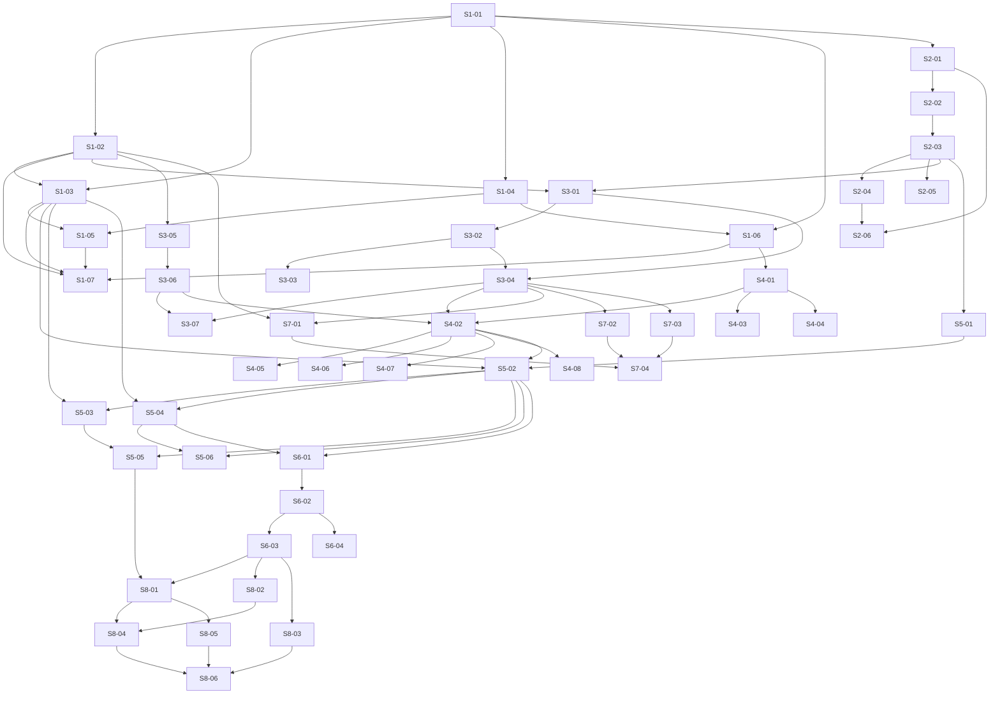

# Phase 09 — Durable workflow envelope: Temporal: Stories manifest

**Status:** Backlog generated; ready for autonomous implementation
**Date:** 2026-05-23
**Phase architecture:** [../phase-arch-design.md](../phase-arch-design.md)
**Phase ADRs:** [../ADRs/](../ADRs/)
**Implementation plan:** [../High-level-impl.md](../High-level-impl.md)
**Source design:** [../final-design.md](../final-design.md)
**Roadmap:** [../../../roadmap.md §Phase 9](../../../roadmap.md)

## Executive summary

44 stories across the 8 implementation steps of Phase 9. Per-step distribution: S1=7 (contracts + fences), S2=6 (Postgres + alembic + compose), S3=7 (event log + BlobRef + sanitizer), S4=8 (activity catalog), S5=6 (checkpointer + 2 workflows), S6=4 (workers + bridge), S7=4 (projections), S8=6 (durability + adversarial + CI gates). The DAG is layered: Step 1's typed contracts and structural fences are the foundation every later step builds on; Step 2 (Postgres) and Step 3 (event log) compose to unlock Step 4 (activities) which is the last "wide" step before workflows narrow into Step 5. Step 6 (workers + bridge) needs Step 5's workflow classes; Step 7 (projections) can run in parallel with Step 6 because projections are pure folds over the canonical log shipped in Step 3. Step 8 is the closeout — durability tests, adversarial sweep, CI gates wired into `make check`. The longest dependency chain is 9 stories (S1-01 → S1-02 → S2-03 → S3-01 → S3-04 → S4-02 → S5-02 → S6-02 → S8-01). Cross-cutting work — workflow-determinism discipline, event-model `frozen+forbid` Pydantic discipline, idempotence-on-`AttemptId`, sanitizer-at-the-seal — is asserted in Step 1 and reasserted via fence tests in Step 8. Gap-1 (Phase-8 `route` activity overhead canary) lands as S8-04; Gap-2 (`MultiPluginDispatch.coordination_policy`) is woven into S5-04; Gap-3 (`freshness_window` + `RouteStalenessDescent` event) is woven into S1-02 (variant landed in union) and S5-03 (resume check). Per-phase ADRs 0001–0015 are already settled; gap ADRs 0016–0018 will land additively when canary evidence accumulates in Step 8.

## How to use this backlog
1. Start at a story whose dependencies are satisfied (DAG below).
2. Open the story file. Read Context, References, Goal, Acceptance criteria.
3. Begin with the TDD plan — write the failing test first.
4. Implement just enough to make it pass.
5. Refactor.
6. Check every acceptance criterion. Update story Status from `Ready` to `Done`.
7. Move to the next ready story.

Order within a step is mostly fixed (later S-numbers depend on earlier). Order across steps follows `High-level-impl.md`, with cross-step parallelism wherever the dependency DAG allows.

## Definition of done (applies to every story)
- [ ] All acceptance criteria checked off.
- [ ] TDD plan's red test exists, committed, green.
- [ ] Additional ADR-honoring tests written and green.
- [ ] `ruff format`, `ruff check`, `mypy --strict`, `make lint-imports` all clean.
- [ ] No existing test disabled or weakened without explicit note in the story's Notes section.
- [ ] Story file Status updated to `Done`.
- [ ] If story modifies a contract documented in an ADR, ADR's Consequences section is reviewed.
- [ ] No LLM SDK imports leak into Phase 9 source (Phase 0 fence remains green).
- [ ] If story touches `src/codegenie/durable/workflows/*.py`, the workflow-determinism fence + `Replayer` test stay green.
- [ ] If story adds a new `EventPayload` variant, the variant round-trips byte-identically via `EventPayloadAdapter` (property test).
- [ ] If story adds a new activity, its return type is `RedactedActivityResult`-derived and `tests/fence/test_activity_payload_typing.py` is green.

## Dependency DAG (visual)

Direct deps only; transitive omitted.

## Stories — by step

### Step 1: Domain primitives, typed event contracts, and structural fences
**Step goal:** Ship the type contracts, registries, and `import-linter`/AST fences every later step depends on; make non-determinism a build break before any workflow exists.
**Step exit criteria mapping:** Underpins G4 (workflow determinism enforcement, ADR-0004), G7 (audit completeness via the typed union), G9 (capability discipline), G10 (alembic supply-chain — the lock fence lives here too).

| ID | Title (slug → file) | Effort | Depends on | Summary |
|---|---|---|---|---|
| S1-01 | [Newtype identifiers for the durable substrate (`S1-01-durable-newtypes`)](S1-01-durable-newtypes.md) | S | — | Add `WorkflowId`, `EventId`, `BlobDigest`, `AttemptId`, `CorrelationId`, `WorkflowSeq`, `ProjectionId`, `TaskQueueName`, `ActivityName`, `TaskClassId`, `PrUrl` to `src/codegenie/types/identifiers.py` (ADR-0033 discipline); `SECRET_TYPES` Pydantic credential registry under `codegenie.types.credentials`. |
| S1-02 | [21-variant EventPayload discriminated union (`S1-02-event-payload-union`)](S1-02-event-payload-union.md) | M | S1-01 | `src/codegenie/events/payloads.py` — every variant `frozen=True, extra="forbid"` with `kind: Literal[...]`; `Annotated[Union[...], Field(discriminator="kind")]`; module-level `EventPayloadAdapter: Final[TypeAdapter[EventPayload]]`; Hypothesis-property JSON round-trip across all 21 variants. Includes `RouteStalenessDescent` from day one (Gap-3). |
| S1-03 | [@critical_event decorator + registry (`S1-03-critical-event-registry`)](S1-03-critical-event-registry.md) | S | S1-01, S1-02 | Module-level `_CRITICAL_EVENTS: set[str]`; applied to exactly five variants (`WorkflowTerminated`, `TrustGateFailed`, `MergeOutcome`, `BudgetExhausted`, `ChainTamperDetected`); registry collision raises `TypeError` at import; ADR-0006 vocabulary fence (test asserts exactly five members). |
| S1-04 | [@register_activity registry kernel (`S1-04-register-activity-kernel`)](S1-04-register-activity-kernel.md) | S | S1-01 | `src/codegenie/durable/activities/__init__.py` decorator + `_ACTIVITIES: dict[ActivityName, ActivityRegistration]`; same shape as `@register_probe`; collision raises at import; explicit-import collection point. |
| S1-05 | [Projection Protocol + @register_projection (`S1-05-projection-protocol`)](S1-05-projection-protocol.md) | S | S1-03 (registry shape), S1-04 | `Projection` Protocol under `src/codegenie/events/projections/__init__.py` (`name: ProjectionId`, `fold(events) -> ProjectionState`); `@register_projection` collection; collision raises at import. |
| S1-06 | [LangGraphCheckpointerPort Protocol + capability types (`S1-06-checkpointer-port-capabilities`)](S1-06-checkpointer-port-capabilities.md) | S | S1-01, S1-04 | `src/codegenie/durable/checkpointer.py` Protocol (port only; no adapter); `CheckpointerHealth` Pydantic record; `EventLogWriteCapability`, `PrOpenCapability`, `LlmSpendCapability` typed Pydantic records under `src/codegenie/durable/capabilities.py` (ADR-0008 trust root is the type, not HMAC). |
| S1-07 | [Workflow-determinism fences — import-linter + AST + fixture xfail (`S1-07-workflow-determinism-fences`)](S1-07-workflow-determinism-fences.md) | M | S1-02, S1-03, S1-05, S1-06 | `import-linter` contract `codegenie.durable.workflows-must-be-pure` (forbid `random`, `time`, `datetime`, `uuid`, `os`, `socket`, `httpx`, `requests`, `redis`, `psycopg`, `asyncpg`, `subprocess`, `codegenie.exec`, `codegenie.transforms`, `codegenie.probes`); AST walker `tests/fence/test_workflow_determinism.py` rejecting literal `set(`, `random.*`, `time.*`, `datetime.now`, `uuid.uuid4`, `os.environ`; deliberate-violation xfail fixture (ADR-0004 layered defense). |

### Step 2: Provision Postgres + alembic + docker-compose dev surface
**Step goal:** Stand up the durable infra (Postgres 16 with three written-owner schemas, alembic owning `events` only, docker-compose loopback-bound) and the supply-chain story (lock + ownership + grants + snapshot diff) so a poisoned migration cannot land.
**Step exit criteria mapping:** Roadmap "temporal-ui shows live workflow inspection" (loopback fence) + G2 + G10 (alembic supply-chain integrity, ADR-0015 loopback, ADR-0009 anti-pgcrypto).

| ID | Title (slug → file) | Effort | Depends on | Summary |
|---|---|---|---|---|
| S2-01 | [docker-compose.dev.yml + loopback-only ports (`S2-01-docker-compose-dev`)](S2-01-docker-compose-dev.md) | S | S1-01 (DurableSettings types referenced) | `infra/docker-compose.dev.yml` shipping `postgres:16-alpine`, `temporalio/auto-setup:1.25`, `temporalio/ui:2.30`, `redis:7-alpine`; every port bound to `127.0.0.1`; `tests/fence/test_temporal_ui_loopback.py` greps `scripts/`, `infra/`, `Makefile` for `0.0.0.0` (zero matches); `scripts/temporal-dev.sh` rejects `--ip 0.0.0.0`/`*.*.*.*` (G2 fence; ADR-0015). |
| S2-02 | [DurableSettings + AsyncConnectionPool factory (`S2-02-durable-settings`)](S2-02-durable-settings.md) | S | S2-01 | `codegenie.durable.config.DurableSettings` (Pydantic Settings, env-prefix `CODEGENIE_DURABLE_`) — Postgres DSN, pool sizes (`minsize=2, maxsize=20` defaults), batch params; `psycopg_pool.AsyncConnectionPool` factory; fail-fast at process start on missing env; one `make dev-up` / `make dev-down` target. |
| S2-03 | [Alembic initial migration — events schema, append-only trigger, grants (`S2-03-alembic-initial-migration`)](S2-03-alembic-initial-migration.md) | M | S2-02 | `src/codegenie/events/alembic/` directory; `env.py` configured for the `events` schema; `versions/0001_create_events_schema.py` ships `events.events` table + per-workflow `wf_seq` UNIQUE INDEX + append-only trigger; `events.blob_refs` table; `application_role` (INSERT/SELECT only) + `migrations_role` (DDL on `events` only, no `CREATE EXTENSION` outside `{pg_stat_statements}`); `make migrate` target; integration test against fresh PG asserts schemas + trigger present. |
| S2-04 | [Alembic supply-chain lock + ownership fences (`S2-04-alembic-supply-chain-lock`)](S2-04-alembic-supply-chain-lock.md) | S | S2-03 | `tools/alembic-revisions.lock` SHA-pins every file under `versions/`; `tests/fence/test_alembic_revision_lock.py` (mismatch fails CI); `tests/fence/test_alembic_owns_only_events_schema.py` (no migration references `temporal.*` or `langgraph_checkpoints.*`); G10 evidence. |
| S2-05 | [Alembic schema-snapshot diff fence (`S2-05-alembic-schema-snapshot`)](S2-05-alembic-schema-snapshot.md) | S | S2-03 | `tests/fence/test_alembic_schema_snapshot.py` — migrate against fresh testcontainer Postgres, dump schema with `pg_dump --schema-only --no-owner`, diff against `tests/fence/alembic_schema.sql.snapshot`; surprising schema drift is a CI build break. |
| S2-06 | [Adversarial — append-only + plpython block (`S2-06-pg-adversarial-grants`)](S2-06-pg-adversarial-grants.md) | S | S2-03, S2-04 | `tests/adv/test_events_append_only_enforcement.py` — `application_role` UPDATE/DELETE/TRUNCATE raises (testcontainers); `tests/adv/test_alembic_migration_plpython_blocked.py` — a `CREATE FUNCTION ... LANGUAGE plpython3u` migration fails because `migrations_role` is non-super (ADR-0009 anti-pgcrypto justification + critic-3-on-[S] defeat). |

### Step 3: Canonical event log, BlobRef store, and activity-boundary sanitizer
**Step goal:** Ship the typed append-only event log with per-workflow BLAKE3 chain (ADR-0003) and the smart-constructor seams (`BlobRef` only via `write_blob_ref`; `RedactedActivityResult.seal()`) the activities will use in Step 4.
**Step exit criteria mapping:** G6 (≥3k events/sec; p95 ≤15 ms); G7 (audit completeness — the 5 `@critical_event` variants sync-flush, others batched); G8 (history compactness via BlobRef ≥8 KiB threshold, ADR-0005); foundation for G9 (capability discipline at the seal).

| ID | Title (slug → file) | Effort | Depends on | Summary |
|---|---|---|---|---|
| S3-01 | [EventLog.append + per-workflow BLAKE3 chain head (`S3-01-event-log-append-chain`)](S3-01-event-log-append-chain.md) | M | S1-02, S2-03 | `src/codegenie/events/log.py` `EventLog.append(EventPayload, capability)`; per-workflow chain-head LRU (max 200 in-flight); chain-tail re-read from Postgres on cache miss; `row_hash = BLAKE3(prev_row_hash \|\| canonical_payload)`; integration test: 100 events across 3 concurrent workflows, each chain internally consistent + independent (ADR-0003). |
| S3-02 | [EventBatchWriter — 20ms/256-event flush + COPY binary (`S3-02-event-batch-writer`)](S3-02-event-batch-writer.md) | M | S3-01 | `EventBatchWriter` owns `asyncio.Queue`; flush trigger = 20 ms OR 256 events OR `@critical_event` variant present; flush path uses `COPY events.events FROM STDIN BINARY`; back-pressure into Temporal when queue exceeds 16 MiB; integration test asserts 1k events across 10 concurrent workflows commit < 50 ms p95 (batched). |
| S3-03 | [Critical-event synchronous-flush bypass (`S3-03-critical-event-sync-flush`)](S3-03-critical-event-sync-flush.md) | S | S3-02 | `@critical_event` variant in `append`/`append_batch` triggers synchronous `INSERT ... RETURNING wf_seq` (bypass the batcher entirely); test asserts each of the 5 critical variants commits synchronously with p95 ≤ 15 ms; deliberate post-commit-retry-double-write anti-pattern test (ensures no double-write on retry). |
| S3-04 | [EventLog.read_workflow + chain-verify (`S3-04-event-log-read-chain-verify`)](S3-04-event-log-read-chain-verify.md) | S | S3-01, S3-02 | `EventLog.read_workflow(workflow_id) -> AsyncIterator[EventPayload]`; chain-verify-as-you-read; chain gap or hash mismatch emits `ChainTamperDetected` (`@critical_event`); `tests/adv/test_event_chain_tamper_detection.py` forges a row via `migrations_role` and asserts the next read fires `ChainTamperDetected`. |
| S3-05 | [BlobRef smart constructor + content-addressed store (`S3-05-blob-ref-store`)](S3-05-blob-ref-store.md) | M | S1-02 (BlobDigest) | `src/codegenie/events/blob_refs.py` `BlobRef` frozen Pydantic; `write_blob_ref(content) -> BlobRef` is the sole constructor; `resolve_blob_ref(BlobRef) -> bytes`; `ON CONFLICT DO NOTHING` for content-addressed dedupe; integration test: write 200 KiB blob, resolve, assert byte-identical; duplicate-write no-ops (ADR-0005 ≥8 KiB threshold + smart-constructor pattern). |
| S3-06 | [RedactedActivityResult.seal — three-layer sanitizer (`S3-06-sanitizer-seal`)](S3-06-sanitizer-seal.md) | M | S3-05 | `src/codegenie/durable/sanitizer.py` — `seal(model: T) -> RedactedActivityResult` applies (a) Pydantic `extra="forbid"`, (b) `SECRET_TYPES` typed-credential-class blocklist (load-bearing per ADR-0008), (c) AWS/GitHub-PAT/JWT value-shape regex backstop with `RedactionFired` event emission on regex match; `seal(seal(x)) == seal(x)` property; Hypothesis-generated secret shapes all rejected. |
| S3-07 | [Event-log throughput bench baseline (`S3-07-event-log-throughput-bench`)](S3-07-event-log-throughput-bench.md) | S | S3-04, S3-06 | `tests/perf/test_phase09_event_log_append.py` under `-m bench` — 10k events across 50 concurrent workflows; assert p95 sync ≤ 15 ms / batched ≤ 50 ms; checked-in baseline `tests/bench/baselines/phase09_event_log_append.json` ratchets future regressions; nightly CI hook. |

### Step 4: Activity catalog (one file per activity, typed in and out, registry-collected)
**Step goal:** Ship the nine activities that the workflow body will dispatch — each a thin Pydantic-typed wrapper around Phase 3–8 functions, idempotent on `AttemptId`, returning a `RedactedActivityResult`-derived type.
**Step exit criteria mapping:** G3 (zero application-level retries — retries live in `_POLICIES`); G7 (every activity emits at least one typed event); ADR-0010 (asymmetric granularity — `run_vuln_subgraph` is the fat activity); ADR-0009 (no merge activity, fence).

| ID | Title (slug → file) | Effort | Depends on | Summary |
|---|---|---|---|---|
| S4-01 | [RetryPolicy table + retry_policies module (`S4-01-retry-policies-table`)](S4-01-retry-policies-table.md) | S | S1-04 | `src/codegenie/durable/activities/retry_policies.py` — module-level `Final` `_POLICIES: dict[ActivityName, RetryPolicy]`; `non_retryable` lists include the tier-descent triggers (`RecipeMissedError`, `RagMissedError`); ADR-0010-aligned per-activity timeouts (`run_vuln_subgraph: 20m`, `emit_event: 5s`, etc.); test asserts every registered activity has a policy row. |
| S4-02 | [emit_event + write_blob_ref + resolve_blob_ref activities (`S4-02-system-queue-activities`)](S4-02-system-queue-activities.md) | M | S1-06, S3-04, S3-06, S4-01 | Three "system"-queue activities under `src/codegenie/durable/activities/`: `emit_event.py` (calls `EventLog.append_batch`, threaded `EventLogWriteCapability`), `write_blob_ref.py`, `resolve_blob_ref.py`; each idempotent (`emit_event` on `event_id`, blob activities content-addressed); each test covers (a) typed-event emission, (b) Pydantic round-trip, (c) idempotence; explicit-import in `__init__.py`. |
| S4-03 | [resolve_plugin + build_bundle + route activities (`S4-03-phase8-supervisor-activities`)](S4-03-phase8-supervisor-activities.md) | M | S4-01 | Three activities wrapping the Phase-8 Supervisor's three nodes 1:1 ([P]/[B] shape per ADR-0010): `resolve_plugin.py`, `build_bundle.py` (writes bundles > 8 KiB via `write_blob_ref` — ADR-0005), `route.py` (carries `freshness_window: timedelta` + `decided_at` per Gap-3); each test asserts typed event emission + Pydantic shape + idempotence on `AttemptId`. |
| S4-04 | [github_open_pr + sandbox_build_and_test activities (`S4-04-side-effect-activities`)](S4-04-side-effect-activities.md) | M | S4-01 | `github_open_pr.py` — wraps Phase-11-preview PR opener; idempotent on `(repo, attempt_id)` (reuses existing PR if seen); threaded `PrOpenCapability`. `sandbox_build_and_test.py` — wraps Phase-5 `SubprocessJail`; idempotent on `(patch_digest, build_inputs_digest)`; heartbeat every 5 s. Tests cover idempotence + capability scope. |
| S4-05 | [run_vuln_subgraph fat activity wrapping Phase-6 LangGraph (`S4-05-run-vuln-subgraph-activity`)](S4-05-run-vuln-subgraph-activity.md) | L | S4-02 | The single [S]-shape activity (ADR-0010) — wraps Phase-6 LangGraph subgraph; heartbeats every 5 s (sub-Temporal's 30 s heartbeat-timeout by margin that survives slow Postgres write); idempotent on `AttemptId`; resumes from `PostgresCheckpointerAdapter` checkpoint on re-dispatch; preserves Phase-6 `SutDigest`; integration test asserts resume reads same checkpoint state after mid-subgraph kill (G1 lynchpin). |
| S4-06 | [Activity-payload-typing fence (`S4-06-activity-payload-typing-fence`)](S4-06-activity-payload-typing-fence.md) | S | S4-02 | `tests/fence/test_activity_payload_typing.py` — introspects every `@activity.defn`-decorated function via `get_type_hints`; asserts inputs are `BaseModel`-derived (`frozen=True, extra="forbid"`) and *return-type-annotated* as `RedactedActivityResult`-derived (the annotation, not runtime shape, is the check); build break on naked-shape returns. |
| S4-07 | [No-merge-activity fence + typed-credential adversarial (`S4-07-no-merge-fence`)](S4-07-no-merge-fence.md) | S | S4-02, S4-04 | `tests/fence/test_no_merge_activity.py` — greps `@activity.defn(name=...)` decorations for `merge_pr|approve_pr|self_merge` (zero matches, ADR-0009 rendered as fence); `tests/adv/test_typed_credential_blocklist.py` — an activity declared with a `GitHubToken`-typed return field is rejected by `seal()` at first invocation; `tests/adv/test_secret_leakage_in_history.py` — every known secret shape rejected; `RedactionFired` lands in event log. |
| S4-08 | [Workflows/activities one-way import fence (`S4-08-one-way-import-fence`)](S4-08-one-way-import-fence.md) | S | S4-02 | Extend `import-linter` config: no module under `codegenie.durable.activities.*` may import from `codegenie.durable.workflows.*` (one-way dependency); CI fence; deliberate-violation xfail fixture so the contract is exercised. |

### Step 5: Postgres checkpointer adapter + workflow definitions
**Step goal:** Ship `PostgresCheckpointerAdapter` (resolves production ADR-0016 default; phase ADR-0011) and the two workflow classes (`VulnRemediationWorkflow`, `MultiPluginParentWorkflow`) — pure orchestration over `VulnLedger`/`ParentResult` sum-types, dispatching the Step-4 activities under per-activity `RetryPolicy`.
**Step exit criteria mapping:** Roadmap "Workflows survive process restarts without state loss" (G1, via the workflow + checkpointer); "All retries are framework-level" (G3, workflow body has no retry loops); G4 (workflow determinism); G5 (`SutDigest` invariance preserved via `run_vuln_subgraph` granularity); ADR-0014 (multi-plugin parent shape).

| ID | Title (slug → file) | Effort | Depends on | Summary |
|---|---|---|---|---|
| S5-01 | [PostgresCheckpointerAdapter — wraps PostgresSaver + health translation (`S5-01-postgres-checkpointer-adapter`)](S5-01-postgres-checkpointer-adapter.md) | M | S2-03 | `src/codegenie/durable/checkpointer.py` `PostgresCheckpointerAdapter` implementing `LangGraphCheckpointerPort`; wraps `langgraph_checkpoint_postgres.PostgresSaver`; adds `health() -> CheckpointerHealth` (`pool_in_use`, `pool_idle`, `last_write_age_seconds` — not exposed upstream; this translation earns the "Adapter" name vs forwarder); test asserts pool exhaustion yields `psycopg.PoolTimeoutError`; ADR-0011 resolves production ADR-0016. |
| S5-02 | [VulnRemediationWorkflow — VulnLedger orchestration (`S5-02-vuln-remediation-workflow`)](S5-02-vuln-remediation-workflow.md) | L | S1-03, S4-02, S5-01 | `src/codegenie/durable/workflows/vuln_remediation.py` `@workflow.defn(name="VulnRemediationWorkflow")`; `run(request)`, `human_review_decision` signal, `cancel` signal, `state()` query; `match` over `VulnLedger` variants with `assert_never`; per-activity `RetryPolicy` from `_POLICIES`; **no** retry loops in workflow body; `WorkflowEnvironment` test asserts ledger transitions `NeedsPlan → PlanReady → PatchApplied → AwaitingHumanReview → Completed`. |
| S5-03 | [Freshness-window resume check + RouteStalenessDescent emission (`S5-03-freshness-window-resume`)](S5-03-freshness-window-resume.md) | S | S5-02 | When `VulnRemediationWorkflow` resumes and consults a recorded `RouteDecision` or `PluginResolved`, `match` arm checks `workflow.now() - decision.decided_at <= decision.freshness_window`; if stale, tier-descends to a fresh resolve cycle and emits `RouteStalenessDescent` event variant; test asserts stale-resume emits the descent event; Gap-3 evidence landed (future ADR-0018 records the default `freshness_window=7 days`). |
| S5-04 | [MultiPluginParentWorkflow + ParentResult sum-type (`S5-04-multi-plugin-parent-workflow`)](S5-04-multi-plugin-parent-workflow.md) | M | S1-03, S5-02 | `src/codegenie/durable/workflows/multi_plugin_parent.py` `@workflow.defn(name="MultiPluginParentWorkflow")`; `run(MultiPluginDispatch) -> ParentResult`; spawns N child `VulnRemediationWorkflow`s via `execute_child_workflow`; `ParentResult = AllMerged \| SomeMerged \| AllFailed`; honors `MultiPluginDispatch.coordination_policy: Literal["independent","all_or_nothing","best_effort"]` (Phase 9 implements `"independent"` only; others raise typed `NotImplementedError("see Phase 10")` at workflow body — Gap-2/ADR-0014); test asserts 2-child happy path produces `AllMerged`. |
| S5-05 | [Replay-determinism test — WorkflowReplayer fixture (`S5-05-replay-determinism-replayer`)](S5-05-replay-determinism-replayer.md) | M | S5-02, S5-03 | `tests/workflows/test_replay_determinism.py` records a workflow's history once (committed fixture under `tests/golden/temporal/`), then `temporalio.testing.WorkflowReplayer.run_replay_workflows(...)` against the recorded history per Python-minor matrix (3.11 + 3.12); preserves full `NondeterminismError` payload in test output for forensic diff; **MUST NOT** be `@pytest.mark.flaky` (per implementation risk #1). |
| S5-06 | [Workflow-level happy-path + HITL signal tests (`S5-06-workflow-hitl-tests`)](S5-06-workflow-hitl-tests.md) | M | S5-02, S5-04 | `tests/workflows/test_vuln_remediation_workflow.py` happy path; `tests/workflows/test_hitl_pause_resume.py` — `wait_condition(human_review_decision)` parks workflow; signal dispatch resumes it; `tests/workflows/test_multi_plugin_parent_workflow.py` — `coordination_policy="all_or_nothing"` raises typed error visible in `temporal-ui`; `tests/integration/test_subgraph_resume_determinism.py` — kill activity mid-LangGraph, resume reads same checkpoint state. |

### Step 6: Worker process model + LangGraph↔Temporal bridge
**Step goal:** Make the workflows runnable (workers, hot reload, capability minting from K8s ServiceAccount mount), expose the Temporal-backed Phase-6.5 SUT so `SutDigest` invariance is testable end-to-end (G5).
**Step exit criteria mapping:** Roadmap "temporal-ui shows live workflow inspection" (workers register task queues visible in UI); G5 (`SutDigest` invariance); G9 (per-task-queue capability minting from worker mount, ADR-0007 + ADR-0008).

| ID | Title (slug → file) | Effort | Depends on | Summary |
|---|---|---|---|---|
| S6-01 | [Worker bootstrap + two task-queue pools (`S6-01-worker-bootstrap`)](S6-01-worker-bootstrap.md) | M | S5-02, S5-04 | `src/codegenie/durable/workers/__init__.py` `build_worker(kind: WorkerKind, settings: DurableSettings) -> Worker`; `python -m codegenie.durable.workers` entrypoint; two activity pools wired (`vuln-remediation-node-npm`: `[resolve_plugin, build_bundle, route, run_vuln_subgraph, sandbox_build_and_test, github_open_pr]`; `system`: `[emit_event, resolve_blob_ref, write_blob_ref]`); ADR-0007 two-queue partitioning; `uvloop` + `watchfiles` dev hot reload; `make dev-up` + workers + `temporal-ui` round-trip demonstrated. |
| S6-02 | [Capability minting from K8s ServiceAccount mount (`S6-02-capability-minting`)](S6-02-capability-minting.md) | M | S6-01 | Worker bootstrap reads `/var/run/secrets/codegenie/queue-identity` (K8s mount); dev path reads from `.env`-loaded fixture; constructs only the `Capability` types this queue is allowed to mint; `tests/adv/test_capability_token_scope.py` — `vuln-remediation-node-npm` worker cannot mint `EventLogWriteCapability` for kinds outside its allowlist (G9 audit-case test). |
| S6-03 | [TemporalVulnRemediationSut bridge + SutDigest invariance (`S6-03-temporal-sut-bridge`)](S6-03-temporal-sut-bridge.md) | M | S6-02 | `src/codegenie/durable/bridge.py` `TemporalVulnRemediationSut(VulnRemediationSut)`; `run_case` writes case inputs to `BlobStore`, starts workflow, awaits result, reads terminal `BlobRef`s; `digest()` delegates to Phase-6 builder under `freezegun`; `tests/durability/test_sut_digest_invariance.py` (G5) — every Phase-6 canonical case digests byte-identically under `LocalVulnRemediationSut` and `TemporalVulnRemediationSut`. |
| S6-04 | [End-to-end Postgres + Temporal integration test (`S6-04-workflow-e2e-postgres`)](S6-04-workflow-e2e-postgres.md) | M | S6-02 | `tests/integration/test_workflow_e2e_postgres.py` — real Postgres + real Temporal dev server + fake Redis + cassette LLM; full recipe-route workflow completes in ~30 s; asserts terminal `VulnLedger` state and event-log contents; first end-to-end smoke. |

### Step 7: Projections (real, not stubs — ADR-0043 cleanliness)
**Step goal:** Ship the three Phase-9 projections — `audit_trail`, `retry_histogram`, `plugin_telemetry` — as pure folds over the canonical event log, registered via `@register_projection`. **Zero stubs raising `NotImplementedError`** (ADR-0043). Phase-8 `codegenie.plugins.events` one-way emitter into canonical log; Phase 10 deletes the old log per ADR-0002.
**Step exit criteria mapping:** G7 (audit completeness, evidenced by `audit_trail`); foundation for Phase 11 (KG writeback projection) and Phase 13 (cost ledger projection) without re-shaping events.

| ID | Title (slug → file) | Effort | Depends on | Summary |
|---|---|---|---|---|
| S7-01 | [audit_trail projection + chain-verify on fold (`S7-01-audit-trail-projection`)](S7-01-audit-trail-projection.md) | M | S1-02, S3-04 | `src/codegenie/events/projections/audit_trail.py` — chronological event list per workflow; chain-verifies on every fold; chain gap emits `ChainTamperDetected` (`@critical_event`) and halts the projection for that workflow; golden event-stream fixture under `tests/golden/events/`; `tests/integration/test_audit_trail_chain_verify.py` asserts chain-tamper triggers halt; no Postgres needed for unit tests. |
| S7-02 | [retry_histogram projection (`S7-02-retry-histogram-projection`)](S7-02-retry-histogram-projection.md) | S | S3-04 | `src/codegenie/events/projections/retry_histogram.py` — `GateOutcome × failing_signals` rollup; folds over `TrustGatePassed` + `TrustGateFailed`; unit tests against fixture event stream; idempotence + timestamp-tied-ordering invariance property tests (`fold(events) == fold(events)`; `fold(shuffle_within_equal_ts(events)) == fold(events)`). |
| S7-03 | [plugin_telemetry projection + Phase-8 log fanout (`S7-03-plugin-telemetry-projection`)](S7-03-plugin-telemetry-projection.md) | M | S3-04 | `src/codegenie/events/projections/plugin_telemetry.py` — `PluginResolved × MergeOutcome` join for per-plugin merge/fallback rates; replaces the projection role Phase-8 `codegenie.plugins.events` filled. One-way emitter from `run_vuln_subgraph` into the canonical log; `tests/integration/test_phase08_log_fanout.py` asserts emitted records are byte-identical to Phase-8 log records (ADR-0002 cutover machinery). Add fence: no projection imports `codegenie.plugins.events`. |
| S7-04 | [Projection property + golden tests (`S7-04-projection-property-tests`)](S7-04-projection-property-tests.md) | S | S7-01, S7-02, S7-03 | `tests/property/test_projection_idempotence.py` — `fold(events) == fold(events)` across all three projections; `tests/property/test_projection_timestamp_invariance.py` — `fold(shuffle_within_equal_ts(events)) == fold(events)`; one golden event-stream fixture per workflow type under `tests/golden/events/`; registry-collision-at-import test confirms `@register_projection` raises `TypeError` on duplicates. |

### Step 8: Durability test pass + adversarial sweep + CI gates
**Step goal:** Prove G1, G6, G9, G11 with adversarial tests; wire every fence and durability test into `make check`; nightly bench harness with ratchet baselines.
**Step exit criteria mapping:** Roadmap "Workflows survive process restarts without state loss" (G1 via `test_kill_worker_resume.py`); "All retries are framework-level" (G3 via no-retry-loop import-linter contract); also closes Gap-1 canary (route activity overhead), Gap-2 typed precondition, Gap-3 freshness window.

| ID | Title (slug → file) | Effort | Depends on | Summary |
|---|---|---|---|---|
| S8-01 | [G1 — kill-worker-resume durability test (`S8-01-kill-worker-resume`)](S8-01-kill-worker-resume.md) | L | S6-03, S5-05 | `tests/durability/test_kill_worker_resume.py` — N kill offsets across `run_vuln_subgraph`; assert byte-identical terminal `VulnLedger` state. **Runs in `make test`, NOT behind `@pytest.mark.e2e`** (per ADR-0010 + risk #1). 100 consecutive local runs green; 10 consecutive PR runs green (flake-catch). This is the G1 exit-criterion test. |
| S8-02 | [Temporal-cluster-restart durability test (`S8-02-temporal-cluster-restart`)](S8-02-temporal-cluster-restart.md) | M | S6-03 | `tests/durability/test_temporal_cluster_restart.py` — `temporal kill && temporal start` mid-workflow; in-flight workflows resume; terminal `VulnLedger` byte-identical; complements `test_kill_worker_resume.py` for the cluster-restart leg of G1. |
| S8-03 | [G9 — worker credential blast-radius adversarial (`S8-03-worker-blast-radius`)](S8-03-worker-blast-radius.md) | M | S6-03 | `tests/adv/test_worker_credential_blast_radius.py` — simulate compromised worker; assert it cannot (a) open PRs outside its allowlist; (b) write events of kind outside its task queue's allowlist; (c) signal/terminate a workflow on a different task queue; (d) read `events.events` rows other than its own workflows (read_role boundary). G9 evidence. |
| S8-04 | [Gap-1 route-activity overhead canary + G11 token canary (`S8-04-perf-canaries`)](S8-04-perf-canaries.md) | M | S8-01, S8-02 | `tests/perf/test_phase09_route_activity_overhead.py` — `execute_activity("route", ...)` p95 ≤ 40 ms (10 ms headroom over Phase-8's 50 ms hot-view budget — Gap-1); `tests/perf/test_phase09_token_canary.py` — `total_tokens == 0` on cassette-replay (G11); `tests/perf/test_phase09_throughput.py` — ≥ 3k events/sec sustained from 5 activity workers (G6); `tests/perf/test_phase09_cold_replay_latency.py` — 200-event history ≤ 1.5 s p95; nightly under `-m bench` with ratchet baselines. |
| S8-05 | [G3 — no-retry-loop in workflow body fence (`S8-05-no-retry-loop-fence`)](S8-05-no-retry-loop-fence.md) | S | S8-01 | `import-linter` + `forbidden-patterns` regex over `src/codegenie/durable/workflows/*.py` rejecting `while ... attempt < max` / `for _ in range(retries)` / `while True:` retry constructs; G3 roadmap exit criterion as a fence. Includes a deliberate-violation xfail fixture so the rule is exercised. |
| S8-06 | [make-check integration + Phase-9 docs publication (`S8-06-make-check-integration`)](S8-06-make-check-integration.md) | M | S8-04, S8-05, S8-03 | Every new fence (`test_workflow_determinism`, `test_activity_payload_typing`, `test_temporal_ui_loopback`, `test_alembic_revision_lock`, `test_alembic_schema_snapshot`, `test_no_merge_activity`, `test_alembic_owns_only_events_schema`, replay test, G1 durability) wired into `make check`; nightly `make bench` workflow runs ratchet-baseline files under `tests/bench/baselines/`; `docs/development.md` covers `make dev-up`, port overrides, troubleshooting; mkdocs build strict green; Phase-9 page published. Closeout: roadmap exit-criteria phrasing verified end-to-end. |

## Cross-cutting concerns

These threads run through every step's stories; each story's `Definition of done` checklist enforces the discipline.

- **Replay-determinism discipline.** Every story that touches `src/codegenie/durable/workflows/*.py` (S5-02, S5-03, S5-04, S5-05) carries an acceptance criterion that `tests/fence/test_workflow_determinism.py` and the `Replayer` test (S5-05) stay green. The three layers (import-linter, AST fence, Replayer) are non-overlapping per ADR-0004; each story must respect the rules.
- **Event-model discipline.** Every story that adds an `EventPayload` variant (S1-02 ships all 21; future phases add additively per ADR-0034) lands the variant as `frozen=True, extra="forbid"` with a `kind: Literal[...]` discriminator and a property-based JSON round-trip test via `EventPayloadAdapter` (S1-02 establishes the property test; later phases extend its Hypothesis strategies).
- **Idempotence-on-AttemptId.** Every activity story (S4-02, S4-03, S4-04, S4-05) carries an idempotence acceptance criterion; the test asserts re-dispatch with the same `AttemptId` reuses prior result (no double-PR, no double-patch). Temporal's at-least-once becomes exactly-once at the data layer.
- **Secret-redaction at the seal.** Every story that adds an activity input/output shape (S4-02 onwards) includes the `RedactedActivityResult.seal()` smart-constructor in its acceptance; `tests/fence/test_activity_payload_typing.py` (S4-06) is the cross-cutting fence.
- **One-way imports.** Activity modules may not import workflow modules (S4-08 fence); projection modules may not import `codegenie.plugins.events` (S7-03 fence); workflow modules may not import from the forbidden-runtime list (S1-07 contract).

## Exit-criteria coverage

| Exit criterion (from roadmap §Phase 9) | Story / stories |
|---|---|
| Workflows survive process restarts without state loss | S5-01 (checkpointer adapter); S5-02 (workflow body); S5-05 (replay-determinism); S6-01 (workers); S6-03 (bridge); **S8-01 (G1 kill-worker-resume test — the lynchpin)**; S8-02 (cluster restart) |
| `temporal-ui` shows live workflow inspection | S2-01 (loopback compose + fence); S6-01 (workers register task queues visible in UI); S8-06 (closeout verification) |
| All retries are framework-level — application code contains no retry loops | S4-01 (`_POLICIES` `Final` table); S5-02 (workflow body has no retry loops); **S8-05 (G3 no-retry-loop fence)**; S8-06 (closeout phrasing verification) |

## Open implementation questions

These trace from `phase-arch-design.md §Open questions deferred to implementation` and `ADRs/README.md §Decisions noted but not yet documented`. Each is tied to the story it will first arise in:

1. **Continue-as-new for `run_vuln_subgraph` approaching the 20-min cap.** Surfaces in S4-05; if the fixed `start_to_close_timeout=20m` bites under Phase 10 portfolio load, continue-as-new lands under a new story without an ADR amendment.
2. **`@critical_event` after-write fanout into the batcher.** Surfaces in S3-03; current design fully bypasses the batcher for sync flush. If an alternative pattern accumulates evidence (e.g., for eventual-consistency observability), it becomes a follow-up story.
3. **Postgres connection-pool sizing under burst.** Surfaces in S2-02 and S8-04; the G6 throughput canary's baseline ratchet drives the final defaults; phase ADR-0003 (already settled at `minsize=2, maxsize=20`) may be amended.
4. **`temporal-ui` URL emitted from `make dev-up`.** Surfaces in S6-01; cosmetic ergonomics; implementation may print the URL at startup without a story bump.
5. **Sibling-failure semantics for `MultiPluginParentWorkflow`.** Surfaces in S5-04; Phase 9 implements `"independent"` only; the typed field is in place ahead of time (Gap-2). Phase 10 lands the rest additively.
6. **Worker Versioning in dev mode.** Phase 16 hardening will land it. Phase 9 dev mode may opt in earlier under S6-01 if multi-version replay tests become a bottleneck.
7. **`EventLog.read_kind(kind)` API for cross-workflow projections.** Surfaces in S7-02 / S7-03; current implementation reads via `SELECT * FROM events.events WHERE kind IN (...)`; if ergonomics drift, a typed `read_kind` lands as a follow-up story.

## Backlog stats

- **Total stories:** 44
- **Stories per step:** S1=7, S2=6, S3=7, S4=8, S5=6, S6=4, S7=4, S8=6
- **Effort distribution:** S=20, M=19, L=5 (L: S4-05 `run_vuln_subgraph`, S5-02 `VulnRemediationWorkflow`, S8-01 `kill-worker-resume`, plus the two L's bleed into M depending on contributor)
- **Longest dependency chain:** 9 stories — S1-01 → S1-02 → S2-03 → S3-01 → S3-04 → S4-02 → S5-02 → S6-02 → S8-01
- **Stories per ADR (load-bearing):** ADR-0003 (per-workflow BLAKE3 chain) → S3-01, S3-04; ADR-0004 (determinism three layers) → S1-07, S5-05, S8-05; ADR-0005 (BlobRef threshold) → S3-05, S4-03; ADR-0006 (`@critical_event`) → S1-03, S3-03; ADR-0007 (two task queues) → S6-01; ADR-0008 (typed-credential blocklist) → S1-06, S3-06, S4-07; ADR-0009 (no `pgcrypto`) → S2-06; ADR-0010 (asymmetric activity granularity) → S4-03, S4-05; ADR-0011 (Postgres checkpointer) → S5-01; ADR-0014 (multi-plugin parent shape) → S5-04; ADR-0015 (loopback only) → S2-01
- **Cross-cutting fences (touch every later story):** workflow-determinism (S1-07), activity-payload typing (S4-06), no-merge (S4-07), alembic supply-chain (S2-04 + S2-05), no-retry-loop (S8-05)
