# codewizard-sherpa — Production Design

*The authoritative production-target reference. Synthesizes [auto-agent-design.md](../auto-agent-design.md), [gemini-auto-agent-design.md](../gemini-auto-agent-design.md), and [context.md](../context.md) into one canonical architecture. The local POC ([localv2.md](../localv2.md)) implements the inner gather layer and lifts unchanged into this service.*

---

## 1. Executive summary

**codewizard-sherpa is an autonomous agentic system that opens pull requests to modify code across an organization's repositories at portfolio scale.** Phase 1 target: migrate Node.js services to Chainguard distroless containers. Phase 2+: vulnerability remediation and major language/dependency upgrades. The pipeline discovers candidate repos, assesses them, gathers structured context, plans changes recipe-first and LLM-last, executes them in sandboxed isolation, validates them against objective signals, and proposes them as human-reviewed PRs. **Merge is always human.**

The headline architectural shape is a **Temporal-durable workflow envelope** wrapping a **Layered Hybrid Orchestrator** with **structured-data-driven domain knowledge** feeding it:

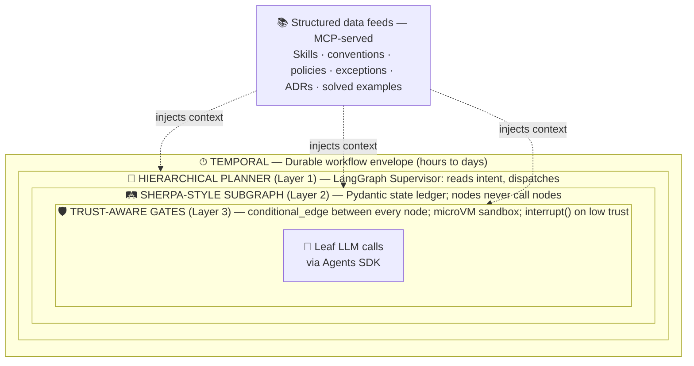

The three inner layers are not alternatives to each other. They compose: a Supervisor dispatches into a SHERPA-disciplined subgraph whose every transition passes through a Trust-Aware guard. **LangGraph is the runtime engine; SHERPA is the architectural discipline; Trust-Aware is the safety layer.** Temporal wraps everything with the durable-execution properties needed for workflows that span hours of LLM work and days of human review.

---

## 2. Load-bearing architectural commitments

These constrain every decision below. A proposed change to any subsystem that violates one of these requires explicit justification and a corresponding update to this section.

1. **No LLM in the gather pipeline.** Anywhere. Probes are deterministic; same inputs always produce same outputs. This is what makes the `RepoContext` artifact reproducible, cacheable, and auditable. (See [ADR-0005](adrs/0005-no-llm-in-gather-pipeline.md).)
2. **Facts, not judgments.** The gatherer captures evidence ("trace observed 0 shell invocations"). It does not write conclusions ("safe to migrate"). Conclusions are the Planner's job. Evidence is reusable across tasks; judgments are not.
3. **Honest confidence.** Every probe and every state node reports confidence and provenance. Silent staleness is the worst failure mode. `IndexHealthProbe` is the canonical example in the POC; objective-signal trust scoring is its analog in the service.
4. **Determinism over probabilism for structural changes.** AI agents are "safer builders, risky maintainers" — the empirical evidence in [gemini-auto-agent-design.md §"Empirical Realities"](../gemini-auto-agent-design.md) shows agentic PRs introduce breaking changes during refactors and chores at 6.72–9.35% versus 2.69–2.89% for net-new features. Use recipes (OpenRewrite, rulesets) and AST/LST manipulation for structural transforms; reserve the LLM for judgment calls.
5. **Extension by addition.** Adding a new language, new task type, or new tool must be new probes + new Skills + new subgraphs, never edits to existing ones. The probe contract in [localv2.md §4](../localv2.md) is the contract.
6. **Organizational uniqueness as data, not prompts.** Skills with YAML frontmatter, conventions catalogs, policy YAML, exception registries. The agent queries structured data; it never infers your company's rules from prose.
7. **Progressive disclosure.** The `RepoContext` artifact indexes evidence; it does not inline it. Skills, ADRs, repo notes, and external docs are referenced by manifest only. The agent reads originals at decision time via MCP. This is what keeps agent token budgets tractable.
8. **Humans always merge.** Autonomy ends at PR creation. This is the consistent finding from every published autonomous-migration study. (See [ADR-0009](adrs/0009-humans-always-merge.md).)
9. **Cost is observable end-to-end and bounded per workflow.** Every LLM call, sandbox run, probe execution, and reviewer-hour is measured and attributed. Each workflow declares a budget; the Temporal envelope short-circuits when the cap is reached. Cost-per-successful-PR and cost-per-CVE-eliminated are the headline ROI ratios — both are computed, surfaced on a dashboard, and used to tune the system. See §3.3 and [ADR-0024](adrs/0024-cost-observability-end-to-end.md).

---

## 3. The 7-stage pipeline

Synthesized from [auto-agent-design.md §4](../auto-agent-design.md) and refined against [gemini-auto-agent-design.md](../gemini-auto-agent-design.md). Each stage is a Temporal Activity (or child workflow); collectively they form the per-repo migration workflow. The seven-stage shape is itself a load-bearing design choice — see [ADR-0010](adrs/0010-seven-stage-pipeline-shape.md).

**Stage 0 — Discovery.** Scheduled scan of the org's repos. Lists candidates whose current image is a distroless candidate (or whose CVEs cross an action threshold). **Fully deterministic; no LLM.** Inputs: GitHub/GitLab API. Outputs: a `CandidateRepo` event per eligible repo, each spawning a Temporal workflow.

**Stage 1 — Assessment.** Per-language router classifies the candidate as Category 1 (clean migration), 2 (migration with caveats), or 3 (blocker — cannot proceed). **Hierarchical Planner routes; LLM used inside each language-specific assessor subgraph.** Inputs: `CandidateRepo`. Outputs: `AssessmentResult` with category, confidence, blockers found, evidence bundle.

**Stage 2 — Deep Scan.** The gather layer is **continuously running against every watched repo** (see §3.2). Stage 2 in the per-workflow pipeline confirms `RepoContext` is fresh for the candidate and serves it via MCP — typically a cache-hit in steady state, completing in seconds rather than the 3–6 minutes a cold gather takes. Produces the structured `RepoContext` artifact and the human-facing `CONTEXT_REPORT.md`. **Fully deterministic; no LLM.** Inputs: cloned repo, task type. Outputs: `RepoContext` resource served via MCP for downstream stages.

**Stage 3 — Planning.** Given `RepoContext`, emit an ordered list of step files with red/green TDD assertions plus a validation plan. **SHERPA subgraph: recipe-match → solved-example-RAG → LLM-fallback → emit-steps.** Recipes (OpenRewrite, internal rulesets) are tried first. Solved-example RAG queries the knowledge graph next. Only if both miss does the LLM plan from scratch with the context packet as few-shot. LLM appears at one node only, gated by Trust-Aware. (See [ADR-0011](adrs/0011-recipe-first-rag-llm-fallback-planning.md).)

**Stage 4 — Execution.** Apply each step; validate each step. Two executor variants share the same step file contract: a **human executor** (PR opened with plan, engineer executes locally) and an **autonomous executor** (SHERPA subgraph: red-phase → apply-change → green-phase → commit). Autonomous-mode LLM appears at apply-change only; Trust-Aware gates fire after every step. Phased rollout: Phase 1 = human-only; Phase 2 = autonomous on narrow high-confidence fingerprints; Phase 3 = broader autonomous.

**Stage 5 — Validation.** Prove the migrated image is correct and better than the original. **Trust-Aware gate runs in a microVM sandbox: image builds, container runs, test suite passes, CVE delta is non-positive, Prove-It assertions pass (no shell, no package manager, expected user is non-root).** Deterministic evaluation. LLM appears only for failure adjudication when objective signals disagree (rare; e.g., one CVE scanner finds an issue another doesn't).

**Stage 6 — Handoff.** Open a PR with full evidence: migration summary, step-by-step changelog, CVE delta table, validator evidence bundle, solved-example references, local re-verification command. Request review from CODEOWNERS. Temporal pauses on a `pull_request.closed` webhook signal. **No LLM.**

**Stage 7 — Learning.** On successful merge, extract the diff, fingerprint, signals matched, and any error-triage events. Write to the solution store (vector DB) for future Stage-3 retrieval. Emit telemetry. Open a PR against the central kit if novel patterns surfaced. **No LLM.**

### 3.1 Agent personas across the pipeline

A "persona" here is a named, single-responsibility actor in the system. Some are LLM-driven; most are deterministic. Some are persistent across the workflow (Supervisor); most are one-shot per stage. The table below is the consolidated reference; §8.6 visualizes the same information as a swimlane for quick scanning.

The discipline this table enforces: **every LLM-using persona is a leaf in the SHERPA state graph, not an orchestrator.** Orchestration is deterministic; reasoning is what the LLM is for. Adding a new persona is additive (commitment §2.5) — drop in a new subgraph node and register it. The Supervisor's routing logic doesn't change.

| Stage | Persona | LLM | Spawned by | Lifecycle | Responsibility |
|---|---|---|---|---|---|
| Cross-cutting | **Supervisor (Hierarchical Planner)** | optional† | Temporal workflow start | Persistent for the workflow | Reads intent; routes into the right subgraph; coordinates fan-out across parallel workers |
| Cross-cutting | **Trust-Aware Gate** | no | LangGraph `conditional_edge` | Per state-transition | Runs objective checks; advances, routes back with error context, or `interrupt()`s |
| Cross-cutting | **Policy Engine (Agent RuleZ pattern)** | no | Tool-call hook | Per tool invocation | Sub-10ms deterministic allow / block / inject-context on every action |
| Cross-cutting | **Continuous Gather Dispatcher** | no | Cron + repo / CVE webhooks | Always-on | Dispatches Probe Coordinator runs on push, PR, CVE feed, or schedule (§3.2) |
| 0 Discovery | Discovery Scanner | no | Temporal cron | Scheduled, one-shot per scan | Lists candidate repos; parses Dockerfiles; runs Syft baseline; emits `CandidateRepo` events |
| 1 Assessment | Language Router | no | Supervisor | One-shot | Deterministic classifier (manifests, file extensions) selecting the assessor |
| 1 Assessment | **Node Assessor Agent** | yes | Language Router via `conditional_edge` | One-shot per workflow | Classifies the repo as Cat 1/2/3 with cited evidence; emits `AssessmentResult` |
| 1 Assessment | **Python Assessor Agent** | yes | Language Router via `conditional_edge` | One-shot per workflow | Same shape, Python-scoped |
| 1 Assessment | *(future Java / Go / Rust Assessors)* | yes | Language Router | One-shot per workflow | Added by addition (§2.5); existing assessors untouched |
| 2 Deep Scan | Probe Coordinator | no | Stage 2 Activity *and* Continuous Gather Dispatcher (§3.2) | One-shot per gather; gathers fire continuously on change events | Dispatches probes in parallel; merges outputs; validates schema |
| 2 Deep Scan | Probes A–G | no | Probe Coordinator | Per-probe, parallel; incremental re-runs only when `declared_inputs` change | Each owns one disjoint slice of `RepoContext`; runs deterministically |
| 3 Planning | Recipe Matcher | no | Planning subgraph entry node | One-shot | OpenRewrite / internal-ruleset lookup against the context packet |
| 3 Planning | Solved-Example RAG Retriever | no | Planning subgraph (on recipe miss) | One-shot | Vector search against the Knowledge Graph for prior solutions |
| 3 Planning | **LLM Planner** | yes | Planning subgraph (fallback) | One-shot, retry-bounded | Plans from scratch with `RepoContext` + matched skill as few-shot |
| 3 Planning | Step Emitter | no | Planning subgraph (final node) | One-shot | Emits step files with red/green TDD assertions and validators |
| 4 Execution | Human Executor | no | PR creation (Phase 1 default) | External | Engineer executes the plan locally; pushes commits; marks PR ready |
| 4 Execution | **Autonomous Executor Agent** | yes | Execution subgraph (Phase 2+ for narrow fingerprints) | One-shot per migration | Applies each step inside a microVM; commits atomically per step |
| 4 Execution | **Error Triage Specialist** | yes | Trust gate on retry | One-shot per failure | Analyzes sandbox error logs; proposes step-level adjustment |
| 5 Validation | Sandbox Runner (Environment Agent) | no | Trust-Aware gate | Per-transition | Builds the candidate image; runs the container in microVM |
| 5 Validation | SAST/DAST Runner | no | Trust-Aware gate | Per-transition | Static + dynamic security analysis on the patched code |
| 5 Validation | CVE Delta Comparator | no | Trust-Aware gate | Per-transition | Diffs pre/post SBOMs and CVE counts; asserts non-positive direction |
| 5 Validation | Prove-It Asserter | no | Trust-Aware gate | Per-transition | Asserts no shell in final image, non-root user, mandatory labels |
| 5 Validation | **LLM Judge (Functional-Equivalence Critic)** | yes | Trust-Aware gate on disagreement | One-shot per ambiguous failure | Adjudicates only when objective signals conflict (e.g., scanner disagreement) |
| 6 Handoff | PR Opener | no | Stage 6 Temporal Activity | One-shot | Creates the GitHub PR with full evidence bundle |
| 6 Handoff | CODEOWNERS Notifier | no | PR creation | One-shot | Tags reviewers; fires Slack / webhook notifications |
| 6 Handoff | Webhook Listener | no | Temporal signal handler | Passive until signal fires | Pauses the workflow until `pull_request.closed` arrives |
| 7 Learning | Solved-Example Recorder | no | Post-merge webhook | One-shot | Writes diff + fingerprint + matched skill to the Knowledge Graph |
| 7 Learning | Knowledge Graph Updater | no | Post-merge webhook | One-shot | Updates the markdown vault and derived index |
| 7 Learning | Retro PR Author | optional† | Post-merge if novel pattern detected | One-shot | Opens PR against the central kit when a novel signal/error/fingerprint surfaced |
| 7 Learning | Telemetry Emitter | no | Post-merge webhook | One-shot | Pushes per-stage timings, token spend, and merge-outcome metrics |

† **Optional LLM** means the persona can ship as deterministic routing/templating in Phase 1 and upgrade to LLM-driven later without changing its contract. Decision deferred (§7).

**Bold names** mark LLM-using personas. Note how few there are: across 28 personas the pipeline runs, only seven (Supervisor optional + Node/Python Assessors + LLM Planner + Autonomous Executor + Error Triage + LLM Judge + Retro PR Author optional) ever invoke an LLM. The remaining twenty-one are deterministic. This is commitment §2.4 rendered as a roster.

### 3.2 Continuous context gathering: deterministic, automatic, incremental

The gather layer is not invoked once per workflow. It runs continuously against every watched repo and re-derives `RepoContext` whenever something changes. By the time a migration workflow fires or a CVE event arrives, the up-to-date context is already cached and the agent has zero-latency access to it. This is the freshness model from [context.md §"Caching, freshness, and incremental gathers"](../context.md). (See [ADR-0006](adrs/0006-continuous-deterministic-gather.md).)

**Trigger sources** — any of these initiates a gather against the affected repo:

- **Cron** — nightly scan across the watched repos
- **Repo push webhook** — every push to the default branch (or any watched branch)
- **PR opened / synchronized webhook** — fresh gather against the PR's HEAD before any planning runs
- **CVE feed event** — a new vulnerability published against any package in a watched repo's SBOM
- **Manual CLI** — engineer invocation for local development (the `codegenie gather` entry point from the POC)

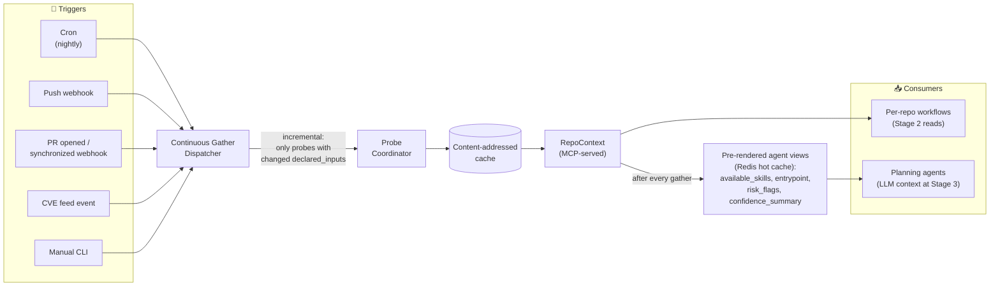

**Freshness modes** (CLI flag / API parameter; default depends on trigger source):

- **`fresh-on-trigger`** *(default for cron, webhooks, CVE events)* — re-runs only probes whose `declared_inputs` changed since the last gather
- **`cached-only`** — errors on cache miss; used for replay, debugging, or running multiple tasks back-to-back against the same repo
- **`force-refresh`** — ignores cache; used when a probe's own logic has changed

**Incremental gathers.** The Coordinator diffs the current repo state against the last cached gather. Probes whose `declared_inputs` are unchanged hit the cache and reuse persisted output; only the affected probes re-run. Per [context.md](../context.md), Cursor's published cache-reuse rate for this pattern is >90% in production. The implication: most "fresh-on-trigger" gathers complete in seconds, not minutes, because most of the work is cache hits.

**Pre-rendered agent views.** A small set of slices (`available_skills`, `entrypoint`, `risk_flags`, `confidence_summary`) is pre-rendered into Redis after every successful gather, keyed by repo. These are the slices the Planning agent hits frequently during Stage 3; serving them from a hot cache keeps MCP roundtrip latency in single-digit milliseconds. The pre-render task fires automatically as the final step of every gather. (See [ADR-0013](adrs/0013-pre-rendered-redis-hot-views.md).)

**Task-Class Context Manifests (TCCMs).** Different task classes — and within a task class, different language stacks and build tools — need different slices of `RepoContext`. A vulnerability-remediation worker on a Node+npm repo cares about `package.json`, `package-lock.json`, vulnerability records, and the call sites of the affected module; the equivalent worker on a Java+Maven repo cares about `pom.xml`, the effective POM, Maven Central coordinates, and `mvn dependency:tree` output instead. To enforce this without coupling the Planner or the worker subgraphs to specific `RepoContext` shapes, the system declares a **Task-Class Context Manifest** per plugin (§4.8; [ADR-0031](adrs/0031-plugin-architecture.md)) — one YAML file at `plugins/{plugin-id}/tccm.yaml` listing the `RepoContext` keys and filesystem globs that scope needs, in three priority bands (`must_read` always loads; `should_read` loads if budget allows; `may_read` loads only on explicit request from a worker node) plus a hard token-budget cap. The Supervisor (§4.1) consults the relevant TCCM after dispatching to a subgraph and builds a **Context Bundle** that becomes the worker's initial state. Adding a new task class is a single new YAML file — no edits to the Planner, the existing subgraphs, the probes, or the gather pipeline. Pre-rendered Redis hot views (above) now auto-derive from the union of `must_read` slices across the active TCCMs rather than from a hand-curated list. The TCCM mechanism is what makes the ADR-0028 ordering ("vulnerability remediation first, distroless migration second") testable as extension-by-addition: adding the second task class is one YAML plus one subgraph, and the diff to existing files is empty. (See [ADR-0029](adrs/0029-task-class-context-manifests.md).)

**Graph-aware derived queries inside TCCMs.** Globs are coarse — `**/*.test.ts` pulls every test in a monorepo regardless of relevance. The cases that matter most (a breaking-change library upgrade that affects every call site of every affected API) need *symbol-precise* or *file-precise* selection, not pattern matches. TCCMs therefore allow each priority band to declare **derived queries** that compute affected file sets from the gathered structural artifacts: `dep_graph.consumers(package)`, `import_graph.reverse_lookup(module)`, `import_graph.transitive_callers(file_set, depth=N)`, `scip.refs(symbol)`, `test_inventory.tests_exercising(file_set)`. Each derived query is bounded by `max_files`; truncation is logged in the Bundle provenance. The three structural sources differ in precision and cost — dep graph is coarsest but cheapest, tree-sitter file-level edges are middle, SCIP symbol-level refs are surgical but slowest — so a TCCM author picks the cheapest sufficient primitive for each entry. The `must_read` band typically carries the tight SCIP-precise set; `should_read` carries the wider tree-sitter net; `may_read` carries the paranoid two-to-three-hop superset that loads only on explicit request from a worker node. This is what "cast a larger net but bounded" looks like operationally — the agent always gets the precise set, optionally gets the wider net, and can promote `may_read` items mid-execution with a logged audit trail. `IndexHealthProbe` (the B2 probe — "the single most important probe" per CLAUDE.md) becomes load-bearing here: a stale SCIP index means wrong call sites, so the Bundle Builder reads its confidence rating and degrades gracefully to tree-sitter-only with a logged downgrade when SCIP cannot be trusted. (See [ADR-0030](adrs/0030-graph-aware-context-queries.md).)

**Why this matters architecturally.** The continuous gather is what makes commitment §2.1 ("no LLM in the gather pipeline") operationally tractable at portfolio scale. Because the gather is deterministic, it can run continuously, cached, and incrementally — and the agent never waits for it. If the gather involved LLM calls, this pattern would be cost-prohibitive on every push to every watched repo. The deterministic constraint and the always-fresh property are two sides of the same coin.

**Cold vs. warm vs. incremental run times** (figures from [context.md §"What runs the gatherer"](../context.md)):

- **Cold gather** (first time a repo enters the system): 3–6 minutes, dominated by SCIP indexing and runtime tracing
- **Warm gather** (most caches valid, one or two probes need refresh): 20–40 seconds
- **Incremental gather** (only the Dockerfile changed since last run): under 10 seconds

These figures are what make the always-fresh property viable as a default behavior rather than an expensive option.

### 3.3 Cost and ROI as first-class concerns

The system must be cost-effective at portfolio scale (hundreds to thousands of migrations per year). Cost is treated as a load-bearing architectural property — measured, bounded, and optimized at the design level — not bolted on after the fact. This makes cost commitment §2.9 enforceable rather than aspirational. (See [ADR-0024](adrs/0024-cost-observability-end-to-end.md) for the underlying commitment in full.)

**The architecture is cost-favorable by design.** Three existing choices keep per-workflow LLM spend low without sacrificing capability:

- **Deterministic gather** (commitments §2.1, ADR-0005, ADR-0006) means **zero** LLM spend on the continuous, always-running context layer. The gatherer runs against every watched repo on every push without burning tokens.
- **Recipe-first planning** (ADR-0011) skips the LLM entirely on the common case. Most distroless-migration steps map to OpenRewrite recipes or internal rulesets; only the residual fall through to LLM-from-scratch.
- **Knowledge-graph reuse** (§4.5 Scenario B, ADR-0011, ADR-0017) compounds savings across the portfolio. Each successful migration adds a solved example; future workers retrieve it and use it as few-shot context, slashing LLM tokens for repeated patterns. The system gets cheaper per migration as it runs.

The LLM is invoked at only seven points across the pipeline (§3.1, the seven-of-twenty-eight LLM-using personas) — not because we artificially minimized it, but because the architecture pushes determinism wherever determinism is possible.

**Cost telemetry instrumentation.** Every layer emits cost data on every action. The cost-emission interface is a cross-cutting concern that every Activity implements:

| Emission source | What's emitted | Aggregation key |
|---|---|---|
| Leaf LLM call | Input + output tokens by model; latency | `(workflow_id, stage, node, model)` |
| Sandbox run | microVM-seconds; image-pull bytes; build-cache hit/miss | `(workflow_id, stage, gate_id)` |
| Probe Coordinator | Wall-clock per probe; cache hit/miss; cold-vs-warm | `(workflow_id, probe_name)` |
| Temporal | Workflow wall-clock; state-payload size; Activity retries | `(workflow_id, stage)` |
| MCP / Redis | Read counts; payload sizes | `(workflow_id, mcp_name)` |
| Stage 6 Handoff | Reviewer time from PR open to merge (from GitHub events) | `(workflow_id, reviewer)` |
| Knowledge Graph | Lookup count; hit rate; latency | `(workflow_id, query_class)` |

All emissions flow to a **cost ledger** keyed by `workflow_id`. The ledger is the source of truth for both budget enforcement and ROI calculation.

**Per-workflow budget enforcement.** Each workflow declares a token budget at startup (default per task class — vulnerability patches get a higher cap than convenience migrations). The Temporal workflow tracks cumulative spend after every Activity completion via a deterministic counter in workflow state. When spend approaches the cap (default: 80% triggers a soft warning, 100% triggers a hard halt), the Supervisor short-circuits: pause the workflow, log the budget overrun, escalate to human. Hard ceiling; no soft override without an explicit `--allow-overrun` annotation on the workflow start signal. (See [ADR-0025](adrs/0025-per-workflow-cost-cap.md).)

This is captured as [ADR-0024](adrs/0024-cost-observability-end-to-end.md) (cost observability commitment), [ADR-0025](adrs/0025-per-workflow-cost-cap.md) (per-workflow cap as hard guard), [ADR-0026](adrs/0026-roi-kpi-model.md) (ROI KPI model), and [ADR-0027](adrs/0027-cost-attribution-model.md) (cost-attribution model — how costs map to workflows when multiple stages touch multiple repos).

**ROI metrics** (see [ADR-0026](adrs/0026-roi-kpi-model.md) for the full KPI catalog). The two headline ratios computed weekly from the cost ledger and Stage-7 Learning outputs:

- **Cost per successful PR** = (sum of system cost over the period) ÷ (PRs merged over the period)
- **Cost per CVE eliminated** = (sum of system cost over the period) ÷ (severity-weighted CVE reductions over the period)

Supporting metrics for diagnosis:

- **Mean Time to Remediate (MTTR)** for newly-disclosed CVEs in watched repos — autonomous PR proposal should compress this from days to hours
- **Engineer-hours saved per migration** vs. the manual-baseline estimate captured during initial calibration
- **Portfolio coverage trajectory** — % of eligible repos migrated, by quarter
- **Merge rate** — PRs opened ÷ PRs merged
- **Post-merge incident rate** — fraction of merged PRs that caused production incidents
- **Reviewer override rate** — fraction of PRs where the human rejected or substantially modified the agent's plan
- **Knowledge-graph reuse rate** — fraction of LLM invocations that consumed a solved example as few-shot

The dashboard surfaces these on a Stage-7-driven update cycle — every successful merge emits to the ledger and the ROI feed.

**Architectural implication: cost is just another signal.** The Trust-Aware layer (§4.1, §4.6) already treats sandbox build, test pass/fail, and SAST findings as gate inputs. The cost ledger feeds the same gate machinery — if a workflow's cost is approaching its cap, the gate's "advance" decision factors that in (e.g., refuse the next LLM-fallback node when the budget is near exhaustion; prefer the cheaper recipe path even at the cost of broader coverage). Cost ceases to be an out-of-band concern and becomes a state-machine input alongside everything else.

---

## 4. Orchestration — the Layered Hybrid

This is the deep chapter. Every architectural choice in this section is the load-bearing one; everything else flows from here.

### 4.1 The three layers and the outer envelope

#### Outer envelope: Temporal

Temporal owns the per-repo workflow. (See [ADR-0003](adrs/0003-temporal-as-workflow-substrate.md).) Why Temporal specifically:

- **Durable execution.** Workflow state rehydrates on worker restart. If Stage 4 crashes mid-migration, the next worker resumes at that exact step with all prior state intact.
- **Signals as first-class.** A `pull_request.closed` webhook arriving 72 hours after Stage 6 paused is a normal signal, not a special case.
- **Workflow-as-code in Python**, not YAML DAGs or a proprietary DSL.
- **Retry policies for free.** LLM transient failures and CI flakes are handled by Temporal's retry semantics, not bespoke code.
- **Production precedent.** OpenAI's Codex and Replit's coding agent both run on Temporal per [auto-agent-design.md §2.3](../auto-agent-design.md).

The alternatives — Airflow (batch-oriented, can't suspend for days cleanly), Step Functions (AWS-locked, no in-language workflow code), Dagster (asset-pipeline-shaped, awkward for branching stage workflows), Prefect (smaller ecosystem, weaker durability), Argo Workflows (rigid YAML DAGs), home-rolled (~70% of Temporal poorly) — each fail on at least one load-bearing property.

#### Layer 1: Hierarchical Planner (the LangGraph Supervisor)

At the top sits a master `StateGraph` with a Supervisor node. Its only job is to read intent, map scope, and dispatch. The whole three-layer composition is captured in [ADR-0001](adrs/0001-layered-hybrid-orchestration.md).

- **For a vulnerability task** ("Fix CVE-2026-145 in auth-service"): the Supervisor recognizes a high-risk targeted patch, isolates the specific repository, and spawns a single specialized worker agent on a short restrictive subgraph.
- **For a migration task** ("Migrate every Node service to distroless"): the Supervisor acts as a project manager. It maps cross-service dependencies via the gather layer, determines the order of operations, and spawns N worker agents in parallel — each on its own subgraph, each handling one repo.

Mechanically: the Supervisor analyzes the request, reads the repo's gathered languages and build-tool inventory from `RepoContext`, and resolves which **plugin** matches the `(task × language × build-tool)` tuple (§4.8 below; [ADR-0031](adrs/0031-plugin-architecture.md)). It does not execute work. A `conditional_edge` reads the resolved plugin and drops the payload into the plugin's **subgraph**. Before invoking the subgraph, the Supervisor reads the plugin's TCCM (§3.2; [ADR-0029](adrs/0029-task-class-context-manifests.md)) — after walking the plugin's `extends` chain to inherit common contributions — and builds a Context Bundle that becomes the subgraph's initial state. Each subgraph receives only the `RepoContext` slice its plugin declared it needs. This keeps the codebases for different workflows entirely isolated — adding a new `(task × language × build-tool)` combination means adding a new plugin directory, never editing existing ones.

The Supervisor implementation can be pure routing (deterministic intent classification + lookup) or LLM-driven. For Phase 1, pure routing likely suffices; see §7.

#### Layer 2: SHERPA-style State Machine (the worker subgraphs)

Each worker is dropped onto a strictly typed `StateGraph` backed by a Pydantic state model. The state ledger is the agent's entire memory; the LLM cannot escape it. (See [ADR-0002](adrs/0002-langgraph-as-runtime-sherpa-as-discipline.md) for the runtime-vs-discipline framing.)

**The discipline (from arXiv 2509.00272):**

- **Nodes never call other nodes.** Each node reads state, mutates state, returns. It has no idea what runs next.
- **State as the contract.** The transition to the next step is handled entirely by the graph's structure. LangGraph inspects state after each node returns; if the state now contains the artifact the next node expects, the graph activates that next node.
- **Hierarchical decomposition.** Subgraphs nest. A Migration Subgraph contains a Dependency-Resolution Subgraph; failures at the inner level surface as state updates at the outer level.
- **Domain best-practices encoded as graph topology.** The Chainguard Guardener loop (parse → translate → dev-variant scaffolding → build → compare → iterate → validate, per [gemini-auto-agent-design.md §"AI-Assisted Iterative Migration"](../gemini-auto-agent-design.md)) becomes the literal node sequence in the Migration Subgraph. The expert-encoded best practice is not a prompt; it is the graph.

This prevents the agent from hallucinating off-topic actions because it physically cannot execute anything outside of its current node. It cannot "decide to also push to main" or "decide to skip the test suite" — neither action exists in its graph.

Example Migration Subgraph topology:

```
Extract_Dependencies → Resolve_Conflicts → Rewrite_Manifests → Rewrite_Dockerfile
                                                                       │
                                                                       ▼
                              Open_PR ◄── Run_Smoke_Tests ◄── Build_Sandbox
                                              │
                                              └── (Trust-Aware gates between every arrow)
```

#### Layer 3: Trust-Aware Verification (the conditional edges)

Between every node is a `conditional_edge` that acts as a gate. The agent does not flow directly from one node to the next; it flows through a guard that evaluates objective signals.

The guard's logic:

- **Run sandbox checks.** Push the agent's output into a tightly permissioned microVM. For a Dockerfile rewrite: `docker build`, verify the image starts, run the smoke test, capture a runtime trace, diff against the pre-migration baseline. For a vulnerability patch: SAST + DAST + the targeted CVE test suite. (See [ADR-0012](adrs/0012-microvm-sandbox-for-trust-gates.md).)
- **Compute the trust score from objective signals only** (see §4.6 for why self-reported LLM confidence cannot feed this).
- **If the build/test failed:** route the workflow back to the previous node with the sandbox error log attached to state. The agent retries with new context. Per-node retry limit defaults to 3; on exhaustion the subgraph gracefully halts and logs failure to the knowledge graph. (See [ADR-0014](adrs/0014-three-retry-default-per-gate.md).)
- **If checks passed but trust is low and the change is sensitive:** trigger LangGraph's `interrupt()`. This pauses the entire graph mid-execution, saves state via the checkpointer, and waits for a human engineer to review before continuing.
- **If trust is high and checks passed:** route to the next node.

The Trust-Aware layer is also the natural integration point for the **deterministic policy engine** pattern (Agent RuleZ, per [gemini-auto-agent-design.md §"Deterministic Policy Engines"](../gemini-auto-agent-design.md)). Every state transition is a hookable event; policy rules can block, allow, or inject context with sub-10ms latency before the transition fires.

### 4.2 LangGraph as the physical engine; SHERPA as the blueprint discipline

These are not alternatives — they compose. The framing matters because LangGraph implementations elsewhere routinely violate SHERPA discipline (nodes call other nodes, agents are given freedom to choose paths outside the state contract, state is unstructured dicts) and lose most of the determinism benefits.

| Concern | What LangGraph provides | What SHERPA discipline adds |
|---|---|---|
| State management | `StateGraph` API with reducers | **Pydantic-typed state model; no untyped state allowed** |
| Node-to-node flow | Allows direct node calls; discourages but permits | **Forbidden. Nodes mutate state and return; only edges transition** |
| Branching | `conditional_edge` and dynamic edges | **Branches reflect domain best-practices, not ad-hoc agent choice** |
| Hierarchical composition | Subgraphs | **Subgraphs are first-class architectural primitives, used aggressively** |
| Human-in-the-loop | `interrupt()` + checkpointer | **Used at every low-trust transition, not only at end-of-flow** |
| Agent freedom | Up to the implementor | **Constrained to the leaf LLM call inside a node; no orchestration freedom** |

A LangGraph implementation that adheres to SHERPA discipline is what we mean by "the Layered Hybrid." A LangGraph implementation that doesn't is just "LangGraph alone" and loses on most of the rows below.

### 4.3 Comparison matrix

The five options compared. The chosen column is the rightmost; the four to its left are each rejected on specific grounds traceable to the commitments in §2.

| Criterion | LangGraph alone | CrewAI alone | Agents SDK alone | Hand-rolled HSM | **Layered Hybrid** ✓ |
|---|---|---|---|---|---|
| **1. Determinism / replayability** | Partial — ad-hoc node calls erode replay | Weak — emergent role-based coordination is non-deterministic | Weak — minimal tool-loop with no path constraints | Strong if disciplined | **Strong** — state-as-contract guarantees same inputs same path |
| **2. Hierarchical decomposition** | Subgraphs exist but rarely used | None — flat role list | None | Yes by definition | **Yes — first-class subgraph nesting** |
| **3. Domain best-practices as structure** | Possible but not enforced | Encoded as prompts, not structure | Encoded as prompts | Yes by design | **Yes — graph topology = best practices (per SHERPA paper)** |
| **4. Human-in-the-loop suspension** | `interrupt()` + checkpointer | Limited; not the design center | Not in the framework | Build it yourself | **`interrupt()` at every low-trust transition** |
| **5. Debuggability of agent decisions** | State-history visible; node calls confuse the trace | Hard — emergent multi-agent chatter | Tool-call log only, no state ledger | Whatever you build | **State diff per transition + sandbox evidence + gate verdict** |
| **6. Audit trail / governance** | Available via callbacks | Weak | Limited to tool-call traces | Build it yourself | **Every transition logged with state, signal, gate result** |
| **7. Compatibility with deterministic policy hooks** | Edges are hookable | No clean integration surface | None | Yes by definition | **`conditional_edge` is the natural Agent RuleZ hook point** |
| **8. Token-budget predictability** | Up to implementor — risk of loops | Higher — multi-agent debate burns tokens | Lower per call but no orchestration cap | Yes if disciplined | **Per-node retry cap (3); graceful halt; supervisor short-circuit** |
| **9. Framework / vendor lock-in** | LangChain ecosystem coupling | CrewAI-specific abstractions | Per-vendor SDK | None | **LangGraph for runtime; SDK for leaf calls only — both replaceable at boundaries** |
| **10. Maturity / production usage 2026** | Strong — used by serious agent shops | Strong for prototypes; less for production | Both Anthropic and OpenAI SDKs production-grade | Variable | **Strong substrate + emerging pattern (Sherpa paper recent)** |
| **11. Compatibility with Temporal** | Works as Activity payload | Works but awkward | Works as Activity | Works | **Works — LangGraph subgraph executes inside a Temporal Activity** |
| **12. Constrains agents during maintenance** (per "Safer Builders" finding) | Partially — depends on graph rigor | No — agents free to "collaborate" off-path | No — minimal constraints | Yes if rigorous | **Yes — agents physically cannot leave the state contract** |

The Layered Hybrid wins on rows 1, 2, 3, 5, 6, 7, 8, 9, 12 and ties on the rest. No alternative wins more rows than it.

### 4.4 How each layer maps to the 7-stage pipeline

| Pipeline stage | Layer that owns it | Implementation notes |
|---|---|---|
| 0. Discovery | Temporal scheduled workflow + deterministic Activities | No LLM. |
| 1. Assessment | Hierarchical Planner routes to language-specific assessor subgraph | LLM at the routing decision and inside the assessor subgraph. |
| 2. Deep Scan | Deterministic Activity (the `localv2.md` probe pipeline) | No LLM. |
| 3. Planning | SHERPA subgraph: `recipe_match` → `solved_example_rag` → `llm_fallback` → `emit_steps` | LLM at `llm_fallback` only; gated by Trust-Aware. |
| 4. Execution (autonomous) | SHERPA subgraph: `red_phase` → `apply_change` → `green_phase` → `commit` | LLM at `apply_change`; Trust-Aware gate after `green_phase`. |
| 5. Validation | Trust-Aware gate (microVM sandbox: build, test, SAST, CVE delta) | No LLM in evaluation; LLM only for failure adjudication. |
| 6. Handoff | Temporal signal wait on GitHub webhook | No LLM. |
| 7. Learning | Deterministic Activity writes solved examples to the knowledge graph | No LLM. |

Notice the LLM appears at only three nodes across the entire pipeline. Everything else is deterministic. This is the load-bearing commitment from §2.4 ("determinism over probabilism for structural changes") rendered as architecture.

### 4.5 Concrete worked examples

#### Scenario A: Application-layer vulnerability

**Trigger:** "Fix CVE-2026-145 in auth-service" (a high-severity finding from the org's CVE scan).

**Layer 1 — Hierarchical Planner:** Supervisor recognizes the task as a targeted security patch (single repo, narrow scope). Updates state with `routing.subgraph = "vulnerability"`. The `conditional_edge` dispatches into the Vulnerability Subgraph.

**Layer 2 — Vulnerability Subgraph (short, restrictive):**

```
Reproduce_CVE → Draft_Patch → Build_Sandbox → Run_Security_Suite → Open_PR
```

The agent receives the CVE description, the affected symbol from the `RepoContext` artifact, and the relevant Skill (e.g., `vuln-remediation-nodejs-prototype-pollution`). At `Draft_Patch`, the LLM proposes a fix. The state ledger now contains the patch diff.

**Layer 3 — Trust-Aware gates cranked to maximum:**

- After `Draft_Patch`: gate runs SAST against the patched file. If SAST fails or detects new findings, route back to `Draft_Patch` with the SAST output attached to state. Retry limit 3.
- After `Build_Sandbox`: gate verifies the image builds in a microVM. Build failure → back to `Draft_Patch` with build logs.
- After `Run_Security_Suite`: gate runs the targeted CVE test (proves the vulnerability is no longer exploitable) plus the full test suite. Any failure → back to `Draft_Patch`.
- On retry exhaustion: `interrupt()` fires, the workflow checkpoints, and a human engineer is paged.

**Result:** A PR with evidence (CVE reproduction artifact, patched file, SAST diff, sandbox test output) attached. Merge is human. If the agent failed after 3 attempts, no PR is opened — escalation only.

#### Scenario B: Org-wide migration

**Trigger:** Stage 0 nightly scan finds 50 Node services running outdated base images. CVE-delta prioritization ranks them.

**Layer 1 — Hierarchical Planner:** Supervisor sees a portfolio task. Queries the gather layer's cross-repo data to determine dependency order (shared libraries first, then leaf services). Spawns 50 worker workflows in parallel, each its own Temporal workflow, each entering the Migration Subgraph.

**Layer 2 — Migration Subgraph (longer, branching):** Per the Chainguard Guardener pattern encoded as graph topology:

```
Parse_Existing → Translate_Packages → Scaffold_Multi_Stage → Build_Dev_Variant
                                                                     │
                                                                     ▼
            Open_PR ◄── Compare_SBOM ◄── Build_Final ◄── Smoke_Test_Dev
                              │
                              └── (Trust-Aware gates between every arrow)
```

**Layer 3 — Trust-Aware gates plus the shared knowledge graph:**

- Standard gates per scenario A: build success, smoke test, SBOM diff non-positive on CVE count, no shell in final image, non-root user.
- **Cross-worker learning:** when Worker #45 hits a dependency conflict at `Translate_Packages` that Worker #2 resolved an hour ago, the Hierarchical Planner injects Worker #2's proven resolution into Worker #45's state before the LLM is consulted. Drastically reduces tokens and hallucination risk. This is the solution store from Stage 7 doing work mid-pipeline.

**Result:** Each of the 50 worker workflows independently produces a PR (or escalates on retry exhaustion). Failures in one worker do not crash the supervisor or sibling workers. The org wakes up to a dashboard of 50 PRs in various review states, each with full evidence.

### 4.6 Push-back: trust scores use objective signals only

The architecture as proposed includes a "trust score" gating low-trust transitions to human review. The user's initial framing referenced "internal confidence metrics" from the agent. **This design rejects that.** Trust score is computed from objective evidence only. (See [ADR-0008](adrs/0008-objective-signal-trust-score.md).)

The reason is empirical, not philosophical. The Confidence Trap finding in [gemini-auto-agent-design.md §"Mitigating the Confidence Trap"](../gemini-auto-agent-design.md) reports: agentic PRs at the highest self-reported confidence levels (8–10 out of 10) still introduce breaking changes at 3.16–3.96%. At confidence 10, the rate is 3.16% (458 breaks out of 14,509 commits). The correlation between LLM-reported confidence and code correctness during maintenance tasks **breaks down completely** — agents are overconfident in failure.

A gate keyed on self-reported confidence is therefore worse than no gate at all: it produces false reassurance proportional to risk.

The trust score this design uses is computed only from objective signals:

- Sandbox build status (binary)
- Test pass/fail counts and changes vs. baseline
- SAST/DAST findings, new vs. baseline
- CVE delta direction (more, same, or fewer)
- Runtime trace coverage (which scenarios completed cleanly)
- Policy-engine block events (any deterministic rule fired?)
- Coverage of changed code by existing tests

LLM self-reported confidence may be **logged** for observability and drift analysis. It does not feed the gate.

The specific gate threshold (initially proposed as T_conf ≤ 0.90) is deferred to §7 pending empirical calibration on the first 50 production migrations. Until then, gates use binary pass/fail on sandbox checks: all objective signals must pass, or the transition is blocked.

### 4.7 Why each alternative loses

**LangGraph alone (without SHERPA discipline).** Loses on rows 1, 3, 5, 12 of the matrix. The framework permits ad-hoc node-to-node calls, untyped state dicts, and unconstrained agent paths. Without the discipline of state-as-contract, the determinism we need for structural changes (commitment §2.4) erodes. Implementations elsewhere routinely allow agents to "collaborate" across nodes — exactly the failure mode the Safer Builders paper warns against.

**CrewAI alone.** Loses on rows 1, 2, 3, 5, 6, 7, 12. Role-based emergent coordination is the architectural opposite of state-as-contract. Agents debate, hand off, and improvise — useful for prototyping, catastrophic for high-stakes maintenance where agents fail at 9.35% during chore tasks. Violates commitments §2.2, §2.3, §2.4 simultaneously.

**Agents SDK alone (Anthropic or OpenAI).** Loses on rows 2, 3, 4, 6, 7, 8, 12. Minimal tool-use loops have no orchestration primitives at all. You would end up building LangGraph by hand, badly. The right place for an Agents SDK is at the leaf LLM call inside a node — and the chosen Layered Hybrid uses it there.

**Hand-rolled SHERPA-style HSM (no LangGraph runtime).** Loses on rows 9, 10, 11. Technically possible but reinvents checkpointing, interrupts, persistence, state-history visualization, and runtime tooling that LangGraph already supplies. The benefit (zero framework dependency) is paid for by years of edge-case debugging. Reject on §2.5 grounds — extension by addition presumes a stable runtime substrate.

### 4.8 Plugins: granular units of (task × language × build-tool) work

Sections 4.1–4.7 describe the orchestration *shape* — Temporal envelope around a Hierarchical Planner around SHERPA subgraphs around Trust-Aware gates. But **what** flows through that shape — which subgraph, which TCCM, which probes — depends on more than task class alone. A Yarn-Berry-resolved Node app and an npm-resolved Node app share intent ("upgrade this vulnerable package") but operate on different dependency models, different lockfile shapes, and different runner-stage assumptions. Java Maven and Java Gradle vulnerability remediation share even less. To capture this granularity declaratively, the system organizes work into **plugins**, each scoped by a tuple `(task × language × build-tool)`. (See [ADR-0031](adrs/0031-plugin-architecture.md).)

**Scope tuple.** A plugin's scope declares which workflows it applies to:

- **Task class** — vulnerability-remediation, distroless-migration, container-layer-vulnerability, library-upgrade, language-upgrade, ...
- **Language** — node, java, python, go, ruby, dotnet, ...
- **Build tool / package manager** — npm, yarn-classic, yarn-berry, pnpm, maven, gradle, pip, poetry, uv, sbt, ...

Any dimension may be `*` (wildcard). The most specific match wins; ties are broken by an explicit `precedence` field in the plugin manifest. Plugins compose via an `extends` field — a `(vuln, node, yarn-berry)` plugin inherits from `(vuln, node, *)` and overrides only what's actually different.

**Layout.** Plugins live under `plugins/{task-class}--{language}--{build-tool}/`. Examples:

```
plugins/vulnerability-remediation--node--npm/
plugins/vulnerability-remediation--node--yarn-berry/
plugins/vulnerability-remediation--java--maven/
plugins/distroless-migration--node--yarn-berry/
plugins/library-upgrade--python--poetry/

plugins/vulnerability-remediation--node--*/      # base for Node vuln plugins (parent)
plugins/vulnerability-remediation--*--*/         # universal base (orchestration shell)
```

**Contributions.** Each plugin bundles `plugin.yaml` (scope, version, requirements), `tccm.yaml` (the TCCM from §3.2 / [ADR-0029](adrs/0029-task-class-context-manifests.md), scoped to this plugin), `probes/` (probe implementations the gather pipeline picks up), **`adapters/`** (language search adapters — small Python modules implementing the ADR-0030 query primitives `scip.refs`, `import_graph.reverse_lookup`, `dep_graph.consumers`, `test_inventory.tests_exercising`, `import_graph.transitive_callers` for this plugin's language and build-tool slice; the Bundle Builder routes primitive calls to the registered adapter per [ADR-0032](adrs/0032-language-search-adapters.md)), `subgraph/` (the LangGraph state machine for execution), `skills/`, `recipes/`, and an optional `adrs/` directory for plugin-local design records.

**Resolution.** When a workflow fires, the Supervisor (§4.1) reads the workflow's task class plus the repo's `RepoContext.languages` and `RepoContext.build_systems`, queries the plugin registry, ranks candidates by specificity-then-precedence, and picks the most-specific match. It then walks the chosen plugin's `extends` chain to collect inherited contributions (TCCM entries, skills, recipes, probes) — child overrides parent on name collision. Subgraph topology is **not** inherited (graph topology is the most behavioral piece of a plugin; surprise behavior from invisible inheritance would be hard to debug — reuse happens at the node level via shared Python modules, not at the graph level).

**Probes stay scope-agnostic.** Existing probes ([ADR-0007](adrs/0007-probe-contract-preserved-poc-to-service.md)) do not know about plugins. Plugins declare in `plugin.yaml` which probes they require; the Coordinator unions probe requirements across all candidate plugins for the repo and runs that set. This preserves the probe contract while letting new plugins introduce probes the contract didn't anticipate — a Yarn Berry plugin's `YarnBerryPnpResolverProbe` contributes a `pnp_resolution` slice to `RepoContext` that only repos in scope of that plugin will ever have; a Maven plugin's `MavenEffectivePomProbe` contributes an `effective_pom` slice. The Bundle Builder only sees slices that exist; missing slices are absence, not errors.

**The extension-by-addition test.** Adding a new `(task × language × build-tool)` combination is one new plugin directory. Phase 3 of the roadmap ships `(vuln, node, npm)` as the first plugin; Phase 7 ships `(distroless, node, npm)` and proves the system end-to-end — adding it touches no file outside `plugins/distroless-migration--node--npm/`. Every future plugin reuses that proof. [ADR-0028](adrs/0028-task-class-introduction-order.md)'s task-class-introduction-order discipline generalizes to plugin-introduction-order: introduce one tuple at a time, prove the loader is sound on the second, scale outward.

---

## 5. AgentOps and the Trust-Aware layer

The Trust-Aware layer is where AgentOps lives architecturally. Most of what published AgentOps writeups treat as a separate concern is, in this design, the natural job of the gate edges between SHERPA nodes.

### Sandboxed reality checks

Every code-modifying transition runs the agent's output inside a microVM before the transition is allowed.

- **For migrations:** `docker build` the new image; run the existing smoke test against the running container; capture a runtime trace; diff shared-library loads against the pre-migration baseline.
- **For vulnerability patches:** SAST against the patched files; DAST against the running service; targeted CVE test (proves the vuln is no longer exploitable); full unit + integration test suite.
- **For any structural change:** AST-equivalence checks (where applicable) and a behavioral diff against known-good fixtures.

Sandbox stack (Firecracker vs. gVisor vs. nested QEMU) is deferred to §7 — the choice depends on cold-start sensitivity and kernel-feature requirements for `strace` and eBPF.

### Trust score and gates

Score is computed per §4.6: objective signals only, LLM self-confidence excluded. Each task class (vulnerability vs. migration vs. language upgrade) gets its own gate threshold profile — security patches gate harder than convenience migrations. Failure of the gate routes back to the previous node with full error context attached to state. Sustained failure (retry limit 3) triggers `interrupt()` and escalates to human review.

### Checkpointer

LangGraph's checkpointer backs durable state across interrupts. `InMemorySaver` for development and tests; a Postgres or Redis backend for production. Backend choice deferred to §7 pending volume estimate.

### Retry limits

Per-node retry cap defaults to 3. On exhaustion the subgraph halts gracefully, logs the failure to the knowledge graph as a "negative example" (so future planning can avoid the same path), and the supervisor continues with other parallel workers. The supervisor itself does not crash; a single worker's failure is isolated.

### Shared knowledge graph

Cross-worker solution reuse, populated by Stage 7 Learning. When a worker hits a problem a sibling worker has already solved, the Hierarchical Planner injects the proven resolution into the worker's state before the LLM is consulted. Drastically reduces token spend and hallucination risk at portfolio scale. Backend choice (Qdrant vs. pgvector vs. Neo4j) deferred to §7 — depends on whether traversal queries are needed or similarity search suffices.

### Identity and tool governance

Each agent runs under a scoped least-privilege identity. Tools are exposed via MCP servers, not as raw shell access — the gather-layer MCP from [context.md](../context.md) is the canonical example. The Trust-Aware layer can intercept and audit every tool call before it executes; a dedicated policy engine (Agent RuleZ pattern, per [gemini-auto-agent-design.md §"Deterministic Policy Engines"](../gemini-auto-agent-design.md)) can block, allow, or inject context at sub-10ms latency.

### Observability

Reasoning traces, tool-call logs, state-transition history, and gate-evaluation events are all persisted to an audit store. Drift detection runs against task success rates per stage and per agent role — if Stage 3 Planning's recipe-match rate suddenly drops, the system surfaces the regression before quality cascades.

### Cost controls

**Per-workflow budget cap.** Each workflow declares a token + compute budget at start (default per task class). The Temporal envelope tracks cumulative spend in workflow state; when 80% is reached, a soft-warning signal fires; at 100%, the workflow halts and escalates. Hard ceiling — no autonomous overrun. Captured in ADR-0025.

**Per-stage retry bounds.** Default 3 retries per node (ADR-0014). Exhaustion routes through `interrupt()` rather than continuing to spend.

**Orchestration timeouts** on long-running Activities (sandbox builds capped at 10 minutes; LLM calls capped per model's documented max).

**Anti-spin guard.** The Supervisor short-circuits any workflow where the same state fingerprint appears three times after retries — same state means no actual advancement; continued retries would only burn tokens.

**Cost telemetry pipeline.** Every Activity emits cost data (tokens, microVM-seconds, wall-clock, retries) to the **cost ledger** keyed by `workflow_id`. The ledger feeds three downstream consumers: the Budget Enforcer (Temporal middleware that reads cumulative spend and triggers caps), the ROI Dashboard (weekly cost-per-PR and cost-per-CVE-eliminated rollups), and the Cost View architectural diagram (§8.10). Full instrumentation model in §3.3.

**ROI KPI surfacing.** Stage-7 Learning's telemetry-emitter persona writes per-merge cost outcomes to the ledger. The dashboard computes weekly ratios and surfaces them to platform leadership. Captured in ADR-0026.

### Confidence calibration as a future concern

The "40-Point Rule" from [gemini-auto-agent-design.md](../gemini-auto-agent-design.md) — halt and escalate when the gap between agent pattern-match confidence and information completeness exceeds 40 points — is interesting but contingent on having reliable confidence signals. Per §4.6, we do not yet. This is a Phase 3 concern, not a Phase 1 implementation requirement.

---

## 6. POC-to-service mapping

The POC ([localv2.md](../localv2.md)) is not a throwaway. Its components lift unchanged into the service. This is the architectural promise of the probe contract. (See [ADR-0004](adrs/0004-python-as-harness-language.md) for the Python harness commitment that makes this lift seamless, and [ADR-0007](adrs/0007-probe-contract-preserved-poc-to-service.md) for the contract preservation guarantee.)

| POC component (`localv2.md`) | Service-time counterpart |
|---|---|
| `Probe` ABC contract (§4) | **Unchanged.** Same ABC; lifts directly. |
| Probe registry (decorator-based) | **Unchanged.** Same registry. |
| asyncio coordinator | Temporal Activities; each probe runs as its own Activity; one Activity-per-Probe pattern |
| Filesystem cache (`.codegenie/cache/`) | Object store (S3) for raw artifacts + Postgres metadata index for cache keys |
| `repo-context.yaml` artifact | MCP-served `RepoContext` resource, queried by Stage 3 Planning subgraph |
| Raw probe outputs (`.codegenie/context/raw/`) | Same content, stored in object store, referenced from MCP responses |
| Skills directory (`~/.codegenie/skills/`) | Service-level config repo, MCP-served, versioned |
| Conventions / policies / exceptions YAML | Service-level config repo, MCP-served |
| `CONTEXT_REPORT.md` | Generated as a Stage 2 output, attached to the PR in Stage 6 as evidence |
| CLI entry point (`codegenie gather`) | Triggered continuously by push / PR / CVE webhooks and nightly cron via the Continuous Gather Dispatcher (§3.2); CLI invocation remains for manual local-dev |
| `.codegenie/notes/` (RepoNotesProbe) | Per-repo directory, walked the same way at service time |
| External docs (D8/D9) | Same probes; production fetches go through approved API clients with audit logging |

The probe contract specifically does not change. New probes, new languages, new task types are added by addition; the coordinator's dispatch backend swaps (asyncio → Temporal) and the cache backend swaps (filesystem → object store), but no probe code is rewritten.

The reverse implication: every architectural decision made in the POC is a forward-compatible decision. Bugs in the POC's probe contract are bugs that propagate into the service. The probe contract review at the end of POC v0.1.0 is therefore the most consequential review in the project.

---

## 7. Open questions and decisions deferred

Each item below is deliberately not settled. The doc commits to revisiting each when the named evidence is available.

### Trust-score threshold calibration ([ADR-0015](adrs/0015-trust-score-threshold-calibration.md))

The user proposed T_conf ≤ 0.90 as a reject threshold. The doc commits to objective-signal-only scoring (§4.6) but defers the formula weights and threshold to empirical calibration on the first 50 production migrations. Until then, gates use binary pass/fail on sandbox checks. Resolution requires: real migration data with merge outcomes, post-merge incident data, false-positive/false-negative rates by signal type.

### Checkpointer backend ([ADR-0016](adrs/0016-checkpointer-backend.md))

`InMemorySaver` for development. Postgres vs. Redis for production. Decision waits on volume estimate (workflows per day, average state size per workflow, interrupt frequency, query patterns). Postgres is the default-correct answer; Redis becomes attractive only if state-update throughput dominates.

### Knowledge-graph backend ([ADR-0017](adrs/0017-knowledge-graph-backend.md))

Qdrant (vector-only), pgvector (Postgres-integrated), or Neo4j (graph-native). Decision waits on the dominant query pattern. Pure similarity search → pgvector for operational simplicity. Cross-solution traversal queries ("show me every prior solution that touched this file plus that dependency") → Neo4j. Mixed → Qdrant. Default-correct: pgvector for Phase 1.

### Hierarchical Planner implementation ([ADR-0018](adrs/0018-supervisor-pure-routing-vs-llm.md))

Pure routing logic vs. LLM-driven supervisor. The SHERPA paper allows ML-driven decisions; it does not require them. For Phase 1, pure routing (deterministic intent classification + lookup table) likely suffices — the routing decision is small and structured. LLM-driven supervisor becomes attractive when intent space grows beyond a handful of task types or when intent disambiguation requires context-sensitive reasoning.

### Sandbox stack ([ADR-0019](adrs/0019-sandbox-stack.md))

Firecracker (microVM-native, hardware-isolated, fastest cold start), gVisor (user-space kernel, simpler ops, slower for some workloads), or nested QEMU (most compatibility, slowest). Decision waits on workload profile, especially: do we need `strace`/eBPF inside the sandbox (Firecracker yes; gVisor partial), and how often do we cold-start vs. reuse?

### Agents SDK at the leaves ([ADR-0020](adrs/0020-leaf-agents-sdk.md))

Anthropic vs. OpenAI vs. both behind a thin shim. The SHERPA discipline isolates this choice to leaf node implementations, so the cost of changing later is small. Default: start with Anthropic's SDK for Claude (the prompt-cache, citations, and extended-thinking features fit the planning use case); add an OpenAI implementation behind the same shim only if cost or capability arguments emerge.

### Policy engine: build vs. adopt ([ADR-0021](adrs/0021-policy-engine-build-vs-adopt.md))

The Agent RuleZ pattern is well-described; an implementation library exists per [gemini-auto-agent-design.md](../gemini-auto-agent-design.md). Evaluate whether its hook model integrates cleanly with LangGraph `conditional_edge`s (likely) or whether the LangGraph edges themselves are sufficient (also likely, with the right helper). Default: prototype with LangGraph edges + small custom helper; adopt Agent RuleZ if the policy DSL becomes a productivity multiplier.

### Per-subgraph topology ([ADR-0022](adrs/0022-per-subgraph-topology.md))

How much subgraph structure is shared boilerplate, how much is per-task. Migration and vulnerability subgraphs likely diverge significantly. Refactor opportunities surface after the third subgraph is built. Resist premature abstraction — three concrete subgraphs first, then identify the shared shape.

### MCP server topology ([ADR-0023](adrs/0023-mcp-server-topology.md))

One global MCP serving all artifacts vs. per-stage MCP servers (gather-MCP, knowledge-graph-MCP, policy-MCP). Decision waits on operational complexity — global is simpler to deploy; per-stage is simpler to scope and authorize. Default: per-stage, since the authorization model is cleaner.

---

## 8. Architectural views (4+1)

The 4+1 model (Kruchten, 1995) separates the architecture into five concerns so different stakeholders can reason about the system without holding the whole picture in their head at once. Logical view = what components exist and how they relate. Process view = how the system behaves at runtime, concurrency, and timing. Development view = how the code is organized for engineers. Physical view = how it maps onto infrastructure. Scenarios = walkthroughs that tie all four together.

Each subsequent system design doc in this project should follow the same §8 structure with the same five views, so the documentation surface stays consistent as the surface area grows.

### 8.1 Logical view — components and their relationships

What the system is composed of, conceptually, regardless of where the code lives or how it's deployed.

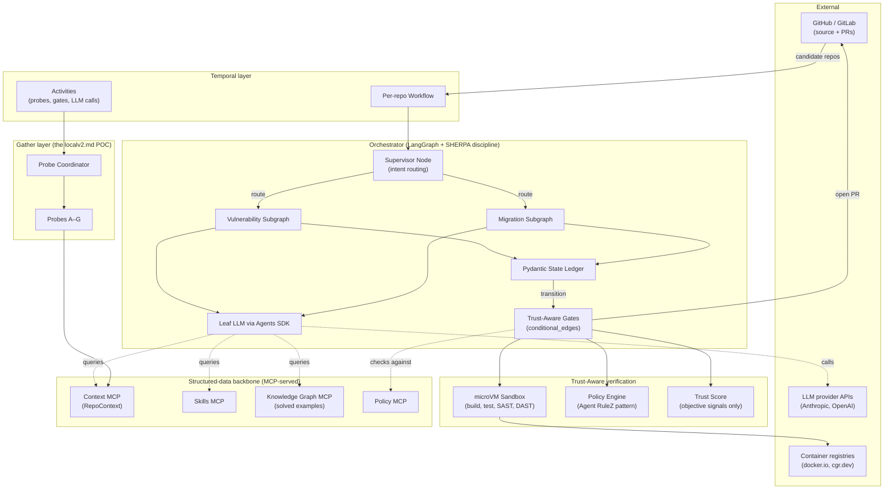

**Reading guide.** The Hierarchical Planner (Supervisor) reads intent and routes into one of the task-specific subgraphs. The subgraph progresses node-by-node, mutating the Pydantic state ledger. Every transition passes through Trust-Aware gates, which consult the microVM sandbox, the deterministic policy engine, and the objective trust score. Leaf nodes call the LLM via the Agents SDK, with context pulled on-demand from MCP-served structured data (Context, Skills, Knowledge Graph, Policy). The gather layer is the canonical Context-MCP backend.

### 8.2 Process view — runtime behavior and concurrency

How the system behaves over time. Shows fan-out across parallel workers, the gate-evaluation loop, and the durable-pause-for-human-review pattern.

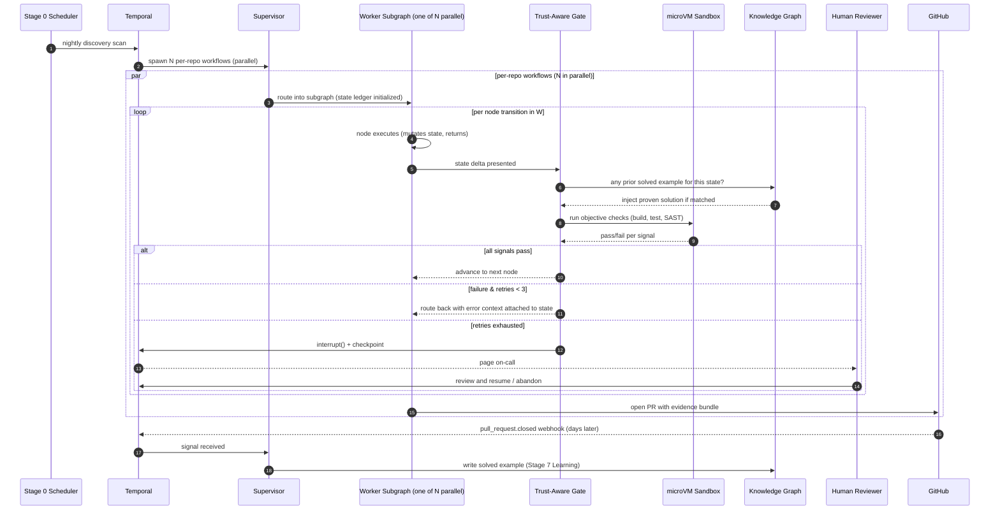

**Reading guide.** Per-repo workflows execute in parallel; failures in one worker do not crash siblings or the Supervisor. Within a worker, the SHERPA subgraph is sequential — state-as-contract means each node waits for the prior gate verdict. The Knowledge Graph injection happens at gate-evaluation time, *before* the LLM is consulted, drastically reducing token spend at portfolio scale. `interrupt()` + checkpointer makes multi-day human-review pauses cheap.

### 8.3 Development view — code organization

How the codebase is laid out for engineers. Packages are organized by architectural layer, not by feature, so layer boundaries stay visible.

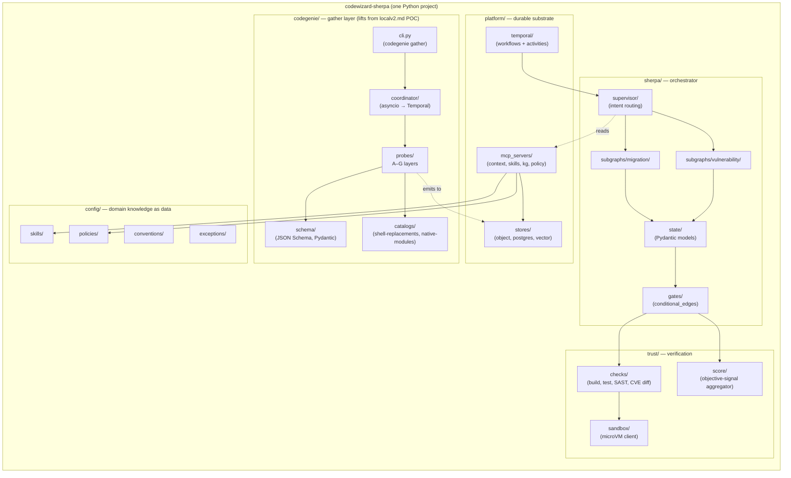

**Reading guide.** Five top-level packages, each owning one layer of the architecture: `codegenie/` (gather), `sherpa/` (orchestrator), `trust/` (verification), `platform/` (durable substrate), `config/` (organizational data). The probe contract in `codegenie/probes/` is the same ABC used by the POC — no rewrite at service-time. New languages or task types add subdirectories (`probes/java/`, `subgraphs/lang_upgrade/`) without touching existing code (commitment §2.5).

### 8.4 Physical view — deployment topology

How the components map onto running infrastructure. K8s-first, with a dedicated sandbox cluster for isolation.

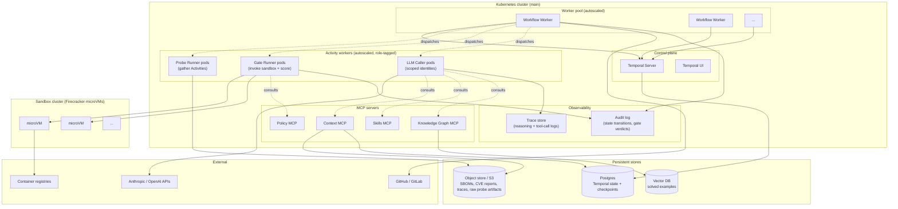

**Reading guide.** Temporal cluster is the durable substrate; workflow workers and activity workers autoscale independently (activity workers are heavier per pod). The sandbox cluster runs Firecracker microVMs in a separate trust boundary — gate runners RPC into it but never share a kernel with it. MCP servers are per-stage to keep authorization scopes clean (§7 deferred decision). Trace store + audit log are the observability backbone — every state transition and gate verdict is persisted for compliance review and drift detection.

### 8.5 Scenarios (+1) — vulnerability and migration walkthroughs

The +1 view validates the other four by walking concrete user stories through them. Two scenarios; both end at PR creation because **humans always merge** (commitment §2.8).

#### Scenario A: Single-CVE remediation (restrictive subgraph, high-rigor gates)

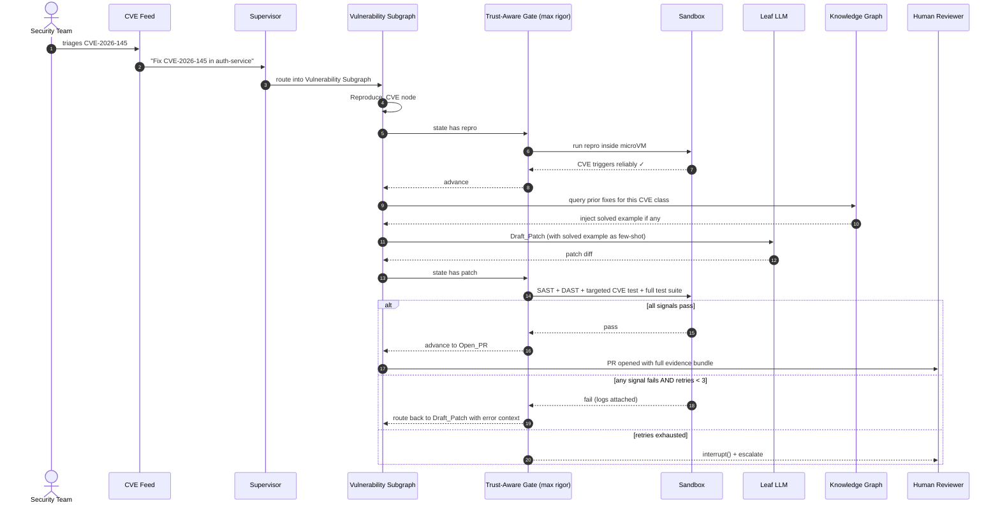

**What this proves.** The vulnerability scenario is short, restrictive, and gate-heavy. The agent cannot drift outside `Reproduce → Draft_Patch → Open_PR`. Three failed `Draft_Patch` attempts trigger human escalation rather than silent fallthrough. Knowledge-graph lookup runs *before* the LLM call, reducing token spend on patterns we've already solved.

#### Scenario B: Org-wide migration (N parallel agents, knowledge-graph reuse)

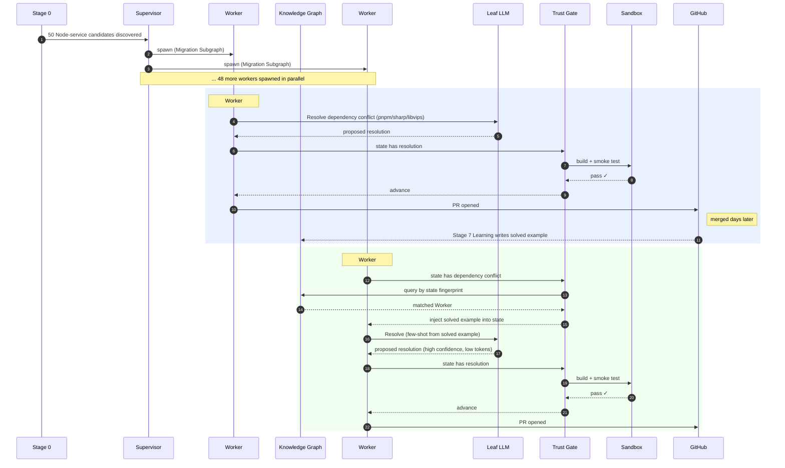

**What this proves.** The migration scenario shows portfolio-scale fan-out with cross-worker learning. Worker #45 benefits from Worker #2's earlier success without coordination overhead — the Knowledge Graph mediates. Token spend on Worker #45 drops dramatically because the LLM is doing few-shot pattern matching against a proven solution, not exploring the space cold. Failures in any one worker do not affect the others (parallel isolation guaranteed by Temporal).

### 8.6 Persona view — who fires when (supplementary)

A swimlane visualization of the table in §3.1. The horizontal axis is the 7-stage pipeline progression (left to right); each bar shows when that persona is active. Bars rendered as `crit` (red/amber in most Mermaid renderers) mark **LLM-using personas** so the LLM touchpoints stand out at a glance.

```mermaid
gantt
    title Persona activity across the 7-stage pipeline (red = LLM-using)
    dateFormat X
    axisFormat S%s

    section Cross-cutting
    Supervisor (Hierarchical Planner)    :crit, 0, 8
    Trust-Aware Gate                     :1, 6
    Policy Engine (RuleZ pattern)        :0, 8

    section S0 Discovery
    Discovery Scanner                    :0, 1

    section S1 Assessment
    Language Router                      :1, 2
    Node Assessor                        :crit, 1, 2
    Python Assessor                      :crit, 1, 2

    section S2 Deep Scan
    Probe Coordinator                    :2, 3
    Probes A–G (parallel)                :2, 3

    section S3 Planning
    Recipe Matcher                       :3, 4
    Solved-Example RAG Retriever         :3, 4
    LLM Planner (fallback)               :crit, 3, 4
    Step Emitter                         :3, 4

    section S4 Execution
    Human Executor (Phase 1)             :4, 5
    Autonomous Executor (Phase 2+)       :crit, 4, 5
    Error Triage Specialist              :crit, 4, 5

    section S5 Validation
    Sandbox Runner (Env Agent)           :5, 6
    SAST/DAST Runner                     :5, 6
    CVE Delta Comparator                 :5, 6
    Prove-It Asserter                    :5, 6
    LLM Judge (rare)                     :crit, 5, 6

    section S6 Handoff
    PR Opener                            :6, 7
    CODEOWNERS Notifier                  :6, 7
    Webhook Listener (passive)           :6, 7

    section S7 Learning
    Solved-Example Recorder              :7, 8
    Knowledge Graph Updater              :7, 8
    Retro PR Author                      :7, 8
    Telemetry Emitter                    :7, 8
```

**Reading guide.** The Supervisor and Policy Engine span the full workflow. The Trust-Aware Gate fires across Stages 1–5 wherever a SHERPA subgraph has state transitions (it is dormant in the purely deterministic Stages 0, 6, 7). LLM-using personas (red bars) cluster in three places: assessment (Stage 1), planning fallback + autonomous execution (Stages 3–4), and the rare functional-equivalence adjudication (Stage 5). Everything else is deterministic — visible at a glance as the non-red majority.

This view is the cleanest way to answer "is this stage LLM-touching?" or "which personas need their context window budgeted?" — both are common operational questions that don't map cleanly to any of the canonical 4+1 views.

### 8.7 Component view — boundaries, interfaces, and what's swappable

The Logical view (§8.1) shows runtime relationships. The Component view shows **what can be replaced independently**. Components are color-coded by stability: green = stable contracts that don't change without versioning, orange = swappable runtimes whose specific implementation is deferred (§7), purple = persistent stores.

The interfaces are the contract surface. Anything inside the green-stable boxes can be reworked freely as long as the interface shape holds. Anything in the orange-swappable boxes can be swapped wholesale without touching the green core.

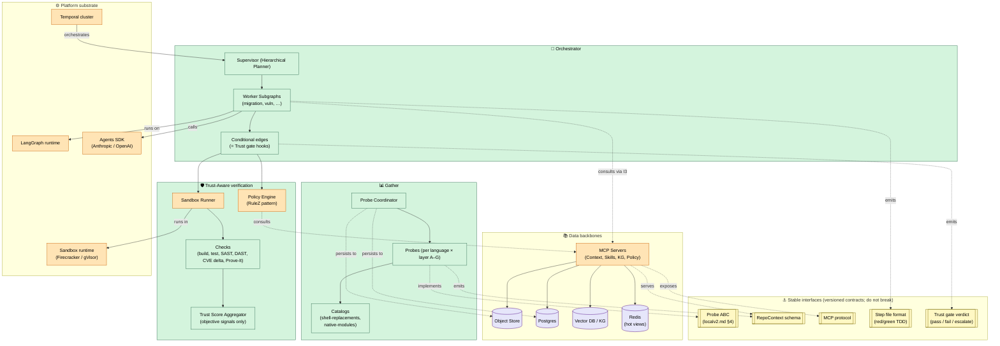

**Reading guide.** Five named components (Gather, Orchestrator, Trust, Data, Platform) plus five stable interfaces sitting between them. The interface layer is what makes the architecture replaceable layer-by-layer: if LangGraph is replaced by a different state-machine runtime, the orchestrator's emitted step files (I4) and the gate verdicts (I5) don't change — so trust and gather are untouched. If Postgres is swapped for Redis as the checkpointer, the MCP protocol (I3) the orchestrator depends on doesn't move. The probe ABC (I1) is the single most load-bearing interface; bugs there propagate to the entire downstream system, which is why the POC reviews that contract before service lift.

**This is hexagonal architecture, explicit.** The five stable interfaces above are *ports* in the ports-and-adapters sense; the implementations on each side are *adapters*. The Gather component's probes adapt external tools (semgrep, syft, scip-typescript, tree-sitter) to the probe ABC port (I1). The MCP servers adapt the storage backends (Postgres, object store, Redis, vector DB) to the MCP protocol port (I3). The plugin layer (§4.8, [ADR-0031](adrs/0031-plugin-architecture.md)) introduces additional ports — the query primitive interfaces of [ADR-0030](adrs/0030-graph-aware-context-queries.md) — wired to language-specific adapters via [ADR-0032](adrs/0032-language-search-adapters.md). The kernel (Orchestrator + Trust) depends only on the port abstractions; concrete adapters are swappable at the boundary without touching the kernel. Dependency inversion is the rule: kernel components import Protocol interfaces, never concrete classes. The discipline that makes this watertight at the type level — newtype-per-identifier, smart constructors, tagged unions, illegal states unrepresentable — is captured in [ADR-0033](adrs/0033-domain-modeling-discipline.md). The complementary discipline for *what happens over time* — an append-only typed event log feeding every observability / audit / learning concern as a projection — is captured in [ADR-0034](adrs/0034-event-sourcing-canonical-primitive.md).

### 8.8 Worker subgraph state machine (Migration Subgraph example)

The §4.1 prose says "nodes never call other nodes; transitions are driven by state contents." This view makes that concrete with a formal state machine for one subgraph type. Every node has the same gate behavior: pass → advance; fail → route back; exhaust → escalate. The repetition is the point — it's the SHERPA discipline rendered as topology.

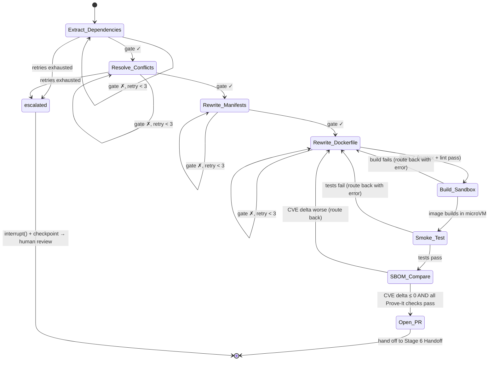

**Reading guide.** Read top-to-bottom: linear happy path on the right (✓ transitions), retry loops as self-edges, escalation arrows merging into the `escalated` terminal state which checkpoints and pages a human. The Vulnerability Subgraph follows the same shape with fewer nodes (`Reproduce_CVE → Draft_Patch → Build_Sandbox → Run_Security_Suite → Open_PR`) and tighter gate thresholds. New task types add a new state machine of this shape without touching existing ones (commitment §2.5). Building a third subgraph is when shared structure becomes safe to extract; resist abstracting earlier (§7 deferred decision).

### 8.9 Trust-Aware gate decision flow

The §4.1 description of Trust-Aware gates is prose; this view is the same logic as a decision tree. The full flow runs *every time* a worker emits a state delta. Sub-10ms for the policy check; seconds-to-minutes for the sandbox checks depending on what's being verified.

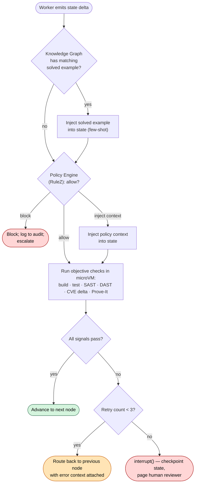

**Reading guide.** Three terminal outcomes — green (advance), amber (route back with context, retry), red (escalate to human). The Knowledge Graph lookup happens *before* the LLM is ever consulted, which is what makes cross-worker learning effective at portfolio scale (§4.5 Scenario B). The Policy Engine is the deterministic guard against unsafe tool calls — `git push --force`, modifying files outside the repo, calling external APIs not in the allowlist — and it operates at sub-10ms latency per the RuleZ pattern. The objective-signals-only constraint from §4.6 lives here: the `All signals pass?` check reads sandbox evidence, never LLM self-reported confidence.

### 8.10 Cost view — where money is spent and where ROI is measured

The system's economic model lives in the architecture itself (§3.3, commitment §2.9). This view shows the cost-emission sources on the left, the aggregation pipeline in the middle, and the consumers (budget enforcer, dashboards, gate inputs) on the right. Every Activity emits to the same cost ledger; the ledger feeds both enforcement (don't burn money over the cap) and ROI calculation (was the money well spent?).

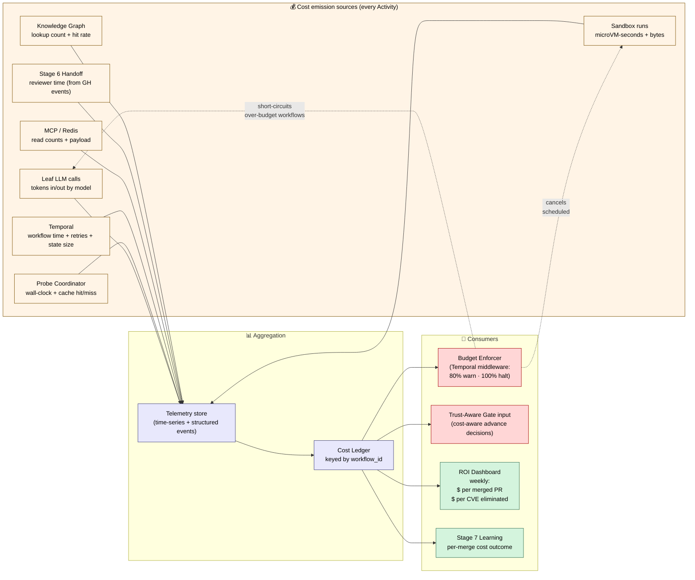

**Reading guide.** Seven cost-emission points (yellow), one ledger (purple), four downstream consumers (red = enforcement, green = reporting). The Budget Enforcer is bidirectional: it reads the ledger to check spend, and short-circuits emission sources (LLM calls, sandbox runs) when caps are hit — those dashed arrows are the feedback that prevents runaway cost. The Trust-Aware Gate consults the ledger as another input alongside its objective sandbox signals (§4.6); when budget is near exhaustion, the gate prefers the cheaper recipe path even at the cost of broader coverage. The ROI Dashboard surfaces the two headline ratios from §3.3: cost per merged PR and cost per CVE eliminated, computed weekly from the ledger and Stage 7 Learning outputs.

Cost ceases to be an out-of-band operational concern and becomes a state-machine signal alongside everything else.

---

*Last updated as the canonical production-target reference. Changes to load-bearing commitments (§2) or to the Layered Hybrid orchestration model (§4) require updating this document and re-aligning the POC roadmap.*
